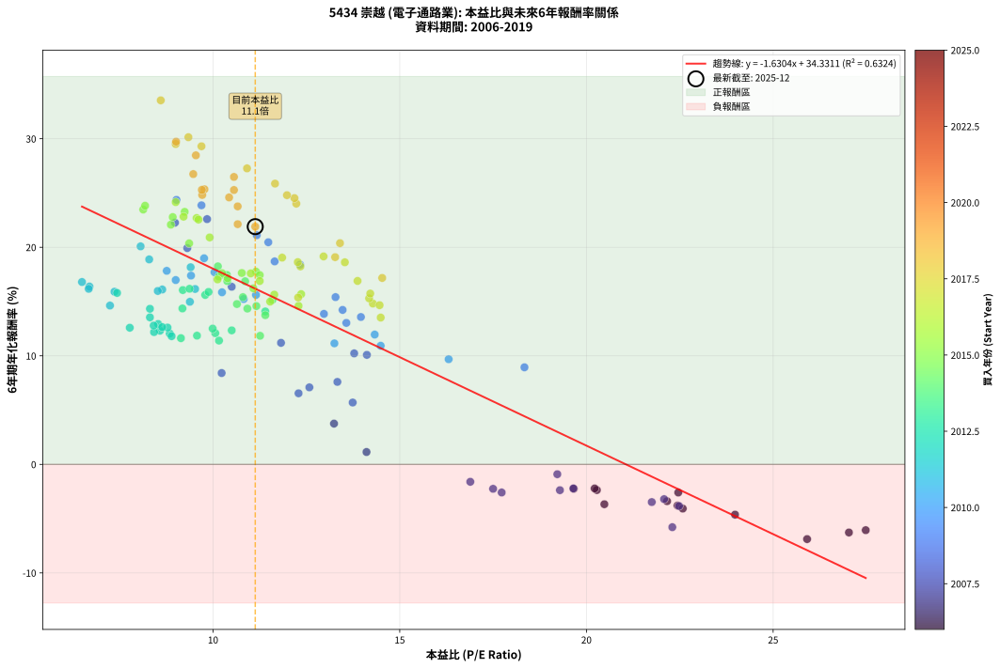
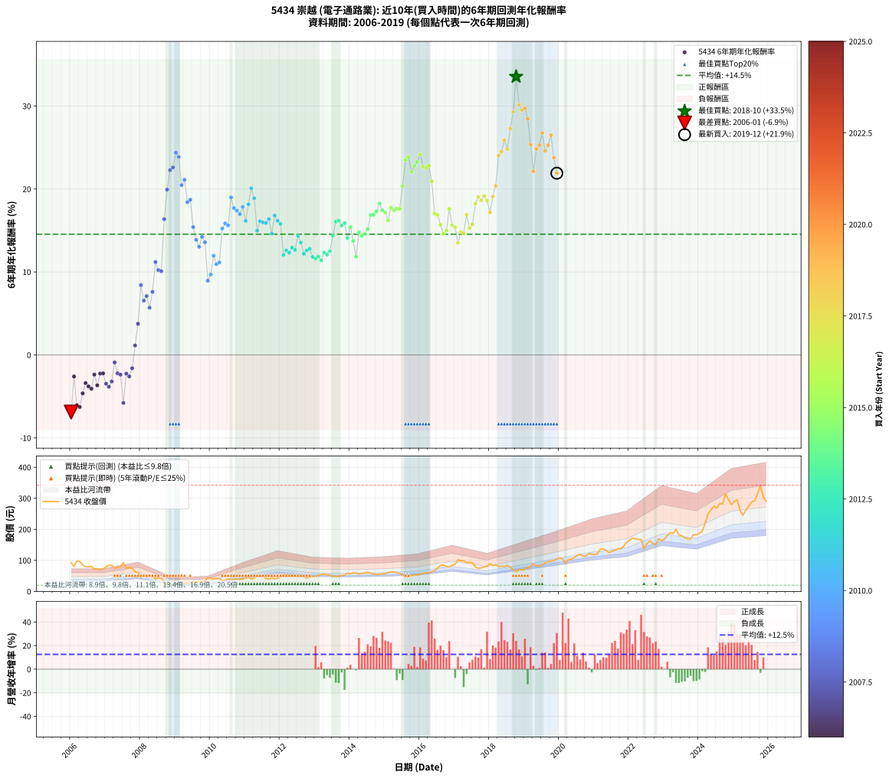

# 5434 崇越 - 本益比與未來報酬率分析

!!! info "報告資訊"
    - **股票代號**: 5434
    - **公司名稱**: 崇越
    - **產業別**: 電子通路業
    - **分析期間**: 2006-2019 (168 個數據點)
    - **資料來源**: Type 12 (ShowMonthlyK_ChartFlow) 月收盤價與本益比
    - **報酬率口徑**: 含現金股利 (簡化: 年度合計，假設每年7/1入帳)
    - **報告生成時間**: 2026-01-06 01:05:20 CST

## 📈 視覺化圖表

### 圖表1: 本益比 vs 未來報酬率關係

*圖表1：5434 崇越 本益比與6年期未來報酬率關係 (2006-2019)*

### 圖表2: 歷年買入時點的6年期實際報酬率

*圖表2：5434 崇越 歷年買入時點的6年期實際報酬率 (2006-2019)*

## 📍 買點訊號說明

本報告提供兩種買點提示訊號（顯示於圖表2的股價子圖中）：

### ▲ 小綠色三角形（回測驗證）
- **計算方式**: 使用全部歷史資料計算本益比第25百分位數
- **用途**: 事後驗證，顯示歷史上哪些時點確實為低估區
- **限制**: 當下無法判斷，僅供回測參考
- **特性**: 後見之明（Look-Ahead Bias）

### ▲ 小橘色三角形（即時訊號）
- **計算方式**: 使用截至當月的過去5年資料計算本益比第25百分位數
- **用途**: 實際投資決策，當時即可判斷
- **優勢**: 可操作性強，符合實務需求
- **特性**: 無後見之明，滾動窗口計算

!!! tip "如何使用兩種訊號"
    - **綠色▲** 幫助理解歷史估值機會，驗證策略有效性
    - **橘色▲** 可作為實際買進參考，但仍需搭配基本面分析
    - 兩種訊號重疊時，表示即時判斷與事後驗證一致，信心度較高
    - 僅有綠色▲時，表示當時無法判斷（需要未來資料才能確認）
    - 僅有橘色▲時，表示即時判斷為買點，但事後可能不是最佳時機

## 📊 估值分析摘要

| 指標 | 數值 |
|:---:|:---:|
| **目前本益比** (2019-12) | **11.13 倍** |
| **歷史平均本益比** | 12.14 倍 |
| **估值水準** | 🟡 合理範圍 |
| **預期6年年化報酬率** | **+16.19%** |
| **歷史平均報酬率** | +14.55% |
| **相關係數 (R²)** | 0.6324 |
| **趨勢線斜率** | -1.6304 |

!!! abstract "核心洞察"
    目前本益比接近歷史平均，預期報酬率符合長期趨勢

    根據歷史數據回測，5434 崇越 在目前本益比 **11.1倍** 的估值水準下，
    預期未來6年年化報酬率約為 **+16.2%**。

    **重要提醒**: 本分析基於歷史數據統計，實際報酬率會受到公司基本面變化、產業趨勢、
    總體經濟環境等多重因素影響。R² = 0.63 表示本益比可解釋約 63.2% 的報酬率變異。

## 📈 歷史估值統計

### 最佳買點 (最高報酬率)

| 項目 | 數值 |
|:---:|:---:|
| 起始時間 | 2018-10 |
| 當時本益比 | 8.60 倍 |
| 起始價格 | 64.0 元 |
| 6年後價格 | 314.5 元 |
| **6年年化報酬率** | **+33.54%** |

### 最差買點 (最低報酬率)

| 項目 | 數值 |
|:---:|:---:|
| 起始時間 | 2006-01 |
| 當時本益比 | 25.91 倍 |
| 起始價格 | 92.5 元 |
| 6年後價格 | 46.9 元 |
| **6年年化報酬率** | **-6.88%** |

## 🎯 投資啟示

### 本益比與報酬率關係

趨勢線方程式: **y = -1.6304x + 34.3311**

!!! warning "強負相關"
    本益比與未來報酬率呈現強負相關。在高本益比時期買入，未來報酬率顯著較低；
    在低本益比時期買入，未來報酬率顯著較高。**估值紀律至關重要**。

### 估值區間建議

基於歷史數據分析:

- **🟢 低估區** (P/E < 9.7): 預期報酬率較高，可考慮增加持股
- **🟡 合理區** (P/E 9.7-14.6): 預期報酬率符合長期趨勢，正常持有
- **🔴 高估區** (P/E > 14.6): 預期報酬率較低，可考慮減碼或觀望

!!! danger "風險提示"
    - 過去表現不代表未來結果
    - 本分析假設公司基本面無重大結構性變化
    - 產業環境劇變可能使歷史規律失效
    - 應結合公司財報、產業趨勢、總體經濟等多重因素綜合判斷

!!! success "長期投資觀點"
    歷史數據顯示，在合理或低估的估值水準買入並長期持有，
    往往能獲得較佳的投資報酬。**耐心等待好價格**是價值投資的核心原則。

## 📊 數據品質

- **資料來源**: GoodInfo.tw Type 12 (ShowMonthlyK_ChartFlow)
- **資料頻率**: 月度收盤價與本益比
- **回測期間**: 2006-2019
- **數據點數量**: 168 個 (每個點代表一次6年期回測)

### 計算方法說明

1. **6年期年化報酬率**:
   - 對每個歷史時點，計算其後6年的實際投資報酬率
   - 期末價值(不含股利): 期末價格
   - 期末價值(含現金股利): 期末價格 + 持有期間內的現金股利合計 (簡化: 年度合計，假設每年7/1入帳)
   - 公式: 年化報酬率 = [(期末價值/期初價格)^(1/年數) - 1] × 100%

2. **本益比 (P/E Ratio)**:
   - 使用當時的月收盤價與EPS計算
   - 資料來源: Type 12 月度河流圖本益比數據

3. **趨勢線 (Linear Regression)**:
   - 使用最小平方法擬合線性趨勢線
   - R²值衡量本益比對報酬率的解釋能力

---

*本報告由 Stock Analysis System v1.9.0 自動生成*
*數據更新時間: 2026-01-06 01:05:20 CST*

## 📋 月度回測明細表

（每一列對應時間線圖中的一個買入點；可用來對照 SVG 圖上的每個點。）

| 買入月份 | 賣出月份 | 回測期限_年 | 實際持有年數 | 買入本益比_倍 | 買入收盤價_元 | 賣出收盤價_元 | 現金股利合計_元 | 總報酬率_pct | 年化報酬率_pct |
| --- | --- | --- | --- | --- | --- | --- | --- | --- | --- |
| 2006-01 | 2012-01 | 6 | 5.999 | 25.91 | 92.50 | 46.90 | 13.40 | -34.81 | -6.88 |
| 2006-02 | 2012-02 | 6 | 5.999 | 22.46 | 80.20 | 55.10 | 13.40 | -14.59 | -2.59 |
| 2006-03 | 2012-03 | 6 | 6.001 | 27.48 | 98.10 | 54.00 | 13.40 | -31.29 | -6.06 |
| 2006-04 | 2012-04 | 6 | 6.001 | 27.03 | 96.50 | 52.00 | 13.40 | -32.23 | -6.28 |
| 2006-05 | 2012-05 | 6 | 6.001 | 23.98 | 85.60 | 51.00 | 13.40 | -24.77 | -4.63 |
| 2006-06 | 2012-06 | 6 | 6.001 | 22.16 | 79.10 | 50.90 | 13.40 | -18.71 | -3.39 |
| 2006-07 | 2012-07 | 6 | 6.001 | 22.44 | 80.10 | 48.30 | 15.20 | -20.72 | -3.80 |
| 2006-08 | 2012-08 | 6 | 6.001 | 22.58 | 80.60 | 47.60 | 15.20 | -22.08 | -4.07 |
| 2006-09 | 2012-09 | 6 | 6.001 | 20.28 | 72.40 | 47.50 | 15.20 | -13.40 | -2.37 |
| 2006-10 | 2012-10 | 6 | 6.001 | 20.48 | 73.10 | 43.20 | 15.20 | -20.11 | -3.67 |
| 2006-11 | 2012-11 | 6 | 6.001 | 19.66 | 70.20 | 46.05 | 15.20 | -12.75 | -2.25 |
| 2006-12 | 2012-12 | 6 | 6.001 | 20.22 | 72.20 | 47.90 | 15.20 | -12.60 | -2.22 |
| 2007-01 | 2013-01 | 6 | 6.001 | 21.75 | 79.50 | 49.10 | 15.20 | -19.12 | -3.47 |
| 2007-02 | 2013-02 | 6 | 6.001 | 22.48 | 84.10 | 51.30 | 15.20 | -20.93 | -3.84 |
| 2007-03 | 2013-03 | 6 | 6.001 | 22.08 | 84.50 | 54.30 | 15.20 | -17.75 | -3.20 |
| 2007-04 | 2013-04 | 6 | 6.001 | 19.22 | 75.20 | 56.00 | 15.20 | -5.32 | -0.91 |
| 2007-05 | 2013-05 | 6 | 6.001 | 19.65 | 78.60 | 53.50 | 15.20 | -12.60 | -2.22 |
| 2007-06 | 2013-06 | 6 | 6.001 | 19.29 | 78.80 | 53.00 | 15.20 | -13.45 | -2.38 |
| 2007-07 | 2013-07 | 6 | 6.001 | 22.30 | 93.00 | 48.55 | 16.48 | -30.07 | -5.79 |
| 2007-08 | 2013-08 | 6 | 6.001 | 17.50 | 74.50 | 48.50 | 16.48 | -12.78 | -2.25 |
| 2007-09 | 2013-09 | 6 | 6.001 | 17.73 | 77.00 | 49.30 | 16.48 | -14.57 | -2.59 |
| 2007-10 | 2013-10 | 6 | 6.001 | 16.89 | 74.80 | 51.40 | 16.48 | -9.25 | -1.60 |
| 2007-11 | 2013-11 | 6 | 6.001 | 14.11 | 63.70 | 51.70 | 16.48 | +7.03 | +1.14 |
| 2007-12 | 2013-12 | 6 | 6.001 | 13.24 | 60.90 | 59.50 | 16.48 | +24.76 | +3.76 |
| 2008-01 | 2014-01 | 6 | 6.001 | 10.23 | 45.00 | 56.60 | 16.48 | +62.40 | +8.42 |
| 2008-02 | 2014-03 | 6 | 6.081 | 12.29 | 51.60 | 59.40 | 16.48 | +47.06 | +6.55 |
| 2008-03 | 2014-03 | 6 | 5.999 | 12.58 | 50.30 | 59.40 | 16.48 | +50.86 | +7.09 |
| 2008-04 | 2014-04 | 6 | 5.999 | 13.74 | 52.20 | 56.30 | 16.48 | +39.43 | +5.70 |
| 2008-05 | 2014-05 | 6 | 5.999 | 13.33 | 48.00 | 58.00 | 16.48 | +55.17 | +7.60 |
| 2008-06 | 2014-06 | 6 | 5.999 | 11.82 | 40.20 | 59.50 | 16.48 | +89.01 | +11.20 |
| 2008-07 | 2014-07 | 6 | 5.999 | 13.78 | 44.10 | 62.00 | 17.08 | +79.32 | +10.23 |
| 2008-08 | 2014-08 | 6 | 5.999 | 14.12 | 42.35 | 58.30 | 17.08 | +78.00 | +10.09 |
| 2008-09 | 2014-09 | 6 | 5.999 | 10.50 | 29.40 | 55.90 | 17.08 | +148.23 | +16.37 |
| 2008-10 | 2014-10 | 6 | 5.999 | 9.31 | 24.20 | 54.90 | 17.08 | +197.44 | +19.93 |
| 2008-11 | 2014-11 | 6 | 5.999 | 8.98 | 21.55 | 54.90 | 17.08 | +234.02 | +22.27 |
| 2008-12 | 2014-12 | 6 | 5.999 | 9.84 | 21.65 | 56.40 | 17.08 | +239.40 | +22.60 |
| 2009-01 | 2015-01 | 6 | 5.999 | 9.02 | 20.00 | 56.90 | 17.08 | +269.90 | +24.37 |
| 2009-02 | 2015-02 | 6 | 5.999 | 9.69 | 21.65 | 61.10 | 17.08 | +261.11 | +23.87 |
| 2009-03 | 2015-03 | 6 | 5.999 | 11.48 | 25.85 | 61.90 | 17.08 | +205.54 | +20.47 |
| 2009-04 | 2015-04 | 6 | 5.999 | 11.17 | 25.35 | 62.90 | 17.08 | +215.51 | +21.11 |
| 2009-05 | 2015-05 | 6 | 5.999 | 12.33 | 28.20 | 60.60 | 17.08 | +175.46 | +18.40 |
| 2009-06 | 2015-06 | 6 | 5.999 | 11.65 | 26.85 | 58.00 | 17.08 | +179.63 | +18.70 |
| 2009-07 | 2015-07 | 6 | 5.999 | 13.28 | 30.85 | 53.40 | 19.48 | +136.24 | +15.41 |
| 2009-08 | 2015-08 | 6 | 5.999 | 12.97 | 30.35 | 46.65 | 19.48 | +117.89 | +13.86 |
| 2009-09 | 2015-09 | 6 | 5.999 | 13.57 | 32.00 | 47.25 | 19.48 | +108.53 | +13.03 |
| 2009-10 | 2015-10 | 6 | 5.999 | 13.47 | 32.00 | 51.60 | 19.48 | +122.13 | +14.23 |
| 2009-11 | 2015-11 | 6 | 5.999 | 13.96 | 33.40 | 52.20 | 19.48 | +114.61 | +13.58 |
| 2009-12 | 2015-12 | 6 | 5.999 | 18.34 | 44.20 | 54.40 | 19.48 | +67.15 | +8.94 |
| 2010-01 | 2016-01 | 6 | 5.999 | 16.31 | 42.20 | 54.00 | 19.48 | +74.13 | +9.69 |
| 2010-02 | 2016-02 | 6 | 5.999 | 14.33 | 39.60 | 58.50 | 19.48 | +96.92 | +11.96 |
| 2010-03 | 2016-03 | 6 | 6.001 | 14.49 | 42.60 | 59.90 | 19.48 | +86.34 | +10.93 |
| 2010-04 | 2016-04 | 6 | 6.001 | 13.25 | 41.30 | 58.40 | 19.48 | +88.57 | +11.15 |
| 2010-05 | 2016-05 | 6 | 6.001 | 10.82 | 35.65 | 64.00 | 19.48 | +134.17 | +15.23 |
| 2010-06 | 2016-06 | 6 | 6.001 | 10.24 | 35.55 | 66.50 | 19.48 | +141.86 | +15.85 |
| 2010-07 | 2016-07 | 6 | 6.001 | 11.15 | 40.65 | 75.20 | 21.88 | +138.82 | +15.61 |
| 2010-08 | 2016-08 | 6 | 6.001 | 9.76 | 37.30 | 84.00 | 21.88 | +183.86 | +18.99 |
| 2010-09 | 2016-09 | 6 | 6.001 | 10.04 | 40.15 | 84.90 | 21.88 | +165.96 | +17.70 |
| 2010-10 | 2016-10 | 6 | 6.001 | 9.41 | 39.30 | 81.00 | 21.88 | +161.78 | +17.39 |
| 2010-11 | 2016-11 | 6 | 6.001 | 9.00 | 39.20 | 78.60 | 21.88 | +156.33 | +16.98 |
| 2010-12 | 2016-12 | 6 | 6.001 | 8.76 | 39.70 | 84.40 | 21.88 | +167.71 | +17.83 |
| 2011-01 | 2017-01 | 6 | 6.001 | 9.52 | 44.60 | 87.70 | 21.88 | +145.70 | +16.16 |
| 2011-02 | 2017-02 | 6 | 6.001 | 9.40 | 45.50 | 102.00 | 21.88 | +172.27 | +18.16 |
| 2011-03 | 2017-03 | 6 | 6.001 | 8.06 | 40.30 | 99.00 | 21.88 | +199.95 | +20.09 |
| 2011-04 | 2017-04 | 6 | 6.001 | 8.29 | 42.70 | 98.70 | 21.88 | +182.39 | +18.88 |
| 2011-05 | 2017-05 | 6 | 6.001 | 9.38 | 49.80 | 93.20 | 21.88 | +131.09 | +14.98 |
| 2011-06 | 2017-06 | 6 | 6.001 | 8.64 | 47.20 | 93.80 | 21.88 | +145.09 | +16.11 |
| 2011-07 | 2017-07 | 6 | 6.001 | 8.52 | 47.90 | 92.50 | 24.08 | +143.38 | +15.98 |
| 2011-08 | 2017-08 | 6 | 6.001 | 7.36 | 42.50 | 79.00 | 24.08 | +142.54 | +15.91 |
| 2011-09 | 2017-09 | 6 | 6.001 | 6.69 | 39.70 | 74.60 | 24.08 | +148.57 | +16.38 |
| 2011-10 | 2017-10 | 6 | 6.001 | 7.24 | 44.10 | 76.00 | 24.08 | +126.94 | +14.63 |
| 2011-11 | 2017-11 | 6 | 6.001 | 6.49 | 40.55 | 78.90 | 24.08 | +153.96 | +16.80 |
| 2011-12 | 2017-12 | 6 | 6.001 | 6.67 | 42.70 | 80.90 | 24.08 | +145.86 | +16.17 |
| 2012-01 | 2018-01 | 6 | 6.001 | 7.43 | 46.90 | 89.00 | 24.08 | +141.11 | +15.79 |
| 2012-02 | 2018-03 | 6 | 6.081 | 8.84 | 55.10 | 86.00 | 24.08 | +99.78 | +12.05 |
| 2012-03 | 2018-03 | 6 | 5.999 | 8.78 | 54.00 | 86.00 | 24.08 | +103.85 | +12.61 |
| 2012-04 | 2018-04 | 6 | 5.999 | 8.58 | 52.00 | 80.30 | 24.08 | +100.73 | +12.32 |
| 2012-05 | 2018-05 | 6 | 5.999 | 8.53 | 51.00 | 81.70 | 24.08 | +107.41 | +12.93 |
| 2012-06 | 2018-06 | 6 | 5.999 | 8.64 | 50.90 | 79.90 | 24.08 | +104.28 | +12.65 |
| 2012-07 | 2018-07 | 6 | 5.999 | 8.31 | 48.30 | 83.90 | 23.98 | +123.36 | +14.34 |
| 2012-08 | 2018-08 | 6 | 5.999 | 8.31 | 47.60 | 78.00 | 23.98 | +114.25 | +13.54 |
| 2012-09 | 2018-09 | 6 | 5.999 | 8.42 | 47.50 | 70.70 | 23.98 | +99.33 | +12.19 |
| 2012-10 | 2018-10 | 6 | 5.999 | 7.77 | 43.20 | 64.00 | 23.98 | +103.66 | +12.59 |
| 2012-11 | 2018-11 | 6 | 5.999 | 8.41 | 46.05 | 70.80 | 23.98 | +105.82 | +12.79 |
| 2012-12 | 2018-12 | 6 | 5.999 | 8.89 | 47.90 | 69.60 | 23.98 | +95.37 | +11.81 |
| 2013-01 | 2019-01 | 6 | 5.999 | 9.14 | 49.10 | 71.00 | 23.98 | +93.44 | +11.63 |
| 2013-02 | 2019-02 | 6 | 5.999 | 9.57 | 51.30 | 76.50 | 23.98 | +95.87 | +11.86 |
| 2013-03 | 2019-03 | 6 | 5.999 | 10.16 | 54.30 | 79.80 | 23.98 | +91.13 | +11.40 |
| 2013-04 | 2019-04 | 6 | 5.999 | 10.50 | 56.00 | 88.60 | 23.98 | +101.04 | +12.35 |
| 2013-05 | 2019-05 | 6 | 5.999 | 10.06 | 53.50 | 82.10 | 23.98 | +98.28 | +12.09 |
| 2013-06 | 2019-06 | 6 | 5.999 | 9.99 | 53.00 | 83.50 | 23.98 | +102.79 | +12.51 |
| 2013-07 | 2019-07 | 6 | 5.999 | 9.18 | 48.55 | 82.90 | 25.70 | +123.69 | +14.36 |
| 2013-08 | 2019-08 | 6 | 5.999 | 9.19 | 48.50 | 92.80 | 25.70 | +144.33 | +16.06 |
| 2013-09 | 2019-09 | 6 | 5.999 | 9.37 | 49.30 | 95.50 | 25.70 | +145.84 | +16.18 |
| 2013-10 | 2019-10 | 6 | 5.999 | 9.79 | 51.40 | 97.00 | 25.70 | +138.72 | +15.61 |
| 2013-11 | 2019-11 | 6 | 5.999 | 9.88 | 51.70 | 99.50 | 25.70 | +142.17 | +15.89 |
| 2013-12 | 2019-12 | 6 | 5.999 | 11.40 | 59.50 | 105.50 | 25.70 | +120.50 | +14.09 |
| 2014-01 | 2020-01 | 6 | 5.999 | 10.80 | 56.60 | 108.00 | 25.70 | +136.22 | +15.41 |
| 2014-02 | 2020-02 | 6 | 5.999 | 11.40 | 59.90 | 104.00 | 25.70 | +116.53 | +13.74 |
| 2014-03 | 2020-03 | 6 | 6.001 | 11.26 | 59.40 | 90.60 | 25.70 | +95.79 | +11.85 |
| 2014-04 | 2020-04 | 6 | 6.001 | 10.64 | 56.30 | 103.00 | 25.70 | +128.60 | +14.77 |
| 2014-05 | 2020-05 | 6 | 6.001 | 10.92 | 58.00 | 104.00 | 25.70 | +123.62 | +14.35 |
| 2014-06 | 2020-06 | 6 | 6.001 | 11.16 | 59.50 | 109.00 | 25.70 | +126.39 | +14.59 |
| 2014-07 | 2020-07 | 6 | 6.001 | 11.59 | 62.00 | 116.00 | 28.60 | +133.23 | +15.15 |
| 2014-08 | 2020-08 | 6 | 6.001 | 10.86 | 58.30 | 120.00 | 28.60 | +154.89 | +16.87 |
| 2014-09 | 2020-09 | 6 | 6.001 | 10.38 | 55.90 | 114.00 | 28.60 | +155.10 | +16.89 |
| 2014-10 | 2020-10 | 6 | 6.001 | 10.16 | 54.90 | 114.50 | 28.60 | +160.66 | +17.31 |
| 2014-11 | 2020-11 | 6 | 6.001 | 10.13 | 54.90 | 121.50 | 28.60 | +173.41 | +18.25 |
| 2014-12 | 2020-12 | 6 | 6.001 | 10.37 | 56.40 | 119.50 | 28.60 | +162.59 | +17.45 |
| 2015-01 | 2021-01 | 6 | 6.001 | 10.39 | 56.90 | 118.50 | 28.60 | +158.52 | +17.15 |
| 2015-02 | 2021-02 | 6 | 6.001 | 11.08 | 61.10 | 122.00 | 28.60 | +146.48 | +16.22 |
| 2015-03 | 2021-03 | 6 | 6.001 | 11.15 | 61.90 | 136.50 | 28.60 | +166.72 | +17.76 |
| 2015-04 | 2021-04 | 6 | 6.001 | 11.25 | 62.90 | 136.50 | 28.60 | +162.48 | +17.44 |
| 2015-05 | 2021-05 | 6 | 6.001 | 10.77 | 60.60 | 132.00 | 28.60 | +165.02 | +17.63 |
| 2015-06 | 2021-06 | 6 | 6.001 | 10.24 | 58.00 | 125.00 | 28.60 | +164.83 | +17.62 |
| 2015-07 | 2021-07 | 6 | 6.001 | 9.36 | 53.40 | 129.50 | 32.90 | +204.12 | +20.36 |
| 2015-08 | 2021-08 | 6 | 6.001 | 8.13 | 46.65 | 132.50 | 32.90 | +254.56 | +23.48 |
| 2015-09 | 2021-09 | 6 | 6.001 | 8.18 | 47.25 | 137.50 | 32.90 | +260.63 | +23.83 |
| 2015-10 | 2021-10 | 6 | 6.001 | 8.87 | 51.60 | 138.00 | 32.90 | +231.20 | +22.08 |
| 2015-11 | 2021-11 | 6 | 6.001 | 8.92 | 52.20 | 146.00 | 32.90 | +242.72 | +22.78 |
| 2015-12 | 2021-12 | 6 | 6.001 | 9.24 | 54.40 | 158.00 | 32.90 | +250.92 | +23.27 |
| 2016-01 | 2022-01 | 6 | 6.001 | 9.00 | 54.00 | 165.00 | 32.90 | +266.48 | +24.16 |
| 2016-02 | 2022-03 | 6 | 6.081 | 9.56 | 58.50 | 170.00 | 32.90 | +246.84 | +22.69 |
| 2016-03 | 2022-03 | 6 | 5.999 | 9.61 | 59.90 | 170.00 | 32.90 | +238.73 | +22.55 |
| 2016-04 | 2022-04 | 6 | 5.999 | 9.21 | 58.40 | 167.50 | 32.90 | +243.15 | +22.82 |
| 2016-05 | 2022-05 | 6 | 5.999 | 9.91 | 64.00 | 167.00 | 32.90 | +212.34 | +20.91 |
| 2016-06 | 2022-06 | 6 | 5.999 | 10.12 | 66.50 | 138.00 | 32.90 | +156.99 | +17.04 |
| 2016-07 | 2022-07 | 6 | 5.999 | 11.25 | 75.20 | 154.00 | 37.80 | +155.05 | +16.89 |
| 2016-08 | 2022-08 | 6 | 5.999 | 12.36 | 84.00 | 163.50 | 37.80 | +139.64 | +15.68 |
| 2016-09 | 2022-09 | 6 | 5.999 | 12.29 | 84.90 | 154.50 | 37.80 | +126.50 | +14.60 |
| 2016-10 | 2022-10 | 6 | 5.999 | 11.53 | 81.00 | 149.50 | 37.80 | +131.23 | +15.00 |
| 2016-11 | 2022-11 | 6 | 5.999 | 11.01 | 78.60 | 170.00 | 37.80 | +164.38 | +17.59 |
| 2016-12 | 2022-12 | 6 | 5.999 | 11.64 | 84.40 | 164.00 | 37.80 | +139.10 | +15.64 |
| 2017-01 | 2023-01 | 6 | 5.999 | 12.28 | 87.70 | 169.00 | 37.80 | +135.80 | +15.37 |
| 2017-02 | 2023-02 | 6 | 5.999 | 14.49 | 102.00 | 180.50 | 37.80 | +114.02 | +13.52 |
| 2017-03 | 2023-03 | 6 | 5.999 | 14.28 | 99.00 | 189.00 | 37.80 | +129.09 | +14.82 |
| 2017-04 | 2023-04 | 6 | 5.999 | 14.46 | 98.70 | 186.50 | 37.80 | +127.25 | +14.67 |
| 2017-05 | 2023-05 | 6 | 5.999 | 13.87 | 93.20 | 200.00 | 37.80 | +155.15 | +16.90 |
| 2017-06 | 2023-06 | 6 | 5.999 | 14.18 | 93.80 | 182.50 | 37.80 | +134.86 | +15.30 |
| 2017-07 | 2023-07 | 6 | 5.999 | 14.21 | 92.50 | 179.50 | 42.80 | +140.32 | +15.74 |
| 2017-08 | 2023-08 | 6 | 5.999 | 12.34 | 79.00 | 173.00 | 42.80 | +173.16 | +18.24 |
| 2017-09 | 2023-09 | 6 | 5.999 | 11.85 | 74.60 | 169.50 | 42.80 | +184.58 | +19.05 |
| 2017-10 | 2023-10 | 6 | 5.999 | 12.27 | 76.00 | 169.00 | 42.80 | +178.68 | +18.63 |
| 2017-11 | 2023-11 | 6 | 5.999 | 12.96 | 78.90 | 183.00 | 42.80 | +186.19 | +19.16 |
| 2017-12 | 2023-12 | 6 | 5.999 | 13.53 | 80.90 | 182.50 | 42.80 | +178.49 | +18.62 |
| 2018-01 | 2024-01 | 6 | 5.999 | 14.53 | 89.00 | 187.50 | 42.80 | +158.76 | +17.17 |
| 2018-02 | 2024-02 | 6 | 5.999 | 13.27 | 83.20 | 194.50 | 42.80 | +185.22 | +19.09 |
| 2018-03 | 2024-03 | 6 | 6.001 | 13.40 | 86.00 | 219.00 | 42.80 | +204.42 | +20.38 |
| 2018-04 | 2024-04 | 6 | 6.001 | 12.23 | 80.30 | 249.50 | 42.80 | +264.01 | +24.02 |
| 2018-05 | 2024-05 | 6 | 6.001 | 12.18 | 81.70 | 262.00 | 42.80 | +273.07 | +24.53 |
| 2018-06 | 2024-06 | 6 | 6.001 | 11.66 | 79.90 | 275.00 | 42.80 | +297.75 | +25.87 |
| 2018-07 | 2024-07 | 6 | 6.001 | 11.98 | 83.90 | 268.50 | 48.60 | +277.95 | +24.80 |
| 2018-08 | 2024-08 | 6 | 6.001 | 10.91 | 78.00 | 283.00 | 48.60 | +325.12 | +27.27 |
| 2018-09 | 2024-09 | 6 | 6.001 | 9.69 | 70.70 | 282.00 | 48.60 | +367.61 | +29.31 |
| 2018-10 | 2024-10 | 6 | 6.001 | 8.60 | 64.00 | 314.50 | 48.60 | +467.34 | +33.54 |
| 2018-11 | 2024-11 | 6 | 6.001 | 9.34 | 70.80 | 295.50 | 48.60 | +386.01 | +30.14 |
| 2018-12 | 2024-12 | 6 | 6.001 | 9.00 | 69.60 | 280.00 | 48.60 | +372.12 | +29.51 |
| 2019-01 | 2025-01 | 6 | 6.001 | 9.01 | 71.00 | 290.00 | 48.60 | +376.90 | +29.73 |
| 2019-02 | 2025-02 | 6 | 6.001 | 9.54 | 76.50 | 295.50 | 48.60 | +349.80 | +28.47 |
| 2019-03 | 2025-03 | 6 | 6.001 | 9.77 | 79.80 | 261.00 | 48.60 | +287.97 | +25.35 |
| 2019-04 | 2025-04 | 6 | 6.001 | 10.66 | 88.60 | 245.50 | 48.60 | +231.94 | +22.13 |
| 2019-05 | 2025-05 | 6 | 6.001 | 9.71 | 82.10 | 262.00 | 48.60 | +278.32 | +24.82 |
| 2019-06 | 2025-06 | 6 | 6.001 | 9.70 | 83.50 | 274.50 | 48.60 | +286.94 | +25.29 |
| 2019-07 | 2025-07 | 6 | 6.001 | 9.47 | 82.90 | 288.50 | 55.29 | +314.70 | +26.75 |
| 2019-08 | 2025-08 | 6 | 6.001 | 10.43 | 92.80 | 292.00 | 55.29 | +274.23 | +24.60 |
| 2019-09 | 2025-09 | 6 | 6.001 | 10.56 | 95.50 | 314.00 | 55.29 | +286.69 | +25.28 |
| 2019-10 | 2025-10 | 6 | 6.001 | 10.56 | 97.00 | 342.00 | 55.29 | +309.57 | +26.48 |
| 2019-11 | 2025-11 | 6 | 6.001 | 10.66 | 99.50 | 302.50 | 55.29 | +259.58 | +23.77 |
| 2019-12 | 2025-12 | 6 | 6.001 | 11.13 | 105.50 | 291.00 | 55.29 | +228.23 | +21.90 |
