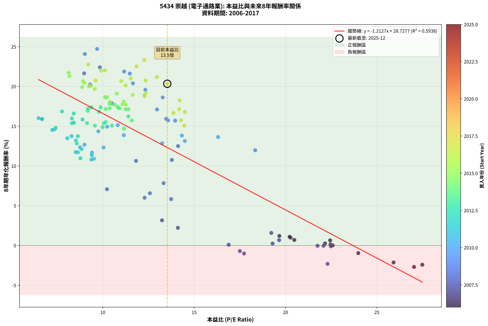
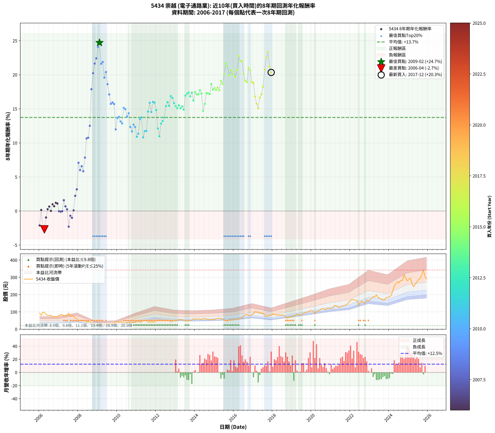

# 5434 崇越 - 本益比與未來報酬率分析

!!! info "報告資訊"
    - **股票代號**: 5434
    - **公司名稱**: 崇越
    - **產業別**: 電子通路業
    - **分析期間**: 2006-2017 (144 個數據點)
    - **資料來源**: Type 12 (ShowMonthlyK_ChartFlow) 月收盤價與本益比
    - **報酬率口徑**: 含現金股利 (簡化: 年度合計，假設每年7/1入帳)
    - **報告生成時間**: 2026-01-13 13:51:07 CST

## 📈 視覺化圖表

### 圖表1: 本益比 vs 未來報酬率關係

*圖表1：5434 崇越 本益比與8年期未來報酬率關係 (2006-2017)*

### 圖表2: 歷年買入時點的8年期實際報酬率

*圖表2：5434 崇越 歷年買入時點的8年期實際報酬率 (2006-2017)*

## 📍 買點訊號說明

本報告提供兩種買點提示訊號（顯示於圖表2的股價子圖中）：

### ▲ 小綠色三角形（回測驗證）
- **計算方式**: 使用全部歷史資料計算本益比第25百分位數
- **用途**: 事後驗證，顯示歷史上哪些時點確實為低估區
- **限制**: 當下無法判斷，僅供回測參考
- **特性**: 後見之明（Look-Ahead Bias）

### ▲ 小橘色三角形（即時訊號）
- **計算方式**: 使用截至當月的過去5年資料計算本益比第25百分位數
- **用途**: 實際投資決策，當時即可判斷
- **優勢**: 可操作性強，符合實務需求
- **特性**: 無後見之明，滾動窗口計算

!!! tip "如何使用兩種訊號"
    - **綠色▲** 幫助理解歷史估值機會，驗證策略有效性
    - **橘色▲** 可作為實際買進參考，但仍需搭配基本面分析
    - 兩種訊號重疊時，表示即時判斷與事後驗證一致，信心度較高
    - 僅有綠色▲時，表示當時無法判斷（需要未來資料才能確認）
    - 僅有橘色▲時，表示即時判斷為買點，但事後可能不是最佳時機

## 📊 估值分析摘要

| 指標 | 數值 |
|:---:|:---:|
| **目前本益比** (2017-12) | **13.53 倍** |
| **歷史平均本益比** | 12.37 倍 |
| **估值水準** | 🟡 合理範圍 |
| **預期8年年化報酬率** | **+12.32%** |
| **歷史平均報酬率** | +13.73% |
| **相關係數 (R²)** | 0.5938 |
| **趨勢線斜率** | -1.2127 |

!!! abstract "核心洞察"
    目前本益比接近歷史平均，預期報酬率符合長期趨勢

    根據歷史數據回測，5434 崇越 在目前本益比 **13.5倍** 的估值水準下，
    預期未來8年年化報酬率約為 **+12.3%**。

    **重要提醒**: 本分析基於歷史數據統計，實際報酬率會受到公司基本面變化、產業趨勢、
    總體經濟環境等多重因素影響。R² = 0.59 表示本益比可解釋約 59.4% 的報酬率變異。

## 📈 歷史估值統計

### 最佳買點 (最高報酬率)

| 項目 | 數值 |
|:---:|:---:|
| 起始時間 | 2009-02 |
| 當時本益比 | 9.69 倍 |
| 起始價格 | 21.6 元 |
| 8年後價格 | 102.0 元 |
| **8年年化報酬率** | **+24.71%** |

### 最差買點 (最低報酬率)

| 項目 | 數值 |
|:---:|:---:|
| 起始時間 | 2006-04 |
| 當時本益比 | 27.03 倍 |
| 起始價格 | 96.5 元 |
| 8年後價格 | 56.3 元 |
| **8年年化報酬率** | **-2.69%** |

## 🎯 投資啟示

### 本益比與報酬率關係

趨勢線方程式: **y = -1.2127x + 28.7277**

!!! warning "強負相關"
    本益比與未來報酬率呈現強負相關。在高本益比時期買入，未來報酬率顯著較低；
    在低本益比時期買入，未來報酬率顯著較高。**估值紀律至關重要**。

### 估值區間建議

基於歷史數據分析:

- **🟢 低估區** (P/E < 9.9): 預期報酬率較高，可考慮增加持股
- **🟡 合理區** (P/E 9.9-14.8): 預期報酬率符合長期趨勢，正常持有
- **🔴 高估區** (P/E > 14.8): 預期報酬率較低，可考慮減碼或觀望

!!! danger "風險提示"
    - 過去表現不代表未來結果
    - 本分析假設公司基本面無重大結構性變化
    - 產業環境劇變可能使歷史規律失效
    - 應結合公司財報、產業趨勢、總體經濟等多重因素綜合判斷

!!! success "長期投資觀點"
    歷史數據顯示，在合理或低估的估值水準買入並長期持有，
    往往能獲得較佳的投資報酬。**耐心等待好價格**是價值投資的核心原則。

## 📊 數據品質

- **資料來源**: GoodInfo.tw Type 12 (ShowMonthlyK_ChartFlow)
- **資料頻率**: 月度收盤價與本益比
- **回測期間**: 2006-2017
- **數據點數量**: 144 個 (每個點代表一次8年期回測)

### 計算方法說明

1. **8年期年化報酬率**:
   - 對每個歷史時點，計算其後8年的實際投資報酬率
   - 期末價值(不含股利): 期末價格
   - 期末價值(含現金股利): 期末價格 + 持有期間內的現金股利合計 (簡化: 年度合計，假設每年7/1入帳)
   - 公式: 年化報酬率 = [(期末價值/期初價格)^(1/年數) - 1] × 100%

2. **本益比 (P/E Ratio)**:
   - 使用當時的月收盤價與EPS計算
   - 資料來源: Type 12 月度河流圖本益比數據

3. **趨勢線 (Linear Regression)**:
   - 使用最小平方法擬合線性趨勢線
   - R²值衡量本益比對報酬率的解釋能力

---

*本報告由 Stock Analysis System v1.9.0 自動生成*
*數據更新時間: 2026-01-13 13:51:07 CST*

## 📋 月度回測明細表

（每一列對應時間線圖中的一個買入點；可用來對照 SVG 圖上的每個點。）

| 買入月份 | 賣出月份 | 回測期限_年 | 實際持有年數 | 買入本益比_倍 | 買入收盤價_元 | 賣出收盤價_元 | 現金股利合計_元 | 總報酬率_pct | 年化報酬率_pct |
| --- | --- | --- | --- | --- | --- | --- | --- | --- | --- |
| 2006-01 | 2014-01 | 8 | 8.000 | 25.91 | 92.50 | 56.60 | 21.28 | -15.80 | -2.13 |
| 2006-02 | 2014-02 | 8 | 8.000 | 22.46 | 80.20 | 59.90 | 21.28 | +1.22 | +0.15 |
| 2006-03 | 2014-03 | 8 | 8.000 | 27.48 | 98.10 | 59.40 | 21.28 | -17.76 | -2.41 |
| 2006-04 | 2014-04 | 8 | 8.000 | 27.03 | 96.50 | 56.30 | 21.28 | -19.61 | -2.69 |
| 2006-05 | 2014-05 | 8 | 8.000 | 23.98 | 85.60 | 58.00 | 21.28 | -7.38 | -0.95 |
| 2006-06 | 2014-06 | 8 | 8.000 | 22.16 | 79.10 | 59.50 | 21.28 | +2.13 | +0.26 |
| 2006-07 | 2014-07 | 8 | 8.000 | 22.44 | 80.10 | 62.00 | 22.38 | +5.34 | +0.65 |
| 2006-08 | 2014-08 | 8 | 8.000 | 22.58 | 80.60 | 58.30 | 22.38 | +0.10 | +0.01 |
| 2006-09 | 2014-09 | 8 | 8.000 | 20.28 | 72.40 | 55.90 | 22.38 | +8.12 | +0.98 |
| 2006-10 | 2014-10 | 8 | 8.000 | 20.48 | 73.10 | 54.90 | 22.38 | +5.72 | +0.70 |
| 2006-11 | 2014-11 | 8 | 8.000 | 19.66 | 70.20 | 54.90 | 22.38 | +10.09 | +1.21 |
| 2006-12 | 2014-12 | 8 | 8.000 | 20.22 | 72.20 | 56.40 | 22.38 | +9.11 | +1.10 |
| 2007-01 | 2015-01 | 8 | 8.000 | 21.75 | 79.50 | 56.90 | 22.38 | -0.28 | -0.03 |
| 2007-02 | 2015-02 | 8 | 8.000 | 22.48 | 84.10 | 61.10 | 22.38 | -0.74 | -0.09 |
| 2007-03 | 2015-03 | 8 | 8.000 | 22.08 | 84.50 | 61.90 | 22.38 | -0.26 | -0.03 |
| 2007-04 | 2015-04 | 8 | 8.000 | 19.22 | 75.20 | 62.90 | 22.38 | +13.41 | +1.58 |
| 2007-05 | 2015-05 | 8 | 8.000 | 19.65 | 78.60 | 60.60 | 22.38 | +5.57 | +0.68 |
| 2007-06 | 2015-06 | 8 | 8.000 | 19.29 | 78.80 | 58.00 | 22.38 | +2.01 | +0.25 |
| 2007-07 | 2015-07 | 8 | 8.000 | 22.30 | 93.00 | 53.40 | 23.78 | -17.01 | -2.30 |
| 2007-08 | 2015-08 | 8 | 8.000 | 17.50 | 74.50 | 46.65 | 23.78 | -5.46 | -0.70 |
| 2007-09 | 2015-09 | 8 | 8.000 | 17.73 | 77.00 | 47.25 | 23.78 | -7.75 | -1.00 |
| 2007-10 | 2015-10 | 8 | 8.000 | 16.89 | 74.80 | 51.60 | 23.78 | +0.78 | +0.10 |
| 2007-11 | 2015-11 | 8 | 8.000 | 14.11 | 63.70 | 52.20 | 23.78 | +19.28 | +2.23 |
| 2007-12 | 2015-12 | 8 | 8.000 | 13.24 | 60.90 | 54.40 | 23.78 | +28.38 | +3.17 |
| 2008-01 | 2016-01 | 8 | 8.000 | 10.23 | 45.00 | 54.00 | 23.78 | +72.85 | +7.08 |
| 2008-02 | 2016-02 | 8 | 8.000 | 12.29 | 51.60 | 58.50 | 23.78 | +59.46 | +6.01 |
| 2008-03 | 2016-03 | 8 | 8.000 | 12.58 | 50.30 | 59.90 | 23.78 | +66.36 | +6.57 |
| 2008-04 | 2016-04 | 8 | 8.000 | 13.74 | 52.20 | 58.40 | 23.78 | +57.43 | +5.84 |
| 2008-05 | 2016-05 | 8 | 8.000 | 13.33 | 48.00 | 64.00 | 23.78 | +82.88 | +7.84 |
| 2008-06 | 2016-06 | 8 | 8.000 | 11.82 | 40.20 | 66.50 | 23.78 | +124.58 | +10.64 |
| 2008-07 | 2016-07 | 8 | 8.000 | 13.78 | 44.10 | 75.20 | 24.68 | +126.49 | +10.76 |
| 2008-08 | 2016-08 | 8 | 8.000 | 14.12 | 42.35 | 84.00 | 24.68 | +156.63 | +12.50 |
| 2008-09 | 2016-09 | 8 | 8.000 | 10.50 | 29.40 | 84.90 | 24.68 | +272.72 | +17.88 |
| 2008-10 | 2016-10 | 8 | 8.000 | 9.31 | 24.20 | 81.00 | 24.68 | +336.70 | +20.23 |
| 2008-11 | 2016-11 | 8 | 8.000 | 8.98 | 21.55 | 78.60 | 24.68 | +379.26 | +21.64 |
| 2008-12 | 2016-12 | 8 | 8.000 | 9.84 | 21.65 | 84.40 | 24.68 | +403.84 | +22.40 |
| 2009-01 | 2017-01 | 8 | 8.000 | 9.02 | 20.00 | 87.70 | 24.68 | +461.90 | +24.08 |
| 2009-02 | 2017-02 | 8 | 8.000 | 9.69 | 21.65 | 102.00 | 24.68 | +485.13 | +24.71 |
| 2009-03 | 2017-03 | 8 | 8.000 | 11.48 | 25.85 | 99.00 | 24.68 | +378.46 | +21.61 |
| 2009-04 | 2017-04 | 8 | 8.000 | 11.17 | 25.35 | 98.70 | 24.68 | +386.71 | +21.87 |
| 2009-05 | 2017-05 | 8 | 8.000 | 12.33 | 28.20 | 93.20 | 24.68 | +318.02 | +19.58 |
| 2009-06 | 2017-06 | 8 | 8.000 | 11.65 | 26.85 | 93.80 | 24.68 | +341.27 | +20.39 |
| 2009-07 | 2017-07 | 8 | 8.000 | 13.28 | 30.85 | 92.50 | 28.38 | +291.83 | +18.61 |
| 2009-08 | 2017-08 | 8 | 8.000 | 12.97 | 30.35 | 79.00 | 28.38 | +253.81 | +17.11 |
| 2009-09 | 2017-09 | 8 | 8.000 | 13.57 | 32.00 | 74.60 | 28.38 | +221.82 | +15.73 |
| 2009-10 | 2017-10 | 8 | 8.000 | 13.47 | 32.00 | 76.00 | 28.38 | +226.19 | +15.93 |
| 2009-11 | 2017-11 | 8 | 8.000 | 13.96 | 33.40 | 78.90 | 28.38 | +221.20 | +15.70 |
| 2009-12 | 2017-12 | 8 | 8.000 | 18.34 | 44.20 | 80.90 | 28.38 | +147.24 | +11.98 |
| 2010-01 | 2018-01 | 8 | 8.000 | 16.31 | 42.20 | 89.00 | 28.38 | +178.15 | +13.64 |
| 2010-02 | 2018-02 | 8 | 8.000 | 14.33 | 39.60 | 83.20 | 28.38 | +181.77 | +13.82 |
| 2010-03 | 2018-03 | 8 | 8.000 | 14.49 | 42.60 | 86.00 | 28.38 | +168.50 | +13.14 |
| 2010-04 | 2018-04 | 8 | 8.000 | 13.25 | 41.30 | 80.30 | 28.38 | +163.15 | +12.86 |
| 2010-05 | 2018-05 | 8 | 8.000 | 10.82 | 35.65 | 81.70 | 28.38 | +208.78 | +15.13 |
| 2010-06 | 2018-06 | 8 | 8.000 | 10.24 | 35.55 | 79.90 | 28.38 | +204.59 | +14.94 |
| 2010-07 | 2018-07 | 8 | 8.000 | 11.15 | 40.65 | 83.90 | 31.08 | +182.86 | +13.88 |
| 2010-08 | 2018-08 | 8 | 8.000 | 9.76 | 37.30 | 78.00 | 31.08 | +192.44 | +14.35 |
| 2010-09 | 2018-09 | 8 | 8.000 | 10.04 | 40.15 | 70.70 | 31.08 | +153.50 | +12.33 |
| 2010-10 | 2018-10 | 8 | 8.000 | 9.41 | 39.30 | 64.00 | 31.08 | +141.94 | +11.68 |
| 2010-11 | 2018-11 | 8 | 8.000 | 9.00 | 39.20 | 70.80 | 31.08 | +159.90 | +12.68 |
| 2010-12 | 2018-12 | 8 | 8.000 | 8.76 | 39.70 | 69.60 | 31.08 | +153.60 | +12.34 |
| 2011-01 | 2019-01 | 8 | 8.000 | 9.52 | 44.60 | 71.00 | 31.08 | +128.88 | +10.91 |
| 2011-02 | 2019-02 | 8 | 8.000 | 9.40 | 45.50 | 76.50 | 31.08 | +136.44 | +11.36 |
| 2011-03 | 2019-03 | 8 | 8.000 | 8.06 | 40.30 | 79.80 | 31.08 | +175.14 | +13.49 |
| 2011-04 | 2019-04 | 8 | 8.000 | 8.29 | 42.70 | 88.60 | 31.08 | +180.28 | +13.75 |
| 2011-05 | 2019-05 | 8 | 8.000 | 9.38 | 49.80 | 82.10 | 31.08 | +127.27 | +10.81 |
| 2011-06 | 2019-06 | 8 | 8.000 | 8.64 | 47.20 | 83.50 | 31.08 | +142.76 | +11.72 |
| 2011-07 | 2019-07 | 8 | 8.000 | 8.52 | 47.90 | 82.90 | 33.58 | +143.18 | +11.75 |
| 2011-08 | 2019-08 | 8 | 8.000 | 7.36 | 42.50 | 92.80 | 33.58 | +197.37 | +14.59 |
| 2011-09 | 2019-09 | 8 | 8.000 | 6.69 | 39.70 | 95.50 | 33.58 | +225.14 | +15.88 |
| 2011-10 | 2019-10 | 8 | 8.000 | 7.24 | 44.10 | 97.00 | 33.58 | +196.10 | +14.53 |
| 2011-11 | 2019-11 | 8 | 8.000 | 6.49 | 40.55 | 99.50 | 33.58 | +228.19 | +16.02 |
| 2011-12 | 2019-12 | 8 | 8.000 | 6.67 | 42.70 | 105.50 | 33.58 | +225.72 | +15.91 |
| 2012-01 | 2020-01 | 8 | 8.000 | 7.43 | 46.90 | 108.00 | 33.58 | +201.88 | +14.81 |
| 2012-02 | 2020-02 | 8 | 8.000 | 8.84 | 55.10 | 104.00 | 33.58 | +149.69 | +12.12 |
| 2012-03 | 2020-03 | 8 | 8.000 | 8.78 | 54.00 | 90.60 | 33.58 | +129.96 | +10.97 |
| 2012-04 | 2020-04 | 8 | 8.000 | 8.58 | 52.00 | 103.00 | 33.58 | +162.66 | +12.83 |
| 2012-05 | 2020-05 | 8 | 8.000 | 8.53 | 51.00 | 104.00 | 33.58 | +169.77 | +13.21 |
| 2012-06 | 2020-06 | 8 | 8.000 | 8.64 | 50.90 | 109.00 | 33.58 | +180.12 | +13.74 |
| 2012-07 | 2020-07 | 8 | 8.000 | 8.31 | 48.30 | 116.00 | 35.78 | +214.25 | +15.39 |
| 2012-08 | 2020-08 | 8 | 8.000 | 8.31 | 47.60 | 120.00 | 35.78 | +227.27 | +15.97 |
| 2012-09 | 2020-09 | 8 | 8.000 | 8.42 | 47.50 | 114.00 | 35.78 | +215.33 | +15.44 |
| 2012-10 | 2020-10 | 8 | 8.000 | 7.77 | 43.20 | 114.50 | 35.78 | +247.87 | +16.86 |
| 2012-11 | 2020-11 | 8 | 8.000 | 8.41 | 46.05 | 121.50 | 35.78 | +241.54 | +16.60 |
| 2012-12 | 2020-12 | 8 | 8.000 | 8.89 | 47.90 | 119.50 | 35.78 | +224.18 | +15.84 |
| 2013-01 | 2021-01 | 8 | 8.000 | 9.14 | 49.10 | 118.50 | 35.78 | +214.22 | +15.39 |
| 2013-02 | 2021-02 | 8 | 8.000 | 9.57 | 51.30 | 122.00 | 35.78 | +207.57 | +15.08 |
| 2013-03 | 2021-03 | 8 | 8.000 | 10.16 | 54.30 | 136.50 | 35.78 | +217.28 | +15.53 |
| 2013-04 | 2021-04 | 8 | 8.000 | 10.50 | 56.00 | 136.50 | 35.78 | +207.64 | +15.08 |
| 2013-05 | 2021-05 | 8 | 8.000 | 10.06 | 53.50 | 132.00 | 35.78 | +213.61 | +15.36 |
| 2013-06 | 2021-06 | 8 | 8.000 | 9.99 | 53.00 | 125.00 | 35.78 | +203.36 | +14.88 |
| 2013-07 | 2021-07 | 8 | 8.000 | 9.18 | 48.55 | 129.50 | 40.20 | +249.54 | +16.93 |
| 2013-08 | 2021-08 | 8 | 8.000 | 9.19 | 48.50 | 132.50 | 40.20 | +256.08 | +17.20 |
| 2013-09 | 2021-09 | 8 | 8.000 | 9.37 | 49.30 | 137.50 | 40.20 | +260.45 | +17.38 |
| 2013-10 | 2021-10 | 8 | 8.000 | 9.79 | 51.40 | 138.00 | 40.20 | +246.69 | +16.81 |
| 2013-11 | 2021-11 | 8 | 8.000 | 9.88 | 51.70 | 146.00 | 40.20 | +260.15 | +17.37 |
| 2013-12 | 2021-12 | 8 | 8.000 | 11.40 | 59.50 | 158.00 | 40.20 | +233.11 | +16.23 |
| 2014-01 | 2022-01 | 8 | 8.000 | 10.80 | 56.60 | 165.00 | 40.20 | +262.54 | +17.47 |
| 2014-02 | 2022-02 | 8 | 8.000 | 11.40 | 59.90 | 172.00 | 40.20 | +254.26 | +17.13 |
| 2014-03 | 2022-03 | 8 | 8.000 | 11.26 | 59.40 | 170.00 | 40.20 | +253.87 | +17.11 |
| 2014-04 | 2022-04 | 8 | 8.000 | 10.64 | 56.30 | 167.50 | 40.20 | +268.92 | +17.72 |
| 2014-05 | 2022-05 | 8 | 8.000 | 10.92 | 58.00 | 167.00 | 40.20 | +257.24 | +17.25 |
| 2014-06 | 2022-06 | 8 | 8.000 | 11.16 | 59.50 | 138.00 | 40.20 | +199.50 | +14.70 |
| 2014-07 | 2022-07 | 8 | 8.000 | 11.59 | 62.00 | 154.00 | 45.40 | +221.61 | +15.72 |
| 2014-08 | 2022-08 | 8 | 8.000 | 10.86 | 58.30 | 163.50 | 45.40 | +258.32 | +17.30 |
| 2014-09 | 2022-09 | 8 | 8.000 | 10.38 | 55.90 | 154.50 | 45.40 | +257.60 | +17.27 |
| 2014-10 | 2022-10 | 8 | 8.000 | 10.16 | 54.90 | 149.50 | 45.40 | +255.01 | +17.16 |
| 2014-11 | 2022-11 | 8 | 8.000 | 10.13 | 54.90 | 170.00 | 45.40 | +292.35 | +18.63 |
| 2014-12 | 2022-12 | 8 | 8.000 | 10.37 | 56.40 | 164.00 | 45.40 | +271.28 | +17.82 |
| 2015-01 | 2023-01 | 8 | 8.000 | 10.39 | 56.90 | 169.00 | 45.40 | +276.80 | +18.04 |
| 2015-02 | 2023-02 | 8 | 8.000 | 11.08 | 61.10 | 180.50 | 45.40 | +269.72 | +17.76 |
| 2015-03 | 2023-03 | 8 | 8.000 | 11.15 | 61.90 | 189.00 | 45.40 | +278.68 | +18.11 |
| 2015-04 | 2023-04 | 8 | 8.000 | 11.25 | 62.90 | 186.50 | 45.40 | +268.68 | +17.71 |
| 2015-05 | 2023-05 | 8 | 8.000 | 10.77 | 60.60 | 200.00 | 45.40 | +304.95 | +19.10 |
| 2015-06 | 2023-06 | 8 | 8.000 | 10.24 | 58.00 | 182.50 | 45.40 | +292.93 | +18.66 |
| 2015-07 | 2023-07 | 8 | 8.000 | 9.36 | 53.40 | 179.50 | 51.70 | +332.96 | +20.10 |
| 2015-08 | 2023-08 | 8 | 8.000 | 8.13 | 46.65 | 173.00 | 51.70 | +381.67 | +21.71 |
| 2015-09 | 2023-09 | 8 | 8.000 | 8.18 | 47.25 | 169.50 | 51.70 | +368.15 | +21.28 |
| 2015-10 | 2023-10 | 8 | 8.000 | 8.87 | 51.60 | 169.00 | 51.70 | +327.71 | +19.92 |
| 2015-11 | 2023-11 | 8 | 8.000 | 8.92 | 52.20 | 183.00 | 51.70 | +349.62 | +20.67 |
| 2015-12 | 2023-12 | 8 | 8.000 | 9.24 | 54.40 | 182.50 | 51.70 | +330.51 | +20.02 |
| 2016-01 | 2024-01 | 8 | 8.000 | 9.00 | 54.00 | 187.50 | 51.70 | +342.96 | +20.45 |
| 2016-02 | 2024-02 | 8 | 8.000 | 9.56 | 58.50 | 194.50 | 51.70 | +320.85 | +19.68 |
| 2016-03 | 2024-03 | 8 | 8.000 | 9.61 | 59.90 | 219.00 | 51.70 | +351.92 | +20.75 |
| 2016-04 | 2024-04 | 8 | 8.000 | 9.21 | 58.40 | 249.50 | 51.70 | +415.75 | +22.76 |
| 2016-05 | 2024-05 | 8 | 8.000 | 9.91 | 64.00 | 262.00 | 51.70 | +390.16 | +21.98 |
| 2016-06 | 2024-06 | 8 | 8.000 | 10.12 | 66.50 | 275.00 | 51.70 | +391.28 | +22.02 |
| 2016-07 | 2024-07 | 8 | 8.000 | 11.25 | 75.20 | 268.50 | 57.80 | +333.91 | +20.14 |
| 2016-08 | 2024-08 | 8 | 8.000 | 12.36 | 84.00 | 283.00 | 57.80 | +305.71 | +19.13 |
| 2016-09 | 2024-09 | 8 | 8.000 | 12.29 | 84.90 | 282.00 | 57.80 | +300.23 | +18.93 |
| 2016-10 | 2024-10 | 8 | 8.000 | 11.53 | 81.00 | 314.50 | 57.80 | +359.63 | +21.00 |
| 2016-11 | 2024-11 | 8 | 8.000 | 11.01 | 78.60 | 295.50 | 57.80 | +349.49 | +20.67 |
| 2016-12 | 2024-12 | 8 | 8.000 | 11.64 | 84.40 | 280.00 | 57.80 | +300.23 | +18.93 |
| 2017-01 | 2025-01 | 8 | 8.000 | 12.28 | 87.70 | 290.00 | 57.80 | +296.58 | +18.79 |
| 2017-02 | 2025-02 | 8 | 8.000 | 14.49 | 102.00 | 295.50 | 57.80 | +246.37 | +16.80 |
| 2017-03 | 2025-03 | 8 | 8.000 | 14.28 | 99.00 | 261.00 | 57.80 | +222.02 | +15.74 |
| 2017-04 | 2025-04 | 8 | 8.000 | 14.46 | 98.70 | 245.50 | 57.80 | +207.29 | +15.07 |
| 2017-05 | 2025-05 | 8 | 8.000 | 13.87 | 93.20 | 262.00 | 57.80 | +243.13 | +16.66 |
| 2017-06 | 2025-06 | 8 | 8.000 | 14.18 | 93.80 | 274.50 | 57.80 | +254.26 | +17.13 |
| 2017-07 | 2025-07 | 8 | 8.000 | 14.21 | 92.50 | 288.50 | 64.79 | +281.93 | +18.24 |
| 2017-08 | 2025-08 | 8 | 8.000 | 12.34 | 79.00 | 292.00 | 64.79 | +351.63 | +20.74 |
| 2017-09 | 2025-09 | 8 | 8.000 | 11.85 | 74.60 | 314.00 | 64.79 | +407.76 | +22.52 |
| 2017-10 | 2025-10 | 8 | 8.000 | 12.27 | 76.00 | 342.00 | 64.79 | +435.25 | +23.33 |
| 2017-11 | 2025-11 | 8 | 8.000 | 12.96 | 78.90 | 302.50 | 64.79 | +365.51 | +21.20 |
| 2017-12 | 2025-12 | 8 | 8.000 | 13.53 | 80.90 | 291.00 | 64.79 | +339.79 | +20.34 |
