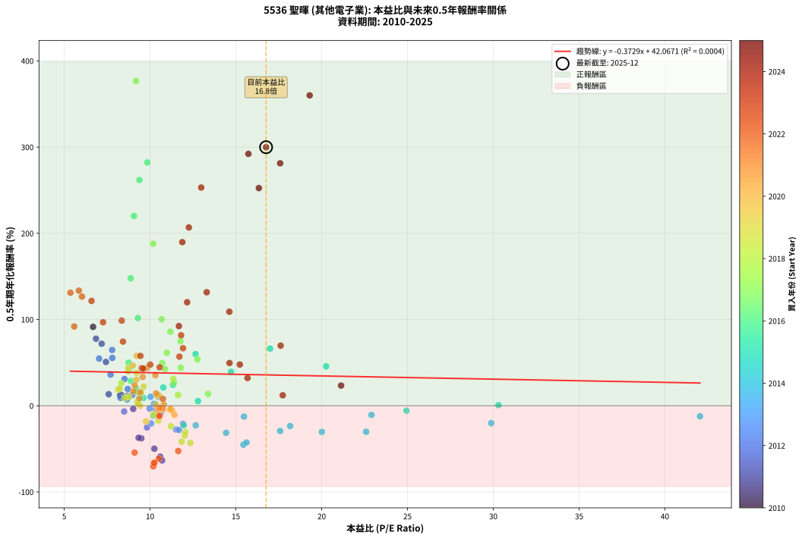
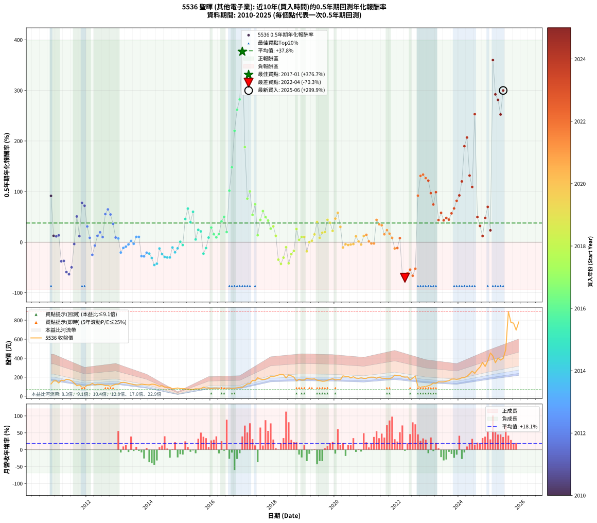

# 5536 聖暉 - 本益比與未來報酬率分析

!!! info "報告資訊"
    - **股票代號**: 5536
    - **公司名稱**: 聖暉
    - **產業別**: 其他電子業
    - **分析期間**: 2010-2025 (176 個數據點)
    - **資料來源**: Type 12 (ShowMonthlyK_ChartFlow) 月收盤價與本益比
    - **報酬率口徑**: 含現金股利 (簡化: 年度合計，假設每年7/1入帳)
    - **報告生成時間**: 2026-01-13 01:06:24 CST

## 📈 視覺化圖表

### 圖表1: 本益比 vs 未來報酬率關係

*圖表1：5536 聖暉 本益比與0.5年期未來報酬率關係 (2010-2025)*

### 圖表2: 歷年買入時點的0.5年期實際報酬率

*圖表2：5536 聖暉 歷年買入時點的0.5年期實際報酬率 (2010-2025)*

## 📍 買點訊號說明

本報告提供兩種買點提示訊號（顯示於圖表2的股價子圖中）：

### ▲ 小綠色三角形（回測驗證）
- **計算方式**: 使用全部歷史資料計算本益比第25百分位數
- **用途**: 事後驗證，顯示歷史上哪些時點確實為低估區
- **限制**: 當下無法判斷，僅供回測參考
- **特性**: 後見之明（Look-Ahead Bias）

### ▲ 小橘色三角形（即時訊號）
- **計算方式**: 使用截至當月的過去5年資料計算本益比第25百分位數
- **用途**: 實際投資決策，當時即可判斷
- **優勢**: 可操作性強，符合實務需求
- **特性**: 無後見之明，滾動窗口計算

!!! tip "如何使用兩種訊號"
    - **綠色▲** 幫助理解歷史估值機會，驗證策略有效性
    - **橘色▲** 可作為實際買進參考，但仍需搭配基本面分析
    - 兩種訊號重疊時，表示即時判斷與事後驗證一致，信心度較高
    - 僅有綠色▲時，表示當時無法判斷（需要未來資料才能確認）
    - 僅有橘色▲時，表示即時判斷為買點，但事後可能不是最佳時機

## 📊 估值分析摘要

| 指標 | 數值 |
|:---:|:---:|
| **目前本益比** (2025-06) | **16.76 倍** |
| **歷史平均本益比** | 11.39 倍 |
| **估值水準** | 🔴 相對高估 |
| **預期0.5年年化報酬率** | **+35.82%** |
| **歷史平均報酬率** | +37.82% |
| **相關係數 (R²)** | 0.0004 |
| **趨勢線斜率** | -0.3729 |

!!! abstract "核心洞察"
    目前本益比顯著高於歷史平均，預期未來報酬率可能較低

    根據歷史數據回測，5536 聖暉 在目前本益比 **16.8倍** 的估值水準下，
    預期未來0.5年年化報酬率約為 **+35.8%**。

    **重要提醒**: 本分析基於歷史數據統計，實際報酬率會受到公司基本面變化、產業趨勢、
    總體經濟環境等多重因素影響。R² = 0.00 表示本益比可解釋約 0.0% 的報酬率變異。

## 📈 歷史估值統計

### 最佳買點 (最高報酬率)

| 項目 | 數值 |
|:---:|:---:|
| 起始時間 | 2017-01 |
| 當時本益比 | 9.18 倍 |
| 起始價格 | 93.4 元 |
| 0.5年後價格 | 194.5 元 |
| **0.5年年化報酬率** | **+376.71%** |

### 最差買點 (最低報酬率)

| 項目 | 數值 |
|:---:|:---:|
| 起始時間 | 2022-04 |
| 當時本益比 | 10.19 倍 |
| 起始價格 | 200.5 元 |
| 0.5年後價格 | 94.1 元 |
| **0.5年年化報酬率** | **-70.32%** |

## 🎯 投資啟示

### 本益比與報酬率關係

趨勢線方程式: **y = -0.3729x + 42.0671**

!!! note "負相關"
    本益比與未來報酬率呈現負相關。較低的本益比通常帶來較高的未來報酬率，
    但相關性不算非常強。**估值仍是重要參考指標之一**。

### 估值區間建議

基於歷史數據分析:

- **🟢 低估區** (P/E < 9.1): 預期報酬率較高，可考慮增加持股
- **🟡 合理區** (P/E 9.1-13.7): 預期報酬率符合長期趨勢，正常持有
- **🔴 高估區** (P/E > 13.7): 預期報酬率較低，可考慮減碼或觀望

!!! danger "風險提示"
    - 過去表現不代表未來結果
    - 本分析假設公司基本面無重大結構性變化
    - 產業環境劇變可能使歷史規律失效
    - 應結合公司財報、產業趨勢、總體經濟等多重因素綜合判斷

!!! success "長期投資觀點"
    歷史數據顯示，在合理或低估的估值水準買入並長期持有，
    往往能獲得較佳的投資報酬。**耐心等待好價格**是價值投資的核心原則。

## 📊 數據品質

- **資料來源**: GoodInfo.tw Type 12 (ShowMonthlyK_ChartFlow)
- **資料頻率**: 月度收盤價與本益比
- **回測期間**: 2010-2025
- **數據點數量**: 176 個 (每個點代表一次0.5年期回測)

### 計算方法說明

1. **0.5年期年化報酬率**:
   - 對每個歷史時點，計算其後0.5年的實際投資報酬率
   - 期末價值(不含股利): 期末價格
   - 期末價值(含現金股利): 期末價格 + 持有期間內的現金股利合計 (簡化: 年度合計，假設每年7/1入帳)
   - 公式: 年化報酬率 = [(期末價值/期初價格)^(1/年數) - 1] × 100%

2. **本益比 (P/E Ratio)**:
   - 使用當時的月收盤價與EPS計算
   - 資料來源: Type 12 月度河流圖本益比數據

3. **趨勢線 (Linear Regression)**:
   - 使用最小平方法擬合線性趨勢線
   - R²值衡量本益比對報酬率的解釋能力

---

*本報告由 Stock Analysis System v1.9.0 自動生成*
*數據更新時間: 2026-01-13 01:06:24 CST*

## 📋 月度回測明細表

（每一列對應時間線圖中的一個買入點；可用來對照 SVG 圖上的每個點。）

| 買入月份 | 賣出月份 | 回測期限_年 | 實際持有年數 | 買入本益比_倍 | 買入收盤價_元 | 賣出收盤價_元 | 現金股利合計_元 | 總報酬率_pct | 年化報酬率_pct |
| --- | --- | --- | --- | --- | --- | --- | --- | --- | --- |
| 2010-11 | 2011-05 | 0.5 | 0.496 | 6.68 | 129.00 | 178.00 | 0.00 | +37.98 | +91.50 |
| 2010-12 | 2011-07 | 0.5 | 0.580 | 8.31 | 160.50 | 162.00 | 10.00 | +7.17 | +12.66 |
| 2011-01 | 2011-07 | 0.5 | 0.496 | 8.66 | 163.00 | 162.00 | 10.00 | +5.52 | +11.46 |
| 2011-02 | 2011-08 | 0.5 | 0.498 | 7.59 | 139.00 | 138.00 | 10.00 | +6.47 | +13.42 |
| 2011-03 | 2011-10 | 0.5 | 0.586 | 9.49 | 169.00 | 118.00 | 10.00 | -24.26 | -37.77 |
| 2011-04 | 2011-10 | 0.5 | 0.501 | 9.33 | 161.50 | 118.00 | 10.00 | -20.74 | -37.12 |
| 2011-05 | 2011-12 | 0.5 | 0.586 | 10.59 | 178.00 | 95.50 | 10.00 | -40.73 | -59.05 |
| 2011-06 | 2011-12 | 0.5 | 0.501 | 10.70 | 174.50 | 95.50 | 10.00 | -39.54 | -63.37 |
| 2011-07 | 2012-01 | 0.5 | 0.504 | 10.25 | 162.00 | 114.50 | 0.00 | -29.32 | -49.79 |
| 2011-08 | 2012-03 | 0.5 | 0.583 | 9.02 | 138.00 | 135.00 | 0.00 | -2.17 | -3.70 |
| 2011-09 | 2012-03 | 0.5 | 0.498 | 7.43 | 110.00 | 135.00 | 0.00 | +22.73 | +50.83 |
| 2011-10 | 2012-05 | 0.5 | 0.583 | 8.25 | 118.00 | 126.00 | 0.00 | +6.78 | +11.91 |
| 2011-11 | 2012-05 | 0.5 | 0.498 | 6.85 | 94.60 | 126.00 | 0.00 | +33.19 | +77.75 |
| 2011-12 | 2012-07 | 0.5 | 0.583 | 7.18 | 95.50 | 121.00 | 10.00 | +37.17 | +71.94 |
| 2012-01 | 2012-07 | 0.5 | 0.498 | 8.51 | 114.50 | 121.00 | 10.00 | +14.41 | +31.02 |
| 2012-02 | 2012-08 | 0.5 | 0.501 | 8.68 | 118.00 | 113.00 | 10.00 | +4.24 | +8.64 |
| 2012-03 | 2012-10 | 0.5 | 0.586 | 9.82 | 135.00 | 104.00 | 10.00 | -15.56 | -25.07 |
| 2012-04 | 2012-10 | 0.5 | 0.501 | 8.49 | 118.00 | 104.00 | 10.00 | -3.39 | -6.65 |
| 2012-05 | 2012-12 | 0.5 | 0.586 | 8.97 | 126.00 | 125.00 | 10.00 | +7.14 | +12.50 |
| 2012-06 | 2012-12 | 0.5 | 0.501 | 8.70 | 123.50 | 125.00 | 10.00 | +9.31 | +19.45 |
| 2012-07 | 2013-01 | 0.5 | 0.504 | 8.44 | 121.00 | 127.00 | 0.00 | +4.96 | +10.08 |
| 2012-08 | 2013-03 | 0.5 | 0.580 | 7.80 | 113.00 | 146.00 | 0.00 | +29.20 | +55.49 |
| 2012-09 | 2013-03 | 0.5 | 0.496 | 7.79 | 114.00 | 146.00 | 0.00 | +28.07 | +64.75 |
| 2012-10 | 2013-05 | 0.5 | 0.580 | 7.03 | 104.00 | 134.00 | 0.00 | +28.85 | +54.75 |
| 2012-11 | 2013-05 | 0.5 | 0.496 | 7.70 | 115.00 | 134.00 | 0.00 | +16.52 | +36.15 |
| 2012-12 | 2013-07 | 0.5 | 0.580 | 8.28 | 125.00 | 121.50 | 10.00 | +5.20 | +9.13 |
| 2013-01 | 2013-07 | 0.5 | 0.496 | 8.65 | 127.00 | 121.50 | 10.00 | +3.54 | +7.28 |
| 2013-02 | 2013-08 | 0.5 | 0.498 | 10.06 | 143.50 | 118.00 | 10.00 | -10.80 | -20.50 |
| 2013-03 | 2013-10 | 0.5 | 0.586 | 10.55 | 146.00 | 126.00 | 10.00 | -6.85 | -11.41 |
| 2013-04 | 2013-10 | 0.5 | 0.501 | 10.61 | 142.50 | 126.00 | 10.00 | -4.56 | -8.90 |
| 2013-05 | 2013-12 | 0.5 | 0.586 | 10.30 | 134.00 | 120.50 | 10.00 | -2.61 | -4.42 |
| 2013-06 | 2013-12 | 0.5 | 0.501 | 10.24 | 129.00 | 120.50 | 10.00 | +1.16 | +2.33 |
| 2013-07 | 2014-01 | 0.5 | 0.504 | 9.97 | 121.50 | 119.50 | 0.00 | -1.65 | -3.24 |
| 2013-08 | 2014-03 | 0.5 | 0.580 | 10.03 | 118.00 | 125.00 | 0.00 | +5.93 | +10.44 |
| 2013-09 | 2014-03 | 0.5 | 0.496 | 10.48 | 119.00 | 125.00 | 0.00 | +5.04 | +10.44 |
| 2013-10 | 2014-05 | 0.5 | 0.580 | 11.52 | 126.00 | 104.50 | 0.00 | -17.06 | -27.55 |
| 2013-11 | 2014-05 | 0.5 | 0.496 | 11.69 | 123.00 | 104.50 | 0.00 | -15.04 | -28.03 |
| 2013-12 | 2014-07 | 0.5 | 0.580 | 11.92 | 120.50 | 95.20 | 10.00 | -12.70 | -20.86 |
| 2014-01 | 2014-07 | 0.5 | 0.496 | 12.66 | 119.50 | 95.20 | 10.00 | -11.97 | -22.68 |
| 2014-02 | 2014-08 | 0.5 | 0.498 | 14.43 | 126.50 | 94.90 | 10.00 | -17.08 | -31.32 |
| 2014-03 | 2014-10 | 0.5 | 0.586 | 15.44 | 125.00 | 77.90 | 10.00 | -29.68 | -45.17 |
| 2014-04 | 2014-10 | 0.5 | 0.501 | 15.62 | 116.00 | 77.90 | 10.00 | -24.22 | -42.51 |
| 2014-05 | 2014-12 | 0.5 | 0.586 | 15.47 | 104.50 | 86.60 | 10.00 | -7.56 | -12.56 |
| 2014-06 | 2014-12 | 0.5 | 0.501 | 18.16 | 110.50 | 86.60 | 10.00 | -12.58 | -23.53 |
| 2014-07 | 2015-01 | 0.5 | 0.504 | 17.58 | 95.20 | 80.00 | 0.00 | -15.97 | -29.20 |
| 2014-08 | 2015-03 | 0.5 | 0.580 | 20.01 | 94.90 | 77.00 | 0.00 | -18.86 | -30.24 |
| 2014-09 | 2015-03 | 0.5 | 0.496 | 22.59 | 92.00 | 77.00 | 0.00 | -16.30 | -30.17 |
| 2014-10 | 2015-05 | 0.5 | 0.580 | 22.90 | 77.90 | 73.00 | 0.00 | -6.29 | -10.59 |
| 2014-11 | 2015-05 | 0.5 | 0.496 | 29.88 | 81.60 | 73.00 | 0.00 | -10.54 | -20.13 |
| 2014-12 | 2015-07 | 0.5 | 0.580 | 42.04 | 86.60 | 78.30 | 2.00 | -7.27 | -12.20 |
| 2015-01 | 2015-07 | 0.5 | 0.496 | 30.30 | 80.00 | 78.30 | 2.00 | +0.37 | +0.76 |
| 2015-02 | 2015-08 | 0.5 | 0.498 | 24.94 | 80.30 | 76.00 | 2.00 | -2.86 | -5.67 |
| 2015-03 | 2015-10 | 0.5 | 0.586 | 20.26 | 77.00 | 94.00 | 2.00 | +24.68 | +45.71 |
| 2015-04 | 2015-10 | 0.5 | 0.501 | 16.99 | 74.40 | 94.00 | 2.00 | +29.03 | +66.32 |
| 2015-05 | 2015-12 | 0.5 | 0.586 | 14.72 | 73.00 | 86.70 | 2.00 | +21.51 | +39.44 |
| 2015-06 | 2015-12 | 0.5 | 0.501 | 12.65 | 70.10 | 86.70 | 2.00 | +26.53 | +59.95 |
| 2015-07 | 2016-01 | 0.5 | 0.504 | 12.79 | 78.30 | 80.40 | 0.00 | +2.68 | +5.39 |
| 2015-08 | 2016-03 | 0.5 | 0.583 | 11.34 | 76.00 | 86.30 | 0.00 | +13.55 | +24.35 |
| 2015-09 | 2016-03 | 0.5 | 0.498 | 10.77 | 78.40 | 86.30 | 0.00 | +10.08 | +21.25 |
| 2015-10 | 2016-05 | 0.5 | 0.583 | 11.96 | 94.00 | 80.90 | 0.00 | -13.94 | -22.69 |
| 2015-11 | 2016-05 | 0.5 | 0.498 | 10.19 | 86.00 | 80.90 | 0.00 | -5.93 | -11.55 |
| 2015-12 | 2016-07 | 0.5 | 0.583 | 9.61 | 86.70 | 85.20 | 6.00 | +5.19 | +9.07 |
| 2016-01 | 2016-07 | 0.5 | 0.498 | 8.88 | 80.40 | 85.20 | 6.00 | +13.44 | +28.79 |
| 2016-02 | 2016-08 | 0.5 | 0.501 | 9.46 | 86.00 | 86.50 | 6.00 | +7.56 | +15.66 |
| 2016-03 | 2016-10 | 0.5 | 0.586 | 9.45 | 86.30 | 85.00 | 6.00 | +5.45 | +9.48 |
| 2016-04 | 2016-10 | 0.5 | 0.501 | 9.22 | 84.50 | 85.00 | 6.00 | +7.70 | +15.95 |
| 2016-05 | 2016-12 | 0.5 | 0.586 | 8.79 | 80.90 | 93.00 | 6.00 | +22.38 | +41.15 |
| 2016-06 | 2016-12 | 0.5 | 0.501 | 8.75 | 80.80 | 93.00 | 6.00 | +22.53 | +50.01 |
| 2016-07 | 2017-01 | 0.5 | 0.504 | 9.19 | 85.20 | 93.40 | 0.00 | +9.62 | +20.01 |
| 2016-08 | 2017-03 | 0.5 | 0.580 | 9.29 | 86.50 | 130.00 | 0.00 | +50.29 | +101.75 |
| 2016-09 | 2017-03 | 0.5 | 0.496 | 8.87 | 82.90 | 130.00 | 0.00 | +56.82 | +147.91 |
| 2016-10 | 2017-05 | 0.5 | 0.580 | 9.06 | 85.00 | 167.00 | 0.00 | +96.47 | +220.12 |
| 2016-11 | 2017-05 | 0.5 | 0.496 | 9.38 | 88.30 | 167.00 | 0.00 | +89.13 | +261.81 |
| 2016-12 | 2017-07 | 0.5 | 0.580 | 9.84 | 93.00 | 194.50 | 8.01 | +117.76 | +282.19 |
| 2017-01 | 2017-07 | 0.5 | 0.496 | 9.18 | 93.40 | 194.50 | 8.01 | +116.82 | +376.71 |
| 2017-02 | 2017-08 | 0.5 | 0.498 | 10.18 | 111.00 | 180.00 | 8.01 | +69.38 | +187.94 |
| 2017-03 | 2017-10 | 0.5 | 0.586 | 11.18 | 130.00 | 179.00 | 8.01 | +43.86 | +86.02 |
| 2017-04 | 2017-10 | 0.5 | 0.501 | 10.68 | 132.00 | 179.00 | 8.01 | +41.68 | +100.44 |
| 2017-05 | 2017-12 | 0.5 | 0.586 | 12.76 | 167.00 | 207.00 | 8.01 | +28.75 | +53.93 |
| 2017-06 | 2017-12 | 0.5 | 0.501 | 11.77 | 162.50 | 207.00 | 8.01 | +32.32 | +74.88 |
| 2017-07 | 2018-01 | 0.5 | 0.504 | 13.38 | 194.50 | 207.50 | 0.00 | +6.68 | +13.70 |
| 2017-08 | 2018-03 | 0.5 | 0.580 | 11.79 | 180.00 | 222.50 | 0.00 | +23.61 | +44.08 |
| 2017-09 | 2018-03 | 0.5 | 0.496 | 10.98 | 175.50 | 222.50 | 0.00 | +26.78 | +61.42 |
| 2017-10 | 2018-05 | 0.5 | 0.580 | 10.71 | 179.00 | 226.00 | 0.00 | +26.26 | +49.43 |
| 2017-11 | 2018-05 | 0.5 | 0.496 | 10.86 | 189.50 | 226.00 | 0.00 | +19.26 | +42.68 |
| 2017-12 | 2018-07 | 0.5 | 0.580 | 11.39 | 207.00 | 224.50 | 13.00 | +14.73 | +26.72 |
| 2018-01 | 2018-07 | 0.5 | 0.496 | 11.35 | 207.50 | 224.50 | 13.00 | +14.46 | +31.32 |
| 2018-02 | 2018-08 | 0.5 | 0.498 | 11.63 | 214.00 | 214.00 | 13.00 | +6.07 | +12.56 |
| 2018-03 | 2018-10 | 0.5 | 0.586 | 12.02 | 222.50 | 160.50 | 13.00 | -22.02 | -34.59 |
| 2018-04 | 2018-10 | 0.5 | 0.501 | 12.35 | 230.00 | 160.50 | 13.00 | -24.57 | -43.03 |
| 2018-05 | 2018-12 | 0.5 | 0.586 | 12.06 | 226.00 | 169.50 | 13.00 | -19.25 | -30.57 |
| 2018-06 | 2018-12 | 0.5 | 0.501 | 10.21 | 192.50 | 169.50 | 13.00 | -5.19 | -10.10 |
| 2018-07 | 2019-01 | 0.5 | 0.504 | 11.84 | 224.50 | 171.00 | 0.00 | -23.83 | -41.75 |
| 2018-08 | 2019-03 | 0.5 | 0.580 | 11.22 | 214.00 | 183.00 | 0.00 | -14.49 | -23.63 |
| 2018-09 | 2019-03 | 0.5 | 0.496 | 10.48 | 201.00 | 183.00 | 0.00 | -8.96 | -17.25 |
| 2018-10 | 2019-05 | 0.5 | 0.580 | 8.32 | 160.50 | 183.50 | 0.00 | +14.33 | +25.95 |
| 2018-11 | 2019-05 | 0.5 | 0.496 | 9.25 | 179.50 | 183.50 | 0.00 | +2.23 | +4.55 |
| 2018-12 | 2019-07 | 0.5 | 0.580 | 8.68 | 169.50 | 164.50 | 15.00 | +5.90 | +10.38 |
| 2019-01 | 2019-07 | 0.5 | 0.496 | 8.77 | 171.00 | 164.50 | 15.00 | +4.97 | +10.28 |
| 2019-02 | 2019-08 | 0.5 | 0.498 | 9.76 | 190.00 | 157.00 | 15.00 | -9.47 | -18.11 |
| 2019-03 | 2019-10 | 0.5 | 0.586 | 9.42 | 183.00 | 168.00 | 15.00 | +0.00 | +0.00 |
| 2019-04 | 2019-10 | 0.5 | 0.501 | 9.30 | 180.50 | 168.00 | 15.00 | +1.39 | +2.78 |
| 2019-05 | 2019-12 | 0.5 | 0.586 | 9.47 | 183.50 | 184.50 | 15.00 | +8.72 | +15.34 |
| 2019-06 | 2019-12 | 0.5 | 0.501 | 8.71 | 168.50 | 184.50 | 15.00 | +18.40 | +40.08 |
| 2019-07 | 2020-01 | 0.5 | 0.504 | 8.52 | 164.50 | 171.50 | 0.00 | +4.26 | +8.62 |
| 2019-08 | 2020-03 | 0.5 | 0.583 | 8.14 | 157.00 | 173.50 | 0.00 | +10.51 | +18.69 |
| 2019-09 | 2020-03 | 0.5 | 0.498 | 8.23 | 158.50 | 173.50 | 0.00 | +9.46 | +19.90 |
| 2019-10 | 2020-05 | 0.5 | 0.583 | 8.74 | 168.00 | 208.00 | 0.00 | +23.81 | +44.23 |
| 2019-11 | 2020-05 | 0.5 | 0.498 | 9.22 | 177.00 | 208.00 | 0.00 | +17.51 | +38.25 |
| 2019-12 | 2020-07 | 0.5 | 0.583 | 9.63 | 184.50 | 192.50 | 15.00 | +12.47 | +22.32 |
| 2020-01 | 2020-07 | 0.5 | 0.498 | 9.00 | 171.50 | 192.50 | 15.00 | +20.99 | +46.58 |
| 2020-02 | 2020-08 | 0.5 | 0.501 | 9.23 | 175.00 | 205.00 | 15.00 | +25.71 | +57.89 |
| 2020-03 | 2020-10 | 0.5 | 0.586 | 9.21 | 173.50 | 187.50 | 15.00 | +16.71 | +30.19 |
| 2020-04 | 2020-10 | 0.5 | 0.501 | 11.42 | 214.00 | 187.50 | 15.00 | -5.37 | -10.44 |
| 2020-05 | 2020-12 | 0.5 | 0.586 | 11.16 | 208.00 | 188.00 | 15.00 | -2.40 | -4.07 |
| 2020-06 | 2020-12 | 0.5 | 0.501 | 11.28 | 209.00 | 188.00 | 15.00 | -2.87 | -5.65 |
| 2020-07 | 2021-01 | 0.5 | 0.504 | 10.45 | 192.50 | 188.00 | 0.00 | -2.34 | -4.59 |
| 2020-08 | 2021-03 | 0.5 | 0.580 | 11.19 | 205.00 | 200.50 | 0.00 | -2.20 | -3.75 |
| 2020-09 | 2021-03 | 0.5 | 0.496 | 10.43 | 190.00 | 200.50 | 0.00 | +5.53 | +11.47 |
| 2020-10 | 2021-05 | 0.5 | 0.580 | 10.35 | 187.50 | 189.00 | 0.00 | +0.80 | +1.38 |
| 2020-11 | 2021-05 | 0.5 | 0.496 | 10.75 | 193.50 | 189.00 | 0.00 | -2.33 | -4.64 |
| 2020-12 | 2021-07 | 0.5 | 0.580 | 10.50 | 188.00 | 189.00 | 12.00 | +6.91 | +12.21 |
| 2021-01 | 2021-07 | 0.5 | 0.496 | 10.35 | 188.00 | 189.00 | 12.00 | +6.91 | +14.45 |
| 2021-02 | 2021-08 | 0.5 | 0.498 | 10.80 | 199.00 | 188.50 | 12.00 | +0.75 | +1.52 |
| 2021-03 | 2021-10 | 0.5 | 0.586 | 10.72 | 200.50 | 185.50 | 12.00 | -1.50 | -2.54 |
| 2021-04 | 2021-10 | 0.5 | 0.501 | 10.55 | 200.00 | 185.50 | 12.00 | -1.25 | -2.48 |
| 2021-05 | 2021-12 | 0.5 | 0.586 | 9.83 | 189.00 | 222.00 | 12.00 | +23.81 | +43.98 |
| 2021-06 | 2021-12 | 0.5 | 0.501 | 10.31 | 201.00 | 222.00 | 12.00 | +16.42 | +35.45 |
| 2021-07 | 2022-01 | 0.5 | 0.504 | 9.57 | 189.00 | 218.50 | 0.00 | +15.61 | +33.36 |
| 2021-08 | 2022-03 | 0.5 | 0.580 | 9.42 | 188.50 | 205.00 | 0.00 | +8.75 | +15.55 |
| 2021-09 | 2022-03 | 0.5 | 0.496 | 9.10 | 184.50 | 205.00 | 0.00 | +11.11 | +23.69 |
| 2021-10 | 2022-05 | 0.5 | 0.580 | 9.03 | 185.50 | 203.00 | 0.00 | +9.43 | +16.80 |
| 2021-11 | 2022-05 | 0.5 | 0.496 | 9.37 | 195.00 | 203.00 | 0.00 | +4.10 | +8.45 |
| 2021-12 | 2022-07 | 0.5 | 0.580 | 10.53 | 222.00 | 190.50 | 15.00 | -7.43 | -12.46 |
| 2022-01 | 2022-07 | 0.5 | 0.496 | 10.54 | 218.50 | 190.50 | 15.00 | -5.95 | -11.64 |
| 2022-02 | 2022-08 | 0.5 | 0.498 | 10.75 | 219.00 | 212.50 | 15.00 | +3.88 | +7.94 |
| 2022-03 | 2022-10 | 0.5 | 0.586 | 10.24 | 205.00 | 94.10 | 15.00 | -46.78 | -65.92 |
| 2022-04 | 2022-10 | 0.5 | 0.501 | 10.19 | 200.50 | 94.10 | 15.00 | -45.59 | -70.32 |
| 2022-05 | 2022-12 | 0.5 | 0.586 | 10.51 | 203.00 | 101.50 | 15.00 | -42.61 | -61.24 |
| 2022-06 | 2022-12 | 0.5 | 0.501 | 9.10 | 172.50 | 101.50 | 15.00 | -32.46 | -54.32 |
| 2022-07 | 2023-01 | 0.5 | 0.504 | 10.24 | 190.50 | 110.00 | 0.00 | -42.26 | -66.38 |
| 2022-08 | 2023-03 | 0.5 | 0.580 | 11.64 | 212.50 | 138.00 | 0.00 | -35.06 | -52.47 |
| 2022-09 | 2023-03 | 0.5 | 0.496 | 5.58 | 99.90 | 138.00 | 0.00 | +38.14 | +91.93 |
| 2022-10 | 2023-05 | 0.5 | 0.580 | 5.36 | 94.10 | 153.00 | 0.00 | +62.59 | +131.05 |
| 2022-11 | 2023-05 | 0.5 | 0.496 | 5.85 | 100.50 | 153.00 | 0.00 | +52.24 | +133.52 |
| 2022-12 | 2023-07 | 0.5 | 0.580 | 6.03 | 101.50 | 151.50 | 11.68 | +60.77 | +126.60 |
| 2023-01 | 2023-07 | 0.5 | 0.496 | 6.59 | 110.00 | 151.50 | 11.68 | +48.35 | +121.63 |
| 2023-02 | 2023-08 | 0.5 | 0.498 | 7.26 | 120.00 | 156.50 | 11.68 | +40.15 | +96.88 |
| 2023-03 | 2023-10 | 0.5 | 0.586 | 8.42 | 138.00 | 179.50 | 11.68 | +38.54 | +74.43 |
| 2023-04 | 2023-10 | 0.5 | 0.501 | 8.35 | 135.50 | 179.50 | 11.68 | +41.09 | +98.79 |
| 2023-05 | 2023-12 | 0.5 | 0.586 | 9.51 | 153.00 | 177.50 | 11.68 | +23.65 | +43.66 |
| 2023-06 | 2023-12 | 0.5 | 0.501 | 9.44 | 150.50 | 177.50 | 11.68 | +25.70 | +57.86 |
| 2023-07 | 2024-01 | 0.5 | 0.504 | 9.60 | 151.50 | 181.50 | 0.00 | +19.80 | +43.14 |
| 2023-08 | 2024-03 | 0.5 | 0.583 | 10.01 | 156.50 | 196.50 | 0.00 | +25.56 | +47.74 |
| 2023-09 | 2024-03 | 0.5 | 0.498 | 10.56 | 163.50 | 196.50 | 0.00 | +20.18 | +44.62 |
| 2023-10 | 2024-05 | 0.5 | 0.583 | 11.71 | 179.50 | 233.50 | 0.00 | +30.08 | +56.99 |
| 2023-11 | 2024-05 | 0.5 | 0.498 | 11.92 | 181.00 | 233.50 | 0.00 | +29.01 | +66.72 |
| 2023-12 | 2024-07 | 0.5 | 0.583 | 11.81 | 177.50 | 241.00 | 10.50 | +41.69 | +81.77 |
| 2024-01 | 2024-07 | 0.5 | 0.498 | 11.68 | 181.50 | 241.00 | 10.50 | +38.57 | +92.44 |
| 2024-02 | 2024-08 | 0.5 | 0.501 | 12.16 | 195.00 | 279.00 | 10.50 | +48.46 | +120.05 |
| 2024-03 | 2024-10 | 0.5 | 0.586 | 11.88 | 196.50 | 356.00 | 10.50 | +86.51 | +189.76 |
| 2024-04 | 2024-10 | 0.5 | 0.501 | 12.26 | 209.00 | 356.00 | 10.50 | +75.36 | +206.80 |
| 2024-05 | 2024-12 | 0.5 | 0.586 | 13.30 | 233.50 | 371.50 | 10.50 | +63.60 | +131.67 |
| 2024-06 | 2024-12 | 0.5 | 0.501 | 14.62 | 264.00 | 371.50 | 10.50 | +44.70 | +109.06 |
| 2024-07 | 2025-01 | 0.5 | 0.504 | 12.98 | 241.00 | 455.00 | 0.00 | +88.80 | +253.07 |
| 2024-08 | 2025-03 | 0.5 | 0.580 | 14.63 | 279.00 | 352.50 | 0.00 | +26.34 | +49.61 |
| 2024-09 | 2025-03 | 0.5 | 0.496 | 15.68 | 307.00 | 352.50 | 0.00 | +14.82 | +32.17 |
| 2024-10 | 2025-05 | 0.5 | 0.580 | 17.73 | 356.00 | 380.50 | 0.00 | +6.88 | +12.15 |
| 2024-11 | 2025-05 | 0.5 | 0.496 | 15.23 | 313.50 | 380.50 | 0.00 | +21.37 | +47.82 |
| 2024-12 | 2025-07 | 0.5 | 0.580 | 17.61 | 371.50 | 490.00 | 15.00 | +35.94 | +69.71 |
| 2025-01 | 2025-07 | 0.5 | 0.496 | 21.13 | 455.00 | 490.00 | 15.00 | +10.99 | +23.42 |
| 2025-02 | 2025-08 | 0.5 | 0.498 | 19.30 | 424.00 | 892.00 | 15.00 | +113.92 | +359.99 |
| 2025-03 | 2025-10 | 0.5 | 0.586 | 15.73 | 352.50 | 770.00 | 15.00 | +122.70 | +292.16 |
| 2025-04 | 2025-10 | 0.5 | 0.501 | 17.58 | 401.50 | 770.00 | 15.00 | +95.52 | +281.22 |
| 2025-05 | 2025-12 | 0.5 | 0.586 | 16.34 | 380.50 | 781.00 | 15.00 | +109.20 | +252.47 |
| 2025-06 | 2025-12 | 0.5 | 0.501 | 16.76 | 397.50 | 781.00 | 15.00 | +100.25 | +299.87 |
