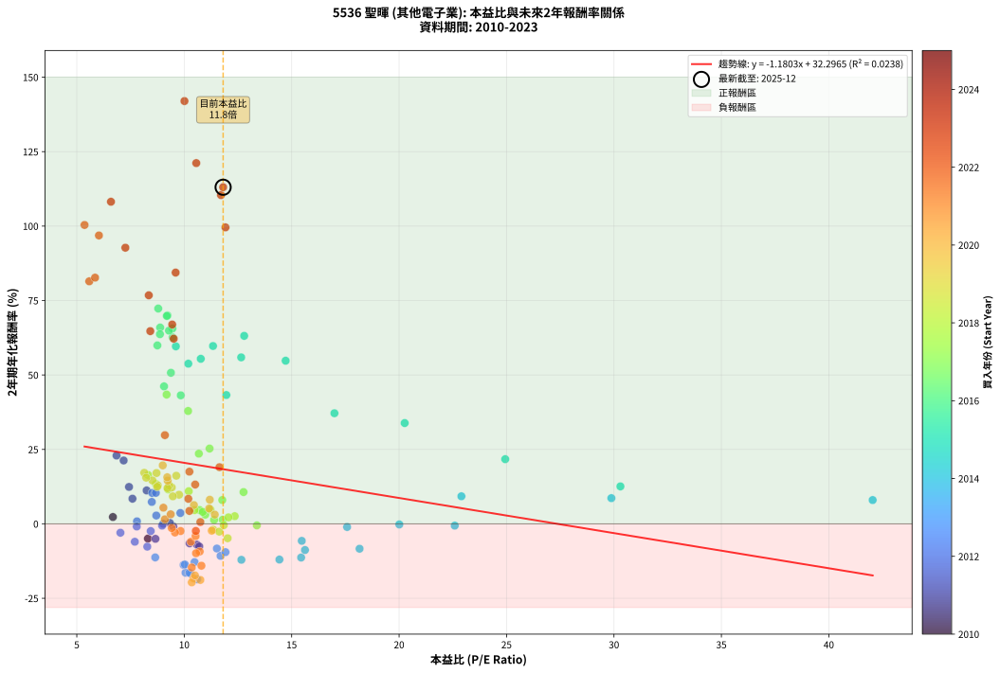
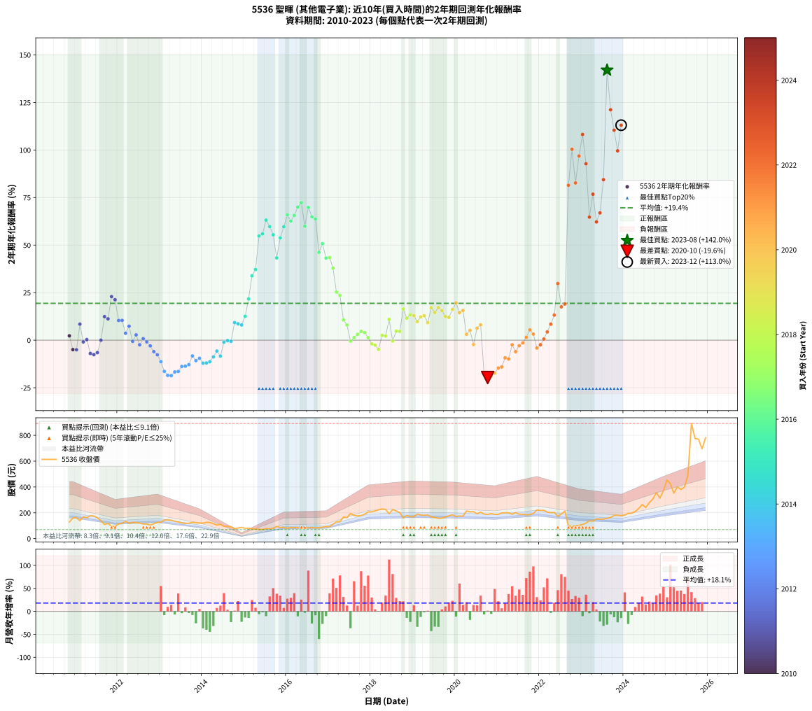

# 5536 聖暉 - 本益比與未來報酬率分析

!!! info "報告資訊"
    - **股票代號**: 5536
    - **公司名稱**: 聖暉
    - **產業別**: 其他電子業
    - **分析期間**: 2010-2023 (158 個數據點)
    - **資料來源**: Type 12 (ShowMonthlyK_ChartFlow) 月收盤價與本益比
    - **報酬率口徑**: 含現金股利 (簡化: 年度合計，假設每年7/1入帳)
    - **報告生成時間**: 2026-01-13 01:06:31 CST

## 📈 視覺化圖表

### 圖表1: 本益比 vs 未來報酬率關係

*圖表1：5536 聖暉 本益比與2年期未來報酬率關係 (2010-2023)*

### 圖表2: 歷年買入時點的2年期實際報酬率

*圖表2：5536 聖暉 歷年買入時點的2年期實際報酬率 (2010-2023)*

## 📍 買點訊號說明

本報告提供兩種買點提示訊號（顯示於圖表2的股價子圖中）：

### ▲ 小綠色三角形（回測驗證）
- **計算方式**: 使用全部歷史資料計算本益比第25百分位數
- **用途**: 事後驗證，顯示歷史上哪些時點確實為低估區
- **限制**: 當下無法判斷，僅供回測參考
- **特性**: 後見之明（Look-Ahead Bias）

### ▲ 小橘色三角形（即時訊號）
- **計算方式**: 使用截至當月的過去5年資料計算本益比第25百分位數
- **用途**: 實際投資決策，當時即可判斷
- **優勢**: 可操作性強，符合實務需求
- **特性**: 無後見之明，滾動窗口計算

!!! tip "如何使用兩種訊號"
    - **綠色▲** 幫助理解歷史估值機會，驗證策略有效性
    - **橘色▲** 可作為實際買進參考，但仍需搭配基本面分析
    - 兩種訊號重疊時，表示即時判斷與事後驗證一致，信心度較高
    - 僅有綠色▲時，表示當時無法判斷（需要未來資料才能確認）
    - 僅有橘色▲時，表示即時判斷為買點，但事後可能不是最佳時機

## 📊 估值分析摘要

| 指標 | 數值 |
|:---:|:---:|
| **目前本益比** (2023-12) | **11.81 倍** |
| **歷史平均本益比** | 10.94 倍 |
| **估值水準** | 🟡 合理範圍 |
| **預期2年年化報酬率** | **+18.36%** |
| **歷史平均報酬率** | +19.39% |
| **相關係數 (R²)** | 0.0238 |
| **趨勢線斜率** | -1.1803 |

!!! abstract "核心洞察"
    目前本益比接近歷史平均，預期報酬率符合長期趨勢

    根據歷史數據回測，5536 聖暉 在目前本益比 **11.8倍** 的估值水準下，
    預期未來2年年化報酬率約為 **+18.4%**。

    **重要提醒**: 本分析基於歷史數據統計，實際報酬率會受到公司基本面變化、產業趨勢、
    總體經濟環境等多重因素影響。R² = 0.02 表示本益比可解釋約 2.4% 的報酬率變異。

## 📈 歷史估值統計

### 最佳買點 (最高報酬率)

| 項目 | 數值 |
|:---:|:---:|
| 起始時間 | 2023-08 |
| 當時本益比 | 10.01 倍 |
| 起始價格 | 156.5 元 |
| 2年後價格 | 892.0 元 |
| **2年年化報酬率** | **+141.98%** |

### 最差買點 (最低報酬率)

| 項目 | 數值 |
|:---:|:---:|
| 起始時間 | 2020-10 |
| 當時本益比 | 10.35 倍 |
| 起始價格 | 187.5 元 |
| 2年後價格 | 94.1 元 |
| **2年年化報酬率** | **-19.65%** |

## 🎯 投資啟示

### 本益比與報酬率關係

趨勢線方程式: **y = -1.1803x + 32.2965**

!!! warning "強負相關"
    本益比與未來報酬率呈現強負相關。在高本益比時期買入，未來報酬率顯著較低；
    在低本益比時期買入，未來報酬率顯著較高。**估值紀律至關重要**。

### 估值區間建議

基於歷史數據分析:

- **🟢 低估區** (P/E < 8.7): 預期報酬率較高，可考慮增加持股
- **🟡 合理區** (P/E 8.7-13.1): 預期報酬率符合長期趨勢，正常持有
- **🔴 高估區** (P/E > 13.1): 預期報酬率較低，可考慮減碼或觀望

!!! danger "風險提示"
    - 過去表現不代表未來結果
    - 本分析假設公司基本面無重大結構性變化
    - 產業環境劇變可能使歷史規律失效
    - 應結合公司財報、產業趨勢、總體經濟等多重因素綜合判斷

!!! success "長期投資觀點"
    歷史數據顯示，在合理或低估的估值水準買入並長期持有，
    往往能獲得較佳的投資報酬。**耐心等待好價格**是價值投資的核心原則。

## 📊 數據品質

- **資料來源**: GoodInfo.tw Type 12 (ShowMonthlyK_ChartFlow)
- **資料頻率**: 月度收盤價與本益比
- **回測期間**: 2010-2023
- **數據點數量**: 158 個 (每個點代表一次2年期回測)

### 計算方法說明

1. **2年期年化報酬率**:
   - 對每個歷史時點，計算其後2年的實際投資報酬率
   - 期末價值(不含股利): 期末價格
   - 期末價值(含現金股利): 期末價格 + 持有期間內的現金股利合計 (簡化: 年度合計，假設每年7/1入帳)
   - 公式: 年化報酬率 = [(期末價值/期初價格)^(1/年數) - 1] × 100%

2. **本益比 (P/E Ratio)**:
   - 使用當時的月收盤價與EPS計算
   - 資料來源: Type 12 月度河流圖本益比數據

3. **趨勢線 (Linear Regression)**:
   - 使用最小平方法擬合線性趨勢線
   - R²值衡量本益比對報酬率的解釋能力

---

*本報告由 Stock Analysis System v1.9.0 自動生成*
*數據更新時間: 2026-01-13 01:06:31 CST*

## 📋 月度回測明細表

（每一列對應時間線圖中的一個買入點；可用來對照 SVG 圖上的每個點。）

| 買入月份 | 賣出月份 | 回測期限_年 | 實際持有年數 | 買入本益比_倍 | 買入收盤價_元 | 賣出收盤價_元 | 現金股利合計_元 | 總報酬率_pct | 年化報酬率_pct |
| --- | --- | --- | --- | --- | --- | --- | --- | --- | --- |
| 2010-11 | 2012-11 | 2 | 2.001 | 6.68 | 129.00 | 115.00 | 20.00 | +4.65 | +2.30 |
| 2010-12 | 2012-12 | 2 | 2.001 | 8.31 | 160.50 | 125.00 | 20.00 | -9.66 | -4.95 |
| 2011-01 | 2013-01 | 2 | 2.001 | 8.66 | 163.00 | 127.00 | 20.00 | -9.82 | -5.03 |
| 2011-02 | 2013-02 | 2 | 2.001 | 7.59 | 139.00 | 143.50 | 20.00 | +17.63 | +8.45 |
| 2011-03 | 2013-03 | 2 | 2.001 | 9.49 | 169.00 | 146.00 | 20.00 | -1.78 | -0.89 |
| 2011-04 | 2013-04 | 2 | 2.001 | 9.33 | 161.50 | 142.50 | 20.00 | +0.62 | +0.31 |
| 2011-05 | 2013-05 | 2 | 2.001 | 10.59 | 178.00 | 134.00 | 20.00 | -13.48 | -6.98 |
| 2011-06 | 2013-06 | 2 | 2.001 | 10.70 | 174.50 | 129.00 | 20.00 | -14.61 | -7.59 |
| 2011-07 | 2013-07 | 2 | 2.001 | 10.25 | 162.00 | 121.50 | 20.00 | -12.65 | -6.54 |
| 2011-08 | 2013-08 | 2 | 2.001 | 9.02 | 138.00 | 118.00 | 20.00 | +0.00 | +0.00 |
| 2011-09 | 2013-09 | 2 | 2.001 | 7.43 | 110.00 | 119.00 | 20.00 | +26.36 | +12.40 |
| 2011-10 | 2013-10 | 2 | 2.001 | 8.25 | 118.00 | 126.00 | 20.00 | +23.73 | +11.23 |
| 2011-11 | 2013-11 | 2 | 2.001 | 6.85 | 94.60 | 123.00 | 20.00 | +51.16 | +22.93 |
| 2011-12 | 2013-12 | 2 | 2.001 | 7.18 | 95.50 | 120.50 | 20.00 | +47.12 | +21.28 |
| 2012-01 | 2014-01 | 2 | 2.001 | 8.51 | 114.50 | 119.50 | 20.00 | +21.83 | +10.37 |
| 2012-02 | 2014-03 | 2 | 2.081 | 8.68 | 118.00 | 125.00 | 20.00 | +22.88 | +10.41 |
| 2012-03 | 2014-03 | 2 | 1.999 | 9.82 | 135.00 | 125.00 | 20.00 | +7.41 | +3.64 |
| 2012-04 | 2014-04 | 2 | 1.999 | 8.49 | 118.00 | 116.00 | 20.00 | +15.25 | +7.36 |
| 2012-05 | 2014-05 | 2 | 1.999 | 8.97 | 126.00 | 104.50 | 20.00 | -1.19 | -0.60 |
| 2012-06 | 2014-06 | 2 | 1.999 | 8.70 | 123.50 | 110.50 | 20.00 | +5.67 | +2.80 |
| 2012-07 | 2014-07 | 2 | 1.999 | 8.44 | 121.00 | 95.20 | 20.00 | -4.79 | -2.43 |
| 2012-08 | 2014-08 | 2 | 1.999 | 7.80 | 113.00 | 94.90 | 20.00 | +1.68 | +0.84 |
| 2012-09 | 2014-09 | 2 | 1.999 | 7.79 | 114.00 | 92.00 | 20.00 | -1.75 | -0.88 |
| 2012-10 | 2014-10 | 2 | 1.999 | 7.03 | 104.00 | 77.90 | 20.00 | -5.87 | -2.98 |
| 2012-11 | 2014-11 | 2 | 1.999 | 7.70 | 115.00 | 81.60 | 20.00 | -11.65 | -6.01 |
| 2012-12 | 2014-12 | 2 | 1.999 | 8.28 | 125.00 | 86.60 | 20.00 | -14.72 | -7.66 |
| 2013-01 | 2015-01 | 2 | 1.999 | 8.65 | 127.00 | 80.00 | 20.00 | -21.26 | -11.27 |
| 2013-02 | 2015-02 | 2 | 1.999 | 10.06 | 143.50 | 80.30 | 20.00 | -30.10 | -16.41 |
| 2013-03 | 2015-03 | 2 | 1.999 | 10.55 | 146.00 | 77.00 | 20.00 | -33.56 | -18.50 |
| 2013-04 | 2015-04 | 2 | 1.999 | 10.61 | 142.50 | 74.40 | 20.00 | -33.75 | -18.62 |
| 2013-05 | 2015-05 | 2 | 1.999 | 10.30 | 134.00 | 73.00 | 20.00 | -30.60 | -16.70 |
| 2013-06 | 2015-06 | 2 | 1.999 | 10.24 | 129.00 | 70.10 | 20.00 | -30.16 | -16.44 |
| 2013-07 | 2015-07 | 2 | 1.999 | 9.97 | 121.50 | 78.30 | 12.00 | -25.68 | -13.80 |
| 2013-08 | 2015-08 | 2 | 1.999 | 10.03 | 118.00 | 76.00 | 12.00 | -25.42 | -13.65 |
| 2013-09 | 2015-09 | 2 | 1.999 | 10.48 | 119.00 | 78.40 | 12.00 | -24.03 | -12.85 |
| 2013-10 | 2015-10 | 2 | 1.999 | 11.52 | 126.00 | 94.00 | 12.00 | -15.87 | -8.28 |
| 2013-11 | 2015-11 | 2 | 1.999 | 11.69 | 123.00 | 86.00 | 12.00 | -20.33 | -10.75 |
| 2013-12 | 2015-12 | 2 | 1.999 | 11.92 | 120.50 | 86.70 | 12.00 | -18.09 | -9.50 |
| 2014-01 | 2016-01 | 2 | 1.999 | 12.66 | 119.50 | 80.40 | 12.00 | -22.68 | -12.07 |
| 2014-02 | 2016-02 | 2 | 1.999 | 14.43 | 126.50 | 86.00 | 12.00 | -22.53 | -11.99 |
| 2014-03 | 2016-03 | 2 | 2.001 | 15.44 | 125.00 | 86.30 | 12.00 | -21.36 | -11.31 |
| 2014-04 | 2016-04 | 2 | 2.001 | 15.62 | 116.00 | 84.50 | 12.00 | -16.81 | -8.79 |
| 2014-05 | 2016-05 | 2 | 2.001 | 15.47 | 104.50 | 80.90 | 12.00 | -11.10 | -5.71 |
| 2014-06 | 2016-06 | 2 | 2.001 | 18.16 | 110.50 | 80.80 | 12.00 | -16.02 | -8.35 |
| 2014-07 | 2016-07 | 2 | 2.001 | 17.58 | 95.20 | 85.20 | 8.00 | -2.10 | -1.05 |
| 2014-08 | 2016-08 | 2 | 2.001 | 20.01 | 94.90 | 86.50 | 8.00 | -0.42 | -0.21 |
| 2014-09 | 2016-09 | 2 | 2.001 | 22.59 | 92.00 | 82.90 | 8.00 | -1.19 | -0.60 |
| 2014-10 | 2016-10 | 2 | 2.001 | 22.90 | 77.90 | 85.00 | 8.00 | +19.39 | +9.26 |
| 2014-11 | 2016-11 | 2 | 2.001 | 29.88 | 81.60 | 88.30 | 8.00 | +18.02 | +8.63 |
| 2014-12 | 2016-12 | 2 | 2.001 | 42.04 | 86.60 | 93.00 | 8.00 | +16.63 | +7.99 |
| 2015-01 | 2017-01 | 2 | 2.001 | 30.30 | 80.00 | 93.40 | 8.00 | +26.76 | +12.58 |
| 2015-02 | 2017-02 | 2 | 2.001 | 24.94 | 80.30 | 111.00 | 8.00 | +48.20 | +21.72 |
| 2015-03 | 2017-03 | 2 | 2.001 | 20.26 | 77.00 | 130.00 | 8.00 | +79.23 | +33.85 |
| 2015-04 | 2017-04 | 2 | 2.001 | 16.99 | 74.40 | 132.00 | 8.00 | +88.18 | +37.15 |
| 2015-05 | 2017-05 | 2 | 2.001 | 14.72 | 73.00 | 167.00 | 8.00 | +139.73 | +54.79 |
| 2015-06 | 2017-06 | 2 | 2.001 | 12.65 | 70.10 | 162.50 | 8.00 | +143.23 | +55.91 |
| 2015-07 | 2017-07 | 2 | 2.001 | 12.79 | 78.30 | 194.50 | 14.02 | +166.31 | +63.13 |
| 2015-08 | 2017-08 | 2 | 2.001 | 11.34 | 76.00 | 180.00 | 14.02 | +155.29 | +59.73 |
| 2015-09 | 2017-09 | 2 | 2.001 | 10.77 | 78.40 | 175.50 | 14.02 | +141.73 | +55.43 |
| 2015-10 | 2017-10 | 2 | 2.001 | 11.96 | 94.00 | 179.00 | 14.02 | +105.34 | +43.26 |
| 2015-11 | 2017-11 | 2 | 2.001 | 10.19 | 86.00 | 189.50 | 14.02 | +136.65 | +53.79 |
| 2015-12 | 2017-12 | 2 | 2.001 | 9.61 | 86.70 | 207.00 | 14.02 | +154.92 | +59.61 |
| 2016-01 | 2018-01 | 2 | 2.001 | 8.88 | 80.40 | 207.50 | 14.02 | +175.52 | +65.93 |
| 2016-02 | 2018-03 | 2 | 2.081 | 9.46 | 86.00 | 222.50 | 14.02 | +175.02 | +62.61 |
| 2016-03 | 2018-03 | 2 | 1.999 | 9.45 | 86.30 | 222.50 | 14.02 | +174.06 | +65.61 |
| 2016-04 | 2018-04 | 2 | 1.999 | 9.22 | 84.50 | 230.00 | 14.02 | +188.78 | +70.00 |
| 2016-05 | 2018-05 | 2 | 1.999 | 8.79 | 80.90 | 226.00 | 14.02 | +196.68 | +72.31 |
| 2016-06 | 2018-06 | 2 | 1.999 | 8.75 | 80.80 | 192.50 | 14.02 | +155.59 | +59.92 |
| 2016-07 | 2018-07 | 2 | 1.999 | 9.19 | 85.20 | 224.50 | 21.01 | +188.16 | +69.81 |
| 2016-08 | 2018-08 | 2 | 1.999 | 9.29 | 86.50 | 214.00 | 21.01 | +171.69 | +64.89 |
| 2016-09 | 2018-09 | 2 | 1.999 | 8.87 | 82.90 | 201.00 | 21.01 | +167.81 | +63.70 |
| 2016-10 | 2018-10 | 2 | 1.999 | 9.06 | 85.00 | 160.50 | 21.01 | +113.55 | +46.17 |
| 2016-11 | 2018-11 | 2 | 1.999 | 9.38 | 88.30 | 179.50 | 21.01 | +127.08 | +50.73 |
| 2016-12 | 2018-12 | 2 | 1.999 | 9.84 | 93.00 | 169.50 | 21.01 | +104.85 | +43.16 |
| 2017-01 | 2019-01 | 2 | 1.999 | 9.18 | 93.40 | 171.00 | 21.01 | +105.58 | +43.42 |
| 2017-02 | 2019-02 | 2 | 1.999 | 10.18 | 111.00 | 190.00 | 21.01 | +90.10 | +37.91 |
| 2017-03 | 2019-03 | 2 | 1.999 | 11.18 | 130.00 | 183.00 | 21.01 | +56.93 | +25.29 |
| 2017-04 | 2019-04 | 2 | 1.999 | 10.68 | 132.00 | 180.50 | 21.01 | +52.66 | +23.57 |
| 2017-05 | 2019-05 | 2 | 1.999 | 12.76 | 167.00 | 183.50 | 21.01 | +22.46 | +10.67 |
| 2017-06 | 2019-06 | 2 | 1.999 | 11.77 | 162.50 | 168.50 | 21.01 | +16.62 | +8.00 |
| 2017-07 | 2019-07 | 2 | 1.999 | 13.38 | 194.50 | 164.50 | 28.00 | -1.03 | -0.52 |
| 2017-08 | 2019-08 | 2 | 1.999 | 11.79 | 180.00 | 157.00 | 28.00 | +2.78 | +1.38 |
| 2017-09 | 2019-09 | 2 | 1.999 | 10.98 | 175.50 | 158.50 | 28.00 | +6.27 | +3.09 |
| 2017-10 | 2019-10 | 2 | 1.999 | 10.71 | 179.00 | 168.00 | 28.00 | +9.50 | +4.64 |
| 2017-11 | 2019-11 | 2 | 1.999 | 10.86 | 189.50 | 177.00 | 28.00 | +8.18 | +4.01 |
| 2017-12 | 2019-12 | 2 | 1.999 | 11.39 | 207.00 | 184.50 | 28.00 | +2.66 | +1.32 |
| 2018-01 | 2020-01 | 2 | 1.999 | 11.35 | 207.50 | 171.50 | 28.00 | -3.86 | -1.95 |
| 2018-02 | 2020-02 | 2 | 1.999 | 11.63 | 214.00 | 175.00 | 28.00 | -5.14 | -2.61 |
| 2018-03 | 2020-03 | 2 | 2.001 | 12.02 | 222.50 | 173.50 | 28.00 | -9.44 | -4.83 |
| 2018-04 | 2020-04 | 2 | 2.001 | 12.35 | 230.00 | 214.00 | 28.00 | +5.22 | +2.57 |
| 2018-05 | 2020-05 | 2 | 2.001 | 12.06 | 226.00 | 208.00 | 28.00 | +4.42 | +2.19 |
| 2018-06 | 2020-06 | 2 | 2.001 | 10.21 | 192.50 | 209.00 | 28.00 | +23.12 | +10.95 |
| 2018-07 | 2020-07 | 2 | 2.001 | 11.84 | 224.50 | 192.50 | 30.00 | -0.89 | -0.45 |
| 2018-08 | 2020-08 | 2 | 2.001 | 11.22 | 214.00 | 205.00 | 30.00 | +9.81 | +4.79 |
| 2018-09 | 2020-09 | 2 | 2.001 | 10.48 | 201.00 | 190.00 | 30.00 | +9.45 | +4.62 |
| 2018-10 | 2020-10 | 2 | 2.001 | 8.32 | 160.50 | 187.50 | 30.00 | +35.51 | +16.40 |
| 2018-11 | 2020-11 | 2 | 2.001 | 9.25 | 179.50 | 193.50 | 30.00 | +24.51 | +11.58 |
| 2018-12 | 2020-12 | 2 | 2.001 | 8.68 | 169.50 | 188.00 | 30.00 | +28.61 | +13.40 |
| 2019-01 | 2021-01 | 2 | 2.001 | 8.77 | 171.00 | 188.00 | 30.00 | +27.49 | +12.90 |
| 2019-02 | 2021-02 | 2 | 2.001 | 9.76 | 190.00 | 199.00 | 30.00 | +20.53 | +9.78 |
| 2019-03 | 2021-03 | 2 | 2.001 | 9.42 | 183.00 | 200.50 | 30.00 | +25.96 | +12.22 |
| 2019-04 | 2021-04 | 2 | 2.001 | 9.30 | 180.50 | 200.00 | 30.00 | +27.42 | +12.87 |
| 2019-05 | 2021-05 | 2 | 2.001 | 9.47 | 183.50 | 189.00 | 30.00 | +19.35 | +9.24 |
| 2019-06 | 2021-06 | 2 | 2.001 | 8.71 | 168.50 | 201.00 | 30.00 | +37.09 | +17.07 |
| 2019-07 | 2021-07 | 2 | 2.001 | 8.52 | 164.50 | 189.00 | 27.00 | +31.31 | +14.58 |
| 2019-08 | 2021-08 | 2 | 2.001 | 8.14 | 157.00 | 188.50 | 27.00 | +37.26 | +17.15 |
| 2019-09 | 2021-09 | 2 | 2.001 | 8.23 | 158.50 | 184.50 | 27.00 | +33.44 | +15.50 |
| 2019-10 | 2021-10 | 2 | 2.001 | 8.74 | 168.00 | 185.50 | 27.00 | +26.49 | +12.46 |
| 2019-11 | 2021-11 | 2 | 2.001 | 9.22 | 177.00 | 195.00 | 27.00 | +25.42 | +11.98 |
| 2019-12 | 2021-12 | 2 | 2.001 | 9.63 | 184.50 | 222.00 | 27.00 | +34.96 | +16.16 |
| 2020-01 | 2022-01 | 2 | 2.001 | 9.00 | 171.50 | 218.50 | 27.00 | +43.15 | +19.63 |
| 2020-02 | 2022-03 | 2 | 2.081 | 9.23 | 175.00 | 205.00 | 27.00 | +32.57 | +14.51 |
| 2020-03 | 2022-03 | 2 | 1.999 | 9.21 | 173.50 | 205.00 | 27.00 | +33.72 | +15.65 |
| 2020-04 | 2022-04 | 2 | 1.999 | 11.42 | 214.00 | 200.50 | 27.00 | +6.31 | +3.11 |
| 2020-05 | 2022-05 | 2 | 1.999 | 11.16 | 208.00 | 203.00 | 27.00 | +10.58 | +5.16 |
| 2020-06 | 2022-06 | 2 | 1.999 | 11.28 | 209.00 | 172.50 | 27.00 | -4.55 | -2.30 |
| 2020-07 | 2022-07 | 2 | 1.999 | 10.45 | 192.50 | 190.50 | 27.00 | +12.99 | +6.30 |
| 2020-08 | 2022-08 | 2 | 1.999 | 11.19 | 205.00 | 212.50 | 27.00 | +16.83 | +8.09 |
| 2020-09 | 2022-09 | 2 | 1.999 | 10.43 | 190.00 | 99.90 | 27.00 | -33.21 | -18.29 |
| 2020-10 | 2022-10 | 2 | 1.999 | 10.35 | 187.50 | 94.10 | 27.00 | -35.41 | -19.65 |
| 2020-11 | 2022-11 | 2 | 1.999 | 10.75 | 193.50 | 100.50 | 27.00 | -34.11 | -18.84 |
| 2020-12 | 2022-12 | 2 | 1.999 | 10.50 | 188.00 | 101.50 | 27.00 | -31.65 | -17.34 |
| 2021-01 | 2023-01 | 2 | 1.999 | 10.35 | 188.00 | 110.00 | 27.00 | -27.13 | -14.64 |
| 2021-02 | 2023-02 | 2 | 1.999 | 10.80 | 199.00 | 120.00 | 27.00 | -26.13 | -14.06 |
| 2021-03 | 2023-03 | 2 | 1.999 | 10.72 | 200.50 | 138.00 | 27.00 | -17.71 | -9.29 |
| 2021-04 | 2023-04 | 2 | 1.999 | 10.55 | 200.00 | 135.50 | 27.00 | -18.75 | -9.87 |
| 2021-05 | 2023-05 | 2 | 1.999 | 9.83 | 189.00 | 153.00 | 27.00 | -4.76 | -2.41 |
| 2021-06 | 2023-06 | 2 | 1.999 | 10.31 | 201.00 | 150.50 | 27.00 | -11.69 | -6.03 |
| 2021-07 | 2023-07 | 2 | 1.999 | 9.57 | 189.00 | 151.50 | 26.68 | -5.72 | -2.91 |
| 2021-08 | 2023-08 | 2 | 1.999 | 9.42 | 188.50 | 156.50 | 26.68 | -2.82 | -1.42 |
| 2021-09 | 2023-09 | 2 | 1.999 | 9.10 | 184.50 | 163.50 | 26.68 | +3.08 | +1.53 |
| 2021-10 | 2023-10 | 2 | 1.999 | 9.03 | 185.50 | 179.50 | 26.68 | +11.15 | +5.43 |
| 2021-11 | 2023-11 | 2 | 1.999 | 9.37 | 195.00 | 181.00 | 26.68 | +6.50 | +3.20 |
| 2021-12 | 2023-12 | 2 | 1.999 | 10.53 | 222.00 | 177.50 | 26.68 | -8.03 | -4.10 |
| 2022-01 | 2024-01 | 2 | 1.999 | 10.54 | 218.50 | 181.50 | 26.68 | -4.72 | -2.39 |
| 2022-02 | 2024-02 | 2 | 1.999 | 10.75 | 219.00 | 195.00 | 26.68 | +1.22 | +0.61 |
| 2022-03 | 2024-03 | 2 | 2.001 | 10.24 | 205.00 | 196.50 | 26.68 | +8.87 | +4.34 |
| 2022-04 | 2024-04 | 2 | 2.001 | 10.19 | 200.50 | 209.00 | 26.68 | +17.55 | +8.41 |
| 2022-05 | 2024-05 | 2 | 2.001 | 10.51 | 203.00 | 233.50 | 26.68 | +28.17 | +13.20 |
| 2022-06 | 2024-06 | 2 | 2.001 | 9.10 | 172.50 | 264.00 | 26.68 | +68.51 | +29.79 |
| 2022-07 | 2024-07 | 2 | 2.001 | 10.24 | 190.50 | 241.00 | 22.18 | +38.15 | +17.53 |
| 2022-08 | 2024-08 | 2 | 2.001 | 11.64 | 212.50 | 279.00 | 22.18 | +41.73 | +19.04 |
| 2022-09 | 2024-09 | 2 | 2.001 | 5.58 | 99.90 | 307.00 | 22.18 | +229.51 | +81.45 |
| 2022-10 | 2024-10 | 2 | 2.001 | 5.36 | 94.10 | 356.00 | 22.18 | +301.89 | +100.38 |
| 2022-11 | 2024-11 | 2 | 2.001 | 5.85 | 100.50 | 313.50 | 22.18 | +234.01 | +82.68 |
| 2022-12 | 2024-12 | 2 | 2.001 | 6.03 | 101.50 | 371.50 | 22.18 | +287.86 | +96.85 |
| 2023-01 | 2025-01 | 2 | 2.001 | 6.59 | 110.00 | 455.00 | 22.18 | +333.80 | +108.17 |
| 2023-02 | 2025-02 | 2 | 2.001 | 7.26 | 120.00 | 424.00 | 22.18 | +271.82 | +92.74 |
| 2023-03 | 2025-03 | 2 | 2.001 | 8.42 | 138.00 | 352.50 | 22.18 | +171.51 | +64.72 |
| 2023-04 | 2025-04 | 2 | 2.001 | 8.35 | 135.50 | 401.50 | 22.18 | +212.68 | +76.76 |
| 2023-05 | 2025-05 | 2 | 2.001 | 9.51 | 153.00 | 380.50 | 22.18 | +163.19 | +62.18 |
| 2023-06 | 2025-06 | 2 | 2.001 | 9.44 | 150.50 | 397.50 | 22.18 | +178.86 | +66.93 |
| 2023-07 | 2025-07 | 2 | 2.001 | 9.60 | 151.50 | 490.00 | 25.50 | +240.26 | +84.39 |
| 2023-08 | 2025-08 | 2 | 2.001 | 10.01 | 156.50 | 892.00 | 25.50 | +486.26 | +141.98 |
| 2023-09 | 2025-09 | 2 | 2.001 | 10.56 | 163.50 | 775.00 | 25.50 | +389.60 | +121.15 |
| 2023-10 | 2025-10 | 2 | 2.001 | 11.71 | 179.50 | 770.00 | 25.50 | +343.18 | +110.41 |
| 2023-11 | 2025-11 | 2 | 2.001 | 11.92 | 181.00 | 696.00 | 25.50 | +298.62 | +99.56 |
| 2023-12 | 2025-12 | 2 | 2.001 | 11.81 | 177.50 | 781.00 | 25.50 | +354.37 | +113.05 |
