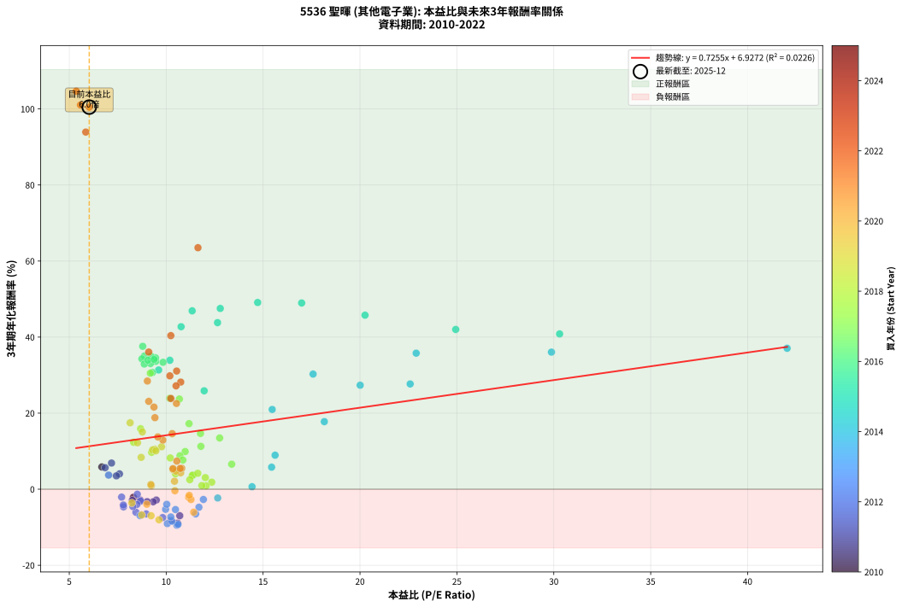
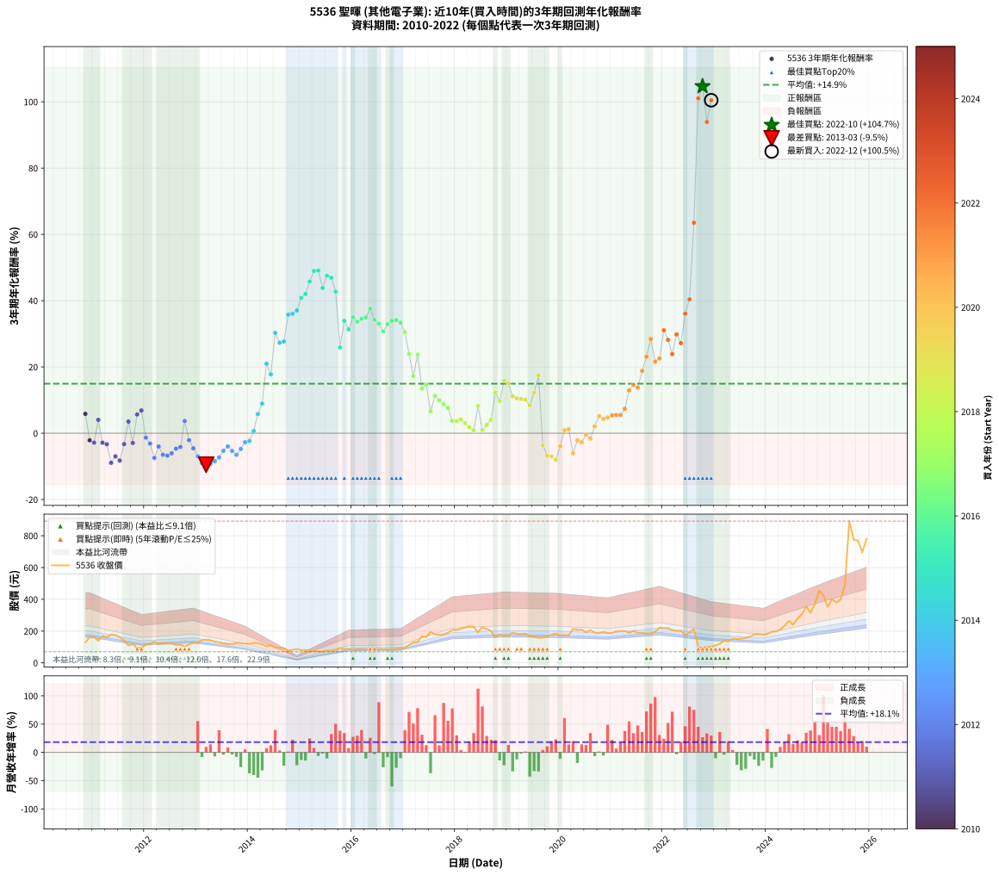

# 5536 聖暉 - 本益比與未來報酬率分析

!!! info "報告資訊"
    - **股票代號**: 5536
    - **公司名稱**: 聖暉
    - **產業別**: 其他電子業
    - **分析期間**: 2010-2022 (146 個數據點)
    - **資料來源**: Type 12 (ShowMonthlyK_ChartFlow) 月收盤價與本益比
    - **報酬率口徑**: 含現金股利 (簡化: 年度合計，假設每年7/1入帳)
    - **報告生成時間**: 2026-01-11 21:12:26 CST

## 📈 視覺化圖表

### 圖表1: 本益比 vs 未來報酬率關係

*圖表1：5536 聖暉 本益比與3年期未來報酬率關係 (2010-2022)*

### 圖表2: 歷年買入時點的3年期實際報酬率

*圖表2：5536 聖暉 歷年買入時點的3年期實際報酬率 (2010-2022)*

## 📍 買點訊號說明

本報告提供兩種買點提示訊號（顯示於圖表2的股價子圖中）：

### ▲ 小綠色三角形（回測驗證）
- **計算方式**: 使用全部歷史資料計算本益比第25百分位數
- **用途**: 事後驗證，顯示歷史上哪些時點確實為低估區
- **限制**: 當下無法判斷，僅供回測參考
- **特性**: 後見之明（Look-Ahead Bias）

### ▲ 小橘色三角形（即時訊號）
- **計算方式**: 使用截至當月的過去5年資料計算本益比第25百分位數
- **用途**: 實際投資決策，當時即可判斷
- **優勢**: 可操作性強，符合實務需求
- **特性**: 無後見之明，滾動窗口計算

!!! tip "如何使用兩種訊號"
    - **綠色▲** 幫助理解歷史估值機會，驗證策略有效性
    - **橘色▲** 可作為實際買進參考，但仍需搭配基本面分析
    - 兩種訊號重疊時，表示即時判斷與事後驗證一致，信心度較高
    - 僅有綠色▲時，表示當時無法判斷（需要未來資料才能確認）
    - 僅有橘色▲時，表示即時判斷為買點，但事後可能不是最佳時機

## 📊 估值分析摘要

| 指標 | 數值 |
|:---:|:---:|
| **目前本益比** (2022-12) | **6.03 倍** |
| **歷史平均本益比** | 11.05 倍 |
| **估值水準** | 🟢 相對低估 |
| **預期3年年化報酬率** | **+11.30%** |
| **歷史平均報酬率** | +14.94% |
| **相關係數 (R²)** | 0.0226 |
| **趨勢線斜率** | 0.7255 |

!!! abstract "核心洞察"
    目前本益比顯著低於歷史平均，預期未來報酬率可能較高

    根據歷史數據回測，5536 聖暉 在目前本益比 **6.0倍** 的估值水準下，
    預期未來3年年化報酬率約為 **+11.3%**。

    **重要提醒**: 本分析基於歷史數據統計，實際報酬率會受到公司基本面變化、產業趨勢、
    總體經濟環境等多重因素影響。R² = 0.02 表示本益比可解釋約 2.3% 的報酬率變異。

## 📈 歷史估值統計

### 最佳買點 (最高報酬率)

| 項目 | 數值 |
|:---:|:---:|
| 起始時間 | 2022-10 |
| 當時本益比 | 5.36 倍 |
| 起始價格 | 94.1 元 |
| 3年後價格 | 770.0 元 |
| **3年年化報酬率** | **+104.67%** |

### 最差買點 (最低報酬率)

| 項目 | 數值 |
|:---:|:---:|
| 起始時間 | 2013-03 |
| 當時本益比 | 10.55 倍 |
| 起始價格 | 146.0 元 |
| 3年後價格 | 86.3 元 |
| **3年年化報酬率** | **-9.48%** |

## 🎯 投資啟示

### 本益比與報酬率關係

趨勢線方程式: **y = 0.7255x + 6.9272**

!!! info "弱相關或正相關"
    本益比與未來報酬率相關性較弱。這可能表示該股票的報酬率更多受到
    公司成長性、產業趨勢等因素影響，而非估值水準。**需綜合考量多項指標**。

### 估值區間建議

基於歷史數據分析:

- **🟢 低估區** (P/E < 8.8): 預期報酬率較高，可考慮增加持股
- **🟡 合理區** (P/E 8.8-13.3): 預期報酬率符合長期趨勢，正常持有
- **🔴 高估區** (P/E > 13.3): 預期報酬率較低，可考慮減碼或觀望

!!! danger "風險提示"
    - 過去表現不代表未來結果
    - 本分析假設公司基本面無重大結構性變化
    - 產業環境劇變可能使歷史規律失效
    - 應結合公司財報、產業趨勢、總體經濟等多重因素綜合判斷

!!! success "長期投資觀點"
    歷史數據顯示，在合理或低估的估值水準買入並長期持有，
    往往能獲得較佳的投資報酬。**耐心等待好價格**是價值投資的核心原則。

## 📊 數據品質

- **資料來源**: GoodInfo.tw Type 12 (ShowMonthlyK_ChartFlow)
- **資料頻率**: 月度收盤價與本益比
- **回測期間**: 2010-2022
- **數據點數量**: 146 個 (每個點代表一次3年期回測)

### 計算方法說明

1. **3年期年化報酬率**:
   - 對每個歷史時點，計算其後3年的實際投資報酬率
   - 期末價值(不含股利): 期末價格
   - 期末價值(含現金股利): 期末價格 + 持有期間內的現金股利合計 (簡化: 年度合計，假設每年7/1入帳)
   - 公式: 年化報酬率 = [(期末價值/期初價格)^(1/年數) - 1] × 100%

2. **本益比 (P/E Ratio)**:
   - 使用當時的月收盤價與EPS計算
   - 資料來源: Type 12 月度河流圖本益比數據

3. **趨勢線 (Linear Regression)**:
   - 使用最小平方法擬合線性趨勢線
   - R²值衡量本益比對報酬率的解釋能力

---

*本報告由 Stock Analysis System v1.9.0 自動生成*
*數據更新時間: 2026-01-11 21:12:26 CST*

## 📋 月度回測明細表

（每一列對應時間線圖中的一個買入點；可用來對照 SVG 圖上的每個點。）

| 買入月份 | 賣出月份 | 回測期限_年 | 實際持有年數 | 買入本益比_倍 | 買入收盤價_元 | 賣出收盤價_元 | 現金股利合計_元 | 總報酬率_pct | 年化報酬率_pct |
| --- | --- | --- | --- | --- | --- | --- | --- | --- | --- |
| 2010-11 | 2013-11 | 3 | 3.001 | 6.68 | 129.00 | 123.00 | 30.00 | +18.60 | +5.85 |
| 2010-12 | 2013-12 | 3 | 3.001 | 8.31 | 160.50 | 120.50 | 30.00 | -6.23 | -2.12 |
| 2011-01 | 2014-01 | 3 | 3.001 | 8.66 | 163.00 | 119.50 | 30.00 | -8.28 | -2.84 |
| 2011-02 | 2014-02 | 3 | 3.001 | 7.59 | 139.00 | 126.50 | 30.00 | +12.59 | +4.03 |
| 2011-03 | 2014-03 | 3 | 3.001 | 9.49 | 169.00 | 125.00 | 30.00 | -8.28 | -2.84 |
| 2011-04 | 2014-04 | 3 | 3.001 | 9.33 | 161.50 | 116.00 | 30.00 | -9.60 | -3.31 |
| 2011-05 | 2014-05 | 3 | 3.001 | 10.59 | 178.00 | 104.50 | 30.00 | -24.44 | -8.92 |
| 2011-06 | 2014-06 | 3 | 3.001 | 10.70 | 174.50 | 110.50 | 30.00 | -19.48 | -6.97 |
| 2011-07 | 2014-07 | 3 | 3.001 | 10.25 | 162.00 | 95.20 | 30.00 | -22.72 | -8.23 |
| 2011-08 | 2014-08 | 3 | 3.001 | 9.02 | 138.00 | 94.90 | 30.00 | -9.49 | -3.27 |
| 2011-09 | 2014-09 | 3 | 3.001 | 7.43 | 110.00 | 92.00 | 30.00 | +10.91 | +3.51 |
| 2011-10 | 2014-10 | 3 | 3.001 | 8.25 | 118.00 | 77.90 | 30.00 | -8.56 | -2.94 |
| 2011-11 | 2014-11 | 3 | 3.001 | 6.85 | 94.60 | 81.60 | 30.00 | +17.97 | +5.66 |
| 2011-12 | 2014-12 | 3 | 3.001 | 7.18 | 95.50 | 86.60 | 30.00 | +22.09 | +6.88 |
| 2012-01 | 2015-01 | 3 | 3.001 | 8.51 | 114.50 | 80.00 | 30.00 | -3.93 | -1.33 |
| 2012-02 | 2015-03 | 3 | 3.080 | 8.68 | 118.00 | 77.00 | 30.00 | -9.32 | -3.13 |
| 2012-03 | 2015-03 | 3 | 2.998 | 9.82 | 135.00 | 77.00 | 30.00 | -20.74 | -7.46 |
| 2012-04 | 2015-04 | 3 | 2.998 | 8.49 | 118.00 | 74.40 | 30.00 | -11.53 | -4.00 |
| 2012-05 | 2015-05 | 3 | 2.998 | 8.97 | 126.00 | 73.00 | 30.00 | -18.25 | -6.50 |
| 2012-06 | 2015-06 | 3 | 2.998 | 8.70 | 123.50 | 70.10 | 30.00 | -18.95 | -6.77 |
| 2012-07 | 2015-07 | 3 | 2.998 | 8.44 | 121.00 | 78.30 | 22.00 | -17.11 | -6.07 |
| 2012-08 | 2015-08 | 3 | 2.998 | 7.80 | 113.00 | 76.00 | 22.00 | -13.27 | -4.64 |
| 2012-09 | 2015-09 | 3 | 2.998 | 7.79 | 114.00 | 78.40 | 22.00 | -11.93 | -4.15 |
| 2012-10 | 2015-10 | 3 | 2.998 | 7.03 | 104.00 | 94.00 | 22.00 | +11.54 | +3.71 |
| 2012-11 | 2015-11 | 3 | 2.998 | 7.70 | 115.00 | 86.00 | 22.00 | -6.09 | -2.07 |
| 2012-12 | 2015-12 | 3 | 2.998 | 8.28 | 125.00 | 86.70 | 22.00 | -13.04 | -4.55 |
| 2013-01 | 2016-01 | 3 | 2.998 | 8.65 | 127.00 | 80.40 | 22.00 | -19.37 | -6.93 |
| 2013-02 | 2016-02 | 3 | 2.998 | 10.06 | 143.50 | 86.00 | 22.00 | -24.74 | -9.04 |
| 2013-03 | 2016-03 | 3 | 3.001 | 10.55 | 146.00 | 86.30 | 22.00 | -25.82 | -9.48 |
| 2013-04 | 2016-04 | 3 | 3.001 | 10.61 | 142.50 | 84.50 | 22.00 | -25.26 | -9.25 |
| 2013-05 | 2016-05 | 3 | 3.001 | 10.30 | 134.00 | 80.90 | 22.00 | -23.21 | -8.42 |
| 2013-06 | 2016-06 | 3 | 3.001 | 10.24 | 129.00 | 80.80 | 22.00 | -20.31 | -7.29 |
| 2013-07 | 2016-07 | 3 | 3.001 | 9.97 | 121.50 | 85.20 | 18.00 | -15.06 | -5.29 |
| 2013-08 | 2016-08 | 3 | 3.001 | 10.03 | 118.00 | 86.50 | 18.00 | -11.44 | -3.97 |
| 2013-09 | 2016-09 | 3 | 3.001 | 10.48 | 119.00 | 82.90 | 18.00 | -15.21 | -5.35 |
| 2013-10 | 2016-10 | 3 | 3.001 | 11.52 | 126.00 | 85.00 | 18.00 | -18.25 | -6.50 |
| 2013-11 | 2016-11 | 3 | 3.001 | 11.69 | 123.00 | 88.30 | 18.00 | -13.57 | -4.75 |
| 2013-12 | 2016-12 | 3 | 3.001 | 11.92 | 120.50 | 93.00 | 18.00 | -7.88 | -2.70 |
| 2014-01 | 2017-01 | 3 | 3.001 | 12.66 | 119.50 | 93.40 | 18.00 | -6.77 | -2.31 |
| 2014-02 | 2017-02 | 3 | 3.001 | 14.43 | 126.50 | 111.00 | 18.00 | +1.98 | +0.66 |
| 2014-03 | 2017-03 | 3 | 3.001 | 15.44 | 125.00 | 130.00 | 18.00 | +18.40 | +5.79 |
| 2014-04 | 2017-04 | 3 | 3.001 | 15.62 | 116.00 | 132.00 | 18.00 | +29.31 | +8.94 |
| 2014-05 | 2017-05 | 3 | 3.001 | 15.47 | 104.50 | 167.00 | 18.00 | +77.04 | +20.97 |
| 2014-06 | 2017-06 | 3 | 3.001 | 18.16 | 110.50 | 162.50 | 18.00 | +63.35 | +17.77 |
| 2014-07 | 2017-07 | 3 | 3.001 | 17.58 | 95.20 | 194.50 | 16.02 | +121.13 | +30.27 |
| 2014-08 | 2017-08 | 3 | 3.001 | 20.01 | 94.90 | 180.00 | 16.02 | +106.55 | +27.35 |
| 2014-09 | 2017-09 | 3 | 3.001 | 22.59 | 92.00 | 175.50 | 16.02 | +108.17 | +27.68 |
| 2014-10 | 2017-10 | 3 | 3.001 | 22.90 | 77.90 | 179.00 | 16.02 | +150.34 | +35.77 |
| 2014-11 | 2017-11 | 3 | 3.001 | 29.88 | 81.60 | 189.50 | 16.02 | +151.86 | +36.05 |
| 2014-12 | 2017-12 | 3 | 3.001 | 42.04 | 86.60 | 207.00 | 16.02 | +157.53 | +37.06 |
| 2015-01 | 2018-01 | 3 | 3.001 | 30.30 | 80.00 | 207.50 | 16.02 | +179.40 | +40.83 |
| 2015-02 | 2018-02 | 3 | 3.001 | 24.94 | 80.30 | 214.00 | 16.02 | +186.45 | +42.01 |
| 2015-03 | 2018-03 | 3 | 3.001 | 20.26 | 77.00 | 222.50 | 16.02 | +209.76 | +45.76 |
| 2015-04 | 2018-04 | 3 | 3.001 | 16.99 | 74.40 | 230.00 | 16.02 | +230.67 | +48.97 |
| 2015-05 | 2018-05 | 3 | 3.001 | 14.72 | 73.00 | 226.00 | 16.02 | +231.53 | +49.10 |
| 2015-06 | 2018-06 | 3 | 3.001 | 12.65 | 70.10 | 192.50 | 16.02 | +197.46 | +43.80 |
| 2015-07 | 2018-07 | 3 | 3.001 | 12.79 | 78.30 | 224.50 | 27.02 | +221.22 | +47.54 |
| 2015-08 | 2018-08 | 3 | 3.001 | 11.34 | 76.00 | 214.00 | 27.02 | +217.13 | +46.91 |
| 2015-09 | 2018-09 | 3 | 3.001 | 10.77 | 78.40 | 201.00 | 27.02 | +190.84 | +42.73 |
| 2015-10 | 2018-10 | 3 | 3.001 | 11.96 | 94.00 | 160.50 | 27.02 | +99.49 | +25.88 |
| 2015-11 | 2018-11 | 3 | 3.001 | 10.19 | 86.00 | 179.50 | 27.02 | +140.14 | +33.90 |
| 2015-12 | 2018-12 | 3 | 3.001 | 9.61 | 86.70 | 169.50 | 27.02 | +126.66 | +31.35 |
| 2016-01 | 2019-01 | 3 | 3.001 | 8.88 | 80.40 | 171.00 | 27.02 | +146.29 | +35.04 |
| 2016-02 | 2019-03 | 3 | 3.080 | 9.46 | 86.00 | 183.00 | 27.02 | +144.21 | +33.63 |
| 2016-03 | 2019-03 | 3 | 2.998 | 9.45 | 86.30 | 183.00 | 27.02 | +143.36 | +34.54 |
| 2016-04 | 2019-04 | 3 | 2.998 | 9.22 | 84.50 | 180.50 | 27.02 | +145.58 | +34.94 |
| 2016-05 | 2019-05 | 3 | 2.998 | 8.79 | 80.90 | 183.50 | 27.02 | +160.22 | +37.58 |
| 2016-06 | 2019-06 | 3 | 2.998 | 8.75 | 80.80 | 168.50 | 27.02 | +141.98 | +34.28 |
| 2016-07 | 2019-07 | 3 | 2.998 | 9.19 | 85.20 | 164.50 | 36.01 | +135.35 | +33.04 |
| 2016-08 | 2019-08 | 3 | 2.998 | 9.29 | 86.50 | 157.00 | 36.01 | +123.14 | +30.70 |
| 2016-09 | 2019-09 | 3 | 2.998 | 8.87 | 82.90 | 158.50 | 36.01 | +134.64 | +32.91 |
| 2016-10 | 2019-10 | 3 | 2.998 | 9.06 | 85.00 | 168.00 | 36.01 | +140.02 | +33.92 |
| 2016-11 | 2019-11 | 3 | 2.998 | 9.38 | 88.30 | 177.00 | 36.01 | +141.24 | +34.14 |
| 2016-12 | 2019-12 | 3 | 2.998 | 9.84 | 93.00 | 184.50 | 36.01 | +137.11 | +33.37 |
| 2017-01 | 2020-01 | 3 | 2.998 | 9.18 | 93.40 | 171.50 | 36.01 | +122.18 | +30.51 |
| 2017-02 | 2020-02 | 3 | 2.998 | 10.18 | 111.00 | 175.00 | 36.01 | +90.10 | +23.90 |
| 2017-03 | 2020-03 | 3 | 3.001 | 11.18 | 130.00 | 173.50 | 36.01 | +61.16 | +17.24 |
| 2017-04 | 2020-04 | 3 | 3.001 | 10.68 | 132.00 | 214.00 | 36.01 | +89.40 | +23.72 |
| 2017-05 | 2020-05 | 3 | 3.001 | 12.76 | 167.00 | 208.00 | 36.01 | +46.12 | +13.47 |
| 2017-06 | 2020-06 | 3 | 3.001 | 11.77 | 162.50 | 209.00 | 36.01 | +50.78 | +14.67 |
| 2017-07 | 2020-07 | 3 | 3.001 | 13.38 | 194.50 | 192.50 | 43.00 | +21.08 | +6.58 |
| 2017-08 | 2020-08 | 3 | 3.001 | 11.79 | 180.00 | 205.00 | 43.00 | +37.78 | +11.27 |
| 2017-09 | 2020-09 | 3 | 3.001 | 10.98 | 175.50 | 190.00 | 43.00 | +32.76 | +9.90 |
| 2017-10 | 2020-10 | 3 | 3.001 | 10.71 | 179.00 | 187.50 | 43.00 | +28.77 | +8.79 |
| 2017-11 | 2020-11 | 3 | 3.001 | 10.86 | 189.50 | 193.50 | 43.00 | +24.80 | +7.66 |
| 2017-12 | 2020-12 | 3 | 3.001 | 11.39 | 207.00 | 188.00 | 43.00 | +11.59 | +3.72 |
| 2018-01 | 2021-01 | 3 | 3.001 | 11.35 | 207.50 | 188.00 | 43.00 | +11.33 | +3.64 |
| 2018-02 | 2021-02 | 3 | 3.001 | 11.63 | 214.00 | 199.00 | 43.00 | +13.08 | +4.18 |
| 2018-03 | 2021-03 | 3 | 3.001 | 12.02 | 222.50 | 200.50 | 43.00 | +9.44 | +3.05 |
| 2018-04 | 2021-04 | 3 | 3.001 | 12.35 | 230.00 | 200.00 | 43.00 | +5.65 | +1.85 |
| 2018-05 | 2021-05 | 3 | 3.001 | 12.06 | 226.00 | 189.00 | 43.00 | +2.65 | +0.88 |
| 2018-06 | 2021-06 | 3 | 3.001 | 10.21 | 192.50 | 201.00 | 43.00 | +26.75 | +8.22 |
| 2018-07 | 2021-07 | 3 | 3.001 | 11.84 | 224.50 | 189.00 | 42.00 | +2.90 | +0.96 |
| 2018-08 | 2021-08 | 3 | 3.001 | 11.22 | 214.00 | 188.50 | 42.00 | +7.71 | +2.51 |
| 2018-09 | 2021-09 | 3 | 3.001 | 10.48 | 201.00 | 184.50 | 42.00 | +12.69 | +4.06 |
| 2018-10 | 2021-10 | 3 | 3.001 | 8.32 | 160.50 | 185.50 | 42.00 | +41.74 | +12.33 |
| 2018-11 | 2021-11 | 3 | 3.001 | 9.25 | 179.50 | 195.00 | 42.00 | +32.03 | +9.70 |
| 2018-12 | 2021-12 | 3 | 3.001 | 8.68 | 169.50 | 222.00 | 42.00 | +55.75 | +15.91 |
| 2019-01 | 2022-01 | 3 | 3.001 | 8.77 | 171.00 | 218.50 | 42.00 | +52.34 | +15.06 |
| 2019-02 | 2022-02 | 3 | 3.001 | 9.76 | 190.00 | 219.00 | 42.00 | +37.37 | +11.16 |
| 2019-03 | 2022-03 | 3 | 3.001 | 9.42 | 183.00 | 205.00 | 42.00 | +34.97 | +10.51 |
| 2019-04 | 2022-04 | 3 | 3.001 | 9.30 | 180.50 | 200.50 | 42.00 | +34.35 | +10.34 |
| 2019-05 | 2022-05 | 3 | 3.001 | 9.47 | 183.50 | 203.00 | 42.00 | +33.51 | +10.11 |
| 2019-06 | 2022-06 | 3 | 3.001 | 8.71 | 168.50 | 172.50 | 42.00 | +27.30 | +8.38 |
| 2019-07 | 2022-07 | 3 | 3.001 | 8.52 | 164.50 | 190.50 | 42.00 | +41.34 | +12.22 |
| 2019-08 | 2022-08 | 3 | 3.001 | 8.14 | 157.00 | 212.50 | 42.00 | +62.10 | +17.47 |
| 2019-09 | 2022-09 | 3 | 3.001 | 8.23 | 158.50 | 99.90 | 42.00 | -10.47 | -3.62 |
| 2019-10 | 2022-10 | 3 | 3.001 | 8.74 | 168.00 | 94.10 | 42.00 | -18.99 | -6.78 |
| 2019-11 | 2022-11 | 3 | 3.001 | 9.22 | 177.00 | 100.50 | 42.00 | -19.49 | -6.97 |
| 2019-12 | 2022-12 | 3 | 3.001 | 9.63 | 184.50 | 101.50 | 42.00 | -22.22 | -8.03 |
| 2020-01 | 2023-01 | 3 | 3.001 | 9.00 | 171.50 | 110.00 | 42.00 | -11.37 | -3.94 |
| 2020-02 | 2023-03 | 3 | 3.080 | 9.23 | 175.00 | 138.00 | 42.00 | +2.86 | +0.92 |
| 2020-03 | 2023-03 | 3 | 2.998 | 9.21 | 173.50 | 138.00 | 42.00 | +3.75 | +1.23 |
| 2020-04 | 2023-04 | 3 | 2.998 | 11.42 | 214.00 | 135.50 | 42.00 | -17.06 | -6.05 |
| 2020-05 | 2023-05 | 3 | 2.998 | 11.16 | 208.00 | 153.00 | 42.00 | -6.25 | -2.13 |
| 2020-06 | 2023-06 | 3 | 2.998 | 11.28 | 209.00 | 150.50 | 42.00 | -7.89 | -2.71 |
| 2020-07 | 2023-07 | 3 | 2.998 | 10.45 | 192.50 | 151.50 | 38.68 | -1.21 | -0.40 |
| 2020-08 | 2023-08 | 3 | 2.998 | 11.19 | 205.00 | 156.50 | 38.68 | -4.79 | -1.62 |
| 2020-09 | 2023-09 | 3 | 2.998 | 10.43 | 190.00 | 163.50 | 38.68 | +6.41 | +2.09 |
| 2020-10 | 2023-10 | 3 | 2.998 | 10.35 | 187.50 | 179.50 | 38.68 | +16.36 | +5.18 |
| 2020-11 | 2023-11 | 3 | 2.998 | 10.75 | 193.50 | 181.00 | 38.68 | +13.53 | +4.32 |
| 2020-12 | 2023-12 | 3 | 2.998 | 10.50 | 188.00 | 177.50 | 38.68 | +14.99 | +4.77 |
| 2021-01 | 2024-01 | 3 | 2.998 | 10.35 | 188.00 | 181.50 | 38.68 | +17.12 | +5.41 |
| 2021-02 | 2024-02 | 3 | 2.998 | 10.80 | 199.00 | 195.00 | 38.68 | +17.43 | +5.50 |
| 2021-03 | 2024-03 | 3 | 3.001 | 10.72 | 200.50 | 196.50 | 38.68 | +17.30 | +5.46 |
| 2021-04 | 2024-04 | 3 | 3.001 | 10.55 | 200.00 | 209.00 | 38.68 | +23.84 | +7.39 |
| 2021-05 | 2024-05 | 3 | 3.001 | 9.83 | 189.00 | 233.50 | 38.68 | +44.01 | +12.92 |
| 2021-06 | 2024-06 | 3 | 3.001 | 10.31 | 201.00 | 264.00 | 38.68 | +50.59 | +14.62 |
| 2021-07 | 2024-07 | 3 | 3.001 | 9.57 | 189.00 | 241.00 | 37.18 | +47.19 | +13.75 |
| 2021-08 | 2024-08 | 3 | 3.001 | 9.42 | 188.50 | 279.00 | 37.18 | +67.73 | +18.81 |
| 2021-09 | 2024-09 | 3 | 3.001 | 9.10 | 184.50 | 307.00 | 37.18 | +86.55 | +23.10 |
| 2021-10 | 2024-10 | 3 | 3.001 | 9.03 | 185.50 | 356.00 | 37.18 | +111.96 | +28.45 |
| 2021-11 | 2024-11 | 3 | 3.001 | 9.37 | 195.00 | 313.50 | 37.18 | +79.84 | +21.60 |
| 2021-12 | 2024-12 | 3 | 3.001 | 10.53 | 222.00 | 371.50 | 37.18 | +84.09 | +22.55 |
| 2022-01 | 2025-01 | 3 | 3.001 | 10.54 | 218.50 | 455.00 | 37.18 | +125.25 | +31.08 |
| 2022-02 | 2025-02 | 3 | 3.001 | 10.75 | 219.00 | 424.00 | 37.18 | +110.58 | +28.17 |
| 2022-03 | 2025-03 | 3 | 3.001 | 10.24 | 205.00 | 352.50 | 37.18 | +90.09 | +23.87 |
| 2022-04 | 2025-04 | 3 | 3.001 | 10.19 | 200.50 | 401.50 | 37.18 | +118.79 | +29.81 |
| 2022-05 | 2025-05 | 3 | 3.001 | 10.51 | 203.00 | 380.50 | 37.18 | +105.75 | +27.18 |
| 2022-06 | 2025-06 | 3 | 3.001 | 9.10 | 172.50 | 397.50 | 37.18 | +151.99 | +36.07 |
| 2022-07 | 2025-07 | 3 | 3.001 | 10.24 | 190.50 | 490.00 | 37.18 | +176.73 | +40.39 |
| 2022-08 | 2025-08 | 3 | 3.001 | 11.64 | 212.50 | 892.00 | 37.18 | +337.26 | +63.51 |
| 2022-09 | 2025-09 | 3 | 3.001 | 5.58 | 99.90 | 775.00 | 37.18 | +712.99 | +101.04 |
| 2022-10 | 2025-10 | 3 | 3.001 | 5.36 | 94.10 | 770.00 | 37.18 | +757.79 | +104.67 |
| 2022-11 | 2025-11 | 3 | 3.001 | 5.85 | 100.50 | 696.00 | 37.18 | +629.53 | +93.92 |
| 2022-12 | 2025-12 | 3 | 3.001 | 6.03 | 101.50 | 781.00 | 37.18 | +706.09 | +100.47 |
