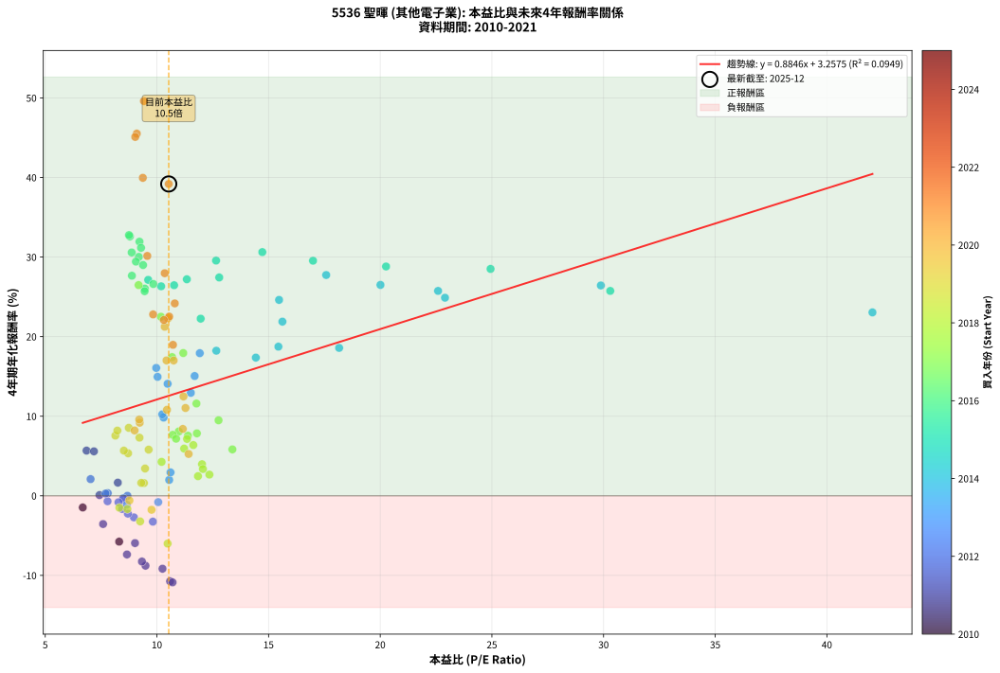
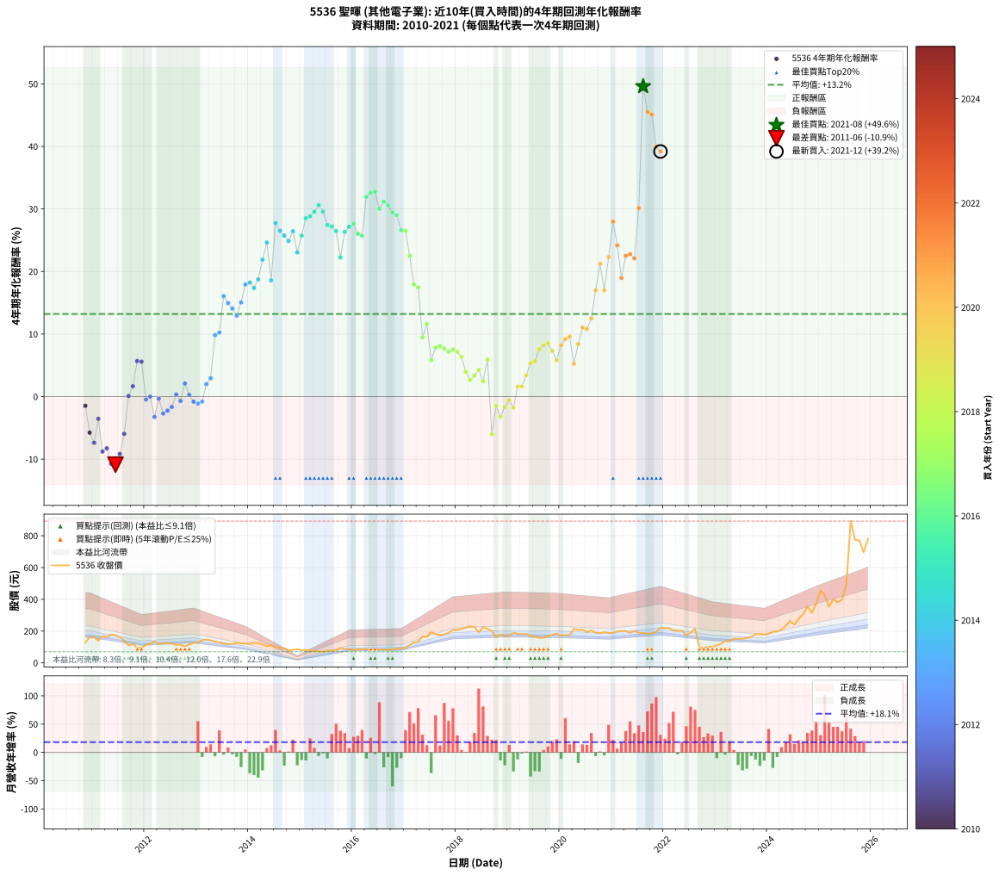

# 5536 聖暉 - 本益比與未來報酬率分析

!!! info "報告資訊"
    - **股票代號**: 5536
    - **公司名稱**: 聖暉
    - **產業別**: 其他電子業
    - **分析期間**: 2010-2021 (134 個數據點)
    - **資料來源**: Type 12 (ShowMonthlyK_ChartFlow) 月收盤價與本益比
    - **報酬率口徑**: 含現金股利 (簡化: 年度合計，假設每年7/1入帳)
    - **報告生成時間**: 2026-01-05 01:04:05 CST

## 📈 視覺化圖表

### 圖表1: 本益比 vs 未來報酬率關係

*圖表1：5536 聖暉 本益比與4年期未來報酬率關係 (2010-2021)*

### 圖表2: 歷年買入時點的4年期實際報酬率

*圖表2：5536 聖暉 歷年買入時點的4年期實際報酬率 (2010-2021)*

## 📍 買點訊號說明

本報告提供兩種買點提示訊號（顯示於圖表2的股價子圖中）：

### ▲ 小綠色三角形（回測驗證）
- **計算方式**: 使用全部歷史資料計算本益比第25百分位數
- **用途**: 事後驗證，顯示歷史上哪些時點確實為低估區
- **限制**: 當下無法判斷，僅供回測參考
- **特性**: 後見之明（Look-Ahead Bias）

### ▲ 小橘色三角形（即時訊號）
- **計算方式**: 使用截至當月的過去5年資料計算本益比第25百分位數
- **用途**: 實際投資決策，當時即可判斷
- **優勢**: 可操作性強，符合實務需求
- **特性**: 無後見之明，滾動窗口計算

!!! tip "如何使用兩種訊號"
    - **綠色▲** 幫助理解歷史估值機會，驗證策略有效性
    - **橘色▲** 可作為實際買進參考，但仍需搭配基本面分析
    - 兩種訊號重疊時，表示即時判斷與事後驗證一致，信心度較高
    - 僅有綠色▲時，表示當時無法判斷（需要未來資料才能確認）
    - 僅有橘色▲時，表示即時判斷為買點，但事後可能不是最佳時機

## 📊 估值分析摘要

| 指標 | 數值 |
|:---:|:---:|
| **目前本益比** (2021-12) | **10.53 倍** |
| **歷史平均本益比** | 11.24 倍 |
| **估值水準** | 🟡 合理範圍 |
| **預期4年年化報酬率** | **+12.57%** |
| **歷史平均報酬率** | +13.20% |
| **相關係數 (R²)** | 0.0949 |
| **趨勢線斜率** | 0.8846 |

!!! abstract "核心洞察"
    目前本益比接近歷史平均，預期報酬率符合長期趨勢

    根據歷史數據回測，5536 聖暉 在目前本益比 **10.5倍** 的估值水準下，
    預期未來4年年化報酬率約為 **+12.6%**。

    **重要提醒**: 本分析基於歷史數據統計，實際報酬率會受到公司基本面變化、產業趨勢、
    總體經濟環境等多重因素影響。R² = 0.09 表示本益比可解釋約 9.5% 的報酬率變異。

## 📈 歷史估值統計

### 最佳買點 (最高報酬率)

| 項目 | 數值 |
|:---:|:---:|
| 起始時間 | 2021-08 |
| 當時本益比 | 9.42 倍 |
| 起始價格 | 188.5 元 |
| 4年後價格 | 892.0 元 |
| **4年年化報酬率** | **+49.60%** |

### 最差買點 (最低報酬率)

| 項目 | 數值 |
|:---:|:---:|
| 起始時間 | 2011-06 |
| 當時本益比 | 10.70 倍 |
| 起始價格 | 174.5 元 |
| 4年後價格 | 70.1 元 |
| **4年年化報酬率** | **-10.88%** |

## 🎯 投資啟示

### 本益比與報酬率關係

趨勢線方程式: **y = 0.8846x + 3.2575**

!!! info "弱相關或正相關"
    本益比與未來報酬率相關性較弱。這可能表示該股票的報酬率更多受到
    公司成長性、產業趨勢等因素影響，而非估值水準。**需綜合考量多項指標**。

### 估值區間建議

基於歷史數據分析:

- **🟢 低估區** (P/E < 9.0): 預期報酬率較高，可考慮增加持股
- **🟡 合理區** (P/E 9.0-13.5): 預期報酬率符合長期趨勢，正常持有
- **🔴 高估區** (P/E > 13.5): 預期報酬率較低，可考慮減碼或觀望

!!! danger "風險提示"
    - 過去表現不代表未來結果
    - 本分析假設公司基本面無重大結構性變化
    - 產業環境劇變可能使歷史規律失效
    - 應結合公司財報、產業趨勢、總體經濟等多重因素綜合判斷

!!! success "長期投資觀點"
    歷史數據顯示，在合理或低估的估值水準買入並長期持有，
    往往能獲得較佳的投資報酬。**耐心等待好價格**是價值投資的核心原則。

## 📊 數據品質

- **資料來源**: GoodInfo.tw Type 12 (ShowMonthlyK_ChartFlow)
- **資料頻率**: 月度收盤價與本益比
- **回測期間**: 2010-2021
- **數據點數量**: 134 個 (每個點代表一次4年期回測)

### 計算方法說明

1. **4年期年化報酬率**:
   - 對每個歷史時點，計算其後4年的實際投資報酬率
   - 期末價值(不含股利): 期末價格
   - 期末價值(含現金股利): 期末價格 + 持有期間內的現金股利合計 (簡化: 年度合計，假設每年7/1入帳)
   - 公式: 年化報酬率 = [(期末價值/期初價格)^(1/年數) - 1] × 100%

2. **本益比 (P/E Ratio)**:
   - 使用當時的月收盤價與EPS計算
   - 資料來源: Type 12 月度河流圖本益比數據

3. **趨勢線 (Linear Regression)**:
   - 使用最小平方法擬合線性趨勢線
   - R²值衡量本益比對報酬率的解釋能力

---

*本報告由 Stock Analysis System v1.9.0 自動生成*
*數據更新時間: 2026-01-05 01:04:05 CST*

## 📋 月度回測明細表

（每一列對應時間線圖中的一個買入點；可用來對照 SVG 圖上的每個點。）

| 買入月份 | 賣出月份 | 回測期限_年 | 實際持有年數 | 買入本益比_倍 | 買入收盤價_元 | 賣出收盤價_元 | 現金股利合計_元 | 總報酬率_pct | 年化報酬率_pct |
| --- | --- | --- | --- | --- | --- | --- | --- | --- | --- |
| 2010-11 | 2014-11 | 4 | 4.000 | 6.68 | 129.00 | 81.60 | 40.00 | -5.74 | -1.47 |
| 2010-12 | 2014-12 | 4 | 4.000 | 8.31 | 160.50 | 86.60 | 40.00 | -21.12 | -5.76 |
| 2011-01 | 2015-01 | 4 | 4.000 | 8.66 | 163.00 | 80.00 | 40.00 | -26.38 | -7.37 |
| 2011-02 | 2015-02 | 4 | 4.000 | 7.59 | 139.00 | 80.30 | 40.00 | -13.45 | -3.55 |
| 2011-03 | 2015-03 | 4 | 4.000 | 9.49 | 169.00 | 77.00 | 40.00 | -30.77 | -8.78 |
| 2011-04 | 2015-04 | 4 | 4.000 | 9.33 | 161.50 | 74.40 | 40.00 | -29.16 | -8.26 |
| 2011-05 | 2015-05 | 4 | 4.000 | 10.59 | 178.00 | 73.00 | 40.00 | -36.52 | -10.74 |
| 2011-06 | 2015-06 | 4 | 4.000 | 10.70 | 174.50 | 70.10 | 40.00 | -36.91 | -10.88 |
| 2011-07 | 2015-07 | 4 | 4.000 | 10.25 | 162.00 | 78.30 | 32.00 | -31.91 | -9.16 |
| 2011-08 | 2015-08 | 4 | 4.000 | 9.02 | 138.00 | 76.00 | 32.00 | -21.74 | -5.94 |
| 2011-09 | 2015-09 | 4 | 4.000 | 7.43 | 110.00 | 78.40 | 32.00 | +0.36 | +0.09 |
| 2011-10 | 2015-10 | 4 | 4.000 | 8.25 | 118.00 | 94.00 | 32.00 | +6.78 | +1.65 |
| 2011-11 | 2015-11 | 4 | 4.000 | 6.85 | 94.60 | 86.00 | 32.00 | +24.74 | +5.68 |
| 2011-12 | 2015-12 | 4 | 4.000 | 7.18 | 95.50 | 86.70 | 32.00 | +24.29 | +5.59 |
| 2012-01 | 2016-01 | 4 | 4.000 | 8.51 | 114.50 | 80.40 | 32.00 | -1.83 | -0.46 |
| 2012-02 | 2016-02 | 4 | 4.000 | 8.68 | 118.00 | 86.00 | 32.00 | +0.00 | +0.00 |
| 2012-03 | 2016-03 | 4 | 4.000 | 9.82 | 135.00 | 86.30 | 32.00 | -12.37 | -3.25 |
| 2012-04 | 2016-04 | 4 | 4.000 | 8.49 | 118.00 | 84.50 | 32.00 | -1.27 | -0.32 |
| 2012-05 | 2016-05 | 4 | 4.000 | 8.97 | 126.00 | 80.90 | 32.00 | -10.40 | -2.71 |
| 2012-06 | 2016-06 | 4 | 4.000 | 8.70 | 123.50 | 80.80 | 32.00 | -8.66 | -2.24 |
| 2012-07 | 2016-07 | 4 | 4.000 | 8.44 | 121.00 | 85.20 | 28.00 | -6.44 | -1.65 |
| 2012-08 | 2016-08 | 4 | 4.000 | 7.80 | 113.00 | 86.50 | 28.00 | +1.33 | +0.33 |
| 2012-09 | 2016-09 | 4 | 4.000 | 7.79 | 114.00 | 82.90 | 28.00 | -2.72 | -0.69 |
| 2012-10 | 2016-10 | 4 | 4.000 | 7.03 | 104.00 | 85.00 | 28.00 | +8.66 | +2.10 |
| 2012-11 | 2016-11 | 4 | 4.000 | 7.70 | 115.00 | 88.30 | 28.00 | +1.13 | +0.28 |
| 2012-12 | 2016-12 | 4 | 4.000 | 8.28 | 125.00 | 93.00 | 28.00 | -3.20 | -0.81 |
| 2013-01 | 2017-01 | 4 | 4.000 | 8.65 | 127.00 | 93.40 | 28.00 | -4.41 | -1.12 |
| 2013-02 | 2017-02 | 4 | 4.000 | 10.06 | 143.50 | 111.00 | 28.00 | -3.13 | -0.79 |
| 2013-03 | 2017-03 | 4 | 4.000 | 10.55 | 146.00 | 130.00 | 28.00 | +8.22 | +1.99 |
| 2013-04 | 2017-04 | 4 | 4.000 | 10.61 | 142.50 | 132.00 | 28.00 | +12.28 | +2.94 |
| 2013-05 | 2017-05 | 4 | 4.000 | 10.30 | 134.00 | 167.00 | 28.00 | +45.53 | +9.83 |
| 2013-06 | 2017-06 | 4 | 4.000 | 10.24 | 129.00 | 162.50 | 28.00 | +47.68 | +10.24 |
| 2013-07 | 2017-07 | 4 | 4.000 | 9.97 | 121.50 | 194.50 | 26.02 | +81.50 | +16.07 |
| 2013-08 | 2017-08 | 4 | 4.000 | 10.03 | 118.00 | 180.00 | 26.02 | +74.59 | +14.95 |
| 2013-09 | 2017-09 | 4 | 4.000 | 10.48 | 119.00 | 175.50 | 26.02 | +69.34 | +14.08 |
| 2013-10 | 2017-10 | 4 | 4.000 | 11.52 | 126.00 | 179.00 | 26.02 | +62.71 | +12.94 |
| 2013-11 | 2017-11 | 4 | 4.000 | 11.69 | 123.00 | 189.50 | 26.02 | +75.22 | +15.05 |
| 2013-12 | 2017-12 | 4 | 4.000 | 11.92 | 120.50 | 207.00 | 26.02 | +93.38 | +17.92 |
| 2014-01 | 2018-01 | 4 | 4.000 | 12.66 | 119.50 | 207.50 | 26.02 | +95.41 | +18.23 |
| 2014-02 | 2018-02 | 4 | 4.000 | 14.43 | 126.50 | 214.00 | 26.02 | +89.74 | +17.36 |
| 2014-03 | 2018-03 | 4 | 4.000 | 15.44 | 125.00 | 222.50 | 26.02 | +98.81 | +18.74 |
| 2014-04 | 2018-04 | 4 | 4.000 | 15.62 | 116.00 | 230.00 | 26.02 | +120.71 | +21.89 |
| 2014-05 | 2018-05 | 4 | 4.000 | 15.47 | 104.50 | 226.00 | 26.02 | +141.17 | +24.62 |
| 2014-06 | 2018-06 | 4 | 4.000 | 18.16 | 110.50 | 192.50 | 26.02 | +97.75 | +18.59 |
| 2014-07 | 2018-07 | 4 | 4.000 | 17.58 | 95.20 | 224.50 | 29.02 | +166.30 | +27.74 |
| 2014-08 | 2018-08 | 4 | 4.000 | 20.01 | 94.90 | 214.00 | 29.02 | +156.08 | +26.50 |
| 2014-09 | 2018-09 | 4 | 4.000 | 22.59 | 92.00 | 201.00 | 29.02 | +150.02 | +25.75 |
| 2014-10 | 2018-10 | 4 | 4.000 | 22.90 | 77.90 | 160.50 | 29.02 | +143.28 | +24.89 |
| 2014-11 | 2018-11 | 4 | 4.000 | 29.88 | 81.60 | 179.50 | 29.02 | +155.54 | +26.43 |
| 2014-12 | 2018-12 | 4 | 4.000 | 42.04 | 86.60 | 169.50 | 29.02 | +129.24 | +23.05 |
| 2015-01 | 2019-01 | 4 | 4.000 | 30.30 | 80.00 | 171.00 | 29.02 | +150.02 | +25.75 |
| 2015-02 | 2019-02 | 4 | 4.000 | 24.94 | 80.30 | 190.00 | 29.02 | +172.75 | +28.51 |
| 2015-03 | 2019-03 | 4 | 4.000 | 20.26 | 77.00 | 183.00 | 29.02 | +175.35 | +28.82 |
| 2015-04 | 2019-04 | 4 | 4.000 | 16.99 | 74.40 | 180.50 | 29.02 | +181.61 | +29.54 |
| 2015-05 | 2019-05 | 4 | 4.000 | 14.72 | 73.00 | 183.50 | 29.02 | +191.12 | +30.62 |
| 2015-06 | 2019-06 | 4 | 4.000 | 12.65 | 70.10 | 168.50 | 29.02 | +181.77 | +29.56 |
| 2015-07 | 2019-07 | 4 | 4.000 | 12.79 | 78.30 | 164.50 | 42.02 | +163.75 | +27.44 |
| 2015-08 | 2019-08 | 4 | 4.000 | 11.34 | 76.00 | 157.00 | 42.02 | +161.87 | +27.21 |
| 2015-09 | 2019-09 | 4 | 4.000 | 10.77 | 78.40 | 158.50 | 42.02 | +155.76 | +26.46 |
| 2015-10 | 2019-10 | 4 | 4.000 | 11.96 | 94.00 | 168.00 | 42.02 | +123.42 | +22.26 |
| 2015-11 | 2019-11 | 4 | 4.000 | 10.19 | 86.00 | 177.00 | 42.02 | +154.67 | +26.33 |
| 2015-12 | 2019-12 | 4 | 4.000 | 9.61 | 86.70 | 184.50 | 42.02 | +161.27 | +27.14 |
| 2016-01 | 2020-01 | 4 | 4.000 | 8.88 | 80.40 | 171.50 | 42.02 | +165.57 | +27.66 |
| 2016-02 | 2020-02 | 4 | 4.000 | 9.46 | 86.00 | 175.00 | 42.02 | +152.35 | +26.04 |
| 2016-03 | 2020-03 | 4 | 4.000 | 9.45 | 86.30 | 173.50 | 42.02 | +149.73 | +25.71 |
| 2016-04 | 2020-04 | 4 | 4.000 | 9.22 | 84.50 | 214.00 | 42.02 | +202.98 | +31.93 |
| 2016-05 | 2020-05 | 4 | 4.000 | 8.79 | 80.90 | 208.00 | 42.02 | +209.05 | +32.59 |
| 2016-06 | 2020-06 | 4 | 4.000 | 8.75 | 80.80 | 209.00 | 42.02 | +210.67 | +32.76 |
| 2016-07 | 2020-07 | 4 | 4.000 | 9.19 | 85.20 | 192.50 | 51.01 | +185.81 | +30.02 |
| 2016-08 | 2020-08 | 4 | 4.000 | 9.29 | 86.50 | 205.00 | 51.01 | +195.97 | +31.16 |
| 2016-09 | 2020-09 | 4 | 4.000 | 8.87 | 82.90 | 190.00 | 51.01 | +190.73 | +30.58 |
| 2016-10 | 2020-10 | 4 | 4.000 | 9.06 | 85.00 | 187.50 | 51.01 | +180.60 | +29.43 |
| 2016-11 | 2020-11 | 4 | 4.000 | 9.38 | 88.30 | 193.50 | 51.01 | +176.91 | +29.00 |
| 2016-12 | 2020-12 | 4 | 4.000 | 9.84 | 93.00 | 188.00 | 51.01 | +157.00 | +26.61 |
| 2017-01 | 2021-01 | 4 | 4.000 | 9.18 | 93.40 | 188.00 | 51.01 | +155.90 | +26.48 |
| 2017-02 | 2021-02 | 4 | 4.000 | 10.18 | 111.00 | 199.00 | 51.01 | +125.24 | +22.51 |
| 2017-03 | 2021-03 | 4 | 4.000 | 11.18 | 130.00 | 200.50 | 51.01 | +93.47 | +17.94 |
| 2017-04 | 2021-04 | 4 | 4.000 | 10.68 | 132.00 | 200.00 | 51.01 | +90.16 | +17.43 |
| 2017-05 | 2021-05 | 4 | 4.000 | 12.76 | 167.00 | 189.00 | 51.01 | +43.72 | +9.49 |
| 2017-06 | 2021-06 | 4 | 4.000 | 11.77 | 162.50 | 201.00 | 51.01 | +55.09 | +11.59 |
| 2017-07 | 2021-07 | 4 | 4.000 | 13.38 | 194.50 | 189.00 | 55.00 | +25.45 | +5.83 |
| 2017-08 | 2021-08 | 4 | 4.000 | 11.79 | 180.00 | 188.50 | 55.00 | +35.28 | +7.85 |
| 2017-09 | 2021-09 | 4 | 4.000 | 10.98 | 175.50 | 184.50 | 55.00 | +36.47 | +8.08 |
| 2017-10 | 2021-10 | 4 | 4.000 | 10.71 | 179.00 | 185.50 | 55.00 | +34.36 | +7.66 |
| 2017-11 | 2021-11 | 4 | 4.000 | 10.86 | 189.50 | 195.00 | 55.00 | +31.93 | +7.17 |
| 2017-12 | 2021-12 | 4 | 4.000 | 11.39 | 207.00 | 222.00 | 55.00 | +33.82 | +7.55 |
| 2018-01 | 2022-01 | 4 | 4.000 | 11.35 | 207.50 | 218.50 | 55.00 | +31.81 | +7.15 |
| 2018-02 | 2022-02 | 4 | 4.000 | 11.63 | 214.00 | 219.00 | 55.00 | +28.04 | +6.37 |
| 2018-03 | 2022-03 | 4 | 4.000 | 12.02 | 222.50 | 205.00 | 55.00 | +16.85 | +3.97 |
| 2018-04 | 2022-04 | 4 | 4.000 | 12.35 | 230.00 | 200.50 | 55.00 | +11.09 | +2.66 |
| 2018-05 | 2022-05 | 4 | 4.000 | 12.06 | 226.00 | 203.00 | 55.00 | +14.16 | +3.37 |
| 2018-06 | 2022-06 | 4 | 4.000 | 10.21 | 192.50 | 172.50 | 55.00 | +18.18 | +4.26 |
| 2018-07 | 2022-07 | 4 | 4.000 | 11.84 | 224.50 | 190.50 | 57.00 | +10.24 | +2.47 |
| 2018-08 | 2022-08 | 4 | 4.000 | 11.22 | 214.00 | 212.50 | 57.00 | +25.93 | +5.93 |
| 2018-09 | 2022-09 | 4 | 4.000 | 10.48 | 201.00 | 99.90 | 57.00 | -21.94 | -6.00 |
| 2018-10 | 2022-10 | 4 | 4.000 | 8.32 | 160.50 | 94.10 | 57.00 | -5.86 | -1.50 |
| 2018-11 | 2022-11 | 4 | 4.000 | 9.25 | 179.50 | 100.50 | 57.00 | -12.26 | -3.22 |
| 2018-12 | 2022-12 | 4 | 4.000 | 8.68 | 169.50 | 101.50 | 57.00 | -6.49 | -1.66 |
| 2019-01 | 2023-01 | 4 | 4.000 | 8.77 | 171.00 | 110.00 | 57.00 | -2.34 | -0.59 |
| 2019-02 | 2023-02 | 4 | 4.000 | 9.76 | 190.00 | 120.00 | 57.00 | -6.84 | -1.76 |
| 2019-03 | 2023-03 | 4 | 4.000 | 9.42 | 183.00 | 138.00 | 57.00 | +6.56 | +1.60 |
| 2019-04 | 2023-04 | 4 | 4.000 | 9.30 | 180.50 | 135.50 | 57.00 | +6.65 | +1.62 |
| 2019-05 | 2023-05 | 4 | 4.000 | 9.47 | 183.50 | 153.00 | 57.00 | +14.44 | +3.43 |
| 2019-06 | 2023-06 | 4 | 4.000 | 8.71 | 168.50 | 150.50 | 57.00 | +23.15 | +5.34 |
| 2019-07 | 2023-07 | 4 | 4.000 | 8.52 | 164.50 | 151.50 | 53.68 | +24.73 | +5.68 |
| 2019-08 | 2023-08 | 4 | 4.000 | 8.14 | 157.00 | 156.50 | 53.68 | +33.87 | +7.57 |
| 2019-09 | 2023-09 | 4 | 4.000 | 8.23 | 158.50 | 163.50 | 53.68 | +37.02 | +8.19 |
| 2019-10 | 2023-10 | 4 | 4.000 | 8.74 | 168.00 | 179.50 | 53.68 | +38.80 | +8.54 |
| 2019-11 | 2023-11 | 4 | 4.000 | 9.22 | 177.00 | 181.00 | 53.68 | +32.59 | +7.31 |
| 2019-12 | 2023-12 | 4 | 4.000 | 9.63 | 184.50 | 177.50 | 53.68 | +25.30 | +5.80 |
| 2020-01 | 2024-01 | 4 | 4.000 | 9.00 | 171.50 | 181.50 | 53.68 | +37.13 | +8.21 |
| 2020-02 | 2024-02 | 4 | 4.000 | 9.23 | 175.00 | 195.00 | 53.68 | +42.10 | +9.18 |
| 2020-03 | 2024-03 | 4 | 4.000 | 9.21 | 173.50 | 196.50 | 53.68 | +44.20 | +9.58 |
| 2020-04 | 2024-04 | 4 | 4.000 | 11.42 | 214.00 | 209.00 | 53.68 | +22.75 | +5.26 |
| 2020-05 | 2024-05 | 4 | 4.000 | 11.16 | 208.00 | 233.50 | 53.68 | +38.07 | +8.40 |
| 2020-06 | 2024-06 | 4 | 4.000 | 11.28 | 209.00 | 264.00 | 53.68 | +52.00 | +11.04 |
| 2020-07 | 2024-07 | 4 | 4.000 | 10.45 | 192.50 | 241.00 | 49.18 | +50.74 | +10.80 |
| 2020-08 | 2024-08 | 4 | 4.000 | 11.19 | 205.00 | 279.00 | 49.18 | +60.09 | +12.48 |
| 2020-09 | 2024-09 | 4 | 4.000 | 10.43 | 190.00 | 307.00 | 49.18 | +87.46 | +17.01 |
| 2020-10 | 2024-10 | 4 | 4.000 | 10.35 | 187.50 | 356.00 | 49.18 | +116.10 | +21.24 |
| 2020-11 | 2024-11 | 4 | 4.000 | 10.75 | 193.50 | 313.50 | 49.18 | +87.43 | +17.01 |
| 2020-12 | 2024-12 | 4 | 4.000 | 10.50 | 188.00 | 371.50 | 49.18 | +123.77 | +22.31 |
| 2021-01 | 2025-01 | 4 | 4.000 | 10.35 | 188.00 | 455.00 | 49.18 | +168.18 | +27.97 |
| 2021-02 | 2025-02 | 4 | 4.000 | 10.80 | 199.00 | 424.00 | 49.18 | +137.78 | +24.18 |
| 2021-03 | 2025-03 | 4 | 4.000 | 10.72 | 200.50 | 352.50 | 49.18 | +100.34 | +18.97 |
| 2021-04 | 2025-04 | 4 | 4.000 | 10.55 | 200.00 | 401.50 | 49.18 | +125.34 | +22.52 |
| 2021-05 | 2025-05 | 4 | 4.000 | 9.83 | 189.00 | 380.50 | 49.18 | +127.34 | +22.79 |
| 2021-06 | 2025-06 | 4 | 4.000 | 10.31 | 201.00 | 397.50 | 49.18 | +122.23 | +22.10 |
| 2021-07 | 2025-07 | 4 | 4.000 | 9.57 | 189.00 | 490.00 | 52.18 | +186.87 | +30.14 |
| 2021-08 | 2025-08 | 4 | 4.000 | 9.42 | 188.50 | 892.00 | 52.18 | +400.89 | +49.60 |
| 2021-09 | 2025-09 | 4 | 4.000 | 9.10 | 184.50 | 775.00 | 52.18 | +348.34 | +45.51 |
| 2021-10 | 2025-10 | 4 | 4.000 | 9.03 | 185.50 | 770.00 | 52.18 | +343.22 | +45.10 |
| 2021-11 | 2025-11 | 4 | 4.000 | 9.37 | 195.00 | 696.00 | 52.18 | +283.68 | +39.96 |
| 2021-12 | 2025-12 | 4 | 4.000 | 10.53 | 222.00 | 781.00 | 52.18 | +275.31 | +39.19 |
