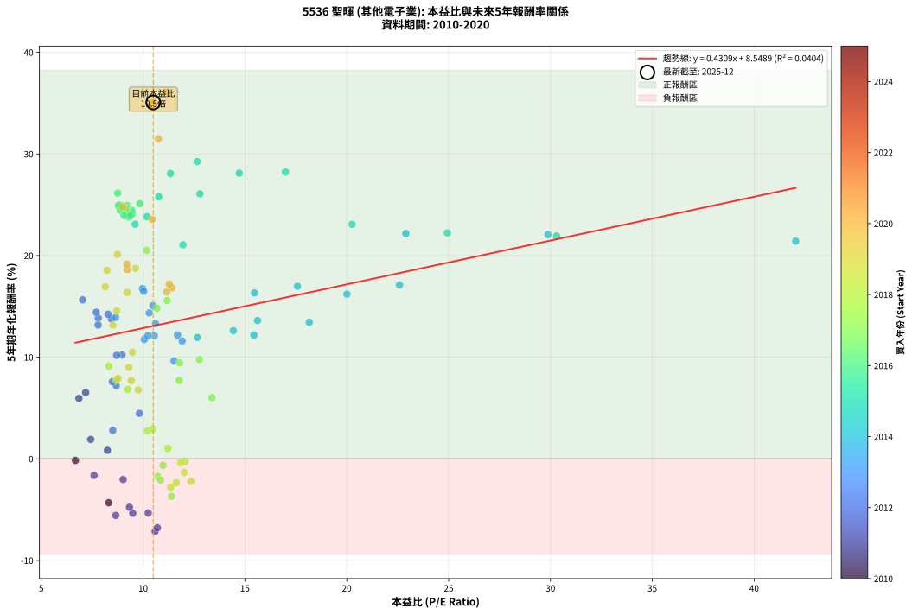
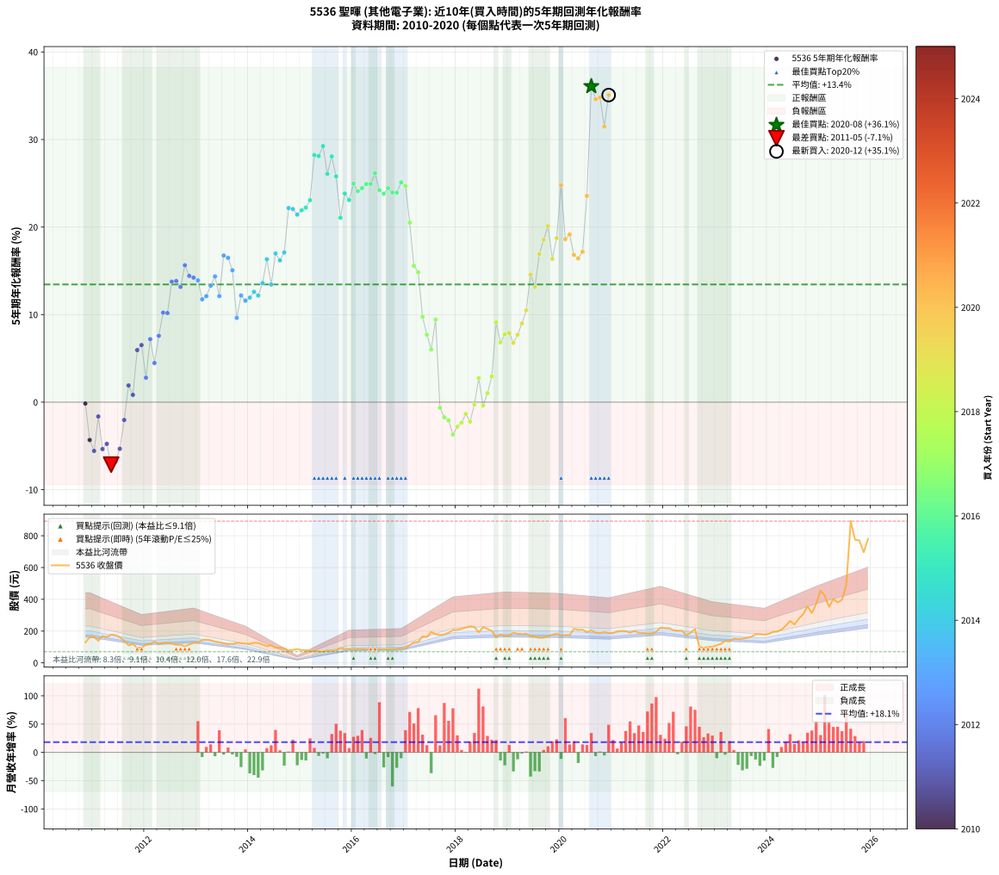

# 5536 聖暉 - 本益比與未來報酬率分析

!!! info "報告資訊"
    - **股票代號**: 5536
    - **公司名稱**: 聖暉
    - **產業別**: 其他電子業
    - **分析期間**: 2010-2020 (122 個數據點)
    - **資料來源**: Type 12 (ShowMonthlyK_ChartFlow) 月收盤價與本益比
    - **報酬率口徑**: 含現金股利 (簡化: 年度合計，假設每年7/1入帳)
    - **報告生成時間**: 2026-01-05 21:10:21 CST

## 📈 視覺化圖表

### 圖表1: 本益比 vs 未來報酬率關係

*圖表1：5536 聖暉 本益比與5年期未來報酬率關係 (2010-2020)*

### 圖表2: 歷年買入時點的5年期實際報酬率

*圖表2：5536 聖暉 歷年買入時點的5年期實際報酬率 (2010-2020)*

## 📍 買點訊號說明

本報告提供兩種買點提示訊號（顯示於圖表2的股價子圖中）：

### ▲ 小綠色三角形（回測驗證）
- **計算方式**: 使用全部歷史資料計算本益比第25百分位數
- **用途**: 事後驗證，顯示歷史上哪些時點確實為低估區
- **限制**: 當下無法判斷，僅供回測參考
- **特性**: 後見之明（Look-Ahead Bias）

### ▲ 小橘色三角形（即時訊號）
- **計算方式**: 使用截至當月的過去5年資料計算本益比第25百分位數
- **用途**: 實際投資決策，當時即可判斷
- **優勢**: 可操作性強，符合實務需求
- **特性**: 無後見之明，滾動窗口計算

!!! tip "如何使用兩種訊號"
    - **綠色▲** 幫助理解歷史估值機會，驗證策略有效性
    - **橘色▲** 可作為實際買進參考，但仍需搭配基本面分析
    - 兩種訊號重疊時，表示即時判斷與事後驗證一致，信心度較高
    - 僅有綠色▲時，表示當時無法判斷（需要未來資料才能確認）
    - 僅有橘色▲時，表示即時判斷為買點，但事後可能不是最佳時機

## 📊 估值分析摘要

| 指標 | 數值 |
|:---:|:---:|
| **目前本益比** (2020-12) | **10.50 倍** |
| **歷史平均本益比** | 11.37 倍 |
| **估值水準** | 🟡 合理範圍 |
| **預期5年年化報酬率** | **+13.07%** |
| **歷史平均報酬率** | +13.45% |
| **相關係數 (R²)** | 0.0404 |
| **趨勢線斜率** | 0.4309 |

!!! abstract "核心洞察"
    目前本益比接近歷史平均，預期報酬率符合長期趨勢

    根據歷史數據回測，5536 聖暉 在目前本益比 **10.5倍** 的估值水準下，
    預期未來5年年化報酬率約為 **+13.1%**。

    **重要提醒**: 本分析基於歷史數據統計，實際報酬率會受到公司基本面變化、產業趨勢、
    總體經濟環境等多重因素影響。R² = 0.04 表示本益比可解釋約 4.0% 的報酬率變異。

## 📈 歷史估值統計

### 最佳買點 (最高報酬率)

| 項目 | 數值 |
|:---:|:---:|
| 起始時間 | 2020-08 |
| 當時本益比 | 11.19 倍 |
| 起始價格 | 205.0 元 |
| 5年後價格 | 892.0 元 |
| **5年年化報酬率** | **+36.07%** |

### 最差買點 (最低報酬率)

| 項目 | 數值 |
|:---:|:---:|
| 起始時間 | 2011-05 |
| 當時本益比 | 10.59 倍 |
| 起始價格 | 178.0 元 |
| 5年後價格 | 80.9 元 |
| **5年年化報酬率** | **-7.14%** |

## 🎯 投資啟示

### 本益比與報酬率關係

趨勢線方程式: **y = 0.4309x + 8.5489**

!!! info "弱相關或正相關"
    本益比與未來報酬率相關性較弱。這可能表示該股票的報酬率更多受到
    公司成長性、產業趨勢等因素影響，而非估值水準。**需綜合考量多項指標**。

### 估值區間建議

基於歷史數據分析:

- **🟢 低估區** (P/E < 9.1): 預期報酬率較高，可考慮增加持股
- **🟡 合理區** (P/E 9.1-13.6): 預期報酬率符合長期趨勢，正常持有
- **🔴 高估區** (P/E > 13.6): 預期報酬率較低，可考慮減碼或觀望

!!! danger "風險提示"
    - 過去表現不代表未來結果
    - 本分析假設公司基本面無重大結構性變化
    - 產業環境劇變可能使歷史規律失效
    - 應結合公司財報、產業趨勢、總體經濟等多重因素綜合判斷

!!! success "長期投資觀點"
    歷史數據顯示，在合理或低估的估值水準買入並長期持有，
    往往能獲得較佳的投資報酬。**耐心等待好價格**是價值投資的核心原則。

## 📊 數據品質

- **資料來源**: GoodInfo.tw Type 12 (ShowMonthlyK_ChartFlow)
- **資料頻率**: 月度收盤價與本益比
- **回測期間**: 2010-2020
- **數據點數量**: 122 個 (每個點代表一次5年期回測)

### 計算方法說明

1. **5年期年化報酬率**:
   - 對每個歷史時點，計算其後5年的實際投資報酬率
   - 期末價值(不含股利): 期末價格
   - 期末價值(含現金股利): 期末價格 + 持有期間內的現金股利合計 (簡化: 年度合計，假設每年7/1入帳)
   - 公式: 年化報酬率 = [(期末價值/期初價格)^(1/年數) - 1] × 100%

2. **本益比 (P/E Ratio)**:
   - 使用當時的月收盤價與EPS計算
   - 資料來源: Type 12 月度河流圖本益比數據

3. **趨勢線 (Linear Regression)**:
   - 使用最小平方法擬合線性趨勢線
   - R²值衡量本益比對報酬率的解釋能力

---

*本報告由 Stock Analysis System v1.9.0 自動生成*
*數據更新時間: 2026-01-05 21:10:21 CST*

## 📋 月度回測明細表

（每一列對應時間線圖中的一個買入點；可用來對照 SVG 圖上的每個點。）

| 買入月份 | 賣出月份 | 回測期限_年 | 實際持有年數 | 買入本益比_倍 | 買入收盤價_元 | 賣出收盤價_元 | 現金股利合計_元 | 總報酬率_pct | 年化報酬率_pct |
| --- | --- | --- | --- | --- | --- | --- | --- | --- | --- |
| 2010-11 | 2015-11 | 5 | 4.999 | 6.68 | 129.00 | 86.00 | 42.00 | -0.78 | -0.16 |
| 2010-12 | 2015-12 | 5 | 4.999 | 8.31 | 160.50 | 86.70 | 42.00 | -19.81 | -4.32 |
| 2011-01 | 2016-01 | 5 | 4.999 | 8.66 | 163.00 | 80.40 | 42.00 | -24.91 | -5.57 |
| 2011-02 | 2016-02 | 5 | 4.999 | 7.59 | 139.00 | 86.00 | 42.00 | -7.91 | -1.64 |
| 2011-03 | 2016-03 | 5 | 5.002 | 9.49 | 169.00 | 86.30 | 42.00 | -24.08 | -5.36 |
| 2011-04 | 2016-04 | 5 | 5.002 | 9.33 | 161.50 | 84.50 | 42.00 | -21.67 | -4.77 |
| 2011-05 | 2016-05 | 5 | 5.002 | 10.59 | 178.00 | 80.90 | 42.00 | -30.96 | -7.14 |
| 2011-06 | 2016-06 | 5 | 5.002 | 10.70 | 174.50 | 80.80 | 42.00 | -29.63 | -6.78 |
| 2011-07 | 2016-07 | 5 | 5.002 | 10.25 | 162.00 | 85.20 | 38.00 | -23.95 | -5.33 |
| 2011-08 | 2016-08 | 5 | 5.002 | 9.02 | 138.00 | 86.50 | 38.00 | -9.78 | -2.04 |
| 2011-09 | 2016-09 | 5 | 5.002 | 7.43 | 110.00 | 82.90 | 38.00 | +9.91 | +1.91 |
| 2011-10 | 2016-10 | 5 | 5.002 | 8.25 | 118.00 | 85.00 | 38.00 | +4.24 | +0.83 |
| 2011-11 | 2016-11 | 5 | 5.002 | 6.85 | 94.60 | 88.30 | 38.00 | +33.51 | +5.95 |
| 2011-12 | 2016-12 | 5 | 5.002 | 7.18 | 95.50 | 93.00 | 38.00 | +37.18 | +6.52 |
| 2012-01 | 2017-01 | 5 | 5.002 | 8.51 | 114.50 | 93.40 | 38.00 | +14.76 | +2.79 |
| 2012-02 | 2017-03 | 5 | 5.081 | 8.68 | 118.00 | 130.00 | 38.00 | +42.38 | +7.20 |
| 2012-03 | 2017-03 | 5 | 4.999 | 9.82 | 135.00 | 130.00 | 38.00 | +24.45 | +4.47 |
| 2012-04 | 2017-04 | 5 | 4.999 | 8.49 | 118.00 | 132.00 | 38.00 | +44.07 | +7.58 |
| 2012-05 | 2017-05 | 5 | 4.999 | 8.97 | 126.00 | 167.00 | 38.00 | +62.70 | +10.23 |
| 2012-06 | 2017-06 | 5 | 4.999 | 8.70 | 123.50 | 162.50 | 38.00 | +62.35 | +10.18 |
| 2012-07 | 2017-07 | 5 | 4.999 | 8.44 | 121.00 | 194.50 | 36.02 | +90.51 | +13.76 |
| 2012-08 | 2017-08 | 5 | 4.999 | 7.80 | 113.00 | 180.00 | 36.02 | +91.17 | +13.84 |
| 2012-09 | 2017-09 | 5 | 4.999 | 7.79 | 114.00 | 175.50 | 36.02 | +85.54 | +13.16 |
| 2012-10 | 2017-10 | 5 | 4.999 | 7.03 | 104.00 | 179.00 | 36.02 | +106.75 | +15.64 |
| 2012-11 | 2017-11 | 5 | 4.999 | 7.70 | 115.00 | 189.50 | 36.02 | +96.10 | +14.42 |
| 2012-12 | 2017-12 | 5 | 4.999 | 8.28 | 125.00 | 207.00 | 36.02 | +94.41 | +14.22 |
| 2013-01 | 2018-01 | 5 | 4.999 | 8.65 | 127.00 | 207.50 | 36.02 | +91.75 | +13.91 |
| 2013-02 | 2018-02 | 5 | 4.999 | 10.06 | 143.50 | 214.00 | 36.02 | +74.23 | +11.75 |
| 2013-03 | 2018-03 | 5 | 4.999 | 10.55 | 146.00 | 222.50 | 36.02 | +77.07 | +12.11 |
| 2013-04 | 2018-04 | 5 | 4.999 | 10.61 | 142.50 | 230.00 | 36.02 | +86.68 | +13.30 |
| 2013-05 | 2018-05 | 5 | 4.999 | 10.30 | 134.00 | 226.00 | 36.02 | +95.54 | +14.35 |
| 2013-06 | 2018-06 | 5 | 4.999 | 10.24 | 129.00 | 192.50 | 36.02 | +77.15 | +12.12 |
| 2013-07 | 2018-07 | 5 | 4.999 | 9.97 | 121.50 | 224.50 | 39.02 | +116.89 | +16.75 |
| 2013-08 | 2018-08 | 5 | 4.999 | 10.03 | 118.00 | 214.00 | 39.02 | +114.42 | +16.48 |
| 2013-09 | 2018-09 | 5 | 4.999 | 10.48 | 119.00 | 201.00 | 39.02 | +101.70 | +15.07 |
| 2013-10 | 2018-10 | 5 | 4.999 | 11.52 | 126.00 | 160.50 | 39.02 | +58.35 | +9.63 |
| 2013-11 | 2018-11 | 5 | 4.999 | 11.69 | 123.00 | 179.50 | 39.02 | +77.66 | +12.18 |
| 2013-12 | 2018-12 | 5 | 4.999 | 11.92 | 120.50 | 169.50 | 39.02 | +73.04 | +11.59 |
| 2014-01 | 2019-01 | 5 | 4.999 | 12.66 | 119.50 | 171.00 | 39.02 | +75.75 | +11.94 |
| 2014-02 | 2019-02 | 5 | 4.999 | 14.43 | 126.50 | 190.00 | 39.02 | +81.04 | +12.61 |
| 2014-03 | 2019-03 | 5 | 4.999 | 15.44 | 125.00 | 183.00 | 39.02 | +77.61 | +12.18 |
| 2014-04 | 2019-04 | 5 | 4.999 | 15.62 | 116.00 | 180.50 | 39.02 | +89.24 | +13.61 |
| 2014-05 | 2019-05 | 5 | 4.999 | 15.47 | 104.50 | 183.50 | 39.02 | +112.94 | +16.32 |
| 2014-06 | 2019-06 | 5 | 4.999 | 18.16 | 110.50 | 168.50 | 39.02 | +87.80 | +13.43 |
| 2014-07 | 2019-07 | 5 | 4.999 | 17.58 | 95.20 | 164.50 | 44.02 | +119.03 | +16.98 |
| 2014-08 | 2019-08 | 5 | 4.999 | 20.01 | 94.90 | 157.00 | 44.02 | +111.82 | +16.20 |
| 2014-09 | 2019-09 | 5 | 4.999 | 22.59 | 92.00 | 158.50 | 44.02 | +120.13 | +17.10 |
| 2014-10 | 2019-10 | 5 | 4.999 | 22.90 | 77.90 | 168.00 | 44.02 | +172.17 | +22.17 |
| 2014-11 | 2019-11 | 5 | 4.999 | 29.88 | 81.60 | 177.00 | 44.02 | +170.86 | +22.06 |
| 2014-12 | 2019-12 | 5 | 4.999 | 42.04 | 86.60 | 184.50 | 44.02 | +163.88 | +21.42 |
| 2015-01 | 2020-01 | 5 | 4.999 | 30.30 | 80.00 | 171.50 | 44.02 | +169.40 | +21.92 |
| 2015-02 | 2020-02 | 5 | 4.999 | 24.94 | 80.30 | 175.00 | 44.02 | +172.75 | +22.23 |
| 2015-03 | 2020-03 | 5 | 5.002 | 20.26 | 77.00 | 173.50 | 44.02 | +182.49 | +23.07 |
| 2015-04 | 2020-04 | 5 | 5.002 | 16.99 | 74.40 | 214.00 | 44.02 | +246.80 | +28.22 |
| 2015-05 | 2020-05 | 5 | 5.002 | 14.72 | 73.00 | 208.00 | 44.02 | +245.23 | +28.11 |
| 2015-06 | 2020-06 | 5 | 5.002 | 12.65 | 70.10 | 209.00 | 44.02 | +260.94 | +29.25 |
| 2015-07 | 2020-07 | 5 | 5.002 | 12.79 | 78.30 | 192.50 | 57.02 | +218.67 | +26.07 |
| 2015-08 | 2020-08 | 5 | 5.002 | 11.34 | 76.00 | 205.00 | 57.02 | +244.76 | +28.07 |
| 2015-09 | 2020-09 | 5 | 5.002 | 10.77 | 78.40 | 190.00 | 57.02 | +215.07 | +25.79 |
| 2015-10 | 2020-10 | 5 | 5.002 | 11.96 | 94.00 | 187.50 | 57.02 | +160.13 | +21.06 |
| 2015-11 | 2020-11 | 5 | 5.002 | 10.19 | 86.00 | 193.50 | 57.02 | +191.30 | +23.83 |
| 2015-12 | 2020-12 | 5 | 5.002 | 9.61 | 86.70 | 188.00 | 57.02 | +182.60 | +23.08 |
| 2016-01 | 2021-01 | 5 | 5.002 | 8.88 | 80.40 | 188.00 | 57.02 | +204.75 | +24.95 |
| 2016-02 | 2021-03 | 5 | 5.081 | 9.46 | 86.00 | 200.50 | 57.02 | +199.44 | +24.09 |
| 2016-03 | 2021-03 | 5 | 4.999 | 9.45 | 86.30 | 200.50 | 57.02 | +198.40 | +24.44 |
| 2016-04 | 2021-04 | 5 | 4.999 | 9.22 | 84.50 | 200.00 | 57.02 | +204.16 | +24.92 |
| 2016-05 | 2021-05 | 5 | 4.999 | 8.79 | 80.90 | 189.00 | 57.02 | +204.10 | +24.92 |
| 2016-06 | 2021-06 | 5 | 4.999 | 8.75 | 80.80 | 201.00 | 57.02 | +219.33 | +26.14 |
| 2016-07 | 2021-07 | 5 | 4.999 | 9.19 | 85.20 | 189.00 | 63.01 | +195.79 | +24.23 |
| 2016-08 | 2021-08 | 5 | 4.999 | 9.29 | 86.50 | 188.50 | 63.01 | +190.77 | +23.80 |
| 2016-09 | 2021-09 | 5 | 4.999 | 8.87 | 82.90 | 184.50 | 63.01 | +198.57 | +24.46 |
| 2016-10 | 2021-10 | 5 | 4.999 | 9.06 | 85.00 | 185.50 | 63.01 | +192.37 | +23.94 |
| 2016-11 | 2021-11 | 5 | 4.999 | 9.38 | 88.30 | 195.00 | 63.01 | +192.20 | +23.92 |
| 2016-12 | 2021-12 | 5 | 4.999 | 9.84 | 93.00 | 222.00 | 63.01 | +206.47 | +25.11 |
| 2017-01 | 2022-01 | 5 | 4.999 | 9.18 | 93.40 | 218.50 | 63.01 | +201.41 | +24.69 |
| 2017-02 | 2022-02 | 5 | 4.999 | 10.18 | 111.00 | 219.00 | 63.01 | +154.07 | +20.50 |
| 2017-03 | 2022-03 | 5 | 4.999 | 11.18 | 130.00 | 205.00 | 63.01 | +106.16 | +15.57 |
| 2017-04 | 2022-04 | 5 | 4.999 | 10.68 | 132.00 | 200.50 | 63.01 | +99.63 | +14.83 |
| 2017-05 | 2022-05 | 5 | 4.999 | 12.76 | 167.00 | 203.00 | 63.01 | +59.29 | +9.76 |
| 2017-06 | 2022-06 | 5 | 4.999 | 11.77 | 162.50 | 172.50 | 63.01 | +44.93 | +7.71 |
| 2017-07 | 2022-07 | 5 | 4.999 | 13.38 | 194.50 | 190.50 | 70.00 | +33.93 | +6.02 |
| 2017-08 | 2022-08 | 5 | 4.999 | 11.79 | 180.00 | 212.50 | 70.00 | +56.94 | +9.43 |
| 2017-09 | 2022-09 | 5 | 4.999 | 10.98 | 175.50 | 99.90 | 70.00 | -3.19 | -0.65 |
| 2017-10 | 2022-10 | 5 | 4.999 | 10.71 | 179.00 | 94.10 | 70.00 | -8.32 | -1.72 |
| 2017-11 | 2022-11 | 5 | 4.999 | 10.86 | 189.50 | 100.50 | 70.00 | -10.03 | -2.09 |
| 2017-12 | 2022-12 | 5 | 4.999 | 11.39 | 207.00 | 101.50 | 70.00 | -17.15 | -3.69 |
| 2018-01 | 2023-01 | 5 | 4.999 | 11.35 | 207.50 | 110.00 | 70.00 | -13.25 | -2.80 |
| 2018-02 | 2023-02 | 5 | 4.999 | 11.63 | 214.00 | 120.00 | 70.00 | -11.21 | -2.35 |
| 2018-03 | 2023-03 | 5 | 4.999 | 12.02 | 222.50 | 138.00 | 70.00 | -6.52 | -1.34 |
| 2018-04 | 2023-04 | 5 | 4.999 | 12.35 | 230.00 | 135.50 | 70.00 | -10.65 | -2.23 |
| 2018-05 | 2023-05 | 5 | 4.999 | 12.06 | 226.00 | 153.00 | 70.00 | -1.33 | -0.27 |
| 2018-06 | 2023-06 | 5 | 4.999 | 10.21 | 192.50 | 150.50 | 70.00 | +14.55 | +2.75 |
| 2018-07 | 2023-07 | 5 | 4.999 | 11.84 | 224.50 | 151.50 | 68.68 | -1.92 | -0.39 |
| 2018-08 | 2023-08 | 5 | 4.999 | 11.22 | 214.00 | 156.50 | 68.68 | +5.22 | +1.02 |
| 2018-09 | 2023-09 | 5 | 4.999 | 10.48 | 201.00 | 163.50 | 68.68 | +15.51 | +2.93 |
| 2018-10 | 2023-10 | 5 | 4.999 | 8.32 | 160.50 | 179.50 | 68.68 | +54.63 | +9.11 |
| 2018-11 | 2023-11 | 5 | 4.999 | 9.25 | 179.50 | 181.00 | 68.68 | +39.10 | +6.82 |
| 2018-12 | 2023-12 | 5 | 4.999 | 8.68 | 169.50 | 177.50 | 68.68 | +45.24 | +7.75 |
| 2019-01 | 2024-01 | 5 | 4.999 | 8.77 | 171.00 | 181.50 | 68.68 | +46.30 | +7.91 |
| 2019-02 | 2024-02 | 5 | 4.999 | 9.76 | 190.00 | 195.00 | 68.68 | +38.78 | +6.77 |
| 2019-03 | 2024-03 | 5 | 5.002 | 9.42 | 183.00 | 196.50 | 68.68 | +44.91 | +7.70 |
| 2019-04 | 2024-04 | 5 | 5.002 | 9.30 | 180.50 | 209.00 | 68.68 | +53.84 | +8.99 |
| 2019-05 | 2024-05 | 5 | 5.002 | 9.47 | 183.50 | 233.50 | 68.68 | +64.68 | +10.49 |
| 2019-06 | 2024-06 | 5 | 5.002 | 8.71 | 168.50 | 264.00 | 68.68 | +97.44 | +14.57 |
| 2019-07 | 2024-07 | 5 | 5.002 | 8.52 | 164.50 | 241.00 | 64.18 | +85.52 | +13.15 |
| 2019-08 | 2024-08 | 5 | 5.002 | 8.14 | 157.00 | 279.00 | 64.18 | +118.59 | +16.92 |
| 2019-09 | 2024-09 | 5 | 5.002 | 8.23 | 158.50 | 307.00 | 64.18 | +134.18 | +18.54 |
| 2019-10 | 2024-10 | 5 | 5.002 | 8.74 | 168.00 | 356.00 | 64.18 | +150.11 | +20.11 |
| 2019-11 | 2024-11 | 5 | 5.002 | 9.22 | 177.00 | 313.50 | 64.18 | +113.38 | +16.36 |
| 2019-12 | 2024-12 | 5 | 5.002 | 9.63 | 184.50 | 371.50 | 64.18 | +136.14 | +18.74 |
| 2020-01 | 2025-01 | 5 | 5.002 | 9.00 | 171.50 | 455.00 | 64.18 | +202.73 | +24.79 |
| 2020-02 | 2025-03 | 5 | 5.081 | 9.23 | 175.00 | 352.50 | 64.18 | +138.10 | +18.62 |
| 2020-03 | 2025-03 | 5 | 4.999 | 9.21 | 173.50 | 352.50 | 64.18 | +140.16 | +19.15 |
| 2020-04 | 2025-04 | 5 | 4.999 | 11.42 | 214.00 | 401.50 | 64.18 | +117.61 | +16.83 |
| 2020-05 | 2025-05 | 5 | 4.999 | 11.16 | 208.00 | 380.50 | 64.18 | +113.79 | +16.41 |
| 2020-06 | 2025-06 | 5 | 4.999 | 11.28 | 209.00 | 397.50 | 64.18 | +120.90 | +17.18 |
| 2020-07 | 2025-07 | 5 | 4.999 | 10.45 | 192.50 | 490.00 | 64.18 | +187.89 | +23.55 |
| 2020-08 | 2025-08 | 5 | 4.999 | 11.19 | 205.00 | 892.00 | 64.18 | +366.43 | +36.07 |
| 2020-09 | 2025-09 | 5 | 4.999 | 10.43 | 190.00 | 775.00 | 64.18 | +341.67 | +34.60 |
| 2020-10 | 2025-10 | 5 | 4.999 | 10.35 | 187.50 | 770.00 | 64.18 | +344.90 | +34.79 |
| 2020-11 | 2025-11 | 5 | 4.999 | 10.75 | 193.50 | 696.00 | 64.18 | +292.86 | +31.48 |
| 2020-12 | 2025-12 | 5 | 4.999 | 10.50 | 188.00 | 781.00 | 64.18 | +349.56 | +35.08 |
