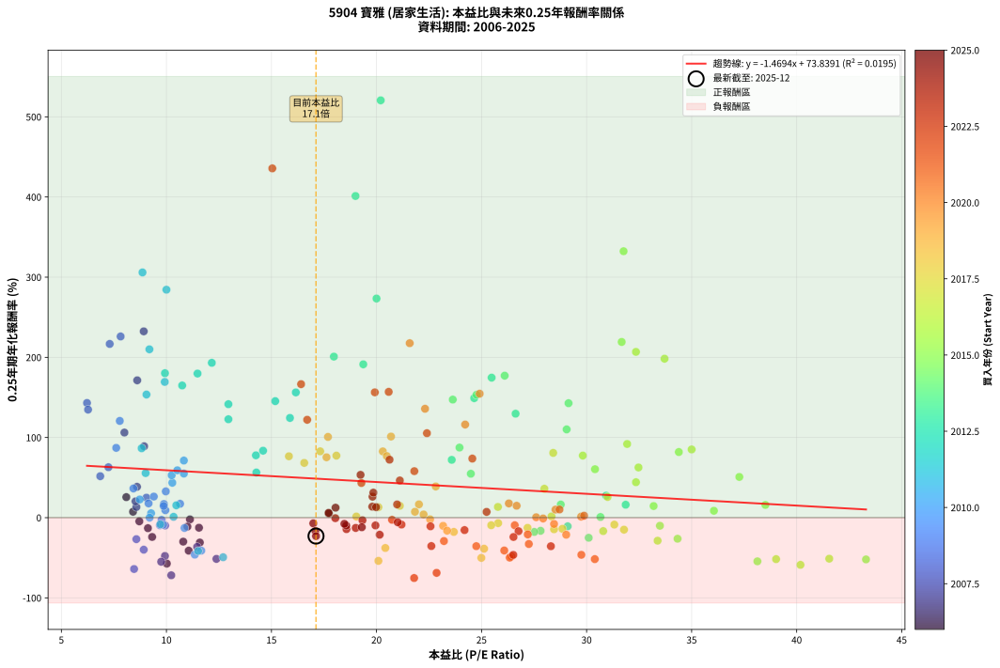
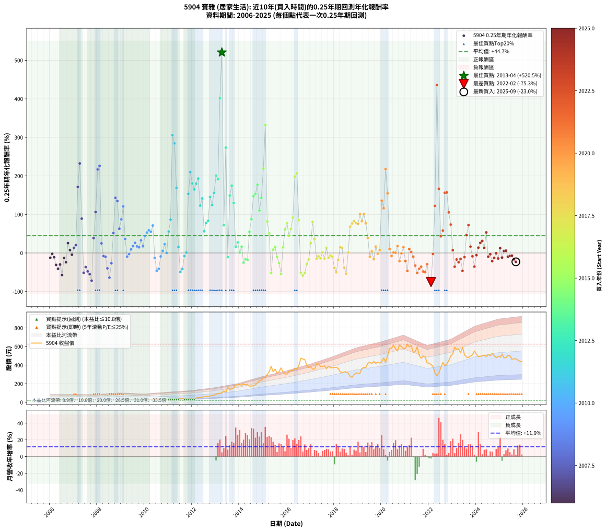

# 5904 寶雅 - 本益比與未來報酬率分析

!!! info "報告資訊"
    - **股票代號**: 5904
    - **公司名稱**: 寶雅
    - **產業別**: 居家生活
    - **分析期間**: 2006-2025 (237 個數據點)
    - **資料來源**: Type 12 (ShowMonthlyK_ChartFlow) 月收盤價與本益比
    - **報酬率口徑**: 含現金股利 (簡化: 年度合計，假設每年7/1入帳)
    - **報告生成時間**: 2026-01-07 19:05:19 CST

## 📈 視覺化圖表

### 圖表1: 本益比 vs 未來報酬率關係

*圖表1：5904 寶雅 本益比與0.25年期未來報酬率關係 (2006-2025)*

### 圖表2: 歷年買入時點的0.25年期實際報酬率

*圖表2：5904 寶雅 歷年買入時點的0.25年期實際報酬率 (2006-2025)*

## 📍 買點訊號說明

本報告提供兩種買點提示訊號（顯示於圖表2的股價子圖中）：

### ▲ 小綠色三角形（回測驗證）
- **計算方式**: 使用全部歷史資料計算本益比第25百分位數
- **用途**: 事後驗證，顯示歷史上哪些時點確實為低估區
- **限制**: 當下無法判斷，僅供回測參考
- **特性**: 後見之明（Look-Ahead Bias）

### ▲ 小橘色三角形（即時訊號）
- **計算方式**: 使用截至當月的過去5年資料計算本益比第25百分位數
- **用途**: 實際投資決策，當時即可判斷
- **優勢**: 可操作性強，符合實務需求
- **特性**: 無後見之明，滾動窗口計算

!!! tip "如何使用兩種訊號"
    - **綠色▲** 幫助理解歷史估值機會，驗證策略有效性
    - **橘色▲** 可作為實際買進參考，但仍需搭配基本面分析
    - 兩種訊號重疊時，表示即時判斷與事後驗證一致，信心度較高
    - 僅有綠色▲時，表示當時無法判斷（需要未來資料才能確認）
    - 僅有橘色▲時，表示即時判斷為買點，但事後可能不是最佳時機

## 📊 估值分析摘要

| 指標 | 數值 |
|:---:|:---:|
| **目前本益比** (2025-09) | **17.12 倍** |
| **歷史平均本益比** | 19.84 倍 |
| **估值水準** | 🟡 合理範圍 |
| **預期0.25年年化報酬率** | **+48.68%** |
| **歷史平均報酬率** | +44.68% |
| **相關係數 (R²)** | 0.0195 |
| **趨勢線斜率** | -1.4694 |

!!! abstract "核心洞察"
    目前本益比接近歷史平均，預期報酬率符合長期趨勢

    根據歷史數據回測，5904 寶雅 在目前本益比 **17.1倍** 的估值水準下，
    預期未來0.25年年化報酬率約為 **+48.7%**。

    **重要提醒**: 本分析基於歷史數據統計，實際報酬率會受到公司基本面變化、產業趨勢、
    總體經濟環境等多重因素影響。R² = 0.02 表示本益比可解釋約 1.9% 的報酬率變異。

## 📈 歷史估值統計

### 最佳買點 (最高報酬率)

| 項目 | 數值 |
|:---:|:---:|
| 起始時間 | 2013-04 |
| 當時本益比 | 20.20 倍 |
| 起始價格 | 103.5 元 |
| 0.25年後價格 | 159.0 元 |
| **0.25年年化報酬率** | **+520.54%** |

### 最差買點 (最低報酬率)

| 項目 | 數值 |
|:---:|:---:|
| 起始時間 | 2022-02 |
| 當時本益比 | 21.79 倍 |
| 起始價格 | 405.0 元 |
| 0.25年後價格 | 287.0 元 |
| **0.25年年化報酬率** | **-75.28%** |

## 🎯 投資啟示

### 本益比與報酬率關係

趨勢線方程式: **y = -1.4694x + 73.8391**

!!! warning "強負相關"
    本益比與未來報酬率呈現強負相關。在高本益比時期買入，未來報酬率顯著較低；
    在低本益比時期買入，未來報酬率顯著較高。**估值紀律至關重要**。

### 估值區間建議

基於歷史數據分析:

- **🟢 低估區** (P/E < 15.9): 預期報酬率較高，可考慮增加持股
- **🟡 合理區** (P/E 15.9-23.8): 預期報酬率符合長期趨勢，正常持有
- **🔴 高估區** (P/E > 23.8): 預期報酬率較低，可考慮減碼或觀望

!!! danger "風險提示"
    - 過去表現不代表未來結果
    - 本分析假設公司基本面無重大結構性變化
    - 產業環境劇變可能使歷史規律失效
    - 應結合公司財報、產業趨勢、總體經濟等多重因素綜合判斷

!!! success "長期投資觀點"
    歷史數據顯示，在合理或低估的估值水準買入並長期持有，
    往往能獲得較佳的投資報酬。**耐心等待好價格**是價值投資的核心原則。

## 📊 數據品質

- **資料來源**: GoodInfo.tw Type 12 (ShowMonthlyK_ChartFlow)
- **資料頻率**: 月度收盤價與本益比
- **回測期間**: 2006-2025
- **數據點數量**: 237 個 (每個點代表一次0.25年期回測)

### 計算方法說明

1. **0.25年期年化報酬率**:
   - 對每個歷史時點，計算其後0.25年的實際投資報酬率
   - 期末價值(不含股利): 期末價格
   - 期末價值(含現金股利): 期末價格 + 持有期間內的現金股利合計 (簡化: 年度合計，假設每年7/1入帳)
   - 公式: 年化報酬率 = [(期末價值/期初價格)^(1/年數) - 1] × 100%

2. **本益比 (P/E Ratio)**:
   - 使用當時的月收盤價與EPS計算
   - 資料來源: Type 12 月度河流圖本益比數據

3. **趨勢線 (Linear Regression)**:
   - 使用最小平方法擬合線性趨勢線
   - R²值衡量本益比對報酬率的解釋能力

---

*本報告由 Stock Analysis System v1.9.0 自動生成*
*數據更新時間: 2026-01-07 19:05:19 CST*

## 📋 月度回測明細表

（每一列對應時間線圖中的一個買入點；可用來對照 SVG 圖上的每個點。）

| 買入月份 | 賣出月份 | 回測期限_年 | 實際持有年數 | 買入本益比_倍 | 買入收盤價_元 | 賣出收盤價_元 | 現金股利合計_元 | 總報酬率_pct | 年化報酬率_pct |
| --- | --- | --- | --- | --- | --- | --- | --- | --- | --- |
| 2006-01 | 2006-05 | 0.25 | 0.329 | 11.55 | 29.00 | 27.75 | 0.00 | -4.31 | -12.55 |
| 2006-02 | 2006-05 | 0.25 | 0.246 | 11.12 | 27.90 | 27.75 | 0.00 | -0.54 | -2.16 |
| 2006-03 | 2006-07 | 0.25 | 0.334 | 11.00 | 27.60 | 25.15 | 1.38 | -3.88 | -11.16 |
| 2006-04 | 2006-07 | 0.25 | 0.249 | 11.59 | 29.10 | 25.15 | 1.38 | -8.83 | -31.00 |
| 2006-05 | 2006-08 | 0.25 | 0.252 | 11.06 | 27.75 | 22.90 | 1.38 | -12.50 | -41.16 |
| 2006-06 | 2006-09 | 0.25 | 0.252 | 10.80 | 27.10 | 23.40 | 1.38 | -8.56 | -29.90 |
| 2006-07 | 2006-10 | 0.25 | 0.252 | 10.02 | 25.15 | 20.30 | 0.00 | -19.28 | -57.28 |
| 2006-08 | 2006-12 | 0.25 | 0.334 | 9.12 | 22.90 | 21.85 | 0.00 | -4.59 | -13.11 |
| 2006-09 | 2006-12 | 0.25 | 0.249 | 9.32 | 23.40 | 21.85 | 0.00 | -6.62 | -24.05 |
| 2006-10 | 2007-01 | 0.25 | 0.252 | 8.09 | 20.30 | 21.50 | 0.00 | +5.91 | +25.61 |
| 2006-11 | 2007-03 | 0.25 | 0.329 | 8.41 | 21.10 | 21.60 | 0.00 | +2.37 | +7.39 |
| 2006-12 | 2007-03 | 0.25 | 0.246 | 8.71 | 21.85 | 21.60 | 0.00 | -1.14 | -4.56 |
| 2007-01 | 2007-05 | 0.25 | 0.329 | 8.57 | 21.50 | 22.40 | 0.00 | +4.19 | +13.29 |
| 2007-02 | 2007-05 | 0.25 | 0.246 | 8.53 | 21.40 | 22.40 | 0.00 | +4.67 | +20.36 |
| 2007-03 | 2007-07 | 0.25 | 0.334 | 8.61 | 21.60 | 28.70 | 1.45 | +39.57 | +171.32 |
| 2007-04 | 2007-07 | 0.25 | 0.249 | 8.92 | 22.35 | 28.70 | 1.45 | +34.89 | +232.39 |
| 2007-05 | 2007-08 | 0.25 | 0.252 | 8.94 | 22.40 | 24.85 | 1.45 | +17.40 | +89.04 |
| 2007-06 | 2007-09 | 0.25 | 0.252 | 12.38 | 31.00 | 24.40 | 1.45 | -16.62 | -51.41 |
| 2007-07 | 2007-10 | 0.25 | 0.252 | 11.46 | 28.70 | 25.60 | 0.00 | -10.80 | -36.48 |
| 2007-08 | 2007-12 | 0.25 | 0.334 | 9.93 | 24.85 | 20.00 | 0.00 | -19.52 | -47.80 |
| 2007-09 | 2007-12 | 0.25 | 0.249 | 9.75 | 24.40 | 20.00 | 0.00 | -18.03 | -54.98 |
| 2007-10 | 2008-01 | 0.25 | 0.252 | 10.23 | 25.60 | 18.60 | 0.00 | -27.34 | -71.87 |
| 2007-11 | 2008-03 | 0.25 | 0.331 | 8.60 | 21.50 | 23.95 | 0.00 | +11.40 | +38.51 |
| 2007-12 | 2008-03 | 0.25 | 0.249 | 8.00 | 20.00 | 23.95 | 0.00 | +19.75 | +106.15 |
| 2008-01 | 2008-05 | 0.25 | 0.331 | 7.30 | 18.60 | 27.25 | 0.00 | +46.51 | +216.70 |
| 2008-02 | 2008-05 | 0.25 | 0.249 | 7.82 | 20.30 | 27.25 | 0.00 | +34.24 | +226.02 |
| 2008-03 | 2008-07 | 0.25 | 0.334 | 9.05 | 23.95 | 24.00 | 1.80 | +7.72 | +24.95 |
| 2008-04 | 2008-07 | 0.25 | 0.249 | 9.78 | 26.35 | 24.00 | 1.80 | -2.09 | -8.12 |
| 2008-05 | 2008-08 | 0.25 | 0.252 | 9.94 | 27.25 | 24.75 | 1.80 | -2.57 | -9.82 |
| 2008-06 | 2008-09 | 0.25 | 0.252 | 8.92 | 24.90 | 20.10 | 1.80 | -12.05 | -39.93 |
| 2008-07 | 2008-10 | 0.25 | 0.252 | 8.46 | 24.00 | 18.55 | 0.00 | -22.71 | -64.04 |
| 2008-08 | 2008-12 | 0.25 | 0.334 | 8.57 | 24.75 | 22.30 | 0.00 | -9.90 | -26.81 |
| 2008-09 | 2008-12 | 0.25 | 0.249 | 6.85 | 20.10 | 22.30 | 0.00 | +10.95 | +51.72 |
| 2008-10 | 2009-01 | 0.25 | 0.252 | 6.22 | 18.55 | 23.20 | 0.00 | +25.07 | +143.04 |
| 2008-11 | 2009-03 | 0.25 | 0.329 | 6.27 | 19.00 | 25.15 | 0.00 | +32.37 | +134.79 |
| 2008-12 | 2009-03 | 0.25 | 0.246 | 7.24 | 22.30 | 25.15 | 0.00 | +12.78 | +62.92 |
| 2009-01 | 2009-05 | 0.25 | 0.329 | 7.61 | 23.20 | 28.50 | 0.00 | +22.84 | +87.06 |
| 2009-02 | 2009-05 | 0.25 | 0.246 | 7.78 | 23.45 | 28.50 | 0.00 | +21.54 | +120.67 |
| 2009-03 | 2009-07 | 0.25 | 0.334 | 8.43 | 25.15 | 26.10 | 1.80 | +10.93 | +36.43 |
| 2009-04 | 2009-07 | 0.25 | 0.249 | 9.69 | 28.60 | 26.10 | 1.80 | -2.45 | -9.47 |
| 2009-05 | 2009-08 | 0.25 | 0.252 | 9.77 | 28.50 | 26.50 | 1.80 | -0.70 | -2.76 |
| 2009-06 | 2009-09 | 0.25 | 0.252 | 9.95 | 28.70 | 27.55 | 1.80 | +2.26 | +9.30 |
| 2009-07 | 2009-10 | 0.25 | 0.252 | 9.15 | 26.10 | 27.20 | 0.00 | +4.21 | +17.81 |
| 2009-08 | 2009-12 | 0.25 | 0.334 | 9.40 | 26.50 | 28.65 | 0.00 | +8.11 | +26.31 |
| 2009-09 | 2009-12 | 0.25 | 0.249 | 9.88 | 27.55 | 28.65 | 0.00 | +3.99 | +17.02 |
| 2009-10 | 2010-01 | 0.25 | 0.252 | 9.87 | 27.20 | 28.15 | 0.00 | +3.49 | +14.60 |
| 2009-11 | 2010-03 | 0.25 | 0.329 | 9.97 | 27.15 | 29.80 | 0.00 | +9.76 | +32.77 |
| 2009-12 | 2010-03 | 0.25 | 0.246 | 10.65 | 28.65 | 29.80 | 0.00 | +4.01 | +17.32 |
| 2010-01 | 2010-05 | 0.25 | 0.329 | 10.28 | 28.15 | 31.70 | 0.00 | +12.61 | +43.55 |
| 2010-02 | 2010-05 | 0.25 | 0.246 | 10.25 | 28.55 | 31.70 | 0.00 | +11.03 | +52.92 |
| 2010-03 | 2010-07 | 0.25 | 0.334 | 10.52 | 29.80 | 34.30 | 0.50 | +16.78 | +59.10 |
| 2010-04 | 2010-07 | 0.25 | 0.249 | 10.83 | 31.20 | 34.30 | 0.50 | +11.54 | +55.01 |
| 2010-05 | 2010-08 | 0.25 | 0.252 | 10.83 | 31.70 | 35.80 | 0.50 | +14.51 | +71.25 |
| 2010-06 | 2010-09 | 0.25 | 0.252 | 10.86 | 32.30 | 30.70 | 0.50 | -3.41 | -12.85 |
| 2010-07 | 2010-10 | 0.25 | 0.252 | 11.35 | 34.30 | 29.35 | 0.00 | -14.43 | -46.14 |
| 2010-08 | 2010-12 | 0.25 | 0.334 | 11.66 | 35.80 | 30.00 | 0.00 | -16.20 | -41.09 |
| 2010-09 | 2010-12 | 0.25 | 0.249 | 9.85 | 30.70 | 30.00 | 0.00 | -2.28 | -8.84 |
| 2010-10 | 2011-01 | 0.25 | 0.252 | 9.27 | 29.35 | 29.75 | 0.00 | +1.36 | +5.52 |
| 2010-11 | 2011-03 | 0.25 | 0.329 | 8.73 | 28.05 | 30.00 | 0.00 | +6.95 | +22.70 |
| 2010-12 | 2011-03 | 0.25 | 0.246 | 9.20 | 30.00 | 30.00 | 0.00 | +0.00 | +0.00 |
| 2011-01 | 2011-05 | 0.25 | 0.329 | 9.01 | 29.75 | 34.40 | 0.00 | +15.63 | +55.59 |
| 2011-02 | 2011-05 | 0.25 | 0.246 | 8.82 | 29.50 | 34.40 | 0.00 | +16.61 | +86.57 |
| 2011-03 | 2011-07 | 0.25 | 0.334 | 8.86 | 30.00 | 45.10 | 2.80 | +59.67 | +305.88 |
| 2011-04 | 2011-07 | 0.25 | 0.249 | 10.00 | 34.25 | 45.10 | 2.80 | +39.85 | +284.33 |
| 2011-05 | 2011-08 | 0.25 | 0.252 | 9.92 | 34.40 | 41.35 | 2.80 | +28.34 | +169.31 |
| 2011-06 | 2011-09 | 0.25 | 0.252 | 10.47 | 36.75 | 35.30 | 2.80 | +3.67 | +15.40 |
| 2011-07 | 2011-10 | 0.25 | 0.252 | 12.70 | 45.10 | 38.00 | 0.00 | -15.74 | -49.34 |
| 2011-08 | 2011-12 | 0.25 | 0.334 | 11.51 | 41.35 | 34.55 | 0.00 | -16.44 | -41.60 |
| 2011-09 | 2011-12 | 0.25 | 0.249 | 9.71 | 35.30 | 34.55 | 0.00 | -2.12 | -8.26 |
| 2011-10 | 2012-01 | 0.25 | 0.252 | 10.34 | 38.00 | 38.10 | 0.00 | +0.26 | +1.05 |
| 2011-11 | 2012-03 | 0.25 | 0.331 | 9.05 | 33.65 | 45.80 | 0.00 | +36.11 | +153.59 |
| 2011-12 | 2012-03 | 0.25 | 0.249 | 9.19 | 34.55 | 45.80 | 0.00 | +32.56 | +209.99 |
| 2012-01 | 2012-05 | 0.25 | 0.331 | 9.93 | 38.10 | 53.60 | 0.00 | +40.68 | +180.21 |
| 2012-02 | 2012-05 | 0.25 | 0.249 | 10.75 | 42.05 | 53.60 | 0.00 | +27.47 | +164.88 |
| 2012-03 | 2012-07 | 0.25 | 0.334 | 11.48 | 45.80 | 61.30 | 3.28 | +41.00 | +179.76 |
| 2012-04 | 2012-07 | 0.25 | 0.249 | 12.16 | 49.40 | 61.30 | 3.28 | +30.73 | +193.15 |
| 2012-05 | 2012-08 | 0.25 | 0.252 | 12.95 | 53.60 | 62.30 | 3.28 | +22.35 | +122.74 |
| 2012-06 | 2012-09 | 0.25 | 0.252 | 12.95 | 54.60 | 64.90 | 3.28 | +24.87 | +141.53 |
| 2012-07 | 2012-10 | 0.25 | 0.252 | 14.28 | 61.30 | 68.60 | 0.00 | +11.91 | +56.31 |
| 2012-08 | 2012-12 | 0.25 | 0.334 | 14.26 | 62.30 | 75.50 | 0.00 | +21.19 | +77.77 |
| 2012-09 | 2012-12 | 0.25 | 0.249 | 14.60 | 64.90 | 75.50 | 0.00 | +16.33 | +83.53 |
| 2012-10 | 2013-01 | 0.25 | 0.252 | 15.18 | 68.60 | 86.00 | 0.00 | +25.36 | +145.34 |
| 2012-11 | 2013-03 | 0.25 | 0.329 | 15.88 | 73.00 | 95.20 | 0.00 | +30.41 | +124.38 |
| 2012-12 | 2013-03 | 0.25 | 0.246 | 16.16 | 75.50 | 95.20 | 0.00 | +26.09 | +156.23 |
| 2013-01 | 2013-05 | 0.25 | 0.329 | 17.97 | 86.00 | 123.50 | 0.00 | +43.60 | +200.87 |
| 2013-02 | 2013-05 | 0.25 | 0.246 | 19.37 | 94.90 | 123.50 | 0.00 | +30.14 | +191.26 |
| 2013-03 | 2013-07 | 0.25 | 0.334 | 19.00 | 95.20 | 159.00 | 4.10 | +71.32 | +401.20 |
| 2013-04 | 2013-07 | 0.25 | 0.249 | 20.20 | 103.50 | 159.00 | 4.10 | +57.58 | +520.54 |
| 2013-05 | 2013-08 | 0.25 | 0.252 | 23.58 | 123.50 | 137.50 | 4.10 | +14.66 | +72.11 |
| 2013-06 | 2013-09 | 0.25 | 0.252 | 20.00 | 107.00 | 145.00 | 4.10 | +39.35 | +273.31 |
| 2013-07 | 2013-10 | 0.25 | 0.252 | 29.10 | 159.00 | 154.50 | 0.00 | -2.83 | -10.77 |
| 2013-08 | 2013-12 | 0.25 | 0.334 | 24.65 | 137.50 | 186.50 | 0.00 | +35.64 | +149.07 |
| 2013-09 | 2013-12 | 0.25 | 0.249 | 25.48 | 145.00 | 186.50 | 0.00 | +28.62 | +174.63 |
| 2013-10 | 2014-01 | 0.25 | 0.252 | 26.62 | 154.50 | 190.50 | 0.00 | +23.30 | +129.69 |
| 2013-11 | 2014-03 | 0.25 | 0.329 | 31.86 | 188.50 | 198.00 | 0.00 | +5.04 | +16.14 |
| 2013-12 | 2014-03 | 0.25 | 0.246 | 30.93 | 186.50 | 198.00 | 0.00 | +6.17 | +27.49 |
| 2014-01 | 2014-05 | 0.25 | 0.329 | 30.66 | 190.50 | 191.00 | 0.00 | +0.26 | +0.80 |
| 2014-02 | 2014-05 | 0.25 | 0.246 | 28.77 | 184.00 | 191.00 | 0.00 | +3.80 | +16.36 |
| 2014-03 | 2014-07 | 0.25 | 0.334 | 30.10 | 198.00 | 175.00 | 4.80 | -9.19 | -25.07 |
| 2014-04 | 2014-07 | 0.25 | 0.249 | 27.81 | 188.00 | 175.00 | 4.80 | -4.36 | -16.39 |
| 2014-05 | 2014-08 | 0.25 | 0.252 | 27.51 | 191.00 | 177.00 | 4.80 | -4.82 | -17.80 |
| 2014-06 | 2014-09 | 0.25 | 0.252 | 24.49 | 174.50 | 190.00 | 4.80 | +11.63 | +54.79 |
| 2014-07 | 2014-10 | 0.25 | 0.252 | 23.95 | 175.00 | 205.00 | 0.00 | +17.14 | +87.42 |
| 2014-08 | 2014-12 | 0.25 | 0.334 | 23.63 | 177.00 | 239.50 | 0.00 | +35.31 | +147.28 |
| 2014-09 | 2014-12 | 0.25 | 0.249 | 24.76 | 190.00 | 239.50 | 0.00 | +26.05 | +153.27 |
| 2014-10 | 2015-01 | 0.25 | 0.252 | 26.10 | 205.00 | 265.00 | 0.00 | +29.27 | +177.10 |
| 2014-11 | 2015-03 | 0.25 | 0.329 | 29.05 | 233.50 | 298.00 | 0.00 | +27.62 | +110.10 |
| 2014-12 | 2015-03 | 0.25 | 0.246 | 29.14 | 239.50 | 298.00 | 0.00 | +24.43 | +142.76 |
| 2015-01 | 2015-05 | 0.25 | 0.329 | 31.67 | 265.00 | 388.00 | 0.00 | +46.42 | +219.16 |
| 2015-02 | 2015-05 | 0.25 | 0.246 | 31.76 | 270.50 | 388.00 | 0.00 | +43.44 | +332.31 |
| 2015-03 | 2015-07 | 0.25 | 0.334 | 34.39 | 298.00 | 356.50 | 7.40 | +22.11 | +81.87 |
| 2015-04 | 2015-07 | 0.25 | 0.249 | 37.27 | 328.50 | 356.50 | 7.40 | +10.78 | +50.80 |
| 2015-05 | 2015-08 | 0.25 | 0.252 | 43.30 | 388.00 | 315.00 | 7.40 | -16.91 | -52.06 |
| 2015-06 | 2015-09 | 0.25 | 0.252 | 36.06 | 328.50 | 328.00 | 7.40 | +2.10 | +8.60 |
| 2015-07 | 2015-10 | 0.25 | 0.252 | 38.51 | 356.50 | 370.00 | 0.00 | +3.79 | +15.90 |
| 2015-08 | 2015-12 | 0.25 | 0.334 | 33.49 | 315.00 | 304.00 | 0.00 | -3.49 | -10.09 |
| 2015-09 | 2015-12 | 0.25 | 0.249 | 34.33 | 328.00 | 304.00 | 0.00 | -7.32 | -26.29 |
| 2015-10 | 2016-01 | 0.25 | 0.252 | 38.13 | 370.00 | 303.50 | 0.00 | -17.97 | -54.46 |
| 2015-11 | 2016-03 | 0.25 | 0.331 | 33.19 | 327.00 | 342.00 | 0.00 | +4.59 | +14.50 |
| 2015-12 | 2016-03 | 0.25 | 0.249 | 30.40 | 304.00 | 342.00 | 0.00 | +12.50 | +60.44 |
| 2016-01 | 2016-05 | 0.25 | 0.331 | 29.82 | 303.50 | 367.00 | 0.00 | +20.92 | +77.44 |
| 2016-02 | 2016-05 | 0.25 | 0.249 | 32.35 | 335.00 | 367.00 | 0.00 | +9.55 | +44.22 |
| 2016-03 | 2016-07 | 0.25 | 0.334 | 32.47 | 342.00 | 393.50 | 8.80 | +17.63 | +62.61 |
| 2016-04 | 2016-07 | 0.25 | 0.249 | 31.93 | 342.00 | 393.50 | 8.80 | +17.63 | +91.90 |
| 2016-05 | 2016-08 | 0.25 | 0.252 | 33.71 | 367.00 | 474.50 | 8.80 | +31.69 | +198.28 |
| 2016-06 | 2016-09 | 0.25 | 0.252 | 32.35 | 358.00 | 466.00 | 8.80 | +32.63 | +206.79 |
| 2016-07 | 2016-10 | 0.25 | 0.252 | 35.00 | 393.50 | 459.50 | 0.00 | +16.77 | +85.08 |
| 2016-08 | 2016-12 | 0.25 | 0.334 | 41.55 | 474.50 | 373.50 | 0.00 | -21.29 | -51.16 |
| 2016-09 | 2016-12 | 0.25 | 0.249 | 40.18 | 466.00 | 373.50 | 0.00 | -19.85 | -58.86 |
| 2016-10 | 2017-01 | 0.25 | 0.252 | 39.02 | 459.50 | 382.50 | 0.00 | -16.76 | -51.72 |
| 2016-11 | 2017-03 | 0.25 | 0.329 | 33.38 | 399.00 | 357.00 | 0.00 | -10.53 | -28.72 |
| 2016-12 | 2017-03 | 0.25 | 0.246 | 30.79 | 373.50 | 357.00 | 0.00 | -4.42 | -16.75 |
| 2017-01 | 2017-05 | 0.25 | 0.329 | 31.00 | 382.50 | 412.50 | 0.00 | +7.84 | +25.84 |
| 2017-02 | 2017-05 | 0.25 | 0.246 | 28.41 | 356.50 | 412.50 | 0.00 | +15.71 | +80.78 |
| 2017-03 | 2017-07 | 0.25 | 0.334 | 27.99 | 357.00 | 385.00 | 10.70 | +10.84 | +36.09 |
| 2017-04 | 2017-07 | 0.25 | 0.249 | 31.78 | 412.00 | 385.00 | 10.70 | -3.96 | -14.96 |
| 2017-05 | 2017-08 | 0.25 | 0.252 | 31.32 | 412.50 | 392.50 | 10.70 | -2.25 | -8.66 |
| 2017-06 | 2017-09 | 0.25 | 0.252 | 28.85 | 386.00 | 361.00 | 10.70 | -3.70 | -13.92 |
| 2017-07 | 2017-10 | 0.25 | 0.252 | 28.33 | 385.00 | 386.50 | 0.00 | +0.39 | +1.56 |
| 2017-08 | 2017-12 | 0.25 | 0.334 | 28.45 | 392.50 | 372.50 | 0.00 | -5.10 | -14.49 |
| 2017-09 | 2017-12 | 0.25 | 0.249 | 25.78 | 361.00 | 372.50 | 0.00 | +3.19 | +13.41 |
| 2017-10 | 2018-01 | 0.25 | 0.252 | 27.19 | 386.50 | 373.50 | 0.00 | -3.36 | -12.70 |
| 2017-11 | 2018-03 | 0.25 | 0.329 | 25.79 | 372.00 | 363.50 | 0.00 | -2.28 | -6.79 |
| 2017-12 | 2018-03 | 0.25 | 0.246 | 25.46 | 372.50 | 363.50 | 0.00 | -2.42 | -9.45 |
| 2018-01 | 2018-05 | 0.25 | 0.329 | 25.12 | 373.50 | 318.00 | 0.00 | -14.86 | -38.72 |
| 2018-02 | 2018-05 | 0.25 | 0.246 | 24.99 | 377.50 | 318.00 | 0.00 | -15.76 | -50.15 |
| 2018-03 | 2018-07 | 0.25 | 0.334 | 23.68 | 363.50 | 327.50 | 13.00 | -6.33 | -17.77 |
| 2018-04 | 2018-07 | 0.25 | 0.249 | 21.11 | 329.00 | 327.50 | 13.00 | +3.50 | +14.79 |
| 2018-05 | 2018-08 | 0.25 | 0.252 | 20.09 | 318.00 | 315.00 | 13.00 | +3.14 | +13.08 |
| 2018-06 | 2018-09 | 0.25 | 0.252 | 20.42 | 328.00 | 278.00 | 13.00 | -11.28 | -37.82 |
| 2018-07 | 2018-10 | 0.25 | 0.252 | 20.09 | 327.50 | 269.50 | 0.00 | -17.71 | -53.88 |
| 2018-08 | 2018-12 | 0.25 | 0.334 | 19.04 | 315.00 | 316.50 | 0.00 | +0.48 | +1.43 |
| 2018-09 | 2018-12 | 0.25 | 0.249 | 16.56 | 278.00 | 316.50 | 0.00 | +13.85 | +68.30 |
| 2018-10 | 2019-01 | 0.25 | 0.252 | 15.83 | 269.50 | 311.00 | 0.00 | +15.40 | +76.58 |
| 2018-11 | 2019-03 | 0.25 | 0.329 | 17.32 | 299.00 | 364.50 | 0.00 | +21.91 | +82.74 |
| 2018-12 | 2019-03 | 0.25 | 0.246 | 18.09 | 316.50 | 364.50 | 0.00 | +15.17 | +77.37 |
| 2019-01 | 2019-05 | 0.25 | 0.329 | 17.62 | 311.00 | 374.00 | 0.00 | +20.26 | +75.32 |
| 2019-02 | 2019-05 | 0.25 | 0.246 | 17.69 | 315.00 | 374.00 | 0.00 | +18.73 | +100.72 |
| 2019-03 | 2019-07 | 0.25 | 0.334 | 20.30 | 364.50 | 430.00 | 15.75 | +22.29 | +82.66 |
| 2019-04 | 2019-07 | 0.25 | 0.249 | 20.69 | 374.50 | 430.00 | 15.75 | +19.03 | +101.19 |
| 2019-05 | 2019-08 | 0.25 | 0.252 | 20.49 | 374.00 | 416.00 | 15.75 | +15.44 | +76.84 |
| 2019-06 | 2019-09 | 0.25 | 0.252 | 22.82 | 420.00 | 440.50 | 15.75 | +8.63 | +38.91 |
| 2019-07 | 2019-10 | 0.25 | 0.252 | 23.17 | 430.00 | 418.50 | 0.00 | -2.67 | -10.20 |
| 2019-08 | 2019-12 | 0.25 | 0.334 | 22.24 | 416.00 | 421.50 | 0.00 | +1.32 | +4.01 |
| 2019-09 | 2019-12 | 0.25 | 0.249 | 23.36 | 440.50 | 421.50 | 0.00 | -4.31 | -16.22 |
| 2019-10 | 2020-01 | 0.25 | 0.252 | 22.02 | 418.50 | 435.00 | 0.00 | +3.94 | +16.59 |
| 2019-11 | 2020-03 | 0.25 | 0.331 | 22.55 | 432.00 | 429.00 | 0.00 | -0.69 | -2.08 |
| 2019-12 | 2020-03 | 0.25 | 0.249 | 21.83 | 421.50 | 429.00 | 0.00 | +1.78 | +7.34 |
| 2020-01 | 2020-05 | 0.25 | 0.331 | 22.31 | 435.00 | 578.00 | 0.00 | +32.87 | +135.84 |
| 2020-02 | 2020-05 | 0.25 | 0.249 | 24.22 | 477.00 | 578.00 | 0.00 | +21.17 | +116.16 |
| 2020-03 | 2020-07 | 0.25 | 0.334 | 21.58 | 429.00 | 614.00 | 17.10 | +47.11 | +217.61 |
| 2020-04 | 2020-07 | 0.25 | 0.249 | 24.91 | 500.00 | 614.00 | 17.10 | +26.22 | +154.63 |
| 2020-05 | 2020-08 | 0.25 | 0.252 | 28.52 | 578.00 | 575.00 | 17.10 | +2.44 | +10.04 |
| 2020-06 | 2020-09 | 0.25 | 0.252 | 28.45 | 582.00 | 553.00 | 17.10 | -2.04 | -7.87 |
| 2020-07 | 2020-10 | 0.25 | 0.252 | 29.74 | 614.00 | 616.00 | 0.00 | +0.33 | +1.30 |
| 2020-08 | 2020-12 | 0.25 | 0.334 | 27.60 | 575.00 | 576.00 | 0.00 | +0.17 | +0.52 |
| 2020-09 | 2020-12 | 0.25 | 0.249 | 26.30 | 553.00 | 576.00 | 0.00 | +4.16 | +17.77 |
| 2020-10 | 2021-01 | 0.25 | 0.252 | 29.03 | 616.00 | 580.00 | 0.00 | -5.84 | -21.26 |
| 2020-11 | 2021-03 | 0.25 | 0.329 | 27.93 | 598.00 | 596.00 | 0.00 | -0.33 | -1.01 |
| 2020-12 | 2021-03 | 0.25 | 0.246 | 26.67 | 576.00 | 596.00 | 0.00 | +3.47 | +14.86 |
| 2021-01 | 2021-05 | 0.25 | 0.329 | 27.20 | 580.00 | 537.00 | 0.00 | -7.41 | -20.90 |
| 2021-02 | 2021-05 | 0.25 | 0.246 | 29.75 | 626.00 | 537.00 | 0.00 | -14.22 | -46.33 |
| 2021-03 | 2021-07 | 0.25 | 0.334 | 28.71 | 596.00 | 597.00 | 18.70 | +3.31 | +10.23 |
| 2021-04 | 2021-07 | 0.25 | 0.249 | 29.88 | 612.00 | 597.00 | 18.70 | +0.60 | +2.45 |
| 2021-05 | 2021-08 | 0.25 | 0.252 | 26.58 | 537.00 | 505.00 | 18.70 | -2.48 | -9.48 |
| 2021-06 | 2021-09 | 0.25 | 0.252 | 27.25 | 543.00 | 472.50 | 18.70 | -9.54 | -32.84 |
| 2021-07 | 2021-10 | 0.25 | 0.252 | 30.39 | 597.00 | 497.00 | 0.00 | -16.75 | -51.70 |
| 2021-08 | 2021-12 | 0.25 | 0.334 | 26.08 | 505.00 | 423.50 | 0.00 | -16.14 | -40.96 |
| 2021-09 | 2021-12 | 0.25 | 0.249 | 24.75 | 472.50 | 423.50 | 0.00 | -10.37 | -35.56 |
| 2021-10 | 2022-01 | 0.25 | 0.252 | 26.42 | 497.00 | 421.00 | 0.00 | -15.29 | -48.26 |
| 2021-11 | 2022-03 | 0.25 | 0.329 | 26.34 | 488.00 | 389.00 | 0.00 | -20.29 | -49.85 |
| 2021-12 | 2022-03 | 0.25 | 0.246 | 23.21 | 423.50 | 389.00 | 0.00 | -8.15 | -29.17 |
| 2022-01 | 2022-05 | 0.25 | 0.329 | 22.86 | 421.00 | 287.00 | 0.00 | -31.83 | -68.85 |
| 2022-02 | 2022-05 | 0.25 | 0.246 | 21.79 | 405.00 | 287.00 | 0.00 | -29.14 | -75.28 |
| 2022-03 | 2022-07 | 0.25 | 0.334 | 20.74 | 389.00 | 374.50 | 11.00 | -0.90 | -2.67 |
| 2022-04 | 2022-07 | 0.25 | 0.249 | 16.70 | 316.00 | 374.50 | 11.00 | +21.99 | +122.09 |
| 2022-05 | 2022-08 | 0.25 | 0.252 | 15.04 | 287.00 | 427.00 | 11.00 | +52.61 | +435.65 |
| 2022-06 | 2022-09 | 0.25 | 0.252 | 16.41 | 316.00 | 393.50 | 11.00 | +28.01 | +166.51 |
| 2022-07 | 2022-10 | 0.25 | 0.252 | 19.28 | 374.50 | 410.00 | 0.00 | +9.48 | +43.27 |
| 2022-08 | 2022-12 | 0.25 | 0.334 | 21.80 | 427.00 | 497.50 | 0.00 | +16.51 | +58.01 |
| 2022-09 | 2022-12 | 0.25 | 0.249 | 19.92 | 393.50 | 497.50 | 0.00 | +26.43 | +156.33 |
| 2022-10 | 2023-01 | 0.25 | 0.252 | 20.58 | 410.00 | 520.00 | 0.00 | +26.83 | +156.92 |
| 2022-11 | 2023-03 | 0.25 | 0.329 | 22.40 | 450.00 | 570.00 | 0.00 | +26.67 | +105.34 |
| 2022-12 | 2023-03 | 0.25 | 0.246 | 24.56 | 497.50 | 570.00 | 0.00 | +14.57 | +73.69 |
| 2023-01 | 2023-05 | 0.25 | 0.329 | 25.24 | 520.00 | 532.00 | 0.00 | +2.31 | +7.19 |
| 2023-02 | 2023-05 | 0.25 | 0.246 | 28.30 | 593.00 | 532.00 | 0.00 | -10.29 | -35.63 |
| 2023-03 | 2023-07 | 0.25 | 0.334 | 26.76 | 570.00 | 512.00 | 23.90 | -5.98 | -16.86 |
| 2023-04 | 2023-07 | 0.25 | 0.249 | 26.52 | 574.00 | 512.00 | 23.90 | -6.64 | -24.09 |
| 2023-05 | 2023-08 | 0.25 | 0.252 | 24.19 | 532.00 | 486.00 | 23.90 | -4.15 | -15.50 |
| 2023-06 | 2023-09 | 0.25 | 0.252 | 26.51 | 592.00 | 482.00 | 23.90 | -14.54 | -46.42 |
| 2023-07 | 2023-10 | 0.25 | 0.252 | 22.57 | 512.00 | 497.50 | 0.00 | -2.83 | -10.78 |
| 2023-08 | 2023-12 | 0.25 | 0.334 | 21.11 | 486.00 | 552.00 | 0.00 | +13.58 | +46.41 |
| 2023-09 | 2023-12 | 0.25 | 0.249 | 20.62 | 482.00 | 552.00 | 0.00 | +14.52 | +72.34 |
| 2023-10 | 2024-01 | 0.25 | 0.252 | 20.98 | 497.50 | 517.00 | 0.00 | +3.92 | +16.49 |
| 2023-11 | 2024-03 | 0.25 | 0.331 | 21.19 | 510.00 | 495.00 | 0.00 | -2.94 | -8.62 |
| 2023-12 | 2024-03 | 0.25 | 0.249 | 22.61 | 552.00 | 495.00 | 0.00 | -10.33 | -35.43 |
| 2024-01 | 2024-05 | 0.25 | 0.331 | 21.01 | 517.00 | 507.00 | 0.00 | -1.93 | -5.73 |
| 2024-02 | 2024-05 | 0.25 | 0.249 | 19.80 | 491.00 | 507.00 | 0.00 | +3.26 | +13.74 |
| 2024-03 | 2024-07 | 0.25 | 0.334 | 19.81 | 495.00 | 514.00 | 21.00 | +8.08 | +26.19 |
| 2024-04 | 2024-07 | 0.25 | 0.249 | 19.85 | 500.00 | 514.00 | 21.00 | +7.00 | +31.20 |
| 2024-05 | 2024-08 | 0.25 | 0.252 | 19.98 | 507.00 | 502.00 | 21.00 | +3.16 | +13.13 |
| 2024-06 | 2024-09 | 0.25 | 0.252 | 19.24 | 492.00 | 527.00 | 21.00 | +11.38 | +53.41 |
| 2024-07 | 2024-10 | 0.25 | 0.252 | 19.95 | 514.00 | 501.00 | 0.00 | -2.53 | -9.67 |
| 2024-08 | 2024-12 | 0.25 | 0.334 | 19.33 | 502.00 | 496.50 | 0.00 | -1.10 | -3.24 |
| 2024-09 | 2024-12 | 0.25 | 0.249 | 20.15 | 527.00 | 496.50 | 0.00 | -5.79 | -21.28 |
| 2024-10 | 2025-01 | 0.25 | 0.252 | 19.01 | 501.00 | 484.00 | 0.00 | -3.39 | -12.81 |
| 2024-11 | 2025-03 | 0.25 | 0.329 | 18.04 | 479.00 | 478.00 | 0.00 | -0.21 | -0.63 |
| 2024-12 | 2025-03 | 0.25 | 0.246 | 18.57 | 496.50 | 478.00 | 0.00 | -3.73 | -14.28 |
| 2025-01 | 2025-05 | 0.25 | 0.329 | 18.05 | 484.00 | 503.00 | 0.00 | +3.93 | +12.43 |
| 2025-02 | 2025-05 | 0.25 | 0.246 | 19.30 | 519.00 | 503.00 | 0.00 | -3.08 | -11.93 |
| 2025-03 | 2025-07 | 0.25 | 0.334 | 17.73 | 478.00 | 463.00 | 23.00 | +1.67 | +5.09 |
| 2025-04 | 2025-07 | 0.25 | 0.249 | 17.72 | 479.00 | 463.00 | 23.00 | +1.46 | +6.00 |
| 2025-05 | 2025-08 | 0.25 | 0.252 | 18.56 | 503.00 | 467.00 | 23.00 | -2.58 | -9.87 |
| 2025-06 | 2025-09 | 0.25 | 0.252 | 18.47 | 502.00 | 469.00 | 23.00 | -1.99 | -7.68 |
| 2025-07 | 2025-10 | 0.25 | 0.252 | 16.99 | 463.00 | 454.50 | 0.00 | -1.84 | -7.09 |
| 2025-08 | 2025-12 | 0.25 | 0.334 | 17.09 | 467.00 | 439.50 | 0.00 | -5.89 | -16.61 |
| 2025-09 | 2025-12 | 0.25 | 0.249 | 17.12 | 469.00 | 439.50 | 0.00 | -6.29 | -22.95 |
