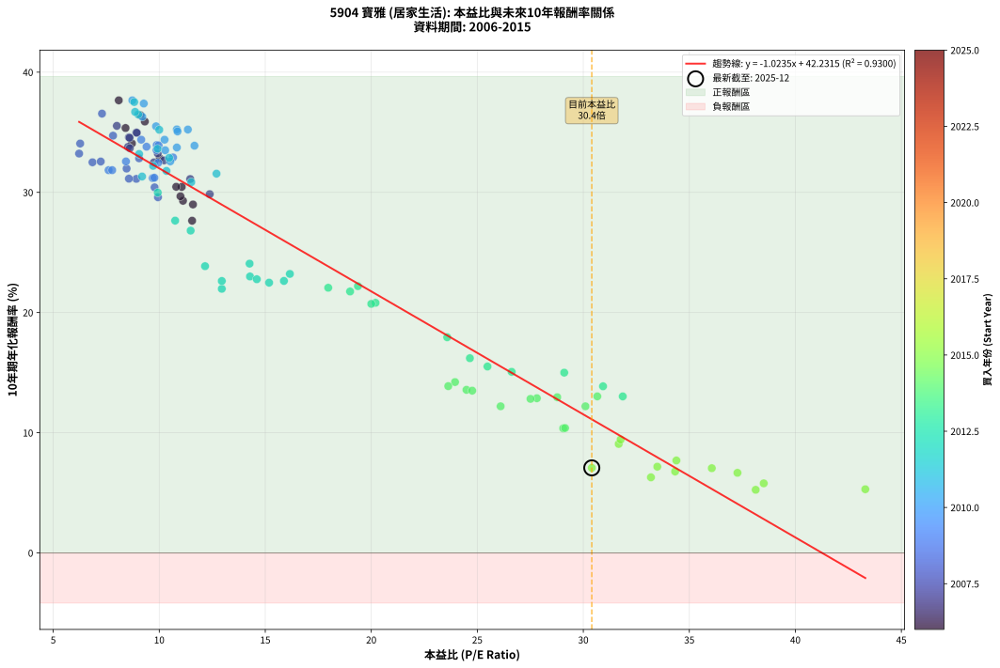
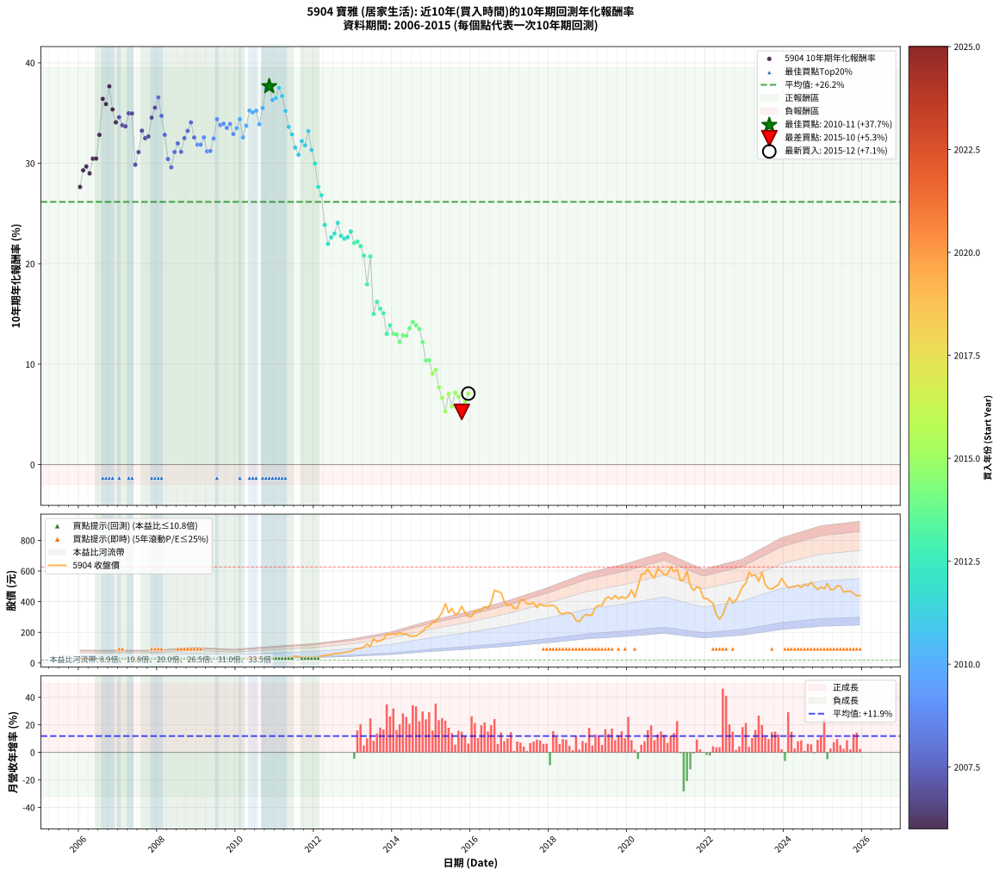

# 5904 寶雅 - 本益比與未來報酬率分析

!!! info "報告資訊"
    - **股票代號**: 5904
    - **公司名稱**: 寶雅
    - **產業別**: 居家生活
    - **分析期間**: 2006-2015 (120 個數據點)
    - **資料來源**: Type 12 (ShowMonthlyK_ChartFlow) 月收盤價與本益比
    - **報酬率口徑**: 含現金股利 (簡化: 年度合計，假設每年7/1入帳)
    - **報告生成時間**: 2026-01-09 21:12:44 CST

## 📈 視覺化圖表

### 圖表1: 本益比 vs 未來報酬率關係

*圖表1：5904 寶雅 本益比與10年期未來報酬率關係 (2006-2015)*

### 圖表2: 歷年買入時點的10年期實際報酬率

*圖表2：5904 寶雅 歷年買入時點的10年期實際報酬率 (2006-2015)*

## 📍 買點訊號說明

本報告提供兩種買點提示訊號（顯示於圖表2的股價子圖中）：

### ▲ 小綠色三角形（回測驗證）
- **計算方式**: 使用全部歷史資料計算本益比第25百分位數
- **用途**: 事後驗證，顯示歷史上哪些時點確實為低估區
- **限制**: 當下無法判斷，僅供回測參考
- **特性**: 後見之明（Look-Ahead Bias）

### ▲ 小橘色三角形（即時訊號）
- **計算方式**: 使用截至當月的過去5年資料計算本益比第25百分位數
- **用途**: 實際投資決策，當時即可判斷
- **優勢**: 可操作性強，符合實務需求
- **特性**: 無後見之明，滾動窗口計算

!!! tip "如何使用兩種訊號"
    - **綠色▲** 幫助理解歷史估值機會，驗證策略有效性
    - **橘色▲** 可作為實際買進參考，但仍需搭配基本面分析
    - 兩種訊號重疊時，表示即時判斷與事後驗證一致，信心度較高
    - 僅有綠色▲時，表示當時無法判斷（需要未來資料才能確認）
    - 僅有橘色▲時，表示即時判斷為買點，但事後可能不是最佳時機

## 📊 估值分析摘要

| 指標 | 數值 |
|:---:|:---:|
| **目前本益比** (2015-12) | **30.40 倍** |
| **歷史平均本益比** | 15.70 倍 |
| **估值水準** | 🔴 相對高估 |
| **預期10年年化報酬率** | **+11.12%** |
| **歷史平均報酬率** | +26.16% |
| **相關係數 (R²)** | 0.9300 |
| **趨勢線斜率** | -1.0235 |

!!! abstract "核心洞察"
    目前本益比顯著高於歷史平均，預期未來報酬率可能較低

    根據歷史數據回測，5904 寶雅 在目前本益比 **30.4倍** 的估值水準下，
    預期未來10年年化報酬率約為 **+11.1%**。

    **重要提醒**: 本分析基於歷史數據統計，實際報酬率會受到公司基本面變化、產業趨勢、
    總體經濟環境等多重因素影響。R² = 0.93 表示本益比可解釋約 93.0% 的報酬率變異。

## 📈 歷史估值統計

### 最佳買點 (最高報酬率)

| 項目 | 數值 |
|:---:|:---:|
| 起始時間 | 2010-11 |
| 當時本益比 | 8.73 倍 |
| 起始價格 | 28.1 元 |
| 10年後價格 | 598.0 元 |
| **10年年化報酬率** | **+37.66%** |

### 最差買點 (最低報酬率)

| 項目 | 數值 |
|:---:|:---:|
| 起始時間 | 2015-10 |
| 當時本益比 | 38.13 倍 |
| 起始價格 | 370.0 元 |
| 10年後價格 | 454.5 元 |
| **10年年化報酬率** | **+5.25%** |

## 🎯 投資啟示

### 本益比與報酬率關係

趨勢線方程式: **y = -1.0235x + 42.2315**

!!! warning "強負相關"
    本益比與未來報酬率呈現強負相關。在高本益比時期買入，未來報酬率顯著較低；
    在低本益比時期買入，未來報酬率顯著較高。**估值紀律至關重要**。

### 估值區間建議

基於歷史數據分析:

- **🟢 低估區** (P/E < 12.6): 預期報酬率較高，可考慮增加持股
- **🟡 合理區** (P/E 12.6-18.8): 預期報酬率符合長期趨勢，正常持有
- **🔴 高估區** (P/E > 18.8): 預期報酬率較低，可考慮減碼或觀望

!!! danger "風險提示"
    - 過去表現不代表未來結果
    - 本分析假設公司基本面無重大結構性變化
    - 產業環境劇變可能使歷史規律失效
    - 應結合公司財報、產業趨勢、總體經濟等多重因素綜合判斷

!!! success "長期投資觀點"
    歷史數據顯示，在合理或低估的估值水準買入並長期持有，
    往往能獲得較佳的投資報酬。**耐心等待好價格**是價值投資的核心原則。

## 📊 數據品質

- **資料來源**: GoodInfo.tw Type 12 (ShowMonthlyK_ChartFlow)
- **資料頻率**: 月度收盤價與本益比
- **回測期間**: 2006-2015
- **數據點數量**: 120 個 (每個點代表一次10年期回測)

### 計算方法說明

1. **10年期年化報酬率**:
   - 對每個歷史時點，計算其後10年的實際投資報酬率
   - 期末價值(不含股利): 期末價格
   - 期末價值(含現金股利): 期末價格 + 持有期間內的現金股利合計 (簡化: 年度合計，假設每年7/1入帳)
   - 公式: 年化報酬率 = [(期末價值/期初價格)^(1/年數) - 1] × 100%

2. **本益比 (P/E Ratio)**:
   - 使用當時的月收盤價與EPS計算
   - 資料來源: Type 12 月度河流圖本益比數據

3. **趨勢線 (Linear Regression)**:
   - 使用最小平方法擬合線性趨勢線
   - R²值衡量本益比對報酬率的解釋能力

---

*本報告由 Stock Analysis System v1.9.0 自動生成*
*數據更新時間: 2026-01-09 21:12:44 CST*

## 📋 月度回測明細表

（每一列對應時間線圖中的一個買入點；可用來對照 SVG 圖上的每個點。）

| 買入月份 | 賣出月份 | 回測期限_年 | 實際持有年數 | 買入本益比_倍 | 買入收盤價_元 | 賣出收盤價_元 | 現金股利合計_元 | 總報酬率_pct | 年化報酬率_pct |
| --- | --- | --- | --- | --- | --- | --- | --- | --- | --- |
| 2006-01 | 2016-01 | 10 | 9.999 | 11.55 | 29.00 | 303.50 | 29.31 | +1047.61 | +27.64 |
| 2006-02 | 2016-02 | 10 | 9.999 | 11.12 | 27.90 | 335.00 | 29.31 | +1205.76 | +29.30 |
| 2006-03 | 2016-03 | 10 | 10.001 | 11.00 | 27.60 | 342.00 | 29.31 | +1245.32 | +29.68 |
| 2006-04 | 2016-04 | 10 | 10.001 | 11.59 | 29.10 | 342.00 | 29.31 | +1175.97 | +28.99 |
| 2006-05 | 2016-05 | 10 | 10.001 | 11.06 | 27.75 | 367.00 | 29.31 | +1328.13 | +30.46 |
| 2006-06 | 2016-06 | 10 | 10.001 | 10.80 | 27.10 | 358.00 | 29.31 | +1329.18 | +30.46 |
| 2006-07 | 2016-07 | 10 | 10.001 | 10.02 | 25.15 | 393.50 | 36.73 | +1610.64 | +32.83 |
| 2006-08 | 2016-08 | 10 | 10.001 | 9.12 | 22.90 | 474.50 | 36.73 | +2132.43 | +36.41 |
| 2006-09 | 2016-09 | 10 | 10.001 | 9.32 | 23.40 | 466.00 | 36.73 | +2048.41 | +35.89 |
| 2006-10 | 2016-10 | 10 | 10.001 | 8.09 | 20.30 | 459.50 | 36.73 | +2344.47 | +37.66 |
| 2006-11 | 2016-11 | 10 | 10.001 | 8.41 | 21.10 | 399.00 | 36.73 | +1965.06 | +35.36 |
| 2006-12 | 2016-12 | 10 | 10.001 | 8.71 | 21.85 | 373.50 | 36.73 | +1777.47 | +34.07 |
| 2007-01 | 2017-01 | 10 | 10.001 | 8.57 | 21.50 | 382.50 | 36.73 | +1849.89 | +34.58 |
| 2007-02 | 2017-02 | 10 | 10.001 | 8.53 | 21.40 | 356.50 | 36.73 | +1737.51 | +33.78 |
| 2007-03 | 2017-03 | 10 | 10.001 | 8.61 | 21.60 | 357.00 | 36.73 | +1722.81 | +33.68 |
| 2007-04 | 2017-04 | 10 | 10.001 | 8.92 | 22.35 | 412.00 | 36.73 | +1907.73 | +34.97 |
| 2007-05 | 2017-05 | 10 | 10.001 | 8.94 | 22.40 | 412.50 | 36.73 | +1905.48 | +34.96 |
| 2007-06 | 2017-06 | 10 | 10.001 | 12.38 | 31.00 | 386.00 | 36.73 | +1263.64 | +29.85 |
| 2007-07 | 2017-07 | 10 | 10.001 | 11.46 | 28.70 | 385.00 | 45.98 | +1401.67 | +31.11 |
| 2007-08 | 2017-08 | 10 | 10.001 | 9.93 | 24.85 | 392.50 | 45.98 | +1664.51 | +33.24 |
| 2007-09 | 2017-09 | 10 | 10.001 | 9.75 | 24.40 | 361.00 | 45.98 | +1567.95 | +32.50 |
| 2007-10 | 2017-10 | 10 | 10.001 | 10.23 | 25.60 | 386.50 | 45.98 | +1589.38 | +32.66 |
| 2007-11 | 2017-11 | 10 | 10.001 | 8.60 | 21.50 | 372.00 | 45.98 | +1844.09 | +34.54 |
| 2007-12 | 2017-12 | 10 | 10.001 | 8.00 | 20.00 | 372.50 | 45.98 | +1992.40 | +35.53 |
| 2008-01 | 2018-01 | 10 | 10.001 | 7.30 | 18.60 | 373.50 | 45.98 | +2155.27 | +36.55 |
| 2008-02 | 2018-03 | 10 | 10.081 | 7.82 | 20.30 | 363.50 | 45.98 | +1917.14 | +34.72 |
| 2008-03 | 2018-03 | 10 | 9.999 | 9.05 | 23.95 | 363.50 | 45.98 | +1609.73 | +32.83 |
| 2008-04 | 2018-04 | 10 | 9.999 | 9.78 | 26.35 | 329.00 | 45.98 | +1323.07 | +30.42 |
| 2008-05 | 2018-05 | 10 | 9.999 | 9.94 | 27.25 | 318.00 | 45.98 | +1235.71 | +29.59 |
| 2008-06 | 2018-06 | 10 | 9.999 | 8.92 | 24.90 | 328.00 | 45.98 | +1401.93 | +31.12 |
| 2008-07 | 2018-07 | 10 | 9.999 | 8.46 | 24.00 | 327.50 | 57.18 | +1502.83 | +31.98 |
| 2008-08 | 2018-08 | 10 | 9.999 | 8.57 | 24.75 | 315.00 | 57.18 | +1403.76 | +31.14 |
| 2008-09 | 2018-09 | 10 | 9.999 | 6.85 | 20.10 | 278.00 | 57.18 | +1567.56 | +32.50 |
| 2008-10 | 2018-10 | 10 | 9.999 | 6.22 | 18.55 | 269.50 | 57.18 | +1661.08 | +33.23 |
| 2008-11 | 2018-11 | 10 | 9.999 | 6.27 | 19.00 | 299.00 | 57.18 | +1774.63 | +34.06 |
| 2008-12 | 2018-12 | 10 | 9.999 | 7.24 | 22.30 | 316.50 | 57.18 | +1575.70 | +32.57 |
| 2009-01 | 2019-01 | 10 | 9.999 | 7.61 | 23.20 | 311.00 | 57.18 | +1486.98 | +31.85 |
| 2009-02 | 2019-02 | 10 | 9.999 | 7.78 | 23.45 | 315.00 | 57.18 | +1487.12 | +31.85 |
| 2009-03 | 2019-03 | 10 | 9.999 | 8.43 | 25.15 | 364.50 | 57.18 | +1576.66 | +32.57 |
| 2009-04 | 2019-04 | 10 | 9.999 | 9.69 | 28.60 | 374.50 | 57.18 | +1409.37 | +31.19 |
| 2009-05 | 2019-05 | 10 | 9.999 | 9.77 | 28.50 | 374.00 | 57.18 | +1412.91 | +31.22 |
| 2009-06 | 2019-06 | 10 | 9.999 | 9.95 | 28.70 | 420.00 | 57.18 | +1562.65 | +32.46 |
| 2009-07 | 2019-07 | 10 | 9.999 | 9.15 | 26.10 | 430.00 | 71.13 | +1820.04 | +34.38 |
| 2009-08 | 2019-08 | 10 | 9.999 | 9.40 | 26.50 | 416.00 | 71.13 | +1738.23 | +33.80 |
| 2009-09 | 2019-09 | 10 | 9.999 | 9.88 | 27.55 | 440.50 | 71.13 | +1757.10 | +33.94 |
| 2009-10 | 2019-10 | 10 | 9.999 | 9.87 | 27.20 | 418.50 | 71.13 | +1700.11 | +33.52 |
| 2009-11 | 2019-11 | 10 | 9.999 | 9.97 | 27.15 | 432.00 | 71.13 | +1753.15 | +33.91 |
| 2009-12 | 2019-12 | 10 | 9.999 | 10.65 | 28.65 | 421.50 | 71.13 | +1619.48 | +32.91 |
| 2010-01 | 2020-01 | 10 | 9.999 | 10.28 | 28.15 | 435.00 | 71.13 | +1697.98 | +33.50 |
| 2010-02 | 2020-02 | 10 | 9.999 | 10.25 | 28.55 | 477.00 | 71.13 | +1819.89 | +34.38 |
| 2010-03 | 2020-03 | 10 | 10.001 | 10.52 | 29.80 | 429.00 | 71.13 | +1578.29 | +32.58 |
| 2010-04 | 2020-04 | 10 | 10.001 | 10.83 | 31.20 | 500.00 | 71.13 | +1730.54 | +33.73 |
| 2010-05 | 2020-05 | 10 | 10.001 | 10.83 | 31.70 | 578.00 | 71.13 | +1947.73 | +35.24 |
| 2010-06 | 2020-06 | 10 | 10.001 | 10.86 | 32.30 | 582.00 | 71.13 | +1922.07 | +35.07 |
| 2010-07 | 2020-07 | 10 | 10.001 | 11.35 | 34.30 | 614.00 | 87.73 | +1945.86 | +35.23 |
| 2010-08 | 2020-08 | 10 | 10.001 | 11.66 | 35.80 | 575.00 | 87.73 | +1751.20 | +33.88 |
| 2010-09 | 2020-09 | 10 | 10.001 | 9.85 | 30.70 | 553.00 | 87.73 | +1987.07 | +35.50 |
| 2010-10 | 2020-10 | 10 | 10.001 | 9.27 | 29.35 | 616.00 | 87.73 | +2297.72 | +37.39 |
| 2010-11 | 2020-11 | 10 | 10.001 | 8.73 | 28.05 | 598.00 | 87.73 | +2344.67 | +37.66 |
| 2010-12 | 2020-12 | 10 | 10.001 | 9.20 | 30.00 | 576.00 | 87.73 | +2112.43 | +36.29 |
| 2011-01 | 2021-01 | 10 | 10.001 | 9.01 | 29.75 | 580.00 | 87.73 | +2144.47 | +36.49 |
| 2011-02 | 2021-02 | 10 | 10.001 | 8.82 | 29.50 | 626.00 | 87.73 | +2319.42 | +37.52 |
| 2011-03 | 2021-03 | 10 | 10.001 | 8.86 | 30.00 | 596.00 | 87.73 | +2179.10 | +36.70 |
| 2011-04 | 2021-04 | 10 | 10.001 | 10.00 | 34.25 | 612.00 | 87.73 | +1943.01 | +35.21 |
| 2011-05 | 2021-05 | 10 | 10.001 | 9.92 | 34.40 | 537.00 | 87.73 | +1716.08 | +33.63 |
| 2011-06 | 2021-06 | 10 | 10.001 | 10.47 | 36.75 | 543.00 | 87.73 | +1616.27 | +32.87 |
| 2011-07 | 2021-07 | 10 | 10.001 | 12.70 | 45.10 | 597.00 | 103.63 | +1453.50 | +31.56 |
| 2011-08 | 2021-08 | 10 | 10.001 | 11.51 | 41.35 | 505.00 | 103.63 | +1371.90 | +30.85 |
| 2011-09 | 2021-09 | 10 | 10.001 | 9.71 | 35.30 | 472.50 | 103.63 | +1532.10 | +32.21 |
| 2011-10 | 2021-10 | 10 | 10.001 | 10.34 | 38.00 | 497.00 | 103.63 | +1480.61 | +31.78 |
| 2011-11 | 2021-11 | 10 | 10.001 | 9.05 | 33.65 | 488.00 | 103.63 | +1658.19 | +33.20 |
| 2011-12 | 2021-12 | 10 | 10.001 | 9.19 | 34.55 | 423.50 | 103.63 | +1425.70 | +31.32 |
| 2012-01 | 2022-01 | 10 | 10.001 | 9.93 | 38.10 | 421.00 | 103.63 | +1276.98 | +29.98 |
| 2012-02 | 2022-03 | 10 | 10.081 | 10.75 | 42.05 | 389.00 | 103.63 | +1071.53 | +27.65 |
| 2012-03 | 2022-03 | 10 | 9.999 | 11.48 | 45.80 | 389.00 | 103.63 | +975.61 | +26.82 |
| 2012-04 | 2022-04 | 10 | 9.999 | 12.16 | 49.40 | 316.00 | 103.63 | +749.45 | +23.86 |
| 2012-05 | 2022-05 | 10 | 9.999 | 12.95 | 53.60 | 287.00 | 103.63 | +628.79 | +21.98 |
| 2012-06 | 2022-06 | 10 | 9.999 | 12.95 | 54.60 | 316.00 | 103.63 | +668.55 | +22.63 |
| 2012-07 | 2022-07 | 10 | 9.999 | 14.28 | 61.30 | 374.50 | 111.35 | +692.58 | +23.00 |
| 2012-08 | 2022-08 | 10 | 9.999 | 14.26 | 62.30 | 427.00 | 111.35 | +764.13 | +24.07 |
| 2012-09 | 2022-09 | 10 | 9.999 | 14.60 | 64.90 | 393.50 | 111.35 | +677.89 | +22.77 |
| 2012-10 | 2022-10 | 10 | 9.999 | 15.18 | 68.60 | 410.00 | 111.35 | +659.99 | +22.49 |
| 2012-11 | 2022-11 | 10 | 9.999 | 15.88 | 73.00 | 450.00 | 111.35 | +668.97 | +22.63 |
| 2012-12 | 2022-12 | 10 | 9.999 | 16.16 | 75.50 | 497.50 | 111.35 | +706.42 | +23.22 |
| 2013-01 | 2023-01 | 10 | 9.999 | 17.97 | 86.00 | 520.00 | 111.35 | +634.13 | +22.06 |
| 2013-02 | 2023-02 | 10 | 9.999 | 19.37 | 94.90 | 593.00 | 111.35 | +642.20 | +22.20 |
| 2013-03 | 2023-03 | 10 | 9.999 | 19.00 | 95.20 | 570.00 | 111.35 | +615.70 | +21.75 |
| 2013-04 | 2023-04 | 10 | 9.999 | 20.20 | 103.50 | 574.00 | 111.35 | +562.17 | +20.81 |
| 2013-05 | 2023-05 | 10 | 9.999 | 23.58 | 123.50 | 532.00 | 111.35 | +420.93 | +17.95 |
| 2013-06 | 2023-06 | 10 | 9.999 | 20.00 | 107.00 | 592.00 | 111.35 | +557.34 | +20.72 |
| 2013-07 | 2023-07 | 10 | 9.999 | 29.10 | 159.00 | 512.00 | 131.15 | +304.50 | +15.00 |
| 2013-08 | 2023-08 | 10 | 9.999 | 24.65 | 137.50 | 486.00 | 131.15 | +348.84 | +16.20 |
| 2013-09 | 2023-09 | 10 | 9.999 | 25.48 | 145.00 | 482.00 | 131.15 | +322.86 | +15.51 |
| 2013-10 | 2023-10 | 10 | 9.999 | 26.62 | 154.50 | 497.50 | 131.15 | +306.89 | +15.07 |
| 2013-11 | 2023-11 | 10 | 9.999 | 31.86 | 188.50 | 510.00 | 131.15 | +240.13 | +13.02 |
| 2013-12 | 2023-12 | 10 | 9.999 | 30.93 | 186.50 | 552.00 | 131.15 | +266.30 | +13.87 |
| 2014-01 | 2024-01 | 10 | 9.999 | 30.66 | 190.50 | 517.00 | 131.15 | +240.24 | +13.03 |
| 2014-02 | 2024-02 | 10 | 9.999 | 28.77 | 184.00 | 491.00 | 131.15 | +238.12 | +12.96 |
| 2014-03 | 2024-03 | 10 | 10.001 | 30.10 | 198.00 | 495.00 | 131.15 | +216.24 | +12.20 |
| 2014-04 | 2024-04 | 10 | 10.001 | 27.81 | 188.00 | 500.00 | 131.15 | +235.72 | +12.87 |
| 2014-05 | 2024-05 | 10 | 10.001 | 27.51 | 191.00 | 507.00 | 131.15 | +234.11 | +12.82 |
| 2014-06 | 2024-06 | 10 | 10.001 | 24.49 | 174.50 | 492.00 | 131.15 | +257.11 | +13.57 |
| 2014-07 | 2024-07 | 10 | 10.001 | 23.95 | 175.00 | 514.00 | 147.35 | +277.91 | +14.22 |
| 2014-08 | 2024-08 | 10 | 10.001 | 23.63 | 177.00 | 502.00 | 147.35 | +266.86 | +13.88 |
| 2014-09 | 2024-09 | 10 | 10.001 | 24.76 | 190.00 | 527.00 | 147.35 | +254.92 | +13.50 |
| 2014-10 | 2024-10 | 10 | 10.001 | 26.10 | 205.00 | 501.00 | 147.35 | +216.27 | +12.20 |
| 2014-11 | 2024-11 | 10 | 10.001 | 29.05 | 233.50 | 479.00 | 147.35 | +168.24 | +10.37 |
| 2014-12 | 2024-12 | 10 | 10.001 | 29.14 | 239.50 | 496.50 | 147.35 | +168.83 | +10.39 |
| 2015-01 | 2025-01 | 10 | 10.001 | 31.67 | 265.00 | 484.00 | 147.35 | +138.25 | +9.07 |
| 2015-02 | 2025-02 | 10 | 10.001 | 31.76 | 270.50 | 519.00 | 147.35 | +146.34 | +9.43 |
| 2015-03 | 2025-03 | 10 | 10.001 | 34.39 | 298.00 | 478.00 | 147.35 | +109.85 | +7.69 |
| 2015-04 | 2025-04 | 10 | 10.001 | 37.27 | 328.50 | 479.00 | 147.35 | +90.67 | +6.67 |
| 2015-05 | 2025-05 | 10 | 10.001 | 43.30 | 388.00 | 503.00 | 147.35 | +67.62 | +5.30 |
| 2015-06 | 2025-06 | 10 | 10.001 | 36.06 | 328.50 | 502.00 | 147.35 | +97.67 | +7.05 |
| 2015-07 | 2025-07 | 10 | 10.001 | 38.51 | 356.50 | 463.00 | 162.95 | +75.58 | +5.79 |
| 2015-08 | 2025-08 | 10 | 10.001 | 33.49 | 315.00 | 467.00 | 162.95 | +99.98 | +7.18 |
| 2015-09 | 2025-09 | 10 | 10.001 | 34.33 | 328.00 | 469.00 | 162.95 | +92.67 | +6.78 |
| 2015-10 | 2025-10 | 10 | 10.001 | 38.13 | 370.00 | 454.50 | 162.95 | +66.88 | +5.25 |
| 2015-11 | 2025-11 | 10 | 10.001 | 33.19 | 327.00 | 439.00 | 162.95 | +84.08 | +6.29 |
| 2015-12 | 2025-12 | 10 | 10.001 | 30.40 | 304.00 | 439.50 | 162.95 | +98.17 | +7.08 |
