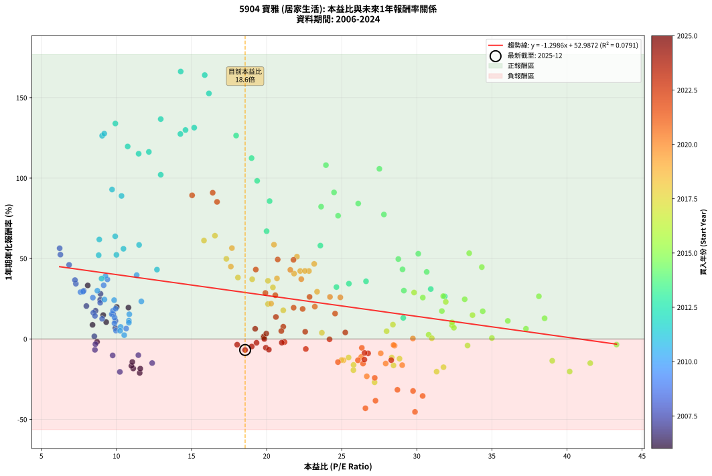
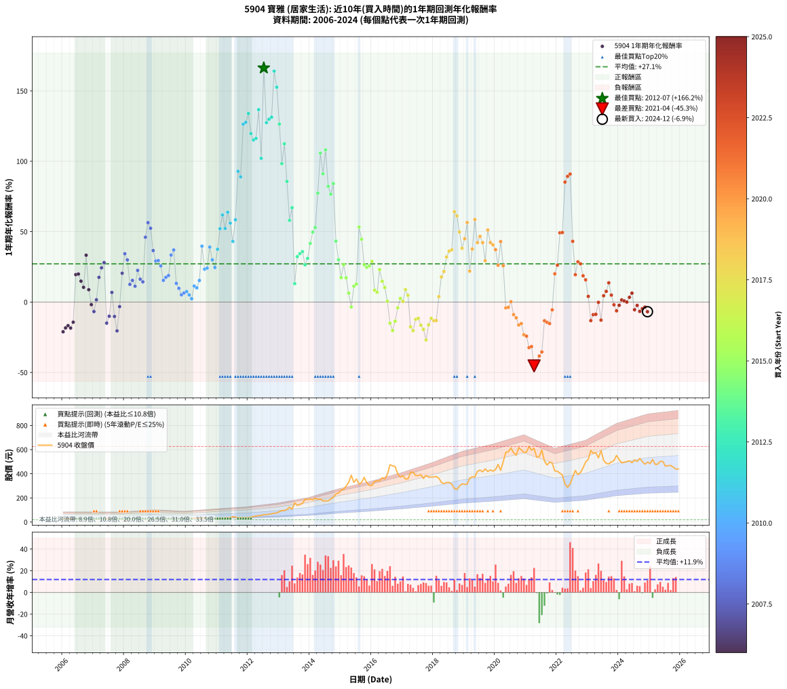

# 5904 寶雅 - 本益比與未來報酬率分析

!!! info "報告資訊"
    - **股票代號**: 5904
    - **公司名稱**: 寶雅
    - **產業別**: 居家生活
    - **分析期間**: 2006-2024 (228 個數據點)
    - **資料來源**: Type 12 (ShowMonthlyK_ChartFlow) 月收盤價與本益比
    - **報酬率口徑**: 含現金股利 (簡化: 年度合計，假設每年7/1入帳)
    - **報告生成時間**: 2026-01-13 01:07:03 CST

## 📈 視覺化圖表

### 圖表1: 本益比 vs 未來報酬率關係

*圖表1：5904 寶雅 本益比與1年期未來報酬率關係 (2006-2024)*

### 圖表2: 歷年買入時點的1年期實際報酬率

*圖表2：5904 寶雅 歷年買入時點的1年期實際報酬率 (2006-2024)*

## 📍 買點訊號說明

本報告提供兩種買點提示訊號（顯示於圖表2的股價子圖中）：

### ▲ 小綠色三角形（回測驗證）
- **計算方式**: 使用全部歷史資料計算本益比第25百分位數
- **用途**: 事後驗證，顯示歷史上哪些時點確實為低估區
- **限制**: 當下無法判斷，僅供回測參考
- **特性**: 後見之明（Look-Ahead Bias）

### ▲ 小橘色三角形（即時訊號）
- **計算方式**: 使用截至當月的過去5年資料計算本益比第25百分位數
- **用途**: 實際投資決策，當時即可判斷
- **優勢**: 可操作性強，符合實務需求
- **特性**: 無後見之明，滾動窗口計算

!!! tip "如何使用兩種訊號"
    - **綠色▲** 幫助理解歷史估值機會，驗證策略有效性
    - **橘色▲** 可作為實際買進參考，但仍需搭配基本面分析
    - 兩種訊號重疊時，表示即時判斷與事後驗證一致，信心度較高
    - 僅有綠色▲時，表示當時無法判斷（需要未來資料才能確認）
    - 僅有橘色▲時，表示即時判斷為買點，但事後可能不是最佳時機

## 📊 估值分析摘要

| 指標 | 數值 |
|:---:|:---:|
| **目前本益比** (2024-12) | **18.57 倍** |
| **歷史平均本益比** | 19.92 倍 |
| **估值水準** | 🟡 合理範圍 |
| **預期1年年化報酬率** | **+28.87%** |
| **歷史平均報酬率** | +27.12% |
| **相關係數 (R²)** | 0.0791 |
| **趨勢線斜率** | -1.2986 |

!!! abstract "核心洞察"
    目前本益比接近歷史平均，預期報酬率符合長期趨勢

    根據歷史數據回測，5904 寶雅 在目前本益比 **18.6倍** 的估值水準下，
    預期未來1年年化報酬率約為 **+28.9%**。

    **重要提醒**: 本分析基於歷史數據統計，實際報酬率會受到公司基本面變化、產業趨勢、
    總體經濟環境等多重因素影響。R² = 0.08 表示本益比可解釋約 7.9% 的報酬率變異。

## 📈 歷史估值統計

### 最佳買點 (最高報酬率)

| 項目 | 數值 |
|:---:|:---:|
| 起始時間 | 2012-07 |
| 當時本益比 | 14.28 倍 |
| 起始價格 | 61.3 元 |
| 1年後價格 | 159.0 元 |
| **1年年化報酬率** | **+166.25%** |

### 最差買點 (最低報酬率)

| 項目 | 數值 |
|:---:|:---:|
| 起始時間 | 2021-04 |
| 當時本益比 | 29.88 倍 |
| 起始價格 | 612.0 元 |
| 1年後價格 | 316.0 元 |
| **1年年化報酬率** | **-45.33%** |

## 🎯 投資啟示

### 本益比與報酬率關係

趨勢線方程式: **y = -1.2986x + 52.9872**

!!! warning "強負相關"
    本益比與未來報酬率呈現強負相關。在高本益比時期買入，未來報酬率顯著較低；
    在低本益比時期買入，未來報酬率顯著較高。**估值紀律至關重要**。

### 估值區間建議

基於歷史數據分析:

- **🟢 低估區** (P/E < 15.9): 預期報酬率較高，可考慮增加持股
- **🟡 合理區** (P/E 15.9-23.9): 預期報酬率符合長期趨勢，正常持有
- **🔴 高估區** (P/E > 23.9): 預期報酬率較低，可考慮減碼或觀望

!!! danger "風險提示"
    - 過去表現不代表未來結果
    - 本分析假設公司基本面無重大結構性變化
    - 產業環境劇變可能使歷史規律失效
    - 應結合公司財報、產業趨勢、總體經濟等多重因素綜合判斷

!!! success "長期投資觀點"
    歷史數據顯示，在合理或低估的估值水準買入並長期持有，
    往往能獲得較佳的投資報酬。**耐心等待好價格**是價值投資的核心原則。

## 📊 數據品質

- **資料來源**: GoodInfo.tw Type 12 (ShowMonthlyK_ChartFlow)
- **資料頻率**: 月度收盤價與本益比
- **回測期間**: 2006-2024
- **數據點數量**: 228 個 (每個點代表一次1年期回測)

### 計算方法說明

1. **1年期年化報酬率**:
   - 對每個歷史時點，計算其後1年的實際投資報酬率
   - 期末價值(不含股利): 期末價格
   - 期末價值(含現金股利): 期末價格 + 持有期間內的現金股利合計 (簡化: 年度合計，假設每年7/1入帳)
   - 公式: 年化報酬率 = [(期末價值/期初價格)^(1/年數) - 1] × 100%

2. **本益比 (P/E Ratio)**:
   - 使用當時的月收盤價與EPS計算
   - 資料來源: Type 12 月度河流圖本益比數據

3. **趨勢線 (Linear Regression)**:
   - 使用最小平方法擬合線性趨勢線
   - R²值衡量本益比對報酬率的解釋能力

---

*本報告由 Stock Analysis System v1.9.0 自動生成*
*數據更新時間: 2026-01-13 01:07:03 CST*

## 📋 月度回測明細表

（每一列對應時間線圖中的一個買入點；可用來對照 SVG 圖上的每個點。）

| 買入月份 | 賣出月份 | 回測期限_年 | 實際持有年數 | 買入本益比_倍 | 買入收盤價_元 | 賣出收盤價_元 | 現金股利合計_元 | 總報酬率_pct | 年化報酬率_pct |
| --- | --- | --- | --- | --- | --- | --- | --- | --- | --- |
| 2006-01 | 2007-01 | 1 | 0.999 | 11.55 | 29.00 | 21.50 | 1.38 | -21.10 | -21.12 |
| 2006-02 | 2007-02 | 1 | 0.999 | 11.12 | 27.90 | 21.40 | 1.38 | -18.35 | -18.36 |
| 2006-03 | 2007-03 | 1 | 0.999 | 11.00 | 27.60 | 21.60 | 1.38 | -16.74 | -16.75 |
| 2006-04 | 2007-04 | 1 | 0.999 | 11.59 | 29.10 | 22.35 | 1.38 | -18.45 | -18.47 |
| 2006-05 | 2007-05 | 1 | 0.999 | 11.06 | 27.75 | 22.40 | 1.38 | -14.31 | -14.32 |
| 2006-06 | 2007-06 | 1 | 0.999 | 10.80 | 27.10 | 31.00 | 1.38 | +19.48 | +19.50 |
| 2006-07 | 2007-07 | 1 | 0.999 | 10.02 | 25.15 | 28.70 | 1.45 | +19.87 | +19.88 |
| 2006-08 | 2007-08 | 1 | 0.999 | 9.12 | 22.90 | 24.85 | 1.45 | +14.83 | +14.84 |
| 2006-09 | 2007-09 | 1 | 0.999 | 9.32 | 23.40 | 24.40 | 1.45 | +10.46 | +10.46 |
| 2006-10 | 2007-10 | 1 | 0.999 | 8.09 | 20.30 | 25.60 | 1.45 | +33.24 | +33.26 |
| 2006-11 | 2007-11 | 1 | 0.999 | 8.41 | 21.10 | 21.50 | 1.45 | +8.75 | +8.76 |
| 2006-12 | 2007-12 | 1 | 0.999 | 8.71 | 21.85 | 20.00 | 1.45 | -1.84 | -1.85 |
| 2007-01 | 2008-01 | 1 | 0.999 | 8.57 | 21.50 | 18.60 | 1.45 | -6.76 | -6.76 |
| 2007-02 | 2008-02 | 1 | 0.999 | 8.53 | 21.40 | 20.30 | 1.45 | +1.62 | +1.62 |
| 2007-03 | 2008-03 | 1 | 1.002 | 8.61 | 21.60 | 23.95 | 1.45 | +17.58 | +17.54 |
| 2007-04 | 2008-04 | 1 | 1.002 | 8.92 | 22.35 | 26.35 | 1.45 | +24.37 | +24.32 |
| 2007-05 | 2008-05 | 1 | 1.002 | 8.94 | 22.40 | 27.25 | 1.45 | +28.11 | +28.05 |
| 2007-06 | 2008-06 | 1 | 1.002 | 12.38 | 31.00 | 24.90 | 1.45 | -15.01 | -14.98 |
| 2007-07 | 2008-07 | 1 | 1.002 | 11.46 | 28.70 | 24.00 | 1.80 | -10.10 | -10.08 |
| 2007-08 | 2008-08 | 1 | 1.002 | 9.93 | 24.85 | 24.75 | 1.80 | +6.84 | +6.83 |
| 2007-09 | 2008-09 | 1 | 1.002 | 9.75 | 24.40 | 20.10 | 1.80 | -10.25 | -10.23 |
| 2007-10 | 2008-10 | 1 | 1.002 | 10.23 | 25.60 | 18.55 | 1.80 | -20.51 | -20.47 |
| 2007-11 | 2008-11 | 1 | 1.002 | 8.60 | 21.50 | 19.00 | 1.80 | -3.26 | -3.25 |
| 2007-12 | 2008-12 | 1 | 1.002 | 8.00 | 20.00 | 22.30 | 1.80 | +20.50 | +20.45 |
| 2008-01 | 2009-01 | 1 | 1.002 | 7.30 | 18.60 | 23.20 | 1.80 | +34.41 | +34.33 |
| 2008-02 | 2009-03 | 1 | 1.081 | 7.82 | 20.30 | 25.15 | 1.80 | +32.76 | +29.96 |
| 2008-03 | 2009-03 | 1 | 0.999 | 9.05 | 23.95 | 25.15 | 1.80 | +12.53 | +12.54 |
| 2008-04 | 2009-04 | 1 | 0.999 | 9.78 | 26.35 | 28.60 | 1.80 | +15.37 | +15.38 |
| 2008-05 | 2009-05 | 1 | 0.999 | 9.94 | 27.25 | 28.50 | 1.80 | +11.19 | +11.20 |
| 2008-06 | 2009-06 | 1 | 0.999 | 8.92 | 24.90 | 28.70 | 1.80 | +22.49 | +22.51 |
| 2008-07 | 2009-07 | 1 | 0.999 | 8.46 | 24.00 | 26.10 | 1.80 | +16.25 | +16.26 |
| 2008-08 | 2009-08 | 1 | 0.999 | 8.57 | 24.75 | 26.50 | 1.80 | +14.34 | +14.35 |
| 2008-09 | 2009-09 | 1 | 0.999 | 6.85 | 20.10 | 27.55 | 1.80 | +46.02 | +46.06 |
| 2008-10 | 2009-10 | 1 | 0.999 | 6.22 | 18.55 | 27.20 | 1.80 | +56.33 | +56.38 |
| 2008-11 | 2009-11 | 1 | 0.999 | 6.27 | 19.00 | 27.15 | 1.80 | +52.37 | +52.41 |
| 2008-12 | 2009-12 | 1 | 0.999 | 7.24 | 22.30 | 28.65 | 1.80 | +36.55 | +36.58 |
| 2009-01 | 2010-01 | 1 | 0.999 | 7.61 | 23.20 | 28.15 | 1.80 | +29.09 | +29.12 |
| 2009-02 | 2010-02 | 1 | 0.999 | 7.78 | 23.45 | 28.55 | 1.80 | +29.42 | +29.45 |
| 2009-03 | 2010-03 | 1 | 0.999 | 8.43 | 25.15 | 29.80 | 1.80 | +25.65 | +25.67 |
| 2009-04 | 2010-04 | 1 | 0.999 | 9.69 | 28.60 | 31.20 | 1.80 | +15.38 | +15.40 |
| 2009-05 | 2010-05 | 1 | 0.999 | 9.77 | 28.50 | 31.70 | 1.80 | +17.54 | +17.56 |
| 2009-06 | 2010-06 | 1 | 0.999 | 9.95 | 28.70 | 32.30 | 1.80 | +18.82 | +18.83 |
| 2009-07 | 2010-07 | 1 | 0.999 | 9.15 | 26.10 | 34.30 | 0.50 | +33.33 | +33.36 |
| 2009-08 | 2010-08 | 1 | 0.999 | 9.40 | 26.50 | 35.80 | 0.50 | +36.98 | +37.01 |
| 2009-09 | 2010-09 | 1 | 0.999 | 9.88 | 27.55 | 30.70 | 0.50 | +13.25 | +13.26 |
| 2009-10 | 2010-10 | 1 | 0.999 | 9.87 | 27.20 | 29.35 | 0.50 | +9.74 | +9.75 |
| 2009-11 | 2010-11 | 1 | 0.999 | 9.97 | 27.15 | 28.05 | 0.50 | +5.16 | +5.16 |
| 2009-12 | 2010-12 | 1 | 0.999 | 10.65 | 28.65 | 30.00 | 0.50 | +6.46 | +6.46 |
| 2010-01 | 2011-01 | 1 | 0.999 | 10.28 | 28.15 | 29.75 | 0.50 | +7.46 | +7.47 |
| 2010-02 | 2011-02 | 1 | 0.999 | 10.25 | 28.55 | 29.50 | 0.50 | +5.08 | +5.08 |
| 2010-03 | 2011-03 | 1 | 0.999 | 10.52 | 29.80 | 30.00 | 0.50 | +2.35 | +2.35 |
| 2010-04 | 2011-04 | 1 | 0.999 | 10.83 | 31.20 | 34.25 | 0.50 | +11.38 | +11.39 |
| 2010-05 | 2011-05 | 1 | 0.999 | 10.83 | 31.70 | 34.40 | 0.50 | +10.09 | +10.10 |
| 2010-06 | 2011-06 | 1 | 0.999 | 10.86 | 32.30 | 36.75 | 0.50 | +15.33 | +15.34 |
| 2010-07 | 2011-07 | 1 | 0.999 | 11.35 | 34.30 | 45.10 | 2.80 | +39.65 | +39.68 |
| 2010-08 | 2011-08 | 1 | 0.999 | 11.66 | 35.80 | 41.35 | 2.80 | +23.32 | +23.34 |
| 2010-09 | 2011-09 | 1 | 0.999 | 9.85 | 30.70 | 35.30 | 2.80 | +24.10 | +24.12 |
| 2010-10 | 2011-10 | 1 | 0.999 | 9.27 | 29.35 | 38.00 | 2.80 | +39.01 | +39.04 |
| 2010-11 | 2011-11 | 1 | 0.999 | 8.73 | 28.05 | 33.65 | 2.80 | +29.95 | +29.97 |
| 2010-12 | 2011-12 | 1 | 0.999 | 9.20 | 30.00 | 34.55 | 2.80 | +24.50 | +24.52 |
| 2011-01 | 2012-01 | 1 | 0.999 | 9.01 | 29.75 | 38.10 | 2.80 | +37.48 | +37.51 |
| 2011-02 | 2012-02 | 1 | 0.999 | 8.82 | 29.50 | 42.05 | 2.80 | +52.03 | +52.08 |
| 2011-03 | 2012-03 | 1 | 1.002 | 8.86 | 30.00 | 45.80 | 2.80 | +62.00 | +61.84 |
| 2011-04 | 2012-04 | 1 | 1.002 | 10.00 | 34.25 | 49.40 | 2.80 | +52.41 | +52.28 |
| 2011-05 | 2012-05 | 1 | 1.002 | 9.92 | 34.40 | 53.60 | 2.80 | +63.95 | +63.79 |
| 2011-06 | 2012-06 | 1 | 1.002 | 10.47 | 36.75 | 54.60 | 2.80 | +56.19 | +56.05 |
| 2011-07 | 2012-07 | 1 | 1.002 | 12.70 | 45.10 | 61.30 | 3.28 | +43.19 | +43.09 |
| 2011-08 | 2012-08 | 1 | 1.002 | 11.51 | 41.35 | 62.30 | 3.28 | +58.60 | +58.45 |
| 2011-09 | 2012-09 | 1 | 1.002 | 9.71 | 35.30 | 64.90 | 3.28 | +93.14 | +92.88 |
| 2011-10 | 2012-10 | 1 | 1.002 | 10.34 | 38.00 | 68.60 | 3.28 | +89.16 | +88.91 |
| 2011-11 | 2012-11 | 1 | 1.002 | 9.05 | 33.65 | 73.00 | 3.28 | +126.69 | +126.31 |
| 2011-12 | 2012-12 | 1 | 1.002 | 9.19 | 34.55 | 75.50 | 3.28 | +128.02 | +127.63 |
| 2012-01 | 2013-01 | 1 | 1.002 | 9.93 | 38.10 | 86.00 | 3.28 | +134.33 | +133.92 |
| 2012-02 | 2013-03 | 1 | 1.081 | 10.75 | 42.05 | 95.20 | 3.28 | +134.20 | +119.66 |
| 2012-03 | 2013-03 | 1 | 0.999 | 11.48 | 45.80 | 95.20 | 3.28 | +115.02 | +115.13 |
| 2012-04 | 2013-04 | 1 | 0.999 | 12.16 | 49.40 | 103.50 | 3.28 | +116.15 | +116.27 |
| 2012-05 | 2013-05 | 1 | 0.999 | 12.95 | 53.60 | 123.50 | 3.28 | +136.53 | +136.67 |
| 2012-06 | 2013-06 | 1 | 0.999 | 12.95 | 54.60 | 107.00 | 3.28 | +101.98 | +102.08 |
| 2012-07 | 2013-07 | 1 | 0.999 | 14.28 | 61.30 | 159.00 | 4.10 | +166.07 | +166.25 |
| 2012-08 | 2013-08 | 1 | 0.999 | 14.26 | 62.30 | 137.50 | 4.10 | +127.29 | +127.42 |
| 2012-09 | 2013-09 | 1 | 0.999 | 14.60 | 64.90 | 145.00 | 4.10 | +129.74 | +129.87 |
| 2012-10 | 2013-10 | 1 | 0.999 | 15.18 | 68.60 | 154.50 | 4.10 | +131.20 | +131.33 |
| 2012-11 | 2013-11 | 1 | 0.999 | 15.88 | 73.00 | 188.50 | 4.10 | +163.84 | +164.01 |
| 2012-12 | 2013-12 | 1 | 0.999 | 16.16 | 75.50 | 186.50 | 4.10 | +152.45 | +152.61 |
| 2013-01 | 2014-01 | 1 | 0.999 | 17.97 | 86.00 | 190.50 | 4.10 | +126.28 | +126.41 |
| 2013-02 | 2014-02 | 1 | 0.999 | 19.37 | 94.90 | 184.00 | 4.10 | +98.21 | +98.30 |
| 2013-03 | 2014-03 | 1 | 0.999 | 19.00 | 95.20 | 198.00 | 4.10 | +112.29 | +112.40 |
| 2013-04 | 2014-04 | 1 | 0.999 | 20.20 | 103.50 | 188.00 | 4.10 | +85.60 | +85.68 |
| 2013-05 | 2014-05 | 1 | 0.999 | 23.58 | 123.50 | 191.00 | 4.10 | +57.98 | +58.03 |
| 2013-06 | 2014-06 | 1 | 0.999 | 20.00 | 107.00 | 174.50 | 4.10 | +66.92 | +66.97 |
| 2013-07 | 2014-07 | 1 | 0.999 | 29.10 | 159.00 | 175.00 | 4.80 | +13.08 | +13.09 |
| 2013-08 | 2014-08 | 1 | 0.999 | 24.65 | 137.50 | 177.00 | 4.80 | +32.22 | +32.24 |
| 2013-09 | 2014-09 | 1 | 0.999 | 25.48 | 145.00 | 190.00 | 4.80 | +34.34 | +34.37 |
| 2013-10 | 2014-10 | 1 | 0.999 | 26.62 | 154.50 | 205.00 | 4.80 | +35.79 | +35.82 |
| 2013-11 | 2014-11 | 1 | 0.999 | 31.86 | 188.50 | 233.50 | 4.80 | +26.42 | +26.44 |
| 2013-12 | 2014-12 | 1 | 0.999 | 30.93 | 186.50 | 239.50 | 4.80 | +30.99 | +31.02 |
| 2014-01 | 2015-01 | 1 | 0.999 | 30.66 | 190.50 | 265.00 | 4.80 | +41.63 | +41.66 |
| 2014-02 | 2015-02 | 1 | 0.999 | 28.77 | 184.00 | 270.50 | 4.80 | +49.62 | +49.66 |
| 2014-03 | 2015-03 | 1 | 0.999 | 30.10 | 198.00 | 298.00 | 4.80 | +52.93 | +52.97 |
| 2014-04 | 2015-04 | 1 | 0.999 | 27.81 | 188.00 | 328.50 | 4.80 | +77.29 | +77.36 |
| 2014-05 | 2015-05 | 1 | 0.999 | 27.51 | 191.00 | 388.00 | 4.80 | +105.65 | +105.76 |
| 2014-06 | 2015-06 | 1 | 0.999 | 24.49 | 174.50 | 328.50 | 4.80 | +91.00 | +91.09 |
| 2014-07 | 2015-07 | 1 | 0.999 | 23.95 | 175.00 | 356.50 | 7.40 | +107.94 | +108.05 |
| 2014-08 | 2015-08 | 1 | 0.999 | 23.63 | 177.00 | 315.00 | 7.40 | +82.15 | +82.22 |
| 2014-09 | 2015-09 | 1 | 0.999 | 24.76 | 190.00 | 328.00 | 7.40 | +76.53 | +76.60 |
| 2014-10 | 2015-10 | 1 | 0.999 | 26.10 | 205.00 | 370.00 | 7.40 | +84.10 | +84.17 |
| 2014-11 | 2015-11 | 1 | 0.999 | 29.05 | 233.50 | 327.00 | 7.40 | +43.21 | +43.25 |
| 2014-12 | 2015-12 | 1 | 0.999 | 29.14 | 239.50 | 304.00 | 7.40 | +30.02 | +30.04 |
| 2015-01 | 2016-01 | 1 | 0.999 | 31.67 | 265.00 | 303.50 | 7.40 | +17.32 | +17.33 |
| 2015-02 | 2016-02 | 1 | 0.999 | 31.76 | 270.50 | 335.00 | 7.40 | +26.58 | +26.60 |
| 2015-03 | 2016-03 | 1 | 1.002 | 34.39 | 298.00 | 342.00 | 7.40 | +17.25 | +17.21 |
| 2015-04 | 2016-04 | 1 | 1.002 | 37.27 | 328.50 | 342.00 | 7.40 | +6.36 | +6.35 |
| 2015-05 | 2016-05 | 1 | 1.002 | 43.30 | 388.00 | 367.00 | 7.40 | -3.51 | -3.50 |
| 2015-06 | 2016-06 | 1 | 1.002 | 36.06 | 328.50 | 358.00 | 7.40 | +11.23 | +11.21 |
| 2015-07 | 2016-07 | 1 | 1.002 | 38.51 | 356.50 | 393.50 | 8.80 | +12.85 | +12.82 |
| 2015-08 | 2016-08 | 1 | 1.002 | 33.49 | 315.00 | 474.50 | 8.80 | +53.43 | +53.29 |
| 2015-09 | 2016-09 | 1 | 1.002 | 34.33 | 328.00 | 466.00 | 8.80 | +44.76 | +44.65 |
| 2015-10 | 2016-10 | 1 | 1.002 | 38.13 | 370.00 | 459.50 | 8.80 | +26.57 | +26.51 |
| 2015-11 | 2016-11 | 1 | 1.002 | 33.19 | 327.00 | 399.00 | 8.80 | +24.71 | +24.65 |
| 2015-12 | 2016-12 | 1 | 1.002 | 30.40 | 304.00 | 373.50 | 8.80 | +25.76 | +25.70 |
| 2016-01 | 2017-01 | 1 | 1.002 | 29.82 | 303.50 | 382.50 | 8.80 | +28.93 | +28.86 |
| 2016-02 | 2017-03 | 1 | 1.081 | 32.35 | 335.00 | 357.00 | 8.80 | +9.19 | +8.47 |
| 2016-03 | 2017-03 | 1 | 0.999 | 32.47 | 342.00 | 357.00 | 8.80 | +6.96 | +6.96 |
| 2016-04 | 2017-04 | 1 | 0.999 | 31.93 | 342.00 | 412.00 | 8.80 | +23.04 | +23.06 |
| 2016-05 | 2017-05 | 1 | 0.999 | 33.71 | 367.00 | 412.50 | 8.80 | +14.80 | +14.81 |
| 2016-06 | 2017-06 | 1 | 0.999 | 32.35 | 358.00 | 386.00 | 8.80 | +10.28 | +10.29 |
| 2016-07 | 2017-07 | 1 | 0.999 | 35.00 | 393.50 | 385.00 | 10.70 | +0.56 | +0.56 |
| 2016-08 | 2017-08 | 1 | 0.999 | 41.55 | 474.50 | 392.50 | 10.70 | -15.03 | -15.04 |
| 2016-09 | 2017-09 | 1 | 0.999 | 40.18 | 466.00 | 361.00 | 10.70 | -20.24 | -20.25 |
| 2016-10 | 2017-10 | 1 | 0.999 | 39.02 | 459.50 | 386.50 | 10.70 | -13.56 | -13.57 |
| 2016-11 | 2017-11 | 1 | 0.999 | 33.38 | 399.00 | 372.00 | 10.70 | -4.09 | -4.09 |
| 2016-12 | 2017-12 | 1 | 0.999 | 30.79 | 373.50 | 372.50 | 10.70 | +2.60 | +2.60 |
| 2017-01 | 2018-01 | 1 | 0.999 | 31.00 | 382.50 | 373.50 | 10.70 | +0.44 | +0.44 |
| 2017-02 | 2018-02 | 1 | 0.999 | 28.41 | 356.50 | 377.50 | 10.70 | +8.89 | +8.90 |
| 2017-03 | 2018-03 | 1 | 0.999 | 27.99 | 357.00 | 363.50 | 10.70 | +4.82 | +4.82 |
| 2017-04 | 2018-04 | 1 | 0.999 | 31.78 | 412.00 | 329.00 | 10.70 | -17.55 | -17.56 |
| 2017-05 | 2018-05 | 1 | 0.999 | 31.32 | 412.50 | 318.00 | 10.70 | -20.32 | -20.33 |
| 2017-06 | 2018-06 | 1 | 0.999 | 28.85 | 386.00 | 328.00 | 10.70 | -12.25 | -12.26 |
| 2017-07 | 2018-07 | 1 | 0.999 | 28.33 | 385.00 | 327.50 | 13.00 | -11.56 | -11.57 |
| 2017-08 | 2018-08 | 1 | 0.999 | 28.45 | 392.50 | 315.00 | 13.00 | -16.43 | -16.44 |
| 2017-09 | 2018-09 | 1 | 0.999 | 25.78 | 361.00 | 278.00 | 13.00 | -19.39 | -19.40 |
| 2017-10 | 2018-10 | 1 | 0.999 | 27.19 | 386.50 | 269.50 | 13.00 | -26.91 | -26.92 |
| 2017-11 | 2018-11 | 1 | 0.999 | 25.79 | 372.00 | 299.00 | 13.00 | -16.13 | -16.14 |
| 2017-12 | 2018-12 | 1 | 0.999 | 25.46 | 372.50 | 316.50 | 13.00 | -11.54 | -11.55 |
| 2018-01 | 2019-01 | 1 | 0.999 | 25.12 | 373.50 | 311.00 | 13.00 | -13.25 | -13.26 |
| 2018-02 | 2019-02 | 1 | 0.999 | 24.99 | 377.50 | 315.00 | 13.00 | -13.11 | -13.12 |
| 2018-03 | 2019-03 | 1 | 0.999 | 23.68 | 363.50 | 364.50 | 13.00 | +3.85 | +3.85 |
| 2018-04 | 2019-04 | 1 | 0.999 | 21.11 | 329.00 | 374.50 | 13.00 | +17.78 | +17.79 |
| 2018-05 | 2019-05 | 1 | 0.999 | 20.09 | 318.00 | 374.00 | 13.00 | +21.70 | +21.71 |
| 2018-06 | 2019-06 | 1 | 0.999 | 20.42 | 328.00 | 420.00 | 13.00 | +32.01 | +32.04 |
| 2018-07 | 2019-07 | 1 | 0.999 | 20.09 | 327.50 | 430.00 | 15.75 | +36.11 | +36.14 |
| 2018-08 | 2019-08 | 1 | 0.999 | 19.04 | 315.00 | 416.00 | 15.75 | +37.06 | +37.09 |
| 2018-09 | 2019-09 | 1 | 0.999 | 16.56 | 278.00 | 440.50 | 15.75 | +64.12 | +64.17 |
| 2018-10 | 2019-10 | 1 | 0.999 | 15.83 | 269.50 | 418.50 | 15.75 | +61.13 | +61.18 |
| 2018-11 | 2019-11 | 1 | 0.999 | 17.32 | 299.00 | 432.00 | 15.75 | +49.75 | +49.79 |
| 2018-12 | 2019-12 | 1 | 0.999 | 18.09 | 316.50 | 421.50 | 15.75 | +38.15 | +38.18 |
| 2019-01 | 2020-01 | 1 | 0.999 | 17.62 | 311.00 | 435.00 | 15.75 | +44.94 | +44.97 |
| 2019-02 | 2020-02 | 1 | 0.999 | 17.69 | 315.00 | 477.00 | 15.75 | +56.43 | +56.48 |
| 2019-03 | 2020-03 | 1 | 1.002 | 20.30 | 364.50 | 429.00 | 15.75 | +22.02 | +21.97 |
| 2019-04 | 2020-04 | 1 | 1.002 | 20.69 | 374.50 | 500.00 | 15.75 | +37.72 | +37.63 |
| 2019-05 | 2020-05 | 1 | 1.002 | 20.49 | 374.00 | 578.00 | 15.75 | +58.76 | +58.61 |
| 2019-06 | 2020-06 | 1 | 1.002 | 22.82 | 420.00 | 582.00 | 15.75 | +42.32 | +42.22 |
| 2019-07 | 2020-07 | 1 | 1.002 | 23.17 | 430.00 | 614.00 | 17.10 | +46.77 | +46.65 |
| 2019-08 | 2020-08 | 1 | 1.002 | 22.24 | 416.00 | 575.00 | 17.10 | +42.33 | +42.23 |
| 2019-09 | 2020-09 | 1 | 1.002 | 23.36 | 440.50 | 553.00 | 17.10 | +29.42 | +29.35 |
| 2019-10 | 2020-10 | 1 | 1.002 | 22.02 | 418.50 | 616.00 | 17.10 | +51.28 | +51.15 |
| 2019-11 | 2020-11 | 1 | 1.002 | 22.55 | 432.00 | 598.00 | 17.10 | +42.38 | +42.28 |
| 2019-12 | 2020-12 | 1 | 1.002 | 21.83 | 421.50 | 576.00 | 17.10 | +40.71 | +40.61 |
| 2020-01 | 2021-01 | 1 | 1.002 | 22.31 | 435.00 | 580.00 | 17.10 | +37.26 | +37.18 |
| 2020-02 | 2021-03 | 1 | 1.081 | 24.22 | 477.00 | 596.00 | 17.10 | +28.53 | +26.13 |
| 2020-03 | 2021-03 | 1 | 0.999 | 21.58 | 429.00 | 596.00 | 17.10 | +42.91 | +42.95 |
| 2020-04 | 2021-04 | 1 | 0.999 | 24.91 | 500.00 | 612.00 | 17.10 | +25.82 | +25.84 |
| 2020-05 | 2021-05 | 1 | 0.999 | 28.52 | 578.00 | 537.00 | 17.10 | -4.13 | -4.14 |
| 2020-06 | 2021-06 | 1 | 0.999 | 28.45 | 582.00 | 543.00 | 17.10 | -3.76 | -3.77 |
| 2020-07 | 2021-07 | 1 | 0.999 | 29.74 | 614.00 | 597.00 | 18.70 | +0.28 | +0.28 |
| 2020-08 | 2021-08 | 1 | 0.999 | 27.60 | 575.00 | 505.00 | 18.70 | -8.92 | -8.93 |
| 2020-09 | 2021-09 | 1 | 0.999 | 26.30 | 553.00 | 472.50 | 18.70 | -11.18 | -11.18 |
| 2020-10 | 2021-10 | 1 | 0.999 | 29.03 | 616.00 | 497.00 | 18.70 | -16.28 | -16.29 |
| 2020-11 | 2021-11 | 1 | 0.999 | 27.93 | 598.00 | 488.00 | 18.70 | -15.27 | -15.28 |
| 2020-12 | 2021-12 | 1 | 0.999 | 26.67 | 576.00 | 423.50 | 18.70 | -23.23 | -23.24 |
| 2021-01 | 2022-01 | 1 | 0.999 | 27.20 | 580.00 | 421.00 | 18.70 | -24.19 | -24.20 |
| 2021-02 | 2022-02 | 1 | 0.999 | 29.75 | 626.00 | 405.00 | 18.70 | -32.32 | -32.33 |
| 2021-03 | 2022-03 | 1 | 0.999 | 28.71 | 596.00 | 389.00 | 18.70 | -31.59 | -31.61 |
| 2021-04 | 2022-04 | 1 | 0.999 | 29.88 | 612.00 | 316.00 | 18.70 | -45.31 | -45.33 |
| 2021-05 | 2022-05 | 1 | 0.999 | 26.58 | 537.00 | 287.00 | 18.70 | -43.07 | -43.09 |
| 2021-06 | 2022-06 | 1 | 0.999 | 27.25 | 543.00 | 316.00 | 18.70 | -38.36 | -38.38 |
| 2021-07 | 2022-07 | 1 | 0.999 | 30.39 | 597.00 | 374.50 | 11.00 | -35.43 | -35.45 |
| 2021-08 | 2022-08 | 1 | 0.999 | 26.08 | 505.00 | 427.00 | 11.00 | -13.27 | -13.28 |
| 2021-09 | 2022-09 | 1 | 0.999 | 24.75 | 472.50 | 393.50 | 11.00 | -14.39 | -14.40 |
| 2021-10 | 2022-10 | 1 | 0.999 | 26.42 | 497.00 | 410.00 | 11.00 | -15.29 | -15.30 |
| 2021-11 | 2022-11 | 1 | 0.999 | 26.34 | 488.00 | 450.00 | 11.00 | -5.53 | -5.54 |
| 2021-12 | 2022-12 | 1 | 0.999 | 23.21 | 423.50 | 497.50 | 11.00 | +20.07 | +20.09 |
| 2022-01 | 2023-01 | 1 | 0.999 | 22.86 | 421.00 | 520.00 | 11.00 | +26.13 | +26.15 |
| 2022-02 | 2023-02 | 1 | 0.999 | 21.79 | 405.00 | 593.00 | 11.00 | +49.14 | +49.18 |
| 2022-03 | 2023-03 | 1 | 0.999 | 20.74 | 389.00 | 570.00 | 11.00 | +49.36 | +49.40 |
| 2022-04 | 2023-04 | 1 | 0.999 | 16.70 | 316.00 | 574.00 | 11.00 | +85.13 | +85.20 |
| 2022-05 | 2023-05 | 1 | 0.999 | 15.04 | 287.00 | 532.00 | 11.00 | +89.20 | +89.28 |
| 2022-06 | 2023-06 | 1 | 0.999 | 16.41 | 316.00 | 592.00 | 11.00 | +90.82 | +90.91 |
| 2022-07 | 2023-07 | 1 | 0.999 | 19.28 | 374.50 | 512.00 | 23.90 | +43.10 | +43.13 |
| 2022-08 | 2023-08 | 1 | 0.999 | 21.80 | 427.00 | 486.00 | 23.90 | +19.41 | +19.43 |
| 2022-09 | 2023-09 | 1 | 0.999 | 19.92 | 393.50 | 482.00 | 23.90 | +28.56 | +28.59 |
| 2022-10 | 2023-10 | 1 | 0.999 | 20.58 | 410.00 | 497.50 | 23.90 | +27.17 | +27.19 |
| 2022-11 | 2023-11 | 1 | 0.999 | 22.40 | 450.00 | 510.00 | 23.90 | +18.64 | +18.66 |
| 2022-12 | 2023-12 | 1 | 0.999 | 24.56 | 497.50 | 552.00 | 23.90 | +15.76 | +15.77 |
| 2023-01 | 2024-01 | 1 | 0.999 | 25.24 | 520.00 | 517.00 | 23.90 | +4.02 | +4.02 |
| 2023-02 | 2024-02 | 1 | 0.999 | 28.30 | 593.00 | 491.00 | 23.90 | -13.17 | -13.18 |
| 2023-03 | 2024-03 | 1 | 1.002 | 26.76 | 570.00 | 495.00 | 23.90 | -8.96 | -8.95 |
| 2023-04 | 2024-04 | 1 | 1.002 | 26.52 | 574.00 | 500.00 | 23.90 | -8.73 | -8.71 |
| 2023-05 | 2024-05 | 1 | 1.002 | 24.19 | 532.00 | 507.00 | 23.90 | -0.21 | -0.21 |
| 2023-06 | 2024-06 | 1 | 1.002 | 26.51 | 592.00 | 492.00 | 23.90 | -12.85 | -12.83 |
| 2023-07 | 2024-07 | 1 | 1.002 | 22.57 | 512.00 | 514.00 | 21.00 | +4.49 | +4.48 |
| 2023-08 | 2024-08 | 1 | 1.002 | 21.11 | 486.00 | 502.00 | 21.00 | +7.61 | +7.60 |
| 2023-09 | 2024-09 | 1 | 1.002 | 20.62 | 482.00 | 527.00 | 21.00 | +13.69 | +13.66 |
| 2023-10 | 2024-10 | 1 | 1.002 | 20.98 | 497.50 | 501.00 | 21.00 | +4.92 | +4.91 |
| 2023-11 | 2024-11 | 1 | 1.002 | 21.19 | 510.00 | 479.00 | 21.00 | -1.96 | -1.96 |
| 2023-12 | 2024-12 | 1 | 1.002 | 22.61 | 552.00 | 496.50 | 21.00 | -6.25 | -6.24 |
| 2024-01 | 2025-01 | 1 | 1.002 | 21.01 | 517.00 | 484.00 | 21.00 | -2.32 | -2.32 |
| 2024-02 | 2025-03 | 1 | 1.081 | 19.80 | 491.00 | 478.00 | 21.00 | +1.63 | +1.51 |
| 2024-03 | 2025-03 | 1 | 0.999 | 19.81 | 495.00 | 478.00 | 21.00 | +0.81 | +0.81 |
| 2024-04 | 2025-04 | 1 | 0.999 | 19.85 | 500.00 | 479.00 | 21.00 | +0.00 | +0.00 |
| 2024-05 | 2025-05 | 1 | 0.999 | 19.98 | 507.00 | 503.00 | 21.00 | +3.35 | +3.36 |
| 2024-06 | 2025-06 | 1 | 0.999 | 19.24 | 492.00 | 502.00 | 21.00 | +6.30 | +6.31 |
| 2024-07 | 2025-07 | 1 | 0.999 | 19.95 | 514.00 | 463.00 | 23.00 | -5.45 | -5.45 |
| 2024-08 | 2025-08 | 1 | 0.999 | 19.33 | 502.00 | 467.00 | 23.00 | -2.39 | -2.39 |
| 2024-09 | 2025-09 | 1 | 0.999 | 20.15 | 527.00 | 469.00 | 23.00 | -6.64 | -6.65 |
| 2024-10 | 2025-10 | 1 | 0.999 | 19.01 | 501.00 | 454.50 | 23.00 | -4.69 | -4.69 |
| 2024-11 | 2025-11 | 1 | 0.999 | 18.04 | 479.00 | 439.00 | 23.00 | -3.55 | -3.55 |
| 2024-12 | 2025-12 | 1 | 0.999 | 18.57 | 496.50 | 439.50 | 23.00 | -6.85 | -6.85 |
