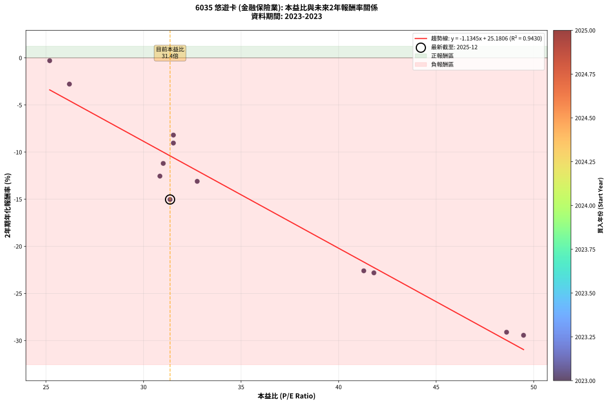
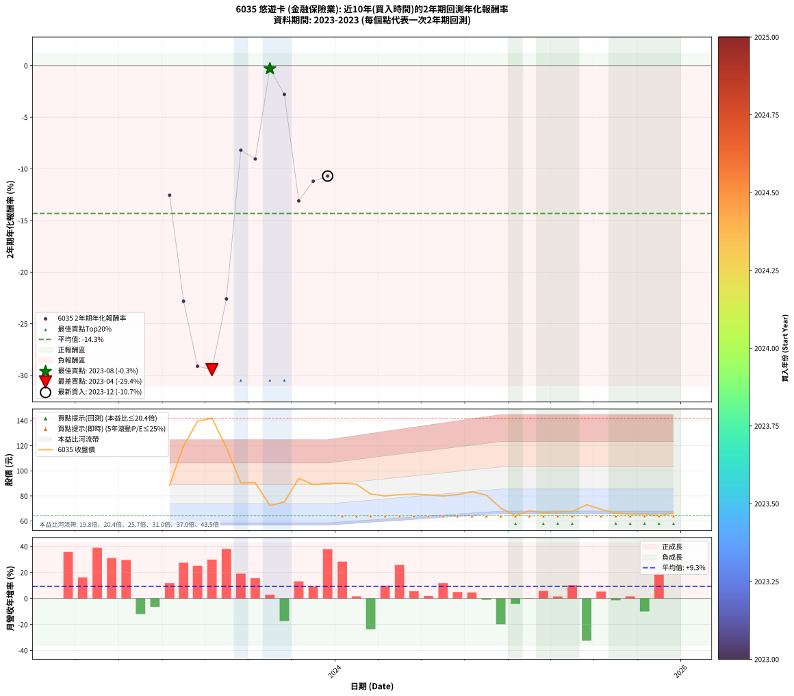

# 6035 悠遊卡 - 本益比與未來報酬率分析

!!! info "報告資訊"
    - **股票代號**: 6035
    - **公司名稱**: 悠遊卡
    - **產業別**: 金融保險業
    - **分析期間**: 2023-2023 (12 個數據點)
    - **資料來源**: Type 12 (ShowMonthlyK_ChartFlow) 月收盤價與本益比
    - **報酬率口徑**: 含現金股利 (簡化: 年度合計，假設每年7/1入帳)
    - **報告生成時間**: 2026-01-06 23:06:01 CST

## 📈 視覺化圖表

### 圖表1: 本益比 vs 未來報酬率關係

*圖表1：6035 悠遊卡 本益比與2年期未來報酬率關係 (2023-2023)*

### 圖表2: 歷年買入時點的2年期實際報酬率

*圖表2：6035 悠遊卡 歷年買入時點的2年期實際報酬率 (2023-2023)*

## 📍 買點訊號說明

本報告提供兩種買點提示訊號（顯示於圖表2的股價子圖中）：

### ▲ 小綠色三角形（回測驗證）
- **計算方式**: 使用全部歷史資料計算本益比第25百分位數
- **用途**: 事後驗證，顯示歷史上哪些時點確實為低估區
- **限制**: 當下無法判斷，僅供回測參考
- **特性**: 後見之明（Look-Ahead Bias）

### ▲ 小橘色三角形（即時訊號）
- **計算方式**: 使用截至當月的過去5年資料計算本益比第25百分位數
- **用途**: 實際投資決策，當時即可判斷
- **優勢**: 可操作性強，符合實務需求
- **特性**: 無後見之明，滾動窗口計算

!!! tip "如何使用兩種訊號"
    - **綠色▲** 幫助理解歷史估值機會，驗證策略有效性
    - **橘色▲** 可作為實際買進參考，但仍需搭配基本面分析
    - 兩種訊號重疊時，表示即時判斷與事後驗證一致，信心度較高
    - 僅有綠色▲時，表示當時無法判斷（需要未來資料才能確認）
    - 僅有橘色▲時，表示即時判斷為買點，但事後可能不是最佳時機

## 📊 估值分析摘要

| 指標 | 數值 |
|:---:|:---:|
| **目前本益比** (2023-12) | **31.36 倍** |
| **歷史平均本益比** | 35.13 倍 |
| **估值水準** | 🟡 合理範圍 |
| **預期2年年化報酬率** | **-10.40%** |
| **歷史平均報酬率** | -14.68% |
| **相關係數 (R²)** | 0.9430 |
| **趨勢線斜率** | -1.1345 |

!!! abstract "核心洞察"
    目前本益比接近歷史平均，預期報酬率符合長期趨勢

    根據歷史數據回測，6035 悠遊卡 在目前本益比 **31.4倍** 的估值水準下，
    預期未來2年年化報酬率約為 **-10.4%**。

    **重要提醒**: 本分析基於歷史數據統計，實際報酬率會受到公司基本面變化、產業趨勢、
    總體經濟環境等多重因素影響。R² = 0.94 表示本益比可解釋約 94.3% 的報酬率變異。

## 📈 歷史估值統計

### 最佳買點 (最高報酬率)

| 項目 | 數值 |
|:---:|:---:|
| 起始時間 | 2023-08 |
| 當時本益比 | 25.19 倍 |
| 起始價格 | 72.3 元 |
| 2年後價格 | 66.3 元 |
| **2年年化報酬率** | **-0.30%** |

### 最差買點 (最低報酬率)

| 項目 | 數值 |
|:---:|:---:|
| 起始時間 | 2023-04 |
| 當時本益比 | 49.48 倍 |
| 起始價格 | 142.0 元 |
| 2年後價格 | 67.3 元 |
| **2年年化報酬率** | **-29.44%** |

## 🎯 投資啟示

### 本益比與報酬率關係

趨勢線方程式: **y = -1.1345x + 25.1806**

!!! warning "強負相關"
    本益比與未來報酬率呈現強負相關。在高本益比時期買入，未來報酬率顯著較低；
    在低本益比時期買入，未來報酬率顯著較高。**估值紀律至關重要**。

### 估值區間建議

基於歷史數據分析:

- **🟢 低估區** (P/E < 28.1): 預期報酬率較高，可考慮增加持股
- **🟡 合理區** (P/E 28.1-42.2): 預期報酬率符合長期趨勢，正常持有
- **🔴 高估區** (P/E > 42.2): 預期報酬率較低，可考慮減碼或觀望

!!! danger "風險提示"
    - 過去表現不代表未來結果
    - 本分析假設公司基本面無重大結構性變化
    - 產業環境劇變可能使歷史規律失效
    - 應結合公司財報、產業趨勢、總體經濟等多重因素綜合判斷

!!! success "長期投資觀點"
    歷史數據顯示，在合理或低估的估值水準買入並長期持有，
    往往能獲得較佳的投資報酬。**耐心等待好價格**是價值投資的核心原則。

## 📊 數據品質

- **資料來源**: GoodInfo.tw Type 12 (ShowMonthlyK_ChartFlow)
- **資料頻率**: 月度收盤價與本益比
- **回測期間**: 2023-2023
- **數據點數量**: 12 個 (每個點代表一次2年期回測)

### 計算方法說明

1. **2年期年化報酬率**:
   - 對每個歷史時點，計算其後2年的實際投資報酬率
   - 期末價值(不含股利): 期末價格
   - 期末價值(含現金股利): 期末價格 + 持有期間內的現金股利合計 (簡化: 年度合計，假設每年7/1入帳)
   - 公式: 年化報酬率 = [(期末價值/期初價格)^(1/年數) - 1] × 100%

2. **本益比 (P/E Ratio)**:
   - 使用當時的月收盤價與EPS計算
   - 資料來源: Type 12 月度河流圖本益比數據

3. **趨勢線 (Linear Regression)**:
   - 使用最小平方法擬合線性趨勢線
   - R²值衡量本益比對報酬率的解釋能力

---

*本報告由 Stock Analysis System v1.9.0 自動生成*
*數據更新時間: 2026-01-06 23:06:01 CST*

## 📋 月度回測明細表

（每一列對應時間線圖中的一個買入點；可用來對照 SVG 圖上的每個點。）

| 買入月份 | 賣出月份 | 回測期限_年 | 實際持有年數 | 買入本益比_倍 | 買入收盤價_元 | 賣出收盤價_元 | 現金股利合計_元 | 總報酬率_pct | 年化報酬率_pct |
| --- | --- | --- | --- | --- | --- | --- | --- | --- | --- |
| 2023-01 | 2025-01 | 2 | 2.001 | 30.84 | 88.50 | 64.30 | 3.37 | -23.54 | -12.55 |
| 2023-02 | 2025-02 | 2 | 2.001 | 41.81 | 120.00 | 68.10 | 3.37 | -40.44 | -22.81 |
| 2023-03 | 2025-03 | 2 | 2.001 | 48.61 | 139.50 | 66.70 | 3.37 | -49.77 | -29.11 |
| 2023-04 | 2025-04 | 2 | 2.001 | 49.48 | 142.00 | 67.30 | 3.37 | -50.23 | -29.44 |
| 2023-05 | 2025-05 | 2 | 2.001 | 41.29 | 118.50 | 67.60 | 3.37 | -40.11 | -22.60 |
| 2023-06 | 2025-06 | 2 | 2.001 | 31.53 | 90.50 | 72.90 | 3.37 | -15.72 | -8.19 |
| 2023-07 | 2025-07 | 2 | 2.001 | 31.53 | 90.50 | 69.30 | 5.57 | -17.27 | -9.04 |
| 2023-08 | 2025-08 | 2 | 2.001 | 25.19 | 72.30 | 66.30 | 5.57 | -0.60 | -0.30 |
| 2023-09 | 2025-09 | 2 | 2.001 | 26.20 | 75.20 | 65.50 | 5.57 | -5.50 | -2.78 |
| 2023-10 | 2025-10 | 2 | 2.001 | 32.75 | 94.00 | 65.40 | 5.57 | -24.50 | -13.10 |
| 2023-11 | 2025-11 | 2 | 2.001 | 31.01 | 89.00 | 64.60 | 5.57 | -21.16 | -11.20 |
| 2023-12 | 2025-12 | 2 | 2.001 | 31.36 | 90.00 | 59.40 | 5.57 | -27.81 | -15.03 |
