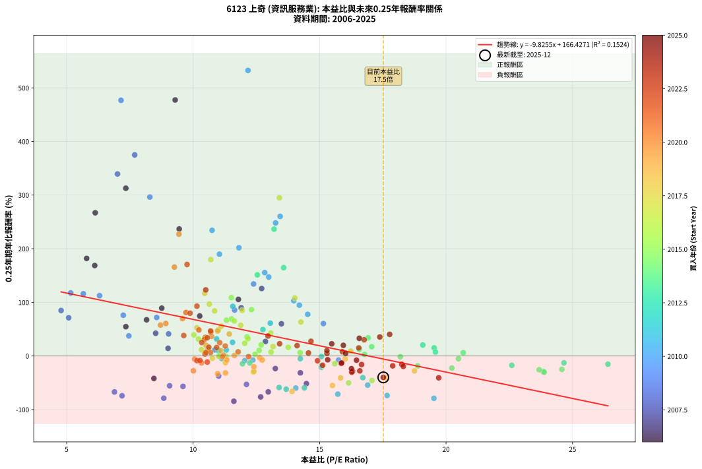
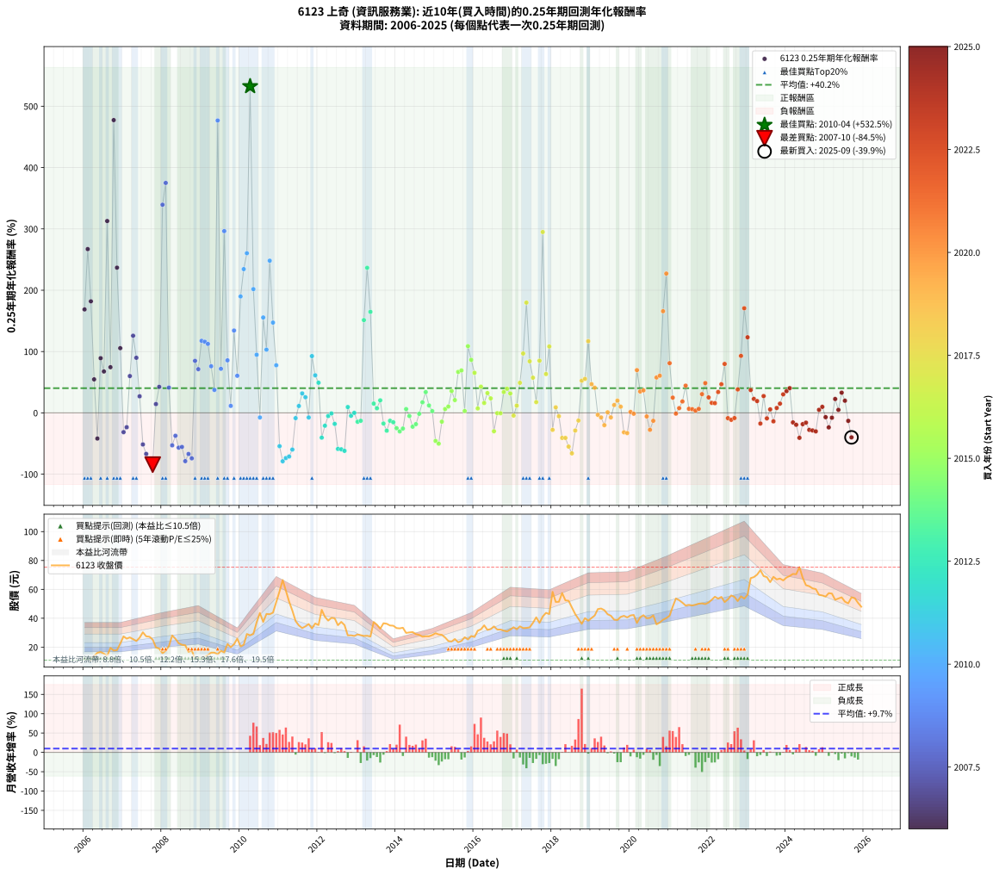

# 6123 上奇 - 本益比與未來報酬率分析

!!! info "報告資訊"
    - **股票代號**: 6123
    - **公司名稱**: 上奇
    - **產業別**: 資訊服務業
    - **分析期間**: 2006-2025 (237 個數據點)
    - **資料來源**: Type 12 (ShowMonthlyK_ChartFlow) 月收盤價與本益比
    - **報酬率口徑**: 含現金股利 (簡化: 年度合計，假設每年7/1入帳)
    - **報告生成時間**: 2026-01-13 01:07:43 CST

## 📈 視覺化圖表

### 圖表1: 本益比 vs 未來報酬率關係

*圖表1：6123 上奇 本益比與0.25年期未來報酬率關係 (2006-2025)*

### 圖表2: 歷年買入時點的0.25年期實際報酬率

*圖表2：6123 上奇 歷年買入時點的0.25年期實際報酬率 (2006-2025)*

## 📍 買點訊號說明

本報告提供兩種買點提示訊號（顯示於圖表2的股價子圖中）：

### ▲ 小綠色三角形（回測驗證）
- **計算方式**: 使用全部歷史資料計算本益比第25百分位數
- **用途**: 事後驗證，顯示歷史上哪些時點確實為低估區
- **限制**: 當下無法判斷，僅供回測參考
- **特性**: 後見之明（Look-Ahead Bias）

### ▲ 小橘色三角形（即時訊號）
- **計算方式**: 使用截至當月的過去5年資料計算本益比第25百分位數
- **用途**: 實際投資決策，當時即可判斷
- **優勢**: 可操作性強，符合實務需求
- **特性**: 無後見之明，滾動窗口計算

!!! tip "如何使用兩種訊號"
    - **綠色▲** 幫助理解歷史估值機會，驗證策略有效性
    - **橘色▲** 可作為實際買進參考，但仍需搭配基本面分析
    - 兩種訊號重疊時，表示即時判斷與事後驗證一致，信心度較高
    - 僅有綠色▲時，表示當時無法判斷（需要未來資料才能確認）
    - 僅有橘色▲時，表示即時判斷為買點，但事後可能不是最佳時機

## 📊 估值分析摘要

| 指標 | 數值 |
|:---:|:---:|
| **目前本益比** (2025-09) | **17.52 倍** |
| **歷史平均本益比** | 12.85 倍 |
| **估值水準** | 🔴 相對高估 |
| **預期0.25年年化報酬率** | **-5.72%** |
| **歷史平均報酬率** | +40.19% |
| **相關係數 (R²)** | 0.1524 |
| **趨勢線斜率** | -9.8255 |

!!! abstract "核心洞察"
    目前本益比顯著高於歷史平均，預期未來報酬率可能較低

    根據歷史數據回測，6123 上奇 在目前本益比 **17.5倍** 的估值水準下，
    預期未來0.25年年化報酬率約為 **-5.7%**。

    **重要提醒**: 本分析基於歷史數據統計，實際報酬率會受到公司基本面變化、產業趨勢、
    總體經濟環境等多重因素影響。R² = 0.15 表示本益比可解釋約 15.2% 的報酬率變異。

## 📈 歷史估值統計

### 最佳買點 (最高報酬率)

| 項目 | 數值 |
|:---:|:---:|
| 起始時間 | 2010-04 |
| 當時本益比 | 12.17 倍 |
| 起始價格 | 28.2 元 |
| 0.25年後價格 | 43.6 元 |
| **0.25年年化報酬率** | **+532.46%** |

### 最差買點 (最低報酬率)

| 項目 | 數值 |
|:---:|:---:|
| 起始時間 | 2007-10 |
| 當時本益比 | 11.61 倍 |
| 起始價格 | 25.2 元 |
| 0.25年後價格 | 15.8 元 |
| **0.25年年化報酬率** | **-84.45%** |

## 🎯 投資啟示

### 本益比與報酬率關係

趨勢線方程式: **y = -9.8255x + 166.4271**

!!! warning "強負相關"
    本益比與未來報酬率呈現強負相關。在高本益比時期買入，未來報酬率顯著較低；
    在低本益比時期買入，未來報酬率顯著較高。**估值紀律至關重要**。

### 估值區間建議

基於歷史數據分析:

- **🟢 低估區** (P/E < 10.3): 預期報酬率較高，可考慮增加持股
- **🟡 合理區** (P/E 10.3-15.4): 預期報酬率符合長期趨勢，正常持有
- **🔴 高估區** (P/E > 15.4): 預期報酬率較低，可考慮減碼或觀望

!!! danger "風險提示"
    - 過去表現不代表未來結果
    - 本分析假設公司基本面無重大結構性變化
    - 產業環境劇變可能使歷史規律失效
    - 應結合公司財報、產業趨勢、總體經濟等多重因素綜合判斷

!!! success "長期投資觀點"
    歷史數據顯示，在合理或低估的估值水準買入並長期持有，
    往往能獲得較佳的投資報酬。**耐心等待好價格**是價值投資的核心原則。

## 📊 數據品質

- **資料來源**: GoodInfo.tw Type 12 (ShowMonthlyK_ChartFlow)
- **資料頻率**: 月度收盤價與本益比
- **回測期間**: 2006-2025
- **數據點數量**: 237 個 (每個點代表一次0.25年期回測)

### 計算方法說明

1. **0.25年期年化報酬率**:
   - 對每個歷史時點，計算其後0.25年的實際投資報酬率
   - 期末價值(不含股利): 期末價格
   - 期末價值(含現金股利): 期末價格 + 持有期間內的現金股利合計 (簡化: 年度合計，假設每年7/1入帳)
   - 公式: 年化報酬率 = [(期末價值/期初價格)^(1/年數) - 1] × 100%

2. **本益比 (P/E Ratio)**:
   - 使用當時的月收盤價與EPS計算
   - 資料來源: Type 12 月度河流圖本益比數據

3. **趨勢線 (Linear Regression)**:
   - 使用最小平方法擬合線性趨勢線
   - R²值衡量本益比對報酬率的解釋能力

---

*本報告由 Stock Analysis System v1.9.0 自動生成*
*數據更新時間: 2026-01-13 01:07:43 CST*

## 📋 月度回測明細表

（每一列對應時間線圖中的一個買入點；可用來對照 SVG 圖上的每個點。）

| 買入月份 | 賣出月份 | 回測期限_年 | 實際持有年數 | 買入本益比_倍 | 買入收盤價_元 | 賣出收盤價_元 | 現金股利合計_元 | 總報酬率_pct | 年化報酬率_pct |
| --- | --- | --- | --- | --- | --- | --- | --- | --- | --- |
| 2006-01 | 2006-05 | 0.25 | 0.329 | 6.11 | 11.60 | 16.05 | 0.00 | +38.36 | +168.67 |
| 2006-02 | 2006-05 | 0.25 | 0.246 | 6.13 | 11.65 | 16.05 | 0.00 | +37.77 | +267.04 |
| 2006-03 | 2006-07 | 0.25 | 0.334 | 5.79 | 11.00 | 15.50 | 0.05 | +41.36 | +181.90 |
| 2006-04 | 2006-07 | 0.25 | 0.249 | 7.34 | 13.95 | 15.50 | 0.05 | +11.47 | +54.62 |
| 2006-05 | 2006-08 | 0.25 | 0.252 | 8.45 | 16.05 | 13.95 | 0.05 | -12.77 | -41.87 |
| 2006-06 | 2006-09 | 0.25 | 0.252 | 8.76 | 16.65 | 19.50 | 0.05 | +17.42 | +89.17 |
| 2006-07 | 2006-10 | 0.25 | 0.252 | 8.16 | 15.50 | 17.65 | 0.00 | +13.87 | +67.48 |
| 2006-08 | 2006-12 | 0.25 | 0.334 | 7.34 | 13.95 | 22.40 | 0.00 | +60.57 | +312.82 |
| 2006-09 | 2006-12 | 0.25 | 0.249 | 10.26 | 19.50 | 22.40 | 0.00 | +14.87 | +74.45 |
| 2006-10 | 2007-01 | 0.25 | 0.252 | 9.29 | 17.65 | 27.45 | 0.00 | +55.52 | +477.37 |
| 2006-11 | 2007-03 | 0.25 | 0.329 | 9.45 | 17.95 | 26.75 | 0.00 | +49.03 | +236.79 |
| 2006-12 | 2007-03 | 0.25 | 0.246 | 11.79 | 22.40 | 26.75 | 0.00 | +19.42 | +105.49 |
| 2007-01 | 2007-05 | 0.25 | 0.329 | 14.24 | 27.45 | 24.25 | 0.00 | -11.66 | -31.43 |
| 2007-02 | 2007-05 | 0.25 | 0.246 | 13.25 | 25.90 | 24.25 | 0.00 | -6.37 | -23.44 |
| 2007-03 | 2007-07 | 0.25 | 0.334 | 13.49 | 26.75 | 30.30 | 1.00 | +17.00 | +60.01 |
| 2007-04 | 2007-07 | 0.25 | 0.249 | 12.71 | 25.55 | 30.30 | 1.00 | +22.50 | +125.79 |
| 2007-05 | 2007-08 | 0.25 | 0.252 | 11.90 | 24.25 | 27.50 | 1.00 | +17.52 | +89.81 |
| 2007-06 | 2007-09 | 0.25 | 0.252 | 12.86 | 26.55 | 27.20 | 1.00 | +6.21 | +27.01 |
| 2007-07 | 2007-10 | 0.25 | 0.252 | 14.48 | 30.30 | 25.25 | 0.00 | -16.67 | -51.51 |
| 2007-08 | 2007-12 | 0.25 | 0.334 | 12.97 | 27.50 | 19.00 | 0.00 | -30.91 | -66.94 |
| 2007-09 | 2007-12 | 0.25 | 0.249 | 12.67 | 27.20 | 19.00 | 0.00 | -30.15 | -76.31 |
| 2007-10 | 2008-01 | 0.25 | 0.252 | 11.61 | 25.25 | 15.80 | 0.00 | -37.43 | -84.45 |
| 2007-11 | 2008-03 | 0.25 | 0.331 | 9.01 | 19.85 | 20.75 | 0.00 | +4.53 | +14.32 |
| 2007-12 | 2008-03 | 0.25 | 0.249 | 8.52 | 19.00 | 20.75 | 0.00 | +9.21 | +42.42 |
| 2008-01 | 2008-05 | 0.25 | 0.331 | 7.01 | 15.80 | 25.80 | 0.00 | +63.29 | +339.39 |
| 2008-02 | 2008-05 | 0.25 | 0.249 | 7.69 | 17.50 | 25.80 | 0.00 | +47.43 | +374.94 |
| 2008-03 | 2008-07 | 0.25 | 0.334 | 9.03 | 20.75 | 21.65 | 1.63 | +12.21 | +41.17 |
| 2008-04 | 2008-07 | 0.25 | 0.249 | 12.11 | 28.10 | 21.65 | 1.63 | -17.14 | -52.99 |
| 2008-05 | 2008-08 | 0.25 | 0.252 | 11.01 | 25.80 | 21.30 | 1.63 | -11.11 | -37.35 |
| 2008-06 | 2008-09 | 0.25 | 0.252 | 9.60 | 22.70 | 16.75 | 1.63 | -19.02 | -56.72 |
| 2008-07 | 2008-10 | 0.25 | 0.252 | 9.07 | 21.65 | 17.65 | 0.00 | -18.48 | -55.56 |
| 2008-08 | 2008-12 | 0.25 | 0.334 | 8.84 | 21.30 | 12.70 | 0.00 | -40.38 | -78.74 |
| 2008-09 | 2008-12 | 0.25 | 0.249 | 6.89 | 16.75 | 12.70 | 0.00 | -24.18 | -67.08 |
| 2008-10 | 2009-01 | 0.25 | 0.252 | 7.19 | 17.65 | 12.55 | 0.00 | -28.90 | -74.18 |
| 2008-11 | 2009-03 | 0.25 | 0.329 | 4.78 | 11.85 | 14.50 | 0.00 | +22.36 | +84.83 |
| 2008-12 | 2009-03 | 0.25 | 0.246 | 5.08 | 12.70 | 14.50 | 0.00 | +14.17 | +71.24 |
| 2009-01 | 2009-05 | 0.25 | 0.329 | 5.16 | 12.55 | 16.20 | 0.00 | +29.08 | +117.50 |
| 2009-02 | 2009-05 | 0.25 | 0.246 | 5.66 | 13.40 | 16.20 | 0.00 | +20.90 | +116.00 |
| 2009-03 | 2009-07 | 0.25 | 0.334 | 6.30 | 14.50 | 17.45 | 1.20 | +28.62 | +112.45 |
| 2009-04 | 2009-07 | 0.25 | 0.249 | 7.24 | 16.20 | 17.45 | 1.20 | +15.12 | +75.99 |
| 2009-05 | 2009-08 | 0.25 | 0.252 | 7.46 | 16.20 | 16.35 | 1.20 | +8.33 | +37.41 |
| 2009-06 | 2009-09 | 0.25 | 0.252 | 7.15 | 15.05 | 22.20 | 1.20 | +55.48 | +476.75 |
| 2009-07 | 2009-10 | 0.25 | 0.252 | 8.56 | 17.45 | 20.00 | 0.00 | +14.61 | +71.86 |
| 2009-08 | 2009-12 | 0.25 | 0.334 | 8.29 | 16.35 | 25.90 | 0.00 | +58.41 | +296.39 |
| 2009-09 | 2009-12 | 0.25 | 0.249 | 11.64 | 22.20 | 25.90 | 0.00 | +16.67 | +85.66 |
| 2009-10 | 2010-01 | 0.25 | 0.252 | 10.86 | 20.00 | 20.55 | 0.00 | +2.75 | +11.37 |
| 2009-11 | 2010-03 | 0.25 | 0.329 | 12.39 | 22.00 | 29.10 | 0.00 | +32.27 | +134.27 |
| 2009-12 | 2010-03 | 0.25 | 0.246 | 15.15 | 25.90 | 29.10 | 0.00 | +12.36 | +60.44 |
| 2010-01 | 2010-05 | 0.25 | 0.329 | 11.04 | 20.55 | 29.15 | 0.00 | +41.85 | +189.82 |
| 2010-02 | 2010-05 | 0.25 | 0.246 | 10.75 | 21.65 | 29.15 | 0.00 | +34.64 | +234.39 |
| 2010-03 | 2010-07 | 0.25 | 0.334 | 13.44 | 29.10 | 43.65 | 1.00 | +53.44 | +260.28 |
| 2010-04 | 2010-07 | 0.25 | 0.249 | 12.17 | 28.20 | 43.65 | 1.00 | +58.33 | +532.46 |
| 2010-05 | 2010-08 | 0.25 | 0.252 | 11.81 | 29.15 | 37.50 | 1.00 | +32.08 | +201.77 |
| 2010-06 | 2010-09 | 0.25 | 0.252 | 14.20 | 37.20 | 43.00 | 1.00 | +18.28 | +94.74 |
| 2010-07 | 2010-10 | 0.25 | 0.252 | 15.75 | 43.65 | 42.80 | 0.00 | -1.95 | -7.51 |
| 2010-08 | 2010-12 | 0.25 | 0.334 | 12.83 | 37.50 | 51.30 | 0.00 | +36.80 | +155.52 |
| 2010-09 | 2010-12 | 0.25 | 0.249 | 13.98 | 43.00 | 51.30 | 0.00 | +19.30 | +103.07 |
| 2010-10 | 2011-01 | 0.25 | 0.252 | 13.26 | 42.80 | 58.60 | 0.00 | +36.92 | +248.13 |
| 2010-11 | 2011-03 | 0.25 | 0.329 | 12.99 | 43.90 | 59.10 | 0.00 | +34.62 | +147.18 |
| 2010-12 | 2011-03 | 0.25 | 0.246 | 14.53 | 51.30 | 59.10 | 0.00 | +15.20 | +77.61 |
| 2011-01 | 2011-05 | 0.25 | 0.329 | 16.90 | 58.60 | 45.30 | 0.00 | -22.70 | -54.32 |
| 2011-02 | 2011-05 | 0.25 | 0.246 | 19.52 | 66.50 | 45.30 | 0.00 | -31.88 | -78.94 |
| 2011-03 | 2011-07 | 0.25 | 0.334 | 17.67 | 59.10 | 35.05 | 2.80 | -35.96 | -73.66 |
| 2011-04 | 2011-07 | 0.25 | 0.249 | 15.72 | 51.60 | 35.05 | 2.80 | -26.65 | -71.17 |
| 2011-05 | 2011-08 | 0.25 | 0.252 | 14.06 | 45.30 | 33.20 | 2.80 | -20.53 | -59.84 |
| 2011-06 | 2011-09 | 0.25 | 0.252 | 12.04 | 38.05 | 34.40 | 2.80 | -2.23 | -8.58 |
| 2011-07 | 2011-10 | 0.25 | 0.252 | 11.31 | 35.05 | 36.00 | 0.00 | +2.71 | +11.20 |
| 2011-08 | 2011-12 | 0.25 | 0.334 | 10.93 | 33.20 | 36.40 | 0.00 | +9.64 | +31.72 |
| 2011-09 | 2011-12 | 0.25 | 0.249 | 11.56 | 34.40 | 36.40 | 0.00 | +5.81 | +25.46 |
| 2011-10 | 2012-01 | 0.25 | 0.252 | 12.36 | 36.00 | 35.30 | 0.00 | -1.94 | -7.50 |
| 2011-11 | 2012-03 | 0.25 | 0.331 | 11.57 | 33.00 | 41.00 | 0.00 | +24.24 | +92.56 |
| 2011-12 | 2012-03 | 0.25 | 0.249 | 13.05 | 36.40 | 41.00 | 0.00 | +12.64 | +61.23 |
| 2012-01 | 2012-05 | 0.25 | 0.331 | 12.76 | 35.30 | 40.30 | 0.00 | +14.16 | +49.16 |
| 2012-02 | 2012-05 | 0.25 | 0.249 | 16.71 | 45.85 | 40.30 | 0.00 | -12.10 | -40.42 |
| 2012-03 | 2012-07 | 0.25 | 0.334 | 15.07 | 41.00 | 35.20 | 2.70 | -7.56 | -20.97 |
| 2012-04 | 2012-07 | 0.25 | 0.249 | 14.24 | 38.40 | 35.20 | 2.70 | -1.30 | -5.12 |
| 2012-05 | 2012-08 | 0.25 | 0.252 | 15.07 | 40.30 | 37.50 | 2.70 | -0.25 | -0.98 |
| 2012-06 | 2012-09 | 0.25 | 0.252 | 15.08 | 39.95 | 35.30 | 2.70 | -4.88 | -18.02 |
| 2012-07 | 2012-10 | 0.25 | 0.252 | 13.40 | 35.20 | 28.15 | 0.00 | -20.03 | -58.82 |
| 2012-08 | 2012-12 | 0.25 | 0.334 | 14.40 | 37.50 | 27.75 | 0.00 | -26.00 | -59.40 |
| 2012-09 | 2012-12 | 0.25 | 0.249 | 13.68 | 35.30 | 27.75 | 0.00 | -21.39 | -61.94 |
| 2012-10 | 2013-01 | 0.25 | 0.252 | 11.01 | 28.15 | 28.80 | 0.00 | +2.31 | +9.49 |
| 2012-11 | 2013-03 | 0.25 | 0.329 | 11.13 | 28.20 | 27.75 | 0.00 | -1.60 | -4.78 |
| 2012-12 | 2013-03 | 0.25 | 0.246 | 11.06 | 27.75 | 27.75 | 0.00 | +0.00 | +0.00 |
| 2013-01 | 2013-05 | 0.25 | 0.329 | 11.95 | 28.80 | 27.35 | 0.00 | -5.03 | -14.55 |
| 2013-02 | 2013-05 | 0.25 | 0.246 | 12.24 | 28.30 | 27.35 | 0.00 | -3.36 | -12.94 |
| 2013-03 | 2013-07 | 0.25 | 0.334 | 12.54 | 27.75 | 35.55 | 2.20 | +36.04 | +151.27 |
| 2013-04 | 2013-07 | 0.25 | 0.249 | 13.20 | 27.90 | 35.55 | 2.20 | +35.30 | +236.55 |
| 2013-05 | 2013-08 | 0.25 | 0.252 | 13.58 | 27.35 | 32.75 | 2.20 | +27.79 | +164.71 |
| 2013-06 | 2013-09 | 0.25 | 0.252 | 19.53 | 37.40 | 36.55 | 2.20 | +3.61 | +15.12 |
| 2013-07 | 2013-10 | 0.25 | 0.252 | 19.58 | 35.55 | 36.20 | 0.00 | +1.83 | +7.46 |
| 2013-08 | 2013-12 | 0.25 | 0.334 | 19.08 | 32.75 | 34.85 | 0.00 | +6.41 | +20.45 |
| 2013-09 | 2013-12 | 0.25 | 0.249 | 22.60 | 36.55 | 34.85 | 0.00 | -4.65 | -17.40 |
| 2013-10 | 2014-01 | 0.25 | 0.252 | 23.84 | 36.20 | 33.20 | 0.00 | -8.29 | -29.07 |
| 2013-11 | 2014-03 | 0.25 | 0.329 | 24.66 | 35.00 | 33.45 | 0.00 | -4.43 | -12.88 |
| 2013-12 | 2014-03 | 0.25 | 0.246 | 26.40 | 34.85 | 33.45 | 0.00 | -4.02 | -15.33 |
| 2014-01 | 2014-05 | 0.25 | 0.329 | 24.58 | 33.20 | 30.20 | 0.00 | -9.04 | -25.04 |
| 2014-02 | 2014-05 | 0.25 | 0.246 | 23.88 | 33.00 | 30.20 | 0.00 | -8.48 | -30.22 |
| 2014-03 | 2014-07 | 0.25 | 0.334 | 23.68 | 33.45 | 29.00 | 1.30 | -9.42 | -25.63 |
| 2014-04 | 2014-07 | 0.25 | 0.249 | 20.68 | 29.85 | 29.00 | 1.30 | +1.51 | +6.19 |
| 2014-05 | 2014-08 | 0.25 | 0.252 | 20.49 | 30.20 | 28.50 | 1.30 | -1.32 | -5.16 |
| 2014-06 | 2014-09 | 0.25 | 0.252 | 20.23 | 30.45 | 27.25 | 1.30 | -6.24 | -22.57 |
| 2014-07 | 2014-10 | 0.25 | 0.252 | 18.88 | 29.00 | 27.55 | 0.00 | -5.00 | -18.42 |
| 2014-08 | 2014-12 | 0.25 | 0.334 | 18.19 | 28.50 | 28.35 | 0.00 | -0.53 | -1.57 |
| 2014-09 | 2014-12 | 0.25 | 0.249 | 17.06 | 27.25 | 28.35 | 0.00 | +4.04 | +17.21 |
| 2014-10 | 2015-01 | 0.25 | 0.252 | 16.92 | 27.55 | 29.65 | 0.00 | +7.62 | +33.86 |
| 2014-11 | 2015-03 | 0.25 | 0.329 | 16.57 | 27.50 | 28.55 | 0.00 | +3.82 | +12.08 |
| 2014-12 | 2015-03 | 0.25 | 0.246 | 16.78 | 28.35 | 28.55 | 0.00 | +0.71 | +2.89 |
| 2015-01 | 2015-05 | 0.25 | 0.329 | 17.07 | 29.65 | 24.25 | 0.00 | -18.21 | -45.77 |
| 2015-02 | 2015-05 | 0.25 | 0.246 | 16.15 | 28.80 | 24.25 | 0.00 | -15.80 | -50.24 |
| 2015-03 | 2015-07 | 0.25 | 0.334 | 15.60 | 28.55 | 25.60 | 1.51 | -5.06 | -14.39 |
| 2015-04 | 2015-07 | 0.25 | 0.249 | 14.23 | 26.70 | 25.60 | 1.51 | +1.52 | +6.24 |
| 2015-05 | 2015-08 | 0.25 | 0.252 | 12.61 | 24.25 | 23.35 | 1.51 | +2.50 | +10.30 |
| 2015-06 | 2015-09 | 0.25 | 0.252 | 12.13 | 23.90 | 24.30 | 1.51 | +7.97 | +35.61 |
| 2015-07 | 2015-10 | 0.25 | 0.252 | 12.69 | 25.60 | 26.85 | 0.00 | +4.88 | +20.84 |
| 2015-08 | 2015-12 | 0.25 | 0.334 | 11.32 | 23.35 | 27.70 | 0.00 | +18.63 | +66.77 |
| 2015-09 | 2015-12 | 0.25 | 0.249 | 11.52 | 24.30 | 27.70 | 0.00 | +13.99 | +69.15 |
| 2015-10 | 2016-01 | 0.25 | 0.252 | 12.45 | 26.85 | 27.05 | 0.00 | +0.74 | +2.99 |
| 2015-11 | 2016-03 | 0.25 | 0.331 | 11.51 | 25.35 | 32.35 | 0.00 | +27.61 | +108.77 |
| 2015-12 | 2016-03 | 0.25 | 0.249 | 12.31 | 27.70 | 32.35 | 0.00 | +16.79 | +86.42 |
| 2016-01 | 2016-05 | 0.25 | 0.331 | 11.63 | 27.05 | 31.95 | 0.00 | +18.11 | +65.29 |
| 2016-02 | 2016-05 | 0.25 | 0.249 | 13.08 | 31.40 | 31.95 | 0.00 | +1.75 | +7.22 |
| 2016-03 | 2016-07 | 0.25 | 0.334 | 13.07 | 32.35 | 34.35 | 2.08 | +12.62 | +42.73 |
| 2016-04 | 2016-07 | 0.25 | 0.249 | 13.76 | 35.10 | 34.35 | 2.08 | +3.79 | +16.13 |
| 2016-05 | 2016-08 | 0.25 | 0.252 | 12.17 | 31.95 | 32.20 | 2.08 | +7.30 | +32.27 |
| 2016-06 | 2016-09 | 0.25 | 0.252 | 12.04 | 32.50 | 32.20 | 2.08 | +5.48 | +23.61 |
| 2016-07 | 2016-10 | 0.25 | 0.252 | 12.38 | 34.35 | 31.40 | 0.00 | -8.59 | -29.99 |
| 2016-08 | 2016-12 | 0.25 | 0.334 | 11.30 | 32.20 | 32.15 | 0.00 | -0.16 | -0.46 |
| 2016-09 | 2016-12 | 0.25 | 0.249 | 11.01 | 32.20 | 32.15 | 0.00 | -0.16 | -0.62 |
| 2016-10 | 2017-01 | 0.25 | 0.252 | 10.47 | 31.40 | 33.80 | 0.00 | +7.64 | +33.97 |
| 2016-11 | 2017-03 | 0.25 | 0.329 | 10.03 | 30.85 | 34.40 | 0.00 | +11.51 | +39.31 |
| 2016-12 | 2017-03 | 0.25 | 0.246 | 10.21 | 32.15 | 34.40 | 0.00 | +7.00 | +31.59 |
| 2017-01 | 2017-05 | 0.25 | 0.329 | 10.76 | 33.80 | 33.30 | 0.00 | -1.48 | -4.43 |
| 2017-02 | 2017-05 | 0.25 | 0.246 | 10.33 | 32.40 | 33.30 | 0.00 | +2.78 | +11.76 |
| 2017-03 | 2017-07 | 0.25 | 0.334 | 11.00 | 34.40 | 36.80 | 2.50 | +14.24 | +48.99 |
| 2017-04 | 2017-07 | 0.25 | 0.249 | 10.64 | 33.20 | 36.80 | 2.50 | +18.37 | +96.80 |
| 2017-05 | 2017-08 | 0.25 | 0.252 | 10.70 | 33.30 | 40.65 | 2.50 | +29.58 | +179.76 |
| 2017-06 | 2017-09 | 0.25 | 0.252 | 10.85 | 33.70 | 36.80 | 2.50 | +16.62 | +84.10 |
| 2017-07 | 2017-10 | 0.25 | 0.252 | 11.88 | 36.80 | 41.25 | 0.00 | +12.09 | +57.33 |
| 2017-08 | 2017-12 | 0.25 | 0.334 | 13.16 | 40.65 | 42.90 | 0.00 | +5.54 | +17.50 |
| 2017-09 | 2017-12 | 0.25 | 0.249 | 11.94 | 36.80 | 42.90 | 0.00 | +16.58 | +85.08 |
| 2017-10 | 2018-01 | 0.25 | 0.252 | 13.41 | 41.25 | 58.30 | 0.00 | +41.33 | +294.90 |
| 2017-11 | 2018-03 | 0.25 | 0.329 | 14.26 | 43.75 | 51.40 | 0.00 | +17.49 | +63.31 |
| 2017-12 | 2018-03 | 0.25 | 0.246 | 14.02 | 42.90 | 51.40 | 0.00 | +19.81 | +108.26 |
| 2018-01 | 2018-05 | 0.25 | 0.329 | 18.75 | 58.30 | 52.40 | 0.00 | -10.12 | -27.73 |
| 2018-02 | 2018-05 | 0.25 | 0.246 | 16.23 | 51.30 | 52.40 | 0.00 | +2.14 | +8.99 |
| 2018-03 | 2018-07 | 0.25 | 0.334 | 16.01 | 51.40 | 47.45 | 3.00 | -1.85 | -5.43 |
| 2018-04 | 2018-07 | 0.25 | 0.249 | 17.64 | 57.50 | 47.45 | 3.00 | -12.26 | -40.84 |
| 2018-05 | 2018-08 | 0.25 | 0.252 | 15.83 | 52.40 | 42.90 | 3.00 | -12.40 | -40.89 |
| 2018-06 | 2018-09 | 0.25 | 0.252 | 15.51 | 52.10 | 39.60 | 3.00 | -18.23 | -55.03 |
| 2018-07 | 2018-10 | 0.25 | 0.252 | 13.91 | 47.45 | 36.15 | 0.00 | -23.81 | -66.04 |
| 2018-08 | 2018-12 | 0.25 | 0.334 | 12.40 | 42.90 | 38.30 | 0.00 | -10.72 | -28.79 |
| 2018-09 | 2018-12 | 0.25 | 0.249 | 11.28 | 39.60 | 38.30 | 0.00 | -3.28 | -12.54 |
| 2018-10 | 2019-01 | 0.25 | 0.252 | 10.15 | 36.15 | 40.20 | 0.00 | +11.20 | +52.44 |
| 2018-11 | 2019-03 | 0.25 | 0.329 | 11.11 | 40.10 | 46.35 | 0.00 | +15.59 | +55.41 |
| 2018-12 | 2019-03 | 0.25 | 0.246 | 10.46 | 38.30 | 46.35 | 0.00 | +21.02 | +116.89 |
| 2019-01 | 2019-05 | 0.25 | 0.329 | 10.97 | 40.20 | 45.60 | 0.00 | +13.43 | +46.76 |
| 2019-02 | 2019-05 | 0.25 | 0.246 | 11.43 | 41.90 | 45.60 | 0.00 | +8.83 | +40.98 |
| 2019-03 | 2019-07 | 0.25 | 0.334 | 12.63 | 46.35 | 41.75 | 4.10 | -1.08 | -3.20 |
| 2019-04 | 2019-07 | 0.25 | 0.249 | 12.73 | 46.75 | 41.75 | 4.10 | -1.93 | -7.51 |
| 2019-05 | 2019-08 | 0.25 | 0.252 | 12.40 | 45.60 | 39.00 | 4.10 | -5.48 | -20.06 |
| 2019-06 | 2019-09 | 0.25 | 0.252 | 11.63 | 42.80 | 38.80 | 4.10 | +0.23 | +0.93 |
| 2019-07 | 2019-10 | 0.25 | 0.252 | 11.33 | 41.75 | 40.95 | 0.00 | -1.92 | -7.39 |
| 2019-08 | 2019-12 | 0.25 | 0.334 | 10.58 | 39.00 | 40.60 | 0.00 | +4.10 | +12.79 |
| 2019-09 | 2019-12 | 0.25 | 0.249 | 10.51 | 38.80 | 40.60 | 0.00 | +4.64 | +19.96 |
| 2019-10 | 2020-01 | 0.25 | 0.252 | 11.09 | 40.95 | 41.95 | 0.00 | +2.44 | +10.05 |
| 2019-11 | 2020-03 | 0.25 | 0.331 | 11.28 | 41.70 | 36.75 | 0.00 | -11.87 | -31.71 |
| 2019-12 | 2020-03 | 0.25 | 0.249 | 10.97 | 40.60 | 36.75 | 0.00 | -9.48 | -32.96 |
| 2020-01 | 2020-05 | 0.25 | 0.331 | 11.20 | 41.95 | 42.15 | 0.00 | +0.48 | +1.45 |
| 2020-02 | 2020-05 | 0.25 | 0.249 | 11.16 | 42.30 | 42.15 | 0.00 | -0.35 | -1.42 |
| 2020-03 | 2020-07 | 0.25 | 0.334 | 9.58 | 36.75 | 40.25 | 3.60 | +19.32 | +69.69 |
| 2020-04 | 2020-07 | 0.25 | 0.249 | 10.48 | 40.70 | 40.25 | 3.60 | +7.74 | +34.88 |
| 2020-05 | 2020-08 | 0.25 | 0.252 | 10.73 | 42.15 | 42.00 | 3.60 | +8.19 | +36.66 |
| 2020-06 | 2020-09 | 0.25 | 0.252 | 10.06 | 40.00 | 35.80 | 3.60 | -1.50 | -5.82 |
| 2020-07 | 2020-10 | 0.25 | 0.252 | 10.01 | 40.25 | 37.10 | 0.00 | -7.83 | -27.64 |
| 2020-08 | 2020-12 | 0.25 | 0.334 | 10.33 | 42.00 | 40.10 | 0.00 | -4.52 | -12.94 |
| 2020-09 | 2020-12 | 0.25 | 0.249 | 8.71 | 35.80 | 40.10 | 0.00 | +12.01 | +57.66 |
| 2020-10 | 2021-01 | 0.25 | 0.252 | 8.92 | 37.10 | 41.80 | 0.00 | +12.67 | +60.57 |
| 2020-11 | 2021-03 | 0.25 | 0.329 | 9.26 | 38.95 | 53.70 | 0.00 | +37.87 | +165.77 |
| 2020-12 | 2021-03 | 0.25 | 0.246 | 9.44 | 40.10 | 53.70 | 0.00 | +33.92 | +227.13 |
| 2021-01 | 2021-05 | 0.25 | 0.329 | 9.72 | 41.80 | 50.80 | 0.00 | +21.53 | +81.04 |
| 2021-02 | 2021-05 | 0.25 | 0.246 | 11.05 | 48.10 | 50.80 | 0.00 | +5.61 | +24.81 |
| 2021-03 | 2021-07 | 0.25 | 0.334 | 12.19 | 53.70 | 49.30 | 4.18 | -0.42 | -1.24 |
| 2021-04 | 2021-07 | 0.25 | 0.249 | 11.78 | 52.50 | 49.30 | 4.18 | +1.86 | +7.68 |
| 2021-05 | 2021-08 | 0.25 | 0.252 | 11.27 | 50.80 | 48.85 | 4.18 | +4.38 | +18.57 |
| 2021-06 | 2021-09 | 0.25 | 0.252 | 10.70 | 48.80 | 49.35 | 4.18 | +9.69 | +44.35 |
| 2021-07 | 2021-10 | 0.25 | 0.252 | 10.69 | 49.30 | 50.10 | 0.00 | +1.62 | +6.60 |
| 2021-08 | 2021-12 | 0.25 | 0.334 | 10.48 | 48.85 | 49.80 | 0.00 | +1.94 | +5.94 |
| 2021-09 | 2021-12 | 0.25 | 0.249 | 10.47 | 49.35 | 49.80 | 0.00 | +0.91 | +3.71 |
| 2021-10 | 2022-01 | 0.25 | 0.252 | 10.51 | 50.10 | 50.90 | 0.00 | +1.60 | +6.49 |
| 2021-11 | 2022-03 | 0.25 | 0.329 | 10.44 | 50.30 | 54.90 | 0.00 | +9.15 | +30.52 |
| 2021-12 | 2022-03 | 0.25 | 0.246 | 10.23 | 49.80 | 54.90 | 0.00 | +10.24 | +48.54 |
| 2022-01 | 2022-05 | 0.25 | 0.329 | 10.34 | 50.90 | 54.80 | 0.00 | +7.66 | +25.20 |
| 2022-02 | 2022-05 | 0.25 | 0.246 | 10.62 | 52.80 | 54.80 | 0.00 | +3.79 | +16.29 |
| 2022-03 | 2022-07 | 0.25 | 0.334 | 10.93 | 54.90 | 53.10 | 4.55 | +5.01 | +15.77 |
| 2022-04 | 2022-07 | 0.25 | 0.249 | 10.56 | 53.60 | 53.10 | 4.55 | +7.56 | +33.98 |
| 2022-05 | 2022-08 | 0.25 | 0.252 | 10.69 | 54.80 | 55.80 | 4.55 | +10.13 | +46.69 |
| 2022-06 | 2022-09 | 0.25 | 0.252 | 9.88 | 51.20 | 54.80 | 4.55 | +15.92 | +79.78 |
| 2022-07 | 2022-10 | 0.25 | 0.252 | 10.15 | 53.10 | 51.90 | 0.00 | -2.26 | -8.68 |
| 2022-08 | 2022-12 | 0.25 | 0.334 | 10.56 | 55.80 | 53.60 | 0.00 | -3.94 | -11.35 |
| 2022-09 | 2022-12 | 0.25 | 0.249 | 10.27 | 54.80 | 53.60 | 0.00 | -2.19 | -8.50 |
| 2022-10 | 2023-01 | 0.25 | 0.252 | 9.63 | 51.90 | 56.30 | 0.00 | +8.48 | +38.14 |
| 2022-11 | 2023-03 | 0.25 | 0.329 | 10.15 | 55.20 | 68.50 | 0.00 | +24.09 | +92.91 |
| 2022-12 | 2023-03 | 0.25 | 0.246 | 9.76 | 53.60 | 68.50 | 0.00 | +27.80 | +170.59 |
| 2023-01 | 2023-05 | 0.25 | 0.329 | 10.50 | 56.30 | 73.30 | 0.00 | +30.20 | +123.25 |
| 2023-02 | 2023-05 | 0.25 | 0.246 | 12.96 | 67.80 | 73.30 | 0.00 | +8.11 | +37.24 |
| 2023-03 | 2023-07 | 0.25 | 0.334 | 13.42 | 68.50 | 68.50 | 4.85 | +7.08 | +22.73 |
| 2023-04 | 2023-07 | 0.25 | 0.249 | 14.11 | 70.20 | 68.50 | 4.85 | +4.49 | +19.27 |
| 2023-05 | 2023-08 | 0.25 | 0.252 | 15.12 | 73.30 | 65.00 | 4.85 | -4.71 | -17.42 |
| 2023-06 | 2023-09 | 0.25 | 0.252 | 14.66 | 69.20 | 68.70 | 4.85 | +6.29 | +27.38 |
| 2023-07 | 2023-10 | 0.25 | 0.252 | 14.92 | 68.50 | 66.90 | 0.00 | -2.34 | -8.96 |
| 2023-08 | 2023-12 | 0.25 | 0.334 | 14.56 | 65.00 | 66.20 | 0.00 | +1.85 | +5.63 |
| 2023-09 | 2023-12 | 0.25 | 0.249 | 15.85 | 68.70 | 66.20 | 0.00 | -3.64 | -13.82 |
| 2023-10 | 2024-01 | 0.25 | 0.252 | 15.90 | 66.90 | 68.20 | 0.00 | +1.94 | +7.94 |
| 2023-11 | 2024-03 | 0.25 | 0.331 | 16.55 | 67.50 | 70.70 | 0.00 | +4.74 | +15.01 |
| 2023-12 | 2024-03 | 0.25 | 0.249 | 16.76 | 66.20 | 70.70 | 0.00 | +6.80 | +30.21 |
| 2024-01 | 2024-05 | 0.25 | 0.331 | 17.38 | 68.20 | 75.40 | 0.00 | +10.56 | +35.39 |
| 2024-02 | 2024-05 | 0.25 | 0.249 | 17.77 | 69.30 | 75.40 | 0.00 | +8.80 | +40.30 |
| 2024-03 | 2024-07 | 0.25 | 0.334 | 18.25 | 70.70 | 62.90 | 3.90 | -5.52 | -15.62 |
| 2024-04 | 2024-07 | 0.25 | 0.249 | 18.31 | 70.50 | 62.90 | 3.90 | -5.25 | -19.46 |
| 2024-05 | 2024-08 | 0.25 | 0.252 | 19.71 | 75.40 | 62.20 | 3.90 | -12.33 | -40.70 |
| 2024-06 | 2024-09 | 0.25 | 0.252 | 17.89 | 68.00 | 60.70 | 3.90 | -5.00 | -18.42 |
| 2024-07 | 2024-10 | 0.25 | 0.252 | 16.66 | 62.90 | 60.20 | 0.00 | -4.29 | -15.99 |
| 2024-08 | 2024-12 | 0.25 | 0.334 | 16.59 | 62.20 | 55.80 | 0.00 | -10.29 | -27.75 |
| 2024-09 | 2024-12 | 0.25 | 0.249 | 16.30 | 60.70 | 55.80 | 0.00 | -8.07 | -28.67 |
| 2024-10 | 2025-01 | 0.25 | 0.252 | 16.27 | 60.20 | 55.00 | 0.00 | -8.64 | -30.14 |
| 2024-11 | 2025-03 | 0.25 | 0.329 | 15.29 | 56.20 | 57.10 | 0.00 | +1.60 | +4.95 |
| 2024-12 | 2025-03 | 0.25 | 0.246 | 15.29 | 55.80 | 57.10 | 0.00 | +2.33 | +9.80 |
| 2025-01 | 2025-05 | 0.25 | 0.329 | 15.32 | 55.00 | 53.70 | 0.00 | -2.36 | -7.02 |
| 2025-02 | 2025-05 | 0.25 | 0.246 | 16.26 | 57.40 | 53.70 | 0.00 | -6.45 | -23.69 |
| 2025-03 | 2025-07 | 0.25 | 0.334 | 16.46 | 57.10 | 51.50 | 4.05 | -2.71 | -7.91 |
| 2025-04 | 2025-07 | 0.25 | 0.249 | 15.48 | 52.80 | 51.50 | 4.05 | +5.21 | +22.60 |
| 2025-05 | 2025-08 | 0.25 | 0.252 | 16.03 | 53.70 | 50.30 | 4.05 | +1.21 | +4.89 |
| 2025-06 | 2025-09 | 0.25 | 0.252 | 16.57 | 54.50 | 54.50 | 4.05 | +7.43 | +32.92 |
| 2025-07 | 2025-10 | 0.25 | 0.252 | 15.94 | 51.50 | 53.90 | 0.00 | +4.66 | +19.82 |
| 2025-08 | 2025-12 | 0.25 | 0.334 | 15.87 | 50.30 | 48.00 | 0.00 | -4.57 | -13.07 |
| 2025-09 | 2025-12 | 0.25 | 0.249 | 17.52 | 54.50 | 48.00 | 0.00 | -11.93 | -39.94 |
