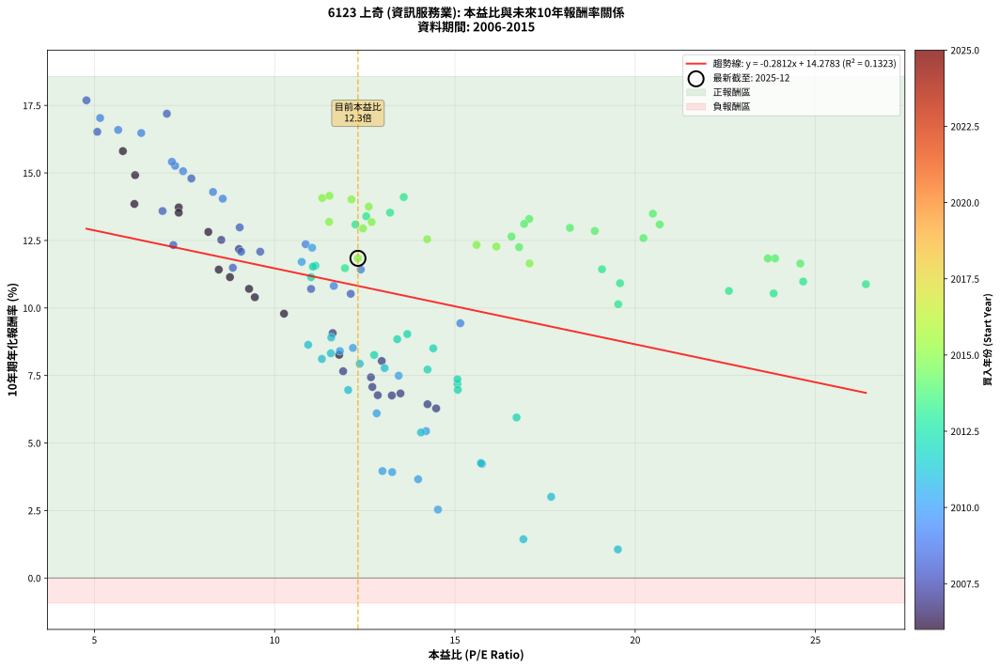
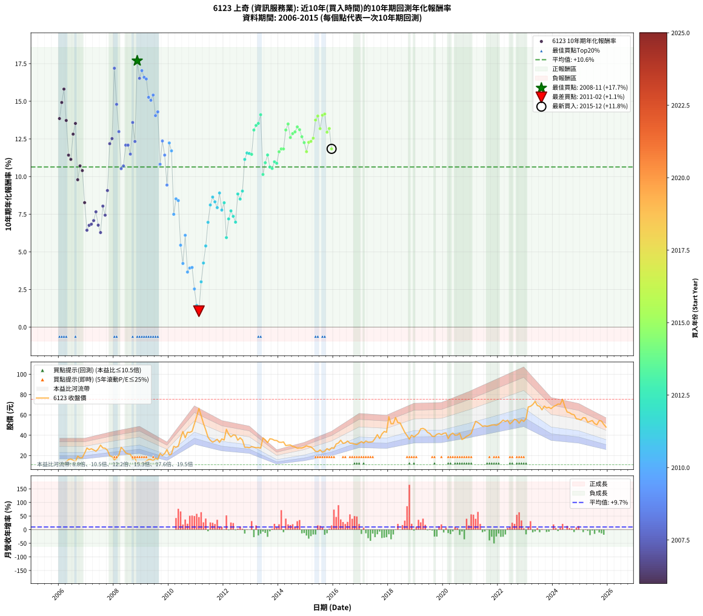

# 6123 上奇 - 本益比與未來報酬率分析

!!! info "報告資訊"
    - **股票代號**: 6123
    - **公司名稱**: 上奇
    - **產業別**: 資訊服務業
    - **分析期間**: 2006-2015 (120 個數據點)
    - **資料來源**: Type 12 (ShowMonthlyK_ChartFlow) 月收盤價與本益比
    - **報酬率口徑**: 含現金股利 (簡化: 年度合計，假設每年7/1入帳)
    - **報告生成時間**: 2026-01-04 08:50:58 CST

## 📈 視覺化圖表

### 圖表1: 本益比 vs 未來報酬率關係

*圖表1：6123 上奇 本益比與10年期未來報酬率關係 (2006-2015)*

### 圖表2: 歷年買入時點的10年期實際報酬率

*圖表2：6123 上奇 歷年買入時點的10年期實際報酬率 (2006-2015)*

## 📍 買點訊號說明

本報告提供兩種買點提示訊號（顯示於圖表2的股價子圖中）：

### ▲ 小綠色三角形（回測驗證）
- **計算方式**: 使用全部歷史資料計算本益比第25百分位數
- **用途**: 事後驗證，顯示歷史上哪些時點確實為低估區
- **限制**: 當下無法判斷，僅供回測參考
- **特性**: 後見之明（Look-Ahead Bias）

### ▲ 小橘色三角形（即時訊號）
- **計算方式**: 使用截至當月的過去5年資料計算本益比第25百分位數
- **用途**: 實際投資決策，當時即可判斷
- **優勢**: 可操作性強，符合實務需求
- **特性**: 無後見之明，滾動窗口計算

!!! tip "如何使用兩種訊號"
    - **綠色▲** 幫助理解歷史估值機會，驗證策略有效性
    - **橘色▲** 可作為實際買進參考，但仍需搭配基本面分析
    - 兩種訊號重疊時，表示即時判斷與事後驗證一致，信心度較高
    - 僅有綠色▲時，表示當時無法判斷（需要未來資料才能確認）
    - 僅有橘色▲時，表示即時判斷為買點，但事後可能不是最佳時機

## 📊 估值分析摘要

| 指標 | 數值 |
|:---:|:---:|
| **目前本益比** (2015-12) | **12.31 倍** |
| **歷史平均本益比** | 12.95 倍 |
| **估值水準** | 🟡 合理範圍 |
| **預期10年年化報酬率** | **+10.82%** |
| **歷史平均報酬率** | +10.64% |
| **相關係數 (R²)** | 0.1323 |
| **趨勢線斜率** | -0.2812 |

!!! abstract "核心洞察"
    目前本益比接近歷史平均，預期報酬率符合長期趨勢

    根據歷史數據回測，6123 上奇 在目前本益比 **12.3倍** 的估值水準下，
    預期未來10年年化報酬率約為 **+10.8%**。

    **重要提醒**: 本分析基於歷史數據統計，實際報酬率會受到公司基本面變化、產業趨勢、
    總體經濟環境等多重因素影響。R² = 0.13 表示本益比可解釋約 13.2% 的報酬率變異。

## 📈 歷史估值統計

### 最佳買點 (最高報酬率)

| 項目 | 數值 |
|:---:|:---:|
| 起始時間 | 2008-11 |
| 當時本益比 | 4.78 倍 |
| 起始價格 | 11.8 元 |
| 10年後價格 | 40.1 元 |
| **10年年化報酬率** | **+17.69%** |

### 最差買點 (最低報酬率)

| 項目 | 數值 |
|:---:|:---:|
| 起始時間 | 2011-02 |
| 當時本益比 | 19.52 倍 |
| 起始價格 | 66.5 元 |
| 10年後價格 | 48.1 元 |
| **10年年化報酬率** | **+1.06%** |

## 🎯 投資啟示

### 本益比與報酬率關係

趨勢線方程式: **y = -0.2812x + 14.2783**

!!! note "負相關"
    本益比與未來報酬率呈現負相關。較低的本益比通常帶來較高的未來報酬率，
    但相關性不算非常強。**估值仍是重要參考指標之一**。

### 估值區間建議

基於歷史數據分析:

- **🟢 低估區** (P/E < 10.4): 預期報酬率較高，可考慮增加持股
- **🟡 合理區** (P/E 10.4-15.5): 預期報酬率符合長期趨勢，正常持有
- **🔴 高估區** (P/E > 15.5): 預期報酬率較低，可考慮減碼或觀望

!!! danger "風險提示"
    - 過去表現不代表未來結果
    - 本分析假設公司基本面無重大結構性變化
    - 產業環境劇變可能使歷史規律失效
    - 應結合公司財報、產業趨勢、總體經濟等多重因素綜合判斷

!!! success "長期投資觀點"
    歷史數據顯示，在合理或低估的估值水準買入並長期持有，
    往往能獲得較佳的投資報酬。**耐心等待好價格**是價值投資的核心原則。

## 📊 數據品質

- **資料來源**: GoodInfo.tw Type 12 (ShowMonthlyK_ChartFlow)
- **資料頻率**: 月度收盤價與本益比
- **回測期間**: 2006-2015
- **數據點數量**: 120 個 (每個點代表一次10年期回測)

### 計算方法說明

1. **10年期年化報酬率**:
   - 對每個歷史時點，計算其後10年的實際投資報酬率
   - 期末價值(不含股利): 期末價格
   - 期末價值(含現金股利): 期末價格 + 持有期間內的現金股利合計 (簡化: 年度合計，假設每年7/1入帳)
   - 公式: 年化報酬率 = [(期末價值/期初價格)^(1/年數) - 1] × 100%

2. **本益比 (P/E Ratio)**:
   - 使用當時的月收盤價與EPS計算
   - 資料來源: Type 12 月度河流圖本益比數據

3. **趨勢線 (Linear Regression)**:
   - 使用最小平方法擬合線性趨勢線
   - R²值衡量本益比對報酬率的解釋能力

---

*本報告由 Stock Analysis System v1.9.0 自動生成*
*數據更新時間: 2026-01-04 08:50:58 CST*

## 📋 月度回測明細表

（每一列對應時間線圖中的一個買入點；可用來對照 SVG 圖上的每個點。）

| 買入月份 | 賣出月份 | 回測期限_年 | 實際持有年數 | 買入本益比_倍 | 買入收盤價_元 | 賣出收盤價_元 | 現金股利合計_元 | 總報酬率_pct | 年化報酬率_pct |
| --- | --- | --- | --- | --- | --- | --- | --- | --- | --- |
| 2006-01 | 2016-01 | 10 | 9.999 | 6.11 | 11.60 | 27.05 | 15.39 | +265.84 | +13.85 |
| 2006-02 | 2016-02 | 10 | 9.999 | 6.13 | 11.65 | 31.40 | 15.39 | +301.61 | +14.92 |
| 2006-03 | 2016-03 | 10 | 10.001 | 5.79 | 11.00 | 32.35 | 15.39 | +333.97 | +15.81 |
| 2006-04 | 2016-04 | 10 | 10.001 | 7.34 | 13.95 | 35.10 | 15.39 | +261.91 | +13.72 |
| 2006-05 | 2016-05 | 10 | 10.001 | 8.45 | 16.05 | 31.95 | 15.39 | +194.93 | +11.42 |
| 2006-06 | 2016-06 | 10 | 10.001 | 8.76 | 16.65 | 32.50 | 15.39 | +187.61 | +11.14 |
| 2006-07 | 2016-07 | 10 | 10.001 | 8.16 | 15.50 | 34.35 | 17.42 | +233.99 | +12.81 |
| 2006-08 | 2016-08 | 10 | 10.001 | 7.34 | 13.95 | 32.20 | 17.42 | +255.69 | +13.53 |
| 2006-09 | 2016-09 | 10 | 10.001 | 10.26 | 19.50 | 32.20 | 17.42 | +154.46 | +9.79 |
| 2006-10 | 2016-10 | 10 | 10.001 | 9.29 | 17.65 | 31.40 | 17.42 | +176.59 | +10.71 |
| 2006-11 | 2016-11 | 10 | 10.001 | 9.45 | 17.95 | 30.85 | 17.42 | +168.91 | +10.40 |
| 2006-12 | 2016-12 | 10 | 10.001 | 11.79 | 22.40 | 32.15 | 17.42 | +121.29 | +8.27 |
| 2007-01 | 2017-01 | 10 | 10.001 | 14.24 | 27.45 | 33.80 | 17.42 | +86.59 | +6.44 |
| 2007-02 | 2017-02 | 10 | 10.001 | 13.25 | 25.90 | 32.40 | 17.42 | +92.35 | +6.76 |
| 2007-03 | 2017-03 | 10 | 10.001 | 13.49 | 26.75 | 34.40 | 17.42 | +93.72 | +6.83 |
| 2007-04 | 2017-04 | 10 | 10.001 | 12.71 | 25.55 | 33.20 | 17.42 | +98.12 | +7.08 |
| 2007-05 | 2017-05 | 10 | 10.001 | 11.90 | 24.25 | 33.30 | 17.42 | +109.15 | +7.66 |
| 2007-06 | 2017-06 | 10 | 10.001 | 12.86 | 26.55 | 33.70 | 17.42 | +92.54 | +6.77 |
| 2007-07 | 2017-07 | 10 | 10.001 | 14.48 | 30.30 | 36.80 | 18.92 | +83.90 | +6.28 |
| 2007-08 | 2017-08 | 10 | 10.001 | 12.97 | 27.50 | 40.65 | 18.92 | +116.62 | +8.04 |
| 2007-09 | 2017-09 | 10 | 10.001 | 12.67 | 27.20 | 36.80 | 18.92 | +104.86 | +7.43 |
| 2007-10 | 2017-10 | 10 | 10.001 | 11.61 | 25.25 | 41.25 | 18.92 | +138.30 | +9.07 |
| 2007-11 | 2017-11 | 10 | 10.001 | 9.01 | 19.85 | 43.75 | 18.92 | +215.72 | +12.18 |
| 2007-12 | 2017-12 | 10 | 10.001 | 8.52 | 19.00 | 42.90 | 18.92 | +225.37 | +12.52 |
| 2008-01 | 2018-01 | 10 | 10.001 | 7.01 | 15.80 | 58.30 | 18.92 | +388.74 | +17.19 |
| 2008-02 | 2018-03 | 10 | 10.081 | 7.69 | 17.50 | 51.40 | 18.92 | +301.83 | +14.79 |
| 2008-03 | 2018-03 | 10 | 9.999 | 9.03 | 20.75 | 51.40 | 18.92 | +238.90 | +12.98 |
| 2008-04 | 2018-04 | 10 | 9.999 | 12.11 | 28.10 | 57.50 | 18.92 | +171.96 | +10.52 |
| 2008-05 | 2018-05 | 10 | 9.999 | 11.01 | 25.80 | 52.40 | 18.92 | +176.44 | +10.70 |
| 2008-06 | 2018-06 | 10 | 9.999 | 9.60 | 22.70 | 52.10 | 18.92 | +212.87 | +12.08 |
| 2008-07 | 2018-07 | 10 | 9.999 | 9.07 | 21.65 | 47.45 | 20.29 | +212.88 | +12.08 |
| 2008-08 | 2018-08 | 10 | 9.999 | 8.84 | 21.30 | 42.90 | 20.29 | +196.66 | +11.49 |
| 2008-09 | 2018-09 | 10 | 9.999 | 6.89 | 16.75 | 39.60 | 20.29 | +257.54 | +13.59 |
| 2008-10 | 2018-10 | 10 | 9.999 | 7.19 | 17.65 | 36.15 | 20.29 | +219.76 | +12.33 |
| 2008-11 | 2018-11 | 10 | 9.999 | 4.78 | 11.85 | 40.10 | 20.29 | +409.60 | +17.69 |
| 2008-12 | 2018-12 | 10 | 9.999 | 5.08 | 12.70 | 38.30 | 20.29 | +361.32 | +16.52 |
| 2009-01 | 2019-01 | 10 | 9.999 | 5.16 | 12.55 | 40.20 | 20.29 | +381.98 | +17.03 |
| 2009-02 | 2019-02 | 10 | 9.999 | 5.66 | 13.40 | 41.90 | 20.29 | +364.09 | +16.59 |
| 2009-03 | 2019-03 | 10 | 9.999 | 6.30 | 14.50 | 46.35 | 20.29 | +359.57 | +16.48 |
| 2009-04 | 2019-04 | 10 | 9.999 | 7.24 | 16.20 | 46.75 | 20.29 | +313.81 | +15.26 |
| 2009-05 | 2019-05 | 10 | 9.999 | 7.46 | 16.20 | 45.60 | 20.29 | +306.72 | +15.06 |
| 2009-06 | 2019-06 | 10 | 9.999 | 7.15 | 15.05 | 42.80 | 20.29 | +319.19 | +15.41 |
| 2009-07 | 2019-07 | 10 | 9.999 | 8.56 | 17.45 | 41.75 | 23.19 | +272.14 | +14.05 |
| 2009-08 | 2019-08 | 10 | 9.999 | 8.29 | 16.35 | 39.00 | 23.19 | +280.35 | +14.29 |
| 2009-09 | 2019-09 | 10 | 9.999 | 11.64 | 22.20 | 38.80 | 23.19 | +179.23 | +10.82 |
| 2009-10 | 2019-10 | 10 | 9.999 | 10.86 | 20.00 | 40.95 | 23.19 | +220.69 | +12.36 |
| 2009-11 | 2019-11 | 10 | 9.999 | 12.39 | 22.00 | 41.70 | 23.19 | +194.95 | +11.42 |
| 2009-12 | 2019-12 | 10 | 9.999 | 15.15 | 25.90 | 40.60 | 23.19 | +146.29 | +9.43 |
| 2010-01 | 2020-01 | 10 | 9.999 | 11.04 | 20.55 | 41.95 | 23.19 | +216.97 | +12.23 |
| 2010-02 | 2020-02 | 10 | 9.999 | 10.75 | 21.65 | 42.30 | 23.19 | +202.48 | +11.71 |
| 2010-03 | 2020-03 | 10 | 10.001 | 13.44 | 29.10 | 36.75 | 23.19 | +105.97 | +7.49 |
| 2010-04 | 2020-04 | 10 | 10.001 | 12.17 | 28.20 | 40.70 | 23.19 | +126.55 | +8.52 |
| 2010-05 | 2020-05 | 10 | 10.001 | 11.81 | 29.15 | 42.15 | 23.19 | +124.14 | +8.40 |
| 2010-06 | 2020-06 | 10 | 10.001 | 14.20 | 37.20 | 40.00 | 23.19 | +69.86 | +5.44 |
| 2010-07 | 2020-07 | 10 | 10.001 | 15.75 | 43.65 | 40.25 | 25.79 | +51.29 | +4.23 |
| 2010-08 | 2020-08 | 10 | 10.001 | 12.83 | 37.50 | 42.00 | 25.79 | +80.77 | +6.10 |
| 2010-09 | 2020-09 | 10 | 10.001 | 13.98 | 43.00 | 35.80 | 25.79 | +43.23 | +3.66 |
| 2010-10 | 2020-10 | 10 | 10.001 | 13.26 | 42.80 | 37.10 | 25.79 | +46.93 | +3.92 |
| 2010-11 | 2020-11 | 10 | 10.001 | 12.99 | 43.90 | 38.95 | 25.79 | +47.47 | +3.96 |
| 2010-12 | 2020-12 | 10 | 10.001 | 14.53 | 51.30 | 40.10 | 25.79 | +28.44 | +2.53 |
| 2011-01 | 2021-01 | 10 | 10.001 | 16.90 | 58.60 | 41.80 | 25.79 | +15.34 | +1.44 |
| 2011-02 | 2021-02 | 10 | 10.001 | 19.52 | 66.50 | 48.10 | 25.79 | +11.11 | +1.06 |
| 2011-03 | 2021-03 | 10 | 10.001 | 17.67 | 59.10 | 53.70 | 25.79 | +34.50 | +3.01 |
| 2011-04 | 2021-04 | 10 | 10.001 | 15.72 | 51.60 | 52.50 | 25.79 | +51.72 | +4.26 |
| 2011-05 | 2021-05 | 10 | 10.001 | 14.06 | 45.30 | 50.80 | 25.79 | +69.07 | +5.39 |
| 2011-06 | 2021-06 | 10 | 10.001 | 12.04 | 38.05 | 48.80 | 25.79 | +96.03 | +6.96 |
| 2011-07 | 2021-07 | 10 | 10.001 | 11.31 | 35.05 | 49.30 | 27.16 | +118.16 | +8.11 |
| 2011-08 | 2021-08 | 10 | 10.001 | 10.93 | 33.20 | 48.85 | 27.16 | +128.96 | +8.64 |
| 2011-09 | 2021-09 | 10 | 10.001 | 11.56 | 34.40 | 49.35 | 27.16 | +122.43 | +8.32 |
| 2011-10 | 2021-10 | 10 | 10.001 | 12.36 | 36.00 | 50.10 | 27.16 | +114.62 | +7.94 |
| 2011-11 | 2021-11 | 10 | 10.001 | 11.57 | 33.00 | 50.30 | 27.16 | +134.74 | +8.91 |
| 2011-12 | 2021-12 | 10 | 10.001 | 13.05 | 36.40 | 49.80 | 27.16 | +111.44 | +7.77 |
| 2012-01 | 2022-01 | 10 | 10.001 | 12.76 | 35.30 | 50.90 | 27.16 | +121.15 | +8.26 |
| 2012-02 | 2022-03 | 10 | 10.081 | 16.71 | 45.85 | 54.90 | 27.16 | +78.99 | +5.94 |
| 2012-03 | 2022-03 | 10 | 9.999 | 15.07 | 41.00 | 54.90 | 27.16 | +100.16 | +7.19 |
| 2012-04 | 2022-04 | 10 | 9.999 | 14.24 | 38.40 | 53.60 | 27.16 | +110.33 | +7.72 |
| 2012-05 | 2022-05 | 10 | 9.999 | 15.07 | 40.30 | 54.80 | 27.16 | +103.39 | +7.36 |
| 2012-06 | 2022-06 | 10 | 9.999 | 15.08 | 39.95 | 51.20 | 27.16 | +96.16 | +6.97 |
| 2012-07 | 2022-07 | 10 | 9.999 | 13.40 | 35.20 | 53.10 | 29.02 | +133.29 | +8.84 |
| 2012-08 | 2022-08 | 10 | 9.999 | 14.40 | 37.50 | 55.80 | 29.02 | +126.18 | +8.51 |
| 2012-09 | 2022-09 | 10 | 9.999 | 13.68 | 35.30 | 54.80 | 29.02 | +137.44 | +9.03 |
| 2012-10 | 2022-10 | 10 | 9.999 | 11.01 | 28.15 | 51.90 | 29.02 | +187.45 | +11.14 |
| 2012-11 | 2022-11 | 10 | 9.999 | 11.13 | 28.20 | 55.20 | 29.02 | +198.64 | +11.56 |
| 2012-12 | 2022-12 | 10 | 9.999 | 11.06 | 27.75 | 53.60 | 29.02 | +197.72 | +11.53 |
| 2013-01 | 2023-01 | 10 | 9.999 | 11.95 | 28.80 | 56.30 | 29.02 | +196.24 | +11.47 |
| 2013-02 | 2023-02 | 10 | 9.999 | 12.24 | 28.30 | 67.80 | 29.02 | +242.11 | +13.09 |
| 2013-03 | 2023-03 | 10 | 9.999 | 12.54 | 27.75 | 68.50 | 29.02 | +251.41 | +13.39 |
| 2013-04 | 2023-04 | 10 | 9.999 | 13.20 | 27.90 | 70.20 | 29.02 | +255.62 | +13.53 |
| 2013-05 | 2023-05 | 10 | 9.999 | 13.58 | 27.35 | 73.30 | 29.02 | +274.10 | +14.11 |
| 2013-06 | 2023-06 | 10 | 9.999 | 19.53 | 37.40 | 69.20 | 29.02 | +162.61 | +10.14 |
| 2013-07 | 2023-07 | 10 | 9.999 | 19.58 | 35.55 | 68.50 | 31.67 | +181.76 | +10.92 |
| 2013-08 | 2023-08 | 10 | 9.999 | 19.08 | 32.75 | 65.00 | 31.67 | +195.17 | +11.43 |
| 2013-09 | 2023-09 | 10 | 9.999 | 22.60 | 36.55 | 68.70 | 31.67 | +174.60 | +10.63 |
| 2013-10 | 2023-10 | 10 | 9.999 | 23.84 | 36.20 | 66.90 | 31.67 | +172.28 | +10.54 |
| 2013-11 | 2023-11 | 10 | 9.999 | 24.66 | 35.00 | 67.50 | 31.67 | +183.33 | +10.98 |
| 2013-12 | 2023-12 | 10 | 9.999 | 26.40 | 34.85 | 66.20 | 31.67 | +180.82 | +10.88 |
| 2014-01 | 2024-01 | 10 | 9.999 | 24.58 | 33.20 | 68.20 | 31.67 | +200.80 | +11.64 |
| 2014-02 | 2024-02 | 10 | 9.999 | 23.88 | 33.00 | 69.30 | 31.67 | +205.96 | +11.83 |
| 2014-03 | 2024-03 | 10 | 10.001 | 23.68 | 33.45 | 70.70 | 31.67 | +206.03 | +11.83 |
| 2014-04 | 2024-04 | 10 | 10.001 | 20.68 | 29.85 | 70.50 | 31.67 | +242.27 | +13.09 |
| 2014-05 | 2024-05 | 10 | 10.001 | 20.49 | 30.20 | 75.40 | 31.67 | +254.53 | +13.49 |
| 2014-06 | 2024-06 | 10 | 10.001 | 20.23 | 30.45 | 68.00 | 31.67 | +227.31 | +12.59 |
| 2014-07 | 2024-07 | 10 | 10.001 | 18.88 | 29.00 | 62.90 | 34.27 | +235.06 | +12.85 |
| 2014-08 | 2024-08 | 10 | 10.001 | 18.19 | 28.50 | 62.20 | 34.27 | +238.48 | +12.97 |
| 2014-09 | 2024-09 | 10 | 10.001 | 17.06 | 27.25 | 60.70 | 34.27 | +248.50 | +13.30 |
| 2014-10 | 2024-10 | 10 | 10.001 | 16.92 | 27.55 | 60.20 | 34.27 | +242.89 | +13.11 |
| 2014-11 | 2024-11 | 10 | 10.001 | 16.57 | 27.50 | 56.20 | 34.27 | +228.97 | +12.64 |
| 2014-12 | 2024-12 | 10 | 10.001 | 16.78 | 28.35 | 55.80 | 34.27 | +217.70 | +12.25 |
| 2015-01 | 2025-01 | 10 | 10.001 | 17.07 | 29.65 | 55.00 | 34.27 | +201.07 | +11.65 |
| 2015-02 | 2025-02 | 10 | 10.001 | 16.15 | 28.80 | 57.40 | 34.27 | +218.29 | +12.27 |
| 2015-03 | 2025-03 | 10 | 10.001 | 15.60 | 28.55 | 57.10 | 34.27 | +220.02 | +12.33 |
| 2015-04 | 2025-04 | 10 | 10.001 | 14.23 | 26.70 | 52.80 | 34.27 | +226.09 | +12.55 |
| 2015-05 | 2025-05 | 10 | 10.001 | 12.61 | 24.25 | 53.70 | 34.27 | +262.75 | +13.75 |
| 2015-06 | 2025-06 | 10 | 10.001 | 12.13 | 23.90 | 54.50 | 34.27 | +271.41 | +14.02 |
| 2015-07 | 2025-07 | 10 | 10.001 | 12.69 | 25.60 | 51.50 | 36.81 | +244.96 | +13.18 |
| 2015-08 | 2025-08 | 10 | 10.001 | 11.32 | 23.35 | 50.30 | 36.81 | +273.07 | +14.07 |
| 2015-09 | 2025-09 | 10 | 10.001 | 11.52 | 24.30 | 54.50 | 36.81 | +275.77 | +14.15 |
| 2015-10 | 2025-10 | 10 | 10.001 | 12.45 | 26.85 | 53.90 | 36.81 | +237.84 | +12.94 |
| 2015-11 | 2025-11 | 10 | 10.001 | 11.51 | 25.35 | 50.70 | 36.81 | +245.21 | +13.19 |
| 2015-12 | 2025-12 | 10 | 10.001 | 12.31 | 27.70 | 48.00 | 36.81 | +206.18 | +11.84 |
