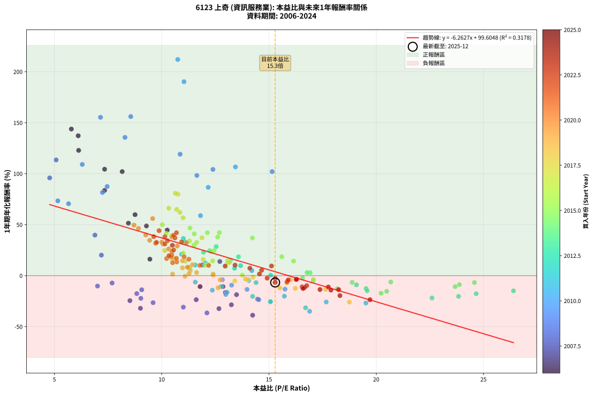
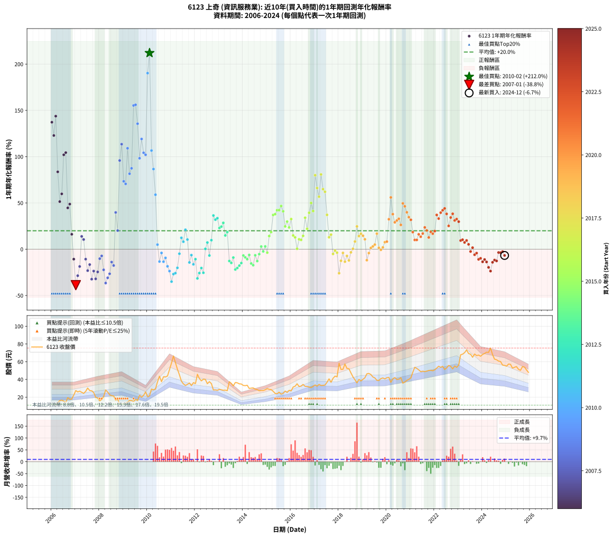

# 6123 上奇 - 本益比與未來報酬率分析

!!! info "報告資訊"
    - **股票代號**: 6123
    - **公司名稱**: 上奇
    - **產業別**: 資訊服務業
    - **分析期間**: 2006-2024 (228 個數據點)
    - **資料來源**: Type 12 (ShowMonthlyK_ChartFlow) 月收盤價與本益比
    - **報酬率口徑**: 含現金股利 (簡化: 年度合計，假設每年7/1入帳)
    - **報告生成時間**: 2026-01-04 08:20:17 CST

## 📈 視覺化圖表

### 圖表1: 本益比 vs 未來報酬率關係

*圖表1：6123 上奇 本益比與1年期未來報酬率關係 (2006-2024)*

### 圖表2: 歷年買入時點的1年期實際報酬率

*圖表2：6123 上奇 歷年買入時點的1年期實際報酬率 (2006-2024)*

## 📍 買點訊號說明

本報告提供兩種買點提示訊號（顯示於圖表2的股價子圖中）：

### ▲ 小綠色三角形（回測驗證）
- **計算方式**: 使用全部歷史資料計算本益比第25百分位數
- **用途**: 事後驗證，顯示歷史上哪些時點確實為低估區
- **限制**: 當下無法判斷，僅供回測參考
- **特性**: 後見之明（Look-Ahead Bias）

### ▲ 小橘色三角形（即時訊號）
- **計算方式**: 使用截至當月的過去5年資料計算本益比第25百分位數
- **用途**: 實際投資決策，當時即可判斷
- **優勢**: 可操作性強，符合實務需求
- **特性**: 無後見之明，滾動窗口計算

!!! tip "如何使用兩種訊號"
    - **綠色▲** 幫助理解歷史估值機會，驗證策略有效性
    - **橘色▲** 可作為實際買進參考，但仍需搭配基本面分析
    - 兩種訊號重疊時，表示即時判斷與事後驗證一致，信心度較高
    - 僅有綠色▲時，表示當時無法判斷（需要未來資料才能確認）
    - 僅有橘色▲時，表示即時判斷為買點，但事後可能不是最佳時機

## 📊 估值分析摘要

| 指標 | 數值 |
|:---:|:---:|
| **目前本益比** (2024-12) | **15.29 倍** |
| **歷史平均本益比** | 12.72 倍 |
| **估值水準** | 🔴 相對高估 |
| **預期1年年化報酬率** | **+3.85%** |
| **歷史平均報酬率** | +19.96% |
| **相關係數 (R²)** | 0.3178 |
| **趨勢線斜率** | -6.2627 |

!!! abstract "核心洞察"
    目前本益比顯著高於歷史平均，預期未來報酬率可能較低

    根據歷史數據回測，6123 上奇 在目前本益比 **15.3倍** 的估值水準下，
    預期未來1年年化報酬率約為 **+3.8%**。

    **重要提醒**: 本分析基於歷史數據統計，實際報酬率會受到公司基本面變化、產業趨勢、
    總體經濟環境等多重因素影響。R² = 0.32 表示本益比可解釋約 31.8% 的報酬率變異。

## 📈 歷史估值統計

### 最佳買點 (最高報酬率)

| 項目 | 數值 |
|:---:|:---:|
| 起始時間 | 2010-02 |
| 當時本益比 | 10.75 倍 |
| 起始價格 | 21.6 元 |
| 1年後價格 | 66.5 元 |
| **1年年化報酬率** | **+212.02%** |

### 最差買點 (最低報酬率)

| 項目 | 數值 |
|:---:|:---:|
| 起始時間 | 2007-01 |
| 當時本益比 | 14.24 倍 |
| 起始價格 | 27.4 元 |
| 1年後價格 | 15.8 元 |
| **1年年化報酬率** | **-38.83%** |

## 🎯 投資啟示

### 本益比與報酬率關係

趨勢線方程式: **y = -6.2627x + 99.6048**

!!! warning "強負相關"
    本益比與未來報酬率呈現強負相關。在高本益比時期買入，未來報酬率顯著較低；
    在低本益比時期買入，未來報酬率顯著較高。**估值紀律至關重要**。

### 估值區間建議

基於歷史數據分析:

- **🟢 低估區** (P/E < 10.2): 預期報酬率較高，可考慮增加持股
- **🟡 合理區** (P/E 10.2-15.3): 預期報酬率符合長期趨勢，正常持有
- **🔴 高估區** (P/E > 15.3): 預期報酬率較低，可考慮減碼或觀望

!!! danger "風險提示"
    - 過去表現不代表未來結果
    - 本分析假設公司基本面無重大結構性變化
    - 產業環境劇變可能使歷史規律失效
    - 應結合公司財報、產業趨勢、總體經濟等多重因素綜合判斷

!!! success "長期投資觀點"
    歷史數據顯示，在合理或低估的估值水準買入並長期持有，
    往往能獲得較佳的投資報酬。**耐心等待好價格**是價值投資的核心原則。

## 📊 數據品質

- **資料來源**: GoodInfo.tw Type 12 (ShowMonthlyK_ChartFlow)
- **資料頻率**: 月度收盤價與本益比
- **回測期間**: 2006-2024
- **數據點數量**: 228 個 (每個點代表一次1年期回測)

### 計算方法說明

1. **1年期年化報酬率**:
   - 對每個歷史時點，計算其後1年的實際投資報酬率
   - 期末價值(不含股利): 期末價格
   - 期末價值(含現金股利): 期末價格 + 持有期間內的現金股利合計 (簡化: 年度合計，假設每年7/1入帳)
   - 公式: 年化報酬率 = [(期末價值/期初價格)^(1/年數) - 1] × 100%

2. **本益比 (P/E Ratio)**:
   - 使用當時的月收盤價與EPS計算
   - 資料來源: Type 12 月度河流圖本益比數據

3. **趨勢線 (Linear Regression)**:
   - 使用最小平方法擬合線性趨勢線
   - R²值衡量本益比對報酬率的解釋能力

---

*本報告由 Stock Analysis System v1.9.0 自動生成*
*數據更新時間: 2026-01-04 08:20:17 CST*

## 📋 月度回測明細表

（每一列對應時間線圖中的一個買入點；可用來對照 SVG 圖上的每個點。）

| 買入月份 | 賣出月份 | 回測期限_年 | 實際持有年數 | 買入本益比_倍 | 買入收盤價_元 | 賣出收盤價_元 | 現金股利合計_元 | 總報酬率_pct | 年化報酬率_pct |
| --- | --- | --- | --- | --- | --- | --- | --- | --- | --- |
| 2006-01 | 2007-01 | 1 | 0.999 | 6.11 | 11.60 | 27.45 | 0.05 | +137.07 | +137.21 |
| 2006-02 | 2007-02 | 1 | 0.999 | 6.13 | 11.65 | 25.90 | 0.05 | +122.75 | +122.87 |
| 2006-03 | 2007-03 | 1 | 0.999 | 5.79 | 11.00 | 26.75 | 0.05 | +143.64 | +143.79 |
| 2006-04 | 2007-04 | 1 | 0.999 | 7.34 | 13.95 | 25.55 | 0.05 | +83.51 | +83.59 |
| 2006-05 | 2007-05 | 1 | 0.999 | 8.45 | 16.05 | 24.25 | 0.05 | +51.40 | +51.44 |
| 2006-06 | 2007-06 | 1 | 0.999 | 8.76 | 16.65 | 26.55 | 0.05 | +59.76 | +59.81 |
| 2006-07 | 2007-07 | 1 | 0.999 | 8.16 | 15.50 | 30.30 | 1.00 | +101.92 | +102.02 |
| 2006-08 | 2007-08 | 1 | 0.999 | 7.34 | 13.95 | 27.50 | 1.00 | +104.29 | +104.39 |
| 2006-09 | 2007-09 | 1 | 0.999 | 10.26 | 19.50 | 27.20 | 1.00 | +44.61 | +44.64 |
| 2006-10 | 2007-10 | 1 | 0.999 | 9.29 | 17.65 | 25.25 | 1.00 | +48.71 | +48.75 |
| 2006-11 | 2007-11 | 1 | 0.999 | 9.45 | 17.95 | 19.85 | 1.00 | +16.14 | +16.16 |
| 2006-12 | 2007-12 | 1 | 0.999 | 11.79 | 22.40 | 19.00 | 1.00 | -10.72 | -10.73 |
| 2007-01 | 2008-01 | 1 | 0.999 | 14.24 | 27.45 | 15.80 | 1.00 | -38.81 | -38.83 |
| 2007-02 | 2008-02 | 1 | 0.999 | 13.25 | 25.90 | 17.50 | 1.00 | -28.58 | -28.60 |
| 2007-03 | 2008-03 | 1 | 1.002 | 13.49 | 26.75 | 20.75 | 1.00 | -18.70 | -18.66 |
| 2007-04 | 2008-04 | 1 | 1.002 | 12.71 | 25.55 | 28.10 | 1.00 | +13.89 | +13.86 |
| 2007-05 | 2008-05 | 1 | 1.002 | 11.90 | 24.25 | 25.80 | 1.00 | +10.51 | +10.48 |
| 2007-06 | 2008-06 | 1 | 1.002 | 12.86 | 26.55 | 22.70 | 1.00 | -10.74 | -10.72 |
| 2007-07 | 2008-07 | 1 | 1.002 | 14.48 | 30.30 | 21.65 | 1.63 | -23.16 | -23.12 |
| 2007-08 | 2008-08 | 1 | 1.002 | 12.97 | 27.50 | 21.30 | 1.63 | -16.61 | -16.58 |
| 2007-09 | 2008-09 | 1 | 1.002 | 12.67 | 27.20 | 16.75 | 1.63 | -32.42 | -32.36 |
| 2007-10 | 2008-10 | 1 | 1.002 | 11.61 | 25.25 | 17.65 | 1.63 | -23.63 | -23.59 |
| 2007-11 | 2008-11 | 1 | 1.002 | 9.01 | 19.85 | 11.85 | 1.63 | -32.08 | -32.02 |
| 2007-12 | 2008-12 | 1 | 1.002 | 8.52 | 19.00 | 12.70 | 1.63 | -24.56 | -24.52 |
| 2008-01 | 2009-01 | 1 | 1.002 | 7.01 | 15.80 | 12.55 | 1.63 | -10.23 | -10.21 |
| 2008-02 | 2009-03 | 1 | 1.081 | 7.69 | 17.50 | 14.50 | 1.63 | -7.81 | -7.24 |
| 2008-03 | 2009-03 | 1 | 0.999 | 9.03 | 20.75 | 14.50 | 1.63 | -22.25 | -22.26 |
| 2008-04 | 2009-04 | 1 | 0.999 | 12.11 | 28.10 | 16.20 | 1.63 | -36.54 | -36.56 |
| 2008-05 | 2009-05 | 1 | 0.999 | 11.01 | 25.80 | 16.20 | 1.63 | -30.88 | -30.90 |
| 2008-06 | 2009-06 | 1 | 0.999 | 9.60 | 22.70 | 15.05 | 1.63 | -26.51 | -26.52 |
| 2008-07 | 2009-07 | 1 | 0.999 | 9.07 | 21.65 | 17.45 | 1.20 | -13.86 | -13.87 |
| 2008-08 | 2009-08 | 1 | 0.999 | 8.84 | 21.30 | 16.35 | 1.20 | -17.61 | -17.62 |
| 2008-09 | 2009-09 | 1 | 0.999 | 6.89 | 16.75 | 22.20 | 1.20 | +39.70 | +39.73 |
| 2008-10 | 2009-10 | 1 | 0.999 | 7.19 | 17.65 | 20.00 | 1.20 | +20.11 | +20.13 |
| 2008-11 | 2009-11 | 1 | 0.999 | 4.78 | 11.85 | 22.00 | 1.20 | +95.78 | +95.87 |
| 2008-12 | 2009-12 | 1 | 0.999 | 5.08 | 12.70 | 25.90 | 1.20 | +113.39 | +113.50 |
| 2009-01 | 2010-01 | 1 | 0.999 | 5.16 | 12.55 | 20.55 | 1.20 | +73.31 | +73.37 |
| 2009-02 | 2010-02 | 1 | 0.999 | 5.66 | 13.40 | 21.65 | 1.20 | +70.52 | +70.58 |
| 2009-03 | 2010-03 | 1 | 0.999 | 6.30 | 14.50 | 29.10 | 1.20 | +108.97 | +109.07 |
| 2009-04 | 2010-04 | 1 | 0.999 | 7.24 | 16.20 | 28.20 | 1.20 | +81.48 | +81.56 |
| 2009-05 | 2010-05 | 1 | 0.999 | 7.46 | 16.20 | 29.15 | 1.20 | +87.35 | +87.43 |
| 2009-06 | 2010-06 | 1 | 0.999 | 7.15 | 15.05 | 37.20 | 1.20 | +155.15 | +155.31 |
| 2009-07 | 2010-07 | 1 | 0.999 | 8.56 | 17.45 | 43.65 | 1.00 | +155.87 | +156.04 |
| 2009-08 | 2010-08 | 1 | 0.999 | 8.29 | 16.35 | 37.50 | 1.00 | +135.47 | +135.61 |
| 2009-09 | 2010-09 | 1 | 0.999 | 11.64 | 22.20 | 43.00 | 1.00 | +98.20 | +98.29 |
| 2009-10 | 2010-10 | 1 | 0.999 | 10.86 | 20.00 | 42.80 | 1.00 | +119.00 | +119.12 |
| 2009-11 | 2010-11 | 1 | 0.999 | 12.39 | 22.00 | 43.90 | 1.00 | +104.09 | +104.19 |
| 2009-12 | 2010-12 | 1 | 0.999 | 15.15 | 25.90 | 51.30 | 1.00 | +101.93 | +102.03 |
| 2010-01 | 2011-01 | 1 | 0.999 | 11.04 | 20.55 | 58.60 | 1.00 | +190.02 | +190.24 |
| 2010-02 | 2011-02 | 1 | 0.999 | 10.75 | 21.65 | 66.50 | 1.00 | +211.78 | +212.02 |
| 2010-03 | 2011-03 | 1 | 0.999 | 13.44 | 29.10 | 59.10 | 1.00 | +106.53 | +106.63 |
| 2010-04 | 2011-04 | 1 | 0.999 | 12.17 | 28.20 | 51.60 | 1.00 | +86.52 | +86.60 |
| 2010-05 | 2011-05 | 1 | 0.999 | 11.81 | 29.15 | 45.30 | 1.00 | +58.83 | +58.88 |
| 2010-06 | 2011-06 | 1 | 0.999 | 14.20 | 37.20 | 38.05 | 1.00 | +4.97 | +4.98 |
| 2010-07 | 2011-07 | 1 | 0.999 | 15.75 | 43.65 | 35.05 | 2.80 | -13.29 | -13.30 |
| 2010-08 | 2011-08 | 1 | 0.999 | 12.83 | 37.50 | 33.20 | 2.80 | -4.00 | -4.00 |
| 2010-09 | 2011-09 | 1 | 0.999 | 13.98 | 43.00 | 34.40 | 2.80 | -13.49 | -13.50 |
| 2010-10 | 2011-10 | 1 | 0.999 | 13.26 | 42.80 | 36.00 | 2.80 | -9.35 | -9.35 |
| 2010-11 | 2011-11 | 1 | 0.999 | 12.99 | 43.90 | 33.00 | 2.80 | -18.45 | -18.46 |
| 2010-12 | 2011-12 | 1 | 0.999 | 14.53 | 51.30 | 36.40 | 2.80 | -23.59 | -23.60 |
| 2011-01 | 2012-01 | 1 | 0.999 | 16.90 | 58.60 | 35.30 | 2.80 | -34.98 | -35.00 |
| 2011-02 | 2012-02 | 1 | 0.999 | 19.52 | 66.50 | 45.85 | 2.80 | -26.84 | -26.86 |
| 2011-03 | 2012-03 | 1 | 1.002 | 17.67 | 59.10 | 41.00 | 2.80 | -25.89 | -25.84 |
| 2011-04 | 2012-04 | 1 | 1.002 | 15.72 | 51.60 | 38.40 | 2.80 | -20.16 | -20.12 |
| 2011-05 | 2012-05 | 1 | 1.002 | 14.06 | 45.30 | 40.30 | 2.80 | -4.86 | -4.85 |
| 2011-06 | 2012-06 | 1 | 1.002 | 12.04 | 38.05 | 39.95 | 2.80 | +12.35 | +12.33 |
| 2011-07 | 2012-07 | 1 | 1.002 | 11.31 | 35.05 | 35.20 | 2.70 | +8.13 | +8.11 |
| 2011-08 | 2012-08 | 1 | 1.002 | 10.93 | 33.20 | 37.50 | 2.70 | +21.08 | +21.04 |
| 2011-09 | 2012-09 | 1 | 1.002 | 11.56 | 34.40 | 35.30 | 2.70 | +10.47 | +10.44 |
| 2011-10 | 2012-10 | 1 | 1.002 | 12.36 | 36.00 | 28.15 | 2.70 | -14.31 | -14.28 |
| 2011-11 | 2012-11 | 1 | 1.002 | 11.57 | 33.00 | 28.20 | 2.70 | -6.36 | -6.35 |
| 2011-12 | 2012-12 | 1 | 1.002 | 13.05 | 36.40 | 27.75 | 2.70 | -16.35 | -16.32 |
| 2012-01 | 2013-01 | 1 | 1.002 | 12.76 | 35.30 | 28.80 | 2.70 | -10.76 | -10.74 |
| 2012-02 | 2013-03 | 1 | 1.081 | 16.71 | 45.85 | 27.75 | 2.70 | -33.59 | -31.51 |
| 2012-03 | 2013-03 | 1 | 0.999 | 15.07 | 41.00 | 27.75 | 2.70 | -25.73 | -25.75 |
| 2012-04 | 2013-04 | 1 | 0.999 | 14.24 | 38.40 | 27.90 | 2.70 | -20.31 | -20.32 |
| 2012-05 | 2013-05 | 1 | 0.999 | 15.07 | 40.30 | 27.35 | 2.70 | -25.43 | -25.45 |
| 2012-06 | 2013-06 | 1 | 0.999 | 15.08 | 39.95 | 37.40 | 2.70 | +0.38 | +0.38 |
| 2012-07 | 2013-07 | 1 | 0.999 | 13.40 | 35.20 | 35.55 | 2.20 | +7.24 | +7.25 |
| 2012-08 | 2013-08 | 1 | 0.999 | 14.40 | 37.50 | 32.75 | 2.20 | -6.80 | -6.80 |
| 2012-09 | 2013-09 | 1 | 0.999 | 13.68 | 35.30 | 36.55 | 2.20 | +9.77 | +9.78 |
| 2012-10 | 2013-10 | 1 | 0.999 | 11.01 | 28.15 | 36.20 | 2.20 | +36.41 | +36.44 |
| 2012-11 | 2013-11 | 1 | 0.999 | 11.13 | 28.20 | 35.00 | 2.20 | +31.91 | +31.94 |
| 2012-12 | 2013-12 | 1 | 0.999 | 11.06 | 27.75 | 34.85 | 2.20 | +33.51 | +33.54 |
| 2013-01 | 2014-01 | 1 | 0.999 | 11.95 | 28.80 | 33.20 | 2.20 | +22.92 | +22.93 |
| 2013-02 | 2014-02 | 1 | 0.999 | 12.24 | 28.30 | 33.00 | 2.20 | +24.38 | +24.40 |
| 2013-03 | 2014-03 | 1 | 0.999 | 12.54 | 27.75 | 33.45 | 2.20 | +28.47 | +28.49 |
| 2013-04 | 2014-04 | 1 | 0.999 | 13.20 | 27.90 | 29.85 | 2.20 | +14.87 | +14.89 |
| 2013-05 | 2014-05 | 1 | 0.999 | 13.58 | 27.35 | 30.20 | 2.20 | +18.46 | +18.48 |
| 2013-06 | 2014-06 | 1 | 0.999 | 19.53 | 37.40 | 30.45 | 2.20 | -12.70 | -12.71 |
| 2013-07 | 2014-07 | 1 | 0.999 | 19.58 | 35.55 | 29.00 | 1.30 | -14.77 | -14.78 |
| 2013-08 | 2014-08 | 1 | 0.999 | 19.08 | 32.75 | 28.50 | 1.30 | -9.01 | -9.01 |
| 2013-09 | 2014-09 | 1 | 0.999 | 22.60 | 36.55 | 27.25 | 1.30 | -21.89 | -21.90 |
| 2013-10 | 2014-10 | 1 | 0.999 | 23.84 | 36.20 | 27.55 | 1.30 | -20.30 | -20.32 |
| 2013-11 | 2014-11 | 1 | 0.999 | 24.66 | 35.00 | 27.50 | 1.30 | -17.71 | -17.73 |
| 2013-12 | 2014-12 | 1 | 0.999 | 26.40 | 34.85 | 28.35 | 1.30 | -14.92 | -14.93 |
| 2014-01 | 2015-01 | 1 | 0.999 | 24.58 | 33.20 | 29.65 | 1.30 | -6.78 | -6.78 |
| 2014-02 | 2015-02 | 1 | 0.999 | 23.88 | 33.00 | 28.80 | 1.30 | -8.79 | -8.79 |
| 2014-03 | 2015-03 | 1 | 0.999 | 23.68 | 33.45 | 28.55 | 1.30 | -10.76 | -10.77 |
| 2014-04 | 2015-04 | 1 | 0.999 | 20.68 | 29.85 | 26.70 | 1.30 | -6.20 | -6.20 |
| 2014-05 | 2015-05 | 1 | 0.999 | 20.49 | 30.20 | 24.25 | 1.30 | -15.40 | -15.41 |
| 2014-06 | 2015-06 | 1 | 0.999 | 20.23 | 30.45 | 23.90 | 1.30 | -17.24 | -17.25 |
| 2014-07 | 2015-07 | 1 | 0.999 | 18.88 | 29.00 | 25.60 | 1.51 | -6.53 | -6.54 |
| 2014-08 | 2015-08 | 1 | 0.999 | 18.19 | 28.50 | 23.35 | 1.51 | -12.79 | -12.79 |
| 2014-09 | 2015-09 | 1 | 0.999 | 17.06 | 27.25 | 24.30 | 1.51 | -5.30 | -5.30 |
| 2014-10 | 2015-10 | 1 | 0.999 | 16.92 | 27.55 | 26.85 | 1.51 | +2.93 | +2.93 |
| 2014-11 | 2015-11 | 1 | 0.999 | 16.57 | 27.50 | 25.35 | 1.51 | -2.34 | -2.34 |
| 2014-12 | 2015-12 | 1 | 0.999 | 16.78 | 28.35 | 27.70 | 1.51 | +3.02 | +3.02 |
| 2015-01 | 2016-01 | 1 | 0.999 | 17.07 | 29.65 | 27.05 | 1.51 | -3.69 | -3.69 |
| 2015-02 | 2016-02 | 1 | 0.999 | 16.15 | 28.80 | 31.40 | 1.51 | +14.26 | +14.27 |
| 2015-03 | 2016-03 | 1 | 1.002 | 15.60 | 28.55 | 32.35 | 1.51 | +18.58 | +18.54 |
| 2015-04 | 2016-04 | 1 | 1.002 | 14.23 | 26.70 | 35.10 | 1.51 | +37.10 | +37.01 |
| 2015-05 | 2016-05 | 1 | 1.002 | 12.61 | 24.25 | 31.95 | 1.51 | +37.96 | +37.87 |
| 2015-06 | 2016-06 | 1 | 1.002 | 12.13 | 23.90 | 32.50 | 1.51 | +42.28 | +42.18 |
| 2015-07 | 2016-07 | 1 | 1.002 | 12.69 | 25.60 | 34.35 | 2.08 | +42.31 | +42.21 |
| 2015-08 | 2016-08 | 1 | 1.002 | 11.32 | 23.35 | 32.20 | 2.08 | +46.82 | +46.70 |
| 2015-09 | 2016-09 | 1 | 1.002 | 11.52 | 24.30 | 32.20 | 2.08 | +41.08 | +40.98 |
| 2015-10 | 2016-10 | 1 | 1.002 | 12.45 | 26.85 | 31.40 | 2.08 | +24.70 | +24.64 |
| 2015-11 | 2016-11 | 1 | 1.002 | 11.51 | 25.35 | 30.85 | 2.08 | +29.91 | +29.84 |
| 2015-12 | 2016-12 | 1 | 1.002 | 12.31 | 27.70 | 32.15 | 2.08 | +23.58 | +23.53 |
| 2016-01 | 2017-01 | 1 | 1.002 | 11.63 | 27.05 | 33.80 | 2.08 | +32.65 | +32.57 |
| 2016-02 | 2017-03 | 1 | 1.081 | 13.08 | 31.40 | 34.40 | 2.08 | +16.18 | +14.88 |
| 2016-03 | 2017-03 | 1 | 0.999 | 13.07 | 32.35 | 34.40 | 2.08 | +12.77 | +12.78 |
| 2016-04 | 2017-04 | 1 | 0.999 | 13.76 | 35.10 | 33.20 | 2.08 | +0.52 | +0.52 |
| 2016-05 | 2017-05 | 1 | 0.999 | 12.17 | 31.95 | 33.30 | 2.08 | +10.74 | +10.75 |
| 2016-06 | 2017-06 | 1 | 0.999 | 12.04 | 32.50 | 33.70 | 2.08 | +10.10 | +10.11 |
| 2016-07 | 2017-07 | 1 | 0.999 | 12.38 | 34.35 | 36.80 | 2.50 | +14.41 | +14.42 |
| 2016-08 | 2017-08 | 1 | 0.999 | 11.30 | 32.20 | 40.65 | 2.50 | +34.01 | +34.03 |
| 2016-09 | 2017-09 | 1 | 0.999 | 11.01 | 32.20 | 36.80 | 2.50 | +22.05 | +22.07 |
| 2016-10 | 2017-10 | 1 | 0.999 | 10.47 | 31.40 | 41.25 | 2.50 | +39.33 | +39.36 |
| 2016-11 | 2017-11 | 1 | 0.999 | 10.03 | 30.85 | 43.75 | 2.50 | +49.92 | +49.96 |
| 2016-12 | 2017-12 | 1 | 0.999 | 10.21 | 32.15 | 42.90 | 2.50 | +41.21 | +41.25 |
| 2017-01 | 2018-01 | 1 | 0.999 | 10.76 | 33.80 | 58.30 | 2.50 | +79.88 | +79.95 |
| 2017-02 | 2018-02 | 1 | 0.999 | 10.33 | 32.40 | 51.30 | 2.50 | +66.05 | +66.11 |
| 2017-03 | 2018-03 | 1 | 0.999 | 11.00 | 34.40 | 51.40 | 2.50 | +56.69 | +56.73 |
| 2017-04 | 2018-04 | 1 | 0.999 | 10.64 | 33.20 | 57.50 | 2.50 | +80.72 | +80.80 |
| 2017-05 | 2018-05 | 1 | 0.999 | 10.70 | 33.30 | 52.40 | 2.50 | +64.86 | +64.92 |
| 2017-06 | 2018-06 | 1 | 0.999 | 10.85 | 33.70 | 52.10 | 2.50 | +62.02 | +62.07 |
| 2017-07 | 2018-07 | 1 | 0.999 | 11.88 | 36.80 | 47.45 | 3.00 | +37.09 | +37.12 |
| 2017-08 | 2018-08 | 1 | 0.999 | 13.16 | 40.65 | 42.90 | 3.00 | +12.92 | +12.92 |
| 2017-09 | 2018-09 | 1 | 0.999 | 11.94 | 36.80 | 39.60 | 3.00 | +15.76 | +15.77 |
| 2017-10 | 2018-10 | 1 | 0.999 | 13.41 | 41.25 | 36.15 | 3.00 | -5.09 | -5.09 |
| 2017-11 | 2018-11 | 1 | 0.999 | 14.26 | 43.75 | 40.10 | 3.00 | -1.49 | -1.49 |
| 2017-12 | 2018-12 | 1 | 0.999 | 14.02 | 42.90 | 38.30 | 3.00 | -3.73 | -3.73 |
| 2018-01 | 2019-01 | 1 | 0.999 | 18.75 | 58.30 | 40.20 | 3.00 | -25.90 | -25.92 |
| 2018-02 | 2019-02 | 1 | 0.999 | 16.23 | 51.30 | 41.90 | 3.00 | -12.48 | -12.48 |
| 2018-03 | 2019-03 | 1 | 0.999 | 16.01 | 51.40 | 46.35 | 3.00 | -3.99 | -3.99 |
| 2018-04 | 2019-04 | 1 | 0.999 | 17.64 | 57.50 | 46.75 | 3.00 | -13.48 | -13.49 |
| 2018-05 | 2019-05 | 1 | 0.999 | 15.83 | 52.40 | 45.60 | 3.00 | -7.25 | -7.26 |
| 2018-06 | 2019-06 | 1 | 0.999 | 15.51 | 52.10 | 42.80 | 3.00 | -12.09 | -12.10 |
| 2018-07 | 2019-07 | 1 | 0.999 | 13.91 | 47.45 | 41.75 | 4.10 | -3.37 | -3.37 |
| 2018-08 | 2019-08 | 1 | 0.999 | 12.40 | 42.90 | 39.00 | 4.10 | +0.47 | +0.47 |
| 2018-09 | 2019-09 | 1 | 0.999 | 11.28 | 39.60 | 38.80 | 4.10 | +8.33 | +8.34 |
| 2018-10 | 2019-10 | 1 | 0.999 | 10.15 | 36.15 | 40.95 | 4.10 | +24.62 | +24.64 |
| 2018-11 | 2019-11 | 1 | 0.999 | 11.11 | 40.10 | 41.70 | 4.10 | +14.21 | +14.22 |
| 2018-12 | 2019-12 | 1 | 0.999 | 10.46 | 38.30 | 40.60 | 4.10 | +16.71 | +16.72 |
| 2019-01 | 2020-01 | 1 | 0.999 | 10.97 | 40.20 | 41.95 | 4.10 | +14.55 | +14.56 |
| 2019-02 | 2020-02 | 1 | 0.999 | 11.43 | 41.90 | 42.30 | 4.10 | +10.74 | +10.75 |
| 2019-03 | 2020-03 | 1 | 1.002 | 12.63 | 46.35 | 36.75 | 4.10 | -11.87 | -11.84 |
| 2019-04 | 2020-04 | 1 | 1.002 | 12.73 | 46.75 | 40.70 | 4.10 | -4.17 | -4.16 |
| 2019-05 | 2020-05 | 1 | 1.002 | 12.40 | 45.60 | 42.15 | 4.10 | +1.43 | +1.42 |
| 2019-06 | 2020-06 | 1 | 1.002 | 11.63 | 42.80 | 40.00 | 4.10 | +3.04 | +3.03 |
| 2019-07 | 2020-07 | 1 | 1.002 | 11.33 | 41.75 | 40.25 | 3.60 | +5.03 | +5.02 |
| 2019-08 | 2020-08 | 1 | 1.002 | 10.58 | 39.00 | 42.00 | 3.60 | +16.92 | +16.89 |
| 2019-09 | 2020-09 | 1 | 1.002 | 10.51 | 38.80 | 35.80 | 3.60 | +1.55 | +1.54 |
| 2019-10 | 2020-10 | 1 | 1.002 | 11.09 | 40.95 | 37.10 | 3.60 | -0.61 | -0.61 |
| 2019-11 | 2020-11 | 1 | 1.002 | 11.28 | 41.70 | 38.95 | 3.60 | +2.04 | +2.03 |
| 2019-12 | 2020-12 | 1 | 1.002 | 10.97 | 40.60 | 40.10 | 3.60 | +7.64 | +7.62 |
| 2020-01 | 2021-01 | 1 | 1.002 | 11.20 | 41.95 | 41.80 | 3.60 | +8.22 | +8.21 |
| 2020-02 | 2021-03 | 1 | 1.081 | 11.16 | 42.30 | 53.70 | 3.60 | +35.46 | +32.40 |
| 2020-03 | 2021-03 | 1 | 0.999 | 9.58 | 36.75 | 53.70 | 3.60 | +55.92 | +55.97 |
| 2020-04 | 2021-04 | 1 | 0.999 | 10.48 | 40.70 | 52.50 | 3.60 | +37.84 | +37.87 |
| 2020-05 | 2021-05 | 1 | 0.999 | 10.73 | 42.15 | 50.80 | 3.60 | +29.06 | +29.09 |
| 2020-06 | 2021-06 | 1 | 0.999 | 10.06 | 40.00 | 48.80 | 3.60 | +31.00 | +31.02 |
| 2020-07 | 2021-07 | 1 | 0.999 | 10.01 | 40.25 | 49.30 | 4.18 | +32.86 | +32.89 |
| 2020-08 | 2021-08 | 1 | 0.999 | 10.33 | 42.00 | 48.85 | 4.18 | +26.25 | +26.27 |
| 2020-09 | 2021-09 | 1 | 0.999 | 8.71 | 35.80 | 49.35 | 4.18 | +49.52 | +49.56 |
| 2020-10 | 2021-10 | 1 | 0.999 | 8.92 | 37.10 | 50.10 | 4.18 | +46.30 | +46.34 |
| 2020-11 | 2021-11 | 1 | 0.999 | 9.26 | 38.95 | 50.30 | 4.18 | +39.86 | +39.90 |
| 2020-12 | 2021-12 | 1 | 0.999 | 9.44 | 40.10 | 49.80 | 4.18 | +34.61 | +34.63 |
| 2021-01 | 2022-01 | 1 | 0.999 | 9.72 | 41.80 | 50.90 | 4.18 | +31.76 | +31.79 |
| 2021-02 | 2022-02 | 1 | 0.999 | 11.05 | 48.10 | 52.80 | 4.18 | +18.46 | +18.47 |
| 2021-03 | 2022-03 | 1 | 0.999 | 12.19 | 53.70 | 54.90 | 4.18 | +10.01 | +10.02 |
| 2021-04 | 2022-04 | 1 | 0.999 | 11.78 | 52.50 | 53.60 | 4.18 | +10.05 | +10.06 |
| 2021-05 | 2022-05 | 1 | 0.999 | 11.27 | 50.80 | 54.80 | 4.18 | +16.10 | +16.11 |
| 2021-06 | 2022-06 | 1 | 0.999 | 10.70 | 48.80 | 51.20 | 4.18 | +13.48 | +13.49 |
| 2021-07 | 2022-07 | 1 | 0.999 | 10.69 | 49.30 | 53.10 | 4.55 | +16.94 | +16.95 |
| 2021-08 | 2022-08 | 1 | 0.999 | 10.48 | 48.85 | 55.80 | 4.55 | +23.55 | +23.56 |
| 2021-09 | 2022-09 | 1 | 0.999 | 10.47 | 49.35 | 54.80 | 4.55 | +20.27 | +20.28 |
| 2021-10 | 2022-10 | 1 | 0.999 | 10.51 | 50.10 | 51.90 | 4.55 | +12.68 | +12.69 |
| 2021-11 | 2022-11 | 1 | 0.999 | 10.44 | 50.30 | 55.20 | 4.55 | +18.79 | +18.81 |
| 2021-12 | 2022-12 | 1 | 0.999 | 10.23 | 49.80 | 53.60 | 4.55 | +16.77 | +16.78 |
| 2022-01 | 2023-01 | 1 | 0.999 | 10.34 | 50.90 | 56.30 | 4.55 | +19.55 | +19.57 |
| 2022-02 | 2023-02 | 1 | 0.999 | 10.62 | 52.80 | 67.80 | 4.55 | +37.03 | +37.06 |
| 2022-03 | 2023-03 | 1 | 0.999 | 10.93 | 54.90 | 68.50 | 4.55 | +33.06 | +33.09 |
| 2022-04 | 2023-04 | 1 | 0.999 | 10.56 | 53.60 | 70.20 | 4.55 | +39.46 | +39.49 |
| 2022-05 | 2023-05 | 1 | 0.999 | 10.69 | 54.80 | 73.30 | 4.55 | +42.07 | +42.10 |
| 2022-06 | 2023-06 | 1 | 0.999 | 9.88 | 51.20 | 69.20 | 4.55 | +44.05 | +44.08 |
| 2022-07 | 2023-07 | 1 | 0.999 | 10.15 | 53.10 | 68.50 | 4.85 | +38.14 | +38.17 |
| 2022-08 | 2023-08 | 1 | 0.999 | 10.56 | 55.80 | 65.00 | 4.85 | +25.18 | +25.20 |
| 2022-09 | 2023-09 | 1 | 0.999 | 10.27 | 54.80 | 68.70 | 4.85 | +34.22 | +34.24 |
| 2022-10 | 2023-10 | 1 | 0.999 | 9.63 | 51.90 | 66.90 | 4.85 | +38.25 | +38.28 |
| 2022-11 | 2023-11 | 1 | 0.999 | 10.15 | 55.20 | 67.50 | 4.85 | +31.07 | +31.09 |
| 2022-12 | 2023-12 | 1 | 0.999 | 9.76 | 53.60 | 66.20 | 4.85 | +32.56 | +32.58 |
| 2023-01 | 2024-01 | 1 | 0.999 | 10.50 | 56.30 | 68.20 | 4.85 | +29.75 | +29.77 |
| 2023-02 | 2024-02 | 1 | 0.999 | 12.96 | 67.80 | 69.30 | 4.85 | +9.37 | +9.37 |
| 2023-03 | 2024-03 | 1 | 1.002 | 13.42 | 68.50 | 70.70 | 4.85 | +10.29 | +10.27 |
| 2023-04 | 2024-04 | 1 | 1.002 | 14.11 | 70.20 | 70.50 | 4.85 | +7.34 | +7.32 |
| 2023-05 | 2024-05 | 1 | 1.002 | 15.12 | 73.30 | 75.40 | 4.85 | +9.48 | +9.46 |
| 2023-06 | 2024-06 | 1 | 1.002 | 14.66 | 69.20 | 68.00 | 4.85 | +5.27 | +5.26 |
| 2023-07 | 2024-07 | 1 | 1.002 | 14.92 | 68.50 | 62.90 | 3.90 | -2.48 | -2.48 |
| 2023-08 | 2024-08 | 1 | 1.002 | 14.56 | 65.00 | 62.20 | 3.90 | +1.69 | +1.69 |
| 2023-09 | 2024-09 | 1 | 1.002 | 15.85 | 68.70 | 60.70 | 3.90 | -5.97 | -5.96 |
| 2023-10 | 2024-10 | 1 | 1.002 | 15.90 | 66.90 | 60.20 | 3.90 | -4.19 | -4.18 |
| 2023-11 | 2024-11 | 1 | 1.002 | 16.55 | 67.50 | 56.20 | 3.90 | -10.96 | -10.94 |
| 2023-12 | 2024-12 | 1 | 1.002 | 16.76 | 66.20 | 55.80 | 3.90 | -9.82 | -9.80 |
| 2024-01 | 2025-01 | 1 | 1.002 | 17.38 | 68.20 | 55.00 | 3.90 | -13.64 | -13.61 |
| 2024-02 | 2025-03 | 1 | 1.081 | 17.77 | 69.30 | 57.10 | 3.90 | -11.98 | -11.13 |
| 2024-03 | 2025-03 | 1 | 0.999 | 18.25 | 70.70 | 57.10 | 3.90 | -13.72 | -13.73 |
| 2024-04 | 2025-04 | 1 | 0.999 | 18.31 | 70.50 | 52.80 | 3.90 | -19.57 | -19.59 |
| 2024-05 | 2025-05 | 1 | 0.999 | 19.71 | 75.40 | 53.70 | 3.90 | -23.61 | -23.62 |
| 2024-06 | 2025-06 | 1 | 0.999 | 17.89 | 68.00 | 54.50 | 3.90 | -14.12 | -14.13 |
| 2024-07 | 2025-07 | 1 | 0.999 | 16.66 | 62.90 | 51.50 | 4.05 | -11.69 | -11.69 |
| 2024-08 | 2025-08 | 1 | 0.999 | 16.59 | 62.20 | 50.30 | 4.05 | -12.62 | -12.63 |
| 2024-09 | 2025-09 | 1 | 0.999 | 16.30 | 60.70 | 54.50 | 4.05 | -3.54 | -3.54 |
| 2024-10 | 2025-10 | 1 | 0.999 | 16.27 | 60.20 | 53.90 | 4.05 | -3.74 | -3.74 |
| 2024-11 | 2025-11 | 1 | 0.999 | 15.29 | 56.20 | 50.70 | 4.05 | -2.58 | -2.58 |
| 2024-12 | 2025-12 | 1 | 0.999 | 15.29 | 55.80 | 48.00 | 4.05 | -6.72 | -6.72 |
