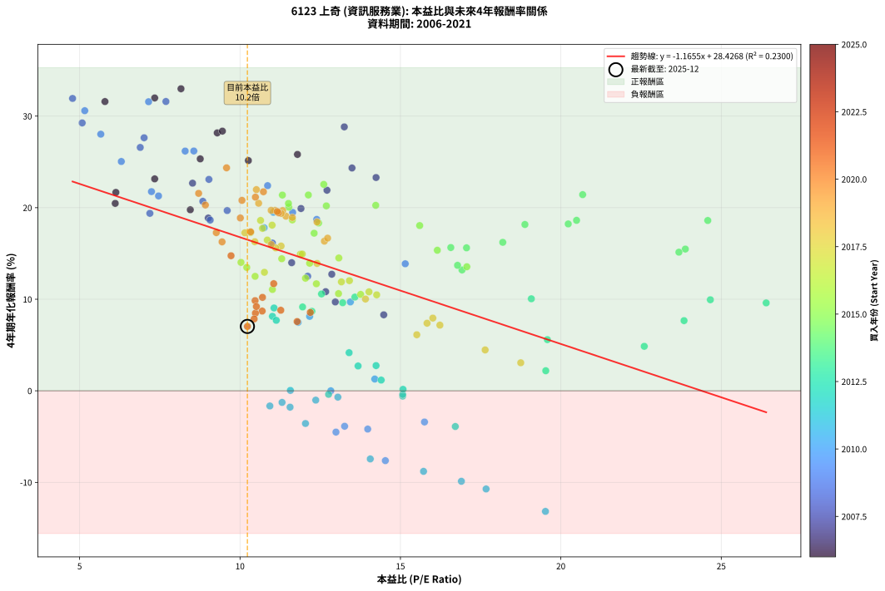
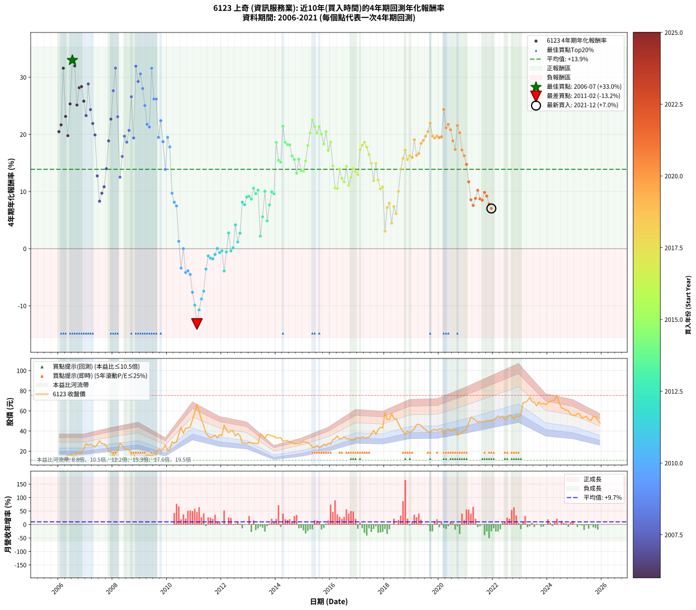

# 6123 上奇 - 本益比與未來報酬率分析

!!! info "報告資訊"
    - **股票代號**: 6123
    - **公司名稱**: 上奇
    - **產業別**: 資訊服務業
    - **分析期間**: 2006-2021 (192 個數據點)
    - **資料來源**: Type 12 (ShowMonthlyK_ChartFlow) 月收盤價與本益比
    - **報酬率口徑**: 含現金股利 (簡化: 年度合計，假設每年7/1入帳)
    - **報告生成時間**: 2026-01-05 21:11:45 CST

## 📈 視覺化圖表

### 圖表1: 本益比 vs 未來報酬率關係

*圖表1：6123 上奇 本益比與4年期未來報酬率關係 (2006-2021)*

### 圖表2: 歷年買入時點的4年期實際報酬率

*圖表2：6123 上奇 歷年買入時點的4年期實際報酬率 (2006-2021)*

## 📍 買點訊號說明

本報告提供兩種買點提示訊號（顯示於圖表2的股價子圖中）：

### ▲ 小綠色三角形（回測驗證）
- **計算方式**: 使用全部歷史資料計算本益比第25百分位數
- **用途**: 事後驗證，顯示歷史上哪些時點確實為低估區
- **限制**: 當下無法判斷，僅供回測參考
- **特性**: 後見之明（Look-Ahead Bias）

### ▲ 小橘色三角形（即時訊號）
- **計算方式**: 使用截至當月的過去5年資料計算本益比第25百分位數
- **用途**: 實際投資決策，當時即可判斷
- **優勢**: 可操作性強，符合實務需求
- **特性**: 無後見之明，滾動窗口計算

!!! tip "如何使用兩種訊號"
    - **綠色▲** 幫助理解歷史估值機會，驗證策略有效性
    - **橘色▲** 可作為實際買進參考，但仍需搭配基本面分析
    - 兩種訊號重疊時，表示即時判斷與事後驗證一致，信心度較高
    - 僅有綠色▲時，表示當時無法判斷（需要未來資料才能確認）
    - 僅有橘色▲時，表示即時判斷為買點，但事後可能不是最佳時機

## 📊 估值分析摘要

| 指標 | 數值 |
|:---:|:---:|
| **目前本益比** (2021-12) | **10.23 倍** |
| **歷史平均本益比** | 12.47 倍 |
| **估值水準** | 🟡 合理範圍 |
| **預期4年年化報酬率** | **+16.50%** |
| **歷史平均報酬率** | +13.89% |
| **相關係數 (R²)** | 0.2300 |
| **趨勢線斜率** | -1.1655 |

!!! abstract "核心洞察"
    目前本益比接近歷史平均，預期報酬率符合長期趨勢

    根據歷史數據回測，6123 上奇 在目前本益比 **10.2倍** 的估值水準下，
    預期未來4年年化報酬率約為 **+16.5%**。

    **重要提醒**: 本分析基於歷史數據統計，實際報酬率會受到公司基本面變化、產業趨勢、
    總體經濟環境等多重因素影響。R² = 0.23 表示本益比可解釋約 23.0% 的報酬率變異。

## 📈 歷史估值統計

### 最佳買點 (最高報酬率)

| 項目 | 數值 |
|:---:|:---:|
| 起始時間 | 2006-07 |
| 當時本益比 | 8.16 倍 |
| 起始價格 | 15.5 元 |
| 4年後價格 | 43.6 元 |
| **4年年化報酬率** | **+32.99%** |

### 最差買點 (最低報酬率)

| 項目 | 數值 |
|:---:|:---:|
| 起始時間 | 2011-02 |
| 當時本益比 | 19.52 倍 |
| 起始價格 | 66.5 元 |
| 4年後價格 | 28.8 元 |
| **4年年化報酬率** | **-13.17%** |

## 🎯 投資啟示

### 本益比與報酬率關係

趨勢線方程式: **y = -1.1655x + 28.4268**

!!! warning "強負相關"
    本益比與未來報酬率呈現強負相關。在高本益比時期買入，未來報酬率顯著較低；
    在低本益比時期買入，未來報酬率顯著較高。**估值紀律至關重要**。

### 估值區間建議

基於歷史數據分析:

- **🟢 低估區** (P/E < 10.0): 預期報酬率較高，可考慮增加持股
- **🟡 合理區** (P/E 10.0-15.0): 預期報酬率符合長期趨勢，正常持有
- **🔴 高估區** (P/E > 15.0): 預期報酬率較低，可考慮減碼或觀望

!!! danger "風險提示"
    - 過去表現不代表未來結果
    - 本分析假設公司基本面無重大結構性變化
    - 產業環境劇變可能使歷史規律失效
    - 應結合公司財報、產業趨勢、總體經濟等多重因素綜合判斷

!!! success "長期投資觀點"
    歷史數據顯示，在合理或低估的估值水準買入並長期持有，
    往往能獲得較佳的投資報酬。**耐心等待好價格**是價值投資的核心原則。

## 📊 數據品質

- **資料來源**: GoodInfo.tw Type 12 (ShowMonthlyK_ChartFlow)
- **資料頻率**: 月度收盤價與本益比
- **回測期間**: 2006-2021
- **數據點數量**: 192 個 (每個點代表一次4年期回測)

### 計算方法說明

1. **4年期年化報酬率**:
   - 對每個歷史時點，計算其後4年的實際投資報酬率
   - 期末價值(不含股利): 期末價格
   - 期末價值(含現金股利): 期末價格 + 持有期間內的現金股利合計 (簡化: 年度合計，假設每年7/1入帳)
   - 公式: 年化報酬率 = [(期末價值/期初價格)^(1/年數) - 1] × 100%

2. **本益比 (P/E Ratio)**:
   - 使用當時的月收盤價與EPS計算
   - 資料來源: Type 12 月度河流圖本益比數據

3. **趨勢線 (Linear Regression)**:
   - 使用最小平方法擬合線性趨勢線
   - R²值衡量本益比對報酬率的解釋能力

---

*本報告由 Stock Analysis System v1.9.0 自動生成*
*數據更新時間: 2026-01-05 21:11:45 CST*

## 📋 月度回測明細表

（每一列對應時間線圖中的一個買入點；可用來對照 SVG 圖上的每個點。）

| 買入月份 | 賣出月份 | 回測期限_年 | 實際持有年數 | 買入本益比_倍 | 買入收盤價_元 | 賣出收盤價_元 | 現金股利合計_元 | 總報酬率_pct | 年化報酬率_pct |
| --- | --- | --- | --- | --- | --- | --- | --- | --- | --- |
| 2006-01 | 2010-01 | 4 | 4.000 | 6.11 | 11.60 | 20.55 | 3.88 | +110.61 | +20.47 |
| 2006-02 | 2010-02 | 4 | 4.000 | 6.13 | 11.65 | 21.65 | 3.88 | +119.15 | +21.67 |
| 2006-03 | 2010-03 | 4 | 4.000 | 5.79 | 11.00 | 29.10 | 3.88 | +199.83 | +31.59 |
| 2006-04 | 2010-04 | 4 | 4.000 | 7.34 | 13.95 | 28.20 | 3.88 | +129.97 | +23.15 |
| 2006-05 | 2010-05 | 4 | 4.000 | 8.45 | 16.05 | 29.15 | 3.88 | +105.80 | +19.77 |
| 2006-06 | 2010-06 | 4 | 4.000 | 8.76 | 16.65 | 37.20 | 3.88 | +146.73 | +25.33 |
| 2006-07 | 2010-07 | 4 | 4.000 | 8.16 | 15.50 | 43.65 | 4.83 | +212.78 | +32.99 |
| 2006-08 | 2010-08 | 4 | 4.000 | 7.34 | 13.95 | 37.50 | 4.83 | +203.45 | +31.98 |
| 2006-09 | 2010-09 | 4 | 4.000 | 10.26 | 19.50 | 43.00 | 4.83 | +145.29 | +25.15 |
| 2006-10 | 2010-10 | 4 | 4.000 | 9.29 | 17.65 | 42.80 | 4.83 | +169.86 | +28.17 |
| 2006-11 | 2010-11 | 4 | 4.000 | 9.45 | 17.95 | 43.90 | 4.83 | +171.48 | +28.36 |
| 2006-12 | 2010-12 | 4 | 4.000 | 11.79 | 22.40 | 51.30 | 4.83 | +150.58 | +25.82 |
| 2007-01 | 2011-01 | 4 | 4.000 | 14.24 | 27.45 | 58.60 | 4.83 | +131.08 | +23.29 |
| 2007-02 | 2011-02 | 4 | 4.000 | 13.25 | 25.90 | 66.50 | 4.83 | +175.41 | +28.82 |
| 2007-03 | 2011-03 | 4 | 4.000 | 13.49 | 26.75 | 59.10 | 4.83 | +138.99 | +24.34 |
| 2007-04 | 2011-04 | 4 | 4.000 | 12.71 | 25.55 | 51.60 | 4.83 | +120.86 | +21.91 |
| 2007-05 | 2011-05 | 4 | 4.000 | 11.90 | 24.25 | 45.30 | 4.83 | +106.73 | +19.91 |
| 2007-06 | 2011-06 | 4 | 4.000 | 12.86 | 26.55 | 38.05 | 4.83 | +61.51 | +12.73 |
| 2007-07 | 2011-07 | 4 | 4.000 | 14.48 | 30.30 | 35.05 | 6.63 | +37.57 | +8.30 |
| 2007-08 | 2011-08 | 4 | 4.000 | 12.97 | 27.50 | 33.20 | 6.63 | +44.85 | +9.71 |
| 2007-09 | 2011-09 | 4 | 4.000 | 12.67 | 27.20 | 34.40 | 6.63 | +50.86 | +10.83 |
| 2007-10 | 2011-10 | 4 | 4.000 | 11.61 | 25.25 | 36.00 | 6.63 | +68.84 | +13.99 |
| 2007-11 | 2011-11 | 4 | 4.000 | 9.01 | 19.85 | 33.00 | 6.63 | +99.66 | +18.87 |
| 2007-12 | 2011-12 | 4 | 4.000 | 8.52 | 19.00 | 36.40 | 6.63 | +126.49 | +22.68 |
| 2008-01 | 2012-01 | 4 | 4.000 | 7.01 | 15.80 | 35.30 | 6.63 | +165.40 | +27.64 |
| 2008-02 | 2012-02 | 4 | 4.000 | 7.69 | 17.50 | 45.85 | 6.63 | +199.90 | +31.60 |
| 2008-03 | 2012-03 | 4 | 4.000 | 9.03 | 20.75 | 41.00 | 6.63 | +129.56 | +23.09 |
| 2008-04 | 2012-04 | 4 | 4.000 | 12.11 | 28.10 | 38.40 | 6.63 | +60.26 | +12.51 |
| 2008-05 | 2012-05 | 4 | 4.000 | 11.01 | 25.80 | 40.30 | 6.63 | +81.91 | +16.14 |
| 2008-06 | 2012-06 | 4 | 4.000 | 9.60 | 22.70 | 39.95 | 6.63 | +105.21 | +19.69 |
| 2008-07 | 2012-07 | 4 | 4.000 | 9.07 | 21.65 | 35.20 | 7.70 | +98.15 | +18.65 |
| 2008-08 | 2012-08 | 4 | 4.000 | 8.84 | 21.30 | 37.50 | 7.70 | +112.21 | +20.70 |
| 2008-09 | 2012-09 | 4 | 4.000 | 6.89 | 16.75 | 35.30 | 7.70 | +156.72 | +26.58 |
| 2008-10 | 2012-10 | 4 | 4.000 | 7.19 | 17.65 | 28.15 | 7.70 | +103.12 | +19.38 |
| 2008-11 | 2012-11 | 4 | 4.000 | 4.78 | 11.85 | 28.20 | 7.70 | +202.95 | +31.93 |
| 2008-12 | 2012-12 | 4 | 4.000 | 5.08 | 12.70 | 27.75 | 7.70 | +179.13 | +29.26 |
| 2009-01 | 2013-01 | 4 | 4.000 | 5.16 | 12.55 | 28.80 | 7.70 | +190.84 | +30.59 |
| 2009-02 | 2013-02 | 4 | 4.000 | 5.66 | 13.40 | 28.30 | 7.70 | +168.66 | +28.03 |
| 2009-03 | 2013-03 | 4 | 4.000 | 6.30 | 14.50 | 27.75 | 7.70 | +144.48 | +25.04 |
| 2009-04 | 2013-04 | 4 | 4.000 | 7.24 | 16.20 | 27.90 | 7.70 | +119.75 | +21.75 |
| 2009-05 | 2013-05 | 4 | 4.000 | 7.46 | 16.20 | 27.35 | 7.70 | +116.36 | +21.28 |
| 2009-06 | 2013-06 | 4 | 4.000 | 7.15 | 15.05 | 37.40 | 7.70 | +199.67 | +31.57 |
| 2009-07 | 2013-07 | 4 | 4.000 | 8.56 | 17.45 | 35.55 | 8.70 | +153.58 | +26.19 |
| 2009-08 | 2013-08 | 4 | 4.000 | 8.29 | 16.35 | 32.75 | 8.70 | +153.52 | +26.18 |
| 2009-09 | 2013-09 | 4 | 4.000 | 11.64 | 22.20 | 36.55 | 8.70 | +103.83 | +19.49 |
| 2009-10 | 2013-10 | 4 | 4.000 | 10.86 | 20.00 | 36.20 | 8.70 | +124.50 | +22.41 |
| 2009-11 | 2013-11 | 4 | 4.000 | 12.39 | 22.00 | 35.00 | 8.70 | +98.64 | +18.72 |
| 2009-12 | 2013-12 | 4 | 4.000 | 15.15 | 25.90 | 34.85 | 8.70 | +68.15 | +13.87 |
| 2010-01 | 2014-01 | 4 | 4.000 | 11.04 | 20.55 | 33.20 | 8.70 | +103.89 | +19.50 |
| 2010-02 | 2014-02 | 4 | 4.000 | 10.75 | 21.65 | 33.00 | 8.70 | +92.61 | +17.81 |
| 2010-03 | 2014-03 | 4 | 4.000 | 13.44 | 29.10 | 33.45 | 8.70 | +44.85 | +9.70 |
| 2010-04 | 2014-04 | 4 | 4.000 | 12.17 | 28.20 | 29.85 | 8.70 | +36.70 | +8.13 |
| 2010-05 | 2014-05 | 4 | 4.000 | 11.81 | 29.15 | 30.20 | 8.70 | +33.45 | +7.48 |
| 2010-06 | 2014-06 | 4 | 4.000 | 14.20 | 37.20 | 30.45 | 8.70 | +5.24 | +1.29 |
| 2010-07 | 2014-07 | 4 | 4.000 | 15.75 | 43.65 | 29.00 | 9.00 | -12.94 | -3.41 |
| 2010-08 | 2014-08 | 4 | 4.000 | 12.83 | 37.50 | 28.50 | 9.00 | +0.00 | +0.00 |
| 2010-09 | 2014-09 | 4 | 4.000 | 13.98 | 43.00 | 27.25 | 9.00 | -15.70 | -4.18 |
| 2010-10 | 2014-10 | 4 | 4.000 | 13.26 | 42.80 | 27.55 | 9.00 | -14.60 | -3.87 |
| 2010-11 | 2014-11 | 4 | 4.000 | 12.99 | 43.90 | 27.50 | 9.00 | -16.86 | -4.51 |
| 2010-12 | 2014-12 | 4 | 4.000 | 14.53 | 51.30 | 28.35 | 9.00 | -27.19 | -7.63 |
| 2011-01 | 2015-01 | 4 | 4.000 | 16.90 | 58.60 | 29.65 | 9.00 | -34.04 | -9.88 |
| 2011-02 | 2015-02 | 4 | 4.000 | 19.52 | 66.50 | 28.80 | 9.00 | -43.16 | -13.17 |
| 2011-03 | 2015-03 | 4 | 4.000 | 17.67 | 59.10 | 28.55 | 9.00 | -36.46 | -10.72 |
| 2011-04 | 2015-04 | 4 | 4.000 | 15.72 | 51.60 | 26.70 | 9.00 | -30.81 | -8.80 |
| 2011-05 | 2015-05 | 4 | 4.000 | 14.06 | 45.30 | 24.25 | 9.00 | -26.60 | -7.44 |
| 2011-06 | 2015-06 | 4 | 4.000 | 12.04 | 38.05 | 23.90 | 9.00 | -13.53 | -3.57 |
| 2011-07 | 2015-07 | 4 | 4.000 | 11.31 | 35.05 | 25.60 | 7.71 | -4.98 | -1.27 |
| 2011-08 | 2015-08 | 4 | 4.000 | 10.93 | 33.20 | 23.35 | 7.71 | -6.46 | -1.66 |
| 2011-09 | 2015-09 | 4 | 4.000 | 11.56 | 34.40 | 24.30 | 7.71 | -6.96 | -1.79 |
| 2011-10 | 2015-10 | 4 | 4.000 | 12.36 | 36.00 | 26.85 | 7.71 | -4.01 | -1.02 |
| 2011-11 | 2015-11 | 4 | 4.000 | 11.57 | 33.00 | 25.35 | 7.71 | +0.17 | +0.04 |
| 2011-12 | 2015-12 | 4 | 4.000 | 13.05 | 36.40 | 27.70 | 7.71 | -2.73 | -0.69 |
| 2012-01 | 2016-01 | 4 | 4.000 | 12.76 | 35.30 | 27.05 | 7.71 | -1.54 | -0.39 |
| 2012-02 | 2016-02 | 4 | 4.000 | 16.71 | 45.85 | 31.40 | 7.71 | -14.71 | -3.90 |
| 2012-03 | 2016-03 | 4 | 4.000 | 15.07 | 41.00 | 32.35 | 7.71 | -2.30 | -0.58 |
| 2012-04 | 2016-04 | 4 | 4.000 | 14.24 | 38.40 | 35.10 | 7.71 | +11.47 | +2.75 |
| 2012-05 | 2016-05 | 4 | 4.000 | 15.07 | 40.30 | 31.95 | 7.71 | -1.60 | -0.40 |
| 2012-06 | 2016-06 | 4 | 4.000 | 15.08 | 39.95 | 32.50 | 7.71 | +0.64 | +0.16 |
| 2012-07 | 2016-07 | 4 | 4.000 | 13.40 | 35.20 | 34.35 | 7.09 | +17.72 | +4.16 |
| 2012-08 | 2016-08 | 4 | 4.000 | 14.40 | 37.50 | 32.20 | 7.09 | +4.77 | +1.17 |
| 2012-09 | 2016-09 | 4 | 4.000 | 13.68 | 35.30 | 32.20 | 7.09 | +11.30 | +2.71 |
| 2012-10 | 2016-10 | 4 | 4.000 | 11.01 | 28.15 | 31.40 | 7.09 | +36.72 | +8.13 |
| 2012-11 | 2016-11 | 4 | 4.000 | 11.13 | 28.20 | 30.85 | 7.09 | +34.53 | +7.70 |
| 2012-12 | 2016-12 | 4 | 4.000 | 11.06 | 27.75 | 32.15 | 7.09 | +41.40 | +9.05 |
| 2013-01 | 2017-01 | 4 | 4.000 | 11.95 | 28.80 | 33.80 | 7.09 | +41.97 | +9.16 |
| 2013-02 | 2017-02 | 4 | 4.000 | 12.24 | 28.30 | 32.40 | 7.09 | +39.53 | +8.69 |
| 2013-03 | 2017-03 | 4 | 4.000 | 12.54 | 27.75 | 34.40 | 7.09 | +49.51 | +10.58 |
| 2013-04 | 2017-04 | 4 | 4.000 | 13.20 | 27.90 | 33.20 | 7.09 | +44.40 | +9.62 |
| 2013-05 | 2017-05 | 4 | 4.000 | 13.58 | 27.35 | 33.30 | 7.09 | +47.67 | +10.24 |
| 2013-06 | 2017-06 | 4 | 4.000 | 19.53 | 37.40 | 33.70 | 7.09 | +9.06 | +2.19 |
| 2013-07 | 2017-07 | 4 | 4.000 | 19.58 | 35.55 | 36.80 | 7.39 | +24.30 | +5.59 |
| 2013-08 | 2017-08 | 4 | 4.000 | 19.08 | 32.75 | 40.65 | 7.39 | +46.68 | +10.05 |
| 2013-09 | 2017-09 | 4 | 4.000 | 22.60 | 36.55 | 36.80 | 7.39 | +20.90 | +4.86 |
| 2013-10 | 2017-10 | 4 | 4.000 | 23.84 | 36.20 | 41.25 | 7.39 | +34.36 | +7.66 |
| 2013-11 | 2017-11 | 4 | 4.000 | 24.66 | 35.00 | 43.75 | 7.39 | +46.11 | +9.94 |
| 2013-12 | 2017-12 | 4 | 4.000 | 26.40 | 34.85 | 42.90 | 7.39 | +44.30 | +9.60 |
| 2014-01 | 2018-01 | 4 | 4.000 | 24.58 | 33.20 | 58.30 | 7.39 | +97.86 | +18.60 |
| 2014-02 | 2018-02 | 4 | 4.000 | 23.88 | 33.00 | 51.30 | 7.39 | +77.84 | +15.48 |
| 2014-03 | 2018-03 | 4 | 4.000 | 23.68 | 33.45 | 51.40 | 7.39 | +75.75 | +15.14 |
| 2014-04 | 2018-04 | 4 | 4.000 | 20.68 | 29.85 | 57.50 | 7.39 | +117.38 | +21.42 |
| 2014-05 | 2018-05 | 4 | 4.000 | 20.49 | 30.20 | 52.40 | 7.39 | +97.97 | +18.62 |
| 2014-06 | 2018-06 | 4 | 4.000 | 20.23 | 30.45 | 52.10 | 7.39 | +95.36 | +18.23 |
| 2014-07 | 2018-07 | 4 | 4.000 | 18.88 | 29.00 | 47.45 | 9.09 | +94.96 | +18.16 |
| 2014-08 | 2018-08 | 4 | 4.000 | 18.19 | 28.50 | 42.90 | 9.09 | +82.41 | +16.22 |
| 2014-09 | 2018-09 | 4 | 4.000 | 17.06 | 27.25 | 39.60 | 9.09 | +78.67 | +15.61 |
| 2014-10 | 2018-10 | 4 | 4.000 | 16.92 | 27.55 | 36.15 | 9.09 | +64.20 | +13.20 |
| 2014-11 | 2018-11 | 4 | 4.000 | 16.57 | 27.50 | 40.10 | 9.09 | +78.87 | +15.65 |
| 2014-12 | 2018-12 | 4 | 4.000 | 16.78 | 28.35 | 38.30 | 9.09 | +67.15 | +13.70 |
| 2015-01 | 2019-01 | 4 | 4.000 | 17.07 | 29.65 | 40.20 | 9.09 | +66.23 | +13.55 |
| 2015-02 | 2019-02 | 4 | 4.000 | 16.15 | 28.80 | 41.90 | 9.09 | +77.04 | +15.35 |
| 2015-03 | 2019-03 | 4 | 4.000 | 15.60 | 28.55 | 46.35 | 9.09 | +94.18 | +18.05 |
| 2015-04 | 2019-04 | 4 | 4.000 | 14.23 | 26.70 | 46.75 | 9.09 | +109.13 | +20.26 |
| 2015-05 | 2019-05 | 4 | 4.000 | 12.61 | 24.25 | 45.60 | 9.09 | +125.52 | +22.54 |
| 2015-06 | 2019-06 | 4 | 4.000 | 12.13 | 23.90 | 42.80 | 9.09 | +117.10 | +21.39 |
| 2015-07 | 2019-07 | 4 | 4.000 | 12.69 | 25.60 | 41.75 | 11.68 | +108.72 | +20.20 |
| 2015-08 | 2019-08 | 4 | 4.000 | 11.32 | 23.35 | 39.00 | 11.68 | +117.05 | +21.38 |
| 2015-09 | 2019-09 | 4 | 4.000 | 11.52 | 24.30 | 38.80 | 11.68 | +107.74 | +20.06 |
| 2015-10 | 2019-10 | 4 | 4.000 | 12.45 | 26.85 | 40.95 | 11.68 | +96.02 | +18.32 |
| 2015-11 | 2019-11 | 4 | 4.000 | 11.51 | 25.35 | 41.70 | 11.68 | +110.58 | +20.46 |
| 2015-12 | 2019-12 | 4 | 4.000 | 12.31 | 27.70 | 40.60 | 11.68 | +88.74 | +17.21 |
| 2016-01 | 2020-01 | 4 | 4.000 | 11.63 | 27.05 | 41.95 | 11.68 | +98.27 | +18.66 |
| 2016-02 | 2020-02 | 4 | 4.000 | 13.08 | 31.40 | 42.30 | 11.68 | +71.92 | +14.51 |
| 2016-03 | 2020-03 | 4 | 4.000 | 13.07 | 32.35 | 36.75 | 11.68 | +49.71 | +10.62 |
| 2016-04 | 2020-04 | 4 | 4.000 | 13.76 | 35.10 | 40.70 | 11.68 | +49.24 | +10.53 |
| 2016-05 | 2020-05 | 4 | 4.000 | 12.17 | 31.95 | 42.15 | 11.68 | +68.49 | +13.93 |
| 2016-06 | 2020-06 | 4 | 4.000 | 12.04 | 32.50 | 40.00 | 11.68 | +59.02 | +12.30 |
| 2016-07 | 2020-07 | 4 | 4.000 | 12.38 | 34.35 | 40.25 | 13.20 | +55.60 | +11.69 |
| 2016-08 | 2020-08 | 4 | 4.000 | 11.30 | 32.20 | 42.00 | 13.20 | +71.43 | +14.42 |
| 2016-09 | 2020-09 | 4 | 4.000 | 11.01 | 32.20 | 35.80 | 13.20 | +52.17 | +11.07 |
| 2016-10 | 2020-10 | 4 | 4.000 | 10.47 | 31.40 | 37.10 | 13.20 | +60.19 | +12.50 |
| 2016-11 | 2020-11 | 4 | 4.000 | 10.03 | 30.85 | 38.95 | 13.20 | +69.04 | +14.02 |
| 2016-12 | 2020-12 | 4 | 4.000 | 10.21 | 32.15 | 40.10 | 13.20 | +65.79 | +13.47 |
| 2017-01 | 2021-01 | 4 | 4.000 | 10.76 | 33.80 | 41.80 | 13.20 | +62.72 | +12.94 |
| 2017-02 | 2021-02 | 4 | 4.000 | 10.33 | 32.40 | 48.10 | 13.20 | +89.20 | +17.28 |
| 2017-03 | 2021-03 | 4 | 4.000 | 11.00 | 34.40 | 53.70 | 13.20 | +94.48 | +18.09 |
| 2017-04 | 2021-04 | 4 | 4.000 | 10.64 | 33.20 | 52.50 | 13.20 | +97.89 | +18.61 |
| 2017-05 | 2021-05 | 4 | 4.000 | 10.70 | 33.30 | 50.80 | 13.20 | +92.19 | +17.74 |
| 2017-06 | 2021-06 | 4 | 4.000 | 10.85 | 33.70 | 48.80 | 13.20 | +83.98 | +16.46 |
| 2017-07 | 2021-07 | 4 | 4.000 | 11.88 | 36.80 | 49.30 | 14.88 | +74.39 | +14.92 |
| 2017-08 | 2021-08 | 4 | 4.000 | 13.16 | 40.65 | 48.85 | 14.88 | +56.77 | +11.90 |
| 2017-09 | 2021-09 | 4 | 4.000 | 11.94 | 36.80 | 49.35 | 14.88 | +74.53 | +14.94 |
| 2017-10 | 2021-10 | 4 | 4.000 | 13.41 | 41.25 | 50.10 | 14.88 | +57.52 | +12.03 |
| 2017-11 | 2021-11 | 4 | 4.000 | 14.26 | 43.75 | 50.30 | 14.88 | +48.98 | +10.48 |
| 2017-12 | 2021-12 | 4 | 4.000 | 14.02 | 42.90 | 49.80 | 14.88 | +50.76 | +10.81 |
| 2018-01 | 2022-01 | 4 | 4.000 | 18.75 | 58.30 | 50.90 | 14.88 | +12.83 | +3.06 |
| 2018-02 | 2022-02 | 4 | 4.000 | 16.23 | 51.30 | 52.80 | 14.88 | +31.92 | +7.17 |
| 2018-03 | 2022-03 | 4 | 4.000 | 16.01 | 51.40 | 54.90 | 14.88 | +35.75 | +7.94 |
| 2018-04 | 2022-04 | 4 | 4.000 | 17.64 | 57.50 | 53.60 | 14.88 | +19.09 | +4.46 |
| 2018-05 | 2022-05 | 4 | 4.000 | 15.83 | 52.40 | 54.80 | 14.88 | +32.97 | +7.38 |
| 2018-06 | 2022-06 | 4 | 4.000 | 15.51 | 52.10 | 51.20 | 14.88 | +26.83 | +6.12 |
| 2018-07 | 2022-07 | 4 | 4.000 | 13.91 | 47.45 | 53.10 | 16.43 | +46.53 | +10.02 |
| 2018-08 | 2022-08 | 4 | 4.000 | 12.40 | 42.90 | 55.80 | 16.43 | +68.37 | +13.91 |
| 2018-09 | 2022-09 | 4 | 4.000 | 11.28 | 39.60 | 54.80 | 16.43 | +79.87 | +15.81 |
| 2018-10 | 2022-10 | 4 | 4.000 | 10.15 | 36.15 | 51.90 | 16.43 | +89.02 | +17.25 |
| 2018-11 | 2022-11 | 4 | 4.000 | 11.11 | 40.10 | 55.20 | 16.43 | +78.63 | +15.61 |
| 2018-12 | 2022-12 | 4 | 4.000 | 10.46 | 38.30 | 53.60 | 16.43 | +82.84 | +16.28 |
| 2019-01 | 2023-01 | 4 | 4.000 | 10.97 | 40.20 | 56.30 | 16.43 | +80.92 | +15.98 |
| 2019-02 | 2023-02 | 4 | 4.000 | 11.43 | 41.90 | 67.80 | 16.43 | +101.02 | +19.07 |
| 2019-03 | 2023-03 | 4 | 4.000 | 12.63 | 46.35 | 68.50 | 16.43 | +83.23 | +16.35 |
| 2019-04 | 2023-04 | 4 | 4.000 | 12.73 | 46.75 | 70.20 | 16.43 | +85.30 | +16.67 |
| 2019-05 | 2023-05 | 4 | 4.000 | 12.40 | 45.60 | 73.30 | 16.43 | +96.77 | +18.44 |
| 2019-06 | 2023-06 | 4 | 4.000 | 11.63 | 42.80 | 69.20 | 16.43 | +100.07 | +18.93 |
| 2019-07 | 2023-07 | 4 | 4.000 | 11.33 | 41.75 | 68.50 | 17.18 | +105.22 | +19.69 |
| 2019-08 | 2023-08 | 4 | 4.000 | 10.58 | 39.00 | 65.00 | 17.18 | +110.72 | +20.48 |
| 2019-09 | 2023-09 | 4 | 4.000 | 10.51 | 38.80 | 68.70 | 17.18 | +121.34 | +21.97 |
| 2019-10 | 2023-10 | 4 | 4.000 | 11.09 | 40.95 | 66.90 | 17.18 | +105.32 | +19.70 |
| 2019-11 | 2023-11 | 4 | 4.000 | 11.28 | 41.70 | 67.50 | 17.18 | +103.07 | +19.37 |
| 2019-12 | 2023-12 | 4 | 4.000 | 10.97 | 40.60 | 66.20 | 17.18 | +105.37 | +19.71 |
| 2020-01 | 2024-01 | 4 | 4.000 | 11.20 | 41.95 | 68.20 | 17.18 | +103.53 | +19.44 |
| 2020-02 | 2024-02 | 4 | 4.000 | 11.16 | 42.30 | 69.30 | 17.18 | +104.44 | +19.58 |
| 2020-03 | 2024-03 | 4 | 4.000 | 9.58 | 36.75 | 70.70 | 17.18 | +139.13 | +24.35 |
| 2020-04 | 2024-04 | 4 | 4.000 | 10.48 | 40.70 | 70.50 | 17.18 | +115.43 | +21.15 |
| 2020-05 | 2024-05 | 4 | 4.000 | 10.73 | 42.15 | 75.40 | 17.18 | +119.64 | +21.74 |
| 2020-06 | 2024-06 | 4 | 4.000 | 10.06 | 40.00 | 68.00 | 17.18 | +112.95 | +20.80 |
| 2020-07 | 2024-07 | 4 | 4.000 | 10.01 | 40.25 | 62.90 | 17.48 | +99.70 | +18.88 |
| 2020-08 | 2024-08 | 4 | 4.000 | 10.33 | 42.00 | 62.20 | 17.48 | +89.71 | +17.36 |
| 2020-09 | 2024-09 | 4 | 4.000 | 8.71 | 35.80 | 60.70 | 17.48 | +118.38 | +21.56 |
| 2020-10 | 2024-10 | 4 | 4.000 | 8.92 | 37.10 | 60.20 | 17.48 | +109.38 | +20.29 |
| 2020-11 | 2024-11 | 4 | 4.000 | 9.26 | 38.95 | 56.20 | 17.48 | +89.16 | +17.28 |
| 2020-12 | 2024-12 | 4 | 4.000 | 9.44 | 40.10 | 55.80 | 17.48 | +82.74 | +16.27 |
| 2021-01 | 2025-01 | 4 | 4.000 | 9.72 | 41.80 | 55.00 | 17.48 | +73.39 | +14.75 |
| 2021-02 | 2025-02 | 4 | 4.000 | 11.05 | 48.10 | 57.40 | 17.48 | +55.67 | +11.70 |
| 2021-03 | 2025-03 | 4 | 4.000 | 12.19 | 53.70 | 57.10 | 17.48 | +38.88 | +8.56 |
| 2021-04 | 2025-04 | 4 | 4.000 | 11.78 | 52.50 | 52.80 | 17.48 | +33.86 | +7.56 |
| 2021-05 | 2025-05 | 4 | 4.000 | 11.27 | 50.80 | 53.70 | 17.48 | +40.12 | +8.80 |
| 2021-06 | 2025-06 | 4 | 4.000 | 10.70 | 48.80 | 54.50 | 17.48 | +47.50 | +10.20 |
| 2021-07 | 2025-07 | 4 | 4.000 | 10.69 | 49.30 | 51.50 | 17.35 | +39.66 | +8.71 |
| 2021-08 | 2025-08 | 4 | 4.000 | 10.48 | 48.85 | 50.30 | 17.35 | +38.49 | +8.48 |
| 2021-09 | 2025-09 | 4 | 4.000 | 10.47 | 49.35 | 54.50 | 17.35 | +45.60 | +9.85 |
| 2021-10 | 2025-10 | 4 | 4.000 | 10.51 | 50.10 | 53.90 | 17.35 | +42.22 | +9.20 |
| 2021-11 | 2025-11 | 4 | 4.000 | 10.44 | 50.30 | 50.70 | 17.35 | +35.29 | +7.85 |
| 2021-12 | 2025-12 | 4 | 4.000 | 10.23 | 49.80 | 48.00 | 17.35 | +31.23 | +7.03 |
