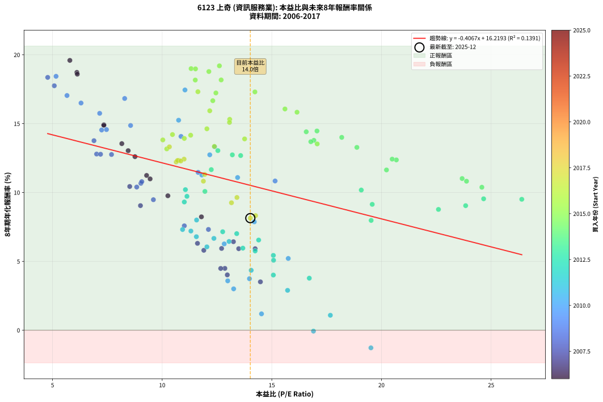
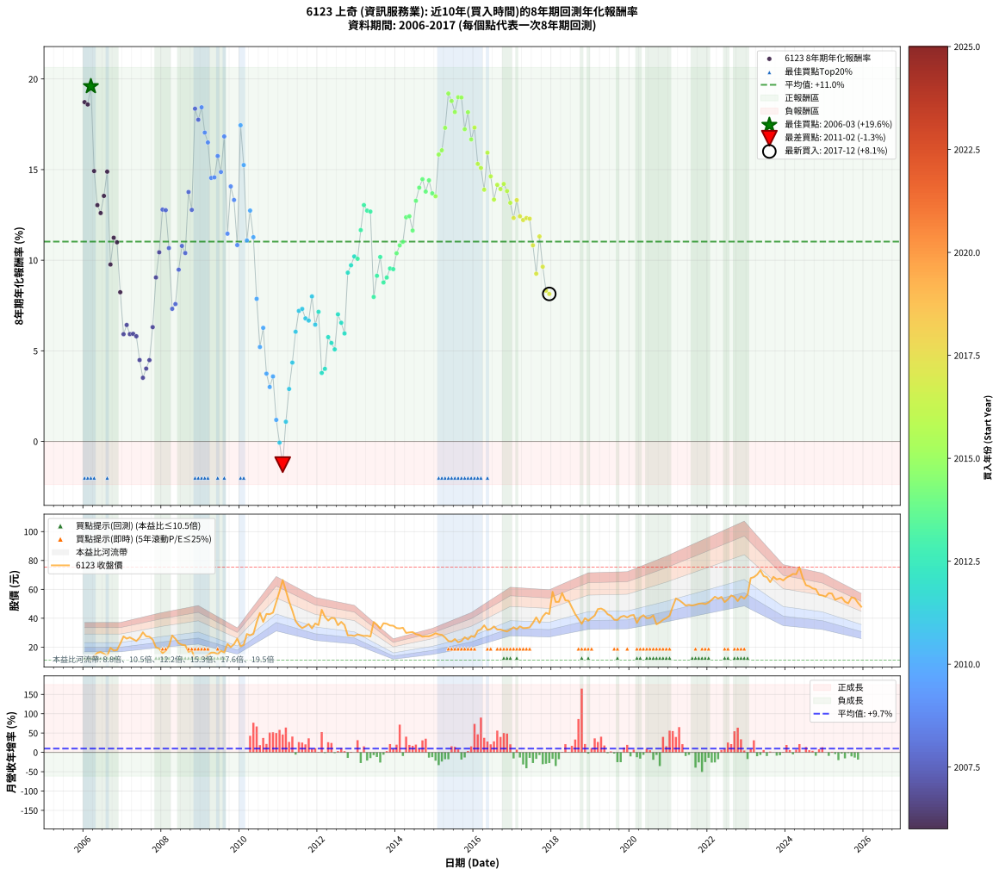

# 6123 上奇 - 本益比與未來報酬率分析

!!! info "報告資訊"
    - **股票代號**: 6123
    - **公司名稱**: 上奇
    - **產業別**: 資訊服務業
    - **分析期間**: 2006-2017 (144 個數據點)
    - **資料來源**: Type 12 (ShowMonthlyK_ChartFlow) 月收盤價與本益比
    - **報酬率口徑**: 含現金股利 (簡化: 年度合計，假設每年7/1入帳)
    - **報告生成時間**: 2026-01-12 21:17:58 CST

## 📈 視覺化圖表

### 圖表1: 本益比 vs 未來報酬率關係

*圖表1：6123 上奇 本益比與8年期未來報酬率關係 (2006-2017)*

### 圖表2: 歷年買入時點的8年期實際報酬率

*圖表2：6123 上奇 歷年買入時點的8年期實際報酬率 (2006-2017)*

## 📍 買點訊號說明

本報告提供兩種買點提示訊號（顯示於圖表2的股價子圖中）：

### ▲ 小綠色三角形（回測驗證）
- **計算方式**: 使用全部歷史資料計算本益比第25百分位數
- **用途**: 事後驗證，顯示歷史上哪些時點確實為低估區
- **限制**: 當下無法判斷，僅供回測參考
- **特性**: 後見之明（Look-Ahead Bias）

### ▲ 小橘色三角形（即時訊號）
- **計算方式**: 使用截至當月的過去5年資料計算本益比第25百分位數
- **用途**: 實際投資決策，當時即可判斷
- **優勢**: 可操作性強，符合實務需求
- **特性**: 無後見之明，滾動窗口計算

!!! tip "如何使用兩種訊號"
    - **綠色▲** 幫助理解歷史估值機會，驗證策略有效性
    - **橘色▲** 可作為實際買進參考，但仍需搭配基本面分析
    - 兩種訊號重疊時，表示即時判斷與事後驗證一致，信心度較高
    - 僅有綠色▲時，表示當時無法判斷（需要未來資料才能確認）
    - 僅有橘色▲時，表示即時判斷為買點，但事後可能不是最佳時機

## 📊 估值分析摘要

| 指標 | 數值 |
|:---:|:---:|
| **目前本益比** (2017-12) | **14.02 倍** |
| **歷史平均本益比** | 12.77 倍 |
| **估值水準** | 🟡 合理範圍 |
| **預期8年年化報酬率** | **+10.52%** |
| **歷史平均報酬率** | +11.03% |
| **相關係數 (R²)** | 0.1391 |
| **趨勢線斜率** | -0.4067 |

!!! abstract "核心洞察"
    目前本益比接近歷史平均，預期報酬率符合長期趨勢

    根據歷史數據回測，6123 上奇 在目前本益比 **14.0倍** 的估值水準下，
    預期未來8年年化報酬率約為 **+10.5%**。

    **重要提醒**: 本分析基於歷史數據統計，實際報酬率會受到公司基本面變化、產業趨勢、
    總體經濟環境等多重因素影響。R² = 0.14 表示本益比可解釋約 13.9% 的報酬率變異。

## 📈 歷史估值統計

### 最佳買點 (最高報酬率)

| 項目 | 數值 |
|:---:|:---:|
| 起始時間 | 2006-03 |
| 當時本益比 | 5.79 倍 |
| 起始價格 | 11.0 元 |
| 8年後價格 | 33.5 元 |
| **8年年化報酬率** | **+19.59%** |

### 最差買點 (最低報酬率)

| 項目 | 數值 |
|:---:|:---:|
| 起始時間 | 2011-02 |
| 當時本益比 | 19.52 倍 |
| 起始價格 | 66.5 元 |
| 8年後價格 | 41.9 元 |
| **8年年化報酬率** | **-1.28%** |

## 🎯 投資啟示

### 本益比與報酬率關係

趨勢線方程式: **y = -0.4067x + 16.2193**

!!! note "負相關"
    本益比與未來報酬率呈現負相關。較低的本益比通常帶來較高的未來報酬率，
    但相關性不算非常強。**估值仍是重要參考指標之一**。

### 估值區間建議

基於歷史數據分析:

- **🟢 低估區** (P/E < 10.2): 預期報酬率較高，可考慮增加持股
- **🟡 合理區** (P/E 10.2-15.3): 預期報酬率符合長期趨勢，正常持有
- **🔴 高估區** (P/E > 15.3): 預期報酬率較低，可考慮減碼或觀望

!!! danger "風險提示"
    - 過去表現不代表未來結果
    - 本分析假設公司基本面無重大結構性變化
    - 產業環境劇變可能使歷史規律失效
    - 應結合公司財報、產業趨勢、總體經濟等多重因素綜合判斷

!!! success "長期投資觀點"
    歷史數據顯示，在合理或低估的估值水準買入並長期持有，
    往往能獲得較佳的投資報酬。**耐心等待好價格**是價值投資的核心原則。

## 📊 數據品質

- **資料來源**: GoodInfo.tw Type 12 (ShowMonthlyK_ChartFlow)
- **資料頻率**: 月度收盤價與本益比
- **回測期間**: 2006-2017
- **數據點數量**: 144 個 (每個點代表一次8年期回測)

### 計算方法說明

1. **8年期年化報酬率**:
   - 對每個歷史時點，計算其後8年的實際投資報酬率
   - 期末價值(不含股利): 期末價格
   - 期末價值(含現金股利): 期末價格 + 持有期間內的現金股利合計 (簡化: 年度合計，假設每年7/1入帳)
   - 公式: 年化報酬率 = [(期末價值/期初價格)^(1/年數) - 1] × 100%

2. **本益比 (P/E Ratio)**:
   - 使用當時的月收盤價與EPS計算
   - 資料來源: Type 12 月度河流圖本益比數據

3. **趨勢線 (Linear Regression)**:
   - 使用最小平方法擬合線性趨勢線
   - R²值衡量本益比對報酬率的解釋能力

---

*本報告由 Stock Analysis System v1.9.0 自動生成*
*數據更新時間: 2026-01-12 21:17:58 CST*

## 📋 月度回測明細表

（每一列對應時間線圖中的一個買入點；可用來對照 SVG 圖上的每個點。）

| 買入月份 | 賣出月份 | 回測期限_年 | 實際持有年數 | 買入本益比_倍 | 買入收盤價_元 | 賣出收盤價_元 | 現金股利合計_元 | 總報酬率_pct | 年化報酬率_pct |
| --- | --- | --- | --- | --- | --- | --- | --- | --- | --- |
| 2006-01 | 2014-01 | 8 | 8.000 | 6.11 | 11.60 | 33.20 | 12.58 | +294.66 | +18.72 |
| 2006-02 | 2014-02 | 8 | 8.000 | 6.13 | 11.65 | 33.00 | 12.58 | +291.25 | +18.59 |
| 2006-03 | 2014-03 | 8 | 8.000 | 5.79 | 11.00 | 33.45 | 12.58 | +318.46 | +19.59 |
| 2006-04 | 2014-04 | 8 | 8.000 | 7.34 | 13.95 | 29.85 | 12.58 | +204.16 | +14.92 |
| 2006-05 | 2014-05 | 8 | 8.000 | 8.45 | 16.05 | 30.20 | 12.58 | +166.55 | +13.04 |
| 2006-06 | 2014-06 | 8 | 8.000 | 8.76 | 16.65 | 30.45 | 12.58 | +158.44 | +12.60 |
| 2006-07 | 2014-07 | 8 | 8.000 | 8.16 | 15.50 | 29.00 | 13.83 | +176.33 | +13.55 |
| 2006-08 | 2014-08 | 8 | 8.000 | 7.34 | 13.95 | 28.50 | 13.83 | +203.45 | +14.88 |
| 2006-09 | 2014-09 | 8 | 8.000 | 10.26 | 19.50 | 27.25 | 13.83 | +110.67 | +9.76 |
| 2006-10 | 2014-10 | 8 | 8.000 | 9.29 | 17.65 | 27.55 | 13.83 | +134.45 | +11.24 |
| 2006-11 | 2014-11 | 8 | 8.000 | 9.45 | 17.95 | 27.50 | 13.83 | +130.26 | +10.99 |
| 2006-12 | 2014-12 | 8 | 8.000 | 11.79 | 22.40 | 28.35 | 13.83 | +88.31 | +8.23 |
| 2007-01 | 2015-01 | 8 | 8.000 | 14.24 | 27.45 | 29.65 | 13.83 | +58.40 | +5.92 |
| 2007-02 | 2015-02 | 8 | 8.000 | 13.25 | 25.90 | 28.80 | 13.83 | +64.60 | +6.43 |
| 2007-03 | 2015-03 | 8 | 8.000 | 13.49 | 26.75 | 28.55 | 13.83 | +58.43 | +5.92 |
| 2007-04 | 2015-04 | 8 | 8.000 | 12.71 | 25.55 | 26.70 | 13.83 | +58.63 | +5.94 |
| 2007-05 | 2015-05 | 8 | 8.000 | 11.90 | 24.25 | 24.25 | 13.83 | +57.04 | +5.80 |
| 2007-06 | 2015-06 | 8 | 8.000 | 12.86 | 26.55 | 23.90 | 13.83 | +42.11 | +4.49 |
| 2007-07 | 2015-07 | 8 | 8.000 | 14.48 | 30.30 | 25.60 | 14.34 | +31.81 | +3.51 |
| 2007-08 | 2015-08 | 8 | 8.000 | 12.97 | 27.50 | 23.35 | 14.34 | +37.05 | +4.02 |
| 2007-09 | 2015-09 | 8 | 8.000 | 12.67 | 27.20 | 24.30 | 14.34 | +42.06 | +4.49 |
| 2007-10 | 2015-10 | 8 | 8.000 | 11.61 | 25.25 | 26.85 | 14.34 | +63.12 | +6.31 |
| 2007-11 | 2015-11 | 8 | 8.000 | 9.01 | 19.85 | 25.35 | 14.34 | +99.94 | +9.05 |
| 2007-12 | 2015-12 | 8 | 8.000 | 8.52 | 19.00 | 27.70 | 14.34 | +121.26 | +10.44 |
| 2008-01 | 2016-01 | 8 | 8.000 | 7.01 | 15.80 | 27.05 | 14.34 | +161.96 | +12.79 |
| 2008-02 | 2016-02 | 8 | 8.000 | 7.69 | 17.50 | 31.40 | 14.34 | +161.37 | +12.76 |
| 2008-03 | 2016-03 | 8 | 8.000 | 9.03 | 20.75 | 32.35 | 14.34 | +125.01 | +10.67 |
| 2008-04 | 2016-04 | 8 | 8.000 | 12.11 | 28.10 | 35.10 | 14.34 | +75.94 | +7.32 |
| 2008-05 | 2016-05 | 8 | 8.000 | 11.01 | 25.80 | 31.95 | 14.34 | +79.41 | +7.58 |
| 2008-06 | 2016-06 | 8 | 8.000 | 9.60 | 22.70 | 32.50 | 14.34 | +106.34 | +9.48 |
| 2008-07 | 2016-07 | 8 | 8.000 | 9.07 | 21.65 | 34.35 | 14.79 | +126.97 | +10.79 |
| 2008-08 | 2016-08 | 8 | 8.000 | 8.84 | 21.30 | 32.20 | 14.79 | +120.60 | +10.40 |
| 2008-09 | 2016-09 | 8 | 8.000 | 6.89 | 16.75 | 32.20 | 14.79 | +180.53 | +13.76 |
| 2008-10 | 2016-10 | 8 | 8.000 | 7.19 | 17.65 | 31.40 | 14.79 | +161.69 | +12.78 |
| 2008-11 | 2016-11 | 8 | 8.000 | 4.78 | 11.85 | 30.85 | 14.79 | +285.13 | +18.36 |
| 2008-12 | 2016-12 | 8 | 8.000 | 5.08 | 12.70 | 32.15 | 14.79 | +269.59 | +17.75 |
| 2009-01 | 2017-01 | 8 | 8.000 | 5.16 | 12.55 | 33.80 | 14.79 | +287.16 | +18.44 |
| 2009-02 | 2017-02 | 8 | 8.000 | 5.66 | 13.40 | 32.40 | 14.79 | +252.15 | +17.04 |
| 2009-03 | 2017-03 | 8 | 8.000 | 6.30 | 14.50 | 34.40 | 14.79 | +239.23 | +16.50 |
| 2009-04 | 2017-04 | 8 | 8.000 | 7.24 | 16.20 | 33.20 | 14.79 | +196.22 | +14.54 |
| 2009-05 | 2017-05 | 8 | 8.000 | 7.46 | 16.20 | 33.30 | 14.79 | +196.84 | +14.57 |
| 2009-06 | 2017-06 | 8 | 8.000 | 7.15 | 15.05 | 33.70 | 14.79 | +222.18 | +15.75 |
| 2009-07 | 2017-07 | 8 | 8.000 | 8.56 | 17.45 | 36.80 | 16.09 | +203.08 | +14.87 |
| 2009-08 | 2017-08 | 8 | 8.000 | 8.29 | 16.35 | 40.65 | 16.09 | +247.02 | +16.83 |
| 2009-09 | 2017-09 | 8 | 8.000 | 11.64 | 22.20 | 36.80 | 16.09 | +138.23 | +11.46 |
| 2009-10 | 2017-10 | 8 | 8.000 | 10.86 | 20.00 | 41.25 | 16.09 | +186.69 | +14.07 |
| 2009-11 | 2017-11 | 8 | 8.000 | 12.39 | 22.00 | 43.75 | 16.09 | +171.99 | +13.32 |
| 2009-12 | 2017-12 | 8 | 8.000 | 15.15 | 25.90 | 42.90 | 16.09 | +127.75 | +10.84 |
| 2010-01 | 2018-01 | 8 | 8.000 | 11.04 | 20.55 | 58.30 | 16.09 | +261.99 | +17.45 |
| 2010-02 | 2018-02 | 8 | 8.000 | 10.75 | 21.65 | 51.30 | 16.09 | +211.26 | +15.25 |
| 2010-03 | 2018-03 | 8 | 8.000 | 13.44 | 29.10 | 51.40 | 16.09 | +131.92 | +11.09 |
| 2010-04 | 2018-04 | 8 | 8.000 | 12.17 | 28.20 | 57.50 | 16.09 | +160.95 | +12.74 |
| 2010-05 | 2018-05 | 8 | 8.000 | 11.81 | 29.15 | 52.40 | 16.09 | +134.95 | +11.27 |
| 2010-06 | 2018-06 | 8 | 8.000 | 14.20 | 37.20 | 52.10 | 16.09 | +83.30 | +7.87 |
| 2010-07 | 2018-07 | 8 | 8.000 | 15.75 | 43.65 | 47.45 | 18.09 | +50.14 | +5.21 |
| 2010-08 | 2018-08 | 8 | 8.000 | 12.83 | 37.50 | 42.90 | 18.09 | +62.63 | +6.27 |
| 2010-09 | 2018-09 | 8 | 8.000 | 13.98 | 43.00 | 39.60 | 18.09 | +34.16 | +3.74 |
| 2010-10 | 2018-10 | 8 | 8.000 | 13.26 | 42.80 | 36.15 | 18.09 | +26.72 | +3.00 |
| 2010-11 | 2018-11 | 8 | 8.000 | 12.99 | 43.90 | 40.10 | 18.09 | +32.55 | +3.58 |
| 2010-12 | 2018-12 | 8 | 8.000 | 14.53 | 51.30 | 38.30 | 18.09 | +9.92 | +1.19 |
| 2011-01 | 2019-01 | 8 | 8.000 | 16.90 | 58.60 | 40.20 | 18.09 | -0.53 | -0.07 |
| 2011-02 | 2019-02 | 8 | 8.000 | 19.52 | 66.50 | 41.90 | 18.09 | -9.79 | -1.28 |
| 2011-03 | 2019-03 | 8 | 8.000 | 17.67 | 59.10 | 46.35 | 18.09 | +9.03 | +1.09 |
| 2011-04 | 2019-04 | 8 | 8.000 | 15.72 | 51.60 | 46.75 | 18.09 | +25.66 | +2.90 |
| 2011-05 | 2019-05 | 8 | 8.000 | 14.06 | 45.30 | 45.60 | 18.09 | +40.59 | +4.35 |
| 2011-06 | 2019-06 | 8 | 8.000 | 12.04 | 38.05 | 42.80 | 18.09 | +60.02 | +6.05 |
| 2011-07 | 2019-07 | 8 | 8.000 | 11.31 | 35.05 | 41.75 | 19.39 | +74.43 | +7.20 |
| 2011-08 | 2019-08 | 8 | 8.000 | 10.93 | 33.20 | 39.00 | 19.39 | +75.87 | +7.31 |
| 2011-09 | 2019-09 | 8 | 8.000 | 11.56 | 34.40 | 38.80 | 19.39 | +69.15 | +6.79 |
| 2011-10 | 2019-10 | 8 | 8.000 | 12.36 | 36.00 | 40.95 | 19.39 | +67.61 | +6.67 |
| 2011-11 | 2019-11 | 8 | 8.000 | 11.57 | 33.00 | 41.70 | 19.39 | +85.12 | +8.00 |
| 2011-12 | 2019-12 | 8 | 8.000 | 13.05 | 36.40 | 40.60 | 19.39 | +64.80 | +6.44 |
| 2012-01 | 2020-01 | 8 | 8.000 | 12.76 | 35.30 | 41.95 | 19.39 | +73.76 | +7.15 |
| 2012-02 | 2020-02 | 8 | 8.000 | 16.71 | 45.85 | 42.30 | 19.39 | +34.54 | +3.78 |
| 2012-03 | 2020-03 | 8 | 8.000 | 15.07 | 41.00 | 36.75 | 19.39 | +36.92 | +4.01 |
| 2012-04 | 2020-04 | 8 | 8.000 | 14.24 | 38.40 | 40.70 | 19.39 | +56.48 | +5.76 |
| 2012-05 | 2020-05 | 8 | 8.000 | 15.07 | 40.30 | 42.15 | 19.39 | +52.70 | +5.43 |
| 2012-06 | 2020-06 | 8 | 8.000 | 15.08 | 39.95 | 40.00 | 19.39 | +48.66 | +5.08 |
| 2012-07 | 2020-07 | 8 | 8.000 | 13.40 | 35.20 | 40.25 | 20.29 | +71.98 | +7.01 |
| 2012-08 | 2020-08 | 8 | 8.000 | 14.40 | 37.50 | 42.00 | 20.29 | +66.10 | +6.55 |
| 2012-09 | 2020-09 | 8 | 8.000 | 13.68 | 35.30 | 35.80 | 20.29 | +58.89 | +5.96 |
| 2012-10 | 2020-10 | 8 | 8.000 | 11.01 | 28.15 | 37.10 | 20.29 | +103.87 | +9.31 |
| 2012-11 | 2020-11 | 8 | 8.000 | 11.13 | 28.20 | 38.95 | 20.29 | +110.06 | +9.72 |
| 2012-12 | 2020-12 | 8 | 8.000 | 11.06 | 27.75 | 40.10 | 20.29 | +117.61 | +10.21 |
| 2013-01 | 2021-01 | 8 | 8.000 | 11.95 | 28.80 | 41.80 | 20.29 | +115.58 | +10.08 |
| 2013-02 | 2021-02 | 8 | 8.000 | 12.24 | 28.30 | 48.10 | 20.29 | +141.65 | +11.66 |
| 2013-03 | 2021-03 | 8 | 8.000 | 12.54 | 27.75 | 53.70 | 20.29 | +166.62 | +13.04 |
| 2013-04 | 2021-04 | 8 | 8.000 | 13.20 | 27.90 | 52.50 | 20.29 | +160.89 | +12.73 |
| 2013-05 | 2021-05 | 8 | 8.000 | 13.58 | 27.35 | 50.80 | 20.29 | +159.92 | +12.68 |
| 2013-06 | 2021-06 | 8 | 8.000 | 19.53 | 37.40 | 48.80 | 20.29 | +84.73 | +7.97 |
| 2013-07 | 2021-07 | 8 | 8.000 | 19.58 | 35.55 | 49.30 | 22.27 | +101.31 | +9.14 |
| 2013-08 | 2021-08 | 8 | 8.000 | 19.08 | 32.75 | 48.85 | 22.27 | +117.15 | +10.18 |
| 2013-09 | 2021-09 | 8 | 8.000 | 22.60 | 36.55 | 49.35 | 22.27 | +95.94 | +8.77 |
| 2013-10 | 2021-10 | 8 | 8.000 | 23.84 | 36.20 | 50.10 | 22.27 | +99.90 | +9.04 |
| 2013-11 | 2021-11 | 8 | 8.000 | 24.66 | 35.00 | 50.30 | 22.27 | +107.33 | +9.54 |
| 2013-12 | 2021-12 | 8 | 8.000 | 26.40 | 34.85 | 49.80 | 22.27 | +106.79 | +9.51 |
| 2014-01 | 2022-01 | 8 | 8.000 | 24.58 | 33.20 | 50.90 | 22.27 | +120.38 | +10.38 |
| 2014-02 | 2022-02 | 8 | 8.000 | 23.88 | 33.00 | 52.80 | 22.27 | +127.47 | +10.82 |
| 2014-03 | 2022-03 | 8 | 8.000 | 23.68 | 33.45 | 54.90 | 22.27 | +130.69 | +11.01 |
| 2014-04 | 2022-04 | 8 | 8.000 | 20.68 | 29.85 | 53.60 | 22.27 | +154.15 | +12.37 |
| 2014-05 | 2022-05 | 8 | 8.000 | 20.49 | 30.20 | 54.80 | 22.27 | +155.18 | +12.42 |
| 2014-06 | 2022-06 | 8 | 8.000 | 20.23 | 30.45 | 51.20 | 22.27 | +141.26 | +11.64 |
| 2014-07 | 2022-07 | 8 | 8.000 | 18.88 | 29.00 | 53.10 | 25.52 | +171.09 | +13.28 |
| 2014-08 | 2022-08 | 8 | 8.000 | 18.19 | 28.50 | 55.80 | 25.52 | +185.32 | +14.00 |
| 2014-09 | 2022-09 | 8 | 8.000 | 17.06 | 27.25 | 54.80 | 25.52 | +194.74 | +14.47 |
| 2014-10 | 2022-10 | 8 | 8.000 | 16.92 | 27.55 | 51.90 | 25.52 | +181.01 | +13.79 |
| 2014-11 | 2022-11 | 8 | 8.000 | 16.57 | 27.50 | 55.20 | 25.52 | +193.52 | +14.41 |
| 2014-12 | 2022-12 | 8 | 8.000 | 16.78 | 28.35 | 53.60 | 25.52 | +179.07 | +13.69 |
| 2015-01 | 2023-01 | 8 | 8.000 | 17.07 | 29.65 | 56.30 | 25.52 | +175.94 | +13.53 |
| 2015-02 | 2023-02 | 8 | 8.000 | 16.15 | 28.80 | 67.80 | 25.52 | +224.02 | +15.83 |
| 2015-03 | 2023-03 | 8 | 8.000 | 15.60 | 28.55 | 68.50 | 25.52 | +229.31 | +16.06 |
| 2015-04 | 2023-04 | 8 | 8.000 | 14.23 | 26.70 | 70.20 | 25.52 | +258.49 | +17.30 |
| 2015-05 | 2023-05 | 8 | 8.000 | 12.61 | 24.25 | 73.30 | 25.52 | +307.49 | +19.20 |
| 2015-06 | 2023-06 | 8 | 8.000 | 12.13 | 23.90 | 69.20 | 25.52 | +296.31 | +18.78 |
| 2015-07 | 2023-07 | 8 | 8.000 | 12.69 | 25.60 | 68.50 | 28.86 | +280.32 | +18.17 |
| 2015-08 | 2023-08 | 8 | 8.000 | 11.32 | 23.35 | 65.00 | 28.86 | +301.97 | +18.99 |
| 2015-09 | 2023-09 | 8 | 8.000 | 11.52 | 24.30 | 68.70 | 28.86 | +301.49 | +18.98 |
| 2015-10 | 2023-10 | 8 | 8.000 | 12.45 | 26.85 | 66.90 | 28.86 | +256.65 | +17.23 |
| 2015-11 | 2023-11 | 8 | 8.000 | 11.51 | 25.35 | 67.50 | 28.86 | +280.12 | +18.17 |
| 2015-12 | 2023-12 | 8 | 8.000 | 12.31 | 27.70 | 66.20 | 28.86 | +243.18 | +16.66 |
| 2016-01 | 2024-01 | 8 | 8.000 | 11.63 | 27.05 | 68.20 | 28.86 | +258.82 | +17.32 |
| 2016-02 | 2024-02 | 8 | 8.000 | 13.08 | 31.40 | 69.30 | 28.86 | +212.61 | +15.31 |
| 2016-03 | 2024-03 | 8 | 8.000 | 13.07 | 32.35 | 70.70 | 28.86 | +207.76 | +15.09 |
| 2016-04 | 2024-04 | 8 | 8.000 | 13.76 | 35.10 | 70.50 | 28.86 | +183.08 | +13.89 |
| 2016-05 | 2024-05 | 8 | 8.000 | 12.17 | 31.95 | 75.40 | 28.86 | +226.33 | +15.93 |
| 2016-06 | 2024-06 | 8 | 8.000 | 12.04 | 32.50 | 68.00 | 28.86 | +198.03 | +14.63 |
| 2016-07 | 2024-07 | 8 | 8.000 | 12.38 | 34.35 | 62.90 | 30.68 | +172.43 | +13.35 |
| 2016-08 | 2024-08 | 8 | 8.000 | 11.30 | 32.20 | 62.20 | 30.68 | +188.44 | +14.16 |
| 2016-09 | 2024-09 | 8 | 8.000 | 11.01 | 32.20 | 60.70 | 30.68 | +183.79 | +13.93 |
| 2016-10 | 2024-10 | 8 | 8.000 | 10.47 | 31.40 | 60.20 | 30.68 | +189.42 | +14.21 |
| 2016-11 | 2024-11 | 8 | 8.000 | 10.03 | 30.85 | 56.20 | 30.68 | +181.62 | +13.82 |
| 2016-12 | 2024-12 | 8 | 8.000 | 10.21 | 32.15 | 55.80 | 30.68 | +168.99 | +13.17 |
| 2017-01 | 2025-01 | 8 | 8.000 | 10.76 | 33.80 | 55.00 | 30.68 | +153.49 | +12.33 |
| 2017-02 | 2025-02 | 8 | 8.000 | 10.33 | 32.40 | 57.40 | 30.68 | +171.85 | +13.32 |
| 2017-03 | 2025-03 | 8 | 8.000 | 11.00 | 34.40 | 57.10 | 30.68 | +155.17 | +12.42 |
| 2017-04 | 2025-04 | 8 | 8.000 | 10.64 | 33.20 | 52.80 | 30.68 | +151.44 | +12.22 |
| 2017-05 | 2025-05 | 8 | 8.000 | 10.70 | 33.30 | 53.70 | 30.68 | +153.39 | +12.32 |
| 2017-06 | 2025-06 | 8 | 8.000 | 10.85 | 33.70 | 54.50 | 30.68 | +152.76 | +12.29 |
| 2017-07 | 2025-07 | 8 | 8.000 | 11.88 | 36.80 | 51.50 | 32.23 | +127.52 | +10.82 |
| 2017-08 | 2025-08 | 8 | 8.000 | 13.16 | 40.65 | 50.30 | 32.23 | +103.02 | +9.26 |
| 2017-09 | 2025-09 | 8 | 8.000 | 11.94 | 36.80 | 54.50 | 32.23 | +135.68 | +11.31 |
| 2017-10 | 2025-10 | 8 | 8.000 | 13.41 | 41.25 | 53.90 | 32.23 | +108.80 | +9.64 |
| 2017-11 | 2025-11 | 8 | 8.000 | 14.26 | 43.75 | 50.70 | 32.23 | +89.55 | +8.32 |
| 2017-12 | 2025-12 | 8 | 8.000 | 14.02 | 42.90 | 48.00 | 32.23 | +87.01 | +8.14 |
