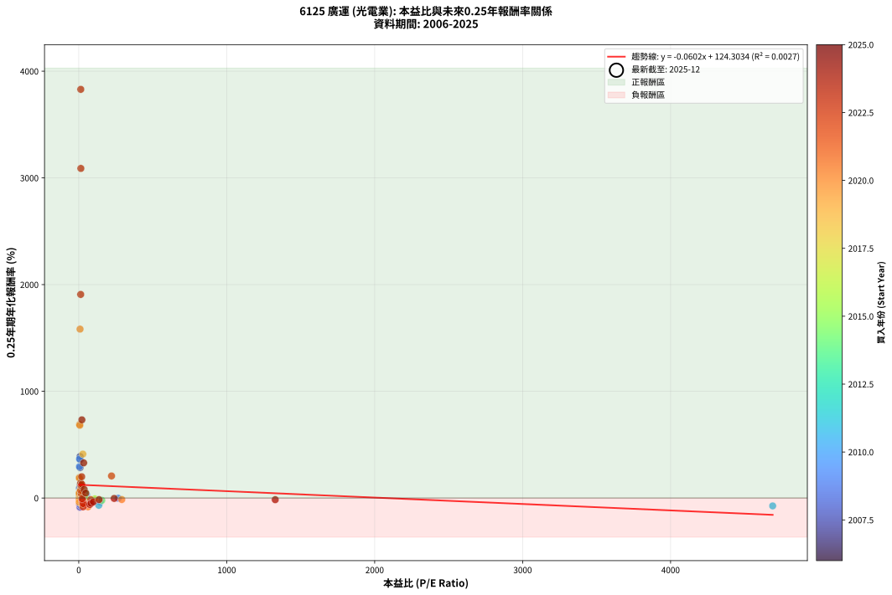
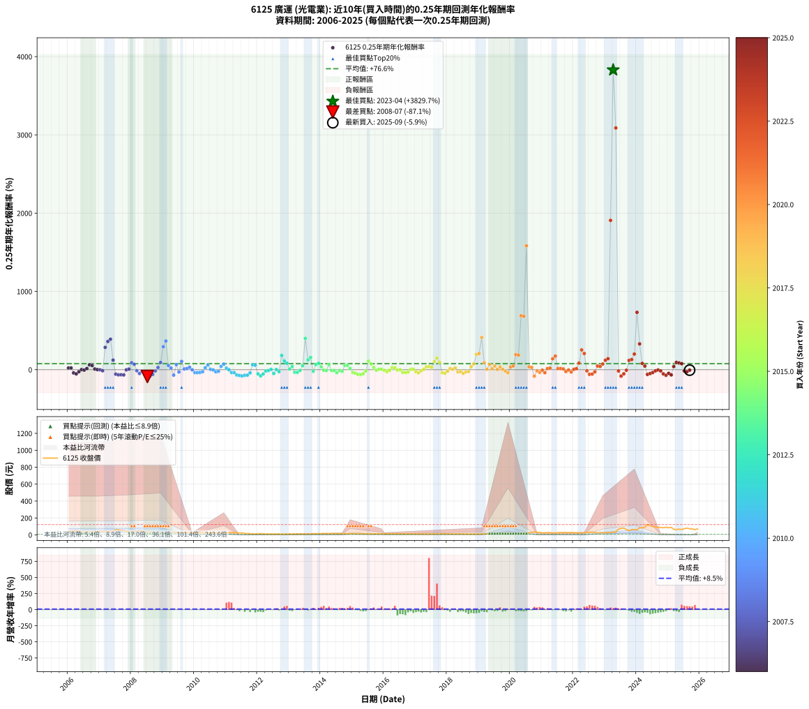

# 6125 廣運 - 本益比與未來報酬率分析

!!! info "報告資訊"
    - **股票代號**: 6125
    - **公司名稱**: 廣運
    - **產業別**: 光電業
    - **分析期間**: 2006-2025 (237 個數據點)
    - **資料來源**: Type 12 (ShowMonthlyK_ChartFlow) 月收盤價與本益比
    - **報酬率口徑**: 含現金股利 (簡化: 年度合計，假設每年7/1入帳)
    - **報告生成時間**: 2026-01-22 23:47:45 CST

## 📈 視覺化圖表

### 圖表1: 本益比 vs 未來報酬率關係

*圖表1：6125 廣運 本益比與0.25年期未來報酬率關係 (2006-2025)*

### 圖表2: 歷年買入時點的0.25年期實際報酬率

*圖表2：6125 廣運 歷年買入時點的0.25年期實際報酬率 (2006-2025)*

## 📍 買點訊號說明

本報告提供兩種買點提示訊號（顯示於圖表2的股價子圖中）：

### ▲ 小綠色三角形（回測驗證）
- **計算方式**: 使用全部歷史資料計算本益比第25百分位數
- **用途**: 事後驗證，顯示歷史上哪些時點確實為低估區
- **限制**: 當下無法判斷，僅供回測參考
- **特性**: 後見之明（Look-Ahead Bias）

### ▲ 小橘色三角形（即時訊號）
- **計算方式**: 使用截至當月的過去5年資料計算本益比第25百分位數
- **用途**: 實際投資決策，當時即可判斷
- **優勢**: 可操作性強，符合實務需求
- **特性**: 無後見之明，滾動窗口計算

!!! tip "如何使用兩種訊號"
    - **綠色▲** 幫助理解歷史估值機會，驗證策略有效性
    - **橘色▲** 可作為實際買進參考，但仍需搭配基本面分析
    - 兩種訊號重疊時，表示即時判斷與事後驗證一致，信心度較高
    - 僅有綠色▲時，表示當時無法判斷（需要未來資料才能確認）
    - 僅有橘色▲時，表示即時判斷為買點，但事後可能不是最佳時機

## 📊 估值分析摘要

| 指標 | 數值 |
|:---:|:---:|
| **目前本益比** (2025-09) | **nan 倍** |
| **歷史平均本益比** | 77.15 倍 |
| **估值水準** | 🟡 合理範圍 |
| **預期0.25年年化報酬率** | **+nan%** |
| **歷史平均報酬率** | +76.60% |
| **相關係數 (R²)** | 0.0027 |
| **趨勢線斜率** | -0.0602 |

!!! abstract "核心洞察"
    目前本益比接近歷史平均，預期報酬率符合長期趨勢

    根據歷史數據回測，6125 廣運 在目前本益比 **nan倍** 的估值水準下，
    預期未來0.25年年化報酬率約為 **+nan%**。

    **重要提醒**: 本分析基於歷史數據統計，實際報酬率會受到公司基本面變化、產業趨勢、
    總體經濟環境等多重因素影響。R² = 0.00 表示本益比可解釋約 0.3% 的報酬率變異。

## 📈 歷史估值統計

### 最佳買點 (最高報酬率)

| 項目 | 數值 |
|:---:|:---:|
| 起始時間 | 2023-04 |
| 當時本益比 | 13.55 倍 |
| 起始價格 | 31.7 元 |
| 0.25年後價格 | 77.5 元 |
| **0.25年年化報酬率** | **+3829.75%** |

### 最差買點 (最低報酬率)

| 項目 | 數值 |
|:---:|:---:|
| 起始時間 | 2008-07 |
| 當時本益比 | 7.74 倍 |
| 起始價格 | 37.0 元 |
| 0.25年後價格 | 22.1 元 |
| **0.25年年化報酬率** | **-87.14%** |

## 🎯 投資啟示

### 本益比與報酬率關係

趨勢線方程式: **y = -0.0602x + 124.3034**

!!! note "負相關"
    本益比與未來報酬率呈現負相關。較低的本益比通常帶來較高的未來報酬率，
    但相關性不算非常強。**估值仍是重要參考指標之一**。

### 估值區間建議

基於歷史數據分析:

- **🟢 低估區** (P/E < 61.7): 預期報酬率較高，可考慮增加持股
- **🟡 合理區** (P/E 61.7-92.6): 預期報酬率符合長期趨勢，正常持有
- **🔴 高估區** (P/E > 92.6): 預期報酬率較低，可考慮減碼或觀望

!!! danger "風險提示"
    - 過去表現不代表未來結果
    - 本分析假設公司基本面無重大結構性變化
    - 產業環境劇變可能使歷史規律失效
    - 應結合公司財報、產業趨勢、總體經濟等多重因素綜合判斷

!!! success "長期投資觀點"
    歷史數據顯示，在合理或低估的估值水準買入並長期持有，
    往往能獲得較佳的投資報酬。**耐心等待好價格**是價值投資的核心原則。

## 📊 數據品質

- **資料來源**: GoodInfo.tw Type 12 (ShowMonthlyK_ChartFlow)
- **資料頻率**: 月度收盤價與本益比
- **回測期間**: 2006-2025
- **數據點數量**: 237 個 (每個點代表一次0.25年期回測)

### 計算方法說明

1. **0.25年期年化報酬率**:
   - 對每個歷史時點，計算其後0.25年的實際投資報酬率
   - 期末價值(不含股利): 期末價格
   - 期末價值(含現金股利): 期末價格 + 持有期間內的現金股利合計 (簡化: 年度合計，假設每年7/1入帳)
   - 公式: 年化報酬率 = [(期末價值/期初價格)^(1/年數) - 1] × 100%

2. **本益比 (P/E Ratio)**:
   - 使用當時的月收盤價與EPS計算
   - 資料來源: Type 12 月度河流圖本益比數據

3. **趨勢線 (Linear Regression)**:
   - 使用最小平方法擬合線性趨勢線
   - R²值衡量本益比對報酬率的解釋能力

---

*本報告由 Stock Analysis System v1.9.0 自動生成*
*數據更新時間: 2026-01-22 23:47:45 CST*

## 📋 月度回測明細表

（每一列對應時間線圖中的一個買入點；可用來對照 SVG 圖上的每個點。）

| 買入月份 | 賣出月份 | 回測期限_年 | 實際持有年數 | 買入本益比_倍 | 買入收盤價_元 | 賣出收盤價_元 | 現金股利合計_元 | 總報酬率_pct | 年化報酬率_pct |
| --- | --- | --- | --- | --- | --- | --- | --- | --- | --- |
| 2006-01 | 2006-05 | 0.25 | 0.329 | 9.15 | 41.25 | 44.00 | 0.00 | +6.67 | +21.71 |
| 2006-02 | 2006-05 | 0.25 | 0.246 | 9.29 | 41.90 | 44.00 | 0.00 | +5.01 | +21.95 |
| 2006-03 | 2006-07 | 0.25 | 0.334 | 10.58 | 47.70 | 37.75 | 2.11 | -16.44 | -41.60 |
| 2006-04 | 2006-07 | 0.25 | 0.249 | 10.69 | 48.20 | 37.75 | 2.11 | -17.31 | -53.37 |
| 2006-05 | 2006-08 | 0.25 | 0.252 | 9.76 | 44.00 | 38.70 | 2.11 | -7.26 | -25.86 |
| 2006-06 | 2006-09 | 0.25 | 0.252 | 8.40 | 37.90 | 35.90 | 2.11 | +0.28 | +1.11 |
| 2006-07 | 2006-10 | 0.25 | 0.252 | 8.37 | 37.75 | 37.25 | 0.00 | -1.32 | -5.16 |
| 2006-08 | 2006-12 | 0.25 | 0.334 | 8.58 | 38.70 | 40.50 | 0.00 | +4.65 | +14.58 |
| 2006-09 | 2006-12 | 0.25 | 0.249 | 7.96 | 35.90 | 40.50 | 0.00 | +12.81 | +62.24 |
| 2006-10 | 2007-01 | 0.25 | 0.252 | 8.26 | 37.25 | 41.50 | 0.00 | +11.41 | +53.56 |
| 2006-11 | 2007-03 | 0.25 | 0.329 | 8.76 | 39.50 | 40.60 | 0.00 | +2.78 | +8.72 |
| 2006-12 | 2007-03 | 0.25 | 0.246 | 8.98 | 40.50 | 40.60 | 0.00 | +0.25 | +1.01 |
| 2007-01 | 2007-05 | 0.25 | 0.329 | 9.18 | 41.50 | 41.30 | 0.00 | -0.48 | -1.46 |
| 2007-02 | 2007-05 | 0.25 | 0.246 | 9.44 | 42.80 | 41.30 | 0.00 | -3.50 | -13.48 |
| 2007-03 | 2007-07 | 0.25 | 0.334 | 8.93 | 40.60 | 61.20 | 2.50 | +56.90 | +285.16 |
| 2007-04 | 2007-07 | 0.25 | 0.249 | 9.55 | 43.55 | 61.20 | 2.50 | +46.27 | +360.12 |
| 2007-05 | 2007-08 | 0.25 | 0.252 | 9.03 | 41.30 | 59.10 | 2.50 | +49.15 | +389.03 |
| 2007-06 | 2007-09 | 0.25 | 0.252 | 9.99 | 45.80 | 53.50 | 2.50 | +22.27 | +122.17 |
| 2007-07 | 2007-10 | 0.25 | 0.252 | 13.31 | 61.20 | 49.40 | 0.00 | -19.28 | -57.27 |
| 2007-08 | 2007-12 | 0.25 | 0.334 | 12.82 | 59.10 | 41.30 | 0.00 | -30.12 | -65.80 |
| 2007-09 | 2007-12 | 0.25 | 0.249 | 11.57 | 53.50 | 41.30 | 0.00 | -22.80 | -64.61 |
| 2007-10 | 2008-01 | 0.25 | 0.252 | 10.66 | 49.40 | 37.25 | 0.00 | -24.60 | -67.40 |
| 2007-11 | 2008-03 | 0.25 | 0.331 | 9.10 | 42.30 | 42.05 | 0.00 | -0.59 | -1.77 |
| 2007-12 | 2008-03 | 0.25 | 0.249 | 8.86 | 41.30 | 42.05 | 0.00 | +1.82 | +7.49 |
| 2008-01 | 2008-05 | 0.25 | 0.331 | 7.96 | 37.25 | 46.00 | 0.00 | +23.49 | +89.06 |
| 2008-02 | 2008-05 | 0.25 | 0.249 | 8.60 | 40.40 | 46.00 | 0.00 | +13.86 | +68.38 |
| 2008-03 | 2008-07 | 0.25 | 0.334 | 8.92 | 42.05 | 37.05 | 3.00 | -4.76 | -13.57 |
| 2008-04 | 2008-07 | 0.25 | 0.249 | 10.01 | 47.40 | 37.05 | 3.00 | -15.51 | -49.15 |
| 2008-05 | 2008-08 | 0.25 | 0.252 | 9.68 | 46.00 | 40.75 | 3.00 | -4.89 | -18.05 |
| 2008-06 | 2008-09 | 0.25 | 0.252 | 8.09 | 38.60 | 28.65 | 3.00 | -18.01 | -54.53 |
| 2008-07 | 2008-10 | 0.25 | 0.252 | 7.74 | 37.05 | 22.10 | 0.00 | -40.35 | -87.14 |
| 2008-08 | 2008-12 | 0.25 | 0.334 | 8.48 | 40.75 | 22.65 | 0.00 | -44.42 | -82.77 |
| 2008-09 | 2008-12 | 0.25 | 0.249 | 5.94 | 28.65 | 22.65 | 0.00 | -20.94 | -61.06 |
| 2008-10 | 2009-01 | 0.25 | 0.252 | 4.56 | 22.10 | 21.10 | 0.00 | -4.52 | -16.79 |
| 2008-11 | 2009-03 | 0.25 | 0.329 | 5.04 | 24.50 | 26.60 | 0.00 | +8.57 | +28.44 |
| 2008-12 | 2009-03 | 0.25 | 0.246 | 4.64 | 22.65 | 26.60 | 0.00 | +17.44 | +92.01 |
| 2009-01 | 2009-05 | 0.25 | 0.329 | 4.71 | 21.10 | 33.10 | 0.00 | +56.87 | +293.72 |
| 2009-02 | 2009-05 | 0.25 | 0.246 | 5.54 | 22.65 | 33.10 | 0.00 | +46.14 | +366.28 |
| 2009-03 | 2009-07 | 0.25 | 0.334 | 7.21 | 26.60 | 29.20 | 1.50 | +15.41 | +53.60 |
| 2009-04 | 2009-07 | 0.25 | 0.249 | 8.91 | 29.30 | 29.20 | 1.50 | +4.78 | +20.60 |
| 2009-05 | 2009-08 | 0.25 | 0.252 | 11.44 | 33.10 | 23.05 | 1.50 | -25.83 | -69.47 |
| 2009-06 | 2009-09 | 0.25 | 0.252 | 10.66 | 26.60 | 28.70 | 1.50 | +13.53 | +65.52 |
| 2009-07 | 2009-10 | 0.25 | 0.252 | 13.92 | 29.20 | 26.70 | 0.00 | -8.56 | -29.91 |
| 2009-08 | 2009-12 | 0.25 | 0.334 | 13.56 | 23.05 | 29.35 | 0.00 | +27.33 | +106.14 |
| 2009-09 | 2009-12 | 0.25 | 0.249 | 22.03 | 28.70 | 29.35 | 0.00 | +2.26 | +9.41 |
| 2009-10 | 2010-01 | 0.25 | 0.252 | 29.50 | 26.70 | 27.65 | 0.00 | +3.56 | +14.89 |
| 2009-11 | 2010-03 | 0.25 | 0.329 | 52.71 | 26.75 | 29.20 | 0.00 | +9.16 | +30.57 |
| 2009-12 | 2010-03 | 0.25 | 0.246 | 266.80 | 29.35 | 29.20 | 0.00 | -0.51 | -2.06 |
| 2010-01 | 2010-05 | 0.25 | 0.329 | 144.90 | 27.65 | 23.75 | 0.00 | -14.10 | -37.05 |
| 2010-02 | 2010-05 | 0.25 | 0.246 | 98.28 | 26.70 | 23.75 | 0.00 | -11.05 | -37.82 |
| 2010-03 | 2010-07 | 0.25 | 0.334 | 82.84 | 29.20 | 24.80 | 0.50 | -13.36 | -34.90 |
| 2010-04 | 2010-07 | 0.25 | 0.249 | 63.00 | 27.30 | 24.80 | 0.50 | -7.33 | -26.32 |
| 2010-05 | 2010-08 | 0.25 | 0.252 | 46.19 | 23.75 | 24.60 | 0.50 | +5.68 | +24.54 |
| 2010-06 | 2010-09 | 0.25 | 0.252 | 40.00 | 23.80 | 26.30 | 0.50 | +12.61 | +60.21 |
| 2010-07 | 2010-10 | 0.25 | 0.252 | 36.70 | 24.80 | 25.05 | 0.00 | +1.01 | +4.06 |
| 2010-08 | 2010-12 | 0.25 | 0.334 | 32.51 | 24.60 | 24.30 | 0.00 | -1.22 | -3.61 |
| 2010-09 | 2010-12 | 0.25 | 0.249 | 31.40 | 26.30 | 24.30 | 0.00 | -7.60 | -27.20 |
| 2010-10 | 2011-01 | 0.25 | 0.252 | 27.28 | 25.05 | 23.60 | 0.00 | -5.79 | -21.08 |
| 2010-11 | 2011-03 | 0.25 | 0.329 | 24.72 | 24.70 | 27.75 | 0.00 | +12.35 | +42.53 |
| 2010-12 | 2011-03 | 0.25 | 0.246 | 22.50 | 24.30 | 27.75 | 0.00 | +14.20 | +71.39 |
| 2011-01 | 2011-05 | 0.25 | 0.329 | 26.20 | 23.60 | 24.95 | 0.00 | +5.72 | +18.45 |
| 2011-02 | 2011-05 | 0.25 | 0.246 | 34.64 | 25.00 | 24.95 | 0.00 | -0.20 | -0.81 |
| 2011-03 | 2011-07 | 0.25 | 0.334 | 51.15 | 27.75 | 22.90 | 0.91 | -14.20 | -36.77 |
| 2011-04 | 2011-07 | 0.25 | 0.249 | 73.76 | 26.80 | 22.90 | 0.91 | -11.16 | -37.80 |
| 2011-05 | 2011-08 | 0.25 | 0.252 | 135.50 | 24.95 | 17.80 | 0.91 | -25.01 | -68.10 |
| 2011-06 | 2011-09 | 0.25 | 0.252 | 4690.00 | 23.45 | 15.80 | 0.91 | -28.74 | -73.95 |
| 2011-07 | 2011-10 | 0.25 | 0.252 |  | 22.90 | 15.30 | 0.00 | -33.19 | -79.83 |
| 2011-08 | 2011-12 | 0.25 | 0.334 |  | 17.80 | 11.70 | 0.00 | -34.27 | -71.53 |
| 2011-09 | 2011-12 | 0.25 | 0.249 |  | 15.80 | 11.70 | 0.00 | -25.95 | -70.06 |
| 2011-10 | 2012-01 | 0.25 | 0.252 |  | 15.30 | 13.40 | 0.00 | -12.42 | -40.93 |
| 2011-11 | 2012-03 | 0.25 | 0.331 |  | 11.15 | 13.10 | 0.00 | +17.49 | +62.66 |
| 2011-12 | 2012-03 | 0.25 | 0.249 |  | 11.70 | 13.10 | 0.00 | +11.97 | +57.40 |
| 2012-01 | 2012-05 | 0.25 | 0.331 |  | 13.40 | 10.40 | 0.00 | -22.39 | -53.47 |
| 2012-02 | 2012-05 | 0.25 | 0.249 |  | 15.35 | 10.40 | 0.00 | -32.25 | -79.04 |
| 2012-03 | 2012-07 | 0.25 | 0.334 |  | 13.10 | 9.88 | 0.20 | -23.04 | -54.34 |
| 2012-04 | 2012-07 | 0.25 | 0.249 |  | 10.55 | 9.88 | 0.20 | -4.44 | -16.65 |
| 2012-05 | 2012-08 | 0.25 | 0.252 |  | 10.40 | 9.90 | 0.20 | -2.87 | -10.90 |
| 2012-06 | 2012-09 | 0.25 | 0.252 |  | 10.80 | 10.70 | 0.20 | +0.94 | +3.80 |
| 2012-07 | 2012-10 | 0.25 | 0.252 |  | 9.88 | 8.32 | 0.00 | -15.79 | -49.45 |
| 2012-08 | 2012-12 | 0.25 | 0.334 |  | 9.90 | 9.96 | 0.00 | +0.61 | +1.83 |
| 2012-09 | 2012-12 | 0.25 | 0.249 |  | 10.70 | 9.96 | 0.00 | -6.92 | -25.00 |
| 2012-10 | 2013-01 | 0.25 | 0.252 |  | 8.32 | 10.80 | 0.00 | +29.81 | +181.72 |
| 2012-11 | 2013-03 | 0.25 | 0.329 |  | 9.04 | 11.55 | 0.00 | +27.77 | +110.81 |
| 2012-12 | 2013-03 | 0.25 | 0.246 |  | 9.96 | 11.55 | 0.00 | +15.96 | +82.41 |
| 2013-01 | 2013-05 | 0.25 | 0.329 |  | 10.80 | 11.10 | 0.00 | +2.78 | +8.70 |
| 2013-02 | 2013-05 | 0.25 | 0.246 |  | 10.20 | 11.10 | 0.00 | +8.82 | +40.94 |
| 2013-03 | 2013-07 | 0.25 | 0.334 |  | 11.55 | 10.10 | 0.00 | -12.55 | -33.08 |
| 2013-04 | 2013-07 | 0.25 | 0.249 |  | 11.20 | 10.10 | 0.00 | -9.82 | -33.96 |
| 2013-05 | 2013-08 | 0.25 | 0.252 |  | 11.10 | 10.80 | 0.00 | -2.70 | -10.31 |
| 2013-06 | 2013-09 | 0.25 | 0.252 |  | 10.10 | 11.20 | 0.00 | +10.89 | +50.75 |
| 2013-07 | 2013-10 | 0.25 | 0.252 |  | 10.10 | 15.15 | 0.00 | +50.00 | +400.15 |
| 2013-08 | 2013-12 | 0.25 | 0.334 |  | 10.80 | 14.15 | 0.00 | +31.02 | +124.53 |
| 2013-09 | 2013-12 | 0.25 | 0.249 |  | 11.20 | 14.15 | 0.00 | +26.34 | +155.59 |
| 2013-10 | 2014-01 | 0.25 | 0.252 |  | 15.15 | 14.30 | 0.00 | -5.61 | -20.49 |
| 2013-11 | 2014-03 | 0.25 | 0.329 |  | 13.90 | 16.40 | 0.00 | +17.99 | +65.44 |
| 2013-12 | 2014-03 | 0.25 | 0.246 |  | 14.15 | 16.40 | 0.00 | +15.90 | +82.01 |
| 2014-01 | 2014-05 | 0.25 | 0.329 |  | 14.30 | 15.85 | 0.00 | +10.84 | +36.78 |
| 2014-02 | 2014-05 | 0.25 | 0.246 |  | 16.15 | 15.85 | 0.00 | -1.86 | -7.33 |
| 2014-03 | 2014-07 | 0.25 | 0.334 |  | 16.40 | 15.25 | 0.50 | -3.96 | -11.40 |
| 2014-04 | 2014-07 | 0.25 | 0.249 |  | 13.90 | 15.25 | 0.50 | +13.31 | +65.12 |
| 2014-05 | 2014-08 | 0.25 | 0.252 |  | 15.85 | 14.90 | 0.50 | -2.84 | -10.81 |
| 2014-06 | 2014-09 | 0.25 | 0.252 |  | 16.15 | 15.20 | 0.50 | -2.79 | -10.61 |
| 2014-07 | 2014-10 | 0.25 | 0.252 |  | 15.25 | 13.50 | 0.00 | -11.48 | -38.36 |
| 2014-08 | 2014-12 | 0.25 | 0.334 |  | 14.90 | 14.30 | 0.00 | -4.03 | -11.58 |
| 2014-09 | 2014-12 | 0.25 | 0.249 | 155.90 | 15.20 | 14.30 | 0.00 | -5.92 | -21.73 |
| 2014-10 | 2015-01 | 0.25 | 0.252 | 43.32 | 13.50 | 15.05 | 0.00 | +11.48 | +53.96 |
| 2014-11 | 2015-03 | 0.25 | 0.329 | 24.34 | 12.80 | 14.80 | 0.00 | +15.62 | +55.57 |
| 2014-12 | 2015-03 | 0.25 | 0.246 | 19.32 | 14.30 | 14.80 | 0.00 | +3.50 | +14.97 |
| 2015-01 | 2015-05 | 0.25 | 0.329 | 21.40 | 15.05 | 13.00 | 0.00 | -13.62 | -35.96 |
| 2015-02 | 2015-05 | 0.25 | 0.246 | 22.58 | 15.05 | 13.00 | 0.00 | -13.62 | -44.80 |
| 2015-03 | 2015-07 | 0.25 | 0.334 | 23.49 | 14.80 | 10.45 | 0.50 | -26.01 | -59.42 |
| 2015-04 | 2015-07 | 0.25 | 0.249 | 23.60 | 14.00 | 10.45 | 0.50 | -21.79 | -62.70 |
| 2015-05 | 2015-08 | 0.25 | 0.252 | 23.35 | 13.00 | 10.30 | 0.50 | -16.92 | -52.10 |
| 2015-06 | 2015-09 | 0.25 | 0.252 | 24.52 | 12.75 | 11.65 | 0.50 | -4.71 | -17.42 |
| 2015-07 | 2015-10 | 0.25 | 0.252 | 21.62 | 10.45 | 12.60 | 0.00 | +20.57 | +110.18 |
| 2015-08 | 2015-12 | 0.25 | 0.334 | 23.06 | 10.30 | 12.40 | 0.00 | +20.39 | +74.28 |
| 2015-09 | 2015-12 | 0.25 | 0.249 | 28.41 | 11.65 | 12.40 | 0.00 | +6.44 | +28.46 |
| 2015-10 | 2016-01 | 0.25 | 0.252 | 33.75 | 12.60 | 12.35 | 0.00 | -1.98 | -7.65 |
| 2015-11 | 2016-03 | 0.25 | 0.331 | 36.53 | 12.30 | 12.55 | 0.00 | +2.03 | +6.26 |
| 2015-12 | 2016-03 | 0.25 | 0.249 | 41.33 | 12.40 | 12.55 | 0.00 | +1.21 | +4.94 |
| 2016-01 | 2016-05 | 0.25 | 0.331 | 108.40 | 12.35 | 12.00 | 0.00 | -2.83 | -8.31 |
| 2016-02 | 2016-05 | 0.25 | 0.249 |  | 12.90 | 12.00 | 0.00 | -6.98 | -25.19 |
| 2016-03 | 2016-07 | 0.25 | 0.334 |  | 12.55 | 11.70 | 0.50 | -2.79 | -8.12 |
| 2016-04 | 2016-07 | 0.25 | 0.249 |  | 11.50 | 11.70 | 0.50 | +6.09 | +26.77 |
| 2016-05 | 2016-08 | 0.25 | 0.252 |  | 12.00 | 12.20 | 0.50 | +5.83 | +25.24 |
| 2016-06 | 2016-09 | 0.25 | 0.252 |  | 12.50 | 11.85 | 0.50 | -1.20 | -4.68 |
| 2016-07 | 2016-10 | 0.25 | 0.252 |  | 11.70 | 11.70 | 0.00 | +0.00 | +0.00 |
| 2016-08 | 2016-12 | 0.25 | 0.334 |  | 12.20 | 10.60 | 0.00 | -13.11 | -34.35 |
| 2016-09 | 2016-12 | 0.25 | 0.249 |  | 11.85 | 10.60 | 0.00 | -10.55 | -36.07 |
| 2016-10 | 2017-01 | 0.25 | 0.252 |  | 11.70 | 10.65 | 0.00 | -8.97 | -31.15 |
| 2016-11 | 2017-03 | 0.25 | 0.329 |  | 10.60 | 10.75 | 0.00 | +1.42 | +4.37 |
| 2016-12 | 2017-03 | 0.25 | 0.246 |  | 10.60 | 10.75 | 0.00 | +1.42 | +5.87 |
| 2017-01 | 2017-05 | 0.25 | 0.329 |  | 10.65 | 9.61 | 0.00 | -9.77 | -26.86 |
| 2017-02 | 2017-05 | 0.25 | 0.246 |  | 10.95 | 9.61 | 0.00 | -12.24 | -41.13 |
| 2017-03 | 2017-07 | 0.25 | 0.334 |  | 10.75 | 9.69 | 0.50 | -5.21 | -14.80 |
| 2017-04 | 2017-07 | 0.25 | 0.249 |  | 10.10 | 9.69 | 0.50 | +0.89 | +3.62 |
| 2017-05 | 2017-08 | 0.25 | 0.252 |  | 9.61 | 9.90 | 0.50 | +8.22 | +36.84 |
| 2017-06 | 2017-09 | 0.25 | 0.252 |  | 9.65 | 10.00 | 0.50 | +8.81 | +39.81 |
| 2017-07 | 2017-10 | 0.25 | 0.252 |  | 9.69 | 10.35 | 0.00 | +6.81 | +29.90 |
| 2017-08 | 2017-12 | 0.25 | 0.334 |  | 9.90 | 12.55 | 0.00 | +26.77 | +103.42 |
| 2017-09 | 2017-12 | 0.25 | 0.249 |  | 10.00 | 12.55 | 0.00 | +25.50 | +148.85 |
| 2017-10 | 2018-01 | 0.25 | 0.252 |  | 10.35 | 12.25 | 0.00 | +18.36 | +95.25 |
| 2017-11 | 2018-03 | 0.25 | 0.329 |  | 12.65 | 10.80 | 0.00 | -14.62 | -38.20 |
| 2017-12 | 2018-03 | 0.25 | 0.246 |  | 12.55 | 10.80 | 0.00 | -13.94 | -45.64 |
| 2018-01 | 2018-05 | 0.25 | 0.329 |  | 12.25 | 11.40 | 0.00 | -6.94 | -19.66 |
| 2018-02 | 2018-05 | 0.25 | 0.246 |  | 11.00 | 11.40 | 0.00 | +3.64 | +15.60 |
| 2018-03 | 2018-07 | 0.25 | 0.334 |  | 10.80 | 10.70 | 0.30 | +1.85 | +5.65 |
| 2018-04 | 2018-07 | 0.25 | 0.249 |  | 10.45 | 10.70 | 0.30 | +5.26 | +22.86 |
| 2018-05 | 2018-08 | 0.25 | 0.252 |  | 11.40 | 10.10 | 0.30 | -8.77 | -30.54 |
| 2018-06 | 2018-09 | 0.25 | 0.252 |  | 10.65 | 9.63 | 0.30 | -6.76 | -24.26 |
| 2018-07 | 2018-10 | 0.25 | 0.252 |  | 10.70 | 9.10 | 0.00 | -14.95 | -47.43 |
| 2018-08 | 2018-12 | 0.25 | 0.334 |  | 10.10 | 9.00 | 0.00 | -10.89 | -29.19 |
| 2018-09 | 2018-12 | 0.25 | 0.249 |  | 9.63 | 9.00 | 0.00 | -6.54 | -23.78 |
| 2018-10 | 2019-01 | 0.25 | 0.252 |  | 9.10 | 9.87 | 0.00 | +8.46 | +38.05 |
| 2018-11 | 2019-03 | 0.25 | 0.329 |  | 9.79 | 11.75 | 0.00 | +20.02 | +74.27 |
| 2018-12 | 2019-03 | 0.25 | 0.246 |  | 9.00 | 11.75 | 0.00 | +30.56 | +195.08 |
| 2019-01 | 2019-05 | 0.25 | 0.329 |  | 9.87 | 14.25 | 0.00 | +44.38 | +205.82 |
| 2019-02 | 2019-05 | 0.25 | 0.246 | 27.62 | 9.53 | 14.25 | 0.00 | +49.53 | +411.78 |
| 2019-03 | 2019-07 | 0.25 | 0.334 | 13.70 | 11.75 | 14.05 | 0.51 | +23.88 | +89.86 |
| 2019-04 | 2019-07 | 0.25 | 0.249 | 10.47 | 14.35 | 14.05 | 0.51 | +1.44 | +5.89 |
| 2019-05 | 2019-08 | 0.25 | 0.252 | 7.57 | 14.25 | 15.70 | 0.51 | +13.73 | +66.64 |
| 2019-06 | 2019-09 | 0.25 | 0.252 | 6.18 | 14.80 | 14.70 | 0.51 | +2.74 | +11.34 |
| 2019-07 | 2019-10 | 0.25 | 0.252 | 4.83 | 14.05 | 15.50 | 0.00 | +10.32 | +47.69 |
| 2019-08 | 2019-12 | 0.25 | 0.334 | 4.59 | 15.70 | 15.85 | 0.00 | +0.96 | +2.89 |
| 2019-09 | 2019-12 | 0.25 | 0.249 | 3.74 | 14.70 | 15.85 | 0.00 | +7.82 | +35.30 |
| 2019-10 | 2020-01 | 0.25 | 0.252 | 3.49 | 15.50 | 15.70 | 0.00 | +1.29 | +5.22 |
| 2019-11 | 2020-03 | 0.25 | 0.331 | 3.01 | 14.90 | 13.95 | 0.00 | -6.38 | -18.03 |
| 2019-12 | 2020-03 | 0.25 | 0.249 | 2.90 | 15.85 | 13.95 | 0.00 | -11.99 | -40.10 |
| 2020-01 | 2020-05 | 0.25 | 0.331 | 3.15 | 15.70 | 17.35 | 0.00 | +10.51 | +35.21 |
| 2020-02 | 2020-05 | 0.25 | 0.249 | 3.51 | 15.75 | 17.35 | 0.00 | +10.16 | +47.45 |
| 2020-03 | 2020-07 | 0.25 | 0.334 | 3.48 | 13.95 | 17.95 | 2.00 | +43.01 | +191.84 |
| 2020-04 | 2020-07 | 0.25 | 0.249 | 4.36 | 15.35 | 17.95 | 2.00 | +29.97 | +186.35 |
| 2020-05 | 2020-08 | 0.25 | 0.252 | 5.73 | 17.35 | 27.20 | 2.00 | +68.30 | +689.91 |
| 2020-06 | 2020-09 | 0.25 | 0.252 | 7.11 | 18.05 | 28.30 | 2.00 | +67.87 | +681.87 |
| 2020-07 | 2020-10 | 0.25 | 0.252 | 8.75 | 17.95 | 36.55 | 0.00 | +103.62 | +1582.91 |
| 2020-08 | 2020-12 | 0.25 | 0.334 | 17.40 | 27.20 | 30.15 | 0.00 | +10.85 | +36.11 |
| 2020-09 | 2020-12 | 0.25 | 0.249 | 26.33 | 28.30 | 30.15 | 0.00 | +6.54 | +28.94 |
| 2020-10 | 2021-01 | 0.25 | 0.252 | 62.30 | 36.55 | 23.50 | 0.00 | -35.70 | -82.68 |
| 2020-11 | 2021-03 | 0.25 | 0.329 | 290.80 | 28.60 | 27.20 | 0.00 | -4.90 | -14.17 |
| 2020-12 | 2021-03 | 0.25 | 0.246 |  | 30.15 | 27.20 | 0.00 | -9.78 | -34.16 |
| 2021-01 | 2021-05 | 0.25 | 0.329 |  | 23.50 | 23.00 | 0.00 | -2.13 | -6.34 |
| 2021-02 | 2021-05 | 0.25 | 0.246 |  | 25.95 | 23.00 | 0.00 | -11.37 | -38.72 |
| 2021-03 | 2021-07 | 0.25 | 0.334 |  | 27.20 | 26.90 | 1.50 | +4.41 | +13.80 |
| 2021-04 | 2021-07 | 0.25 | 0.249 |  | 27.15 | 26.90 | 1.50 | +4.60 | +19.80 |
| 2021-05 | 2021-08 | 0.25 | 0.252 |  | 23.00 | 27.15 | 1.50 | +24.57 | +139.19 |
| 2021-06 | 2021-09 | 0.25 | 0.252 |  | 22.70 | 27.75 | 1.50 | +28.85 | +173.60 |
| 2021-07 | 2021-10 | 0.25 | 0.252 |  | 26.90 | 27.80 | 0.00 | +3.35 | +13.96 |
| 2021-08 | 2021-12 | 0.25 | 0.334 |  | 27.15 | 28.40 | 0.00 | +4.60 | +14.43 |
| 2021-09 | 2021-12 | 0.25 | 0.249 |  | 27.75 | 28.40 | 0.00 | +2.34 | +9.74 |
| 2021-10 | 2022-01 | 0.25 | 0.252 |  | 27.80 | 26.00 | 0.00 | -6.47 | -23.34 |
| 2021-11 | 2022-03 | 0.25 | 0.329 |  | 26.40 | 26.05 | 0.00 | -1.33 | -3.98 |
| 2021-12 | 2022-03 | 0.25 | 0.246 |  | 28.40 | 26.05 | 0.00 | -8.27 | -29.57 |
| 2022-01 | 2022-05 | 0.25 | 0.329 |  | 26.00 | 26.40 | 0.00 | +1.54 | +4.76 |
| 2022-02 | 2022-05 | 0.25 | 0.246 |  | 25.60 | 26.40 | 0.00 | +3.12 | +13.30 |
| 2022-03 | 2022-07 | 0.25 | 0.334 |  | 26.05 | 30.35 | 1.61 | +22.70 | +84.49 |
| 2022-04 | 2022-07 | 0.25 | 0.249 |  | 23.35 | 30.35 | 1.61 | +36.89 | +252.63 |
| 2022-05 | 2022-08 | 0.25 | 0.252 | 221.50 | 26.40 | 33.40 | 1.61 | +32.62 | +206.79 |
| 2022-06 | 2022-09 | 0.25 | 0.252 | 80.93 | 30.35 | 27.50 | 1.61 | -4.08 | -15.23 |
| 2022-07 | 2022-10 | 0.25 | 0.252 | 48.11 | 30.35 | 24.15 | 0.00 | -20.43 | -59.64 |
| 2022-08 | 2022-12 | 0.25 | 0.334 | 37.67 | 33.40 | 25.40 | 0.00 | -23.95 | -55.95 |
| 2022-09 | 2022-12 | 0.25 | 0.249 | 24.07 | 27.50 | 25.40 | 0.00 | -7.64 | -27.30 |
| 2022-10 | 2023-01 | 0.25 | 0.252 | 17.27 | 24.15 | 26.60 | 0.00 | +10.14 | +46.76 |
| 2022-11 | 2023-03 | 0.25 | 0.329 | 15.69 | 25.95 | 29.05 | 0.00 | +11.95 | +40.98 |
| 2022-12 | 2023-03 | 0.25 | 0.246 | 13.30 | 25.40 | 29.05 | 0.00 | +14.37 | +72.45 |
| 2023-01 | 2023-05 | 0.25 | 0.329 | 13.18 | 26.60 | 34.50 | 0.00 | +29.70 | +120.68 |
| 2023-02 | 2023-05 | 0.25 | 0.246 | 13.08 | 27.80 | 34.50 | 0.00 | +24.10 | +140.20 |
| 2023-03 | 2023-07 | 0.25 | 0.334 | 13.01 | 29.05 | 77.50 | 1.62 | +172.36 | +1907.92 |
| 2023-04 | 2023-07 | 0.25 | 0.249 | 13.55 | 31.70 | 77.50 | 1.62 | +149.59 | +3829.75 |
| 2023-05 | 2023-08 | 0.25 | 0.252 | 14.10 | 34.50 | 80.90 | 1.62 | +139.19 | +3088.89 |
| 2023-06 | 2023-09 | 0.25 | 0.252 | 26.93 | 68.80 | 64.20 | 1.62 | -4.33 | -16.12 |
| 2023-07 | 2023-10 | 0.25 | 0.252 | 29.11 | 77.50 | 49.85 | 0.00 | -35.68 | -82.65 |
| 2023-08 | 2023-12 | 0.25 | 0.334 | 29.21 | 80.90 | 63.00 | 0.00 | -22.13 | -52.70 |
| 2023-09 | 2023-12 | 0.25 | 0.249 | 22.31 | 64.20 | 63.00 | 0.00 | -1.87 | -7.29 |
| 2023-10 | 2024-01 | 0.25 | 0.252 | 16.70 | 49.85 | 60.70 | 0.00 | +21.77 | +118.54 |
| 2023-11 | 2024-03 | 0.25 | 0.331 | 20.34 | 62.90 | 82.80 | 0.00 | +31.64 | +129.28 |
| 2023-12 | 2024-03 | 0.25 | 0.249 | 19.69 | 63.00 | 82.80 | 0.00 | +31.43 | +199.49 |
| 2024-01 | 2024-05 | 0.25 | 0.331 | 21.03 | 60.70 | 122.50 | 0.00 | +101.81 | +732.75 |
| 2024-02 | 2024-05 | 0.25 | 0.249 | 33.11 | 85.20 | 122.50 | 0.00 | +43.78 | +329.49 |
| 2024-03 | 2024-07 | 0.25 | 0.334 | 36.64 | 82.80 | 99.10 | 1.70 | +21.74 | +80.20 |
| 2024-04 | 2024-07 | 0.25 | 0.249 | 47.11 | 91.70 | 99.10 | 1.70 | +9.92 | +46.19 |
| 2024-05 | 2024-08 | 0.25 | 0.252 | 75.00 | 122.50 | 95.20 | 1.70 | -20.90 | -60.57 |
| 2024-06 | 2024-09 | 0.25 | 0.252 | 83.33 | 110.00 | 91.00 | 1.70 | -15.73 | -49.30 |
| 2024-07 | 2024-10 | 0.25 | 0.252 | 98.44 | 99.10 | 88.50 | 0.00 | -10.70 | -36.18 |
| 2024-08 | 2024-12 | 0.25 | 0.334 | 137.30 | 95.20 | 90.10 | 0.00 | -5.36 | -15.20 |
| 2024-09 | 2024-12 | 0.25 | 0.249 | 239.50 | 91.00 | 90.10 | 0.00 | -0.99 | -3.91 |
| 2024-10 | 2025-01 | 0.25 | 0.252 | 1328.00 | 88.50 | 84.80 | 0.00 | -4.18 | -15.60 |
| 2024-11 | 2025-03 | 0.25 | 0.329 |  | 85.20 | 66.30 | 0.00 | -22.18 | -53.39 |
| 2024-12 | 2025-03 | 0.25 | 0.246 |  | 90.10 | 66.30 | 0.00 | -26.42 | -71.20 |
| 2025-01 | 2025-05 | 0.25 | 0.329 |  | 84.80 | 68.80 | 0.00 | -18.87 | -47.08 |
| 2025-02 | 2025-05 | 0.25 | 0.246 |  | 90.20 | 68.80 | 0.00 | -23.73 | -66.68 |
| 2025-03 | 2025-07 | 0.25 | 0.334 |  | 66.30 | 73.50 | 0.70 | +11.92 | +40.08 |
| 2025-04 | 2025-07 | 0.25 | 0.249 |  | 63.00 | 73.50 | 0.70 | +17.78 | +92.85 |
| 2025-05 | 2025-08 | 0.25 | 0.252 |  | 68.80 | 79.70 | 0.70 | +16.86 | +85.63 |
| 2025-06 | 2025-09 | 0.25 | 0.252 |  | 64.00 | 73.20 | 0.70 | +15.47 | +77.01 |
| 2025-07 | 2025-10 | 0.25 | 0.252 |  | 73.50 | 70.30 | 0.00 | -4.35 | -16.20 |
| 2025-08 | 2025-12 | 0.25 | 0.334 |  | 79.70 | 72.10 | 0.00 | -9.54 | -25.92 |
| 2025-09 | 2025-12 | 0.25 | 0.249 |  | 73.20 | 72.10 | 0.00 | -1.50 | -5.90 |
