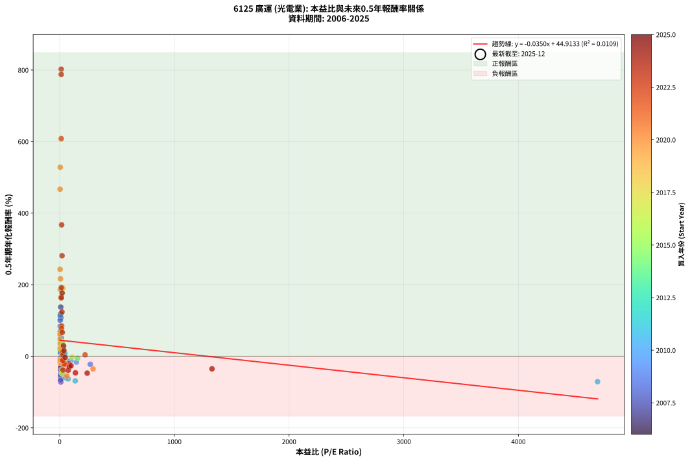
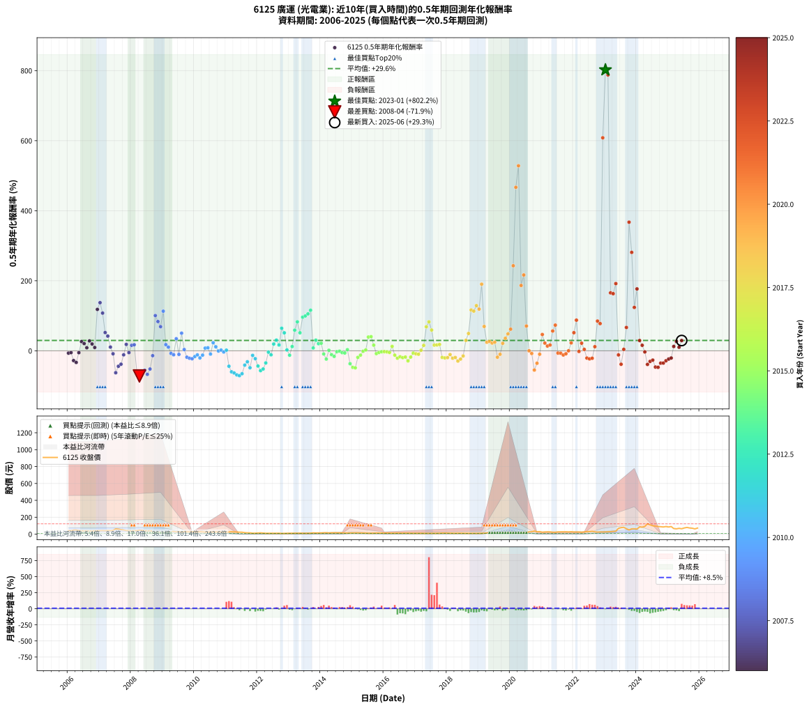

# 6125 廣運 - 本益比與未來報酬率分析

!!! info "報告資訊"
    - **股票代號**: 6125
    - **公司名稱**: 廣運
    - **產業別**: 光電業
    - **分析期間**: 2006-2025 (234 個數據點)
    - **資料來源**: Type 12 (ShowMonthlyK_ChartFlow) 月收盤價與本益比
    - **報酬率口徑**: 含現金股利 (簡化: 年度合計，假設每年7/1入帳)
    - **報告生成時間**: 2026-01-11 21:14:26 CST

## 📈 視覺化圖表

### 圖表1: 本益比 vs 未來報酬率關係

*圖表1：6125 廣運 本益比與0.5年期未來報酬率關係 (2006-2025)*

### 圖表2: 歷年買入時點的0.5年期實際報酬率

*圖表2：6125 廣運 歷年買入時點的0.5年期實際報酬率 (2006-2025)*

## 📍 買點訊號說明

本報告提供兩種買點提示訊號（顯示於圖表2的股價子圖中）：

### ▲ 小綠色三角形（回測驗證）
- **計算方式**: 使用全部歷史資料計算本益比第25百分位數
- **用途**: 事後驗證，顯示歷史上哪些時點確實為低估區
- **限制**: 當下無法判斷，僅供回測參考
- **特性**: 後見之明（Look-Ahead Bias）

### ▲ 小橘色三角形（即時訊號）
- **計算方式**: 使用截至當月的過去5年資料計算本益比第25百分位數
- **用途**: 實際投資決策，當時即可判斷
- **優勢**: 可操作性強，符合實務需求
- **特性**: 無後見之明，滾動窗口計算

!!! tip "如何使用兩種訊號"
    - **綠色▲** 幫助理解歷史估值機會，驗證策略有效性
    - **橘色▲** 可作為實際買進參考，但仍需搭配基本面分析
    - 兩種訊號重疊時，表示即時判斷與事後驗證一致，信心度較高
    - 僅有綠色▲時，表示當時無法判斷（需要未來資料才能確認）
    - 僅有橘色▲時，表示即時判斷為買點，但事後可能不是最佳時機

## 📊 估值分析摘要

| 指標 | 數值 |
|:---:|:---:|
| **目前本益比** (2025-06) | **nan 倍** |
| **歷史平均本益比** | 77.15 倍 |
| **估值水準** | 🟡 合理範圍 |
| **預期0.5年年化報酬率** | **+nan%** |
| **歷史平均報酬率** | +29.60% |
| **相關係數 (R²)** | 0.0109 |
| **趨勢線斜率** | -0.0350 |

!!! abstract "核心洞察"
    目前本益比接近歷史平均，預期報酬率符合長期趨勢

    根據歷史數據回測，6125 廣運 在目前本益比 **nan倍** 的估值水準下，
    預期未來0.5年年化報酬率約為 **+nan%**。

    **重要提醒**: 本分析基於歷史數據統計，實際報酬率會受到公司基本面變化、產業趨勢、
    總體經濟環境等多重因素影響。R² = 0.01 表示本益比可解釋約 1.1% 的報酬率變異。

## 📈 歷史估值統計

### 最佳買點 (最高報酬率)

| 項目 | 數值 |
|:---:|:---:|
| 起始時間 | 2023-01 |
| 當時本益比 | 13.18 倍 |
| 起始價格 | 26.6 元 |
| 0.5年後價格 | 77.5 元 |
| **0.5年年化報酬率** | **+802.21%** |

### 最差買點 (最低報酬率)

| 項目 | 數值 |
|:---:|:---:|
| 起始時間 | 2008-04 |
| 當時本益比 | 10.01 倍 |
| 起始價格 | 47.4 元 |
| 0.5年後價格 | 22.1 元 |
| **0.5年年化報酬率** | **-71.89%** |

## 🎯 投資啟示

### 本益比與報酬率關係

趨勢線方程式: **y = -0.0350x + 44.9133**

!!! note "負相關"
    本益比與未來報酬率呈現負相關。較低的本益比通常帶來較高的未來報酬率，
    但相關性不算非常強。**估值仍是重要參考指標之一**。

### 估值區間建議

基於歷史數據分析:

- **🟢 低估區** (P/E < 61.7): 預期報酬率較高，可考慮增加持股
- **🟡 合理區** (P/E 61.7-92.6): 預期報酬率符合長期趨勢，正常持有
- **🔴 高估區** (P/E > 92.6): 預期報酬率較低，可考慮減碼或觀望

!!! danger "風險提示"
    - 過去表現不代表未來結果
    - 本分析假設公司基本面無重大結構性變化
    - 產業環境劇變可能使歷史規律失效
    - 應結合公司財報、產業趨勢、總體經濟等多重因素綜合判斷

!!! success "長期投資觀點"
    歷史數據顯示，在合理或低估的估值水準買入並長期持有，
    往往能獲得較佳的投資報酬。**耐心等待好價格**是價值投資的核心原則。

## 📊 數據品質

- **資料來源**: GoodInfo.tw Type 12 (ShowMonthlyK_ChartFlow)
- **資料頻率**: 月度收盤價與本益比
- **回測期間**: 2006-2025
- **數據點數量**: 234 個 (每個點代表一次0.5年期回測)

### 計算方法說明

1. **0.5年期年化報酬率**:
   - 對每個歷史時點，計算其後0.5年的實際投資報酬率
   - 期末價值(不含股利): 期末價格
   - 期末價值(含現金股利): 期末價格 + 持有期間內的現金股利合計 (簡化: 年度合計，假設每年7/1入帳)
   - 公式: 年化報酬率 = [(期末價值/期初價格)^(1/年數) - 1] × 100%

2. **本益比 (P/E Ratio)**:
   - 使用當時的月收盤價與EPS計算
   - 資料來源: Type 12 月度河流圖本益比數據

3. **趨勢線 (Linear Regression)**:
   - 使用最小平方法擬合線性趨勢線
   - R²值衡量本益比對報酬率的解釋能力

---

*本報告由 Stock Analysis System v1.9.0 自動生成*
*數據更新時間: 2026-01-11 21:14:26 CST*

## 📋 月度回測明細表

（每一列對應時間線圖中的一個買入點；可用來對照 SVG 圖上的每個點。）

| 買入月份 | 賣出月份 | 回測期限_年 | 實際持有年數 | 買入本益比_倍 | 買入收盤價_元 | 賣出收盤價_元 | 現金股利合計_元 | 總報酬率_pct | 年化報酬率_pct |
| --- | --- | --- | --- | --- | --- | --- | --- | --- | --- |
| 2006-01 | 2006-07 | 0.5 | 0.496 | 9.15 | 41.25 | 37.75 | 2.11 | -3.38 | -6.70 |
| 2006-02 | 2006-08 | 0.5 | 0.498 | 9.29 | 41.90 | 38.70 | 2.11 | -2.61 | -5.17 |
| 2006-03 | 2006-10 | 0.5 | 0.586 | 10.58 | 47.70 | 37.25 | 2.11 | -17.49 | -27.98 |
| 2006-04 | 2006-10 | 0.5 | 0.501 | 10.69 | 48.20 | 37.25 | 2.11 | -18.35 | -33.27 |
| 2006-05 | 2006-12 | 0.5 | 0.586 | 9.76 | 44.00 | 40.50 | 2.11 | -3.17 | -5.35 |
| 2006-06 | 2006-12 | 0.5 | 0.501 | 8.40 | 37.90 | 40.50 | 2.11 | +12.42 | +26.31 |
| 2006-07 | 2007-01 | 0.5 | 0.504 | 8.37 | 37.75 | 41.50 | 0.00 | +9.93 | +20.68 |
| 2006-08 | 2007-03 | 0.5 | 0.580 | 8.58 | 38.70 | 40.60 | 0.00 | +4.91 | +8.61 |
| 2006-09 | 2007-03 | 0.5 | 0.496 | 7.96 | 35.90 | 40.60 | 0.00 | +13.09 | +28.18 |
| 2006-10 | 2007-05 | 0.5 | 0.580 | 8.26 | 37.25 | 41.30 | 0.00 | +10.87 | +19.46 |
| 2006-11 | 2007-05 | 0.5 | 0.496 | 8.76 | 39.50 | 41.30 | 0.00 | +4.56 | +9.41 |
| 2006-12 | 2007-07 | 0.5 | 0.580 | 8.98 | 40.50 | 61.20 | 2.50 | +57.28 | +118.20 |
| 2007-01 | 2007-07 | 0.5 | 0.496 | 9.18 | 41.50 | 61.20 | 2.50 | +53.49 | +137.42 |
| 2007-02 | 2007-08 | 0.5 | 0.498 | 9.44 | 42.80 | 59.10 | 2.50 | +43.93 | +107.66 |
| 2007-03 | 2007-10 | 0.5 | 0.586 | 8.93 | 40.60 | 49.40 | 2.50 | +27.83 | +52.06 |
| 2007-04 | 2007-10 | 0.5 | 0.501 | 9.55 | 43.55 | 49.40 | 2.50 | +19.17 | +41.92 |
| 2007-05 | 2007-12 | 0.5 | 0.586 | 9.03 | 41.30 | 41.30 | 2.50 | +6.05 | +10.55 |
| 2007-06 | 2007-12 | 0.5 | 0.501 | 9.99 | 45.80 | 41.30 | 2.50 | -4.37 | -8.53 |
| 2007-07 | 2008-01 | 0.5 | 0.504 | 13.31 | 61.20 | 37.25 | 0.00 | -39.13 | -62.68 |
| 2007-08 | 2008-03 | 0.5 | 0.583 | 12.82 | 59.10 | 42.05 | 0.00 | -28.85 | -44.22 |
| 2007-09 | 2008-03 | 0.5 | 0.498 | 11.57 | 53.50 | 42.05 | 0.00 | -21.40 | -38.33 |
| 2007-10 | 2008-05 | 0.5 | 0.583 | 10.66 | 49.40 | 46.00 | 0.00 | -6.88 | -11.51 |
| 2007-11 | 2008-05 | 0.5 | 0.498 | 9.10 | 42.30 | 46.00 | 0.00 | +8.75 | +18.33 |
| 2007-12 | 2008-07 | 0.5 | 0.583 | 8.86 | 41.30 | 37.05 | 3.00 | -3.03 | -5.13 |
| 2008-01 | 2008-07 | 0.5 | 0.498 | 7.96 | 37.25 | 37.05 | 3.00 | +7.52 | +15.66 |
| 2008-02 | 2008-08 | 0.5 | 0.501 | 8.60 | 40.40 | 40.75 | 3.00 | +8.29 | +17.23 |
| 2008-03 | 2008-10 | 0.5 | 0.586 | 8.92 | 42.05 | 22.10 | 3.00 | -40.31 | -58.55 |
| 2008-04 | 2008-10 | 0.5 | 0.501 | 10.01 | 47.40 | 22.10 | 3.00 | -47.05 | -71.89 |
| 2008-05 | 2008-12 | 0.5 | 0.586 | 9.68 | 46.00 | 22.65 | 3.00 | -44.24 | -63.10 |
| 2008-06 | 2008-12 | 0.5 | 0.501 | 8.09 | 38.60 | 22.65 | 3.00 | -33.55 | -55.77 |
| 2008-07 | 2009-01 | 0.5 | 0.504 | 7.74 | 37.05 | 21.10 | 0.00 | -43.05 | -67.29 |
| 2008-08 | 2009-03 | 0.5 | 0.580 | 8.48 | 40.75 | 26.60 | 0.00 | -34.72 | -52.04 |
| 2008-09 | 2009-03 | 0.5 | 0.496 | 5.94 | 28.65 | 26.60 | 0.00 | -7.16 | -13.91 |
| 2008-10 | 2009-05 | 0.5 | 0.580 | 4.56 | 22.10 | 33.10 | 0.00 | +49.77 | +100.56 |
| 2008-11 | 2009-05 | 0.5 | 0.496 | 5.04 | 24.50 | 33.10 | 0.00 | +35.10 | +83.51 |
| 2008-12 | 2009-07 | 0.5 | 0.580 | 4.64 | 22.65 | 29.20 | 1.50 | +35.54 | +68.87 |
| 2009-01 | 2009-07 | 0.5 | 0.496 | 4.71 | 21.10 | 29.20 | 1.50 | +45.50 | +113.13 |
| 2009-02 | 2009-08 | 0.5 | 0.498 | 5.54 | 22.65 | 23.05 | 1.50 | +8.39 | +17.55 |
| 2009-03 | 2009-10 | 0.5 | 0.586 | 7.21 | 26.60 | 26.70 | 1.50 | +6.02 | +10.48 |
| 2009-04 | 2009-10 | 0.5 | 0.501 | 8.91 | 29.30 | 26.70 | 1.50 | -3.75 | -7.35 |
| 2009-05 | 2009-12 | 0.5 | 0.586 | 11.44 | 33.10 | 29.35 | 1.50 | -6.80 | -11.32 |
| 2009-06 | 2009-12 | 0.5 | 0.501 | 10.66 | 26.60 | 29.35 | 1.50 | +15.98 | +34.43 |
| 2009-07 | 2010-01 | 0.5 | 0.504 | 13.92 | 29.20 | 27.65 | 0.00 | -5.31 | -10.26 |
| 2009-08 | 2010-03 | 0.5 | 0.580 | 13.56 | 23.05 | 29.20 | 0.00 | +26.68 | +50.30 |
| 2009-09 | 2010-03 | 0.5 | 0.496 | 22.03 | 28.70 | 29.20 | 0.00 | +1.74 | +3.55 |
| 2009-10 | 2010-05 | 0.5 | 0.580 | 29.50 | 26.70 | 23.75 | 0.00 | -11.05 | -18.27 |
| 2009-11 | 2010-05 | 0.5 | 0.496 | 52.71 | 26.75 | 23.75 | 0.00 | -11.21 | -21.34 |
| 2009-12 | 2010-07 | 0.5 | 0.580 | 266.80 | 29.35 | 24.80 | 0.50 | -13.80 | -22.57 |
| 2010-01 | 2010-07 | 0.5 | 0.496 | 144.90 | 27.65 | 24.80 | 0.50 | -8.50 | -16.41 |
| 2010-02 | 2010-08 | 0.5 | 0.498 | 98.28 | 26.70 | 24.60 | 0.50 | -5.99 | -11.66 |
| 2010-03 | 2010-10 | 0.5 | 0.586 | 82.84 | 29.20 | 25.05 | 0.50 | -12.50 | -20.38 |
| 2010-04 | 2010-10 | 0.5 | 0.501 | 63.00 | 27.30 | 25.05 | 0.50 | -6.41 | -12.39 |
| 2010-05 | 2010-12 | 0.5 | 0.586 | 46.19 | 23.75 | 24.30 | 0.50 | +4.42 | +7.66 |
| 2010-06 | 2010-12 | 0.5 | 0.501 | 40.00 | 23.80 | 24.30 | 0.50 | +4.20 | +8.56 |
| 2010-07 | 2011-01 | 0.5 | 0.504 | 36.70 | 24.80 | 23.60 | 0.00 | -4.84 | -9.38 |
| 2010-08 | 2011-03 | 0.5 | 0.580 | 32.51 | 24.60 | 27.75 | 0.00 | +12.80 | +23.07 |
| 2010-09 | 2011-03 | 0.5 | 0.496 | 31.40 | 26.30 | 27.75 | 0.00 | +5.51 | +11.44 |
| 2010-10 | 2011-05 | 0.5 | 0.580 | 27.28 | 25.05 | 24.95 | 0.00 | -0.40 | -0.69 |
| 2010-11 | 2011-05 | 0.5 | 0.496 | 24.72 | 24.70 | 24.95 | 0.00 | +1.01 | +2.05 |
| 2010-12 | 2011-07 | 0.5 | 0.580 | 22.50 | 24.30 | 22.90 | 0.91 | -2.02 | -3.45 |
| 2011-01 | 2011-07 | 0.5 | 0.496 | 26.20 | 23.60 | 22.90 | 0.91 | +0.89 | +1.80 |
| 2011-02 | 2011-08 | 0.5 | 0.498 | 34.64 | 25.00 | 17.80 | 0.91 | -25.16 | -44.10 |
| 2011-03 | 2011-10 | 0.5 | 0.586 | 51.15 | 27.75 | 15.30 | 0.91 | -41.59 | -60.05 |
| 2011-04 | 2011-10 | 0.5 | 0.501 | 73.76 | 26.80 | 15.30 | 0.91 | -39.51 | -63.34 |
| 2011-05 | 2011-12 | 0.5 | 0.586 | 135.50 | 24.95 | 11.70 | 0.91 | -49.46 | -68.80 |
| 2011-06 | 2011-12 | 0.5 | 0.501 | 4690.00 | 23.45 | 11.70 | 0.91 | -46.23 | -71.01 |
| 2011-07 | 2012-01 | 0.5 | 0.504 |  | 22.90 | 13.40 | 0.00 | -41.48 | -65.48 |
| 2011-08 | 2012-03 | 0.5 | 0.583 |  | 17.80 | 13.10 | 0.00 | -26.40 | -40.89 |
| 2011-09 | 2012-03 | 0.5 | 0.498 |  | 15.80 | 13.10 | 0.00 | -17.09 | -31.35 |
| 2011-10 | 2012-05 | 0.5 | 0.583 |  | 15.30 | 10.40 | 0.00 | -32.03 | -48.42 |
| 2011-11 | 2012-05 | 0.5 | 0.498 |  | 11.15 | 10.40 | 0.00 | -6.73 | -13.04 |
| 2011-12 | 2012-07 | 0.5 | 0.583 |  | 11.70 | 9.88 | 0.20 | -13.83 | -22.53 |
| 2012-01 | 2012-07 | 0.5 | 0.498 |  | 13.40 | 9.88 | 0.20 | -24.76 | -43.50 |
| 2012-02 | 2012-08 | 0.5 | 0.501 |  | 15.35 | 9.90 | 0.20 | -34.19 | -56.61 |
| 2012-03 | 2012-10 | 0.5 | 0.586 |  | 13.10 | 8.32 | 0.20 | -34.95 | -51.99 |
| 2012-04 | 2012-10 | 0.5 | 0.501 |  | 10.55 | 8.32 | 0.20 | -19.22 | -34.69 |
| 2012-05 | 2012-12 | 0.5 | 0.586 |  | 10.40 | 9.96 | 0.20 | -2.29 | -3.87 |
| 2012-06 | 2012-12 | 0.5 | 0.501 |  | 10.80 | 9.96 | 0.20 | -5.91 | -11.44 |
| 2012-07 | 2013-01 | 0.5 | 0.504 |  | 9.88 | 10.80 | 0.00 | +9.31 | +19.33 |
| 2012-08 | 2013-03 | 0.5 | 0.580 |  | 9.90 | 11.55 | 0.00 | +16.67 | +30.42 |
| 2012-09 | 2013-03 | 0.5 | 0.496 |  | 10.70 | 11.55 | 0.00 | +7.94 | +16.68 |
| 2012-10 | 2013-05 | 0.5 | 0.580 |  | 8.32 | 11.10 | 0.00 | +33.41 | +64.33 |
| 2012-11 | 2013-05 | 0.5 | 0.496 |  | 9.04 | 11.10 | 0.00 | +22.79 | +51.32 |
| 2012-12 | 2013-07 | 0.5 | 0.580 |  | 9.96 | 10.10 | 0.00 | +1.41 | +2.43 |
| 2013-01 | 2013-07 | 0.5 | 0.496 |  | 10.80 | 10.10 | 0.00 | -6.48 | -12.65 |
| 2013-02 | 2013-08 | 0.5 | 0.498 |  | 10.20 | 10.80 | 0.00 | +5.88 | +12.15 |
| 2013-03 | 2013-10 | 0.5 | 0.586 |  | 11.55 | 15.15 | 0.00 | +31.17 | +58.90 |
| 2013-04 | 2013-10 | 0.5 | 0.501 |  | 11.20 | 15.15 | 0.00 | +35.27 | +82.75 |
| 2013-05 | 2013-12 | 0.5 | 0.586 |  | 11.10 | 14.15 | 0.00 | +27.48 | +51.34 |
| 2013-06 | 2013-12 | 0.5 | 0.501 |  | 10.10 | 14.15 | 0.00 | +40.10 | +96.01 |
| 2013-07 | 2014-01 | 0.5 | 0.504 |  | 10.10 | 14.30 | 0.00 | +41.58 | +99.42 |
| 2013-08 | 2014-03 | 0.5 | 0.580 |  | 10.80 | 16.40 | 0.00 | +51.85 | +105.38 |
| 2013-09 | 2014-03 | 0.5 | 0.496 |  | 11.20 | 16.40 | 0.00 | +46.43 | +115.89 |
| 2013-10 | 2014-05 | 0.5 | 0.580 |  | 15.15 | 15.85 | 0.00 | +4.62 | +8.09 |
| 2013-11 | 2014-05 | 0.5 | 0.496 |  | 13.90 | 15.85 | 0.00 | +14.03 | +30.33 |
| 2013-12 | 2014-07 | 0.5 | 0.580 |  | 14.15 | 15.25 | 0.50 | +11.31 | +20.27 |
| 2014-01 | 2014-07 | 0.5 | 0.496 |  | 14.30 | 15.25 | 0.50 | +10.14 | +21.52 |
| 2014-02 | 2014-08 | 0.5 | 0.498 |  | 16.15 | 14.90 | 0.50 | -4.64 | -9.10 |
| 2014-03 | 2014-10 | 0.5 | 0.586 |  | 16.40 | 13.50 | 0.50 | -14.63 | -23.67 |
| 2014-04 | 2014-10 | 0.5 | 0.501 |  | 13.90 | 13.50 | 0.50 | +0.72 | +1.44 |
| 2014-05 | 2014-12 | 0.5 | 0.586 |  | 15.85 | 14.30 | 0.50 | -6.62 | -11.04 |
| 2014-06 | 2014-12 | 0.5 | 0.501 |  | 16.15 | 14.30 | 0.50 | -8.36 | -15.99 |
| 2014-07 | 2015-01 | 0.5 | 0.504 |  | 15.25 | 15.05 | 0.00 | -1.31 | -2.59 |
| 2014-08 | 2015-03 | 0.5 | 0.580 |  | 14.90 | 14.80 | 0.00 | -0.67 | -1.15 |
| 2014-09 | 2015-03 | 0.5 | 0.496 | 155.90 | 15.20 | 14.80 | 0.00 | -2.63 | -5.24 |
| 2014-10 | 2015-05 | 0.5 | 0.580 | 43.32 | 13.50 | 13.00 | 0.00 | -3.70 | -6.30 |
| 2014-11 | 2015-05 | 0.5 | 0.496 | 24.34 | 12.80 | 13.00 | 0.00 | +1.56 | +3.18 |
| 2014-12 | 2015-07 | 0.5 | 0.580 | 19.32 | 14.30 | 10.45 | 0.50 | -23.43 | -36.86 |
| 2015-01 | 2015-07 | 0.5 | 0.496 | 21.40 | 15.05 | 10.45 | 0.50 | -27.24 | -47.36 |
| 2015-02 | 2015-08 | 0.5 | 0.498 | 22.58 | 15.05 | 10.30 | 0.50 | -28.24 | -48.62 |
| 2015-03 | 2015-10 | 0.5 | 0.586 | 23.49 | 14.80 | 12.60 | 0.50 | -11.49 | -18.80 |
| 2015-04 | 2015-10 | 0.5 | 0.501 | 23.60 | 14.00 | 12.60 | 0.50 | -6.43 | -12.42 |
| 2015-05 | 2015-12 | 0.5 | 0.586 | 23.35 | 13.00 | 12.40 | 0.50 | -0.77 | -1.31 |
| 2015-06 | 2015-12 | 0.5 | 0.501 | 24.52 | 12.75 | 12.40 | 0.50 | +1.18 | +2.36 |
| 2015-07 | 2016-01 | 0.5 | 0.504 | 21.62 | 10.45 | 12.35 | 0.00 | +18.18 | +39.32 |
| 2015-08 | 2016-03 | 0.5 | 0.583 | 23.06 | 10.30 | 12.55 | 0.00 | +21.84 | +40.33 |
| 2015-09 | 2016-03 | 0.5 | 0.498 | 28.41 | 11.65 | 12.55 | 0.00 | +7.73 | +16.11 |
| 2015-10 | 2016-05 | 0.5 | 0.583 | 33.75 | 12.60 | 12.00 | 0.00 | -4.76 | -8.03 |
| 2015-11 | 2016-05 | 0.5 | 0.498 | 36.53 | 12.30 | 12.00 | 0.00 | -2.44 | -4.83 |
| 2015-12 | 2016-07 | 0.5 | 0.583 | 41.33 | 12.40 | 11.70 | 0.50 | -1.61 | -2.75 |
| 2016-01 | 2016-07 | 0.5 | 0.498 | 108.40 | 12.35 | 11.70 | 0.50 | -1.21 | -2.42 |
| 2016-02 | 2016-08 | 0.5 | 0.501 |  | 12.90 | 12.20 | 0.50 | -1.55 | -3.07 |
| 2016-03 | 2016-10 | 0.5 | 0.586 |  | 12.55 | 11.70 | 0.50 | -2.79 | -4.71 |
| 2016-04 | 2016-10 | 0.5 | 0.501 |  | 11.50 | 11.70 | 0.50 | +6.09 | +12.52 |
| 2016-05 | 2016-12 | 0.5 | 0.586 |  | 12.00 | 10.60 | 0.50 | -7.50 | -12.46 |
| 2016-06 | 2016-12 | 0.5 | 0.501 |  | 12.50 | 10.60 | 0.50 | -11.20 | -21.11 |
| 2016-07 | 2017-01 | 0.5 | 0.504 |  | 11.70 | 10.65 | 0.00 | -8.97 | -17.03 |
| 2016-08 | 2017-03 | 0.5 | 0.580 |  | 12.20 | 10.75 | 0.00 | -11.89 | -19.59 |
| 2016-09 | 2017-03 | 0.5 | 0.496 |  | 11.85 | 10.75 | 0.00 | -9.28 | -17.85 |
| 2016-10 | 2017-05 | 0.5 | 0.580 |  | 11.70 | 9.61 | 0.00 | -17.86 | -28.75 |
| 2016-11 | 2017-05 | 0.5 | 0.496 |  | 10.60 | 9.61 | 0.00 | -9.34 | -17.95 |
| 2016-12 | 2017-07 | 0.5 | 0.580 |  | 10.60 | 9.69 | 0.50 | -3.87 | -6.57 |
| 2017-01 | 2017-07 | 0.5 | 0.496 |  | 10.65 | 9.69 | 0.50 | -4.32 | -8.52 |
| 2017-02 | 2017-08 | 0.5 | 0.498 |  | 10.95 | 9.90 | 0.50 | -5.02 | -9.83 |
| 2017-03 | 2017-10 | 0.5 | 0.586 |  | 10.75 | 10.35 | 0.50 | +0.93 | +1.59 |
| 2017-04 | 2017-10 | 0.5 | 0.501 |  | 10.10 | 10.35 | 0.50 | +7.43 | +15.37 |
| 2017-05 | 2017-12 | 0.5 | 0.586 |  | 9.61 | 12.55 | 0.50 | +35.80 | +68.58 |
| 2017-06 | 2017-12 | 0.5 | 0.501 |  | 9.65 | 12.55 | 0.50 | +35.23 | +82.65 |
| 2017-07 | 2018-01 | 0.5 | 0.504 |  | 9.69 | 12.25 | 0.00 | +26.42 | +59.26 |
| 2017-08 | 2018-03 | 0.5 | 0.580 |  | 9.90 | 10.80 | 0.00 | +9.09 | +16.17 |
| 2017-09 | 2018-03 | 0.5 | 0.496 |  | 10.00 | 10.80 | 0.00 | +8.00 | +16.80 |
| 2017-10 | 2018-05 | 0.5 | 0.580 |  | 10.35 | 11.40 | 0.00 | +10.14 | +18.11 |
| 2017-11 | 2018-05 | 0.5 | 0.496 |  | 12.65 | 11.40 | 0.00 | -9.88 | -18.94 |
| 2017-12 | 2018-07 | 0.5 | 0.580 |  | 12.55 | 10.70 | 0.30 | -12.35 | -20.32 |
| 2018-01 | 2018-07 | 0.5 | 0.496 |  | 12.25 | 10.70 | 0.30 | -10.20 | -19.52 |
| 2018-02 | 2018-08 | 0.5 | 0.498 |  | 11.00 | 10.10 | 0.30 | -5.45 | -10.65 |
| 2018-03 | 2018-10 | 0.5 | 0.586 |  | 10.80 | 9.10 | 0.30 | -12.96 | -21.10 |
| 2018-04 | 2018-10 | 0.5 | 0.501 |  | 10.45 | 9.10 | 0.30 | -10.05 | -19.05 |
| 2018-05 | 2018-12 | 0.5 | 0.586 |  | 11.40 | 9.00 | 0.30 | -18.42 | -29.35 |
| 2018-06 | 2018-12 | 0.5 | 0.501 |  | 10.65 | 9.00 | 0.30 | -12.68 | -23.70 |
| 2018-07 | 2019-01 | 0.5 | 0.504 |  | 10.70 | 9.87 | 0.00 | -7.76 | -14.81 |
| 2018-08 | 2019-03 | 0.5 | 0.580 |  | 10.10 | 11.75 | 0.00 | +16.34 | +29.78 |
| 2018-09 | 2019-03 | 0.5 | 0.496 |  | 9.63 | 11.75 | 0.00 | +22.01 | +49.41 |
| 2018-10 | 2019-05 | 0.5 | 0.580 |  | 9.10 | 14.25 | 0.00 | +56.59 | +116.56 |
| 2018-11 | 2019-05 | 0.5 | 0.496 |  | 9.79 | 14.25 | 0.00 | +45.56 | +113.30 |
| 2018-12 | 2019-07 | 0.5 | 0.580 |  | 9.00 | 14.05 | 0.51 | +61.73 | +128.95 |
| 2019-01 | 2019-07 | 0.5 | 0.496 |  | 9.87 | 14.05 | 0.51 | +47.48 | +119.02 |
| 2019-02 | 2019-08 | 0.5 | 0.498 | 27.62 | 9.53 | 15.70 | 0.51 | +70.05 | +190.23 |
| 2019-03 | 2019-10 | 0.5 | 0.586 | 13.70 | 11.75 | 15.50 | 0.51 | +36.22 | +69.48 |
| 2019-04 | 2019-10 | 0.5 | 0.501 | 10.47 | 14.35 | 15.50 | 0.51 | +11.54 | +24.36 |
| 2019-05 | 2019-12 | 0.5 | 0.586 | 7.57 | 14.25 | 15.85 | 0.51 | +14.78 | +26.52 |
| 2019-06 | 2019-12 | 0.5 | 0.501 | 6.18 | 14.80 | 15.85 | 0.51 | +10.51 | +22.08 |
| 2019-07 | 2020-01 | 0.5 | 0.504 | 4.83 | 14.05 | 15.70 | 0.00 | +11.74 | +24.66 |
| 2019-08 | 2020-03 | 0.5 | 0.583 | 4.59 | 15.70 | 13.95 | 0.00 | -11.15 | -18.34 |
| 2019-09 | 2020-03 | 0.5 | 0.498 | 3.74 | 14.70 | 13.95 | 0.00 | -5.10 | -9.98 |
| 2019-10 | 2020-05 | 0.5 | 0.583 | 3.49 | 15.50 | 17.35 | 0.00 | +11.94 | +21.33 |
| 2019-11 | 2020-05 | 0.5 | 0.498 | 3.01 | 14.90 | 17.35 | 0.00 | +16.44 | +35.73 |
| 2019-12 | 2020-07 | 0.5 | 0.583 | 2.90 | 15.85 | 17.95 | 2.00 | +25.87 | +48.36 |
| 2020-01 | 2020-07 | 0.5 | 0.498 | 3.15 | 15.70 | 17.95 | 2.00 | +27.07 | +61.73 |
| 2020-02 | 2020-08 | 0.5 | 0.501 | 3.51 | 15.75 | 27.20 | 2.00 | +85.40 | +242.85 |
| 2020-03 | 2020-10 | 0.5 | 0.586 | 3.48 | 13.95 | 36.55 | 2.00 | +176.34 | +466.83 |
| 2020-04 | 2020-10 | 0.5 | 0.501 | 4.36 | 15.35 | 36.55 | 2.00 | +151.14 | +528.34 |
| 2020-05 | 2020-12 | 0.5 | 0.586 | 5.73 | 17.35 | 30.15 | 2.00 | +85.30 | +186.56 |
| 2020-06 | 2020-12 | 0.5 | 0.501 | 7.11 | 18.05 | 30.15 | 2.00 | +78.12 | +216.50 |
| 2020-07 | 2021-01 | 0.5 | 0.504 | 8.75 | 17.95 | 23.50 | 0.00 | +30.92 | +70.71 |
| 2020-08 | 2021-03 | 0.5 | 0.580 | 17.40 | 27.20 | 27.20 | 0.00 | +0.00 | +0.00 |
| 2020-09 | 2021-03 | 0.5 | 0.496 | 26.33 | 28.30 | 27.20 | 0.00 | -3.89 | -7.69 |
| 2020-10 | 2021-05 | 0.5 | 0.580 | 62.30 | 36.55 | 23.00 | 0.00 | -37.07 | -54.98 |
| 2020-11 | 2021-05 | 0.5 | 0.496 | 290.80 | 28.60 | 23.00 | 0.00 | -19.58 | -35.58 |
| 2020-12 | 2021-07 | 0.5 | 0.580 |  | 30.15 | 26.90 | 1.50 | -5.80 | -9.79 |
| 2021-01 | 2021-07 | 0.5 | 0.496 |  | 23.50 | 26.90 | 1.50 | +20.85 | +46.55 |
| 2021-02 | 2021-08 | 0.5 | 0.498 |  | 25.95 | 27.15 | 1.50 | +10.40 | +21.97 |
| 2021-03 | 2021-10 | 0.5 | 0.586 |  | 27.20 | 27.80 | 1.50 | +7.72 | +13.53 |
| 2021-04 | 2021-10 | 0.5 | 0.501 |  | 27.15 | 27.80 | 1.50 | +7.92 | +16.43 |
| 2021-05 | 2021-12 | 0.5 | 0.586 |  | 23.00 | 28.40 | 1.50 | +30.00 | +56.49 |
| 2021-06 | 2021-12 | 0.5 | 0.501 |  | 22.70 | 28.40 | 1.50 | +31.72 | +73.30 |
| 2021-07 | 2022-01 | 0.5 | 0.504 |  | 26.90 | 26.00 | 0.00 | -3.35 | -6.53 |
| 2021-08 | 2022-03 | 0.5 | 0.580 |  | 27.15 | 26.05 | 0.00 | -4.05 | -6.88 |
| 2021-09 | 2022-03 | 0.5 | 0.496 |  | 27.75 | 26.05 | 0.00 | -6.13 | -11.98 |
| 2021-10 | 2022-05 | 0.5 | 0.580 |  | 27.80 | 26.40 | 0.00 | -5.04 | -8.52 |
| 2021-11 | 2022-05 | 0.5 | 0.496 |  | 26.40 | 26.40 | 0.00 | +0.00 | +0.00 |
| 2021-12 | 2022-07 | 0.5 | 0.580 |  | 28.40 | 30.35 | 1.61 | +12.55 | +22.58 |
| 2022-01 | 2022-07 | 0.5 | 0.496 |  | 26.00 | 30.35 | 1.61 | +22.93 | +51.69 |
| 2022-02 | 2022-08 | 0.5 | 0.498 |  | 25.60 | 33.40 | 1.61 | +36.77 | +87.46 |
| 2022-03 | 2022-10 | 0.5 | 0.586 |  | 26.05 | 24.15 | 1.61 | -1.10 | -1.87 |
| 2022-04 | 2022-10 | 0.5 | 0.501 |  | 23.35 | 24.15 | 1.61 | +10.33 | +21.69 |
| 2022-05 | 2022-12 | 0.5 | 0.586 | 221.50 | 26.40 | 25.40 | 1.61 | +2.32 | +4.00 |
| 2022-06 | 2022-12 | 0.5 | 0.501 | 80.93 | 30.35 | 25.40 | 1.61 | -11.00 | -20.74 |
| 2022-07 | 2023-01 | 0.5 | 0.504 | 48.11 | 30.35 | 26.60 | 0.00 | -12.36 | -23.03 |
| 2022-08 | 2023-03 | 0.5 | 0.580 | 37.67 | 33.40 | 29.05 | 0.00 | -13.02 | -21.37 |
| 2022-09 | 2023-03 | 0.5 | 0.496 | 24.07 | 27.50 | 29.05 | 0.00 | +5.64 | +11.70 |
| 2022-10 | 2023-05 | 0.5 | 0.580 | 17.27 | 24.15 | 34.50 | 0.00 | +42.86 | +84.87 |
| 2022-11 | 2023-05 | 0.5 | 0.496 | 15.69 | 25.95 | 34.50 | 0.00 | +32.95 | +77.66 |
| 2022-12 | 2023-07 | 0.5 | 0.580 | 13.30 | 25.40 | 77.50 | 1.62 | +211.50 | +608.20 |
| 2023-01 | 2023-07 | 0.5 | 0.496 | 13.18 | 26.60 | 77.50 | 1.62 | +197.44 | +802.21 |
| 2023-02 | 2023-08 | 0.5 | 0.498 | 13.08 | 27.80 | 80.90 | 1.62 | +196.83 | +787.72 |
| 2023-03 | 2023-10 | 0.5 | 0.586 | 13.01 | 29.05 | 49.85 | 1.62 | +77.18 | +165.45 |
| 2023-04 | 2023-10 | 0.5 | 0.501 | 13.55 | 31.70 | 49.85 | 1.62 | +62.37 | +163.10 |
| 2023-05 | 2023-12 | 0.5 | 0.586 | 14.10 | 34.50 | 63.00 | 1.62 | +87.30 | +191.86 |
| 2023-06 | 2023-12 | 0.5 | 0.501 | 26.93 | 68.80 | 63.00 | 1.62 | -6.08 | -11.76 |
| 2023-07 | 2024-01 | 0.5 | 0.504 | 29.11 | 77.50 | 60.70 | 0.00 | -21.68 | -38.43 |
| 2023-08 | 2024-03 | 0.5 | 0.583 | 29.21 | 80.90 | 82.80 | 0.00 | +2.35 | +4.06 |
| 2023-09 | 2024-03 | 0.5 | 0.498 | 22.31 | 64.20 | 82.80 | 0.00 | +28.97 | +66.63 |
| 2023-10 | 2024-05 | 0.5 | 0.583 | 16.70 | 49.85 | 122.50 | 0.00 | +145.74 | +367.28 |
| 2023-11 | 2024-05 | 0.5 | 0.498 | 20.34 | 62.90 | 122.50 | 0.00 | +94.75 | +281.03 |
| 2023-12 | 2024-07 | 0.5 | 0.583 | 19.69 | 63.00 | 99.10 | 1.70 | +60.00 | +123.88 |
| 2024-01 | 2024-07 | 0.5 | 0.498 | 21.03 | 60.70 | 99.10 | 1.70 | +66.06 | +176.73 |
| 2024-02 | 2024-08 | 0.5 | 0.501 | 33.11 | 85.20 | 95.20 | 1.70 | +13.73 | +29.28 |
| 2024-03 | 2024-10 | 0.5 | 0.586 | 36.64 | 82.80 | 88.50 | 1.70 | +8.94 | +15.73 |
| 2024-04 | 2024-10 | 0.5 | 0.501 | 47.11 | 91.70 | 88.50 | 1.70 | -1.64 | -3.24 |
| 2024-05 | 2024-12 | 0.5 | 0.586 | 75.00 | 122.50 | 90.10 | 1.70 | -25.06 | -38.88 |
| 2024-06 | 2024-12 | 0.5 | 0.501 | 83.33 | 110.00 | 90.10 | 1.70 | -16.55 | -30.30 |
| 2024-07 | 2025-01 | 0.5 | 0.504 | 98.44 | 99.10 | 84.80 | 0.00 | -14.43 | -26.61 |
| 2024-08 | 2025-03 | 0.5 | 0.580 | 137.30 | 95.20 | 66.30 | 0.00 | -30.36 | -46.38 |
| 2024-09 | 2025-03 | 0.5 | 0.496 | 239.50 | 91.00 | 66.30 | 0.00 | -27.14 | -47.22 |
| 2024-10 | 2025-05 | 0.5 | 0.580 | 1328.00 | 88.50 | 68.80 | 0.00 | -22.26 | -35.20 |
| 2024-11 | 2025-05 | 0.5 | 0.496 |  | 85.20 | 68.80 | 0.00 | -19.25 | -35.04 |
| 2024-12 | 2025-07 | 0.5 | 0.580 |  | 90.10 | 73.50 | 0.70 | -17.65 | -28.43 |
| 2025-01 | 2025-07 | 0.5 | 0.496 |  | 84.80 | 73.50 | 0.70 | -12.50 | -23.62 |
| 2025-02 | 2025-08 | 0.5 | 0.498 |  | 90.20 | 79.70 | 0.70 | -10.86 | -20.61 |
| 2025-03 | 2025-10 | 0.5 | 0.586 |  | 66.30 | 70.30 | 0.70 | +7.09 | +12.40 |
| 2025-04 | 2025-10 | 0.5 | 0.501 |  | 63.00 | 70.30 | 0.70 | +12.70 | +26.95 |
| 2025-05 | 2025-12 | 0.5 | 0.586 |  | 68.80 | 72.10 | 0.70 | +5.81 | +10.13 |
| 2025-06 | 2025-12 | 0.5 | 0.501 |  | 64.00 | 72.10 | 0.70 | +13.75 | +29.32 |
