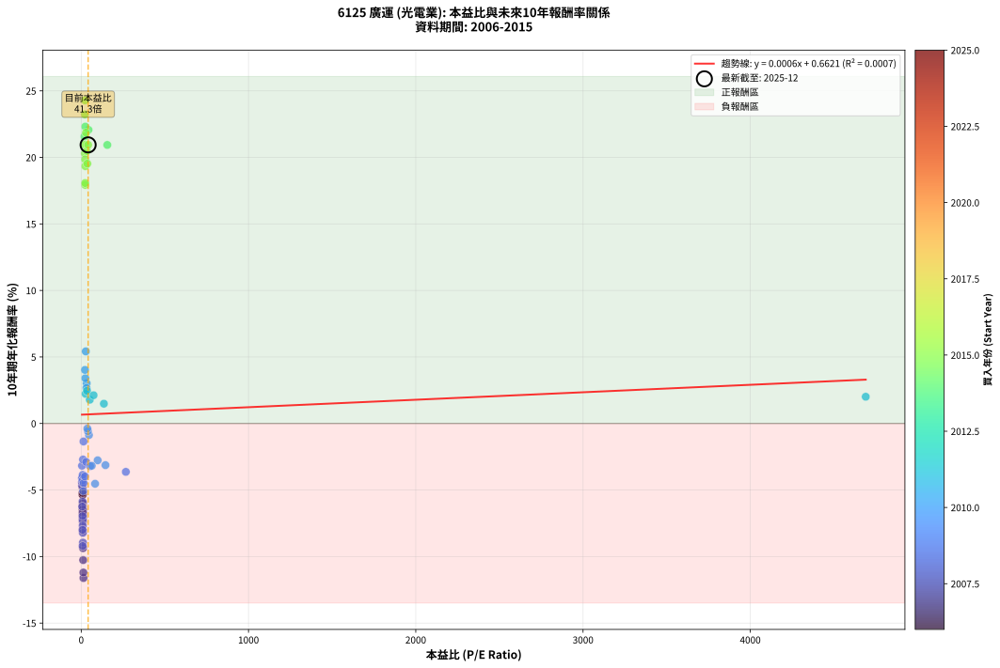
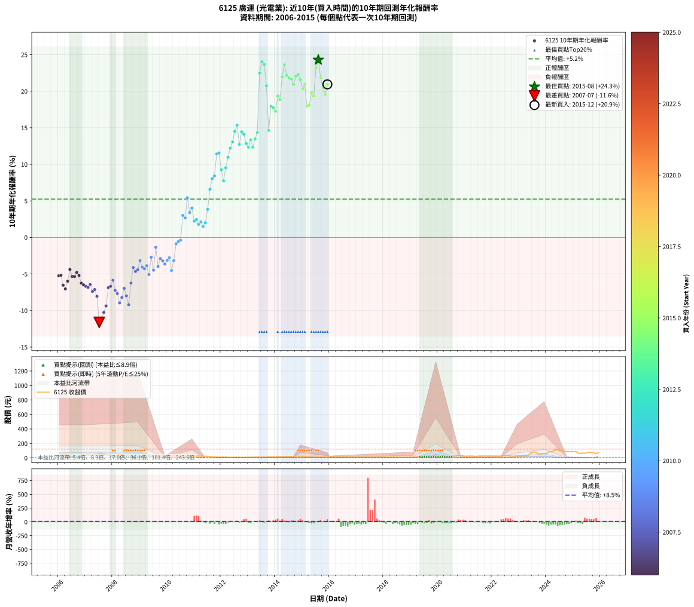

# 6125 廣運 - 本益比與未來報酬率分析

!!! info "報告資訊"
    - **股票代號**: 6125
    - **公司名稱**: 廣運
    - **產業別**: 光電業
    - **分析期間**: 2006-2015 (120 個數據點)
    - **資料來源**: Type 12 (ShowMonthlyK_ChartFlow) 月收盤價與本益比
    - **報酬率口徑**: 含現金股利 (簡化: 年度合計，假設每年7/1入帳)
    - **報告生成時間**: 2026-01-04 08:28:34 CST

## 📈 視覺化圖表

### 圖表1: 本益比 vs 未來報酬率關係

*圖表1：6125 廣運 本益比與10年期未來報酬率關係 (2006-2015)*

### 圖表2: 歷年買入時點的10年期實際報酬率

*圖表2：6125 廣運 歷年買入時點的10年期實際報酬率 (2006-2015)*

## 📍 買點訊號說明

本報告提供兩種買點提示訊號（顯示於圖表2的股價子圖中）：

### ▲ 小綠色三角形（回測驗證）
- **計算方式**: 使用全部歷史資料計算本益比第25百分位數
- **用途**: 事後驗證，顯示歷史上哪些時點確實為低估區
- **限制**: 當下無法判斷，僅供回測參考
- **特性**: 後見之明（Look-Ahead Bias）

### ▲ 小橘色三角形（即時訊號）
- **計算方式**: 使用截至當月的過去5年資料計算本益比第25百分位數
- **用途**: 實際投資決策，當時即可判斷
- **優勢**: 可操作性強，符合實務需求
- **特性**: 無後見之明，滾動窗口計算

!!! tip "如何使用兩種訊號"
    - **綠色▲** 幫助理解歷史估值機會，驗證策略有效性
    - **橘色▲** 可作為實際買進參考，但仍需搭配基本面分析
    - 兩種訊號重疊時，表示即時判斷與事後驗證一致，信心度較高
    - 僅有綠色▲時，表示當時無法判斷（需要未來資料才能確認）
    - 僅有橘色▲時，表示即時判斷為買點，但事後可能不是最佳時機

## 📊 估值分析摘要

| 指標 | 數值 |
|:---:|:---:|
| **目前本益比** (2015-12) | **41.33 倍** |
| **歷史平均本益比** | 85.32 倍 |
| **估值水準** | 🟢 相對低估 |
| **預期10年年化報酬率** | **+0.69%** |
| **歷史平均報酬率** | +5.24% |
| **相關係數 (R²)** | 0.0007 |
| **趨勢線斜率** | 0.0006 |

!!! abstract "核心洞察"
    目前本益比顯著低於歷史平均，預期未來報酬率可能較高

    根據歷史數據回測，6125 廣運 在目前本益比 **41.3倍** 的估值水準下，
    預期未來10年年化報酬率約為 **+0.7%**。

    **重要提醒**: 本分析基於歷史數據統計，實際報酬率會受到公司基本面變化、產業趨勢、
    總體經濟環境等多重因素影響。R² = 0.00 表示本益比可解釋約 0.1% 的報酬率變異。

## 📈 歷史估值統計

### 最佳買點 (最高報酬率)

| 項目 | 數值 |
|:---:|:---:|
| 起始時間 | 2015-08 |
| 當時本益比 | 23.06 倍 |
| 起始價格 | 10.3 元 |
| 10年後價格 | 79.7 元 |
| **10年年化報酬率** | **+24.29%** |

### 最差買點 (最低報酬率)

| 項目 | 數值 |
|:---:|:---:|
| 起始時間 | 2007-07 |
| 當時本益比 | 13.31 倍 |
| 起始價格 | 61.2 元 |
| 10年後價格 | 9.7 元 |
| **10年年化報酬率** | **-11.61%** |

## 🎯 投資啟示

### 本益比與報酬率關係

趨勢線方程式: **y = 0.0006x + 0.6621**

!!! info "弱相關或正相關"
    本益比與未來報酬率相關性較弱。這可能表示該股票的報酬率更多受到
    公司成長性、產業趨勢等因素影響，而非估值水準。**需綜合考量多項指標**。

### 估值區間建議

基於歷史數據分析:

- **🟢 低估區** (P/E < 68.3): 預期報酬率較高，可考慮增加持股
- **🟡 合理區** (P/E 68.3-102.4): 預期報酬率符合長期趨勢，正常持有
- **🔴 高估區** (P/E > 102.4): 預期報酬率較低，可考慮減碼或觀望

!!! danger "風險提示"
    - 過去表現不代表未來結果
    - 本分析假設公司基本面無重大結構性變化
    - 產業環境劇變可能使歷史規律失效
    - 應結合公司財報、產業趨勢、總體經濟等多重因素綜合判斷

!!! success "長期投資觀點"
    歷史數據顯示，在合理或低估的估值水準買入並長期持有，
    往往能獲得較佳的投資報酬。**耐心等待好價格**是價值投資的核心原則。

## 📊 數據品質

- **資料來源**: GoodInfo.tw Type 12 (ShowMonthlyK_ChartFlow)
- **資料頻率**: 月度收盤價與本益比
- **回測期間**: 2006-2015
- **數據點數量**: 120 個 (每個點代表一次10年期回測)

### 計算方法說明

1. **10年期年化報酬率**:
   - 對每個歷史時點，計算其後10年的實際投資報酬率
   - 期末價值(不含股利): 期末價格
   - 期末價值(含現金股利): 期末價格 + 持有期間內的現金股利合計 (簡化: 年度合計，假設每年7/1入帳)
   - 公式: 年化報酬率 = [(期末價值/期初價格)^(1/年數) - 1] × 100%

2. **本益比 (P/E Ratio)**:
   - 使用當時的月收盤價與EPS計算
   - 資料來源: Type 12 月度河流圖本益比數據

3. **趨勢線 (Linear Regression)**:
   - 使用最小平方法擬合線性趨勢線
   - R²值衡量本益比對報酬率的解釋能力

---

*本報告由 Stock Analysis System v1.9.0 自動生成*
*數據更新時間: 2026-01-04 08:28:34 CST*

## 📋 月度回測明細表

（每一列對應時間線圖中的一個買入點；可用來對照 SVG 圖上的每個點。）

| 買入月份 | 賣出月份 | 回測期限_年 | 實際持有年數 | 買入本益比_倍 | 買入收盤價_元 | 賣出收盤價_元 | 現金股利合計_元 | 總報酬率_pct | 年化報酬率_pct |
| --- | --- | --- | --- | --- | --- | --- | --- | --- | --- |
| 2006-01 | 2016-01 | 10 | 9.999 | 9.15 | 41.25 | 12.35 | 11.72 | -41.65 | -5.25 |
| 2006-02 | 2016-02 | 10 | 9.999 | 9.29 | 41.90 | 12.90 | 11.72 | -41.25 | -5.18 |
| 2006-03 | 2016-03 | 10 | 10.001 | 10.58 | 47.70 | 12.55 | 11.72 | -49.12 | -6.53 |
| 2006-04 | 2016-04 | 10 | 10.001 | 10.69 | 48.20 | 11.50 | 11.72 | -51.83 | -7.04 |
| 2006-05 | 2016-05 | 10 | 10.001 | 9.76 | 44.00 | 12.00 | 11.72 | -46.10 | -5.99 |
| 2006-06 | 2016-06 | 10 | 10.001 | 8.40 | 37.90 | 12.50 | 11.72 | -36.10 | -4.38 |
| 2006-07 | 2016-07 | 10 | 10.001 | 8.37 | 37.75 | 11.70 | 10.11 | -42.22 | -5.34 |
| 2006-08 | 2016-08 | 10 | 10.001 | 8.58 | 38.70 | 12.20 | 10.11 | -42.35 | -5.36 |
| 2006-09 | 2016-09 | 10 | 10.001 | 7.96 | 35.90 | 11.85 | 10.11 | -38.82 | -4.79 |
| 2006-10 | 2016-10 | 10 | 10.001 | 8.26 | 37.25 | 11.70 | 10.11 | -41.44 | -5.21 |
| 2006-11 | 2016-11 | 10 | 10.001 | 8.76 | 39.50 | 10.60 | 10.11 | -47.56 | -6.25 |
| 2006-12 | 2016-12 | 10 | 10.001 | 8.98 | 40.50 | 10.60 | 10.11 | -48.86 | -6.49 |
| 2007-01 | 2017-01 | 10 | 10.001 | 9.18 | 41.50 | 10.65 | 10.11 | -49.97 | -6.69 |
| 2007-02 | 2017-02 | 10 | 10.001 | 9.44 | 42.80 | 10.95 | 10.11 | -50.79 | -6.84 |
| 2007-03 | 2017-03 | 10 | 10.001 | 8.93 | 40.60 | 10.75 | 10.11 | -48.62 | -6.44 |
| 2007-04 | 2017-04 | 10 | 10.001 | 9.55 | 43.55 | 10.10 | 10.11 | -53.59 | -7.39 |
| 2007-05 | 2017-05 | 10 | 10.001 | 9.03 | 41.30 | 9.61 | 10.11 | -52.25 | -7.12 |
| 2007-06 | 2017-06 | 10 | 10.001 | 9.99 | 45.80 | 9.65 | 10.11 | -56.85 | -8.06 |
| 2007-07 | 2017-07 | 10 | 10.001 | 13.31 | 61.20 | 9.69 | 8.11 | -70.91 | -11.61 |
| 2007-08 | 2017-08 | 10 | 10.001 | 12.82 | 59.10 | 9.90 | 8.11 | -69.52 | -11.20 |
| 2007-09 | 2017-09 | 10 | 10.001 | 11.57 | 53.50 | 10.00 | 8.11 | -66.15 | -10.26 |
| 2007-10 | 2017-10 | 10 | 10.001 | 10.66 | 49.40 | 10.35 | 8.11 | -62.63 | -9.37 |
| 2007-11 | 2017-11 | 10 | 10.001 | 9.10 | 42.30 | 12.65 | 8.11 | -50.92 | -6.87 |
| 2007-12 | 2017-12 | 10 | 10.001 | 8.86 | 41.30 | 12.55 | 8.11 | -49.97 | -6.69 |
| 2008-01 | 2018-01 | 10 | 10.001 | 7.96 | 37.25 | 12.25 | 8.11 | -45.34 | -5.86 |
| 2008-02 | 2018-03 | 10 | 10.081 | 8.60 | 40.40 | 10.80 | 8.11 | -53.19 | -7.25 |
| 2008-03 | 2018-03 | 10 | 9.999 | 8.92 | 42.05 | 10.80 | 8.11 | -55.02 | -7.68 |
| 2008-04 | 2018-04 | 10 | 9.999 | 10.01 | 47.40 | 10.45 | 8.11 | -60.84 | -8.95 |
| 2008-05 | 2018-05 | 10 | 9.999 | 9.68 | 46.00 | 11.40 | 8.11 | -57.58 | -8.22 |
| 2008-06 | 2018-06 | 10 | 9.999 | 8.09 | 38.60 | 10.65 | 8.11 | -51.39 | -6.96 |
| 2008-07 | 2018-07 | 10 | 9.999 | 7.74 | 37.05 | 10.70 | 5.41 | -56.51 | -7.99 |
| 2008-08 | 2018-08 | 10 | 9.999 | 8.48 | 40.75 | 10.10 | 5.41 | -61.93 | -9.21 |
| 2008-09 | 2018-09 | 10 | 9.999 | 5.94 | 28.65 | 9.63 | 5.41 | -47.50 | -6.24 |
| 2008-10 | 2018-10 | 10 | 9.999 | 4.56 | 22.10 | 9.10 | 5.41 | -34.33 | -4.12 |
| 2008-11 | 2018-11 | 10 | 9.999 | 5.04 | 24.50 | 9.79 | 5.41 | -37.95 | -4.66 |
| 2008-12 | 2018-12 | 10 | 9.999 | 4.64 | 22.65 | 9.00 | 5.41 | -36.37 | -4.42 |
| 2009-01 | 2019-01 | 10 | 9.999 | 4.71 | 21.10 | 9.87 | 5.41 | -27.57 | -3.17 |
| 2009-02 | 2019-02 | 10 | 9.999 | 5.54 | 22.65 | 9.53 | 5.41 | -34.03 | -4.08 |
| 2009-03 | 2019-03 | 10 | 9.999 | 7.21 | 26.60 | 11.75 | 5.41 | -35.48 | -4.29 |
| 2009-04 | 2019-04 | 10 | 9.999 | 8.91 | 29.30 | 14.35 | 5.41 | -32.55 | -3.86 |
| 2009-05 | 2019-05 | 10 | 9.999 | 11.44 | 33.10 | 14.25 | 5.41 | -40.60 | -5.08 |
| 2009-06 | 2019-06 | 10 | 9.999 | 10.66 | 26.60 | 14.80 | 5.41 | -24.02 | -2.71 |
| 2009-07 | 2019-07 | 10 | 9.999 | 13.92 | 29.20 | 14.05 | 4.42 | -36.75 | -4.48 |
| 2009-08 | 2019-08 | 10 | 9.999 | 13.56 | 23.05 | 15.70 | 4.42 | -12.72 | -1.35 |
| 2009-09 | 2019-09 | 10 | 9.999 | 22.03 | 28.70 | 14.70 | 4.42 | -33.39 | -3.98 |
| 2009-10 | 2019-10 | 10 | 9.999 | 29.50 | 26.70 | 15.50 | 4.42 | -25.40 | -2.89 |
| 2009-11 | 2019-11 | 10 | 9.999 | 52.71 | 26.75 | 14.90 | 4.42 | -27.78 | -3.20 |
| 2009-12 | 2019-12 | 10 | 9.999 | 266.80 | 29.35 | 15.85 | 4.42 | -30.94 | -3.64 |
| 2010-01 | 2020-01 | 10 | 9.999 | 144.90 | 27.65 | 15.70 | 4.42 | -27.24 | -3.13 |
| 2010-02 | 2020-02 | 10 | 9.999 | 98.28 | 26.70 | 15.75 | 4.42 | -24.46 | -2.77 |
| 2010-03 | 2020-03 | 10 | 10.001 | 82.84 | 29.20 | 13.95 | 4.42 | -37.10 | -4.53 |
| 2010-04 | 2020-04 | 10 | 10.001 | 63.00 | 27.30 | 15.35 | 4.42 | -27.59 | -3.18 |
| 2010-05 | 2020-05 | 10 | 10.001 | 46.19 | 23.75 | 17.35 | 4.42 | -8.35 | -0.87 |
| 2010-06 | 2020-06 | 10 | 10.001 | 40.00 | 23.80 | 18.05 | 4.42 | -5.60 | -0.57 |
| 2010-07 | 2020-07 | 10 | 10.001 | 36.70 | 24.80 | 17.95 | 5.92 | -3.76 | -0.38 |
| 2010-08 | 2020-08 | 10 | 10.001 | 32.51 | 24.60 | 27.20 | 5.92 | +34.63 | +3.02 |
| 2010-09 | 2020-09 | 10 | 10.001 | 31.40 | 26.30 | 28.30 | 5.92 | +30.11 | +2.67 |
| 2010-10 | 2020-10 | 10 | 10.001 | 27.28 | 25.05 | 36.55 | 5.92 | +69.53 | +5.42 |
| 2010-11 | 2020-11 | 10 | 10.001 | 24.72 | 24.70 | 28.60 | 5.92 | +39.75 | +3.40 |
| 2010-12 | 2020-12 | 10 | 10.001 | 22.50 | 24.30 | 30.15 | 5.92 | +48.43 | +4.03 |
| 2011-01 | 2021-01 | 10 | 10.001 | 26.20 | 23.60 | 23.50 | 5.92 | +24.65 | +2.23 |
| 2011-02 | 2021-02 | 10 | 10.001 | 34.64 | 25.00 | 25.95 | 5.92 | +27.47 | +2.46 |
| 2011-03 | 2021-03 | 10 | 10.001 | 51.15 | 27.75 | 27.20 | 5.92 | +19.34 | +1.78 |
| 2011-04 | 2021-04 | 10 | 10.001 | 73.76 | 26.80 | 27.15 | 5.92 | +23.39 | +2.12 |
| 2011-05 | 2021-05 | 10 | 10.001 | 135.50 | 24.95 | 23.00 | 5.92 | +15.90 | +1.49 |
| 2011-06 | 2021-06 | 10 | 10.001 | 4690.00 | 23.45 | 22.70 | 5.92 | +22.04 | +2.01 |
| 2011-07 | 2021-07 | 10 | 10.001 |  | 22.90 | 26.90 | 6.51 | +45.89 | +3.85 |
| 2011-08 | 2021-08 | 10 | 10.001 |  | 17.80 | 27.15 | 6.51 | +89.09 | +6.58 |
| 2011-09 | 2021-09 | 10 | 10.001 |  | 15.80 | 27.75 | 6.51 | +116.82 | +8.05 |
| 2011-10 | 2021-10 | 10 | 10.001 |  | 15.30 | 27.80 | 6.51 | +124.24 | +8.41 |
| 2011-11 | 2021-11 | 10 | 10.001 |  | 11.15 | 26.40 | 6.51 | +195.14 | +11.43 |
| 2011-12 | 2021-12 | 10 | 10.001 |  | 11.70 | 28.40 | 6.51 | +198.36 | +11.55 |
| 2012-01 | 2022-01 | 10 | 10.001 |  | 13.40 | 26.00 | 6.51 | +142.60 | +9.27 |
| 2012-02 | 2022-03 | 10 | 10.081 |  | 15.35 | 26.05 | 6.51 | +112.10 | +7.74 |
| 2012-03 | 2022-03 | 10 | 9.999 |  | 13.10 | 26.05 | 6.51 | +148.53 | +9.53 |
| 2012-04 | 2022-04 | 10 | 9.999 |  | 10.55 | 23.35 | 6.51 | +183.01 | +10.97 |
| 2012-05 | 2022-05 | 10 | 9.999 |  | 10.40 | 26.40 | 6.51 | +216.42 | +12.21 |
| 2012-06 | 2022-06 | 10 | 9.999 |  | 10.80 | 30.35 | 6.51 | +241.28 | +13.06 |
| 2012-07 | 2022-07 | 10 | 9.999 |  | 9.88 | 30.35 | 7.92 | +287.34 | +14.50 |
| 2012-08 | 2022-08 | 10 | 9.999 |  | 9.90 | 33.40 | 7.92 | +317.36 | +15.36 |
| 2012-09 | 2022-09 | 10 | 9.999 |  | 10.70 | 27.50 | 7.92 | +231.02 | +12.72 |
| 2012-10 | 2022-10 | 10 | 9.999 |  | 8.32 | 24.15 | 7.92 | +285.44 | +14.45 |
| 2012-11 | 2022-11 | 10 | 9.999 |  | 9.04 | 25.95 | 7.92 | +274.66 | +14.12 |
| 2012-12 | 2022-12 | 10 | 9.999 |  | 9.96 | 25.40 | 7.92 | +234.53 | +12.84 |
| 2013-01 | 2023-01 | 10 | 9.999 |  | 10.80 | 26.60 | 7.92 | +219.62 | +12.32 |
| 2013-02 | 2023-02 | 10 | 9.999 |  | 10.20 | 27.80 | 7.92 | +250.19 | +13.35 |
| 2013-03 | 2023-03 | 10 | 9.999 |  | 11.55 | 29.05 | 7.92 | +220.08 | +12.34 |
| 2013-04 | 2023-04 | 10 | 9.999 |  | 11.20 | 31.70 | 7.92 | +253.74 | +13.47 |
| 2013-05 | 2023-05 | 10 | 9.999 |  | 11.10 | 34.50 | 7.92 | +282.15 | +14.35 |
| 2013-06 | 2023-06 | 10 | 9.999 |  | 10.10 | 68.80 | 7.92 | +659.59 | +22.48 |
| 2013-07 | 2023-07 | 10 | 9.999 |  | 10.10 | 77.50 | 9.54 | +761.77 | +24.04 |
| 2013-08 | 2023-08 | 10 | 9.999 |  | 10.80 | 80.90 | 9.54 | +737.40 | +23.68 |
| 2013-09 | 2023-09 | 10 | 9.999 |  | 11.20 | 64.20 | 9.54 | +558.38 | +20.74 |
| 2013-10 | 2023-10 | 10 | 9.999 |  | 15.15 | 49.85 | 9.54 | +292.01 | +14.64 |
| 2013-11 | 2023-11 | 10 | 9.999 |  | 13.90 | 62.90 | 9.54 | +421.14 | +17.95 |
| 2013-12 | 2023-12 | 10 | 9.999 |  | 14.15 | 63.00 | 9.54 | +412.64 | +17.76 |
| 2014-01 | 2024-01 | 10 | 9.999 |  | 14.30 | 60.70 | 9.54 | +391.18 | +17.26 |
| 2014-02 | 2024-02 | 10 | 9.999 |  | 16.15 | 85.20 | 9.54 | +486.62 | +19.36 |
| 2014-03 | 2024-03 | 10 | 10.001 |  | 16.40 | 82.80 | 9.54 | +463.04 | +18.86 |
| 2014-04 | 2024-04 | 10 | 10.001 |  | 13.90 | 91.70 | 9.54 | +628.34 | +21.96 |
| 2014-05 | 2024-05 | 10 | 10.001 |  | 15.85 | 122.50 | 9.54 | +733.05 | +23.61 |
| 2014-06 | 2024-06 | 10 | 10.001 |  | 16.15 | 110.00 | 9.54 | +640.18 | +22.16 |
| 2014-07 | 2024-07 | 10 | 10.001 |  | 15.25 | 99.10 | 10.74 | +620.26 | +21.83 |
| 2014-08 | 2024-08 | 10 | 10.001 |  | 14.90 | 95.20 | 10.74 | +611.00 | +21.67 |
| 2014-09 | 2024-09 | 10 | 10.001 | 155.90 | 15.20 | 91.00 | 10.74 | +569.34 | +20.94 |
| 2014-10 | 2024-10 | 10 | 10.001 | 43.32 | 13.50 | 88.50 | 10.74 | +635.10 | +22.07 |
| 2014-11 | 2024-11 | 10 | 10.001 | 24.34 | 12.80 | 85.20 | 10.74 | +649.52 | +22.31 |
| 2014-12 | 2024-12 | 10 | 10.001 | 19.32 | 14.30 | 90.10 | 10.74 | +605.17 | +21.57 |
| 2015-01 | 2025-01 | 10 | 10.001 | 21.40 | 15.05 | 84.80 | 10.74 | +534.81 | +20.30 |
| 2015-02 | 2025-02 | 10 | 10.001 | 22.58 | 15.05 | 90.20 | 10.74 | +570.69 | +20.96 |
| 2015-03 | 2025-03 | 10 | 10.001 | 23.49 | 14.80 | 66.30 | 10.74 | +420.53 | +17.93 |
| 2015-04 | 2025-04 | 10 | 10.001 | 23.60 | 14.00 | 63.00 | 10.74 | +426.71 | +18.07 |
| 2015-05 | 2025-05 | 10 | 10.001 | 23.35 | 13.00 | 68.80 | 10.74 | +511.84 | +19.85 |
| 2015-06 | 2025-06 | 10 | 10.001 | 24.52 | 12.75 | 64.00 | 10.74 | +486.19 | +19.34 |
| 2015-07 | 2025-07 | 10 | 10.001 | 21.62 | 10.45 | 73.50 | 10.94 | +708.03 | +23.23 |
| 2015-08 | 2025-08 | 10 | 10.001 | 23.06 | 10.30 | 79.70 | 10.94 | +779.99 | +24.29 |
| 2015-09 | 2025-09 | 10 | 10.001 | 28.41 | 11.65 | 73.20 | 10.94 | +622.22 | +21.86 |
| 2015-10 | 2025-10 | 10 | 10.001 | 33.75 | 12.60 | 70.30 | 10.94 | +544.75 | +20.48 |
| 2015-11 | 2025-11 | 10 | 10.001 | 36.53 | 12.30 | 62.30 | 10.94 | +495.44 | +19.53 |
| 2015-12 | 2025-12 | 10 | 10.001 | 41.33 | 12.40 | 72.10 | 10.94 | +569.67 | +20.94 |
