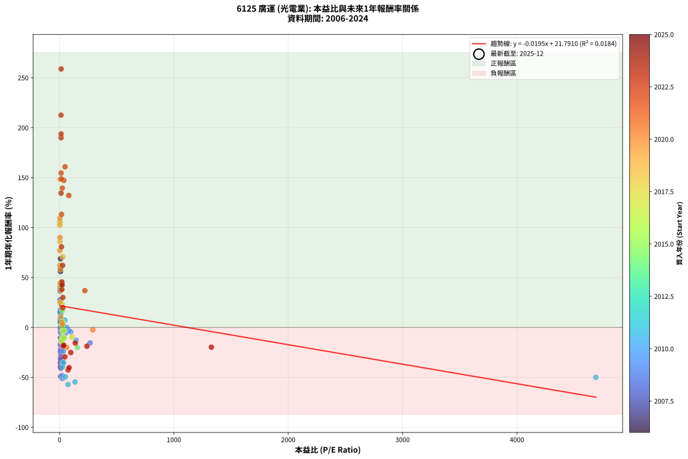
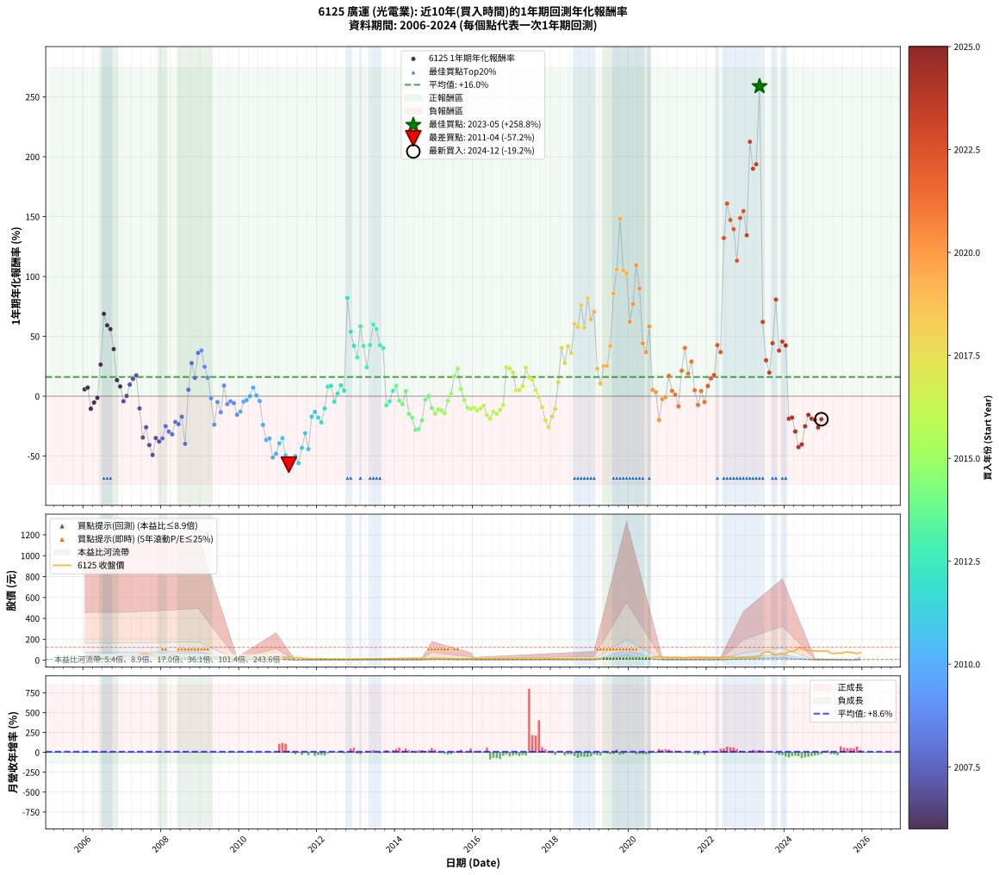

# 6125 廣運 - 本益比與未來報酬率分析

!!! info "報告資訊"
    - **股票代號**: 6125
    - **公司名稱**: 廣運
    - **產業別**: 光電業
    - **分析期間**: 2006-2024 (228 個數據點)
    - **資料來源**: Type 12 (ShowMonthlyK_ChartFlow) 月收盤價與本益比
    - **報酬率口徑**: 含現金股利 (簡化: 年度合計，假設每年7/1入帳)
    - **報告生成時間**: 2026-01-04 08:20:19 CST

## 📈 視覺化圖表

### 圖表1: 本益比 vs 未來報酬率關係

*圖表1：6125 廣運 本益比與1年期未來報酬率關係 (2006-2024)*

### 圖表2: 歷年買入時點的1年期實際報酬率

*圖表2：6125 廣運 歷年買入時點的1年期實際報酬率 (2006-2024)*

## 📍 買點訊號說明

本報告提供兩種買點提示訊號（顯示於圖表2的股價子圖中）：

### ▲ 小綠色三角形（回測驗證）
- **計算方式**: 使用全部歷史資料計算本益比第25百分位數
- **用途**: 事後驗證，顯示歷史上哪些時點確實為低估區
- **限制**: 當下無法判斷，僅供回測參考
- **特性**: 後見之明（Look-Ahead Bias）

### ▲ 小橘色三角形（即時訊號）
- **計算方式**: 使用截至當月的過去5年資料計算本益比第25百分位數
- **用途**: 實際投資決策，當時即可判斷
- **優勢**: 可操作性強，符合實務需求
- **特性**: 無後見之明，滾動窗口計算

!!! tip "如何使用兩種訊號"
    - **綠色▲** 幫助理解歷史估值機會，驗證策略有效性
    - **橘色▲** 可作為實際買進參考，但仍需搭配基本面分析
    - 兩種訊號重疊時，表示即時判斷與事後驗證一致，信心度較高
    - 僅有綠色▲時，表示當時無法判斷（需要未來資料才能確認）
    - 僅有橘色▲時，表示即時判斷為買點，但事後可能不是最佳時機

## 📊 估值分析摘要

| 指標 | 數值 |
|:---:|:---:|
| **目前本益比** (2024-12) | **nan 倍** |
| **歷史平均本益比** | 77.15 倍 |
| **估值水準** | 🟡 合理範圍 |
| **預期1年年化報酬率** | **+nan%** |
| **歷史平均報酬率** | +16.04% |
| **相關係數 (R²)** | 0.0184 |
| **趨勢線斜率** | -0.0195 |

!!! abstract "核心洞察"
    目前本益比接近歷史平均，預期報酬率符合長期趨勢

    根據歷史數據回測，6125 廣運 在目前本益比 **nan倍** 的估值水準下，
    預期未來1年年化報酬率約為 **+nan%**。

    **重要提醒**: 本分析基於歷史數據統計，實際報酬率會受到公司基本面變化、產業趨勢、
    總體經濟環境等多重因素影響。R² = 0.02 表示本益比可解釋約 1.8% 的報酬率變異。

## 📈 歷史估值統計

### 最佳買點 (最高報酬率)

| 項目 | 數值 |
|:---:|:---:|
| 起始時間 | 2023-05 |
| 當時本益比 | 14.10 倍 |
| 起始價格 | 34.5 元 |
| 1年後價格 | 122.5 元 |
| **1年年化報酬率** | **+258.83%** |

### 最差買點 (最低報酬率)

| 項目 | 數值 |
|:---:|:---:|
| 起始時間 | 2011-04 |
| 當時本益比 | 73.76 倍 |
| 起始價格 | 26.8 元 |
| 1年後價格 | 10.6 元 |
| **1年年化報酬率** | **-57.16%** |

## 🎯 投資啟示

### 本益比與報酬率關係

趨勢線方程式: **y = -0.0195x + 21.7910**

!!! note "負相關"
    本益比與未來報酬率呈現負相關。較低的本益比通常帶來較高的未來報酬率，
    但相關性不算非常強。**估值仍是重要參考指標之一**。

### 估值區間建議

基於歷史數據分析:

- **🟢 低估區** (P/E < 61.7): 預期報酬率較高，可考慮增加持股
- **🟡 合理區** (P/E 61.7-92.6): 預期報酬率符合長期趨勢，正常持有
- **🔴 高估區** (P/E > 92.6): 預期報酬率較低，可考慮減碼或觀望

!!! danger "風險提示"
    - 過去表現不代表未來結果
    - 本分析假設公司基本面無重大結構性變化
    - 產業環境劇變可能使歷史規律失效
    - 應結合公司財報、產業趨勢、總體經濟等多重因素綜合判斷

!!! success "長期投資觀點"
    歷史數據顯示，在合理或低估的估值水準買入並長期持有，
    往往能獲得較佳的投資報酬。**耐心等待好價格**是價值投資的核心原則。

## 📊 數據品質

- **資料來源**: GoodInfo.tw Type 12 (ShowMonthlyK_ChartFlow)
- **資料頻率**: 月度收盤價與本益比
- **回測期間**: 2006-2024
- **數據點數量**: 228 個 (每個點代表一次1年期回測)

### 計算方法說明

1. **1年期年化報酬率**:
   - 對每個歷史時點，計算其後1年的實際投資報酬率
   - 期末價值(不含股利): 期末價格
   - 期末價值(含現金股利): 期末價格 + 持有期間內的現金股利合計 (簡化: 年度合計，假設每年7/1入帳)
   - 公式: 年化報酬率 = [(期末價值/期初價格)^(1/年數) - 1] × 100%

2. **本益比 (P/E Ratio)**:
   - 使用當時的月收盤價與EPS計算
   - 資料來源: Type 12 月度河流圖本益比數據

3. **趨勢線 (Linear Regression)**:
   - 使用最小平方法擬合線性趨勢線
   - R²值衡量本益比對報酬率的解釋能力

---

*本報告由 Stock Analysis System v1.9.0 自動生成*
*數據更新時間: 2026-01-04 08:20:19 CST*

## 📋 月度回測明細表

（每一列對應時間線圖中的一個買入點；可用來對照 SVG 圖上的每個點。）

| 買入月份 | 賣出月份 | 回測期限_年 | 實際持有年數 | 買入本益比_倍 | 買入收盤價_元 | 賣出收盤價_元 | 現金股利合計_元 | 總報酬率_pct | 年化報酬率_pct |
| --- | --- | --- | --- | --- | --- | --- | --- | --- | --- |
| 2006-01 | 2007-01 | 1 | 0.999 | 9.15 | 41.25 | 41.50 | 2.11 | +5.71 | +5.72 |
| 2006-02 | 2007-02 | 1 | 0.999 | 9.29 | 41.90 | 42.80 | 2.11 | +7.17 | +7.18 |
| 2006-03 | 2007-03 | 1 | 0.999 | 10.58 | 47.70 | 40.60 | 2.11 | -10.47 | -10.48 |
| 2006-04 | 2007-04 | 1 | 0.999 | 10.69 | 48.20 | 43.55 | 2.11 | -5.28 | -5.28 |
| 2006-05 | 2007-05 | 1 | 0.999 | 9.76 | 44.00 | 41.30 | 2.11 | -1.35 | -1.35 |
| 2006-06 | 2007-06 | 1 | 0.999 | 8.40 | 37.90 | 45.80 | 2.11 | +26.40 | +26.42 |
| 2006-07 | 2007-07 | 1 | 0.999 | 8.37 | 37.75 | 61.20 | 2.50 | +68.74 | +68.80 |
| 2006-08 | 2007-08 | 1 | 0.999 | 8.58 | 38.70 | 59.10 | 2.50 | +59.17 | +59.22 |
| 2006-09 | 2007-09 | 1 | 0.999 | 7.96 | 35.90 | 53.50 | 2.50 | +55.99 | +56.04 |
| 2006-10 | 2007-10 | 1 | 0.999 | 8.26 | 37.25 | 49.40 | 2.50 | +39.33 | +39.36 |
| 2006-11 | 2007-11 | 1 | 0.999 | 8.76 | 39.50 | 42.30 | 2.50 | +13.42 | +13.43 |
| 2006-12 | 2007-12 | 1 | 0.999 | 8.98 | 40.50 | 41.30 | 2.50 | +8.15 | +8.15 |
| 2007-01 | 2008-01 | 1 | 0.999 | 9.18 | 41.50 | 37.25 | 2.50 | -4.22 | -4.22 |
| 2007-02 | 2008-02 | 1 | 0.999 | 9.44 | 42.80 | 40.40 | 2.50 | +0.23 | +0.23 |
| 2007-03 | 2008-03 | 1 | 1.002 | 8.93 | 40.60 | 42.05 | 2.50 | +9.73 | +9.71 |
| 2007-04 | 2008-04 | 1 | 1.002 | 9.55 | 43.55 | 47.40 | 2.50 | +14.58 | +14.55 |
| 2007-05 | 2008-05 | 1 | 1.002 | 9.03 | 41.30 | 46.00 | 2.50 | +17.43 | +17.39 |
| 2007-06 | 2008-06 | 1 | 1.002 | 9.99 | 45.80 | 38.60 | 2.50 | -10.26 | -10.24 |
| 2007-07 | 2008-07 | 1 | 1.002 | 13.31 | 61.20 | 37.05 | 3.00 | -34.56 | -34.50 |
| 2007-08 | 2008-08 | 1 | 1.002 | 12.82 | 59.10 | 40.75 | 3.00 | -25.97 | -25.93 |
| 2007-09 | 2008-09 | 1 | 1.002 | 11.57 | 53.50 | 28.65 | 3.00 | -40.84 | -40.78 |
| 2007-10 | 2008-10 | 1 | 1.002 | 10.66 | 49.40 | 22.10 | 3.00 | -49.19 | -49.12 |
| 2007-11 | 2008-11 | 1 | 1.002 | 9.10 | 42.30 | 24.50 | 3.00 | -34.99 | -34.93 |
| 2007-12 | 2008-12 | 1 | 1.002 | 8.86 | 41.30 | 22.65 | 3.00 | -37.89 | -37.83 |
| 2008-01 | 2009-01 | 1 | 1.002 | 7.96 | 37.25 | 21.10 | 3.00 | -35.30 | -35.24 |
| 2008-02 | 2009-03 | 1 | 1.081 | 8.60 | 40.40 | 26.60 | 3.00 | -26.73 | -25.00 |
| 2008-03 | 2009-03 | 1 | 0.999 | 8.92 | 42.05 | 26.60 | 3.00 | -29.61 | -29.62 |
| 2008-04 | 2009-04 | 1 | 0.999 | 10.01 | 47.40 | 29.30 | 3.00 | -31.86 | -31.87 |
| 2008-05 | 2009-05 | 1 | 0.999 | 9.68 | 46.00 | 33.10 | 3.00 | -21.52 | -21.53 |
| 2008-06 | 2009-06 | 1 | 0.999 | 8.09 | 38.60 | 26.60 | 3.00 | -23.32 | -23.33 |
| 2008-07 | 2009-07 | 1 | 0.999 | 7.74 | 37.05 | 29.20 | 1.50 | -17.14 | -17.15 |
| 2008-08 | 2009-08 | 1 | 0.999 | 8.48 | 40.75 | 23.05 | 1.50 | -39.75 | -39.78 |
| 2008-09 | 2009-09 | 1 | 0.999 | 5.94 | 28.65 | 28.70 | 1.50 | +5.41 | +5.41 |
| 2008-10 | 2009-10 | 1 | 0.999 | 4.56 | 22.10 | 26.70 | 1.50 | +27.60 | +27.62 |
| 2008-11 | 2009-11 | 1 | 0.999 | 5.04 | 24.50 | 26.75 | 1.50 | +15.31 | +15.32 |
| 2008-12 | 2009-12 | 1 | 0.999 | 4.64 | 22.65 | 29.35 | 1.50 | +36.20 | +36.23 |
| 2009-01 | 2010-01 | 1 | 0.999 | 4.71 | 21.10 | 27.65 | 1.50 | +38.15 | +38.18 |
| 2009-02 | 2010-02 | 1 | 0.999 | 5.54 | 22.65 | 26.70 | 1.50 | +24.50 | +24.52 |
| 2009-03 | 2010-03 | 1 | 0.999 | 7.21 | 26.60 | 29.20 | 1.50 | +15.41 | +15.42 |
| 2009-04 | 2010-04 | 1 | 0.999 | 8.91 | 29.30 | 27.30 | 1.50 | -1.71 | -1.71 |
| 2009-05 | 2010-05 | 1 | 0.999 | 11.44 | 33.10 | 23.75 | 1.50 | -23.72 | -23.73 |
| 2009-06 | 2010-06 | 1 | 0.999 | 10.66 | 26.60 | 23.80 | 1.50 | -4.89 | -4.89 |
| 2009-07 | 2010-07 | 1 | 0.999 | 13.92 | 29.20 | 24.80 | 0.50 | -13.36 | -13.36 |
| 2009-08 | 2010-08 | 1 | 0.999 | 13.56 | 23.05 | 24.60 | 0.50 | +8.89 | +8.90 |
| 2009-09 | 2010-09 | 1 | 0.999 | 22.03 | 28.70 | 26.30 | 0.50 | -6.62 | -6.62 |
| 2009-10 | 2010-10 | 1 | 0.999 | 29.50 | 26.70 | 25.05 | 0.50 | -4.31 | -4.31 |
| 2009-11 | 2010-11 | 1 | 0.999 | 52.71 | 26.75 | 24.70 | 0.50 | -5.79 | -5.80 |
| 2009-12 | 2010-12 | 1 | 0.999 | 266.80 | 29.35 | 24.30 | 0.50 | -15.50 | -15.51 |
| 2010-01 | 2011-01 | 1 | 0.999 | 144.90 | 27.65 | 23.60 | 0.50 | -12.84 | -12.85 |
| 2010-02 | 2011-02 | 1 | 0.999 | 98.28 | 26.70 | 25.00 | 0.50 | -4.49 | -4.50 |
| 2010-03 | 2011-03 | 1 | 0.999 | 82.84 | 29.20 | 27.75 | 0.50 | -3.25 | -3.26 |
| 2010-04 | 2011-04 | 1 | 0.999 | 63.00 | 27.30 | 26.80 | 0.50 | +0.00 | +0.00 |
| 2010-05 | 2011-05 | 1 | 0.999 | 46.19 | 23.75 | 24.95 | 0.50 | +7.16 | +7.16 |
| 2010-06 | 2011-06 | 1 | 0.999 | 40.00 | 23.80 | 23.45 | 0.50 | +0.63 | +0.63 |
| 2010-07 | 2011-07 | 1 | 0.999 | 36.70 | 24.80 | 22.90 | 0.91 | -3.99 | -3.99 |
| 2010-08 | 2011-08 | 1 | 0.999 | 32.51 | 24.60 | 17.80 | 0.91 | -23.94 | -23.96 |
| 2010-09 | 2011-09 | 1 | 0.999 | 31.40 | 26.30 | 15.80 | 0.91 | -36.46 | -36.48 |
| 2010-10 | 2011-10 | 1 | 0.999 | 27.28 | 25.05 | 15.30 | 0.91 | -35.29 | -35.31 |
| 2010-11 | 2011-11 | 1 | 0.999 | 24.72 | 24.70 | 11.15 | 0.91 | -51.17 | -51.20 |
| 2010-12 | 2011-12 | 1 | 0.999 | 22.50 | 24.30 | 11.70 | 0.91 | -48.11 | -48.13 |
| 2011-01 | 2012-01 | 1 | 0.999 | 26.20 | 23.60 | 13.40 | 0.91 | -39.36 | -39.39 |
| 2011-02 | 2012-02 | 1 | 0.999 | 34.64 | 25.00 | 15.35 | 0.91 | -34.96 | -34.98 |
| 2011-03 | 2012-03 | 1 | 1.002 | 51.15 | 27.75 | 13.10 | 0.91 | -49.51 | -49.44 |
| 2011-04 | 2012-04 | 1 | 1.002 | 73.76 | 26.80 | 10.55 | 0.91 | -57.24 | -57.16 |
| 2011-05 | 2012-05 | 1 | 1.002 | 135.50 | 24.95 | 10.40 | 0.91 | -54.67 | -54.60 |
| 2011-06 | 2012-06 | 1 | 1.002 | 4690.00 | 23.45 | 10.80 | 0.91 | -50.06 | -49.99 |
| 2011-07 | 2012-07 | 1 | 1.002 |  | 22.90 | 9.88 | 0.20 | -55.97 | -55.90 |
| 2011-08 | 2012-08 | 1 | 1.002 |  | 17.80 | 9.90 | 0.20 | -43.25 | -43.18 |
| 2011-09 | 2012-09 | 1 | 1.002 |  | 15.80 | 10.70 | 0.20 | -31.00 | -30.95 |
| 2011-10 | 2012-10 | 1 | 1.002 |  | 15.30 | 8.32 | 0.20 | -44.30 | -44.23 |
| 2011-11 | 2012-11 | 1 | 1.002 |  | 11.15 | 9.04 | 0.20 | -17.11 | -17.08 |
| 2011-12 | 2012-12 | 1 | 1.002 |  | 11.70 | 9.96 | 0.20 | -13.15 | -13.12 |
| 2012-01 | 2013-01 | 1 | 1.002 |  | 13.40 | 10.80 | 0.20 | -17.90 | -17.86 |
| 2012-02 | 2013-03 | 1 | 1.081 |  | 15.35 | 11.55 | 0.20 | -23.44 | -21.88 |
| 2012-03 | 2013-03 | 1 | 0.999 |  | 13.10 | 11.55 | 0.20 | -10.29 | -10.30 |
| 2012-04 | 2013-04 | 1 | 0.999 |  | 10.55 | 11.20 | 0.20 | +8.08 | +8.08 |
| 2012-05 | 2013-05 | 1 | 0.999 |  | 10.40 | 11.10 | 0.20 | +8.67 | +8.68 |
| 2012-06 | 2013-06 | 1 | 0.999 |  | 10.80 | 10.10 | 0.20 | -4.61 | -4.61 |
| 2012-07 | 2013-07 | 1 | 0.999 |  | 9.88 | 10.10 | 0.00 | +2.23 | +2.23 |
| 2012-08 | 2013-08 | 1 | 0.999 |  | 9.90 | 10.80 | 0.00 | +9.09 | +9.10 |
| 2012-09 | 2013-09 | 1 | 0.999 |  | 10.70 | 11.20 | 0.00 | +4.67 | +4.68 |
| 2012-10 | 2013-10 | 1 | 0.999 |  | 8.32 | 15.15 | 0.00 | +82.09 | +82.17 |
| 2012-11 | 2013-11 | 1 | 0.999 |  | 9.04 | 13.90 | 0.00 | +53.76 | +53.81 |
| 2012-12 | 2013-12 | 1 | 0.999 |  | 9.96 | 14.15 | 0.00 | +42.07 | +42.10 |
| 2013-01 | 2014-01 | 1 | 0.999 |  | 10.80 | 14.30 | 0.00 | +32.41 | +32.43 |
| 2013-02 | 2014-02 | 1 | 0.999 |  | 10.20 | 16.15 | 0.00 | +58.33 | +58.38 |
| 2013-03 | 2014-03 | 1 | 0.999 |  | 11.55 | 16.40 | 0.00 | +41.99 | +42.03 |
| 2013-04 | 2014-04 | 1 | 0.999 |  | 11.20 | 13.90 | 0.00 | +24.11 | +24.13 |
| 2013-05 | 2014-05 | 1 | 0.999 |  | 11.10 | 15.85 | 0.00 | +42.79 | +42.83 |
| 2013-06 | 2014-06 | 1 | 0.999 |  | 10.10 | 16.15 | 0.00 | +59.90 | +59.95 |
| 2013-07 | 2014-07 | 1 | 0.999 |  | 10.10 | 15.25 | 0.50 | +55.94 | +55.99 |
| 2013-08 | 2014-08 | 1 | 0.999 |  | 10.80 | 14.90 | 0.50 | +42.59 | +42.63 |
| 2013-09 | 2014-09 | 1 | 0.999 |  | 11.20 | 15.20 | 0.50 | +40.18 | +40.21 |
| 2013-10 | 2014-10 | 1 | 0.999 |  | 15.15 | 13.50 | 0.50 | -7.59 | -7.60 |
| 2013-11 | 2014-11 | 1 | 0.999 |  | 13.90 | 12.80 | 0.50 | -4.32 | -4.32 |
| 2013-12 | 2014-12 | 1 | 0.999 |  | 14.15 | 14.30 | 0.50 | +4.59 | +4.60 |
| 2014-01 | 2015-01 | 1 | 0.999 |  | 14.30 | 15.05 | 0.50 | +8.74 | +8.75 |
| 2014-02 | 2015-02 | 1 | 0.999 |  | 16.15 | 15.05 | 0.50 | -3.72 | -3.72 |
| 2014-03 | 2015-03 | 1 | 0.999 |  | 16.40 | 14.80 | 0.50 | -6.71 | -6.71 |
| 2014-04 | 2015-04 | 1 | 0.999 |  | 13.90 | 14.00 | 0.50 | +4.32 | +4.32 |
| 2014-05 | 2015-05 | 1 | 0.999 |  | 15.85 | 13.00 | 0.50 | -14.83 | -14.84 |
| 2014-06 | 2015-06 | 1 | 0.999 |  | 16.15 | 12.75 | 0.50 | -17.96 | -17.97 |
| 2014-07 | 2015-07 | 1 | 0.999 |  | 15.25 | 10.45 | 0.50 | -28.20 | -28.21 |
| 2014-08 | 2015-08 | 1 | 0.999 |  | 14.90 | 10.30 | 0.50 | -27.52 | -27.53 |
| 2014-09 | 2015-09 | 1 | 0.999 | 155.90 | 15.20 | 11.65 | 0.50 | -20.07 | -20.08 |
| 2014-10 | 2015-10 | 1 | 0.999 | 43.32 | 13.50 | 12.60 | 0.50 | -2.96 | -2.96 |
| 2014-11 | 2015-11 | 1 | 0.999 | 24.34 | 12.80 | 12.30 | 0.50 | +0.00 | +0.00 |
| 2014-12 | 2015-12 | 1 | 0.999 | 19.32 | 14.30 | 12.40 | 0.50 | -9.79 | -9.80 |
| 2015-01 | 2016-01 | 1 | 0.999 | 21.40 | 15.05 | 12.35 | 0.50 | -14.62 | -14.63 |
| 2015-02 | 2016-02 | 1 | 0.999 | 22.58 | 15.05 | 12.90 | 0.50 | -10.96 | -10.97 |
| 2015-03 | 2016-03 | 1 | 1.002 | 23.49 | 14.80 | 12.55 | 0.50 | -11.82 | -11.80 |
| 2015-04 | 2016-04 | 1 | 1.002 | 23.60 | 14.00 | 11.50 | 0.50 | -14.29 | -14.26 |
| 2015-05 | 2016-05 | 1 | 1.002 | 23.35 | 13.00 | 12.00 | 0.50 | -3.85 | -3.84 |
| 2015-06 | 2016-06 | 1 | 1.002 | 24.52 | 12.75 | 12.50 | 0.50 | +1.96 | +1.96 |
| 2015-07 | 2016-07 | 1 | 1.002 | 21.62 | 10.45 | 11.70 | 0.50 | +16.75 | +16.71 |
| 2015-08 | 2016-08 | 1 | 1.002 | 23.06 | 10.30 | 12.20 | 0.50 | +23.30 | +23.25 |
| 2015-09 | 2016-09 | 1 | 1.002 | 28.41 | 11.65 | 11.85 | 0.50 | +6.01 | +6.00 |
| 2015-10 | 2016-10 | 1 | 1.002 | 33.75 | 12.60 | 11.70 | 0.50 | -3.17 | -3.17 |
| 2015-11 | 2016-11 | 1 | 1.002 | 36.53 | 12.30 | 10.60 | 0.50 | -9.76 | -9.74 |
| 2015-12 | 2016-12 | 1 | 1.002 | 41.33 | 12.40 | 10.60 | 0.50 | -10.48 | -10.46 |
| 2016-01 | 2017-01 | 1 | 1.002 | 108.40 | 12.35 | 10.65 | 0.50 | -9.72 | -9.70 |
| 2016-02 | 2017-03 | 1 | 1.081 |  | 12.90 | 10.75 | 0.50 | -12.79 | -11.89 |
| 2016-03 | 2017-03 | 1 | 0.999 |  | 12.55 | 10.75 | 0.50 | -10.36 | -10.37 |
| 2016-04 | 2017-04 | 1 | 0.999 |  | 11.50 | 10.10 | 0.50 | -7.83 | -7.83 |
| 2016-05 | 2017-05 | 1 | 0.999 |  | 12.00 | 9.61 | 0.50 | -15.75 | -15.76 |
| 2016-06 | 2017-06 | 1 | 0.999 |  | 12.50 | 9.65 | 0.50 | -18.80 | -18.81 |
| 2016-07 | 2017-07 | 1 | 0.999 |  | 11.70 | 9.69 | 0.50 | -12.91 | -12.91 |
| 2016-08 | 2017-08 | 1 | 0.999 |  | 12.20 | 9.90 | 0.50 | -14.75 | -14.76 |
| 2016-09 | 2017-09 | 1 | 0.999 |  | 11.85 | 10.00 | 0.50 | -11.39 | -11.40 |
| 2016-10 | 2017-10 | 1 | 0.999 |  | 11.70 | 10.35 | 0.50 | -7.26 | -7.27 |
| 2016-11 | 2017-11 | 1 | 0.999 |  | 10.60 | 12.65 | 0.50 | +24.06 | +24.07 |
| 2016-12 | 2017-12 | 1 | 0.999 |  | 10.60 | 12.55 | 0.50 | +23.11 | +23.13 |
| 2017-01 | 2018-01 | 1 | 0.999 |  | 10.65 | 12.25 | 0.50 | +19.72 | +19.73 |
| 2017-02 | 2018-02 | 1 | 0.999 |  | 10.95 | 11.00 | 0.50 | +5.02 | +5.03 |
| 2017-03 | 2018-03 | 1 | 0.999 |  | 10.75 | 10.80 | 0.50 | +5.12 | +5.12 |
| 2017-04 | 2018-04 | 1 | 0.999 |  | 10.10 | 10.45 | 0.50 | +8.42 | +8.42 |
| 2017-05 | 2018-05 | 1 | 0.999 |  | 9.61 | 11.40 | 0.50 | +23.83 | +23.85 |
| 2017-06 | 2018-06 | 1 | 0.999 |  | 9.65 | 10.65 | 0.50 | +15.54 | +15.56 |
| 2017-07 | 2018-07 | 1 | 0.999 |  | 9.69 | 10.70 | 0.30 | +13.52 | +13.53 |
| 2017-08 | 2018-08 | 1 | 0.999 |  | 9.90 | 10.10 | 0.30 | +5.05 | +5.05 |
| 2017-09 | 2018-09 | 1 | 0.999 |  | 10.00 | 9.63 | 0.30 | -0.70 | -0.70 |
| 2017-10 | 2018-10 | 1 | 0.999 |  | 10.35 | 9.10 | 0.30 | -9.18 | -9.18 |
| 2017-11 | 2018-11 | 1 | 0.999 |  | 12.65 | 9.79 | 0.30 | -20.24 | -20.25 |
| 2017-12 | 2018-12 | 1 | 0.999 |  | 12.55 | 9.00 | 0.30 | -25.90 | -25.91 |
| 2018-01 | 2019-01 | 1 | 0.999 |  | 12.25 | 9.87 | 0.30 | -16.98 | -16.99 |
| 2018-02 | 2019-02 | 1 | 0.999 |  | 11.00 | 9.53 | 0.30 | -10.64 | -10.64 |
| 2018-03 | 2019-03 | 1 | 0.999 |  | 10.80 | 11.75 | 0.30 | +11.57 | +11.58 |
| 2018-04 | 2019-04 | 1 | 0.999 |  | 10.45 | 14.35 | 0.30 | +40.19 | +40.22 |
| 2018-05 | 2019-05 | 1 | 0.999 |  | 11.40 | 14.25 | 0.30 | +27.63 | +27.65 |
| 2018-06 | 2019-06 | 1 | 0.999 |  | 10.65 | 14.80 | 0.30 | +41.78 | +41.82 |
| 2018-07 | 2019-07 | 1 | 0.999 |  | 10.70 | 14.05 | 0.51 | +36.04 | +36.07 |
| 2018-08 | 2019-08 | 1 | 0.999 |  | 10.10 | 15.70 | 0.51 | +60.46 | +60.51 |
| 2018-09 | 2019-09 | 1 | 0.999 |  | 9.63 | 14.70 | 0.51 | +57.90 | +57.95 |
| 2018-10 | 2019-10 | 1 | 0.999 |  | 9.10 | 15.50 | 0.51 | +75.89 | +75.96 |
| 2018-11 | 2019-11 | 1 | 0.999 |  | 9.79 | 14.90 | 0.51 | +57.36 | +57.41 |
| 2018-12 | 2019-12 | 1 | 0.999 |  | 9.00 | 15.85 | 0.51 | +81.73 | +81.81 |
| 2019-01 | 2020-01 | 1 | 0.999 |  | 9.87 | 15.70 | 0.51 | +64.19 | +64.25 |
| 2019-02 | 2020-02 | 1 | 0.999 | 27.62 | 9.53 | 15.75 | 0.51 | +70.58 | +70.64 |
| 2019-03 | 2020-03 | 1 | 1.002 | 13.70 | 11.75 | 13.95 | 0.51 | +23.03 | +22.98 |
| 2019-04 | 2020-04 | 1 | 1.002 | 10.47 | 14.35 | 15.35 | 0.51 | +10.49 | +10.47 |
| 2019-05 | 2020-05 | 1 | 1.002 | 7.57 | 14.25 | 17.35 | 0.51 | +25.31 | +25.25 |
| 2019-06 | 2020-06 | 1 | 1.002 | 6.18 | 14.80 | 18.05 | 0.51 | +25.38 | +25.32 |
| 2019-07 | 2020-07 | 1 | 1.002 | 4.83 | 14.05 | 17.95 | 2.00 | +41.99 | +41.89 |
| 2019-08 | 2020-08 | 1 | 1.002 | 4.59 | 15.70 | 27.20 | 2.00 | +85.99 | +85.75 |
| 2019-09 | 2020-09 | 1 | 1.002 | 3.74 | 14.70 | 28.30 | 2.00 | +106.12 | +105.82 |
| 2019-10 | 2020-10 | 1 | 1.002 | 3.49 | 15.50 | 36.55 | 2.00 | +148.71 | +148.25 |
| 2019-11 | 2020-11 | 1 | 1.002 | 3.01 | 14.90 | 28.60 | 2.00 | +105.37 | +105.07 |
| 2019-12 | 2020-12 | 1 | 1.002 | 2.90 | 15.85 | 30.15 | 2.00 | +102.84 | +102.55 |
| 2020-01 | 2021-01 | 1 | 1.002 | 3.15 | 15.70 | 23.50 | 2.00 | +62.42 | +62.26 |
| 2020-02 | 2021-03 | 1 | 1.081 | 3.51 | 15.75 | 27.20 | 2.00 | +85.40 | +76.97 |
| 2020-03 | 2021-03 | 1 | 0.999 | 3.48 | 13.95 | 27.20 | 2.00 | +109.32 | +109.42 |
| 2020-04 | 2021-04 | 1 | 0.999 | 4.36 | 15.35 | 27.15 | 2.00 | +89.90 | +89.99 |
| 2020-05 | 2021-05 | 1 | 0.999 | 5.73 | 17.35 | 23.00 | 2.00 | +44.09 | +44.13 |
| 2020-06 | 2021-06 | 1 | 0.999 | 7.11 | 18.05 | 22.70 | 2.00 | +36.84 | +36.87 |
| 2020-07 | 2021-07 | 1 | 0.999 | 8.75 | 17.95 | 26.90 | 1.50 | +58.22 | +58.27 |
| 2020-08 | 2021-08 | 1 | 0.999 | 17.40 | 27.20 | 27.15 | 1.50 | +5.33 | +5.33 |
| 2020-09 | 2021-09 | 1 | 0.999 | 26.33 | 28.30 | 27.75 | 1.50 | +3.36 | +3.36 |
| 2020-10 | 2021-10 | 1 | 0.999 | 62.30 | 36.55 | 27.80 | 1.50 | -19.84 | -19.85 |
| 2020-11 | 2021-11 | 1 | 0.999 | 290.80 | 28.60 | 26.40 | 1.50 | -2.45 | -2.45 |
| 2020-12 | 2021-12 | 1 | 0.999 |  | 30.15 | 28.40 | 1.50 | -0.83 | -0.83 |
| 2021-01 | 2022-01 | 1 | 0.999 |  | 23.50 | 26.00 | 1.50 | +17.02 | +17.03 |
| 2021-02 | 2022-02 | 1 | 0.999 |  | 25.95 | 25.60 | 1.50 | +4.43 | +4.43 |
| 2021-03 | 2022-03 | 1 | 0.999 |  | 27.20 | 26.05 | 1.50 | +1.29 | +1.29 |
| 2021-04 | 2022-04 | 1 | 0.999 |  | 27.15 | 23.35 | 1.50 | -8.47 | -8.48 |
| 2021-05 | 2022-05 | 1 | 0.999 |  | 23.00 | 26.40 | 1.50 | +21.30 | +21.32 |
| 2021-06 | 2022-06 | 1 | 0.999 |  | 22.70 | 30.35 | 1.50 | +40.31 | +40.34 |
| 2021-07 | 2022-07 | 1 | 0.999 |  | 26.90 | 30.35 | 1.61 | +18.82 | +18.84 |
| 2021-08 | 2022-08 | 1 | 0.999 |  | 27.15 | 33.40 | 1.61 | +28.96 | +28.98 |
| 2021-09 | 2022-09 | 1 | 0.999 |  | 27.75 | 27.50 | 1.61 | +4.91 | +4.92 |
| 2021-10 | 2022-10 | 1 | 0.999 |  | 27.80 | 24.15 | 1.61 | -7.33 | -7.33 |
| 2021-11 | 2022-11 | 1 | 0.999 |  | 26.40 | 25.95 | 1.61 | +4.41 | +4.41 |
| 2021-12 | 2022-12 | 1 | 0.999 |  | 28.40 | 25.40 | 1.61 | -4.88 | -4.89 |
| 2022-01 | 2023-01 | 1 | 0.999 |  | 26.00 | 26.60 | 1.61 | +8.51 | +8.52 |
| 2022-02 | 2023-02 | 1 | 0.999 |  | 25.60 | 27.80 | 1.61 | +14.89 | +14.91 |
| 2022-03 | 2023-03 | 1 | 0.999 |  | 26.05 | 29.05 | 1.61 | +17.71 | +17.72 |
| 2022-04 | 2023-04 | 1 | 0.999 |  | 23.35 | 31.70 | 1.61 | +42.67 | +42.70 |
| 2022-05 | 2023-05 | 1 | 0.999 | 221.50 | 26.40 | 34.50 | 1.61 | +36.79 | +36.82 |
| 2022-06 | 2023-06 | 1 | 0.999 | 80.93 | 30.35 | 68.80 | 1.61 | +132.00 | +132.14 |
| 2022-07 | 2023-07 | 1 | 0.999 | 48.11 | 30.35 | 77.50 | 1.62 | +160.69 | +160.86 |
| 2022-08 | 2023-08 | 1 | 0.999 | 37.67 | 33.40 | 80.90 | 1.62 | +147.07 | +147.22 |
| 2022-09 | 2023-09 | 1 | 0.999 | 24.07 | 27.50 | 64.20 | 1.62 | +139.35 | +139.49 |
| 2022-10 | 2023-10 | 1 | 0.999 | 17.27 | 24.15 | 49.85 | 1.62 | +113.13 | +113.24 |
| 2022-11 | 2023-11 | 1 | 0.999 | 15.69 | 25.95 | 62.90 | 1.62 | +148.63 | +148.79 |
| 2022-12 | 2023-12 | 1 | 0.999 | 13.30 | 25.40 | 63.00 | 1.62 | +154.41 | +154.57 |
| 2023-01 | 2024-01 | 1 | 0.999 | 13.18 | 26.60 | 60.70 | 1.62 | +134.29 | +134.42 |
| 2023-02 | 2024-02 | 1 | 0.999 | 13.08 | 27.80 | 85.20 | 1.62 | +212.30 | +212.55 |
| 2023-03 | 2024-03 | 1 | 1.002 | 13.01 | 29.05 | 82.80 | 1.62 | +190.60 | +189.97 |
| 2023-04 | 2024-04 | 1 | 1.002 | 13.55 | 31.70 | 91.70 | 1.62 | +194.38 | +193.73 |
| 2023-05 | 2024-05 | 1 | 1.002 | 14.10 | 34.50 | 122.50 | 1.62 | +259.77 | +258.83 |
| 2023-06 | 2024-06 | 1 | 1.002 | 26.93 | 68.80 | 110.00 | 1.62 | +62.24 | +62.08 |
| 2023-07 | 2024-07 | 1 | 1.002 | 29.11 | 77.50 | 99.10 | 1.70 | +30.06 | +29.99 |
| 2023-08 | 2024-08 | 1 | 1.002 | 29.21 | 80.90 | 95.20 | 1.70 | +19.78 | +19.73 |
| 2023-09 | 2024-09 | 1 | 1.002 | 22.31 | 64.20 | 91.00 | 1.70 | +44.39 | +44.28 |
| 2023-10 | 2024-10 | 1 | 1.002 | 16.70 | 49.85 | 88.50 | 1.70 | +80.94 | +80.72 |
| 2023-11 | 2024-11 | 1 | 1.002 | 20.34 | 62.90 | 85.20 | 1.70 | +38.16 | +38.06 |
| 2023-12 | 2024-12 | 1 | 1.002 | 19.69 | 63.00 | 90.10 | 1.70 | +45.71 | +45.60 |
| 2024-01 | 2025-01 | 1 | 1.002 | 21.03 | 60.70 | 84.80 | 1.70 | +42.50 | +42.40 |
| 2024-02 | 2025-03 | 1 | 1.081 | 33.11 | 85.20 | 66.30 | 1.70 | -20.19 | -18.82 |
| 2024-03 | 2025-03 | 1 | 0.999 | 36.64 | 82.80 | 66.30 | 1.70 | -17.87 | -17.89 |
| 2024-04 | 2025-04 | 1 | 0.999 | 47.11 | 91.70 | 63.00 | 1.70 | -29.44 | -29.46 |
| 2024-05 | 2025-05 | 1 | 0.999 | 75.00 | 122.50 | 68.80 | 1.70 | -42.45 | -42.47 |
| 2024-06 | 2025-06 | 1 | 0.999 | 83.33 | 110.00 | 64.00 | 1.70 | -40.27 | -40.29 |
| 2024-07 | 2025-07 | 1 | 0.999 | 98.44 | 99.10 | 73.50 | 0.70 | -25.13 | -25.14 |
| 2024-08 | 2025-08 | 1 | 0.999 | 137.30 | 95.20 | 79.70 | 0.70 | -15.55 | -15.56 |
| 2024-09 | 2025-09 | 1 | 0.999 | 239.50 | 91.00 | 73.20 | 0.70 | -18.79 | -18.80 |
| 2024-10 | 2025-10 | 1 | 0.999 | 1328.00 | 88.50 | 70.30 | 0.70 | -19.77 | -19.79 |
| 2024-11 | 2025-11 | 1 | 0.999 |  | 85.20 | 62.30 | 0.70 | -26.06 | -26.07 |
| 2024-12 | 2025-12 | 1 | 0.999 |  | 90.10 | 72.10 | 0.70 | -19.20 | -19.21 |
