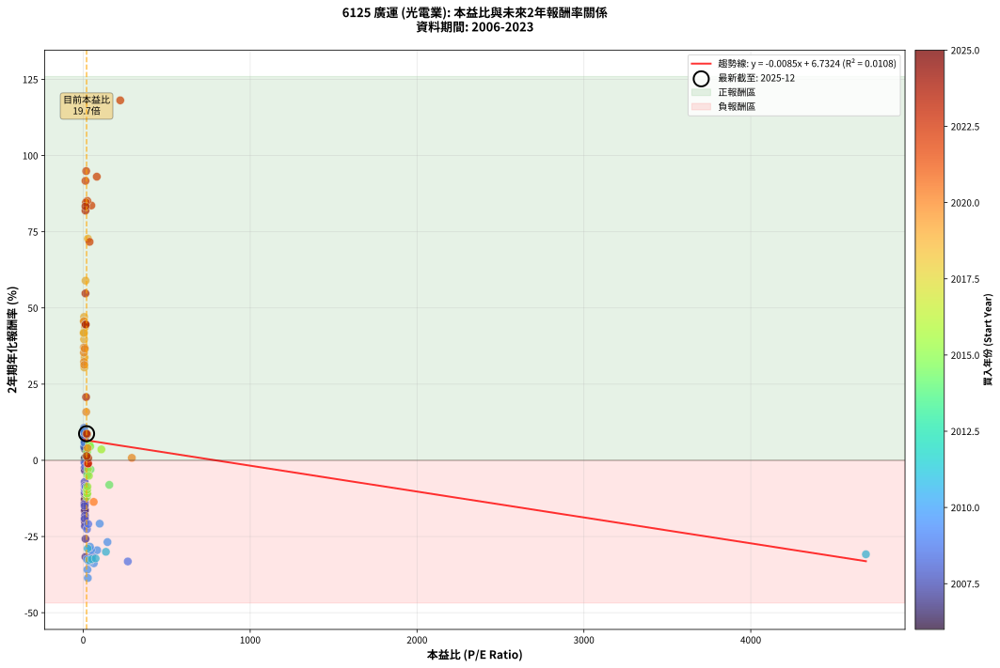
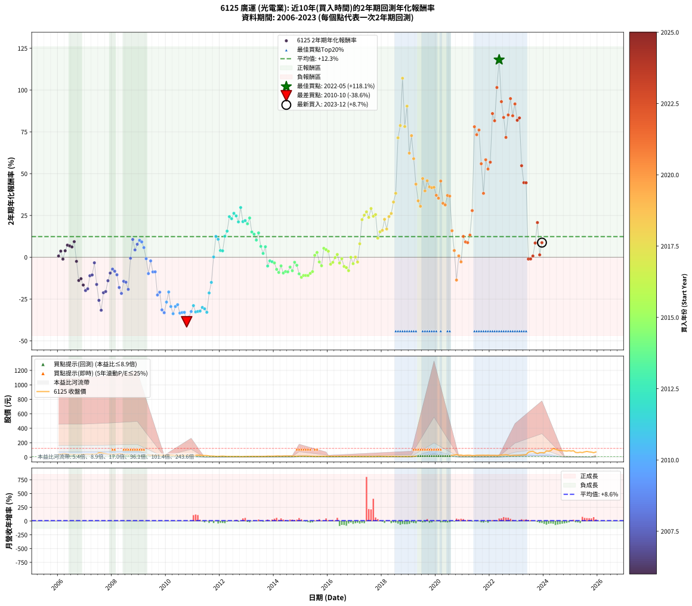

# 6125 廣運 - 本益比與未來報酬率分析

!!! info "報告資訊"
    - **股票代號**: 6125
    - **公司名稱**: 廣運
    - **產業別**: 光電業
    - **分析期間**: 2006-2023 (216 個數據點)
    - **資料來源**: Type 12 (ShowMonthlyK_ChartFlow) 月收盤價與本益比
    - **報酬率口徑**: 含現金股利 (簡化: 年度合計，假設每年7/1入帳)
    - **報告生成時間**: 2026-01-06 01:07:55 CST

## 📈 視覺化圖表

### 圖表1: 本益比 vs 未來報酬率關係

*圖表1：6125 廣運 本益比與2年期未來報酬率關係 (2006-2023)*

### 圖表2: 歷年買入時點的2年期實際報酬率

*圖表2：6125 廣運 歷年買入時點的2年期實際報酬率 (2006-2023)*

## 📍 買點訊號說明

本報告提供兩種買點提示訊號（顯示於圖表2的股價子圖中）：

### ▲ 小綠色三角形（回測驗證）
- **計算方式**: 使用全部歷史資料計算本益比第25百分位數
- **用途**: 事後驗證，顯示歷史上哪些時點確實為低估區
- **限制**: 當下無法判斷，僅供回測參考
- **特性**: 後見之明（Look-Ahead Bias）

### ▲ 小橘色三角形（即時訊號）
- **計算方式**: 使用截至當月的過去5年資料計算本益比第25百分位數
- **用途**: 實際投資決策，當時即可判斷
- **優勢**: 可操作性強，符合實務需求
- **特性**: 無後見之明，滾動窗口計算

!!! tip "如何使用兩種訊號"
    - **綠色▲** 幫助理解歷史估值機會，驗證策略有效性
    - **橘色▲** 可作為實際買進參考，但仍需搭配基本面分析
    - 兩種訊號重疊時，表示即時判斷與事後驗證一致，信心度較高
    - 僅有綠色▲時，表示當時無法判斷（需要未來資料才能確認）
    - 僅有橘色▲時，表示即時判斷為買點，但事後可能不是最佳時機

## 📊 估值分析摘要

| 指標 | 數值 |
|:---:|:---:|
| **目前本益比** (2023-12) | **19.69 倍** |
| **歷史平均本益比** | 66.52 倍 |
| **估值水準** | 🟢 相對低估 |
| **預期2年年化報酬率** | **+6.57%** |
| **歷史平均報酬率** | +12.35% |
| **相關係數 (R²)** | 0.0108 |
| **趨勢線斜率** | -0.0085 |

!!! abstract "核心洞察"
    目前本益比顯著低於歷史平均，預期未來報酬率可能較高

    根據歷史數據回測，6125 廣運 在目前本益比 **19.7倍** 的估值水準下，
    預期未來2年年化報酬率約為 **+6.6%**。

    **重要提醒**: 本分析基於歷史數據統計，實際報酬率會受到公司基本面變化、產業趨勢、
    總體經濟環境等多重因素影響。R² = 0.01 表示本益比可解釋約 1.1% 的報酬率變異。

## 📈 歷史估值統計

### 最佳買點 (最高報酬率)

| 項目 | 數值 |
|:---:|:---:|
| 起始時間 | 2022-05 |
| 當時本益比 | 221.50 倍 |
| 起始價格 | 26.4 元 |
| 2年後價格 | 122.5 元 |
| **2年年化報酬率** | **+118.12%** |

### 最差買點 (最低報酬率)

| 項目 | 數值 |
|:---:|:---:|
| 起始時間 | 2010-10 |
| 當時本益比 | 27.28 倍 |
| 起始價格 | 25.1 元 |
| 2年後價格 | 8.3 元 |
| **2年年化報酬率** | **-38.62%** |

## 🎯 投資啟示

### 本益比與報酬率關係

趨勢線方程式: **y = -0.0085x + 6.7324**

!!! note "負相關"
    本益比與未來報酬率呈現負相關。較低的本益比通常帶來較高的未來報酬率，
    但相關性不算非常強。**估值仍是重要參考指標之一**。

### 估值區間建議

基於歷史數據分析:

- **🟢 低估區** (P/E < 53.2): 預期報酬率較高，可考慮增加持股
- **🟡 合理區** (P/E 53.2-79.8): 預期報酬率符合長期趨勢，正常持有
- **🔴 高估區** (P/E > 79.8): 預期報酬率較低，可考慮減碼或觀望

!!! danger "風險提示"
    - 過去表現不代表未來結果
    - 本分析假設公司基本面無重大結構性變化
    - 產業環境劇變可能使歷史規律失效
    - 應結合公司財報、產業趨勢、總體經濟等多重因素綜合判斷

!!! success "長期投資觀點"
    歷史數據顯示，在合理或低估的估值水準買入並長期持有，
    往往能獲得較佳的投資報酬。**耐心等待好價格**是價值投資的核心原則。

## 📊 數據品質

- **資料來源**: GoodInfo.tw Type 12 (ShowMonthlyK_ChartFlow)
- **資料頻率**: 月度收盤價與本益比
- **回測期間**: 2006-2023
- **數據點數量**: 216 個 (每個點代表一次2年期回測)

### 計算方法說明

1. **2年期年化報酬率**:
   - 對每個歷史時點，計算其後2年的實際投資報酬率
   - 期末價值(不含股利): 期末價格
   - 期末價值(含現金股利): 期末價格 + 持有期間內的現金股利合計 (簡化: 年度合計，假設每年7/1入帳)
   - 公式: 年化報酬率 = [(期末價值/期初價格)^(1/年數) - 1] × 100%

2. **本益比 (P/E Ratio)**:
   - 使用當時的月收盤價與EPS計算
   - 資料來源: Type 12 月度河流圖本益比數據

3. **趨勢線 (Linear Regression)**:
   - 使用最小平方法擬合線性趨勢線
   - R²值衡量本益比對報酬率的解釋能力

---

*本報告由 Stock Analysis System v1.9.0 自動生成*
*數據更新時間: 2026-01-06 01:07:55 CST*

## 📋 月度回測明細表

（每一列對應時間線圖中的一個買入點；可用來對照 SVG 圖上的每個點。）

| 買入月份 | 賣出月份 | 回測期限_年 | 實際持有年數 | 買入本益比_倍 | 買入收盤價_元 | 賣出收盤價_元 | 現金股利合計_元 | 總報酬率_pct | 年化報酬率_pct |
| --- | --- | --- | --- | --- | --- | --- | --- | --- | --- |
| 2006-01 | 2008-01 | 2 | 1.999 | 9.15 | 41.25 | 37.25 | 4.61 | +1.47 | +0.73 |
| 2006-02 | 2008-02 | 2 | 1.999 | 9.29 | 41.90 | 40.40 | 4.61 | +7.41 | +3.64 |
| 2006-03 | 2008-03 | 2 | 2.001 | 10.58 | 47.70 | 42.05 | 4.61 | -2.19 | -1.10 |
| 2006-04 | 2008-04 | 2 | 2.001 | 10.69 | 48.20 | 47.40 | 4.61 | +7.90 | +3.87 |
| 2006-05 | 2008-05 | 2 | 2.001 | 9.76 | 44.00 | 46.00 | 4.61 | +15.01 | +7.24 |
| 2006-06 | 2008-06 | 2 | 2.001 | 8.40 | 37.90 | 38.60 | 4.61 | +14.00 | +6.77 |
| 2006-07 | 2008-07 | 2 | 2.001 | 8.37 | 37.75 | 37.05 | 5.50 | +12.72 | +6.16 |
| 2006-08 | 2008-08 | 2 | 2.001 | 8.58 | 38.70 | 40.75 | 5.50 | +19.51 | +9.31 |
| 2006-09 | 2008-09 | 2 | 2.001 | 7.96 | 35.90 | 28.65 | 5.50 | -4.87 | -2.47 |
| 2006-10 | 2008-10 | 2 | 2.001 | 8.26 | 37.25 | 22.10 | 5.50 | -25.91 | -13.91 |
| 2006-11 | 2008-11 | 2 | 2.001 | 8.76 | 39.50 | 24.50 | 5.50 | -24.05 | -12.84 |
| 2006-12 | 2008-12 | 2 | 2.001 | 8.98 | 40.50 | 22.65 | 5.50 | -30.49 | -16.62 |
| 2007-01 | 2009-01 | 2 | 2.001 | 9.18 | 41.50 | 21.10 | 5.50 | -35.90 | -19.93 |
| 2007-02 | 2009-02 | 2 | 2.001 | 9.44 | 42.80 | 22.65 | 5.50 | -34.23 | -18.89 |
| 2007-03 | 2009-03 | 2 | 2.001 | 8.93 | 40.60 | 26.60 | 5.50 | -20.94 | -11.07 |
| 2007-04 | 2009-04 | 2 | 2.001 | 9.55 | 43.55 | 29.30 | 5.50 | -20.09 | -10.60 |
| 2007-05 | 2009-05 | 2 | 2.001 | 9.03 | 41.30 | 33.10 | 5.50 | -6.54 | -3.32 |
| 2007-06 | 2009-06 | 2 | 2.001 | 9.99 | 45.80 | 26.60 | 5.50 | -29.91 | -16.27 |
| 2007-07 | 2009-07 | 2 | 2.001 | 13.31 | 61.20 | 29.20 | 4.50 | -44.93 | -25.78 |
| 2007-08 | 2009-08 | 2 | 2.001 | 12.82 | 59.10 | 23.05 | 4.50 | -53.38 | -31.71 |
| 2007-09 | 2009-09 | 2 | 2.001 | 11.57 | 53.50 | 28.70 | 4.50 | -37.94 | -21.21 |
| 2007-10 | 2009-10 | 2 | 2.001 | 10.66 | 49.40 | 26.70 | 4.50 | -36.84 | -20.52 |
| 2007-11 | 2009-11 | 2 | 2.001 | 9.10 | 42.30 | 26.75 | 4.50 | -26.12 | -14.04 |
| 2007-12 | 2009-12 | 2 | 2.001 | 8.86 | 41.30 | 29.35 | 4.50 | -18.04 | -9.46 |
| 2008-01 | 2010-01 | 2 | 2.001 | 7.96 | 37.25 | 27.65 | 4.50 | -13.69 | -7.09 |
| 2008-02 | 2010-03 | 2 | 2.081 | 8.60 | 40.40 | 29.20 | 4.50 | -16.58 | -8.35 |
| 2008-03 | 2010-03 | 2 | 1.999 | 8.92 | 42.05 | 29.20 | 4.50 | -19.86 | -10.48 |
| 2008-04 | 2010-04 | 2 | 1.999 | 10.01 | 47.40 | 27.30 | 4.50 | -32.91 | -18.10 |
| 2008-05 | 2010-05 | 2 | 1.999 | 9.68 | 46.00 | 23.75 | 4.50 | -38.59 | -21.65 |
| 2008-06 | 2010-06 | 2 | 1.999 | 8.09 | 38.60 | 23.80 | 4.50 | -26.68 | -14.38 |
| 2008-07 | 2010-07 | 2 | 1.999 | 7.74 | 37.05 | 24.80 | 2.00 | -27.67 | -14.96 |
| 2008-08 | 2010-08 | 2 | 1.999 | 8.48 | 40.75 | 24.60 | 2.00 | -34.72 | -19.22 |
| 2008-09 | 2010-09 | 2 | 1.999 | 5.94 | 28.65 | 26.30 | 2.00 | -1.22 | -0.61 |
| 2008-10 | 2010-10 | 2 | 1.999 | 4.56 | 22.10 | 25.05 | 2.00 | +22.40 | +10.64 |
| 2008-11 | 2010-11 | 2 | 1.999 | 5.04 | 24.50 | 24.70 | 2.00 | +8.98 | +4.40 |
| 2008-12 | 2010-12 | 2 | 1.999 | 4.64 | 22.65 | 24.30 | 2.00 | +16.11 | +7.76 |
| 2009-01 | 2011-01 | 2 | 1.999 | 4.71 | 21.10 | 23.60 | 2.00 | +21.33 | +10.16 |
| 2009-02 | 2011-02 | 2 | 1.999 | 5.54 | 22.65 | 25.00 | 2.00 | +19.21 | +9.19 |
| 2009-03 | 2011-03 | 2 | 1.999 | 7.21 | 26.60 | 27.75 | 2.00 | +11.84 | +5.76 |
| 2009-04 | 2011-04 | 2 | 1.999 | 8.91 | 29.30 | 26.80 | 2.00 | -1.71 | -0.86 |
| 2009-05 | 2011-05 | 2 | 1.999 | 11.44 | 33.10 | 24.95 | 2.00 | -18.58 | -9.77 |
| 2009-06 | 2011-06 | 2 | 1.999 | 10.66 | 26.60 | 23.45 | 2.00 | -4.32 | -2.19 |
| 2009-07 | 2011-07 | 2 | 1.999 | 13.92 | 29.20 | 22.90 | 1.41 | -16.75 | -8.76 |
| 2009-08 | 2011-08 | 2 | 1.999 | 13.56 | 23.05 | 17.80 | 1.41 | -16.66 | -8.71 |
| 2009-09 | 2011-09 | 2 | 1.999 | 22.03 | 28.70 | 15.80 | 1.41 | -40.03 | -22.58 |
| 2009-10 | 2011-10 | 2 | 1.999 | 29.50 | 26.70 | 15.30 | 1.41 | -37.42 | -20.90 |
| 2009-11 | 2011-11 | 2 | 1.999 | 52.71 | 26.75 | 11.15 | 1.41 | -53.05 | -31.50 |
| 2009-12 | 2011-12 | 2 | 1.999 | 266.80 | 29.35 | 11.70 | 1.41 | -55.33 | -33.18 |
| 2010-01 | 2012-01 | 2 | 1.999 | 144.90 | 27.65 | 13.40 | 1.41 | -46.44 | -26.83 |
| 2010-02 | 2012-02 | 2 | 1.999 | 98.28 | 26.70 | 15.35 | 1.41 | -37.23 | -20.78 |
| 2010-03 | 2012-03 | 2 | 2.001 | 82.84 | 29.20 | 13.10 | 1.41 | -50.31 | -29.49 |
| 2010-04 | 2012-04 | 2 | 2.001 | 63.00 | 27.30 | 10.55 | 1.41 | -56.19 | -33.79 |
| 2010-05 | 2012-05 | 2 | 2.001 | 46.19 | 23.75 | 10.40 | 1.41 | -50.27 | -29.47 |
| 2010-06 | 2012-06 | 2 | 2.001 | 40.00 | 23.80 | 10.80 | 1.41 | -48.70 | -28.36 |
| 2010-07 | 2012-07 | 2 | 2.001 | 36.70 | 24.80 | 9.88 | 1.11 | -55.68 | -33.41 |
| 2010-08 | 2012-08 | 2 | 2.001 | 32.51 | 24.60 | 9.90 | 1.11 | -55.24 | -33.08 |
| 2010-09 | 2012-09 | 2 | 2.001 | 31.40 | 26.30 | 10.70 | 1.11 | -55.09 | -32.96 |
| 2010-10 | 2012-10 | 2 | 2.001 | 27.28 | 25.05 | 8.32 | 1.11 | -62.35 | -38.62 |
| 2010-11 | 2012-11 | 2 | 2.001 | 24.72 | 24.70 | 9.04 | 1.11 | -58.90 | -35.87 |
| 2010-12 | 2012-12 | 2 | 2.001 | 22.50 | 24.30 | 9.96 | 1.11 | -54.44 | -32.48 |
| 2011-01 | 2013-01 | 2 | 2.001 | 26.20 | 23.60 | 10.80 | 1.11 | -49.53 | -28.94 |
| 2011-02 | 2013-02 | 2 | 2.001 | 34.64 | 25.00 | 10.20 | 1.11 | -54.75 | -32.72 |
| 2011-03 | 2013-03 | 2 | 2.001 | 51.15 | 27.75 | 11.55 | 1.11 | -54.37 | -32.43 |
| 2011-04 | 2013-04 | 2 | 2.001 | 73.76 | 26.80 | 11.20 | 1.11 | -54.06 | -32.20 |
| 2011-05 | 2013-05 | 2 | 2.001 | 135.50 | 24.95 | 11.10 | 1.11 | -51.05 | -30.02 |
| 2011-06 | 2013-06 | 2 | 2.001 | 4690.00 | 23.45 | 10.10 | 1.11 | -52.19 | -30.84 |
| 2011-07 | 2013-07 | 2 | 2.001 |  | 22.90 | 10.10 | 0.20 | -55.01 | -32.91 |
| 2011-08 | 2013-08 | 2 | 2.001 |  | 17.80 | 10.80 | 0.20 | -38.19 | -21.37 |
| 2011-09 | 2013-09 | 2 | 2.001 |  | 15.80 | 11.20 | 0.20 | -27.84 | -15.04 |
| 2011-10 | 2013-10 | 2 | 2.001 |  | 15.30 | 15.15 | 0.20 | +0.34 | +0.17 |
| 2011-11 | 2013-11 | 2 | 2.001 |  | 11.15 | 13.90 | 0.20 | +26.48 | +12.45 |
| 2011-12 | 2013-12 | 2 | 2.001 |  | 11.70 | 14.15 | 0.20 | +22.67 | +10.75 |
| 2012-01 | 2014-01 | 2 | 2.001 |  | 13.40 | 14.30 | 0.20 | +8.22 | +4.03 |
| 2012-02 | 2014-03 | 2 | 2.081 |  | 15.35 | 16.40 | 0.20 | +8.16 | +3.84 |
| 2012-03 | 2014-03 | 2 | 1.999 |  | 13.10 | 16.40 | 0.20 | +26.73 | +12.58 |
| 2012-04 | 2014-04 | 2 | 1.999 |  | 10.55 | 13.90 | 0.20 | +33.67 | +15.63 |
| 2012-05 | 2014-05 | 2 | 1.999 |  | 10.40 | 15.85 | 0.20 | +54.35 | +24.25 |
| 2012-06 | 2014-06 | 2 | 1.999 |  | 10.80 | 16.15 | 0.20 | +51.41 | +23.07 |
| 2012-07 | 2014-07 | 2 | 1.999 |  | 9.88 | 15.25 | 0.50 | +59.41 | +26.28 |
| 2012-08 | 2014-08 | 2 | 1.999 |  | 9.90 | 14.90 | 0.50 | +55.56 | +24.74 |
| 2012-09 | 2014-09 | 2 | 1.999 |  | 10.70 | 15.20 | 0.50 | +46.73 | +21.15 |
| 2012-10 | 2014-10 | 2 | 1.999 |  | 8.32 | 13.50 | 0.50 | +68.27 | +29.74 |
| 2012-11 | 2014-11 | 2 | 1.999 |  | 9.04 | 12.80 | 0.50 | +47.12 | +21.31 |
| 2012-12 | 2014-12 | 2 | 1.999 |  | 9.96 | 14.30 | 0.50 | +48.59 | +21.92 |
| 2013-01 | 2015-01 | 2 | 1.999 |  | 10.80 | 15.05 | 0.50 | +43.98 | +20.01 |
| 2013-02 | 2015-02 | 2 | 1.999 |  | 10.20 | 15.05 | 0.50 | +52.45 | +23.49 |
| 2013-03 | 2015-03 | 2 | 1.999 |  | 11.55 | 14.80 | 0.50 | +32.47 | +15.11 |
| 2013-04 | 2015-04 | 2 | 1.999 |  | 11.20 | 14.00 | 0.50 | +29.46 | +13.79 |
| 2013-05 | 2015-05 | 2 | 1.999 |  | 11.10 | 13.00 | 0.50 | +21.62 | +10.29 |
| 2013-06 | 2015-06 | 2 | 1.999 |  | 10.10 | 12.75 | 0.50 | +31.19 | +14.55 |
| 2013-07 | 2015-07 | 2 | 1.999 |  | 10.10 | 10.45 | 1.00 | +13.37 | +6.48 |
| 2013-08 | 2015-08 | 2 | 1.999 |  | 10.80 | 10.30 | 1.00 | +4.63 | +2.29 |
| 2013-09 | 2015-09 | 2 | 1.999 |  | 11.20 | 11.65 | 1.00 | +12.95 | +6.28 |
| 2013-10 | 2015-10 | 2 | 1.999 |  | 15.15 | 12.60 | 1.00 | -10.23 | -5.26 |
| 2013-11 | 2015-11 | 2 | 1.999 |  | 13.90 | 12.30 | 1.00 | -4.32 | -2.18 |
| 2013-12 | 2015-12 | 2 | 1.999 |  | 14.15 | 12.40 | 1.00 | -5.30 | -2.69 |
| 2014-01 | 2016-01 | 2 | 1.999 |  | 14.30 | 12.35 | 1.00 | -6.64 | -3.38 |
| 2014-02 | 2016-02 | 2 | 1.999 |  | 16.15 | 12.90 | 1.00 | -13.93 | -7.23 |
| 2014-03 | 2016-03 | 2 | 2.001 |  | 16.40 | 12.55 | 1.00 | -17.38 | -9.10 |
| 2014-04 | 2016-04 | 2 | 2.001 |  | 13.90 | 11.50 | 1.00 | -10.07 | -5.17 |
| 2014-05 | 2016-05 | 2 | 2.001 |  | 15.85 | 12.00 | 1.00 | -17.98 | -9.43 |
| 2014-06 | 2016-06 | 2 | 2.001 |  | 16.15 | 12.50 | 1.00 | -16.41 | -8.57 |
| 2014-07 | 2016-07 | 2 | 2.001 |  | 15.25 | 11.70 | 1.00 | -16.72 | -8.74 |
| 2014-08 | 2016-08 | 2 | 2.001 |  | 14.90 | 12.20 | 1.00 | -11.41 | -5.87 |
| 2014-09 | 2016-09 | 2 | 2.001 | 155.90 | 15.20 | 11.85 | 1.00 | -15.46 | -8.05 |
| 2014-10 | 2016-10 | 2 | 2.001 | 43.32 | 13.50 | 11.70 | 1.00 | -5.93 | -3.01 |
| 2014-11 | 2016-11 | 2 | 2.001 | 24.34 | 12.80 | 10.60 | 1.00 | -9.38 | -4.80 |
| 2014-12 | 2016-12 | 2 | 2.001 | 19.32 | 14.30 | 10.60 | 1.00 | -18.88 | -9.93 |
| 2015-01 | 2017-01 | 2 | 2.001 | 21.40 | 15.05 | 10.65 | 1.00 | -22.59 | -12.01 |
| 2015-02 | 2017-02 | 2 | 2.001 | 22.58 | 15.05 | 10.95 | 1.00 | -20.60 | -10.89 |
| 2015-03 | 2017-03 | 2 | 2.001 | 23.49 | 14.80 | 10.75 | 1.00 | -20.61 | -10.89 |
| 2015-04 | 2017-04 | 2 | 2.001 | 23.60 | 14.00 | 10.10 | 1.00 | -20.71 | -10.95 |
| 2015-05 | 2017-05 | 2 | 2.001 | 23.35 | 13.00 | 9.61 | 1.00 | -18.38 | -9.65 |
| 2015-06 | 2017-06 | 2 | 2.001 | 24.52 | 12.75 | 9.65 | 1.00 | -16.47 | -8.60 |
| 2015-07 | 2017-07 | 2 | 2.001 | 21.62 | 10.45 | 9.69 | 1.00 | +2.30 | +1.14 |
| 2015-08 | 2017-08 | 2 | 2.001 | 23.06 | 10.30 | 9.90 | 1.00 | +5.83 | +2.87 |
| 2015-09 | 2017-09 | 2 | 2.001 | 28.41 | 11.65 | 10.00 | 1.00 | -5.58 | -2.83 |
| 2015-10 | 2017-10 | 2 | 2.001 | 33.75 | 12.60 | 10.35 | 1.00 | -9.92 | -5.09 |
| 2015-11 | 2017-11 | 2 | 2.001 | 36.53 | 12.30 | 12.65 | 1.00 | +10.98 | +5.34 |
| 2015-12 | 2017-12 | 2 | 2.001 | 41.33 | 12.40 | 12.55 | 1.00 | +9.27 | +4.53 |
| 2016-01 | 2018-01 | 2 | 2.001 | 108.40 | 12.35 | 12.25 | 1.00 | +7.29 | +3.58 |
| 2016-02 | 2018-03 | 2 | 2.081 |  | 12.90 | 10.80 | 1.00 | -8.53 | -4.19 |
| 2016-03 | 2018-03 | 2 | 1.999 |  | 12.55 | 10.80 | 1.00 | -5.98 | -3.04 |
| 2016-04 | 2018-04 | 2 | 1.999 |  | 11.50 | 10.45 | 1.00 | -0.43 | -0.22 |
| 2016-05 | 2018-05 | 2 | 1.999 |  | 12.00 | 11.40 | 1.00 | +3.33 | +1.65 |
| 2016-06 | 2018-06 | 2 | 1.999 |  | 12.50 | 10.65 | 1.00 | -6.80 | -3.46 |
| 2016-07 | 2018-07 | 2 | 1.999 |  | 11.70 | 10.70 | 0.80 | -1.71 | -0.86 |
| 2016-08 | 2018-08 | 2 | 1.999 |  | 12.20 | 10.10 | 0.80 | -10.66 | -5.48 |
| 2016-09 | 2018-09 | 2 | 1.999 |  | 11.85 | 9.63 | 0.80 | -11.98 | -6.19 |
| 2016-10 | 2018-10 | 2 | 1.999 |  | 11.70 | 9.10 | 0.80 | -15.38 | -8.02 |
| 2016-11 | 2018-11 | 2 | 1.999 |  | 10.60 | 9.79 | 0.80 | -0.09 | -0.05 |
| 2016-12 | 2018-12 | 2 | 1.999 |  | 10.60 | 9.00 | 0.80 | -7.55 | -3.85 |
| 2017-01 | 2019-01 | 2 | 1.999 |  | 10.65 | 9.87 | 0.80 | +0.19 | +0.09 |
| 2017-02 | 2019-02 | 2 | 1.999 |  | 10.95 | 9.53 | 0.80 | -5.66 | -2.87 |
| 2017-03 | 2019-03 | 2 | 1.999 |  | 10.75 | 11.75 | 0.80 | +16.74 | +8.05 |
| 2017-04 | 2019-04 | 2 | 1.999 |  | 10.10 | 14.35 | 0.80 | +50.00 | +22.49 |
| 2017-05 | 2019-05 | 2 | 1.999 |  | 9.61 | 14.25 | 0.80 | +56.61 | +25.16 |
| 2017-06 | 2019-06 | 2 | 1.999 |  | 9.65 | 14.80 | 0.80 | +61.66 | +27.17 |
| 2017-07 | 2019-07 | 2 | 1.999 |  | 9.69 | 14.05 | 0.81 | +53.31 | +23.84 |
| 2017-08 | 2019-08 | 2 | 1.999 |  | 9.90 | 15.70 | 0.81 | +66.73 | +29.15 |
| 2017-09 | 2019-09 | 2 | 1.999 |  | 10.00 | 14.70 | 0.81 | +55.06 | +24.54 |
| 2017-10 | 2019-10 | 2 | 1.999 |  | 10.35 | 15.50 | 0.81 | +57.55 | +25.54 |
| 2017-11 | 2019-11 | 2 | 1.999 |  | 12.65 | 14.90 | 0.81 | +24.16 | +11.43 |
| 2017-12 | 2019-12 | 2 | 1.999 |  | 12.55 | 15.85 | 0.81 | +32.72 | +15.21 |
| 2018-01 | 2020-01 | 2 | 1.999 |  | 12.25 | 15.70 | 0.81 | +34.74 | +16.09 |
| 2018-02 | 2020-02 | 2 | 1.999 |  | 11.00 | 15.75 | 0.81 | +50.51 | +22.70 |
| 2018-03 | 2020-03 | 2 | 2.001 |  | 10.80 | 13.95 | 0.81 | +36.63 | +16.88 |
| 2018-04 | 2020-04 | 2 | 2.001 |  | 10.45 | 15.35 | 0.81 | +54.60 | +24.32 |
| 2018-05 | 2020-05 | 2 | 2.001 |  | 11.40 | 17.35 | 0.81 | +59.26 | +26.18 |
| 2018-06 | 2020-06 | 2 | 2.001 |  | 10.65 | 18.05 | 0.81 | +77.05 | +33.03 |
| 2018-07 | 2020-07 | 2 | 2.001 |  | 10.70 | 17.95 | 2.51 | +91.18 | +38.24 |
| 2018-08 | 2020-08 | 2 | 2.001 |  | 10.10 | 27.20 | 2.51 | +194.12 | +71.44 |
| 2018-09 | 2020-09 | 2 | 2.001 |  | 9.63 | 28.30 | 2.51 | +219.90 | +78.79 |
| 2018-10 | 2020-10 | 2 | 2.001 |  | 9.10 | 36.55 | 2.51 | +329.19 | +107.07 |
| 2018-11 | 2020-11 | 2 | 2.001 |  | 9.79 | 28.60 | 2.51 | +217.73 | +78.18 |
| 2018-12 | 2020-12 | 2 | 2.001 |  | 9.00 | 30.15 | 2.51 | +262.84 | +90.40 |
| 2019-01 | 2021-01 | 2 | 2.001 |  | 9.87 | 23.50 | 2.51 | +163.49 | +62.27 |
| 2019-02 | 2021-02 | 2 | 2.001 | 27.62 | 9.53 | 25.95 | 2.51 | +198.59 | +72.73 |
| 2019-03 | 2021-03 | 2 | 2.001 | 13.70 | 11.75 | 27.20 | 2.51 | +152.82 | +58.95 |
| 2019-04 | 2021-04 | 2 | 2.001 | 10.47 | 14.35 | 27.15 | 2.51 | +106.66 | +43.72 |
| 2019-05 | 2021-05 | 2 | 2.001 | 7.57 | 14.25 | 23.00 | 2.51 | +78.99 | +33.76 |
| 2019-06 | 2021-06 | 2 | 2.001 | 6.18 | 14.80 | 22.70 | 2.51 | +70.31 | +30.48 |
| 2019-07 | 2021-07 | 2 | 2.001 | 4.83 | 14.05 | 26.90 | 3.50 | +116.37 | +47.06 |
| 2019-08 | 2021-08 | 2 | 2.001 | 4.59 | 15.70 | 27.15 | 3.50 | +95.22 | +39.69 |
| 2019-09 | 2021-09 | 2 | 2.001 | 3.74 | 14.70 | 27.75 | 3.50 | +112.59 | +45.77 |
| 2019-10 | 2021-10 | 2 | 2.001 | 3.49 | 15.50 | 27.80 | 3.50 | +101.94 | +42.07 |
| 2019-11 | 2021-11 | 2 | 2.001 | 3.01 | 14.90 | 26.40 | 3.50 | +100.67 | +41.62 |
| 2019-12 | 2021-12 | 2 | 2.001 | 2.90 | 15.85 | 28.40 | 3.50 | +101.26 | +41.83 |
| 2020-01 | 2022-01 | 2 | 2.001 | 3.15 | 15.70 | 26.00 | 3.50 | +87.90 | +37.05 |
| 2020-02 | 2022-03 | 2 | 2.081 | 3.51 | 15.75 | 26.05 | 3.50 | +87.62 | +35.31 |
| 2020-03 | 2022-03 | 2 | 1.999 | 3.48 | 13.95 | 26.05 | 3.50 | +111.83 | +45.58 |
| 2020-04 | 2022-04 | 2 | 1.999 | 4.36 | 15.35 | 23.35 | 3.50 | +74.92 | +32.28 |
| 2020-05 | 2022-05 | 2 | 1.999 | 5.73 | 17.35 | 26.40 | 3.50 | +72.33 | +31.30 |
| 2020-06 | 2022-06 | 2 | 1.999 | 7.11 | 18.05 | 30.35 | 3.50 | +87.53 | +36.97 |
| 2020-07 | 2022-07 | 2 | 1.999 | 8.75 | 17.95 | 30.35 | 3.11 | +86.42 | +36.57 |
| 2020-08 | 2022-08 | 2 | 1.999 | 17.40 | 27.20 | 33.40 | 3.11 | +34.24 | +15.87 |
| 2020-09 | 2022-09 | 2 | 1.999 | 26.33 | 28.30 | 27.50 | 3.11 | +8.17 | +4.01 |
| 2020-10 | 2022-10 | 2 | 1.999 | 62.30 | 36.55 | 24.15 | 3.11 | -25.41 | -13.64 |
| 2020-11 | 2022-11 | 2 | 1.999 | 290.80 | 28.60 | 25.95 | 3.11 | +1.62 | +0.81 |
| 2020-12 | 2022-12 | 2 | 1.999 |  | 30.15 | 25.40 | 3.11 | -5.43 | -2.75 |
| 2021-01 | 2023-01 | 2 | 1.999 |  | 23.50 | 26.60 | 3.11 | +26.44 | +12.45 |
| 2021-02 | 2023-02 | 2 | 1.999 |  | 25.95 | 27.80 | 3.11 | +19.13 | +9.15 |
| 2021-03 | 2023-03 | 2 | 1.999 |  | 27.20 | 29.05 | 3.11 | +18.25 | +8.75 |
| 2021-04 | 2023-04 | 2 | 1.999 |  | 27.15 | 31.70 | 3.11 | +28.22 | +13.25 |
| 2021-05 | 2023-05 | 2 | 1.999 |  | 23.00 | 34.50 | 3.11 | +63.53 | +27.90 |
| 2021-06 | 2023-06 | 2 | 1.999 |  | 22.70 | 68.80 | 3.11 | +216.80 | +78.06 |
| 2021-07 | 2023-07 | 2 | 1.999 |  | 26.90 | 77.50 | 3.23 | +200.12 | +73.31 |
| 2021-08 | 2023-08 | 2 | 1.999 |  | 27.15 | 80.90 | 3.23 | +209.88 | +76.10 |
| 2021-09 | 2023-09 | 2 | 1.999 |  | 27.75 | 64.20 | 3.23 | +143.00 | +55.93 |
| 2021-10 | 2023-10 | 2 | 1.999 |  | 27.80 | 49.85 | 3.23 | +90.95 | +38.21 |
| 2021-11 | 2023-11 | 2 | 1.999 |  | 26.40 | 62.90 | 3.23 | +150.50 | +58.32 |
| 2021-12 | 2023-12 | 2 | 1.999 |  | 28.40 | 63.00 | 3.23 | +133.21 | +52.76 |
| 2022-01 | 2024-01 | 2 | 1.999 |  | 26.00 | 60.70 | 3.23 | +145.90 | +56.86 |
| 2022-02 | 2024-02 | 2 | 1.999 |  | 25.60 | 85.20 | 3.23 | +245.44 | +85.94 |
| 2022-03 | 2024-03 | 2 | 2.001 |  | 26.05 | 82.80 | 3.23 | +230.26 | +81.66 |
| 2022-04 | 2024-04 | 2 | 2.001 |  | 23.35 | 91.70 | 3.23 | +306.57 | +101.54 |
| 2022-05 | 2024-05 | 2 | 2.001 | 221.50 | 26.40 | 122.50 | 3.23 | +376.26 | +118.12 |
| 2022-06 | 2024-06 | 2 | 2.001 | 80.93 | 30.35 | 110.00 | 3.23 | +273.09 | +93.07 |
| 2022-07 | 2024-07 | 2 | 2.001 | 48.11 | 30.35 | 99.10 | 3.32 | +237.46 | +83.63 |
| 2022-08 | 2024-08 | 2 | 2.001 | 37.67 | 33.40 | 95.20 | 3.32 | +194.97 | +71.68 |
| 2022-09 | 2024-09 | 2 | 2.001 | 24.07 | 27.50 | 91.00 | 3.32 | +242.98 | +85.12 |
| 2022-10 | 2024-10 | 2 | 2.001 | 17.27 | 24.15 | 88.50 | 3.32 | +280.21 | +94.90 |
| 2022-11 | 2024-11 | 2 | 2.001 | 15.69 | 25.95 | 85.20 | 3.32 | +241.12 | +84.62 |
| 2022-12 | 2024-12 | 2 | 2.001 | 13.30 | 25.40 | 90.10 | 3.32 | +267.80 | +91.69 |
| 2023-01 | 2025-01 | 2 | 2.001 | 13.18 | 26.60 | 84.80 | 3.32 | +231.28 | +81.94 |
| 2023-02 | 2025-02 | 2 | 2.001 | 13.08 | 27.80 | 90.20 | 3.32 | +236.40 | +83.34 |
| 2023-03 | 2025-03 | 2 | 2.001 | 13.01 | 29.05 | 66.30 | 3.32 | +139.66 | +54.76 |
| 2023-04 | 2025-04 | 2 | 2.001 | 13.55 | 31.70 | 63.00 | 3.32 | +109.21 | +44.60 |
| 2023-05 | 2025-05 | 2 | 2.001 | 14.10 | 34.50 | 68.80 | 3.32 | +109.04 | +44.55 |
| 2023-06 | 2025-06 | 2 | 2.001 | 26.93 | 68.80 | 64.00 | 3.32 | -2.15 | -1.08 |
| 2023-07 | 2025-07 | 2 | 2.001 | 29.11 | 77.50 | 73.50 | 2.40 | -2.06 | -1.04 |
| 2023-08 | 2025-08 | 2 | 2.001 | 29.21 | 80.90 | 79.70 | 2.40 | +1.48 | +0.74 |
| 2023-09 | 2025-09 | 2 | 2.001 | 22.31 | 64.20 | 73.20 | 2.40 | +17.76 | +8.51 |
| 2023-10 | 2025-10 | 2 | 2.001 | 16.70 | 49.85 | 70.30 | 2.40 | +45.84 | +20.75 |
| 2023-11 | 2025-11 | 2 | 2.001 | 20.34 | 62.90 | 62.30 | 2.40 | +2.86 | +1.42 |
| 2023-12 | 2025-12 | 2 | 2.001 | 19.69 | 63.00 | 72.10 | 2.40 | +18.25 | +8.74 |
