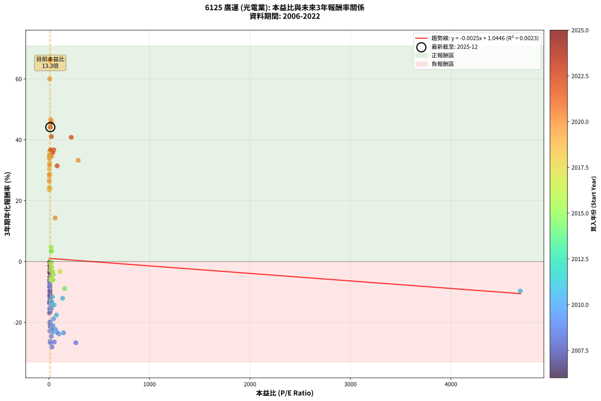
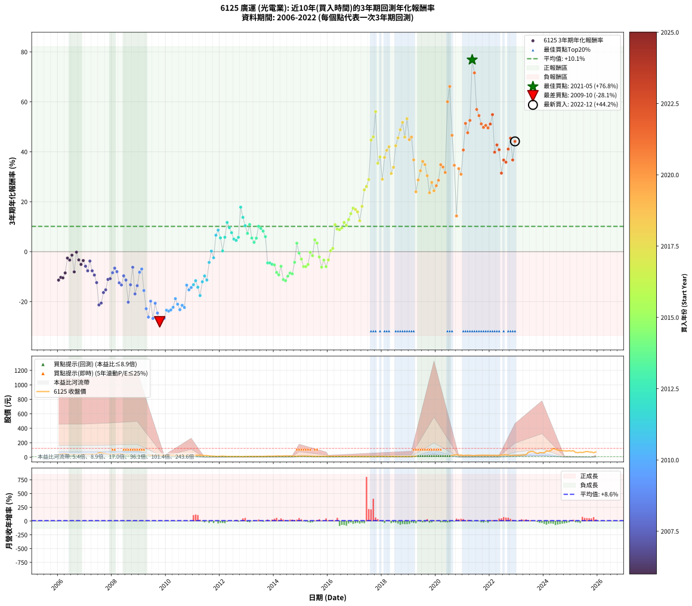

# 6125 廣運 - 本益比與未來報酬率分析

!!! info "報告資訊"
    - **股票代號**: 6125
    - **公司名稱**: 廣運
    - **產業別**: 光電業
    - **分析期間**: 2006-2022 (204 個數據點)
    - **資料來源**: Type 12 (ShowMonthlyK_ChartFlow) 月收盤價與本益比
    - **報酬率口徑**: 含現金股利 (簡化: 年度合計，假設每年7/1入帳)
    - **報告生成時間**: 2026-01-04 08:51:00 CST

## 📈 視覺化圖表

### 圖表1: 本益比 vs 未來報酬率關係

*圖表1：6125 廣運 本益比與3年期未來報酬率關係 (2006-2022)*

### 圖表2: 歷年買入時點的3年期實際報酬率

*圖表2：6125 廣運 歷年買入時點的3年期實際報酬率 (2006-2022)*

## 📍 買點訊號說明

本報告提供兩種買點提示訊號（顯示於圖表2的股價子圖中）：

### ▲ 小綠色三角形（回測驗證）
- **計算方式**: 使用全部歷史資料計算本益比第25百分位數
- **用途**: 事後驗證，顯示歷史上哪些時點確實為低估區
- **限制**: 當下無法判斷，僅供回測參考
- **特性**: 後見之明（Look-Ahead Bias）

### ▲ 小橘色三角形（即時訊號）
- **計算方式**: 使用截至當月的過去5年資料計算本益比第25百分位數
- **用途**: 實際投資決策，當時即可判斷
- **優勢**: 可操作性強，符合實務需求
- **特性**: 無後見之明，滾動窗口計算

!!! tip "如何使用兩種訊號"
    - **綠色▲** 幫助理解歷史估值機會，驗證策略有效性
    - **橘色▲** 可作為實際買進參考，但仍需搭配基本面分析
    - 兩種訊號重疊時，表示即時判斷與事後驗證一致，信心度較高
    - 僅有綠色▲時，表示當時無法判斷（需要未來資料才能確認）
    - 僅有橘色▲時，表示即時判斷為買點，但事後可能不是最佳時機

## 📊 估值分析摘要

| 指標 | 數值 |
|:---:|:---:|
| **目前本益比** (2022-12) | **13.30 倍** |
| **歷史平均本益比** | 71.54 倍 |
| **估值水準** | 🟢 相對低估 |
| **預期3年年化報酬率** | **+1.01%** |
| **歷史平均報酬率** | +10.13% |
| **相關係數 (R²)** | 0.0023 |
| **趨勢線斜率** | -0.0025 |

!!! abstract "核心洞察"
    目前本益比顯著低於歷史平均，預期未來報酬率可能較高

    根據歷史數據回測，6125 廣運 在目前本益比 **13.3倍** 的估值水準下，
    預期未來3年年化報酬率約為 **+1.0%**。

    **重要提醒**: 本分析基於歷史數據統計，實際報酬率會受到公司基本面變化、產業趨勢、
    總體經濟環境等多重因素影響。R² = 0.00 表示本益比可解釋約 0.2% 的報酬率變異。

## 📈 歷史估值統計

### 最佳買點 (最高報酬率)

| 項目 | 數值 |
|:---:|:---:|
| 起始時間 | 2021-05 |
| 當時本益比 | nan 倍 |
| 起始價格 | 23.0 元 |
| 3年後價格 | 122.5 元 |
| **3年年化報酬率** | **+76.83%** |

### 最差買點 (最低報酬率)

| 項目 | 數值 |
|:---:|:---:|
| 起始時間 | 2009-10 |
| 當時本益比 | 29.50 倍 |
| 起始價格 | 26.7 元 |
| 3年後價格 | 8.3 元 |
| **3年年化報酬率** | **-28.08%** |

## 🎯 投資啟示

### 本益比與報酬率關係

趨勢線方程式: **y = -0.0025x + 1.0446**

!!! note "負相關"
    本益比與未來報酬率呈現負相關。較低的本益比通常帶來較高的未來報酬率，
    但相關性不算非常強。**估值仍是重要參考指標之一**。

### 估值區間建議

基於歷史數據分析:

- **🟢 低估區** (P/E < 57.2): 預期報酬率較高，可考慮增加持股
- **🟡 合理區** (P/E 57.2-85.8): 預期報酬率符合長期趨勢，正常持有
- **🔴 高估區** (P/E > 85.8): 預期報酬率較低，可考慮減碼或觀望

!!! danger "風險提示"
    - 過去表現不代表未來結果
    - 本分析假設公司基本面無重大結構性變化
    - 產業環境劇變可能使歷史規律失效
    - 應結合公司財報、產業趨勢、總體經濟等多重因素綜合判斷

!!! success "長期投資觀點"
    歷史數據顯示，在合理或低估的估值水準買入並長期持有，
    往往能獲得較佳的投資報酬。**耐心等待好價格**是價值投資的核心原則。

## 📊 數據品質

- **資料來源**: GoodInfo.tw Type 12 (ShowMonthlyK_ChartFlow)
- **資料頻率**: 月度收盤價與本益比
- **回測期間**: 2006-2022
- **數據點數量**: 204 個 (每個點代表一次3年期回測)

### 計算方法說明

1. **3年期年化報酬率**:
   - 對每個歷史時點，計算其後3年的實際投資報酬率
   - 期末價值(不含股利): 期末價格
   - 期末價值(含現金股利): 期末價格 + 持有期間內的現金股利合計 (簡化: 年度合計，假設每年7/1入帳)
   - 公式: 年化報酬率 = [(期末價值/期初價格)^(1/年數) - 1] × 100%

2. **本益比 (P/E Ratio)**:
   - 使用當時的月收盤價與EPS計算
   - 資料來源: Type 12 月度河流圖本益比數據

3. **趨勢線 (Linear Regression)**:
   - 使用最小平方法擬合線性趨勢線
   - R²值衡量本益比對報酬率的解釋能力

---

*本報告由 Stock Analysis System v1.9.0 自動生成*
*數據更新時間: 2026-01-04 08:51:00 CST*

## 📋 月度回測明細表

（每一列對應時間線圖中的一個買入點；可用來對照 SVG 圖上的每個點。）

| 買入月份 | 賣出月份 | 回測期限_年 | 實際持有年數 | 買入本益比_倍 | 買入收盤價_元 | 賣出收盤價_元 | 現金股利合計_元 | 總報酬率_pct | 年化報酬率_pct |
| --- | --- | --- | --- | --- | --- | --- | --- | --- | --- |
| 2006-01 | 2009-01 | 3 | 3.001 | 9.15 | 41.25 | 21.10 | 7.61 | -30.41 | -11.38 |
| 2006-02 | 2009-02 | 3 | 3.001 | 9.29 | 41.90 | 22.65 | 7.61 | -27.79 | -10.28 |
| 2006-03 | 2009-03 | 3 | 3.001 | 10.58 | 47.70 | 26.60 | 7.61 | -28.29 | -10.49 |
| 2006-04 | 2009-04 | 3 | 3.001 | 10.69 | 48.20 | 29.30 | 7.61 | -23.43 | -8.51 |
| 2006-05 | 2009-05 | 3 | 3.001 | 9.76 | 44.00 | 33.10 | 7.61 | -7.49 | -2.56 |
| 2006-06 | 2009-06 | 3 | 3.001 | 8.40 | 37.90 | 26.60 | 7.61 | -9.75 | -3.36 |
| 2006-07 | 2009-07 | 3 | 3.001 | 8.37 | 37.75 | 29.20 | 7.00 | -4.11 | -1.39 |
| 2006-08 | 2009-08 | 3 | 3.001 | 8.58 | 38.70 | 23.05 | 7.00 | -22.35 | -8.09 |
| 2006-09 | 2009-09 | 3 | 3.001 | 7.96 | 35.90 | 28.70 | 7.00 | -0.56 | -0.19 |
| 2006-10 | 2009-10 | 3 | 3.001 | 8.26 | 37.25 | 26.70 | 7.00 | -9.53 | -3.28 |
| 2006-11 | 2009-11 | 3 | 3.001 | 8.76 | 39.50 | 26.75 | 7.00 | -14.56 | -5.11 |
| 2006-12 | 2009-12 | 3 | 3.001 | 8.98 | 40.50 | 29.35 | 7.00 | -10.25 | -3.54 |
| 2007-01 | 2010-01 | 3 | 3.001 | 9.18 | 41.50 | 27.65 | 7.00 | -16.51 | -5.83 |
| 2007-02 | 2010-02 | 3 | 3.001 | 9.44 | 42.80 | 26.70 | 7.00 | -21.26 | -7.66 |
| 2007-03 | 2010-03 | 3 | 3.001 | 8.93 | 40.60 | 29.20 | 7.00 | -10.84 | -3.75 |
| 2007-04 | 2010-04 | 3 | 3.001 | 9.55 | 43.55 | 27.30 | 7.00 | -21.24 | -7.65 |
| 2007-05 | 2010-05 | 3 | 3.001 | 9.03 | 41.30 | 23.75 | 7.00 | -25.54 | -9.36 |
| 2007-06 | 2010-06 | 3 | 3.001 | 9.99 | 45.80 | 23.80 | 7.00 | -32.75 | -12.39 |
| 2007-07 | 2010-07 | 3 | 3.001 | 13.31 | 61.20 | 24.80 | 5.00 | -51.31 | -21.32 |
| 2007-08 | 2010-08 | 3 | 3.001 | 12.82 | 59.10 | 24.60 | 5.00 | -49.92 | -20.58 |
| 2007-09 | 2010-09 | 3 | 3.001 | 11.57 | 53.50 | 26.30 | 5.00 | -41.50 | -16.36 |
| 2007-10 | 2010-10 | 3 | 3.001 | 10.66 | 49.40 | 25.05 | 5.00 | -39.17 | -15.27 |
| 2007-11 | 2010-11 | 3 | 3.001 | 9.10 | 42.30 | 24.70 | 5.00 | -29.79 | -11.12 |
| 2007-12 | 2010-12 | 3 | 3.001 | 8.86 | 41.30 | 24.30 | 5.00 | -29.06 | -10.81 |
| 2008-01 | 2011-01 | 3 | 3.001 | 7.96 | 37.25 | 23.60 | 5.00 | -23.22 | -8.43 |
| 2008-02 | 2011-03 | 3 | 3.080 | 8.60 | 40.40 | 27.75 | 5.00 | -18.94 | -6.59 |
| 2008-03 | 2011-03 | 3 | 2.998 | 8.92 | 42.05 | 27.75 | 5.00 | -22.12 | -8.00 |
| 2008-04 | 2011-04 | 3 | 2.998 | 10.01 | 47.40 | 26.80 | 5.00 | -32.91 | -12.47 |
| 2008-05 | 2011-05 | 3 | 2.998 | 9.68 | 46.00 | 24.95 | 5.00 | -34.89 | -13.34 |
| 2008-06 | 2011-06 | 3 | 2.998 | 8.09 | 38.60 | 23.45 | 5.00 | -26.30 | -9.68 |
| 2008-07 | 2011-07 | 3 | 2.998 | 7.74 | 37.05 | 22.90 | 2.91 | -30.34 | -11.36 |
| 2008-08 | 2011-08 | 3 | 2.998 | 8.48 | 40.75 | 17.80 | 2.91 | -49.18 | -20.21 |
| 2008-09 | 2011-09 | 3 | 2.998 | 5.94 | 28.65 | 15.80 | 2.91 | -34.69 | -13.25 |
| 2008-10 | 2011-10 | 3 | 2.998 | 4.56 | 22.10 | 15.30 | 2.91 | -17.60 | -6.25 |
| 2008-11 | 2011-11 | 3 | 2.998 | 5.04 | 24.50 | 11.15 | 2.91 | -42.61 | -16.91 |
| 2008-12 | 2011-12 | 3 | 2.998 | 4.64 | 22.65 | 11.70 | 2.91 | -35.50 | -13.61 |
| 2009-01 | 2012-01 | 3 | 2.998 | 4.71 | 21.10 | 13.40 | 2.91 | -22.70 | -8.23 |
| 2009-02 | 2012-02 | 3 | 2.998 | 5.54 | 22.65 | 15.35 | 2.91 | -19.38 | -6.93 |
| 2009-03 | 2012-03 | 3 | 3.001 | 7.21 | 26.60 | 13.10 | 2.91 | -39.81 | -15.57 |
| 2009-04 | 2012-04 | 3 | 3.001 | 8.91 | 29.30 | 10.55 | 2.91 | -54.06 | -22.84 |
| 2009-05 | 2012-05 | 3 | 3.001 | 11.44 | 33.10 | 10.40 | 2.91 | -59.79 | -26.18 |
| 2009-06 | 2012-06 | 3 | 3.001 | 10.66 | 26.60 | 10.80 | 2.91 | -48.46 | -19.82 |
| 2009-07 | 2012-07 | 3 | 3.001 | 13.92 | 29.20 | 9.88 | 1.61 | -60.64 | -26.71 |
| 2009-08 | 2012-08 | 3 | 3.001 | 13.56 | 23.05 | 9.90 | 1.61 | -50.06 | -20.66 |
| 2009-09 | 2012-09 | 3 | 3.001 | 22.03 | 28.70 | 10.70 | 1.61 | -57.10 | -24.58 |
| 2009-10 | 2012-10 | 3 | 3.001 | 29.50 | 26.70 | 8.32 | 1.61 | -62.80 | -28.08 |
| 2009-11 | 2012-11 | 3 | 3.001 | 52.71 | 26.75 | 9.04 | 1.61 | -60.18 | -26.42 |
| 2009-12 | 2012-12 | 3 | 3.001 | 266.80 | 29.35 | 9.96 | 1.61 | -60.57 | -26.67 |
| 2010-01 | 2013-01 | 3 | 3.001 | 144.90 | 27.65 | 10.80 | 1.61 | -55.11 | -23.43 |
| 2010-02 | 2013-02 | 3 | 3.001 | 98.28 | 26.70 | 10.20 | 1.61 | -55.76 | -23.80 |
| 2010-03 | 2013-03 | 3 | 3.001 | 82.84 | 29.20 | 11.55 | 1.61 | -54.92 | -23.32 |
| 2010-04 | 2013-04 | 3 | 3.001 | 63.00 | 27.30 | 11.20 | 1.61 | -53.07 | -22.28 |
| 2010-05 | 2013-05 | 3 | 3.001 | 46.19 | 23.75 | 11.10 | 1.61 | -46.48 | -18.80 |
| 2010-06 | 2013-06 | 3 | 3.001 | 40.00 | 23.80 | 10.10 | 1.61 | -50.79 | -21.05 |
| 2010-07 | 2013-07 | 3 | 3.001 | 36.70 | 24.80 | 10.10 | 1.11 | -54.79 | -23.25 |
| 2010-08 | 2013-08 | 3 | 3.001 | 32.51 | 24.60 | 10.80 | 1.11 | -51.58 | -21.47 |
| 2010-09 | 2013-09 | 3 | 3.001 | 31.40 | 26.30 | 11.20 | 1.11 | -53.19 | -22.35 |
| 2010-10 | 2013-10 | 3 | 3.001 | 27.28 | 25.05 | 15.15 | 1.11 | -35.08 | -13.41 |
| 2010-11 | 2013-11 | 3 | 3.001 | 24.72 | 24.70 | 13.90 | 1.11 | -39.22 | -15.29 |
| 2010-12 | 2013-12 | 3 | 3.001 | 22.50 | 24.30 | 14.15 | 1.11 | -37.19 | -14.36 |
| 2011-01 | 2014-01 | 3 | 3.001 | 26.20 | 23.60 | 14.30 | 1.11 | -34.69 | -13.24 |
| 2011-02 | 2014-02 | 3 | 3.001 | 34.64 | 25.00 | 16.15 | 1.11 | -30.95 | -11.61 |
| 2011-03 | 2014-03 | 3 | 3.001 | 51.15 | 27.75 | 16.40 | 1.11 | -36.89 | -14.22 |
| 2011-04 | 2014-04 | 3 | 3.001 | 73.76 | 26.80 | 13.90 | 1.11 | -43.99 | -17.56 |
| 2011-05 | 2014-05 | 3 | 3.001 | 135.50 | 24.95 | 15.85 | 1.11 | -32.02 | -12.07 |
| 2011-06 | 2014-06 | 3 | 3.001 | 4690.00 | 23.45 | 16.15 | 1.11 | -26.39 | -9.71 |
| 2011-07 | 2014-07 | 3 | 3.001 |  | 22.90 | 15.25 | 0.70 | -30.34 | -11.35 |
| 2011-08 | 2014-08 | 3 | 3.001 |  | 17.80 | 14.90 | 0.70 | -12.35 | -4.30 |
| 2011-09 | 2014-09 | 3 | 3.001 |  | 15.80 | 15.20 | 0.70 | +0.65 | +0.21 |
| 2011-10 | 2014-10 | 3 | 3.001 |  | 15.30 | 13.50 | 0.70 | -7.18 | -2.45 |
| 2011-11 | 2014-11 | 3 | 3.001 |  | 11.15 | 12.80 | 0.70 | +21.09 | +6.59 |
| 2011-12 | 2014-12 | 3 | 3.001 |  | 11.70 | 14.30 | 0.70 | +28.22 | +8.64 |
| 2012-01 | 2015-01 | 3 | 3.001 |  | 13.40 | 15.05 | 0.70 | +17.55 | +5.54 |
| 2012-02 | 2015-03 | 3 | 3.080 |  | 15.35 | 14.80 | 0.70 | +0.99 | +0.32 |
| 2012-03 | 2015-03 | 3 | 2.998 |  | 13.10 | 14.80 | 0.70 | +18.34 | +5.78 |
| 2012-04 | 2015-04 | 3 | 2.998 |  | 10.55 | 14.00 | 0.70 | +39.36 | +11.71 |
| 2012-05 | 2015-05 | 3 | 2.998 |  | 10.40 | 13.00 | 0.70 | +31.75 | +9.63 |
| 2012-06 | 2015-06 | 3 | 2.998 |  | 10.80 | 12.75 | 0.70 | +24.56 | +7.60 |
| 2012-07 | 2015-07 | 3 | 2.998 |  | 9.88 | 10.45 | 1.00 | +15.89 | +5.04 |
| 2012-08 | 2015-08 | 3 | 2.998 |  | 9.90 | 10.30 | 1.00 | +14.14 | +4.51 |
| 2012-09 | 2015-09 | 3 | 2.998 |  | 10.70 | 11.65 | 1.00 | +18.22 | +5.74 |
| 2012-10 | 2015-10 | 3 | 2.998 |  | 8.32 | 12.60 | 1.00 | +63.46 | +17.81 |
| 2012-11 | 2015-11 | 3 | 2.998 |  | 9.04 | 12.30 | 1.00 | +47.12 | +13.75 |
| 2012-12 | 2015-12 | 3 | 2.998 |  | 9.96 | 12.40 | 1.00 | +34.54 | +10.40 |
| 2013-01 | 2016-01 | 3 | 2.998 |  | 10.80 | 12.35 | 1.00 | +23.61 | +7.33 |
| 2013-02 | 2016-02 | 3 | 2.998 |  | 10.20 | 12.90 | 1.00 | +36.27 | +10.88 |
| 2013-03 | 2016-03 | 3 | 3.001 |  | 11.55 | 12.55 | 1.00 | +17.32 | +5.47 |
| 2013-04 | 2016-04 | 3 | 3.001 |  | 11.20 | 11.50 | 1.00 | +11.61 | +3.73 |
| 2013-05 | 2016-05 | 3 | 3.001 |  | 11.10 | 12.00 | 1.00 | +17.12 | +5.41 |
| 2013-06 | 2016-06 | 3 | 3.001 |  | 10.10 | 12.50 | 1.00 | +33.66 | +10.15 |
| 2013-07 | 2016-07 | 3 | 3.001 |  | 10.10 | 11.70 | 1.50 | +30.69 | +9.33 |
| 2013-08 | 2016-08 | 3 | 3.001 |  | 10.80 | 12.20 | 1.50 | +26.85 | +8.25 |
| 2013-09 | 2016-09 | 3 | 3.001 |  | 11.20 | 11.85 | 1.50 | +19.20 | +6.03 |
| 2013-10 | 2016-10 | 3 | 3.001 |  | 15.15 | 11.70 | 1.50 | -12.87 | -4.49 |
| 2013-11 | 2016-11 | 3 | 3.001 |  | 13.90 | 10.60 | 1.50 | -12.95 | -4.52 |
| 2013-12 | 2016-12 | 3 | 3.001 |  | 14.15 | 10.60 | 1.50 | -14.49 | -5.08 |
| 2014-01 | 2017-01 | 3 | 3.001 |  | 14.30 | 10.65 | 1.50 | -15.03 | -5.28 |
| 2014-02 | 2017-02 | 3 | 3.001 |  | 16.15 | 10.95 | 1.50 | -22.91 | -8.31 |
| 2014-03 | 2017-03 | 3 | 3.001 |  | 16.40 | 10.75 | 1.50 | -25.30 | -9.27 |
| 2014-04 | 2017-04 | 3 | 3.001 |  | 13.90 | 10.10 | 1.50 | -16.55 | -5.85 |
| 2014-05 | 2017-05 | 3 | 3.001 |  | 15.85 | 9.61 | 1.50 | -29.91 | -11.17 |
| 2014-06 | 2017-06 | 3 | 3.001 |  | 16.15 | 9.65 | 1.50 | -30.96 | -11.61 |
| 2014-07 | 2017-07 | 3 | 3.001 |  | 15.25 | 9.69 | 1.50 | -26.62 | -9.80 |
| 2014-08 | 2017-08 | 3 | 3.001 |  | 14.90 | 9.90 | 1.50 | -23.49 | -8.54 |
| 2014-09 | 2017-09 | 3 | 3.001 | 155.90 | 15.20 | 10.00 | 1.50 | -24.34 | -8.88 |
| 2014-10 | 2017-10 | 3 | 3.001 | 43.32 | 13.50 | 10.35 | 1.50 | -12.22 | -4.25 |
| 2014-11 | 2017-11 | 3 | 3.001 | 24.34 | 12.80 | 12.65 | 1.50 | +10.55 | +3.40 |
| 2014-12 | 2017-12 | 3 | 3.001 | 19.32 | 14.30 | 12.55 | 1.50 | -1.75 | -0.59 |
| 2015-01 | 2018-01 | 3 | 3.001 | 21.40 | 15.05 | 12.25 | 1.50 | -8.64 | -2.97 |
| 2015-02 | 2018-02 | 3 | 3.001 | 22.58 | 15.05 | 11.00 | 1.50 | -16.94 | -6.00 |
| 2015-03 | 2018-03 | 3 | 3.001 | 23.49 | 14.80 | 10.80 | 1.50 | -16.89 | -5.98 |
| 2015-04 | 2018-04 | 3 | 3.001 | 23.60 | 14.00 | 10.45 | 1.50 | -14.64 | -5.14 |
| 2015-05 | 2018-05 | 3 | 3.001 | 23.35 | 13.00 | 11.40 | 1.50 | -0.77 | -0.26 |
| 2015-06 | 2018-06 | 3 | 3.001 | 24.52 | 12.75 | 10.65 | 1.50 | -4.71 | -1.59 |
| 2015-07 | 2018-07 | 3 | 3.001 | 21.62 | 10.45 | 10.70 | 1.30 | +14.83 | +4.72 |
| 2015-08 | 2018-08 | 3 | 3.001 | 23.06 | 10.30 | 10.10 | 1.30 | +10.68 | +3.44 |
| 2015-09 | 2018-09 | 3 | 3.001 | 28.41 | 11.65 | 9.63 | 1.30 | -6.18 | -2.10 |
| 2015-10 | 2018-10 | 3 | 3.001 | 33.75 | 12.60 | 9.10 | 1.30 | -17.46 | -6.19 |
| 2015-11 | 2018-11 | 3 | 3.001 | 36.53 | 12.30 | 9.79 | 1.30 | -9.84 | -3.39 |
| 2015-12 | 2018-12 | 3 | 3.001 | 41.33 | 12.40 | 9.00 | 1.30 | -16.94 | -6.00 |
| 2016-01 | 2019-01 | 3 | 3.001 | 108.40 | 12.35 | 9.87 | 1.30 | -9.55 | -3.29 |
| 2016-02 | 2019-03 | 3 | 3.080 |  | 12.90 | 11.75 | 1.30 | +1.16 | +0.38 |
| 2016-03 | 2019-03 | 3 | 2.998 |  | 12.55 | 11.75 | 1.30 | +3.98 | +1.31 |
| 2016-04 | 2019-04 | 3 | 2.998 |  | 11.50 | 14.35 | 1.30 | +36.09 | +10.82 |
| 2016-05 | 2019-05 | 3 | 2.998 |  | 12.00 | 14.25 | 1.30 | +29.58 | +9.03 |
| 2016-06 | 2019-06 | 3 | 2.998 |  | 12.50 | 14.80 | 1.30 | +28.80 | +8.81 |
| 2016-07 | 2019-07 | 3 | 2.998 |  | 11.70 | 14.05 | 1.31 | +31.25 | +9.49 |
| 2016-08 | 2019-08 | 3 | 2.998 |  | 12.20 | 15.70 | 1.31 | +39.39 | +11.72 |
| 2016-09 | 2019-09 | 3 | 2.998 |  | 11.85 | 14.70 | 1.31 | +35.07 | +10.55 |
| 2016-10 | 2019-10 | 3 | 2.998 |  | 11.70 | 15.50 | 1.31 | +43.64 | +12.84 |
| 2016-11 | 2019-11 | 3 | 2.998 |  | 10.60 | 14.90 | 1.31 | +52.89 | +15.21 |
| 2016-12 | 2019-12 | 3 | 2.998 |  | 10.60 | 15.85 | 1.31 | +61.85 | +17.42 |
| 2017-01 | 2020-01 | 3 | 2.998 |  | 10.65 | 15.70 | 1.31 | +59.68 | +16.90 |
| 2017-02 | 2020-02 | 3 | 2.998 |  | 10.95 | 15.75 | 1.31 | +55.76 | +15.93 |
| 2017-03 | 2020-03 | 3 | 3.001 |  | 10.75 | 13.95 | 1.31 | +41.92 | +12.37 |
| 2017-04 | 2020-04 | 3 | 3.001 |  | 10.10 | 15.35 | 1.31 | +64.91 | +18.14 |
| 2017-05 | 2020-05 | 3 | 3.001 |  | 9.61 | 17.35 | 1.31 | +94.13 | +24.74 |
| 2017-06 | 2020-06 | 3 | 3.001 |  | 9.65 | 18.05 | 1.31 | +100.58 | +26.11 |
| 2017-07 | 2020-07 | 3 | 3.001 |  | 9.69 | 17.95 | 2.81 | +114.20 | +28.90 |
| 2017-08 | 2020-08 | 3 | 3.001 |  | 9.90 | 27.20 | 2.81 | +203.09 | +44.71 |
| 2017-09 | 2020-09 | 3 | 3.001 |  | 10.00 | 28.30 | 2.81 | +211.06 | +45.96 |
| 2017-10 | 2020-10 | 3 | 3.001 |  | 10.35 | 36.55 | 2.81 | +280.25 | +56.07 |
| 2017-11 | 2020-11 | 3 | 3.001 |  | 12.65 | 28.60 | 2.81 | +148.27 | +35.40 |
| 2017-12 | 2020-12 | 3 | 3.001 |  | 12.55 | 30.15 | 2.81 | +162.60 | +37.95 |
| 2018-01 | 2021-01 | 3 | 3.001 |  | 12.25 | 23.50 | 2.81 | +114.74 | +29.01 |
| 2018-02 | 2021-02 | 3 | 3.001 |  | 11.00 | 25.95 | 2.81 | +161.42 | +37.75 |
| 2018-03 | 2021-03 | 3 | 3.001 |  | 10.80 | 27.20 | 2.81 | +177.83 | +40.57 |
| 2018-04 | 2021-04 | 3 | 3.001 |  | 10.45 | 27.15 | 2.81 | +186.66 | +42.04 |
| 2018-05 | 2021-05 | 3 | 3.001 |  | 11.40 | 23.00 | 2.81 | +126.37 | +31.29 |
| 2018-06 | 2021-06 | 3 | 3.001 |  | 10.65 | 22.70 | 2.81 | +139.49 | +33.78 |
| 2018-07 | 2021-07 | 3 | 3.001 |  | 10.70 | 26.90 | 4.01 | +188.84 | +42.40 |
| 2018-08 | 2021-08 | 3 | 3.001 |  | 10.10 | 27.15 | 4.01 | +208.48 | +45.56 |
| 2018-09 | 2021-09 | 3 | 3.001 |  | 9.63 | 27.75 | 4.01 | +229.76 | +48.83 |
| 2018-10 | 2021-10 | 3 | 3.001 |  | 9.10 | 27.80 | 4.01 | +249.52 | +51.75 |
| 2018-11 | 2021-11 | 3 | 3.001 |  | 9.79 | 26.40 | 4.01 | +210.58 | +45.89 |
| 2018-12 | 2021-12 | 3 | 3.001 |  | 9.00 | 28.40 | 4.01 | +260.07 | +53.26 |
| 2019-01 | 2022-01 | 3 | 3.001 |  | 9.87 | 26.00 | 4.01 | +204.01 | +44.85 |
| 2019-02 | 2022-02 | 3 | 3.001 | 27.62 | 9.53 | 25.60 | 4.01 | +210.66 | +45.90 |
| 2019-03 | 2022-03 | 3 | 3.001 | 13.70 | 11.75 | 26.05 | 4.01 | +155.80 | +36.75 |
| 2019-04 | 2022-04 | 3 | 3.001 | 10.47 | 14.35 | 23.35 | 4.01 | +90.63 | +23.99 |
| 2019-05 | 2022-05 | 3 | 3.001 | 7.57 | 14.25 | 26.40 | 4.01 | +113.38 | +28.73 |
| 2019-06 | 2022-06 | 3 | 3.001 | 6.18 | 14.80 | 30.35 | 4.01 | +132.14 | +32.40 |
| 2019-07 | 2022-07 | 3 | 3.001 | 4.83 | 14.05 | 30.35 | 5.11 | +152.41 | +36.15 |
| 2019-08 | 2022-08 | 3 | 3.001 | 4.59 | 15.70 | 33.40 | 5.11 | +145.31 | +34.86 |
| 2019-09 | 2022-09 | 3 | 3.001 | 3.74 | 14.70 | 27.50 | 5.11 | +121.86 | +30.42 |
| 2019-10 | 2022-10 | 3 | 3.001 | 3.49 | 15.50 | 24.15 | 5.11 | +88.79 | +23.59 |
| 2019-11 | 2022-11 | 3 | 3.001 | 3.01 | 14.90 | 25.95 | 5.11 | +108.48 | +27.74 |
| 2019-12 | 2022-12 | 3 | 3.001 | 2.90 | 15.85 | 25.40 | 5.11 | +92.51 | +24.39 |
| 2020-01 | 2023-01 | 3 | 3.001 | 3.15 | 15.70 | 26.60 | 5.11 | +101.99 | +26.40 |
| 2020-02 | 2023-03 | 3 | 3.080 | 3.51 | 15.75 | 29.05 | 5.11 | +116.91 | +28.58 |
| 2020-03 | 2023-03 | 3 | 2.998 | 3.48 | 13.95 | 29.05 | 5.11 | +144.90 | +34.82 |
| 2020-04 | 2023-04 | 3 | 2.998 | 4.36 | 15.35 | 31.70 | 5.11 | +139.82 | +33.88 |
| 2020-05 | 2023-05 | 3 | 2.998 | 5.73 | 17.35 | 34.50 | 5.11 | +128.32 | +31.70 |
| 2020-06 | 2023-06 | 3 | 2.998 | 7.11 | 18.05 | 68.80 | 5.11 | +309.49 | +60.04 |
| 2020-07 | 2023-07 | 3 | 2.998 | 8.75 | 17.95 | 77.50 | 4.73 | +358.12 | +66.14 |
| 2020-08 | 2023-08 | 3 | 2.998 | 17.40 | 27.20 | 80.90 | 4.73 | +214.83 | +46.60 |
| 2020-09 | 2023-09 | 3 | 2.998 | 26.33 | 28.30 | 64.20 | 4.73 | +143.58 | +34.58 |
| 2020-10 | 2023-10 | 3 | 2.998 | 62.30 | 36.55 | 49.85 | 4.73 | +49.34 | +14.31 |
| 2020-11 | 2023-11 | 3 | 2.998 | 290.80 | 28.60 | 62.90 | 4.73 | +136.48 | +33.25 |
| 2020-12 | 2023-12 | 3 | 2.998 |  | 30.15 | 63.00 | 4.73 | +124.65 | +30.99 |
| 2021-01 | 2024-01 | 3 | 2.998 |  | 23.50 | 60.70 | 4.73 | +178.44 | +40.72 |
| 2021-02 | 2024-02 | 3 | 2.998 |  | 25.95 | 85.20 | 4.73 | +246.56 | +51.37 |
| 2021-03 | 2024-03 | 3 | 3.001 |  | 27.20 | 82.80 | 4.73 | +221.81 | +47.63 |
| 2021-04 | 2024-04 | 3 | 3.001 |  | 27.15 | 91.70 | 4.73 | +255.19 | +52.56 |
| 2021-05 | 2024-05 | 3 | 3.001 |  | 23.00 | 122.50 | 4.73 | +453.19 | +76.83 |
| 2021-06 | 2024-06 | 3 | 3.001 |  | 22.70 | 110.00 | 4.73 | +405.43 | +71.59 |
| 2021-07 | 2024-07 | 3 | 3.001 |  | 26.90 | 99.10 | 4.93 | +286.74 | +56.95 |
| 2021-08 | 2024-08 | 3 | 3.001 |  | 27.15 | 95.20 | 4.93 | +268.81 | +54.49 |
| 2021-09 | 2024-09 | 3 | 3.001 |  | 27.75 | 91.00 | 4.93 | +245.70 | +51.19 |
| 2021-10 | 2024-10 | 3 | 3.001 |  | 27.80 | 88.50 | 4.93 | +236.09 | +49.78 |
| 2021-11 | 2024-11 | 3 | 3.001 |  | 26.40 | 85.20 | 4.93 | +241.41 | +50.56 |
| 2021-12 | 2024-12 | 3 | 3.001 |  | 28.40 | 90.10 | 4.93 | +234.62 | +49.56 |
| 2022-01 | 2025-01 | 3 | 3.001 |  | 26.00 | 84.80 | 4.93 | +245.13 | +51.11 |
| 2022-02 | 2025-02 | 3 | 3.001 |  | 25.60 | 90.20 | 4.93 | +271.61 | +54.88 |
| 2022-03 | 2025-03 | 3 | 3.001 |  | 26.05 | 66.30 | 4.93 | +173.45 | +39.83 |
| 2022-04 | 2025-04 | 3 | 3.001 |  | 23.35 | 63.00 | 4.93 | +190.93 | +42.75 |
| 2022-05 | 2025-05 | 3 | 3.001 | 221.50 | 26.40 | 68.80 | 4.93 | +179.29 | +40.82 |
| 2022-06 | 2025-06 | 3 | 3.001 | 80.93 | 30.35 | 64.00 | 4.93 | +127.13 | +31.44 |
| 2022-07 | 2025-07 | 3 | 3.001 | 48.11 | 30.35 | 73.50 | 4.02 | +155.42 | +36.68 |
| 2022-08 | 2025-08 | 3 | 3.001 | 37.67 | 33.40 | 79.70 | 4.02 | +150.66 | +35.83 |
| 2022-09 | 2025-09 | 3 | 3.001 | 24.07 | 27.50 | 73.20 | 4.02 | +180.80 | +41.07 |
| 2022-10 | 2025-10 | 3 | 3.001 | 17.27 | 24.15 | 70.30 | 4.02 | +207.74 | +45.44 |
| 2022-11 | 2025-11 | 3 | 3.001 | 15.69 | 25.95 | 62.30 | 4.02 | +155.57 | +36.71 |
| 2022-12 | 2025-12 | 3 | 3.001 | 13.30 | 25.40 | 72.10 | 4.02 | +199.69 | +44.16 |
