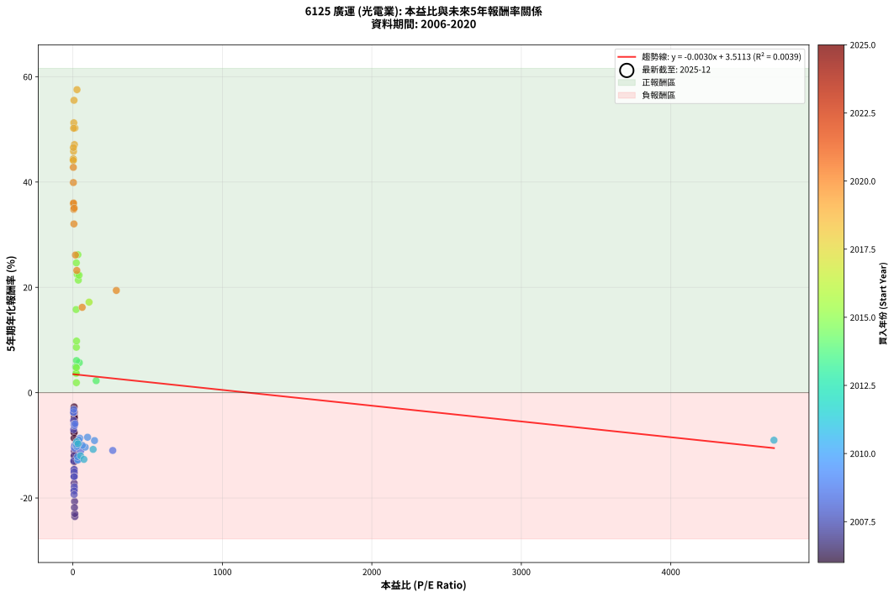
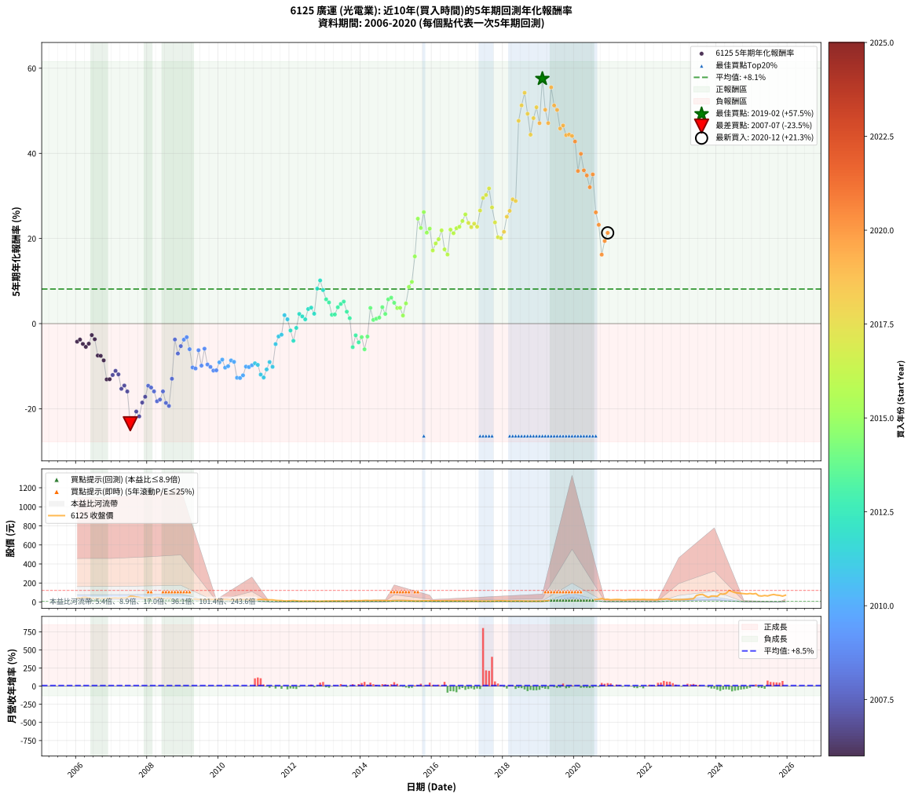

# 6125 廣運 - 本益比與未來報酬率分析

!!! info "報告資訊"
    - **股票代號**: 6125
    - **公司名稱**: 廣運
    - **產業別**: 光電業
    - **分析期間**: 2006-2020 (180 個數據點)
    - **資料來源**: Type 12 (ShowMonthlyK_ChartFlow) 月收盤價與本益比
    - **報酬率口徑**: 含現金股利 (簡化: 年度合計，假設每年7/1入帳)
    - **報告生成時間**: 2026-01-06 23:07:11 CST

## 📈 視覺化圖表

### 圖表1: 本益比 vs 未來報酬率關係

*圖表1：6125 廣運 本益比與5年期未來報酬率關係 (2006-2020)*

### 圖表2: 歷年買入時點的5年期實際報酬率

*圖表2：6125 廣運 歷年買入時點的5年期實際報酬率 (2006-2020)*

## 📍 買點訊號說明

本報告提供兩種買點提示訊號（顯示於圖表2的股價子圖中）：

### ▲ 小綠色三角形（回測驗證）
- **計算方式**: 使用全部歷史資料計算本益比第25百分位數
- **用途**: 事後驗證，顯示歷史上哪些時點確實為低估區
- **限制**: 當下無法判斷，僅供回測參考
- **特性**: 後見之明（Look-Ahead Bias）

### ▲ 小橘色三角形（即時訊號）
- **計算方式**: 使用截至當月的過去5年資料計算本益比第25百分位數
- **用途**: 實際投資決策，當時即可判斷
- **優勢**: 可操作性強，符合實務需求
- **特性**: 無後見之明，滾動窗口計算

!!! tip "如何使用兩種訊號"
    - **綠色▲** 幫助理解歷史估值機會，驗證策略有效性
    - **橘色▲** 可作為實際買進參考，但仍需搭配基本面分析
    - 兩種訊號重疊時，表示即時判斷與事後驗證一致，信心度較高
    - 僅有綠色▲時，表示當時無法判斷（需要未來資料才能確認）
    - 僅有橘色▲時，表示即時判斷為買點，但事後可能不是最佳時機

## 📊 估值分析摘要

| 指標 | 數值 |
|:---:|:---:|
| **目前本益比** (2020-12) | **nan 倍** |
| **歷史平均本益比** | 72.62 倍 |
| **估值水準** | 🟡 合理範圍 |
| **預期5年年化報酬率** | **+nan%** |
| **歷史平均報酬率** | +8.12% |
| **相關係數 (R²)** | 0.0039 |
| **趨勢線斜率** | -0.0030 |

!!! abstract "核心洞察"
    目前本益比接近歷史平均，預期報酬率符合長期趨勢

    根據歷史數據回測，6125 廣運 在目前本益比 **nan倍** 的估值水準下，
    預期未來5年年化報酬率約為 **+nan%**。

    **重要提醒**: 本分析基於歷史數據統計，實際報酬率會受到公司基本面變化、產業趨勢、
    總體經濟環境等多重因素影響。R² = 0.00 表示本益比可解釋約 0.4% 的報酬率變異。

## 📈 歷史估值統計

### 最佳買點 (最高報酬率)

| 項目 | 數值 |
|:---:|:---:|
| 起始時間 | 2019-02 |
| 當時本益比 | 27.62 倍 |
| 起始價格 | 9.5 元 |
| 5年後價格 | 85.2 元 |
| **5年年化報酬率** | **+57.54%** |

### 最差買點 (最低報酬率)

| 項目 | 數值 |
|:---:|:---:|
| 起始時間 | 2007-07 |
| 當時本益比 | 13.31 倍 |
| 起始價格 | 61.2 元 |
| 5年後價格 | 9.9 元 |
| **5年年化報酬率** | **-23.53%** |

## 🎯 投資啟示

### 本益比與報酬率關係

趨勢線方程式: **y = -0.0030x + 3.5113**

!!! note "負相關"
    本益比與未來報酬率呈現負相關。較低的本益比通常帶來較高的未來報酬率，
    但相關性不算非常強。**估值仍是重要參考指標之一**。

### 估值區間建議

基於歷史數據分析:

- **🟢 低估區** (P/E < 58.1): 預期報酬率較高，可考慮增加持股
- **🟡 合理區** (P/E 58.1-87.1): 預期報酬率符合長期趨勢，正常持有
- **🔴 高估區** (P/E > 87.1): 預期報酬率較低，可考慮減碼或觀望

!!! danger "風險提示"
    - 過去表現不代表未來結果
    - 本分析假設公司基本面無重大結構性變化
    - 產業環境劇變可能使歷史規律失效
    - 應結合公司財報、產業趨勢、總體經濟等多重因素綜合判斷

!!! success "長期投資觀點"
    歷史數據顯示，在合理或低估的估值水準買入並長期持有，
    往往能獲得較佳的投資報酬。**耐心等待好價格**是價值投資的核心原則。

## 📊 數據品質

- **資料來源**: GoodInfo.tw Type 12 (ShowMonthlyK_ChartFlow)
- **資料頻率**: 月度收盤價與本益比
- **回測期間**: 2006-2020
- **數據點數量**: 180 個 (每個點代表一次5年期回測)

### 計算方法說明

1. **5年期年化報酬率**:
   - 對每個歷史時點，計算其後5年的實際投資報酬率
   - 期末價值(不含股利): 期末價格
   - 期末價值(含現金股利): 期末價格 + 持有期間內的現金股利合計 (簡化: 年度合計，假設每年7/1入帳)
   - 公式: 年化報酬率 = [(期末價值/期初價格)^(1/年數) - 1] × 100%

2. **本益比 (P/E Ratio)**:
   - 使用當時的月收盤價與EPS計算
   - 資料來源: Type 12 月度河流圖本益比數據

3. **趨勢線 (Linear Regression)**:
   - 使用最小平方法擬合線性趨勢線
   - R²值衡量本益比對報酬率的解釋能力

---

*本報告由 Stock Analysis System v1.9.0 自動生成*
*數據更新時間: 2026-01-06 23:07:11 CST*

## 📋 月度回測明細表

（每一列對應時間線圖中的一個買入點；可用來對照 SVG 圖上的每個點。）

| 買入月份 | 賣出月份 | 回測期限_年 | 實際持有年數 | 買入本益比_倍 | 買入收盤價_元 | 賣出收盤價_元 | 現金股利合計_元 | 總報酬率_pct | 年化報酬率_pct |
| --- | --- | --- | --- | --- | --- | --- | --- | --- | --- |
| 2006-01 | 2011-01 | 5 | 4.999 | 9.15 | 41.25 | 23.60 | 9.61 | -19.50 | -4.25 |
| 2006-02 | 2011-02 | 5 | 4.999 | 9.29 | 41.90 | 25.00 | 9.61 | -17.41 | -3.75 |
| 2006-03 | 2011-03 | 5 | 4.999 | 10.58 | 47.70 | 27.75 | 9.61 | -21.69 | -4.77 |
| 2006-04 | 2011-04 | 5 | 4.999 | 10.69 | 48.20 | 26.80 | 9.61 | -24.47 | -5.46 |
| 2006-05 | 2011-05 | 5 | 4.999 | 9.76 | 44.00 | 24.95 | 9.61 | -21.46 | -4.72 |
| 2006-06 | 2011-06 | 5 | 4.999 | 8.40 | 37.90 | 23.45 | 9.61 | -12.78 | -2.70 |
| 2006-07 | 2011-07 | 5 | 4.999 | 8.37 | 37.75 | 22.90 | 8.41 | -17.06 | -3.67 |
| 2006-08 | 2011-08 | 5 | 4.999 | 8.58 | 38.70 | 17.80 | 8.41 | -32.27 | -7.50 |
| 2006-09 | 2011-09 | 5 | 4.999 | 7.96 | 35.90 | 15.80 | 8.41 | -32.56 | -7.58 |
| 2006-10 | 2011-10 | 5 | 4.999 | 8.26 | 37.25 | 15.30 | 8.41 | -36.35 | -8.64 |
| 2006-11 | 2011-11 | 5 | 4.999 | 8.76 | 39.50 | 11.15 | 8.41 | -50.48 | -13.11 |
| 2006-12 | 2011-12 | 5 | 4.999 | 8.98 | 40.50 | 11.70 | 8.41 | -50.35 | -13.07 |
| 2007-01 | 2012-01 | 5 | 4.999 | 9.18 | 41.50 | 13.40 | 8.41 | -47.45 | -12.07 |
| 2007-02 | 2012-02 | 5 | 4.999 | 9.44 | 42.80 | 15.35 | 8.41 | -44.49 | -11.11 |
| 2007-03 | 2012-03 | 5 | 5.002 | 8.93 | 40.60 | 13.10 | 8.41 | -47.02 | -11.93 |
| 2007-04 | 2012-04 | 5 | 5.002 | 9.55 | 43.55 | 10.55 | 8.41 | -56.46 | -15.32 |
| 2007-05 | 2012-05 | 5 | 5.002 | 9.03 | 41.30 | 10.40 | 8.41 | -54.46 | -14.55 |
| 2007-06 | 2012-06 | 5 | 5.002 | 9.99 | 45.80 | 10.80 | 8.41 | -58.06 | -15.95 |
| 2007-07 | 2012-07 | 5 | 5.002 | 13.31 | 61.20 | 9.88 | 6.11 | -73.87 | -23.53 |
| 2007-08 | 2012-08 | 5 | 5.002 | 12.82 | 59.10 | 9.90 | 6.11 | -72.91 | -22.98 |
| 2007-09 | 2012-09 | 5 | 5.002 | 11.57 | 53.50 | 10.70 | 6.11 | -68.58 | -20.66 |
| 2007-10 | 2012-10 | 5 | 5.002 | 10.66 | 49.40 | 8.32 | 6.11 | -70.79 | -21.81 |
| 2007-11 | 2012-11 | 5 | 5.002 | 9.10 | 42.30 | 9.04 | 6.11 | -64.18 | -18.56 |
| 2007-12 | 2012-12 | 5 | 5.002 | 8.86 | 41.30 | 9.96 | 6.11 | -61.08 | -17.19 |
| 2008-01 | 2013-01 | 5 | 5.002 | 7.96 | 37.25 | 10.80 | 6.11 | -54.60 | -14.60 |
| 2008-02 | 2013-03 | 5 | 5.081 | 8.60 | 40.40 | 11.55 | 6.11 | -56.28 | -15.03 |
| 2008-03 | 2013-03 | 5 | 4.999 | 8.92 | 42.05 | 11.55 | 6.11 | -58.00 | -15.93 |
| 2008-04 | 2013-04 | 5 | 4.999 | 10.01 | 47.40 | 11.20 | 6.11 | -63.48 | -18.25 |
| 2008-05 | 2013-05 | 5 | 4.999 | 9.68 | 46.00 | 11.10 | 6.11 | -62.58 | -17.85 |
| 2008-06 | 2013-06 | 5 | 4.999 | 8.09 | 38.60 | 10.10 | 6.11 | -58.00 | -15.93 |
| 2008-07 | 2013-07 | 5 | 4.999 | 7.74 | 37.05 | 10.10 | 3.11 | -64.34 | -18.64 |
| 2008-08 | 2013-08 | 5 | 4.999 | 8.48 | 40.75 | 10.80 | 3.11 | -65.86 | -19.34 |
| 2008-09 | 2013-09 | 5 | 4.999 | 5.94 | 28.65 | 11.20 | 3.11 | -50.05 | -12.96 |
| 2008-10 | 2013-10 | 5 | 4.999 | 4.56 | 22.10 | 15.15 | 3.11 | -17.37 | -3.74 |
| 2008-11 | 2013-11 | 5 | 4.999 | 5.04 | 24.50 | 13.90 | 3.11 | -30.56 | -7.04 |
| 2008-12 | 2013-12 | 5 | 4.999 | 4.64 | 22.65 | 14.15 | 3.11 | -23.79 | -5.29 |
| 2009-01 | 2014-01 | 5 | 4.999 | 4.71 | 21.10 | 14.30 | 3.11 | -17.48 | -3.77 |
| 2009-02 | 2014-02 | 5 | 4.999 | 5.54 | 22.65 | 16.15 | 3.11 | -14.96 | -3.19 |
| 2009-03 | 2014-03 | 5 | 4.999 | 7.21 | 26.60 | 16.40 | 3.11 | -26.65 | -6.01 |
| 2009-04 | 2014-04 | 5 | 4.999 | 8.91 | 29.30 | 13.90 | 3.11 | -41.94 | -10.30 |
| 2009-05 | 2014-05 | 5 | 4.999 | 11.44 | 33.10 | 15.85 | 3.11 | -42.71 | -10.55 |
| 2009-06 | 2014-06 | 5 | 4.999 | 10.66 | 26.60 | 16.15 | 3.11 | -27.59 | -6.25 |
| 2009-07 | 2014-07 | 5 | 4.999 | 13.92 | 29.20 | 15.25 | 2.11 | -40.54 | -9.88 |
| 2009-08 | 2014-08 | 5 | 4.999 | 13.56 | 23.05 | 14.90 | 2.11 | -26.20 | -5.89 |
| 2009-09 | 2014-09 | 5 | 4.999 | 22.03 | 28.70 | 15.20 | 2.11 | -39.68 | -9.62 |
| 2009-10 | 2014-10 | 5 | 4.999 | 29.50 | 26.70 | 13.50 | 2.11 | -41.53 | -10.18 |
| 2009-11 | 2014-11 | 5 | 4.999 | 52.71 | 26.75 | 12.80 | 2.11 | -44.25 | -11.03 |
| 2009-12 | 2014-12 | 5 | 4.999 | 266.80 | 29.35 | 14.30 | 2.11 | -44.08 | -10.98 |
| 2010-01 | 2015-01 | 5 | 4.999 | 144.90 | 27.65 | 15.05 | 2.11 | -37.93 | -9.10 |
| 2010-02 | 2015-02 | 5 | 4.999 | 98.28 | 26.70 | 15.05 | 2.11 | -35.72 | -8.46 |
| 2010-03 | 2015-03 | 5 | 4.999 | 82.84 | 29.20 | 14.80 | 2.11 | -42.08 | -10.35 |
| 2010-04 | 2015-04 | 5 | 4.999 | 63.00 | 27.30 | 14.00 | 2.11 | -40.98 | -10.01 |
| 2010-05 | 2015-05 | 5 | 4.999 | 46.19 | 23.75 | 13.00 | 2.11 | -36.37 | -8.65 |
| 2010-06 | 2015-06 | 5 | 4.999 | 40.00 | 23.80 | 12.75 | 2.11 | -37.55 | -8.99 |
| 2010-07 | 2015-07 | 5 | 4.999 | 36.70 | 24.80 | 10.45 | 2.11 | -49.35 | -12.72 |
| 2010-08 | 2015-08 | 5 | 4.999 | 32.51 | 24.60 | 10.30 | 2.11 | -49.54 | -12.79 |
| 2010-09 | 2015-09 | 5 | 4.999 | 31.40 | 26.30 | 11.65 | 2.11 | -47.67 | -12.15 |
| 2010-10 | 2015-10 | 5 | 4.999 | 27.28 | 25.05 | 12.60 | 2.11 | -41.27 | -10.10 |
| 2010-11 | 2015-11 | 5 | 4.999 | 24.72 | 24.70 | 12.30 | 2.11 | -41.65 | -10.22 |
| 2010-12 | 2015-12 | 5 | 4.999 | 22.50 | 24.30 | 12.40 | 2.11 | -40.28 | -9.80 |
| 2011-01 | 2016-01 | 5 | 4.999 | 26.20 | 23.60 | 12.35 | 2.11 | -38.72 | -9.33 |
| 2011-02 | 2016-02 | 5 | 4.999 | 34.64 | 25.00 | 12.90 | 2.11 | -39.95 | -9.70 |
| 2011-03 | 2016-03 | 5 | 5.002 | 51.15 | 27.75 | 12.55 | 2.11 | -47.16 | -11.97 |
| 2011-04 | 2016-04 | 5 | 5.002 | 73.76 | 26.80 | 11.50 | 2.11 | -49.21 | -12.67 |
| 2011-05 | 2016-05 | 5 | 5.002 | 135.50 | 24.95 | 12.00 | 2.11 | -43.44 | -10.77 |
| 2011-06 | 2016-06 | 5 | 5.002 | 4690.00 | 23.45 | 12.50 | 2.11 | -37.69 | -9.02 |
| 2011-07 | 2016-07 | 5 | 5.002 |  | 22.90 | 11.70 | 1.70 | -41.48 | -10.16 |
| 2011-08 | 2016-08 | 5 | 5.002 |  | 17.80 | 12.20 | 1.70 | -21.90 | -4.82 |
| 2011-09 | 2016-09 | 5 | 5.002 |  | 15.80 | 11.85 | 1.70 | -14.23 | -3.02 |
| 2011-10 | 2016-10 | 5 | 5.002 |  | 15.30 | 11.70 | 1.70 | -12.41 | -2.61 |
| 2011-11 | 2016-11 | 5 | 5.002 |  | 11.15 | 10.60 | 1.70 | +10.33 | +1.99 |
| 2011-12 | 2016-12 | 5 | 5.002 |  | 11.70 | 10.60 | 1.70 | +5.15 | +1.01 |
| 2012-01 | 2017-01 | 5 | 5.002 |  | 13.40 | 10.65 | 1.70 | -7.82 | -1.61 |
| 2012-02 | 2017-03 | 5 | 5.081 |  | 15.35 | 10.75 | 1.70 | -18.88 | -4.03 |
| 2012-03 | 2017-03 | 5 | 4.999 |  | 13.10 | 10.75 | 1.70 | -4.95 | -1.01 |
| 2012-04 | 2017-04 | 5 | 4.999 |  | 10.55 | 10.10 | 1.70 | +11.87 | +2.27 |
| 2012-05 | 2017-05 | 5 | 4.999 |  | 10.40 | 9.61 | 1.70 | +8.77 | +1.70 |
| 2012-06 | 2017-06 | 5 | 4.999 |  | 10.80 | 9.65 | 1.70 | +5.11 | +1.00 |
| 2012-07 | 2017-07 | 5 | 4.999 |  | 9.88 | 9.69 | 2.00 | +18.32 | +3.42 |
| 2012-08 | 2017-08 | 5 | 4.999 |  | 9.90 | 9.90 | 2.00 | +20.20 | +3.75 |
| 2012-09 | 2017-09 | 5 | 4.999 |  | 10.70 | 10.00 | 2.00 | +12.15 | +2.32 |
| 2012-10 | 2017-10 | 5 | 4.999 |  | 8.32 | 10.35 | 2.00 | +48.44 | +8.22 |
| 2012-11 | 2017-11 | 5 | 4.999 |  | 9.04 | 12.65 | 2.00 | +62.06 | +10.14 |
| 2012-12 | 2017-12 | 5 | 4.999 |  | 9.96 | 12.55 | 2.00 | +46.08 | +7.88 |
| 2013-01 | 2018-01 | 5 | 4.999 |  | 10.80 | 12.25 | 2.00 | +31.94 | +5.70 |
| 2013-02 | 2018-02 | 5 | 4.999 |  | 10.20 | 11.00 | 2.00 | +27.45 | +4.97 |
| 2013-03 | 2018-03 | 5 | 4.999 |  | 11.55 | 10.80 | 2.00 | +10.82 | +2.08 |
| 2013-04 | 2018-04 | 5 | 4.999 |  | 11.20 | 10.45 | 2.00 | +11.16 | +2.14 |
| 2013-05 | 2018-05 | 5 | 4.999 |  | 11.10 | 11.40 | 2.00 | +20.72 | +3.84 |
| 2013-06 | 2018-06 | 5 | 4.999 |  | 10.10 | 10.65 | 2.00 | +25.25 | +4.61 |
| 2013-07 | 2018-07 | 5 | 4.999 |  | 10.10 | 10.70 | 2.30 | +28.71 | +5.18 |
| 2013-08 | 2018-08 | 5 | 4.999 |  | 10.80 | 10.10 | 2.30 | +14.81 | +2.80 |
| 2013-09 | 2018-09 | 5 | 4.999 |  | 11.20 | 9.63 | 2.30 | +6.52 | +1.27 |
| 2013-10 | 2018-10 | 5 | 4.999 |  | 15.15 | 9.10 | 2.30 | -24.75 | -5.53 |
| 2013-11 | 2018-11 | 5 | 4.999 |  | 13.90 | 9.79 | 2.30 | -13.02 | -2.75 |
| 2013-12 | 2018-12 | 5 | 4.999 |  | 14.15 | 9.00 | 2.30 | -20.14 | -4.40 |
| 2014-01 | 2019-01 | 5 | 4.999 |  | 14.30 | 9.87 | 2.30 | -14.90 | -3.17 |
| 2014-02 | 2019-02 | 5 | 4.999 |  | 16.15 | 9.53 | 2.30 | -26.75 | -6.04 |
| 2014-03 | 2019-03 | 5 | 4.999 |  | 16.40 | 11.75 | 2.30 | -14.33 | -3.05 |
| 2014-04 | 2019-04 | 5 | 4.999 |  | 13.90 | 14.35 | 2.30 | +19.78 | +3.68 |
| 2014-05 | 2019-05 | 5 | 4.999 |  | 15.85 | 14.25 | 2.30 | +4.42 | +0.87 |
| 2014-06 | 2019-06 | 5 | 4.999 |  | 16.15 | 14.80 | 2.30 | +5.88 | +1.15 |
| 2014-07 | 2019-07 | 5 | 4.999 |  | 15.25 | 14.05 | 2.31 | +7.25 | +1.41 |
| 2014-08 | 2019-08 | 5 | 4.999 |  | 14.90 | 15.70 | 2.31 | +20.85 | +3.86 |
| 2014-09 | 2019-09 | 5 | 4.999 | 155.90 | 15.20 | 14.70 | 2.31 | +11.88 | +2.27 |
| 2014-10 | 2019-10 | 5 | 4.999 | 43.32 | 13.50 | 15.50 | 2.31 | +31.90 | +5.69 |
| 2014-11 | 2019-11 | 5 | 4.999 | 24.34 | 12.80 | 14.90 | 2.31 | +34.42 | +6.10 |
| 2014-12 | 2019-12 | 5 | 4.999 | 19.32 | 14.30 | 15.85 | 2.31 | +26.97 | +4.89 |
| 2015-01 | 2020-01 | 5 | 4.999 | 21.40 | 15.05 | 15.70 | 2.31 | +19.64 | +3.65 |
| 2015-02 | 2020-02 | 5 | 4.999 | 22.58 | 15.05 | 15.75 | 2.31 | +19.97 | +3.71 |
| 2015-03 | 2020-03 | 5 | 5.002 | 23.49 | 14.80 | 13.95 | 2.31 | +9.84 | +1.89 |
| 2015-04 | 2020-04 | 5 | 5.002 | 23.60 | 14.00 | 15.35 | 2.31 | +26.11 | +4.75 |
| 2015-05 | 2020-05 | 5 | 5.002 | 23.35 | 13.00 | 17.35 | 2.31 | +51.20 | +8.62 |
| 2015-06 | 2020-06 | 5 | 5.002 | 24.52 | 12.75 | 18.05 | 2.31 | +59.65 | +9.80 |
| 2015-07 | 2020-07 | 5 | 5.002 | 21.62 | 10.45 | 17.95 | 3.81 | +108.19 | +15.79 |
| 2015-08 | 2020-08 | 5 | 5.002 | 23.06 | 10.30 | 27.20 | 3.81 | +201.03 | +24.65 |
| 2015-09 | 2020-09 | 5 | 5.002 | 28.41 | 11.65 | 28.30 | 3.81 | +175.59 | +22.47 |
| 2015-10 | 2020-10 | 5 | 5.002 | 33.75 | 12.60 | 36.55 | 3.81 | +220.29 | +26.20 |
| 2015-11 | 2020-11 | 5 | 5.002 | 36.53 | 12.30 | 28.60 | 3.81 | +163.46 | +21.37 |
| 2015-12 | 2020-12 | 5 | 5.002 | 41.33 | 12.40 | 30.15 | 3.81 | +173.84 | +22.31 |
| 2016-01 | 2021-01 | 5 | 5.002 | 108.40 | 12.35 | 23.50 | 3.81 | +121.10 | +17.19 |
| 2016-02 | 2021-03 | 5 | 5.081 |  | 12.90 | 27.20 | 3.81 | +140.36 | +18.84 |
| 2016-03 | 2021-03 | 5 | 4.999 |  | 12.55 | 27.20 | 3.81 | +147.06 | +19.83 |
| 2016-04 | 2021-04 | 5 | 4.999 |  | 11.50 | 27.15 | 3.81 | +169.18 | +21.90 |
| 2016-05 | 2021-05 | 5 | 4.999 |  | 12.00 | 23.00 | 3.81 | +123.38 | +17.44 |
| 2016-06 | 2021-06 | 5 | 4.999 |  | 12.50 | 22.70 | 3.81 | +112.05 | +16.22 |
| 2016-07 | 2021-07 | 5 | 4.999 |  | 11.70 | 26.90 | 4.81 | +170.99 | +22.07 |
| 2016-08 | 2021-08 | 5 | 4.999 |  | 12.20 | 27.15 | 4.81 | +161.93 | +21.24 |
| 2016-09 | 2021-09 | 5 | 4.999 |  | 11.85 | 27.75 | 4.81 | +174.73 | +22.40 |
| 2016-10 | 2021-10 | 5 | 4.999 |  | 11.70 | 27.80 | 4.81 | +178.68 | +22.75 |
| 2016-11 | 2021-11 | 5 | 4.999 |  | 10.60 | 26.40 | 4.81 | +194.40 | +24.11 |
| 2016-12 | 2021-12 | 5 | 4.999 |  | 10.60 | 28.40 | 4.81 | +213.26 | +25.66 |
| 2017-01 | 2022-01 | 5 | 4.999 |  | 10.65 | 26.00 | 4.81 | +189.26 | +23.67 |
| 2017-02 | 2022-02 | 5 | 4.999 |  | 10.95 | 25.60 | 4.81 | +177.68 | +22.67 |
| 2017-03 | 2022-03 | 5 | 4.999 |  | 10.75 | 26.05 | 4.81 | +187.03 | +23.48 |
| 2017-04 | 2022-04 | 5 | 4.999 |  | 10.10 | 23.35 | 4.81 | +178.77 | +22.76 |
| 2017-05 | 2022-05 | 5 | 4.999 |  | 9.61 | 26.40 | 4.81 | +224.72 | +26.57 |
| 2017-06 | 2022-06 | 5 | 4.999 |  | 9.65 | 30.35 | 4.81 | +264.31 | +29.51 |
| 2017-07 | 2022-07 | 5 | 4.999 |  | 9.69 | 30.35 | 5.92 | +274.29 | +30.21 |
| 2017-08 | 2022-08 | 5 | 4.999 |  | 9.90 | 33.40 | 5.92 | +297.16 | +31.77 |
| 2017-09 | 2022-09 | 5 | 4.999 |  | 10.00 | 27.50 | 5.92 | +234.19 | +27.30 |
| 2017-10 | 2022-10 | 5 | 4.999 |  | 10.35 | 24.15 | 5.92 | +190.52 | +23.78 |
| 2017-11 | 2022-11 | 5 | 4.999 |  | 12.65 | 25.95 | 5.92 | +151.93 | +20.30 |
| 2017-12 | 2022-12 | 5 | 4.999 |  | 12.55 | 25.40 | 5.92 | +149.55 | +20.07 |
| 2018-01 | 2023-01 | 5 | 4.999 |  | 12.25 | 26.60 | 5.92 | +165.46 | +21.57 |
| 2018-02 | 2023-02 | 5 | 4.999 |  | 11.00 | 27.80 | 5.92 | +206.54 | +25.12 |
| 2018-03 | 2023-03 | 5 | 4.999 |  | 10.80 | 29.05 | 5.92 | +223.79 | +26.49 |
| 2018-04 | 2023-04 | 5 | 4.999 |  | 10.45 | 31.70 | 5.92 | +259.99 | +29.20 |
| 2018-05 | 2023-05 | 5 | 4.999 |  | 11.40 | 34.50 | 5.92 | +254.55 | +28.81 |
| 2018-06 | 2023-06 | 5 | 4.999 |  | 10.65 | 68.80 | 5.92 | +601.59 | +47.65 |
| 2018-07 | 2023-07 | 5 | 4.999 |  | 10.70 | 77.50 | 7.24 | +691.95 | +51.27 |
| 2018-08 | 2023-08 | 5 | 4.999 |  | 10.10 | 80.90 | 7.24 | +772.66 | +54.24 |
| 2018-09 | 2023-09 | 5 | 4.999 |  | 9.63 | 64.20 | 7.24 | +641.84 | +49.31 |
| 2018-10 | 2023-10 | 5 | 4.999 |  | 9.10 | 49.85 | 7.24 | +527.35 | +44.39 |
| 2018-11 | 2023-11 | 5 | 4.999 |  | 9.79 | 62.90 | 7.24 | +616.44 | +48.27 |
| 2018-12 | 2023-12 | 5 | 4.999 |  | 9.00 | 63.00 | 7.24 | +680.43 | +50.83 |
| 2019-01 | 2024-01 | 5 | 4.999 |  | 9.87 | 60.70 | 7.24 | +588.34 | +47.09 |
| 2019-02 | 2024-02 | 5 | 4.999 | 27.62 | 9.53 | 85.20 | 7.24 | +869.98 | +57.54 |
| 2019-03 | 2024-03 | 5 | 5.002 | 13.70 | 11.75 | 82.80 | 7.24 | +666.29 | +50.25 |
| 2019-04 | 2024-04 | 5 | 5.002 | 10.47 | 14.35 | 91.70 | 7.24 | +589.47 | +47.11 |
| 2019-05 | 2024-05 | 5 | 5.002 | 7.57 | 14.25 | 122.50 | 7.24 | +810.45 | +55.52 |
| 2019-06 | 2024-06 | 5 | 5.002 | 6.18 | 14.80 | 110.00 | 7.24 | +692.16 | +51.25 |
| 2019-07 | 2024-07 | 5 | 5.002 | 4.83 | 14.05 | 99.10 | 8.43 | +665.36 | +50.21 |
| 2019-08 | 2024-08 | 5 | 5.002 | 4.59 | 15.70 | 95.20 | 8.43 | +560.08 | +45.83 |
| 2019-09 | 2024-09 | 5 | 5.002 | 3.74 | 14.70 | 91.00 | 8.43 | +576.41 | +46.55 |
| 2019-10 | 2024-10 | 5 | 5.002 | 3.49 | 15.50 | 88.50 | 8.43 | +525.37 | +44.27 |
| 2019-11 | 2024-11 | 5 | 5.002 | 3.01 | 14.90 | 85.20 | 8.43 | +528.41 | +44.41 |
| 2019-12 | 2024-12 | 5 | 5.002 | 2.90 | 15.85 | 90.10 | 8.43 | +521.66 | +44.09 |
| 2020-01 | 2025-01 | 5 | 5.002 | 3.15 | 15.70 | 84.80 | 8.43 | +493.84 | +42.78 |
| 2020-02 | 2025-03 | 5 | 5.081 | 3.51 | 15.75 | 66.30 | 8.43 | +374.50 | +35.86 |
| 2020-03 | 2025-03 | 5 | 4.999 | 3.48 | 13.95 | 66.30 | 8.43 | +435.72 | +39.90 |
| 2020-04 | 2025-04 | 5 | 4.999 | 4.36 | 15.35 | 63.00 | 8.43 | +365.36 | +36.01 |
| 2020-05 | 2025-05 | 5 | 4.999 | 5.73 | 17.35 | 68.80 | 8.43 | +345.15 | +34.81 |
| 2020-06 | 2025-06 | 5 | 4.999 | 7.11 | 18.05 | 64.00 | 8.43 | +301.29 | +32.04 |
| 2020-07 | 2025-07 | 5 | 4.999 | 8.75 | 17.95 | 73.50 | 7.13 | +349.21 | +35.05 |
| 2020-08 | 2025-08 | 5 | 4.999 | 17.40 | 27.20 | 79.70 | 7.13 | +219.24 | +26.14 |
| 2020-09 | 2025-09 | 5 | 4.999 | 26.33 | 28.30 | 73.20 | 7.13 | +183.86 | +23.21 |
| 2020-10 | 2025-10 | 5 | 4.999 | 62.30 | 36.55 | 70.30 | 7.13 | +111.85 | +16.20 |
| 2020-11 | 2025-11 | 5 | 4.999 | 290.80 | 28.60 | 62.30 | 7.13 | +142.77 | +19.41 |
| 2020-12 | 2025-12 | 5 | 4.999 |  | 30.15 | 72.10 | 7.13 | +162.80 | +21.32 |
