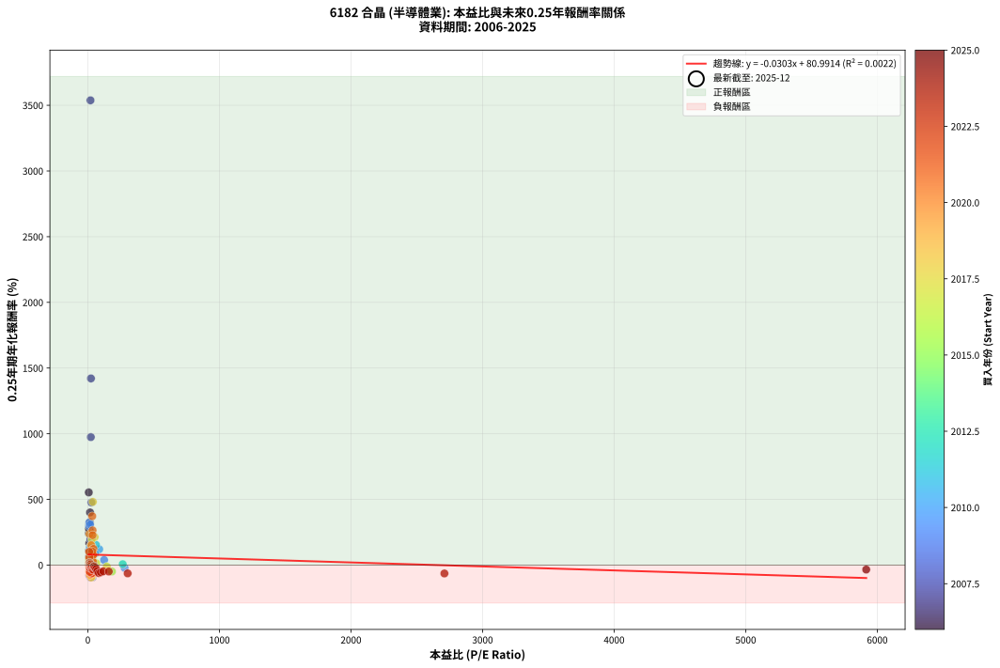
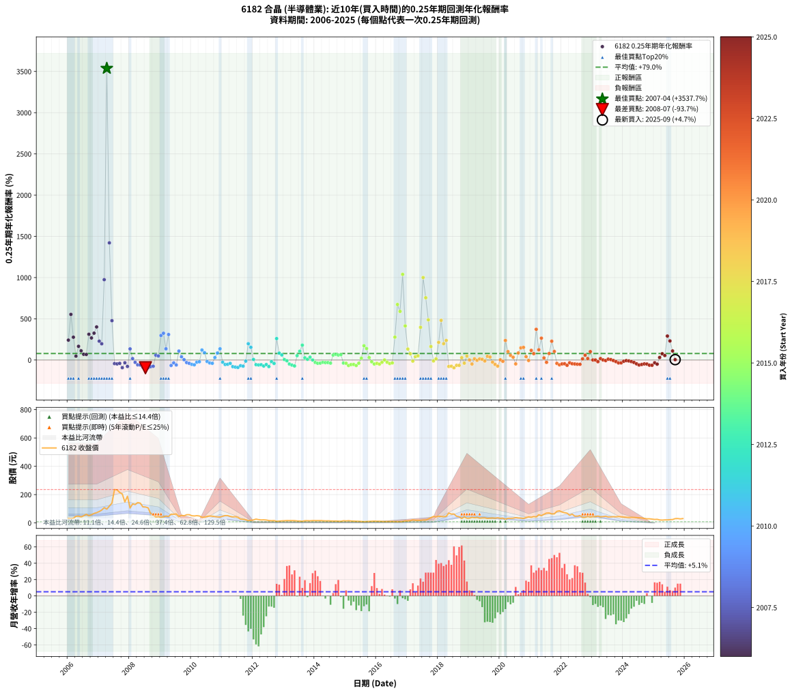

# 6182 合晶 - 本益比與未來報酬率分析

!!! info "報告資訊"
    - **股票代號**: 6182
    - **公司名稱**: 合晶
    - **產業別**: 半導體業
    - **分析期間**: 2006-2025 (237 個數據點)
    - **資料來源**: Type 12 (ShowMonthlyK_ChartFlow) 月收盤價與本益比
    - **報酬率口徑**: 含現金股利 (簡化: 年度合計，假設每年7/1入帳)
    - **報告生成時間**: 2026-01-13 13:54:06 CST

## 📈 視覺化圖表

### 圖表1: 本益比 vs 未來報酬率關係

*圖表1：6182 合晶 本益比與0.25年期未來報酬率關係 (2006-2025)*

### 圖表2: 歷年買入時點的0.25年期實際報酬率

*圖表2：6182 合晶 歷年買入時點的0.25年期實際報酬率 (2006-2025)*

## 📍 買點訊號說明

本報告提供兩種買點提示訊號（顯示於圖表2的股價子圖中）：

### ▲ 小綠色三角形（回測驗證）
- **計算方式**: 使用全部歷史資料計算本益比第25百分位數
- **用途**: 事後驗證，顯示歷史上哪些時點確實為低估區
- **限制**: 當下無法判斷，僅供回測參考
- **特性**: 後見之明（Look-Ahead Bias）

### ▲ 小橘色三角形（即時訊號）
- **計算方式**: 使用截至當月的過去5年資料計算本益比第25百分位數
- **用途**: 實際投資決策，當時即可判斷
- **優勢**: 可操作性強，符合實務需求
- **特性**: 無後見之明，滾動窗口計算

!!! tip "如何使用兩種訊號"
    - **綠色▲** 幫助理解歷史估值機會，驗證策略有效性
    - **橘色▲** 可作為實際買進參考，但仍需搭配基本面分析
    - 兩種訊號重疊時，表示即時判斷與事後驗證一致，信心度較高
    - 僅有綠色▲時，表示當時無法判斷（需要未來資料才能確認）
    - 僅有橘色▲時，表示即時判斷為買點，但事後可能不是最佳時機

## 📊 估值分析摘要

| 指標 | 數值 |
|:---:|:---:|
| **目前本益比** (2025-09) | **nan 倍** |
| **歷史平均本益比** | 90.61 倍 |
| **估值水準** | 🟡 合理範圍 |
| **預期0.25年年化報酬率** | **+nan%** |
| **歷史平均報酬率** | +79.05% |
| **相關係數 (R²)** | 0.0022 |
| **趨勢線斜率** | -0.0303 |

!!! abstract "核心洞察"
    目前本益比接近歷史平均，預期報酬率符合長期趨勢

    根據歷史數據回測，6182 合晶 在目前本益比 **nan倍** 的估值水準下，
    預期未來0.25年年化報酬率約為 **+nan%**。

    **重要提醒**: 本分析基於歷史數據統計，實際報酬率會受到公司基本面變化、產業趨勢、
    總體經濟環境等多重因素影響。R² = 0.00 表示本益比可解釋約 0.2% 的報酬率變異。

## 📈 歷史估值統計

### 最佳買點 (最高報酬率)

| 項目 | 數值 |
|:---:|:---:|
| 起始時間 | 2007-04 |
| 當時本益比 | 19.87 倍 |
| 起始價格 | 97.5 元 |
| 0.25年後價格 | 236.0 元 |
| **0.25年年化報酬率** | **+3537.70%** |

### 最差買點 (最低報酬率)

| 項目 | 數值 |
|:---:|:---:|
| 起始時間 | 2008-07 |
| 當時本益比 | 21.66 倍 |
| 起始價格 | 112.5 元 |
| 0.25年後價格 | 56.0 元 |
| **0.25年年化報酬率** | **-93.73%** |

## 🎯 投資啟示

### 本益比與報酬率關係

趨勢線方程式: **y = -0.0303x + 80.9914**

!!! note "負相關"
    本益比與未來報酬率呈現負相關。較低的本益比通常帶來較高的未來報酬率，
    但相關性不算非常強。**估值仍是重要參考指標之一**。

### 估值區間建議

基於歷史數據分析:

- **🟢 低估區** (P/E < 72.5): 預期報酬率較高，可考慮增加持股
- **🟡 合理區** (P/E 72.5-108.7): 預期報酬率符合長期趨勢，正常持有
- **🔴 高估區** (P/E > 108.7): 預期報酬率較低，可考慮減碼或觀望

!!! danger "風險提示"
    - 過去表現不代表未來結果
    - 本分析假設公司基本面無重大結構性變化
    - 產業環境劇變可能使歷史規律失效
    - 應結合公司財報、產業趨勢、總體經濟等多重因素綜合判斷

!!! success "長期投資觀點"
    歷史數據顯示，在合理或低估的估值水準買入並長期持有，
    往往能獲得較佳的投資報酬。**耐心等待好價格**是價值投資的核心原則。

## 📊 數據品質

- **資料來源**: GoodInfo.tw Type 12 (ShowMonthlyK_ChartFlow)
- **資料頻率**: 月度收盤價與本益比
- **回測期間**: 2006-2025
- **數據點數量**: 237 個 (每個點代表一次0.25年期回測)

### 計算方法說明

1. **0.25年期年化報酬率**:
   - 對每個歷史時點，計算其後0.25年的實際投資報酬率
   - 期末價值(不含股利): 期末價格
   - 期末價值(含現金股利): 期末價格 + 持有期間內的現金股利合計 (簡化: 年度合計，假設每年7/1入帳)
   - 公式: 年化報酬率 = [(期末價值/期初價格)^(1/年數) - 1] × 100%

2. **本益比 (P/E Ratio)**:
   - 使用當時的月收盤價與EPS計算
   - 資料來源: Type 12 月度河流圖本益比數據

3. **趨勢線 (Linear Regression)**:
   - 使用最小平方法擬合線性趨勢線
   - R²值衡量本益比對報酬率的解釋能力

---

*本報告由 Stock Analysis System v1.9.0 自動生成*
*數據更新時間: 2026-01-13 13:54:06 CST*

## 📋 月度回測明細表

（每一列對應時間線圖中的一個買入點；可用來對照 SVG 圖上的每個點。）

| 買入月份 | 賣出月份 | 回測期限_年 | 實際持有年數 | 買入本益比_倍 | 買入收盤價_元 | 賣出收盤價_元 | 現金股利合計_元 | 總報酬率_pct | 年化報酬率_pct |
| --- | --- | --- | --- | --- | --- | --- | --- | --- | --- |
| 2006-01 | 2006-05 | 0.25 | 0.329 | 7.39 | 32.20 | 48.20 | 0.00 | +49.69 | +241.38 |
| 2006-02 | 2006-05 | 0.25 | 0.246 | 6.96 | 30.35 | 48.20 | 0.00 | +58.81 | +553.54 |
| 2006-03 | 2006-07 | 0.25 | 0.334 | 7.57 | 33.00 | 50.80 | 0.59 | +55.73 | +276.63 |
| 2006-04 | 2006-07 | 0.25 | 0.249 | 10.71 | 46.70 | 50.80 | 0.59 | +10.04 | +46.83 |
| 2006-05 | 2006-08 | 0.25 | 0.252 | 11.06 | 48.20 | 61.10 | 0.59 | +27.99 | +166.36 |
| 2006-06 | 2006-09 | 0.25 | 0.252 | 9.79 | 42.70 | 51.00 | 0.59 | +20.82 | +111.88 |
| 2006-07 | 2006-10 | 0.25 | 0.252 | 11.65 | 50.80 | 58.00 | 0.00 | +14.17 | +69.25 |
| 2006-08 | 2006-12 | 0.25 | 0.334 | 14.01 | 61.10 | 72.60 | 0.00 | +18.82 | +67.58 |
| 2006-09 | 2006-12 | 0.25 | 0.249 | 11.70 | 51.00 | 72.60 | 0.00 | +42.35 | +312.64 |
| 2006-10 | 2007-01 | 0.25 | 0.252 | 13.30 | 58.00 | 80.50 | 0.00 | +38.79 | +267.47 |
| 2006-11 | 2007-03 | 0.25 | 0.329 | 15.39 | 67.10 | 108.00 | 0.00 | +60.95 | +325.74 |
| 2006-12 | 2007-03 | 0.25 | 0.246 | 16.65 | 72.60 | 108.00 | 0.00 | +48.76 | +401.20 |
| 2007-01 | 2007-05 | 0.25 | 0.329 | 17.90 | 80.50 | 119.00 | 0.00 | +47.83 | +228.61 |
| 2007-02 | 2007-05 | 0.25 | 0.246 | 19.64 | 91.00 | 119.00 | 0.00 | +30.77 | +197.04 |
| 2007-03 | 2007-07 | 0.25 | 0.334 | 22.64 | 108.00 | 236.00 | 2.71 | +121.03 | +974.58 |
| 2007-04 | 2007-07 | 0.25 | 0.249 | 19.87 | 97.50 | 236.00 | 2.71 | +144.83 | +3537.70 |
| 2007-05 | 2007-08 | 0.25 | 0.252 | 23.60 | 119.00 | 233.50 | 2.71 | +98.50 | +1420.99 |
| 2007-06 | 2007-09 | 0.25 | 0.252 | 27.03 | 140.00 | 215.00 | 2.71 | +55.51 | +477.16 |
| 2007-07 | 2007-10 | 0.25 | 0.252 | 44.40 | 236.00 | 204.50 | 0.00 | -13.35 | -43.38 |
| 2007-08 | 2007-12 | 0.25 | 0.334 | 42.83 | 233.50 | 189.00 | 0.00 | -19.06 | -46.90 |
| 2007-09 | 2007-12 | 0.25 | 0.249 | 38.47 | 215.00 | 189.00 | 0.00 | -12.09 | -40.39 |
| 2007-10 | 2008-01 | 0.25 | 0.252 | 35.72 | 204.50 | 105.50 | 0.00 | -48.41 | -92.78 |
| 2007-11 | 2008-03 | 0.25 | 0.331 | 25.25 | 148.00 | 129.50 | 0.00 | -12.50 | -33.17 |
| 2007-12 | 2008-03 | 0.25 | 0.249 | 31.51 | 189.00 | 129.50 | 0.00 | -31.48 | -78.07 |
| 2008-01 | 2008-05 | 0.25 | 0.331 | 17.93 | 105.50 | 140.00 | 0.00 | +32.70 | +134.92 |
| 2008-02 | 2008-05 | 0.25 | 0.249 | 23.32 | 134.50 | 140.00 | 0.00 | +4.09 | +17.45 |
| 2008-03 | 2008-07 | 0.25 | 0.334 | 22.91 | 129.50 | 112.50 | 3.41 | -10.49 | -28.25 |
| 2008-04 | 2008-07 | 0.25 | 0.249 | 26.00 | 144.00 | 112.50 | 3.41 | -19.51 | -58.15 |
| 2008-05 | 2008-08 | 0.25 | 0.252 | 25.81 | 140.00 | 107.00 | 3.41 | -21.14 | -61.04 |
| 2008-06 | 2008-09 | 0.25 | 0.252 | 21.38 | 113.50 | 66.30 | 3.41 | -38.58 | -85.56 |
| 2008-07 | 2008-10 | 0.25 | 0.252 | 21.66 | 112.50 | 56.00 | 0.00 | -50.22 | -93.73 |
| 2008-08 | 2008-12 | 0.25 | 0.334 | 21.07 | 107.00 | 44.20 | 0.00 | -58.69 | -92.91 |
| 2008-09 | 2008-12 | 0.25 | 0.249 | 13.36 | 66.30 | 44.20 | 0.00 | -33.33 | -80.36 |
| 2008-10 | 2009-01 | 0.25 | 0.252 | 11.55 | 56.00 | 39.20 | 0.00 | -30.00 | -75.73 |
| 2008-11 | 2009-03 | 0.25 | 0.329 | 8.86 | 41.95 | 48.80 | 0.00 | +16.33 | +58.47 |
| 2008-12 | 2009-03 | 0.25 | 0.246 | 9.57 | 44.20 | 48.80 | 0.00 | +10.41 | +49.45 |
| 2009-01 | 2009-05 | 0.25 | 0.329 | 9.43 | 39.20 | 61.70 | 0.00 | +57.40 | +297.76 |
| 2009-02 | 2009-05 | 0.25 | 0.246 | 11.71 | 43.20 | 61.70 | 0.00 | +42.82 | +324.85 |
| 2009-03 | 2009-07 | 0.25 | 0.334 | 15.13 | 48.80 | 63.60 | 1.40 | +33.20 | +135.89 |
| 2009-04 | 2009-07 | 0.25 | 0.249 | 16.58 | 45.75 | 63.60 | 1.40 | +42.08 | +309.43 |
| 2009-05 | 2009-08 | 0.25 | 0.252 | 26.88 | 61.70 | 45.60 | 1.40 | -23.82 | -66.05 |
| 2009-06 | 2009-09 | 0.25 | 0.252 | 33.50 | 61.30 | 53.70 | 1.40 | -10.11 | -34.51 |
| 2009-07 | 2009-10 | 0.25 | 0.252 | 46.59 | 63.60 | 50.50 | 0.00 | -20.60 | -59.98 |
| 2009-08 | 2009-12 | 0.25 | 0.334 | 50.67 | 45.60 | 58.30 | 0.00 | +27.85 | +108.67 |
| 2009-09 | 2009-12 | 0.25 | 0.249 | 123.40 | 53.70 | 58.30 | 0.00 | +8.57 | +39.08 |
| 2009-10 | 2010-01 | 0.25 | 0.252 |  | 50.50 | 51.00 | 0.00 | +0.99 | +3.99 |
| 2009-11 | 2010-03 | 0.25 | 0.329 |  | 58.00 | 51.40 | 0.00 | -11.38 | -30.77 |
| 2009-12 | 2010-03 | 0.25 | 0.246 |  | 58.30 | 51.40 | 0.00 | -11.84 | -40.02 |
| 2010-01 | 2010-05 | 0.25 | 0.329 |  | 51.00 | 39.80 | 0.00 | -21.96 | -52.99 |
| 2010-02 | 2010-05 | 0.25 | 0.246 |  | 49.25 | 39.80 | 0.00 | -19.19 | -57.88 |
| 2010-03 | 2010-07 | 0.25 | 0.334 |  | 51.40 | 46.50 | 0.00 | -9.53 | -25.91 |
| 2010-04 | 2010-07 | 0.25 | 0.249 | 279.10 | 49.30 | 46.50 | 0.00 | -5.68 | -20.92 |
| 2010-05 | 2010-08 | 0.25 | 0.252 | 86.37 | 39.80 | 48.60 | 0.00 | +22.11 | +121.01 |
| 2010-06 | 2010-09 | 0.25 | 0.252 | 54.50 | 40.60 | 47.65 | 0.00 | +17.36 | +88.83 |
| 2010-07 | 2010-10 | 0.25 | 0.252 | 45.18 | 46.50 | 44.25 | 0.00 | -4.84 | -17.87 |
| 2010-08 | 2010-12 | 0.25 | 0.334 | 37.01 | 48.60 | 42.00 | 0.00 | -13.58 | -35.40 |
| 2010-09 | 2010-12 | 0.25 | 0.249 | 29.83 | 47.65 | 42.00 | 0.00 | -11.86 | -39.75 |
| 2010-10 | 2011-01 | 0.25 | 0.252 | 23.52 | 44.25 | 47.25 | 0.00 | +6.78 | +29.75 |
| 2010-11 | 2011-03 | 0.25 | 0.329 | 19.58 | 42.40 | 51.90 | 0.00 | +22.41 | +85.03 |
| 2010-12 | 2011-03 | 0.25 | 0.246 | 17.14 | 42.00 | 51.90 | 0.00 | +23.57 | +136.07 |
| 2011-01 | 2011-05 | 0.25 | 0.329 | 20.81 | 47.25 | 42.70 | 0.00 | -9.63 | -26.52 |
| 2011-02 | 2011-05 | 0.25 | 0.246 | 24.76 | 51.80 | 42.70 | 0.00 | -17.57 | -54.34 |
| 2011-03 | 2011-07 | 0.25 | 0.334 | 27.14 | 51.90 | 39.60 | 1.00 | -21.77 | -52.06 |
| 2011-04 | 2011-07 | 0.25 | 0.249 | 26.65 | 46.20 | 39.60 | 1.00 | -12.12 | -40.47 |
| 2011-05 | 2011-08 | 0.25 | 0.252 | 27.47 | 42.70 | 27.40 | 1.00 | -33.49 | -80.19 |
| 2011-06 | 2011-09 | 0.25 | 0.252 | 32.40 | 44.55 | 26.00 | 1.00 | -39.39 | -86.30 |
| 2011-07 | 2011-10 | 0.25 | 0.252 | 33.11 | 39.60 | 22.30 | 0.00 | -43.69 | -89.77 |
| 2011-08 | 2011-12 | 0.25 | 0.334 | 26.95 | 27.40 | 18.55 | 0.00 | -32.30 | -68.90 |
| 2011-09 | 2011-12 | 0.25 | 0.249 | 31.04 | 26.00 | 18.55 | 0.00 | -28.65 | -74.21 |
| 2011-10 | 2012-01 | 0.25 | 0.252 | 33.87 | 22.30 | 21.50 | 0.00 | -3.59 | -13.50 |
| 2011-11 | 2012-03 | 0.25 | 0.331 | 34.02 | 16.30 | 23.40 | 0.00 | +43.56 | +197.85 |
| 2011-12 | 2012-03 | 0.25 | 0.249 | 61.83 | 18.55 | 23.40 | 0.00 | +26.15 | +154.02 |
| 2012-01 | 2012-05 | 0.25 | 0.331 | 265.00 | 21.50 | 22.00 | 0.00 | +2.33 | +7.19 |
| 2012-02 | 2012-05 | 0.25 | 0.249 |  | 27.00 | 22.00 | 0.00 | -18.52 | -56.04 |
| 2012-03 | 2012-07 | 0.25 | 0.334 |  | 23.40 | 17.20 | 0.02 | -26.41 | -60.07 |
| 2012-04 | 2012-07 | 0.25 | 0.249 |  | 21.20 | 17.20 | 0.02 | -18.77 | -56.59 |
| 2012-05 | 2012-08 | 0.25 | 0.252 |  | 22.00 | 15.80 | 0.02 | -28.09 | -73.00 |
| 2012-06 | 2012-09 | 0.25 | 0.252 |  | 20.55 | 16.80 | 0.02 | -18.15 | -54.85 |
| 2012-07 | 2012-10 | 0.25 | 0.252 |  | 17.20 | 11.55 | 0.00 | -32.85 | -79.42 |
| 2012-08 | 2012-12 | 0.25 | 0.334 |  | 15.80 | 14.70 | 0.00 | -6.96 | -19.43 |
| 2012-09 | 2012-12 | 0.25 | 0.249 |  | 16.80 | 14.70 | 0.00 | -12.50 | -41.49 |
| 2012-10 | 2013-01 | 0.25 | 0.252 |  | 11.55 | 15.95 | 0.00 | +38.10 | +260.18 |
| 2012-11 | 2013-03 | 0.25 | 0.329 |  | 13.55 | 16.55 | 0.00 | +22.14 | +83.81 |
| 2012-12 | 2013-03 | 0.25 | 0.246 |  | 14.70 | 16.55 | 0.00 | +12.59 | +61.78 |
| 2013-01 | 2013-05 | 0.25 | 0.329 |  | 15.95 | 16.25 | 0.00 | +1.88 | +5.84 |
| 2013-02 | 2013-05 | 0.25 | 0.246 |  | 16.65 | 16.25 | 0.00 | -2.40 | -9.40 |
| 2013-03 | 2013-07 | 0.25 | 0.334 |  | 16.55 | 13.25 | 0.00 | -19.94 | -48.61 |
| 2013-04 | 2013-07 | 0.25 | 0.249 |  | 16.80 | 13.25 | 0.00 | -21.13 | -61.43 |
| 2013-05 | 2013-08 | 0.25 | 0.252 |  | 16.25 | 11.80 | 0.00 | -27.38 | -71.93 |
| 2013-06 | 2013-09 | 0.25 | 0.252 |  | 14.10 | 15.70 | 0.00 | +11.35 | +53.22 |
| 2013-07 | 2013-10 | 0.25 | 0.252 |  | 13.25 | 15.90 | 0.00 | +20.00 | +106.23 |
| 2013-08 | 2013-12 | 0.25 | 0.334 |  | 11.80 | 16.65 | 0.00 | +41.10 | +180.34 |
| 2013-09 | 2013-12 | 0.25 | 0.249 |  | 15.70 | 16.65 | 0.00 | +6.05 | +26.59 |
| 2013-10 | 2014-01 | 0.25 | 0.252 |  | 15.90 | 16.25 | 0.00 | +2.20 | +9.03 |
| 2013-11 | 2014-03 | 0.25 | 0.329 |  | 15.10 | 16.65 | 0.00 | +10.26 | +34.64 |
| 2013-12 | 2014-03 | 0.25 | 0.246 |  | 16.65 | 16.65 | 0.00 | +0.00 | +0.00 |
| 2014-01 | 2014-05 | 0.25 | 0.329 |  | 16.25 | 14.50 | 0.00 | -10.77 | -29.31 |
| 2014-02 | 2014-05 | 0.25 | 0.246 |  | 16.40 | 14.50 | 0.00 | -11.59 | -39.33 |
| 2014-03 | 2014-07 | 0.25 | 0.334 |  | 16.65 | 14.20 | 0.00 | -14.71 | -37.91 |
| 2014-04 | 2014-07 | 0.25 | 0.249 |  | 15.40 | 14.20 | 0.00 | -7.79 | -27.79 |
| 2014-05 | 2014-08 | 0.25 | 0.252 |  | 14.50 | 13.20 | 0.00 | -8.97 | -31.13 |
| 2014-06 | 2014-09 | 0.25 | 0.252 |  | 14.85 | 13.55 | 0.00 | -8.75 | -30.49 |
| 2014-07 | 2014-10 | 0.25 | 0.252 |  | 14.20 | 12.60 | 0.00 | -11.27 | -37.79 |
| 2014-08 | 2014-12 | 0.25 | 0.334 |  | 13.20 | 15.45 | 0.00 | +17.05 | +60.19 |
| 2014-09 | 2014-12 | 0.25 | 0.249 |  | 13.55 | 15.45 | 0.00 | +14.02 | +69.33 |
| 2014-10 | 2015-01 | 0.25 | 0.252 |  | 12.60 | 14.20 | 0.00 | +12.70 | +60.74 |
| 2014-11 | 2015-03 | 0.25 | 0.329 |  | 11.70 | 13.80 | 0.00 | +17.95 | +65.28 |
| 2014-12 | 2015-03 | 0.25 | 0.246 |  | 15.45 | 13.80 | 0.00 | -10.68 | -36.77 |
| 2015-01 | 2015-05 | 0.25 | 0.329 |  | 14.20 | 12.05 | 0.00 | -15.14 | -39.33 |
| 2015-02 | 2015-05 | 0.25 | 0.246 |  | 15.80 | 12.05 | 0.00 | -23.73 | -66.70 |
| 2015-03 | 2015-07 | 0.25 | 0.334 |  | 13.80 | 10.55 | 0.00 | -23.55 | -55.25 |
| 2015-04 | 2015-07 | 0.25 | 0.249 |  | 12.80 | 10.55 | 0.00 | -17.58 | -53.97 |
| 2015-05 | 2015-08 | 0.25 | 0.252 |  | 12.05 | 9.15 | 0.00 | -24.07 | -66.48 |
| 2015-06 | 2015-09 | 0.25 | 0.252 |  | 11.65 | 10.30 | 0.00 | -11.59 | -38.67 |
| 2015-07 | 2015-10 | 0.25 | 0.252 |  | 10.55 | 11.10 | 0.00 | +5.21 | +22.36 |
| 2015-08 | 2015-12 | 0.25 | 0.334 |  | 9.15 | 12.80 | 0.00 | +39.89 | +173.19 |
| 2015-09 | 2015-12 | 0.25 | 0.249 |  | 10.30 | 12.80 | 0.00 | +24.27 | +139.21 |
| 2015-10 | 2016-01 | 0.25 | 0.252 |  | 11.10 | 11.85 | 0.00 | +6.76 | +29.64 |
| 2015-11 | 2016-03 | 0.25 | 0.331 |  | 11.75 | 10.85 | 0.00 | -7.66 | -21.38 |
| 2015-12 | 2016-03 | 0.25 | 0.249 | 182.90 | 12.80 | 10.85 | 0.00 | -15.23 | -48.49 |
| 2016-01 | 2016-05 | 0.25 | 0.331 |  | 11.85 | 9.99 | 0.00 | -15.70 | -40.27 |
| 2016-02 | 2016-05 | 0.25 | 0.249 |  | 11.85 | 9.99 | 0.00 | -15.70 | -49.61 |
| 2016-03 | 2016-07 | 0.25 | 0.334 |  | 10.85 | 9.74 | 0.00 | -10.23 | -27.61 |
| 2016-04 | 2016-07 | 0.25 | 0.249 |  | 9.72 | 9.74 | 0.00 | +0.21 | +0.83 |
| 2016-05 | 2016-08 | 0.25 | 0.252 |  | 9.99 | 9.24 | 0.00 | -7.51 | -26.64 |
| 2016-06 | 2016-09 | 0.25 | 0.252 |  | 9.94 | 8.65 | 0.00 | -12.98 | -42.41 |
| 2016-07 | 2016-10 | 0.25 | 0.252 |  | 9.74 | 8.73 | 0.00 | -10.37 | -35.25 |
| 2016-08 | 2016-12 | 0.25 | 0.334 |  | 9.24 | 14.40 | 0.00 | +55.84 | +277.47 |
| 2016-09 | 2016-12 | 0.25 | 0.249 |  | 8.65 | 14.40 | 0.00 | +66.47 | +673.44 |
| 2016-10 | 2017-01 | 0.25 | 0.252 |  | 8.73 | 14.20 | 0.00 | +62.66 | +589.89 |
| 2016-11 | 2017-03 | 0.25 | 0.329 |  | 9.69 | 21.55 | 0.00 | +122.39 | +1039.09 |
| 2016-12 | 2017-03 | 0.25 | 0.246 |  | 14.40 | 21.55 | 0.00 | +49.65 | +413.51 |
| 2017-01 | 2017-05 | 0.25 | 0.329 |  | 14.20 | 18.75 | 0.00 | +32.04 | +133.03 |
| 2017-02 | 2017-05 | 0.25 | 0.246 |  | 16.30 | 18.75 | 0.00 | +15.03 | +76.52 |
| 2017-03 | 2017-07 | 0.25 | 0.334 |  | 21.55 | 20.55 | 0.00 | -4.64 | -13.26 |
| 2017-04 | 2017-07 | 0.25 | 0.249 |  | 18.90 | 20.55 | 0.00 | +8.73 | +39.93 |
| 2017-05 | 2017-08 | 0.25 | 0.252 |  | 18.75 | 20.80 | 0.00 | +10.93 | +50.97 |
| 2017-06 | 2017-09 | 0.25 | 0.252 |  | 18.30 | 27.40 | 0.00 | +49.73 | +396.54 |
| 2017-07 | 2017-10 | 0.25 | 0.252 |  | 20.55 | 37.60 | 0.00 | +82.97 | +1000.68 |
| 2017-08 | 2017-12 | 0.25 | 0.334 |  | 20.80 | 42.60 | 0.00 | +104.81 | +755.31 |
| 2017-09 | 2017-12 | 0.25 | 0.249 |  | 27.40 | 42.60 | 0.00 | +55.47 | +487.85 |
| 2017-10 | 2018-01 | 0.25 | 0.252 |  | 37.60 | 48.00 | 0.00 | +27.66 | +163.66 |
| 2017-11 | 2018-03 | 0.25 | 0.329 | 143.90 | 45.80 | 44.00 | 0.00 | -3.93 | -11.49 |
| 2017-12 | 2018-03 | 0.25 | 0.246 | 63.58 | 42.60 | 44.00 | 0.00 | +3.29 | +14.02 |
| 2018-01 | 2018-05 | 0.25 | 0.329 | 51.57 | 48.00 | 69.90 | 0.00 | +45.63 | +213.94 |
| 2018-02 | 2018-05 | 0.25 | 0.246 | 38.01 | 45.30 | 69.90 | 0.00 | +54.30 | +481.44 |
| 2018-03 | 2018-07 | 0.25 | 0.334 | 30.29 | 44.00 | 63.00 | 0.38 | +44.04 | +198.16 |
| 2018-04 | 2018-07 | 0.25 | 0.249 | 27.32 | 46.80 | 63.00 | 0.38 | +35.42 | +237.70 |
| 2018-05 | 2018-08 | 0.25 | 0.252 | 35.41 | 69.90 | 47.25 | 0.38 | -31.87 | -78.20 |
| 2018-06 | 2018-09 | 0.25 | 0.252 | 27.87 | 62.30 | 43.50 | 0.38 | -29.57 | -75.14 |
| 2018-07 | 2018-10 | 0.25 | 0.252 | 25.24 | 63.00 | 31.40 | 0.00 | -50.16 | -93.70 |
| 2018-08 | 2018-12 | 0.25 | 0.334 | 17.14 | 47.25 | 33.50 | 0.00 | -29.10 | -64.29 |
| 2018-09 | 2018-12 | 0.25 | 0.249 | 14.42 | 43.50 | 33.50 | 0.00 | -22.99 | -64.95 |
| 2018-10 | 2019-01 | 0.25 | 0.252 | 9.58 | 31.40 | 33.40 | 0.00 | +6.37 | +27.78 |
| 2018-11 | 2019-03 | 0.25 | 0.329 | 12.21 | 43.20 | 36.90 | 0.00 | -14.58 | -38.11 |
| 2018-12 | 2019-03 | 0.25 | 0.246 | 8.82 | 33.50 | 36.90 | 0.00 | +10.15 | +48.04 |
| 2019-01 | 2019-05 | 0.25 | 0.329 | 9.07 | 33.40 | 33.50 | 0.00 | +0.30 | +0.91 |
| 2019-02 | 2019-05 | 0.25 | 0.246 | 11.07 | 39.50 | 33.50 | 0.00 | -15.19 | -48.76 |
| 2019-03 | 2019-07 | 0.25 | 0.334 | 10.69 | 36.90 | 36.20 | 2.50 | +4.88 | +15.33 |
| 2019-04 | 2019-07 | 0.25 | 0.249 | 11.70 | 39.05 | 36.20 | 2.50 | -0.90 | -3.55 |
| 2019-05 | 2019-08 | 0.25 | 0.252 | 10.40 | 33.50 | 32.10 | 2.50 | +3.28 | +13.69 |
| 2019-06 | 2019-09 | 0.25 | 0.252 | 11.38 | 35.35 | 33.65 | 2.50 | +2.26 | +9.29 |
| 2019-07 | 2019-10 | 0.25 | 0.252 | 12.11 | 36.20 | 35.05 | 0.00 | -3.18 | -12.03 |
| 2019-08 | 2019-12 | 0.25 | 0.334 | 11.17 | 32.10 | 36.35 | 0.00 | +13.24 | +45.10 |
| 2019-09 | 2019-12 | 0.25 | 0.249 | 12.20 | 33.65 | 36.35 | 0.00 | +8.02 | +36.31 |
| 2019-10 | 2020-01 | 0.25 | 0.252 | 13.27 | 35.05 | 32.50 | 0.00 | -7.28 | -25.91 |
| 2019-11 | 2020-03 | 0.25 | 0.331 | 13.24 | 33.45 | 25.95 | 0.00 | -22.42 | -53.53 |
| 2019-12 | 2020-03 | 0.25 | 0.249 | 15.08 | 36.35 | 25.95 | 0.00 | -28.61 | -74.15 |
| 2020-01 | 2020-05 | 0.25 | 0.331 | 14.17 | 32.50 | 32.75 | 0.00 | +0.77 | +2.34 |
| 2020-02 | 2020-05 | 0.25 | 0.249 | 15.68 | 34.15 | 32.75 | 0.00 | -4.10 | -15.47 |
| 2020-03 | 2020-07 | 0.25 | 0.334 | 12.58 | 25.95 | 37.15 | 1.80 | +50.10 | +237.31 |
| 2020-04 | 2020-07 | 0.25 | 0.249 | 16.80 | 32.70 | 37.15 | 1.80 | +19.11 | +101.78 |
| 2020-05 | 2020-08 | 0.25 | 0.252 | 17.89 | 32.75 | 34.80 | 1.80 | +11.76 | +55.47 |
| 2020-06 | 2020-09 | 0.25 | 0.252 | 19.48 | 33.40 | 34.15 | 1.80 | +7.63 | +33.92 |
| 2020-07 | 2020-10 | 0.25 | 0.252 | 23.23 | 37.15 | 31.65 | 0.00 | -14.80 | -47.07 |
| 2020-08 | 2020-12 | 0.25 | 0.334 | 23.46 | 34.80 | 42.80 | 0.00 | +22.99 | +85.80 |
| 2020-09 | 2020-12 | 0.25 | 0.249 | 24.97 | 34.15 | 42.80 | 0.00 | +25.33 | +147.49 |
| 2020-10 | 2021-01 | 0.25 | 0.252 | 25.29 | 31.65 | 40.00 | 0.00 | +26.38 | +153.34 |
| 2020-11 | 2021-03 | 0.25 | 0.329 | 33.24 | 37.75 | 42.20 | 0.00 | +11.79 | +40.38 |
| 2020-12 | 2021-03 | 0.25 | 0.246 | 41.96 | 42.80 | 42.20 | 0.00 | -1.40 | -5.57 |
| 2021-01 | 2021-05 | 0.25 | 0.329 | 36.25 | 40.00 | 51.60 | 0.00 | +29.00 | +117.07 |
| 2021-02 | 2021-05 | 0.25 | 0.246 | 37.75 | 44.80 | 51.60 | 0.00 | +15.18 | +77.45 |
| 2021-03 | 2021-07 | 0.25 | 0.334 | 33.23 | 42.20 | 69.80 | 1.10 | +68.01 | +372.73 |
| 2021-04 | 2021-07 | 0.25 | 0.249 | 42.86 | 58.00 | 69.80 | 1.10 | +22.24 | +123.91 |
| 2021-05 | 2021-08 | 0.25 | 0.252 | 35.92 | 51.60 | 70.40 | 1.10 | +38.57 | +265.08 |
| 2021-06 | 2021-09 | 0.25 | 0.252 | 40.20 | 61.10 | 63.60 | 1.10 | +5.89 | +25.52 |
| 2021-07 | 2021-10 | 0.25 | 0.252 | 43.53 | 69.80 | 64.20 | 0.00 | -8.02 | -28.25 |
| 2021-08 | 2021-12 | 0.25 | 0.334 | 41.74 | 70.40 | 85.50 | 0.00 | +21.45 | +78.92 |
| 2021-09 | 2021-12 | 0.25 | 0.249 | 35.93 | 63.60 | 85.50 | 0.00 | +34.43 | +227.95 |
| 2021-10 | 2022-01 | 0.25 | 0.252 | 34.64 | 64.20 | 76.80 | 0.00 | +19.63 | +103.69 |
| 2021-11 | 2022-03 | 0.25 | 0.329 | 42.24 | 81.80 | 68.90 | 0.00 | -15.77 | -40.69 |
| 2021-12 | 2022-03 | 0.25 | 0.246 | 42.33 | 85.50 | 68.90 | 0.00 | -19.42 | -58.36 |
| 2022-01 | 2022-05 | 0.25 | 0.329 | 35.15 | 76.80 | 62.30 | 0.00 | -18.88 | -47.11 |
| 2022-02 | 2022-05 | 0.25 | 0.246 | 30.81 | 72.40 | 62.30 | 0.00 | -13.95 | -45.65 |
| 2022-03 | 2022-07 | 0.25 | 0.334 | 27.40 | 68.90 | 47.75 | 1.35 | -28.74 | -63.73 |
| 2022-04 | 2022-07 | 0.25 | 0.249 | 20.26 | 54.30 | 47.75 | 1.35 | -9.58 | -33.24 |
| 2022-05 | 2022-08 | 0.25 | 0.252 | 21.90 | 62.30 | 52.20 | 1.35 | -14.04 | -45.17 |
| 2022-06 | 2022-09 | 0.25 | 0.252 | 15.96 | 48.05 | 39.45 | 1.35 | -15.09 | -47.76 |
| 2022-07 | 2022-10 | 0.25 | 0.252 | 15.04 | 47.75 | 39.90 | 0.00 | -16.44 | -50.98 |
| 2022-08 | 2022-12 | 0.25 | 0.334 | 15.63 | 52.20 | 40.80 | 0.00 | -21.84 | -52.18 |
| 2022-09 | 2022-12 | 0.25 | 0.249 | 11.26 | 39.45 | 40.80 | 0.00 | +3.42 | +14.46 |
| 2022-10 | 2023-01 | 0.25 | 0.252 | 10.87 | 39.90 | 44.85 | 0.00 | +12.41 | +59.09 |
| 2022-11 | 2023-03 | 0.25 | 0.329 | 11.98 | 45.95 | 48.50 | 0.00 | +5.55 | +17.87 |
| 2022-12 | 2023-03 | 0.25 | 0.246 | 10.20 | 40.80 | 48.50 | 0.00 | +18.87 | +101.70 |
| 2023-01 | 2023-05 | 0.25 | 0.329 | 11.95 | 44.85 | 44.95 | 0.00 | +0.22 | +0.68 |
| 2023-02 | 2023-05 | 0.25 | 0.246 | 12.80 | 44.90 | 44.95 | 0.00 | +0.11 | +0.45 |
| 2023-03 | 2023-07 | 0.25 | 0.334 | 14.87 | 48.50 | 42.50 | 2.50 | -7.22 | -20.11 |
| 2023-04 | 2023-07 | 0.25 | 0.249 | 14.32 | 43.20 | 42.50 | 2.50 | +4.16 | +17.76 |
| 2023-05 | 2023-08 | 0.25 | 0.252 | 16.22 | 44.95 | 42.60 | 2.50 | +0.32 | +1.30 |
| 2023-06 | 2023-09 | 0.25 | 0.252 | 18.73 | 47.30 | 44.00 | 2.50 | -1.70 | -6.58 |
| 2023-07 | 2023-10 | 0.25 | 0.252 | 18.65 | 42.50 | 43.60 | 0.00 | +2.59 | +10.68 |
| 2023-08 | 2023-12 | 0.25 | 0.334 | 20.95 | 42.60 | 43.30 | 0.00 | +1.64 | +5.00 |
| 2023-09 | 2023-12 | 0.25 | 0.249 | 24.62 | 44.00 | 43.30 | 0.00 | -1.59 | -6.23 |
| 2023-10 | 2024-01 | 0.25 | 0.252 | 28.28 | 43.60 | 41.25 | 0.00 | -5.39 | -19.75 |
| 2023-11 | 2024-03 | 0.25 | 0.331 | 34.73 | 45.00 | 39.00 | 0.00 | -13.33 | -35.08 |
| 2023-12 | 2024-03 | 0.25 | 0.249 | 41.24 | 43.30 | 39.00 | 0.00 | -9.93 | -34.28 |
| 2024-01 | 2024-05 | 0.25 | 0.331 | 42.82 | 41.25 | 39.10 | 0.00 | -5.21 | -14.92 |
| 2024-02 | 2024-05 | 0.25 | 0.249 | 45.40 | 39.80 | 39.10 | 0.00 | -1.76 | -6.87 |
| 2024-03 | 2024-07 | 0.25 | 0.334 | 49.37 | 39.00 | 36.80 | 0.65 | -3.97 | -11.43 |
| 2024-04 | 2024-07 | 0.25 | 0.249 | 56.16 | 39.50 | 36.80 | 0.65 | -5.19 | -19.26 |
| 2024-05 | 2024-08 | 0.25 | 0.252 | 63.41 | 39.10 | 35.15 | 0.65 | -8.44 | -29.54 |
| 2024-06 | 2024-09 | 0.25 | 0.252 | 71.42 | 37.85 | 31.75 | 0.65 | -14.40 | -46.06 |
| 2024-07 | 2024-10 | 0.25 | 0.252 | 83.01 | 36.80 | 29.15 | 0.00 | -20.79 | -60.36 |
| 2024-08 | 2024-12 | 0.25 | 0.334 | 98.55 | 35.15 | 27.10 | 0.00 | -22.90 | -54.10 |
| 2024-09 | 2024-12 | 0.25 | 0.249 | 117.60 | 31.75 | 27.10 | 0.00 | -14.65 | -47.04 |
| 2024-10 | 2025-01 | 0.25 | 0.252 | 159.00 | 29.15 | 24.65 | 0.00 | -15.44 | -48.61 |
| 2024-11 | 2025-03 | 0.25 | 0.329 | 302.60 | 29.25 | 21.15 | 0.00 | -27.69 | -62.73 |
| 2024-12 | 2025-03 | 0.25 | 0.246 | 2710.00 | 27.10 | 21.15 | 0.00 | -21.96 | -63.43 |
| 2025-01 | 2025-05 | 0.25 | 0.329 | 5916.00 | 24.65 | 21.55 | 0.00 | -12.58 | -33.57 |
| 2025-02 | 2025-05 | 0.25 | 0.246 |  | 25.55 | 21.55 | 0.00 | -15.66 | -49.89 |
| 2025-03 | 2025-07 | 0.25 | 0.334 |  | 21.15 | 23.15 | 0.00 | +9.46 | +31.06 |
| 2025-04 | 2025-07 | 0.25 | 0.249 |  | 20.10 | 23.15 | 0.00 | +15.17 | +76.30 |
| 2025-05 | 2025-08 | 0.25 | 0.252 |  | 21.55 | 24.05 | 0.00 | +11.60 | +54.61 |
| 2025-06 | 2025-09 | 0.25 | 0.252 |  | 21.60 | 30.45 | 0.00 | +40.97 | +290.91 |
| 2025-07 | 2025-10 | 0.25 | 0.252 |  | 23.15 | 31.30 | 0.00 | +35.21 | +231.18 |
| 2025-08 | 2025-12 | 0.25 | 0.334 |  | 24.05 | 30.80 | 0.00 | +28.07 | +109.72 |
| 2025-09 | 2025-12 | 0.25 | 0.249 |  | 30.45 | 30.80 | 0.00 | +1.15 | +4.69 |
