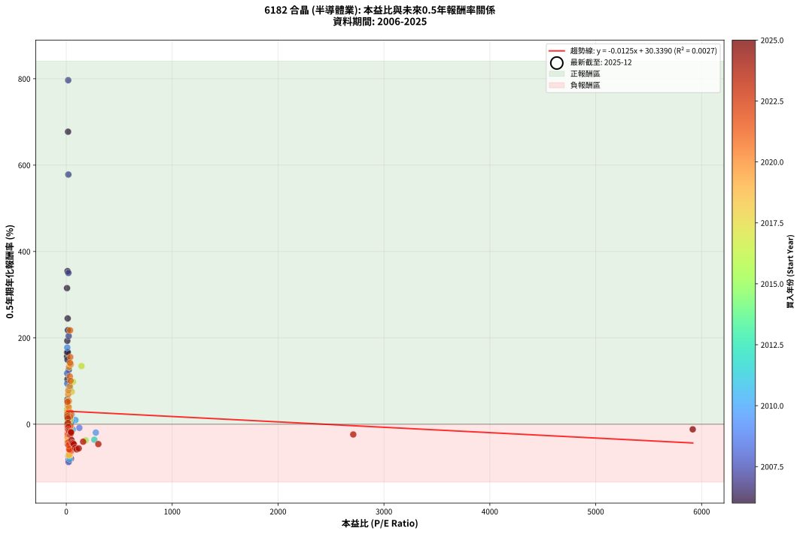
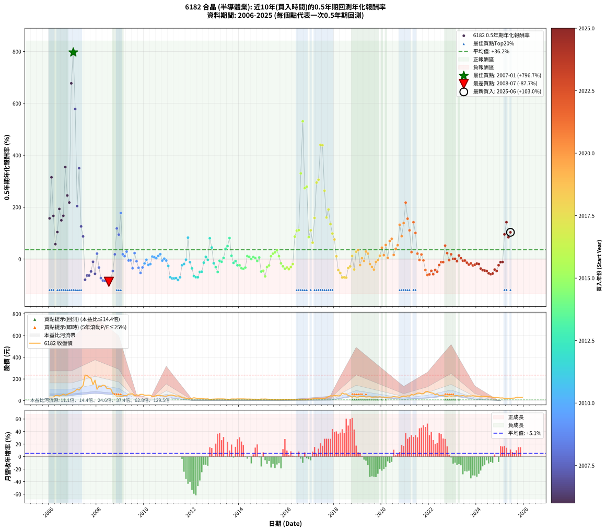

# 6182 合晶 - 本益比與未來報酬率分析

!!! info "報告資訊"
    - **股票代號**: 6182
    - **公司名稱**: 合晶
    - **產業別**: 半導體業
    - **分析期間**: 2006-2025 (234 個數據點)
    - **資料來源**: Type 12 (ShowMonthlyK_ChartFlow) 月收盤價與本益比
    - **報酬率口徑**: 含現金股利 (簡化: 年度合計，假設每年7/1入帳)
    - **報告生成時間**: 2026-01-07 19:07:41 CST

## 📈 視覺化圖表

### 圖表1: 本益比 vs 未來報酬率關係

*圖表1：6182 合晶 本益比與0.5年期未來報酬率關係 (2006-2025)*

### 圖表2: 歷年買入時點的0.5年期實際報酬率

*圖表2：6182 合晶 歷年買入時點的0.5年期實際報酬率 (2006-2025)*

## 📍 買點訊號說明

本報告提供兩種買點提示訊號（顯示於圖表2的股價子圖中）：

### ▲ 小綠色三角形（回測驗證）
- **計算方式**: 使用全部歷史資料計算本益比第25百分位數
- **用途**: 事後驗證，顯示歷史上哪些時點確實為低估區
- **限制**: 當下無法判斷，僅供回測參考
- **特性**: 後見之明（Look-Ahead Bias）

### ▲ 小橘色三角形（即時訊號）
- **計算方式**: 使用截至當月的過去5年資料計算本益比第25百分位數
- **用途**: 實際投資決策，當時即可判斷
- **優勢**: 可操作性強，符合實務需求
- **特性**: 無後見之明，滾動窗口計算

!!! tip "如何使用兩種訊號"
    - **綠色▲** 幫助理解歷史估值機會，驗證策略有效性
    - **橘色▲** 可作為實際買進參考，但仍需搭配基本面分析
    - 兩種訊號重疊時，表示即時判斷與事後驗證一致，信心度較高
    - 僅有綠色▲時，表示當時無法判斷（需要未來資料才能確認）
    - 僅有橘色▲時，表示即時判斷為買點，但事後可能不是最佳時機

## 📊 估值分析摘要

| 指標 | 數值 |
|:---:|:---:|
| **目前本益比** (2025-06) | **nan 倍** |
| **歷史平均本益比** | 90.61 倍 |
| **估值水準** | 🟡 合理範圍 |
| **預期0.5年年化報酬率** | **+nan%** |
| **歷史平均報酬率** | +36.19% |
| **相關係數 (R²)** | 0.0027 |
| **趨勢線斜率** | -0.0125 |

!!! abstract "核心洞察"
    目前本益比接近歷史平均，預期報酬率符合長期趨勢

    根據歷史數據回測，6182 合晶 在目前本益比 **nan倍** 的估值水準下，
    預期未來0.5年年化報酬率約為 **+nan%**。

    **重要提醒**: 本分析基於歷史數據統計，實際報酬率會受到公司基本面變化、產業趨勢、
    總體經濟環境等多重因素影響。R² = 0.00 表示本益比可解釋約 0.3% 的報酬率變異。

## 📈 歷史估值統計

### 最佳買點 (最高報酬率)

| 項目 | 數值 |
|:---:|:---:|
| 起始時間 | 2007-01 |
| 當時本益比 | 17.90 倍 |
| 起始價格 | 80.5 元 |
| 0.5年後價格 | 236.0 元 |
| **0.5年年化報酬率** | **+796.68%** |

### 最差買點 (最低報酬率)

| 項目 | 數值 |
|:---:|:---:|
| 起始時間 | 2008-07 |
| 當時本益比 | 21.66 倍 |
| 起始價格 | 112.5 元 |
| 0.5年後價格 | 39.2 元 |
| **0.5年年化報酬率** | **-87.67%** |

## 🎯 投資啟示

### 本益比與報酬率關係

趨勢線方程式: **y = -0.0125x + 30.3390**

!!! note "負相關"
    本益比與未來報酬率呈現負相關。較低的本益比通常帶來較高的未來報酬率，
    但相關性不算非常強。**估值仍是重要參考指標之一**。

### 估值區間建議

基於歷史數據分析:

- **🟢 低估區** (P/E < 72.5): 預期報酬率較高，可考慮增加持股
- **🟡 合理區** (P/E 72.5-108.7): 預期報酬率符合長期趨勢，正常持有
- **🔴 高估區** (P/E > 108.7): 預期報酬率較低，可考慮減碼或觀望

!!! danger "風險提示"
    - 過去表現不代表未來結果
    - 本分析假設公司基本面無重大結構性變化
    - 產業環境劇變可能使歷史規律失效
    - 應結合公司財報、產業趨勢、總體經濟等多重因素綜合判斷

!!! success "長期投資觀點"
    歷史數據顯示，在合理或低估的估值水準買入並長期持有，
    往往能獲得較佳的投資報酬。**耐心等待好價格**是價值投資的核心原則。

## 📊 數據品質

- **資料來源**: GoodInfo.tw Type 12 (ShowMonthlyK_ChartFlow)
- **資料頻率**: 月度收盤價與本益比
- **回測期間**: 2006-2025
- **數據點數量**: 234 個 (每個點代表一次0.5年期回測)

### 計算方法說明

1. **0.5年期年化報酬率**:
   - 對每個歷史時點，計算其後0.5年的實際投資報酬率
   - 期末價值(不含股利): 期末價格
   - 期末價值(含現金股利): 期末價格 + 持有期間內的現金股利合計 (簡化: 年度合計，假設每年7/1入帳)
   - 公式: 年化報酬率 = [(期末價值/期初價格)^(1/年數) - 1] × 100%

2. **本益比 (P/E Ratio)**:
   - 使用當時的月收盤價與EPS計算
   - 資料來源: Type 12 月度河流圖本益比數據

3. **趨勢線 (Linear Regression)**:
   - 使用最小平方法擬合線性趨勢線
   - R²值衡量本益比對報酬率的解釋能力

---

*本報告由 Stock Analysis System v1.9.0 自動生成*
*數據更新時間: 2026-01-07 19:07:41 CST*

## 📋 月度回測明細表

（每一列對應時間線圖中的一個買入點；可用來對照 SVG 圖上的每個點。）

| 買入月份 | 賣出月份 | 回測期限_年 | 實際持有年數 | 買入本益比_倍 | 買入收盤價_元 | 賣出收盤價_元 | 現金股利合計_元 | 總報酬率_pct | 年化報酬率_pct |
| --- | --- | --- | --- | --- | --- | --- | --- | --- | --- |
| 2006-01 | 2006-07 | 0.5 | 0.496 | 7.39 | 32.20 | 50.80 | 0.59 | +59.60 | +156.86 |
| 2006-02 | 2006-08 | 0.5 | 0.498 | 6.96 | 30.35 | 61.10 | 0.59 | +103.26 | +315.17 |
| 2006-03 | 2006-10 | 0.5 | 0.586 | 7.57 | 33.00 | 58.00 | 0.59 | +77.55 | +166.39 |
| 2006-04 | 2006-10 | 0.5 | 0.501 | 10.71 | 46.70 | 58.00 | 0.59 | +25.46 | +57.26 |
| 2006-05 | 2006-12 | 0.5 | 0.586 | 11.06 | 48.20 | 72.60 | 0.59 | +51.85 | +103.99 |
| 2006-06 | 2006-12 | 0.5 | 0.501 | 9.79 | 42.70 | 72.60 | 0.59 | +71.41 | +193.15 |
| 2006-07 | 2007-01 | 0.5 | 0.504 | 11.65 | 50.80 | 80.50 | 0.00 | +58.46 | +149.39 |
| 2006-08 | 2007-03 | 0.5 | 0.580 | 14.01 | 61.10 | 108.00 | 0.00 | +76.76 | +166.81 |
| 2006-09 | 2007-03 | 0.5 | 0.496 | 11.70 | 51.00 | 108.00 | 0.00 | +111.76 | +354.53 |
| 2006-10 | 2007-05 | 0.5 | 0.580 | 13.30 | 58.00 | 119.00 | 0.00 | +105.17 | +244.94 |
| 2006-11 | 2007-05 | 0.5 | 0.496 | 15.39 | 67.10 | 119.00 | 0.00 | +77.35 | +217.77 |
| 2006-12 | 2007-07 | 0.5 | 0.580 | 16.65 | 72.60 | 236.00 | 2.71 | +228.81 | +677.36 |
| 2007-01 | 2007-07 | 0.5 | 0.496 | 17.90 | 80.50 | 236.00 | 2.71 | +196.54 | +796.68 |
| 2007-02 | 2007-08 | 0.5 | 0.498 | 19.64 | 91.00 | 233.50 | 2.71 | +159.57 | +578.22 |
| 2007-03 | 2007-10 | 0.5 | 0.586 | 22.64 | 108.00 | 204.50 | 2.71 | +91.86 | +204.09 |
| 2007-04 | 2007-10 | 0.5 | 0.501 | 19.87 | 97.50 | 204.50 | 2.71 | +112.53 | +350.28 |
| 2007-05 | 2007-12 | 0.5 | 0.586 | 23.60 | 119.00 | 189.00 | 2.71 | +61.10 | +125.67 |
| 2007-06 | 2007-12 | 0.5 | 0.501 | 27.03 | 140.00 | 189.00 | 2.71 | +36.94 | +87.28 |
| 2007-07 | 2008-01 | 0.5 | 0.504 | 44.40 | 236.00 | 105.50 | 0.00 | -55.30 | -79.77 |
| 2007-08 | 2008-03 | 0.5 | 0.583 | 42.83 | 233.50 | 129.50 | 0.00 | -44.54 | -63.61 |
| 2007-09 | 2008-03 | 0.5 | 0.498 | 38.47 | 215.00 | 129.50 | 0.00 | -39.77 | -63.85 |
| 2007-10 | 2008-05 | 0.5 | 0.583 | 35.72 | 204.50 | 140.00 | 0.00 | -31.54 | -47.78 |
| 2007-11 | 2008-05 | 0.5 | 0.498 | 25.25 | 148.00 | 140.00 | 0.00 | -5.41 | -10.55 |
| 2007-12 | 2008-07 | 0.5 | 0.583 | 31.51 | 189.00 | 112.50 | 3.41 | -38.67 | -56.76 |
| 2008-01 | 2008-07 | 0.5 | 0.498 | 17.93 | 105.50 | 112.50 | 3.41 | +9.87 | +20.79 |
| 2008-02 | 2008-08 | 0.5 | 0.501 | 23.32 | 134.50 | 107.00 | 3.41 | -17.91 | -32.56 |
| 2008-03 | 2008-10 | 0.5 | 0.586 | 22.91 | 129.50 | 56.00 | 3.41 | -54.12 | -73.55 |
| 2008-04 | 2008-10 | 0.5 | 0.501 | 26.00 | 144.00 | 56.00 | 3.41 | -58.74 | -82.92 |
| 2008-05 | 2008-12 | 0.5 | 0.586 | 25.81 | 140.00 | 44.20 | 3.41 | -65.99 | -84.13 |
| 2008-06 | 2008-12 | 0.5 | 0.501 | 21.38 | 113.50 | 44.20 | 3.41 | -58.05 | -82.34 |
| 2008-07 | 2009-01 | 0.5 | 0.504 | 21.66 | 112.50 | 39.20 | 0.00 | -65.16 | -87.67 |
| 2008-08 | 2009-03 | 0.5 | 0.580 | 21.07 | 107.00 | 48.80 | 0.00 | -54.39 | -74.14 |
| 2008-09 | 2009-03 | 0.5 | 0.496 | 13.36 | 66.30 | 48.80 | 0.00 | -26.40 | -46.12 |
| 2008-10 | 2009-05 | 0.5 | 0.580 | 11.55 | 56.00 | 61.70 | 0.00 | +10.18 | +18.18 |
| 2008-11 | 2009-05 | 0.5 | 0.496 | 8.86 | 41.95 | 61.70 | 0.00 | +47.08 | +117.83 |
| 2008-12 | 2009-07 | 0.5 | 0.580 | 9.57 | 44.20 | 63.60 | 1.40 | +47.06 | +94.34 |
| 2009-01 | 2009-07 | 0.5 | 0.496 | 9.43 | 39.20 | 63.60 | 1.40 | +65.82 | +177.46 |
| 2009-02 | 2009-08 | 0.5 | 0.498 | 11.71 | 43.20 | 45.60 | 1.40 | +8.80 | +18.43 |
| 2009-03 | 2009-10 | 0.5 | 0.586 | 15.13 | 48.80 | 50.50 | 1.40 | +6.35 | +11.08 |
| 2009-04 | 2009-10 | 0.5 | 0.501 | 16.58 | 45.75 | 50.50 | 1.40 | +13.44 | +28.63 |
| 2009-05 | 2009-12 | 0.5 | 0.586 | 26.88 | 61.70 | 58.30 | 1.40 | -3.24 | -5.47 |
| 2009-06 | 2009-12 | 0.5 | 0.501 | 33.50 | 61.30 | 58.30 | 1.40 | -2.61 | -5.14 |
| 2009-07 | 2010-01 | 0.5 | 0.504 | 46.59 | 63.60 | 51.00 | 0.00 | -19.81 | -35.49 |
| 2009-08 | 2010-03 | 0.5 | 0.580 | 50.67 | 45.60 | 51.40 | 0.00 | +12.72 | +22.91 |
| 2009-09 | 2010-03 | 0.5 | 0.496 | 123.40 | 53.70 | 51.40 | 0.00 | -4.28 | -8.45 |
| 2009-10 | 2010-05 | 0.5 | 0.580 |  | 50.50 | 39.80 | 0.00 | -21.19 | -33.65 |
| 2009-11 | 2010-05 | 0.5 | 0.496 |  | 58.00 | 39.80 | 0.00 | -31.38 | -53.23 |
| 2009-12 | 2010-07 | 0.5 | 0.580 |  | 58.30 | 46.50 | 0.00 | -20.24 | -32.27 |
| 2010-01 | 2010-07 | 0.5 | 0.496 |  | 51.00 | 46.50 | 0.00 | -8.82 | -17.01 |
| 2010-02 | 2010-08 | 0.5 | 0.498 |  | 49.25 | 48.60 | 0.00 | -1.32 | -2.63 |
| 2010-03 | 2010-10 | 0.5 | 0.586 |  | 51.40 | 44.25 | 0.00 | -13.91 | -22.56 |
| 2010-04 | 2010-10 | 0.5 | 0.501 | 279.10 | 49.30 | 44.25 | 0.00 | -10.24 | -19.40 |
| 2010-05 | 2010-12 | 0.5 | 0.586 | 86.37 | 39.80 | 42.00 | 0.00 | +5.53 | +9.62 |
| 2010-06 | 2010-12 | 0.5 | 0.501 | 54.50 | 40.60 | 42.00 | 0.00 | +3.45 | +7.00 |
| 2010-07 | 2011-01 | 0.5 | 0.504 | 45.18 | 46.50 | 47.25 | 0.00 | +1.61 | +3.23 |
| 2010-08 | 2011-03 | 0.5 | 0.580 | 37.01 | 48.60 | 51.90 | 0.00 | +6.79 | +11.98 |
| 2010-09 | 2011-03 | 0.5 | 0.496 | 29.83 | 47.65 | 51.90 | 0.00 | +8.92 | +18.82 |
| 2010-10 | 2011-05 | 0.5 | 0.580 | 23.52 | 44.25 | 42.70 | 0.00 | -3.50 | -5.96 |
| 2010-11 | 2011-05 | 0.5 | 0.496 | 19.58 | 42.40 | 42.70 | 0.00 | +0.71 | +1.43 |
| 2010-12 | 2011-07 | 0.5 | 0.580 | 17.14 | 42.00 | 39.60 | 1.00 | -3.33 | -5.67 |
| 2011-01 | 2011-07 | 0.5 | 0.496 | 20.81 | 47.25 | 39.60 | 1.00 | -14.07 | -26.37 |
| 2011-02 | 2011-08 | 0.5 | 0.498 | 24.76 | 51.80 | 27.40 | 1.00 | -45.17 | -70.06 |
| 2011-03 | 2011-10 | 0.5 | 0.586 | 27.14 | 51.90 | 22.30 | 1.00 | -55.11 | -74.51 |
| 2011-04 | 2011-10 | 0.5 | 0.501 | 26.65 | 46.20 | 22.30 | 1.00 | -49.57 | -74.49 |
| 2011-05 | 2011-12 | 0.5 | 0.586 | 27.47 | 42.70 | 18.55 | 1.00 | -54.22 | -73.64 |
| 2011-06 | 2011-12 | 0.5 | 0.501 | 32.40 | 44.55 | 18.55 | 1.00 | -56.12 | -80.68 |
| 2011-07 | 2012-01 | 0.5 | 0.504 | 33.11 | 39.60 | 21.50 | 0.00 | -45.71 | -70.25 |
| 2011-08 | 2012-03 | 0.5 | 0.583 | 26.95 | 27.40 | 23.40 | 0.00 | -14.60 | -23.71 |
| 2011-09 | 2012-03 | 0.5 | 0.498 | 31.04 | 26.00 | 23.40 | 0.00 | -10.00 | -19.06 |
| 2011-10 | 2012-05 | 0.5 | 0.583 | 33.87 | 22.30 | 22.00 | 0.00 | -1.35 | -2.30 |
| 2011-11 | 2012-05 | 0.5 | 0.498 | 34.02 | 16.30 | 22.00 | 0.00 | +34.97 | +82.54 |
| 2011-12 | 2012-07 | 0.5 | 0.583 | 61.83 | 18.55 | 17.20 | 0.02 | -7.17 | -11.98 |
| 2012-01 | 2012-07 | 0.5 | 0.498 | 265.00 | 21.50 | 17.20 | 0.02 | -19.91 | -35.95 |
| 2012-02 | 2012-08 | 0.5 | 0.501 |  | 27.00 | 15.80 | 0.02 | -41.41 | -65.59 |
| 2012-03 | 2012-10 | 0.5 | 0.586 |  | 23.40 | 11.55 | 0.02 | -50.56 | -69.94 |
| 2012-04 | 2012-10 | 0.5 | 0.501 |  | 21.20 | 11.55 | 0.02 | -45.42 | -70.14 |
| 2012-05 | 2012-12 | 0.5 | 0.586 |  | 22.00 | 14.70 | 0.02 | -33.09 | -49.63 |
| 2012-06 | 2012-12 | 0.5 | 0.501 |  | 20.55 | 14.70 | 0.02 | -28.37 | -48.62 |
| 2012-07 | 2013-01 | 0.5 | 0.504 |  | 17.20 | 15.95 | 0.00 | -7.27 | -13.91 |
| 2012-08 | 2013-03 | 0.5 | 0.580 |  | 15.80 | 16.55 | 0.00 | +4.75 | +8.32 |
| 2012-09 | 2013-03 | 0.5 | 0.496 |  | 16.80 | 16.55 | 0.00 | -1.49 | -2.98 |
| 2012-10 | 2013-05 | 0.5 | 0.580 |  | 11.55 | 16.25 | 0.00 | +40.69 | +80.07 |
| 2012-11 | 2013-05 | 0.5 | 0.496 |  | 13.55 | 16.25 | 0.00 | +19.93 | +44.29 |
| 2012-12 | 2013-07 | 0.5 | 0.580 |  | 14.70 | 13.25 | 0.00 | -9.86 | -16.38 |
| 2013-01 | 2013-07 | 0.5 | 0.496 |  | 15.95 | 13.25 | 0.00 | -16.93 | -31.22 |
| 2013-02 | 2013-08 | 0.5 | 0.498 |  | 16.65 | 11.80 | 0.00 | -29.13 | -49.89 |
| 2013-03 | 2013-10 | 0.5 | 0.586 |  | 16.55 | 15.90 | 0.00 | -3.93 | -6.61 |
| 2013-04 | 2013-10 | 0.5 | 0.501 |  | 16.80 | 15.90 | 0.00 | -5.36 | -10.41 |
| 2013-05 | 2013-12 | 0.5 | 0.586 |  | 16.25 | 16.65 | 0.00 | +2.46 | +4.24 |
| 2013-06 | 2013-12 | 0.5 | 0.501 |  | 14.10 | 16.65 | 0.00 | +18.09 | +39.35 |
| 2013-07 | 2014-01 | 0.5 | 0.504 |  | 13.25 | 16.25 | 0.00 | +22.64 | +49.95 |
| 2013-08 | 2014-03 | 0.5 | 0.580 |  | 11.80 | 16.65 | 0.00 | +41.10 | +80.98 |
| 2013-09 | 2014-03 | 0.5 | 0.496 |  | 15.70 | 16.65 | 0.00 | +6.05 | +12.59 |
| 2013-10 | 2014-05 | 0.5 | 0.580 |  | 15.90 | 14.50 | 0.00 | -8.81 | -14.68 |
| 2013-11 | 2014-05 | 0.5 | 0.496 |  | 15.10 | 14.50 | 0.00 | -3.97 | -7.86 |
| 2013-12 | 2014-07 | 0.5 | 0.580 |  | 16.65 | 14.20 | 0.00 | -14.71 | -23.98 |
| 2014-01 | 2014-07 | 0.5 | 0.496 |  | 16.25 | 14.20 | 0.00 | -12.62 | -23.82 |
| 2014-02 | 2014-08 | 0.5 | 0.498 |  | 16.40 | 13.20 | 0.00 | -19.51 | -35.31 |
| 2014-03 | 2014-10 | 0.5 | 0.586 |  | 16.65 | 12.60 | 0.00 | -24.32 | -37.86 |
| 2014-04 | 2014-10 | 0.5 | 0.501 |  | 15.40 | 12.60 | 0.00 | -18.18 | -33.00 |
| 2014-05 | 2014-12 | 0.5 | 0.586 |  | 14.50 | 15.45 | 0.00 | +6.55 | +11.44 |
| 2014-06 | 2014-12 | 0.5 | 0.501 |  | 14.85 | 15.45 | 0.00 | +4.04 | +8.23 |
| 2014-07 | 2015-01 | 0.5 | 0.504 |  | 14.20 | 14.20 | 0.00 | +0.00 | +0.00 |
| 2014-08 | 2015-03 | 0.5 | 0.580 |  | 13.20 | 13.80 | 0.00 | +4.55 | +7.96 |
| 2014-09 | 2015-03 | 0.5 | 0.496 |  | 13.55 | 13.80 | 0.00 | +1.85 | +3.76 |
| 2014-10 | 2015-05 | 0.5 | 0.580 |  | 12.60 | 12.05 | 0.00 | -4.37 | -7.40 |
| 2014-11 | 2015-05 | 0.5 | 0.496 |  | 11.70 | 12.05 | 0.00 | +2.99 | +6.13 |
| 2014-12 | 2015-07 | 0.5 | 0.580 |  | 15.45 | 10.55 | 0.00 | -31.72 | -48.17 |
| 2015-01 | 2015-07 | 0.5 | 0.496 |  | 14.20 | 10.55 | 0.00 | -25.70 | -45.10 |
| 2015-02 | 2015-08 | 0.5 | 0.498 |  | 15.80 | 9.15 | 0.00 | -42.09 | -66.59 |
| 2015-03 | 2015-10 | 0.5 | 0.586 |  | 13.80 | 11.10 | 0.00 | -19.57 | -31.04 |
| 2015-04 | 2015-10 | 0.5 | 0.501 |  | 12.80 | 11.10 | 0.00 | -13.28 | -24.75 |
| 2015-05 | 2015-12 | 0.5 | 0.586 |  | 12.05 | 12.80 | 0.00 | +6.22 | +10.86 |
| 2015-06 | 2015-12 | 0.5 | 0.501 |  | 11.65 | 12.80 | 0.00 | +9.87 | +20.67 |
| 2015-07 | 2016-01 | 0.5 | 0.504 |  | 10.55 | 11.85 | 0.00 | +12.32 | +25.94 |
| 2015-08 | 2016-03 | 0.5 | 0.583 |  | 9.15 | 10.85 | 0.00 | +18.58 | +33.94 |
| 2015-09 | 2016-03 | 0.5 | 0.498 |  | 10.30 | 10.85 | 0.00 | +5.34 | +11.00 |
| 2015-10 | 2016-05 | 0.5 | 0.583 |  | 11.10 | 9.99 | 0.00 | -10.00 | -16.53 |
| 2015-11 | 2016-05 | 0.5 | 0.498 |  | 11.75 | 9.99 | 0.00 | -14.98 | -27.79 |
| 2015-12 | 2016-07 | 0.5 | 0.583 | 182.90 | 12.80 | 9.74 | 0.00 | -23.91 | -37.41 |
| 2016-01 | 2016-07 | 0.5 | 0.498 |  | 11.85 | 9.74 | 0.00 | -17.81 | -32.53 |
| 2016-02 | 2016-08 | 0.5 | 0.501 |  | 11.85 | 9.24 | 0.00 | -22.03 | -39.14 |
| 2016-03 | 2016-10 | 0.5 | 0.586 |  | 10.85 | 8.73 | 0.00 | -19.54 | -31.00 |
| 2016-04 | 2016-10 | 0.5 | 0.501 |  | 9.72 | 8.73 | 0.00 | -10.19 | -19.30 |
| 2016-05 | 2016-12 | 0.5 | 0.586 |  | 9.99 | 14.40 | 0.00 | +44.14 | +86.65 |
| 2016-06 | 2016-12 | 0.5 | 0.501 |  | 9.94 | 14.40 | 0.00 | +44.87 | +109.55 |
| 2016-07 | 2017-01 | 0.5 | 0.504 |  | 9.74 | 14.20 | 0.00 | +45.79 | +111.35 |
| 2016-08 | 2017-03 | 0.5 | 0.580 |  | 9.24 | 21.55 | 0.00 | +133.23 | +330.16 |
| 2016-09 | 2017-03 | 0.5 | 0.496 |  | 8.65 | 21.55 | 0.00 | +149.13 | +530.93 |
| 2016-10 | 2017-05 | 0.5 | 0.580 |  | 8.73 | 18.75 | 0.00 | +114.78 | +273.23 |
| 2016-11 | 2017-05 | 0.5 | 0.496 |  | 9.69 | 18.75 | 0.00 | +93.50 | +278.88 |
| 2016-12 | 2017-07 | 0.5 | 0.580 |  | 14.40 | 20.55 | 0.00 | +42.71 | +84.54 |
| 2017-01 | 2017-07 | 0.5 | 0.496 |  | 14.20 | 20.55 | 0.00 | +44.72 | +110.83 |
| 2017-02 | 2017-08 | 0.5 | 0.498 |  | 16.30 | 20.80 | 0.00 | +27.61 | +63.11 |
| 2017-03 | 2017-10 | 0.5 | 0.586 |  | 21.55 | 37.60 | 0.00 | +74.48 | +158.58 |
| 2017-04 | 2017-10 | 0.5 | 0.501 |  | 18.90 | 37.60 | 0.00 | +98.94 | +294.66 |
| 2017-05 | 2017-12 | 0.5 | 0.586 |  | 18.75 | 42.60 | 0.00 | +127.20 | +305.80 |
| 2017-06 | 2017-12 | 0.5 | 0.501 |  | 18.30 | 42.60 | 0.00 | +132.79 | +440.02 |
| 2017-07 | 2018-01 | 0.5 | 0.504 |  | 20.55 | 48.00 | 0.00 | +133.58 | +438.71 |
| 2017-08 | 2018-03 | 0.5 | 0.580 |  | 20.80 | 44.00 | 0.00 | +111.54 | +263.58 |
| 2017-09 | 2018-03 | 0.5 | 0.496 |  | 27.40 | 44.00 | 0.00 | +60.58 | +160.07 |
| 2017-10 | 2018-05 | 0.5 | 0.580 |  | 37.60 | 69.90 | 0.00 | +85.90 | +191.04 |
| 2017-11 | 2018-05 | 0.5 | 0.496 | 143.90 | 45.80 | 69.90 | 0.00 | +52.62 | +134.70 |
| 2017-12 | 2018-07 | 0.5 | 0.580 | 63.58 | 42.60 | 63.00 | 0.38 | +48.77 | +98.25 |
| 2018-01 | 2018-07 | 0.5 | 0.496 | 51.57 | 48.00 | 63.00 | 0.38 | +32.03 | +75.20 |
| 2018-02 | 2018-08 | 0.5 | 0.498 | 38.01 | 45.30 | 47.25 | 0.38 | +5.13 | +10.57 |
| 2018-03 | 2018-10 | 0.5 | 0.586 | 30.29 | 44.00 | 31.40 | 0.38 | -27.78 | -42.62 |
| 2018-04 | 2018-10 | 0.5 | 0.501 | 27.32 | 46.80 | 31.40 | 0.38 | -32.10 | -53.83 |
| 2018-05 | 2018-12 | 0.5 | 0.586 | 35.41 | 69.90 | 33.50 | 0.38 | -51.54 | -70.95 |
| 2018-06 | 2018-12 | 0.5 | 0.501 | 27.87 | 62.30 | 33.50 | 0.38 | -45.62 | -70.36 |
| 2018-07 | 2019-01 | 0.5 | 0.504 | 25.24 | 63.00 | 33.40 | 0.00 | -46.98 | -71.63 |
| 2018-08 | 2019-03 | 0.5 | 0.580 | 17.14 | 47.25 | 36.90 | 0.00 | -21.90 | -34.69 |
| 2018-09 | 2019-03 | 0.5 | 0.496 | 14.42 | 43.50 | 36.90 | 0.00 | -15.17 | -28.26 |
| 2018-10 | 2019-05 | 0.5 | 0.580 | 9.58 | 31.40 | 33.50 | 0.00 | +6.69 | +11.80 |
| 2018-11 | 2019-05 | 0.5 | 0.496 | 12.21 | 43.20 | 33.50 | 0.00 | -22.45 | -40.14 |
| 2018-12 | 2019-07 | 0.5 | 0.580 | 8.82 | 33.50 | 36.20 | 2.50 | +15.52 | +28.22 |
| 2019-01 | 2019-07 | 0.5 | 0.496 | 9.07 | 33.40 | 36.20 | 2.50 | +15.87 | +34.61 |
| 2019-02 | 2019-08 | 0.5 | 0.498 | 11.07 | 39.50 | 32.10 | 2.50 | -12.41 | -23.34 |
| 2019-03 | 2019-10 | 0.5 | 0.586 | 10.69 | 36.90 | 35.05 | 2.50 | +1.76 | +3.03 |
| 2019-04 | 2019-10 | 0.5 | 0.501 | 11.70 | 39.05 | 35.05 | 2.50 | -3.84 | -7.52 |
| 2019-05 | 2019-12 | 0.5 | 0.586 | 10.40 | 33.50 | 36.35 | 2.50 | +15.97 | +28.77 |
| 2019-06 | 2019-12 | 0.5 | 0.501 | 11.38 | 35.35 | 36.35 | 2.50 | +9.90 | +20.74 |
| 2019-07 | 2020-01 | 0.5 | 0.504 | 12.11 | 36.20 | 32.50 | 0.00 | -10.22 | -19.27 |
| 2019-08 | 2020-03 | 0.5 | 0.583 | 11.17 | 32.10 | 25.95 | 0.00 | -19.16 | -30.56 |
| 2019-09 | 2020-03 | 0.5 | 0.498 | 12.20 | 33.65 | 25.95 | 0.00 | -22.88 | -40.64 |
| 2019-10 | 2020-05 | 0.5 | 0.583 | 13.27 | 35.05 | 32.75 | 0.00 | -6.56 | -10.99 |
| 2019-11 | 2020-05 | 0.5 | 0.498 | 13.24 | 33.45 | 32.75 | 0.00 | -2.09 | -4.16 |
| 2019-12 | 2020-07 | 0.5 | 0.583 | 15.08 | 36.35 | 37.15 | 1.80 | +7.15 | +12.58 |
| 2020-01 | 2020-07 | 0.5 | 0.498 | 14.17 | 32.50 | 37.15 | 1.80 | +19.85 | +43.81 |
| 2020-02 | 2020-08 | 0.5 | 0.501 | 15.68 | 34.15 | 34.80 | 1.80 | +7.17 | +14.83 |
| 2020-03 | 2020-10 | 0.5 | 0.586 | 12.58 | 25.95 | 31.65 | 1.80 | +28.90 | +54.24 |
| 2020-04 | 2020-10 | 0.5 | 0.501 | 16.80 | 32.70 | 31.65 | 1.80 | +2.29 | +4.63 |
| 2020-05 | 2020-12 | 0.5 | 0.586 | 17.89 | 32.75 | 42.80 | 1.80 | +36.18 | +69.40 |
| 2020-06 | 2020-12 | 0.5 | 0.501 | 19.48 | 33.40 | 42.80 | 1.80 | +33.53 | +78.10 |
| 2020-07 | 2021-01 | 0.5 | 0.504 | 23.23 | 37.15 | 40.00 | 0.00 | +7.67 | +15.80 |
| 2020-08 | 2021-03 | 0.5 | 0.580 | 23.46 | 34.80 | 42.20 | 0.00 | +21.26 | +39.40 |
| 2020-09 | 2021-03 | 0.5 | 0.496 | 24.97 | 34.15 | 42.20 | 0.00 | +23.57 | +53.28 |
| 2020-10 | 2021-05 | 0.5 | 0.580 | 25.29 | 31.65 | 51.60 | 0.00 | +63.03 | +132.13 |
| 2020-11 | 2021-05 | 0.5 | 0.496 | 33.24 | 37.75 | 51.60 | 0.00 | +36.69 | +87.89 |
| 2020-12 | 2021-07 | 0.5 | 0.580 | 41.96 | 42.80 | 69.80 | 1.10 | +65.65 | +138.59 |
| 2021-01 | 2021-07 | 0.5 | 0.496 | 36.25 | 40.00 | 69.80 | 1.10 | +77.25 | +217.42 |
| 2021-02 | 2021-08 | 0.5 | 0.498 | 37.75 | 44.80 | 70.40 | 1.10 | +59.60 | +155.54 |
| 2021-03 | 2021-10 | 0.5 | 0.586 | 33.23 | 42.20 | 64.20 | 1.10 | +54.74 | +110.67 |
| 2021-04 | 2021-10 | 0.5 | 0.501 | 42.86 | 58.00 | 64.20 | 1.10 | +12.59 | +26.69 |
| 2021-05 | 2021-12 | 0.5 | 0.586 | 35.92 | 51.60 | 85.50 | 1.10 | +67.83 | +141.99 |
| 2021-06 | 2021-12 | 0.5 | 0.501 | 40.20 | 61.10 | 85.50 | 1.10 | +41.73 | +100.60 |
| 2021-07 | 2022-01 | 0.5 | 0.504 | 43.53 | 69.80 | 76.80 | 0.00 | +10.03 | +20.89 |
| 2021-08 | 2022-03 | 0.5 | 0.580 | 41.74 | 70.40 | 68.90 | 0.00 | -2.13 | -3.64 |
| 2021-09 | 2022-03 | 0.5 | 0.496 | 35.93 | 63.60 | 68.90 | 0.00 | +8.33 | +17.53 |
| 2021-10 | 2022-05 | 0.5 | 0.580 | 34.64 | 64.20 | 62.30 | 0.00 | -2.96 | -5.04 |
| 2021-11 | 2022-05 | 0.5 | 0.496 | 42.24 | 81.80 | 62.30 | 0.00 | -23.84 | -42.28 |
| 2021-12 | 2022-07 | 0.5 | 0.580 | 42.33 | 85.50 | 47.75 | 1.35 | -42.57 | -61.54 |
| 2022-01 | 2022-07 | 0.5 | 0.496 | 35.15 | 76.80 | 47.75 | 1.35 | -36.07 | -59.45 |
| 2022-02 | 2022-08 | 0.5 | 0.498 | 30.81 | 72.40 | 52.20 | 1.35 | -26.04 | -45.41 |
| 2022-03 | 2022-10 | 0.5 | 0.586 | 27.40 | 68.90 | 39.90 | 1.35 | -40.13 | -58.34 |
| 2022-04 | 2022-10 | 0.5 | 0.501 | 20.26 | 54.30 | 39.90 | 1.35 | -24.03 | -42.23 |
| 2022-05 | 2022-12 | 0.5 | 0.586 | 21.90 | 62.30 | 40.80 | 1.35 | -32.34 | -48.67 |
| 2022-06 | 2022-12 | 0.5 | 0.501 | 15.96 | 48.05 | 40.80 | 1.35 | -12.28 | -23.01 |
| 2022-07 | 2023-01 | 0.5 | 0.504 | 15.04 | 47.75 | 44.85 | 0.00 | -6.07 | -11.70 |
| 2022-08 | 2023-03 | 0.5 | 0.580 | 15.63 | 52.20 | 48.50 | 0.00 | -7.09 | -11.90 |
| 2022-09 | 2023-03 | 0.5 | 0.496 | 11.26 | 39.45 | 48.50 | 0.00 | +22.94 | +51.71 |
| 2022-10 | 2023-05 | 0.5 | 0.580 | 10.87 | 39.90 | 44.95 | 0.00 | +12.66 | +22.79 |
| 2022-11 | 2023-05 | 0.5 | 0.496 | 11.98 | 45.95 | 44.95 | 0.00 | -2.18 | -4.34 |
| 2022-12 | 2023-07 | 0.5 | 0.580 | 10.20 | 40.80 | 42.50 | 2.50 | +10.28 | +18.37 |
| 2023-01 | 2023-07 | 0.5 | 0.496 | 11.95 | 44.85 | 42.50 | 2.50 | +0.33 | +0.66 |
| 2023-02 | 2023-08 | 0.5 | 0.498 | 12.80 | 44.90 | 42.60 | 2.50 | +0.44 | +0.88 |
| 2023-03 | 2023-10 | 0.5 | 0.586 | 14.87 | 48.50 | 43.60 | 2.50 | -4.96 | -8.31 |
| 2023-04 | 2023-10 | 0.5 | 0.501 | 14.32 | 43.20 | 43.60 | 2.50 | +6.70 | +13.83 |
| 2023-05 | 2023-12 | 0.5 | 0.586 | 16.22 | 44.95 | 43.30 | 2.50 | +1.88 | +3.23 |
| 2023-06 | 2023-12 | 0.5 | 0.501 | 18.73 | 47.30 | 43.30 | 2.50 | -3.18 | -6.25 |
| 2023-07 | 2024-01 | 0.5 | 0.504 | 18.65 | 42.50 | 41.25 | 0.00 | -2.94 | -5.75 |
| 2023-08 | 2024-03 | 0.5 | 0.583 | 20.95 | 42.60 | 39.00 | 0.00 | -8.45 | -14.05 |
| 2023-09 | 2024-03 | 0.5 | 0.498 | 24.62 | 44.00 | 39.00 | 0.00 | -11.36 | -21.50 |
| 2023-10 | 2024-05 | 0.5 | 0.583 | 28.28 | 43.60 | 39.10 | 0.00 | -10.32 | -17.04 |
| 2023-11 | 2024-05 | 0.5 | 0.498 | 34.73 | 45.00 | 39.10 | 0.00 | -13.11 | -24.58 |
| 2023-12 | 2024-07 | 0.5 | 0.583 | 41.24 | 43.30 | 36.80 | 0.65 | -13.51 | -22.03 |
| 2024-01 | 2024-07 | 0.5 | 0.498 | 42.82 | 41.25 | 36.80 | 0.65 | -9.21 | -17.63 |
| 2024-02 | 2024-08 | 0.5 | 0.501 | 45.40 | 39.80 | 35.15 | 0.65 | -10.05 | -19.06 |
| 2024-03 | 2024-10 | 0.5 | 0.586 | 49.37 | 39.00 | 29.15 | 0.65 | -23.59 | -36.82 |
| 2024-04 | 2024-10 | 0.5 | 0.501 | 56.16 | 39.50 | 29.15 | 0.65 | -24.56 | -43.02 |
| 2024-05 | 2024-12 | 0.5 | 0.586 | 63.41 | 39.10 | 27.10 | 0.65 | -29.03 | -44.30 |
| 2024-06 | 2024-12 | 0.5 | 0.501 | 71.42 | 37.85 | 27.10 | 0.65 | -26.68 | -46.18 |
| 2024-07 | 2025-01 | 0.5 | 0.504 | 83.01 | 36.80 | 24.65 | 0.00 | -33.02 | -54.86 |
| 2024-08 | 2025-03 | 0.5 | 0.580 | 98.55 | 35.15 | 21.15 | 0.00 | -39.83 | -58.32 |
| 2024-09 | 2025-03 | 0.5 | 0.496 | 117.60 | 31.75 | 21.15 | 0.00 | -33.39 | -55.95 |
| 2024-10 | 2025-05 | 0.5 | 0.580 | 159.00 | 29.15 | 21.55 | 0.00 | -26.07 | -40.57 |
| 2024-11 | 2025-05 | 0.5 | 0.496 | 302.60 | 29.25 | 21.55 | 0.00 | -26.32 | -46.02 |
| 2024-12 | 2025-07 | 0.5 | 0.580 | 2710.00 | 27.10 | 23.15 | 0.00 | -14.58 | -23.77 |
| 2025-01 | 2025-07 | 0.5 | 0.496 | 5916.00 | 24.65 | 23.15 | 0.00 | -6.09 | -11.90 |
| 2025-02 | 2025-08 | 0.5 | 0.498 |  | 25.55 | 24.05 | 0.00 | -5.87 | -11.43 |
| 2025-03 | 2025-10 | 0.5 | 0.586 |  | 21.15 | 31.30 | 0.00 | +47.99 | +95.23 |
| 2025-04 | 2025-10 | 0.5 | 0.501 |  | 20.10 | 31.30 | 0.00 | +55.72 | +142.05 |
| 2025-05 | 2025-12 | 0.5 | 0.586 |  | 21.55 | 30.80 | 0.00 | +42.92 | +83.96 |
| 2025-06 | 2025-12 | 0.5 | 0.501 |  | 21.60 | 30.80 | 0.00 | +42.59 | +103.03 |
