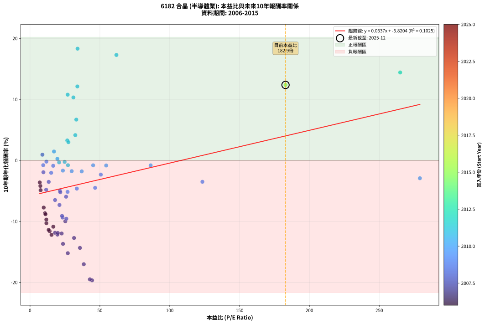
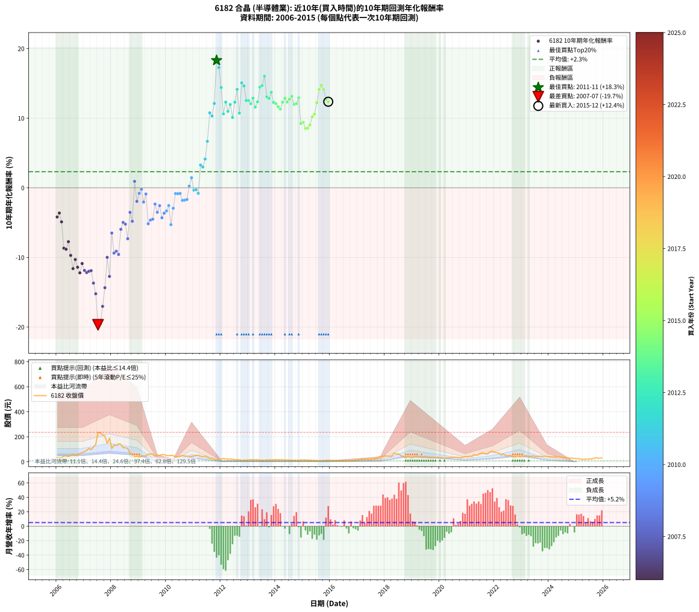

# 6182 合晶 - 本益比與未來報酬率分析

!!! info "報告資訊"
    - **股票代號**: 6182
    - **公司名稱**: 合晶
    - **產業別**: 半導體業
    - **分析期間**: 2006-2015 (120 個數據點)
    - **資料來源**: Type 12 (ShowMonthlyK_ChartFlow) 月收盤價與本益比
    - **報酬率口徑**: 含現金股利 (簡化: 年度合計，假設每年7/1入帳)
    - **報告生成時間**: 2026-01-05 01:07:16 CST

## 📈 視覺化圖表

### 圖表1: 本益比 vs 未來報酬率關係

*圖表1：6182 合晶 本益比與10年期未來報酬率關係 (2006-2015)*

### 圖表2: 歷年買入時點的10年期實際報酬率

*圖表2：6182 合晶 歷年買入時點的10年期實際報酬率 (2006-2015)*

## 📍 買點訊號說明

本報告提供兩種買點提示訊號（顯示於圖表2的股價子圖中）：

### ▲ 小綠色三角形（回測驗證）
- **計算方式**: 使用全部歷史資料計算本益比第25百分位數
- **用途**: 事後驗證，顯示歷史上哪些時點確實為低估區
- **限制**: 當下無法判斷，僅供回測參考
- **特性**: 後見之明（Look-Ahead Bias）

### ▲ 小橘色三角形（即時訊號）
- **計算方式**: 使用截至當月的過去5年資料計算本益比第25百分位數
- **用途**: 實際投資決策，當時即可判斷
- **優勢**: 可操作性強，符合實務需求
- **特性**: 無後見之明，滾動窗口計算

!!! tip "如何使用兩種訊號"
    - **綠色▲** 幫助理解歷史估值機會，驗證策略有效性
    - **橘色▲** 可作為實際買進參考，但仍需搭配基本面分析
    - 兩種訊號重疊時，表示即時判斷與事後驗證一致，信心度較高
    - 僅有綠色▲時，表示當時無法判斷（需要未來資料才能確認）
    - 僅有橘色▲時，表示即時判斷為買點，但事後可能不是最佳時機

## 📊 估值分析摘要

| 指標 | 數值 |
|:---:|:---:|
| **目前本益比** (2015-12) | **182.90 倍** |
| **歷史平均本益比** | 36.21 倍 |
| **估值水準** | 🔴 相對高估 |
| **預期10年年化報酬率** | **+4.00%** |
| **歷史平均報酬率** | +2.31% |
| **相關係數 (R²)** | 0.1025 |
| **趨勢線斜率** | 0.0537 |

!!! abstract "核心洞察"
    目前本益比顯著高於歷史平均，預期未來報酬率可能較低

    根據歷史數據回測，6182 合晶 在目前本益比 **182.9倍** 的估值水準下，
    預期未來10年年化報酬率約為 **+4.0%**。

    **重要提醒**: 本分析基於歷史數據統計，實際報酬率會受到公司基本面變化、產業趨勢、
    總體經濟環境等多重因素影響。R² = 0.10 表示本益比可解釋約 10.2% 的報酬率變異。

## 📈 歷史估值統計

### 最佳買點 (最高報酬率)

| 項目 | 數值 |
|:---:|:---:|
| 起始時間 | 2011-11 |
| 當時本益比 | 34.02 倍 |
| 起始價格 | 16.3 元 |
| 10年後價格 | 81.8 元 |
| **10年年化報酬率** | **+18.31%** |

### 最差買點 (最低報酬率)

| 項目 | 數值 |
|:---:|:---:|
| 起始時間 | 2007-07 |
| 當時本益比 | 44.40 倍 |
| 起始價格 | 236.0 元 |
| 10年後價格 | 20.6 元 |
| **10年年化報酬率** | **-19.68%** |

## 🎯 投資啟示

### 本益比與報酬率關係

趨勢線方程式: **y = 0.0537x + -5.8204**

!!! info "弱相關或正相關"
    本益比與未來報酬率相關性較弱。這可能表示該股票的報酬率更多受到
    公司成長性、產業趨勢等因素影響，而非估值水準。**需綜合考量多項指標**。

### 估值區間建議

基於歷史數據分析:

- **🟢 低估區** (P/E < 29.0): 預期報酬率較高，可考慮增加持股
- **🟡 合理區** (P/E 29.0-43.5): 預期報酬率符合長期趨勢，正常持有
- **🔴 高估區** (P/E > 43.5): 預期報酬率較低，可考慮減碼或觀望

!!! danger "風險提示"
    - 過去表現不代表未來結果
    - 本分析假設公司基本面無重大結構性變化
    - 產業環境劇變可能使歷史規律失效
    - 應結合公司財報、產業趨勢、總體經濟等多重因素綜合判斷

!!! success "長期投資觀點"
    歷史數據顯示，在合理或低估的估值水準買入並長期持有，
    往往能獲得較佳的投資報酬。**耐心等待好價格**是價值投資的核心原則。

## 📊 數據品質

- **資料來源**: GoodInfo.tw Type 12 (ShowMonthlyK_ChartFlow)
- **資料頻率**: 月度收盤價與本益比
- **回測期間**: 2006-2015
- **數據點數量**: 120 個 (每個點代表一次10年期回測)

### 計算方法說明

1. **10年期年化報酬率**:
   - 對每個歷史時點，計算其後10年的實際投資報酬率
   - 期末價值(不含股利): 期末價格
   - 期末價值(含現金股利): 期末價格 + 持有期間內的現金股利合計 (簡化: 年度合計，假設每年7/1入帳)
   - 公式: 年化報酬率 = [(期末價值/期初價格)^(1/年數) - 1] × 100%

2. **本益比 (P/E Ratio)**:
   - 使用當時的月收盤價與EPS計算
   - 資料來源: Type 12 月度河流圖本益比數據

3. **趨勢線 (Linear Regression)**:
   - 使用最小平方法擬合線性趨勢線
   - R²值衡量本益比對報酬率的解釋能力

---

*本報告由 Stock Analysis System v1.9.0 自動生成*
*數據更新時間: 2026-01-05 01:07:16 CST*

## 📋 月度回測明細表

（每一列對應時間線圖中的一個買入點；可用來對照 SVG 圖上的每個點。）

| 買入月份 | 賣出月份 | 回測期限_年 | 實際持有年數 | 買入本益比_倍 | 買入收盤價_元 | 賣出收盤價_元 | 現金股利合計_元 | 總報酬率_pct | 年化報酬率_pct |
| --- | --- | --- | --- | --- | --- | --- | --- | --- | --- |
| 2006-01 | 2016-01 | 10 | 9.999 | 7.39 | 32.20 | 11.85 | 9.13 | -34.84 | -4.19 |
| 2006-02 | 2016-02 | 10 | 9.999 | 6.96 | 30.35 | 11.85 | 9.13 | -30.86 | -3.62 |
| 2006-03 | 2016-03 | 10 | 10.001 | 7.57 | 33.00 | 10.85 | 9.13 | -39.45 | -4.89 |
| 2006-04 | 2016-04 | 10 | 10.001 | 10.71 | 46.70 | 9.72 | 9.13 | -59.63 | -8.67 |
| 2006-05 | 2016-05 | 10 | 10.001 | 11.06 | 48.20 | 9.99 | 9.13 | -60.33 | -8.83 |
| 2006-06 | 2016-06 | 10 | 10.001 | 9.79 | 42.70 | 9.94 | 9.13 | -55.33 | -7.74 |
| 2006-07 | 2016-07 | 10 | 10.001 | 11.65 | 50.80 | 9.74 | 8.54 | -64.01 | -9.71 |
| 2006-08 | 2016-08 | 10 | 10.001 | 14.01 | 61.10 | 9.24 | 8.54 | -70.90 | -11.61 |
| 2006-09 | 2016-09 | 10 | 10.001 | 11.70 | 51.00 | 8.65 | 8.54 | -66.29 | -10.30 |
| 2006-10 | 2016-10 | 10 | 10.001 | 13.30 | 58.00 | 8.73 | 8.54 | -70.22 | -11.41 |
| 2006-11 | 2016-11 | 10 | 10.001 | 15.39 | 67.10 | 9.69 | 8.54 | -72.83 | -12.21 |
| 2006-12 | 2016-12 | 10 | 10.001 | 16.65 | 72.60 | 14.40 | 8.54 | -68.40 | -10.88 |
| 2007-01 | 2017-01 | 10 | 10.001 | 17.90 | 80.50 | 14.20 | 8.54 | -71.75 | -11.87 |
| 2007-02 | 2017-02 | 10 | 10.001 | 19.64 | 91.00 | 16.30 | 8.54 | -72.70 | -12.17 |
| 2007-03 | 2017-03 | 10 | 10.001 | 22.64 | 108.00 | 21.55 | 8.54 | -72.14 | -11.99 |
| 2007-04 | 2017-04 | 10 | 10.001 | 19.87 | 97.50 | 18.90 | 8.54 | -71.85 | -11.91 |
| 2007-05 | 2017-05 | 10 | 10.001 | 23.60 | 119.00 | 18.75 | 8.54 | -77.06 | -13.69 |
| 2007-06 | 2017-06 | 10 | 10.001 | 27.03 | 140.00 | 18.30 | 8.54 | -80.83 | -15.22 |
| 2007-07 | 2017-07 | 10 | 10.001 | 44.40 | 236.00 | 20.55 | 5.83 | -88.82 | -19.68 |
| 2007-08 | 2017-08 | 10 | 10.001 | 42.83 | 233.50 | 20.80 | 5.83 | -88.60 | -19.51 |
| 2007-09 | 2017-09 | 10 | 10.001 | 38.47 | 215.00 | 27.40 | 5.83 | -84.54 | -17.03 |
| 2007-10 | 2017-10 | 10 | 10.001 | 35.72 | 204.50 | 37.60 | 5.83 | -78.76 | -14.35 |
| 2007-11 | 2017-11 | 10 | 10.001 | 25.25 | 148.00 | 45.80 | 5.83 | -65.11 | -9.99 |
| 2007-12 | 2017-12 | 10 | 10.001 | 31.51 | 189.00 | 42.60 | 5.83 | -74.38 | -12.73 |
| 2008-01 | 2018-01 | 10 | 10.001 | 17.93 | 105.50 | 48.00 | 5.83 | -48.98 | -6.51 |
| 2008-02 | 2018-03 | 10 | 10.081 | 23.32 | 134.50 | 44.00 | 5.83 | -62.95 | -9.38 |
| 2008-03 | 2018-03 | 10 | 9.999 | 22.91 | 129.50 | 44.00 | 5.83 | -61.52 | -9.11 |
| 2008-04 | 2018-04 | 10 | 9.999 | 26.00 | 144.00 | 46.80 | 5.83 | -63.45 | -9.58 |
| 2008-05 | 2018-05 | 10 | 9.999 | 25.81 | 140.00 | 69.90 | 5.83 | -45.91 | -5.96 |
| 2008-06 | 2018-06 | 10 | 9.999 | 21.38 | 113.50 | 62.30 | 5.83 | -39.97 | -4.98 |
| 2008-07 | 2018-07 | 10 | 9.999 | 21.66 | 112.50 | 63.00 | 2.80 | -41.51 | -5.22 |
| 2008-08 | 2018-08 | 10 | 9.999 | 21.07 | 107.00 | 47.25 | 2.80 | -53.23 | -7.32 |
| 2008-09 | 2018-09 | 10 | 9.999 | 13.36 | 66.30 | 43.50 | 2.80 | -30.17 | -3.53 |
| 2008-10 | 2018-10 | 10 | 9.999 | 11.55 | 56.00 | 31.40 | 2.80 | -38.94 | -4.81 |
| 2008-11 | 2018-11 | 10 | 9.999 | 8.86 | 41.95 | 43.20 | 2.80 | +9.64 | +0.93 |
| 2008-12 | 2018-12 | 10 | 9.999 | 9.57 | 44.20 | 33.50 | 2.80 | -17.88 | -1.95 |
| 2009-01 | 2019-01 | 10 | 9.999 | 9.43 | 39.20 | 33.40 | 2.80 | -7.66 | -0.79 |
| 2009-02 | 2019-02 | 10 | 9.999 | 11.71 | 43.20 | 39.50 | 2.80 | -2.09 | -0.21 |
| 2009-03 | 2019-03 | 10 | 9.999 | 15.13 | 48.80 | 36.90 | 2.80 | -18.66 | -2.04 |
| 2009-04 | 2019-04 | 10 | 9.999 | 16.58 | 45.75 | 39.05 | 2.80 | -8.53 | -0.89 |
| 2009-05 | 2019-05 | 10 | 9.999 | 26.88 | 61.70 | 33.50 | 2.80 | -41.17 | -5.17 |
| 2009-06 | 2019-06 | 10 | 9.999 | 33.50 | 61.30 | 35.35 | 2.80 | -37.77 | -4.63 |
| 2009-07 | 2019-07 | 10 | 9.999 | 46.59 | 63.60 | 36.20 | 3.90 | -36.96 | -4.51 |
| 2009-08 | 2019-08 | 10 | 9.999 | 50.67 | 45.60 | 32.10 | 3.90 | -21.06 | -2.34 |
| 2009-09 | 2019-09 | 10 | 9.999 | 123.40 | 53.70 | 33.65 | 3.90 | -30.08 | -3.52 |
| 2009-10 | 2019-10 | 10 | 9.999 |  | 50.50 | 35.05 | 3.90 | -22.88 | -2.56 |
| 2009-11 | 2019-11 | 10 | 9.999 |  | 58.00 | 33.45 | 3.90 | -35.61 | -4.31 |
| 2009-12 | 2019-12 | 10 | 9.999 |  | 58.30 | 36.35 | 3.90 | -30.97 | -3.64 |
| 2010-01 | 2020-01 | 10 | 9.999 |  | 51.00 | 32.50 | 3.90 | -28.64 | -3.32 |
| 2010-02 | 2020-02 | 10 | 9.999 |  | 49.25 | 34.15 | 3.90 | -22.75 | -2.55 |
| 2010-03 | 2020-03 | 10 | 10.001 |  | 51.40 | 25.95 | 3.90 | -41.93 | -5.29 |
| 2010-04 | 2020-04 | 10 | 10.001 | 279.10 | 49.30 | 32.70 | 3.90 | -25.77 | -2.94 |
| 2010-05 | 2020-05 | 10 | 10.001 | 86.37 | 39.80 | 32.75 | 3.90 | -7.92 | -0.82 |
| 2010-06 | 2020-06 | 10 | 10.001 | 54.50 | 40.60 | 33.40 | 3.90 | -8.14 | -0.85 |
| 2010-07 | 2020-07 | 10 | 10.001 | 45.18 | 46.50 | 37.15 | 5.70 | -7.86 | -0.81 |
| 2010-08 | 2020-08 | 10 | 10.001 | 37.01 | 48.60 | 34.80 | 5.70 | -16.67 | -1.81 |
| 2010-09 | 2020-09 | 10 | 10.001 | 29.83 | 47.65 | 34.15 | 5.70 | -16.38 | -1.77 |
| 2010-10 | 2020-10 | 10 | 10.001 | 23.52 | 44.25 | 31.65 | 5.70 | -15.60 | -1.68 |
| 2010-11 | 2020-11 | 10 | 10.001 | 19.58 | 42.40 | 37.75 | 5.70 | +2.47 | +0.24 |
| 2010-12 | 2020-12 | 10 | 10.001 | 17.14 | 42.00 | 42.80 | 5.70 | +15.47 | +1.45 |
| 2011-01 | 2021-01 | 10 | 10.001 | 20.81 | 47.25 | 40.00 | 5.70 | -3.29 | -0.33 |
| 2011-02 | 2021-02 | 10 | 10.001 | 24.76 | 51.80 | 44.80 | 5.70 | -2.52 | -0.25 |
| 2011-03 | 2021-03 | 10 | 10.001 | 27.14 | 51.90 | 42.20 | 5.70 | -7.71 | -0.80 |
| 2011-04 | 2021-04 | 10 | 10.001 | 26.65 | 46.20 | 58.00 | 5.70 | +37.87 | +3.26 |
| 2011-05 | 2021-05 | 10 | 10.001 | 27.47 | 42.70 | 51.60 | 5.70 | +34.18 | +2.98 |
| 2011-06 | 2021-06 | 10 | 10.001 | 32.40 | 44.55 | 61.10 | 5.70 | +49.93 | +4.13 |
| 2011-07 | 2021-07 | 10 | 10.001 | 33.11 | 39.60 | 69.80 | 5.80 | +90.90 | +6.68 |
| 2011-08 | 2021-08 | 10 | 10.001 | 26.95 | 27.40 | 70.40 | 5.80 | +178.09 | +10.77 |
| 2011-09 | 2021-09 | 10 | 10.001 | 31.04 | 26.00 | 63.60 | 5.80 | +166.91 | +10.31 |
| 2011-10 | 2021-10 | 10 | 10.001 | 33.87 | 22.30 | 64.20 | 5.80 | +213.88 | +12.12 |
| 2011-11 | 2021-11 | 10 | 10.001 | 34.02 | 16.30 | 81.80 | 5.80 | +437.40 | +18.31 |
| 2011-12 | 2021-12 | 10 | 10.001 | 61.83 | 18.55 | 85.50 | 5.80 | +392.16 | +17.27 |
| 2012-01 | 2022-01 | 10 | 10.001 | 265.00 | 21.50 | 76.80 | 5.80 | +284.17 | +14.40 |
| 2012-02 | 2022-03 | 10 | 10.081 |  | 27.00 | 68.90 | 5.80 | +176.65 | +10.62 |
| 2012-03 | 2022-03 | 10 | 9.999 |  | 23.40 | 68.90 | 5.80 | +219.21 | +12.31 |
| 2012-04 | 2022-04 | 10 | 9.999 |  | 21.20 | 54.30 | 5.80 | +183.47 | +10.98 |
| 2012-05 | 2022-05 | 10 | 9.999 |  | 22.00 | 62.30 | 5.80 | +209.53 | +11.96 |
| 2012-06 | 2022-06 | 10 | 9.999 |  | 20.55 | 48.05 | 5.80 | +162.02 | +10.11 |
| 2012-07 | 2022-07 | 10 | 9.999 |  | 17.20 | 47.75 | 7.13 | +219.05 | +12.30 |
| 2012-08 | 2022-08 | 10 | 9.999 |  | 15.80 | 52.20 | 7.13 | +275.48 | +14.15 |
| 2012-09 | 2022-09 | 10 | 9.999 |  | 16.80 | 39.45 | 7.13 | +177.24 | +10.74 |
| 2012-10 | 2022-10 | 10 | 9.999 |  | 11.55 | 39.90 | 7.13 | +307.15 | +15.08 |
| 2012-11 | 2022-11 | 10 | 9.999 |  | 13.55 | 45.95 | 7.13 | +291.70 | +14.63 |
| 2012-12 | 2022-12 | 10 | 9.999 |  | 14.70 | 40.80 | 7.13 | +226.03 | +12.55 |
| 2013-01 | 2023-01 | 10 | 9.999 |  | 15.95 | 44.85 | 7.13 | +225.87 | +12.54 |
| 2013-02 | 2023-02 | 10 | 9.999 |  | 16.65 | 44.90 | 7.13 | +212.47 | +12.07 |
| 2013-03 | 2023-03 | 10 | 9.999 |  | 16.55 | 48.50 | 7.13 | +236.11 | +12.89 |
| 2013-04 | 2023-04 | 10 | 9.999 |  | 16.80 | 43.20 | 7.13 | +199.56 | +11.60 |
| 2013-05 | 2023-05 | 10 | 9.999 |  | 16.25 | 44.95 | 7.13 | +220.47 | +12.35 |
| 2013-06 | 2023-06 | 10 | 9.999 |  | 14.10 | 47.30 | 7.13 | +286.00 | +14.46 |
| 2013-07 | 2023-07 | 10 | 9.999 |  | 13.25 | 42.50 | 9.62 | +293.37 | +14.68 |
| 2013-08 | 2023-08 | 10 | 9.999 |  | 11.80 | 42.60 | 9.62 | +342.56 | +16.04 |
| 2013-09 | 2023-09 | 10 | 9.999 |  | 15.70 | 44.00 | 9.62 | +241.54 | +13.07 |
| 2013-10 | 2023-10 | 10 | 9.999 |  | 15.90 | 43.60 | 9.62 | +234.73 | +12.84 |
| 2013-11 | 2023-11 | 10 | 9.999 |  | 15.10 | 45.00 | 9.62 | +261.74 | +13.72 |
| 2013-12 | 2023-12 | 10 | 9.999 |  | 16.65 | 43.30 | 9.62 | +217.85 | +12.26 |
| 2014-01 | 2024-01 | 10 | 9.999 |  | 16.25 | 41.25 | 9.62 | +213.06 | +12.09 |
| 2014-02 | 2024-02 | 10 | 9.999 |  | 16.40 | 39.80 | 9.62 | +201.35 | +11.66 |
| 2014-03 | 2024-03 | 10 | 10.001 |  | 16.65 | 39.00 | 9.62 | +192.02 | +11.31 |
| 2014-04 | 2024-04 | 10 | 10.001 |  | 15.40 | 39.50 | 9.62 | +218.97 | +12.30 |
| 2014-05 | 2024-05 | 10 | 10.001 |  | 14.50 | 39.10 | 9.62 | +236.01 | +12.88 |
| 2014-06 | 2024-06 | 10 | 10.001 |  | 14.85 | 37.85 | 9.62 | +219.68 | +12.32 |
| 2014-07 | 2024-07 | 10 | 10.001 |  | 14.20 | 36.80 | 10.27 | +231.49 | +12.73 |
| 2014-08 | 2024-08 | 10 | 10.001 |  | 13.20 | 35.15 | 10.27 | +244.11 | +13.15 |
| 2014-09 | 2024-09 | 10 | 10.001 |  | 13.55 | 31.75 | 10.27 | +210.13 | +11.98 |
| 2014-10 | 2024-10 | 10 | 10.001 |  | 12.60 | 29.15 | 10.27 | +212.87 | +12.08 |
| 2014-11 | 2024-11 | 10 | 10.001 |  | 11.70 | 29.25 | 10.27 | +237.79 | +12.94 |
| 2014-12 | 2024-12 | 10 | 10.001 |  | 15.45 | 27.10 | 10.27 | +141.89 | +9.23 |
| 2015-01 | 2025-01 | 10 | 10.001 |  | 14.20 | 24.65 | 10.27 | +145.93 | +9.41 |
| 2015-02 | 2025-02 | 10 | 10.001 |  | 15.80 | 25.55 | 10.27 | +126.72 | +8.53 |
| 2015-03 | 2025-03 | 10 | 10.001 |  | 13.80 | 21.15 | 10.27 | +127.70 | +8.58 |
| 2015-04 | 2025-04 | 10 | 10.001 |  | 12.80 | 20.10 | 10.27 | +137.28 | +9.02 |
| 2015-05 | 2025-05 | 10 | 10.001 |  | 12.05 | 21.55 | 10.27 | +164.08 | +10.20 |
| 2015-06 | 2025-06 | 10 | 10.001 |  | 11.65 | 21.60 | 10.27 | +173.58 | +10.59 |
| 2015-07 | 2025-07 | 10 | 10.001 |  | 10.55 | 23.15 | 10.27 | +216.80 | +12.22 |
| 2015-08 | 2025-08 | 10 | 10.001 |  | 9.15 | 24.05 | 10.27 | +275.10 | +14.13 |
| 2015-09 | 2025-09 | 10 | 10.001 |  | 10.30 | 30.45 | 10.27 | +295.36 | +14.73 |
| 2015-10 | 2025-10 | 10 | 10.001 |  | 11.10 | 31.30 | 10.27 | +274.52 | +14.11 |
| 2015-11 | 2025-11 | 10 | 10.001 |  | 11.75 | 28.65 | 10.27 | +231.25 | +12.72 |
| 2015-12 | 2025-12 | 10 | 10.001 | 182.90 | 12.80 | 30.80 | 10.27 | +220.88 | +12.36 |
