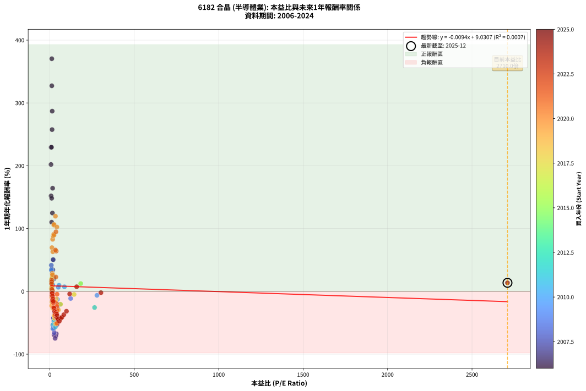
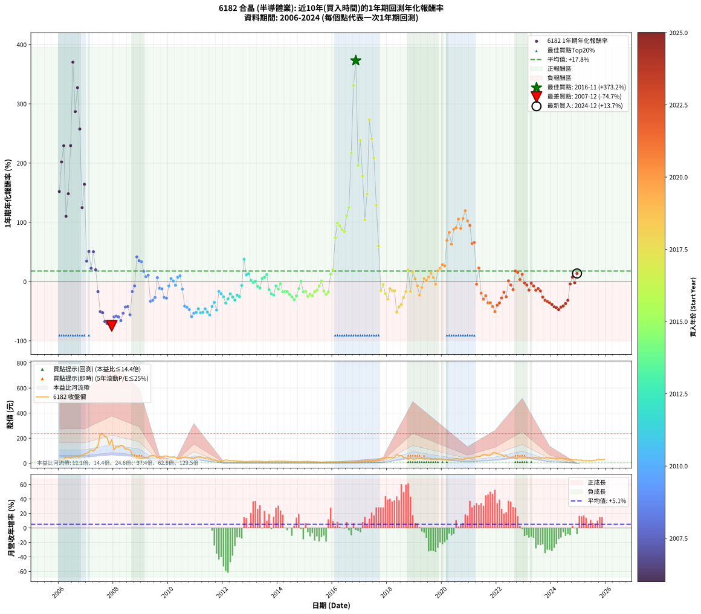

# 6182 合晶 - 本益比與未來報酬率分析

!!! info "報告資訊"
    - **股票代號**: 6182
    - **公司名稱**: 合晶
    - **產業別**: 半導體業
    - **分析期間**: 2006-2024 (228 個數據點)
    - **資料來源**: Type 12 (ShowMonthlyK_ChartFlow) 月收盤價與本益比
    - **報酬率口徑**: 含現金股利 (簡化: 年度合計，假設每年7/1入帳)
    - **報告生成時間**: 2026-01-04 08:51:03 CST

## 📈 視覺化圖表

### 圖表1: 本益比 vs 未來報酬率關係

*圖表1：6182 合晶 本益比與1年期未來報酬率關係 (2006-2024)*

### 圖表2: 歷年買入時點的1年期實際報酬率

*圖表2：6182 合晶 歷年買入時點的1年期實際報酬率 (2006-2024)*

## 📍 買點訊號說明

本報告提供兩種買點提示訊號（顯示於圖表2的股價子圖中）：

### ▲ 小綠色三角形（回測驗證）
- **計算方式**: 使用全部歷史資料計算本益比第25百分位數
- **用途**: 事後驗證，顯示歷史上哪些時點確實為低估區
- **限制**: 當下無法判斷，僅供回測參考
- **特性**: 後見之明（Look-Ahead Bias）

### ▲ 小橘色三角形（即時訊號）
- **計算方式**: 使用截至當月的過去5年資料計算本益比第25百分位數
- **用途**: 實際投資決策，當時即可判斷
- **優勢**: 可操作性強，符合實務需求
- **特性**: 無後見之明，滾動窗口計算

!!! tip "如何使用兩種訊號"
    - **綠色▲** 幫助理解歷史估值機會，驗證策略有效性
    - **橘色▲** 可作為實際買進參考，但仍需搭配基本面分析
    - 兩種訊號重疊時，表示即時判斷與事後驗證一致，信心度較高
    - 僅有綠色▲時，表示當時無法判斷（需要未來資料才能確認）
    - 僅有橘色▲時，表示即時判斷為買點，但事後可能不是最佳時機

## 📊 估值分析摘要

| 指標 | 數值 |
|:---:|:---:|
| **目前本益比** (2024-12) | **2710.00 倍** |
| **歷史平均本益比** | 52.78 倍 |
| **估值水準** | 🔴 相對高估 |
| **預期1年年化報酬率** | **-16.35%** |
| **歷史平均報酬率** | +17.77% |
| **相關係數 (R²)** | 0.0007 |
| **趨勢線斜率** | -0.0094 |

!!! abstract "核心洞察"
    目前本益比顯著高於歷史平均，預期未來報酬率可能較低

    根據歷史數據回測，6182 合晶 在目前本益比 **2710.0倍** 的估值水準下，
    預期未來1年年化報酬率約為 **-16.3%**。

    **重要提醒**: 本分析基於歷史數據統計，實際報酬率會受到公司基本面變化、產業趨勢、
    總體經濟環境等多重因素影響。R² = 0.00 表示本益比可解釋約 0.1% 的報酬率變異。

## 📈 歷史估值統計

### 最佳買點 (最高報酬率)

| 項目 | 數值 |
|:---:|:---:|
| 起始時間 | 2016-11 |
| 當時本益比 | nan 倍 |
| 起始價格 | 9.7 元 |
| 1年後價格 | 45.8 元 |
| **1年年化報酬率** | **+373.16%** |

### 最差買點 (最低報酬率)

| 項目 | 數值 |
|:---:|:---:|
| 起始時間 | 2007-12 |
| 當時本益比 | 31.51 倍 |
| 起始價格 | 189.0 元 |
| 1年後價格 | 44.2 元 |
| **1年年化報酬率** | **-74.74%** |

## 🎯 投資啟示

### 本益比與報酬率關係

趨勢線方程式: **y = -0.0094x + 9.0307**

!!! note "負相關"
    本益比與未來報酬率呈現負相關。較低的本益比通常帶來較高的未來報酬率，
    但相關性不算非常強。**估值仍是重要參考指標之一**。

### 估值區間建議

基於歷史數據分析:

- **🟢 低估區** (P/E < 42.2): 預期報酬率較高，可考慮增加持股
- **🟡 合理區** (P/E 42.2-63.3): 預期報酬率符合長期趨勢，正常持有
- **🔴 高估區** (P/E > 63.3): 預期報酬率較低，可考慮減碼或觀望

!!! danger "風險提示"
    - 過去表現不代表未來結果
    - 本分析假設公司基本面無重大結構性變化
    - 產業環境劇變可能使歷史規律失效
    - 應結合公司財報、產業趨勢、總體經濟等多重因素綜合判斷

!!! success "長期投資觀點"
    歷史數據顯示，在合理或低估的估值水準買入並長期持有，
    往往能獲得較佳的投資報酬。**耐心等待好價格**是價值投資的核心原則。

## 📊 數據品質

- **資料來源**: GoodInfo.tw Type 12 (ShowMonthlyK_ChartFlow)
- **資料頻率**: 月度收盤價與本益比
- **回測期間**: 2006-2024
- **數據點數量**: 228 個 (每個點代表一次1年期回測)

### 計算方法說明

1. **1年期年化報酬率**:
   - 對每個歷史時點，計算其後1年的實際投資報酬率
   - 期末價值(不含股利): 期末價格
   - 期末價值(含現金股利): 期末價格 + 持有期間內的現金股利合計 (簡化: 年度合計，假設每年7/1入帳)
   - 公式: 年化報酬率 = [(期末價值/期初價格)^(1/年數) - 1] × 100%

2. **本益比 (P/E Ratio)**:
   - 使用當時的月收盤價與EPS計算
   - 資料來源: Type 12 月度河流圖本益比數據

3. **趨勢線 (Linear Regression)**:
   - 使用最小平方法擬合線性趨勢線
   - R²值衡量本益比對報酬率的解釋能力

---

*本報告由 Stock Analysis System v1.9.0 自動生成*
*數據更新時間: 2026-01-04 08:51:03 CST*

## 📋 月度回測明細表

（每一列對應時間線圖中的一個買入點；可用來對照 SVG 圖上的每個點。）

| 買入月份 | 賣出月份 | 回測期限_年 | 實際持有年數 | 買入本益比_倍 | 買入收盤價_元 | 賣出收盤價_元 | 現金股利合計_元 | 總報酬率_pct | 年化報酬率_pct |
| --- | --- | --- | --- | --- | --- | --- | --- | --- | --- |
| 2006-01 | 2007-01 | 1 | 0.999 | 7.39 | 32.20 | 80.50 | 0.59 | +151.83 | +151.99 |
| 2006-02 | 2007-02 | 1 | 0.999 | 6.96 | 30.35 | 91.00 | 0.59 | +201.78 | +202.01 |
| 2006-03 | 2007-03 | 1 | 0.999 | 7.57 | 33.00 | 108.00 | 0.59 | +229.06 | +229.33 |
| 2006-04 | 2007-04 | 1 | 0.999 | 10.71 | 46.70 | 97.50 | 0.59 | +110.04 | +110.15 |
| 2006-05 | 2007-05 | 1 | 0.999 | 11.06 | 48.20 | 119.00 | 0.59 | +148.11 | +148.27 |
| 2006-06 | 2007-06 | 1 | 0.999 | 9.79 | 42.70 | 140.00 | 0.59 | +229.25 | +229.52 |
| 2006-07 | 2007-07 | 1 | 0.999 | 11.65 | 50.80 | 236.00 | 2.71 | +369.91 | +370.41 |
| 2006-08 | 2007-08 | 1 | 0.999 | 14.01 | 61.10 | 233.50 | 2.71 | +286.60 | +286.96 |
| 2006-09 | 2007-09 | 1 | 0.999 | 11.70 | 51.00 | 215.00 | 2.71 | +326.89 | +327.31 |
| 2006-10 | 2007-10 | 1 | 0.999 | 13.30 | 58.00 | 204.50 | 2.71 | +257.26 | +257.58 |
| 2006-11 | 2007-11 | 1 | 0.999 | 15.39 | 67.10 | 148.00 | 2.71 | +124.61 | +124.73 |
| 2006-12 | 2007-12 | 1 | 0.999 | 16.65 | 72.60 | 189.00 | 2.71 | +164.07 | +164.24 |
| 2007-01 | 2008-01 | 1 | 0.999 | 17.90 | 80.50 | 105.50 | 2.71 | +34.43 | +34.45 |
| 2007-02 | 2008-02 | 1 | 0.999 | 19.64 | 91.00 | 134.50 | 2.71 | +50.78 | +50.83 |
| 2007-03 | 2008-03 | 1 | 1.002 | 22.64 | 108.00 | 129.50 | 2.71 | +22.42 | +22.37 |
| 2007-04 | 2008-04 | 1 | 1.002 | 19.87 | 97.50 | 144.00 | 2.71 | +50.47 | +50.35 |
| 2007-05 | 2008-05 | 1 | 1.002 | 23.60 | 119.00 | 140.00 | 2.71 | +19.93 | +19.88 |
| 2007-06 | 2008-06 | 1 | 1.002 | 27.03 | 140.00 | 113.50 | 2.71 | -16.99 | -16.96 |
| 2007-07 | 2008-07 | 1 | 1.002 | 44.40 | 236.00 | 112.50 | 3.41 | -50.89 | -50.81 |
| 2007-08 | 2008-08 | 1 | 1.002 | 42.83 | 233.50 | 107.00 | 3.41 | -52.72 | -52.64 |
| 2007-09 | 2008-09 | 1 | 1.002 | 38.47 | 215.00 | 66.30 | 3.41 | -67.58 | -67.50 |
| 2007-10 | 2008-10 | 1 | 1.002 | 35.72 | 204.50 | 56.00 | 3.41 | -70.95 | -70.87 |
| 2007-11 | 2008-11 | 1 | 1.002 | 25.25 | 148.00 | 41.95 | 3.41 | -69.35 | -69.28 |
| 2007-12 | 2008-12 | 1 | 1.002 | 31.51 | 189.00 | 44.20 | 3.41 | -74.81 | -74.74 |
| 2008-01 | 2009-01 | 1 | 1.002 | 17.93 | 105.50 | 39.20 | 3.41 | -59.61 | -59.54 |
| 2008-02 | 2009-03 | 1 | 1.081 | 23.32 | 134.50 | 48.80 | 3.41 | -61.18 | -58.31 |
| 2008-03 | 2009-03 | 1 | 0.999 | 22.91 | 129.50 | 48.80 | 3.41 | -59.68 | -59.71 |
| 2008-04 | 2009-04 | 1 | 0.999 | 26.00 | 144.00 | 45.75 | 3.41 | -65.86 | -65.89 |
| 2008-05 | 2009-05 | 1 | 0.999 | 25.81 | 140.00 | 61.70 | 3.41 | -53.49 | -53.52 |
| 2008-06 | 2009-06 | 1 | 0.999 | 21.38 | 113.50 | 61.30 | 3.41 | -42.99 | -43.01 |
| 2008-07 | 2009-07 | 1 | 0.999 | 21.66 | 112.50 | 63.60 | 1.40 | -42.22 | -42.24 |
| 2008-08 | 2009-08 | 1 | 0.999 | 21.07 | 107.00 | 45.60 | 1.40 | -56.07 | -56.10 |
| 2008-09 | 2009-09 | 1 | 0.999 | 13.36 | 66.30 | 53.70 | 1.40 | -16.89 | -16.90 |
| 2008-10 | 2009-10 | 1 | 0.999 | 11.55 | 56.00 | 50.50 | 1.40 | -7.32 | -7.33 |
| 2008-11 | 2009-11 | 1 | 0.999 | 8.86 | 41.95 | 58.00 | 1.40 | +41.60 | +41.63 |
| 2008-12 | 2009-12 | 1 | 0.999 | 9.57 | 44.20 | 58.30 | 1.40 | +35.07 | +35.10 |
| 2009-01 | 2010-01 | 1 | 0.999 | 9.43 | 39.20 | 51.00 | 1.40 | +33.67 | +33.70 |
| 2009-02 | 2010-02 | 1 | 0.999 | 11.71 | 43.20 | 49.25 | 1.40 | +17.25 | +17.26 |
| 2009-03 | 2010-03 | 1 | 0.999 | 15.13 | 48.80 | 51.40 | 1.40 | +8.20 | +8.20 |
| 2009-04 | 2010-04 | 1 | 0.999 | 16.58 | 45.75 | 49.30 | 1.40 | +10.82 | +10.83 |
| 2009-05 | 2010-05 | 1 | 0.999 | 26.88 | 61.70 | 39.80 | 1.40 | -33.23 | -33.24 |
| 2009-06 | 2010-06 | 1 | 0.999 | 33.50 | 61.30 | 40.60 | 1.40 | -31.48 | -31.50 |
| 2009-07 | 2010-07 | 1 | 0.999 | 46.59 | 63.60 | 46.50 | 0.00 | -26.89 | -26.90 |
| 2009-08 | 2010-08 | 1 | 0.999 | 50.67 | 45.60 | 48.60 | 0.00 | +6.58 | +6.58 |
| 2009-09 | 2010-09 | 1 | 0.999 | 123.40 | 53.70 | 47.65 | 0.00 | -11.27 | -11.27 |
| 2009-10 | 2010-10 | 1 | 0.999 |  | 50.50 | 44.25 | 0.00 | -12.38 | -12.38 |
| 2009-11 | 2010-11 | 1 | 0.999 |  | 58.00 | 42.40 | 0.00 | -26.90 | -26.91 |
| 2009-12 | 2010-12 | 1 | 0.999 |  | 58.30 | 42.00 | 0.00 | -27.96 | -27.98 |
| 2010-01 | 2011-01 | 1 | 0.999 |  | 51.00 | 47.25 | 0.00 | -7.35 | -7.36 |
| 2010-02 | 2011-02 | 1 | 0.999 |  | 49.25 | 51.80 | 0.00 | +5.18 | +5.18 |
| 2010-03 | 2011-03 | 1 | 0.999 |  | 51.40 | 51.90 | 0.00 | +0.97 | +0.97 |
| 2010-04 | 2011-04 | 1 | 0.999 | 279.10 | 49.30 | 46.20 | 0.00 | -6.29 | -6.29 |
| 2010-05 | 2011-05 | 1 | 0.999 | 86.37 | 39.80 | 42.70 | 0.00 | +7.29 | +7.29 |
| 2010-06 | 2011-06 | 1 | 0.999 | 54.50 | 40.60 | 44.55 | 0.00 | +9.73 | +9.74 |
| 2010-07 | 2011-07 | 1 | 0.999 | 45.18 | 46.50 | 39.60 | 1.00 | -12.69 | -12.70 |
| 2010-08 | 2011-08 | 1 | 0.999 | 37.01 | 48.60 | 27.40 | 1.00 | -41.56 | -41.59 |
| 2010-09 | 2011-09 | 1 | 0.999 | 29.83 | 47.65 | 26.00 | 1.00 | -43.34 | -43.36 |
| 2010-10 | 2011-10 | 1 | 0.999 | 23.52 | 44.25 | 22.30 | 1.00 | -47.34 | -47.37 |
| 2010-11 | 2011-11 | 1 | 0.999 | 19.58 | 42.40 | 16.30 | 1.00 | -59.20 | -59.22 |
| 2010-12 | 2011-12 | 1 | 0.999 | 17.14 | 42.00 | 18.55 | 1.00 | -53.45 | -53.48 |
| 2011-01 | 2012-01 | 1 | 0.999 | 20.81 | 47.25 | 21.50 | 1.00 | -52.38 | -52.41 |
| 2011-02 | 2012-02 | 1 | 0.999 | 24.76 | 51.80 | 27.00 | 1.00 | -45.95 | -45.97 |
| 2011-03 | 2012-03 | 1 | 1.002 | 27.14 | 51.90 | 23.40 | 1.00 | -52.99 | -52.91 |
| 2011-04 | 2012-04 | 1 | 1.002 | 26.65 | 46.20 | 21.20 | 1.00 | -51.95 | -51.88 |
| 2011-05 | 2012-05 | 1 | 1.002 | 27.47 | 42.70 | 22.00 | 1.00 | -46.14 | -46.07 |
| 2011-06 | 2012-06 | 1 | 1.002 | 32.40 | 44.55 | 20.55 | 1.00 | -51.63 | -51.56 |
| 2011-07 | 2012-07 | 1 | 1.002 | 33.11 | 39.60 | 17.20 | 0.02 | -56.52 | -56.44 |
| 2011-08 | 2012-08 | 1 | 1.002 | 26.95 | 27.40 | 15.80 | 0.02 | -42.26 | -42.20 |
| 2011-09 | 2012-09 | 1 | 1.002 | 31.04 | 26.00 | 16.80 | 0.02 | -35.31 | -35.25 |
| 2011-10 | 2012-10 | 1 | 1.002 | 33.87 | 22.30 | 11.55 | 0.02 | -48.12 | -48.05 |
| 2011-11 | 2012-11 | 1 | 1.002 | 34.02 | 16.30 | 13.55 | 0.02 | -16.75 | -16.72 |
| 2011-12 | 2012-12 | 1 | 1.002 | 61.83 | 18.55 | 14.70 | 0.02 | -20.65 | -20.61 |
| 2012-01 | 2013-01 | 1 | 1.002 | 265.00 | 21.50 | 15.95 | 0.02 | -25.72 | -25.68 |
| 2012-02 | 2013-03 | 1 | 1.081 |  | 27.00 | 16.55 | 0.02 | -38.63 | -36.33 |
| 2012-03 | 2013-03 | 1 | 0.999 |  | 23.40 | 16.55 | 0.02 | -29.19 | -29.20 |
| 2012-04 | 2013-04 | 1 | 0.999 |  | 21.20 | 16.80 | 0.02 | -20.66 | -20.67 |
| 2012-05 | 2013-05 | 1 | 0.999 |  | 22.00 | 16.25 | 0.02 | -26.05 | -26.06 |
| 2012-06 | 2013-06 | 1 | 0.999 |  | 20.55 | 14.10 | 0.02 | -31.29 | -31.31 |
| 2012-07 | 2013-07 | 1 | 0.999 |  | 17.20 | 13.25 | 0.00 | -22.97 | -22.98 |
| 2012-08 | 2013-08 | 1 | 0.999 |  | 15.80 | 11.80 | 0.00 | -25.32 | -25.33 |
| 2012-09 | 2013-09 | 1 | 0.999 |  | 16.80 | 15.70 | 0.00 | -6.55 | -6.55 |
| 2012-10 | 2013-10 | 1 | 0.999 |  | 11.55 | 15.90 | 0.00 | +37.66 | +37.69 |
| 2012-11 | 2013-11 | 1 | 0.999 |  | 13.55 | 15.10 | 0.00 | +11.44 | +11.45 |
| 2012-12 | 2013-12 | 1 | 0.999 |  | 14.70 | 16.65 | 0.00 | +13.27 | +13.27 |
| 2013-01 | 2014-01 | 1 | 0.999 |  | 15.95 | 16.25 | 0.00 | +1.88 | +1.88 |
| 2013-02 | 2014-02 | 1 | 0.999 |  | 16.65 | 16.40 | 0.00 | -1.50 | -1.50 |
| 2013-03 | 2014-03 | 1 | 0.999 |  | 16.55 | 16.65 | 0.00 | +0.60 | +0.60 |
| 2013-04 | 2014-04 | 1 | 0.999 |  | 16.80 | 15.40 | 0.00 | -8.33 | -8.34 |
| 2013-05 | 2014-05 | 1 | 0.999 |  | 16.25 | 14.50 | 0.00 | -10.77 | -10.78 |
| 2013-06 | 2014-06 | 1 | 0.999 |  | 14.10 | 14.85 | 0.00 | +5.32 | +5.32 |
| 2013-07 | 2014-07 | 1 | 0.999 |  | 13.25 | 14.20 | 0.00 | +7.17 | +7.17 |
| 2013-08 | 2014-08 | 1 | 0.999 |  | 11.80 | 13.20 | 0.00 | +11.86 | +11.87 |
| 2013-09 | 2014-09 | 1 | 0.999 |  | 15.70 | 13.55 | 0.00 | -13.69 | -13.70 |
| 2013-10 | 2014-10 | 1 | 0.999 |  | 15.90 | 12.60 | 0.00 | -20.75 | -20.77 |
| 2013-11 | 2014-11 | 1 | 0.999 |  | 15.10 | 11.70 | 0.00 | -22.52 | -22.53 |
| 2013-12 | 2014-12 | 1 | 0.999 |  | 16.65 | 15.45 | 0.00 | -7.21 | -7.21 |
| 2014-01 | 2015-01 | 1 | 0.999 |  | 16.25 | 14.20 | 0.00 | -12.62 | -12.62 |
| 2014-02 | 2015-02 | 1 | 0.999 |  | 16.40 | 15.80 | 0.00 | -3.66 | -3.66 |
| 2014-03 | 2015-03 | 1 | 0.999 |  | 16.65 | 13.80 | 0.00 | -17.12 | -17.13 |
| 2014-04 | 2015-04 | 1 | 0.999 |  | 15.40 | 12.80 | 0.00 | -16.88 | -16.89 |
| 2014-05 | 2015-05 | 1 | 0.999 |  | 14.50 | 12.05 | 0.00 | -16.90 | -16.91 |
| 2014-06 | 2015-06 | 1 | 0.999 |  | 14.85 | 11.65 | 0.00 | -21.55 | -21.56 |
| 2014-07 | 2015-07 | 1 | 0.999 |  | 14.20 | 10.55 | 0.00 | -25.70 | -25.72 |
| 2014-08 | 2015-08 | 1 | 0.999 |  | 13.20 | 9.15 | 0.00 | -30.68 | -30.70 |
| 2014-09 | 2015-09 | 1 | 0.999 |  | 13.55 | 10.30 | 0.00 | -23.99 | -24.00 |
| 2014-10 | 2015-10 | 1 | 0.999 |  | 12.60 | 11.10 | 0.00 | -11.90 | -11.91 |
| 2014-11 | 2015-11 | 1 | 0.999 |  | 11.70 | 11.75 | 0.00 | +0.43 | +0.43 |
| 2014-12 | 2015-12 | 1 | 0.999 |  | 15.45 | 12.80 | 0.00 | -17.15 | -17.16 |
| 2015-01 | 2016-01 | 1 | 0.999 |  | 14.20 | 11.85 | 0.00 | -16.55 | -16.56 |
| 2015-02 | 2016-02 | 1 | 0.999 |  | 15.80 | 11.85 | 0.00 | -25.00 | -25.01 |
| 2015-03 | 2016-03 | 1 | 1.002 |  | 13.80 | 10.85 | 0.00 | -21.38 | -21.34 |
| 2015-04 | 2016-04 | 1 | 1.002 |  | 12.80 | 9.72 | 0.00 | -24.06 | -24.02 |
| 2015-05 | 2016-05 | 1 | 1.002 |  | 12.05 | 9.99 | 0.00 | -17.10 | -17.06 |
| 2015-06 | 2016-06 | 1 | 1.002 |  | 11.65 | 9.94 | 0.00 | -14.68 | -14.65 |
| 2015-07 | 2016-07 | 1 | 1.002 |  | 10.55 | 9.74 | 0.00 | -7.68 | -7.66 |
| 2015-08 | 2016-08 | 1 | 1.002 |  | 9.15 | 9.24 | 0.00 | +0.98 | +0.98 |
| 2015-09 | 2016-09 | 1 | 1.002 |  | 10.30 | 8.65 | 0.00 | -16.02 | -15.99 |
| 2015-10 | 2016-10 | 1 | 1.002 |  | 11.10 | 8.73 | 0.00 | -21.35 | -21.31 |
| 2015-11 | 2016-11 | 1 | 1.002 |  | 11.75 | 9.69 | 0.00 | -17.53 | -17.50 |
| 2015-12 | 2016-12 | 1 | 1.002 | 182.90 | 12.80 | 14.40 | 0.00 | +12.50 | +12.47 |
| 2016-01 | 2017-01 | 1 | 1.002 |  | 11.85 | 14.20 | 0.00 | +19.83 | +19.79 |
| 2016-02 | 2017-03 | 1 | 1.081 |  | 11.85 | 21.55 | 0.00 | +81.86 | +73.85 |
| 2016-03 | 2017-03 | 1 | 0.999 |  | 10.85 | 21.55 | 0.00 | +98.62 | +98.71 |
| 2016-04 | 2017-04 | 1 | 0.999 |  | 9.72 | 18.90 | 0.00 | +94.44 | +94.53 |
| 2016-05 | 2017-05 | 1 | 0.999 |  | 9.99 | 18.75 | 0.00 | +87.69 | +87.77 |
| 2016-06 | 2017-06 | 1 | 0.999 |  | 9.94 | 18.30 | 0.00 | +84.10 | +84.18 |
| 2016-07 | 2017-07 | 1 | 0.999 |  | 9.74 | 20.55 | 0.00 | +110.99 | +111.09 |
| 2016-08 | 2017-08 | 1 | 0.999 |  | 9.24 | 20.80 | 0.00 | +125.11 | +125.23 |
| 2016-09 | 2017-09 | 1 | 0.999 |  | 8.65 | 27.40 | 0.00 | +216.76 | +217.01 |
| 2016-10 | 2017-10 | 1 | 0.999 |  | 8.73 | 37.60 | 0.00 | +330.70 | +331.13 |
| 2016-11 | 2017-11 | 1 | 0.999 |  | 9.69 | 45.80 | 0.00 | +372.65 | +373.16 |
| 2016-12 | 2017-12 | 1 | 0.999 |  | 14.40 | 42.60 | 0.00 | +195.83 | +196.05 |
| 2017-01 | 2018-01 | 1 | 0.999 |  | 14.20 | 48.00 | 0.00 | +238.03 | +238.31 |
| 2017-02 | 2018-02 | 1 | 0.999 |  | 16.30 | 45.30 | 0.00 | +177.91 | +178.11 |
| 2017-03 | 2018-03 | 1 | 0.999 |  | 21.55 | 44.00 | 0.00 | +104.18 | +104.28 |
| 2017-04 | 2018-04 | 1 | 0.999 |  | 18.90 | 46.80 | 0.00 | +147.62 | +147.77 |
| 2017-05 | 2018-05 | 1 | 0.999 |  | 18.75 | 69.90 | 0.00 | +272.80 | +273.14 |
| 2017-06 | 2018-06 | 1 | 0.999 |  | 18.30 | 62.30 | 0.00 | +240.44 | +240.72 |
| 2017-07 | 2018-07 | 1 | 0.999 |  | 20.55 | 63.00 | 0.38 | +208.40 | +208.64 |
| 2017-08 | 2018-08 | 1 | 0.999 |  | 20.80 | 47.25 | 0.38 | +128.97 | +129.10 |
| 2017-09 | 2018-09 | 1 | 0.999 |  | 27.40 | 43.50 | 0.38 | +60.13 | +60.18 |
| 2017-10 | 2018-10 | 1 | 0.999 |  | 37.60 | 31.40 | 0.38 | -15.49 | -15.50 |
| 2017-11 | 2018-11 | 1 | 0.999 | 143.90 | 45.80 | 43.20 | 0.38 | -4.86 | -4.86 |
| 2017-12 | 2018-12 | 1 | 0.999 | 63.58 | 42.60 | 33.50 | 0.38 | -20.48 | -20.49 |
| 2018-01 | 2019-01 | 1 | 0.999 | 51.57 | 48.00 | 33.40 | 0.38 | -29.63 | -29.65 |
| 2018-02 | 2019-02 | 1 | 0.999 | 38.01 | 45.30 | 39.50 | 0.38 | -11.97 | -11.98 |
| 2018-03 | 2019-03 | 1 | 0.999 | 30.29 | 44.00 | 36.90 | 0.38 | -15.28 | -15.29 |
| 2018-04 | 2019-04 | 1 | 0.999 | 27.32 | 46.80 | 39.05 | 0.38 | -15.76 | -15.77 |
| 2018-05 | 2019-05 | 1 | 0.999 | 35.41 | 69.90 | 33.50 | 0.38 | -51.54 | -51.56 |
| 2018-06 | 2019-06 | 1 | 0.999 | 27.87 | 62.30 | 35.35 | 0.38 | -42.65 | -42.68 |
| 2018-07 | 2019-07 | 1 | 0.999 | 25.24 | 63.00 | 36.20 | 2.50 | -38.57 | -38.59 |
| 2018-08 | 2019-08 | 1 | 0.999 | 17.14 | 47.25 | 32.10 | 2.50 | -26.77 | -26.79 |
| 2018-09 | 2019-09 | 1 | 0.999 | 14.42 | 43.50 | 33.65 | 2.50 | -16.90 | -16.91 |
| 2018-10 | 2019-10 | 1 | 0.999 | 9.58 | 31.40 | 35.05 | 2.50 | +19.59 | +19.60 |
| 2018-11 | 2019-11 | 1 | 0.999 | 12.21 | 43.20 | 33.45 | 2.50 | -16.78 | -16.79 |
| 2018-12 | 2019-12 | 1 | 0.999 | 8.82 | 33.50 | 36.35 | 2.50 | +15.97 | +15.98 |
| 2019-01 | 2020-01 | 1 | 0.999 | 9.07 | 33.40 | 32.50 | 2.50 | +4.79 | +4.79 |
| 2019-02 | 2020-02 | 1 | 0.999 | 11.07 | 39.50 | 34.15 | 2.50 | -7.22 | -7.22 |
| 2019-03 | 2020-03 | 1 | 1.002 | 10.69 | 36.90 | 25.95 | 2.50 | -22.90 | -22.86 |
| 2019-04 | 2020-04 | 1 | 1.002 | 11.70 | 39.05 | 32.70 | 2.50 | -9.86 | -9.84 |
| 2019-05 | 2020-05 | 1 | 1.002 | 10.40 | 33.50 | 32.75 | 2.50 | +5.22 | +5.21 |
| 2019-06 | 2020-06 | 1 | 1.002 | 11.38 | 35.35 | 33.40 | 2.50 | +1.56 | +1.55 |
| 2019-07 | 2020-07 | 1 | 1.002 | 12.11 | 36.20 | 37.15 | 1.80 | +7.60 | +7.58 |
| 2019-08 | 2020-08 | 1 | 1.002 | 11.17 | 32.10 | 34.80 | 1.80 | +14.02 | +13.99 |
| 2019-09 | 2020-09 | 1 | 1.002 | 12.20 | 33.65 | 34.15 | 1.80 | +6.84 | +6.82 |
| 2019-10 | 2020-10 | 1 | 1.002 | 13.27 | 35.05 | 31.65 | 1.80 | -4.56 | -4.56 |
| 2019-11 | 2020-11 | 1 | 1.002 | 13.24 | 33.45 | 37.75 | 1.80 | +18.24 | +18.20 |
| 2019-12 | 2020-12 | 1 | 1.002 | 15.08 | 36.35 | 42.80 | 1.80 | +22.70 | +22.64 |
| 2020-01 | 2021-01 | 1 | 1.002 | 14.17 | 32.50 | 40.00 | 1.80 | +28.62 | +28.55 |
| 2020-02 | 2021-03 | 1 | 1.081 | 15.68 | 34.15 | 42.20 | 1.80 | +28.84 | +26.41 |
| 2020-03 | 2021-03 | 1 | 0.999 | 12.58 | 25.95 | 42.20 | 1.80 | +69.56 | +69.62 |
| 2020-04 | 2021-04 | 1 | 0.999 | 16.80 | 32.70 | 58.00 | 1.80 | +82.87 | +82.95 |
| 2020-05 | 2021-05 | 1 | 0.999 | 17.89 | 32.75 | 51.60 | 1.80 | +63.05 | +63.11 |
| 2020-06 | 2021-06 | 1 | 0.999 | 19.48 | 33.40 | 61.10 | 1.80 | +88.32 | +88.41 |
| 2020-07 | 2021-07 | 1 | 0.999 | 23.23 | 37.15 | 69.80 | 1.10 | +90.85 | +90.93 |
| 2020-08 | 2021-08 | 1 | 0.999 | 23.46 | 34.80 | 70.40 | 1.10 | +105.46 | +105.56 |
| 2020-09 | 2021-09 | 1 | 0.999 | 24.97 | 34.15 | 63.60 | 1.10 | +89.46 | +89.54 |
| 2020-10 | 2021-10 | 1 | 0.999 | 25.29 | 31.65 | 64.20 | 1.10 | +106.32 | +106.42 |
| 2020-11 | 2021-11 | 1 | 0.999 | 33.24 | 37.75 | 81.80 | 1.10 | +119.60 | +119.72 |
| 2020-12 | 2021-12 | 1 | 0.999 | 41.96 | 42.80 | 85.50 | 1.10 | +102.34 | +102.43 |
| 2021-01 | 2022-01 | 1 | 0.999 | 36.25 | 40.00 | 76.80 | 1.10 | +94.75 | +94.84 |
| 2021-02 | 2022-02 | 1 | 0.999 | 37.75 | 44.80 | 72.40 | 1.10 | +64.06 | +64.12 |
| 2021-03 | 2022-03 | 1 | 0.999 | 33.23 | 42.20 | 68.90 | 1.10 | +65.88 | +65.93 |
| 2021-04 | 2022-04 | 1 | 0.999 | 42.86 | 58.00 | 54.30 | 1.10 | -4.48 | -4.49 |
| 2021-05 | 2022-05 | 1 | 0.999 | 35.92 | 51.60 | 62.30 | 1.10 | +22.87 | +22.89 |
| 2021-06 | 2022-06 | 1 | 0.999 | 40.20 | 61.10 | 48.05 | 1.10 | -19.56 | -19.57 |
| 2021-07 | 2022-07 | 1 | 0.999 | 43.53 | 69.80 | 47.75 | 1.35 | -29.66 | -29.67 |
| 2021-08 | 2022-08 | 1 | 0.999 | 41.74 | 70.40 | 52.20 | 1.35 | -23.93 | -23.95 |
| 2021-09 | 2022-09 | 1 | 0.999 | 35.93 | 63.60 | 39.45 | 1.35 | -35.85 | -35.87 |
| 2021-10 | 2022-10 | 1 | 0.999 | 34.64 | 64.20 | 39.90 | 1.35 | -35.75 | -35.77 |
| 2021-11 | 2022-11 | 1 | 0.999 | 42.24 | 81.80 | 45.95 | 1.35 | -42.18 | -42.20 |
| 2021-12 | 2022-12 | 1 | 0.999 | 42.33 | 85.50 | 40.80 | 1.35 | -50.70 | -50.73 |
| 2022-01 | 2023-01 | 1 | 0.999 | 35.15 | 76.80 | 44.85 | 1.35 | -39.84 | -39.86 |
| 2022-02 | 2023-02 | 1 | 0.999 | 30.81 | 72.40 | 44.90 | 1.35 | -36.12 | -36.14 |
| 2022-03 | 2023-03 | 1 | 0.999 | 27.40 | 68.90 | 48.50 | 1.35 | -27.65 | -27.66 |
| 2022-04 | 2023-04 | 1 | 0.999 | 20.26 | 54.30 | 43.20 | 1.35 | -17.96 | -17.97 |
| 2022-05 | 2023-05 | 1 | 0.999 | 21.90 | 62.30 | 44.95 | 1.35 | -25.68 | -25.70 |
| 2022-06 | 2023-06 | 1 | 0.999 | 15.96 | 48.05 | 47.30 | 1.35 | +1.25 | +1.25 |
| 2022-07 | 2023-07 | 1 | 0.999 | 15.04 | 47.75 | 42.50 | 2.50 | -5.77 | -5.77 |
| 2022-08 | 2023-08 | 1 | 0.999 | 15.63 | 52.20 | 42.60 | 2.50 | -13.61 | -13.62 |
| 2022-09 | 2023-09 | 1 | 0.999 | 11.26 | 39.45 | 44.00 | 2.50 | +17.86 | +17.87 |
| 2022-10 | 2023-10 | 1 | 0.999 | 10.87 | 39.90 | 43.60 | 2.50 | +15.53 | +15.54 |
| 2022-11 | 2023-11 | 1 | 0.999 | 11.98 | 45.95 | 45.00 | 2.50 | +3.36 | +3.37 |
| 2022-12 | 2023-12 | 1 | 0.999 | 10.20 | 40.80 | 43.30 | 2.50 | +12.25 | +12.25 |
| 2023-01 | 2024-01 | 1 | 0.999 | 11.95 | 44.85 | 41.25 | 2.50 | -2.46 | -2.46 |
| 2023-02 | 2024-02 | 1 | 0.999 | 12.80 | 44.90 | 39.80 | 2.50 | -5.80 | -5.80 |
| 2023-03 | 2024-03 | 1 | 1.002 | 14.87 | 48.50 | 39.00 | 2.50 | -14.44 | -14.41 |
| 2023-04 | 2024-04 | 1 | 1.002 | 14.32 | 43.20 | 39.50 | 2.50 | -2.79 | -2.78 |
| 2023-05 | 2024-05 | 1 | 1.002 | 16.22 | 44.95 | 39.10 | 2.50 | -7.46 | -7.45 |
| 2023-06 | 2024-06 | 1 | 1.002 | 18.73 | 47.30 | 37.85 | 2.50 | -14.70 | -14.67 |
| 2023-07 | 2024-07 | 1 | 1.002 | 18.65 | 42.50 | 36.80 | 0.65 | -11.88 | -11.86 |
| 2023-08 | 2024-08 | 1 | 1.002 | 20.95 | 42.60 | 35.15 | 0.65 | -15.96 | -15.93 |
| 2023-09 | 2024-09 | 1 | 1.002 | 24.62 | 44.00 | 31.75 | 0.65 | -26.36 | -26.32 |
| 2023-10 | 2024-10 | 1 | 1.002 | 28.28 | 43.60 | 29.15 | 0.65 | -31.65 | -31.60 |
| 2023-11 | 2024-11 | 1 | 1.002 | 34.73 | 45.00 | 29.25 | 0.65 | -33.56 | -33.50 |
| 2023-12 | 2024-12 | 1 | 1.002 | 41.24 | 43.30 | 27.10 | 0.65 | -35.91 | -35.85 |
| 2024-01 | 2025-01 | 1 | 1.002 | 42.82 | 41.25 | 24.65 | 0.65 | -38.67 | -38.61 |
| 2024-02 | 2025-03 | 1 | 1.081 | 45.40 | 39.80 | 21.15 | 0.65 | -45.23 | -42.69 |
| 2024-03 | 2025-03 | 1 | 0.999 | 49.37 | 39.00 | 21.15 | 0.65 | -44.10 | -44.12 |
| 2024-04 | 2025-04 | 1 | 0.999 | 56.16 | 39.50 | 20.10 | 0.65 | -47.47 | -47.49 |
| 2024-05 | 2025-05 | 1 | 0.999 | 63.41 | 39.10 | 21.55 | 0.65 | -43.22 | -43.24 |
| 2024-06 | 2025-06 | 1 | 0.999 | 71.42 | 37.85 | 21.60 | 0.65 | -41.22 | -41.24 |
| 2024-07 | 2025-07 | 1 | 0.999 | 83.01 | 36.80 | 23.15 | 0.00 | -37.09 | -37.11 |
| 2024-08 | 2025-08 | 1 | 0.999 | 98.55 | 35.15 | 24.05 | 0.00 | -31.58 | -31.60 |
| 2024-09 | 2025-09 | 1 | 0.999 | 117.60 | 31.75 | 30.45 | 0.00 | -4.09 | -4.10 |
| 2024-10 | 2025-10 | 1 | 0.999 | 159.00 | 29.15 | 31.30 | 0.00 | +7.38 | +7.38 |
| 2024-11 | 2025-11 | 1 | 0.999 | 302.60 | 29.25 | 28.65 | 0.00 | -2.05 | -2.05 |
| 2024-12 | 2025-12 | 1 | 0.999 | 2710.00 | 27.10 | 30.80 | 0.00 | +13.65 | +13.66 |
