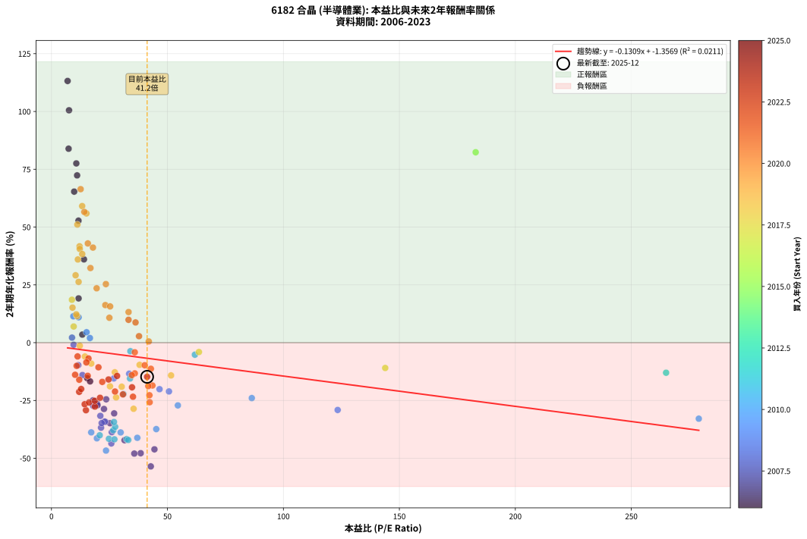
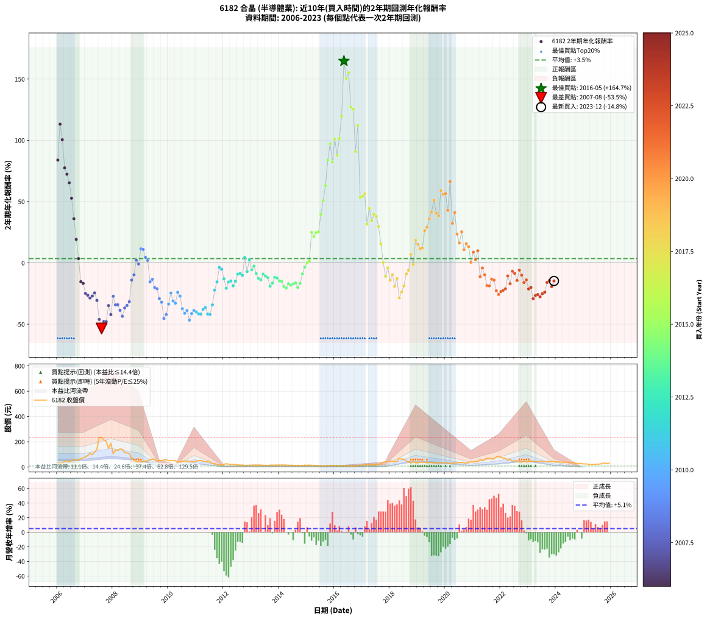

# 6182 合晶 - 本益比與未來報酬率分析

!!! info "報告資訊"
    - **股票代號**: 6182
    - **公司名稱**: 合晶
    - **產業別**: 半導體業
    - **分析期間**: 2006-2023 (216 個數據點)
    - **資料來源**: Type 12 (ShowMonthlyK_ChartFlow) 月收盤價與本益比
    - **報酬率口徑**: 含現金股利 (簡化: 年度合計，假設每年7/1入帳)
    - **報告生成時間**: 2026-01-06 01:08:35 CST

## 📈 視覺化圖表

### 圖表1: 本益比 vs 未來報酬率關係

*圖表1：6182 合晶 本益比與2年期未來報酬率關係 (2006-2023)*

### 圖表2: 歷年買入時點的2年期實際報酬率

*圖表2：6182 合晶 歷年買入時點的2年期實際報酬率 (2006-2023)*

## 📍 買點訊號說明

本報告提供兩種買點提示訊號（顯示於圖表2的股價子圖中）：

### ▲ 小綠色三角形（回測驗證）
- **計算方式**: 使用全部歷史資料計算本益比第25百分位數
- **用途**: 事後驗證，顯示歷史上哪些時點確實為低估區
- **限制**: 當下無法判斷，僅供回測參考
- **特性**: 後見之明（Look-Ahead Bias）

### ▲ 小橘色三角形（即時訊號）
- **計算方式**: 使用截至當月的過去5年資料計算本益比第25百分位數
- **用途**: 實際投資決策，當時即可判斷
- **優勢**: 可操作性強，符合實務需求
- **特性**: 無後見之明，滾動窗口計算

!!! tip "如何使用兩種訊號"
    - **綠色▲** 幫助理解歷史估值機會，驗證策略有效性
    - **橘色▲** 可作為實際買進參考，但仍需搭配基本面分析
    - 兩種訊號重疊時，表示即時判斷與事後驗證一致，信心度較高
    - 僅有綠色▲時，表示當時無法判斷（需要未來資料才能確認）
    - 僅有橘色▲時，表示即時判斷為買點，但事後可能不是最佳時機

## 📊 估值分析摘要

| 指標 | 數值 |
|:---:|:---:|
| **目前本益比** (2023-12) | **41.24 倍** |
| **歷史平均本益比** | 30.48 倍 |
| **估值水準** | 🔴 相對高估 |
| **預期2年年化報酬率** | **-6.76%** |
| **歷史平均報酬率** | +3.53% |
| **相關係數 (R²)** | 0.0211 |
| **趨勢線斜率** | -0.1309 |

!!! abstract "核心洞察"
    目前本益比顯著高於歷史平均，預期未來報酬率可能較低

    根據歷史數據回測，6182 合晶 在目前本益比 **41.2倍** 的估值水準下，
    預期未來2年年化報酬率約為 **-6.8%**。

    **重要提醒**: 本分析基於歷史數據統計，實際報酬率會受到公司基本面變化、產業趨勢、
    總體經濟環境等多重因素影響。R² = 0.02 表示本益比可解釋約 2.1% 的報酬率變異。

## 📈 歷史估值統計

### 最佳買點 (最高報酬率)

| 項目 | 數值 |
|:---:|:---:|
| 起始時間 | 2016-05 |
| 當時本益比 | nan 倍 |
| 起始價格 | 10.0 元 |
| 2年後價格 | 69.9 元 |
| **2年年化報酬率** | **+164.69%** |

### 最差買點 (最低報酬率)

| 項目 | 數值 |
|:---:|:---:|
| 起始時間 | 2007-08 |
| 當時本益比 | 42.83 倍 |
| 起始價格 | 233.5 元 |
| 2年後價格 | 45.6 元 |
| **2年年化報酬率** | **-53.51%** |

## 🎯 投資啟示

### 本益比與報酬率關係

趨勢線方程式: **y = -0.1309x + -1.3569**

!!! note "負相關"
    本益比與未來報酬率呈現負相關。較低的本益比通常帶來較高的未來報酬率，
    但相關性不算非常強。**估值仍是重要參考指標之一**。

### 估值區間建議

基於歷史數據分析:

- **🟢 低估區** (P/E < 24.4): 預期報酬率較高，可考慮增加持股
- **🟡 合理區** (P/E 24.4-36.6): 預期報酬率符合長期趨勢，正常持有
- **🔴 高估區** (P/E > 36.6): 預期報酬率較低，可考慮減碼或觀望

!!! danger "風險提示"
    - 過去表現不代表未來結果
    - 本分析假設公司基本面無重大結構性變化
    - 產業環境劇變可能使歷史規律失效
    - 應結合公司財報、產業趨勢、總體經濟等多重因素綜合判斷

!!! success "長期投資觀點"
    歷史數據顯示，在合理或低估的估值水準買入並長期持有，
    往往能獲得較佳的投資報酬。**耐心等待好價格**是價值投資的核心原則。

## 📊 數據品質

- **資料來源**: GoodInfo.tw Type 12 (ShowMonthlyK_ChartFlow)
- **資料頻率**: 月度收盤價與本益比
- **回測期間**: 2006-2023
- **數據點數量**: 216 個 (每個點代表一次2年期回測)

### 計算方法說明

1. **2年期年化報酬率**:
   - 對每個歷史時點，計算其後2年的實際投資報酬率
   - 期末價值(不含股利): 期末價格
   - 期末價值(含現金股利): 期末價格 + 持有期間內的現金股利合計 (簡化: 年度合計，假設每年7/1入帳)
   - 公式: 年化報酬率 = [(期末價值/期初價格)^(1/年數) - 1] × 100%

2. **本益比 (P/E Ratio)**:
   - 使用當時的月收盤價與EPS計算
   - 資料來源: Type 12 月度河流圖本益比數據

3. **趨勢線 (Linear Regression)**:
   - 使用最小平方法擬合線性趨勢線
   - R²值衡量本益比對報酬率的解釋能力

---

*本報告由 Stock Analysis System v1.9.0 自動生成*
*數據更新時間: 2026-01-06 01:08:35 CST*

## 📋 月度回測明細表

（每一列對應時間線圖中的一個買入點；可用來對照 SVG 圖上的每個點。）

| 買入月份 | 賣出月份 | 回測期限_年 | 實際持有年數 | 買入本益比_倍 | 買入收盤價_元 | 賣出收盤價_元 | 現金股利合計_元 | 總報酬率_pct | 年化報酬率_pct |
| --- | --- | --- | --- | --- | --- | --- | --- | --- | --- |
| 2006-01 | 2008-01 | 2 | 1.999 | 7.39 | 32.20 | 105.50 | 3.30 | +237.90 | +83.90 |
| 2006-02 | 2008-02 | 2 | 1.999 | 6.96 | 30.35 | 134.50 | 3.30 | +354.05 | +113.19 |
| 2006-03 | 2008-03 | 2 | 2.001 | 7.57 | 33.00 | 129.50 | 3.30 | +302.43 | +100.51 |
| 2006-04 | 2008-04 | 2 | 2.001 | 10.71 | 46.70 | 144.00 | 3.30 | +215.42 | +77.53 |
| 2006-05 | 2008-05 | 2 | 2.001 | 11.06 | 48.20 | 140.00 | 3.30 | +197.31 | +72.36 |
| 2006-06 | 2008-06 | 2 | 2.001 | 9.79 | 42.70 | 113.50 | 3.30 | +173.54 | +65.33 |
| 2006-07 | 2008-07 | 2 | 2.001 | 11.65 | 50.80 | 112.50 | 6.12 | +133.51 | +52.77 |
| 2006-08 | 2008-08 | 2 | 2.001 | 14.01 | 61.10 | 107.00 | 6.12 | +85.14 | +36.04 |
| 2006-09 | 2008-09 | 2 | 2.001 | 11.70 | 51.00 | 66.30 | 6.12 | +42.01 | +19.15 |
| 2006-10 | 2008-10 | 2 | 2.001 | 13.30 | 58.00 | 56.00 | 6.12 | +7.11 | +3.49 |
| 2006-11 | 2008-11 | 2 | 2.001 | 15.39 | 67.10 | 41.95 | 6.12 | -28.36 | -15.35 |
| 2006-12 | 2008-12 | 2 | 2.001 | 16.65 | 72.60 | 44.20 | 6.12 | -30.68 | -16.73 |
| 2007-01 | 2009-01 | 2 | 2.001 | 17.90 | 80.50 | 39.20 | 6.12 | -43.70 | -24.95 |
| 2007-02 | 2009-02 | 2 | 2.001 | 19.64 | 91.00 | 43.20 | 6.12 | -45.80 | -26.36 |
| 2007-03 | 2009-03 | 2 | 2.001 | 22.64 | 108.00 | 48.80 | 6.12 | -49.15 | -28.67 |
| 2007-04 | 2009-04 | 2 | 2.001 | 19.87 | 97.50 | 45.75 | 6.12 | -46.80 | -27.04 |
| 2007-05 | 2009-05 | 2 | 2.001 | 23.60 | 119.00 | 61.70 | 6.12 | -43.01 | -24.49 |
| 2007-06 | 2009-06 | 2 | 2.001 | 27.03 | 140.00 | 61.30 | 6.12 | -51.84 | -30.59 |
| 2007-07 | 2009-07 | 2 | 2.001 | 44.40 | 236.00 | 63.60 | 4.81 | -71.01 | -46.14 |
| 2007-08 | 2009-08 | 2 | 2.001 | 42.83 | 233.50 | 45.60 | 4.81 | -78.41 | -53.51 |
| 2007-09 | 2009-09 | 2 | 2.001 | 38.47 | 215.00 | 53.70 | 4.81 | -72.79 | -47.81 |
| 2007-10 | 2009-10 | 2 | 2.001 | 35.72 | 204.50 | 50.50 | 4.81 | -72.95 | -47.97 |
| 2007-11 | 2009-11 | 2 | 2.001 | 25.25 | 148.00 | 58.00 | 4.81 | -57.56 | -34.84 |
| 2007-12 | 2009-12 | 2 | 2.001 | 31.51 | 189.00 | 58.30 | 4.81 | -66.61 | -42.19 |
| 2008-01 | 2010-01 | 2 | 2.001 | 17.93 | 105.50 | 51.00 | 4.81 | -47.10 | -27.25 |
| 2008-02 | 2010-03 | 2 | 2.081 | 23.32 | 134.50 | 51.40 | 4.81 | -58.21 | -34.25 |
| 2008-03 | 2010-03 | 2 | 1.999 | 22.91 | 129.50 | 51.40 | 4.81 | -56.59 | -34.14 |
| 2008-04 | 2010-04 | 2 | 1.999 | 26.00 | 144.00 | 49.30 | 4.81 | -62.42 | -38.72 |
| 2008-05 | 2010-05 | 2 | 1.999 | 25.81 | 140.00 | 39.80 | 4.81 | -68.14 | -43.57 |
| 2008-06 | 2010-06 | 2 | 1.999 | 21.38 | 113.50 | 40.60 | 4.81 | -59.99 | -36.77 |
| 2008-07 | 2010-07 | 2 | 1.999 | 21.66 | 112.50 | 46.50 | 1.40 | -57.42 | -34.77 |
| 2008-08 | 2010-08 | 2 | 1.999 | 21.07 | 107.00 | 48.60 | 1.40 | -53.27 | -31.66 |
| 2008-09 | 2010-09 | 2 | 1.999 | 13.36 | 66.30 | 47.65 | 1.40 | -26.02 | -14.00 |
| 2008-10 | 2010-10 | 2 | 1.999 | 11.55 | 56.00 | 44.25 | 1.40 | -18.48 | -9.72 |
| 2008-11 | 2010-11 | 2 | 1.999 | 8.86 | 41.95 | 42.40 | 1.40 | +4.41 | +2.18 |
| 2008-12 | 2010-12 | 2 | 1.999 | 9.57 | 44.20 | 42.00 | 1.40 | -1.81 | -0.91 |
| 2009-01 | 2011-01 | 2 | 1.999 | 9.43 | 39.20 | 47.25 | 1.40 | +24.11 | +11.41 |
| 2009-02 | 2011-02 | 2 | 1.999 | 11.71 | 43.20 | 51.80 | 1.40 | +23.15 | +10.98 |
| 2009-03 | 2011-03 | 2 | 1.999 | 15.13 | 48.80 | 51.90 | 1.40 | +9.22 | +4.51 |
| 2009-04 | 2011-04 | 2 | 1.999 | 16.58 | 45.75 | 46.20 | 1.40 | +4.04 | +2.00 |
| 2009-05 | 2011-05 | 2 | 1.999 | 26.88 | 61.70 | 42.70 | 1.40 | -28.53 | -15.47 |
| 2009-06 | 2011-06 | 2 | 1.999 | 33.50 | 61.30 | 44.55 | 1.40 | -25.04 | -13.43 |
| 2009-07 | 2011-07 | 2 | 1.999 | 46.59 | 63.60 | 39.60 | 1.00 | -36.16 | -20.11 |
| 2009-08 | 2011-08 | 2 | 1.999 | 50.67 | 45.60 | 27.40 | 1.00 | -37.72 | -21.09 |
| 2009-09 | 2011-09 | 2 | 1.999 | 123.40 | 53.70 | 26.00 | 1.00 | -49.72 | -29.11 |
| 2009-10 | 2011-10 | 2 | 1.999 |  | 50.50 | 22.30 | 1.00 | -53.86 | -32.09 |
| 2009-11 | 2011-11 | 2 | 1.999 |  | 58.00 | 16.30 | 1.00 | -70.17 | -45.41 |
| 2009-12 | 2011-12 | 2 | 1.999 |  | 58.30 | 18.55 | 1.00 | -66.47 | -42.11 |
| 2010-01 | 2012-01 | 2 | 1.999 |  | 51.00 | 21.50 | 1.00 | -55.88 | -33.60 |
| 2010-02 | 2012-02 | 2 | 1.999 |  | 49.25 | 27.00 | 1.00 | -43.15 | -24.61 |
| 2010-03 | 2012-03 | 2 | 2.001 |  | 51.40 | 23.40 | 1.00 | -52.53 | -31.08 |
| 2010-04 | 2012-04 | 2 | 2.001 | 279.10 | 49.30 | 21.20 | 1.00 | -54.97 | -32.88 |
| 2010-05 | 2012-05 | 2 | 2.001 | 86.37 | 39.80 | 22.00 | 1.00 | -42.21 | -23.97 |
| 2010-06 | 2012-06 | 2 | 2.001 | 54.50 | 40.60 | 20.55 | 1.00 | -46.92 | -27.13 |
| 2010-07 | 2012-07 | 2 | 2.001 | 45.18 | 46.50 | 17.20 | 1.02 | -60.82 | -37.38 |
| 2010-08 | 2012-08 | 2 | 2.001 | 37.01 | 48.60 | 15.80 | 1.02 | -65.39 | -41.15 |
| 2010-09 | 2012-09 | 2 | 2.001 | 29.83 | 47.65 | 16.80 | 1.02 | -62.60 | -38.83 |
| 2010-10 | 2012-10 | 2 | 2.001 | 23.52 | 44.25 | 11.55 | 1.02 | -71.59 | -46.68 |
| 2010-11 | 2012-11 | 2 | 2.001 | 19.58 | 42.40 | 13.55 | 1.02 | -65.64 | -41.36 |
| 2010-12 | 2012-12 | 2 | 2.001 | 17.14 | 42.00 | 14.70 | 1.02 | -62.57 | -38.80 |
| 2011-01 | 2013-01 | 2 | 2.001 | 20.81 | 47.25 | 15.95 | 1.02 | -64.08 | -40.05 |
| 2011-02 | 2013-02 | 2 | 2.001 | 24.76 | 51.80 | 16.65 | 1.02 | -65.89 | -41.57 |
| 2011-03 | 2013-03 | 2 | 2.001 | 27.14 | 51.90 | 16.55 | 1.02 | -66.15 | -41.79 |
| 2011-04 | 2013-04 | 2 | 2.001 | 26.65 | 46.20 | 16.80 | 1.02 | -61.43 | -37.87 |
| 2011-05 | 2013-05 | 2 | 2.001 | 27.47 | 42.70 | 16.25 | 1.02 | -59.56 | -36.38 |
| 2011-06 | 2013-06 | 2 | 2.001 | 32.40 | 44.55 | 14.10 | 1.02 | -66.06 | -41.72 |
| 2011-07 | 2013-07 | 2 | 2.001 | 33.11 | 39.60 | 13.25 | 0.02 | -66.49 | -42.09 |
| 2011-08 | 2013-08 | 2 | 2.001 | 26.95 | 27.40 | 11.80 | 0.02 | -56.86 | -34.30 |
| 2011-09 | 2013-09 | 2 | 2.001 | 31.04 | 26.00 | 15.70 | 0.02 | -39.54 | -22.23 |
| 2011-10 | 2013-10 | 2 | 2.001 | 33.87 | 22.30 | 15.90 | 0.02 | -28.61 | -15.50 |
| 2011-11 | 2013-11 | 2 | 2.001 | 34.02 | 16.30 | 15.10 | 0.02 | -7.24 | -3.69 |
| 2011-12 | 2013-12 | 2 | 2.001 | 61.83 | 18.55 | 16.65 | 0.02 | -10.13 | -5.20 |
| 2012-01 | 2014-01 | 2 | 2.001 | 265.00 | 21.50 | 16.25 | 0.02 | -24.33 | -13.00 |
| 2012-02 | 2014-03 | 2 | 2.081 |  | 27.00 | 16.65 | 0.02 | -38.26 | -20.69 |
| 2012-03 | 2014-03 | 2 | 1.999 |  | 23.40 | 16.65 | 0.02 | -28.76 | -15.61 |
| 2012-04 | 2014-04 | 2 | 1.999 |  | 21.20 | 15.40 | 0.02 | -27.26 | -14.72 |
| 2012-05 | 2014-05 | 2 | 1.999 |  | 22.00 | 14.50 | 0.02 | -34.00 | -18.77 |
| 2012-06 | 2014-06 | 2 | 1.999 |  | 20.55 | 14.85 | 0.02 | -27.64 | -14.94 |
| 2012-07 | 2014-07 | 2 | 1.999 |  | 17.20 | 14.20 | 0.00 | -17.44 | -9.14 |
| 2012-08 | 2014-08 | 2 | 1.999 |  | 15.80 | 13.20 | 0.00 | -16.46 | -8.60 |
| 2012-09 | 2014-09 | 2 | 1.999 |  | 16.80 | 13.55 | 0.00 | -19.35 | -10.20 |
| 2012-10 | 2014-10 | 2 | 1.999 |  | 11.55 | 12.60 | 0.00 | +9.09 | +4.45 |
| 2012-11 | 2014-11 | 2 | 1.999 |  | 13.55 | 11.70 | 0.00 | -13.65 | -7.08 |
| 2012-12 | 2014-12 | 2 | 1.999 |  | 14.70 | 15.45 | 0.00 | +5.10 | +2.52 |
| 2013-01 | 2015-01 | 2 | 1.999 |  | 15.95 | 14.20 | 0.00 | -10.97 | -5.65 |
| 2013-02 | 2015-02 | 2 | 1.999 |  | 16.65 | 15.80 | 0.00 | -5.11 | -2.59 |
| 2013-03 | 2015-03 | 2 | 1.999 |  | 16.55 | 13.80 | 0.00 | -16.62 | -8.69 |
| 2013-04 | 2015-04 | 2 | 1.999 |  | 16.80 | 12.80 | 0.00 | -23.81 | -12.72 |
| 2013-05 | 2015-05 | 2 | 1.999 |  | 16.25 | 12.05 | 0.00 | -25.85 | -13.90 |
| 2013-06 | 2015-06 | 2 | 1.999 |  | 14.10 | 11.65 | 0.00 | -17.38 | -9.11 |
| 2013-07 | 2015-07 | 2 | 1.999 |  | 13.25 | 10.55 | 0.00 | -20.38 | -10.78 |
| 2013-08 | 2015-08 | 2 | 1.999 |  | 11.80 | 9.15 | 0.00 | -22.46 | -11.95 |
| 2013-09 | 2015-09 | 2 | 1.999 |  | 15.70 | 10.30 | 0.00 | -34.39 | -19.01 |
| 2013-10 | 2015-10 | 2 | 1.999 |  | 15.90 | 11.10 | 0.00 | -30.19 | -16.46 |
| 2013-11 | 2015-11 | 2 | 1.999 |  | 15.10 | 11.75 | 0.00 | -22.19 | -11.80 |
| 2013-12 | 2015-12 | 2 | 1.999 |  | 16.65 | 12.80 | 0.00 | -23.12 | -12.33 |
| 2014-01 | 2016-01 | 2 | 1.999 |  | 16.25 | 11.85 | 0.00 | -27.08 | -14.61 |
| 2014-02 | 2016-02 | 2 | 1.999 |  | 16.40 | 11.85 | 0.00 | -27.74 | -15.01 |
| 2014-03 | 2016-03 | 2 | 2.001 |  | 16.65 | 10.85 | 0.00 | -34.83 | -19.26 |
| 2014-04 | 2016-04 | 2 | 2.001 |  | 15.40 | 9.72 | 0.00 | -36.88 | -20.54 |
| 2014-05 | 2016-05 | 2 | 2.001 |  | 14.50 | 9.99 | 0.00 | -31.10 | -16.99 |
| 2014-06 | 2016-06 | 2 | 2.001 |  | 14.85 | 9.94 | 0.00 | -33.06 | -18.17 |
| 2014-07 | 2016-07 | 2 | 2.001 |  | 14.20 | 9.74 | 0.00 | -31.41 | -17.17 |
| 2014-08 | 2016-08 | 2 | 2.001 |  | 13.20 | 9.24 | 0.00 | -30.00 | -16.32 |
| 2014-09 | 2016-09 | 2 | 2.001 |  | 13.55 | 8.65 | 0.00 | -36.16 | -20.09 |
| 2014-10 | 2016-10 | 2 | 2.001 |  | 12.60 | 8.73 | 0.00 | -30.71 | -16.75 |
| 2014-11 | 2016-11 | 2 | 2.001 |  | 11.70 | 9.69 | 0.00 | -17.18 | -8.99 |
| 2014-12 | 2016-12 | 2 | 2.001 |  | 15.45 | 14.40 | 0.00 | -6.80 | -3.46 |
| 2015-01 | 2017-01 | 2 | 2.001 |  | 14.20 | 14.20 | 0.00 | +0.00 | +0.00 |
| 2015-02 | 2017-02 | 2 | 2.001 |  | 15.80 | 16.30 | 0.00 | +3.16 | +1.57 |
| 2015-03 | 2017-03 | 2 | 2.001 |  | 13.80 | 21.55 | 0.00 | +56.16 | +24.94 |
| 2015-04 | 2017-04 | 2 | 2.001 |  | 12.80 | 18.90 | 0.00 | +47.66 | +21.50 |
| 2015-05 | 2017-05 | 2 | 2.001 |  | 12.05 | 18.75 | 0.00 | +55.60 | +24.72 |
| 2015-06 | 2017-06 | 2 | 2.001 |  | 11.65 | 18.30 | 0.00 | +57.08 | +25.31 |
| 2015-07 | 2017-07 | 2 | 2.001 |  | 10.55 | 20.55 | 0.00 | +94.79 | +39.53 |
| 2015-08 | 2017-08 | 2 | 2.001 |  | 9.15 | 20.80 | 0.00 | +127.32 | +50.73 |
| 2015-09 | 2017-09 | 2 | 2.001 |  | 10.30 | 27.40 | 0.00 | +166.02 | +63.05 |
| 2015-10 | 2017-10 | 2 | 2.001 |  | 11.10 | 37.60 | 0.00 | +238.74 | +83.97 |
| 2015-11 | 2017-11 | 2 | 2.001 |  | 11.75 | 45.80 | 0.00 | +289.79 | +97.34 |
| 2015-12 | 2017-12 | 2 | 2.001 | 182.90 | 12.80 | 42.60 | 0.00 | +232.81 | +82.36 |
| 2016-01 | 2018-01 | 2 | 2.001 |  | 11.85 | 48.00 | 0.00 | +305.06 | +101.17 |
| 2016-02 | 2018-03 | 2 | 2.081 |  | 11.85 | 44.00 | 0.00 | +271.31 | +87.85 |
| 2016-03 | 2018-03 | 2 | 1.999 |  | 10.85 | 44.00 | 0.00 | +305.53 | +101.47 |
| 2016-04 | 2018-04 | 2 | 1.999 |  | 9.72 | 46.80 | 0.00 | +381.48 | +119.55 |
| 2016-05 | 2018-05 | 2 | 1.999 |  | 9.99 | 69.90 | 0.00 | +599.70 | +164.69 |
| 2016-06 | 2018-06 | 2 | 1.999 |  | 9.94 | 62.30 | 0.00 | +526.76 | +150.51 |
| 2016-07 | 2018-07 | 2 | 1.999 |  | 9.74 | 63.00 | 0.38 | +550.68 | +155.25 |
| 2016-08 | 2018-08 | 2 | 1.999 |  | 9.24 | 47.25 | 0.38 | +415.43 | +127.16 |
| 2016-09 | 2018-09 | 2 | 1.999 |  | 8.65 | 43.50 | 0.38 | +407.24 | +125.34 |
| 2016-10 | 2018-10 | 2 | 1.999 |  | 8.73 | 31.40 | 0.38 | +263.99 | +90.87 |
| 2016-11 | 2018-11 | 2 | 1.999 |  | 9.69 | 43.20 | 0.38 | +349.70 | +112.17 |
| 2016-12 | 2018-12 | 2 | 1.999 |  | 14.40 | 33.50 | 0.38 | +135.25 | +53.42 |
| 2017-01 | 2019-01 | 2 | 1.999 |  | 14.20 | 33.40 | 0.38 | +137.86 | +54.27 |
| 2017-02 | 2019-02 | 2 | 1.999 |  | 16.30 | 39.50 | 0.38 | +144.64 | +56.46 |
| 2017-03 | 2019-03 | 2 | 1.999 |  | 21.55 | 36.90 | 0.38 | +72.97 | +31.54 |
| 2017-04 | 2019-04 | 2 | 1.999 |  | 18.90 | 39.05 | 0.38 | +108.60 | +44.47 |
| 2017-05 | 2019-05 | 2 | 1.999 |  | 18.75 | 33.50 | 0.38 | +80.67 | +34.44 |
| 2017-06 | 2019-06 | 2 | 1.999 |  | 18.30 | 35.35 | 0.38 | +95.22 | +39.75 |
| 2017-07 | 2019-07 | 2 | 1.999 |  | 20.55 | 36.20 | 2.88 | +90.15 | +37.93 |
| 2017-08 | 2019-08 | 2 | 1.999 |  | 20.80 | 32.10 | 2.88 | +68.15 | +29.70 |
| 2017-09 | 2019-09 | 2 | 1.999 |  | 27.40 | 33.65 | 2.88 | +33.31 | +15.47 |
| 2017-10 | 2019-10 | 2 | 1.999 |  | 37.60 | 35.05 | 2.88 | +0.87 | +0.43 |
| 2017-11 | 2019-11 | 2 | 1.999 | 143.90 | 45.80 | 33.45 | 2.88 | -20.69 | -10.95 |
| 2017-12 | 2019-12 | 2 | 1.999 | 63.58 | 42.60 | 36.35 | 2.88 | -7.92 | -4.04 |
| 2018-01 | 2020-01 | 2 | 1.999 | 51.57 | 48.00 | 32.50 | 2.88 | -26.30 | -14.16 |
| 2018-02 | 2020-02 | 2 | 1.999 | 38.01 | 45.30 | 34.15 | 2.88 | -18.26 | -9.60 |
| 2018-03 | 2020-03 | 2 | 2.001 | 30.29 | 44.00 | 25.95 | 2.88 | -34.49 | -19.05 |
| 2018-04 | 2020-04 | 2 | 2.001 | 27.32 | 46.80 | 32.70 | 2.88 | -23.98 | -12.80 |
| 2018-05 | 2020-05 | 2 | 2.001 | 35.41 | 69.90 | 32.75 | 2.88 | -49.03 | -28.59 |
| 2018-06 | 2020-06 | 2 | 2.001 | 27.87 | 62.30 | 33.40 | 2.88 | -41.77 | -23.68 |
| 2018-07 | 2020-07 | 2 | 2.001 | 25.24 | 63.00 | 37.15 | 4.30 | -34.21 | -18.88 |
| 2018-08 | 2020-08 | 2 | 2.001 | 17.14 | 47.25 | 34.80 | 4.30 | -17.25 | -9.03 |
| 2018-09 | 2020-09 | 2 | 2.001 | 14.42 | 43.50 | 34.15 | 4.30 | -11.61 | -5.98 |
| 2018-10 | 2020-10 | 2 | 2.001 | 9.58 | 31.40 | 31.65 | 4.30 | +14.49 | +7.00 |
| 2018-11 | 2020-11 | 2 | 2.001 | 12.21 | 43.20 | 37.75 | 4.30 | -2.66 | -1.34 |
| 2018-12 | 2020-12 | 2 | 2.001 | 8.82 | 33.50 | 42.80 | 4.30 | +40.60 | +18.56 |
| 2019-01 | 2021-01 | 2 | 2.001 | 9.07 | 33.40 | 40.00 | 4.30 | +32.63 | +15.16 |
| 2019-02 | 2021-02 | 2 | 2.001 | 11.07 | 39.50 | 44.80 | 4.30 | +24.30 | +11.48 |
| 2019-03 | 2021-03 | 2 | 2.001 | 10.69 | 36.90 | 42.20 | 4.30 | +26.02 | +12.25 |
| 2019-04 | 2021-04 | 2 | 2.001 | 11.70 | 39.05 | 58.00 | 4.30 | +59.54 | +26.29 |
| 2019-05 | 2021-05 | 2 | 2.001 | 10.40 | 33.50 | 51.60 | 4.30 | +66.87 | +29.15 |
| 2019-06 | 2021-06 | 2 | 2.001 | 11.38 | 35.35 | 61.10 | 4.30 | +85.01 | +35.99 |
| 2019-07 | 2021-07 | 2 | 2.001 | 12.11 | 36.20 | 69.80 | 2.90 | +100.83 | +41.68 |
| 2019-08 | 2021-08 | 2 | 2.001 | 11.17 | 32.10 | 70.40 | 2.90 | +128.35 | +51.07 |
| 2019-09 | 2021-09 | 2 | 2.001 | 12.20 | 33.65 | 63.60 | 2.90 | +97.62 | +40.55 |
| 2019-10 | 2021-10 | 2 | 2.001 | 13.27 | 35.05 | 64.20 | 2.90 | +91.44 | +38.33 |
| 2019-11 | 2021-11 | 2 | 2.001 | 13.24 | 33.45 | 81.80 | 2.90 | +153.21 | +59.08 |
| 2019-12 | 2021-12 | 2 | 2.001 | 15.08 | 36.35 | 85.50 | 2.90 | +143.19 | +55.90 |
| 2020-01 | 2022-01 | 2 | 2.001 | 14.17 | 32.50 | 76.80 | 2.90 | +145.23 | +56.55 |
| 2020-02 | 2022-03 | 2 | 2.081 | 15.68 | 34.15 | 68.90 | 2.90 | +110.25 | +42.92 |
| 2020-03 | 2022-03 | 2 | 1.999 | 12.58 | 25.95 | 68.90 | 2.90 | +176.69 | +66.40 |
| 2020-04 | 2022-04 | 2 | 1.999 | 16.80 | 32.70 | 54.30 | 2.90 | +74.92 | +32.28 |
| 2020-05 | 2022-05 | 2 | 1.999 | 17.89 | 32.75 | 62.30 | 2.90 | +99.08 | +41.13 |
| 2020-06 | 2022-06 | 2 | 1.999 | 19.48 | 33.40 | 48.05 | 2.90 | +52.54 | +23.53 |
| 2020-07 | 2022-07 | 2 | 1.999 | 23.23 | 37.15 | 47.75 | 2.45 | +35.13 | +16.26 |
| 2020-08 | 2022-08 | 2 | 1.999 | 23.46 | 34.80 | 52.20 | 2.45 | +57.04 | +25.34 |
| 2020-09 | 2022-09 | 2 | 1.999 | 24.97 | 34.15 | 39.45 | 2.45 | +22.69 | +10.78 |
| 2020-10 | 2022-10 | 2 | 1.999 | 25.29 | 31.65 | 39.90 | 2.45 | +33.81 | +15.69 |
| 2020-11 | 2022-11 | 2 | 1.999 | 33.24 | 37.75 | 45.95 | 2.45 | +28.21 | +13.24 |
| 2020-12 | 2022-12 | 2 | 1.999 | 41.96 | 42.80 | 40.80 | 2.45 | +1.05 | +0.52 |
| 2021-01 | 2023-01 | 2 | 1.999 | 36.25 | 40.00 | 44.85 | 2.45 | +18.25 | +8.75 |
| 2021-02 | 2023-02 | 2 | 1.999 | 37.75 | 44.80 | 44.90 | 2.45 | +5.69 | +2.81 |
| 2021-03 | 2023-03 | 2 | 1.999 | 33.23 | 42.20 | 48.50 | 2.45 | +20.73 | +9.89 |
| 2021-04 | 2023-04 | 2 | 1.999 | 42.86 | 58.00 | 43.20 | 2.45 | -21.29 | -11.29 |
| 2021-05 | 2023-05 | 2 | 1.999 | 35.92 | 51.60 | 44.95 | 2.45 | -8.14 | -4.16 |
| 2021-06 | 2023-06 | 2 | 1.999 | 40.20 | 61.10 | 47.30 | 2.45 | -18.58 | -9.77 |
| 2021-07 | 2023-07 | 2 | 1.999 | 43.53 | 69.80 | 42.50 | 3.85 | -33.60 | -18.53 |
| 2021-08 | 2023-08 | 2 | 1.999 | 41.74 | 70.40 | 42.60 | 3.85 | -34.03 | -18.79 |
| 2021-09 | 2023-09 | 2 | 1.999 | 35.93 | 63.60 | 44.00 | 3.85 | -24.77 | -13.27 |
| 2021-10 | 2023-10 | 2 | 1.999 | 34.64 | 64.20 | 43.60 | 3.85 | -26.10 | -14.04 |
| 2021-11 | 2023-11 | 2 | 1.999 | 42.24 | 81.80 | 45.00 | 3.85 | -40.29 | -22.74 |
| 2021-12 | 2023-12 | 2 | 1.999 | 42.33 | 85.50 | 43.30 | 3.85 | -44.86 | -25.76 |
| 2022-01 | 2024-01 | 2 | 1.999 | 35.15 | 76.80 | 41.25 | 3.85 | -41.28 | -23.39 |
| 2022-02 | 2024-02 | 2 | 1.999 | 30.81 | 72.40 | 39.80 | 3.85 | -39.72 | -22.37 |
| 2022-03 | 2024-03 | 2 | 2.001 | 27.40 | 68.90 | 39.00 | 3.85 | -37.81 | -21.13 |
| 2022-04 | 2024-04 | 2 | 2.001 | 20.26 | 54.30 | 39.50 | 3.85 | -20.17 | -10.65 |
| 2022-05 | 2024-05 | 2 | 2.001 | 21.90 | 62.30 | 39.10 | 3.85 | -31.07 | -16.96 |
| 2022-06 | 2024-06 | 2 | 2.001 | 15.96 | 48.05 | 37.85 | 3.85 | -13.22 | -6.84 |
| 2022-07 | 2024-07 | 2 | 2.001 | 15.04 | 47.75 | 36.80 | 3.15 | -16.34 | -8.53 |
| 2022-08 | 2024-08 | 2 | 2.001 | 15.63 | 52.20 | 35.15 | 3.15 | -26.64 | -14.34 |
| 2022-09 | 2024-09 | 2 | 2.001 | 11.26 | 39.45 | 31.75 | 3.15 | -11.54 | -5.94 |
| 2022-10 | 2024-10 | 2 | 2.001 | 10.87 | 39.90 | 29.15 | 3.15 | -19.06 | -10.03 |
| 2022-11 | 2024-11 | 2 | 2.001 | 11.98 | 45.95 | 29.25 | 3.15 | -29.50 | -16.02 |
| 2022-12 | 2024-12 | 2 | 2.001 | 10.20 | 40.80 | 27.10 | 3.15 | -25.87 | -13.89 |
| 2023-01 | 2025-01 | 2 | 2.001 | 11.95 | 44.85 | 24.65 | 3.15 | -38.02 | -21.26 |
| 2023-02 | 2025-02 | 2 | 2.001 | 12.80 | 44.90 | 25.55 | 3.15 | -36.09 | -20.04 |
| 2023-03 | 2025-03 | 2 | 2.001 | 14.87 | 48.50 | 21.15 | 3.15 | -49.91 | -29.21 |
| 2023-04 | 2025-04 | 2 | 2.001 | 14.32 | 43.20 | 20.10 | 3.15 | -46.19 | -26.63 |
| 2023-05 | 2025-05 | 2 | 2.001 | 16.22 | 44.95 | 21.55 | 3.15 | -45.06 | -25.86 |
| 2023-06 | 2025-06 | 2 | 2.001 | 18.73 | 47.30 | 21.60 | 3.15 | -47.68 | -27.65 |
| 2023-07 | 2025-07 | 2 | 2.001 | 18.65 | 42.50 | 23.15 | 0.65 | -44.00 | -25.15 |
| 2023-08 | 2025-08 | 2 | 2.001 | 20.95 | 42.60 | 24.05 | 0.65 | -42.02 | -23.84 |
| 2023-09 | 2025-09 | 2 | 2.001 | 24.62 | 44.00 | 30.45 | 0.65 | -29.32 | -15.92 |
| 2023-10 | 2025-10 | 2 | 2.001 | 28.28 | 43.60 | 31.30 | 0.65 | -26.72 | -14.39 |
| 2023-11 | 2025-11 | 2 | 2.001 | 34.73 | 45.00 | 28.65 | 0.65 | -34.89 | -19.30 |
| 2023-12 | 2025-12 | 2 | 2.001 | 41.24 | 43.30 | 30.80 | 0.65 | -27.37 | -14.77 |
