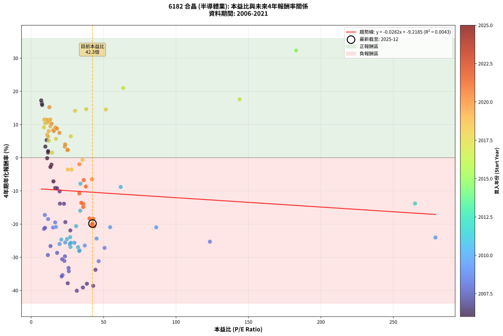
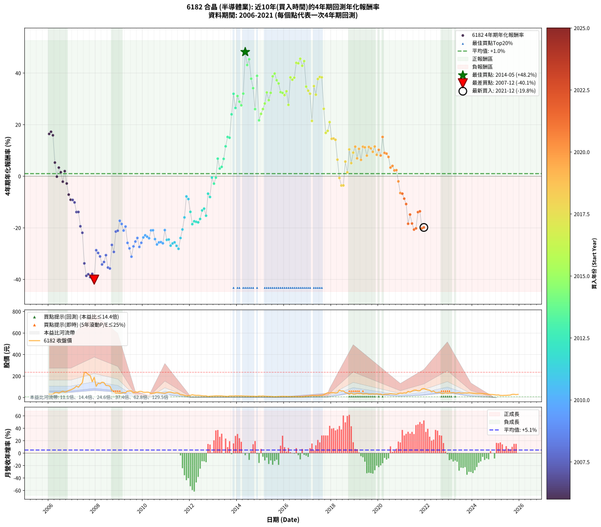

# 6182 合晶 - 本益比與未來報酬率分析

!!! info "報告資訊"
    - **股票代號**: 6182
    - **公司名稱**: 合晶
    - **產業別**: 半導體業
    - **分析期間**: 2006-2021 (192 個數據點)
    - **資料來源**: Type 12 (ShowMonthlyK_ChartFlow) 月收盤價與本益比
    - **報酬率口徑**: 含現金股利 (簡化: 年度合計，假設每年7/1入帳)
    - **報告生成時間**: 2026-01-05 21:13:05 CST

## 📈 視覺化圖表

### 圖表1: 本益比 vs 未來報酬率關係

*圖表1：6182 合晶 本益比與4年期未來報酬率關係 (2006-2021)*

### 圖表2: 歷年買入時點的4年期實際報酬率

*圖表2：6182 合晶 歷年買入時點的4年期實際報酬率 (2006-2021)*

## 📍 買點訊號說明

本報告提供兩種買點提示訊號（顯示於圖表2的股價子圖中）：

### ▲ 小綠色三角形（回測驗證）
- **計算方式**: 使用全部歷史資料計算本益比第25百分位數
- **用途**: 事後驗證，顯示歷史上哪些時點確實為低估區
- **限制**: 當下無法判斷，僅供回測參考
- **特性**: 後見之明（Look-Ahead Bias）

### ▲ 小橘色三角形（即時訊號）
- **計算方式**: 使用截至當月的過去5年資料計算本益比第25百分位數
- **用途**: 實際投資決策，當時即可判斷
- **優勢**: 可操作性強，符合實務需求
- **特性**: 無後見之明，滾動窗口計算

!!! tip "如何使用兩種訊號"
    - **綠色▲** 幫助理解歷史估值機會，驗證策略有效性
    - **橘色▲** 可作為實際買進參考，但仍需搭配基本面分析
    - 兩種訊號重疊時，表示即時判斷與事後驗證一致，信心度較高
    - 僅有綠色▲時，表示當時無法判斷（需要未來資料才能確認）
    - 僅有橘色▲時，表示即時判斷為買點，但事後可能不是最佳時機

## 📊 估值分析摘要

| 指標 | 數值 |
|:---:|:---:|
| **目前本益比** (2021-12) | **42.33 倍** |
| **歷史平均本益比** | 32.58 倍 |
| **估值水準** | 🔴 相對高估 |
| **預期4年年化報酬率** | **-10.41%** |
| **歷史平均報酬率** | +1.03% |
| **相關係數 (R²)** | 0.0043 |
| **趨勢線斜率** | -0.0282 |

!!! abstract "核心洞察"
    目前本益比顯著高於歷史平均，預期未來報酬率可能較低

    根據歷史數據回測，6182 合晶 在目前本益比 **42.3倍** 的估值水準下，
    預期未來4年年化報酬率約為 **-10.4%**。

    **重要提醒**: 本分析基於歷史數據統計，實際報酬率會受到公司基本面變化、產業趨勢、
    總體經濟環境等多重因素影響。R² = 0.00 表示本益比可解釋約 0.4% 的報酬率變異。

## 📈 歷史估值統計

### 最佳買點 (最高報酬率)

| 項目 | 數值 |
|:---:|:---:|
| 起始時間 | 2014-05 |
| 當時本益比 | nan 倍 |
| 起始價格 | 14.5 元 |
| 4年後價格 | 69.9 元 |
| **4年年化報酬率** | **+48.18%** |

### 最差買點 (最低報酬率)

| 項目 | 數值 |
|:---:|:---:|
| 起始時間 | 2007-12 |
| 當時本益比 | 31.51 倍 |
| 起始價格 | 189.0 元 |
| 4年後價格 | 18.6 元 |
| **4年年化報酬率** | **-40.08%** |

## 🎯 投資啟示

### 本益比與報酬率關係

趨勢線方程式: **y = -0.0282x + -9.2185**

!!! note "負相關"
    本益比與未來報酬率呈現負相關。較低的本益比通常帶來較高的未來報酬率，
    但相關性不算非常強。**估值仍是重要參考指標之一**。

### 估值區間建議

基於歷史數據分析:

- **🟢 低估區** (P/E < 26.1): 預期報酬率較高，可考慮增加持股
- **🟡 合理區** (P/E 26.1-39.1): 預期報酬率符合長期趨勢，正常持有
- **🔴 高估區** (P/E > 39.1): 預期報酬率較低，可考慮減碼或觀望

!!! danger "風險提示"
    - 過去表現不代表未來結果
    - 本分析假設公司基本面無重大結構性變化
    - 產業環境劇變可能使歷史規律失效
    - 應結合公司財報、產業趨勢、總體經濟等多重因素綜合判斷

!!! success "長期投資觀點"
    歷史數據顯示，在合理或低估的估值水準買入並長期持有，
    往往能獲得較佳的投資報酬。**耐心等待好價格**是價值投資的核心原則。

## 📊 數據品質

- **資料來源**: GoodInfo.tw Type 12 (ShowMonthlyK_ChartFlow)
- **資料頻率**: 月度收盤價與本益比
- **回測期間**: 2006-2021
- **數據點數量**: 192 個 (每個點代表一次4年期回測)

### 計算方法說明

1. **4年期年化報酬率**:
   - 對每個歷史時點，計算其後4年的實際投資報酬率
   - 期末價值(不含股利): 期末價格
   - 期末價值(含現金股利): 期末價格 + 持有期間內的現金股利合計 (簡化: 年度合計，假設每年7/1入帳)
   - 公式: 年化報酬率 = [(期末價值/期初價格)^(1/年數) - 1] × 100%

2. **本益比 (P/E Ratio)**:
   - 使用當時的月收盤價與EPS計算
   - 資料來源: Type 12 月度河流圖本益比數據

3. **趨勢線 (Linear Regression)**:
   - 使用最小平方法擬合線性趨勢線
   - R²值衡量本益比對報酬率的解釋能力

---

*本報告由 Stock Analysis System v1.9.0 自動生成*
*數據更新時間: 2026-01-05 21:13:05 CST*

## 📋 月度回測明細表

（每一列對應時間線圖中的一個買入點；可用來對照 SVG 圖上的每個點。）

| 買入月份 | 賣出月份 | 回測期限_年 | 實際持有年數 | 買入本益比_倍 | 買入收盤價_元 | 賣出收盤價_元 | 現金股利合計_元 | 總報酬率_pct | 年化報酬率_pct |
| --- | --- | --- | --- | --- | --- | --- | --- | --- | --- |
| 2006-01 | 2010-01 | 4 | 4.000 | 7.39 | 32.20 | 51.00 | 8.11 | +83.58 | +16.40 |
| 2006-02 | 2010-02 | 4 | 4.000 | 6.96 | 30.35 | 49.25 | 8.11 | +89.00 | +17.25 |
| 2006-03 | 2010-03 | 4 | 4.000 | 7.57 | 33.00 | 51.40 | 8.11 | +80.34 | +15.88 |
| 2006-04 | 2010-04 | 4 | 4.000 | 10.71 | 46.70 | 49.30 | 8.11 | +22.94 | +5.30 |
| 2006-05 | 2010-05 | 4 | 4.000 | 11.06 | 48.20 | 39.80 | 8.11 | -0.60 | -0.15 |
| 2006-06 | 2010-06 | 4 | 4.000 | 9.79 | 42.70 | 40.60 | 8.11 | +14.08 | +3.35 |
| 2006-07 | 2010-07 | 4 | 4.000 | 11.65 | 50.80 | 46.50 | 7.52 | +6.34 | +1.55 |
| 2006-08 | 2010-08 | 4 | 4.000 | 14.01 | 61.10 | 48.60 | 7.52 | -8.15 | -2.10 |
| 2006-09 | 2010-09 | 4 | 4.000 | 11.70 | 51.00 | 47.65 | 7.52 | +8.18 | +1.99 |
| 2006-10 | 2010-10 | 4 | 4.000 | 13.30 | 58.00 | 44.25 | 7.52 | -10.74 | -2.80 |
| 2006-11 | 2010-11 | 4 | 4.000 | 15.39 | 67.10 | 42.40 | 7.52 | -25.60 | -7.13 |
| 2006-12 | 2010-12 | 4 | 4.000 | 16.65 | 72.60 | 42.00 | 7.52 | -31.79 | -9.12 |
| 2007-01 | 2011-01 | 4 | 4.000 | 17.90 | 80.50 | 47.25 | 7.52 | -31.96 | -9.18 |
| 2007-02 | 2011-02 | 4 | 4.000 | 19.64 | 91.00 | 51.80 | 7.52 | -34.81 | -10.14 |
| 2007-03 | 2011-03 | 4 | 4.000 | 22.64 | 108.00 | 51.90 | 7.52 | -44.98 | -13.87 |
| 2007-04 | 2011-04 | 4 | 4.000 | 19.87 | 97.50 | 46.20 | 7.52 | -44.90 | -13.84 |
| 2007-05 | 2011-05 | 4 | 4.000 | 23.60 | 119.00 | 42.70 | 7.52 | -57.80 | -19.40 |
| 2007-06 | 2011-06 | 4 | 4.000 | 27.03 | 140.00 | 44.55 | 7.52 | -62.80 | -21.91 |
| 2007-07 | 2011-07 | 4 | 4.000 | 44.40 | 236.00 | 39.60 | 5.81 | -80.76 | -33.77 |
| 2007-08 | 2011-08 | 4 | 4.000 | 42.83 | 233.50 | 27.40 | 5.81 | -85.78 | -38.59 |
| 2007-09 | 2011-09 | 4 | 4.000 | 38.47 | 215.00 | 26.00 | 5.81 | -85.20 | -37.98 |
| 2007-10 | 2011-10 | 4 | 4.000 | 35.72 | 204.50 | 22.30 | 5.81 | -86.25 | -39.11 |
| 2007-11 | 2011-11 | 4 | 4.000 | 25.25 | 148.00 | 16.30 | 5.81 | -85.06 | -37.83 |
| 2007-12 | 2011-12 | 4 | 4.000 | 31.51 | 189.00 | 18.55 | 5.81 | -87.11 | -40.08 |
| 2008-01 | 2012-01 | 4 | 4.000 | 17.93 | 105.50 | 21.50 | 5.81 | -74.11 | -28.67 |
| 2008-02 | 2012-02 | 4 | 4.000 | 23.32 | 134.50 | 27.00 | 5.81 | -75.61 | -29.72 |
| 2008-03 | 2012-03 | 4 | 4.000 | 22.91 | 129.50 | 23.40 | 5.81 | -77.44 | -31.08 |
| 2008-04 | 2012-04 | 4 | 4.000 | 26.00 | 144.00 | 21.20 | 5.81 | -81.24 | -34.19 |
| 2008-05 | 2012-05 | 4 | 4.000 | 25.81 | 140.00 | 22.00 | 5.81 | -80.14 | -33.24 |
| 2008-06 | 2012-06 | 4 | 4.000 | 21.38 | 113.50 | 20.55 | 5.81 | -76.78 | -30.58 |
| 2008-07 | 2012-07 | 4 | 4.000 | 21.66 | 112.50 | 17.20 | 2.42 | -82.56 | -35.38 |
| 2008-08 | 2012-08 | 4 | 4.000 | 21.07 | 107.00 | 15.80 | 2.42 | -82.97 | -35.76 |
| 2008-09 | 2012-09 | 4 | 4.000 | 13.36 | 66.30 | 16.80 | 2.42 | -71.01 | -26.62 |
| 2008-10 | 2012-10 | 4 | 4.000 | 11.55 | 56.00 | 11.55 | 2.42 | -75.05 | -29.33 |
| 2008-11 | 2012-11 | 4 | 4.000 | 8.86 | 41.95 | 13.55 | 2.42 | -61.93 | -21.45 |
| 2008-12 | 2012-12 | 4 | 4.000 | 9.57 | 44.20 | 14.70 | 2.42 | -61.27 | -21.11 |
| 2009-01 | 2013-01 | 4 | 4.000 | 9.43 | 39.20 | 15.95 | 2.42 | -53.14 | -17.26 |
| 2009-02 | 2013-02 | 4 | 4.000 | 11.71 | 43.20 | 16.65 | 2.42 | -55.86 | -18.49 |
| 2009-03 | 2013-03 | 4 | 4.000 | 15.13 | 48.80 | 16.55 | 2.42 | -61.13 | -21.04 |
| 2009-04 | 2013-04 | 4 | 4.000 | 16.58 | 45.75 | 16.80 | 2.42 | -57.99 | -19.49 |
| 2009-05 | 2013-05 | 4 | 4.000 | 26.88 | 61.70 | 16.25 | 2.42 | -69.74 | -25.83 |
| 2009-06 | 2013-06 | 4 | 4.000 | 33.50 | 61.30 | 14.10 | 2.42 | -73.05 | -27.95 |
| 2009-07 | 2013-07 | 4 | 4.000 | 46.59 | 63.60 | 13.25 | 1.02 | -77.56 | -31.18 |
| 2009-08 | 2013-08 | 4 | 4.000 | 50.67 | 45.60 | 11.80 | 1.02 | -71.89 | -27.18 |
| 2009-09 | 2013-09 | 4 | 4.000 | 123.40 | 53.70 | 15.70 | 1.02 | -68.86 | -25.30 |
| 2009-10 | 2013-10 | 4 | 4.000 |  | 50.50 | 15.90 | 1.02 | -66.50 | -23.92 |
| 2009-11 | 2013-11 | 4 | 4.000 |  | 58.00 | 15.10 | 1.02 | -72.21 | -27.39 |
| 2009-12 | 2013-12 | 4 | 4.000 |  | 58.30 | 16.65 | 1.02 | -69.69 | -25.80 |
| 2010-01 | 2014-01 | 4 | 4.000 |  | 51.00 | 16.25 | 1.02 | -66.14 | -23.72 |
| 2010-02 | 2014-02 | 4 | 4.000 |  | 49.25 | 16.40 | 1.02 | -64.63 | -22.88 |
| 2010-03 | 2014-03 | 4 | 4.000 |  | 51.40 | 16.65 | 1.02 | -65.62 | -23.43 |
| 2010-04 | 2014-04 | 4 | 4.000 | 279.10 | 49.30 | 15.40 | 1.02 | -66.69 | -24.03 |
| 2010-05 | 2014-05 | 4 | 4.000 | 86.37 | 39.80 | 14.50 | 1.02 | -61.01 | -20.98 |
| 2010-06 | 2014-06 | 4 | 4.000 | 54.50 | 40.60 | 14.85 | 1.02 | -60.91 | -20.93 |
| 2010-07 | 2014-07 | 4 | 4.000 | 45.18 | 46.50 | 14.20 | 1.02 | -67.27 | -24.36 |
| 2010-08 | 2014-08 | 4 | 4.000 | 37.01 | 48.60 | 13.20 | 1.02 | -70.74 | -26.45 |
| 2010-09 | 2014-09 | 4 | 4.000 | 29.83 | 47.65 | 13.55 | 1.02 | -69.42 | -25.64 |
| 2010-10 | 2014-10 | 4 | 4.000 | 23.52 | 44.25 | 12.60 | 1.02 | -69.22 | -25.52 |
| 2010-11 | 2014-11 | 4 | 4.000 | 19.58 | 42.40 | 11.70 | 1.02 | -70.00 | -25.99 |
| 2010-12 | 2014-12 | 4 | 4.000 | 17.14 | 42.00 | 15.45 | 1.02 | -60.79 | -20.87 |
| 2011-01 | 2015-01 | 4 | 4.000 | 20.81 | 47.25 | 14.20 | 1.02 | -67.79 | -24.66 |
| 2011-02 | 2015-02 | 4 | 4.000 | 24.76 | 51.80 | 15.80 | 1.02 | -67.53 | -24.51 |
| 2011-03 | 2015-03 | 4 | 4.000 | 27.14 | 51.90 | 13.80 | 1.02 | -71.45 | -26.90 |
| 2011-04 | 2015-04 | 4 | 4.000 | 26.65 | 46.20 | 12.80 | 1.02 | -70.09 | -26.05 |
| 2011-05 | 2015-05 | 4 | 4.000 | 27.47 | 42.70 | 12.05 | 1.02 | -69.39 | -25.62 |
| 2011-06 | 2015-06 | 4 | 4.000 | 32.40 | 44.55 | 11.65 | 1.02 | -71.56 | -26.97 |
| 2011-07 | 2015-07 | 4 | 4.000 | 33.11 | 39.60 | 10.55 | 0.02 | -73.31 | -28.12 |
| 2011-08 | 2015-08 | 4 | 4.000 | 26.95 | 27.40 | 9.15 | 0.02 | -66.53 | -23.94 |
| 2011-09 | 2015-09 | 4 | 4.000 | 31.04 | 26.00 | 10.30 | 0.02 | -60.31 | -20.63 |
| 2011-10 | 2015-10 | 4 | 4.000 | 33.87 | 22.30 | 11.10 | 0.02 | -50.13 | -15.97 |
| 2011-11 | 2015-11 | 4 | 4.000 | 34.02 | 16.30 | 11.75 | 0.02 | -27.79 | -7.82 |
| 2011-12 | 2015-12 | 4 | 4.000 | 61.83 | 18.55 | 12.80 | 0.02 | -30.89 | -8.82 |
| 2012-01 | 2016-01 | 4 | 4.000 | 265.00 | 21.50 | 11.85 | 0.02 | -44.79 | -13.80 |
| 2012-02 | 2016-02 | 4 | 4.000 |  | 27.00 | 11.85 | 0.02 | -56.04 | -18.57 |
| 2012-03 | 2016-03 | 4 | 4.000 |  | 23.40 | 10.85 | 0.02 | -53.55 | -17.44 |
| 2012-04 | 2016-04 | 4 | 4.000 |  | 21.20 | 9.72 | 0.02 | -54.06 | -17.67 |
| 2012-05 | 2016-05 | 4 | 4.000 |  | 22.00 | 9.99 | 0.02 | -54.50 | -17.87 |
| 2012-06 | 2016-06 | 4 | 4.000 |  | 20.55 | 9.94 | 0.02 | -51.53 | -16.56 |
| 2012-07 | 2016-07 | 4 | 4.000 |  | 17.20 | 9.74 | 0.00 | -43.37 | -13.25 |
| 2012-08 | 2016-08 | 4 | 4.000 |  | 15.80 | 9.24 | 0.00 | -41.52 | -12.55 |
| 2012-09 | 2016-09 | 4 | 4.000 |  | 16.80 | 8.65 | 0.00 | -48.51 | -15.29 |
| 2012-10 | 2016-10 | 4 | 4.000 |  | 11.55 | 8.73 | 0.00 | -24.42 | -6.76 |
| 2012-11 | 2016-11 | 4 | 4.000 |  | 13.55 | 9.69 | 0.00 | -28.49 | -8.04 |
| 2012-12 | 2016-12 | 4 | 4.000 |  | 14.70 | 14.40 | 0.00 | -2.04 | -0.51 |
| 2013-01 | 2017-01 | 4 | 4.000 |  | 15.95 | 14.20 | 0.00 | -10.97 | -2.86 |
| 2013-02 | 2017-02 | 4 | 4.000 |  | 16.65 | 16.30 | 0.00 | -2.10 | -0.53 |
| 2013-03 | 2017-03 | 4 | 4.000 |  | 16.55 | 21.55 | 0.00 | +30.21 | +6.82 |
| 2013-04 | 2017-04 | 4 | 4.000 |  | 16.80 | 18.90 | 0.00 | +12.50 | +2.99 |
| 2013-05 | 2017-05 | 4 | 4.000 |  | 16.25 | 18.75 | 0.00 | +15.38 | +3.64 |
| 2013-06 | 2017-06 | 4 | 4.000 |  | 14.10 | 18.30 | 0.00 | +29.79 | +6.74 |
| 2013-07 | 2017-07 | 4 | 4.000 |  | 13.25 | 20.55 | 0.00 | +55.09 | +11.60 |
| 2013-08 | 2017-08 | 4 | 4.000 |  | 11.80 | 20.80 | 0.00 | +76.27 | +15.22 |
| 2013-09 | 2017-09 | 4 | 4.000 |  | 15.70 | 27.40 | 0.00 | +74.52 | +14.94 |
| 2013-10 | 2017-10 | 4 | 4.000 |  | 15.90 | 37.60 | 0.00 | +136.48 | +24.01 |
| 2013-11 | 2017-11 | 4 | 4.000 |  | 15.10 | 45.80 | 0.00 | +203.31 | +31.97 |
| 2013-12 | 2017-12 | 4 | 4.000 |  | 16.65 | 42.60 | 0.00 | +155.86 | +26.47 |
| 2014-01 | 2018-01 | 4 | 4.000 |  | 16.25 | 48.00 | 0.00 | +195.38 | +31.10 |
| 2014-02 | 2018-02 | 4 | 4.000 |  | 16.40 | 45.30 | 0.00 | +176.22 | +28.92 |
| 2014-03 | 2018-03 | 4 | 4.000 |  | 16.65 | 44.00 | 0.00 | +164.26 | +27.50 |
| 2014-04 | 2018-04 | 4 | 4.000 |  | 15.40 | 46.80 | 0.00 | +203.90 | +32.03 |
| 2014-05 | 2018-05 | 4 | 4.000 |  | 14.50 | 69.90 | 0.00 | +382.07 | +48.18 |
| 2014-06 | 2018-06 | 4 | 4.000 |  | 14.85 | 62.30 | 0.00 | +319.53 | +43.12 |
| 2014-07 | 2018-07 | 4 | 4.000 |  | 14.20 | 63.00 | 0.38 | +346.31 | +45.35 |
| 2014-08 | 2018-08 | 4 | 4.000 |  | 13.20 | 47.25 | 0.38 | +260.80 | +37.82 |
| 2014-09 | 2018-09 | 4 | 4.000 |  | 13.55 | 43.50 | 0.38 | +223.81 | +34.14 |
| 2014-10 | 2018-10 | 4 | 4.000 |  | 12.60 | 31.40 | 0.38 | +152.19 | +26.02 |
| 2014-11 | 2018-11 | 4 | 4.000 |  | 11.70 | 43.20 | 0.38 | +272.44 | +38.92 |
| 2014-12 | 2018-12 | 4 | 4.000 |  | 15.45 | 33.50 | 0.38 | +119.26 | +21.69 |
| 2015-01 | 2019-01 | 4 | 4.000 |  | 14.20 | 33.40 | 0.38 | +137.86 | +24.19 |
| 2015-02 | 2019-02 | 4 | 4.000 |  | 15.80 | 39.50 | 0.38 | +152.38 | +26.04 |
| 2015-03 | 2019-03 | 4 | 4.000 |  | 13.80 | 36.90 | 0.38 | +170.12 | +28.20 |
| 2015-04 | 2019-04 | 4 | 4.000 |  | 12.80 | 39.05 | 0.38 | +208.02 | +32.48 |
| 2015-05 | 2019-05 | 4 | 4.000 |  | 12.05 | 33.50 | 0.38 | +181.13 | +29.49 |
| 2015-06 | 2019-06 | 4 | 4.000 |  | 11.65 | 35.35 | 0.38 | +206.66 | +32.33 |
| 2015-07 | 2019-07 | 4 | 4.000 |  | 10.55 | 36.20 | 2.88 | +270.39 | +38.73 |
| 2015-08 | 2019-08 | 4 | 4.000 |  | 9.15 | 32.10 | 2.88 | +282.25 | +39.83 |
| 2015-09 | 2019-09 | 4 | 4.000 |  | 10.30 | 33.65 | 2.88 | +254.62 | +37.23 |
| 2015-10 | 2019-10 | 4 | 4.000 |  | 11.10 | 35.05 | 2.88 | +241.68 | +35.96 |
| 2015-11 | 2019-11 | 4 | 4.000 |  | 11.75 | 33.45 | 2.88 | +209.16 | +32.60 |
| 2015-12 | 2019-12 | 4 | 4.000 | 182.90 | 12.80 | 36.35 | 2.88 | +206.45 | +32.31 |
| 2016-01 | 2020-01 | 4 | 4.000 |  | 11.85 | 32.50 | 2.88 | +198.53 | +31.45 |
| 2016-02 | 2020-02 | 4 | 4.000 |  | 11.85 | 34.15 | 2.88 | +212.46 | +32.95 |
| 2016-03 | 2020-03 | 4 | 4.000 |  | 10.85 | 25.95 | 2.88 | +165.68 | +27.67 |
| 2016-04 | 2020-04 | 4 | 4.000 |  | 9.72 | 32.70 | 2.88 | +266.01 | +38.32 |
| 2016-05 | 2020-05 | 4 | 4.000 |  | 9.99 | 32.75 | 2.88 | +256.62 | +37.42 |
| 2016-06 | 2020-06 | 4 | 4.000 |  | 9.94 | 33.40 | 2.88 | +264.95 | +38.22 |
| 2016-07 | 2020-07 | 4 | 4.000 |  | 9.74 | 37.15 | 4.68 | +329.43 | +43.95 |
| 2016-08 | 2020-08 | 4 | 4.000 |  | 9.24 | 34.80 | 4.68 | +327.23 | +43.77 |
| 2016-09 | 2020-09 | 4 | 4.000 |  | 8.65 | 34.15 | 4.68 | +348.86 | +45.55 |
| 2016-10 | 2020-10 | 4 | 4.000 |  | 8.73 | 31.65 | 4.68 | +316.11 | +42.82 |
| 2016-11 | 2020-11 | 4 | 4.000 |  | 9.69 | 37.75 | 4.68 | +337.83 | +44.65 |
| 2016-12 | 2020-12 | 4 | 4.000 |  | 14.40 | 42.80 | 4.68 | +229.69 | +34.75 |
| 2017-01 | 2021-01 | 4 | 4.000 |  | 14.20 | 40.00 | 4.68 | +214.62 | +33.18 |
| 2017-02 | 2021-02 | 4 | 4.000 |  | 16.30 | 44.80 | 4.68 | +203.53 | +31.99 |
| 2017-03 | 2021-03 | 4 | 4.000 |  | 21.55 | 42.20 | 4.68 | +117.52 | +21.44 |
| 2017-04 | 2021-04 | 4 | 4.000 |  | 18.90 | 58.00 | 4.68 | +231.62 | +34.95 |
| 2017-05 | 2021-05 | 4 | 4.000 |  | 18.75 | 51.60 | 4.68 | +200.14 | +31.62 |
| 2017-06 | 2021-06 | 4 | 4.000 |  | 18.30 | 61.10 | 4.68 | +259.43 | +37.69 |
| 2017-07 | 2021-07 | 4 | 4.000 |  | 20.55 | 69.80 | 5.78 | +267.77 | +38.48 |
| 2017-08 | 2021-08 | 4 | 4.000 |  | 20.80 | 70.40 | 5.78 | +266.23 | +38.34 |
| 2017-09 | 2021-09 | 4 | 4.000 |  | 27.40 | 63.60 | 5.78 | +153.20 | +26.14 |
| 2017-10 | 2021-10 | 4 | 4.000 |  | 37.60 | 64.20 | 5.78 | +86.11 | +16.80 |
| 2017-11 | 2021-11 | 4 | 4.000 | 143.90 | 45.80 | 81.80 | 5.78 | +91.21 | +17.59 |
| 2017-12 | 2021-12 | 4 | 4.000 | 63.58 | 42.60 | 85.50 | 5.78 | +114.26 | +20.99 |
| 2018-01 | 2022-01 | 4 | 4.000 | 51.57 | 48.00 | 76.80 | 5.78 | +72.03 | +14.53 |
| 2018-02 | 2022-02 | 4 | 4.000 | 38.01 | 45.30 | 72.40 | 5.78 | +72.57 | +14.62 |
| 2018-03 | 2022-03 | 4 | 4.000 | 30.29 | 44.00 | 68.90 | 5.78 | +69.72 | +14.14 |
| 2018-04 | 2022-04 | 4 | 4.000 | 27.32 | 46.80 | 54.30 | 5.78 | +28.37 | +6.44 |
| 2018-05 | 2022-05 | 4 | 4.000 | 35.41 | 69.90 | 62.30 | 5.78 | -2.61 | -0.66 |
| 2018-06 | 2022-06 | 4 | 4.000 | 27.87 | 62.30 | 48.05 | 5.78 | -13.60 | -3.59 |
| 2018-07 | 2022-07 | 4 | 4.000 | 25.24 | 63.00 | 47.75 | 6.75 | -13.49 | -3.56 |
| 2018-08 | 2022-08 | 4 | 4.000 | 17.14 | 47.25 | 52.20 | 6.75 | +24.76 | +5.69 |
| 2018-09 | 2022-09 | 4 | 4.000 | 14.42 | 43.50 | 39.45 | 6.75 | +6.21 | +1.52 |
| 2018-10 | 2022-10 | 4 | 4.000 | 9.58 | 31.40 | 39.90 | 6.75 | +48.57 | +10.40 |
| 2018-11 | 2022-11 | 4 | 4.000 | 12.21 | 43.20 | 45.95 | 6.75 | +21.99 | +5.09 |
| 2018-12 | 2022-12 | 4 | 4.000 | 8.82 | 33.50 | 40.80 | 6.75 | +41.94 | +9.15 |
| 2019-01 | 2023-01 | 4 | 4.000 | 9.07 | 33.40 | 44.85 | 6.75 | +54.49 | +11.49 |
| 2019-02 | 2023-02 | 4 | 4.000 | 11.07 | 39.50 | 44.90 | 6.75 | +30.76 | +6.93 |
| 2019-03 | 2023-03 | 4 | 4.000 | 10.69 | 36.90 | 48.50 | 6.75 | +49.73 | +10.62 |
| 2019-04 | 2023-04 | 4 | 4.000 | 11.70 | 39.05 | 43.20 | 6.75 | +27.91 | +6.35 |
| 2019-05 | 2023-05 | 4 | 4.000 | 10.40 | 33.50 | 44.95 | 6.75 | +54.33 | +11.46 |
| 2019-06 | 2023-06 | 4 | 4.000 | 11.38 | 35.35 | 47.30 | 6.75 | +52.90 | +11.20 |
| 2019-07 | 2023-07 | 4 | 4.000 | 12.11 | 36.20 | 42.50 | 6.75 | +36.04 | +8.00 |
| 2019-08 | 2023-08 | 4 | 4.000 | 11.17 | 32.10 | 42.60 | 6.75 | +53.73 | +11.35 |
| 2019-09 | 2023-09 | 4 | 4.000 | 12.20 | 33.65 | 44.00 | 6.75 | +50.81 | +10.82 |
| 2019-10 | 2023-10 | 4 | 4.000 | 13.27 | 35.05 | 43.60 | 6.75 | +43.64 | +9.48 |
| 2019-11 | 2023-11 | 4 | 4.000 | 13.24 | 33.45 | 45.00 | 6.75 | +54.70 | +11.52 |
| 2019-12 | 2023-12 | 4 | 4.000 | 15.08 | 36.35 | 43.30 | 6.75 | +37.68 | +8.32 |
| 2020-01 | 2024-01 | 4 | 4.000 | 14.17 | 32.50 | 41.25 | 6.75 | +47.68 | +10.24 |
| 2020-02 | 2024-02 | 4 | 4.000 | 15.68 | 34.15 | 39.80 | 6.75 | +36.30 | +8.05 |
| 2020-03 | 2024-03 | 4 | 4.000 | 12.58 | 25.95 | 39.00 | 6.75 | +76.29 | +15.23 |
| 2020-04 | 2024-04 | 4 | 4.000 | 16.80 | 32.70 | 39.50 | 6.75 | +41.43 | +9.05 |
| 2020-05 | 2024-05 | 4 | 4.000 | 17.89 | 32.75 | 39.10 | 6.75 | +39.99 | +8.77 |
| 2020-06 | 2024-06 | 4 | 4.000 | 19.48 | 33.40 | 37.85 | 6.75 | +33.52 | +7.49 |
| 2020-07 | 2024-07 | 4 | 4.000 | 23.23 | 37.15 | 36.80 | 5.60 | +14.12 | +3.36 |
| 2020-08 | 2024-08 | 4 | 4.000 | 23.46 | 34.80 | 35.15 | 5.60 | +17.09 | +4.02 |
| 2020-09 | 2024-09 | 4 | 4.000 | 24.97 | 34.15 | 31.75 | 5.60 | +9.36 | +2.26 |
| 2020-10 | 2024-10 | 4 | 4.000 | 25.29 | 31.65 | 29.15 | 5.60 | +9.78 | +2.36 |
| 2020-11 | 2024-11 | 4 | 4.000 | 33.24 | 37.75 | 29.25 | 5.60 | -7.69 | -1.98 |
| 2020-12 | 2024-12 | 4 | 4.000 | 41.96 | 42.80 | 27.10 | 5.60 | -23.61 | -6.51 |
| 2021-01 | 2025-01 | 4 | 4.000 | 36.25 | 40.00 | 24.65 | 5.60 | -24.39 | -6.75 |
| 2021-02 | 2025-02 | 4 | 4.000 | 37.75 | 44.80 | 25.55 | 5.60 | -30.48 | -8.69 |
| 2021-03 | 2025-03 | 4 | 4.000 | 33.23 | 42.20 | 21.15 | 5.60 | -36.62 | -10.77 |
| 2021-04 | 2025-04 | 4 | 4.000 | 42.86 | 58.00 | 20.10 | 5.60 | -55.70 | -18.42 |
| 2021-05 | 2025-05 | 4 | 4.000 | 35.92 | 51.60 | 21.55 | 5.60 | -47.39 | -14.83 |
| 2021-06 | 2025-06 | 4 | 4.000 | 40.20 | 61.10 | 21.60 | 5.60 | -55.49 | -18.32 |
| 2021-07 | 2025-07 | 4 | 4.000 | 43.53 | 69.80 | 23.15 | 4.50 | -60.39 | -20.67 |
| 2021-08 | 2025-08 | 4 | 4.000 | 41.74 | 70.40 | 24.05 | 4.50 | -59.45 | -20.20 |
| 2021-09 | 2025-09 | 4 | 4.000 | 35.93 | 63.60 | 30.45 | 4.50 | -45.05 | -13.90 |
| 2021-10 | 2025-10 | 4 | 4.000 | 34.64 | 64.20 | 31.30 | 4.50 | -44.24 | -13.59 |
| 2021-11 | 2025-11 | 4 | 4.000 | 42.24 | 81.80 | 28.65 | 4.50 | -59.48 | -20.22 |
| 2021-12 | 2025-12 | 4 | 4.000 | 42.33 | 85.50 | 30.80 | 4.50 | -58.72 | -19.84 |
