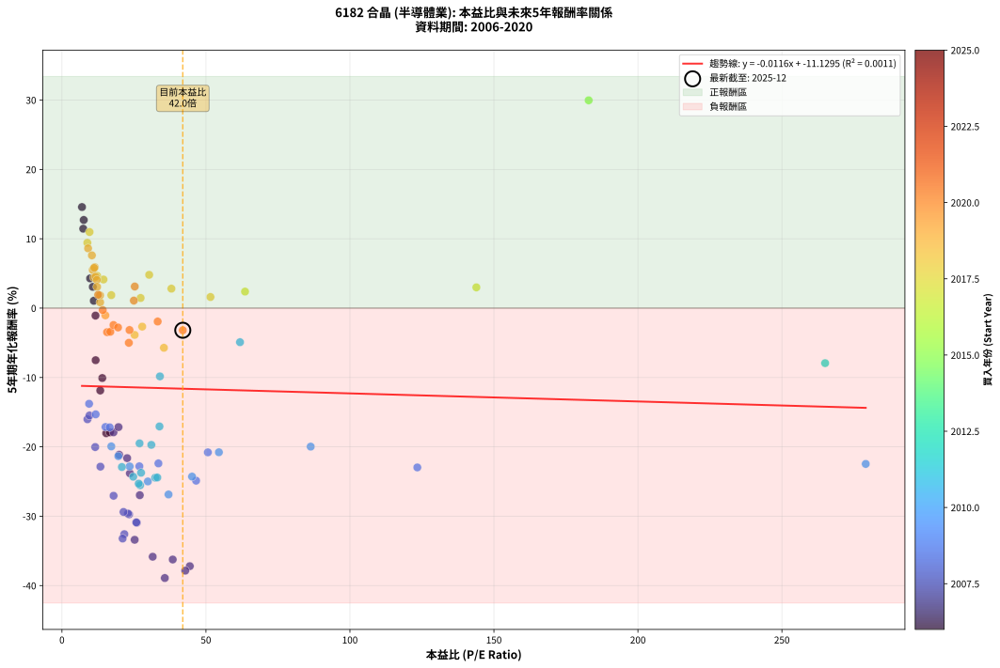
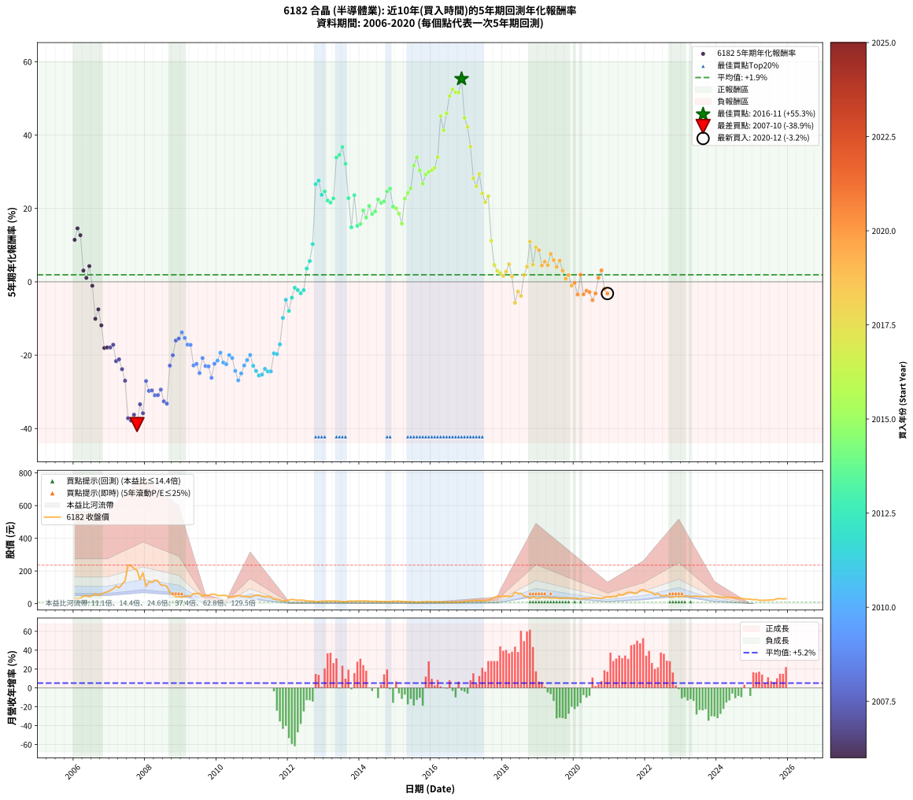

# 6182 合晶 - 本益比與未來報酬率分析

!!! info "報告資訊"
    - **股票代號**: 6182
    - **公司名稱**: 合晶
    - **產業別**: 半導體業
    - **分析期間**: 2006-2020 (180 個數據點)
    - **資料來源**: Type 12 (ShowMonthlyK_ChartFlow) 月收盤價與本益比
    - **報酬率口徑**: 含現金股利 (簡化: 年度合計，假設每年7/1入帳)
    - **報告生成時間**: 2026-01-04 08:51:05 CST

## 📈 視覺化圖表

### 圖表1: 本益比 vs 未來報酬率關係

*圖表1：6182 合晶 本益比與5年期未來報酬率關係 (2006-2020)*

### 圖表2: 歷年買入時點的5年期實際報酬率

*圖表2：6182 合晶 歷年買入時點的5年期實際報酬率 (2006-2020)*

## 📍 買點訊號說明

本報告提供兩種買點提示訊號（顯示於圖表2的股價子圖中）：

### ▲ 小綠色三角形（回測驗證）
- **計算方式**: 使用全部歷史資料計算本益比第25百分位數
- **用途**: 事後驗證，顯示歷史上哪些時點確實為低估區
- **限制**: 當下無法判斷，僅供回測參考
- **特性**: 後見之明（Look-Ahead Bias）

### ▲ 小橘色三角形（即時訊號）
- **計算方式**: 使用截至當月的過去5年資料計算本益比第25百分位數
- **用途**: 實際投資決策，當時即可判斷
- **優勢**: 可操作性強，符合實務需求
- **特性**: 無後見之明，滾動窗口計算

!!! tip "如何使用兩種訊號"
    - **綠色▲** 幫助理解歷史估值機會，驗證策略有效性
    - **橘色▲** 可作為實際買進參考，但仍需搭配基本面分析
    - 兩種訊號重疊時，表示即時判斷與事後驗證一致，信心度較高
    - 僅有綠色▲時，表示當時無法判斷（需要未來資料才能確認）
    - 僅有橘色▲時，表示即時判斷為買點，但事後可能不是最佳時機

## 📊 估值分析摘要

| 指標 | 數值 |
|:---:|:---:|
| **目前本益比** (2020-12) | **41.96 倍** |
| **歷史平均本益比** | 31.87 倍 |
| **估值水準** | 🔴 相對高估 |
| **預期5年年化報酬率** | **-11.62%** |
| **歷史平均報酬率** | +1.91% |
| **相關係數 (R²)** | 0.0011 |
| **趨勢線斜率** | -0.0116 |

!!! abstract "核心洞察"
    目前本益比顯著高於歷史平均，預期未來報酬率可能較低

    根據歷史數據回測，6182 合晶 在目前本益比 **42.0倍** 的估值水準下，
    預期未來5年年化報酬率約為 **-11.6%**。

    **重要提醒**: 本分析基於歷史數據統計，實際報酬率會受到公司基本面變化、產業趨勢、
    總體經濟環境等多重因素影響。R² = 0.00 表示本益比可解釋約 0.1% 的報酬率變異。

## 📈 歷史估值統計

### 最佳買點 (最高報酬率)

| 項目 | 數值 |
|:---:|:---:|
| 起始時間 | 2016-11 |
| 當時本益比 | nan 倍 |
| 起始價格 | 9.7 元 |
| 5年後價格 | 81.8 元 |
| **5年年化報酬率** | **+55.32%** |

### 最差買點 (最低報酬率)

| 項目 | 數值 |
|:---:|:---:|
| 起始時間 | 2007-10 |
| 當時本益比 | 35.72 倍 |
| 起始價格 | 204.5 元 |
| 5年後價格 | 11.6 元 |
| **5年年化報酬率** | **-38.91%** |

## 🎯 投資啟示

### 本益比與報酬率關係

趨勢線方程式: **y = -0.0116x + -11.1295**

!!! note "負相關"
    本益比與未來報酬率呈現負相關。較低的本益比通常帶來較高的未來報酬率，
    但相關性不算非常強。**估值仍是重要參考指標之一**。

### 估值區間建議

基於歷史數據分析:

- **🟢 低估區** (P/E < 25.5): 預期報酬率較高，可考慮增加持股
- **🟡 合理區** (P/E 25.5-38.2): 預期報酬率符合長期趨勢，正常持有
- **🔴 高估區** (P/E > 38.2): 預期報酬率較低，可考慮減碼或觀望

!!! danger "風險提示"
    - 過去表現不代表未來結果
    - 本分析假設公司基本面無重大結構性變化
    - 產業環境劇變可能使歷史規律失效
    - 應結合公司財報、產業趨勢、總體經濟等多重因素綜合判斷

!!! success "長期投資觀點"
    歷史數據顯示，在合理或低估的估值水準買入並長期持有，
    往往能獲得較佳的投資報酬。**耐心等待好價格**是價值投資的核心原則。

## 📊 數據品質

- **資料來源**: GoodInfo.tw Type 12 (ShowMonthlyK_ChartFlow)
- **資料頻率**: 月度收盤價與本益比
- **回測期間**: 2006-2020
- **數據點數量**: 180 個 (每個點代表一次5年期回測)

### 計算方法說明

1. **5年期年化報酬率**:
   - 對每個歷史時點，計算其後5年的實際投資報酬率
   - 期末價值(不含股利): 期末價格
   - 期末價值(含現金股利): 期末價格 + 持有期間內的現金股利合計 (簡化: 年度合計，假設每年7/1入帳)
   - 公式: 年化報酬率 = [(期末價值/期初價格)^(1/年數) - 1] × 100%

2. **本益比 (P/E Ratio)**:
   - 使用當時的月收盤價與EPS計算
   - 資料來源: Type 12 月度河流圖本益比數據

3. **趨勢線 (Linear Regression)**:
   - 使用最小平方法擬合線性趨勢線
   - R²值衡量本益比對報酬率的解釋能力

---

*本報告由 Stock Analysis System v1.9.0 自動生成*
*數據更新時間: 2026-01-04 08:51:05 CST*

## 📋 月度回測明細表

（每一列對應時間線圖中的一個買入點；可用來對照 SVG 圖上的每個點。）

| 買入月份 | 賣出月份 | 回測期限_年 | 實際持有年數 | 買入本益比_倍 | 買入收盤價_元 | 賣出收盤價_元 | 現金股利合計_元 | 總報酬率_pct | 年化報酬率_pct |
| --- | --- | --- | --- | --- | --- | --- | --- | --- | --- |
| 2006-01 | 2011-01 | 5 | 4.999 | 7.39 | 32.20 | 47.25 | 8.11 | +71.93 | +11.45 |
| 2006-02 | 2011-02 | 5 | 4.999 | 6.96 | 30.35 | 51.80 | 8.11 | +97.41 | +14.57 |
| 2006-03 | 2011-03 | 5 | 4.999 | 7.57 | 33.00 | 51.90 | 8.11 | +81.86 | +12.71 |
| 2006-04 | 2011-04 | 5 | 4.999 | 10.71 | 46.70 | 46.20 | 8.11 | +16.30 | +3.07 |
| 2006-05 | 2011-05 | 5 | 4.999 | 11.06 | 48.20 | 42.70 | 8.11 | +5.42 | +1.06 |
| 2006-06 | 2011-06 | 5 | 4.999 | 9.79 | 42.70 | 44.55 | 8.11 | +23.33 | +4.28 |
| 2006-07 | 2011-07 | 5 | 4.999 | 11.65 | 50.80 | 39.60 | 8.52 | -5.27 | -1.08 |
| 2006-08 | 2011-08 | 5 | 4.999 | 14.01 | 61.10 | 27.40 | 8.52 | -41.21 | -10.08 |
| 2006-09 | 2011-09 | 5 | 4.999 | 11.70 | 51.00 | 26.00 | 8.52 | -32.31 | -7.51 |
| 2006-10 | 2011-10 | 5 | 4.999 | 13.30 | 58.00 | 22.30 | 8.52 | -46.86 | -11.88 |
| 2006-11 | 2011-11 | 5 | 4.999 | 15.39 | 67.10 | 16.30 | 8.52 | -63.01 | -18.04 |
| 2006-12 | 2011-12 | 5 | 4.999 | 16.65 | 72.60 | 18.55 | 8.52 | -62.71 | -17.91 |
| 2007-01 | 2012-01 | 5 | 4.999 | 17.90 | 80.50 | 21.50 | 8.52 | -62.70 | -17.90 |
| 2007-02 | 2012-02 | 5 | 4.999 | 19.64 | 91.00 | 27.00 | 8.52 | -60.96 | -17.15 |
| 2007-03 | 2012-03 | 5 | 5.002 | 22.64 | 108.00 | 23.40 | 8.52 | -70.44 | -21.62 |
| 2007-04 | 2012-04 | 5 | 5.002 | 19.87 | 97.50 | 21.20 | 8.52 | -69.51 | -21.14 |
| 2007-05 | 2012-05 | 5 | 5.002 | 23.60 | 119.00 | 22.00 | 8.52 | -74.35 | -23.82 |
| 2007-06 | 2012-06 | 5 | 5.002 | 27.03 | 140.00 | 20.55 | 8.52 | -79.23 | -26.97 |
| 2007-07 | 2012-07 | 5 | 5.002 | 44.40 | 236.00 | 17.20 | 5.83 | -90.24 | -37.20 |
| 2007-08 | 2012-08 | 5 | 5.002 | 42.83 | 233.50 | 15.80 | 5.83 | -90.74 | -37.85 |
| 2007-09 | 2012-09 | 5 | 5.002 | 38.47 | 215.00 | 16.80 | 5.83 | -89.47 | -36.24 |
| 2007-10 | 2012-10 | 5 | 5.002 | 35.72 | 204.50 | 11.55 | 5.83 | -91.50 | -38.91 |
| 2007-11 | 2012-11 | 5 | 5.002 | 25.25 | 148.00 | 13.55 | 5.83 | -86.91 | -33.40 |
| 2007-12 | 2012-12 | 5 | 5.002 | 31.51 | 189.00 | 14.70 | 5.83 | -89.14 | -35.84 |
| 2008-01 | 2013-01 | 5 | 5.002 | 17.93 | 105.50 | 15.95 | 5.83 | -79.36 | -27.05 |
| 2008-02 | 2013-03 | 5 | 5.081 | 23.32 | 134.50 | 16.55 | 5.83 | -83.36 | -29.74 |
| 2008-03 | 2013-03 | 5 | 4.999 | 22.91 | 129.50 | 16.55 | 5.83 | -82.72 | -29.61 |
| 2008-04 | 2013-04 | 5 | 4.999 | 26.00 | 144.00 | 16.80 | 5.83 | -84.28 | -30.94 |
| 2008-05 | 2013-05 | 5 | 4.999 | 25.81 | 140.00 | 16.25 | 5.83 | -84.23 | -30.89 |
| 2008-06 | 2013-06 | 5 | 4.999 | 21.38 | 113.50 | 14.10 | 5.83 | -82.44 | -29.39 |
| 2008-07 | 2013-07 | 5 | 4.999 | 21.66 | 112.50 | 13.25 | 2.42 | -86.07 | -32.58 |
| 2008-08 | 2013-08 | 5 | 4.999 | 21.07 | 107.00 | 11.80 | 2.42 | -86.71 | -33.21 |
| 2008-09 | 2013-09 | 5 | 4.999 | 13.36 | 66.30 | 15.70 | 2.42 | -72.67 | -22.85 |
| 2008-10 | 2013-10 | 5 | 4.999 | 11.55 | 56.00 | 15.90 | 2.42 | -67.29 | -20.03 |
| 2008-11 | 2013-11 | 5 | 4.999 | 8.86 | 41.95 | 15.10 | 2.42 | -58.24 | -16.02 |
| 2008-12 | 2013-12 | 5 | 4.999 | 9.57 | 44.20 | 16.65 | 2.42 | -56.86 | -15.48 |
| 2009-01 | 2014-01 | 5 | 4.999 | 9.43 | 39.20 | 16.25 | 2.42 | -52.37 | -13.79 |
| 2009-02 | 2014-02 | 5 | 4.999 | 11.71 | 43.20 | 16.40 | 2.42 | -56.44 | -15.31 |
| 2009-03 | 2014-03 | 5 | 4.999 | 15.13 | 48.80 | 16.65 | 2.42 | -60.92 | -17.13 |
| 2009-04 | 2014-04 | 5 | 4.999 | 16.58 | 45.75 | 15.40 | 2.42 | -61.05 | -17.19 |
| 2009-05 | 2014-05 | 5 | 4.999 | 26.88 | 61.70 | 14.50 | 2.42 | -72.58 | -22.80 |
| 2009-06 | 2014-06 | 5 | 4.999 | 33.50 | 61.30 | 14.85 | 2.42 | -71.83 | -22.38 |
| 2009-07 | 2014-07 | 5 | 4.999 | 46.59 | 63.60 | 14.20 | 1.02 | -76.07 | -24.88 |
| 2009-08 | 2014-08 | 5 | 4.999 | 50.67 | 45.60 | 13.20 | 1.02 | -68.82 | -20.79 |
| 2009-09 | 2014-09 | 5 | 4.999 | 123.40 | 53.70 | 13.55 | 1.02 | -72.87 | -22.97 |
| 2009-10 | 2014-10 | 5 | 4.999 |  | 50.50 | 12.60 | 1.02 | -73.03 | -23.06 |
| 2009-11 | 2014-11 | 5 | 4.999 |  | 58.00 | 11.70 | 1.02 | -78.07 | -26.18 |
| 2009-12 | 2014-12 | 5 | 4.999 |  | 58.30 | 15.45 | 1.02 | -71.75 | -22.34 |
| 2010-01 | 2015-01 | 5 | 4.999 |  | 51.00 | 14.20 | 1.02 | -70.16 | -21.48 |
| 2010-02 | 2015-02 | 5 | 4.999 |  | 49.25 | 15.80 | 1.02 | -65.85 | -19.34 |
| 2010-03 | 2015-03 | 5 | 4.999 |  | 51.40 | 13.80 | 1.02 | -71.17 | -22.02 |
| 2010-04 | 2015-04 | 5 | 4.999 | 279.10 | 49.30 | 12.80 | 1.02 | -71.97 | -22.46 |
| 2010-05 | 2015-05 | 5 | 4.999 | 86.37 | 39.80 | 12.05 | 1.02 | -67.16 | -19.97 |
| 2010-06 | 2015-06 | 5 | 4.999 | 54.50 | 40.60 | 11.65 | 1.02 | -68.79 | -20.78 |
| 2010-07 | 2015-07 | 5 | 4.999 | 45.18 | 46.50 | 10.55 | 1.02 | -75.12 | -24.29 |
| 2010-08 | 2015-08 | 5 | 4.999 | 37.01 | 48.60 | 9.15 | 1.02 | -79.07 | -26.87 |
| 2010-09 | 2015-09 | 5 | 4.999 | 29.83 | 47.65 | 10.30 | 1.02 | -76.24 | -24.99 |
| 2010-10 | 2015-10 | 5 | 4.999 | 23.52 | 44.25 | 11.10 | 1.02 | -72.61 | -22.82 |
| 2010-11 | 2015-11 | 5 | 4.999 | 19.58 | 42.40 | 11.75 | 1.02 | -69.88 | -21.34 |
| 2010-12 | 2015-12 | 5 | 4.999 | 17.14 | 42.00 | 12.80 | 1.02 | -67.10 | -19.94 |
| 2011-01 | 2016-01 | 5 | 4.999 | 20.81 | 47.25 | 11.85 | 1.02 | -72.76 | -22.91 |
| 2011-02 | 2016-02 | 5 | 4.999 | 24.76 | 51.80 | 11.85 | 1.02 | -75.15 | -24.31 |
| 2011-03 | 2016-03 | 5 | 5.002 | 27.14 | 51.90 | 10.85 | 1.02 | -77.13 | -25.54 |
| 2011-04 | 2016-04 | 5 | 5.002 | 26.65 | 46.20 | 9.72 | 1.02 | -76.75 | -25.30 |
| 2011-05 | 2016-05 | 5 | 5.002 | 27.47 | 42.70 | 9.99 | 1.02 | -74.22 | -23.74 |
| 2011-06 | 2016-06 | 5 | 5.002 | 32.40 | 44.55 | 9.94 | 1.02 | -75.40 | -24.45 |
| 2011-07 | 2016-07 | 5 | 5.002 | 33.11 | 39.60 | 9.74 | 0.02 | -75.35 | -24.42 |
| 2011-08 | 2016-08 | 5 | 5.002 | 26.95 | 27.40 | 9.24 | 0.02 | -66.20 | -19.50 |
| 2011-09 | 2016-09 | 5 | 5.002 | 31.04 | 26.00 | 8.65 | 0.02 | -66.65 | -19.71 |
| 2011-10 | 2016-10 | 5 | 5.002 | 33.87 | 22.30 | 8.73 | 0.02 | -60.76 | -17.06 |
| 2011-11 | 2016-11 | 5 | 5.002 | 34.02 | 16.30 | 9.69 | 0.02 | -40.43 | -9.84 |
| 2011-12 | 2016-12 | 5 | 5.002 | 61.83 | 18.55 | 14.40 | 0.02 | -22.26 | -4.91 |
| 2012-01 | 2017-01 | 5 | 5.002 | 265.00 | 21.50 | 14.20 | 0.02 | -33.86 | -7.93 |
| 2012-02 | 2017-03 | 5 | 5.081 |  | 27.00 | 21.55 | 0.02 | -20.11 | -4.32 |
| 2012-03 | 2017-03 | 5 | 4.999 |  | 23.40 | 21.55 | 0.02 | -7.82 | -1.62 |
| 2012-04 | 2017-04 | 5 | 4.999 |  | 21.20 | 18.90 | 0.02 | -10.75 | -2.25 |
| 2012-05 | 2017-05 | 5 | 4.999 |  | 22.00 | 18.75 | 0.02 | -14.68 | -3.13 |
| 2012-06 | 2017-06 | 5 | 4.999 |  | 20.55 | 18.30 | 0.02 | -10.85 | -2.27 |
| 2012-07 | 2017-07 | 5 | 4.999 |  | 17.20 | 20.55 | 0.00 | +19.48 | +3.62 |
| 2012-08 | 2017-08 | 5 | 4.999 |  | 15.80 | 20.80 | 0.00 | +31.65 | +5.65 |
| 2012-09 | 2017-09 | 5 | 4.999 |  | 16.80 | 27.40 | 0.00 | +63.10 | +10.28 |
| 2012-10 | 2017-10 | 5 | 4.999 |  | 11.55 | 37.60 | 0.00 | +225.54 | +26.63 |
| 2012-11 | 2017-11 | 5 | 4.999 |  | 13.55 | 45.80 | 0.00 | +238.01 | +27.59 |
| 2012-12 | 2017-12 | 5 | 4.999 |  | 14.70 | 42.60 | 0.00 | +189.80 | +23.72 |
| 2013-01 | 2018-01 | 5 | 4.999 |  | 15.95 | 48.00 | 0.00 | +200.94 | +24.65 |
| 2013-02 | 2018-02 | 5 | 4.999 |  | 16.65 | 45.30 | 0.00 | +172.07 | +22.17 |
| 2013-03 | 2018-03 | 5 | 4.999 |  | 16.55 | 44.00 | 0.00 | +165.86 | +21.60 |
| 2013-04 | 2018-04 | 5 | 4.999 |  | 16.80 | 46.80 | 0.00 | +178.57 | +22.74 |
| 2013-05 | 2018-05 | 5 | 4.999 |  | 16.25 | 69.90 | 0.00 | +330.15 | +33.89 |
| 2013-06 | 2018-06 | 5 | 4.999 |  | 14.10 | 62.30 | 0.00 | +341.84 | +34.61 |
| 2013-07 | 2018-07 | 5 | 4.999 |  | 13.25 | 63.00 | 0.38 | +378.31 | +36.76 |
| 2013-08 | 2018-08 | 5 | 4.999 |  | 11.80 | 47.25 | 0.38 | +303.61 | +32.19 |
| 2013-09 | 2018-09 | 5 | 4.999 |  | 15.70 | 43.50 | 0.38 | +179.46 | +22.82 |
| 2013-10 | 2018-10 | 5 | 4.999 |  | 15.90 | 31.40 | 0.38 | +99.85 | +14.85 |
| 2013-11 | 2018-11 | 5 | 4.999 |  | 15.10 | 43.20 | 0.38 | +188.58 | +23.61 |
| 2013-12 | 2018-12 | 5 | 4.999 |  | 16.65 | 33.50 | 0.38 | +103.46 | +15.27 |
| 2014-01 | 2019-01 | 5 | 4.999 |  | 16.25 | 33.40 | 0.38 | +107.85 | +15.76 |
| 2014-02 | 2019-02 | 5 | 4.999 |  | 16.40 | 39.50 | 0.38 | +143.15 | +19.45 |
| 2014-03 | 2019-03 | 5 | 4.999 |  | 16.65 | 36.90 | 0.38 | +123.88 | +17.49 |
| 2014-04 | 2019-04 | 5 | 4.999 |  | 15.40 | 39.05 | 0.38 | +156.01 | +20.69 |
| 2014-05 | 2019-05 | 5 | 4.999 |  | 14.50 | 33.50 | 0.38 | +133.63 | +18.50 |
| 2014-06 | 2019-06 | 5 | 4.999 |  | 14.85 | 35.35 | 0.38 | +140.58 | +19.20 |
| 2014-07 | 2019-07 | 5 | 4.999 |  | 14.20 | 36.20 | 2.88 | +175.18 | +22.44 |
| 2014-08 | 2019-08 | 5 | 4.999 |  | 13.20 | 32.10 | 2.88 | +164.97 | +21.52 |
| 2014-09 | 2019-09 | 5 | 4.999 |  | 13.55 | 33.65 | 2.88 | +169.56 | +21.94 |
| 2014-10 | 2019-10 | 5 | 4.999 |  | 12.60 | 35.05 | 2.88 | +201.00 | +24.66 |
| 2014-11 | 2019-11 | 5 | 4.999 |  | 11.70 | 33.45 | 2.88 | +210.48 | +25.44 |
| 2014-12 | 2019-12 | 5 | 4.999 |  | 15.45 | 36.35 | 2.88 | +153.89 | +20.49 |
| 2015-01 | 2020-01 | 5 | 4.999 |  | 14.20 | 32.50 | 2.88 | +149.13 | +20.03 |
| 2015-02 | 2020-02 | 5 | 4.999 |  | 15.80 | 34.15 | 2.88 | +134.34 | +18.57 |
| 2015-03 | 2020-03 | 5 | 5.002 |  | 13.80 | 25.95 | 2.88 | +108.88 | +15.87 |
| 2015-04 | 2020-04 | 5 | 5.002 |  | 12.80 | 32.70 | 2.88 | +177.94 | +22.67 |
| 2015-05 | 2020-05 | 5 | 5.002 |  | 12.05 | 32.75 | 2.88 | +195.65 | +24.20 |
| 2015-06 | 2020-06 | 5 | 5.002 |  | 11.65 | 33.40 | 2.88 | +211.38 | +25.49 |
| 2015-07 | 2020-07 | 5 | 5.002 |  | 10.55 | 37.15 | 4.68 | +296.45 | +31.70 |
| 2015-08 | 2020-08 | 5 | 5.002 |  | 9.15 | 34.80 | 4.68 | +331.43 | +33.95 |
| 2015-09 | 2020-09 | 5 | 5.002 |  | 10.30 | 34.15 | 4.68 | +276.95 | +30.38 |
| 2015-10 | 2020-10 | 5 | 5.002 |  | 11.10 | 31.65 | 4.68 | +227.26 | +26.75 |
| 2015-11 | 2020-11 | 5 | 5.002 |  | 11.75 | 37.75 | 4.68 | +261.07 | +29.26 |
| 2015-12 | 2020-12 | 5 | 5.002 | 182.90 | 12.80 | 42.80 | 4.68 | +270.91 | +29.96 |
| 2016-01 | 2021-01 | 5 | 5.002 |  | 11.85 | 40.00 | 4.68 | +277.01 | +30.38 |
| 2016-02 | 2021-03 | 5 | 5.081 |  | 11.85 | 42.20 | 4.68 | +295.58 | +31.08 |
| 2016-03 | 2021-03 | 5 | 4.999 |  | 10.85 | 42.20 | 4.68 | +332.04 | +34.01 |
| 2016-04 | 2021-04 | 5 | 4.999 |  | 9.72 | 58.00 | 4.68 | +544.81 | +45.18 |
| 2016-05 | 2021-05 | 5 | 4.999 |  | 9.99 | 51.60 | 4.68 | +463.32 | +41.31 |
| 2016-06 | 2021-06 | 5 | 4.999 |  | 9.94 | 61.10 | 4.68 | +561.73 | +45.93 |
| 2016-07 | 2021-07 | 5 | 4.999 |  | 9.74 | 69.80 | 5.78 | +675.93 | +50.66 |
| 2016-08 | 2021-08 | 5 | 4.999 |  | 9.24 | 70.40 | 5.78 | +724.42 | +52.49 |
| 2016-09 | 2021-09 | 5 | 4.999 |  | 8.65 | 63.60 | 5.78 | +702.03 | +51.66 |
| 2016-10 | 2021-10 | 5 | 4.999 |  | 8.73 | 64.20 | 5.78 | +701.56 | +51.64 |
| 2016-11 | 2021-11 | 5 | 4.999 |  | 9.69 | 81.80 | 5.78 | +803.78 | +55.32 |
| 2016-12 | 2021-12 | 5 | 4.999 |  | 14.40 | 85.50 | 5.78 | +533.86 | +44.68 |
| 2017-01 | 2022-01 | 5 | 4.999 |  | 14.20 | 76.80 | 5.78 | +481.52 | +42.21 |
| 2017-02 | 2022-02 | 5 | 4.999 |  | 16.30 | 72.40 | 5.78 | +379.61 | +36.83 |
| 2017-03 | 2022-03 | 5 | 4.999 |  | 21.55 | 68.90 | 5.78 | +246.52 | +28.22 |
| 2017-04 | 2022-04 | 5 | 4.999 |  | 18.90 | 54.30 | 5.78 | +217.86 | +26.03 |
| 2017-05 | 2022-05 | 5 | 4.999 |  | 18.75 | 62.30 | 5.78 | +263.07 | +29.42 |
| 2017-06 | 2022-06 | 5 | 4.999 |  | 18.30 | 48.05 | 5.78 | +194.13 | +24.09 |
| 2017-07 | 2022-07 | 5 | 4.999 |  | 20.55 | 47.75 | 7.13 | +167.04 | +21.71 |
| 2017-08 | 2022-08 | 5 | 4.999 |  | 20.80 | 52.20 | 7.13 | +185.22 | +23.32 |
| 2017-09 | 2022-09 | 5 | 4.999 |  | 27.40 | 39.45 | 7.13 | +69.99 | +11.20 |
| 2017-10 | 2022-10 | 5 | 4.999 |  | 37.60 | 39.90 | 7.13 | +25.07 | +4.58 |
| 2017-11 | 2022-11 | 5 | 4.999 | 143.90 | 45.80 | 45.95 | 7.13 | +15.89 | +2.99 |
| 2017-12 | 2022-12 | 5 | 4.999 | 63.58 | 42.60 | 40.80 | 7.13 | +12.50 | +2.38 |
| 2018-01 | 2023-01 | 5 | 4.999 | 51.57 | 48.00 | 44.85 | 7.13 | +8.28 | +1.60 |
| 2018-02 | 2023-02 | 5 | 4.999 | 38.01 | 45.30 | 44.90 | 7.13 | +14.85 | +2.81 |
| 2018-03 | 2023-03 | 5 | 4.999 | 30.29 | 44.00 | 48.50 | 7.13 | +26.42 | +4.80 |
| 2018-04 | 2023-04 | 5 | 4.999 | 27.32 | 46.80 | 43.20 | 7.13 | +7.53 | +1.46 |
| 2018-05 | 2023-05 | 5 | 4.999 | 35.41 | 69.90 | 44.95 | 7.13 | -25.50 | -5.72 |
| 2018-06 | 2023-06 | 5 | 4.999 | 27.87 | 62.30 | 47.30 | 7.13 | -12.64 | -2.67 |
| 2018-07 | 2023-07 | 5 | 4.999 | 25.24 | 63.00 | 42.50 | 9.25 | -17.86 | -3.86 |
| 2018-08 | 2023-08 | 5 | 4.999 | 17.14 | 47.25 | 42.60 | 9.25 | +9.73 | +1.87 |
| 2018-09 | 2023-09 | 5 | 4.999 | 14.42 | 43.50 | 44.00 | 9.25 | +22.40 | +4.13 |
| 2018-10 | 2023-10 | 5 | 4.999 | 9.58 | 31.40 | 43.60 | 9.25 | +68.30 | +10.97 |
| 2018-11 | 2023-11 | 5 | 4.999 | 12.21 | 43.20 | 45.00 | 9.25 | +25.57 | +4.66 |
| 2018-12 | 2023-12 | 5 | 4.999 | 8.82 | 33.50 | 43.30 | 9.25 | +56.85 | +9.42 |
| 2019-01 | 2024-01 | 5 | 4.999 | 9.07 | 33.40 | 41.25 | 9.25 | +51.19 | +8.62 |
| 2019-02 | 2024-02 | 5 | 4.999 | 11.07 | 39.50 | 39.80 | 9.25 | +24.17 | +4.42 |
| 2019-03 | 2024-03 | 5 | 5.002 | 10.69 | 36.90 | 39.00 | 9.25 | +30.75 | +5.51 |
| 2019-04 | 2024-04 | 5 | 5.002 | 11.70 | 39.05 | 39.50 | 9.25 | +24.83 | +4.53 |
| 2019-05 | 2024-05 | 5 | 5.002 | 10.40 | 33.50 | 39.10 | 9.25 | +44.32 | +7.61 |
| 2019-06 | 2024-06 | 5 | 5.002 | 11.38 | 35.35 | 37.85 | 9.25 | +33.23 | +5.90 |
| 2019-07 | 2024-07 | 5 | 5.002 | 12.11 | 36.20 | 36.80 | 7.40 | +22.09 | +4.07 |
| 2019-08 | 2024-08 | 5 | 5.002 | 11.17 | 32.10 | 35.15 | 7.40 | +32.54 | +5.79 |
| 2019-09 | 2024-09 | 5 | 5.002 | 12.20 | 33.65 | 31.75 | 7.40 | +16.33 | +3.07 |
| 2019-10 | 2024-10 | 5 | 5.002 | 13.27 | 35.05 | 29.15 | 7.40 | +4.27 | +0.84 |
| 2019-11 | 2024-11 | 5 | 5.002 | 13.24 | 33.45 | 29.25 | 7.40 | +9.55 | +1.84 |
| 2019-12 | 2024-12 | 5 | 5.002 | 15.08 | 36.35 | 27.10 | 7.40 | -5.10 | -1.04 |
| 2020-01 | 2025-01 | 5 | 5.002 | 14.17 | 32.50 | 24.65 | 7.40 | -1.40 | -0.28 |
| 2020-02 | 2025-03 | 5 | 5.081 | 15.68 | 34.15 | 21.15 | 7.40 | -16.41 | -3.47 |
| 2020-03 | 2025-03 | 5 | 4.999 | 12.58 | 25.95 | 21.15 | 7.40 | +10.00 | +1.93 |
| 2020-04 | 2025-04 | 5 | 4.999 | 16.80 | 32.70 | 20.10 | 7.40 | -15.91 | -3.41 |
| 2020-05 | 2025-05 | 5 | 4.999 | 17.89 | 32.75 | 21.55 | 7.40 | -11.62 | -2.44 |
| 2020-06 | 2025-06 | 5 | 4.999 | 19.48 | 33.40 | 21.60 | 7.40 | -13.19 | -2.79 |
| 2020-07 | 2025-07 | 5 | 4.999 | 23.23 | 37.15 | 23.15 | 5.60 | -22.62 | -5.00 |
| 2020-08 | 2025-08 | 5 | 4.999 | 23.46 | 34.80 | 24.05 | 5.60 | -14.81 | -3.16 |
| 2020-09 | 2025-09 | 5 | 4.999 | 24.97 | 34.15 | 30.45 | 5.60 | +5.55 | +1.09 |
| 2020-10 | 2025-10 | 5 | 4.999 | 25.29 | 31.65 | 31.30 | 5.60 | +16.58 | +3.12 |
| 2020-11 | 2025-11 | 5 | 4.999 | 33.24 | 37.75 | 28.65 | 5.60 | -9.28 | -1.93 |
| 2020-12 | 2025-12 | 5 | 4.999 | 41.96 | 42.80 | 30.80 | 5.60 | -14.96 | -3.19 |
