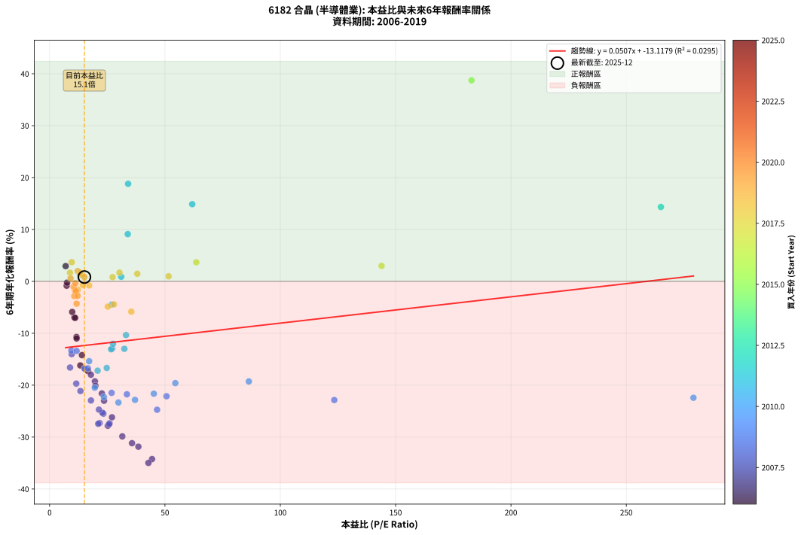
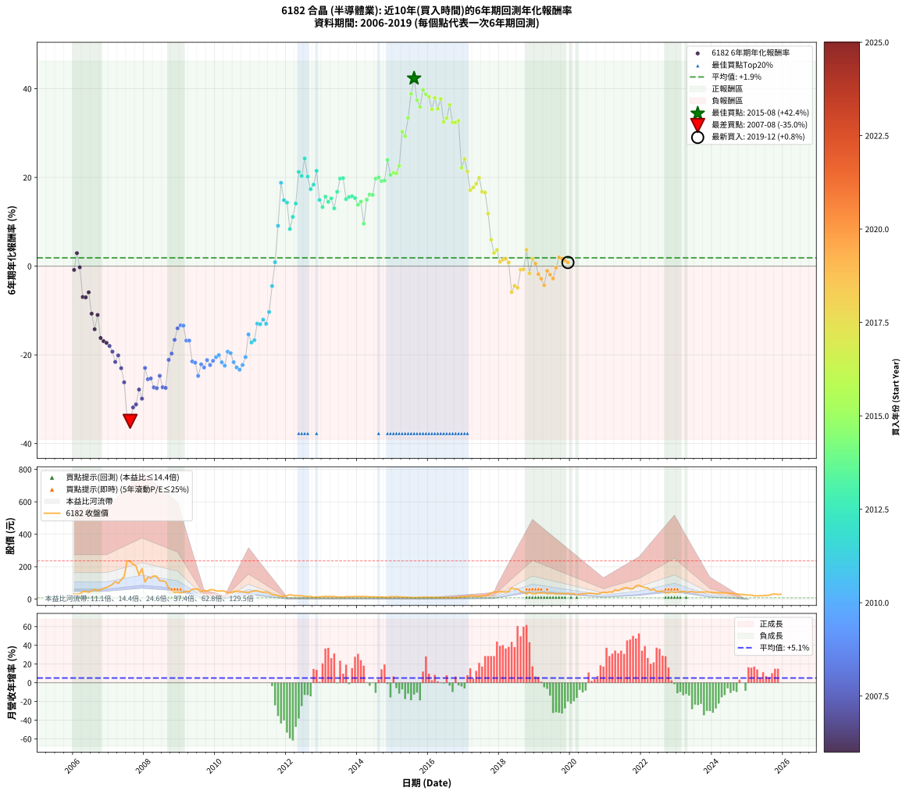

# 6182 合晶 - 本益比與未來報酬率分析

!!! info "報告資訊"
    - **股票代號**: 6182
    - **公司名稱**: 合晶
    - **產業別**: 半導體業
    - **分析期間**: 2006-2019 (168 個數據點)
    - **資料來源**: Type 12 (ShowMonthlyK_ChartFlow) 月收盤價與本益比
    - **報酬率口徑**: 含現金股利 (簡化: 年度合計，假設每年7/1入帳)
    - **報告生成時間**: 2026-01-10 21:13:55 CST

## 📈 視覺化圖表

### 圖表1: 本益比 vs 未來報酬率關係

*圖表1：6182 合晶 本益比與6年期未來報酬率關係 (2006-2019)*

### 圖表2: 歷年買入時點的6年期實際報酬率

*圖表2：6182 合晶 歷年買入時點的6年期實際報酬率 (2006-2019)*

## 📍 買點訊號說明

本報告提供兩種買點提示訊號（顯示於圖表2的股價子圖中）：

### ▲ 小綠色三角形（回測驗證）
- **計算方式**: 使用全部歷史資料計算本益比第25百分位數
- **用途**: 事後驗證，顯示歷史上哪些時點確實為低估區
- **限制**: 當下無法判斷，僅供回測參考
- **特性**: 後見之明（Look-Ahead Bias）

### ▲ 小橘色三角形（即時訊號）
- **計算方式**: 使用截至當月的過去5年資料計算本益比第25百分位數
- **用途**: 實際投資決策，當時即可判斷
- **優勢**: 可操作性強，符合實務需求
- **特性**: 無後見之明，滾動窗口計算

!!! tip "如何使用兩種訊號"
    - **綠色▲** 幫助理解歷史估值機會，驗證策略有效性
    - **橘色▲** 可作為實際買進參考，但仍需搭配基本面分析
    - 兩種訊號重疊時，表示即時判斷與事後驗證一致，信心度較高
    - 僅有綠色▲時，表示當時無法判斷（需要未來資料才能確認）
    - 僅有橘色▲時，表示即時判斷為買點，但事後可能不是最佳時機

## 📊 估值分析摘要

| 指標 | 數值 |
|:---:|:---:|
| **目前本益比** (2019-12) | **15.08 倍** |
| **歷史平均本益比** | 33.08 倍 |
| **估值水準** | 🟢 相對低估 |
| **預期6年年化報酬率** | **-12.35%** |
| **歷史平均報酬率** | +1.88% |
| **相關係數 (R²)** | 0.0295 |
| **趨勢線斜率** | 0.0507 |

!!! abstract "核心洞察"
    目前本益比顯著低於歷史平均，預期未來報酬率可能較高

    根據歷史數據回測，6182 合晶 在目前本益比 **15.1倍** 的估值水準下，
    預期未來6年年化報酬率約為 **-12.4%**。

    **重要提醒**: 本分析基於歷史數據統計，實際報酬率會受到公司基本面變化、產業趨勢、
    總體經濟環境等多重因素影響。R² = 0.03 表示本益比可解釋約 2.9% 的報酬率變異。

## 📈 歷史估值統計

### 最佳買點 (最高報酬率)

| 項目 | 數值 |
|:---:|:---:|
| 起始時間 | 2015-08 |
| 當時本益比 | nan 倍 |
| 起始價格 | 9.2 元 |
| 6年後價格 | 70.4 元 |
| **6年年化報酬率** | **+42.35%** |

### 最差買點 (最低報酬率)

| 項目 | 數值 |
|:---:|:---:|
| 起始時間 | 2007-08 |
| 當時本益比 | 42.83 倍 |
| 起始價格 | 233.5 元 |
| 6年後價格 | 11.8 元 |
| **6年年化報酬率** | **-34.98%** |

## 🎯 投資啟示

### 本益比與報酬率關係

趨勢線方程式: **y = 0.0507x + -13.1179**

!!! info "弱相關或正相關"
    本益比與未來報酬率相關性較弱。這可能表示該股票的報酬率更多受到
    公司成長性、產業趨勢等因素影響，而非估值水準。**需綜合考量多項指標**。

### 估值區間建議

基於歷史數據分析:

- **🟢 低估區** (P/E < 26.5): 預期報酬率較高，可考慮增加持股
- **🟡 合理區** (P/E 26.5-39.7): 預期報酬率符合長期趨勢，正常持有
- **🔴 高估區** (P/E > 39.7): 預期報酬率較低，可考慮減碼或觀望

!!! danger "風險提示"
    - 過去表現不代表未來結果
    - 本分析假設公司基本面無重大結構性變化
    - 產業環境劇變可能使歷史規律失效
    - 應結合公司財報、產業趨勢、總體經濟等多重因素綜合判斷

!!! success "長期投資觀點"
    歷史數據顯示，在合理或低估的估值水準買入並長期持有，
    往往能獲得較佳的投資報酬。**耐心等待好價格**是價值投資的核心原則。

## 📊 數據品質

- **資料來源**: GoodInfo.tw Type 12 (ShowMonthlyK_ChartFlow)
- **資料頻率**: 月度收盤價與本益比
- **回測期間**: 2006-2019
- **數據點數量**: 168 個 (每個點代表一次6年期回測)

### 計算方法說明

1. **6年期年化報酬率**:
   - 對每個歷史時點，計算其後6年的實際投資報酬率
   - 期末價值(不含股利): 期末價格
   - 期末價值(含現金股利): 期末價格 + 持有期間內的現金股利合計 (簡化: 年度合計，假設每年7/1入帳)
   - 公式: 年化報酬率 = [(期末價值/期初價格)^(1/年數) - 1] × 100%

2. **本益比 (P/E Ratio)**:
   - 使用當時的月收盤價與EPS計算
   - 資料來源: Type 12 月度河流圖本益比數據

3. **趨勢線 (Linear Regression)**:
   - 使用最小平方法擬合線性趨勢線
   - R²值衡量本益比對報酬率的解釋能力

---

*本報告由 Stock Analysis System v1.9.0 自動生成*
*數據更新時間: 2026-01-10 21:13:55 CST*

## 📋 月度回測明細表

（每一列對應時間線圖中的一個買入點；可用來對照 SVG 圖上的每個點。）

| 買入月份 | 賣出月份 | 回測期限_年 | 實際持有年數 | 買入本益比_倍 | 買入收盤價_元 | 賣出收盤價_元 | 現金股利合計_元 | 總報酬率_pct | 年化報酬率_pct |
| --- | --- | --- | --- | --- | --- | --- | --- | --- | --- |
| 2006-01 | 2012-01 | 6 | 5.999 | 7.39 | 32.20 | 21.50 | 9.11 | -4.93 | -0.84 |
| 2006-02 | 2012-02 | 6 | 5.999 | 6.96 | 30.35 | 27.00 | 9.11 | +18.99 | +2.94 |
| 2006-03 | 2012-03 | 6 | 6.001 | 7.57 | 33.00 | 23.40 | 9.11 | -1.48 | -0.25 |
| 2006-04 | 2012-04 | 6 | 6.001 | 10.71 | 46.70 | 21.20 | 9.11 | -35.09 | -6.95 |
| 2006-05 | 2012-05 | 6 | 6.001 | 11.06 | 48.20 | 22.00 | 9.11 | -35.45 | -7.03 |
| 2006-06 | 2012-06 | 6 | 6.001 | 9.79 | 42.70 | 20.55 | 9.11 | -30.53 | -5.89 |
| 2006-07 | 2012-07 | 6 | 6.001 | 11.65 | 50.80 | 17.20 | 8.54 | -49.32 | -10.71 |
| 2006-08 | 2012-08 | 6 | 6.001 | 14.01 | 61.10 | 15.80 | 8.54 | -60.16 | -14.22 |
| 2006-09 | 2012-09 | 6 | 6.001 | 11.70 | 51.00 | 16.80 | 8.54 | -50.31 | -11.00 |
| 2006-10 | 2012-10 | 6 | 6.001 | 13.30 | 58.00 | 11.55 | 8.54 | -65.36 | -16.19 |
| 2006-11 | 2012-11 | 6 | 6.001 | 15.39 | 67.10 | 13.55 | 8.54 | -67.07 | -16.90 |
| 2006-12 | 2012-12 | 6 | 6.001 | 16.65 | 72.60 | 14.70 | 8.54 | -67.98 | -17.29 |
| 2007-01 | 2013-01 | 6 | 6.001 | 17.90 | 80.50 | 15.95 | 8.54 | -69.57 | -17.98 |
| 2007-02 | 2013-02 | 6 | 6.001 | 19.64 | 91.00 | 16.65 | 8.54 | -72.32 | -19.27 |
| 2007-03 | 2013-03 | 6 | 6.001 | 22.64 | 108.00 | 16.55 | 8.54 | -76.77 | -21.59 |
| 2007-04 | 2013-04 | 6 | 6.001 | 19.87 | 97.50 | 16.80 | 8.54 | -74.01 | -20.11 |
| 2007-05 | 2013-05 | 6 | 6.001 | 23.60 | 119.00 | 16.25 | 8.54 | -79.17 | -23.00 |
| 2007-06 | 2013-06 | 6 | 6.001 | 27.03 | 140.00 | 14.10 | 8.54 | -83.83 | -26.18 |
| 2007-07 | 2013-07 | 6 | 6.001 | 44.40 | 236.00 | 13.25 | 5.83 | -91.92 | -34.24 |
| 2007-08 | 2013-08 | 6 | 6.001 | 42.83 | 233.50 | 11.80 | 5.83 | -92.45 | -34.98 |
| 2007-09 | 2013-09 | 6 | 6.001 | 38.47 | 215.00 | 15.70 | 5.83 | -89.99 | -31.85 |
| 2007-10 | 2013-10 | 6 | 6.001 | 35.72 | 204.50 | 15.90 | 5.83 | -89.37 | -31.17 |
| 2007-11 | 2013-11 | 6 | 6.001 | 25.25 | 148.00 | 15.10 | 5.83 | -85.86 | -27.81 |
| 2007-12 | 2013-12 | 6 | 6.001 | 31.51 | 189.00 | 16.65 | 5.83 | -88.11 | -29.87 |
| 2008-01 | 2014-01 | 6 | 6.001 | 17.93 | 105.50 | 16.25 | 5.83 | -79.07 | -22.94 |
| 2008-02 | 2014-03 | 6 | 6.081 | 23.32 | 134.50 | 16.65 | 5.83 | -83.29 | -25.49 |
| 2008-03 | 2014-03 | 6 | 5.999 | 22.91 | 129.50 | 16.65 | 5.83 | -82.64 | -25.32 |
| 2008-04 | 2014-04 | 6 | 5.999 | 26.00 | 144.00 | 15.40 | 5.83 | -85.26 | -27.32 |
| 2008-05 | 2014-05 | 6 | 5.999 | 25.81 | 140.00 | 14.50 | 5.83 | -85.48 | -27.51 |
| 2008-06 | 2014-06 | 6 | 5.999 | 21.38 | 113.50 | 14.85 | 5.83 | -81.78 | -24.71 |
| 2008-07 | 2014-07 | 6 | 5.999 | 21.66 | 112.50 | 14.20 | 2.42 | -85.23 | -27.30 |
| 2008-08 | 2014-08 | 6 | 5.999 | 21.07 | 107.00 | 13.20 | 2.42 | -85.40 | -27.44 |
| 2008-09 | 2014-09 | 6 | 5.999 | 13.36 | 66.30 | 13.55 | 2.42 | -75.91 | -21.12 |
| 2008-10 | 2014-10 | 6 | 5.999 | 11.55 | 56.00 | 12.60 | 2.42 | -73.18 | -19.70 |
| 2008-11 | 2014-11 | 6 | 5.999 | 8.86 | 41.95 | 11.70 | 2.42 | -66.34 | -16.60 |
| 2008-12 | 2014-12 | 6 | 5.999 | 9.57 | 44.20 | 15.45 | 2.42 | -59.57 | -14.01 |
| 2009-01 | 2015-01 | 6 | 5.999 | 9.43 | 39.20 | 14.20 | 2.42 | -57.60 | -13.33 |
| 2009-02 | 2015-02 | 6 | 5.999 | 11.71 | 43.20 | 15.80 | 2.42 | -57.82 | -13.40 |
| 2009-03 | 2015-03 | 6 | 5.999 | 15.13 | 48.80 | 13.80 | 2.42 | -66.76 | -16.78 |
| 2009-04 | 2015-04 | 6 | 5.999 | 16.58 | 45.75 | 12.80 | 2.42 | -66.73 | -16.76 |
| 2009-05 | 2015-05 | 6 | 5.999 | 26.88 | 61.70 | 12.05 | 2.42 | -76.55 | -21.48 |
| 2009-06 | 2015-06 | 6 | 5.999 | 33.50 | 61.30 | 11.65 | 2.42 | -77.05 | -21.76 |
| 2009-07 | 2015-07 | 6 | 5.999 | 46.59 | 63.60 | 10.55 | 1.02 | -81.81 | -24.73 |
| 2009-08 | 2015-08 | 6 | 5.999 | 50.67 | 45.60 | 9.15 | 1.02 | -77.70 | -22.13 |
| 2009-09 | 2015-09 | 6 | 5.999 | 123.40 | 53.70 | 10.30 | 1.02 | -78.92 | -22.86 |
| 2009-10 | 2015-10 | 6 | 5.999 |  | 50.50 | 11.10 | 1.02 | -76.00 | -21.17 |
| 2009-11 | 2015-11 | 6 | 5.999 |  | 58.00 | 11.75 | 1.02 | -77.98 | -22.30 |
| 2009-12 | 2015-12 | 6 | 5.999 |  | 58.30 | 12.80 | 1.02 | -76.30 | -21.33 |
| 2010-01 | 2016-01 | 6 | 5.999 |  | 51.00 | 11.85 | 1.02 | -74.76 | -20.51 |
| 2010-02 | 2016-02 | 6 | 5.999 |  | 49.25 | 11.85 | 1.02 | -73.87 | -20.05 |
| 2010-03 | 2016-03 | 6 | 6.001 |  | 51.40 | 10.85 | 1.02 | -76.91 | -21.67 |
| 2010-04 | 2016-04 | 6 | 6.001 | 279.10 | 49.30 | 9.72 | 1.02 | -78.22 | -22.43 |
| 2010-05 | 2016-05 | 6 | 6.001 | 86.37 | 39.80 | 9.99 | 1.02 | -72.34 | -19.28 |
| 2010-06 | 2016-06 | 6 | 6.001 | 54.50 | 40.60 | 9.94 | 1.02 | -73.00 | -19.60 |
| 2010-07 | 2016-07 | 6 | 6.001 | 45.18 | 46.50 | 9.74 | 1.02 | -76.86 | -21.64 |
| 2010-08 | 2016-08 | 6 | 6.001 | 37.01 | 48.60 | 9.24 | 1.02 | -78.89 | -22.83 |
| 2010-09 | 2016-09 | 6 | 6.001 | 29.83 | 47.65 | 8.65 | 1.02 | -79.71 | -23.34 |
| 2010-10 | 2016-10 | 6 | 6.001 | 23.52 | 44.25 | 8.73 | 1.02 | -77.97 | -22.28 |
| 2010-11 | 2016-11 | 6 | 6.001 | 19.58 | 42.40 | 9.69 | 1.02 | -74.74 | -20.49 |
| 2010-12 | 2016-12 | 6 | 6.001 | 17.14 | 42.00 | 14.40 | 1.02 | -63.29 | -15.38 |
| 2011-01 | 2017-01 | 6 | 6.001 | 20.81 | 47.25 | 14.20 | 1.02 | -67.79 | -17.20 |
| 2011-02 | 2017-02 | 6 | 6.001 | 24.76 | 51.80 | 16.30 | 1.02 | -66.56 | -16.69 |
| 2011-03 | 2017-03 | 6 | 6.001 | 27.14 | 51.90 | 21.55 | 1.02 | -56.51 | -12.96 |
| 2011-04 | 2017-04 | 6 | 6.001 | 26.65 | 46.20 | 18.90 | 1.02 | -56.88 | -13.08 |
| 2011-05 | 2017-05 | 6 | 6.001 | 27.47 | 42.70 | 18.75 | 1.02 | -53.70 | -12.04 |
| 2011-06 | 2017-06 | 6 | 6.001 | 32.40 | 44.55 | 18.30 | 1.02 | -56.63 | -13.00 |
| 2011-07 | 2017-07 | 6 | 6.001 | 33.11 | 39.60 | 20.55 | 0.02 | -48.06 | -10.34 |
| 2011-08 | 2017-08 | 6 | 6.001 | 26.95 | 27.40 | 20.80 | 0.02 | -24.01 | -4.47 |
| 2011-09 | 2017-09 | 6 | 6.001 | 31.04 | 26.00 | 27.40 | 0.02 | +5.46 | +0.89 |
| 2011-10 | 2017-10 | 6 | 6.001 | 33.87 | 22.30 | 37.60 | 0.02 | +68.70 | +9.10 |
| 2011-11 | 2017-11 | 6 | 6.001 | 34.02 | 16.30 | 45.80 | 0.02 | +181.10 | +18.79 |
| 2011-12 | 2017-12 | 6 | 6.001 | 61.83 | 18.55 | 42.60 | 0.02 | +129.76 | +14.87 |
| 2012-01 | 2018-01 | 6 | 6.001 | 265.00 | 21.50 | 48.00 | 0.02 | +123.35 | +14.33 |
| 2012-02 | 2018-03 | 6 | 6.081 |  | 27.00 | 44.00 | 0.02 | +63.04 | +8.37 |
| 2012-03 | 2018-03 | 6 | 5.999 |  | 23.40 | 44.00 | 0.02 | +88.12 | +11.11 |
| 2012-04 | 2018-04 | 6 | 5.999 |  | 21.20 | 46.80 | 0.02 | +120.85 | +14.12 |
| 2012-05 | 2018-05 | 6 | 5.999 |  | 22.00 | 69.90 | 0.02 | +217.82 | +21.26 |
| 2012-06 | 2018-06 | 6 | 5.999 |  | 20.55 | 62.30 | 0.02 | +203.26 | +20.32 |
| 2012-07 | 2018-07 | 6 | 5.999 |  | 17.20 | 63.00 | 0.38 | +268.47 | +24.29 |
| 2012-08 | 2018-08 | 6 | 5.999 |  | 15.80 | 47.25 | 0.38 | +201.43 | +20.19 |
| 2012-09 | 2018-09 | 6 | 5.999 |  | 16.80 | 43.50 | 0.38 | +161.17 | +17.36 |
| 2012-10 | 2018-10 | 6 | 5.999 |  | 11.55 | 31.40 | 0.38 | +175.12 | +18.38 |
| 2012-11 | 2018-11 | 6 | 5.999 |  | 13.55 | 43.20 | 0.38 | +221.59 | +21.50 |
| 2012-12 | 2018-12 | 6 | 5.999 |  | 14.70 | 33.50 | 0.38 | +130.45 | +14.93 |
| 2013-01 | 2019-01 | 6 | 5.999 |  | 15.95 | 33.40 | 0.38 | +111.76 | +13.32 |
| 2013-02 | 2019-02 | 6 | 5.999 |  | 16.65 | 39.50 | 0.38 | +139.50 | +15.67 |
| 2013-03 | 2019-03 | 6 | 5.999 |  | 16.55 | 36.90 | 0.38 | +125.23 | +14.49 |
| 2013-04 | 2019-04 | 6 | 5.999 |  | 16.80 | 39.05 | 0.38 | +134.68 | +15.28 |
| 2013-05 | 2019-05 | 6 | 5.999 |  | 16.25 | 33.50 | 0.38 | +108.47 | +13.03 |
| 2013-06 | 2019-06 | 6 | 5.999 |  | 14.10 | 35.35 | 0.38 | +153.38 | +16.76 |
| 2013-07 | 2019-07 | 6 | 5.999 |  | 13.25 | 36.20 | 2.88 | +194.91 | +19.76 |
| 2013-08 | 2019-08 | 6 | 5.999 |  | 11.80 | 32.10 | 2.88 | +196.41 | +19.86 |
| 2013-09 | 2019-09 | 6 | 5.999 |  | 15.70 | 33.65 | 2.88 | +132.65 | +15.11 |
| 2013-10 | 2019-10 | 6 | 5.999 |  | 15.90 | 35.05 | 2.88 | +138.53 | +15.59 |
| 2013-11 | 2019-11 | 6 | 5.999 |  | 15.10 | 33.45 | 2.88 | +140.57 | +15.76 |
| 2013-12 | 2019-12 | 6 | 5.999 |  | 16.65 | 36.35 | 2.88 | +135.59 | +15.36 |
| 2014-01 | 2020-01 | 6 | 5.999 |  | 16.25 | 32.50 | 2.88 | +117.70 | +13.85 |
| 2014-02 | 2020-02 | 6 | 5.999 |  | 16.40 | 34.15 | 2.88 | +125.77 | +14.54 |
| 2014-03 | 2020-03 | 6 | 6.001 |  | 16.65 | 25.95 | 2.88 | +73.13 | +9.58 |
| 2014-04 | 2020-04 | 6 | 6.001 |  | 15.40 | 32.70 | 2.88 | +131.01 | +14.97 |
| 2014-05 | 2020-05 | 6 | 6.001 |  | 14.50 | 32.75 | 2.88 | +145.70 | +16.16 |
| 2014-06 | 2020-06 | 6 | 6.001 |  | 14.85 | 33.40 | 2.88 | +144.28 | +16.05 |
| 2014-07 | 2020-07 | 6 | 6.001 |  | 14.20 | 37.15 | 4.68 | +194.55 | +19.72 |
| 2014-08 | 2020-08 | 6 | 6.001 |  | 13.20 | 34.80 | 4.68 | +199.06 | +20.03 |
| 2014-09 | 2020-09 | 6 | 6.001 |  | 13.55 | 34.15 | 4.68 | +186.54 | +19.17 |
| 2014-10 | 2020-10 | 6 | 6.001 |  | 12.60 | 31.65 | 4.68 | +188.30 | +19.30 |
| 2014-11 | 2020-11 | 6 | 6.001 |  | 11.70 | 37.75 | 4.68 | +262.62 | +23.94 |
| 2014-12 | 2020-12 | 6 | 6.001 |  | 15.45 | 42.80 | 4.68 | +207.29 | +20.57 |
| 2015-01 | 2021-01 | 6 | 6.001 |  | 14.20 | 40.00 | 4.68 | +214.62 | +21.04 |
| 2015-02 | 2021-02 | 6 | 6.001 |  | 15.80 | 44.80 | 4.68 | +213.14 | +20.95 |
| 2015-03 | 2021-03 | 6 | 6.001 |  | 13.80 | 42.20 | 4.68 | +239.68 | +22.60 |
| 2015-04 | 2021-04 | 6 | 6.001 |  | 12.80 | 58.00 | 4.68 | +389.66 | +30.30 |
| 2015-05 | 2021-05 | 6 | 6.001 |  | 12.05 | 51.60 | 4.68 | +367.02 | +29.28 |
| 2015-06 | 2021-06 | 6 | 6.001 |  | 11.65 | 61.10 | 4.68 | +464.60 | +33.43 |
| 2015-07 | 2021-07 | 6 | 6.001 |  | 10.55 | 69.80 | 5.78 | +616.36 | +38.83 |
| 2015-08 | 2021-08 | 6 | 6.001 |  | 9.15 | 70.40 | 5.78 | +732.52 | +42.35 |
| 2015-09 | 2021-09 | 6 | 6.001 |  | 10.30 | 63.60 | 5.78 | +573.55 | +37.41 |
| 2015-10 | 2021-10 | 6 | 6.001 |  | 11.10 | 64.20 | 5.78 | +530.41 | +35.91 |
| 2015-11 | 2021-11 | 6 | 6.001 |  | 11.75 | 81.80 | 5.78 | +645.33 | +39.75 |
| 2015-12 | 2021-12 | 6 | 6.001 | 182.90 | 12.80 | 85.50 | 5.78 | +613.09 | +38.73 |
| 2016-01 | 2022-01 | 6 | 6.001 |  | 11.85 | 76.80 | 5.78 | +596.84 | +38.19 |
| 2016-02 | 2022-03 | 6 | 6.081 |  | 11.85 | 68.90 | 5.78 | +530.18 | +35.35 |
| 2016-03 | 2022-03 | 6 | 5.999 |  | 10.85 | 68.90 | 5.78 | +588.26 | +37.93 |
| 2016-04 | 2022-04 | 6 | 5.999 |  | 9.72 | 54.30 | 5.78 | +518.07 | +35.48 |
| 2016-05 | 2022-05 | 6 | 5.999 |  | 9.99 | 62.30 | 5.78 | +581.44 | +37.70 |
| 2016-06 | 2022-06 | 6 | 5.999 |  | 9.94 | 48.05 | 5.78 | +441.51 | +32.52 |
| 2016-07 | 2022-07 | 6 | 5.999 |  | 9.74 | 47.75 | 7.13 | +463.41 | +33.40 |
| 2016-08 | 2022-08 | 6 | 5.999 |  | 9.24 | 52.20 | 7.13 | +542.06 | +36.34 |
| 2016-09 | 2022-09 | 6 | 5.999 |  | 8.65 | 39.45 | 7.13 | +438.45 | +32.40 |
| 2016-10 | 2022-10 | 6 | 5.999 |  | 8.73 | 39.90 | 7.13 | +438.67 | +32.41 |
| 2016-11 | 2022-11 | 6 | 5.999 |  | 9.69 | 45.95 | 7.13 | +447.74 | +32.78 |
| 2016-12 | 2022-12 | 6 | 5.999 |  | 14.40 | 40.80 | 7.13 | +232.82 | +22.20 |
| 2017-01 | 2023-01 | 6 | 5.999 |  | 14.20 | 44.85 | 7.13 | +266.03 | +24.15 |
| 2017-02 | 2023-02 | 6 | 5.999 |  | 16.30 | 44.90 | 7.13 | +219.18 | +21.35 |
| 2017-03 | 2023-03 | 6 | 5.999 |  | 21.55 | 48.50 | 7.13 | +158.13 | +17.13 |
| 2017-04 | 2023-04 | 6 | 5.999 |  | 18.90 | 43.20 | 7.13 | +166.28 | +17.73 |
| 2017-05 | 2023-05 | 6 | 5.999 |  | 18.75 | 44.95 | 7.13 | +177.74 | +18.56 |
| 2017-06 | 2023-06 | 6 | 5.999 |  | 18.30 | 47.30 | 7.13 | +197.41 | +19.93 |
| 2017-07 | 2023-07 | 6 | 5.999 |  | 20.55 | 42.50 | 9.62 | +153.64 | +16.78 |
| 2017-08 | 2023-08 | 6 | 5.999 |  | 20.80 | 42.60 | 9.62 | +151.07 | +16.59 |
| 2017-09 | 2023-09 | 6 | 5.999 |  | 27.40 | 44.00 | 9.62 | +95.70 | +11.84 |
| 2017-10 | 2023-10 | 6 | 5.999 |  | 37.60 | 43.60 | 9.62 | +41.55 | +5.96 |
| 2017-11 | 2023-11 | 6 | 5.999 | 143.90 | 45.80 | 45.00 | 9.62 | +19.26 | +2.98 |
| 2017-12 | 2023-12 | 6 | 5.999 | 63.58 | 42.60 | 43.30 | 9.62 | +24.23 | +3.68 |
| 2018-01 | 2024-01 | 6 | 5.999 | 51.57 | 48.00 | 41.25 | 9.62 | +5.98 | +0.97 |
| 2018-02 | 2024-02 | 6 | 5.999 | 38.01 | 45.30 | 39.80 | 9.62 | +9.10 | +1.46 |
| 2018-03 | 2024-03 | 6 | 6.001 | 30.29 | 44.00 | 39.00 | 9.62 | +10.50 | +1.68 |
| 2018-04 | 2024-04 | 6 | 6.001 | 27.32 | 46.80 | 39.50 | 9.62 | +4.96 | +0.81 |
| 2018-05 | 2024-05 | 6 | 6.001 | 35.41 | 69.90 | 39.10 | 9.62 | -30.30 | -5.84 |
| 2018-06 | 2024-06 | 6 | 6.001 | 27.87 | 62.30 | 37.85 | 9.62 | -23.80 | -4.43 |
| 2018-07 | 2024-07 | 6 | 6.001 | 25.24 | 63.00 | 36.80 | 9.90 | -25.88 | -4.87 |
| 2018-08 | 2024-08 | 6 | 6.001 | 17.14 | 47.25 | 35.15 | 9.90 | -4.66 | -0.79 |
| 2018-09 | 2024-09 | 6 | 6.001 | 14.42 | 43.50 | 31.75 | 9.90 | -4.26 | -0.72 |
| 2018-10 | 2024-10 | 6 | 6.001 | 9.58 | 31.40 | 29.15 | 9.90 | +24.35 | +3.70 |
| 2018-11 | 2024-11 | 6 | 6.001 | 12.21 | 43.20 | 29.25 | 9.90 | -9.38 | -1.63 |
| 2018-12 | 2024-12 | 6 | 6.001 | 8.82 | 33.50 | 27.10 | 9.90 | +10.44 | +1.67 |
| 2019-01 | 2025-01 | 6 | 6.001 | 9.07 | 33.40 | 24.65 | 9.90 | +3.43 | +0.56 |
| 2019-02 | 2025-02 | 6 | 6.001 | 11.07 | 39.50 | 25.55 | 9.90 | -10.26 | -1.79 |
| 2019-03 | 2025-03 | 6 | 6.001 | 10.69 | 36.90 | 21.15 | 9.90 | -15.86 | -2.84 |
| 2019-04 | 2025-04 | 6 | 6.001 | 11.70 | 39.05 | 20.10 | 9.90 | -23.19 | -4.30 |
| 2019-05 | 2025-05 | 6 | 6.001 | 10.40 | 33.50 | 21.55 | 9.90 | -6.13 | -1.05 |
| 2019-06 | 2025-06 | 6 | 6.001 | 11.38 | 35.35 | 21.60 | 9.90 | -10.90 | -1.91 |
| 2019-07 | 2025-07 | 6 | 6.001 | 12.11 | 36.20 | 23.15 | 7.40 | -15.62 | -2.79 |
| 2019-08 | 2025-08 | 6 | 6.001 | 11.17 | 32.10 | 24.05 | 7.40 | -2.04 | -0.34 |
| 2019-09 | 2025-09 | 6 | 6.001 | 12.20 | 33.65 | 30.45 | 7.40 | +12.47 | +1.98 |
| 2019-10 | 2025-10 | 6 | 6.001 | 13.27 | 35.05 | 31.30 | 7.40 | +10.40 | +1.66 |
| 2019-11 | 2025-11 | 6 | 6.001 | 13.24 | 33.45 | 28.65 | 7.40 | +7.76 | +1.25 |
| 2019-12 | 2025-12 | 6 | 6.001 | 15.08 | 36.35 | 30.80 | 7.40 | +5.08 | +0.83 |
