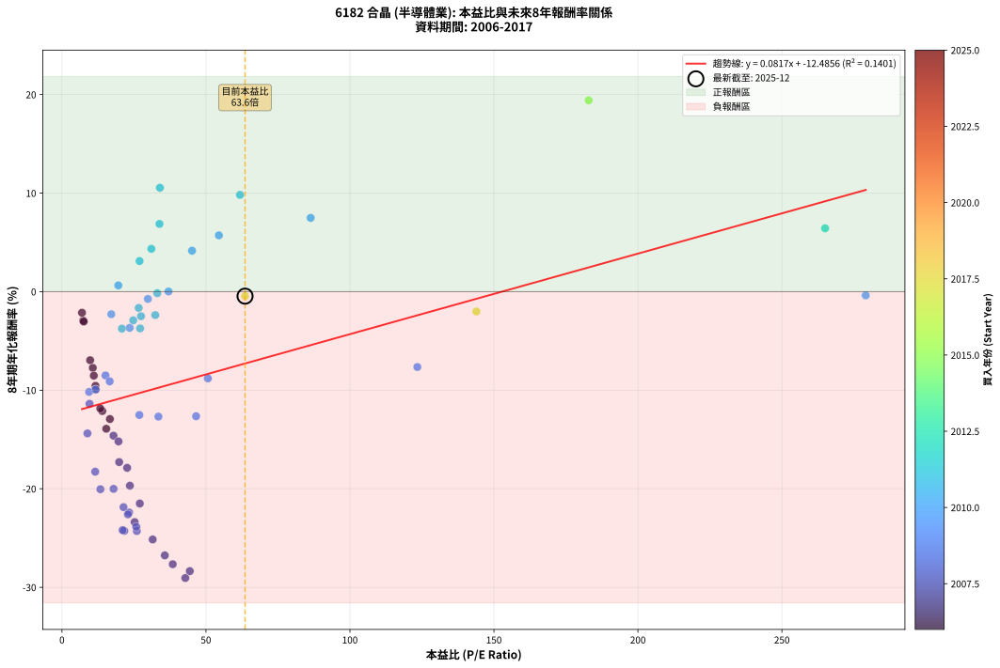
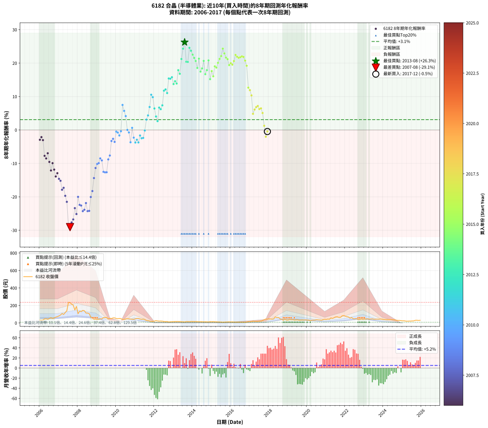

# 6182 合晶 - 本益比與未來報酬率分析

!!! info "報告資訊"
    - **股票代號**: 6182
    - **公司名稱**: 合晶
    - **產業別**: 半導體業
    - **分析期間**: 2006-2017 (144 個數據點)
    - **資料來源**: Type 12 (ShowMonthlyK_ChartFlow) 月收盤價與本益比
    - **報酬率口徑**: 含現金股利 (簡化: 年度合計，假設每年7/1入帳)
    - **報告生成時間**: 2026-01-11 21:15:34 CST

## 📈 視覺化圖表

### 圖表1: 本益比 vs 未來報酬率關係

*圖表1：6182 合晶 本益比與8年期未來報酬率關係 (2006-2017)*

### 圖表2: 歷年買入時點的8年期實際報酬率

*圖表2：6182 合晶 歷年買入時點的8年期實際報酬率 (2006-2017)*

## 📍 買點訊號說明

本報告提供兩種買點提示訊號（顯示於圖表2的股價子圖中）：

### ▲ 小綠色三角形（回測驗證）
- **計算方式**: 使用全部歷史資料計算本益比第25百分位數
- **用途**: 事後驗證，顯示歷史上哪些時點確實為低估區
- **限制**: 當下無法判斷，僅供回測參考
- **特性**: 後見之明（Look-Ahead Bias）

### ▲ 小橘色三角形（即時訊號）
- **計算方式**: 使用截至當月的過去5年資料計算本益比第25百分位數
- **用途**: 實際投資決策，當時即可判斷
- **優勢**: 可操作性強，符合實務需求
- **特性**: 無後見之明，滾動窗口計算

!!! tip "如何使用兩種訊號"
    - **綠色▲** 幫助理解歷史估值機會，驗證策略有效性
    - **橘色▲** 可作為實際買進參考，但仍需搭配基本面分析
    - 兩種訊號重疊時，表示即時判斷與事後驗證一致，信心度較高
    - 僅有綠色▲時，表示當時無法判斷（需要未來資料才能確認）
    - 僅有橘色▲時，表示即時判斷為買點，但事後可能不是最佳時機

## 📊 估值分析摘要

| 指標 | 數值 |
|:---:|:---:|
| **目前本益比** (2017-12) | **63.58 倍** |
| **歷史平均本益比** | 38.14 倍 |
| **估值水準** | 🔴 相對高估 |
| **預期8年年化報酬率** | **-7.29%** |
| **歷史平均報酬率** | +3.09% |
| **相關係數 (R²)** | 0.1401 |
| **趨勢線斜率** | 0.0817 |

!!! abstract "核心洞察"
    目前本益比顯著高於歷史平均，預期未來報酬率可能較低

    根據歷史數據回測，6182 合晶 在目前本益比 **63.6倍** 的估值水準下，
    預期未來8年年化報酬率約為 **-7.3%**。

    **重要提醒**: 本分析基於歷史數據統計，實際報酬率會受到公司基本面變化、產業趨勢、
    總體經濟環境等多重因素影響。R² = 0.14 表示本益比可解釋約 14.0% 的報酬率變異。

## 📈 歷史估值統計

### 最佳買點 (最高報酬率)

| 項目 | 數值 |
|:---:|:---:|
| 起始時間 | 2013-08 |
| 當時本益比 | nan 倍 |
| 起始價格 | 11.8 元 |
| 8年後價格 | 70.4 元 |
| **8年年化報酬率** | **+26.25%** |

### 最差買點 (最低報酬率)

| 項目 | 數值 |
|:---:|:---:|
| 起始時間 | 2007-08 |
| 當時本益比 | 42.83 倍 |
| 起始價格 | 233.5 元 |
| 8年後價格 | 9.2 元 |
| **8年年化報酬率** | **-29.06%** |

## 🎯 投資啟示

### 本益比與報酬率關係

趨勢線方程式: **y = 0.0817x + -12.4856**

!!! info "弱相關或正相關"
    本益比與未來報酬率相關性較弱。這可能表示該股票的報酬率更多受到
    公司成長性、產業趨勢等因素影響，而非估值水準。**需綜合考量多項指標**。

### 估值區間建議

基於歷史數據分析:

- **🟢 低估區** (P/E < 30.5): 預期報酬率較高，可考慮增加持股
- **🟡 合理區** (P/E 30.5-45.8): 預期報酬率符合長期趨勢，正常持有
- **🔴 高估區** (P/E > 45.8): 預期報酬率較低，可考慮減碼或觀望

!!! danger "風險提示"
    - 過去表現不代表未來結果
    - 本分析假設公司基本面無重大結構性變化
    - 產業環境劇變可能使歷史規律失效
    - 應結合公司財報、產業趨勢、總體經濟等多重因素綜合判斷

!!! success "長期投資觀點"
    歷史數據顯示，在合理或低估的估值水準買入並長期持有，
    往往能獲得較佳的投資報酬。**耐心等待好價格**是價值投資的核心原則。

## 📊 數據品質

- **資料來源**: GoodInfo.tw Type 12 (ShowMonthlyK_ChartFlow)
- **資料頻率**: 月度收盤價與本益比
- **回測期間**: 2006-2017
- **數據點數量**: 144 個 (每個點代表一次8年期回測)

### 計算方法說明

1. **8年期年化報酬率**:
   - 對每個歷史時點，計算其後8年的實際投資報酬率
   - 期末價值(不含股利): 期末價格
   - 期末價值(含現金股利): 期末價格 + 持有期間內的現金股利合計 (簡化: 年度合計，假設每年7/1入帳)
   - 公式: 年化報酬率 = [(期末價值/期初價格)^(1/年數) - 1] × 100%

2. **本益比 (P/E Ratio)**:
   - 使用當時的月收盤價與EPS計算
   - 資料來源: Type 12 月度河流圖本益比數據

3. **趨勢線 (Linear Regression)**:
   - 使用最小平方法擬合線性趨勢線
   - R²值衡量本益比對報酬率的解釋能力

---

*本報告由 Stock Analysis System v1.9.0 自動生成*
*數據更新時間: 2026-01-11 21:15:34 CST*

## 📋 月度回測明細表

（每一列對應時間線圖中的一個買入點；可用來對照 SVG 圖上的每個點。）

| 買入月份 | 賣出月份 | 回測期限_年 | 實際持有年數 | 買入本益比_倍 | 買入收盤價_元 | 賣出收盤價_元 | 現金股利合計_元 | 總報酬率_pct | 年化報酬率_pct |
| --- | --- | --- | --- | --- | --- | --- | --- | --- | --- |
| 2006-01 | 2014-01 | 8 | 8.000 | 7.39 | 32.20 | 16.25 | 9.13 | -21.17 | -2.93 |
| 2006-02 | 2014-02 | 8 | 8.000 | 6.96 | 30.35 | 16.40 | 9.13 | -15.87 | -2.14 |
| 2006-03 | 2014-03 | 8 | 8.000 | 7.57 | 33.00 | 16.65 | 9.13 | -21.87 | -3.04 |
| 2006-04 | 2014-04 | 8 | 8.000 | 10.71 | 46.70 | 15.40 | 9.13 | -47.47 | -7.73 |
| 2006-05 | 2014-05 | 8 | 8.000 | 11.06 | 48.20 | 14.50 | 9.13 | -50.97 | -8.52 |
| 2006-06 | 2014-06 | 8 | 8.000 | 9.79 | 42.70 | 14.85 | 9.13 | -43.83 | -6.96 |
| 2006-07 | 2014-07 | 8 | 8.000 | 11.65 | 50.80 | 14.20 | 8.54 | -55.23 | -9.56 |
| 2006-08 | 2014-08 | 8 | 8.000 | 14.01 | 61.10 | 13.20 | 8.54 | -64.41 | -12.12 |
| 2006-09 | 2014-09 | 8 | 8.000 | 11.70 | 51.00 | 13.55 | 8.54 | -56.68 | -9.93 |
| 2006-10 | 2014-10 | 8 | 8.000 | 13.30 | 58.00 | 12.60 | 8.54 | -63.55 | -11.85 |
| 2006-11 | 2014-11 | 8 | 8.000 | 15.39 | 67.10 | 11.70 | 8.54 | -69.83 | -13.91 |
| 2006-12 | 2014-12 | 8 | 8.000 | 16.65 | 72.60 | 15.45 | 8.54 | -66.95 | -12.92 |
| 2007-01 | 2015-01 | 8 | 8.000 | 17.90 | 80.50 | 14.20 | 8.54 | -71.75 | -14.62 |
| 2007-02 | 2015-02 | 8 | 8.000 | 19.64 | 91.00 | 15.80 | 8.54 | -73.25 | -15.20 |
| 2007-03 | 2015-03 | 8 | 8.000 | 22.64 | 108.00 | 13.80 | 8.54 | -79.31 | -17.88 |
| 2007-04 | 2015-04 | 8 | 8.000 | 19.87 | 97.50 | 12.80 | 8.54 | -78.11 | -17.30 |
| 2007-05 | 2015-05 | 8 | 8.000 | 23.60 | 119.00 | 12.05 | 8.54 | -82.69 | -19.69 |
| 2007-06 | 2015-06 | 8 | 8.000 | 27.03 | 140.00 | 11.65 | 8.54 | -85.58 | -21.50 |
| 2007-07 | 2015-07 | 8 | 8.000 | 44.40 | 236.00 | 10.55 | 5.83 | -93.06 | -28.36 |
| 2007-08 | 2015-08 | 8 | 8.000 | 42.83 | 233.50 | 9.15 | 5.83 | -93.58 | -29.06 |
| 2007-09 | 2015-09 | 8 | 8.000 | 38.47 | 215.00 | 10.30 | 5.83 | -92.50 | -27.66 |
| 2007-10 | 2015-10 | 8 | 8.000 | 35.72 | 204.50 | 11.10 | 5.83 | -91.72 | -26.76 |
| 2007-11 | 2015-11 | 8 | 8.000 | 25.25 | 148.00 | 11.75 | 5.83 | -88.12 | -23.38 |
| 2007-12 | 2015-12 | 8 | 8.000 | 31.51 | 189.00 | 12.80 | 5.83 | -90.14 | -25.15 |
| 2008-01 | 2016-01 | 8 | 8.000 | 17.93 | 105.50 | 11.85 | 5.83 | -83.24 | -20.01 |
| 2008-02 | 2016-02 | 8 | 8.000 | 23.32 | 134.50 | 11.85 | 5.83 | -86.86 | -22.40 |
| 2008-03 | 2016-03 | 8 | 8.000 | 22.91 | 129.50 | 10.85 | 5.83 | -87.12 | -22.60 |
| 2008-04 | 2016-04 | 8 | 8.000 | 26.00 | 144.00 | 9.72 | 5.83 | -89.20 | -24.29 |
| 2008-05 | 2016-05 | 8 | 8.000 | 25.81 | 140.00 | 9.99 | 5.83 | -88.70 | -23.86 |
| 2008-06 | 2016-06 | 8 | 8.000 | 21.38 | 113.50 | 9.94 | 5.83 | -86.11 | -21.86 |
| 2008-07 | 2016-07 | 8 | 8.000 | 21.66 | 112.50 | 9.74 | 2.42 | -89.19 | -24.28 |
| 2008-08 | 2016-08 | 8 | 8.000 | 21.07 | 107.00 | 9.24 | 2.42 | -89.10 | -24.20 |
| 2008-09 | 2016-09 | 8 | 8.000 | 13.36 | 66.30 | 8.65 | 2.42 | -83.30 | -20.05 |
| 2008-10 | 2016-10 | 8 | 8.000 | 11.55 | 56.00 | 8.73 | 2.42 | -80.09 | -18.27 |
| 2008-11 | 2016-11 | 8 | 8.000 | 8.86 | 41.95 | 9.69 | 2.42 | -71.13 | -14.38 |
| 2008-12 | 2016-12 | 8 | 8.000 | 9.57 | 44.20 | 14.40 | 2.42 | -61.95 | -11.38 |
| 2009-01 | 2017-01 | 8 | 8.000 | 9.43 | 39.20 | 14.20 | 2.42 | -57.60 | -10.17 |
| 2009-02 | 2017-02 | 8 | 8.000 | 11.71 | 43.20 | 16.30 | 2.42 | -56.67 | -9.93 |
| 2009-03 | 2017-03 | 8 | 8.000 | 15.13 | 48.80 | 21.55 | 2.42 | -50.88 | -8.50 |
| 2009-04 | 2017-04 | 8 | 8.000 | 16.58 | 45.75 | 18.90 | 2.42 | -53.40 | -9.10 |
| 2009-05 | 2017-05 | 8 | 8.000 | 26.88 | 61.70 | 18.75 | 2.42 | -65.69 | -12.52 |
| 2009-06 | 2017-06 | 8 | 8.000 | 33.50 | 61.30 | 18.30 | 2.42 | -66.20 | -12.68 |
| 2009-07 | 2017-07 | 8 | 8.000 | 46.59 | 63.60 | 20.55 | 1.02 | -66.08 | -12.64 |
| 2009-08 | 2017-08 | 8 | 8.000 | 50.67 | 45.60 | 20.80 | 1.02 | -52.15 | -8.80 |
| 2009-09 | 2017-09 | 8 | 8.000 | 123.40 | 53.70 | 27.40 | 1.02 | -47.08 | -7.65 |
| 2009-10 | 2017-10 | 8 | 8.000 |  | 50.50 | 37.60 | 1.02 | -23.52 | -3.30 |
| 2009-11 | 2017-11 | 8 | 8.000 |  | 58.00 | 45.80 | 1.02 | -19.28 | -2.64 |
| 2009-12 | 2017-12 | 8 | 8.000 |  | 58.30 | 42.60 | 1.02 | -25.18 | -3.56 |
| 2010-01 | 2018-01 | 8 | 8.000 |  | 51.00 | 48.00 | 1.02 | -3.88 | -0.49 |
| 2010-02 | 2018-02 | 8 | 8.000 |  | 49.25 | 45.30 | 1.02 | -5.95 | -0.76 |
| 2010-03 | 2018-03 | 8 | 8.000 |  | 51.40 | 44.00 | 1.02 | -12.41 | -1.64 |
| 2010-04 | 2018-04 | 8 | 8.000 | 279.10 | 49.30 | 46.80 | 1.02 | -3.00 | -0.38 |
| 2010-05 | 2018-05 | 8 | 8.000 | 86.37 | 39.80 | 69.90 | 1.02 | +78.19 | +7.49 |
| 2010-06 | 2018-06 | 8 | 8.000 | 54.50 | 40.60 | 62.30 | 1.02 | +55.96 | +5.71 |
| 2010-07 | 2018-07 | 8 | 8.000 | 45.18 | 46.50 | 63.00 | 1.40 | +38.49 | +4.15 |
| 2010-08 | 2018-08 | 8 | 8.000 | 37.01 | 48.60 | 47.25 | 1.40 | +0.09 | +0.01 |
| 2010-09 | 2018-09 | 8 | 8.000 | 29.83 | 47.65 | 43.50 | 1.40 | -5.78 | -0.74 |
| 2010-10 | 2018-10 | 8 | 8.000 | 23.52 | 44.25 | 31.40 | 1.40 | -25.88 | -3.68 |
| 2010-11 | 2018-11 | 8 | 8.000 | 19.58 | 42.40 | 43.20 | 1.40 | +5.18 | +0.63 |
| 2010-12 | 2018-12 | 8 | 8.000 | 17.14 | 42.00 | 33.50 | 1.40 | -16.91 | -2.29 |
| 2011-01 | 2019-01 | 8 | 8.000 | 20.81 | 47.25 | 33.40 | 1.40 | -26.36 | -3.75 |
| 2011-02 | 2019-02 | 8 | 8.000 | 24.76 | 51.80 | 39.50 | 1.40 | -21.05 | -2.91 |
| 2011-03 | 2019-03 | 8 | 8.000 | 27.14 | 51.90 | 36.90 | 1.40 | -26.21 | -3.73 |
| 2011-04 | 2019-04 | 8 | 8.000 | 26.65 | 46.20 | 39.05 | 1.40 | -12.45 | -1.65 |
| 2011-05 | 2019-05 | 8 | 8.000 | 27.47 | 42.70 | 33.50 | 1.40 | -18.28 | -2.49 |
| 2011-06 | 2019-06 | 8 | 8.000 | 32.40 | 44.55 | 35.35 | 1.40 | -17.52 | -2.38 |
| 2011-07 | 2019-07 | 8 | 8.000 | 33.11 | 39.60 | 36.20 | 2.90 | -1.27 | -0.16 |
| 2011-08 | 2019-08 | 8 | 8.000 | 26.95 | 27.40 | 32.10 | 2.90 | +27.72 | +3.11 |
| 2011-09 | 2019-09 | 8 | 8.000 | 31.04 | 26.00 | 33.65 | 2.90 | +40.56 | +4.35 |
| 2011-10 | 2019-10 | 8 | 8.000 | 33.87 | 22.30 | 35.05 | 2.90 | +70.16 | +6.87 |
| 2011-11 | 2019-11 | 8 | 8.000 | 34.02 | 16.30 | 33.45 | 2.90 | +122.98 | +10.54 |
| 2011-12 | 2019-12 | 8 | 8.000 | 61.83 | 18.55 | 36.35 | 2.90 | +111.57 | +9.82 |
| 2012-01 | 2020-01 | 8 | 8.000 | 265.00 | 21.50 | 32.50 | 2.90 | +64.63 | +6.43 |
| 2012-02 | 2020-02 | 8 | 8.000 |  | 27.00 | 34.15 | 2.90 | +37.21 | +4.03 |
| 2012-03 | 2020-03 | 8 | 8.000 |  | 23.40 | 25.95 | 2.90 | +23.27 | +2.65 |
| 2012-04 | 2020-04 | 8 | 8.000 |  | 21.20 | 32.70 | 2.90 | +67.91 | +6.69 |
| 2012-05 | 2020-05 | 8 | 8.000 |  | 22.00 | 32.75 | 2.90 | +62.03 | +6.22 |
| 2012-06 | 2020-06 | 8 | 8.000 |  | 20.55 | 33.40 | 2.90 | +76.62 | +7.37 |
| 2012-07 | 2020-07 | 8 | 8.000 |  | 17.20 | 37.15 | 4.68 | +143.17 | +11.75 |
| 2012-08 | 2020-08 | 8 | 8.000 |  | 15.80 | 34.80 | 4.68 | +149.85 | +12.13 |
| 2012-09 | 2020-09 | 8 | 8.000 |  | 16.80 | 34.15 | 4.68 | +131.11 | +11.04 |
| 2012-10 | 2020-10 | 8 | 8.000 |  | 11.55 | 31.65 | 4.68 | +214.51 | +15.40 |
| 2012-11 | 2020-11 | 8 | 8.000 |  | 13.55 | 37.75 | 4.68 | +213.11 | +15.34 |
| 2012-12 | 2020-12 | 8 | 8.000 |  | 14.70 | 42.80 | 4.68 | +222.97 | +15.78 |
| 2013-01 | 2021-01 | 8 | 8.000 |  | 15.95 | 40.00 | 4.68 | +180.10 | +13.74 |
| 2013-02 | 2021-02 | 8 | 8.000 |  | 16.65 | 44.80 | 4.68 | +197.15 | +14.58 |
| 2013-03 | 2021-03 | 8 | 8.000 |  | 16.55 | 42.20 | 4.68 | +183.24 | +13.90 |
| 2013-04 | 2021-04 | 8 | 8.000 |  | 16.80 | 58.00 | 4.68 | +273.07 | +17.89 |
| 2013-05 | 2021-05 | 8 | 8.000 |  | 16.25 | 51.60 | 4.68 | +246.31 | +16.80 |
| 2013-06 | 2021-06 | 8 | 8.000 |  | 14.10 | 61.10 | 4.68 | +366.50 | +21.23 |
| 2013-07 | 2021-07 | 8 | 8.000 |  | 13.25 | 69.80 | 5.78 | +470.38 | +24.31 |
| 2013-08 | 2021-08 | 8 | 8.000 |  | 11.80 | 70.40 | 5.78 | +545.56 | +26.25 |
| 2013-09 | 2021-09 | 8 | 8.000 |  | 15.70 | 63.60 | 5.78 | +341.89 | +20.41 |
| 2013-10 | 2021-10 | 8 | 8.000 |  | 15.90 | 64.20 | 5.78 | +340.10 | +20.35 |
| 2013-11 | 2021-11 | 8 | 8.000 |  | 15.10 | 81.80 | 5.78 | +479.97 | +24.57 |
| 2013-12 | 2021-12 | 8 | 8.000 |  | 16.65 | 85.50 | 5.78 | +448.20 | +23.70 |
| 2014-01 | 2022-01 | 8 | 8.000 |  | 16.25 | 76.80 | 5.78 | +408.16 | +22.53 |
| 2014-02 | 2022-02 | 8 | 8.000 |  | 16.40 | 72.40 | 5.78 | +376.68 | +21.56 |
| 2014-03 | 2022-03 | 8 | 8.000 |  | 16.65 | 68.90 | 5.78 | +348.50 | +20.63 |
| 2014-04 | 2022-04 | 8 | 8.000 |  | 15.40 | 54.30 | 5.78 | +290.10 | +18.55 |
| 2014-05 | 2022-05 | 8 | 8.000 |  | 14.50 | 62.30 | 5.78 | +369.49 | +21.33 |
| 2014-06 | 2022-06 | 8 | 8.000 |  | 14.85 | 48.05 | 5.78 | +262.46 | +17.46 |
| 2014-07 | 2022-07 | 8 | 8.000 |  | 14.20 | 47.75 | 7.13 | +286.45 | +18.41 |
| 2014-08 | 2022-08 | 8 | 8.000 |  | 13.20 | 52.20 | 7.13 | +349.44 | +20.67 |
| 2014-09 | 2022-09 | 8 | 8.000 |  | 13.55 | 39.45 | 7.13 | +243.73 | +16.69 |
| 2014-10 | 2022-10 | 8 | 8.000 |  | 12.60 | 39.90 | 7.13 | +273.22 | +17.90 |
| 2014-11 | 2022-11 | 8 | 8.000 |  | 11.70 | 45.95 | 7.13 | +353.64 | +20.81 |
| 2014-12 | 2022-12 | 8 | 8.000 |  | 15.45 | 40.80 | 7.13 | +210.20 | +15.20 |
| 2015-01 | 2023-01 | 8 | 8.000 |  | 14.20 | 44.85 | 7.13 | +266.03 | +17.61 |
| 2015-02 | 2023-02 | 8 | 8.000 |  | 15.80 | 44.90 | 7.13 | +229.28 | +16.06 |
| 2015-03 | 2023-03 | 8 | 8.000 |  | 13.80 | 48.50 | 7.13 | +303.09 | +19.04 |
| 2015-04 | 2023-04 | 8 | 8.000 |  | 12.80 | 43.20 | 7.13 | +293.17 | +18.67 |
| 2015-05 | 2023-05 | 8 | 8.000 |  | 12.05 | 44.95 | 7.13 | +332.17 | +20.08 |
| 2015-06 | 2023-06 | 8 | 8.000 |  | 11.65 | 47.30 | 7.13 | +367.18 | +21.25 |
| 2015-07 | 2023-07 | 8 | 8.000 |  | 10.55 | 42.50 | 9.62 | +394.05 | +22.10 |
| 2015-08 | 2023-08 | 8 | 8.000 |  | 9.15 | 42.60 | 9.62 | +470.73 | +24.32 |
| 2015-09 | 2023-09 | 8 | 8.000 |  | 10.30 | 44.00 | 9.62 | +420.60 | +22.90 |
| 2015-10 | 2023-10 | 8 | 8.000 |  | 11.10 | 43.60 | 9.62 | +379.48 | +21.65 |
| 2015-11 | 2023-11 | 8 | 8.000 |  | 11.75 | 45.00 | 9.62 | +364.87 | +21.18 |
| 2015-12 | 2023-12 | 8 | 8.000 | 182.90 | 12.80 | 43.30 | 9.62 | +313.45 | +19.41 |
| 2016-01 | 2024-01 | 8 | 8.000 |  | 11.85 | 41.25 | 9.62 | +329.30 | +19.98 |
| 2016-02 | 2024-02 | 8 | 8.000 |  | 11.85 | 39.80 | 9.62 | +317.06 | +19.54 |
| 2016-03 | 2024-03 | 8 | 8.000 |  | 10.85 | 39.00 | 9.62 | +348.13 | +20.62 |
| 2016-04 | 2024-04 | 8 | 8.000 |  | 9.72 | 39.50 | 9.62 | +405.37 | +22.45 |
| 2016-05 | 2024-05 | 8 | 8.000 |  | 9.99 | 39.10 | 9.62 | +387.71 | +21.90 |
| 2016-06 | 2024-06 | 8 | 8.000 |  | 9.94 | 37.85 | 9.62 | +377.59 | +21.59 |
| 2016-07 | 2024-07 | 8 | 8.000 |  | 9.74 | 36.80 | 10.27 | +383.29 | +21.77 |
| 2016-08 | 2024-08 | 8 | 8.000 |  | 9.24 | 35.15 | 10.27 | +391.58 | +22.03 |
| 2016-09 | 2024-09 | 8 | 8.000 |  | 8.65 | 31.75 | 10.27 | +385.80 | +21.84 |
| 2016-10 | 2024-10 | 8 | 8.000 |  | 8.73 | 29.15 | 10.27 | +351.57 | +20.74 |
| 2016-11 | 2024-11 | 8 | 8.000 |  | 9.69 | 29.25 | 10.27 | +307.86 | +19.21 |
| 2016-12 | 2024-12 | 8 | 8.000 |  | 14.40 | 27.10 | 10.27 | +159.53 | +12.66 |
| 2017-01 | 2025-01 | 8 | 8.000 |  | 14.20 | 24.65 | 10.27 | +145.93 | +11.91 |
| 2017-02 | 2025-02 | 8 | 8.000 |  | 16.30 | 25.55 | 10.27 | +119.77 | +10.34 |
| 2017-03 | 2025-03 | 8 | 8.000 |  | 21.55 | 21.15 | 10.27 | +45.81 | +4.83 |
| 2017-04 | 2025-04 | 8 | 8.000 |  | 18.90 | 20.10 | 10.27 | +60.70 | +6.11 |
| 2017-05 | 2025-05 | 8 | 8.000 |  | 18.75 | 21.55 | 10.27 | +69.72 | +6.84 |
| 2017-06 | 2025-06 | 8 | 8.000 |  | 18.30 | 21.60 | 10.27 | +74.16 | +7.18 |
| 2017-07 | 2025-07 | 8 | 8.000 |  | 20.55 | 23.15 | 10.27 | +62.64 | +6.27 |
| 2017-08 | 2025-08 | 8 | 8.000 |  | 20.80 | 24.05 | 10.27 | +65.01 | +6.46 |
| 2017-09 | 2025-09 | 8 | 8.000 |  | 27.40 | 30.45 | 10.27 | +48.62 | +5.08 |
| 2017-10 | 2025-10 | 8 | 8.000 |  | 37.60 | 31.30 | 10.27 | +10.56 | +1.26 |
| 2017-11 | 2025-11 | 8 | 8.000 | 143.90 | 45.80 | 28.65 | 10.27 | -15.02 | -2.01 |
| 2017-12 | 2025-12 | 8 | 8.000 | 63.58 | 42.60 | 30.80 | 10.27 | -3.59 | -0.46 |
