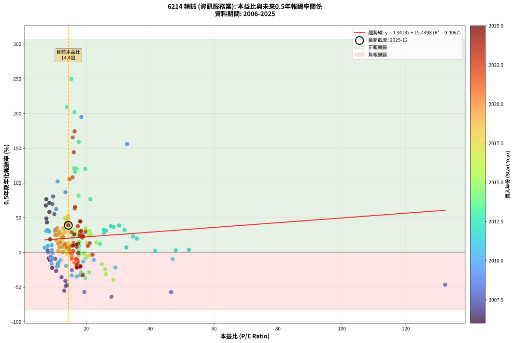
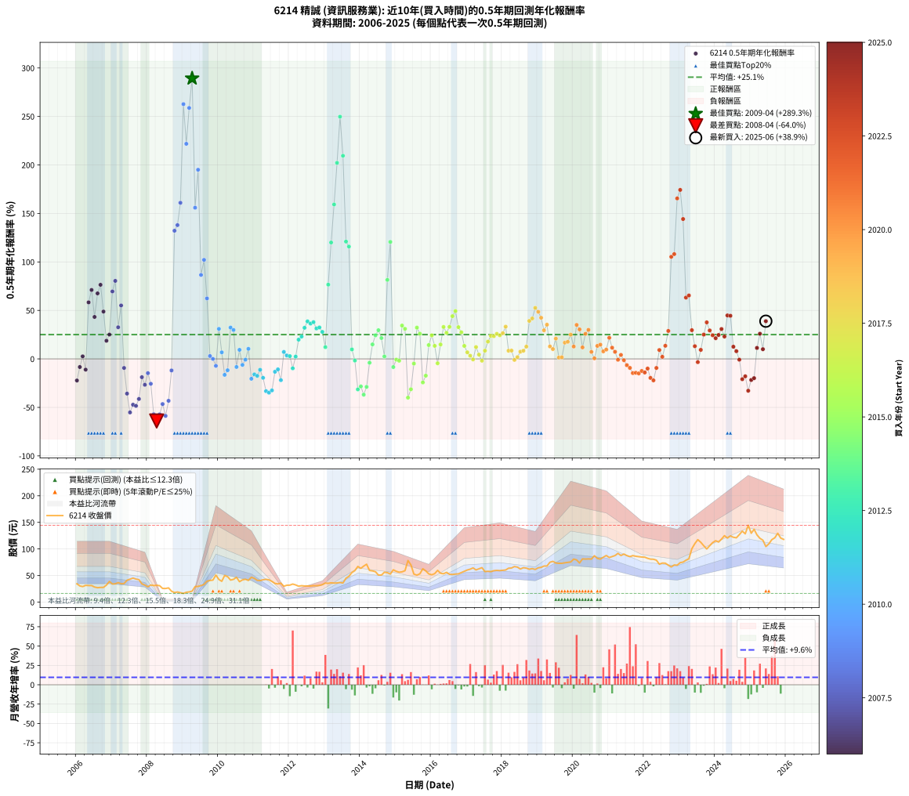

# 6214 精誠 - 本益比與未來報酬率分析

!!! info "報告資訊"
    - **股票代號**: 6214
    - **公司名稱**: 精誠
    - **產業別**: 資訊服務業
    - **分析期間**: 2006-2025 (234 個數據點)
    - **資料來源**: Type 12 (ShowMonthlyK_ChartFlow) 月收盤價與本益比
    - **報酬率口徑**: 含現金股利 (簡化: 年度合計，假設每年7/1入帳)
    - **報告生成時間**: 2026-01-10 21:14:14 CST

## 📈 視覺化圖表

### 圖表1: 本益比 vs 未來報酬率關係

*圖表1：6214 精誠 本益比與0.5年期未來報酬率關係 (2006-2025)*

### 圖表2: 歷年買入時點的0.5年期實際報酬率

*圖表2：6214 精誠 歷年買入時點的0.5年期實際報酬率 (2006-2025)*

## 📍 買點訊號說明

本報告提供兩種買點提示訊號（顯示於圖表2的股價子圖中）：

### ▲ 小綠色三角形（回測驗證）
- **計算方式**: 使用全部歷史資料計算本益比第25百分位數
- **用途**: 事後驗證，顯示歷史上哪些時點確實為低估區
- **限制**: 當下無法判斷，僅供回測參考
- **特性**: 後見之明（Look-Ahead Bias）

### ▲ 小橘色三角形（即時訊號）
- **計算方式**: 使用截至當月的過去5年資料計算本益比第25百分位數
- **用途**: 實際投資決策，當時即可判斷
- **優勢**: 可操作性強，符合實務需求
- **特性**: 無後見之明，滾動窗口計算

!!! tip "如何使用兩種訊號"
    - **綠色▲** 幫助理解歷史估值機會，驗證策略有效性
    - **橘色▲** 可作為實際買進參考，但仍需搭配基本面分析
    - 兩種訊號重疊時，表示即時判斷與事後驗證一致，信心度較高
    - 僅有綠色▲時，表示當時無法判斷（需要未來資料才能確認）
    - 僅有橘色▲時，表示即時判斷為買點，但事後可能不是最佳時機

## 📊 估值分析摘要

| 指標 | 數值 |
|:---:|:---:|
| **目前本益比** (2025-06) | **14.42 倍** |
| **歷史平均本益比** | 17.32 倍 |
| **估值水準** | 🟡 合理範圍 |
| **預期0.5年年化報酬率** | **+20.37%** |
| **歷史平均報酬率** | +25.07% |
| **相關係數 (R²)** | 0.0067 |
| **趨勢線斜率** | 0.3413 |

!!! abstract "核心洞察"
    目前本益比接近歷史平均，預期報酬率符合長期趨勢

    根據歷史數據回測，6214 精誠 在目前本益比 **14.4倍** 的估值水準下，
    預期未來0.5年年化報酬率約為 **+20.4%**。

    **重要提醒**: 本分析基於歷史數據統計，實際報酬率會受到公司基本面變化、產業趨勢、
    總體經濟環境等多重因素影響。R² = 0.01 表示本益比可解釋約 0.7% 的報酬率變異。

## 📈 歷史估值統計

### 最佳買點 (最高報酬率)

| 項目 | 數值 |
|:---:|:---:|
| 起始時間 | 2009-04 |
| 當時本益比 | 108.70 倍 |
| 起始價格 | 20.6 元 |
| 0.5年後價格 | 40.8 元 |
| **0.5年年化報酬率** | **+289.29%** |

### 最差買點 (最低報酬率)

| 項目 | 數值 |
|:---:|:---:|
| 起始時間 | 2008-04 |
| 當時本益比 | 27.89 倍 |
| 起始價格 | 31.7 元 |
| 0.5年後價格 | 18.0 元 |
| **0.5年年化報酬率** | **-64.00%** |

## 🎯 投資啟示

### 本益比與報酬率關係

趨勢線方程式: **y = 0.3413x + 15.4498**

!!! info "弱相關或正相關"
    本益比與未來報酬率相關性較弱。這可能表示該股票的報酬率更多受到
    公司成長性、產業趨勢等因素影響，而非估值水準。**需綜合考量多項指標**。

### 估值區間建議

基於歷史數據分析:

- **🟢 低估區** (P/E < 13.9): 預期報酬率較高，可考慮增加持股
- **🟡 合理區** (P/E 13.9-20.8): 預期報酬率符合長期趨勢，正常持有
- **🔴 高估區** (P/E > 20.8): 預期報酬率較低，可考慮減碼或觀望

!!! danger "風險提示"
    - 過去表現不代表未來結果
    - 本分析假設公司基本面無重大結構性變化
    - 產業環境劇變可能使歷史規律失效
    - 應結合公司財報、產業趨勢、總體經濟等多重因素綜合判斷

!!! success "長期投資觀點"
    歷史數據顯示，在合理或低估的估值水準買入並長期持有，
    往往能獲得較佳的投資報酬。**耐心等待好價格**是價值投資的核心原則。

## 📊 數據品質

- **資料來源**: GoodInfo.tw Type 12 (ShowMonthlyK_ChartFlow)
- **資料頻率**: 月度收盤價與本益比
- **回測期間**: 2006-2025
- **數據點數量**: 234 個 (每個點代表一次0.5年期回測)

### 計算方法說明

1. **0.5年期年化報酬率**:
   - 對每個歷史時點，計算其後0.5年的實際投資報酬率
   - 期末價值(不含股利): 期末價格
   - 期末價值(含現金股利): 期末價格 + 持有期間內的現金股利合計 (簡化: 年度合計，假設每年7/1入帳)
   - 公式: 年化報酬率 = [(期末價值/期初價格)^(1/年數) - 1] × 100%

2. **本益比 (P/E Ratio)**:
   - 使用當時的月收盤價與EPS計算
   - 資料來源: Type 12 月度河流圖本益比數據

3. **趨勢線 (Linear Regression)**:
   - 使用最小平方法擬合線性趨勢線
   - R²值衡量本益比對報酬率的解釋能力

---

*本報告由 Stock Analysis System v1.9.0 自動生成*
*數據更新時間: 2026-01-10 21:14:14 CST*

## 📋 月度回測明細表

（每一列對應時間線圖中的一個買入點；可用來對照 SVG 圖上的每個點。）

| 買入月份 | 賣出月份 | 回測期限_年 | 實際持有年數 | 買入本益比_倍 | 買入收盤價_元 | 賣出收盤價_元 | 現金股利合計_元 | 總報酬率_pct | 年化報酬率_pct |
| --- | --- | --- | --- | --- | --- | --- | --- | --- | --- |
| 2006-01 | 2006-07 | 0.5 | 0.496 | 9.38 | 34.50 | 28.45 | 2.00 | -11.74 | -22.27 |
| 2006-02 | 2006-08 | 0.5 | 0.498 | 8.29 | 30.50 | 27.20 | 2.00 | -4.26 | -8.37 |
| 2006-03 | 2006-10 | 0.5 | 0.586 | 7.96 | 29.30 | 27.75 | 2.00 | +1.54 | +2.64 |
| 2006-04 | 2006-10 | 0.5 | 0.501 | 8.57 | 31.55 | 27.75 | 2.00 | -5.71 | -11.06 |
| 2006-05 | 2006-12 | 0.5 | 0.586 | 8.49 | 31.25 | 38.90 | 2.00 | +30.88 | +58.30 |
| 2006-06 | 2006-12 | 0.5 | 0.501 | 8.49 | 31.25 | 38.90 | 2.00 | +30.88 | +71.11 |
| 2006-07 | 2007-01 | 0.5 | 0.504 | 7.73 | 28.45 | 34.10 | 0.00 | +19.86 | +43.27 |
| 2006-08 | 2007-03 | 0.5 | 0.580 | 7.39 | 27.20 | 36.70 | 0.00 | +34.93 | +67.55 |
| 2006-09 | 2007-03 | 0.5 | 0.496 | 7.53 | 27.70 | 36.70 | 0.00 | +32.49 | +76.43 |
| 2006-10 | 2007-05 | 0.5 | 0.580 | 7.54 | 27.75 | 34.95 | 0.00 | +25.95 | +48.80 |
| 2006-11 | 2007-05 | 0.5 | 0.496 | 8.72 | 32.10 | 34.95 | 0.00 | +8.88 | +18.73 |
| 2006-12 | 2007-07 | 0.5 | 0.580 | 10.57 | 38.90 | 43.30 | 1.00 | +13.88 | +25.10 |
| 2007-01 | 2007-07 | 0.5 | 0.496 | 9.41 | 34.10 | 43.30 | 1.00 | +29.91 | +69.57 |
| 2007-02 | 2007-08 | 0.5 | 0.498 | 9.66 | 34.50 | 45.30 | 1.00 | +34.20 | +80.47 |
| 2007-03 | 2007-10 | 0.5 | 0.586 | 10.44 | 36.70 | 42.30 | 1.00 | +17.98 | +32.61 |
| 2007-04 | 2007-10 | 0.5 | 0.501 | 10.04 | 34.75 | 42.30 | 1.00 | +24.60 | +55.12 |
| 2007-05 | 2007-12 | 0.5 | 0.586 | 10.26 | 34.95 | 32.00 | 1.00 | -5.58 | -9.33 |
| 2007-06 | 2007-12 | 0.5 | 0.501 | 12.30 | 41.20 | 32.00 | 1.00 | -19.90 | -35.79 |
| 2007-07 | 2008-01 | 0.5 | 0.504 | 13.14 | 43.30 | 28.90 | 0.00 | -33.26 | -55.18 |
| 2007-08 | 2008-03 | 0.5 | 0.583 | 13.98 | 45.30 | 31.20 | 0.00 | -31.13 | -47.24 |
| 2007-09 | 2008-03 | 0.5 | 0.498 | 13.63 | 43.40 | 31.20 | 0.00 | -28.11 | -48.44 |
| 2007-10 | 2008-05 | 0.5 | 0.583 | 13.51 | 42.30 | 31.00 | 0.00 | -26.71 | -41.31 |
| 2007-11 | 2008-05 | 0.5 | 0.498 | 11.19 | 34.40 | 31.00 | 0.00 | -9.88 | -18.85 |
| 2007-12 | 2008-07 | 0.5 | 0.583 | 10.60 | 32.00 | 25.70 | 1.00 | -16.56 | -26.69 |
| 2008-01 | 2008-07 | 0.5 | 0.498 | 11.34 | 28.90 | 25.70 | 1.00 | -7.61 | -14.69 |
| 2008-02 | 2008-08 | 0.5 | 0.501 | 15.52 | 32.25 | 26.80 | 1.00 | -13.80 | -25.65 |
| 2008-03 | 2008-10 | 0.5 | 0.586 | 19.41 | 31.20 | 18.00 | 1.00 | -39.10 | -57.11 |
| 2008-04 | 2008-10 | 0.5 | 0.501 | 27.89 | 31.70 | 18.00 | 1.00 | -40.06 | -64.00 |
| 2008-05 | 2008-12 | 0.5 | 0.586 | 46.56 | 31.00 | 17.85 | 1.00 | -39.19 | -57.22 |
| 2008-06 | 2008-12 | 0.5 | 0.501 | 132.30 | 25.80 | 17.85 | 1.00 | -26.94 | -46.55 |
| 2008-07 | 2009-01 | 0.5 | 0.504 |  | 25.70 | 16.45 | 0.00 | -35.99 | -58.76 |
| 2008-08 | 2009-03 | 0.5 | 0.580 |  | 26.80 | 19.30 | 0.00 | -27.99 | -43.20 |
| 2008-09 | 2009-03 | 0.5 | 0.496 |  | 20.55 | 19.30 | 0.00 | -6.08 | -11.89 |
| 2008-10 | 2009-05 | 0.5 | 0.580 |  | 18.00 | 29.35 | 0.00 | +63.06 | +132.18 |
| 2008-11 | 2009-05 | 0.5 | 0.496 |  | 19.10 | 29.35 | 0.00 | +53.66 | +137.96 |
| 2008-12 | 2009-07 | 0.5 | 0.580 |  | 17.85 | 31.15 | 0.00 | +74.51 | +160.99 |
| 2009-01 | 2009-07 | 0.5 | 0.496 |  | 16.45 | 31.15 | 0.00 | +89.36 | +262.71 |
| 2009-02 | 2009-08 | 0.5 | 0.498 |  | 18.60 | 33.30 | 0.00 | +79.03 | +221.81 |
| 2009-03 | 2009-10 | 0.5 | 0.586 |  | 19.30 | 40.80 | 0.00 | +111.40 | +258.82 |
| 2009-04 | 2009-10 | 0.5 | 0.501 | 108.70 | 20.65 | 40.80 | 0.00 | +97.58 | +289.29 |
| 2009-05 | 2009-12 | 0.5 | 0.586 | 32.79 | 29.35 | 50.90 | 0.00 | +73.42 | +155.92 |
| 2009-06 | 2009-12 | 0.5 | 0.501 | 18.50 | 29.60 | 50.90 | 0.00 | +71.96 | +195.04 |
| 2009-07 | 2010-01 | 0.5 | 0.504 | 13.51 | 31.15 | 42.65 | 0.00 | +36.92 | +86.59 |
| 2009-08 | 2010-03 | 0.5 | 0.580 | 11.06 | 33.30 | 50.10 | 0.00 | +50.45 | +102.13 |
| 2009-09 | 2010-03 | 0.5 | 0.496 | 10.61 | 39.40 | 50.10 | 0.00 | +27.16 | +62.39 |
| 2009-10 | 2010-05 | 0.5 | 0.580 | 9.23 | 40.80 | 41.50 | 0.00 | +1.72 | +2.97 |
| 2009-11 | 2010-05 | 0.5 | 0.496 | 8.10 | 41.50 | 41.50 | 0.00 | +0.00 | +0.00 |
| 2009-12 | 2010-07 | 0.5 | 0.580 | 8.73 | 50.90 | 46.75 | 2.00 | -4.23 | -7.17 |
| 2010-01 | 2010-07 | 0.5 | 0.496 | 7.48 | 42.65 | 46.75 | 2.00 | +14.30 | +30.96 |
| 2010-02 | 2010-08 | 0.5 | 0.498 | 7.03 | 39.20 | 38.50 | 2.00 | +3.31 | +6.76 |
| 2010-03 | 2010-10 | 0.5 | 0.586 | 9.19 | 50.10 | 43.10 | 2.00 | -9.98 | -16.43 |
| 2010-04 | 2010-10 | 0.5 | 0.501 | 9.02 | 48.00 | 43.10 | 2.00 | -6.04 | -11.70 |
| 2010-05 | 2010-12 | 0.5 | 0.586 | 7.99 | 41.50 | 46.90 | 2.00 | +17.83 | +32.32 |
| 2010-06 | 2010-12 | 0.5 | 0.501 | 8.46 | 42.90 | 46.90 | 2.00 | +13.98 | +29.85 |
| 2010-07 | 2011-01 | 0.5 | 0.504 | 9.46 | 46.75 | 44.75 | 0.00 | -4.28 | -8.31 |
| 2010-08 | 2011-03 | 0.5 | 0.580 | 7.99 | 38.50 | 40.55 | 0.00 | +5.32 | +9.35 |
| 2010-09 | 2011-03 | 0.5 | 0.496 | 8.92 | 41.85 | 40.55 | 0.00 | -3.11 | -6.17 |
| 2010-10 | 2011-05 | 0.5 | 0.580 | 9.44 | 43.10 | 42.90 | 0.00 | -0.46 | -0.80 |
| 2010-11 | 2011-05 | 0.5 | 0.496 | 9.21 | 40.85 | 42.90 | 0.00 | +5.02 | +10.39 |
| 2010-12 | 2011-07 | 0.5 | 0.580 | 10.88 | 46.90 | 39.00 | 2.06 | -12.45 | -20.48 |
| 2011-01 | 2011-07 | 0.5 | 0.496 | 11.18 | 44.75 | 39.00 | 2.06 | -8.25 | -15.95 |
| 2011-02 | 2011-08 | 0.5 | 0.498 | 11.10 | 41.00 | 35.20 | 2.06 | -9.12 | -17.47 |
| 2011-03 | 2011-10 | 0.5 | 0.586 | 11.98 | 40.55 | 35.75 | 2.06 | -6.76 | -11.26 |
| 2011-04 | 2011-10 | 0.5 | 0.501 | 13.70 | 42.15 | 35.75 | 2.06 | -10.30 | -19.50 |
| 2011-05 | 2011-12 | 0.5 | 0.586 | 15.50 | 42.90 | 31.80 | 2.06 | -21.07 | -33.23 |
| 2011-06 | 2011-12 | 0.5 | 0.501 | 17.05 | 41.95 | 31.80 | 2.06 | -19.29 | -34.80 |
| 2011-07 | 2012-01 | 0.5 | 0.504 | 18.13 | 39.00 | 32.00 | 0.00 | -17.95 | -32.48 |
| 2011-08 | 2012-03 | 0.5 | 0.583 | 19.10 | 35.20 | 32.40 | 0.00 | -7.95 | -13.25 |
| 2011-09 | 2012-03 | 0.5 | 0.498 | 22.35 | 34.30 | 32.40 | 0.00 | -5.54 | -10.81 |
| 2011-10 | 2012-05 | 0.5 | 0.583 | 29.14 | 35.75 | 30.95 | 0.00 | -13.43 | -21.90 |
| 2011-11 | 2012-05 | 0.5 | 0.498 | 32.56 | 29.90 | 30.95 | 0.00 | +3.51 | +7.17 |
| 2011-12 | 2012-07 | 0.5 | 0.583 | 52.13 | 31.80 | 30.45 | 2.00 | +2.04 | +3.53 |
| 2012-01 | 2012-07 | 0.5 | 0.498 | 48.00 | 32.00 | 30.45 | 2.00 | +1.41 | +2.84 |
| 2012-02 | 2012-08 | 0.5 | 0.501 | 47.07 | 34.05 | 30.35 | 2.00 | -4.99 | -9.72 |
| 2012-03 | 2012-10 | 0.5 | 0.586 | 41.54 | 32.40 | 30.85 | 2.00 | +1.39 | +2.38 |
| 2012-04 | 2012-10 | 0.5 | 0.501 | 35.86 | 30.00 | 30.85 | 2.00 | +9.50 | +19.86 |
| 2012-05 | 2012-12 | 0.5 | 0.586 | 34.65 | 30.95 | 32.95 | 2.00 | +12.92 | +23.05 |
| 2012-06 | 2012-12 | 0.5 | 0.501 | 32.00 | 30.40 | 32.95 | 2.00 | +14.97 | +32.10 |
| 2012-07 | 2013-01 | 0.5 | 0.504 | 30.25 | 30.45 | 35.90 | 0.00 | +17.90 | +38.66 |
| 2012-08 | 2013-03 | 0.5 | 0.580 | 28.54 | 30.35 | 36.35 | 0.00 | +19.77 | +36.45 |
| 2012-09 | 2013-03 | 0.5 | 0.496 | 27.68 | 31.00 | 36.35 | 0.00 | +17.26 | +37.89 |
| 2012-10 | 2013-05 | 0.5 | 0.580 | 26.22 | 30.85 | 36.15 | 0.00 | +17.18 | +31.41 |
| 2012-11 | 2013-05 | 0.5 | 0.496 | 25.50 | 31.45 | 36.15 | 0.00 | +14.94 | +32.45 |
| 2012-12 | 2013-07 | 0.5 | 0.580 | 25.54 | 32.95 | 36.00 | 2.00 | +15.32 | +27.84 |
| 2013-01 | 2013-07 | 0.5 | 0.496 | 24.34 | 35.90 | 36.00 | 2.00 | +5.85 | +12.15 |
| 2013-02 | 2013-08 | 0.5 | 0.498 | 21.33 | 35.40 | 45.00 | 2.00 | +32.77 | +76.61 |
| 2013-03 | 2013-10 | 0.5 | 0.586 | 19.70 | 36.35 | 55.70 | 2.00 | +58.73 | +120.03 |
| 2013-04 | 2013-10 | 0.5 | 0.501 | 17.64 | 35.80 | 55.70 | 2.00 | +61.17 | +159.25 |
| 2013-05 | 2013-12 | 0.5 | 0.586 | 16.32 | 36.15 | 67.10 | 2.00 | +91.15 | +202.15 |
| 2013-06 | 2013-12 | 0.5 | 0.501 | 15.38 | 36.90 | 67.10 | 2.00 | +87.26 | +249.76 |
| 2013-07 | 2014-01 | 0.5 | 0.504 | 13.93 | 36.00 | 63.60 | 0.00 | +76.67 | +209.47 |
| 2013-08 | 2014-03 | 0.5 | 0.580 | 16.25 | 45.00 | 71.30 | 0.00 | +58.44 | +120.99 |
| 2013-09 | 2014-03 | 0.5 | 0.496 | 16.48 | 48.70 | 71.30 | 0.00 | +46.41 | +115.82 |
| 2013-10 | 2014-05 | 0.5 | 0.580 | 17.74 | 55.70 | 58.80 | 0.00 | +5.57 | +9.78 |
| 2013-11 | 2014-05 | 0.5 | 0.496 | 17.83 | 59.30 | 58.80 | 0.00 | -0.84 | -1.69 |
| 2013-12 | 2014-07 | 0.5 | 0.580 | 19.12 | 67.10 | 50.90 | 3.00 | -19.67 | -31.44 |
| 2014-01 | 2014-07 | 0.5 | 0.496 | 18.31 | 63.60 | 50.90 | 3.00 | -15.25 | -28.39 |
| 2014-02 | 2014-08 | 0.5 | 0.498 | 19.73 | 67.80 | 50.90 | 3.00 | -20.50 | -36.90 |
| 2014-03 | 2014-10 | 0.5 | 0.586 | 20.97 | 71.30 | 55.40 | 3.00 | -18.09 | -28.87 |
| 2014-04 | 2014-10 | 0.5 | 0.501 | 17.72 | 59.60 | 55.40 | 3.00 | -2.01 | -3.98 |
| 2014-05 | 2014-12 | 0.5 | 0.586 | 17.68 | 58.80 | 60.80 | 3.00 | +8.50 | +14.95 |
| 2014-06 | 2014-12 | 0.5 | 0.501 | 17.39 | 57.20 | 60.80 | 3.00 | +11.54 | +24.35 |
| 2014-07 | 2015-01 | 0.5 | 0.504 | 15.65 | 50.90 | 58.00 | 0.00 | +13.95 | +29.59 |
| 2014-08 | 2015-03 | 0.5 | 0.580 | 15.82 | 50.90 | 57.00 | 0.00 | +11.98 | +21.53 |
| 2014-09 | 2015-03 | 0.5 | 0.496 | 17.70 | 56.30 | 57.00 | 0.00 | +1.24 | +2.52 |
| 2014-10 | 2015-05 | 0.5 | 0.580 | 17.62 | 55.40 | 78.30 | 0.00 | +41.34 | +81.50 |
| 2014-11 | 2015-05 | 0.5 | 0.496 | 17.03 | 52.90 | 78.30 | 0.00 | +48.02 | +120.63 |
| 2014-12 | 2015-07 | 0.5 | 0.580 | 19.80 | 60.80 | 52.80 | 4.98 | -4.97 | -8.41 |
| 2015-01 | 2015-07 | 0.5 | 0.496 | 19.30 | 58.00 | 52.80 | 4.98 | -0.38 | -0.77 |
| 2015-02 | 2015-08 | 0.5 | 0.498 | 19.15 | 56.30 | 50.80 | 4.98 | -0.93 | -1.86 |
| 2015-03 | 2015-10 | 0.5 | 0.586 | 19.83 | 57.00 | 62.80 | 4.98 | +18.91 | +34.39 |
| 2015-04 | 2015-10 | 0.5 | 0.501 | 21.07 | 59.20 | 62.80 | 4.98 | +14.49 | +31.00 |
| 2015-05 | 2015-12 | 0.5 | 0.586 | 28.52 | 78.30 | 53.10 | 4.98 | -25.83 | -39.95 |
| 2015-06 | 2015-12 | 0.5 | 0.501 | 26.16 | 70.10 | 53.10 | 4.98 | -17.15 | -31.31 |
| 2015-07 | 2016-01 | 0.5 | 0.504 | 20.19 | 52.80 | 51.50 | 0.00 | -2.46 | -4.83 |
| 2015-08 | 2016-03 | 0.5 | 0.583 | 19.92 | 50.80 | 59.80 | 0.00 | +17.72 | +32.27 |
| 2015-09 | 2016-03 | 0.5 | 0.498 | 21.45 | 53.30 | 59.80 | 0.00 | +12.20 | +25.98 |
| 2015-10 | 2016-05 | 0.5 | 0.583 | 25.95 | 62.80 | 53.40 | 0.00 | -14.97 | -24.27 |
| 2015-11 | 2016-05 | 0.5 | 0.498 | 24.93 | 58.70 | 53.40 | 0.00 | -9.03 | -17.30 |
| 2015-12 | 2016-07 | 0.5 | 0.583 | 23.19 | 53.10 | 52.40 | 5.00 | +8.10 | +14.29 |
| 2016-01 | 2016-07 | 0.5 | 0.498 | 20.82 | 51.50 | 52.40 | 5.00 | +11.46 | +24.32 |
| 2016-02 | 2016-08 | 0.5 | 0.501 | 20.16 | 53.60 | 52.10 | 5.00 | +6.53 | +13.46 |
| 2016-03 | 2016-10 | 0.5 | 0.586 | 21.04 | 59.80 | 53.20 | 5.00 | -2.68 | -4.52 |
| 2016-04 | 2016-10 | 0.5 | 0.501 | 17.94 | 54.30 | 53.20 | 5.00 | +7.18 | +14.85 |
| 2016-05 | 2016-12 | 0.5 | 0.586 | 16.63 | 53.40 | 58.10 | 5.00 | +18.16 | +32.96 |
| 2016-06 | 2016-12 | 0.5 | 0.501 | 16.49 | 56.00 | 58.10 | 5.00 | +12.68 | +26.90 |
| 2016-07 | 2017-01 | 0.5 | 0.504 | 14.64 | 52.40 | 60.50 | 0.00 | +15.46 | +33.02 |
| 2016-08 | 2017-03 | 0.5 | 0.580 | 13.84 | 52.10 | 64.40 | 0.00 | +23.61 | +44.07 |
| 2016-09 | 2017-03 | 0.5 | 0.496 | 13.38 | 52.80 | 64.40 | 0.00 | +21.97 | +49.30 |
| 2016-10 | 2017-05 | 0.5 | 0.580 | 12.88 | 53.20 | 62.70 | 0.00 | +17.86 | +32.72 |
| 2016-11 | 2017-05 | 0.5 | 0.496 | 12.88 | 55.60 | 62.70 | 0.00 | +12.77 | +27.44 |
| 2016-12 | 2017-07 | 0.5 | 0.580 | 12.91 | 58.10 | 57.50 | 5.00 | +7.57 | +13.40 |
| 2017-01 | 2017-07 | 0.5 | 0.496 | 13.37 | 60.50 | 57.50 | 5.00 | +3.31 | +6.78 |
| 2017-02 | 2017-08 | 0.5 | 0.498 | 13.63 | 62.00 | 58.00 | 5.00 | +1.61 | +3.26 |
| 2017-03 | 2017-10 | 0.5 | 0.586 | 14.08 | 64.40 | 59.20 | 5.00 | -0.31 | -0.53 |
| 2017-04 | 2017-10 | 0.5 | 0.501 | 13.18 | 60.60 | 59.20 | 5.00 | +5.94 | +12.21 |
| 2017-05 | 2017-12 | 0.5 | 0.586 | 13.57 | 62.70 | 59.30 | 5.00 | +2.55 | +4.39 |
| 2017-06 | 2017-12 | 0.5 | 0.501 | 13.97 | 64.90 | 59.30 | 5.00 | -0.92 | -1.84 |
| 2017-07 | 2018-01 | 0.5 | 0.504 | 12.31 | 57.50 | 59.90 | 0.00 | +4.17 | +8.46 |
| 2017-08 | 2018-03 | 0.5 | 0.580 | 12.36 | 58.00 | 63.80 | 0.00 | +10.00 | +17.85 |
| 2017-09 | 2018-03 | 0.5 | 0.496 | 12.17 | 57.40 | 63.80 | 0.00 | +11.15 | +23.78 |
| 2017-10 | 2018-05 | 0.5 | 0.580 | 12.49 | 59.20 | 66.90 | 0.00 | +13.01 | +23.45 |
| 2017-11 | 2018-05 | 0.5 | 0.496 | 12.53 | 59.70 | 66.90 | 0.00 | +12.06 | +25.83 |
| 2017-12 | 2018-07 | 0.5 | 0.580 | 12.38 | 59.30 | 62.30 | 5.00 | +13.49 | +24.36 |
| 2018-01 | 2018-07 | 0.5 | 0.496 | 12.62 | 59.90 | 62.30 | 5.00 | +12.35 | +26.50 |
| 2018-02 | 2018-08 | 0.5 | 0.498 | 12.86 | 60.50 | 64.80 | 5.00 | +15.37 | +33.24 |
| 2018-03 | 2018-10 | 0.5 | 0.586 | 13.69 | 63.80 | 61.90 | 5.00 | +4.86 | +8.43 |
| 2018-04 | 2018-10 | 0.5 | 0.501 | 13.91 | 64.20 | 61.90 | 5.00 | +4.21 | +8.57 |
| 2018-05 | 2018-12 | 0.5 | 0.586 | 14.63 | 66.90 | 61.50 | 5.00 | -0.60 | -1.02 |
| 2018-06 | 2018-12 | 0.5 | 0.501 | 14.55 | 65.90 | 61.50 | 5.00 | +0.91 | +1.83 |
| 2018-07 | 2019-01 | 0.5 | 0.504 | 13.89 | 62.30 | 64.60 | 0.00 | +3.69 | +7.46 |
| 2018-08 | 2019-03 | 0.5 | 0.580 | 14.58 | 64.80 | 67.90 | 0.00 | +4.78 | +8.38 |
| 2018-09 | 2019-03 | 0.5 | 0.496 | 14.55 | 64.00 | 67.90 | 0.00 | +6.09 | +12.68 |
| 2018-10 | 2019-05 | 0.5 | 0.580 | 14.21 | 61.90 | 75.00 | 0.00 | +21.16 | +39.20 |
| 2018-11 | 2019-05 | 0.5 | 0.496 | 14.63 | 63.10 | 75.00 | 0.00 | +18.86 | +41.71 |
| 2018-12 | 2019-07 | 0.5 | 0.580 | 14.40 | 61.50 | 73.60 | 5.00 | +27.80 | +52.60 |
| 2019-01 | 2019-07 | 0.5 | 0.496 | 14.28 | 64.60 | 73.60 | 5.00 | +21.67 | +48.56 |
| 2019-02 | 2019-08 | 0.5 | 0.498 | 13.69 | 65.40 | 73.00 | 5.00 | +19.27 | +42.42 |
| 2019-03 | 2019-10 | 0.5 | 0.586 | 13.50 | 67.90 | 74.00 | 5.00 | +16.35 | +29.49 |
| 2019-04 | 2019-10 | 0.5 | 0.501 | 12.85 | 67.90 | 74.00 | 5.00 | +16.35 | +35.28 |
| 2019-05 | 2019-12 | 0.5 | 0.586 | 13.55 | 75.00 | 75.50 | 5.00 | +7.33 | +12.84 |
| 2019-06 | 2019-12 | 0.5 | 0.501 | 13.25 | 76.70 | 75.50 | 5.00 | +4.95 | +10.13 |
| 2019-07 | 2020-01 | 0.5 | 0.504 | 12.18 | 73.60 | 81.00 | 0.00 | +10.05 | +20.95 |
| 2019-08 | 2020-03 | 0.5 | 0.583 | 11.59 | 73.00 | 73.60 | 0.00 | +0.82 | +1.41 |
| 2019-09 | 2020-03 | 0.5 | 0.498 | 11.15 | 73.00 | 73.60 | 0.00 | +0.82 | +1.66 |
| 2019-10 | 2020-05 | 0.5 | 0.583 | 10.88 | 74.00 | 81.00 | 0.00 | +9.46 | +16.76 |
| 2019-11 | 2020-05 | 0.5 | 0.498 | 10.59 | 74.70 | 81.00 | 0.00 | +8.43 | +17.64 |
| 2019-12 | 2020-07 | 0.5 | 0.583 | 10.33 | 75.50 | 81.00 | 5.00 | +13.91 | +25.02 |
| 2020-01 | 2020-07 | 0.5 | 0.498 | 11.16 | 81.00 | 81.00 | 5.00 | +6.17 | +12.77 |
| 2020-02 | 2020-08 | 0.5 | 0.501 | 11.01 | 79.40 | 87.30 | 5.00 | +16.25 | +35.05 |
| 2020-03 | 2020-10 | 0.5 | 0.586 | 10.28 | 73.60 | 81.00 | 5.00 | +16.85 | +30.44 |
| 2020-04 | 2020-10 | 0.5 | 0.501 | 11.43 | 81.30 | 81.00 | 5.00 | +5.78 | +11.87 |
| 2020-05 | 2020-12 | 0.5 | 0.586 | 11.47 | 81.00 | 87.70 | 5.00 | +14.44 | +25.89 |
| 2020-06 | 2020-12 | 0.5 | 0.501 | 11.59 | 81.30 | 87.70 | 5.00 | +14.02 | +29.94 |
| 2020-07 | 2021-01 | 0.5 | 0.504 | 11.63 | 81.00 | 83.90 | 0.00 | +3.58 | +7.23 |
| 2020-08 | 2021-03 | 0.5 | 0.580 | 12.62 | 87.30 | 87.60 | 0.00 | +0.34 | +0.59 |
| 2020-09 | 2021-03 | 0.5 | 0.496 | 11.98 | 82.30 | 87.60 | 0.00 | +6.44 | +13.42 |
| 2020-10 | 2021-05 | 0.5 | 0.580 | 11.88 | 81.00 | 87.70 | 0.00 | +8.27 | +14.67 |
| 2020-11 | 2021-05 | 0.5 | 0.496 | 12.48 | 84.50 | 87.70 | 0.00 | +3.79 | +7.79 |
| 2020-12 | 2021-07 | 0.5 | 0.580 | 13.05 | 87.70 | 87.50 | 5.00 | +5.47 | +9.62 |
| 2021-01 | 2021-07 | 0.5 | 0.496 | 12.77 | 83.90 | 87.50 | 5.00 | +10.25 | +21.76 |
| 2021-02 | 2021-08 | 0.5 | 0.498 | 13.37 | 85.80 | 85.60 | 5.00 | +5.59 | +11.54 |
| 2021-03 | 2021-10 | 0.5 | 0.586 | 13.98 | 87.60 | 86.30 | 5.00 | +4.22 | +7.32 |
| 2021-04 | 2021-10 | 0.5 | 0.501 | 15.00 | 91.70 | 86.30 | 5.00 | -0.44 | -0.87 |
| 2021-05 | 2021-12 | 0.5 | 0.586 | 14.71 | 87.70 | 84.80 | 5.00 | +2.39 | +4.12 |
| 2021-06 | 2021-12 | 0.5 | 0.501 | 15.56 | 90.40 | 84.80 | 5.00 | -0.66 | -1.32 |
| 2021-07 | 2022-01 | 0.5 | 0.504 | 15.46 | 87.50 | 84.60 | 0.00 | -3.31 | -6.47 |
| 2021-08 | 2022-03 | 0.5 | 0.580 | 15.54 | 85.60 | 80.90 | 0.00 | -5.49 | -9.27 |
| 2021-09 | 2022-03 | 0.5 | 0.496 | 16.34 | 87.50 | 80.90 | 0.00 | -7.54 | -14.64 |
| 2021-10 | 2022-05 | 0.5 | 0.580 | 16.59 | 86.30 | 78.90 | 0.00 | -8.57 | -14.31 |
| 2021-11 | 2022-05 | 0.5 | 0.496 | 16.93 | 85.50 | 78.90 | 0.00 | -7.72 | -14.97 |
| 2021-12 | 2022-07 | 0.5 | 0.580 | 17.31 | 84.80 | 73.50 | 5.00 | -7.43 | -12.45 |
| 2022-01 | 2022-07 | 0.5 | 0.496 | 17.41 | 84.60 | 73.50 | 5.00 | -7.21 | -14.02 |
| 2022-02 | 2022-08 | 0.5 | 0.498 | 17.11 | 82.40 | 73.20 | 5.00 | -5.10 | -9.97 |
| 2022-03 | 2022-10 | 0.5 | 0.586 | 16.94 | 80.90 | 66.20 | 5.00 | -11.99 | -19.59 |
| 2022-04 | 2022-10 | 0.5 | 0.501 | 17.05 | 80.70 | 66.20 | 5.00 | -11.77 | -22.12 |
| 2022-05 | 2022-12 | 0.5 | 0.586 | 16.82 | 78.90 | 69.50 | 5.00 | -5.58 | -9.33 |
| 2022-06 | 2022-12 | 0.5 | 0.501 | 15.33 | 71.30 | 69.50 | 5.00 | +4.49 | +9.16 |
| 2022-07 | 2023-01 | 0.5 | 0.504 | 15.95 | 73.50 | 74.30 | 0.00 | +1.09 | +2.17 |
| 2022-08 | 2023-03 | 0.5 | 0.580 | 16.03 | 73.20 | 78.80 | 0.00 | +7.65 | +13.54 |
| 2022-09 | 2023-03 | 0.5 | 0.496 | 15.36 | 69.50 | 78.80 | 0.00 | +13.38 | +28.84 |
| 2022-10 | 2023-05 | 0.5 | 0.580 | 14.77 | 66.20 | 100.50 | 0.00 | +51.81 | +105.29 |
| 2022-11 | 2023-05 | 0.5 | 0.496 | 15.74 | 69.90 | 100.50 | 0.00 | +43.78 | +108.07 |
| 2022-12 | 2023-07 | 0.5 | 0.580 | 15.80 | 69.50 | 117.50 | 5.00 | +76.26 | +165.51 |
| 2023-01 | 2023-07 | 0.5 | 0.496 | 16.38 | 74.30 | 117.50 | 5.00 | +64.87 | +174.28 |
| 2023-02 | 2023-08 | 0.5 | 0.498 | 16.12 | 75.30 | 112.50 | 5.00 | +56.04 | +144.24 |
| 2023-03 | 2023-10 | 0.5 | 0.586 | 16.40 | 78.80 | 100.00 | 5.00 | +33.25 | +63.22 |
| 2023-04 | 2023-10 | 0.5 | 0.501 | 16.52 | 81.60 | 100.00 | 5.00 | +28.68 | +65.41 |
| 2023-05 | 2023-12 | 0.5 | 0.586 | 19.80 | 100.50 | 112.00 | 5.00 | +16.42 | +29.62 |
| 2023-06 | 2023-12 | 0.5 | 0.501 | 21.11 | 110.00 | 112.00 | 5.00 | +6.36 | +13.10 |
| 2023-07 | 2024-01 | 0.5 | 0.504 | 21.98 | 117.50 | 115.50 | 0.00 | -1.70 | -3.35 |
| 2023-08 | 2024-03 | 0.5 | 0.583 | 20.53 | 112.50 | 118.50 | 0.00 | +5.33 | +9.32 |
| 2023-09 | 2024-03 | 0.5 | 0.498 | 18.88 | 106.00 | 118.50 | 0.00 | +11.79 | +25.07 |
| 2023-10 | 2024-05 | 0.5 | 0.583 | 17.39 | 100.00 | 120.50 | 0.00 | +20.50 | +37.68 |
| 2023-11 | 2024-05 | 0.5 | 0.498 | 18.01 | 106.00 | 120.50 | 0.00 | +13.68 | +29.34 |
| 2023-12 | 2024-07 | 0.5 | 0.583 | 18.60 | 112.00 | 122.00 | 5.20 | +13.57 | +24.39 |
| 2024-01 | 2024-07 | 0.5 | 0.498 | 18.76 | 115.50 | 122.00 | 5.20 | +10.13 | +21.37 |
| 2024-02 | 2024-08 | 0.5 | 0.501 | 17.96 | 113.00 | 121.00 | 5.20 | +11.68 | +24.67 |
| 2024-03 | 2024-10 | 0.5 | 0.586 | 18.43 | 118.50 | 133.50 | 5.20 | +17.05 | +30.82 |
| 2024-04 | 2024-10 | 0.5 | 0.501 | 19.04 | 125.00 | 133.50 | 5.20 | +10.96 | +23.07 |
| 2024-05 | 2024-12 | 0.5 | 0.586 | 17.98 | 120.50 | 144.50 | 5.20 | +24.23 | +44.82 |
| 2024-06 | 2024-12 | 0.5 | 0.501 | 18.20 | 124.50 | 144.50 | 5.20 | +20.24 | +44.47 |
| 2024-07 | 2025-01 | 0.5 | 0.504 | 17.49 | 122.00 | 129.50 | 0.00 | +6.15 | +12.57 |
| 2024-08 | 2025-03 | 0.5 | 0.580 | 17.01 | 121.00 | 126.50 | 0.00 | +4.55 | +7.96 |
| 2024-09 | 2025-03 | 0.5 | 0.496 | 17.52 | 127.00 | 126.50 | 0.00 | -0.39 | -0.79 |
| 2024-10 | 2025-05 | 0.5 | 0.580 | 18.07 | 133.50 | 116.50 | 0.00 | -12.73 | -20.92 |
| 2024-11 | 2025-05 | 0.5 | 0.496 | 17.08 | 128.50 | 116.50 | 0.00 | -9.34 | -17.95 |
| 2024-12 | 2025-07 | 0.5 | 0.580 | 18.86 | 144.50 | 109.50 | 5.20 | -20.62 | -32.83 |
| 2025-01 | 2025-07 | 0.5 | 0.496 | 17.06 | 129.50 | 109.50 | 5.20 | -11.43 | -21.72 |
| 2025-02 | 2025-08 | 0.5 | 0.498 | 18.21 | 137.00 | 117.50 | 5.20 | -10.44 | -19.85 |
| 2025-03 | 2025-10 | 0.5 | 0.586 | 16.97 | 126.50 | 129.50 | 5.20 | +6.48 | +11.32 |
| 2025-04 | 2025-10 | 0.5 | 0.501 | 16.25 | 120.00 | 129.50 | 5.20 | +12.25 | +25.94 |
| 2025-05 | 2025-12 | 0.5 | 0.586 | 15.93 | 116.50 | 118.00 | 5.20 | +5.75 | +10.01 |
| 2025-06 | 2025-12 | 0.5 | 0.501 | 14.42 | 104.50 | 118.00 | 5.20 | +17.89 | +38.90 |
