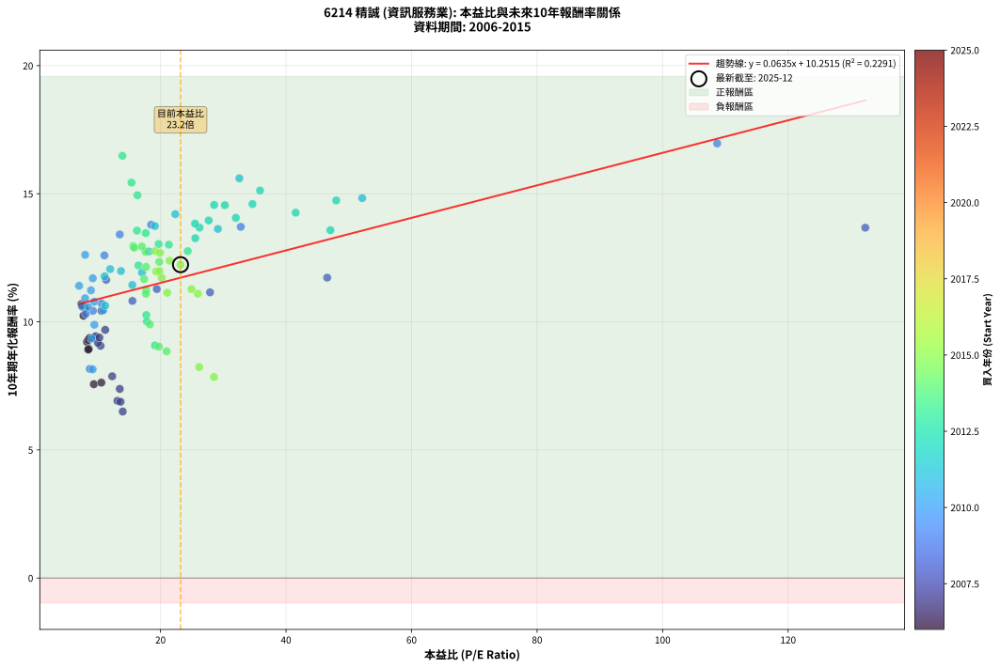
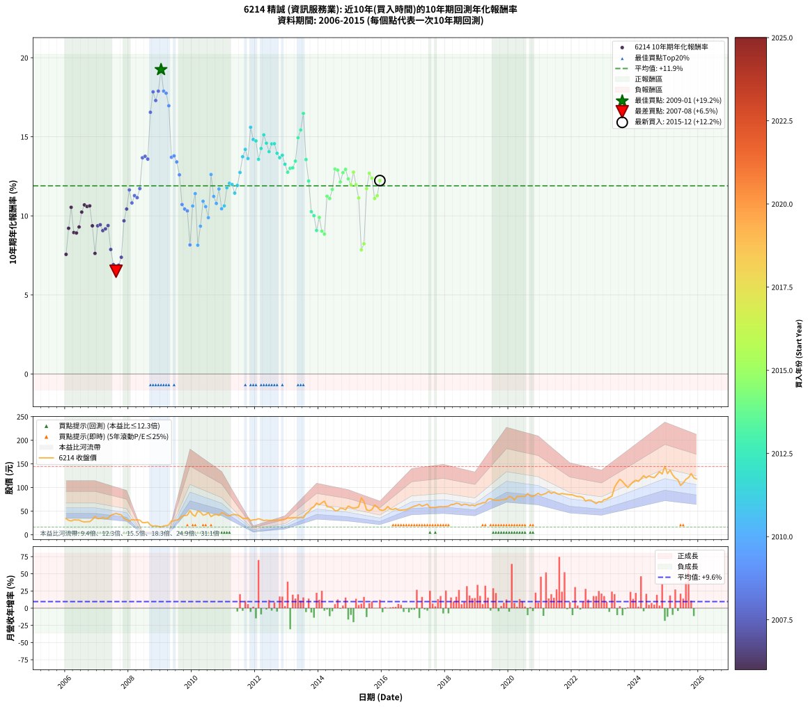

# 6214 精誠 - 本益比與未來報酬率分析

!!! info "報告資訊"
    - **股票代號**: 6214
    - **公司名稱**: 精誠
    - **產業別**: 資訊服務業
    - **分析期間**: 2006-2015 (120 個數據點)
    - **資料來源**: Type 12 (ShowMonthlyK_ChartFlow) 月收盤價與本益比
    - **報酬率口徑**: 含現金股利 (簡化: 年度合計，假設每年7/1入帳)
    - **報告生成時間**: 2026-01-12 21:20:09 CST

## 📈 視覺化圖表

### 圖表1: 本益比 vs 未來報酬率關係

*圖表1：6214 精誠 本益比與10年期未來報酬率關係 (2006-2015)*

### 圖表2: 歷年買入時點的10年期實際報酬率

*圖表2：6214 精誠 歷年買入時點的10年期實際報酬率 (2006-2015)*

## 📍 買點訊號說明

本報告提供兩種買點提示訊號（顯示於圖表2的股價子圖中）：

### ▲ 小綠色三角形（回測驗證）
- **計算方式**: 使用全部歷史資料計算本益比第25百分位數
- **用途**: 事後驗證，顯示歷史上哪些時點確實為低估區
- **限制**: 當下無法判斷，僅供回測參考
- **特性**: 後見之明（Look-Ahead Bias）

### ▲ 小橘色三角形（即時訊號）
- **計算方式**: 使用截至當月的過去5年資料計算本益比第25百分位數
- **用途**: 實際投資決策，當時即可判斷
- **優勢**: 可操作性強，符合實務需求
- **特性**: 無後見之明，滾動窗口計算

!!! tip "如何使用兩種訊號"
    - **綠色▲** 幫助理解歷史估值機會，驗證策略有效性
    - **橘色▲** 可作為實際買進參考，但仍需搭配基本面分析
    - 兩種訊號重疊時，表示即時判斷與事後驗證一致，信心度較高
    - 僅有綠色▲時，表示當時無法判斷（需要未來資料才能確認）
    - 僅有橘色▲時，表示即時判斷為買點，但事後可能不是最佳時機

## 📊 估值分析摘要

| 指標 | 數值 |
|:---:|:---:|
| **目前本益比** (2015-12) | **23.19 倍** |
| **歷史平均本益比** | 19.60 倍 |
| **估值水準** | 🟡 合理範圍 |
| **預期10年年化報酬率** | **+11.72%** |
| **歷史平均報酬率** | +11.90% |
| **相關係數 (R²)** | 0.2291 |
| **趨勢線斜率** | 0.0635 |

!!! abstract "核心洞察"
    目前本益比接近歷史平均，預期報酬率符合長期趨勢

    根據歷史數據回測，6214 精誠 在目前本益比 **23.2倍** 的估值水準下，
    預期未來10年年化報酬率約為 **+11.7%**。

    **重要提醒**: 本分析基於歷史數據統計，實際報酬率會受到公司基本面變化、產業趨勢、
    總體經濟環境等多重因素影響。R² = 0.23 表示本益比可解釋約 22.9% 的報酬率變異。

## 📈 歷史估值統計

### 最佳買點 (最高報酬率)

| 項目 | 數值 |
|:---:|:---:|
| 起始時間 | 2009-01 |
| 當時本益比 | nan 倍 |
| 起始價格 | 16.4 元 |
| 10年後價格 | 64.6 元 |
| **10年年化報酬率** | **+19.25%** |

### 最差買點 (最低報酬率)

| 項目 | 數值 |
|:---:|:---:|
| 起始時間 | 2007-08 |
| 當時本益比 | 13.98 倍 |
| 起始價格 | 45.3 元 |
| 10年後價格 | 58.0 元 |
| **10年年化報酬率** | **+6.50%** |

## 🎯 投資啟示

### 本益比與報酬率關係

趨勢線方程式: **y = 0.0635x + 10.2515**

!!! info "弱相關或正相關"
    本益比與未來報酬率相關性較弱。這可能表示該股票的報酬率更多受到
    公司成長性、產業趨勢等因素影響，而非估值水準。**需綜合考量多項指標**。

### 估值區間建議

基於歷史數據分析:

- **🟢 低估區** (P/E < 15.7): 預期報酬率較高，可考慮增加持股
- **🟡 合理區** (P/E 15.7-23.5): 預期報酬率符合長期趨勢，正常持有
- **🔴 高估區** (P/E > 23.5): 預期報酬率較低，可考慮減碼或觀望

!!! danger "風險提示"
    - 過去表現不代表未來結果
    - 本分析假設公司基本面無重大結構性變化
    - 產業環境劇變可能使歷史規律失效
    - 應結合公司財報、產業趨勢、總體經濟等多重因素綜合判斷

!!! success "長期投資觀點"
    歷史數據顯示，在合理或低估的估值水準買入並長期持有，
    往往能獲得較佳的投資報酬。**耐心等待好價格**是價值投資的核心原則。

## 📊 數據品質

- **資料來源**: GoodInfo.tw Type 12 (ShowMonthlyK_ChartFlow)
- **資料頻率**: 月度收盤價與本益比
- **回測期間**: 2006-2015
- **數據點數量**: 120 個 (每個點代表一次10年期回測)

### 計算方法說明

1. **10年期年化報酬率**:
   - 對每個歷史時點，計算其後10年的實際投資報酬率
   - 期末價值(不含股利): 期末價格
   - 期末價值(含現金股利): 期末價格 + 持有期間內的現金股利合計 (簡化: 年度合計，假設每年7/1入帳)
   - 公式: 年化報酬率 = [(期末價值/期初價格)^(1/年數) - 1] × 100%

2. **本益比 (P/E Ratio)**:
   - 使用當時的月收盤價與EPS計算
   - 資料來源: Type 12 月度河流圖本益比數據

3. **趨勢線 (Linear Regression)**:
   - 使用最小平方法擬合線性趨勢線
   - R²值衡量本益比對報酬率的解釋能力

---

*本報告由 Stock Analysis System v1.9.0 自動生成*
*數據更新時間: 2026-01-12 21:20:09 CST*

## 📋 月度回測明細表

（每一列對應時間線圖中的一個買入點；可用來對照 SVG 圖上的每個點。）

| 買入月份 | 賣出月份 | 回測期限_年 | 實際持有年數 | 買入本益比_倍 | 買入收盤價_元 | 賣出收盤價_元 | 現金股利合計_元 | 總報酬率_pct | 年化報酬率_pct |
| --- | --- | --- | --- | --- | --- | --- | --- | --- | --- |
| 2006-01 | 2016-01 | 10 | 9.999 | 9.38 | 34.50 | 51.50 | 20.03 | +107.34 | +7.57 |
| 2006-02 | 2016-02 | 10 | 9.999 | 8.29 | 30.50 | 53.60 | 20.03 | +141.42 | +9.22 |
| 2006-03 | 2016-03 | 10 | 10.001 | 7.96 | 29.30 | 59.80 | 20.03 | +172.47 | +10.54 |
| 2006-04 | 2016-04 | 10 | 10.001 | 8.57 | 31.55 | 54.30 | 20.03 | +135.61 | +8.95 |
| 2006-05 | 2016-05 | 10 | 10.001 | 8.49 | 31.25 | 53.40 | 20.03 | +134.99 | +8.92 |
| 2006-06 | 2016-06 | 10 | 10.001 | 8.49 | 31.25 | 56.00 | 20.03 | +143.31 | +9.30 |
| 2006-07 | 2016-07 | 10 | 10.001 | 7.73 | 28.45 | 52.40 | 23.03 | +165.15 | +10.24 |
| 2006-08 | 2016-08 | 10 | 10.001 | 7.39 | 27.20 | 52.10 | 23.03 | +176.23 | +10.69 |
| 2006-09 | 2016-09 | 10 | 10.001 | 7.53 | 27.70 | 52.80 | 23.03 | +173.77 | +10.59 |
| 2006-10 | 2016-10 | 10 | 10.001 | 7.54 | 27.75 | 53.20 | 23.03 | +174.72 | +10.63 |
| 2006-11 | 2016-11 | 10 | 10.001 | 8.72 | 32.10 | 55.60 | 23.03 | +144.97 | +9.37 |
| 2006-12 | 2016-12 | 10 | 10.001 | 10.57 | 38.90 | 58.10 | 23.03 | +108.57 | +7.63 |
| 2007-01 | 2017-01 | 10 | 10.001 | 9.41 | 34.10 | 60.50 | 23.03 | +144.97 | +9.37 |
| 2007-02 | 2017-02 | 10 | 10.001 | 9.66 | 34.50 | 62.00 | 23.03 | +146.48 | +9.44 |
| 2007-03 | 2017-03 | 10 | 10.001 | 10.44 | 36.70 | 64.40 | 23.03 | +138.24 | +9.07 |
| 2007-04 | 2017-04 | 10 | 10.001 | 10.04 | 34.75 | 60.60 | 23.03 | +140.67 | +9.18 |
| 2007-05 | 2017-05 | 10 | 10.001 | 10.26 | 34.95 | 62.70 | 23.03 | +145.30 | +9.39 |
| 2007-06 | 2017-06 | 10 | 10.001 | 12.30 | 41.20 | 64.90 | 23.03 | +113.43 | +7.88 |
| 2007-07 | 2017-07 | 10 | 10.001 | 13.14 | 43.30 | 57.50 | 27.03 | +95.23 | +6.92 |
| 2007-08 | 2017-08 | 10 | 10.001 | 13.98 | 45.30 | 58.00 | 27.03 | +87.71 | +6.50 |
| 2007-09 | 2017-09 | 10 | 10.001 | 13.63 | 43.40 | 57.40 | 27.03 | +94.55 | +6.88 |
| 2007-10 | 2017-10 | 10 | 10.001 | 13.51 | 42.30 | 59.20 | 27.03 | +103.86 | +7.38 |
| 2007-11 | 2017-11 | 10 | 10.001 | 11.19 | 34.40 | 59.70 | 27.03 | +152.13 | +9.69 |
| 2007-12 | 2017-12 | 10 | 10.001 | 10.60 | 32.00 | 59.30 | 27.03 | +169.79 | +10.43 |
| 2008-01 | 2018-01 | 10 | 10.001 | 11.34 | 28.90 | 59.90 | 27.03 | +200.81 | +11.64 |
| 2008-02 | 2018-03 | 10 | 10.081 | 15.52 | 32.25 | 63.80 | 27.03 | +181.66 | +10.82 |
| 2008-03 | 2018-03 | 10 | 9.999 | 19.41 | 31.20 | 63.80 | 27.03 | +191.13 | +11.28 |
| 2008-04 | 2018-04 | 10 | 9.999 | 27.89 | 31.70 | 64.20 | 27.03 | +187.80 | +11.15 |
| 2008-05 | 2018-05 | 10 | 9.999 | 46.56 | 31.00 | 66.90 | 27.03 | +203.01 | +11.73 |
| 2008-06 | 2018-06 | 10 | 9.999 | 132.30 | 25.80 | 65.90 | 27.03 | +260.21 | +13.67 |
| 2008-07 | 2018-07 | 10 | 9.999 |  | 25.70 | 62.30 | 31.03 | +263.17 | +13.77 |
| 2008-08 | 2018-08 | 10 | 9.999 |  | 26.80 | 64.80 | 31.03 | +257.59 | +13.59 |
| 2008-09 | 2018-09 | 10 | 9.999 |  | 20.55 | 64.00 | 31.03 | +362.45 | +16.55 |
| 2008-10 | 2018-10 | 10 | 9.999 |  | 18.00 | 61.90 | 31.03 | +416.30 | +17.84 |
| 2008-11 | 2018-11 | 10 | 9.999 |  | 19.10 | 63.10 | 31.03 | +392.85 | +17.30 |
| 2008-12 | 2018-12 | 10 | 9.999 |  | 17.85 | 61.50 | 31.03 | +418.40 | +17.89 |
| 2009-01 | 2019-01 | 10 | 9.999 |  | 16.45 | 64.60 | 31.03 | +481.36 | +19.25 |
| 2009-02 | 2019-02 | 10 | 9.999 |  | 18.60 | 65.40 | 31.03 | +418.46 | +17.89 |
| 2009-03 | 2019-03 | 10 | 9.999 |  | 19.30 | 67.90 | 31.03 | +412.61 | +17.76 |
| 2009-04 | 2019-04 | 10 | 9.999 | 108.70 | 20.65 | 67.90 | 31.03 | +379.10 | +16.96 |
| 2009-05 | 2019-05 | 10 | 9.999 | 32.79 | 29.35 | 75.00 | 31.03 | +261.27 | +13.71 |
| 2009-06 | 2019-06 | 10 | 9.999 | 18.50 | 29.60 | 76.70 | 31.03 | +263.97 | +13.79 |
| 2009-07 | 2019-07 | 10 | 9.999 | 13.51 | 31.15 | 73.60 | 36.03 | +251.96 | +13.41 |
| 2009-08 | 2019-08 | 10 | 9.999 | 11.06 | 33.30 | 73.00 | 36.03 | +227.43 | +12.59 |
| 2009-09 | 2019-09 | 10 | 9.999 | 10.61 | 39.40 | 73.00 | 36.03 | +176.74 | +10.72 |
| 2009-10 | 2019-10 | 10 | 9.999 | 9.23 | 40.80 | 74.00 | 36.03 | +169.69 | +10.43 |
| 2009-11 | 2019-11 | 10 | 9.999 | 8.10 | 41.50 | 74.70 | 36.03 | +166.83 | +10.31 |
| 2009-12 | 2019-12 | 10 | 9.999 | 8.73 | 50.90 | 75.50 | 36.03 | +119.12 | +8.16 |
| 2010-01 | 2020-01 | 10 | 9.999 | 7.48 | 42.65 | 81.00 | 36.03 | +174.41 | +10.62 |
| 2010-02 | 2020-02 | 10 | 9.999 | 7.03 | 39.20 | 79.40 | 36.03 | +194.47 | +11.41 |
| 2010-03 | 2020-03 | 10 | 10.001 | 9.19 | 50.10 | 73.60 | 36.03 | +118.83 | +8.14 |
| 2010-04 | 2020-04 | 10 | 10.001 | 9.02 | 48.00 | 81.30 | 36.03 | +144.45 | +9.35 |
| 2010-05 | 2020-05 | 10 | 10.001 | 7.99 | 41.50 | 81.00 | 36.03 | +182.01 | +10.92 |
| 2010-06 | 2020-06 | 10 | 10.001 | 8.46 | 42.90 | 81.30 | 36.03 | +173.51 | +10.58 |
| 2010-07 | 2020-07 | 10 | 10.001 | 9.46 | 46.75 | 81.00 | 39.03 | +156.76 | +9.89 |
| 2010-08 | 2020-08 | 10 | 10.001 | 7.99 | 38.50 | 87.30 | 39.03 | +228.14 | +12.62 |
| 2010-09 | 2020-09 | 10 | 10.001 | 8.92 | 41.85 | 82.30 | 39.03 | +189.93 | +11.23 |
| 2010-10 | 2020-10 | 10 | 10.001 | 9.44 | 43.10 | 81.00 | 39.03 | +178.50 | +10.78 |
| 2010-11 | 2020-11 | 10 | 10.001 | 9.21 | 40.85 | 84.50 | 39.03 | +202.41 | +11.70 |
| 2010-12 | 2020-12 | 10 | 10.001 | 10.88 | 46.90 | 87.70 | 39.03 | +170.22 | +10.45 |
| 2011-01 | 2021-01 | 10 | 10.001 | 11.18 | 44.75 | 83.90 | 39.03 | +174.72 | +10.63 |
| 2011-02 | 2021-02 | 10 | 10.001 | 11.10 | 41.00 | 85.80 | 39.03 | +204.48 | +11.78 |
| 2011-03 | 2021-03 | 10 | 10.001 | 11.98 | 40.55 | 87.60 | 39.03 | +212.29 | +12.06 |
| 2011-04 | 2021-04 | 10 | 10.001 | 13.70 | 42.15 | 91.70 | 39.03 | +210.17 | +11.98 |
| 2011-05 | 2021-05 | 10 | 10.001 | 15.50 | 42.90 | 87.70 | 39.03 | +195.42 | +11.44 |
| 2011-06 | 2021-06 | 10 | 10.001 | 17.05 | 41.95 | 90.40 | 39.03 | +208.55 | +11.92 |
| 2011-07 | 2021-07 | 10 | 10.001 | 18.13 | 39.00 | 87.50 | 41.98 | +231.99 | +12.75 |
| 2011-08 | 2021-08 | 10 | 10.001 | 19.10 | 35.20 | 85.60 | 41.98 | +262.43 | +13.74 |
| 2011-09 | 2021-09 | 10 | 10.001 | 22.35 | 34.30 | 87.50 | 41.98 | +277.48 | +14.20 |
| 2011-10 | 2021-10 | 10 | 10.001 | 29.14 | 35.75 | 86.30 | 41.98 | +258.81 | +13.63 |
| 2011-11 | 2021-11 | 10 | 10.001 | 32.56 | 29.90 | 85.50 | 41.98 | +326.34 | +15.60 |
| 2011-12 | 2021-12 | 10 | 10.001 | 52.13 | 31.80 | 84.80 | 41.98 | +298.67 | +14.83 |
| 2012-01 | 2022-01 | 10 | 10.001 | 48.00 | 32.00 | 84.60 | 41.98 | +295.55 | +14.74 |
| 2012-02 | 2022-03 | 10 | 10.081 | 47.07 | 34.05 | 80.90 | 41.98 | +260.87 | +13.58 |
| 2012-03 | 2022-03 | 10 | 9.999 | 41.54 | 32.40 | 80.90 | 41.98 | +279.25 | +14.26 |
| 2012-04 | 2022-04 | 10 | 9.999 | 35.86 | 30.00 | 80.70 | 41.98 | +308.92 | +15.13 |
| 2012-05 | 2022-05 | 10 | 9.999 | 34.65 | 30.95 | 78.90 | 41.98 | +290.55 | +14.60 |
| 2012-06 | 2022-06 | 10 | 9.999 | 32.00 | 30.40 | 71.30 | 41.98 | +272.62 | +14.06 |
| 2012-07 | 2022-07 | 10 | 9.999 | 30.25 | 30.45 | 73.50 | 44.98 | +289.08 | +14.55 |
| 2012-08 | 2022-08 | 10 | 9.999 | 28.54 | 30.35 | 73.20 | 44.98 | +289.38 | +14.56 |
| 2012-09 | 2022-09 | 10 | 9.999 | 27.68 | 31.00 | 69.50 | 44.98 | +269.28 | +13.96 |
| 2012-10 | 2022-10 | 10 | 9.999 | 26.22 | 30.85 | 66.20 | 44.98 | +260.38 | +13.68 |
| 2012-11 | 2022-11 | 10 | 9.999 | 25.50 | 31.45 | 69.90 | 44.98 | +265.27 | +13.83 |
| 2012-12 | 2022-12 | 10 | 9.999 | 25.54 | 32.95 | 69.50 | 44.98 | +247.42 | +13.26 |
| 2013-01 | 2023-01 | 10 | 9.999 | 24.34 | 35.90 | 74.30 | 44.98 | +232.25 | +12.76 |
| 2013-02 | 2023-02 | 10 | 9.999 | 21.33 | 35.40 | 75.30 | 44.98 | +239.76 | +13.01 |
| 2013-03 | 2023-03 | 10 | 9.999 | 19.70 | 36.35 | 78.80 | 44.98 | +240.51 | +13.04 |
| 2013-04 | 2023-04 | 10 | 9.999 | 17.64 | 35.80 | 81.60 | 44.98 | +253.56 | +13.46 |
| 2013-05 | 2023-05 | 10 | 9.999 | 16.32 | 36.15 | 100.50 | 44.98 | +302.42 | +14.94 |
| 2013-06 | 2023-06 | 10 | 9.999 | 15.38 | 36.90 | 110.00 | 44.98 | +319.99 | +15.43 |
| 2013-07 | 2023-07 | 10 | 9.999 | 13.93 | 36.00 | 117.50 | 47.98 | +359.66 | +16.48 |
| 2013-08 | 2023-08 | 10 | 9.999 | 16.25 | 45.00 | 112.50 | 47.98 | +256.62 | +13.56 |
| 2013-09 | 2023-09 | 10 | 9.999 | 16.48 | 48.70 | 106.00 | 47.98 | +216.17 | +12.20 |
| 2013-10 | 2023-10 | 10 | 9.999 | 17.74 | 55.70 | 100.00 | 47.98 | +165.67 | +10.27 |
| 2013-11 | 2023-11 | 10 | 9.999 | 17.83 | 59.30 | 106.00 | 47.98 | +159.66 | +10.01 |
| 2013-12 | 2023-12 | 10 | 9.999 | 19.12 | 67.10 | 112.00 | 47.98 | +138.42 | +9.08 |
| 2014-01 | 2024-01 | 10 | 9.999 | 18.31 | 63.60 | 115.50 | 47.98 | +157.04 | +9.90 |
| 2014-02 | 2024-02 | 10 | 9.999 | 19.73 | 67.80 | 113.00 | 47.98 | +137.43 | +9.03 |
| 2014-03 | 2024-03 | 10 | 10.001 | 20.97 | 71.30 | 118.50 | 47.98 | +133.49 | +8.85 |
| 2014-04 | 2024-04 | 10 | 10.001 | 17.72 | 59.60 | 125.00 | 47.98 | +190.23 | +11.24 |
| 2014-05 | 2024-05 | 10 | 10.001 | 17.68 | 58.80 | 120.50 | 47.98 | +186.53 | +11.10 |
| 2014-06 | 2024-06 | 10 | 10.001 | 17.39 | 57.20 | 124.50 | 47.98 | +201.53 | +11.67 |
| 2014-07 | 2024-07 | 10 | 10.001 | 15.65 | 50.90 | 122.00 | 50.18 | +238.27 | +12.96 |
| 2014-08 | 2024-08 | 10 | 10.001 | 15.82 | 50.90 | 121.00 | 50.18 | +236.30 | +12.89 |
| 2014-09 | 2024-09 | 10 | 10.001 | 17.70 | 56.30 | 127.00 | 50.18 | +214.70 | +12.15 |
| 2014-10 | 2024-10 | 10 | 10.001 | 17.62 | 55.40 | 133.50 | 50.18 | +231.55 | +12.73 |
| 2014-11 | 2024-11 | 10 | 10.001 | 17.03 | 52.90 | 128.50 | 50.18 | +237.76 | +12.94 |
| 2014-12 | 2024-12 | 10 | 10.001 | 19.80 | 60.80 | 144.50 | 50.18 | +220.19 | +12.34 |
| 2015-01 | 2025-01 | 10 | 10.001 | 19.30 | 58.00 | 129.50 | 50.18 | +209.79 | +11.97 |
| 2015-02 | 2025-02 | 10 | 10.001 | 19.15 | 56.30 | 137.00 | 50.18 | +232.46 | +12.76 |
| 2015-03 | 2025-03 | 10 | 10.001 | 19.83 | 57.00 | 126.50 | 50.18 | +209.96 | +11.98 |
| 2015-04 | 2025-04 | 10 | 10.001 | 21.07 | 59.20 | 120.00 | 50.18 | +187.46 | +11.14 |
| 2015-05 | 2025-05 | 10 | 10.001 | 28.52 | 78.30 | 116.50 | 50.18 | +112.87 | +7.85 |
| 2015-06 | 2025-06 | 10 | 10.001 | 26.16 | 70.10 | 104.50 | 50.18 | +120.65 | +8.23 |
| 2015-07 | 2025-07 | 10 | 10.001 | 20.19 | 52.80 | 109.50 | 50.40 | +202.84 | +11.72 |
| 2015-08 | 2025-08 | 10 | 10.001 | 19.92 | 50.80 | 117.50 | 50.40 | +230.51 | +12.70 |
| 2015-09 | 2025-09 | 10 | 10.001 | 21.45 | 53.30 | 121.00 | 50.40 | +221.58 | +12.39 |
| 2015-10 | 2025-10 | 10 | 10.001 | 25.95 | 62.80 | 129.50 | 50.40 | +186.46 | +11.10 |
| 2015-11 | 2025-11 | 10 | 10.001 | 24.93 | 58.70 | 120.50 | 50.40 | +191.14 | +11.28 |
| 2015-12 | 2025-12 | 10 | 10.001 | 23.19 | 53.10 | 118.00 | 50.40 | +217.14 | +12.23 |
