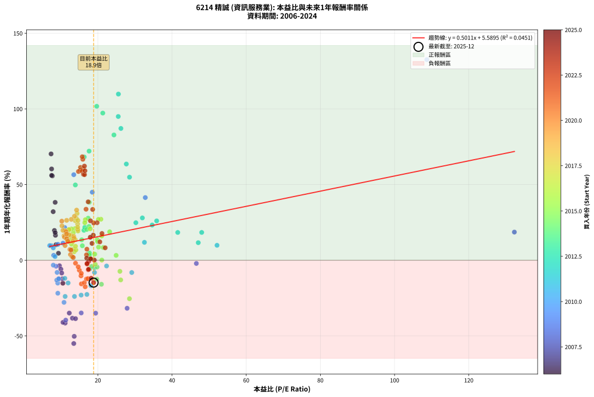
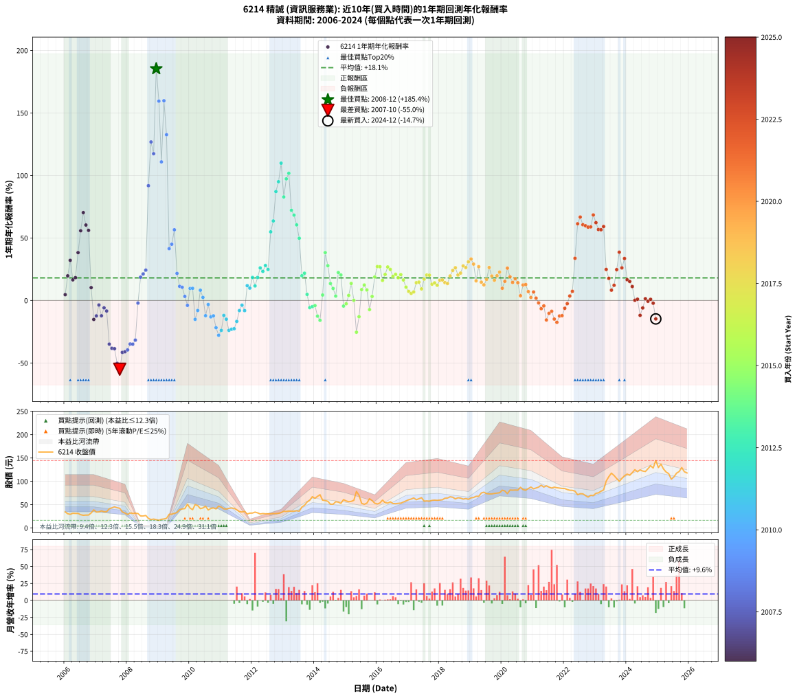

# 6214 精誠 - 本益比與未來報酬率分析

!!! info "報告資訊"
    - **股票代號**: 6214
    - **公司名稱**: 精誠
    - **產業別**: 資訊服務業
    - **分析期間**: 2006-2024 (228 個數據點)
    - **資料來源**: Type 12 (ShowMonthlyK_ChartFlow) 月收盤價與本益比
    - **報酬率口徑**: 含現金股利 (簡化: 年度合計，假設每年7/1入帳)
    - **報告生成時間**: 2026-01-07 21:15:50 CST

## 📈 視覺化圖表

### 圖表1: 本益比 vs 未來報酬率關係

*圖表1：6214 精誠 本益比與1年期未來報酬率關係 (2006-2024)*

### 圖表2: 歷年買入時點的1年期實際報酬率

*圖表2：6214 精誠 歷年買入時點的1年期實際報酬率 (2006-2024)*

## 📍 買點訊號說明

本報告提供兩種買點提示訊號（顯示於圖表2的股價子圖中）：

### ▲ 小綠色三角形（回測驗證）
- **計算方式**: 使用全部歷史資料計算本益比第25百分位數
- **用途**: 事後驗證，顯示歷史上哪些時點確實為低估區
- **限制**: 當下無法判斷，僅供回測參考
- **特性**: 後見之明（Look-Ahead Bias）

### ▲ 小橘色三角形（即時訊號）
- **計算方式**: 使用截至當月的過去5年資料計算本益比第25百分位數
- **用途**: 實際投資決策，當時即可判斷
- **優勢**: 可操作性強，符合實務需求
- **特性**: 無後見之明，滾動窗口計算

!!! tip "如何使用兩種訊號"
    - **綠色▲** 幫助理解歷史估值機會，驗證策略有效性
    - **橘色▲** 可作為實際買進參考，但仍需搭配基本面分析
    - 兩種訊號重疊時，表示即時判斷與事後驗證一致，信心度較高
    - 僅有綠色▲時，表示當時無法判斷（需要未來資料才能確認）
    - 僅有橘色▲時，表示即時判斷為買點，但事後可能不是最佳時機

## 📊 估值分析摘要

| 指標 | 數值 |
|:---:|:---:|
| **目前本益比** (2024-12) | **18.86 倍** |
| **歷史平均本益比** | 17.35 倍 |
| **估值水準** | 🟡 合理範圍 |
| **預期1年年化報酬率** | **+15.04%** |
| **歷史平均報酬率** | +18.09% |
| **相關係數 (R²)** | 0.0451 |
| **趨勢線斜率** | 0.5011 |

!!! abstract "核心洞察"
    目前本益比接近歷史平均，預期報酬率符合長期趨勢

    根據歷史數據回測，6214 精誠 在目前本益比 **18.9倍** 的估值水準下，
    預期未來1年年化報酬率約為 **+15.0%**。

    **重要提醒**: 本分析基於歷史數據統計，實際報酬率會受到公司基本面變化、產業趨勢、
    總體經濟環境等多重因素影響。R² = 0.05 表示本益比可解釋約 4.5% 的報酬率變異。

## 📈 歷史估值統計

### 最佳買點 (最高報酬率)

| 項目 | 數值 |
|:---:|:---:|
| 起始時間 | 2008-12 |
| 當時本益比 | nan 倍 |
| 起始價格 | 17.9 元 |
| 1年後價格 | 50.9 元 |
| **1年年化報酬率** | **+185.36%** |

### 最差買點 (最低報酬率)

| 項目 | 數值 |
|:---:|:---:|
| 起始時間 | 2007-10 |
| 當時本益比 | 13.51 倍 |
| 起始價格 | 42.3 元 |
| 1年後價格 | 18.0 元 |
| **1年年化報酬率** | **-55.01%** |

## 🎯 投資啟示

### 本益比與報酬率關係

趨勢線方程式: **y = 0.5011x + 5.5895**

!!! info "弱相關或正相關"
    本益比與未來報酬率相關性較弱。這可能表示該股票的報酬率更多受到
    公司成長性、產業趨勢等因素影響，而非估值水準。**需綜合考量多項指標**。

### 估值區間建議

基於歷史數據分析:

- **🟢 低估區** (P/E < 13.9): 預期報酬率較高，可考慮增加持股
- **🟡 合理區** (P/E 13.9-20.8): 預期報酬率符合長期趨勢，正常持有
- **🔴 高估區** (P/E > 20.8): 預期報酬率較低，可考慮減碼或觀望

!!! danger "風險提示"
    - 過去表現不代表未來結果
    - 本分析假設公司基本面無重大結構性變化
    - 產業環境劇變可能使歷史規律失效
    - 應結合公司財報、產業趨勢、總體經濟等多重因素綜合判斷

!!! success "長期投資觀點"
    歷史數據顯示，在合理或低估的估值水準買入並長期持有，
    往往能獲得較佳的投資報酬。**耐心等待好價格**是價值投資的核心原則。

## 📊 數據品質

- **資料來源**: GoodInfo.tw Type 12 (ShowMonthlyK_ChartFlow)
- **資料頻率**: 月度收盤價與本益比
- **回測期間**: 2006-2024
- **數據點數量**: 228 個 (每個點代表一次1年期回測)

### 計算方法說明

1. **1年期年化報酬率**:
   - 對每個歷史時點，計算其後1年的實際投資報酬率
   - 期末價值(不含股利): 期末價格
   - 期末價值(含現金股利): 期末價格 + 持有期間內的現金股利合計 (簡化: 年度合計，假設每年7/1入帳)
   - 公式: 年化報酬率 = [(期末價值/期初價格)^(1/年數) - 1] × 100%

2. **本益比 (P/E Ratio)**:
   - 使用當時的月收盤價與EPS計算
   - 資料來源: Type 12 月度河流圖本益比數據

3. **趨勢線 (Linear Regression)**:
   - 使用最小平方法擬合線性趨勢線
   - R²值衡量本益比對報酬率的解釋能力

---

*本報告由 Stock Analysis System v1.9.0 自動生成*
*數據更新時間: 2026-01-07 21:15:50 CST*

## 📋 月度回測明細表

（每一列對應時間線圖中的一個買入點；可用來對照 SVG 圖上的每個點。）

| 買入月份 | 賣出月份 | 回測期限_年 | 實際持有年數 | 買入本益比_倍 | 買入收盤價_元 | 賣出收盤價_元 | 現金股利合計_元 | 總報酬率_pct | 年化報酬率_pct |
| --- | --- | --- | --- | --- | --- | --- | --- | --- | --- |
| 2006-01 | 2007-01 | 1 | 0.999 | 9.38 | 34.50 | 34.10 | 2.00 | +4.64 | +4.64 |
| 2006-02 | 2007-02 | 1 | 0.999 | 8.29 | 30.50 | 34.50 | 2.00 | +19.67 | +19.69 |
| 2006-03 | 2007-03 | 1 | 0.999 | 7.96 | 29.30 | 36.70 | 2.00 | +32.08 | +32.11 |
| 2006-04 | 2007-04 | 1 | 0.999 | 8.57 | 31.55 | 34.75 | 2.00 | +16.48 | +16.49 |
| 2006-05 | 2007-05 | 1 | 0.999 | 8.49 | 31.25 | 34.95 | 2.00 | +18.24 | +18.25 |
| 2006-06 | 2007-06 | 1 | 0.999 | 8.49 | 31.25 | 41.20 | 2.00 | +38.24 | +38.27 |
| 2006-07 | 2007-07 | 1 | 0.999 | 7.73 | 28.45 | 43.30 | 1.00 | +55.71 | +55.76 |
| 2006-08 | 2007-08 | 1 | 0.999 | 7.39 | 27.20 | 45.30 | 1.00 | +70.22 | +70.28 |
| 2006-09 | 2007-09 | 1 | 0.999 | 7.53 | 27.70 | 43.40 | 1.00 | +60.29 | +60.34 |
| 2006-10 | 2007-10 | 1 | 0.999 | 7.54 | 27.75 | 42.30 | 1.00 | +56.04 | +56.08 |
| 2006-11 | 2007-11 | 1 | 0.999 | 8.72 | 32.10 | 34.40 | 1.00 | +10.28 | +10.29 |
| 2006-12 | 2007-12 | 1 | 0.999 | 10.57 | 38.90 | 32.00 | 1.00 | -15.17 | -15.18 |
| 2007-01 | 2008-01 | 1 | 0.999 | 9.41 | 34.10 | 28.90 | 1.00 | -12.32 | -12.32 |
| 2007-02 | 2008-02 | 1 | 0.999 | 9.66 | 34.50 | 32.25 | 1.00 | -3.62 | -3.63 |
| 2007-03 | 2008-03 | 1 | 1.002 | 10.44 | 36.70 | 31.20 | 1.00 | -12.26 | -12.24 |
| 2007-04 | 2008-04 | 1 | 1.002 | 10.04 | 34.75 | 31.70 | 1.00 | -5.90 | -5.89 |
| 2007-05 | 2008-05 | 1 | 1.002 | 10.26 | 34.95 | 31.00 | 1.00 | -8.44 | -8.42 |
| 2007-06 | 2008-06 | 1 | 1.002 | 12.30 | 41.20 | 25.80 | 1.00 | -34.95 | -34.89 |
| 2007-07 | 2008-07 | 1 | 1.002 | 13.14 | 43.30 | 25.70 | 1.00 | -38.34 | -38.28 |
| 2007-08 | 2008-08 | 1 | 1.002 | 13.98 | 45.30 | 26.80 | 1.00 | -38.63 | -38.57 |
| 2007-09 | 2008-09 | 1 | 1.002 | 13.63 | 43.40 | 20.55 | 1.00 | -50.35 | -50.27 |
| 2007-10 | 2008-10 | 1 | 1.002 | 13.51 | 42.30 | 18.00 | 1.00 | -55.08 | -55.01 |
| 2007-11 | 2008-11 | 1 | 1.002 | 11.19 | 34.40 | 19.10 | 1.00 | -41.57 | -41.51 |
| 2007-12 | 2008-12 | 1 | 1.002 | 10.60 | 32.00 | 17.85 | 1.00 | -41.09 | -41.03 |
| 2008-01 | 2009-01 | 1 | 1.002 | 11.34 | 28.90 | 16.45 | 1.00 | -39.62 | -39.56 |
| 2008-02 | 2009-03 | 1 | 1.081 | 15.52 | 32.25 | 19.30 | 1.00 | -37.05 | -34.82 |
| 2008-03 | 2009-03 | 1 | 0.999 | 19.41 | 31.20 | 19.30 | 1.00 | -34.94 | -34.96 |
| 2008-04 | 2009-04 | 1 | 0.999 | 27.89 | 31.70 | 20.65 | 1.00 | -31.70 | -31.72 |
| 2008-05 | 2009-05 | 1 | 0.999 | 46.56 | 31.00 | 29.35 | 1.00 | -2.10 | -2.10 |
| 2008-06 | 2009-06 | 1 | 0.999 | 132.30 | 25.80 | 29.60 | 1.00 | +18.60 | +18.62 |
| 2008-07 | 2009-07 | 1 | 0.999 |  | 25.70 | 31.15 | 0.00 | +21.21 | +21.22 |
| 2008-08 | 2009-08 | 1 | 0.999 |  | 26.80 | 33.30 | 0.00 | +24.25 | +24.27 |
| 2008-09 | 2009-09 | 1 | 0.999 |  | 20.55 | 39.40 | 0.00 | +91.73 | +91.81 |
| 2008-10 | 2009-10 | 1 | 0.999 |  | 18.00 | 40.80 | 0.00 | +126.67 | +126.79 |
| 2008-11 | 2009-11 | 1 | 0.999 |  | 19.10 | 41.50 | 0.00 | +117.28 | +117.39 |
| 2008-12 | 2009-12 | 1 | 0.999 |  | 17.85 | 50.90 | 0.00 | +185.15 | +185.36 |
| 2009-01 | 2010-01 | 1 | 0.999 |  | 16.45 | 42.65 | 0.00 | +159.27 | +159.44 |
| 2009-02 | 2010-02 | 1 | 0.999 |  | 18.60 | 39.20 | 0.00 | +110.75 | +110.86 |
| 2009-03 | 2010-03 | 1 | 0.999 |  | 19.30 | 50.10 | 0.00 | +159.59 | +159.76 |
| 2009-04 | 2010-04 | 1 | 0.999 | 108.70 | 20.65 | 48.00 | 0.00 | +132.45 | +132.58 |
| 2009-05 | 2010-05 | 1 | 0.999 | 32.79 | 29.35 | 41.50 | 0.00 | +41.40 | +41.43 |
| 2009-06 | 2010-06 | 1 | 0.999 | 18.50 | 29.60 | 42.90 | 0.00 | +44.93 | +44.97 |
| 2009-07 | 2010-07 | 1 | 0.999 | 13.51 | 31.15 | 46.75 | 2.00 | +56.50 | +56.55 |
| 2009-08 | 2010-08 | 1 | 0.999 | 11.06 | 33.30 | 38.50 | 2.00 | +21.62 | +21.63 |
| 2009-09 | 2010-09 | 1 | 0.999 | 10.61 | 39.40 | 41.85 | 2.00 | +11.29 | +11.30 |
| 2009-10 | 2010-10 | 1 | 0.999 | 9.23 | 40.80 | 43.10 | 2.00 | +10.54 | +10.54 |
| 2009-11 | 2010-11 | 1 | 0.999 | 8.10 | 41.50 | 40.85 | 2.00 | +3.25 | +3.25 |
| 2009-12 | 2010-12 | 1 | 0.999 | 8.73 | 50.90 | 46.90 | 2.00 | -3.93 | -3.93 |
| 2010-01 | 2011-01 | 1 | 0.999 | 7.48 | 42.65 | 44.75 | 2.00 | +9.61 | +9.62 |
| 2010-02 | 2011-02 | 1 | 0.999 | 7.03 | 39.20 | 41.00 | 2.00 | +9.69 | +9.70 |
| 2010-03 | 2011-03 | 1 | 0.999 | 9.19 | 50.10 | 40.55 | 2.00 | -15.07 | -15.08 |
| 2010-04 | 2011-04 | 1 | 0.999 | 9.02 | 48.00 | 42.15 | 2.00 | -8.02 | -8.03 |
| 2010-05 | 2011-05 | 1 | 0.999 | 7.99 | 41.50 | 42.90 | 2.00 | +8.19 | +8.20 |
| 2010-06 | 2011-06 | 1 | 0.999 | 8.46 | 42.90 | 41.95 | 2.00 | +2.45 | +2.45 |
| 2010-07 | 2011-07 | 1 | 0.999 | 9.46 | 46.75 | 39.00 | 2.06 | -12.17 | -12.18 |
| 2010-08 | 2011-08 | 1 | 0.999 | 7.99 | 38.50 | 35.20 | 2.06 | -3.22 | -3.23 |
| 2010-09 | 2011-09 | 1 | 0.999 | 8.92 | 41.85 | 34.30 | 2.06 | -13.12 | -13.13 |
| 2010-10 | 2011-10 | 1 | 0.999 | 9.44 | 43.10 | 35.75 | 2.06 | -12.28 | -12.28 |
| 2010-11 | 2011-11 | 1 | 0.999 | 9.21 | 40.85 | 29.90 | 2.06 | -21.76 | -21.78 |
| 2010-12 | 2011-12 | 1 | 0.999 | 10.88 | 46.90 | 31.80 | 2.06 | -27.81 | -27.82 |
| 2011-01 | 2012-01 | 1 | 0.999 | 11.18 | 44.75 | 32.00 | 2.06 | -23.89 | -23.90 |
| 2011-02 | 2012-02 | 1 | 0.999 | 11.10 | 41.00 | 34.05 | 2.06 | -11.93 | -11.94 |
| 2011-03 | 2012-03 | 1 | 1.002 | 11.98 | 40.55 | 32.40 | 2.06 | -15.02 | -14.99 |
| 2011-04 | 2012-04 | 1 | 1.002 | 13.70 | 42.15 | 30.00 | 2.06 | -23.94 | -23.90 |
| 2011-05 | 2012-05 | 1 | 1.002 | 15.50 | 42.90 | 30.95 | 2.06 | -23.06 | -23.01 |
| 2011-06 | 2012-06 | 1 | 1.002 | 17.05 | 41.95 | 30.40 | 2.06 | -22.62 | -22.58 |
| 2011-07 | 2012-07 | 1 | 1.002 | 18.13 | 39.00 | 30.45 | 2.00 | -16.79 | -16.76 |
| 2011-08 | 2012-08 | 1 | 1.002 | 19.10 | 35.20 | 30.35 | 2.00 | -8.10 | -8.08 |
| 2011-09 | 2012-09 | 1 | 1.002 | 22.35 | 34.30 | 31.00 | 2.00 | -3.79 | -3.78 |
| 2011-10 | 2012-10 | 1 | 1.002 | 29.14 | 35.75 | 30.85 | 2.00 | -8.11 | -8.10 |
| 2011-11 | 2012-11 | 1 | 1.002 | 32.56 | 29.90 | 31.45 | 2.00 | +11.87 | +11.85 |
| 2011-12 | 2012-12 | 1 | 1.002 | 52.13 | 31.80 | 32.95 | 2.00 | +9.91 | +9.88 |
| 2012-01 | 2013-01 | 1 | 1.002 | 48.00 | 32.00 | 35.90 | 2.00 | +18.44 | +18.40 |
| 2012-02 | 2013-03 | 1 | 1.081 | 47.07 | 34.05 | 36.35 | 2.00 | +12.63 | +11.62 |
| 2012-03 | 2013-03 | 1 | 0.999 | 41.54 | 32.40 | 36.35 | 2.00 | +18.36 | +18.38 |
| 2012-04 | 2013-04 | 1 | 0.999 | 35.86 | 30.00 | 35.80 | 2.00 | +26.00 | +26.02 |
| 2012-05 | 2013-05 | 1 | 0.999 | 34.65 | 30.95 | 36.15 | 2.00 | +23.26 | +23.28 |
| 2012-06 | 2013-06 | 1 | 0.999 | 32.00 | 30.40 | 36.90 | 2.00 | +27.96 | +27.98 |
| 2012-07 | 2013-07 | 1 | 0.999 | 30.25 | 30.45 | 36.00 | 2.00 | +24.79 | +24.81 |
| 2012-08 | 2013-08 | 1 | 0.999 | 28.54 | 30.35 | 45.00 | 2.00 | +54.86 | +54.90 |
| 2012-09 | 2013-09 | 1 | 0.999 | 27.68 | 31.00 | 48.70 | 2.00 | +63.55 | +63.60 |
| 2012-10 | 2013-10 | 1 | 0.999 | 26.22 | 30.85 | 55.70 | 2.00 | +87.03 | +87.11 |
| 2012-11 | 2013-11 | 1 | 0.999 | 25.50 | 31.45 | 59.30 | 2.00 | +94.91 | +95.00 |
| 2012-12 | 2013-12 | 1 | 0.999 | 25.54 | 32.95 | 67.10 | 2.00 | +109.71 | +109.82 |
| 2013-01 | 2014-01 | 1 | 0.999 | 24.34 | 35.90 | 63.60 | 2.00 | +82.73 | +82.80 |
| 2013-02 | 2014-02 | 1 | 0.999 | 21.33 | 35.40 | 67.80 | 2.00 | +97.17 | +97.26 |
| 2013-03 | 2014-03 | 1 | 0.999 | 19.70 | 36.35 | 71.30 | 2.00 | +101.65 | +101.74 |
| 2013-04 | 2014-04 | 1 | 0.999 | 17.64 | 35.80 | 59.60 | 2.00 | +72.06 | +72.13 |
| 2013-05 | 2014-05 | 1 | 0.999 | 16.32 | 36.15 | 58.80 | 2.00 | +68.19 | +68.25 |
| 2013-06 | 2014-06 | 1 | 0.999 | 15.38 | 36.90 | 57.20 | 2.00 | +60.43 | +60.48 |
| 2013-07 | 2014-07 | 1 | 0.999 | 13.93 | 36.00 | 50.90 | 3.00 | +49.72 | +49.76 |
| 2013-08 | 2014-08 | 1 | 0.999 | 16.25 | 45.00 | 50.90 | 3.00 | +19.78 | +19.79 |
| 2013-09 | 2014-09 | 1 | 0.999 | 16.48 | 48.70 | 56.30 | 3.00 | +21.77 | +21.78 |
| 2013-10 | 2014-10 | 1 | 0.999 | 17.74 | 55.70 | 55.40 | 3.00 | +4.85 | +4.85 |
| 2013-11 | 2014-11 | 1 | 0.999 | 17.83 | 59.30 | 52.90 | 3.00 | -5.73 | -5.74 |
| 2013-12 | 2014-12 | 1 | 0.999 | 19.12 | 67.10 | 60.80 | 3.00 | -4.92 | -4.92 |
| 2014-01 | 2015-01 | 1 | 0.999 | 18.31 | 63.60 | 58.00 | 3.00 | -4.09 | -4.09 |
| 2014-02 | 2015-02 | 1 | 0.999 | 19.73 | 67.80 | 56.30 | 3.00 | -12.54 | -12.54 |
| 2014-03 | 2015-03 | 1 | 0.999 | 20.97 | 71.30 | 57.00 | 3.00 | -15.85 | -15.86 |
| 2014-04 | 2015-04 | 1 | 0.999 | 17.72 | 59.60 | 59.20 | 3.00 | +4.36 | +4.37 |
| 2014-05 | 2015-05 | 1 | 0.999 | 17.68 | 58.80 | 78.30 | 3.00 | +38.27 | +38.30 |
| 2014-06 | 2015-06 | 1 | 0.999 | 17.39 | 57.20 | 70.10 | 3.00 | +27.80 | +27.82 |
| 2014-07 | 2015-07 | 1 | 0.999 | 15.65 | 50.90 | 52.80 | 4.98 | +13.51 | +13.52 |
| 2014-08 | 2015-08 | 1 | 0.999 | 15.82 | 50.90 | 50.80 | 4.98 | +9.58 | +9.59 |
| 2014-09 | 2015-09 | 1 | 0.999 | 17.70 | 56.30 | 53.30 | 4.98 | +3.51 | +3.51 |
| 2014-10 | 2015-10 | 1 | 0.999 | 17.62 | 55.40 | 62.80 | 4.98 | +22.34 | +22.36 |
| 2014-11 | 2015-11 | 1 | 0.999 | 17.03 | 52.90 | 58.70 | 4.98 | +20.37 | +20.39 |
| 2014-12 | 2015-12 | 1 | 0.999 | 19.80 | 60.80 | 53.10 | 4.98 | -4.48 | -4.48 |
| 2015-01 | 2016-01 | 1 | 0.999 | 19.30 | 58.00 | 51.50 | 4.98 | -2.63 | -2.63 |
| 2015-02 | 2016-02 | 1 | 0.999 | 19.15 | 56.30 | 53.60 | 4.98 | +4.04 | +4.05 |
| 2015-03 | 2016-03 | 1 | 1.002 | 19.83 | 57.00 | 59.80 | 4.98 | +13.64 | +13.61 |
| 2015-04 | 2016-04 | 1 | 1.002 | 21.07 | 59.20 | 54.30 | 4.98 | +0.13 | +0.13 |
| 2015-05 | 2016-05 | 1 | 1.002 | 28.52 | 78.30 | 53.40 | 4.98 | -25.44 | -25.40 |
| 2015-06 | 2016-06 | 1 | 1.002 | 26.16 | 70.10 | 56.00 | 4.98 | -13.01 | -12.99 |
| 2015-07 | 2016-07 | 1 | 1.002 | 20.19 | 52.80 | 52.40 | 5.00 | +8.71 | +8.69 |
| 2015-08 | 2016-08 | 1 | 1.002 | 19.92 | 50.80 | 52.10 | 5.00 | +12.40 | +12.37 |
| 2015-09 | 2016-09 | 1 | 1.002 | 21.45 | 53.30 | 52.80 | 5.00 | +8.44 | +8.42 |
| 2015-10 | 2016-10 | 1 | 1.002 | 25.95 | 62.80 | 53.20 | 5.00 | -7.32 | -7.31 |
| 2015-11 | 2016-11 | 1 | 1.002 | 24.93 | 58.70 | 55.60 | 5.00 | +3.24 | +3.23 |
| 2015-12 | 2016-12 | 1 | 1.002 | 23.19 | 53.10 | 58.10 | 5.00 | +18.83 | +18.79 |
| 2016-01 | 2017-01 | 1 | 1.002 | 20.82 | 51.50 | 60.50 | 5.00 | +27.18 | +27.12 |
| 2016-02 | 2017-03 | 1 | 1.081 | 20.16 | 53.60 | 64.40 | 5.00 | +29.48 | +26.98 |
| 2016-03 | 2017-03 | 1 | 0.999 | 21.04 | 59.80 | 64.40 | 5.00 | +16.05 | +16.07 |
| 2016-04 | 2017-04 | 1 | 0.999 | 17.94 | 54.30 | 60.60 | 5.00 | +20.81 | +20.83 |
| 2016-05 | 2017-05 | 1 | 0.999 | 16.63 | 53.40 | 62.70 | 5.00 | +26.78 | +26.80 |
| 2016-06 | 2017-06 | 1 | 0.999 | 16.49 | 56.00 | 64.90 | 5.00 | +24.82 | +24.84 |
| 2016-07 | 2017-07 | 1 | 0.999 | 14.64 | 52.40 | 57.50 | 5.00 | +19.27 | +19.29 |
| 2016-08 | 2017-08 | 1 | 0.999 | 13.84 | 52.10 | 58.00 | 5.00 | +20.92 | +20.94 |
| 2016-09 | 2017-09 | 1 | 0.999 | 13.38 | 52.80 | 57.40 | 5.00 | +18.18 | +18.20 |
| 2016-10 | 2017-10 | 1 | 0.999 | 12.88 | 53.20 | 59.20 | 5.00 | +20.68 | +20.69 |
| 2016-11 | 2017-11 | 1 | 0.999 | 12.88 | 55.60 | 59.70 | 5.00 | +16.37 | +16.38 |
| 2016-12 | 2017-12 | 1 | 0.999 | 12.91 | 58.10 | 59.30 | 5.00 | +10.67 | +10.68 |
| 2017-01 | 2018-01 | 1 | 0.999 | 13.37 | 60.50 | 59.90 | 5.00 | +7.27 | +7.28 |
| 2017-02 | 2018-02 | 1 | 0.999 | 13.63 | 62.00 | 60.50 | 5.00 | +5.65 | +5.65 |
| 2017-03 | 2018-03 | 1 | 0.999 | 14.08 | 64.40 | 63.80 | 5.00 | +6.83 | +6.84 |
| 2017-04 | 2018-04 | 1 | 0.999 | 13.18 | 60.60 | 64.20 | 5.00 | +14.19 | +14.20 |
| 2017-05 | 2018-05 | 1 | 0.999 | 13.57 | 62.70 | 66.90 | 5.00 | +14.67 | +14.68 |
| 2017-06 | 2018-06 | 1 | 0.999 | 13.97 | 64.90 | 65.90 | 5.00 | +9.24 | +9.25 |
| 2017-07 | 2018-07 | 1 | 0.999 | 12.31 | 57.50 | 62.30 | 5.00 | +17.04 | +17.06 |
| 2017-08 | 2018-08 | 1 | 0.999 | 12.36 | 58.00 | 64.80 | 5.00 | +20.34 | +20.36 |
| 2017-09 | 2018-09 | 1 | 0.999 | 12.17 | 57.40 | 64.00 | 5.00 | +20.21 | +20.22 |
| 2017-10 | 2018-10 | 1 | 0.999 | 12.49 | 59.20 | 61.90 | 5.00 | +13.01 | +13.02 |
| 2017-11 | 2018-11 | 1 | 0.999 | 12.53 | 59.70 | 63.10 | 5.00 | +14.07 | +14.08 |
| 2017-12 | 2018-12 | 1 | 0.999 | 12.38 | 59.30 | 61.50 | 5.00 | +12.14 | +12.15 |
| 2018-01 | 2019-01 | 1 | 0.999 | 12.62 | 59.90 | 64.60 | 5.00 | +16.19 | +16.21 |
| 2018-02 | 2019-02 | 1 | 0.999 | 12.86 | 60.50 | 65.40 | 5.00 | +16.36 | +16.38 |
| 2018-03 | 2019-03 | 1 | 0.999 | 13.69 | 63.80 | 67.90 | 5.00 | +14.26 | +14.27 |
| 2018-04 | 2019-04 | 1 | 0.999 | 13.91 | 64.20 | 67.90 | 5.00 | +13.55 | +13.56 |
| 2018-05 | 2019-05 | 1 | 0.999 | 14.63 | 66.90 | 75.00 | 5.00 | +19.58 | +19.60 |
| 2018-06 | 2019-06 | 1 | 0.999 | 14.55 | 65.90 | 76.70 | 5.00 | +23.98 | +23.99 |
| 2018-07 | 2019-07 | 1 | 0.999 | 13.89 | 62.30 | 73.60 | 5.00 | +26.16 | +26.18 |
| 2018-08 | 2019-08 | 1 | 0.999 | 14.58 | 64.80 | 73.00 | 5.00 | +20.37 | +20.39 |
| 2018-09 | 2019-09 | 1 | 0.999 | 14.55 | 64.00 | 73.00 | 5.00 | +21.88 | +21.89 |
| 2018-10 | 2019-10 | 1 | 0.999 | 14.21 | 61.90 | 74.00 | 5.00 | +27.63 | +27.65 |
| 2018-11 | 2019-11 | 1 | 0.999 | 14.63 | 63.10 | 74.70 | 5.00 | +26.31 | +26.33 |
| 2018-12 | 2019-12 | 1 | 0.999 | 14.40 | 61.50 | 75.50 | 5.00 | +30.89 | +30.92 |
| 2019-01 | 2020-01 | 1 | 0.999 | 14.28 | 64.60 | 81.00 | 5.00 | +33.13 | +33.15 |
| 2019-02 | 2020-02 | 1 | 0.999 | 13.69 | 65.40 | 79.40 | 5.00 | +29.05 | +29.07 |
| 2019-03 | 2020-03 | 1 | 1.002 | 13.50 | 67.90 | 73.60 | 5.00 | +15.76 | +15.72 |
| 2019-04 | 2020-04 | 1 | 1.002 | 12.85 | 67.90 | 81.30 | 5.00 | +27.10 | +27.04 |
| 2019-05 | 2020-05 | 1 | 1.002 | 13.55 | 75.00 | 81.00 | 5.00 | +14.67 | +14.63 |
| 2019-06 | 2020-06 | 1 | 1.002 | 13.25 | 76.70 | 81.30 | 5.00 | +12.52 | +12.49 |
| 2019-07 | 2020-07 | 1 | 1.002 | 12.18 | 73.60 | 81.00 | 5.00 | +16.85 | +16.81 |
| 2019-08 | 2020-08 | 1 | 1.002 | 11.59 | 73.00 | 87.30 | 5.00 | +26.44 | +26.38 |
| 2019-09 | 2020-09 | 1 | 1.002 | 11.15 | 73.00 | 82.30 | 5.00 | +19.59 | +19.55 |
| 2019-10 | 2020-10 | 1 | 1.002 | 10.88 | 74.00 | 81.00 | 5.00 | +16.22 | +16.18 |
| 2019-11 | 2020-11 | 1 | 1.002 | 10.59 | 74.70 | 84.50 | 5.00 | +19.81 | +19.77 |
| 2019-12 | 2020-12 | 1 | 1.002 | 10.33 | 75.50 | 87.70 | 5.00 | +22.78 | +22.73 |
| 2020-01 | 2021-01 | 1 | 1.002 | 11.16 | 81.00 | 83.90 | 5.00 | +9.75 | +9.73 |
| 2020-02 | 2021-03 | 1 | 1.081 | 11.01 | 79.40 | 87.60 | 5.00 | +16.62 | +15.28 |
| 2020-03 | 2021-03 | 1 | 0.999 | 10.28 | 73.60 | 87.60 | 5.00 | +25.82 | +25.84 |
| 2020-04 | 2021-04 | 1 | 0.999 | 11.43 | 81.30 | 91.70 | 5.00 | +18.94 | +18.96 |
| 2020-05 | 2021-05 | 1 | 0.999 | 11.47 | 81.00 | 87.70 | 5.00 | +14.44 | +14.46 |
| 2020-06 | 2021-06 | 1 | 0.999 | 11.59 | 81.30 | 90.40 | 5.00 | +17.34 | +17.36 |
| 2020-07 | 2021-07 | 1 | 0.999 | 11.63 | 81.00 | 87.50 | 5.00 | +14.20 | +14.21 |
| 2020-08 | 2021-08 | 1 | 0.999 | 12.62 | 87.30 | 85.60 | 5.00 | +3.78 | +3.78 |
| 2020-09 | 2021-09 | 1 | 0.999 | 11.98 | 82.30 | 87.50 | 5.00 | +12.39 | +12.40 |
| 2020-10 | 2021-10 | 1 | 0.999 | 11.88 | 81.00 | 86.30 | 5.00 | +12.72 | +12.73 |
| 2020-11 | 2021-11 | 1 | 0.999 | 12.48 | 84.50 | 85.50 | 5.00 | +7.10 | +7.11 |
| 2020-12 | 2021-12 | 1 | 0.999 | 13.05 | 87.70 | 84.80 | 5.00 | +2.39 | +2.40 |
| 2021-01 | 2022-01 | 1 | 0.999 | 12.77 | 83.90 | 84.60 | 5.00 | +6.79 | +6.80 |
| 2021-02 | 2022-02 | 1 | 0.999 | 13.37 | 85.80 | 82.40 | 5.00 | +1.86 | +1.87 |
| 2021-03 | 2022-03 | 1 | 0.999 | 13.98 | 87.60 | 80.90 | 5.00 | -1.94 | -1.94 |
| 2021-04 | 2022-04 | 1 | 0.999 | 15.00 | 91.70 | 80.70 | 5.00 | -6.54 | -6.55 |
| 2021-05 | 2022-05 | 1 | 0.999 | 14.71 | 87.70 | 78.90 | 5.00 | -4.33 | -4.34 |
| 2021-06 | 2022-06 | 1 | 0.999 | 15.56 | 90.40 | 71.30 | 5.00 | -15.60 | -15.61 |
| 2021-07 | 2022-07 | 1 | 0.999 | 15.46 | 87.50 | 73.50 | 5.00 | -10.29 | -10.29 |
| 2021-08 | 2022-08 | 1 | 0.999 | 15.54 | 85.60 | 73.20 | 5.00 | -8.64 | -8.65 |
| 2021-09 | 2022-09 | 1 | 0.999 | 16.34 | 87.50 | 69.50 | 5.00 | -14.86 | -14.87 |
| 2021-10 | 2022-10 | 1 | 0.999 | 16.59 | 86.30 | 66.20 | 5.00 | -17.50 | -17.51 |
| 2021-11 | 2022-11 | 1 | 0.999 | 16.93 | 85.50 | 69.90 | 5.00 | -12.40 | -12.41 |
| 2021-12 | 2022-12 | 1 | 0.999 | 17.31 | 84.80 | 69.50 | 5.00 | -12.15 | -12.15 |
| 2022-01 | 2023-01 | 1 | 0.999 | 17.41 | 84.60 | 74.30 | 5.00 | -6.26 | -6.27 |
| 2022-02 | 2023-02 | 1 | 0.999 | 17.11 | 82.40 | 75.30 | 5.00 | -2.55 | -2.55 |
| 2022-03 | 2023-03 | 1 | 0.999 | 16.94 | 80.90 | 78.80 | 5.00 | +3.58 | +3.59 |
| 2022-04 | 2023-04 | 1 | 0.999 | 17.05 | 80.70 | 81.60 | 5.00 | +7.31 | +7.32 |
| 2022-05 | 2023-05 | 1 | 0.999 | 16.82 | 78.90 | 100.50 | 5.00 | +33.71 | +33.74 |
| 2022-06 | 2023-06 | 1 | 0.999 | 15.33 | 71.30 | 110.00 | 5.00 | +61.29 | +61.34 |
| 2022-07 | 2023-07 | 1 | 0.999 | 15.95 | 73.50 | 117.50 | 5.00 | +66.67 | +66.72 |
| 2022-08 | 2023-08 | 1 | 0.999 | 16.03 | 73.20 | 112.50 | 5.00 | +60.52 | +60.57 |
| 2022-09 | 2023-09 | 1 | 0.999 | 15.36 | 69.50 | 106.00 | 5.00 | +59.71 | +59.76 |
| 2022-10 | 2023-10 | 1 | 0.999 | 14.77 | 66.20 | 100.00 | 5.00 | +58.61 | +58.66 |
| 2022-11 | 2023-11 | 1 | 0.999 | 15.74 | 69.90 | 106.00 | 5.00 | +58.80 | +58.85 |
| 2022-12 | 2023-12 | 1 | 0.999 | 15.80 | 69.50 | 112.00 | 5.00 | +68.35 | +68.41 |
| 2023-01 | 2024-01 | 1 | 0.999 | 16.38 | 74.30 | 115.50 | 5.00 | +62.18 | +62.23 |
| 2023-02 | 2024-02 | 1 | 0.999 | 16.12 | 75.30 | 113.00 | 5.00 | +56.71 | +56.75 |
| 2023-03 | 2024-03 | 1 | 1.002 | 16.40 | 78.80 | 118.50 | 5.00 | +56.73 | +56.58 |
| 2023-04 | 2024-04 | 1 | 1.002 | 16.52 | 81.60 | 125.00 | 5.00 | +59.31 | +59.16 |
| 2023-05 | 2024-05 | 1 | 1.002 | 19.80 | 100.50 | 120.50 | 5.00 | +24.88 | +24.82 |
| 2023-06 | 2024-06 | 1 | 1.002 | 21.11 | 110.00 | 124.50 | 5.00 | +17.73 | +17.69 |
| 2023-07 | 2024-07 | 1 | 1.002 | 21.98 | 117.50 | 122.00 | 5.20 | +8.26 | +8.24 |
| 2023-08 | 2024-08 | 1 | 1.002 | 20.53 | 112.50 | 121.00 | 5.20 | +12.18 | +12.15 |
| 2023-09 | 2024-09 | 1 | 1.002 | 18.88 | 106.00 | 127.00 | 5.20 | +24.72 | +24.66 |
| 2023-10 | 2024-10 | 1 | 1.002 | 17.39 | 100.00 | 133.50 | 5.20 | +38.70 | +38.61 |
| 2023-11 | 2024-11 | 1 | 1.002 | 18.01 | 106.00 | 128.50 | 5.20 | +26.13 | +26.07 |
| 2023-12 | 2024-12 | 1 | 1.002 | 18.60 | 112.00 | 144.50 | 5.20 | +33.66 | +33.58 |
| 2024-01 | 2025-01 | 1 | 1.002 | 18.76 | 115.50 | 129.50 | 5.20 | +16.62 | +16.59 |
| 2024-02 | 2025-03 | 1 | 1.081 | 17.96 | 113.00 | 126.50 | 5.20 | +16.55 | +15.21 |
| 2024-03 | 2025-03 | 1 | 0.999 | 18.43 | 118.50 | 126.50 | 5.20 | +11.14 | +11.15 |
| 2024-04 | 2025-04 | 1 | 0.999 | 19.04 | 125.00 | 120.00 | 5.20 | +0.16 | +0.16 |
| 2024-05 | 2025-05 | 1 | 0.999 | 17.98 | 120.50 | 116.50 | 5.20 | +1.00 | +1.00 |
| 2024-06 | 2025-06 | 1 | 0.999 | 18.20 | 124.50 | 104.50 | 5.20 | -11.89 | -11.90 |
| 2024-07 | 2025-07 | 1 | 0.999 | 17.49 | 122.00 | 109.50 | 5.20 | -5.98 | -5.99 |
| 2024-08 | 2025-08 | 1 | 0.999 | 17.01 | 121.00 | 117.50 | 5.20 | +1.40 | +1.41 |
| 2024-09 | 2025-09 | 1 | 0.999 | 17.52 | 127.00 | 121.00 | 5.20 | -0.63 | -0.63 |
| 2024-10 | 2025-10 | 1 | 0.999 | 18.07 | 133.50 | 129.50 | 5.20 | +0.90 | +0.90 |
| 2024-11 | 2025-11 | 1 | 0.999 | 17.08 | 128.50 | 120.50 | 5.20 | -2.18 | -2.18 |
| 2024-12 | 2025-12 | 1 | 0.999 | 18.86 | 144.50 | 118.00 | 5.20 | -14.74 | -14.75 |
