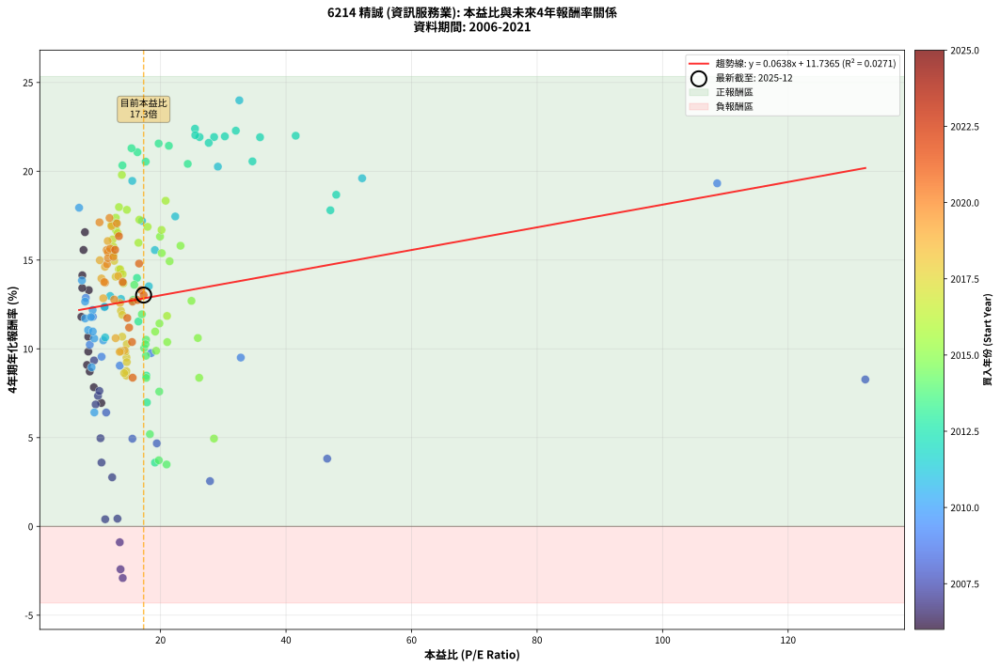
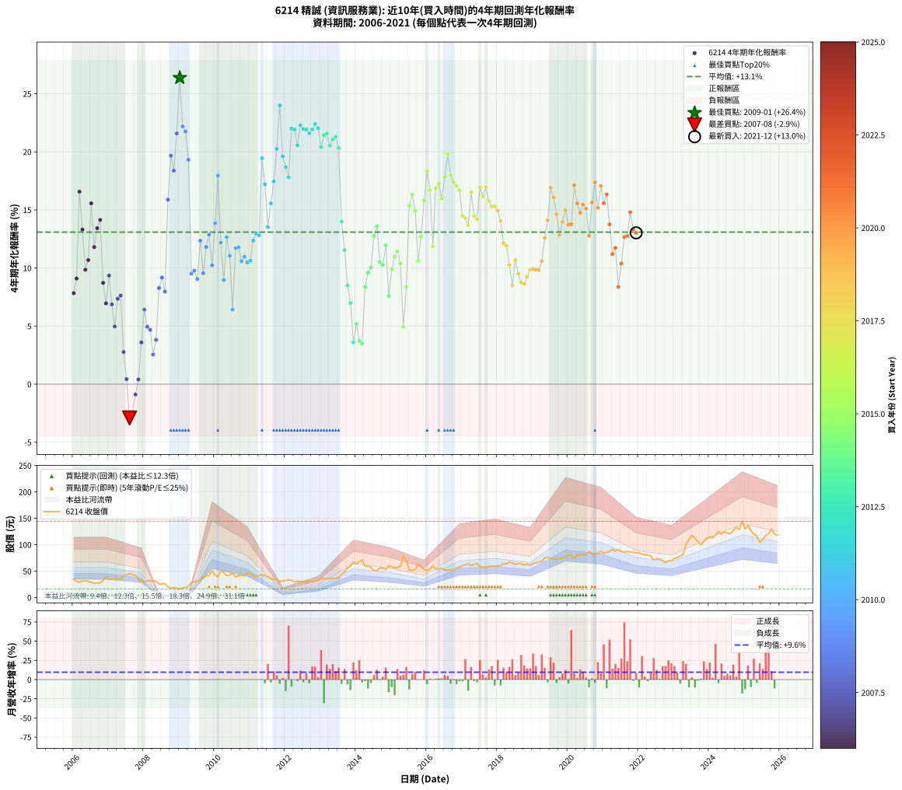

# 6214 精誠 - 本益比與未來報酬率分析

!!! info "報告資訊"
    - **股票代號**: 6214
    - **公司名稱**: 精誠
    - **產業別**: 資訊服務業
    - **分析期間**: 2006-2021 (192 個數據點)
    - **資料來源**: Type 12 (ShowMonthlyK_ChartFlow) 月收盤價與本益比
    - **報酬率口徑**: 含現金股利 (簡化: 年度合計，假設每年7/1入帳)
    - **報告生成時間**: 2026-01-22 23:51:26 CST

## 📈 視覺化圖表

### 圖表1: 本益比 vs 未來報酬率關係

*圖表1：6214 精誠 本益比與4年期未來報酬率關係 (2006-2021)*

### 圖表2: 歷年買入時點的4年期實際報酬率

*圖表2：6214 精誠 歷年買入時點的4年期實際報酬率 (2006-2021)*

## 📍 買點訊號說明

本報告提供兩種買點提示訊號（顯示於圖表2的股價子圖中）：

### ▲ 小綠色三角形（回測驗證）
- **計算方式**: 使用全部歷史資料計算本益比第25百分位數
- **用途**: 事後驗證，顯示歷史上哪些時點確實為低估區
- **限制**: 當下無法判斷，僅供回測參考
- **特性**: 後見之明（Look-Ahead Bias）

### ▲ 小橘色三角形（即時訊號）
- **計算方式**: 使用截至當月的過去5年資料計算本益比第25百分位數
- **用途**: 實際投資決策，當時即可判斷
- **優勢**: 可操作性強，符合實務需求
- **特性**: 無後見之明，滾動窗口計算

!!! tip "如何使用兩種訊號"
    - **綠色▲** 幫助理解歷史估值機會，驗證策略有效性
    - **橘色▲** 可作為實際買進參考，但仍需搭配基本面分析
    - 兩種訊號重疊時，表示即時判斷與事後驗證一致，信心度較高
    - 僅有綠色▲時，表示當時無法判斷（需要未來資料才能確認）
    - 僅有橘色▲時，表示即時判斷為買點，但事後可能不是最佳時機

## 📊 估值分析摘要

| 指標 | 數值 |
|:---:|:---:|
| **目前本益比** (2021-12) | **17.31 倍** |
| **歷史平均本益比** | 17.30 倍 |
| **估值水準** | 🟡 合理範圍 |
| **預期4年年化報酬率** | **+12.84%** |
| **歷史平均報酬率** | +13.09% |
| **相關係數 (R²)** | 0.0271 |
| **趨勢線斜率** | 0.0638 |

!!! abstract "核心洞察"
    目前本益比接近歷史平均，預期報酬率符合長期趨勢

    根據歷史數據回測，6214 精誠 在目前本益比 **17.3倍** 的估值水準下，
    預期未來4年年化報酬率約為 **+12.8%**。

    **重要提醒**: 本分析基於歷史數據統計，實際報酬率會受到公司基本面變化、產業趨勢、
    總體經濟環境等多重因素影響。R² = 0.03 表示本益比可解釋約 2.7% 的報酬率變異。

## 📈 歷史估值統計

### 最佳買點 (最高報酬率)

| 項目 | 數值 |
|:---:|:---:|
| 起始時間 | 2009-01 |
| 當時本益比 | nan 倍 |
| 起始價格 | 16.4 元 |
| 4年後價格 | 35.9 元 |
| **4年年化報酬率** | **+26.38%** |

### 最差買點 (最低報酬率)

| 項目 | 數值 |
|:---:|:---:|
| 起始時間 | 2007-08 |
| 當時本益比 | 13.98 倍 |
| 起始價格 | 45.3 元 |
| 4年後價格 | 35.2 元 |
| **4年年化報酬率** | **-2.91%** |

## 🎯 投資啟示

### 本益比與報酬率關係

趨勢線方程式: **y = 0.0638x + 11.7365**

!!! info "弱相關或正相關"
    本益比與未來報酬率相關性較弱。這可能表示該股票的報酬率更多受到
    公司成長性、產業趨勢等因素影響，而非估值水準。**需綜合考量多項指標**。

### 估值區間建議

基於歷史數據分析:

- **🟢 低估區** (P/E < 13.8): 預期報酬率較高，可考慮增加持股
- **🟡 合理區** (P/E 13.8-20.8): 預期報酬率符合長期趨勢，正常持有
- **🔴 高估區** (P/E > 20.8): 預期報酬率較低，可考慮減碼或觀望

!!! danger "風險提示"
    - 過去表現不代表未來結果
    - 本分析假設公司基本面無重大結構性變化
    - 產業環境劇變可能使歷史規律失效
    - 應結合公司財報、產業趨勢、總體經濟等多重因素綜合判斷

!!! success "長期投資觀點"
    歷史數據顯示，在合理或低估的估值水準買入並長期持有，
    往往能獲得較佳的投資報酬。**耐心等待好價格**是價值投資的核心原則。

## 📊 數據品質

- **資料來源**: GoodInfo.tw Type 12 (ShowMonthlyK_ChartFlow)
- **資料頻率**: 月度收盤價與本益比
- **回測期間**: 2006-2021
- **數據點數量**: 192 個 (每個點代表一次4年期回測)

### 計算方法說明

1. **4年期年化報酬率**:
   - 對每個歷史時點，計算其後4年的實際投資報酬率
   - 期末價值(不含股利): 期末價格
   - 期末價值(含現金股利): 期末價格 + 持有期間內的現金股利合計 (簡化: 年度合計，假設每年7/1入帳)
   - 公式: 年化報酬率 = [(期末價值/期初價格)^(1/年數) - 1] × 100%

2. **本益比 (P/E Ratio)**:
   - 使用當時的月收盤價與EPS計算
   - 資料來源: Type 12 月度河流圖本益比數據

3. **趨勢線 (Linear Regression)**:
   - 使用最小平方法擬合線性趨勢線
   - R²值衡量本益比對報酬率的解釋能力

---

*本報告由 Stock Analysis System v1.9.0 自動生成*
*數據更新時間: 2026-01-22 23:51:26 CST*

## 📋 月度回測明細表

（每一列對應時間線圖中的一個買入點；可用來對照 SVG 圖上的每個點。）

| 買入月份 | 賣出月份 | 回測期限_年 | 實際持有年數 | 買入本益比_倍 | 買入收盤價_元 | 賣出收盤價_元 | 現金股利合計_元 | 總報酬率_pct | 年化報酬率_pct |
| --- | --- | --- | --- | --- | --- | --- | --- | --- | --- |
| 2006-01 | 2010-01 | 4 | 4.000 | 9.38 | 34.50 | 42.65 | 4.00 | +35.22 | +7.83 |
| 2006-02 | 2010-02 | 4 | 4.000 | 8.29 | 30.50 | 39.20 | 4.00 | +41.64 | +9.09 |
| 2006-03 | 2010-03 | 4 | 4.000 | 7.96 | 29.30 | 50.10 | 4.00 | +84.64 | +16.57 |
| 2006-04 | 2010-04 | 4 | 4.000 | 8.57 | 31.55 | 48.00 | 4.00 | +64.82 | +13.31 |
| 2006-05 | 2010-05 | 4 | 4.000 | 8.49 | 31.25 | 41.50 | 4.00 | +45.60 | +9.85 |
| 2006-06 | 2010-06 | 4 | 4.000 | 8.49 | 31.25 | 42.90 | 4.00 | +50.08 | +10.68 |
| 2006-07 | 2010-07 | 4 | 4.000 | 7.73 | 28.45 | 46.75 | 4.00 | +78.38 | +15.57 |
| 2006-08 | 2010-08 | 4 | 4.000 | 7.39 | 27.20 | 38.50 | 4.00 | +56.25 | +11.80 |
| 2006-09 | 2010-09 | 4 | 4.000 | 7.53 | 27.70 | 41.85 | 4.00 | +65.52 | +13.43 |
| 2006-10 | 2010-10 | 4 | 4.000 | 7.54 | 27.75 | 43.10 | 4.00 | +69.73 | +14.14 |
| 2006-11 | 2010-11 | 4 | 4.000 | 8.72 | 32.10 | 40.85 | 4.00 | +39.72 | +8.72 |
| 2006-12 | 2010-12 | 4 | 4.000 | 10.57 | 38.90 | 46.90 | 4.00 | +30.85 | +6.95 |
| 2007-01 | 2011-01 | 4 | 4.000 | 9.41 | 34.10 | 44.75 | 4.00 | +42.96 | +9.35 |
| 2007-02 | 2011-02 | 4 | 4.000 | 9.66 | 34.50 | 41.00 | 4.00 | +30.43 | +6.87 |
| 2007-03 | 2011-03 | 4 | 4.000 | 10.44 | 36.70 | 40.55 | 4.00 | +21.39 | +4.96 |
| 2007-04 | 2011-04 | 4 | 4.000 | 10.04 | 34.75 | 42.15 | 4.00 | +32.80 | +7.35 |
| 2007-05 | 2011-05 | 4 | 4.000 | 10.26 | 34.95 | 42.90 | 4.00 | +34.19 | +7.63 |
| 2007-06 | 2011-06 | 4 | 4.000 | 12.30 | 41.20 | 41.95 | 4.00 | +11.53 | +2.76 |
| 2007-07 | 2011-07 | 4 | 4.000 | 13.14 | 43.30 | 39.00 | 5.06 | +1.75 | +0.43 |
| 2007-08 | 2011-08 | 4 | 4.000 | 13.98 | 45.30 | 35.20 | 5.06 | -11.13 | -2.91 |
| 2007-09 | 2011-09 | 4 | 4.000 | 13.63 | 43.40 | 34.30 | 5.06 | -9.31 | -2.41 |
| 2007-10 | 2011-10 | 4 | 4.000 | 13.51 | 42.30 | 35.75 | 5.06 | -3.53 | -0.89 |
| 2007-11 | 2011-11 | 4 | 4.000 | 11.19 | 34.40 | 29.90 | 5.06 | +1.62 | +0.40 |
| 2007-12 | 2011-12 | 4 | 4.000 | 10.60 | 32.00 | 31.80 | 5.06 | +15.18 | +3.60 |
| 2008-01 | 2012-01 | 4 | 4.000 | 11.34 | 28.90 | 32.00 | 5.06 | +28.23 | +6.41 |
| 2008-02 | 2012-02 | 4 | 4.000 | 15.52 | 32.25 | 34.05 | 5.06 | +21.27 | +4.94 |
| 2008-03 | 2012-03 | 4 | 4.000 | 19.41 | 31.20 | 32.40 | 5.06 | +20.06 | +4.68 |
| 2008-04 | 2012-04 | 4 | 4.000 | 27.89 | 31.70 | 30.00 | 5.06 | +10.59 | +2.55 |
| 2008-05 | 2012-05 | 4 | 4.000 | 46.56 | 31.00 | 30.95 | 5.06 | +16.15 | +3.81 |
| 2008-06 | 2012-06 | 4 | 4.000 | 132.30 | 25.80 | 30.40 | 5.06 | +37.43 | +8.27 |
| 2008-07 | 2012-07 | 4 | 4.000 |  | 25.70 | 30.45 | 6.06 | +42.05 | +9.17 |
| 2008-08 | 2012-08 | 4 | 4.000 |  | 26.80 | 30.35 | 6.06 | +35.85 | +7.96 |
| 2008-09 | 2012-09 | 4 | 4.000 |  | 20.55 | 31.00 | 6.06 | +80.33 | +15.88 |
| 2008-10 | 2012-10 | 4 | 4.000 |  | 18.00 | 30.85 | 6.06 | +105.04 | +19.66 |
| 2008-11 | 2012-11 | 4 | 4.000 |  | 19.10 | 31.45 | 6.06 | +96.38 | +18.38 |
| 2008-12 | 2012-12 | 4 | 4.000 |  | 17.85 | 32.95 | 6.06 | +118.53 | +21.58 |
| 2009-01 | 2013-01 | 4 | 4.000 |  | 16.45 | 35.90 | 6.06 | +155.06 | +26.38 |
| 2009-02 | 2013-02 | 4 | 4.000 |  | 18.60 | 35.40 | 6.06 | +122.89 | +22.19 |
| 2009-03 | 2013-03 | 4 | 4.000 |  | 19.30 | 36.35 | 6.06 | +119.73 | +21.75 |
| 2009-04 | 2013-04 | 4 | 4.000 | 108.70 | 20.65 | 35.80 | 6.06 | +102.70 | +19.32 |
| 2009-05 | 2013-05 | 4 | 4.000 | 32.79 | 29.35 | 36.15 | 6.06 | +43.81 | +9.51 |
| 2009-06 | 2013-06 | 4 | 4.000 | 18.50 | 29.60 | 36.90 | 6.06 | +45.13 | +9.76 |
| 2009-07 | 2013-07 | 4 | 4.000 | 13.51 | 31.15 | 36.00 | 8.06 | +41.43 | +9.05 |
| 2009-08 | 2013-08 | 4 | 4.000 | 11.06 | 33.30 | 45.00 | 8.06 | +59.33 | +12.35 |
| 2009-09 | 2013-09 | 4 | 4.000 | 10.61 | 39.40 | 48.70 | 8.06 | +44.05 | +9.55 |
| 2009-10 | 2013-10 | 4 | 4.000 | 9.23 | 40.80 | 55.70 | 8.06 | +56.27 | +11.81 |
| 2009-11 | 2013-11 | 4 | 4.000 | 8.10 | 41.50 | 59.30 | 8.06 | +62.31 | +12.87 |
| 2009-12 | 2013-12 | 4 | 4.000 | 8.73 | 50.90 | 67.10 | 8.06 | +47.66 | +10.23 |
| 2010-01 | 2014-01 | 4 | 4.000 | 7.48 | 42.65 | 63.60 | 8.06 | +68.01 | +13.85 |
| 2010-02 | 2014-02 | 4 | 4.000 | 7.03 | 39.20 | 67.80 | 8.06 | +93.51 | +17.94 |
| 2010-03 | 2014-03 | 4 | 4.000 | 9.19 | 50.10 | 71.30 | 8.06 | +58.40 | +12.19 |
| 2010-04 | 2014-04 | 4 | 4.000 | 9.02 | 48.00 | 59.60 | 8.06 | +40.95 | +8.96 |
| 2010-05 | 2014-05 | 4 | 4.000 | 7.99 | 41.50 | 58.80 | 8.06 | +61.10 | +12.66 |
| 2010-06 | 2014-06 | 4 | 4.000 | 8.46 | 42.90 | 57.20 | 8.06 | +52.11 | +11.06 |
| 2010-07 | 2014-07 | 4 | 4.000 | 9.46 | 46.75 | 50.90 | 9.06 | +28.25 | +6.42 |
| 2010-08 | 2014-08 | 4 | 4.000 | 7.99 | 38.50 | 50.90 | 9.06 | +55.74 | +11.71 |
| 2010-09 | 2014-09 | 4 | 4.000 | 8.92 | 41.85 | 56.30 | 9.06 | +56.17 | +11.79 |
| 2010-10 | 2014-10 | 4 | 4.000 | 9.44 | 43.10 | 55.40 | 9.06 | +49.55 | +10.59 |
| 2010-11 | 2014-11 | 4 | 4.000 | 9.21 | 40.85 | 52.90 | 9.06 | +51.67 | +10.98 |
| 2010-12 | 2014-12 | 4 | 4.000 | 10.88 | 46.90 | 60.80 | 9.06 | +48.95 | +10.47 |
| 2011-01 | 2015-01 | 4 | 4.000 | 11.18 | 44.75 | 58.00 | 9.06 | +49.85 | +10.64 |
| 2011-02 | 2015-02 | 4 | 4.000 | 11.10 | 41.00 | 56.30 | 9.06 | +59.41 | +12.36 |
| 2011-03 | 2015-03 | 4 | 4.000 | 11.98 | 40.55 | 57.00 | 9.06 | +62.91 | +12.98 |
| 2011-04 | 2015-04 | 4 | 4.000 | 13.70 | 42.15 | 59.20 | 9.06 | +61.94 | +12.81 |
| 2011-05 | 2015-05 | 4 | 4.000 | 15.50 | 42.90 | 78.30 | 9.06 | +103.63 | +19.46 |
| 2011-06 | 2015-06 | 4 | 4.000 | 17.05 | 41.95 | 70.10 | 9.06 | +88.70 | +17.20 |
| 2011-07 | 2015-07 | 4 | 4.000 | 18.13 | 39.00 | 52.80 | 11.98 | +66.09 | +13.52 |
| 2011-08 | 2015-08 | 4 | 4.000 | 19.10 | 35.20 | 50.80 | 11.98 | +78.34 | +15.56 |
| 2011-09 | 2015-09 | 4 | 4.000 | 22.35 | 34.30 | 53.30 | 11.98 | +90.31 | +17.45 |
| 2011-10 | 2015-10 | 4 | 4.000 | 29.14 | 35.75 | 62.80 | 11.98 | +109.16 | +20.26 |
| 2011-11 | 2015-11 | 4 | 4.000 | 32.56 | 29.90 | 58.70 | 11.98 | +136.37 | +23.99 |
| 2011-12 | 2015-12 | 4 | 4.000 | 52.13 | 31.80 | 53.10 | 11.98 | +104.64 | +19.60 |
| 2012-01 | 2016-01 | 4 | 4.000 | 48.00 | 32.00 | 51.50 | 11.98 | +98.36 | +18.68 |
| 2012-02 | 2016-02 | 4 | 4.000 | 47.07 | 34.05 | 53.60 | 11.98 | +92.59 | +17.80 |
| 2012-03 | 2016-03 | 4 | 4.000 | 41.54 | 32.40 | 59.80 | 11.98 | +121.53 | +22.00 |
| 2012-04 | 2016-04 | 4 | 4.000 | 35.86 | 30.00 | 54.30 | 11.98 | +120.92 | +21.92 |
| 2012-05 | 2016-05 | 4 | 4.000 | 34.65 | 30.95 | 53.40 | 11.98 | +111.23 | +20.56 |
| 2012-06 | 2016-06 | 4 | 4.000 | 32.00 | 30.40 | 56.00 | 11.98 | +123.61 | +22.28 |
| 2012-07 | 2016-07 | 4 | 4.000 | 30.25 | 30.45 | 52.40 | 14.98 | +121.27 | +21.96 |
| 2012-08 | 2016-08 | 4 | 4.000 | 28.54 | 30.35 | 52.10 | 14.98 | +121.01 | +21.93 |
| 2012-09 | 2016-09 | 4 | 4.000 | 27.68 | 31.00 | 52.80 | 14.98 | +118.63 | +21.60 |
| 2012-10 | 2016-10 | 4 | 4.000 | 26.22 | 30.85 | 53.20 | 14.98 | +120.99 | +21.93 |
| 2012-11 | 2016-11 | 4 | 4.000 | 25.50 | 31.45 | 55.60 | 14.98 | +124.41 | +22.39 |
| 2012-12 | 2016-12 | 4 | 4.000 | 25.54 | 32.95 | 58.10 | 14.98 | +121.78 | +22.03 |
| 2013-01 | 2017-01 | 4 | 4.000 | 24.34 | 35.90 | 60.50 | 14.98 | +110.24 | +20.41 |
| 2013-02 | 2017-02 | 4 | 4.000 | 21.33 | 35.40 | 62.00 | 14.98 | +117.45 | +21.43 |
| 2013-03 | 2017-03 | 4 | 4.000 | 19.70 | 36.35 | 64.40 | 14.98 | +118.37 | +21.56 |
| 2013-04 | 2017-04 | 4 | 4.000 | 17.64 | 35.80 | 60.60 | 14.98 | +111.11 | +20.54 |
| 2013-05 | 2017-05 | 4 | 4.000 | 16.32 | 36.15 | 62.70 | 14.98 | +114.87 | +21.07 |
| 2013-06 | 2017-06 | 4 | 4.000 | 15.38 | 36.90 | 64.90 | 14.98 | +116.47 | +21.30 |
| 2013-07 | 2017-07 | 4 | 4.000 | 13.93 | 36.00 | 57.50 | 17.98 | +109.66 | +20.33 |
| 2013-08 | 2017-08 | 4 | 4.000 | 16.25 | 45.00 | 58.00 | 17.98 | +68.84 | +13.99 |
| 2013-09 | 2017-09 | 4 | 4.000 | 16.48 | 48.70 | 57.40 | 17.98 | +54.78 | +11.54 |
| 2013-10 | 2017-10 | 4 | 4.000 | 17.74 | 55.70 | 59.20 | 17.98 | +38.56 | +8.49 |
| 2013-11 | 2017-11 | 4 | 4.000 | 17.83 | 59.30 | 59.70 | 17.98 | +30.99 | +6.98 |
| 2013-12 | 2017-12 | 4 | 4.000 | 19.12 | 67.10 | 59.30 | 17.98 | +15.17 | +3.59 |
| 2014-01 | 2018-01 | 4 | 4.000 | 18.31 | 63.60 | 59.90 | 17.98 | +22.45 | +5.19 |
| 2014-02 | 2018-02 | 4 | 4.000 | 19.73 | 67.80 | 60.50 | 17.98 | +15.75 | +3.72 |
| 2014-03 | 2018-03 | 4 | 4.000 | 20.97 | 71.30 | 63.80 | 17.98 | +14.69 | +3.49 |
| 2014-04 | 2018-04 | 4 | 4.000 | 17.72 | 59.60 | 64.20 | 17.98 | +37.88 | +8.36 |
| 2014-05 | 2018-05 | 4 | 4.000 | 17.68 | 58.80 | 66.90 | 17.98 | +44.35 | +9.61 |
| 2014-06 | 2018-06 | 4 | 4.000 | 17.39 | 57.20 | 65.90 | 17.98 | +46.64 | +10.04 |
| 2014-07 | 2018-07 | 4 | 4.000 | 15.65 | 50.90 | 62.30 | 19.98 | +61.64 | +12.76 |
| 2014-08 | 2018-08 | 4 | 4.000 | 15.82 | 50.90 | 64.80 | 19.98 | +66.56 | +13.60 |
| 2014-09 | 2018-09 | 4 | 4.000 | 17.70 | 56.30 | 64.00 | 19.98 | +49.16 | +10.51 |
| 2014-10 | 2018-10 | 4 | 4.000 | 17.62 | 55.40 | 61.90 | 19.98 | +47.79 | +10.26 |
| 2014-11 | 2018-11 | 4 | 4.000 | 17.03 | 52.90 | 63.10 | 19.98 | +57.05 | +11.95 |
| 2014-12 | 2018-12 | 4 | 4.000 | 19.80 | 60.80 | 61.50 | 19.98 | +34.01 | +7.59 |
| 2015-01 | 2019-01 | 4 | 4.000 | 19.30 | 58.00 | 64.60 | 19.98 | +45.82 | +9.89 |
| 2015-02 | 2019-02 | 4 | 4.000 | 19.15 | 56.30 | 65.40 | 19.98 | +51.65 | +10.97 |
| 2015-03 | 2019-03 | 4 | 4.000 | 19.83 | 57.00 | 67.90 | 19.98 | +54.17 | +11.43 |
| 2015-04 | 2019-04 | 4 | 4.000 | 21.07 | 59.20 | 67.90 | 19.98 | +48.44 | +10.38 |
| 2015-05 | 2019-05 | 4 | 4.000 | 28.52 | 78.30 | 75.00 | 19.98 | +21.30 | +4.95 |
| 2015-06 | 2019-06 | 4 | 4.000 | 26.16 | 70.10 | 76.70 | 19.98 | +37.91 | +8.37 |
| 2015-07 | 2019-07 | 4 | 4.000 | 20.19 | 52.80 | 73.60 | 20.00 | +77.27 | +15.39 |
| 2015-08 | 2019-08 | 4 | 4.000 | 19.92 | 50.80 | 73.00 | 20.00 | +83.07 | +16.32 |
| 2015-09 | 2019-09 | 4 | 4.000 | 21.45 | 53.30 | 73.00 | 20.00 | +74.48 | +14.93 |
| 2015-10 | 2019-10 | 4 | 4.000 | 25.95 | 62.80 | 74.00 | 20.00 | +49.68 | +10.61 |
| 2015-11 | 2019-11 | 4 | 4.000 | 24.93 | 58.70 | 74.70 | 20.00 | +61.33 | +12.70 |
| 2015-12 | 2019-12 | 4 | 4.000 | 23.19 | 53.10 | 75.50 | 20.00 | +79.85 | +15.80 |
| 2016-01 | 2020-01 | 4 | 4.000 | 20.82 | 51.50 | 81.00 | 20.00 | +96.12 | +18.34 |
| 2016-02 | 2020-02 | 4 | 4.000 | 20.16 | 53.60 | 79.40 | 20.00 | +85.45 | +16.70 |
| 2016-03 | 2020-03 | 4 | 4.000 | 21.04 | 59.80 | 73.60 | 20.00 | +56.52 | +11.85 |
| 2016-04 | 2020-04 | 4 | 4.000 | 17.94 | 54.30 | 81.30 | 20.00 | +86.56 | +16.87 |
| 2016-05 | 2020-05 | 4 | 4.000 | 16.63 | 53.40 | 81.00 | 20.00 | +89.14 | +17.27 |
| 2016-06 | 2020-06 | 4 | 4.000 | 16.49 | 56.00 | 81.30 | 20.00 | +80.89 | +15.97 |
| 2016-07 | 2020-07 | 4 | 4.000 | 14.64 | 52.40 | 81.00 | 20.00 | +92.75 | +17.83 |
| 2016-08 | 2020-08 | 4 | 4.000 | 13.84 | 52.10 | 87.30 | 20.00 | +105.95 | +19.80 |
| 2016-09 | 2020-09 | 4 | 4.000 | 13.38 | 52.80 | 82.30 | 20.00 | +93.75 | +17.98 |
| 2016-10 | 2020-10 | 4 | 4.000 | 12.88 | 53.20 | 81.00 | 20.00 | +89.85 | +17.38 |
| 2016-11 | 2020-11 | 4 | 4.000 | 12.88 | 55.60 | 84.50 | 20.00 | +87.95 | +17.09 |
| 2016-12 | 2020-12 | 4 | 4.000 | 12.91 | 58.10 | 87.70 | 20.00 | +85.37 | +16.68 |
| 2017-01 | 2021-01 | 4 | 4.000 | 13.37 | 60.50 | 83.90 | 20.00 | +71.74 | +14.48 |
| 2017-02 | 2021-02 | 4 | 4.000 | 13.63 | 62.00 | 85.80 | 20.00 | +70.65 | +14.29 |
| 2017-03 | 2021-03 | 4 | 4.000 | 14.08 | 64.40 | 87.60 | 20.00 | +67.08 | +13.69 |
| 2017-04 | 2021-04 | 4 | 4.000 | 13.18 | 60.60 | 91.70 | 20.00 | +84.32 | +16.52 |
| 2017-05 | 2021-05 | 4 | 4.000 | 13.57 | 62.70 | 87.70 | 20.00 | +71.77 | +14.48 |
| 2017-06 | 2021-06 | 4 | 4.000 | 13.97 | 64.90 | 90.40 | 20.00 | +70.11 | +14.20 |
| 2017-07 | 2021-07 | 4 | 4.000 | 12.31 | 57.50 | 87.50 | 20.00 | +86.96 | +16.93 |
| 2017-08 | 2021-08 | 4 | 4.000 | 12.36 | 58.00 | 85.60 | 20.00 | +82.07 | +16.16 |
| 2017-09 | 2021-09 | 4 | 4.000 | 12.17 | 57.40 | 87.50 | 20.00 | +87.28 | +16.98 |
| 2017-10 | 2021-10 | 4 | 4.000 | 12.49 | 59.20 | 86.30 | 20.00 | +79.56 | +15.76 |
| 2017-11 | 2021-11 | 4 | 4.000 | 12.53 | 59.70 | 85.50 | 20.00 | +76.72 | +15.30 |
| 2017-12 | 2021-12 | 4 | 4.000 | 12.38 | 59.30 | 84.80 | 20.00 | +76.73 | +15.30 |
| 2018-01 | 2022-01 | 4 | 4.000 | 12.62 | 59.90 | 84.60 | 20.00 | +74.62 | +14.95 |
| 2018-02 | 2022-02 | 4 | 4.000 | 12.86 | 60.50 | 82.40 | 20.00 | +69.26 | +14.06 |
| 2018-03 | 2022-03 | 4 | 4.000 | 13.69 | 63.80 | 80.90 | 20.00 | +58.15 | +12.14 |
| 2018-04 | 2022-04 | 4 | 4.000 | 13.91 | 64.20 | 80.70 | 20.00 | +56.85 | +11.91 |
| 2018-05 | 2022-05 | 4 | 4.000 | 14.63 | 66.90 | 78.90 | 20.00 | +47.83 | +10.27 |
| 2018-06 | 2022-06 | 4 | 4.000 | 14.55 | 65.90 | 71.30 | 20.00 | +38.54 | +8.49 |
| 2018-07 | 2022-07 | 4 | 4.000 | 13.89 | 62.30 | 73.50 | 20.00 | +50.08 | +10.68 |
| 2018-08 | 2022-08 | 4 | 4.000 | 14.58 | 64.80 | 73.20 | 20.00 | +43.83 | +9.51 |
| 2018-09 | 2022-09 | 4 | 4.000 | 14.55 | 64.00 | 69.50 | 20.00 | +39.84 | +8.75 |
| 2018-10 | 2022-10 | 4 | 4.000 | 14.21 | 61.90 | 66.20 | 20.00 | +39.26 | +8.63 |
| 2018-11 | 2022-11 | 4 | 4.000 | 14.63 | 63.10 | 69.90 | 20.00 | +42.47 | +9.25 |
| 2018-12 | 2022-12 | 4 | 4.000 | 14.40 | 61.50 | 69.50 | 20.00 | +45.53 | +9.83 |
| 2019-01 | 2023-01 | 4 | 4.000 | 14.28 | 64.60 | 74.30 | 20.00 | +45.98 | +9.92 |
| 2019-02 | 2023-02 | 4 | 4.000 | 13.69 | 65.40 | 75.30 | 20.00 | +45.72 | +9.87 |
| 2019-03 | 2023-03 | 4 | 4.000 | 13.50 | 67.90 | 78.80 | 20.00 | +45.51 | +9.83 |
| 2019-04 | 2023-04 | 4 | 4.000 | 12.85 | 67.90 | 81.60 | 20.00 | +49.63 | +10.60 |
| 2019-05 | 2023-05 | 4 | 4.000 | 13.55 | 75.00 | 100.50 | 20.00 | +60.67 | +12.59 |
| 2019-06 | 2023-06 | 4 | 4.000 | 13.25 | 76.70 | 110.00 | 20.00 | +69.49 | +14.10 |
| 2019-07 | 2023-07 | 4 | 4.000 | 12.18 | 73.60 | 117.50 | 20.00 | +86.82 | +16.91 |
| 2019-08 | 2023-08 | 4 | 4.000 | 11.59 | 73.00 | 112.50 | 20.00 | +81.51 | +16.07 |
| 2019-09 | 2023-09 | 4 | 4.000 | 11.15 | 73.00 | 106.00 | 20.00 | +72.60 | +14.62 |
| 2019-10 | 2023-10 | 4 | 4.000 | 10.88 | 74.00 | 100.00 | 20.00 | +62.16 | +12.85 |
| 2019-11 | 2023-11 | 4 | 4.000 | 10.59 | 74.70 | 106.00 | 20.00 | +68.67 | +13.96 |
| 2019-12 | 2023-12 | 4 | 4.000 | 10.33 | 75.50 | 112.00 | 20.00 | +74.83 | +14.99 |
| 2020-01 | 2024-01 | 4 | 4.000 | 11.16 | 81.00 | 115.50 | 20.00 | +67.28 | +13.73 |
| 2020-02 | 2024-02 | 4 | 4.000 | 11.01 | 79.40 | 113.00 | 20.00 | +67.51 | +13.76 |
| 2020-03 | 2024-03 | 4 | 4.000 | 10.28 | 73.60 | 118.50 | 20.00 | +88.18 | +17.12 |
| 2020-04 | 2024-04 | 4 | 4.000 | 11.43 | 81.30 | 125.00 | 20.00 | +78.35 | +15.56 |
| 2020-05 | 2024-05 | 4 | 4.000 | 11.47 | 81.00 | 120.50 | 20.00 | +73.46 | +14.76 |
| 2020-06 | 2024-06 | 4 | 4.000 | 11.59 | 81.30 | 124.50 | 20.00 | +77.74 | +15.46 |
| 2020-07 | 2024-07 | 4 | 4.000 | 11.63 | 81.00 | 122.00 | 20.20 | +75.56 | +15.11 |
| 2020-08 | 2024-08 | 4 | 4.000 | 12.62 | 87.30 | 121.00 | 20.20 | +61.74 | +12.77 |
| 2020-09 | 2024-09 | 4 | 4.000 | 11.98 | 82.30 | 127.00 | 20.20 | +78.86 | +15.65 |
| 2020-10 | 2024-10 | 4 | 4.000 | 11.88 | 81.00 | 133.50 | 20.20 | +89.75 | +17.37 |
| 2020-11 | 2024-11 | 4 | 4.000 | 12.48 | 84.50 | 128.50 | 20.20 | +75.98 | +15.18 |
| 2020-12 | 2024-12 | 4 | 4.000 | 13.05 | 87.70 | 144.50 | 20.20 | +87.80 | +17.06 |
| 2021-01 | 2025-01 | 4 | 4.000 | 12.77 | 83.90 | 129.50 | 20.20 | +78.43 | +15.58 |
| 2021-02 | 2025-02 | 4 | 4.000 | 13.37 | 85.80 | 137.00 | 20.20 | +83.22 | +16.34 |
| 2021-03 | 2025-03 | 4 | 4.000 | 13.98 | 87.60 | 126.50 | 20.20 | +67.47 | +13.76 |
| 2021-04 | 2025-04 | 4 | 4.000 | 15.00 | 91.70 | 120.00 | 20.20 | +52.89 | +11.20 |
| 2021-05 | 2025-05 | 4 | 4.000 | 14.71 | 87.70 | 116.50 | 20.20 | +55.87 | +11.74 |
| 2021-06 | 2025-06 | 4 | 4.000 | 15.56 | 90.40 | 104.50 | 20.20 | +37.94 | +8.37 |
| 2021-07 | 2025-07 | 4 | 4.000 | 15.46 | 87.50 | 109.50 | 20.40 | +48.46 | +10.38 |
| 2021-08 | 2025-08 | 4 | 4.000 | 15.54 | 85.60 | 117.50 | 20.40 | +61.10 | +12.66 |
| 2021-09 | 2025-09 | 4 | 4.000 | 16.34 | 87.50 | 121.00 | 20.40 | +61.60 | +12.75 |
| 2021-10 | 2025-10 | 4 | 4.000 | 16.59 | 86.30 | 129.50 | 20.40 | +73.70 | +14.80 |
| 2021-11 | 2025-11 | 4 | 4.000 | 16.93 | 85.50 | 120.50 | 20.40 | +64.80 | +13.30 |
| 2021-12 | 2025-12 | 4 | 4.000 | 17.31 | 84.80 | 118.00 | 20.40 | +63.21 | +13.03 |
