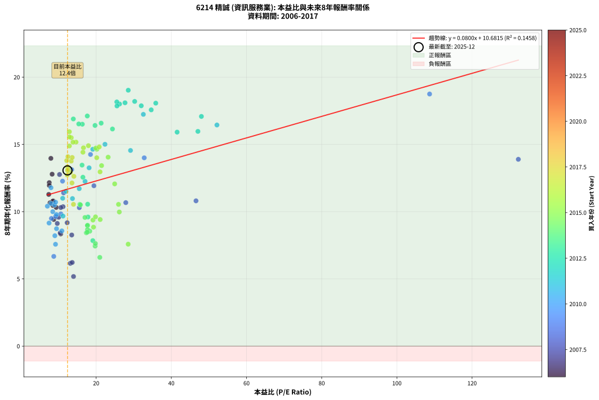
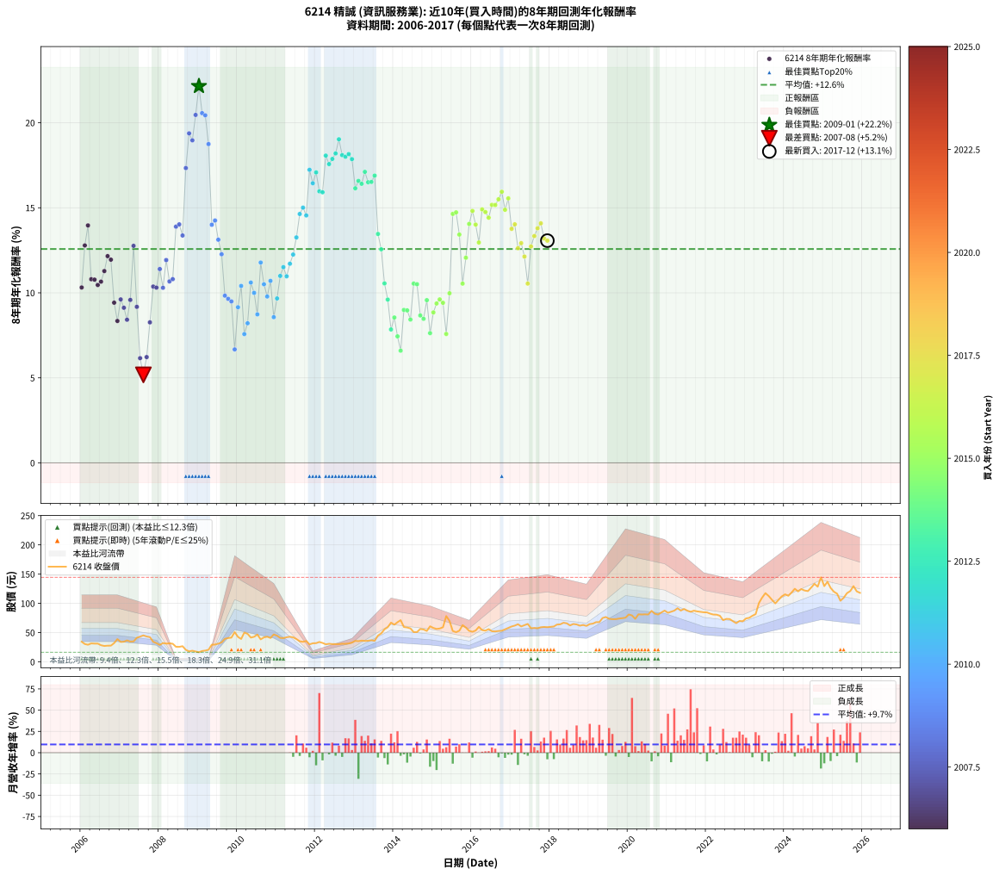

# 6214 精誠 - 本益比與未來報酬率分析

!!! info "報告資訊"
    - **股票代號**: 6214
    - **公司名稱**: 精誠
    - **產業別**: 資訊服務業
    - **分析期間**: 2006-2017 (144 個數據點)
    - **資料來源**: Type 12 (ShowMonthlyK_ChartFlow) 月收盤價與本益比
    - **報酬率口徑**: 含現金股利 (簡化: 年度合計，假設每年7/1入帳)
    - **報告生成時間**: 2026-01-10 21:14:42 CST

## 📈 視覺化圖表

### 圖表1: 本益比 vs 未來報酬率關係

*圖表1：6214 精誠 本益比與8年期未來報酬率關係 (2006-2017)*

### 圖表2: 歷年買入時點的8年期實際報酬率

*圖表2：6214 精誠 歷年買入時點的8年期實際報酬率 (2006-2017)*

## 📍 買點訊號說明

本報告提供兩種買點提示訊號（顯示於圖表2的股價子圖中）：

### ▲ 小綠色三角形（回測驗證）
- **計算方式**: 使用全部歷史資料計算本益比第25百分位數
- **用途**: 事後驗證，顯示歷史上哪些時點確實為低估區
- **限制**: 當下無法判斷，僅供回測參考
- **特性**: 後見之明（Look-Ahead Bias）

### ▲ 小橘色三角形（即時訊號）
- **計算方式**: 使用截至當月的過去5年資料計算本益比第25百分位數
- **用途**: 實際投資決策，當時即可判斷
- **優勢**: 可操作性強，符合實務需求
- **特性**: 無後見之明，滾動窗口計算

!!! tip "如何使用兩種訊號"
    - **綠色▲** 幫助理解歷史估值機會，驗證策略有效性
    - **橘色▲** 可作為實際買進參考，但仍需搭配基本面分析
    - 兩種訊號重疊時，表示即時判斷與事後驗證一致，信心度較高
    - 僅有綠色▲時，表示當時無法判斷（需要未來資料才能確認）
    - 僅有橘色▲時，表示即時判斷為買點，但事後可能不是最佳時機

## 📊 估值分析摘要

| 指標 | 數值 |
|:---:|:---:|
| **目前本益比** (2017-12) | **12.38 倍** |
| **歷史平均本益比** | 18.71 倍 |
| **估值水準** | 🟢 相對低估 |
| **預期8年年化報酬率** | **+11.67%** |
| **歷史平均報酬率** | +12.58% |
| **相關係數 (R²)** | 0.1458 |
| **趨勢線斜率** | 0.0800 |

!!! abstract "核心洞察"
    目前本益比顯著低於歷史平均，預期未來報酬率可能較高

    根據歷史數據回測，6214 精誠 在目前本益比 **12.4倍** 的估值水準下，
    預期未來8年年化報酬率約為 **+11.7%**。

    **重要提醒**: 本分析基於歷史數據統計，實際報酬率會受到公司基本面變化、產業趨勢、
    總體經濟環境等多重因素影響。R² = 0.15 表示本益比可解釋約 14.6% 的報酬率變異。

## 📈 歷史估值統計

### 最佳買點 (最高報酬率)

| 項目 | 數值 |
|:---:|:---:|
| 起始時間 | 2009-01 |
| 當時本益比 | nan 倍 |
| 起始價格 | 16.4 元 |
| 8年後價格 | 60.5 元 |
| **8年年化報酬率** | **+22.15%** |

### 最差買點 (最低報酬率)

| 項目 | 數值 |
|:---:|:---:|
| 起始時間 | 2007-08 |
| 當時本益比 | 13.98 倍 |
| 起始價格 | 45.3 元 |
| 8年後價格 | 50.8 元 |
| **8年年化報酬率** | **+5.18%** |

## 🎯 投資啟示

### 本益比與報酬率關係

趨勢線方程式: **y = 0.0800x + 10.6815**

!!! info "弱相關或正相關"
    本益比與未來報酬率相關性較弱。這可能表示該股票的報酬率更多受到
    公司成長性、產業趨勢等因素影響，而非估值水準。**需綜合考量多項指標**。

### 估值區間建議

基於歷史數據分析:

- **🟢 低估區** (P/E < 15.0): 預期報酬率較高，可考慮增加持股
- **🟡 合理區** (P/E 15.0-22.5): 預期報酬率符合長期趨勢，正常持有
- **🔴 高估區** (P/E > 22.5): 預期報酬率較低，可考慮減碼或觀望

!!! danger "風險提示"
    - 過去表現不代表未來結果
    - 本分析假設公司基本面無重大結構性變化
    - 產業環境劇變可能使歷史規律失效
    - 應結合公司財報、產業趨勢、總體經濟等多重因素綜合判斷

!!! success "長期投資觀點"
    歷史數據顯示，在合理或低估的估值水準買入並長期持有，
    往往能獲得較佳的投資報酬。**耐心等待好價格**是價值投資的核心原則。

## 📊 數據品質

- **資料來源**: GoodInfo.tw Type 12 (ShowMonthlyK_ChartFlow)
- **資料頻率**: 月度收盤價與本益比
- **回測期間**: 2006-2017
- **數據點數量**: 144 個 (每個點代表一次8年期回測)

### 計算方法說明

1. **8年期年化報酬率**:
   - 對每個歷史時點，計算其後8年的實際投資報酬率
   - 期末價值(不含股利): 期末價格
   - 期末價值(含現金股利): 期末價格 + 持有期間內的現金股利合計 (簡化: 年度合計，假設每年7/1入帳)
   - 公式: 年化報酬率 = [(期末價值/期初價格)^(1/年數) - 1] × 100%

2. **本益比 (P/E Ratio)**:
   - 使用當時的月收盤價與EPS計算
   - 資料來源: Type 12 月度河流圖本益比數據

3. **趨勢線 (Linear Regression)**:
   - 使用最小平方法擬合線性趨勢線
   - R²值衡量本益比對報酬率的解釋能力

---

*本報告由 Stock Analysis System v1.9.0 自動生成*
*數據更新時間: 2026-01-10 21:14:42 CST*

## 📋 月度回測明細表

（每一列對應時間線圖中的一個買入點；可用來對照 SVG 圖上的每個點。）

| 買入月份 | 賣出月份 | 回測期限_年 | 實際持有年數 | 買入本益比_倍 | 買入收盤價_元 | 賣出收盤價_元 | 現金股利合計_元 | 總報酬率_pct | 年化報酬率_pct |
| --- | --- | --- | --- | --- | --- | --- | --- | --- | --- |
| 2006-01 | 2014-01 | 8 | 8.000 | 9.38 | 34.50 | 63.60 | 12.06 | +119.30 | +10.31 |
| 2006-02 | 2014-02 | 8 | 8.000 | 8.29 | 30.50 | 67.80 | 12.06 | +161.83 | +12.79 |
| 2006-03 | 2014-03 | 8 | 8.000 | 7.96 | 29.30 | 71.30 | 12.06 | +184.49 | +13.96 |
| 2006-04 | 2014-04 | 8 | 8.000 | 8.57 | 31.55 | 59.60 | 12.06 | +127.12 | +10.80 |
| 2006-05 | 2014-05 | 8 | 8.000 | 8.49 | 31.25 | 58.80 | 12.06 | +126.74 | +10.77 |
| 2006-06 | 2014-06 | 8 | 8.000 | 8.49 | 31.25 | 57.20 | 12.06 | +121.62 | +10.46 |
| 2006-07 | 2014-07 | 8 | 8.000 | 7.73 | 28.45 | 50.90 | 13.06 | +124.80 | +10.66 |
| 2006-08 | 2014-08 | 8 | 8.000 | 7.39 | 27.20 | 50.90 | 13.06 | +135.14 | +11.28 |
| 2006-09 | 2014-09 | 8 | 8.000 | 7.53 | 27.70 | 56.30 | 13.06 | +150.39 | +12.16 |
| 2006-10 | 2014-10 | 8 | 8.000 | 7.54 | 27.75 | 55.40 | 13.06 | +146.69 | +11.95 |
| 2006-11 | 2014-11 | 8 | 8.000 | 8.72 | 32.10 | 52.90 | 13.06 | +105.47 | +9.42 |
| 2006-12 | 2014-12 | 8 | 8.000 | 10.57 | 38.90 | 60.80 | 13.06 | +89.86 | +8.34 |
| 2007-01 | 2015-01 | 8 | 8.000 | 9.41 | 34.10 | 58.00 | 13.06 | +108.38 | +9.61 |
| 2007-02 | 2015-02 | 8 | 8.000 | 9.66 | 34.50 | 56.30 | 13.06 | +101.03 | +9.12 |
| 2007-03 | 2015-03 | 8 | 8.000 | 10.44 | 36.70 | 57.00 | 13.06 | +90.89 | +8.42 |
| 2007-04 | 2015-04 | 8 | 8.000 | 10.04 | 34.75 | 59.20 | 13.06 | +107.93 | +9.58 |
| 2007-05 | 2015-05 | 8 | 8.000 | 10.26 | 34.95 | 78.30 | 13.06 | +161.39 | +12.76 |
| 2007-06 | 2015-06 | 8 | 8.000 | 12.30 | 41.20 | 70.10 | 13.06 | +101.84 | +9.18 |
| 2007-07 | 2015-07 | 8 | 8.000 | 13.14 | 43.30 | 52.80 | 17.03 | +61.28 | +6.16 |
| 2007-08 | 2015-08 | 8 | 8.000 | 13.98 | 45.30 | 50.80 | 17.03 | +49.74 | +5.18 |
| 2007-09 | 2015-09 | 8 | 8.000 | 13.63 | 43.40 | 53.30 | 17.03 | +62.06 | +6.22 |
| 2007-10 | 2015-10 | 8 | 8.000 | 13.51 | 42.30 | 62.80 | 17.03 | +88.73 | +8.26 |
| 2007-11 | 2015-11 | 8 | 8.000 | 11.19 | 34.40 | 58.70 | 17.03 | +120.16 | +10.37 |
| 2007-12 | 2015-12 | 8 | 8.000 | 10.60 | 32.00 | 53.10 | 17.03 | +119.17 | +10.31 |
| 2008-01 | 2016-01 | 8 | 8.000 | 11.34 | 28.90 | 51.50 | 17.03 | +137.14 | +11.40 |
| 2008-02 | 2016-02 | 8 | 8.000 | 15.52 | 32.25 | 53.60 | 17.03 | +119.02 | +10.30 |
| 2008-03 | 2016-03 | 8 | 8.000 | 19.41 | 31.20 | 59.80 | 17.03 | +146.26 | +11.92 |
| 2008-04 | 2016-04 | 8 | 8.000 | 27.89 | 31.70 | 54.30 | 17.03 | +125.03 | +10.67 |
| 2008-05 | 2016-05 | 8 | 8.000 | 46.56 | 31.00 | 53.40 | 17.03 | +127.21 | +10.80 |
| 2008-06 | 2016-06 | 8 | 8.000 | 132.30 | 25.80 | 56.00 | 17.03 | +183.08 | +13.89 |
| 2008-07 | 2016-07 | 8 | 8.000 |  | 25.70 | 52.40 | 21.03 | +185.74 | +14.02 |
| 2008-08 | 2016-08 | 8 | 8.000 |  | 26.80 | 52.10 | 21.03 | +172.89 | +13.37 |
| 2008-09 | 2016-09 | 8 | 8.000 |  | 20.55 | 52.80 | 21.03 | +259.29 | +17.34 |
| 2008-10 | 2016-10 | 8 | 8.000 |  | 18.00 | 53.20 | 21.03 | +312.41 | +19.38 |
| 2008-11 | 2016-11 | 8 | 8.000 |  | 19.10 | 55.60 | 21.03 | +301.23 | +18.97 |
| 2008-12 | 2016-12 | 8 | 8.000 |  | 17.85 | 58.10 | 21.03 | +343.33 | +20.46 |
| 2009-01 | 2017-01 | 8 | 8.000 |  | 16.45 | 60.50 | 21.03 | +395.65 | +22.15 |
| 2009-02 | 2017-02 | 8 | 8.000 |  | 18.60 | 62.00 | 21.03 | +346.42 | +20.56 |
| 2009-03 | 2017-03 | 8 | 8.000 |  | 19.30 | 64.40 | 21.03 | +342.66 | +20.44 |
| 2009-04 | 2017-04 | 8 | 8.000 | 108.70 | 20.65 | 60.60 | 21.03 | +295.32 | +18.75 |
| 2009-05 | 2017-05 | 8 | 8.000 | 32.79 | 29.35 | 62.70 | 21.03 | +185.29 | +14.00 |
| 2009-06 | 2017-06 | 8 | 8.000 | 18.50 | 29.60 | 64.90 | 21.03 | +190.32 | +14.25 |
| 2009-07 | 2017-07 | 8 | 8.000 | 13.51 | 31.15 | 57.50 | 26.03 | +168.17 | +13.12 |
| 2009-08 | 2017-08 | 8 | 8.000 | 11.06 | 33.30 | 58.00 | 26.03 | +152.35 | +12.27 |
| 2009-09 | 2017-09 | 8 | 8.000 | 10.61 | 39.40 | 57.40 | 26.03 | +111.76 | +9.83 |
| 2009-10 | 2017-10 | 8 | 8.000 | 9.23 | 40.80 | 59.20 | 26.03 | +108.91 | +9.65 |
| 2009-11 | 2017-11 | 8 | 8.000 | 8.10 | 41.50 | 59.70 | 26.03 | +106.59 | +9.49 |
| 2009-12 | 2017-12 | 8 | 8.000 | 8.73 | 50.90 | 59.30 | 26.03 | +67.65 | +6.67 |
| 2010-01 | 2018-01 | 8 | 8.000 | 7.48 | 42.65 | 59.90 | 26.03 | +101.49 | +9.15 |
| 2010-02 | 2018-02 | 8 | 8.000 | 7.03 | 39.20 | 60.50 | 26.03 | +120.75 | +10.40 |
| 2010-03 | 2018-03 | 8 | 8.000 | 9.19 | 50.10 | 63.80 | 26.03 | +79.31 | +7.57 |
| 2010-04 | 2018-04 | 8 | 8.000 | 9.02 | 48.00 | 64.20 | 26.03 | +87.99 | +8.21 |
| 2010-05 | 2018-05 | 8 | 8.000 | 7.99 | 41.50 | 66.90 | 26.03 | +123.94 | +10.60 |
| 2010-06 | 2018-06 | 8 | 8.000 | 8.46 | 42.90 | 65.90 | 26.03 | +114.30 | +10.00 |
| 2010-07 | 2018-07 | 8 | 8.000 | 9.46 | 46.75 | 62.30 | 29.04 | +95.37 | +8.73 |
| 2010-08 | 2018-08 | 8 | 8.000 | 7.99 | 38.50 | 64.80 | 29.04 | +143.73 | +11.78 |
| 2010-09 | 2018-09 | 8 | 8.000 | 8.92 | 41.85 | 64.00 | 29.04 | +122.31 | +10.50 |
| 2010-10 | 2018-10 | 8 | 8.000 | 9.44 | 43.10 | 61.90 | 29.04 | +110.99 | +9.78 |
| 2010-11 | 2018-11 | 8 | 8.000 | 9.21 | 40.85 | 63.10 | 29.04 | +125.54 | +10.70 |
| 2010-12 | 2018-12 | 8 | 8.000 | 10.88 | 46.90 | 61.50 | 29.04 | +93.04 | +8.57 |
| 2011-01 | 2019-01 | 8 | 8.000 | 11.18 | 44.75 | 64.60 | 29.04 | +109.24 | +9.67 |
| 2011-02 | 2019-02 | 8 | 8.000 | 11.10 | 41.00 | 65.40 | 29.04 | +130.33 | +10.99 |
| 2011-03 | 2019-03 | 8 | 8.000 | 11.98 | 40.55 | 67.90 | 29.04 | +139.05 | +11.51 |
| 2011-04 | 2019-04 | 8 | 8.000 | 13.70 | 42.15 | 67.90 | 29.04 | +129.98 | +10.97 |
| 2011-05 | 2019-05 | 8 | 8.000 | 15.50 | 42.90 | 75.00 | 29.04 | +142.51 | +11.71 |
| 2011-06 | 2019-06 | 8 | 8.000 | 17.05 | 41.95 | 76.70 | 29.04 | +152.05 | +12.25 |
| 2011-07 | 2019-07 | 8 | 8.000 | 18.13 | 39.00 | 73.60 | 31.98 | +170.71 | +13.26 |
| 2011-08 | 2019-08 | 8 | 8.000 | 19.10 | 35.20 | 73.00 | 31.98 | +198.23 | +14.64 |
| 2011-09 | 2019-09 | 8 | 8.000 | 22.35 | 34.30 | 73.00 | 31.98 | +206.05 | +15.01 |
| 2011-10 | 2019-10 | 8 | 8.000 | 29.14 | 35.75 | 74.00 | 31.98 | +196.44 | +14.55 |
| 2011-11 | 2019-11 | 8 | 8.000 | 32.56 | 29.90 | 74.70 | 31.98 | +256.78 | +17.23 |
| 2011-12 | 2019-12 | 8 | 8.000 | 52.13 | 31.80 | 75.50 | 31.98 | +237.97 | +16.44 |
| 2012-01 | 2020-01 | 8 | 8.000 | 48.00 | 32.00 | 81.00 | 31.98 | +253.05 | +17.08 |
| 2012-02 | 2020-02 | 8 | 8.000 | 47.07 | 34.05 | 79.40 | 31.98 | +227.10 | +15.97 |
| 2012-03 | 2020-03 | 8 | 8.000 | 41.54 | 32.40 | 73.60 | 31.98 | +225.85 | +15.91 |
| 2012-04 | 2020-04 | 8 | 8.000 | 35.86 | 30.00 | 81.30 | 31.98 | +277.59 | +18.07 |
| 2012-05 | 2020-05 | 8 | 8.000 | 34.65 | 30.95 | 81.00 | 31.98 | +265.03 | +17.57 |
| 2012-06 | 2020-06 | 8 | 8.000 | 32.00 | 30.40 | 81.30 | 31.98 | +272.62 | +17.87 |
| 2012-07 | 2020-07 | 8 | 8.000 | 30.25 | 30.45 | 81.00 | 34.98 | +280.87 | +18.19 |
| 2012-08 | 2020-08 | 8 | 8.000 | 28.54 | 30.35 | 87.30 | 34.98 | +302.89 | +19.03 |
| 2012-09 | 2020-09 | 8 | 8.000 | 27.68 | 31.00 | 82.30 | 34.98 | +278.31 | +18.09 |
| 2012-10 | 2020-10 | 8 | 8.000 | 26.22 | 30.85 | 81.00 | 34.98 | +275.94 | +18.00 |
| 2012-11 | 2020-11 | 8 | 8.000 | 25.50 | 31.45 | 84.50 | 34.98 | +279.89 | +18.16 |
| 2012-12 | 2020-12 | 8 | 8.000 | 25.54 | 32.95 | 87.70 | 34.98 | +272.31 | +17.86 |
| 2013-01 | 2021-01 | 8 | 8.000 | 24.34 | 35.90 | 83.90 | 34.98 | +231.13 | +16.14 |
| 2013-02 | 2021-02 | 8 | 8.000 | 21.33 | 35.40 | 85.80 | 34.98 | +241.18 | +16.58 |
| 2013-03 | 2021-03 | 8 | 8.000 | 19.70 | 36.35 | 87.60 | 34.98 | +237.21 | +16.41 |
| 2013-04 | 2021-04 | 8 | 8.000 | 17.64 | 35.80 | 91.70 | 34.98 | +253.84 | +17.11 |
| 2013-05 | 2021-05 | 8 | 8.000 | 16.32 | 36.15 | 87.70 | 34.98 | +239.35 | +16.50 |
| 2013-06 | 2021-06 | 8 | 8.000 | 15.38 | 36.90 | 90.40 | 34.98 | +239.77 | +16.52 |
| 2013-07 | 2021-07 | 8 | 8.000 | 13.93 | 36.00 | 87.50 | 37.98 | +248.55 | +16.89 |
| 2013-08 | 2021-08 | 8 | 8.000 | 16.25 | 45.00 | 85.60 | 37.98 | +174.62 | +13.46 |
| 2013-09 | 2021-09 | 8 | 8.000 | 16.48 | 48.70 | 87.50 | 37.98 | +157.65 | +12.56 |
| 2013-10 | 2021-10 | 8 | 8.000 | 17.74 | 55.70 | 86.30 | 37.98 | +123.12 | +10.55 |
| 2013-11 | 2021-11 | 8 | 8.000 | 17.83 | 59.30 | 85.50 | 37.98 | +108.22 | +9.60 |
| 2013-12 | 2021-12 | 8 | 8.000 | 19.12 | 67.10 | 84.80 | 37.98 | +82.98 | +7.84 |
| 2014-01 | 2022-01 | 8 | 8.000 | 18.31 | 63.60 | 84.60 | 37.98 | +92.73 | +8.55 |
| 2014-02 | 2022-02 | 8 | 8.000 | 19.73 | 67.80 | 82.40 | 37.98 | +77.55 | +7.44 |
| 2014-03 | 2022-03 | 8 | 8.000 | 20.97 | 71.30 | 80.90 | 37.98 | +66.73 | +6.60 |
| 2014-04 | 2022-04 | 8 | 8.000 | 17.72 | 59.60 | 80.70 | 37.98 | +99.12 | +8.99 |
| 2014-05 | 2022-05 | 8 | 8.000 | 17.68 | 58.80 | 78.90 | 37.98 | +98.77 | +8.97 |
| 2014-06 | 2022-06 | 8 | 8.000 | 17.39 | 57.20 | 71.30 | 37.98 | +91.04 | +8.43 |
| 2014-07 | 2022-07 | 8 | 8.000 | 15.65 | 50.90 | 73.50 | 39.98 | +122.94 | +10.54 |
| 2014-08 | 2022-08 | 8 | 8.000 | 15.82 | 50.90 | 73.20 | 39.98 | +122.35 | +10.50 |
| 2014-09 | 2022-09 | 8 | 8.000 | 17.70 | 56.30 | 69.50 | 39.98 | +94.45 | +8.67 |
| 2014-10 | 2022-10 | 8 | 8.000 | 17.62 | 55.40 | 66.20 | 39.98 | +91.66 | +8.47 |
| 2014-11 | 2022-11 | 8 | 8.000 | 17.03 | 52.90 | 69.90 | 39.98 | +107.71 | +9.57 |
| 2014-12 | 2022-12 | 8 | 8.000 | 19.80 | 60.80 | 69.50 | 39.98 | +80.06 | +7.63 |
| 2015-01 | 2023-01 | 8 | 8.000 | 19.30 | 58.00 | 74.30 | 39.98 | +97.03 | +8.85 |
| 2015-02 | 2023-02 | 8 | 8.000 | 19.15 | 56.30 | 75.30 | 39.98 | +104.75 | +9.37 |
| 2015-03 | 2023-03 | 8 | 8.000 | 19.83 | 57.00 | 78.80 | 39.98 | +108.38 | +9.61 |
| 2015-04 | 2023-04 | 8 | 8.000 | 21.07 | 59.20 | 81.60 | 39.98 | +105.37 | +9.41 |
| 2015-05 | 2023-05 | 8 | 8.000 | 28.52 | 78.30 | 100.50 | 39.98 | +79.41 | +7.58 |
| 2015-06 | 2023-06 | 8 | 8.000 | 26.16 | 70.10 | 110.00 | 39.98 | +113.95 | +9.97 |
| 2015-07 | 2023-07 | 8 | 8.000 | 20.19 | 52.80 | 117.50 | 40.00 | +198.30 | +14.64 |
| 2015-08 | 2023-08 | 8 | 8.000 | 19.92 | 50.80 | 112.50 | 40.00 | +200.20 | +14.73 |
| 2015-09 | 2023-09 | 8 | 8.000 | 21.45 | 53.30 | 106.00 | 40.00 | +173.92 | +13.42 |
| 2015-10 | 2023-10 | 8 | 8.000 | 25.95 | 62.80 | 100.00 | 40.00 | +122.93 | +10.54 |
| 2015-11 | 2023-11 | 8 | 8.000 | 24.93 | 58.70 | 106.00 | 40.00 | +148.72 | +12.06 |
| 2015-12 | 2023-12 | 8 | 8.000 | 23.19 | 53.10 | 112.00 | 40.00 | +186.25 | +14.05 |
| 2016-01 | 2024-01 | 8 | 8.000 | 20.82 | 51.50 | 115.50 | 40.00 | +201.94 | +14.81 |
| 2016-02 | 2024-02 | 8 | 8.000 | 20.16 | 53.60 | 113.00 | 40.00 | +185.45 | +14.01 |
| 2016-03 | 2024-03 | 8 | 8.000 | 21.04 | 59.80 | 118.50 | 40.00 | +165.05 | +12.96 |
| 2016-04 | 2024-04 | 8 | 8.000 | 17.94 | 54.30 | 125.00 | 40.00 | +203.87 | +14.90 |
| 2016-05 | 2024-05 | 8 | 8.000 | 16.63 | 53.40 | 120.50 | 40.00 | +200.56 | +14.75 |
| 2016-06 | 2024-06 | 8 | 8.000 | 16.49 | 56.00 | 124.50 | 40.00 | +193.75 | +14.42 |
| 2016-07 | 2024-07 | 8 | 8.000 | 14.64 | 52.40 | 122.00 | 40.20 | +209.54 | +15.17 |
| 2016-08 | 2024-08 | 8 | 8.000 | 13.84 | 52.10 | 121.00 | 40.20 | +209.40 | +15.16 |
| 2016-09 | 2024-09 | 8 | 8.000 | 13.38 | 52.80 | 127.00 | 40.20 | +216.67 | +15.50 |
| 2016-10 | 2024-10 | 8 | 8.000 | 12.88 | 53.20 | 133.50 | 40.20 | +226.50 | +15.94 |
| 2016-11 | 2024-11 | 8 | 8.000 | 12.88 | 55.60 | 128.50 | 40.20 | +203.42 | +14.88 |
| 2016-12 | 2024-12 | 8 | 8.000 | 12.91 | 58.10 | 144.50 | 40.20 | +217.90 | +15.55 |
| 2017-01 | 2025-01 | 8 | 8.000 | 13.37 | 60.50 | 129.50 | 40.20 | +180.50 | +13.76 |
| 2017-02 | 2025-02 | 8 | 8.000 | 13.63 | 62.00 | 137.00 | 40.20 | +185.81 | +14.03 |
| 2017-03 | 2025-03 | 8 | 8.000 | 14.08 | 64.40 | 126.50 | 40.20 | +158.85 | +12.62 |
| 2017-04 | 2025-04 | 8 | 8.000 | 13.18 | 60.60 | 120.00 | 40.20 | +164.36 | +12.92 |
| 2017-05 | 2025-05 | 8 | 8.000 | 13.57 | 62.70 | 116.50 | 40.20 | +149.92 | +12.13 |
| 2017-06 | 2025-06 | 8 | 8.000 | 13.97 | 64.90 | 104.50 | 40.20 | +122.96 | +10.54 |
| 2017-07 | 2025-07 | 8 | 8.000 | 12.31 | 57.50 | 109.50 | 40.40 | +160.70 | +12.72 |
| 2017-08 | 2025-08 | 8 | 8.000 | 12.36 | 58.00 | 117.50 | 40.40 | +172.24 | +13.34 |
| 2017-09 | 2025-09 | 8 | 8.000 | 12.17 | 57.40 | 121.00 | 40.40 | +181.18 | +13.80 |
| 2017-10 | 2025-10 | 8 | 8.000 | 12.49 | 59.20 | 129.50 | 40.40 | +186.99 | +14.09 |
| 2017-11 | 2025-11 | 8 | 8.000 | 12.53 | 59.70 | 120.50 | 40.40 | +169.51 | +13.19 |
| 2017-12 | 2025-12 | 8 | 8.000 | 12.38 | 59.30 | 118.00 | 40.40 | +167.12 | +13.07 |
