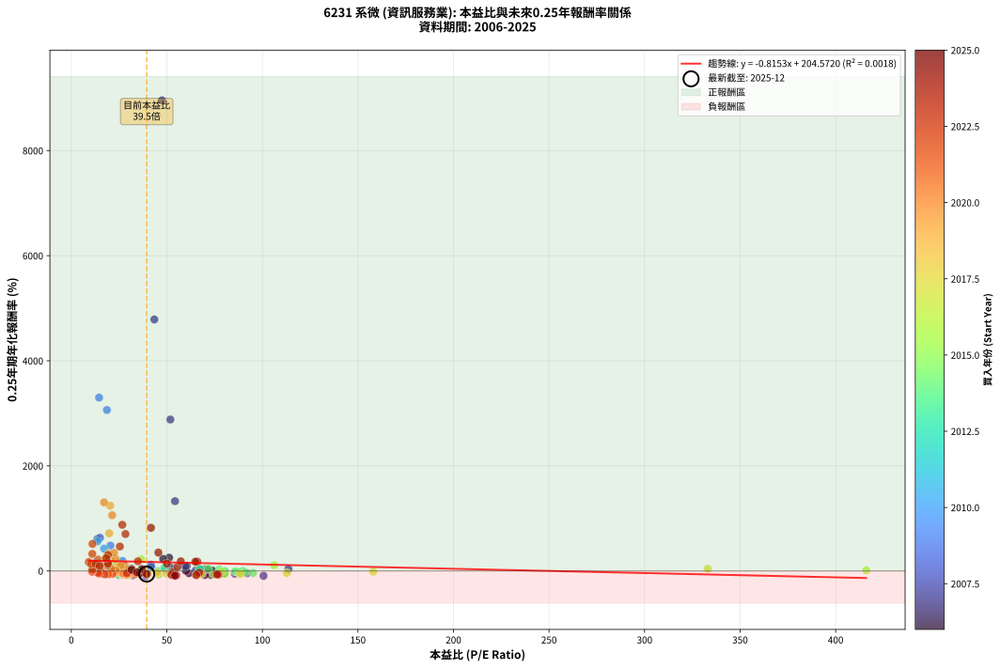
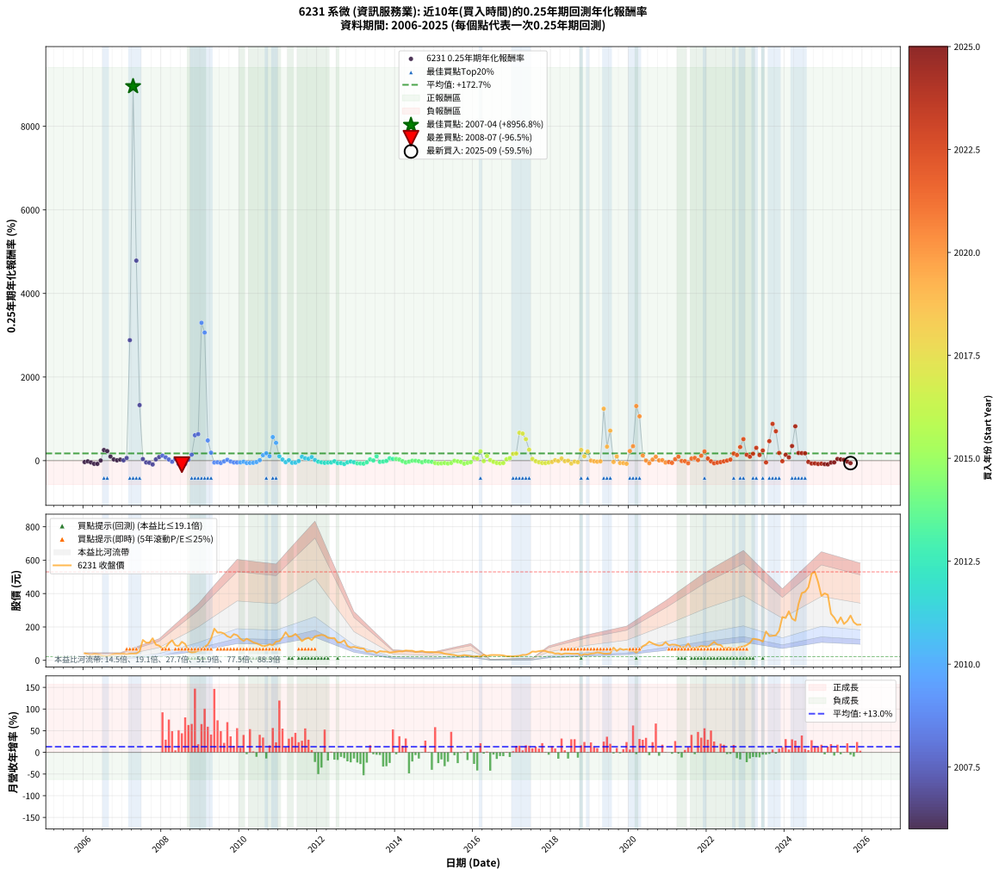

# 6231 系微 - 本益比與未來報酬率分析

!!! info "報告資訊"
    - **股票代號**: 6231
    - **公司名稱**: 系微
    - **產業別**: 資訊服務業
    - **分析期間**: 2006-2025 (237 個數據點)
    - **資料來源**: Type 12 (ShowMonthlyK_ChartFlow) 月收盤價與本益比
    - **報酬率口徑**: 含現金股利 (簡化: 年度合計，假設每年7/1入帳)
    - **報告生成時間**: 2026-01-10 23:06:11 CST

## 📈 視覺化圖表

### 圖表1: 本益比 vs 未來報酬率關係

*圖表1：6231 系微 本益比與0.25年期未來報酬率關係 (2006-2025)*

### 圖表2: 歷年買入時點的0.25年期實際報酬率

*圖表2：6231 系微 歷年買入時點的0.25年期實際報酬率 (2006-2025)*

## 📍 買點訊號說明

本報告提供兩種買點提示訊號（顯示於圖表2的股價子圖中）：

### ▲ 小綠色三角形（回測驗證）
- **計算方式**: 使用全部歷史資料計算本益比第25百分位數
- **用途**: 事後驗證，顯示歷史上哪些時點確實為低估區
- **限制**: 當下無法判斷，僅供回測參考
- **特性**: 後見之明（Look-Ahead Bias）

### ▲ 小橘色三角形（即時訊號）
- **計算方式**: 使用截至當月的過去5年資料計算本益比第25百分位數
- **用途**: 實際投資決策，當時即可判斷
- **優勢**: 可操作性強，符合實務需求
- **特性**: 無後見之明，滾動窗口計算

!!! tip "如何使用兩種訊號"
    - **綠色▲** 幫助理解歷史估值機會，驗證策略有效性
    - **橘色▲** 可作為實際買進參考，但仍需搭配基本面分析
    - 兩種訊號重疊時，表示即時判斷與事後驗證一致，信心度較高
    - 僅有綠色▲時，表示當時無法判斷（需要未來資料才能確認）
    - 僅有橘色▲時，表示即時判斷為買點，但事後可能不是最佳時機

## 📊 估值分析摘要

| 指標 | 數值 |
|:---:|:---:|
| **目前本益比** (2025-09) | **39.46 倍** |
| **歷史平均本益比** | 40.38 倍 |
| **估值水準** | 🟡 合理範圍 |
| **預期0.25年年化報酬率** | **+172.40%** |
| **歷史平均報酬率** | +172.68% |
| **相關係數 (R²)** | 0.0018 |
| **趨勢線斜率** | -0.8153 |

!!! abstract "核心洞察"
    目前本益比接近歷史平均，預期報酬率符合長期趨勢

    根據歷史數據回測，6231 系微 在目前本益比 **39.5倍** 的估值水準下，
    預期未來0.25年年化報酬率約為 **+172.4%**。

    **重要提醒**: 本分析基於歷史數據統計，實際報酬率會受到公司基本面變化、產業趨勢、
    總體經濟環境等多重因素影響。R² = 0.00 表示本益比可解釋約 0.2% 的報酬率變異。

## 📈 歷史估值統計

### 最佳買點 (最高報酬率)

| 項目 | 數值 |
|:---:|:---:|
| 起始時間 | 2007-04 |
| 當時本益比 | 47.45 倍 |
| 起始價格 | 39.7 元 |
| 0.25年後價格 | 122.0 元 |
| **0.25年年化報酬率** | **+8956.80%** |

### 最差買點 (最低報酬率)

| 項目 | 數值 |
|:---:|:---:|
| 起始時間 | 2008-07 |
| 當時本益比 | 38.91 倍 |
| 起始價格 | 111.0 元 |
| 0.25年後價格 | 47.6 元 |
| **0.25年年化報酬率** | **-96.53%** |

## 🎯 投資啟示

### 本益比與報酬率關係

趨勢線方程式: **y = -0.8153x + 204.5720**

!!! warning "強負相關"
    本益比與未來報酬率呈現強負相關。在高本益比時期買入，未來報酬率顯著較低；
    在低本益比時期買入，未來報酬率顯著較高。**估值紀律至關重要**。

### 估值區間建議

基於歷史數據分析:

- **🟢 低估區** (P/E < 32.3): 預期報酬率較高，可考慮增加持股
- **🟡 合理區** (P/E 32.3-48.5): 預期報酬率符合長期趨勢，正常持有
- **🔴 高估區** (P/E > 48.5): 預期報酬率較低，可考慮減碼或觀望

!!! danger "風險提示"
    - 過去表現不代表未來結果
    - 本分析假設公司基本面無重大結構性變化
    - 產業環境劇變可能使歷史規律失效
    - 應結合公司財報、產業趨勢、總體經濟等多重因素綜合判斷

!!! success "長期投資觀點"
    歷史數據顯示，在合理或低估的估值水準買入並長期持有，
    往往能獲得較佳的投資報酬。**耐心等待好價格**是價值投資的核心原則。

## 📊 數據品質

- **資料來源**: GoodInfo.tw Type 12 (ShowMonthlyK_ChartFlow)
- **資料頻率**: 月度收盤價與本益比
- **回測期間**: 2006-2025
- **數據點數量**: 237 個 (每個點代表一次0.25年期回測)

### 計算方法說明

1. **0.25年期年化報酬率**:
   - 對每個歷史時點，計算其後0.25年的實際投資報酬率
   - 期末價值(不含股利): 期末價格
   - 期末價值(含現金股利): 期末價格 + 持有期間內的現金股利合計 (簡化: 年度合計，假設每年7/1入帳)
   - 公式: 年化報酬率 = [(期末價值/期初價格)^(1/年數) - 1] × 100%

2. **本益比 (P/E Ratio)**:
   - 使用當時的月收盤價與EPS計算
   - 資料來源: Type 12 月度河流圖本益比數據

3. **趨勢線 (Linear Regression)**:
   - 使用最小平方法擬合線性趨勢線
   - R²值衡量本益比對報酬率的解釋能力

---

*本報告由 Stock Analysis System v1.9.0 自動生成*
*數據更新時間: 2026-01-10 23:06:11 CST*

## 📋 月度回測明細表

（每一列對應時間線圖中的一個買入點；可用來對照 SVG 圖上的每個點。）

| 買入月份 | 賣出月份 | 回測期限_年 | 實際持有年數 | 買入本益比_倍 | 買入收盤價_元 | 賣出收盤價_元 | 現金股利合計_元 | 總報酬率_pct | 年化報酬率_pct |
| --- | --- | --- | --- | --- | --- | --- | --- | --- | --- |
| 2006-01 | 2006-05 | 0.25 | 0.329 | 80.19 | 41.70 | 36.30 | 0.00 | -12.95 | -34.43 |
| 2006-02 | 2006-05 | 0.25 | 0.246 | 73.08 | 38.00 | 36.30 | 0.00 | -4.47 | -16.95 |
| 2006-03 | 2006-07 | 0.25 | 0.334 | 61.54 | 32.00 | 26.60 | 0.00 | -16.87 | -42.50 |
| 2006-04 | 2006-07 | 0.25 | 0.249 | 73.08 | 38.00 | 26.60 | 0.00 | -30.00 | -76.11 |
| 2006-05 | 2006-08 | 0.25 | 0.252 | 69.81 | 36.30 | 25.00 | 0.00 | -31.13 | -77.25 |
| 2006-06 | 2006-09 | 0.25 | 0.252 | 60.00 | 31.20 | 31.40 | 0.00 | +0.64 | +2.57 |
| 2006-07 | 2006-10 | 0.25 | 0.252 | 51.15 | 26.60 | 36.55 | 0.00 | +37.41 | +253.10 |
| 2006-08 | 2006-12 | 0.25 | 0.334 | 48.08 | 25.00 | 37.20 | 0.00 | +48.80 | +228.66 |
| 2006-09 | 2006-12 | 0.25 | 0.249 | 60.38 | 31.40 | 37.20 | 0.00 | +18.47 | +97.45 |
| 2006-10 | 2007-01 | 0.25 | 0.252 | 70.29 | 36.55 | 39.00 | 0.00 | +6.70 | +29.38 |
| 2006-11 | 2007-03 | 0.25 | 0.329 | 73.85 | 38.40 | 39.25 | 0.00 | +2.21 | +6.89 |
| 2006-12 | 2007-03 | 0.25 | 0.246 | 71.54 | 37.20 | 39.25 | 0.00 | +5.51 | +24.32 |
| 2007-01 | 2007-05 | 0.25 | 0.329 | 65.09 | 39.00 | 39.80 | 0.00 | +2.05 | +6.38 |
| 2007-02 | 2007-05 | 0.25 | 0.246 | 52.04 | 35.30 | 39.80 | 0.00 | +12.75 | +62.73 |
| 2007-03 | 2007-07 | 0.25 | 0.334 | 51.82 | 39.25 | 122.00 | 0.00 | +210.83 | +2882.17 |
| 2007-04 | 2007-07 | 0.25 | 0.249 | 47.45 | 39.70 | 122.00 | 0.00 | +207.30 | +8956.80 |
| 2007-05 | 2007-08 | 0.25 | 0.252 | 43.46 | 39.80 | 106.00 | 0.00 | +166.33 | +4786.24 |
| 2007-06 | 2007-09 | 0.25 | 0.252 | 54.27 | 54.00 | 105.50 | 0.00 | +95.37 | +1328.04 |
| 2007-07 | 2007-10 | 0.25 | 0.252 | 113.60 | 122.00 | 132.00 | 0.00 | +8.20 | +36.72 |
| 2007-08 | 2007-12 | 0.25 | 0.334 | 91.91 | 106.00 | 87.80 | 0.00 | -17.17 | -43.11 |
| 2007-09 | 2007-12 | 0.25 | 0.249 | 85.60 | 105.50 | 87.80 | 0.00 | -16.78 | -52.15 |
| 2007-10 | 2008-01 | 0.25 | 0.252 | 100.60 | 132.00 | 69.40 | 0.00 | -47.42 | -92.21 |
| 2007-11 | 2008-03 | 0.25 | 0.331 | 67.59 | 94.00 | 102.50 | 0.00 | +9.04 | +29.86 |
| 2007-12 | 2008-03 | 0.25 | 0.249 | 59.73 | 87.80 | 102.50 | 0.00 | +16.74 | +86.14 |
| 2008-01 | 2008-05 | 0.25 | 0.331 | 41.62 | 69.40 | 90.00 | 0.00 | +29.68 | +119.15 |
| 2008-02 | 2008-05 | 0.25 | 0.249 | 41.82 | 78.00 | 90.00 | 0.00 | +15.38 | +77.60 |
| 2008-03 | 2008-07 | 0.25 | 0.334 | 49.70 | 102.50 | 111.00 | 0.05 | +8.34 | +27.11 |
| 2008-04 | 2008-07 | 0.25 | 0.249 | 53.10 | 120.00 | 111.00 | 0.05 | -7.46 | -26.73 |
| 2008-05 | 2008-08 | 0.25 | 0.252 | 36.62 | 90.00 | 97.90 | 0.05 | +8.84 | +39.95 |
| 2008-06 | 2008-09 | 0.25 | 0.252 | 32.24 | 85.60 | 54.90 | 0.05 | -35.80 | -82.79 |
| 2008-07 | 2008-10 | 0.25 | 0.252 | 38.91 | 111.00 | 47.60 | 0.00 | -57.12 | -96.53 |
| 2008-08 | 2008-12 | 0.25 | 0.334 | 32.10 | 97.90 | 57.60 | 0.00 | -41.16 | -79.57 |
| 2008-09 | 2008-12 | 0.25 | 0.249 | 16.91 | 54.90 | 57.60 | 0.00 | +4.92 | +21.25 |
| 2008-10 | 2009-01 | 0.25 | 0.252 | 13.82 | 47.60 | 59.50 | 0.00 | +25.00 | +142.52 |
| 2008-11 | 2009-03 | 0.25 | 0.329 | 13.59 | 49.50 | 94.10 | 0.00 | +90.10 | +606.58 |
| 2008-12 | 2009-03 | 0.25 | 0.246 | 15.00 | 57.60 | 94.10 | 0.00 | +63.37 | +633.00 |
| 2009-01 | 2009-05 | 0.25 | 0.329 | 14.54 | 59.50 | 189.50 | 0.00 | +218.49 | +3298.50 |
| 2009-02 | 2009-05 | 0.25 | 0.246 | 18.63 | 80.90 | 189.50 | 0.00 | +134.24 | +3063.78 |
| 2009-03 | 2009-07 | 0.25 | 0.334 | 20.49 | 94.10 | 167.50 | 1.99 | +80.11 | +482.21 |
| 2009-04 | 2009-07 | 0.25 | 0.249 | 26.84 | 130.00 | 167.50 | 1.99 | +30.38 | +189.98 |
| 2009-05 | 2009-08 | 0.25 | 0.252 | 37.20 | 189.50 | 160.50 | 1.99 | -14.25 | -45.69 |
| 2009-06 | 2009-09 | 0.25 | 0.252 | 31.06 | 166.00 | 144.00 | 1.99 | -12.06 | -39.95 |
| 2009-07 | 2009-10 | 0.25 | 0.252 | 29.93 | 167.50 | 136.50 | 0.00 | -18.51 | -55.63 |
| 2009-08 | 2009-12 | 0.25 | 0.334 | 27.45 | 160.50 | 150.50 | 0.00 | -6.23 | -17.52 |
| 2009-09 | 2009-12 | 0.25 | 0.249 | 23.62 | 144.00 | 150.50 | 0.00 | +4.51 | +19.39 |
| 2009-10 | 2010-01 | 0.25 | 0.252 | 21.50 | 136.50 | 129.00 | 0.00 | -5.49 | -20.10 |
| 2009-11 | 2010-03 | 0.25 | 0.329 | 23.79 | 157.00 | 129.50 | 0.00 | -17.52 | -44.35 |
| 2009-12 | 2010-03 | 0.25 | 0.246 | 21.97 | 150.50 | 129.50 | 0.00 | -13.95 | -45.66 |
| 2010-01 | 2010-05 | 0.25 | 0.329 | 18.90 | 129.00 | 107.50 | 0.00 | -16.67 | -42.59 |
| 2010-02 | 2010-05 | 0.25 | 0.246 | 17.14 | 116.50 | 107.50 | 0.00 | -7.73 | -27.84 |
| 2010-03 | 2010-07 | 0.25 | 0.334 | 19.12 | 129.50 | 93.50 | 4.79 | -24.10 | -56.20 |
| 2010-04 | 2010-07 | 0.25 | 0.249 | 17.71 | 119.50 | 93.50 | 4.79 | -17.75 | -54.36 |
| 2010-05 | 2010-08 | 0.25 | 0.252 | 16.00 | 107.50 | 84.80 | 4.79 | -16.66 | -51.50 |
| 2010-06 | 2010-09 | 0.25 | 0.252 | 15.24 | 102.00 | 87.00 | 4.79 | -10.01 | -34.21 |
| 2010-07 | 2010-10 | 0.25 | 0.252 | 14.02 | 93.50 | 95.80 | 0.00 | +2.46 | +10.13 |
| 2010-08 | 2010-12 | 0.25 | 0.334 | 12.76 | 84.80 | 112.00 | 0.00 | +32.08 | +130.00 |
| 2010-09 | 2010-12 | 0.25 | 0.249 | 13.15 | 87.00 | 112.00 | 0.00 | +28.74 | +175.61 |
| 2010-10 | 2011-01 | 0.25 | 0.252 | 14.53 | 95.80 | 115.00 | 0.00 | +20.04 | +106.52 |
| 2010-11 | 2011-03 | 0.25 | 0.329 | 13.78 | 90.50 | 168.50 | 0.00 | +86.19 | +563.23 |
| 2010-12 | 2011-03 | 0.25 | 0.246 | 17.13 | 112.00 | 168.50 | 0.00 | +50.45 | +424.66 |
| 2011-01 | 2011-05 | 0.25 | 0.329 | 16.96 | 115.00 | 145.00 | 0.00 | +26.09 | +102.50 |
| 2011-02 | 2011-05 | 0.25 | 0.246 | 19.50 | 137.00 | 145.00 | 0.00 | +5.84 | +25.90 |
| 2011-03 | 2011-07 | 0.25 | 0.334 | 23.19 | 168.50 | 139.00 | 5.50 | -14.24 | -36.87 |
| 2011-04 | 2011-07 | 0.25 | 0.249 | 18.84 | 141.50 | 139.00 | 5.50 | +2.12 | +8.79 |
| 2011-05 | 2011-08 | 0.25 | 0.252 | 18.70 | 145.00 | 115.00 | 5.50 | -16.90 | -52.04 |
| 2011-06 | 2011-09 | 0.25 | 0.252 | 19.82 | 158.50 | 128.50 | 5.50 | -15.46 | -48.66 |
| 2011-07 | 2011-10 | 0.25 | 0.252 | 16.87 | 139.00 | 135.00 | 0.00 | -2.88 | -10.95 |
| 2011-08 | 2011-12 | 0.25 | 0.334 | 13.56 | 115.00 | 143.50 | 0.00 | +24.78 | +94.03 |
| 2011-09 | 2011-12 | 0.25 | 0.249 | 14.73 | 128.50 | 143.50 | 0.00 | +11.67 | +55.76 |
| 2011-10 | 2012-01 | 0.25 | 0.252 | 15.06 | 135.00 | 148.00 | 0.00 | +9.63 | +44.05 |
| 2011-11 | 2012-03 | 0.25 | 0.331 | 13.14 | 121.00 | 148.50 | 0.00 | +22.73 | +85.56 |
| 2011-12 | 2012-03 | 0.25 | 0.249 | 15.19 | 143.50 | 148.50 | 0.00 | +3.48 | +14.74 |
| 2012-01 | 2012-05 | 0.25 | 0.331 | 16.56 | 148.00 | 133.50 | 0.00 | -9.80 | -26.75 |
| 2012-02 | 2012-05 | 0.25 | 0.249 | 18.10 | 152.50 | 133.50 | 0.00 | -12.46 | -41.38 |
| 2012-03 | 2012-07 | 0.25 | 0.334 | 18.76 | 148.50 | 107.50 | 7.50 | -22.56 | -53.48 |
| 2012-04 | 2012-07 | 0.25 | 0.249 | 18.24 | 135.00 | 107.50 | 7.50 | -14.81 | -47.46 |
| 2012-05 | 2012-08 | 0.25 | 0.252 | 19.38 | 133.50 | 107.50 | 7.50 | -13.86 | -44.69 |
| 2012-06 | 2012-09 | 0.25 | 0.252 | 20.85 | 133.00 | 120.00 | 7.50 | -4.14 | -15.44 |
| 2012-07 | 2012-10 | 0.25 | 0.252 | 18.33 | 107.50 | 86.20 | 0.00 | -19.81 | -58.38 |
| 2012-08 | 2012-12 | 0.25 | 0.334 | 20.08 | 107.50 | 80.40 | 0.00 | -25.21 | -58.09 |
| 2012-09 | 2012-12 | 0.25 | 0.249 | 24.79 | 120.00 | 80.40 | 0.00 | -33.00 | -79.96 |
| 2012-10 | 2013-01 | 0.25 | 0.252 | 19.91 | 86.20 | 75.60 | 0.00 | -12.30 | -40.60 |
| 2012-11 | 2013-03 | 0.25 | 0.329 | 20.28 | 77.40 | 71.10 | 0.00 | -8.14 | -22.77 |
| 2012-12 | 2013-03 | 0.25 | 0.246 | 24.32 | 80.40 | 71.10 | 0.00 | -11.57 | -39.28 |
| 2013-01 | 2013-05 | 0.25 | 0.329 | 24.46 | 75.60 | 54.10 | 0.00 | -28.44 | -63.89 |
| 2013-02 | 2013-05 | 0.25 | 0.246 | 24.79 | 71.30 | 54.10 | 0.00 | -24.12 | -67.38 |
| 2013-03 | 2013-07 | 0.25 | 0.334 | 26.71 | 71.10 | 43.80 | 2.49 | -34.90 | -72.33 |
| 2013-04 | 2013-07 | 0.25 | 0.249 | 21.41 | 52.40 | 43.80 | 2.49 | -11.66 | -39.21 |
| 2013-05 | 2013-08 | 0.25 | 0.252 | 24.24 | 54.10 | 55.20 | 2.49 | +6.63 | +29.04 |
| 2013-06 | 2013-09 | 0.25 | 0.252 | 26.91 | 54.30 | 52.30 | 2.49 | +0.90 | +3.62 |
| 2013-07 | 2013-10 | 0.25 | 0.252 | 24.29 | 43.80 | 52.40 | 0.00 | +19.63 | +103.75 |
| 2013-08 | 2013-12 | 0.25 | 0.334 | 34.75 | 55.20 | 48.95 | 0.00 | -11.32 | -30.22 |
| 2013-09 | 2013-12 | 0.25 | 0.249 | 38.07 | 52.30 | 48.95 | 0.00 | -6.41 | -23.33 |
| 2013-10 | 2014-01 | 0.25 | 0.252 | 45.20 | 52.40 | 51.30 | 0.00 | -2.10 | -8.08 |
| 2013-11 | 2014-03 | 0.25 | 0.329 | 48.70 | 46.00 | 53.20 | 0.00 | +15.65 | +55.68 |
| 2013-12 | 2014-03 | 0.25 | 0.246 | 67.05 | 48.95 | 53.20 | 0.00 | +8.68 | +40.20 |
| 2014-01 | 2014-05 | 0.25 | 0.329 | 71.75 | 51.30 | 57.40 | 0.00 | +11.89 | +40.77 |
| 2014-02 | 2014-05 | 0.25 | 0.246 | 77.43 | 54.20 | 57.40 | 0.00 | +5.90 | +26.21 |
| 2014-03 | 2014-07 | 0.25 | 0.334 | 77.66 | 53.20 | 50.20 | 0.55 | -4.61 | -13.16 |
| 2014-04 | 2014-07 | 0.25 | 0.249 | 88.06 | 59.00 | 50.20 | 0.55 | -13.98 | -45.37 |
| 2014-05 | 2014-08 | 0.25 | 0.252 | 87.63 | 57.40 | 52.60 | 0.55 | -7.40 | -26.32 |
| 2014-06 | 2014-09 | 0.25 | 0.252 | 89.84 | 57.50 | 56.60 | 0.55 | -0.61 | -2.39 |
| 2014-07 | 2014-10 | 0.25 | 0.252 | 80.32 | 50.20 | 49.70 | 0.00 | -1.00 | -3.90 |
| 2014-08 | 2014-12 | 0.25 | 0.334 | 86.23 | 52.60 | 50.00 | 0.00 | -4.94 | -14.08 |
| 2014-09 | 2014-12 | 0.25 | 0.249 | 95.13 | 56.60 | 50.00 | 0.00 | -11.66 | -39.20 |
| 2014-10 | 2015-01 | 0.25 | 0.252 | 85.69 | 49.70 | 48.10 | 0.00 | -3.22 | -12.18 |
| 2014-11 | 2015-03 | 0.25 | 0.329 | 87.52 | 49.45 | 45.80 | 0.00 | -7.38 | -20.82 |
| 2014-12 | 2015-03 | 0.25 | 0.246 | 90.91 | 50.00 | 45.80 | 0.00 | -8.40 | -29.96 |
| 2015-01 | 2015-05 | 0.25 | 0.329 | 80.28 | 48.10 | 36.30 | 0.00 | -24.53 | -57.54 |
| 2015-02 | 2015-05 | 0.25 | 0.246 | 74.50 | 48.30 | 36.30 | 0.00 | -24.84 | -68.62 |
| 2015-03 | 2015-07 | 0.25 | 0.334 | 65.66 | 45.80 | 31.80 | 0.40 | -29.69 | -65.17 |
| 2015-04 | 2015-07 | 0.25 | 0.249 | 52.90 | 39.50 | 31.80 | 0.40 | -18.48 | -55.96 |
| 2015-05 | 2015-08 | 0.25 | 0.252 | 45.61 | 36.30 | 26.55 | 0.40 | -25.76 | -69.35 |
| 2015-06 | 2015-09 | 0.25 | 0.252 | 40.24 | 34.00 | 27.40 | 0.40 | -18.24 | -55.03 |
| 2015-07 | 2015-10 | 0.25 | 0.252 | 35.56 | 31.80 | 31.50 | 0.00 | -0.94 | -3.69 |
| 2015-08 | 2015-12 | 0.25 | 0.334 | 28.14 | 26.55 | 24.85 | 0.00 | -6.40 | -17.97 |
| 2015-09 | 2015-12 | 0.25 | 0.249 | 27.61 | 27.40 | 24.85 | 0.00 | -9.31 | -32.44 |
| 2015-10 | 2016-01 | 0.25 | 0.252 | 30.24 | 31.50 | 22.60 | 0.00 | -28.25 | -73.24 |
| 2015-11 | 2016-03 | 0.25 | 0.331 | 26.17 | 28.55 | 22.20 | 0.00 | -22.24 | -53.20 |
| 2015-12 | 2016-03 | 0.25 | 0.249 | 21.80 | 24.85 | 22.20 | 0.00 | -10.66 | -36.40 |
| 2016-01 | 2016-05 | 0.25 | 0.331 | 23.48 | 22.60 | 26.80 | 0.00 | +18.58 | +67.28 |
| 2016-02 | 2016-05 | 0.25 | 0.249 | 31.08 | 24.40 | 26.80 | 0.00 | +9.84 | +45.73 |
| 2016-03 | 2016-07 | 0.25 | 0.334 | 36.54 | 22.20 | 31.95 | 0.85 | +47.75 | +221.75 |
| 2016-04 | 2016-07 | 0.25 | 0.249 | 78.60 | 33.80 | 31.95 | 0.85 | -2.96 | -11.36 |
| 2016-05 | 2016-08 | 0.25 | 0.252 | 106.10 | 26.80 | 31.50 | 0.85 | +20.71 | +111.11 |
| 2016-06 | 2016-09 | 0.25 | 0.252 | 416.00 | 31.20 | 31.20 | 0.85 | +2.72 | +11.26 |
| 2016-07 | 2016-10 | 0.25 | 0.252 |  | 31.95 | 29.30 | 0.00 | -8.29 | -29.09 |
| 2016-08 | 2016-12 | 0.25 | 0.334 |  | 31.50 | 24.10 | 0.00 | -23.49 | -55.14 |
| 2016-09 | 2016-12 | 0.25 | 0.249 |  | 31.20 | 24.10 | 0.00 | -22.76 | -64.53 |
| 2016-10 | 2017-01 | 0.25 | 0.252 |  | 29.30 | 23.80 | 0.00 | -18.77 | -56.19 |
| 2016-11 | 2017-03 | 0.25 | 0.329 |  | 24.65 | 27.00 | 0.00 | +9.53 | +31.94 |
| 2016-12 | 2017-03 | 0.25 | 0.246 |  | 24.10 | 27.00 | 0.00 | +12.03 | +58.59 |
| 2017-01 | 2017-05 | 0.25 | 0.329 |  | 23.80 | 32.55 | 0.00 | +36.76 | +159.34 |
| 2017-02 | 2017-05 | 0.25 | 0.246 |  | 25.50 | 32.55 | 0.00 | +27.65 | +169.29 |
| 2017-03 | 2017-07 | 0.25 | 0.334 |  | 27.00 | 53.00 | 0.30 | +97.41 | +666.08 |
| 2017-04 | 2017-07 | 0.25 | 0.249 |  | 32.30 | 53.00 | 0.30 | +65.02 | +646.60 |
| 2017-05 | 2017-08 | 0.25 | 0.252 |  | 32.55 | 51.10 | 0.30 | +57.91 | +513.36 |
| 2017-06 | 2017-09 | 0.25 | 0.252 |  | 40.00 | 55.00 | 0.30 | +38.25 | +261.79 |
| 2017-07 | 2017-10 | 0.25 | 0.252 | 333.00 | 53.00 | 57.60 | 0.00 | +8.68 | +39.16 |
| 2017-08 | 2017-12 | 0.25 | 0.334 | 158.00 | 51.10 | 48.70 | 0.00 | -4.70 | -13.41 |
| 2017-09 | 2017-12 | 0.25 | 0.249 | 112.80 | 55.00 | 48.70 | 0.00 | -11.45 | -38.63 |
| 2017-10 | 2018-01 | 0.25 | 0.252 | 88.39 | 57.60 | 46.85 | 0.00 | -18.66 | -55.96 |
| 2017-11 | 2018-03 | 0.25 | 0.329 | 68.27 | 55.70 | 41.75 | 0.00 | -25.04 | -58.42 |
| 2017-12 | 2018-03 | 0.25 | 0.246 | 49.69 | 48.70 | 41.75 | 0.00 | -14.27 | -46.47 |
| 2018-01 | 2018-05 | 0.25 | 0.329 | 44.90 | 46.85 | 41.20 | 0.00 | -12.06 | -32.37 |
| 2018-02 | 2018-05 | 0.25 | 0.246 | 36.42 | 40.30 | 41.20 | 0.00 | +2.23 | +9.38 |
| 2018-03 | 2018-07 | 0.25 | 0.334 | 35.68 | 41.75 | 39.40 | 0.85 | -3.59 | -10.38 |
| 2018-04 | 2018-07 | 0.25 | 0.249 | 29.51 | 36.40 | 39.40 | 0.85 | +10.58 | +49.71 |
| 2018-05 | 2018-08 | 0.25 | 0.252 | 31.77 | 41.20 | 38.90 | 0.85 | -3.52 | -13.26 |
| 2018-06 | 2018-09 | 0.25 | 0.252 | 30.15 | 41.00 | 40.00 | 0.85 | -0.37 | -1.44 |
| 2018-07 | 2018-10 | 0.25 | 0.252 | 27.68 | 39.40 | 29.20 | 0.00 | -25.89 | -69.56 |
| 2018-08 | 2018-12 | 0.25 | 0.334 | 26.17 | 38.90 | 35.60 | 0.00 | -8.48 | -23.31 |
| 2018-09 | 2018-12 | 0.25 | 0.249 | 25.81 | 40.00 | 35.60 | 0.00 | -11.00 | -37.36 |
| 2018-10 | 2019-01 | 0.25 | 0.252 | 18.10 | 29.20 | 40.20 | 0.00 | +37.67 | +255.81 |
| 2018-11 | 2019-03 | 0.25 | 0.329 | 22.37 | 37.50 | 47.35 | 0.00 | +26.27 | +103.37 |
| 2018-12 | 2019-03 | 0.25 | 0.246 | 20.46 | 35.60 | 47.35 | 0.00 | +33.01 | +218.20 |
| 2019-01 | 2019-05 | 0.25 | 0.329 | 22.48 | 40.20 | 40.30 | 0.00 | +0.25 | +0.76 |
| 2019-02 | 2019-05 | 0.25 | 0.246 | 22.89 | 42.05 | 40.30 | 0.00 | -4.16 | -15.85 |
| 2019-03 | 2019-07 | 0.25 | 0.334 | 25.12 | 47.35 | 41.25 | 1.50 | -9.71 | -26.36 |
| 2019-04 | 2019-07 | 0.25 | 0.249 | 23.17 | 44.80 | 41.25 | 1.50 | -4.58 | -17.14 |
| 2019-05 | 2019-08 | 0.25 | 0.252 | 20.34 | 40.30 | 76.00 | 1.50 | +92.31 | +1241.21 |
| 2019-06 | 2019-09 | 0.25 | 0.252 | 19.61 | 39.80 | 56.10 | 1.50 | +44.72 | +333.87 |
| 2019-07 | 2019-10 | 0.25 | 0.252 | 19.85 | 41.25 | 70.00 | 0.00 | +69.70 | +716.26 |
| 2019-08 | 2019-12 | 0.25 | 0.334 | 35.74 | 76.00 | 66.70 | 0.00 | -12.24 | -32.35 |
| 2019-09 | 2019-12 | 0.25 | 0.249 | 25.79 | 56.10 | 66.70 | 0.00 | +18.89 | +100.30 |
| 2019-10 | 2020-01 | 0.25 | 0.252 | 31.48 | 70.00 | 57.10 | 0.00 | -18.43 | -55.46 |
| 2019-11 | 2020-03 | 0.25 | 0.331 | 27.64 | 62.80 | 47.15 | 0.00 | -24.92 | -57.90 |
| 2019-12 | 2020-03 | 0.25 | 0.249 | 28.75 | 66.70 | 47.15 | 0.00 | -29.31 | -75.15 |
| 2020-01 | 2020-05 | 0.25 | 0.331 | 23.17 | 57.10 | 84.70 | 0.00 | +48.34 | +228.80 |
| 2020-02 | 2020-05 | 0.25 | 0.249 | 22.39 | 58.40 | 84.70 | 0.00 | +45.03 | +344.73 |
| 2020-03 | 2020-07 | 0.25 | 0.334 | 17.13 | 47.15 | 112.00 | 2.00 | +141.78 | +1305.76 |
| 2020-04 | 2020-07 | 0.25 | 0.249 | 21.37 | 61.90 | 112.00 | 2.00 | +84.17 | +1060.11 |
| 2020-05 | 2020-08 | 0.25 | 0.252 | 27.85 | 84.70 | 101.50 | 2.00 | +22.20 | +121.63 |
| 2020-06 | 2020-09 | 0.25 | 0.252 | 29.70 | 94.60 | 93.10 | 2.00 | +0.53 | +2.11 |
| 2020-07 | 2020-10 | 0.25 | 0.252 | 33.64 | 112.00 | 88.60 | 0.00 | -20.89 | -60.56 |
| 2020-08 | 2020-12 | 0.25 | 0.334 | 29.22 | 101.50 | 109.50 | 0.00 | +7.88 | +25.50 |
| 2020-09 | 2020-12 | 0.25 | 0.249 | 25.74 | 93.10 | 109.50 | 0.00 | +17.62 | +91.79 |
| 2020-10 | 2021-01 | 0.25 | 0.252 | 23.55 | 88.60 | 90.00 | 0.00 | +1.58 | +6.42 |
| 2020-11 | 2021-03 | 0.25 | 0.329 | 23.27 | 90.90 | 93.80 | 0.00 | +3.19 | +10.03 |
| 2020-12 | 2021-03 | 0.25 | 0.246 | 27.04 | 109.50 | 93.80 | 0.00 | -14.34 | -46.64 |
| 2021-01 | 2021-05 | 0.25 | 0.329 | 21.39 | 90.00 | 78.10 | 0.00 | -13.22 | -35.06 |
| 2021-02 | 2021-05 | 0.25 | 0.246 | 21.65 | 94.50 | 78.10 | 0.00 | -17.35 | -53.86 |
| 2021-03 | 2021-07 | 0.25 | 0.334 | 20.74 | 93.80 | 100.00 | 3.50 | +10.34 | +34.26 |
| 2021-04 | 2021-07 | 0.25 | 0.249 | 18.74 | 87.70 | 100.00 | 3.50 | +18.02 | +94.42 |
| 2021-05 | 2021-08 | 0.25 | 0.252 | 16.14 | 78.10 | 72.60 | 3.50 | -2.56 | -9.79 |
| 2021-06 | 2021-09 | 0.25 | 0.252 | 15.92 | 79.50 | 73.20 | 3.50 | -3.52 | -13.27 |
| 2021-07 | 2021-10 | 0.25 | 0.252 | 19.41 | 100.00 | 78.20 | 0.00 | -21.80 | -62.33 |
| 2021-08 | 2021-12 | 0.25 | 0.334 | 13.67 | 72.60 | 83.00 | 0.00 | +14.33 | +49.30 |
| 2021-09 | 2021-12 | 0.25 | 0.249 | 13.39 | 73.20 | 83.00 | 0.00 | +13.39 | +65.58 |
| 2021-10 | 2022-01 | 0.25 | 0.252 | 13.90 | 78.20 | 80.30 | 0.00 | +2.69 | +11.09 |
| 2021-11 | 2022-03 | 0.25 | 0.329 | 14.80 | 85.60 | 110.50 | 0.00 | +29.09 | +117.53 |
| 2021-12 | 2022-03 | 0.25 | 0.246 | 13.97 | 83.00 | 110.50 | 0.00 | +33.13 | +219.44 |
| 2022-01 | 2022-05 | 0.25 | 0.329 | 13.24 | 80.30 | 91.70 | 0.00 | +14.20 | +49.79 |
| 2022-02 | 2022-05 | 0.25 | 0.246 | 15.45 | 95.70 | 91.70 | 0.00 | -4.18 | -15.91 |
| 2022-03 | 2022-07 | 0.25 | 0.334 | 17.48 | 110.50 | 74.00 | 5.20 | -28.33 | -63.10 |
| 2022-04 | 2022-07 | 0.25 | 0.249 | 14.58 | 94.00 | 74.00 | 5.20 | -15.74 | -49.72 |
| 2022-05 | 2022-08 | 0.25 | 0.252 | 13.95 | 91.70 | 76.90 | 5.20 | -10.47 | -35.53 |
| 2022-06 | 2022-09 | 0.25 | 0.252 | 10.94 | 73.30 | 64.70 | 5.20 | -4.64 | -17.18 |
| 2022-07 | 2022-10 | 0.25 | 0.252 | 10.84 | 74.00 | 74.30 | 0.00 | +0.41 | +1.62 |
| 2022-08 | 2022-12 | 0.25 | 0.334 | 11.06 | 76.90 | 82.80 | 0.00 | +7.67 | +24.77 |
| 2022-09 | 2022-12 | 0.25 | 0.249 | 9.14 | 64.70 | 82.80 | 0.00 | +27.98 | +169.14 |
| 2022-10 | 2023-01 | 0.25 | 0.252 | 10.31 | 74.30 | 92.00 | 0.00 | +23.82 | +133.57 |
| 2022-11 | 2023-03 | 0.25 | 0.329 | 10.98 | 80.50 | 129.50 | 0.00 | +60.87 | +325.06 |
| 2022-12 | 2023-03 | 0.25 | 0.246 | 11.10 | 82.80 | 129.50 | 0.00 | +56.40 | +514.17 |
| 2023-01 | 2023-05 | 0.25 | 0.329 | 12.70 | 92.00 | 122.50 | 0.00 | +33.15 | +139.05 |
| 2023-02 | 2023-05 | 0.25 | 0.246 | 14.80 | 104.00 | 122.50 | 0.00 | +17.79 | +94.34 |
| 2023-03 | 2023-07 | 0.25 | 0.334 | 19.02 | 129.50 | 173.00 | 6.30 | +38.46 | +164.89 |
| 2023-04 | 2023-07 | 0.25 | 0.249 | 19.19 | 126.50 | 173.00 | 6.30 | +41.74 | +305.55 |
| 2023-05 | 2023-08 | 0.25 | 0.252 | 19.21 | 122.50 | 145.50 | 6.30 | +23.92 | +134.29 |
| 2023-06 | 2023-09 | 0.25 | 0.252 | 18.26 | 112.50 | 147.00 | 6.30 | +36.27 | +241.62 |
| 2023-07 | 2023-10 | 0.25 | 0.252 | 29.11 | 173.00 | 150.00 | 0.00 | -13.29 | -43.24 |
| 2023-08 | 2023-12 | 0.25 | 0.334 | 25.41 | 145.50 | 259.50 | 0.00 | +78.35 | +465.30 |
| 2023-09 | 2023-12 | 0.25 | 0.249 | 26.68 | 147.00 | 259.50 | 0.00 | +76.53 | +878.75 |
| 2023-10 | 2024-01 | 0.25 | 0.252 | 28.34 | 150.00 | 253.50 | 0.00 | +69.00 | +703.04 |
| 2023-11 | 2024-03 | 0.25 | 0.331 | 34.87 | 177.00 | 250.00 | 0.00 | +41.24 | +183.59 |
| 2023-12 | 2024-03 | 0.25 | 0.249 | 53.40 | 259.50 | 250.00 | 0.00 | -3.66 | -13.90 |
| 2024-01 | 2024-05 | 0.25 | 0.331 | 50.01 | 253.50 | 338.50 | 0.00 | +33.53 | +139.37 |
| 2024-02 | 2024-05 | 0.25 | 0.249 | 55.60 | 293.50 | 338.50 | 0.00 | +15.33 | +77.28 |
| 2024-03 | 2024-07 | 0.25 | 0.334 | 45.56 | 250.00 | 410.50 | 2.50 | +65.20 | +349.46 |
| 2024-04 | 2024-07 | 0.25 | 0.249 | 41.69 | 237.50 | 410.50 | 2.50 | +73.89 | +821.40 |
| 2024-05 | 2024-08 | 0.25 | 0.252 | 57.32 | 338.50 | 437.50 | 2.50 | +29.99 | +183.25 |
| 2024-06 | 2024-09 | 0.25 | 0.252 | 65.90 | 403.00 | 519.00 | 2.50 | +29.40 | +178.26 |
| 2024-07 | 2024-10 | 0.25 | 0.252 | 64.91 | 410.50 | 530.00 | 0.00 | +29.11 | +175.76 |
| 2024-08 | 2024-12 | 0.25 | 0.334 | 66.96 | 437.50 | 386.00 | 0.00 | -11.77 | -31.27 |
| 2024-09 | 2024-12 | 0.25 | 0.249 | 76.97 | 519.00 | 386.00 | 0.00 | -25.63 | -69.53 |
| 2024-10 | 2025-01 | 0.25 | 0.252 | 76.24 | 530.00 | 401.00 | 0.00 | -24.34 | -66.96 |
| 2024-11 | 2025-03 | 0.25 | 0.329 | 65.36 | 468.00 | 279.00 | 0.00 | -40.38 | -79.29 |
| 2024-12 | 2025-03 | 0.25 | 0.246 | 52.37 | 386.00 | 279.00 | 0.00 | -27.72 | -73.22 |
| 2025-01 | 2025-05 | 0.25 | 0.329 | 54.89 | 401.00 | 222.50 | 0.00 | -44.51 | -83.35 |
| 2025-02 | 2025-05 | 0.25 | 0.246 | 54.20 | 392.50 | 222.50 | 0.00 | -43.31 | -90.01 |
| 2025-03 | 2025-07 | 0.25 | 0.334 | 38.87 | 279.00 | 218.00 | 6.50 | -19.53 | -47.83 |
| 2025-04 | 2025-07 | 0.25 | 0.249 | 35.99 | 256.00 | 218.00 | 6.50 | -12.30 | -40.96 |
| 2025-05 | 2025-08 | 0.25 | 0.252 | 31.56 | 222.50 | 235.50 | 6.50 | +8.76 | +39.59 |
| 2025-06 | 2025-09 | 0.25 | 0.252 | 36.86 | 257.50 | 268.00 | 6.50 | +6.60 | +28.89 |
| 2025-07 | 2025-10 | 0.25 | 0.252 | 31.50 | 218.00 | 228.00 | 0.00 | +4.59 | +19.49 |
| 2025-08 | 2025-12 | 0.25 | 0.334 | 34.35 | 235.50 | 214.00 | 0.00 | -9.13 | -24.92 |
| 2025-09 | 2025-12 | 0.25 | 0.249 | 39.46 | 268.00 | 214.00 | 0.00 | -20.15 | -59.47 |
