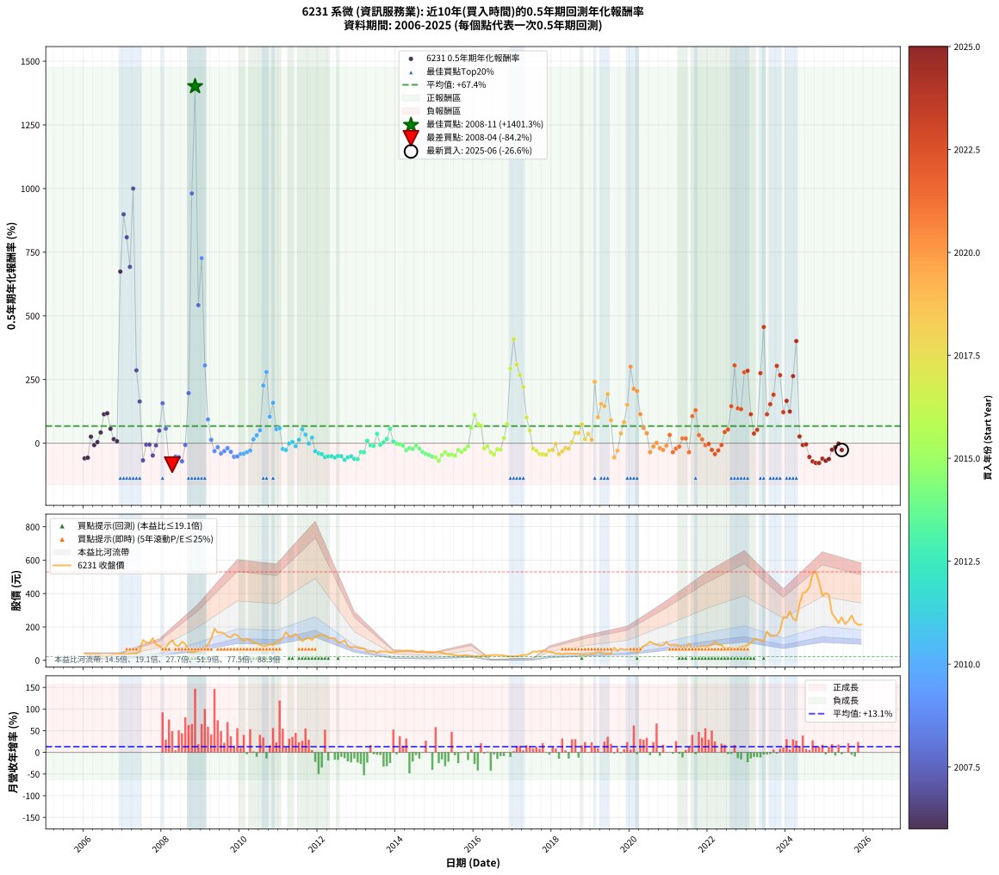

# 6231 系微 - 本益比與未來報酬率分析

!!! info "報告資訊"
    - **股票代號**: 6231
    - **公司名稱**: 系微
    - **產業別**: 資訊服務業
    - **分析期間**: 2006-2025 (234 個數據點)
    - **資料來源**: Type 12 (ShowMonthlyK_ChartFlow) 月收盤價與本益比
    - **報酬率口徑**: 含現金股利 (簡化: 年度合計，假設每年7/1入帳)
    - **報告生成時間**: 2026-01-10 21:14:58 CST

## 📈 視覺化圖表

### 圖表1: 本益比 vs 未來報酬率關係

*圖表1：6231 系微 本益比與0.5年期未來報酬率關係 (2006-2025)*

### 圖表2: 歷年買入時點的0.5年期實際報酬率

*圖表2：6231 系微 歷年買入時點的0.5年期實際報酬率 (2006-2025)*

## 📍 買點訊號說明

本報告提供兩種買點提示訊號（顯示於圖表2的股價子圖中）：

### ▲ 小綠色三角形（回測驗證）
- **計算方式**: 使用全部歷史資料計算本益比第25百分位數
- **用途**: 事後驗證，顯示歷史上哪些時點確實為低估區
- **限制**: 當下無法判斷，僅供回測參考
- **特性**: 後見之明（Look-Ahead Bias）

### ▲ 小橘色三角形（即時訊號）
- **計算方式**: 使用截至當月的過去5年資料計算本益比第25百分位數
- **用途**: 實際投資決策，當時即可判斷
- **優勢**: 可操作性強，符合實務需求
- **特性**: 無後見之明，滾動窗口計算

!!! tip "如何使用兩種訊號"
    - **綠色▲** 幫助理解歷史估值機會，驗證策略有效性
    - **橘色▲** 可作為實際買進參考，但仍需搭配基本面分析
    - 兩種訊號重疊時，表示即時判斷與事後驗證一致，信心度較高
    - 僅有綠色▲時，表示當時無法判斷（需要未來資料才能確認）
    - 僅有橘色▲時，表示即時判斷為買點，但事後可能不是最佳時機

## 📊 估值分析摘要

| 指標 | 數值 |
|:---:|:---:|
| **目前本益比** (2025-06) | **36.86 倍** |
| **歷史平均本益比** | 40.45 倍 |
| **估值水準** | 🟡 合理範圍 |
| **預期0.5年年化報酬率** | **+65.77%** |
| **歷史平均報酬率** | +67.38% |
| **相關係數 (R²)** | 0.0162 |
| **趨勢線斜率** | -0.6088 |

!!! abstract "核心洞察"
    目前本益比接近歷史平均，預期報酬率符合長期趨勢

    根據歷史數據回測，6231 系微 在目前本益比 **36.9倍** 的估值水準下，
    預期未來0.5年年化報酬率約為 **+65.8%**。

    **重要提醒**: 本分析基於歷史數據統計，實際報酬率會受到公司基本面變化、產業趨勢、
    總體經濟環境等多重因素影響。R² = 0.02 表示本益比可解釋約 1.6% 的報酬率變異。

## 📈 歷史估值統計

### 最佳買點 (最高報酬率)

| 項目 | 數值 |
|:---:|:---:|
| 起始時間 | 2008-11 |
| 當時本益比 | 13.59 倍 |
| 起始價格 | 49.5 元 |
| 0.5年後價格 | 189.5 元 |
| **0.5年年化報酬率** | **+1401.33%** |

### 最差買點 (最低報酬率)

| 項目 | 數值 |
|:---:|:---:|
| 起始時間 | 2008-04 |
| 當時本益比 | 53.10 倍 |
| 起始價格 | 120.0 元 |
| 0.5年後價格 | 47.6 元 |
| **0.5年年化報酬率** | **-84.17%** |

## 🎯 投資啟示

### 本益比與報酬率關係

趨勢線方程式: **y = -0.6088x + 88.2078**

!!! warning "強負相關"
    本益比與未來報酬率呈現強負相關。在高本益比時期買入，未來報酬率顯著較低；
    在低本益比時期買入，未來報酬率顯著較高。**估值紀律至關重要**。

### 估值區間建議

基於歷史數據分析:

- **🟢 低估區** (P/E < 32.4): 預期報酬率較高，可考慮增加持股
- **🟡 合理區** (P/E 32.4-48.5): 預期報酬率符合長期趨勢，正常持有
- **🔴 高估區** (P/E > 48.5): 預期報酬率較低，可考慮減碼或觀望

!!! danger "風險提示"
    - 過去表現不代表未來結果
    - 本分析假設公司基本面無重大結構性變化
    - 產業環境劇變可能使歷史規律失效
    - 應結合公司財報、產業趨勢、總體經濟等多重因素綜合判斷

!!! success "長期投資觀點"
    歷史數據顯示，在合理或低估的估值水準買入並長期持有，
    往往能獲得較佳的投資報酬。**耐心等待好價格**是價值投資的核心原則。

## 📊 數據品質

- **資料來源**: GoodInfo.tw Type 12 (ShowMonthlyK_ChartFlow)
- **資料頻率**: 月度收盤價與本益比
- **回測期間**: 2006-2025
- **數據點數量**: 234 個 (每個點代表一次0.5年期回測)

### 計算方法說明

1. **0.5年期年化報酬率**:
   - 對每個歷史時點，計算其後0.5年的實際投資報酬率
   - 期末價值(不含股利): 期末價格
   - 期末價值(含現金股利): 期末價格 + 持有期間內的現金股利合計 (簡化: 年度合計，假設每年7/1入帳)
   - 公式: 年化報酬率 = [(期末價值/期初價格)^(1/年數) - 1] × 100%

2. **本益比 (P/E Ratio)**:
   - 使用當時的月收盤價與EPS計算
   - 資料來源: Type 12 月度河流圖本益比數據

3. **趨勢線 (Linear Regression)**:
   - 使用最小平方法擬合線性趨勢線
   - R²值衡量本益比對報酬率的解釋能力

---

*本報告由 Stock Analysis System v1.9.0 自動生成*
*數據更新時間: 2026-01-10 21:14:58 CST*

## 📋 月度回測明細表

（每一列對應時間線圖中的一個買入點；可用來對照 SVG 圖上的每個點。）

| 買入月份 | 賣出月份 | 回測期限_年 | 實際持有年數 | 買入本益比_倍 | 買入收盤價_元 | 賣出收盤價_元 | 現金股利合計_元 | 總報酬率_pct | 年化報酬率_pct |
| --- | --- | --- | --- | --- | --- | --- | --- | --- | --- |
| 2006-01 | 2006-07 | 0.5 | 0.496 | 80.19 | 41.70 | 26.60 | 0.00 | -36.21 | -59.64 |
| 2006-02 | 2006-08 | 0.5 | 0.498 | 73.08 | 38.00 | 25.00 | 0.00 | -34.21 | -56.84 |
| 2006-03 | 2006-10 | 0.5 | 0.586 | 61.54 | 32.00 | 36.55 | 0.00 | +14.22 | +25.47 |
| 2006-04 | 2006-10 | 0.5 | 0.501 | 73.08 | 38.00 | 36.55 | 0.00 | -3.82 | -7.47 |
| 2006-05 | 2006-12 | 0.5 | 0.586 | 69.81 | 36.30 | 37.20 | 0.00 | +2.48 | +4.27 |
| 2006-06 | 2006-12 | 0.5 | 0.501 | 60.00 | 31.20 | 37.20 | 0.00 | +19.23 | +42.06 |
| 2006-07 | 2007-01 | 0.5 | 0.504 | 51.15 | 26.60 | 39.00 | 0.00 | +46.62 | +113.74 |
| 2006-08 | 2007-03 | 0.5 | 0.580 | 48.08 | 25.00 | 39.25 | 0.00 | +57.00 | +117.53 |
| 2006-09 | 2007-03 | 0.5 | 0.496 | 60.38 | 31.40 | 39.25 | 0.00 | +25.00 | +56.88 |
| 2006-10 | 2007-05 | 0.5 | 0.580 | 70.29 | 36.55 | 39.80 | 0.00 | +8.89 | +15.81 |
| 2006-11 | 2007-05 | 0.5 | 0.496 | 73.85 | 38.40 | 39.80 | 0.00 | +3.65 | +7.49 |
| 2006-12 | 2007-07 | 0.5 | 0.580 | 71.54 | 37.20 | 122.00 | 0.00 | +227.96 | +673.91 |
| 2007-01 | 2007-07 | 0.5 | 0.496 | 65.09 | 39.00 | 122.00 | 0.00 | +212.82 | +898.81 |
| 2007-02 | 2007-08 | 0.5 | 0.498 | 52.04 | 35.30 | 106.00 | 0.00 | +200.28 | +808.54 |
| 2007-03 | 2007-10 | 0.5 | 0.586 | 51.82 | 39.25 | 132.00 | 0.00 | +236.31 | +692.53 |
| 2007-04 | 2007-10 | 0.5 | 0.501 | 47.45 | 39.70 | 132.00 | 0.00 | +232.49 | +1000.09 |
| 2007-05 | 2007-12 | 0.5 | 0.586 | 43.46 | 39.80 | 87.80 | 0.00 | +120.60 | +285.89 |
| 2007-06 | 2007-12 | 0.5 | 0.501 | 54.27 | 54.00 | 87.80 | 0.00 | +62.59 | +163.84 |
| 2007-07 | 2008-01 | 0.5 | 0.504 | 113.60 | 122.00 | 69.40 | 0.00 | -43.11 | -67.37 |
| 2007-08 | 2008-03 | 0.5 | 0.583 | 91.91 | 106.00 | 102.50 | 0.00 | -3.30 | -5.60 |
| 2007-09 | 2008-03 | 0.5 | 0.498 | 85.60 | 105.50 | 102.50 | 0.00 | -2.84 | -5.63 |
| 2007-10 | 2008-05 | 0.5 | 0.583 | 100.60 | 132.00 | 90.00 | 0.00 | -31.82 | -48.15 |
| 2007-11 | 2008-05 | 0.5 | 0.498 | 67.59 | 94.00 | 90.00 | 0.00 | -4.26 | -8.36 |
| 2007-12 | 2008-07 | 0.5 | 0.583 | 59.73 | 87.80 | 111.00 | 0.05 | +26.48 | +49.61 |
| 2008-01 | 2008-07 | 0.5 | 0.498 | 41.62 | 69.40 | 111.00 | 0.05 | +60.02 | +156.88 |
| 2008-02 | 2008-08 | 0.5 | 0.501 | 41.82 | 78.00 | 97.90 | 0.05 | +25.58 | +57.55 |
| 2008-03 | 2008-10 | 0.5 | 0.586 | 49.70 | 102.50 | 47.60 | 0.05 | -53.51 | -72.94 |
| 2008-04 | 2008-10 | 0.5 | 0.501 | 53.10 | 120.00 | 47.60 | 0.05 | -60.29 | -84.17 |
| 2008-05 | 2008-12 | 0.5 | 0.586 | 36.62 | 90.00 | 57.60 | 0.05 | -35.94 | -53.24 |
| 2008-06 | 2008-12 | 0.5 | 0.501 | 32.24 | 85.60 | 57.60 | 0.05 | -32.65 | -54.57 |
| 2008-07 | 2009-01 | 0.5 | 0.504 | 38.91 | 111.00 | 59.50 | 0.00 | -46.40 | -71.00 |
| 2008-08 | 2009-03 | 0.5 | 0.580 | 32.10 | 97.90 | 94.10 | 0.00 | -3.88 | -6.59 |
| 2008-09 | 2009-03 | 0.5 | 0.496 | 16.91 | 54.90 | 94.10 | 0.00 | +71.40 | +196.64 |
| 2008-10 | 2009-05 | 0.5 | 0.580 | 13.82 | 47.60 | 189.50 | 0.00 | +298.11 | +980.76 |
| 2008-11 | 2009-05 | 0.5 | 0.496 | 13.59 | 49.50 | 189.50 | 0.00 | +282.83 | +1401.33 |
| 2008-12 | 2009-07 | 0.5 | 0.580 | 15.00 | 57.60 | 167.50 | 1.99 | +194.25 | +542.01 |
| 2009-01 | 2009-07 | 0.5 | 0.496 | 14.54 | 59.50 | 167.50 | 1.99 | +184.85 | +726.81 |
| 2009-02 | 2009-08 | 0.5 | 0.498 | 18.63 | 80.90 | 160.50 | 1.99 | +100.85 | +305.35 |
| 2009-03 | 2009-10 | 0.5 | 0.586 | 20.49 | 94.10 | 136.50 | 1.99 | +47.17 | +93.39 |
| 2009-04 | 2009-10 | 0.5 | 0.501 | 26.84 | 130.00 | 136.50 | 1.99 | +6.53 | +13.46 |
| 2009-05 | 2009-12 | 0.5 | 0.586 | 37.20 | 189.50 | 150.50 | 1.99 | -19.53 | -30.99 |
| 2009-06 | 2009-12 | 0.5 | 0.501 | 31.06 | 166.00 | 150.50 | 1.99 | -8.14 | -15.59 |
| 2009-07 | 2010-01 | 0.5 | 0.504 | 29.93 | 167.50 | 129.00 | 0.00 | -22.99 | -40.46 |
| 2009-08 | 2010-03 | 0.5 | 0.580 | 27.45 | 160.50 | 129.50 | 0.00 | -19.31 | -30.91 |
| 2009-09 | 2010-03 | 0.5 | 0.496 | 23.62 | 144.00 | 129.50 | 0.00 | -10.07 | -19.28 |
| 2009-10 | 2010-05 | 0.5 | 0.580 | 21.50 | 136.50 | 107.50 | 0.00 | -21.25 | -33.73 |
| 2009-11 | 2010-05 | 0.5 | 0.496 | 23.79 | 157.00 | 107.50 | 0.00 | -31.53 | -53.43 |
| 2009-12 | 2010-07 | 0.5 | 0.580 | 21.97 | 150.50 | 93.50 | 4.79 | -34.69 | -52.00 |
| 2010-01 | 2010-07 | 0.5 | 0.496 | 18.90 | 129.00 | 93.50 | 4.79 | -23.81 | -42.23 |
| 2010-02 | 2010-08 | 0.5 | 0.498 | 17.14 | 116.50 | 84.80 | 4.79 | -23.10 | -40.97 |
| 2010-03 | 2010-10 | 0.5 | 0.586 | 19.12 | 129.50 | 95.80 | 4.79 | -22.33 | -35.03 |
| 2010-04 | 2010-10 | 0.5 | 0.501 | 17.71 | 119.50 | 95.80 | 4.79 | -15.83 | -29.10 |
| 2010-05 | 2010-12 | 0.5 | 0.586 | 16.00 | 107.50 | 112.00 | 4.79 | +8.64 | +15.19 |
| 2010-06 | 2010-12 | 0.5 | 0.501 | 15.24 | 102.00 | 112.00 | 4.79 | +14.50 | +31.03 |
| 2010-07 | 2011-01 | 0.5 | 0.504 | 14.02 | 93.50 | 115.00 | 0.00 | +22.99 | +50.81 |
| 2010-08 | 2011-03 | 0.5 | 0.580 | 12.76 | 84.80 | 168.50 | 0.00 | +98.70 | +226.41 |
| 2010-09 | 2011-03 | 0.5 | 0.496 | 13.15 | 87.00 | 168.50 | 0.00 | +93.68 | +279.59 |
| 2010-10 | 2011-05 | 0.5 | 0.580 | 14.53 | 95.80 | 145.00 | 0.00 | +51.36 | +104.23 |
| 2010-11 | 2011-05 | 0.5 | 0.496 | 13.78 | 90.50 | 145.00 | 0.00 | +60.22 | +158.89 |
| 2010-12 | 2011-07 | 0.5 | 0.580 | 17.13 | 112.00 | 139.00 | 5.50 | +29.02 | +55.11 |
| 2011-01 | 2011-07 | 0.5 | 0.496 | 16.96 | 115.00 | 139.00 | 5.50 | +25.65 | +58.53 |
| 2011-02 | 2011-08 | 0.5 | 0.498 | 19.50 | 137.00 | 115.00 | 5.50 | -12.04 | -22.71 |
| 2011-03 | 2011-10 | 0.5 | 0.586 | 23.19 | 168.50 | 135.00 | 5.50 | -16.62 | -26.67 |
| 2011-04 | 2011-10 | 0.5 | 0.501 | 18.84 | 141.50 | 135.00 | 5.50 | -0.71 | -1.41 |
| 2011-05 | 2011-12 | 0.5 | 0.586 | 18.70 | 145.00 | 143.50 | 5.50 | +2.76 | +4.75 |
| 2011-06 | 2011-12 | 0.5 | 0.501 | 19.82 | 158.50 | 143.50 | 5.50 | -5.99 | -11.61 |
| 2011-07 | 2012-01 | 0.5 | 0.504 | 16.87 | 139.00 | 148.00 | 0.00 | +6.47 | +13.26 |
| 2011-08 | 2012-03 | 0.5 | 0.583 | 13.56 | 115.00 | 148.50 | 0.00 | +29.13 | +55.02 |
| 2011-09 | 2012-03 | 0.5 | 0.498 | 14.73 | 128.50 | 148.50 | 0.00 | +15.56 | +33.68 |
| 2011-10 | 2012-05 | 0.5 | 0.583 | 15.06 | 135.00 | 133.50 | 0.00 | -1.11 | -1.90 |
| 2011-11 | 2012-05 | 0.5 | 0.498 | 13.14 | 121.00 | 133.50 | 0.00 | +10.33 | +21.81 |
| 2011-12 | 2012-07 | 0.5 | 0.583 | 15.19 | 143.50 | 107.50 | 7.50 | -19.86 | -31.59 |
| 2012-01 | 2012-07 | 0.5 | 0.498 | 16.56 | 148.00 | 107.50 | 7.50 | -22.30 | -39.73 |
| 2012-02 | 2012-08 | 0.5 | 0.501 | 18.10 | 152.50 | 107.50 | 7.50 | -24.59 | -43.07 |
| 2012-03 | 2012-10 | 0.5 | 0.586 | 18.76 | 148.50 | 86.20 | 7.50 | -36.90 | -54.43 |
| 2012-04 | 2012-10 | 0.5 | 0.501 | 18.24 | 135.00 | 86.20 | 7.50 | -30.59 | -51.75 |
| 2012-05 | 2012-12 | 0.5 | 0.586 | 19.38 | 133.50 | 80.40 | 7.50 | -34.16 | -51.00 |
| 2012-06 | 2012-12 | 0.5 | 0.501 | 20.85 | 133.00 | 80.40 | 7.50 | -33.91 | -56.25 |
| 2012-07 | 2013-01 | 0.5 | 0.504 | 18.33 | 107.50 | 75.60 | 0.00 | -29.67 | -50.28 |
| 2012-08 | 2013-03 | 0.5 | 0.580 | 20.08 | 107.50 | 71.10 | 0.00 | -33.86 | -50.95 |
| 2012-09 | 2013-03 | 0.5 | 0.496 | 24.79 | 120.00 | 71.10 | 0.00 | -40.75 | -65.22 |
| 2012-10 | 2013-05 | 0.5 | 0.580 | 19.91 | 86.20 | 54.10 | 0.00 | -37.24 | -55.18 |
| 2012-11 | 2013-05 | 0.5 | 0.496 | 20.28 | 77.40 | 54.10 | 0.00 | -30.10 | -51.46 |
| 2012-12 | 2013-07 | 0.5 | 0.580 | 24.32 | 80.40 | 43.80 | 2.49 | -42.43 | -61.37 |
| 2013-01 | 2013-07 | 0.5 | 0.496 | 24.46 | 75.60 | 43.80 | 2.49 | -38.77 | -62.84 |
| 2013-02 | 2013-08 | 0.5 | 0.498 | 24.79 | 71.30 | 55.20 | 2.49 | -19.09 | -34.63 |
| 2013-03 | 2013-10 | 0.5 | 0.586 | 26.71 | 71.10 | 52.40 | 2.49 | -22.80 | -35.71 |
| 2013-04 | 2013-10 | 0.5 | 0.501 | 21.41 | 52.40 | 52.40 | 2.49 | +4.75 | +9.70 |
| 2013-05 | 2013-12 | 0.5 | 0.586 | 24.24 | 54.10 | 48.95 | 2.49 | -4.92 | -8.25 |
| 2013-06 | 2013-12 | 0.5 | 0.501 | 26.91 | 54.30 | 48.95 | 2.49 | -5.27 | -10.24 |
| 2013-07 | 2014-01 | 0.5 | 0.504 | 24.29 | 43.80 | 51.30 | 0.00 | +17.12 | +36.85 |
| 2013-08 | 2014-03 | 0.5 | 0.580 | 34.75 | 55.20 | 53.20 | 0.00 | -3.62 | -6.16 |
| 2013-09 | 2014-03 | 0.5 | 0.496 | 38.07 | 52.30 | 53.20 | 0.00 | +1.72 | +3.50 |
| 2013-10 | 2014-05 | 0.5 | 0.580 | 45.20 | 52.40 | 57.40 | 0.00 | +9.54 | +17.00 |
| 2013-11 | 2014-05 | 0.5 | 0.496 | 48.70 | 46.00 | 57.40 | 0.00 | +24.78 | +56.33 |
| 2013-12 | 2014-07 | 0.5 | 0.580 | 67.05 | 48.95 | 50.20 | 0.55 | +3.68 | +6.42 |
| 2014-01 | 2014-07 | 0.5 | 0.496 | 71.75 | 51.30 | 50.20 | 0.55 | -1.07 | -2.15 |
| 2014-02 | 2014-08 | 0.5 | 0.498 | 77.43 | 54.20 | 52.60 | 0.55 | -1.94 | -3.85 |
| 2014-03 | 2014-10 | 0.5 | 0.586 | 77.66 | 53.20 | 49.70 | 0.55 | -5.55 | -9.28 |
| 2014-04 | 2014-10 | 0.5 | 0.501 | 88.06 | 59.00 | 49.70 | 0.55 | -14.83 | -27.41 |
| 2014-05 | 2014-12 | 0.5 | 0.586 | 87.63 | 57.40 | 50.00 | 0.55 | -11.93 | -19.50 |
| 2014-06 | 2014-12 | 0.5 | 0.501 | 89.84 | 57.50 | 50.00 | 0.55 | -12.09 | -22.67 |
| 2014-07 | 2015-01 | 0.5 | 0.504 | 80.32 | 50.20 | 48.10 | 0.00 | -4.18 | -8.13 |
| 2014-08 | 2015-03 | 0.5 | 0.580 | 86.23 | 52.60 | 45.80 | 0.00 | -12.93 | -21.22 |
| 2014-09 | 2015-03 | 0.5 | 0.496 | 95.13 | 56.60 | 45.80 | 0.00 | -19.08 | -34.77 |
| 2014-10 | 2015-05 | 0.5 | 0.580 | 85.69 | 49.70 | 36.30 | 0.00 | -26.96 | -41.80 |
| 2014-11 | 2015-05 | 0.5 | 0.496 | 87.52 | 49.45 | 36.30 | 0.00 | -26.59 | -46.41 |
| 2014-12 | 2015-07 | 0.5 | 0.580 | 90.91 | 50.00 | 31.80 | 0.40 | -35.60 | -53.15 |
| 2015-01 | 2015-07 | 0.5 | 0.496 | 80.28 | 48.10 | 31.80 | 0.40 | -33.06 | -55.51 |
| 2015-02 | 2015-08 | 0.5 | 0.498 | 74.50 | 48.30 | 26.55 | 0.40 | -44.20 | -68.99 |
| 2015-03 | 2015-10 | 0.5 | 0.586 | 65.66 | 45.80 | 31.50 | 0.40 | -30.35 | -46.06 |
| 2015-04 | 2015-10 | 0.5 | 0.501 | 52.90 | 39.50 | 31.50 | 0.40 | -19.24 | -34.72 |
| 2015-05 | 2015-12 | 0.5 | 0.586 | 45.61 | 36.30 | 24.85 | 0.40 | -30.44 | -46.18 |
| 2015-06 | 2015-12 | 0.5 | 0.501 | 40.24 | 34.00 | 24.85 | 0.40 | -25.74 | -44.78 |
| 2015-07 | 2016-01 | 0.5 | 0.504 | 35.56 | 31.80 | 22.60 | 0.00 | -28.93 | -49.23 |
| 2015-08 | 2016-03 | 0.5 | 0.583 | 28.14 | 26.55 | 22.20 | 0.00 | -16.38 | -26.42 |
| 2015-09 | 2016-03 | 0.5 | 0.498 | 27.61 | 27.40 | 22.20 | 0.00 | -18.98 | -34.45 |
| 2015-10 | 2016-05 | 0.5 | 0.583 | 30.24 | 31.50 | 26.80 | 0.00 | -14.92 | -24.20 |
| 2015-11 | 2016-05 | 0.5 | 0.498 | 26.17 | 28.55 | 26.80 | 0.00 | -6.13 | -11.92 |
| 2015-12 | 2016-07 | 0.5 | 0.583 | 21.80 | 24.85 | 31.95 | 0.85 | +31.99 | +60.96 |
| 2016-01 | 2016-07 | 0.5 | 0.498 | 23.48 | 22.60 | 31.95 | 0.85 | +45.13 | +111.17 |
| 2016-02 | 2016-08 | 0.5 | 0.501 | 31.08 | 24.40 | 31.50 | 0.85 | +32.58 | +75.58 |
| 2016-03 | 2016-10 | 0.5 | 0.586 | 36.54 | 22.20 | 29.30 | 0.85 | +35.81 | +68.61 |
| 2016-04 | 2016-10 | 0.5 | 0.501 | 78.60 | 33.80 | 29.30 | 0.85 | -10.80 | -20.39 |
| 2016-05 | 2016-12 | 0.5 | 0.586 | 106.10 | 26.80 | 24.10 | 0.85 | -6.90 | -11.49 |
| 2016-06 | 2016-12 | 0.5 | 0.501 | 416.00 | 31.20 | 24.10 | 0.85 | -20.03 | -35.99 |
| 2016-07 | 2017-01 | 0.5 | 0.504 |  | 31.95 | 23.80 | 0.00 | -25.51 | -44.27 |
| 2016-08 | 2017-03 | 0.5 | 0.580 |  | 31.50 | 27.00 | 0.00 | -14.29 | -23.32 |
| 2016-09 | 2017-03 | 0.5 | 0.496 |  | 31.20 | 27.00 | 0.00 | -13.46 | -25.31 |
| 2016-10 | 2017-05 | 0.5 | 0.580 |  | 29.30 | 32.55 | 0.00 | +11.09 | +19.87 |
| 2016-11 | 2017-05 | 0.5 | 0.496 |  | 24.65 | 32.55 | 0.00 | +32.05 | +75.24 |
| 2016-12 | 2017-07 | 0.5 | 0.580 |  | 24.10 | 53.00 | 0.30 | +121.16 | +292.55 |
| 2017-01 | 2017-07 | 0.5 | 0.496 |  | 23.80 | 53.00 | 0.30 | +123.95 | +408.85 |
| 2017-02 | 2017-08 | 0.5 | 0.498 |  | 25.50 | 51.10 | 0.30 | +101.57 | +308.26 |
| 2017-03 | 2017-10 | 0.5 | 0.586 |  | 27.00 | 57.60 | 0.30 | +114.44 | +267.69 |
| 2017-04 | 2017-10 | 0.5 | 0.501 |  | 32.30 | 57.60 | 0.30 | +79.26 | +220.56 |
| 2017-05 | 2017-12 | 0.5 | 0.586 |  | 32.55 | 48.70 | 0.30 | +50.54 | +101.00 |
| 2017-06 | 2017-12 | 0.5 | 0.501 |  | 40.00 | 48.70 | 0.30 | +22.50 | +49.94 |
| 2017-07 | 2018-01 | 0.5 | 0.504 | 333.00 | 53.00 | 46.85 | 0.00 | -11.60 | -21.72 |
| 2017-08 | 2018-03 | 0.5 | 0.580 | 158.00 | 51.10 | 41.75 | 0.00 | -18.30 | -29.40 |
| 2017-09 | 2018-03 | 0.5 | 0.496 | 112.80 | 55.00 | 41.75 | 0.00 | -24.09 | -42.66 |
| 2017-10 | 2018-05 | 0.5 | 0.580 | 88.39 | 57.60 | 41.20 | 0.00 | -28.47 | -43.86 |
| 2017-11 | 2018-05 | 0.5 | 0.496 | 68.27 | 55.70 | 41.20 | 0.00 | -26.03 | -45.58 |
| 2017-12 | 2018-07 | 0.5 | 0.580 | 49.69 | 48.70 | 39.40 | 0.85 | -17.35 | -27.99 |
| 2018-01 | 2018-07 | 0.5 | 0.496 | 44.90 | 46.85 | 39.40 | 0.85 | -14.09 | -26.39 |
| 2018-02 | 2018-08 | 0.5 | 0.498 | 36.42 | 40.30 | 38.90 | 0.85 | -1.36 | -2.72 |
| 2018-03 | 2018-10 | 0.5 | 0.586 | 35.68 | 41.75 | 29.20 | 0.85 | -28.02 | -42.95 |
| 2018-04 | 2018-10 | 0.5 | 0.501 | 29.51 | 36.40 | 29.20 | 0.85 | -17.45 | -31.79 |
| 2018-05 | 2018-12 | 0.5 | 0.586 | 31.77 | 41.20 | 35.60 | 0.85 | -11.53 | -18.87 |
| 2018-06 | 2018-12 | 0.5 | 0.501 | 30.15 | 41.00 | 35.60 | 0.85 | -11.10 | -20.93 |
| 2018-07 | 2019-01 | 0.5 | 0.504 | 27.68 | 39.40 | 40.20 | 0.00 | +2.03 | +4.07 |
| 2018-08 | 2019-03 | 0.5 | 0.580 | 26.17 | 38.90 | 47.35 | 0.00 | +21.72 | +40.31 |
| 2018-09 | 2019-03 | 0.5 | 0.496 | 25.81 | 40.00 | 47.35 | 0.00 | +18.38 | +40.55 |
| 2018-10 | 2019-05 | 0.5 | 0.580 | 18.10 | 29.20 | 40.30 | 0.00 | +38.01 | +74.21 |
| 2018-11 | 2019-05 | 0.5 | 0.496 | 22.37 | 37.50 | 40.30 | 0.00 | +7.47 | +15.64 |
| 2018-12 | 2019-07 | 0.5 | 0.580 | 20.46 | 35.60 | 41.25 | 1.50 | +20.08 | +37.07 |
| 2019-01 | 2019-07 | 0.5 | 0.496 | 22.48 | 40.20 | 41.25 | 1.50 | +6.34 | +13.21 |
| 2019-02 | 2019-08 | 0.5 | 0.498 | 22.89 | 42.05 | 76.00 | 1.50 | +84.30 | +241.11 |
| 2019-03 | 2019-10 | 0.5 | 0.586 | 25.12 | 47.35 | 70.00 | 1.50 | +51.00 | +102.06 |
| 2019-04 | 2019-10 | 0.5 | 0.501 | 23.17 | 44.80 | 70.00 | 1.50 | +59.60 | +154.23 |
| 2019-05 | 2019-12 | 0.5 | 0.586 | 20.34 | 40.30 | 66.70 | 1.50 | +69.23 | +145.45 |
| 2019-06 | 2019-12 | 0.5 | 0.501 | 19.61 | 39.80 | 66.70 | 1.50 | +71.36 | +192.98 |
| 2019-07 | 2020-01 | 0.5 | 0.504 | 19.85 | 41.25 | 57.10 | 0.00 | +38.42 | +90.68 |
| 2019-08 | 2020-03 | 0.5 | 0.583 | 35.74 | 76.00 | 47.15 | 0.00 | -37.96 | -55.90 |
| 2019-09 | 2020-03 | 0.5 | 0.498 | 25.79 | 56.10 | 47.15 | 0.00 | -15.95 | -29.45 |
| 2019-10 | 2020-05 | 0.5 | 0.583 | 31.48 | 70.00 | 84.70 | 0.00 | +21.00 | +38.66 |
| 2019-11 | 2020-05 | 0.5 | 0.498 | 27.64 | 62.80 | 84.70 | 0.00 | +34.87 | +82.28 |
| 2019-12 | 2020-07 | 0.5 | 0.583 | 28.75 | 66.70 | 112.00 | 2.00 | +70.91 | +150.71 |
| 2020-01 | 2020-07 | 0.5 | 0.498 | 23.17 | 57.10 | 112.00 | 2.00 | +99.65 | +300.50 |
| 2020-02 | 2020-08 | 0.5 | 0.501 | 22.39 | 58.40 | 101.50 | 2.00 | +77.23 | +213.35 |
| 2020-03 | 2020-10 | 0.5 | 0.586 | 17.13 | 47.15 | 88.60 | 2.00 | +92.15 | +204.87 |
| 2020-04 | 2020-10 | 0.5 | 0.501 | 21.37 | 61.90 | 88.60 | 2.00 | +46.37 | +113.89 |
| 2020-05 | 2020-12 | 0.5 | 0.586 | 27.85 | 84.70 | 109.50 | 2.00 | +31.64 | +59.87 |
| 2020-06 | 2020-12 | 0.5 | 0.501 | 29.70 | 94.60 | 109.50 | 2.00 | +17.86 | +38.83 |
| 2020-07 | 2021-01 | 0.5 | 0.504 | 33.64 | 112.00 | 90.00 | 0.00 | -19.64 | -35.22 |
| 2020-08 | 2021-03 | 0.5 | 0.580 | 29.22 | 101.50 | 93.80 | 0.00 | -7.59 | -12.71 |
| 2020-09 | 2021-03 | 0.5 | 0.496 | 25.74 | 93.10 | 93.80 | 0.00 | +0.75 | +1.52 |
| 2020-10 | 2021-05 | 0.5 | 0.580 | 23.55 | 88.60 | 78.10 | 0.00 | -11.85 | -19.53 |
| 2020-11 | 2021-05 | 0.5 | 0.496 | 23.27 | 90.90 | 78.10 | 0.00 | -14.08 | -26.38 |
| 2020-12 | 2021-07 | 0.5 | 0.580 | 27.04 | 109.50 | 100.00 | 3.50 | -5.48 | -9.25 |
| 2021-01 | 2021-07 | 0.5 | 0.496 | 21.39 | 90.00 | 100.00 | 3.50 | +15.00 | +32.58 |
| 2021-02 | 2021-08 | 0.5 | 0.498 | 21.65 | 94.50 | 72.60 | 3.50 | -19.47 | -35.25 |
| 2021-03 | 2021-10 | 0.5 | 0.586 | 20.74 | 93.80 | 78.20 | 3.50 | -12.90 | -21.00 |
| 2021-04 | 2021-10 | 0.5 | 0.501 | 18.74 | 87.70 | 78.20 | 3.50 | -6.84 | -13.19 |
| 2021-05 | 2021-12 | 0.5 | 0.586 | 16.14 | 78.10 | 83.00 | 3.50 | +10.76 | +19.05 |
| 2021-06 | 2021-12 | 0.5 | 0.501 | 15.92 | 79.50 | 83.00 | 3.50 | +8.81 | +18.34 |
| 2021-07 | 2022-01 | 0.5 | 0.504 | 19.41 | 100.00 | 80.30 | 0.00 | -19.70 | -35.31 |
| 2021-08 | 2022-03 | 0.5 | 0.580 | 13.67 | 72.60 | 110.50 | 0.00 | +52.20 | +106.20 |
| 2021-09 | 2022-03 | 0.5 | 0.496 | 13.39 | 73.20 | 110.50 | 0.00 | +50.96 | +129.57 |
| 2021-10 | 2022-05 | 0.5 | 0.580 | 13.90 | 78.20 | 91.70 | 0.00 | +17.26 | +31.57 |
| 2021-11 | 2022-05 | 0.5 | 0.496 | 14.80 | 85.60 | 91.70 | 0.00 | +7.13 | +14.90 |
| 2021-12 | 2022-07 | 0.5 | 0.580 | 13.97 | 83.00 | 74.00 | 5.20 | -4.58 | -7.76 |
| 2022-01 | 2022-07 | 0.5 | 0.496 | 13.24 | 80.30 | 74.00 | 5.20 | -1.37 | -2.75 |
| 2022-02 | 2022-08 | 0.5 | 0.498 | 15.45 | 95.70 | 76.90 | 5.20 | -14.21 | -26.48 |
| 2022-03 | 2022-10 | 0.5 | 0.586 | 17.48 | 110.50 | 74.30 | 5.20 | -28.05 | -42.99 |
| 2022-04 | 2022-10 | 0.5 | 0.501 | 14.58 | 94.00 | 74.30 | 5.20 | -15.43 | -28.42 |
| 2022-05 | 2022-12 | 0.5 | 0.586 | 13.95 | 91.70 | 82.80 | 5.20 | -4.03 | -6.79 |
| 2022-06 | 2022-12 | 0.5 | 0.501 | 10.94 | 73.30 | 82.80 | 5.20 | +20.05 | +44.02 |
| 2022-07 | 2023-01 | 0.5 | 0.504 | 10.84 | 74.00 | 92.00 | 0.00 | +24.32 | +54.06 |
| 2022-08 | 2023-03 | 0.5 | 0.580 | 11.06 | 76.90 | 129.50 | 0.00 | +68.40 | +145.45 |
| 2022-09 | 2023-03 | 0.5 | 0.496 | 9.14 | 64.70 | 129.50 | 0.00 | +100.15 | +305.64 |
| 2022-10 | 2023-05 | 0.5 | 0.580 | 10.31 | 74.30 | 122.50 | 0.00 | +64.87 | +136.66 |
| 2022-11 | 2023-05 | 0.5 | 0.496 | 10.98 | 80.50 | 122.50 | 0.00 | +52.17 | +133.32 |
| 2022-12 | 2023-07 | 0.5 | 0.580 | 11.10 | 82.80 | 173.00 | 6.30 | +116.55 | +278.54 |
| 2023-01 | 2023-07 | 0.5 | 0.496 | 12.70 | 92.00 | 173.00 | 6.30 | +94.89 | +284.40 |
| 2023-02 | 2023-08 | 0.5 | 0.498 | 14.80 | 104.00 | 145.50 | 6.30 | +45.96 | +113.60 |
| 2023-03 | 2023-10 | 0.5 | 0.586 | 19.02 | 129.50 | 150.00 | 6.30 | +20.69 | +37.86 |
| 2023-04 | 2023-10 | 0.5 | 0.501 | 19.19 | 126.50 | 150.00 | 6.30 | +23.56 | +52.53 |
| 2023-05 | 2023-12 | 0.5 | 0.586 | 19.21 | 122.50 | 259.50 | 6.30 | +116.98 | +275.14 |
| 2023-06 | 2023-12 | 0.5 | 0.501 | 18.26 | 112.50 | 259.50 | 6.30 | +136.27 | +456.26 |
| 2023-07 | 2024-01 | 0.5 | 0.504 | 29.11 | 173.00 | 253.50 | 0.00 | +46.53 | +113.49 |
| 2023-08 | 2024-03 | 0.5 | 0.583 | 25.41 | 145.50 | 250.00 | 0.00 | +71.82 | +152.99 |
| 2023-09 | 2024-03 | 0.5 | 0.498 | 26.68 | 147.00 | 250.00 | 0.00 | +70.07 | +190.29 |
| 2023-10 | 2024-05 | 0.5 | 0.583 | 28.34 | 150.00 | 338.50 | 0.00 | +125.67 | +303.76 |
| 2023-11 | 2024-05 | 0.5 | 0.498 | 34.87 | 177.00 | 338.50 | 0.00 | +91.24 | +267.37 |
| 2023-12 | 2024-07 | 0.5 | 0.583 | 53.40 | 259.50 | 410.50 | 2.50 | +59.15 | +121.85 |
| 2024-01 | 2024-07 | 0.5 | 0.498 | 50.01 | 253.50 | 410.50 | 2.50 | +62.92 | +166.32 |
| 2024-02 | 2024-08 | 0.5 | 0.501 | 55.60 | 293.50 | 437.50 | 2.50 | +49.91 | +124.37 |
| 2024-03 | 2024-10 | 0.5 | 0.586 | 45.56 | 250.00 | 530.00 | 2.50 | +113.00 | +263.47 |
| 2024-04 | 2024-10 | 0.5 | 0.501 | 41.69 | 237.50 | 530.00 | 2.50 | +124.21 | +401.04 |
| 2024-05 | 2024-12 | 0.5 | 0.586 | 57.32 | 338.50 | 386.00 | 2.50 | +14.77 | +26.51 |
| 2024-06 | 2024-12 | 0.5 | 0.501 | 65.90 | 403.00 | 386.00 | 2.50 | -3.60 | -7.05 |
| 2024-07 | 2025-01 | 0.5 | 0.504 | 64.91 | 410.50 | 401.00 | 0.00 | -2.31 | -4.54 |
| 2024-08 | 2025-03 | 0.5 | 0.580 | 66.96 | 437.50 | 279.00 | 0.00 | -36.23 | -53.93 |
| 2024-09 | 2025-03 | 0.5 | 0.496 | 76.97 | 519.00 | 279.00 | 0.00 | -46.24 | -71.42 |
| 2024-10 | 2025-05 | 0.5 | 0.580 | 76.24 | 530.00 | 222.50 | 0.00 | -58.02 | -77.58 |
| 2024-11 | 2025-05 | 0.5 | 0.496 | 65.36 | 468.00 | 222.50 | 0.00 | -52.46 | -77.70 |
| 2024-12 | 2025-07 | 0.5 | 0.580 | 52.37 | 386.00 | 218.00 | 6.50 | -41.84 | -60.69 |
| 2025-01 | 2025-07 | 0.5 | 0.496 | 54.89 | 401.00 | 218.00 | 6.50 | -44.01 | -68.98 |
| 2025-02 | 2025-08 | 0.5 | 0.498 | 54.20 | 392.50 | 235.50 | 6.50 | -38.34 | -62.11 |
| 2025-03 | 2025-10 | 0.5 | 0.586 | 38.87 | 279.00 | 228.00 | 6.50 | -15.95 | -25.66 |
| 2025-04 | 2025-10 | 0.5 | 0.501 | 35.99 | 256.00 | 228.00 | 6.50 | -8.40 | -16.06 |
| 2025-05 | 2025-12 | 0.5 | 0.586 | 31.56 | 222.50 | 214.00 | 6.50 | -0.90 | -1.53 |
| 2025-06 | 2025-12 | 0.5 | 0.501 | 36.86 | 257.50 | 214.00 | 6.50 | -14.37 | -26.63 |
