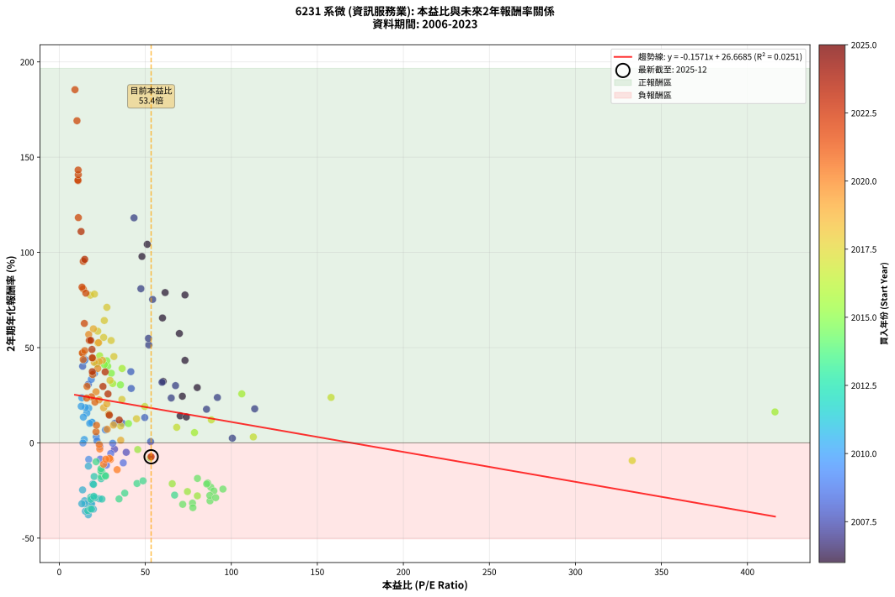
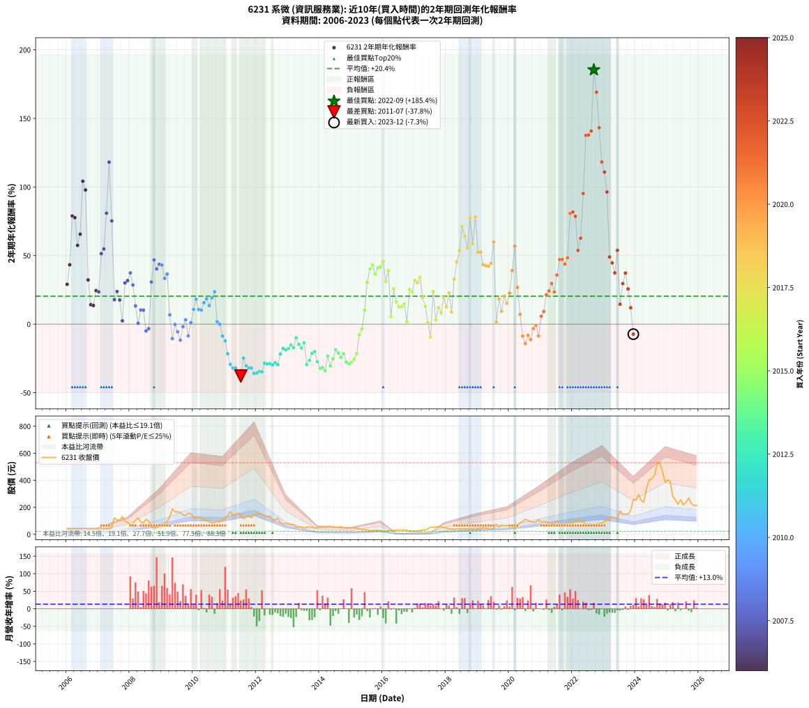

# 6231 系微 - 本益比與未來報酬率分析

!!! info "報告資訊"
    - **股票代號**: 6231
    - **公司名稱**: 系微
    - **產業別**: 資訊服務業
    - **分析期間**: 2006-2023 (216 個數據點)
    - **資料來源**: Type 12 (ShowMonthlyK_ChartFlow) 月收盤價與本益比
    - **報酬率口徑**: 含現金股利 (簡化: 年度合計，假設每年7/1入帳)
    - **報告生成時間**: 2026-01-06 19:07:40 CST

## 📈 視覺化圖表

### 圖表1: 本益比 vs 未來報酬率關係

*圖表1：6231 系微 本益比與2年期未來報酬率關係 (2006-2023)*

### 圖表2: 歷年買入時點的2年期實際報酬率

*圖表2：6231 系微 歷年買入時點的2年期實際報酬率 (2006-2023)*

## 📍 買點訊號說明

本報告提供兩種買點提示訊號（顯示於圖表2的股價子圖中）：

### ▲ 小綠色三角形（回測驗證）
- **計算方式**: 使用全部歷史資料計算本益比第25百分位數
- **用途**: 事後驗證，顯示歷史上哪些時點確實為低估區
- **限制**: 當下無法判斷，僅供回測參考
- **特性**: 後見之明（Look-Ahead Bias）

### ▲ 小橘色三角形（即時訊號）
- **計算方式**: 使用截至當月的過去5年資料計算本益比第25百分位數
- **用途**: 實際投資決策，當時即可判斷
- **優勢**: 可操作性強，符合實務需求
- **特性**: 無後見之明，滾動窗口計算

!!! tip "如何使用兩種訊號"
    - **綠色▲** 幫助理解歷史估值機會，驗證策略有效性
    - **橘色▲** 可作為實際買進參考，但仍需搭配基本面分析
    - 兩種訊號重疊時，表示即時判斷與事後驗證一致，信心度較高
    - 僅有綠色▲時，表示當時無法判斷（需要未來資料才能確認）
    - 僅有橘色▲時，表示即時判斷為買點，但事後可能不是最佳時機

## 📊 估值分析摘要

| 指標 | 數值 |
|:---:|:---:|
| **目前本益比** (2023-12) | **53.40 倍** |
| **歷史平均本益比** | 39.26 倍 |
| **估值水準** | 🔴 相對高估 |
| **預期2年年化報酬率** | **+18.28%** |
| **歷史平均報酬率** | +20.38% |
| **相關係數 (R²)** | 0.0251 |
| **趨勢線斜率** | -0.1571 |

!!! abstract "核心洞察"
    目前本益比顯著高於歷史平均，預期未來報酬率可能較低

    根據歷史數據回測，6231 系微 在目前本益比 **53.4倍** 的估值水準下，
    預期未來2年年化報酬率約為 **+18.3%**。

    **重要提醒**: 本分析基於歷史數據統計，實際報酬率會受到公司基本面變化、產業趨勢、
    總體經濟環境等多重因素影響。R² = 0.03 表示本益比可解釋約 2.5% 的報酬率變異。

## 📈 歷史估值統計

### 最佳買點 (最高報酬率)

| 項目 | 數值 |
|:---:|:---:|
| 起始時間 | 2022-09 |
| 當時本益比 | 9.14 倍 |
| 起始價格 | 64.7 元 |
| 2年後價格 | 519.0 元 |
| **2年年化報酬率** | **+185.41%** |

### 最差買點 (最低報酬率)

| 項目 | 數值 |
|:---:|:---:|
| 起始時間 | 2011-07 |
| 當時本益比 | 16.87 倍 |
| 起始價格 | 139.0 元 |
| 2年後價格 | 43.8 元 |
| **2年年化報酬率** | **-37.77%** |

## 🎯 投資啟示

### 本益比與報酬率關係

趨勢線方程式: **y = -0.1571x + 26.6685**

!!! note "負相關"
    本益比與未來報酬率呈現負相關。較低的本益比通常帶來較高的未來報酬率，
    但相關性不算非常強。**估值仍是重要參考指標之一**。

### 估值區間建議

基於歷史數據分析:

- **🟢 低估區** (P/E < 31.4): 預期報酬率較高，可考慮增加持股
- **🟡 合理區** (P/E 31.4-47.1): 預期報酬率符合長期趨勢，正常持有
- **🔴 高估區** (P/E > 47.1): 預期報酬率較低，可考慮減碼或觀望

!!! danger "風險提示"
    - 過去表現不代表未來結果
    - 本分析假設公司基本面無重大結構性變化
    - 產業環境劇變可能使歷史規律失效
    - 應結合公司財報、產業趨勢、總體經濟等多重因素綜合判斷

!!! success "長期投資觀點"
    歷史數據顯示，在合理或低估的估值水準買入並長期持有，
    往往能獲得較佳的投資報酬。**耐心等待好價格**是價值投資的核心原則。

## 📊 數據品質

- **資料來源**: GoodInfo.tw Type 12 (ShowMonthlyK_ChartFlow)
- **資料頻率**: 月度收盤價與本益比
- **回測期間**: 2006-2023
- **數據點數量**: 216 個 (每個點代表一次2年期回測)

### 計算方法說明

1. **2年期年化報酬率**:
   - 對每個歷史時點，計算其後2年的實際投資報酬率
   - 期末價值(不含股利): 期末價格
   - 期末價值(含現金股利): 期末價格 + 持有期間內的現金股利合計 (簡化: 年度合計，假設每年7/1入帳)
   - 公式: 年化報酬率 = [(期末價值/期初價格)^(1/年數) - 1] × 100%

2. **本益比 (P/E Ratio)**:
   - 使用當時的月收盤價與EPS計算
   - 資料來源: Type 12 月度河流圖本益比數據

3. **趨勢線 (Linear Regression)**:
   - 使用最小平方法擬合線性趨勢線
   - R²值衡量本益比對報酬率的解釋能力

---

*本報告由 Stock Analysis System v1.9.0 自動生成*
*數據更新時間: 2026-01-06 19:07:40 CST*

## 📋 月度回測明細表

（每一列對應時間線圖中的一個買入點；可用來對照 SVG 圖上的每個點。）

| 買入月份 | 賣出月份 | 回測期限_年 | 實際持有年數 | 買入本益比_倍 | 買入收盤價_元 | 賣出收盤價_元 | 現金股利合計_元 | 總報酬率_pct | 年化報酬率_pct |
| --- | --- | --- | --- | --- | --- | --- | --- | --- | --- |
| 2006-01 | 2008-01 | 2 | 1.999 | 80.19 | 41.70 | 69.40 | 0.00 | +66.43 | +29.03 |
| 2006-02 | 2008-02 | 2 | 1.999 | 73.08 | 38.00 | 78.00 | 0.00 | +105.26 | +43.31 |
| 2006-03 | 2008-03 | 2 | 2.001 | 61.54 | 32.00 | 102.50 | 0.00 | +220.31 | +78.90 |
| 2006-04 | 2008-04 | 2 | 2.001 | 73.08 | 38.00 | 120.00 | 0.00 | +215.79 | +77.63 |
| 2006-05 | 2008-05 | 2 | 2.001 | 69.81 | 36.30 | 90.00 | 0.00 | +147.93 | +57.41 |
| 2006-06 | 2008-06 | 2 | 2.001 | 60.00 | 31.20 | 85.60 | 0.00 | +174.36 | +65.58 |
| 2006-07 | 2008-07 | 2 | 2.001 | 51.15 | 26.60 | 111.00 | 0.05 | +317.49 | +104.23 |
| 2006-08 | 2008-08 | 2 | 2.001 | 48.08 | 25.00 | 97.90 | 0.05 | +291.81 | +97.85 |
| 2006-09 | 2008-09 | 2 | 2.001 | 60.38 | 31.40 | 54.90 | 0.05 | +75.01 | +32.26 |
| 2006-10 | 2008-10 | 2 | 2.001 | 70.29 | 36.55 | 47.60 | 0.05 | +30.37 | +14.17 |
| 2006-11 | 2008-11 | 2 | 2.001 | 73.85 | 38.40 | 49.50 | 0.05 | +29.04 | +13.59 |
| 2006-12 | 2008-12 | 2 | 2.001 | 71.54 | 37.20 | 57.60 | 0.05 | +54.98 | +24.47 |
| 2007-01 | 2009-01 | 2 | 2.001 | 65.09 | 39.00 | 59.50 | 0.05 | +52.70 | +23.55 |
| 2007-02 | 2009-02 | 2 | 2.001 | 52.04 | 35.30 | 80.90 | 0.05 | +129.33 | +51.39 |
| 2007-03 | 2009-03 | 2 | 2.001 | 51.82 | 39.25 | 94.10 | 0.05 | +139.88 | +54.83 |
| 2007-04 | 2009-04 | 2 | 2.001 | 47.45 | 39.70 | 130.00 | 0.05 | +227.59 | +80.92 |
| 2007-05 | 2009-05 | 2 | 2.001 | 43.46 | 39.80 | 189.50 | 0.05 | +376.26 | +118.12 |
| 2007-06 | 2009-06 | 2 | 2.001 | 54.27 | 54.00 | 166.00 | 0.05 | +207.50 | +75.29 |
| 2007-07 | 2009-07 | 2 | 2.001 | 113.60 | 122.00 | 167.50 | 2.04 | +38.97 | +17.87 |
| 2007-08 | 2009-08 | 2 | 2.001 | 91.91 | 106.00 | 160.50 | 2.04 | +53.34 | +23.81 |
| 2007-09 | 2009-09 | 2 | 2.001 | 85.60 | 105.50 | 144.00 | 2.04 | +38.43 | +17.64 |
| 2007-10 | 2009-10 | 2 | 2.001 | 100.60 | 132.00 | 136.50 | 2.04 | +4.95 | +2.45 |
| 2007-11 | 2009-11 | 2 | 2.001 | 67.59 | 94.00 | 157.00 | 2.04 | +69.19 | +30.05 |
| 2007-12 | 2009-12 | 2 | 2.001 | 59.73 | 87.80 | 150.50 | 2.04 | +73.74 | +31.78 |
| 2008-01 | 2010-01 | 2 | 2.001 | 41.62 | 69.40 | 129.00 | 2.04 | +88.82 | +37.38 |
| 2008-02 | 2010-03 | 2 | 2.081 | 41.82 | 78.00 | 129.50 | 2.04 | +68.64 | +28.55 |
| 2008-03 | 2010-03 | 2 | 1.999 | 49.70 | 102.50 | 129.50 | 2.04 | +28.33 | +13.29 |
| 2008-04 | 2010-04 | 2 | 1.999 | 53.10 | 120.00 | 119.50 | 2.04 | +1.28 | +0.64 |
| 2008-05 | 2010-05 | 2 | 1.999 | 36.62 | 90.00 | 107.50 | 2.04 | +21.71 | +10.33 |
| 2008-06 | 2010-06 | 2 | 1.999 | 32.24 | 85.60 | 102.00 | 2.04 | +21.54 | +10.25 |
| 2008-07 | 2010-07 | 2 | 1.999 | 38.91 | 111.00 | 93.50 | 6.78 | -9.66 | -4.96 |
| 2008-08 | 2010-08 | 2 | 1.999 | 32.10 | 97.90 | 84.80 | 6.78 | -6.46 | -3.29 |
| 2008-09 | 2010-09 | 2 | 1.999 | 16.91 | 54.90 | 87.00 | 6.78 | +70.81 | +30.72 |
| 2008-10 | 2010-10 | 2 | 1.999 | 13.82 | 47.60 | 95.80 | 6.78 | +115.50 | +46.84 |
| 2008-11 | 2010-11 | 2 | 1.999 | 13.59 | 49.50 | 90.50 | 6.78 | +96.52 | +40.22 |
| 2008-12 | 2010-12 | 2 | 1.999 | 15.00 | 57.60 | 112.00 | 6.78 | +106.21 | +43.64 |
| 2009-01 | 2011-01 | 2 | 1.999 | 14.54 | 59.50 | 115.00 | 6.78 | +104.67 | +43.10 |
| 2009-02 | 2011-02 | 2 | 1.999 | 18.63 | 80.90 | 137.00 | 6.78 | +77.72 | +33.34 |
| 2009-03 | 2011-03 | 2 | 1.999 | 20.49 | 94.10 | 168.50 | 6.78 | +86.27 | +36.51 |
| 2009-04 | 2011-04 | 2 | 1.999 | 26.84 | 130.00 | 141.50 | 6.78 | +14.06 | +6.80 |
| 2009-05 | 2011-05 | 2 | 1.999 | 37.20 | 189.50 | 145.00 | 6.78 | -19.91 | -10.51 |
| 2009-06 | 2011-06 | 2 | 1.999 | 31.06 | 166.00 | 158.50 | 6.78 | -0.44 | -0.22 |
| 2009-07 | 2011-07 | 2 | 1.999 | 29.93 | 167.50 | 139.00 | 10.29 | -10.87 | -5.60 |
| 2009-08 | 2011-08 | 2 | 1.999 | 27.45 | 160.50 | 115.00 | 10.29 | -21.94 | -11.65 |
| 2009-09 | 2011-09 | 2 | 1.999 | 23.62 | 144.00 | 128.50 | 10.29 | -3.62 | -1.83 |
| 2009-10 | 2011-10 | 2 | 1.999 | 21.50 | 136.50 | 135.00 | 10.29 | +6.44 | +3.17 |
| 2009-11 | 2011-11 | 2 | 1.999 | 23.79 | 157.00 | 121.00 | 10.29 | -16.38 | -8.56 |
| 2009-12 | 2011-12 | 2 | 1.999 | 21.97 | 150.50 | 143.50 | 10.29 | +2.19 | +1.09 |
| 2010-01 | 2012-01 | 2 | 1.999 | 18.90 | 129.00 | 148.00 | 10.29 | +22.70 | +10.78 |
| 2010-02 | 2012-02 | 2 | 1.999 | 17.14 | 116.50 | 152.50 | 10.29 | +39.73 | +18.22 |
| 2010-03 | 2012-03 | 2 | 2.001 | 19.12 | 129.50 | 148.50 | 10.29 | +22.62 | +10.72 |
| 2010-04 | 2012-04 | 2 | 2.001 | 17.71 | 119.50 | 135.00 | 10.29 | +21.58 | +10.26 |
| 2010-05 | 2012-05 | 2 | 2.001 | 16.00 | 107.50 | 133.50 | 10.29 | +33.76 | +15.64 |
| 2010-06 | 2012-06 | 2 | 2.001 | 15.24 | 102.00 | 133.00 | 10.29 | +40.48 | +18.51 |
| 2010-07 | 2012-07 | 2 | 2.001 | 14.02 | 93.50 | 107.50 | 13.00 | +28.88 | +13.51 |
| 2010-08 | 2012-08 | 2 | 2.001 | 12.76 | 84.80 | 107.50 | 13.00 | +42.10 | +19.19 |
| 2010-09 | 2012-09 | 2 | 2.001 | 13.15 | 87.00 | 120.00 | 13.00 | +52.87 | +23.62 |
| 2010-10 | 2012-10 | 2 | 2.001 | 14.53 | 95.80 | 86.20 | 13.00 | +3.55 | +1.76 |
| 2010-11 | 2012-11 | 2 | 2.001 | 13.78 | 90.50 | 77.40 | 13.00 | -0.11 | -0.06 |
| 2010-12 | 2012-12 | 2 | 2.001 | 17.13 | 112.00 | 80.40 | 13.00 | -16.61 | -8.67 |
| 2011-01 | 2013-01 | 2 | 2.001 | 16.96 | 115.00 | 75.60 | 13.00 | -22.96 | -12.22 |
| 2011-02 | 2013-02 | 2 | 2.001 | 19.50 | 137.00 | 71.30 | 13.00 | -38.47 | -21.54 |
| 2011-03 | 2013-03 | 2 | 2.001 | 23.19 | 168.50 | 71.10 | 13.00 | -50.09 | -29.34 |
| 2011-04 | 2013-04 | 2 | 2.001 | 18.84 | 141.50 | 52.40 | 13.00 | -53.78 | -32.00 |
| 2011-05 | 2013-05 | 2 | 2.001 | 18.70 | 145.00 | 54.10 | 13.00 | -53.72 | -31.96 |
| 2011-06 | 2013-06 | 2 | 2.001 | 19.82 | 158.50 | 54.30 | 13.00 | -57.54 | -34.82 |
| 2011-07 | 2013-07 | 2 | 2.001 | 16.87 | 139.00 | 43.80 | 9.99 | -61.30 | -37.77 |
| 2011-08 | 2013-08 | 2 | 2.001 | 13.56 | 115.00 | 55.20 | 9.99 | -43.31 | -24.70 |
| 2011-09 | 2013-09 | 2 | 2.001 | 14.73 | 128.50 | 52.30 | 9.99 | -51.53 | -30.36 |
| 2011-10 | 2013-10 | 2 | 2.001 | 15.06 | 135.00 | 52.40 | 9.99 | -53.79 | -32.00 |
| 2011-11 | 2013-11 | 2 | 2.001 | 13.14 | 121.00 | 46.00 | 9.99 | -53.73 | -31.96 |
| 2011-12 | 2013-12 | 2 | 2.001 | 15.19 | 143.50 | 48.95 | 9.99 | -58.93 | -35.89 |
| 2012-01 | 2014-01 | 2 | 2.001 | 16.56 | 148.00 | 51.30 | 9.99 | -58.59 | -35.63 |
| 2012-02 | 2014-03 | 2 | 2.081 | 18.10 | 152.50 | 53.20 | 9.99 | -58.57 | -34.52 |
| 2012-03 | 2014-03 | 2 | 1.999 | 18.76 | 148.50 | 53.20 | 9.99 | -57.45 | -34.79 |
| 2012-04 | 2014-04 | 2 | 1.999 | 18.24 | 135.00 | 59.00 | 9.99 | -48.90 | -28.53 |
| 2012-05 | 2014-05 | 2 | 1.999 | 19.38 | 133.50 | 57.40 | 9.99 | -49.52 | -28.97 |
| 2012-06 | 2014-06 | 2 | 1.999 | 20.85 | 133.00 | 57.50 | 9.99 | -49.26 | -28.78 |
| 2012-07 | 2014-07 | 2 | 1.999 | 18.33 | 107.50 | 50.20 | 3.04 | -50.48 | -29.64 |
| 2012-08 | 2014-08 | 2 | 1.999 | 20.08 | 107.50 | 52.60 | 3.04 | -48.24 | -28.07 |
| 2012-09 | 2014-09 | 2 | 1.999 | 24.79 | 120.00 | 56.60 | 3.04 | -50.30 | -29.52 |
| 2012-10 | 2014-10 | 2 | 1.999 | 19.91 | 86.20 | 49.70 | 3.04 | -38.82 | -21.79 |
| 2012-11 | 2014-11 | 2 | 1.999 | 20.28 | 77.40 | 49.45 | 3.04 | -32.19 | -17.66 |
| 2012-12 | 2014-12 | 2 | 1.999 | 24.32 | 80.40 | 50.00 | 3.04 | -34.03 | -18.79 |
| 2013-01 | 2015-01 | 2 | 1.999 | 24.46 | 75.60 | 48.10 | 3.04 | -32.36 | -17.77 |
| 2013-02 | 2015-02 | 2 | 1.999 | 24.79 | 71.30 | 48.30 | 3.04 | -28.00 | -15.16 |
| 2013-03 | 2015-03 | 2 | 1.999 | 26.71 | 71.10 | 45.80 | 3.04 | -31.31 | -17.13 |
| 2013-04 | 2015-04 | 2 | 1.999 | 21.41 | 52.40 | 39.50 | 3.04 | -18.82 | -9.91 |
| 2013-05 | 2015-05 | 2 | 1.999 | 24.24 | 54.10 | 36.30 | 3.04 | -27.29 | -14.74 |
| 2013-06 | 2015-06 | 2 | 1.999 | 26.91 | 54.30 | 34.00 | 3.04 | -31.79 | -17.42 |
| 2013-07 | 2015-07 | 2 | 1.999 | 24.29 | 43.80 | 31.80 | 0.95 | -25.23 | -13.54 |
| 2013-08 | 2015-08 | 2 | 1.999 | 34.75 | 55.20 | 26.55 | 0.95 | -50.18 | -29.43 |
| 2013-09 | 2015-09 | 2 | 1.999 | 38.07 | 52.30 | 27.40 | 0.95 | -45.79 | -26.39 |
| 2013-10 | 2015-10 | 2 | 1.999 | 45.20 | 52.40 | 31.50 | 0.95 | -38.07 | -21.32 |
| 2013-11 | 2015-11 | 2 | 1.999 | 48.70 | 46.00 | 28.55 | 0.95 | -35.87 | -19.93 |
| 2013-12 | 2015-12 | 2 | 1.999 | 67.05 | 48.95 | 24.85 | 0.95 | -47.29 | -27.42 |
| 2014-01 | 2016-01 | 2 | 1.999 | 71.75 | 51.30 | 22.60 | 0.95 | -54.09 | -32.26 |
| 2014-02 | 2016-02 | 2 | 1.999 | 77.43 | 54.20 | 24.40 | 0.95 | -53.23 | -31.63 |
| 2014-03 | 2016-03 | 2 | 2.001 | 77.66 | 53.20 | 22.20 | 0.95 | -56.48 | -34.02 |
| 2014-04 | 2016-04 | 2 | 2.001 | 88.06 | 59.00 | 33.80 | 0.95 | -41.10 | -23.24 |
| 2014-05 | 2016-05 | 2 | 2.001 | 87.63 | 57.40 | 26.80 | 0.95 | -51.66 | -30.45 |
| 2014-06 | 2016-06 | 2 | 2.001 | 89.84 | 57.50 | 31.20 | 0.95 | -44.09 | -25.21 |
| 2014-07 | 2016-07 | 2 | 2.001 | 80.32 | 50.20 | 31.95 | 1.25 | -33.86 | -18.66 |
| 2014-08 | 2016-08 | 2 | 2.001 | 86.23 | 52.60 | 31.50 | 1.25 | -37.74 | -21.08 |
| 2014-09 | 2016-09 | 2 | 2.001 | 95.13 | 56.60 | 31.20 | 1.25 | -42.67 | -24.27 |
| 2014-10 | 2016-10 | 2 | 2.001 | 85.69 | 49.70 | 29.30 | 1.25 | -38.53 | -21.58 |
| 2014-11 | 2016-11 | 2 | 2.001 | 87.52 | 49.45 | 24.65 | 1.25 | -47.62 | -27.61 |
| 2014-12 | 2016-12 | 2 | 2.001 | 90.91 | 50.00 | 24.10 | 1.25 | -49.30 | -28.78 |
| 2015-01 | 2017-01 | 2 | 2.001 | 80.28 | 48.10 | 23.80 | 1.25 | -47.92 | -27.82 |
| 2015-02 | 2017-02 | 2 | 2.001 | 74.50 | 48.30 | 25.50 | 1.25 | -44.62 | -25.57 |
| 2015-03 | 2017-03 | 2 | 2.001 | 65.66 | 45.80 | 27.00 | 1.25 | -38.32 | -21.45 |
| 2015-04 | 2017-04 | 2 | 2.001 | 52.90 | 39.50 | 32.30 | 1.25 | -15.06 | -7.83 |
| 2015-05 | 2017-05 | 2 | 2.001 | 45.61 | 36.30 | 32.55 | 1.25 | -6.89 | -3.50 |
| 2015-06 | 2017-06 | 2 | 2.001 | 40.24 | 34.00 | 40.00 | 1.25 | +21.32 | +10.14 |
| 2015-07 | 2017-07 | 2 | 2.001 | 35.56 | 31.80 | 53.00 | 1.15 | +70.28 | +30.47 |
| 2015-08 | 2017-08 | 2 | 2.001 | 28.14 | 26.55 | 51.10 | 1.15 | +96.80 | +40.25 |
| 2015-09 | 2017-09 | 2 | 2.001 | 27.61 | 27.40 | 55.00 | 1.15 | +104.93 | +43.12 |
| 2015-10 | 2017-10 | 2 | 2.001 | 30.24 | 31.50 | 57.60 | 1.15 | +86.51 | +36.54 |
| 2015-11 | 2017-11 | 2 | 2.001 | 26.17 | 28.55 | 55.70 | 1.15 | +99.12 | +41.08 |
| 2015-12 | 2017-12 | 2 | 2.001 | 21.80 | 24.85 | 48.70 | 1.15 | +100.60 | +41.60 |
| 2016-01 | 2018-01 | 2 | 2.001 | 23.48 | 22.60 | 46.85 | 1.15 | +112.39 | +45.70 |
| 2016-02 | 2018-03 | 2 | 2.081 | 31.08 | 24.40 | 41.75 | 1.15 | +75.82 | +31.15 |
| 2016-03 | 2018-03 | 2 | 1.999 | 36.54 | 22.20 | 41.75 | 1.15 | +93.24 | +39.04 |
| 2016-04 | 2018-04 | 2 | 1.999 | 78.60 | 33.80 | 36.40 | 1.15 | +11.09 | +5.41 |
| 2016-05 | 2018-05 | 2 | 1.999 | 106.10 | 26.80 | 41.20 | 1.15 | +58.02 | +25.73 |
| 2016-06 | 2018-06 | 2 | 1.999 | 416.00 | 31.20 | 41.00 | 1.15 | +35.10 | +16.24 |
| 2016-07 | 2018-07 | 2 | 1.999 |  | 31.95 | 39.40 | 1.15 | +26.92 | +12.67 |
| 2016-08 | 2018-08 | 2 | 1.999 |  | 31.50 | 38.90 | 1.15 | +27.14 | +12.77 |
| 2016-09 | 2018-09 | 2 | 1.999 |  | 31.20 | 40.00 | 1.15 | +31.89 | +14.85 |
| 2016-10 | 2018-10 | 2 | 1.999 |  | 29.30 | 29.20 | 1.15 | +3.58 | +1.78 |
| 2016-11 | 2018-11 | 2 | 1.999 |  | 24.65 | 37.50 | 1.15 | +56.80 | +25.24 |
| 2016-12 | 2018-12 | 2 | 1.999 |  | 24.10 | 35.60 | 1.15 | +52.49 | +23.50 |
| 2017-01 | 2019-01 | 2 | 1.999 |  | 23.80 | 40.20 | 1.15 | +73.74 | +31.84 |
| 2017-02 | 2019-02 | 2 | 1.999 |  | 25.50 | 42.05 | 1.15 | +69.41 | +30.18 |
| 2017-03 | 2019-03 | 2 | 1.999 |  | 27.00 | 47.35 | 1.15 | +79.63 | +34.05 |
| 2017-04 | 2019-04 | 2 | 1.999 |  | 32.30 | 44.80 | 1.15 | +42.26 | +19.29 |
| 2017-05 | 2019-05 | 2 | 1.999 |  | 32.55 | 40.30 | 1.15 | +27.34 | +12.86 |
| 2017-06 | 2019-06 | 2 | 1.999 |  | 40.00 | 39.80 | 1.15 | +2.37 | +1.18 |
| 2017-07 | 2019-07 | 2 | 1.999 | 333.00 | 53.00 | 41.25 | 2.35 | -17.74 | -9.31 |
| 2017-08 | 2019-08 | 2 | 1.999 | 158.00 | 51.10 | 76.00 | 2.35 | +53.33 | +23.84 |
| 2017-09 | 2019-09 | 2 | 1.999 | 112.80 | 55.00 | 56.10 | 2.35 | +6.27 | +3.09 |
| 2017-10 | 2019-10 | 2 | 1.999 | 88.39 | 57.60 | 70.00 | 2.35 | +25.61 | +12.08 |
| 2017-11 | 2019-11 | 2 | 1.999 | 68.27 | 55.70 | 62.80 | 2.35 | +16.97 | +8.16 |
| 2017-12 | 2019-12 | 2 | 1.999 | 49.69 | 48.70 | 66.70 | 2.35 | +41.79 | +19.09 |
| 2018-01 | 2020-01 | 2 | 1.999 | 44.90 | 46.85 | 57.10 | 2.35 | +26.89 | +12.66 |
| 2018-02 | 2020-02 | 2 | 1.999 | 36.42 | 40.30 | 58.40 | 2.35 | +50.74 | +22.80 |
| 2018-03 | 2020-03 | 2 | 2.001 | 35.68 | 41.75 | 47.15 | 2.35 | +18.56 | +8.88 |
| 2018-04 | 2020-04 | 2 | 2.001 | 29.51 | 36.40 | 61.90 | 2.35 | +76.51 | +32.83 |
| 2018-05 | 2020-05 | 2 | 2.001 | 31.77 | 41.20 | 84.70 | 2.35 | +111.29 | +45.32 |
| 2018-06 | 2020-06 | 2 | 2.001 | 30.15 | 41.00 | 94.60 | 2.35 | +136.46 | +53.73 |
| 2018-07 | 2020-07 | 2 | 2.001 | 27.68 | 39.40 | 112.00 | 3.50 | +193.15 | +71.15 |
| 2018-08 | 2020-08 | 2 | 2.001 | 26.17 | 38.90 | 101.50 | 3.50 | +169.92 | +64.24 |
| 2018-09 | 2020-09 | 2 | 2.001 | 25.81 | 40.00 | 93.10 | 3.50 | +141.50 | +55.36 |
| 2018-10 | 2020-10 | 2 | 2.001 | 18.10 | 29.20 | 88.60 | 3.50 | +215.41 | +77.53 |
| 2018-11 | 2020-11 | 2 | 2.001 | 22.37 | 37.50 | 90.90 | 3.50 | +151.73 | +58.61 |
| 2018-12 | 2020-12 | 2 | 2.001 | 20.46 | 35.60 | 109.50 | 3.50 | +217.42 | +78.09 |
| 2019-01 | 2021-01 | 2 | 2.001 | 22.48 | 40.20 | 90.00 | 3.50 | +132.59 | +52.46 |
| 2019-02 | 2021-02 | 2 | 2.001 | 22.89 | 42.05 | 94.50 | 3.50 | +133.06 | +52.62 |
| 2019-03 | 2021-03 | 2 | 2.001 | 25.12 | 47.35 | 93.80 | 3.50 | +105.49 | +43.31 |
| 2019-04 | 2021-04 | 2 | 2.001 | 23.17 | 44.80 | 87.70 | 3.50 | +103.57 | +42.64 |
| 2019-05 | 2021-05 | 2 | 2.001 | 20.34 | 40.30 | 78.10 | 3.50 | +102.48 | +42.26 |
| 2019-06 | 2021-06 | 2 | 2.001 | 19.61 | 39.80 | 79.50 | 3.50 | +108.54 | +44.37 |
| 2019-07 | 2021-07 | 2 | 2.001 | 19.85 | 41.25 | 100.00 | 5.50 | +155.76 | +59.87 |
| 2019-08 | 2021-08 | 2 | 2.001 | 35.74 | 76.00 | 72.60 | 5.50 | +2.76 | +1.37 |
| 2019-09 | 2021-09 | 2 | 2.001 | 25.79 | 56.10 | 73.20 | 5.50 | +40.29 | +18.43 |
| 2019-10 | 2021-10 | 2 | 2.001 | 31.48 | 70.00 | 78.20 | 5.50 | +19.57 | +9.34 |
| 2019-11 | 2021-11 | 2 | 2.001 | 27.64 | 62.80 | 85.60 | 5.50 | +45.06 | +20.43 |
| 2019-12 | 2021-12 | 2 | 2.001 | 28.75 | 66.70 | 83.00 | 5.50 | +32.68 | +15.18 |
| 2020-01 | 2022-01 | 2 | 2.001 | 23.17 | 57.10 | 80.30 | 5.50 | +50.26 | +22.56 |
| 2020-02 | 2022-03 | 2 | 2.081 | 22.39 | 58.40 | 110.50 | 5.50 | +98.63 | +39.07 |
| 2020-03 | 2022-03 | 2 | 1.999 | 17.13 | 47.15 | 110.50 | 5.50 | +146.02 | +56.90 |
| 2020-04 | 2022-04 | 2 | 1.999 | 21.37 | 61.90 | 94.00 | 5.50 | +60.74 | +26.81 |
| 2020-05 | 2022-05 | 2 | 1.999 | 27.85 | 84.70 | 91.70 | 5.50 | +14.76 | +7.13 |
| 2020-06 | 2022-06 | 2 | 1.999 | 29.70 | 94.60 | 73.30 | 5.50 | -16.70 | -8.74 |
| 2020-07 | 2022-07 | 2 | 1.999 | 33.64 | 112.00 | 74.00 | 8.70 | -26.16 | -14.08 |
| 2020-08 | 2022-08 | 2 | 1.999 | 29.22 | 101.50 | 76.90 | 8.70 | -15.67 | -8.17 |
| 2020-09 | 2022-09 | 2 | 1.999 | 25.74 | 93.10 | 64.70 | 8.70 | -21.16 | -11.22 |
| 2020-10 | 2022-10 | 2 | 1.999 | 23.55 | 88.60 | 74.30 | 8.70 | -6.32 | -3.21 |
| 2020-11 | 2022-11 | 2 | 1.999 | 23.27 | 90.90 | 80.50 | 8.70 | -1.87 | -0.94 |
| 2020-12 | 2022-12 | 2 | 1.999 | 27.04 | 109.50 | 82.80 | 8.70 | -16.44 | -8.59 |
| 2021-01 | 2023-01 | 2 | 1.999 | 21.39 | 90.00 | 92.00 | 8.70 | +11.89 | +5.78 |
| 2021-02 | 2023-02 | 2 | 1.999 | 21.65 | 94.50 | 104.00 | 8.70 | +19.26 | +9.21 |
| 2021-03 | 2023-03 | 2 | 1.999 | 20.74 | 93.80 | 129.50 | 8.70 | +47.33 | +21.40 |
| 2021-04 | 2023-04 | 2 | 1.999 | 18.74 | 87.70 | 126.50 | 8.70 | +54.16 | +24.18 |
| 2021-05 | 2023-05 | 2 | 1.999 | 16.14 | 78.10 | 122.50 | 8.70 | +67.99 | +29.63 |
| 2021-06 | 2023-06 | 2 | 1.999 | 15.92 | 79.50 | 112.50 | 8.70 | +52.45 | +23.49 |
| 2021-07 | 2023-07 | 2 | 1.999 | 19.41 | 100.00 | 173.00 | 11.50 | +84.50 | +35.86 |
| 2021-08 | 2023-08 | 2 | 1.999 | 13.67 | 72.60 | 145.50 | 11.50 | +116.25 | +47.09 |
| 2021-09 | 2023-09 | 2 | 1.999 | 13.39 | 73.20 | 147.00 | 11.50 | +116.53 | +47.19 |
| 2021-10 | 2023-10 | 2 | 1.999 | 13.90 | 78.20 | 150.00 | 11.50 | +106.52 | +43.74 |
| 2021-11 | 2023-11 | 2 | 1.999 | 14.80 | 85.60 | 177.00 | 11.50 | +120.21 | +48.43 |
| 2021-12 | 2023-12 | 2 | 1.999 | 13.97 | 83.00 | 259.50 | 11.50 | +226.51 | +80.77 |
| 2022-01 | 2024-01 | 2 | 1.999 | 13.24 | 80.30 | 253.50 | 11.50 | +230.01 | +81.74 |
| 2022-02 | 2024-02 | 2 | 1.999 | 15.45 | 95.70 | 293.50 | 11.50 | +218.70 | +78.59 |
| 2022-03 | 2024-03 | 2 | 2.001 | 17.48 | 110.50 | 250.00 | 11.50 | +136.65 | +53.79 |
| 2022-04 | 2024-04 | 2 | 2.001 | 14.58 | 94.00 | 237.50 | 11.50 | +164.89 | +62.70 |
| 2022-05 | 2024-05 | 2 | 2.001 | 13.95 | 91.70 | 338.50 | 11.50 | +281.68 | +95.28 |
| 2022-06 | 2024-06 | 2 | 2.001 | 10.94 | 73.30 | 403.00 | 11.50 | +465.48 | +137.66 |
| 2022-07 | 2024-07 | 2 | 2.001 | 10.84 | 74.00 | 410.50 | 8.80 | +466.62 | +137.90 |
| 2022-08 | 2024-08 | 2 | 2.001 | 11.06 | 76.90 | 437.50 | 8.80 | +480.36 | +140.76 |
| 2022-09 | 2024-09 | 2 | 2.001 | 9.14 | 64.70 | 519.00 | 8.80 | +715.77 | +185.41 |
| 2022-10 | 2024-10 | 2 | 2.001 | 10.31 | 74.30 | 530.00 | 8.80 | +625.17 | +169.11 |
| 2022-11 | 2024-11 | 2 | 2.001 | 10.98 | 80.50 | 468.00 | 8.80 | +492.30 | +143.22 |
| 2022-12 | 2024-12 | 2 | 2.001 | 11.10 | 82.80 | 386.00 | 8.80 | +376.81 | +118.24 |
| 2023-01 | 2025-01 | 2 | 2.001 | 12.70 | 92.00 | 401.00 | 8.80 | +345.43 | +110.95 |
| 2023-02 | 2025-02 | 2 | 2.001 | 14.80 | 104.00 | 392.50 | 8.80 | +285.87 | +96.34 |
| 2023-03 | 2025-03 | 2 | 2.001 | 19.02 | 129.50 | 279.00 | 8.80 | +122.24 | +49.04 |
| 2023-04 | 2025-04 | 2 | 2.001 | 19.19 | 126.50 | 256.00 | 8.80 | +109.33 | +44.65 |
| 2023-05 | 2025-05 | 2 | 2.001 | 19.21 | 122.50 | 222.50 | 8.80 | +88.82 | +37.38 |
| 2023-06 | 2025-06 | 2 | 2.001 | 18.26 | 112.50 | 257.50 | 8.80 | +136.71 | +53.81 |
| 2023-07 | 2025-07 | 2 | 2.001 | 29.11 | 173.00 | 218.00 | 9.00 | +31.21 | +14.54 |
| 2023-08 | 2025-08 | 2 | 2.001 | 25.41 | 145.50 | 235.50 | 9.00 | +68.04 | +29.61 |
| 2023-09 | 2025-09 | 2 | 2.001 | 26.68 | 147.00 | 268.00 | 9.00 | +88.44 | +37.24 |
| 2023-10 | 2025-10 | 2 | 2.001 | 28.34 | 150.00 | 228.00 | 9.00 | +58.00 | +25.68 |
| 2023-11 | 2025-11 | 2 | 2.001 | 34.87 | 177.00 | 213.00 | 9.00 | +25.42 | +11.98 |
| 2023-12 | 2025-12 | 2 | 2.001 | 53.40 | 259.50 | 214.00 | 9.00 | -14.07 | -7.29 |
