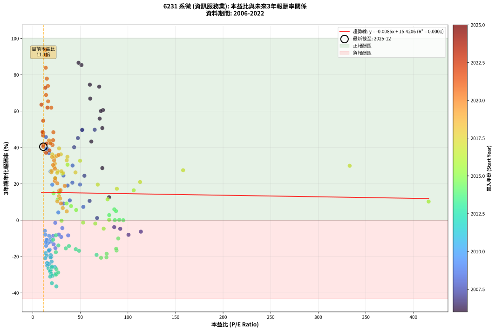
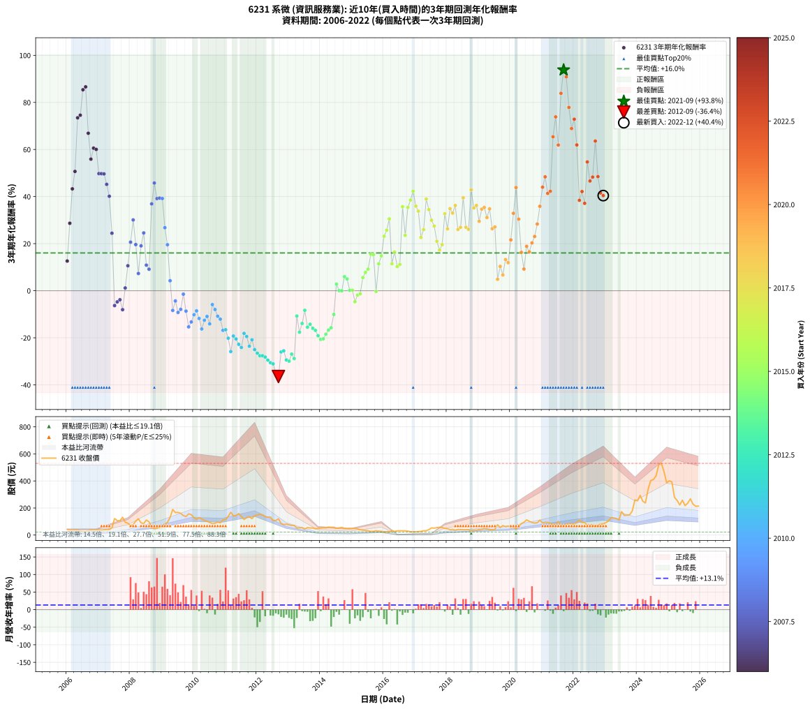

# 6231 系微 - 本益比與未來報酬率分析

!!! info "報告資訊"
    - **股票代號**: 6231
    - **公司名稱**: 系微
    - **產業別**: 資訊服務業
    - **分析期間**: 2006-2022 (204 個數據點)
    - **資料來源**: Type 12 (ShowMonthlyK_ChartFlow) 月收盤價與本益比
    - **報酬率口徑**: 含現金股利 (簡化: 年度合計，假設每年7/1入帳)
    - **報告生成時間**: 2026-01-10 19:06:47 CST

## 📈 視覺化圖表

### 圖表1: 本益比 vs 未來報酬率關係

*圖表1：6231 系微 本益比與3年期未來報酬率關係 (2006-2022)*

### 圖表2: 歷年買入時點的3年期實際報酬率

*圖表2：6231 系微 歷年買入時點的3年期實際報酬率 (2006-2022)*

## 📍 買點訊號說明

本報告提供兩種買點提示訊號（顯示於圖表2的股價子圖中）：

### ▲ 小綠色三角形（回測驗證）
- **計算方式**: 使用全部歷史資料計算本益比第25百分位數
- **用途**: 事後驗證，顯示歷史上哪些時點確實為低估區
- **限制**: 當下無法判斷，僅供回測參考
- **特性**: 後見之明（Look-Ahead Bias）

### ▲ 小橘色三角形（即時訊號）
- **計算方式**: 使用截至當月的過去5年資料計算本益比第25百分位數
- **用途**: 實際投資決策，當時即可判斷
- **優勢**: 可操作性強，符合實務需求
- **特性**: 無後見之明，滾動窗口計算

!!! tip "如何使用兩種訊號"
    - **綠色▲** 幫助理解歷史估值機會，驗證策略有效性
    - **橘色▲** 可作為實際買進參考，但仍需搭配基本面分析
    - 兩種訊號重疊時，表示即時判斷與事後驗證一致，信心度較高
    - 僅有綠色▲時，表示當時無法判斷（需要未來資料才能確認）
    - 僅有橘色▲時，表示即時判斷為買點，但事後可能不是最佳時機

## 📊 估值分析摘要

| 指標 | 數值 |
|:---:|:---:|
| **目前本益比** (2022-12) | **11.10 倍** |
| **歷史平均本益比** | 40.14 倍 |
| **估值水準** | 🟢 相對低估 |
| **預期3年年化報酬率** | **+15.33%** |
| **歷史平均報酬率** | +16.05% |
| **相關係數 (R²)** | 0.0001 |
| **趨勢線斜率** | -0.0085 |

!!! abstract "核心洞察"
    目前本益比顯著低於歷史平均，預期未來報酬率可能較高

    根據歷史數據回測，6231 系微 在目前本益比 **11.1倍** 的估值水準下，
    預期未來3年年化報酬率約為 **+15.3%**。

    **重要提醒**: 本分析基於歷史數據統計，實際報酬率會受到公司基本面變化、產業趨勢、
    總體經濟環境等多重因素影響。R² = 0.00 表示本益比可解釋約 0.0% 的報酬率變異。

## 📈 歷史估值統計

### 最佳買點 (最高報酬率)

| 項目 | 數值 |
|:---:|:---:|
| 起始時間 | 2021-09 |
| 當時本益比 | 13.39 倍 |
| 起始價格 | 73.2 元 |
| 3年後價格 | 519.0 元 |
| **3年年化報酬率** | **+93.79%** |

### 最差買點 (最低報酬率)

| 項目 | 數值 |
|:---:|:---:|
| 起始時間 | 2012-09 |
| 當時本益比 | 24.79 倍 |
| 起始價格 | 120.0 元 |
| 3年後價格 | 27.4 元 |
| **3年年化報酬率** | **-36.44%** |

## 🎯 投資啟示

### 本益比與報酬率關係

趨勢線方程式: **y = -0.0085x + 15.4206**

!!! note "負相關"
    本益比與未來報酬率呈現負相關。較低的本益比通常帶來較高的未來報酬率，
    但相關性不算非常強。**估值仍是重要參考指標之一**。

### 估值區間建議

基於歷史數據分析:

- **🟢 低估區** (P/E < 32.1): 預期報酬率較高，可考慮增加持股
- **🟡 合理區** (P/E 32.1-48.2): 預期報酬率符合長期趨勢，正常持有
- **🔴 高估區** (P/E > 48.2): 預期報酬率較低，可考慮減碼或觀望

!!! danger "風險提示"
    - 過去表現不代表未來結果
    - 本分析假設公司基本面無重大結構性變化
    - 產業環境劇變可能使歷史規律失效
    - 應結合公司財報、產業趨勢、總體經濟等多重因素綜合判斷

!!! success "長期投資觀點"
    歷史數據顯示，在合理或低估的估值水準買入並長期持有，
    往往能獲得較佳的投資報酬。**耐心等待好價格**是價值投資的核心原則。

## 📊 數據品質

- **資料來源**: GoodInfo.tw Type 12 (ShowMonthlyK_ChartFlow)
- **資料頻率**: 月度收盤價與本益比
- **回測期間**: 2006-2022
- **數據點數量**: 204 個 (每個點代表一次3年期回測)

### 計算方法說明

1. **3年期年化報酬率**:
   - 對每個歷史時點，計算其後3年的實際投資報酬率
   - 期末價值(不含股利): 期末價格
   - 期末價值(含現金股利): 期末價格 + 持有期間內的現金股利合計 (簡化: 年度合計，假設每年7/1入帳)
   - 公式: 年化報酬率 = [(期末價值/期初價格)^(1/年數) - 1] × 100%

2. **本益比 (P/E Ratio)**:
   - 使用當時的月收盤價與EPS計算
   - 資料來源: Type 12 月度河流圖本益比數據

3. **趨勢線 (Linear Regression)**:
   - 使用最小平方法擬合線性趨勢線
   - R²值衡量本益比對報酬率的解釋能力

---

*本報告由 Stock Analysis System v1.9.0 自動生成*
*數據更新時間: 2026-01-10 19:06:47 CST*

## 📋 月度回測明細表

（每一列對應時間線圖中的一個買入點；可用來對照 SVG 圖上的每個點。）

| 買入月份 | 賣出月份 | 回測期限_年 | 實際持有年數 | 買入本益比_倍 | 買入收盤價_元 | 賣出收盤價_元 | 現金股利合計_元 | 總報酬率_pct | 年化報酬率_pct |
| --- | --- | --- | --- | --- | --- | --- | --- | --- | --- |
| 2006-01 | 2009-01 | 3 | 3.001 | 80.19 | 41.70 | 59.50 | 0.05 | +42.81 | +12.61 |
| 2006-02 | 2009-02 | 3 | 3.001 | 73.08 | 38.00 | 80.90 | 0.05 | +113.03 | +28.66 |
| 2006-03 | 2009-03 | 3 | 3.001 | 61.54 | 32.00 | 94.10 | 0.05 | +194.22 | +43.28 |
| 2006-04 | 2009-04 | 3 | 3.001 | 73.08 | 38.00 | 130.00 | 0.05 | +242.24 | +50.69 |
| 2006-05 | 2009-05 | 3 | 3.001 | 69.81 | 36.30 | 189.50 | 0.05 | +422.18 | +73.47 |
| 2006-06 | 2009-06 | 3 | 3.001 | 60.00 | 31.20 | 166.00 | 0.05 | +432.22 | +74.57 |
| 2006-07 | 2009-07 | 3 | 3.001 | 51.15 | 26.60 | 167.50 | 2.04 | +537.37 | +85.38 |
| 2006-08 | 2009-08 | 3 | 3.001 | 48.08 | 25.00 | 160.50 | 2.04 | +550.16 | +86.61 |
| 2006-09 | 2009-09 | 3 | 3.001 | 60.38 | 31.40 | 144.00 | 2.04 | +365.10 | +66.90 |
| 2006-10 | 2009-10 | 3 | 3.001 | 70.29 | 36.55 | 136.50 | 2.04 | +279.04 | +55.90 |
| 2006-11 | 2009-11 | 3 | 3.001 | 73.85 | 38.40 | 157.00 | 2.04 | +314.17 | +60.58 |
| 2006-12 | 2009-12 | 3 | 3.001 | 71.54 | 37.20 | 150.50 | 2.04 | +310.05 | +60.04 |
| 2007-01 | 2010-01 | 3 | 3.001 | 65.09 | 39.00 | 129.00 | 2.04 | +236.00 | +49.76 |
| 2007-02 | 2010-02 | 3 | 3.001 | 52.04 | 35.30 | 116.50 | 2.04 | +235.81 | +49.74 |
| 2007-03 | 2010-03 | 3 | 3.001 | 51.82 | 39.25 | 129.50 | 2.04 | +235.13 | +49.63 |
| 2007-04 | 2010-04 | 3 | 3.001 | 47.45 | 39.70 | 119.50 | 2.04 | +206.15 | +45.19 |
| 2007-05 | 2010-05 | 3 | 3.001 | 43.46 | 39.80 | 107.50 | 2.04 | +175.23 | +40.13 |
| 2007-06 | 2010-06 | 3 | 3.001 | 54.27 | 54.00 | 102.00 | 2.04 | +92.67 | +24.43 |
| 2007-07 | 2010-07 | 3 | 3.001 | 113.60 | 122.00 | 93.50 | 6.83 | -17.76 | -6.31 |
| 2007-08 | 2010-08 | 3 | 3.001 | 91.91 | 106.00 | 84.80 | 6.83 | -13.56 | -4.74 |
| 2007-09 | 2010-09 | 3 | 3.001 | 85.60 | 105.50 | 87.00 | 6.83 | -11.06 | -3.83 |
| 2007-10 | 2010-10 | 3 | 3.001 | 100.60 | 132.00 | 95.80 | 6.83 | -22.25 | -8.05 |
| 2007-11 | 2010-11 | 3 | 3.001 | 67.59 | 94.00 | 90.50 | 6.83 | +3.54 | +1.17 |
| 2007-12 | 2010-12 | 3 | 3.001 | 59.73 | 87.80 | 112.00 | 6.83 | +35.34 | +10.61 |
| 2008-01 | 2011-01 | 3 | 3.001 | 41.62 | 69.40 | 115.00 | 6.83 | +75.55 | +20.63 |
| 2008-02 | 2011-03 | 3 | 3.080 | 41.82 | 78.00 | 168.50 | 6.83 | +124.78 | +30.08 |
| 2008-03 | 2011-03 | 3 | 2.998 | 49.70 | 102.50 | 168.50 | 6.83 | +71.05 | +19.61 |
| 2008-04 | 2011-04 | 3 | 2.998 | 53.10 | 120.00 | 141.50 | 6.83 | +23.61 | +7.33 |
| 2008-05 | 2011-05 | 3 | 2.998 | 36.62 | 90.00 | 145.00 | 6.83 | +68.70 | +19.06 |
| 2008-06 | 2011-06 | 3 | 2.998 | 32.24 | 85.60 | 158.50 | 6.83 | +93.14 | +24.55 |
| 2008-07 | 2011-07 | 3 | 2.998 | 38.91 | 111.00 | 139.00 | 12.28 | +36.29 | +10.88 |
| 2008-08 | 2011-08 | 3 | 2.998 | 32.10 | 97.90 | 115.00 | 12.28 | +30.01 | +9.15 |
| 2008-09 | 2011-09 | 3 | 2.998 | 16.91 | 54.90 | 128.50 | 12.28 | +156.42 | +36.90 |
| 2008-10 | 2011-10 | 3 | 2.998 | 13.82 | 47.60 | 135.00 | 12.28 | +209.41 | +45.75 |
| 2008-11 | 2011-11 | 3 | 2.998 | 13.59 | 49.50 | 121.00 | 12.28 | +169.25 | +39.15 |
| 2008-12 | 2011-12 | 3 | 2.998 | 15.00 | 57.60 | 143.50 | 12.28 | +170.45 | +39.36 |
| 2009-01 | 2012-01 | 3 | 2.998 | 14.54 | 59.50 | 148.00 | 12.28 | +169.37 | +39.17 |
| 2009-02 | 2012-02 | 3 | 2.998 | 18.63 | 80.90 | 152.50 | 12.28 | +103.68 | +26.78 |
| 2009-03 | 2012-03 | 3 | 3.001 | 20.49 | 94.10 | 148.50 | 12.28 | +70.86 | +19.54 |
| 2009-04 | 2012-04 | 3 | 3.001 | 26.84 | 130.00 | 135.00 | 12.28 | +13.29 | +4.25 |
| 2009-05 | 2012-05 | 3 | 3.001 | 37.20 | 189.50 | 133.50 | 12.28 | -23.07 | -8.37 |
| 2009-06 | 2012-06 | 3 | 3.001 | 31.06 | 166.00 | 133.00 | 12.28 | -12.48 | -4.35 |
| 2009-07 | 2012-07 | 3 | 3.001 | 29.93 | 167.50 | 107.50 | 17.79 | -25.20 | -9.22 |
| 2009-08 | 2012-08 | 3 | 3.001 | 27.45 | 160.50 | 107.50 | 17.79 | -21.94 | -7.92 |
| 2009-09 | 2012-09 | 3 | 3.001 | 23.62 | 144.00 | 120.00 | 17.79 | -4.31 | -1.46 |
| 2009-10 | 2012-10 | 3 | 3.001 | 21.50 | 136.50 | 86.20 | 17.79 | -23.82 | -8.67 |
| 2009-11 | 2012-11 | 3 | 3.001 | 23.79 | 157.00 | 77.40 | 17.79 | -39.37 | -15.36 |
| 2009-12 | 2012-12 | 3 | 3.001 | 21.97 | 150.50 | 80.40 | 17.79 | -34.76 | -13.27 |
| 2010-01 | 2013-01 | 3 | 3.001 | 18.90 | 129.00 | 75.60 | 17.79 | -27.61 | -10.21 |
| 2010-02 | 2013-02 | 3 | 3.001 | 17.14 | 116.50 | 71.30 | 17.79 | -23.53 | -8.55 |
| 2010-03 | 2013-03 | 3 | 3.001 | 19.12 | 129.50 | 71.10 | 17.79 | -31.36 | -11.79 |
| 2010-04 | 2013-04 | 3 | 3.001 | 17.71 | 119.50 | 52.40 | 17.79 | -41.26 | -16.25 |
| 2010-05 | 2013-05 | 3 | 3.001 | 16.00 | 107.50 | 54.10 | 17.79 | -33.13 | -12.55 |
| 2010-06 | 2013-06 | 3 | 3.001 | 15.24 | 102.00 | 54.30 | 17.79 | -29.32 | -10.92 |
| 2010-07 | 2013-07 | 3 | 3.001 | 14.02 | 93.50 | 43.80 | 15.49 | -36.59 | -14.09 |
| 2010-08 | 2013-08 | 3 | 3.001 | 12.76 | 84.80 | 55.20 | 15.49 | -16.64 | -5.89 |
| 2010-09 | 2013-09 | 3 | 3.001 | 13.15 | 87.00 | 52.30 | 15.49 | -22.08 | -7.98 |
| 2010-10 | 2013-10 | 3 | 3.001 | 14.53 | 95.80 | 52.40 | 15.49 | -29.14 | -10.84 |
| 2010-11 | 2013-11 | 3 | 3.001 | 13.78 | 90.50 | 46.00 | 15.49 | -32.06 | -12.09 |
| 2010-12 | 2013-12 | 3 | 3.001 | 17.13 | 112.00 | 48.95 | 15.49 | -42.47 | -16.82 |
| 2011-01 | 2014-01 | 3 | 3.001 | 16.96 | 115.00 | 51.30 | 15.49 | -41.92 | -16.56 |
| 2011-02 | 2014-02 | 3 | 3.001 | 19.50 | 137.00 | 54.20 | 15.49 | -49.13 | -20.17 |
| 2011-03 | 2014-03 | 3 | 3.001 | 23.19 | 168.50 | 53.20 | 15.49 | -59.24 | -25.85 |
| 2011-04 | 2014-04 | 3 | 3.001 | 18.84 | 141.50 | 59.00 | 15.49 | -47.36 | -19.25 |
| 2011-05 | 2014-05 | 3 | 3.001 | 18.70 | 145.00 | 57.40 | 15.49 | -49.73 | -20.48 |
| 2011-06 | 2014-06 | 3 | 3.001 | 19.82 | 158.50 | 57.50 | 15.49 | -53.95 | -22.77 |
| 2011-07 | 2014-07 | 3 | 3.001 | 16.87 | 139.00 | 50.20 | 10.54 | -56.30 | -24.11 |
| 2011-08 | 2014-08 | 3 | 3.001 | 13.56 | 115.00 | 52.60 | 10.54 | -45.10 | -18.11 |
| 2011-09 | 2014-09 | 3 | 3.001 | 14.73 | 128.50 | 56.60 | 10.54 | -47.75 | -19.45 |
| 2011-10 | 2014-10 | 3 | 3.001 | 15.06 | 135.00 | 49.70 | 10.54 | -55.38 | -23.58 |
| 2011-11 | 2014-11 | 3 | 3.001 | 13.14 | 121.00 | 49.45 | 10.54 | -50.42 | -20.85 |
| 2011-12 | 2014-12 | 3 | 3.001 | 15.19 | 143.50 | 50.00 | 10.54 | -57.81 | -25.00 |
| 2012-01 | 2015-01 | 3 | 3.001 | 16.56 | 148.00 | 48.10 | 10.54 | -60.38 | -26.55 |
| 2012-02 | 2015-03 | 3 | 3.080 | 18.10 | 152.50 | 45.80 | 10.54 | -63.06 | -27.62 |
| 2012-03 | 2015-03 | 3 | 2.998 | 18.76 | 148.50 | 45.80 | 10.54 | -62.06 | -27.62 |
| 2012-04 | 2015-04 | 3 | 2.998 | 18.24 | 135.00 | 39.50 | 10.54 | -62.93 | -28.18 |
| 2012-05 | 2015-05 | 3 | 2.998 | 19.38 | 133.50 | 36.30 | 10.54 | -64.92 | -29.49 |
| 2012-06 | 2015-06 | 3 | 2.998 | 20.85 | 133.00 | 34.00 | 10.54 | -66.51 | -30.57 |
| 2012-07 | 2015-07 | 3 | 2.998 | 18.33 | 107.50 | 31.80 | 3.44 | -67.22 | -31.07 |
| 2012-08 | 2015-08 | 3 | 2.998 | 20.08 | 107.50 | 26.55 | 3.44 | -72.10 | -34.68 |
| 2012-09 | 2015-09 | 3 | 2.998 | 24.79 | 120.00 | 27.40 | 3.44 | -74.30 | -36.44 |
| 2012-10 | 2015-10 | 3 | 2.998 | 19.91 | 86.20 | 31.50 | 3.44 | -59.47 | -26.01 |
| 2012-11 | 2015-11 | 3 | 2.998 | 20.28 | 77.40 | 28.55 | 3.44 | -58.67 | -25.53 |
| 2012-12 | 2015-12 | 3 | 2.998 | 24.32 | 80.40 | 24.85 | 3.44 | -64.82 | -29.42 |
| 2013-01 | 2016-01 | 3 | 2.998 | 24.46 | 75.60 | 22.60 | 3.44 | -65.56 | -29.92 |
| 2013-02 | 2016-02 | 3 | 2.998 | 24.79 | 71.30 | 24.40 | 3.44 | -60.96 | -26.93 |
| 2013-03 | 2016-03 | 3 | 3.001 | 26.71 | 71.10 | 22.20 | 3.44 | -63.94 | -28.82 |
| 2013-04 | 2016-04 | 3 | 3.001 | 21.41 | 52.40 | 33.80 | 3.44 | -28.94 | -10.76 |
| 2013-05 | 2016-05 | 3 | 3.001 | 24.24 | 54.10 | 26.80 | 3.44 | -44.11 | -17.62 |
| 2013-06 | 2016-06 | 3 | 3.001 | 26.91 | 54.30 | 31.20 | 3.44 | -36.21 | -13.91 |
| 2013-07 | 2016-07 | 3 | 3.001 | 24.29 | 43.80 | 31.95 | 1.80 | -22.95 | -8.32 |
| 2013-08 | 2016-08 | 3 | 3.001 | 34.75 | 55.20 | 31.50 | 1.80 | -39.67 | -15.50 |
| 2013-09 | 2016-09 | 3 | 3.001 | 38.07 | 52.30 | 31.20 | 1.80 | -36.90 | -14.23 |
| 2013-10 | 2016-10 | 3 | 3.001 | 45.20 | 52.40 | 29.30 | 1.80 | -40.65 | -15.96 |
| 2013-11 | 2016-11 | 3 | 3.001 | 48.70 | 46.00 | 24.65 | 1.80 | -42.50 | -16.84 |
| 2013-12 | 2016-12 | 3 | 3.001 | 67.05 | 48.95 | 24.10 | 1.80 | -47.09 | -19.11 |
| 2014-01 | 2017-01 | 3 | 3.001 | 71.75 | 51.30 | 23.80 | 1.80 | -50.10 | -20.68 |
| 2014-02 | 2017-02 | 3 | 3.001 | 77.43 | 54.20 | 25.50 | 1.80 | -49.63 | -20.43 |
| 2014-03 | 2017-03 | 3 | 3.001 | 77.66 | 53.20 | 27.00 | 1.80 | -45.86 | -18.50 |
| 2014-04 | 2017-04 | 3 | 3.001 | 88.06 | 59.00 | 32.30 | 1.80 | -42.20 | -16.70 |
| 2014-05 | 2017-05 | 3 | 3.001 | 87.63 | 57.40 | 32.55 | 1.80 | -40.16 | -15.73 |
| 2014-06 | 2017-06 | 3 | 3.001 | 89.84 | 57.50 | 40.00 | 1.80 | -27.30 | -10.08 |
| 2014-07 | 2017-07 | 3 | 3.001 | 80.32 | 50.20 | 53.00 | 1.55 | +8.67 | +2.81 |
| 2014-08 | 2017-08 | 3 | 3.001 | 86.23 | 52.60 | 51.10 | 1.55 | +0.10 | +0.03 |
| 2014-09 | 2017-09 | 3 | 3.001 | 95.13 | 56.60 | 55.00 | 1.55 | -0.09 | -0.03 |
| 2014-10 | 2017-10 | 3 | 3.001 | 85.69 | 49.70 | 57.60 | 1.55 | +19.01 | +5.97 |
| 2014-11 | 2017-11 | 3 | 3.001 | 87.52 | 49.45 | 55.70 | 1.55 | +15.77 | +5.00 |
| 2014-12 | 2017-12 | 3 | 3.001 | 90.91 | 50.00 | 48.70 | 1.55 | +0.50 | +0.17 |
| 2015-01 | 2018-01 | 3 | 3.001 | 80.28 | 48.10 | 46.85 | 1.55 | +0.62 | +0.21 |
| 2015-02 | 2018-02 | 3 | 3.001 | 74.50 | 48.30 | 40.30 | 1.55 | -13.35 | -4.66 |
| 2015-03 | 2018-03 | 3 | 3.001 | 65.66 | 45.80 | 41.75 | 1.55 | -5.46 | -1.85 |
| 2015-04 | 2018-04 | 3 | 3.001 | 52.90 | 39.50 | 36.40 | 1.55 | -3.92 | -1.33 |
| 2015-05 | 2018-05 | 3 | 3.001 | 45.61 | 36.30 | 41.20 | 1.55 | +17.77 | +5.60 |
| 2015-06 | 2018-06 | 3 | 3.001 | 40.24 | 34.00 | 41.00 | 1.55 | +25.15 | +7.76 |
| 2015-07 | 2018-07 | 3 | 3.001 | 35.56 | 31.80 | 39.40 | 2.00 | +30.19 | +9.19 |
| 2015-08 | 2018-08 | 3 | 3.001 | 28.14 | 26.55 | 38.90 | 2.00 | +54.05 | +15.49 |
| 2015-09 | 2018-09 | 3 | 3.001 | 27.61 | 27.40 | 40.00 | 2.00 | +53.28 | +15.30 |
| 2015-10 | 2018-10 | 3 | 3.001 | 30.24 | 31.50 | 29.20 | 2.00 | -0.95 | -0.32 |
| 2015-11 | 2018-11 | 3 | 3.001 | 26.17 | 28.55 | 37.50 | 2.00 | +38.35 | +11.43 |
| 2015-12 | 2018-12 | 3 | 3.001 | 21.80 | 24.85 | 35.60 | 2.00 | +51.31 | +14.80 |
| 2016-01 | 2019-01 | 3 | 3.001 | 23.48 | 22.60 | 40.20 | 2.00 | +86.73 | +23.13 |
| 2016-02 | 2019-03 | 3 | 3.080 | 31.08 | 24.40 | 47.35 | 2.00 | +102.25 | +25.69 |
| 2016-03 | 2019-03 | 3 | 2.998 | 36.54 | 22.20 | 47.35 | 2.00 | +122.30 | +30.53 |
| 2016-04 | 2019-04 | 3 | 2.998 | 78.60 | 33.80 | 44.80 | 2.00 | +38.46 | +11.47 |
| 2016-05 | 2019-05 | 3 | 2.998 | 106.10 | 26.80 | 40.30 | 2.00 | +57.84 | +16.44 |
| 2016-06 | 2019-06 | 3 | 2.998 | 416.00 | 31.20 | 39.80 | 2.00 | +33.97 | +10.25 |
| 2016-07 | 2019-07 | 3 | 2.998 |  | 31.95 | 41.25 | 2.65 | +37.40 | +11.18 |
| 2016-08 | 2019-08 | 3 | 2.998 |  | 31.50 | 76.00 | 2.65 | +149.68 | +35.69 |
| 2016-09 | 2019-09 | 3 | 2.998 |  | 31.20 | 56.10 | 2.65 | +88.30 | +23.50 |
| 2016-10 | 2019-10 | 3 | 2.998 |  | 29.30 | 70.00 | 2.65 | +147.95 | +35.38 |
| 2016-11 | 2019-11 | 3 | 2.998 |  | 24.65 | 62.80 | 2.65 | +165.52 | +38.50 |
| 2016-12 | 2019-12 | 3 | 2.998 |  | 24.10 | 66.70 | 2.65 | +187.76 | +42.27 |
| 2017-01 | 2020-01 | 3 | 2.998 |  | 23.80 | 57.10 | 2.65 | +151.05 | +35.94 |
| 2017-02 | 2020-02 | 3 | 2.998 |  | 25.50 | 58.40 | 2.65 | +139.41 | +33.80 |
| 2017-03 | 2020-03 | 3 | 3.001 |  | 27.00 | 47.15 | 2.65 | +84.44 | +22.63 |
| 2017-04 | 2020-04 | 3 | 3.001 |  | 32.30 | 61.90 | 2.65 | +99.85 | +25.95 |
| 2017-05 | 2020-05 | 3 | 3.001 |  | 32.55 | 84.70 | 2.65 | +168.36 | +38.95 |
| 2017-06 | 2020-06 | 3 | 3.001 |  | 40.00 | 94.60 | 2.65 | +143.12 | +34.46 |
| 2017-07 | 2020-07 | 3 | 3.001 | 333.00 | 53.00 | 112.00 | 4.35 | +119.53 | +29.96 |
| 2017-08 | 2020-08 | 3 | 3.001 | 158.00 | 51.10 | 101.50 | 4.35 | +107.14 | +27.47 |
| 2017-09 | 2020-09 | 3 | 3.001 | 112.80 | 55.00 | 93.10 | 4.35 | +77.18 | +21.00 |
| 2017-10 | 2020-10 | 3 | 3.001 | 88.39 | 57.60 | 88.60 | 4.35 | +61.37 | +17.29 |
| 2017-11 | 2020-11 | 3 | 3.001 | 68.27 | 55.70 | 90.90 | 4.35 | +71.01 | +19.58 |
| 2017-12 | 2020-12 | 3 | 3.001 | 49.69 | 48.70 | 109.50 | 4.35 | +133.78 | +32.71 |
| 2018-01 | 2021-01 | 3 | 3.001 | 44.90 | 46.85 | 90.00 | 4.35 | +101.39 | +26.28 |
| 2018-02 | 2021-02 | 3 | 3.001 | 36.42 | 40.30 | 94.50 | 4.35 | +145.29 | +34.85 |
| 2018-03 | 2021-03 | 3 | 3.001 | 35.68 | 41.75 | 93.80 | 4.35 | +135.09 | +32.96 |
| 2018-04 | 2021-04 | 3 | 3.001 | 29.51 | 36.40 | 87.70 | 4.35 | +152.88 | +36.23 |
| 2018-05 | 2021-05 | 3 | 3.001 | 31.77 | 41.20 | 78.10 | 4.35 | +100.12 | +26.01 |
| 2018-06 | 2021-06 | 3 | 3.001 | 30.15 | 41.00 | 79.50 | 4.35 | +104.51 | +26.93 |
| 2018-07 | 2021-07 | 3 | 3.001 | 27.68 | 39.40 | 100.00 | 7.00 | +171.57 | +39.51 |
| 2018-08 | 2021-08 | 3 | 3.001 | 26.17 | 38.90 | 72.60 | 7.00 | +104.63 | +26.95 |
| 2018-09 | 2021-09 | 3 | 3.001 | 25.81 | 40.00 | 73.20 | 7.00 | +100.50 | +26.09 |
| 2018-10 | 2021-10 | 3 | 3.001 | 18.10 | 29.20 | 78.20 | 7.00 | +191.78 | +42.88 |
| 2018-11 | 2021-11 | 3 | 3.001 | 22.37 | 37.50 | 85.60 | 7.00 | +146.93 | +35.15 |
| 2018-12 | 2021-12 | 3 | 3.001 | 20.46 | 35.60 | 83.00 | 7.00 | +152.81 | +36.22 |
| 2019-01 | 2022-01 | 3 | 3.001 | 22.48 | 40.20 | 80.30 | 7.00 | +117.16 | +29.49 |
| 2019-02 | 2022-02 | 3 | 3.001 | 22.89 | 42.05 | 95.70 | 7.00 | +144.23 | +34.66 |
| 2019-03 | 2022-03 | 3 | 3.001 | 25.12 | 47.35 | 110.50 | 7.00 | +148.15 | +35.38 |
| 2019-04 | 2022-04 | 3 | 3.001 | 23.17 | 44.80 | 94.00 | 7.00 | +125.45 | +31.12 |
| 2019-05 | 2022-05 | 3 | 3.001 | 20.34 | 40.30 | 91.70 | 7.00 | +144.91 | +34.78 |
| 2019-06 | 2022-06 | 3 | 3.001 | 19.61 | 39.80 | 73.30 | 7.00 | +101.76 | +26.35 |
| 2019-07 | 2022-07 | 3 | 3.001 | 19.85 | 41.25 | 74.00 | 10.70 | +105.33 | +27.10 |
| 2019-08 | 2022-08 | 3 | 3.001 | 35.74 | 76.00 | 76.90 | 10.70 | +15.26 | +4.85 |
| 2019-09 | 2022-09 | 3 | 3.001 | 25.79 | 56.10 | 64.70 | 10.70 | +34.40 | +10.36 |
| 2019-10 | 2022-10 | 3 | 3.001 | 31.48 | 70.00 | 74.30 | 10.70 | +21.43 | +6.68 |
| 2019-11 | 2022-11 | 3 | 3.001 | 27.64 | 62.80 | 80.50 | 10.70 | +45.22 | +13.24 |
| 2019-12 | 2022-12 | 3 | 3.001 | 28.75 | 66.70 | 82.80 | 10.70 | +40.18 | +11.91 |
| 2020-01 | 2023-01 | 3 | 3.001 | 23.17 | 57.10 | 92.00 | 10.70 | +79.86 | +21.61 |
| 2020-02 | 2023-03 | 3 | 3.080 | 22.39 | 58.40 | 129.50 | 10.70 | +140.07 | +32.89 |
| 2020-03 | 2023-03 | 3 | 2.998 | 17.13 | 47.15 | 129.50 | 10.70 | +197.35 | +43.83 |
| 2020-04 | 2023-04 | 3 | 2.998 | 21.37 | 61.90 | 126.50 | 10.70 | +121.65 | +30.41 |
| 2020-05 | 2023-05 | 3 | 2.998 | 27.85 | 84.70 | 122.50 | 10.70 | +57.26 | +16.30 |
| 2020-06 | 2023-06 | 3 | 2.998 | 29.70 | 94.60 | 112.50 | 10.70 | +30.23 | +9.21 |
| 2020-07 | 2023-07 | 3 | 2.998 | 33.64 | 112.00 | 173.00 | 15.00 | +67.86 | +18.86 |
| 2020-08 | 2023-08 | 3 | 2.998 | 29.22 | 101.50 | 145.50 | 15.00 | +58.13 | +16.51 |
| 2020-09 | 2023-09 | 3 | 2.998 | 25.74 | 93.10 | 147.00 | 15.00 | +74.01 | +20.29 |
| 2020-10 | 2023-10 | 3 | 2.998 | 23.55 | 88.60 | 150.00 | 15.00 | +86.23 | +23.05 |
| 2020-11 | 2023-11 | 3 | 2.998 | 23.27 | 90.90 | 177.00 | 15.00 | +111.22 | +28.33 |
| 2020-12 | 2023-12 | 3 | 2.998 | 27.04 | 109.50 | 259.50 | 15.00 | +150.68 | +35.87 |
| 2021-01 | 2024-01 | 3 | 2.998 | 21.39 | 90.00 | 253.50 | 15.00 | +198.33 | +43.99 |
| 2021-02 | 2024-02 | 3 | 2.998 | 21.65 | 94.50 | 293.50 | 15.00 | +226.46 | +48.39 |
| 2021-03 | 2024-03 | 3 | 3.001 | 20.74 | 93.80 | 250.00 | 15.00 | +182.52 | +41.36 |
| 2021-04 | 2024-04 | 3 | 3.001 | 18.74 | 87.70 | 237.50 | 15.00 | +187.91 | +42.25 |
| 2021-05 | 2024-05 | 3 | 3.001 | 16.14 | 78.10 | 338.50 | 15.00 | +352.62 | +65.40 |
| 2021-06 | 2024-06 | 3 | 3.001 | 15.92 | 79.50 | 403.00 | 15.00 | +425.79 | +73.87 |
| 2021-07 | 2024-07 | 3 | 3.001 | 19.41 | 100.00 | 410.50 | 14.00 | +324.50 | +61.90 |
| 2021-08 | 2024-08 | 3 | 3.001 | 13.67 | 72.60 | 437.50 | 14.00 | +521.90 | +83.87 |
| 2021-09 | 2024-09 | 3 | 3.001 | 13.39 | 73.20 | 519.00 | 14.00 | +628.14 | +93.79 |
| 2021-10 | 2024-10 | 3 | 3.001 | 13.90 | 78.20 | 530.00 | 14.00 | +595.65 | +90.87 |
| 2021-11 | 2024-11 | 3 | 3.001 | 14.80 | 85.60 | 468.00 | 14.00 | +463.08 | +77.88 |
| 2021-12 | 2024-12 | 3 | 3.001 | 13.97 | 83.00 | 386.00 | 14.00 | +381.93 | +68.89 |
| 2022-01 | 2025-01 | 3 | 3.001 | 13.24 | 80.30 | 401.00 | 14.00 | +416.81 | +72.87 |
| 2022-02 | 2025-02 | 3 | 3.001 | 15.45 | 95.70 | 392.50 | 14.00 | +324.76 | +61.93 |
| 2022-03 | 2025-03 | 3 | 3.001 | 17.48 | 110.50 | 279.00 | 14.00 | +165.16 | +38.40 |
| 2022-04 | 2025-04 | 3 | 3.001 | 14.58 | 94.00 | 256.00 | 14.00 | +187.23 | +42.14 |
| 2022-05 | 2025-05 | 3 | 3.001 | 13.95 | 91.70 | 222.50 | 14.00 | +157.91 | +37.13 |
| 2022-06 | 2025-06 | 3 | 3.001 | 10.94 | 73.30 | 257.50 | 14.00 | +270.40 | +54.71 |
| 2022-07 | 2025-07 | 3 | 3.001 | 10.84 | 74.00 | 218.00 | 15.30 | +215.27 | +46.62 |
| 2022-08 | 2025-08 | 3 | 3.001 | 11.06 | 76.90 | 235.50 | 15.30 | +226.14 | +48.28 |
| 2022-09 | 2025-09 | 3 | 3.001 | 9.14 | 64.70 | 268.00 | 15.30 | +337.87 | +63.58 |
| 2022-10 | 2025-10 | 3 | 3.001 | 10.31 | 74.30 | 228.00 | 15.30 | +227.46 | +48.48 |
| 2022-11 | 2025-11 | 3 | 3.001 | 10.98 | 80.50 | 213.00 | 15.30 | +183.60 | +41.54 |
| 2022-12 | 2025-12 | 3 | 3.001 | 11.10 | 82.80 | 214.00 | 15.30 | +176.93 | +40.42 |
