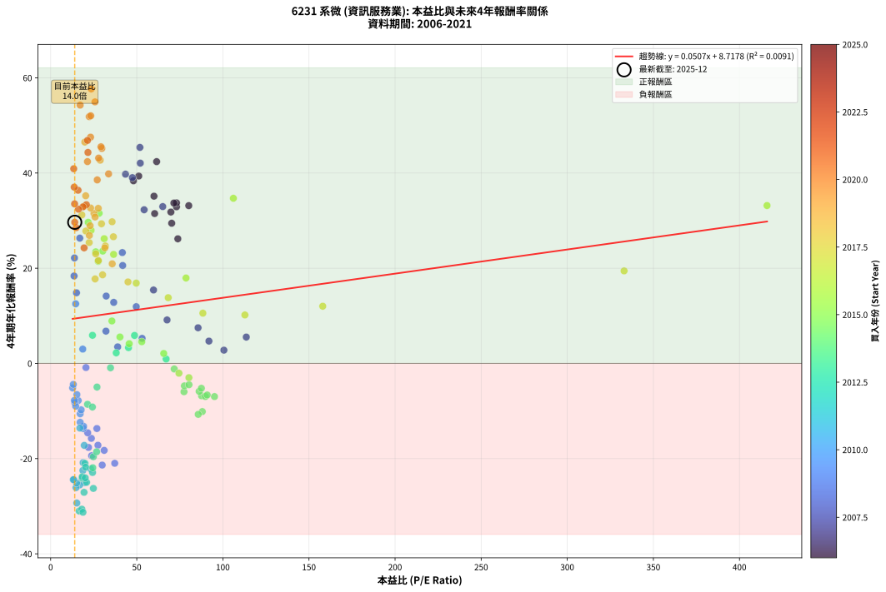
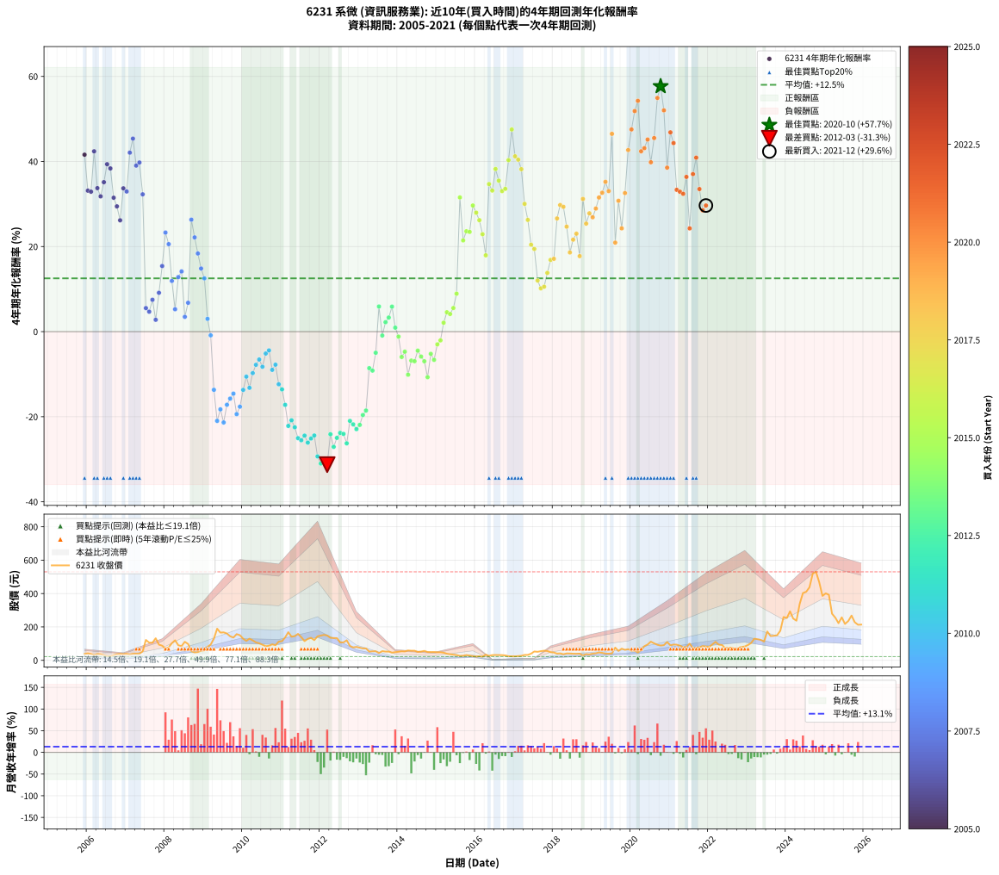

# 6231 系微 - 本益比與未來報酬率分析

!!! info "報告資訊"
    - **股票代號**: 6231
    - **公司名稱**: 系微
    - **產業別**: 資訊服務業
    - **分析期間**: 2006-2021 (192 個數據點)
    - **資料來源**: Type 12 (ShowMonthlyK_ChartFlow) 月收盤價與本益比
    - **報酬率口徑**: 含現金股利 (簡化: 年度合計，假設每年7/1入帳)
    - **報告生成時間**: 2026-01-10 23:06:32 CST

## 📈 視覺化圖表

### 圖表1: 本益比 vs 未來報酬率關係

*圖表1：6231 系微 本益比與4年期未來報酬率關係 (2006-2021)*

### 圖表2: 歷年買入時點的4年期實際報酬率

*圖表2：6231 系微 歷年買入時點的4年期實際報酬率 (2006-2021)*

## 📍 買點訊號說明

本報告提供兩種買點提示訊號（顯示於圖表2的股價子圖中）：

### ▲ 小綠色三角形（回測驗證）
- **計算方式**: 使用全部歷史資料計算本益比第25百分位數
- **用途**: 事後驗證，顯示歷史上哪些時點確實為低估區
- **限制**: 當下無法判斷，僅供回測參考
- **特性**: 後見之明（Look-Ahead Bias）

### ▲ 小橘色三角形（即時訊號）
- **計算方式**: 使用截至當月的過去5年資料計算本益比第25百分位數
- **用途**: 實際投資決策，當時即可判斷
- **優勢**: 可操作性強，符合實務需求
- **特性**: 無後見之明，滾動窗口計算

!!! tip "如何使用兩種訊號"
    - **綠色▲** 幫助理解歷史估值機會，驗證策略有效性
    - **橘色▲** 可作為實際買進參考，但仍需搭配基本面分析
    - 兩種訊號重疊時，表示即時判斷與事後驗證一致，信心度較高
    - 僅有綠色▲時，表示當時無法判斷（需要未來資料才能確認）
    - 僅有橘色▲時，表示即時判斷為買點，但事後可能不是最佳時機

## 📊 估值分析摘要

| 指標 | 數值 |
|:---:|:---:|
| **目前本益比** (2021-12) | **13.97 倍** |
| **歷史平均本益比** | 41.99 倍 |
| **估值水準** | 🟢 相對低估 |
| **預期4年年化報酬率** | **+9.43%** |
| **歷史平均報酬率** | +12.38% |
| **相關係數 (R²)** | 0.0091 |
| **趨勢線斜率** | 0.0507 |

!!! abstract "核心洞察"
    目前本益比顯著低於歷史平均，預期未來報酬率可能較高

    根據歷史數據回測，6231 系微 在目前本益比 **14.0倍** 的估值水準下，
    預期未來4年年化報酬率約為 **+9.4%**。

    **重要提醒**: 本分析基於歷史數據統計，實際報酬率會受到公司基本面變化、產業趨勢、
    總體經濟環境等多重因素影響。R² = 0.01 表示本益比可解釋約 0.9% 的報酬率變異。

## 📈 歷史估值統計

### 最佳買點 (最高報酬率)

| 項目 | 數值 |
|:---:|:---:|
| 起始時間 | 2020-10 |
| 當時本益比 | 23.55 倍 |
| 起始價格 | 88.6 元 |
| 4年後價格 | 530.0 元 |
| **4年年化報酬率** | **+57.67%** |

### 最差買點 (最低報酬率)

| 項目 | 數值 |
|:---:|:---:|
| 起始時間 | 2012-03 |
| 當時本益比 | 18.76 倍 |
| 起始價格 | 148.5 元 |
| 4年後價格 | 22.2 元 |
| **4年年化報酬率** | **-31.27%** |

## 🎯 投資啟示

### 本益比與報酬率關係

趨勢線方程式: **y = 0.0507x + 8.7178**

!!! info "弱相關或正相關"
    本益比與未來報酬率相關性較弱。這可能表示該股票的報酬率更多受到
    公司成長性、產業趨勢等因素影響，而非估值水準。**需綜合考量多項指標**。

### 估值區間建議

基於歷史數據分析:

- **🟢 低估區** (P/E < 33.6): 預期報酬率較高，可考慮增加持股
- **🟡 合理區** (P/E 33.6-50.4): 預期報酬率符合長期趨勢，正常持有
- **🔴 高估區** (P/E > 50.4): 預期報酬率較低，可考慮減碼或觀望

!!! danger "風險提示"
    - 過去表現不代表未來結果
    - 本分析假設公司基本面無重大結構性變化
    - 產業環境劇變可能使歷史規律失效
    - 應結合公司財報、產業趨勢、總體經濟等多重因素綜合判斷

!!! success "長期投資觀點"
    歷史數據顯示，在合理或低估的估值水準買入並長期持有，
    往往能獲得較佳的投資報酬。**耐心等待好價格**是價值投資的核心原則。

## 📊 數據品質

- **資料來源**: GoodInfo.tw Type 12 (ShowMonthlyK_ChartFlow)
- **資料頻率**: 月度收盤價與本益比
- **回測期間**: 2006-2021
- **數據點數量**: 192 個 (每個點代表一次4年期回測)

### 計算方法說明

1. **4年期年化報酬率**:
   - 對每個歷史時點，計算其後4年的實際投資報酬率
   - 期末價值(不含股利): 期末價格
   - 期末價值(含現金股利): 期末價格 + 持有期間內的現金股利合計 (簡化: 年度合計，假設每年7/1入帳)
   - 公式: 年化報酬率 = [(期末價值/期初價格)^(1/年數) - 1] × 100%

2. **本益比 (P/E Ratio)**:
   - 使用當時的月收盤價與EPS計算
   - 資料來源: Type 12 月度河流圖本益比數據

3. **趨勢線 (Linear Regression)**:
   - 使用最小平方法擬合線性趨勢線
   - R²值衡量本益比對報酬率的解釋能力

---

*本報告由 Stock Analysis System v1.9.0 自動生成*
*數據更新時間: 2026-01-10 23:06:32 CST*

## 📋 月度回測明細表

（每一列對應時間線圖中的一個買入點；可用來對照 SVG 圖上的每個點。）

| 買入月份 | 賣出月份 | 回測期限_年 | 實際持有年數 | 買入本益比_倍 | 買入收盤價_元 | 賣出收盤價_元 | 現金股利合計_元 | 總報酬率_pct | 年化報酬率_pct |
| --- | --- | --- | --- | --- | --- | --- | --- | --- | --- |
| 2006-01 | 2010-01 | 4 | 4.000 | 80.19 | 41.70 | 129.00 | 2.04 | +214.24 | +33.14 |
| 2006-02 | 2010-02 | 4 | 4.000 | 73.08 | 38.00 | 116.50 | 2.04 | +211.95 | +32.90 |
| 2006-03 | 2010-03 | 4 | 4.000 | 61.54 | 32.00 | 129.50 | 2.04 | +311.06 | +42.39 |
| 2006-04 | 2010-04 | 4 | 4.000 | 73.08 | 38.00 | 119.50 | 2.04 | +219.84 | +33.73 |
| 2006-05 | 2010-05 | 4 | 4.000 | 69.81 | 36.30 | 107.50 | 2.04 | +201.76 | +31.80 |
| 2006-06 | 2010-06 | 4 | 4.000 | 60.00 | 31.20 | 102.00 | 2.04 | +233.46 | +35.13 |
| 2006-07 | 2010-07 | 4 | 4.000 | 51.15 | 26.60 | 93.50 | 6.83 | +277.18 | +39.36 |
| 2006-08 | 2010-08 | 4 | 4.000 | 48.08 | 25.00 | 84.80 | 6.83 | +266.52 | +38.36 |
| 2006-09 | 2010-09 | 4 | 4.000 | 60.38 | 31.40 | 87.00 | 6.83 | +198.82 | +31.48 |
| 2006-10 | 2010-10 | 4 | 4.000 | 70.29 | 36.55 | 95.80 | 6.83 | +180.79 | +29.45 |
| 2006-11 | 2010-11 | 4 | 4.000 | 73.85 | 38.40 | 90.50 | 6.83 | +153.46 | +26.18 |
| 2006-12 | 2010-12 | 4 | 4.000 | 71.54 | 37.20 | 112.00 | 6.83 | +219.43 | +33.69 |
| 2007-01 | 2011-01 | 4 | 4.000 | 65.09 | 39.00 | 115.00 | 6.83 | +212.38 | +32.94 |
| 2007-02 | 2011-02 | 4 | 4.000 | 52.04 | 35.30 | 137.00 | 6.83 | +307.45 | +42.08 |
| 2007-03 | 2011-03 | 4 | 4.000 | 51.82 | 39.25 | 168.50 | 6.83 | +346.70 | +45.38 |
| 2007-04 | 2011-04 | 4 | 4.000 | 47.45 | 39.70 | 141.50 | 6.83 | +273.62 | +39.03 |
| 2007-05 | 2011-05 | 4 | 4.000 | 43.46 | 39.80 | 145.00 | 6.83 | +281.48 | +39.76 |
| 2007-06 | 2011-06 | 4 | 4.000 | 54.27 | 54.00 | 158.50 | 6.83 | +206.16 | +32.28 |
| 2007-07 | 2011-07 | 4 | 4.000 | 113.60 | 122.00 | 139.00 | 12.33 | +24.04 | +5.53 |
| 2007-08 | 2011-08 | 4 | 4.000 | 91.91 | 106.00 | 115.00 | 12.33 | +20.12 | +4.69 |
| 2007-09 | 2011-09 | 4 | 4.000 | 85.60 | 105.50 | 128.50 | 12.33 | +33.49 | +7.49 |
| 2007-10 | 2011-10 | 4 | 4.000 | 100.60 | 132.00 | 135.00 | 12.33 | +11.61 | +2.78 |
| 2007-11 | 2011-11 | 4 | 4.000 | 67.59 | 94.00 | 121.00 | 12.33 | +41.84 | +9.13 |
| 2007-12 | 2011-12 | 4 | 4.000 | 59.73 | 87.80 | 143.50 | 12.33 | +77.48 | +15.42 |
| 2008-01 | 2012-01 | 4 | 4.000 | 41.62 | 69.40 | 148.00 | 12.33 | +131.02 | +23.29 |
| 2008-02 | 2012-02 | 4 | 4.000 | 41.82 | 78.00 | 152.50 | 12.33 | +111.32 | +20.57 |
| 2008-03 | 2012-03 | 4 | 4.000 | 49.70 | 102.50 | 148.50 | 12.33 | +56.91 | +11.92 |
| 2008-04 | 2012-04 | 4 | 4.000 | 53.10 | 120.00 | 135.00 | 12.33 | +22.77 | +5.26 |
| 2008-05 | 2012-05 | 4 | 4.000 | 36.62 | 90.00 | 133.50 | 12.33 | +62.03 | +12.82 |
| 2008-06 | 2012-06 | 4 | 4.000 | 32.24 | 85.60 | 133.00 | 12.33 | +69.78 | +14.15 |
| 2008-07 | 2012-07 | 4 | 4.000 | 38.91 | 111.00 | 107.50 | 19.78 | +14.66 | +3.48 |
| 2008-08 | 2012-08 | 4 | 4.000 | 32.10 | 97.90 | 107.50 | 19.78 | +30.01 | +6.78 |
| 2008-09 | 2012-09 | 4 | 4.000 | 16.91 | 54.90 | 120.00 | 19.78 | +154.60 | +26.32 |
| 2008-10 | 2012-10 | 4 | 4.000 | 13.82 | 47.60 | 86.20 | 19.78 | +122.64 | +22.15 |
| 2008-11 | 2012-11 | 4 | 4.000 | 13.59 | 49.50 | 77.40 | 19.78 | +96.32 | +18.37 |
| 2008-12 | 2012-12 | 4 | 4.000 | 15.00 | 57.60 | 80.40 | 19.78 | +73.92 | +14.84 |
| 2009-01 | 2013-01 | 4 | 4.000 | 14.54 | 59.50 | 75.60 | 19.78 | +60.30 | +12.52 |
| 2009-02 | 2013-02 | 4 | 4.000 | 18.63 | 80.90 | 71.30 | 19.78 | +12.58 | +3.01 |
| 2009-03 | 2013-03 | 4 | 4.000 | 20.49 | 94.10 | 71.10 | 19.78 | -3.43 | -0.87 |
| 2009-04 | 2013-04 | 4 | 4.000 | 26.84 | 130.00 | 52.40 | 19.78 | -44.48 | -13.68 |
| 2009-05 | 2013-05 | 4 | 4.000 | 37.20 | 189.50 | 54.10 | 19.78 | -61.01 | -20.98 |
| 2009-06 | 2013-06 | 4 | 4.000 | 31.06 | 166.00 | 54.30 | 19.78 | -55.38 | -18.27 |
| 2009-07 | 2013-07 | 4 | 4.000 | 29.93 | 167.50 | 43.80 | 20.28 | -61.75 | -21.35 |
| 2009-08 | 2013-08 | 4 | 4.000 | 27.45 | 160.50 | 55.20 | 20.28 | -52.97 | -17.19 |
| 2009-09 | 2013-09 | 4 | 4.000 | 23.62 | 144.00 | 52.30 | 20.28 | -49.60 | -15.74 |
| 2009-10 | 2013-10 | 4 | 4.000 | 21.50 | 136.50 | 52.40 | 20.28 | -46.76 | -14.58 |
| 2009-11 | 2013-11 | 4 | 4.000 | 23.79 | 157.00 | 46.00 | 20.28 | -57.79 | -19.39 |
| 2009-12 | 2013-12 | 4 | 4.000 | 21.97 | 150.50 | 48.95 | 20.28 | -54.00 | -17.65 |
| 2010-01 | 2014-01 | 4 | 4.000 | 18.90 | 129.00 | 51.30 | 20.28 | -44.51 | -13.69 |
| 2010-02 | 2014-02 | 4 | 4.000 | 17.14 | 116.50 | 54.20 | 20.28 | -36.07 | -10.58 |
| 2010-03 | 2014-03 | 4 | 4.000 | 19.12 | 129.50 | 53.20 | 20.28 | -43.26 | -13.21 |
| 2010-04 | 2014-04 | 4 | 4.000 | 17.71 | 119.50 | 59.00 | 20.28 | -33.66 | -9.75 |
| 2010-05 | 2014-05 | 4 | 4.000 | 16.00 | 107.50 | 57.40 | 20.28 | -27.74 | -7.80 |
| 2010-06 | 2014-06 | 4 | 4.000 | 15.24 | 102.00 | 57.50 | 20.28 | -23.75 | -6.55 |
| 2010-07 | 2014-07 | 4 | 4.000 | 14.02 | 93.50 | 50.20 | 16.04 | -29.16 | -8.26 |
| 2010-08 | 2014-08 | 4 | 4.000 | 12.76 | 84.80 | 52.60 | 16.04 | -19.06 | -5.15 |
| 2010-09 | 2014-09 | 4 | 4.000 | 13.15 | 87.00 | 56.60 | 16.04 | -16.51 | -4.41 |
| 2010-10 | 2014-10 | 4 | 4.000 | 14.53 | 95.80 | 49.70 | 16.04 | -31.38 | -8.99 |
| 2010-11 | 2014-11 | 4 | 4.000 | 13.78 | 90.50 | 49.45 | 16.04 | -27.64 | -7.77 |
| 2010-12 | 2014-12 | 4 | 4.000 | 17.13 | 112.00 | 50.00 | 16.04 | -41.04 | -12.37 |
| 2011-01 | 2015-01 | 4 | 4.000 | 16.96 | 115.00 | 48.10 | 16.04 | -44.23 | -13.58 |
| 2011-02 | 2015-02 | 4 | 4.000 | 19.50 | 137.00 | 48.30 | 16.04 | -53.04 | -17.22 |
| 2011-03 | 2015-03 | 4 | 4.000 | 23.19 | 168.50 | 45.80 | 16.04 | -63.30 | -22.17 |
| 2011-04 | 2015-04 | 4 | 4.000 | 18.84 | 141.50 | 39.50 | 16.04 | -60.75 | -20.85 |
| 2011-05 | 2015-05 | 4 | 4.000 | 18.70 | 145.00 | 36.30 | 16.04 | -63.90 | -22.49 |
| 2011-06 | 2015-06 | 4 | 4.000 | 19.82 | 158.50 | 34.00 | 16.04 | -68.43 | -25.04 |
| 2011-07 | 2015-07 | 4 | 4.000 | 16.87 | 139.00 | 31.80 | 10.94 | -69.25 | -25.54 |
| 2011-08 | 2015-08 | 4 | 4.000 | 13.56 | 115.00 | 26.55 | 10.94 | -67.40 | -24.44 |
| 2011-09 | 2015-09 | 4 | 4.000 | 14.73 | 128.50 | 27.40 | 10.94 | -70.16 | -26.09 |
| 2011-10 | 2015-10 | 4 | 4.000 | 15.06 | 135.00 | 31.50 | 10.94 | -68.56 | -25.12 |
| 2011-11 | 2015-11 | 4 | 4.000 | 13.14 | 121.00 | 28.55 | 10.94 | -67.37 | -24.42 |
| 2011-12 | 2015-12 | 4 | 4.000 | 15.19 | 143.50 | 24.85 | 10.94 | -75.06 | -29.33 |
| 2012-01 | 2016-01 | 4 | 4.000 | 16.56 | 148.00 | 22.60 | 10.94 | -77.34 | -31.00 |
| 2012-02 | 2016-02 | 4 | 4.000 | 18.10 | 152.50 | 24.40 | 10.94 | -76.83 | -30.62 |
| 2012-03 | 2016-03 | 4 | 4.000 | 18.76 | 148.50 | 22.20 | 10.94 | -77.68 | -31.27 |
| 2012-04 | 2016-04 | 4 | 4.000 | 18.24 | 135.00 | 33.80 | 10.94 | -66.86 | -24.13 |
| 2012-05 | 2016-05 | 4 | 4.000 | 19.38 | 133.50 | 26.80 | 10.94 | -71.73 | -27.08 |
| 2012-06 | 2016-06 | 4 | 4.000 | 20.85 | 133.00 | 31.20 | 10.94 | -68.32 | -24.98 |
| 2012-07 | 2016-07 | 4 | 4.000 | 18.33 | 107.50 | 31.95 | 4.29 | -66.29 | -23.80 |
| 2012-08 | 2016-08 | 4 | 4.000 | 20.08 | 107.50 | 31.50 | 4.29 | -66.71 | -24.04 |
| 2012-09 | 2016-09 | 4 | 4.000 | 24.79 | 120.00 | 31.20 | 4.29 | -70.43 | -26.26 |
| 2012-10 | 2016-10 | 4 | 4.000 | 19.91 | 86.20 | 29.30 | 4.29 | -61.03 | -20.99 |
| 2012-11 | 2016-11 | 4 | 4.000 | 20.28 | 77.40 | 24.65 | 4.29 | -62.61 | -21.80 |
| 2012-12 | 2016-12 | 4 | 4.000 | 24.32 | 80.40 | 24.10 | 4.29 | -64.69 | -22.92 |
| 2013-01 | 2017-01 | 4 | 4.000 | 24.46 | 75.60 | 23.80 | 4.29 | -62.85 | -21.93 |
| 2013-02 | 2017-02 | 4 | 4.000 | 24.79 | 71.30 | 25.50 | 4.29 | -58.22 | -19.60 |
| 2013-03 | 2017-03 | 4 | 4.000 | 26.71 | 71.10 | 27.00 | 4.29 | -55.99 | -18.55 |
| 2013-04 | 2017-04 | 4 | 4.000 | 21.41 | 52.40 | 32.30 | 4.29 | -30.18 | -8.59 |
| 2013-05 | 2017-05 | 4 | 4.000 | 24.24 | 54.10 | 32.55 | 4.29 | -31.91 | -9.16 |
| 2013-06 | 2017-06 | 4 | 4.000 | 26.91 | 54.30 | 40.00 | 4.29 | -18.44 | -4.97 |
| 2013-07 | 2017-07 | 4 | 4.000 | 24.29 | 43.80 | 53.00 | 2.10 | +25.80 | +5.91 |
| 2013-08 | 2017-08 | 4 | 4.000 | 34.75 | 55.20 | 51.10 | 2.10 | -3.62 | -0.92 |
| 2013-09 | 2017-09 | 4 | 4.000 | 38.07 | 52.30 | 55.00 | 2.10 | +9.18 | +2.22 |
| 2013-10 | 2017-10 | 4 | 4.000 | 45.20 | 52.40 | 57.60 | 2.10 | +13.93 | +3.31 |
| 2013-11 | 2017-11 | 4 | 4.000 | 48.70 | 46.00 | 55.70 | 2.10 | +25.65 | +5.87 |
| 2013-12 | 2017-12 | 4 | 4.000 | 67.05 | 48.95 | 48.70 | 2.10 | +3.78 | +0.93 |
| 2014-01 | 2018-01 | 4 | 4.000 | 71.75 | 51.30 | 46.85 | 2.10 | -4.58 | -1.17 |
| 2014-02 | 2018-02 | 4 | 4.000 | 77.43 | 54.20 | 40.30 | 2.10 | -21.77 | -5.95 |
| 2014-03 | 2018-03 | 4 | 4.000 | 77.66 | 53.20 | 41.75 | 2.10 | -17.58 | -4.72 |
| 2014-04 | 2018-04 | 4 | 4.000 | 88.06 | 59.00 | 36.40 | 2.10 | -34.75 | -10.12 |
| 2014-05 | 2018-05 | 4 | 4.000 | 87.63 | 57.40 | 41.20 | 2.10 | -24.56 | -6.80 |
| 2014-06 | 2018-06 | 4 | 4.000 | 89.84 | 57.50 | 41.00 | 2.10 | -25.04 | -6.95 |
| 2014-07 | 2018-07 | 4 | 4.000 | 80.32 | 50.20 | 39.40 | 2.40 | -16.73 | -4.47 |
| 2014-08 | 2018-08 | 4 | 4.000 | 86.23 | 52.60 | 38.90 | 2.40 | -21.48 | -5.87 |
| 2014-09 | 2018-09 | 4 | 4.000 | 95.13 | 56.60 | 40.00 | 2.40 | -25.09 | -6.97 |
| 2014-10 | 2018-10 | 4 | 4.000 | 85.69 | 49.70 | 29.20 | 2.40 | -36.42 | -10.70 |
| 2014-11 | 2018-11 | 4 | 4.000 | 87.52 | 49.45 | 37.50 | 2.40 | -19.31 | -5.22 |
| 2014-12 | 2018-12 | 4 | 4.000 | 90.91 | 50.00 | 35.60 | 2.40 | -24.00 | -6.63 |
| 2015-01 | 2019-01 | 4 | 4.000 | 80.28 | 48.10 | 40.20 | 2.40 | -11.43 | -2.99 |
| 2015-02 | 2019-02 | 4 | 4.000 | 74.50 | 48.30 | 42.05 | 2.40 | -7.97 | -2.06 |
| 2015-03 | 2019-03 | 4 | 4.000 | 65.66 | 45.80 | 47.35 | 2.40 | +8.62 | +2.09 |
| 2015-04 | 2019-04 | 4 | 4.000 | 52.90 | 39.50 | 44.80 | 2.40 | +19.49 | +4.55 |
| 2015-05 | 2019-05 | 4 | 4.000 | 45.61 | 36.30 | 40.30 | 2.40 | +17.63 | +4.14 |
| 2015-06 | 2019-06 | 4 | 4.000 | 40.24 | 34.00 | 39.80 | 2.40 | +24.12 | +5.55 |
| 2015-07 | 2019-07 | 4 | 4.000 | 35.56 | 31.80 | 41.25 | 3.50 | +40.72 | +8.92 |
| 2015-08 | 2019-08 | 4 | 4.000 | 28.14 | 26.55 | 76.00 | 3.50 | +199.44 | +31.55 |
| 2015-09 | 2019-09 | 4 | 4.000 | 27.61 | 27.40 | 56.10 | 3.50 | +117.52 | +21.44 |
| 2015-10 | 2019-10 | 4 | 4.000 | 30.24 | 31.50 | 70.00 | 3.50 | +133.33 | +23.59 |
| 2015-11 | 2019-11 | 4 | 4.000 | 26.17 | 28.55 | 62.80 | 3.50 | +132.22 | +23.45 |
| 2015-12 | 2019-12 | 4 | 4.000 | 21.80 | 24.85 | 66.70 | 3.50 | +182.49 | +29.64 |
| 2016-01 | 2020-01 | 4 | 4.000 | 23.48 | 22.60 | 57.10 | 3.50 | +168.14 | +27.96 |
| 2016-02 | 2020-02 | 4 | 4.000 | 31.08 | 24.40 | 58.40 | 3.50 | +153.69 | +26.20 |
| 2016-03 | 2020-03 | 4 | 4.000 | 36.54 | 22.20 | 47.15 | 3.50 | +128.15 | +22.90 |
| 2016-04 | 2020-04 | 4 | 4.000 | 78.60 | 33.80 | 61.90 | 3.50 | +93.49 | +17.94 |
| 2016-05 | 2020-05 | 4 | 4.000 | 106.10 | 26.80 | 84.70 | 3.50 | +229.10 | +34.69 |
| 2016-06 | 2020-06 | 4 | 4.000 | 416.00 | 31.20 | 94.60 | 3.50 | +214.42 | +33.16 |
| 2016-07 | 2020-07 | 4 | 4.000 |  | 31.95 | 112.00 | 4.65 | +265.10 | +38.23 |
| 2016-08 | 2020-08 | 4 | 4.000 |  | 31.50 | 101.50 | 4.65 | +236.98 | +35.49 |
| 2016-09 | 2020-09 | 4 | 4.000 |  | 31.20 | 93.10 | 4.65 | +213.30 | +33.04 |
| 2016-10 | 2020-10 | 4 | 4.000 |  | 29.30 | 88.60 | 4.65 | +218.26 | +33.57 |
| 2016-11 | 2020-11 | 4 | 4.000 |  | 24.65 | 90.90 | 4.65 | +287.63 | +40.31 |
| 2016-12 | 2020-12 | 4 | 4.000 |  | 24.10 | 109.50 | 4.65 | +373.65 | +47.52 |
| 2017-01 | 2021-01 | 4 | 4.000 |  | 23.80 | 90.00 | 4.65 | +297.69 | +41.22 |
| 2017-02 | 2021-02 | 4 | 4.000 |  | 25.50 | 94.50 | 4.65 | +288.82 | +40.42 |
| 2017-03 | 2021-03 | 4 | 4.000 |  | 27.00 | 93.80 | 4.65 | +264.63 | +38.19 |
| 2017-04 | 2021-04 | 4 | 4.000 |  | 32.30 | 87.70 | 4.65 | +185.91 | +30.03 |
| 2017-05 | 2021-05 | 4 | 4.000 |  | 32.55 | 78.10 | 4.65 | +154.22 | +26.27 |
| 2017-06 | 2021-06 | 4 | 4.000 |  | 40.00 | 79.50 | 4.65 | +110.38 | +20.43 |
| 2017-07 | 2021-07 | 4 | 4.000 | 333.00 | 53.00 | 100.00 | 7.85 | +103.49 | +19.44 |
| 2017-08 | 2021-08 | 4 | 4.000 | 158.00 | 51.10 | 72.60 | 7.85 | +57.44 | +12.02 |
| 2017-09 | 2021-09 | 4 | 4.000 | 112.80 | 55.00 | 73.20 | 7.85 | +47.36 | +10.18 |
| 2017-10 | 2021-10 | 4 | 4.000 | 88.39 | 57.60 | 78.20 | 7.85 | +49.39 | +10.56 |
| 2017-11 | 2021-11 | 4 | 4.000 | 68.27 | 55.70 | 85.60 | 7.85 | +67.77 | +13.81 |
| 2017-12 | 2021-12 | 4 | 4.000 | 49.69 | 48.70 | 83.00 | 7.85 | +86.55 | +16.87 |
| 2018-01 | 2022-01 | 4 | 4.000 | 44.90 | 46.85 | 80.30 | 7.85 | +88.15 | +17.12 |
| 2018-02 | 2022-02 | 4 | 4.000 | 36.42 | 40.30 | 95.70 | 7.85 | +156.95 | +26.61 |
| 2018-03 | 2022-03 | 4 | 4.000 | 35.68 | 41.75 | 110.50 | 7.85 | +183.47 | +29.76 |
| 2018-04 | 2022-04 | 4 | 4.000 | 29.51 | 36.40 | 94.00 | 7.85 | +179.81 | +29.33 |
| 2018-05 | 2022-05 | 4 | 4.000 | 31.77 | 41.20 | 91.70 | 7.85 | +141.63 | +24.68 |
| 2018-06 | 2022-06 | 4 | 4.000 | 30.15 | 41.00 | 73.30 | 7.85 | +97.93 | +18.61 |
| 2018-07 | 2022-07 | 4 | 4.000 | 27.68 | 39.40 | 74.00 | 12.20 | +118.78 | +21.62 |
| 2018-08 | 2022-08 | 4 | 4.000 | 26.17 | 38.90 | 76.90 | 12.20 | +129.05 | +23.02 |
| 2018-09 | 2022-09 | 4 | 4.000 | 25.81 | 40.00 | 64.70 | 12.20 | +92.25 | +17.75 |
| 2018-10 | 2022-10 | 4 | 4.000 | 18.10 | 29.20 | 74.30 | 12.20 | +196.23 | +31.19 |
| 2018-11 | 2022-11 | 4 | 4.000 | 22.37 | 37.50 | 80.50 | 12.20 | +147.20 | +25.39 |
| 2018-12 | 2022-12 | 4 | 4.000 | 20.46 | 35.60 | 82.80 | 12.20 | +166.85 | +27.81 |
| 2019-01 | 2023-01 | 4 | 4.000 | 22.48 | 40.20 | 92.00 | 12.20 | +159.20 | +26.89 |
| 2019-02 | 2023-02 | 4 | 4.000 | 22.89 | 42.05 | 104.00 | 12.20 | +176.34 | +28.93 |
| 2019-03 | 2023-03 | 4 | 4.000 | 25.12 | 47.35 | 129.50 | 12.20 | +199.26 | +31.53 |
| 2019-04 | 2023-04 | 4 | 4.000 | 23.17 | 44.80 | 126.50 | 12.20 | +209.60 | +32.65 |
| 2019-05 | 2023-05 | 4 | 4.000 | 20.34 | 40.30 | 122.50 | 12.20 | +234.24 | +35.21 |
| 2019-06 | 2023-06 | 4 | 4.000 | 19.61 | 39.80 | 112.50 | 12.20 | +213.32 | +33.04 |
| 2019-07 | 2023-07 | 4 | 4.000 | 19.85 | 41.25 | 173.00 | 17.00 | +360.61 | +46.50 |
| 2019-08 | 2023-08 | 4 | 4.000 | 35.74 | 76.00 | 145.50 | 17.00 | +113.82 | +20.92 |
| 2019-09 | 2023-09 | 4 | 4.000 | 25.79 | 56.10 | 147.00 | 17.00 | +192.34 | +30.76 |
| 2019-10 | 2023-10 | 4 | 4.000 | 31.48 | 70.00 | 150.00 | 17.00 | +138.57 | +24.28 |
| 2019-11 | 2023-11 | 4 | 4.000 | 27.64 | 62.80 | 177.00 | 17.00 | +208.92 | +32.57 |
| 2019-12 | 2023-12 | 4 | 4.000 | 28.75 | 66.70 | 259.50 | 17.00 | +314.54 | +42.69 |
| 2020-01 | 2024-01 | 4 | 4.000 | 23.17 | 57.10 | 253.50 | 17.00 | +373.73 | +47.53 |
| 2020-02 | 2024-02 | 4 | 4.000 | 22.39 | 58.40 | 293.50 | 17.00 | +431.68 | +51.85 |
| 2020-03 | 2024-03 | 4 | 4.000 | 17.13 | 47.15 | 250.00 | 17.00 | +466.28 | +54.26 |
| 2020-04 | 2024-04 | 4 | 4.000 | 21.37 | 61.90 | 237.50 | 17.00 | +311.15 | +42.40 |
| 2020-05 | 2024-05 | 4 | 4.000 | 27.85 | 84.70 | 338.50 | 17.00 | +319.72 | +43.13 |
| 2020-06 | 2024-06 | 4 | 4.000 | 29.70 | 94.60 | 403.00 | 17.00 | +343.97 | +45.16 |
| 2020-07 | 2024-07 | 4 | 4.000 | 33.64 | 112.00 | 410.50 | 17.50 | +282.14 | +39.82 |
| 2020-08 | 2024-08 | 4 | 4.000 | 29.22 | 101.50 | 437.50 | 17.50 | +348.28 | +45.51 |
| 2020-09 | 2024-09 | 4 | 4.000 | 25.74 | 93.10 | 519.00 | 17.50 | +476.26 | +54.94 |
| 2020-10 | 2024-10 | 4 | 4.000 | 23.55 | 88.60 | 530.00 | 17.50 | +517.95 | +57.67 |
| 2020-11 | 2024-11 | 4 | 4.000 | 23.27 | 90.90 | 468.00 | 17.50 | +434.10 | +52.02 |
| 2020-12 | 2024-12 | 4 | 4.000 | 27.04 | 109.50 | 386.00 | 17.50 | +268.49 | +38.55 |
| 2021-01 | 2025-01 | 4 | 4.000 | 21.39 | 90.00 | 401.00 | 17.50 | +365.00 | +46.85 |
| 2021-02 | 2025-02 | 4 | 4.000 | 21.65 | 94.50 | 392.50 | 17.50 | +333.86 | +44.32 |
| 2021-03 | 2025-03 | 4 | 4.000 | 20.74 | 93.80 | 279.00 | 17.50 | +216.10 | +33.34 |
| 2021-04 | 2025-04 | 4 | 4.000 | 18.74 | 87.70 | 256.00 | 17.50 | +211.86 | +32.89 |
| 2021-05 | 2025-05 | 4 | 4.000 | 16.14 | 78.10 | 222.50 | 17.50 | +207.30 | +32.40 |
| 2021-06 | 2025-06 | 4 | 4.000 | 15.92 | 79.50 | 257.50 | 17.50 | +245.91 | +36.38 |
| 2021-07 | 2025-07 | 4 | 4.000 | 19.41 | 100.00 | 218.00 | 20.50 | +138.50 | +24.27 |
| 2021-08 | 2025-08 | 4 | 4.000 | 13.67 | 72.60 | 235.50 | 20.50 | +252.62 | +37.03 |
| 2021-09 | 2025-09 | 4 | 4.000 | 13.39 | 73.20 | 268.00 | 20.50 | +294.13 | +40.90 |
| 2021-10 | 2025-10 | 4 | 4.000 | 13.90 | 78.20 | 228.00 | 20.50 | +217.77 | +33.51 |
| 2021-11 | 2025-11 | 4 | 4.000 | 14.80 | 85.60 | 213.00 | 20.50 | +172.78 | +28.51 |
| 2021-12 | 2025-12 | 4 | 4.000 | 13.97 | 83.00 | 214.00 | 20.50 | +182.53 | +29.65 |
