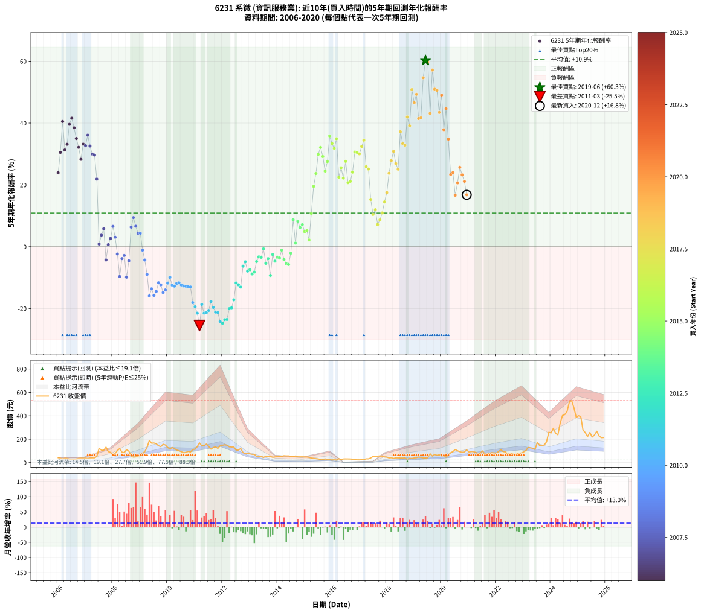

# 6231 系微 - 本益比與未來報酬率分析

!!! info "報告資訊"
    - **股票代號**: 6231
    - **公司名稱**: 系微
    - **產業別**: 資訊服務業
    - **分析期間**: 2006-2020 (180 個數據點)
    - **資料來源**: Type 12 (ShowMonthlyK_ChartFlow) 月收盤價與本益比
    - **報酬率口徑**: 含現金股利 (簡化: 年度合計，假設每年7/1入帳)
    - **報告生成時間**: 2026-01-05 01:08:32 CST

## 📈 視覺化圖表

### 圖表1: 本益比 vs 未來報酬率關係

*圖表1：6231 系微 本益比與5年期未來報酬率關係 (2006-2020)*

### 圖表2: 歷年買入時點的5年期實際報酬率

*圖表2：6231 系微 歷年買入時點的5年期實際報酬率 (2006-2020)*

## 📍 買點訊號說明

本報告提供兩種買點提示訊號（顯示於圖表2的股價子圖中）：

### ▲ 小綠色三角形（回測驗證）
- **計算方式**: 使用全部歷史資料計算本益比第25百分位數
- **用途**: 事後驗證，顯示歷史上哪些時點確實為低估區
- **限制**: 當下無法判斷，僅供回測參考
- **特性**: 後見之明（Look-Ahead Bias）

### ▲ 小橘色三角形（即時訊號）
- **計算方式**: 使用截至當月的過去5年資料計算本益比第25百分位數
- **用途**: 實際投資決策，當時即可判斷
- **優勢**: 可操作性強，符合實務需求
- **特性**: 無後見之明，滾動窗口計算

!!! tip "如何使用兩種訊號"
    - **綠色▲** 幫助理解歷史估值機會，驗證策略有效性
    - **橘色▲** 可作為實際買進參考，但仍需搭配基本面分析
    - 兩種訊號重疊時，表示即時判斷與事後驗證一致，信心度較高
    - 僅有綠色▲時，表示當時無法判斷（需要未來資料才能確認）
    - 僅有橘色▲時，表示即時判斷為買點，但事後可能不是最佳時機

## 📊 估值分析摘要

| 指標 | 數值 |
|:---:|:---:|
| **目前本益比** (2020-12) | **27.04 倍** |
| **歷史平均本益比** | 43.78 倍 |
| **估值水準** | 🟢 相對低估 |
| **預期5年年化報酬率** | **+8.94%** |
| **歷史平均報酬率** | +10.86% |
| **相關係數 (R²)** | 0.0094 |
| **趨勢線斜率** | 0.0480 |

!!! abstract "核心洞察"
    目前本益比顯著低於歷史平均，預期未來報酬率可能較高

    根據歷史數據回測，6231 系微 在目前本益比 **27.0倍** 的估值水準下，
    預期未來5年年化報酬率約為 **+8.9%**。

    **重要提醒**: 本分析基於歷史數據統計，實際報酬率會受到公司基本面變化、產業趨勢、
    總體經濟環境等多重因素影響。R² = 0.01 表示本益比可解釋約 0.9% 的報酬率變異。

## 📈 歷史估值統計

### 最佳買點 (最高報酬率)

| 項目 | 數值 |
|:---:|:---:|
| 起始時間 | 2019-06 |
| 當時本益比 | 19.61 倍 |
| 起始價格 | 39.8 元 |
| 5年後價格 | 403.0 元 |
| **5年年化報酬率** | **+60.29%** |

### 最差買點 (最低報酬率)

| 項目 | 數值 |
|:---:|:---:|
| 起始時間 | 2011-03 |
| 當時本益比 | 23.19 倍 |
| 起始價格 | 168.5 元 |
| 5年後價格 | 22.2 元 |
| **5年年化報酬率** | **-25.50%** |

## 🎯 投資啟示

### 本益比與報酬率關係

趨勢線方程式: **y = 0.0480x + 7.6426**

!!! info "弱相關或正相關"
    本益比與未來報酬率相關性較弱。這可能表示該股票的報酬率更多受到
    公司成長性、產業趨勢等因素影響，而非估值水準。**需綜合考量多項指標**。

### 估值區間建議

基於歷史數據分析:

- **🟢 低估區** (P/E < 35.0): 預期報酬率較高，可考慮增加持股
- **🟡 合理區** (P/E 35.0-52.5): 預期報酬率符合長期趨勢，正常持有
- **🔴 高估區** (P/E > 52.5): 預期報酬率較低，可考慮減碼或觀望

!!! danger "風險提示"
    - 過去表現不代表未來結果
    - 本分析假設公司基本面無重大結構性變化
    - 產業環境劇變可能使歷史規律失效
    - 應結合公司財報、產業趨勢、總體經濟等多重因素綜合判斷

!!! success "長期投資觀點"
    歷史數據顯示，在合理或低估的估值水準買入並長期持有，
    往往能獲得較佳的投資報酬。**耐心等待好價格**是價值投資的核心原則。

## 📊 數據品質

- **資料來源**: GoodInfo.tw Type 12 (ShowMonthlyK_ChartFlow)
- **資料頻率**: 月度收盤價與本益比
- **回測期間**: 2006-2020
- **數據點數量**: 180 個 (每個點代表一次5年期回測)

### 計算方法說明

1. **5年期年化報酬率**:
   - 對每個歷史時點，計算其後5年的實際投資報酬率
   - 期末價值(不含股利): 期末價格
   - 期末價值(含現金股利): 期末價格 + 持有期間內的現金股利合計 (簡化: 年度合計，假設每年7/1入帳)
   - 公式: 年化報酬率 = [(期末價值/期初價格)^(1/年數) - 1] × 100%

2. **本益比 (P/E Ratio)**:
   - 使用當時的月收盤價與EPS計算
   - 資料來源: Type 12 月度河流圖本益比數據

3. **趨勢線 (Linear Regression)**:
   - 使用最小平方法擬合線性趨勢線
   - R²值衡量本益比對報酬率的解釋能力

---

*本報告由 Stock Analysis System v1.9.0 自動生成*
*數據更新時間: 2026-01-05 01:08:32 CST*

## 📋 月度回測明細表

（每一列對應時間線圖中的一個買入點；可用來對照 SVG 圖上的每個點。）

| 買入月份 | 賣出月份 | 回測期限_年 | 實際持有年數 | 買入本益比_倍 | 買入收盤價_元 | 賣出收盤價_元 | 現金股利合計_元 | 總報酬率_pct | 年化報酬率_pct |
| --- | --- | --- | --- | --- | --- | --- | --- | --- | --- |
| 2006-01 | 2011-01 | 5 | 4.999 | 80.19 | 41.70 | 115.00 | 6.83 | +192.16 | +23.92 |
| 2006-02 | 2011-02 | 5 | 4.999 | 73.08 | 38.00 | 137.00 | 6.83 | +278.50 | +30.51 |
| 2006-03 | 2011-03 | 5 | 4.999 | 61.54 | 32.00 | 168.50 | 6.83 | +447.90 | +40.53 |
| 2006-04 | 2011-04 | 5 | 4.999 | 73.08 | 38.00 | 141.50 | 6.83 | +290.34 | +31.31 |
| 2006-05 | 2011-05 | 5 | 4.999 | 69.81 | 36.30 | 145.00 | 6.83 | +318.26 | +33.14 |
| 2006-06 | 2011-06 | 5 | 4.999 | 60.00 | 31.20 | 158.50 | 6.83 | +429.90 | +39.59 |
| 2006-07 | 2011-07 | 5 | 4.999 | 51.15 | 26.60 | 139.00 | 12.33 | +468.91 | +41.59 |
| 2006-08 | 2011-08 | 5 | 4.999 | 48.08 | 25.00 | 115.00 | 12.33 | +409.32 | +38.49 |
| 2006-09 | 2011-09 | 5 | 4.999 | 60.38 | 31.40 | 128.50 | 12.33 | +348.50 | +35.01 |
| 2006-10 | 2011-10 | 5 | 4.999 | 70.29 | 36.55 | 135.00 | 12.33 | +303.09 | +32.16 |
| 2006-11 | 2011-11 | 5 | 4.999 | 73.85 | 38.40 | 121.00 | 12.33 | +247.21 | +28.27 |
| 2006-12 | 2011-12 | 5 | 4.999 | 71.54 | 37.20 | 143.50 | 12.33 | +318.90 | +33.18 |
| 2007-01 | 2012-01 | 5 | 4.999 | 65.09 | 39.00 | 148.00 | 12.33 | +311.10 | +32.68 |
| 2007-02 | 2012-02 | 5 | 4.999 | 52.04 | 35.30 | 152.50 | 12.33 | +366.94 | +36.10 |
| 2007-03 | 2012-03 | 5 | 5.002 | 51.82 | 39.25 | 148.50 | 12.33 | +309.76 | +32.57 |
| 2007-04 | 2012-04 | 5 | 5.002 | 47.45 | 39.70 | 135.00 | 12.33 | +271.11 | +29.97 |
| 2007-05 | 2012-05 | 5 | 5.002 | 43.46 | 39.80 | 133.50 | 12.33 | +266.40 | +29.64 |
| 2007-06 | 2012-06 | 5 | 5.002 | 54.27 | 54.00 | 133.00 | 12.33 | +169.13 | +21.89 |
| 2007-07 | 2012-07 | 5 | 5.002 | 113.60 | 122.00 | 107.50 | 19.83 | +4.37 | +0.86 |
| 2007-08 | 2012-08 | 5 | 5.002 | 91.91 | 106.00 | 107.50 | 19.83 | +20.12 | +3.73 |
| 2007-09 | 2012-09 | 5 | 5.002 | 85.60 | 105.50 | 120.00 | 19.83 | +32.54 | +5.79 |
| 2007-10 | 2012-10 | 5 | 5.002 | 100.60 | 132.00 | 86.20 | 19.83 | -19.68 | -4.29 |
| 2007-11 | 2012-11 | 5 | 5.002 | 67.59 | 94.00 | 77.40 | 19.83 | +3.44 | +0.68 |
| 2007-12 | 2012-12 | 5 | 5.002 | 59.73 | 87.80 | 80.40 | 19.83 | +14.16 | +2.68 |
| 2008-01 | 2013-01 | 5 | 5.002 | 41.62 | 69.40 | 75.60 | 19.83 | +37.51 | +6.57 |
| 2008-02 | 2013-03 | 5 | 5.081 | 41.82 | 78.00 | 71.10 | 19.83 | +16.58 | +3.06 |
| 2008-03 | 2013-03 | 5 | 4.999 | 49.70 | 102.50 | 71.10 | 19.83 | -11.29 | -2.37 |
| 2008-04 | 2013-04 | 5 | 4.999 | 53.10 | 120.00 | 52.40 | 19.83 | -39.81 | -9.66 |
| 2008-05 | 2013-05 | 5 | 4.999 | 36.62 | 90.00 | 54.10 | 19.83 | -17.86 | -3.86 |
| 2008-06 | 2013-06 | 5 | 4.999 | 32.24 | 85.60 | 54.30 | 19.83 | -13.40 | -2.84 |
| 2008-07 | 2013-07 | 5 | 4.999 | 38.91 | 111.00 | 43.80 | 22.27 | -40.48 | -9.86 |
| 2008-08 | 2013-08 | 5 | 4.999 | 32.10 | 97.90 | 55.20 | 22.27 | -20.87 | -4.58 |
| 2008-09 | 2013-09 | 5 | 4.999 | 16.91 | 54.90 | 52.30 | 22.27 | +35.82 | +6.32 |
| 2008-10 | 2013-10 | 5 | 4.999 | 13.82 | 47.60 | 52.40 | 22.27 | +56.86 | +9.42 |
| 2008-11 | 2013-11 | 5 | 4.999 | 13.59 | 49.50 | 46.00 | 22.27 | +37.91 | +6.64 |
| 2008-12 | 2013-12 | 5 | 4.999 | 15.00 | 57.60 | 48.95 | 22.27 | +23.64 | +4.34 |
| 2009-01 | 2014-01 | 5 | 4.999 | 14.54 | 59.50 | 51.30 | 22.27 | +23.64 | +4.34 |
| 2009-02 | 2014-02 | 5 | 4.999 | 18.63 | 80.90 | 54.20 | 22.27 | -5.48 | -1.12 |
| 2009-03 | 2014-03 | 5 | 4.999 | 20.49 | 94.10 | 53.20 | 22.27 | -19.80 | -4.32 |
| 2009-04 | 2014-04 | 5 | 4.999 | 26.84 | 130.00 | 59.00 | 22.27 | -37.49 | -8.97 |
| 2009-05 | 2014-05 | 5 | 4.999 | 37.20 | 189.50 | 57.40 | 22.27 | -57.96 | -15.91 |
| 2009-06 | 2014-06 | 5 | 4.999 | 31.06 | 166.00 | 57.50 | 22.27 | -51.95 | -13.64 |
| 2009-07 | 2014-07 | 5 | 4.999 | 29.93 | 167.50 | 50.20 | 20.83 | -57.60 | -15.77 |
| 2009-08 | 2014-08 | 5 | 4.999 | 27.45 | 160.50 | 52.60 | 20.83 | -54.25 | -14.48 |
| 2009-09 | 2014-09 | 5 | 4.999 | 23.62 | 144.00 | 56.60 | 20.83 | -46.23 | -11.67 |
| 2009-10 | 2014-10 | 5 | 4.999 | 21.50 | 136.50 | 49.70 | 20.83 | -48.33 | -12.37 |
| 2009-11 | 2014-11 | 5 | 4.999 | 23.79 | 157.00 | 49.45 | 20.83 | -55.24 | -14.85 |
| 2009-12 | 2014-12 | 5 | 4.999 | 21.97 | 150.50 | 50.00 | 20.83 | -52.94 | -14.00 |
| 2010-01 | 2015-01 | 5 | 4.999 | 18.90 | 129.00 | 48.10 | 20.83 | -46.57 | -11.78 |
| 2010-02 | 2015-02 | 5 | 4.999 | 17.14 | 116.50 | 48.30 | 20.83 | -40.66 | -9.91 |
| 2010-03 | 2015-03 | 5 | 4.999 | 19.12 | 129.50 | 45.80 | 20.83 | -48.55 | -12.45 |
| 2010-04 | 2015-04 | 5 | 4.999 | 17.71 | 119.50 | 39.50 | 20.83 | -49.52 | -12.78 |
| 2010-05 | 2015-05 | 5 | 4.999 | 16.00 | 107.50 | 36.30 | 20.83 | -46.86 | -11.88 |
| 2010-06 | 2015-06 | 5 | 4.999 | 15.24 | 102.00 | 34.00 | 20.83 | -46.25 | -11.68 |
| 2010-07 | 2015-07 | 5 | 4.999 | 14.02 | 93.50 | 31.80 | 16.44 | -48.41 | -12.40 |
| 2010-08 | 2015-08 | 5 | 4.999 | 12.76 | 84.80 | 26.55 | 16.44 | -49.31 | -12.71 |
| 2010-09 | 2015-09 | 5 | 4.999 | 13.15 | 87.00 | 27.40 | 16.44 | -49.61 | -12.81 |
| 2010-10 | 2015-10 | 5 | 4.999 | 14.53 | 95.80 | 31.50 | 16.44 | -49.96 | -12.93 |
| 2010-11 | 2015-11 | 5 | 4.999 | 13.78 | 90.50 | 28.55 | 16.44 | -50.29 | -13.05 |
| 2010-12 | 2015-12 | 5 | 4.999 | 17.13 | 112.00 | 24.85 | 16.44 | -63.14 | -18.10 |
| 2011-01 | 2016-01 | 5 | 4.999 | 16.96 | 115.00 | 22.60 | 16.44 | -66.05 | -19.44 |
| 2011-02 | 2016-02 | 5 | 4.999 | 19.50 | 137.00 | 24.40 | 16.44 | -70.19 | -21.50 |
| 2011-03 | 2016-03 | 5 | 5.002 | 23.19 | 168.50 | 22.20 | 16.44 | -77.07 | -25.50 |
| 2011-04 | 2016-04 | 5 | 5.002 | 18.84 | 141.50 | 33.80 | 16.44 | -64.50 | -18.70 |
| 2011-05 | 2016-05 | 5 | 5.002 | 18.70 | 145.00 | 26.80 | 16.44 | -70.18 | -21.49 |
| 2011-06 | 2016-06 | 5 | 5.002 | 19.82 | 158.50 | 31.20 | 16.44 | -69.94 | -21.36 |
| 2011-07 | 2016-07 | 5 | 5.002 | 16.87 | 139.00 | 31.95 | 11.79 | -68.53 | -20.64 |
| 2011-08 | 2016-08 | 5 | 5.002 | 13.56 | 115.00 | 31.50 | 11.79 | -62.36 | -17.74 |
| 2011-09 | 2016-09 | 5 | 5.002 | 14.73 | 128.50 | 31.20 | 11.79 | -66.55 | -19.66 |
| 2011-10 | 2016-10 | 5 | 5.002 | 15.06 | 135.00 | 29.30 | 11.79 | -69.56 | -21.17 |
| 2011-11 | 2016-11 | 5 | 5.002 | 13.14 | 121.00 | 24.65 | 11.79 | -69.89 | -21.33 |
| 2011-12 | 2016-12 | 5 | 5.002 | 15.19 | 143.50 | 24.10 | 11.79 | -74.99 | -24.20 |
| 2012-01 | 2017-01 | 5 | 5.002 | 16.56 | 148.00 | 23.80 | 11.79 | -75.95 | -24.79 |
| 2012-02 | 2017-03 | 5 | 5.081 | 18.10 | 152.50 | 27.00 | 11.79 | -74.57 | -23.62 |
| 2012-03 | 2017-03 | 5 | 4.999 | 18.76 | 148.50 | 27.00 | 11.79 | -73.88 | -23.55 |
| 2012-04 | 2017-04 | 5 | 4.999 | 18.24 | 135.00 | 32.30 | 11.79 | -67.34 | -20.06 |
| 2012-05 | 2017-05 | 5 | 4.999 | 19.38 | 133.50 | 32.55 | 11.79 | -66.79 | -19.79 |
| 2012-06 | 2017-06 | 5 | 4.999 | 20.85 | 133.00 | 40.00 | 11.79 | -61.06 | -17.19 |
| 2012-07 | 2017-07 | 5 | 4.999 | 18.33 | 107.50 | 53.00 | 4.59 | -46.43 | -11.74 |
| 2012-08 | 2017-08 | 5 | 4.999 | 20.08 | 107.50 | 51.10 | 4.59 | -48.20 | -12.33 |
| 2012-09 | 2017-09 | 5 | 4.999 | 24.79 | 120.00 | 55.00 | 4.59 | -50.34 | -13.07 |
| 2012-10 | 2017-10 | 5 | 4.999 | 19.91 | 86.20 | 57.60 | 4.59 | -27.86 | -6.32 |
| 2012-11 | 2017-11 | 5 | 4.999 | 20.28 | 77.40 | 55.70 | 4.59 | -22.11 | -4.87 |
| 2012-12 | 2017-12 | 5 | 4.999 | 24.32 | 80.40 | 48.70 | 4.59 | -33.72 | -7.90 |
| 2013-01 | 2018-01 | 5 | 4.999 | 24.46 | 75.60 | 46.85 | 4.59 | -31.96 | -7.41 |
| 2013-02 | 2018-02 | 5 | 4.999 | 24.79 | 71.30 | 40.30 | 4.59 | -37.04 | -8.84 |
| 2013-03 | 2018-03 | 5 | 4.999 | 26.71 | 71.10 | 41.75 | 4.59 | -34.83 | -8.21 |
| 2013-04 | 2018-04 | 5 | 4.999 | 21.41 | 52.40 | 36.40 | 4.59 | -21.78 | -4.79 |
| 2013-05 | 2018-05 | 5 | 4.999 | 24.24 | 54.10 | 41.20 | 4.59 | -15.36 | -3.28 |
| 2013-06 | 2018-06 | 5 | 4.999 | 26.91 | 54.30 | 41.00 | 4.59 | -16.04 | -3.44 |
| 2013-07 | 2018-07 | 5 | 4.999 | 24.29 | 43.80 | 39.40 | 2.95 | -3.31 | -0.67 |
| 2013-08 | 2018-08 | 5 | 4.999 | 34.75 | 55.20 | 38.90 | 2.95 | -24.18 | -5.39 |
| 2013-09 | 2018-09 | 5 | 4.999 | 38.07 | 52.30 | 40.00 | 2.95 | -17.88 | -3.86 |
| 2013-10 | 2018-10 | 5 | 4.999 | 45.20 | 52.40 | 29.20 | 2.95 | -38.65 | -9.31 |
| 2013-11 | 2018-11 | 5 | 4.999 | 48.70 | 46.00 | 37.50 | 2.95 | -12.07 | -2.54 |
| 2013-12 | 2018-12 | 5 | 4.999 | 67.05 | 48.95 | 35.60 | 2.95 | -21.25 | -4.67 |
| 2014-01 | 2019-01 | 5 | 4.999 | 71.75 | 51.30 | 40.20 | 2.95 | -15.89 | -3.40 |
| 2014-02 | 2019-02 | 5 | 4.999 | 77.43 | 54.20 | 42.05 | 2.95 | -16.97 | -3.65 |
| 2014-03 | 2019-03 | 5 | 4.999 | 77.66 | 53.20 | 47.35 | 2.95 | -5.45 | -1.11 |
| 2014-04 | 2019-04 | 5 | 4.999 | 88.06 | 59.00 | 44.80 | 2.95 | -19.07 | -4.14 |
| 2014-05 | 2019-05 | 5 | 4.999 | 87.63 | 57.40 | 40.30 | 2.95 | -24.65 | -5.50 |
| 2014-06 | 2019-06 | 5 | 4.999 | 89.84 | 57.50 | 39.80 | 2.95 | -25.65 | -5.76 |
| 2014-07 | 2019-07 | 5 | 4.999 | 80.32 | 50.20 | 41.25 | 3.90 | -10.06 | -2.10 |
| 2014-08 | 2019-08 | 5 | 4.999 | 86.23 | 52.60 | 76.00 | 3.90 | +51.90 | +8.72 |
| 2014-09 | 2019-09 | 5 | 4.999 | 95.13 | 56.60 | 56.10 | 3.90 | +6.01 | +1.17 |
| 2014-10 | 2019-10 | 5 | 4.999 | 85.69 | 49.70 | 70.00 | 3.90 | +48.69 | +8.26 |
| 2014-11 | 2019-11 | 5 | 4.999 | 87.52 | 49.45 | 62.80 | 3.90 | +34.88 | +6.17 |
| 2014-12 | 2019-12 | 5 | 4.999 | 90.91 | 50.00 | 66.70 | 3.90 | +41.20 | +7.14 |
| 2015-01 | 2020-01 | 5 | 4.999 | 80.28 | 48.10 | 57.10 | 3.90 | +26.82 | +4.87 |
| 2015-02 | 2020-02 | 5 | 4.999 | 74.50 | 48.30 | 58.40 | 3.90 | +28.99 | +5.22 |
| 2015-03 | 2020-03 | 5 | 5.002 | 65.66 | 45.80 | 47.15 | 3.90 | +11.46 | +2.19 |
| 2015-04 | 2020-04 | 5 | 5.002 | 52.90 | 39.50 | 61.90 | 3.90 | +66.58 | +10.74 |
| 2015-05 | 2020-05 | 5 | 5.002 | 45.61 | 36.30 | 84.70 | 3.90 | +144.08 | +19.53 |
| 2015-06 | 2020-06 | 5 | 5.002 | 40.24 | 34.00 | 94.60 | 3.90 | +189.71 | +23.70 |
| 2015-07 | 2020-07 | 5 | 5.002 | 35.56 | 31.80 | 112.00 | 5.50 | +269.50 | +29.86 |
| 2015-08 | 2020-08 | 5 | 5.002 | 28.14 | 26.55 | 101.50 | 5.50 | +303.01 | +32.13 |
| 2015-09 | 2020-09 | 5 | 5.002 | 27.61 | 27.40 | 93.10 | 5.50 | +259.85 | +29.18 |
| 2015-10 | 2020-10 | 5 | 5.002 | 30.24 | 31.50 | 88.60 | 5.50 | +198.73 | +24.46 |
| 2015-11 | 2020-11 | 5 | 5.002 | 26.17 | 28.55 | 90.90 | 5.50 | +237.65 | +27.54 |
| 2015-12 | 2020-12 | 5 | 5.002 | 21.80 | 24.85 | 109.50 | 5.50 | +362.78 | +35.84 |
| 2016-01 | 2021-01 | 5 | 5.002 | 23.48 | 22.60 | 90.00 | 5.50 | +322.57 | +33.39 |
| 2016-02 | 2021-03 | 5 | 5.081 | 31.08 | 24.40 | 93.80 | 5.50 | +306.97 | +31.81 |
| 2016-03 | 2021-03 | 5 | 4.999 | 36.54 | 22.20 | 93.80 | 5.50 | +347.30 | +34.94 |
| 2016-04 | 2021-04 | 5 | 4.999 | 78.60 | 33.80 | 87.70 | 5.50 | +175.74 | +22.49 |
| 2016-05 | 2021-05 | 5 | 4.999 | 106.10 | 26.80 | 78.10 | 5.50 | +211.94 | +25.55 |
| 2016-06 | 2021-06 | 5 | 4.999 | 416.00 | 31.20 | 79.50 | 5.50 | +172.44 | +22.20 |
| 2016-07 | 2021-07 | 5 | 4.999 |  | 31.95 | 100.00 | 8.15 | +238.50 | +27.62 |
| 2016-08 | 2021-08 | 5 | 4.999 |  | 31.50 | 72.60 | 8.15 | +156.35 | +20.72 |
| 2016-09 | 2021-09 | 5 | 4.999 |  | 31.20 | 73.20 | 8.15 | +160.74 | +21.13 |
| 2016-10 | 2021-10 | 5 | 4.999 |  | 29.30 | 78.20 | 8.15 | +194.71 | +24.13 |
| 2016-11 | 2021-11 | 5 | 4.999 |  | 24.65 | 85.60 | 8.15 | +280.32 | +30.63 |
| 2016-12 | 2021-12 | 5 | 4.999 |  | 24.10 | 83.00 | 8.15 | +278.22 | +30.49 |
| 2017-01 | 2022-01 | 5 | 4.999 |  | 23.80 | 80.30 | 8.15 | +271.64 | +30.03 |
| 2017-02 | 2022-02 | 5 | 4.999 |  | 25.50 | 95.70 | 8.15 | +307.25 | +32.43 |
| 2017-03 | 2022-03 | 5 | 4.999 |  | 27.00 | 110.50 | 8.15 | +339.44 | +34.46 |
| 2017-04 | 2022-04 | 5 | 4.999 |  | 32.30 | 94.00 | 8.15 | +216.25 | +25.90 |
| 2017-05 | 2022-05 | 5 | 4.999 |  | 32.55 | 91.70 | 8.15 | +206.76 | +25.13 |
| 2017-06 | 2022-06 | 5 | 4.999 |  | 40.00 | 73.30 | 8.15 | +103.63 | +15.29 |
| 2017-07 | 2022-07 | 5 | 4.999 | 333.00 | 53.00 | 74.00 | 13.05 | +64.25 | +10.43 |
| 2017-08 | 2022-08 | 5 | 4.999 | 158.00 | 51.10 | 76.90 | 13.05 | +76.03 | +11.98 |
| 2017-09 | 2022-09 | 5 | 4.999 | 112.80 | 55.00 | 64.70 | 13.05 | +41.36 | +7.17 |
| 2017-10 | 2022-10 | 5 | 4.999 | 88.39 | 57.60 | 74.30 | 13.05 | +51.65 | +8.69 |
| 2017-11 | 2022-11 | 5 | 4.999 | 68.27 | 55.70 | 80.50 | 13.05 | +67.95 | +10.93 |
| 2017-12 | 2022-12 | 5 | 4.999 | 49.69 | 48.70 | 82.80 | 13.05 | +96.82 | +14.50 |
| 2018-01 | 2023-01 | 5 | 4.999 | 44.90 | 46.85 | 92.00 | 13.05 | +124.23 | +17.53 |
| 2018-02 | 2023-02 | 5 | 4.999 | 36.42 | 40.30 | 104.00 | 13.05 | +190.45 | +23.77 |
| 2018-03 | 2023-03 | 5 | 4.999 | 35.68 | 41.75 | 129.50 | 13.05 | +241.44 | +27.84 |
| 2018-04 | 2023-04 | 5 | 4.999 | 29.51 | 36.40 | 126.50 | 13.05 | +283.38 | +30.84 |
| 2018-05 | 2023-05 | 5 | 4.999 | 31.77 | 41.20 | 122.50 | 13.05 | +229.00 | +26.90 |
| 2018-06 | 2023-06 | 5 | 4.999 | 30.15 | 41.00 | 112.50 | 13.05 | +206.22 | +25.09 |
| 2018-07 | 2023-07 | 5 | 4.999 | 27.68 | 39.40 | 173.00 | 18.50 | +386.04 | +37.20 |
| 2018-08 | 2023-08 | 5 | 4.999 | 26.17 | 38.90 | 145.50 | 18.50 | +321.59 | +33.35 |
| 2018-09 | 2023-09 | 5 | 4.999 | 25.81 | 40.00 | 147.00 | 18.50 | +313.75 | +32.85 |
| 2018-10 | 2023-10 | 5 | 4.999 | 18.10 | 29.20 | 150.00 | 18.50 | +477.05 | +41.99 |
| 2018-11 | 2023-11 | 5 | 4.999 | 22.37 | 37.50 | 177.00 | 18.50 | +421.33 | +39.14 |
| 2018-12 | 2023-12 | 5 | 4.999 | 20.46 | 35.60 | 259.50 | 18.50 | +680.90 | +50.85 |
| 2019-01 | 2024-01 | 5 | 4.999 | 22.48 | 40.20 | 253.50 | 18.50 | +576.62 | +46.59 |
| 2019-02 | 2024-02 | 5 | 4.999 | 22.89 | 42.05 | 293.50 | 18.50 | +641.97 | +49.31 |
| 2019-03 | 2024-03 | 5 | 5.002 | 25.12 | 47.35 | 250.00 | 18.50 | +467.05 | +41.47 |
| 2019-04 | 2024-04 | 5 | 5.002 | 23.17 | 44.80 | 237.50 | 18.50 | +471.43 | +41.69 |
| 2019-05 | 2024-05 | 5 | 5.002 | 20.34 | 40.30 | 338.50 | 18.50 | +785.86 | +54.67 |
| 2019-06 | 2024-06 | 5 | 5.002 | 19.61 | 39.80 | 403.00 | 18.50 | +959.05 | +60.29 |
| 2019-07 | 2024-07 | 5 | 5.002 | 19.85 | 41.25 | 410.50 | 19.50 | +942.42 | +59.78 |
| 2019-08 | 2024-08 | 5 | 5.002 | 35.74 | 76.00 | 437.50 | 19.50 | +501.32 | +43.14 |
| 2019-09 | 2024-09 | 5 | 5.002 | 25.79 | 56.10 | 519.00 | 19.50 | +859.89 | +57.17 |
| 2019-10 | 2024-10 | 5 | 5.002 | 31.48 | 70.00 | 530.00 | 19.50 | +685.00 | +50.97 |
| 2019-11 | 2024-11 | 5 | 5.002 | 27.64 | 62.80 | 468.00 | 19.50 | +676.27 | +50.64 |
| 2019-12 | 2024-12 | 5 | 5.002 | 28.75 | 66.70 | 386.00 | 19.50 | +507.95 | +43.45 |
| 2020-01 | 2025-01 | 5 | 5.002 | 23.17 | 57.10 | 401.00 | 19.50 | +636.43 | +49.06 |
| 2020-02 | 2025-03 | 5 | 5.081 | 22.39 | 58.40 | 279.00 | 19.50 | +411.13 | +37.86 |
| 2020-03 | 2025-03 | 5 | 4.999 | 17.13 | 47.15 | 279.00 | 19.50 | +533.09 | +44.65 |
| 2020-04 | 2025-04 | 5 | 4.999 | 21.37 | 61.90 | 256.00 | 19.50 | +345.07 | +34.80 |
| 2020-05 | 2025-05 | 5 | 4.999 | 27.85 | 84.70 | 222.50 | 19.50 | +185.71 | +23.37 |
| 2020-06 | 2025-06 | 5 | 4.999 | 29.70 | 94.60 | 257.50 | 19.50 | +192.81 | +23.97 |
| 2020-07 | 2025-07 | 5 | 4.999 | 33.64 | 112.00 | 218.00 | 24.00 | +116.07 | +16.66 |
| 2020-08 | 2025-08 | 5 | 4.999 | 29.22 | 101.50 | 235.50 | 24.00 | +155.67 | +20.66 |
| 2020-09 | 2025-09 | 5 | 4.999 | 25.74 | 93.10 | 268.00 | 24.00 | +213.64 | +25.69 |
| 2020-10 | 2025-10 | 5 | 4.999 | 23.55 | 88.60 | 228.00 | 24.00 | +184.42 | +23.26 |
| 2020-11 | 2025-11 | 5 | 4.999 | 23.27 | 90.90 | 213.00 | 24.00 | +160.73 | +21.13 |
| 2020-12 | 2025-12 | 5 | 4.999 | 27.04 | 109.50 | 214.00 | 24.00 | +117.35 | +16.80 |
