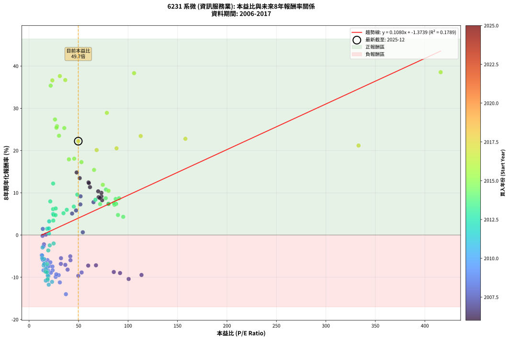
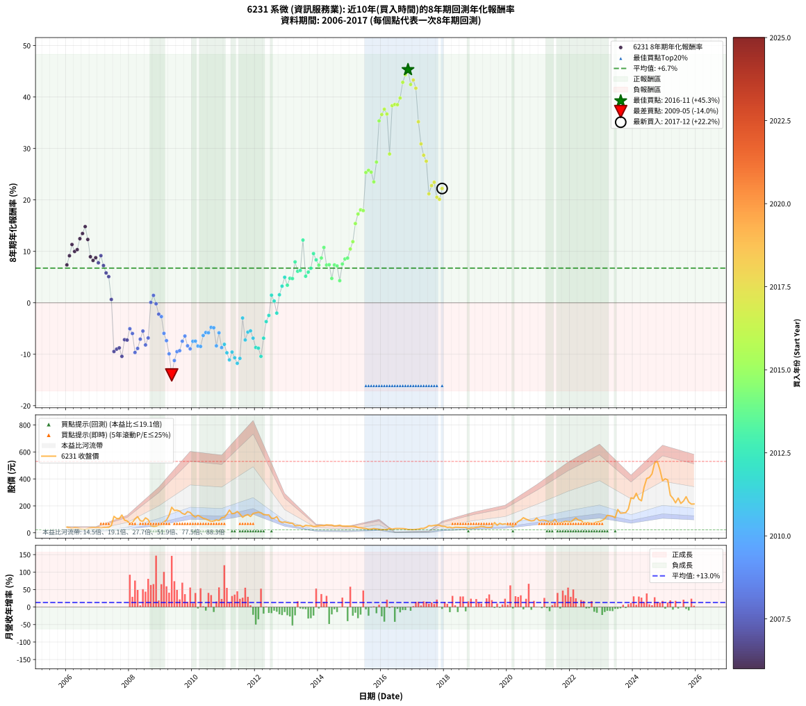

# 6231 系微 - 本益比與未來報酬率分析

!!! info "報告資訊"
    - **股票代號**: 6231
    - **公司名稱**: 系微
    - **產業別**: 資訊服務業
    - **分析期間**: 2006-2017 (144 個數據點)
    - **資料來源**: Type 12 (ShowMonthlyK_ChartFlow) 月收盤價與本益比
    - **報酬率口徑**: 含現金股利 (簡化: 年度合計，假設每年7/1入帳)
    - **報告生成時間**: 2026-01-04 08:20:28 CST

## 📈 視覺化圖表

### 圖表1: 本益比 vs 未來報酬率關係

*圖表1：6231 系微 本益比與8年期未來報酬率關係 (2006-2017)*

### 圖表2: 歷年買入時點的8年期實際報酬率

*圖表2：6231 系微 歷年買入時點的8年期實際報酬率 (2006-2017)*

## 📍 買點訊號說明

本報告提供兩種買點提示訊號（顯示於圖表2的股價子圖中）：

### ▲ 小綠色三角形（回測驗證）
- **計算方式**: 使用全部歷史資料計算本益比第25百分位數
- **用途**: 事後驗證，顯示歷史上哪些時點確實為低估區
- **限制**: 當下無法判斷，僅供回測參考
- **特性**: 後見之明（Look-Ahead Bias）

### ▲ 小橘色三角形（即時訊號）
- **計算方式**: 使用截至當月的過去5年資料計算本益比第25百分位數
- **用途**: 實際投資決策，當時即可判斷
- **優勢**: 可操作性強，符合實務需求
- **特性**: 無後見之明，滾動窗口計算

!!! tip "如何使用兩種訊號"
    - **綠色▲** 幫助理解歷史估值機會，驗證策略有效性
    - **橘色▲** 可作為實際買進參考，但仍需搭配基本面分析
    - 兩種訊號重疊時，表示即時判斷與事後驗證一致，信心度較高
    - 僅有綠色▲時，表示當時無法判斷（需要未來資料才能確認）
    - 僅有橘色▲時，表示即時判斷為買點，但事後可能不是最佳時機

## 📊 估值分析摘要

| 指標 | 數值 |
|:---:|:---:|
| **目前本益比** (2017-12) | **49.69 倍** |
| **歷史平均本益比** | 48.47 倍 |
| **估值水準** | 🟡 合理範圍 |
| **預期8年年化報酬率** | **+3.99%** |
| **歷史平均報酬率** | +6.74% |
| **相關係數 (R²)** | 0.1789 |
| **趨勢線斜率** | 0.1080 |

!!! abstract "核心洞察"
    目前本益比接近歷史平均，預期報酬率符合長期趨勢

    根據歷史數據回測，6231 系微 在目前本益比 **49.7倍** 的估值水準下，
    預期未來8年年化報酬率約為 **+4.0%**。

    **重要提醒**: 本分析基於歷史數據統計，實際報酬率會受到公司基本面變化、產業趨勢、
    總體經濟環境等多重因素影響。R² = 0.18 表示本益比可解釋約 17.9% 的報酬率變異。

## 📈 歷史估值統計

### 最佳買點 (最高報酬率)

| 項目 | 數值 |
|:---:|:---:|
| 起始時間 | 2016-11 |
| 當時本益比 | nan 倍 |
| 起始價格 | 24.6 元 |
| 8年後價格 | 468.0 元 |
| **8年年化報酬率** | **+45.32%** |

### 最差買點 (最低報酬率)

| 項目 | 數值 |
|:---:|:---:|
| 起始時間 | 2009-05 |
| 當時本益比 | 37.20 倍 |
| 起始價格 | 189.5 元 |
| 8年後價格 | 32.5 元 |
| **8年年化報酬率** | **-14.02%** |

## 🎯 投資啟示

### 本益比與報酬率關係

趨勢線方程式: **y = 0.1080x + -1.3739**

!!! info "弱相關或正相關"
    本益比與未來報酬率相關性較弱。這可能表示該股票的報酬率更多受到
    公司成長性、產業趨勢等因素影響，而非估值水準。**需綜合考量多項指標**。

### 估值區間建議

基於歷史數據分析:

- **🟢 低估區** (P/E < 38.8): 預期報酬率較高，可考慮增加持股
- **🟡 合理區** (P/E 38.8-58.2): 預期報酬率符合長期趨勢，正常持有
- **🔴 高估區** (P/E > 58.2): 預期報酬率較低，可考慮減碼或觀望

!!! danger "風險提示"
    - 過去表現不代表未來結果
    - 本分析假設公司基本面無重大結構性變化
    - 產業環境劇變可能使歷史規律失效
    - 應結合公司財報、產業趨勢、總體經濟等多重因素綜合判斷

!!! success "長期投資觀點"
    歷史數據顯示，在合理或低估的估值水準買入並長期持有，
    往往能獲得較佳的投資報酬。**耐心等待好價格**是價值投資的核心原則。

## 📊 數據品質

- **資料來源**: GoodInfo.tw Type 12 (ShowMonthlyK_ChartFlow)
- **資料頻率**: 月度收盤價與本益比
- **回測期間**: 2006-2017
- **數據點數量**: 144 個 (每個點代表一次8年期回測)

### 計算方法說明

1. **8年期年化報酬率**:
   - 對每個歷史時點，計算其後8年的實際投資報酬率
   - 期末價值(不含股利): 期末價格
   - 期末價值(含現金股利): 期末價格 + 持有期間內的現金股利合計 (簡化: 年度合計，假設每年7/1入帳)
   - 公式: 年化報酬率 = [(期末價值/期初價格)^(1/年數) - 1] × 100%

2. **本益比 (P/E Ratio)**:
   - 使用當時的月收盤價與EPS計算
   - 資料來源: Type 12 月度河流圖本益比數據

3. **趨勢線 (Linear Regression)**:
   - 使用最小平方法擬合線性趨勢線
   - R²值衡量本益比對報酬率的解釋能力

---

*本報告由 Stock Analysis System v1.9.0 自動生成*
*數據更新時間: 2026-01-04 08:20:28 CST*

## 📋 月度回測明細表

（每一列對應時間線圖中的一個買入點；可用來對照 SVG 圖上的每個點。）

| 買入月份 | 賣出月份 | 回測期限_年 | 實際持有年數 | 買入本益比_倍 | 買入收盤價_元 | 賣出收盤價_元 | 現金股利合計_元 | 總報酬率_pct | 年化報酬率_pct |
| --- | --- | --- | --- | --- | --- | --- | --- | --- | --- |
| 2006-01 | 2014-01 | 8 | 8.000 | 80.19 | 41.70 | 51.30 | 22.32 | +76.54 | +7.36 |
| 2006-02 | 2014-02 | 8 | 8.000 | 73.08 | 38.00 | 54.20 | 22.32 | +101.36 | +9.14 |
| 2006-03 | 2014-03 | 8 | 8.000 | 61.54 | 32.00 | 53.20 | 22.32 | +135.99 | +11.33 |
| 2006-04 | 2014-04 | 8 | 8.000 | 73.08 | 38.00 | 59.00 | 22.32 | +113.99 | +9.98 |
| 2006-05 | 2014-05 | 8 | 8.000 | 69.81 | 36.30 | 57.40 | 22.32 | +119.61 | +10.33 |
| 2006-06 | 2014-06 | 8 | 8.000 | 60.00 | 31.20 | 57.50 | 22.32 | +155.82 | +12.46 |
| 2006-07 | 2014-07 | 8 | 8.000 | 51.15 | 26.60 | 50.20 | 22.87 | +174.69 | +13.46 |
| 2006-08 | 2014-08 | 8 | 8.000 | 48.08 | 25.00 | 52.60 | 22.87 | +201.87 | +14.81 |
| 2006-09 | 2014-09 | 8 | 8.000 | 60.38 | 31.40 | 56.60 | 22.87 | +153.08 | +12.31 |
| 2006-10 | 2014-10 | 8 | 8.000 | 70.29 | 36.55 | 49.70 | 22.87 | +98.54 | +8.95 |
| 2006-11 | 2014-11 | 8 | 8.000 | 73.85 | 38.40 | 49.45 | 22.87 | +88.33 | +8.23 |
| 2006-12 | 2014-12 | 8 | 8.000 | 71.54 | 37.20 | 50.00 | 22.87 | +95.88 | +8.77 |
| 2007-01 | 2015-01 | 8 | 8.000 | 65.09 | 39.00 | 48.10 | 22.87 | +81.97 | +7.77 |
| 2007-02 | 2015-02 | 8 | 8.000 | 52.04 | 35.30 | 48.30 | 22.87 | +101.61 | +9.16 |
| 2007-03 | 2015-03 | 8 | 8.000 | 51.82 | 39.25 | 45.80 | 22.87 | +74.95 | +7.24 |
| 2007-04 | 2015-04 | 8 | 8.000 | 47.45 | 39.70 | 39.50 | 22.87 | +57.10 | +5.81 |
| 2007-05 | 2015-05 | 8 | 8.000 | 43.46 | 39.80 | 36.30 | 22.87 | +48.66 | +5.08 |
| 2007-06 | 2015-06 | 8 | 8.000 | 54.27 | 54.00 | 34.00 | 22.87 | +5.31 | +0.65 |
| 2007-07 | 2015-07 | 8 | 8.000 | 113.60 | 122.00 | 31.80 | 23.27 | -54.86 | -9.47 |
| 2007-08 | 2015-08 | 8 | 8.000 | 91.91 | 106.00 | 26.55 | 23.27 | -53.00 | -9.01 |
| 2007-09 | 2015-09 | 8 | 8.000 | 85.60 | 105.50 | 27.40 | 23.27 | -51.97 | -8.76 |
| 2007-10 | 2015-10 | 8 | 8.000 | 100.60 | 132.00 | 31.50 | 23.27 | -58.51 | -10.41 |
| 2007-11 | 2015-11 | 8 | 8.000 | 67.59 | 94.00 | 28.55 | 23.27 | -44.88 | -7.17 |
| 2007-12 | 2015-12 | 8 | 8.000 | 59.73 | 87.80 | 24.85 | 23.27 | -45.20 | -7.24 |
| 2008-01 | 2016-01 | 8 | 8.000 | 41.62 | 69.40 | 22.60 | 23.27 | -33.91 | -5.05 |
| 2008-02 | 2016-02 | 8 | 8.000 | 41.82 | 78.00 | 24.40 | 23.27 | -38.89 | -5.97 |
| 2008-03 | 2016-03 | 8 | 8.000 | 49.70 | 102.50 | 22.20 | 23.27 | -55.64 | -9.66 |
| 2008-04 | 2016-04 | 8 | 8.000 | 53.10 | 120.00 | 33.80 | 23.27 | -52.44 | -8.87 |
| 2008-05 | 2016-05 | 8 | 8.000 | 36.62 | 90.00 | 26.80 | 23.27 | -44.37 | -7.07 |
| 2008-06 | 2016-06 | 8 | 8.000 | 32.24 | 85.60 | 31.20 | 23.27 | -36.37 | -5.49 |
| 2008-07 | 2016-07 | 8 | 8.000 | 38.91 | 111.00 | 31.95 | 24.07 | -49.54 | -8.19 |
| 2008-08 | 2016-08 | 8 | 8.000 | 32.10 | 97.90 | 31.50 | 24.07 | -43.24 | -6.84 |
| 2008-09 | 2016-09 | 8 | 8.000 | 16.91 | 54.90 | 31.20 | 24.07 | +0.66 | +0.08 |
| 2008-10 | 2016-10 | 8 | 8.000 | 13.82 | 47.60 | 29.30 | 24.07 | +12.11 | +1.44 |
| 2008-11 | 2016-11 | 8 | 8.000 | 13.59 | 49.50 | 24.65 | 24.07 | -1.59 | -0.20 |
| 2008-12 | 2016-12 | 8 | 8.000 | 15.00 | 57.60 | 24.10 | 24.07 | -16.38 | -2.21 |
| 2009-01 | 2017-01 | 8 | 8.000 | 14.54 | 59.50 | 23.80 | 24.07 | -19.55 | -2.68 |
| 2009-02 | 2017-02 | 8 | 8.000 | 18.63 | 80.90 | 25.50 | 24.07 | -38.73 | -5.94 |
| 2009-03 | 2017-03 | 8 | 8.000 | 20.49 | 94.10 | 27.00 | 24.07 | -45.73 | -7.36 |
| 2009-04 | 2017-04 | 8 | 8.000 | 26.84 | 130.00 | 32.30 | 24.07 | -56.64 | -9.92 |
| 2009-05 | 2017-05 | 8 | 8.000 | 37.20 | 189.50 | 32.55 | 24.07 | -70.12 | -14.02 |
| 2009-06 | 2017-06 | 8 | 8.000 | 31.06 | 166.00 | 40.00 | 24.07 | -61.41 | -11.22 |
| 2009-07 | 2017-07 | 8 | 8.000 | 29.93 | 167.50 | 53.00 | 22.38 | -55.00 | -9.50 |
| 2009-08 | 2017-08 | 8 | 8.000 | 27.45 | 160.50 | 51.10 | 22.38 | -54.22 | -9.30 |
| 2009-09 | 2017-09 | 8 | 8.000 | 23.62 | 144.00 | 55.00 | 22.38 | -46.27 | -7.47 |
| 2009-10 | 2017-10 | 8 | 8.000 | 21.50 | 136.50 | 57.60 | 22.38 | -41.41 | -6.46 |
| 2009-11 | 2017-11 | 8 | 8.000 | 23.79 | 157.00 | 55.70 | 22.38 | -50.27 | -8.36 |
| 2009-12 | 2017-12 | 8 | 8.000 | 21.97 | 150.50 | 48.70 | 22.38 | -52.77 | -8.95 |
| 2010-01 | 2018-01 | 8 | 8.000 | 18.90 | 129.00 | 46.85 | 22.38 | -46.34 | -7.49 |
| 2010-02 | 2018-02 | 8 | 8.000 | 17.14 | 116.50 | 40.30 | 22.38 | -46.20 | -7.46 |
| 2010-03 | 2018-03 | 8 | 8.000 | 19.12 | 129.50 | 41.75 | 22.38 | -50.48 | -8.41 |
| 2010-04 | 2018-04 | 8 | 8.000 | 17.71 | 119.50 | 36.40 | 22.38 | -50.81 | -8.49 |
| 2010-05 | 2018-05 | 8 | 8.000 | 16.00 | 107.50 | 41.20 | 22.38 | -40.86 | -6.35 |
| 2010-06 | 2018-06 | 8 | 8.000 | 15.24 | 102.00 | 41.00 | 22.38 | -37.87 | -5.77 |
| 2010-07 | 2018-07 | 8 | 8.000 | 14.02 | 93.50 | 39.40 | 18.44 | -38.14 | -5.83 |
| 2010-08 | 2018-08 | 8 | 8.000 | 12.76 | 84.80 | 38.90 | 18.44 | -32.38 | -4.77 |
| 2010-09 | 2018-09 | 8 | 8.000 | 13.15 | 87.00 | 40.00 | 18.44 | -32.83 | -4.85 |
| 2010-10 | 2018-10 | 8 | 8.000 | 14.53 | 95.80 | 29.20 | 18.44 | -50.27 | -8.36 |
| 2010-11 | 2018-11 | 8 | 8.000 | 13.78 | 90.50 | 37.50 | 18.44 | -38.19 | -5.84 |
| 2010-12 | 2018-12 | 8 | 8.000 | 17.13 | 112.00 | 35.60 | 18.44 | -51.75 | -8.71 |
| 2011-01 | 2019-01 | 8 | 8.000 | 16.96 | 115.00 | 40.20 | 18.44 | -49.01 | -8.07 |
| 2011-02 | 2019-02 | 8 | 8.000 | 19.50 | 137.00 | 42.05 | 18.44 | -55.85 | -9.71 |
| 2011-03 | 2019-03 | 8 | 8.000 | 23.19 | 168.50 | 47.35 | 18.44 | -60.96 | -11.09 |
| 2011-04 | 2019-04 | 8 | 8.000 | 18.84 | 141.50 | 44.80 | 18.44 | -55.31 | -9.58 |
| 2011-05 | 2019-05 | 8 | 8.000 | 18.70 | 145.00 | 40.30 | 18.44 | -59.49 | -10.68 |
| 2011-06 | 2019-06 | 8 | 8.000 | 19.82 | 158.50 | 39.80 | 18.44 | -63.26 | -11.76 |
| 2011-07 | 2019-07 | 8 | 8.000 | 16.87 | 139.00 | 41.25 | 14.44 | -59.94 | -10.80 |
| 2011-08 | 2019-08 | 8 | 8.000 | 13.56 | 115.00 | 76.00 | 14.44 | -21.36 | -2.96 |
| 2011-09 | 2019-09 | 8 | 8.000 | 14.73 | 128.50 | 56.10 | 14.44 | -45.11 | -7.22 |
| 2011-10 | 2019-10 | 8 | 8.000 | 15.06 | 135.00 | 70.00 | 14.44 | -37.45 | -5.70 |
| 2011-11 | 2019-11 | 8 | 8.000 | 13.14 | 121.00 | 62.80 | 14.44 | -36.17 | -5.46 |
| 2011-12 | 2019-12 | 8 | 8.000 | 15.19 | 143.50 | 66.70 | 14.44 | -43.46 | -6.88 |
| 2012-01 | 2020-01 | 8 | 8.000 | 16.56 | 148.00 | 57.10 | 14.44 | -51.66 | -8.69 |
| 2012-02 | 2020-02 | 8 | 8.000 | 18.10 | 152.50 | 58.40 | 14.44 | -52.24 | -8.82 |
| 2012-03 | 2020-03 | 8 | 8.000 | 18.76 | 148.50 | 47.15 | 14.44 | -58.53 | -10.42 |
| 2012-04 | 2020-04 | 8 | 8.000 | 18.24 | 135.00 | 61.90 | 14.44 | -43.45 | -6.88 |
| 2012-05 | 2020-05 | 8 | 8.000 | 19.38 | 133.50 | 84.70 | 14.44 | -25.74 | -3.65 |
| 2012-06 | 2020-06 | 8 | 8.000 | 20.85 | 133.00 | 94.60 | 14.44 | -18.02 | -2.45 |
| 2012-07 | 2020-07 | 8 | 8.000 | 18.33 | 107.50 | 112.00 | 8.94 | +12.50 | +1.48 |
| 2012-08 | 2020-08 | 8 | 8.000 | 20.08 | 107.50 | 101.50 | 8.94 | +2.73 | +0.34 |
| 2012-09 | 2020-09 | 8 | 8.000 | 24.79 | 120.00 | 93.10 | 8.94 | -14.97 | -2.01 |
| 2012-10 | 2020-10 | 8 | 8.000 | 19.91 | 86.20 | 88.60 | 8.94 | +13.15 | +1.56 |
| 2012-11 | 2020-11 | 8 | 8.000 | 20.28 | 77.40 | 90.90 | 8.94 | +28.99 | +3.23 |
| 2012-12 | 2020-12 | 8 | 8.000 | 24.32 | 80.40 | 109.50 | 8.94 | +47.31 | +4.96 |
| 2013-01 | 2021-01 | 8 | 8.000 | 24.46 | 75.60 | 90.00 | 8.94 | +30.87 | +3.42 |
| 2013-02 | 2021-02 | 8 | 8.000 | 24.79 | 71.30 | 94.50 | 8.94 | +45.07 | +4.76 |
| 2013-03 | 2021-03 | 8 | 8.000 | 26.71 | 71.10 | 93.80 | 8.94 | +44.50 | +4.71 |
| 2013-04 | 2021-04 | 8 | 8.000 | 21.41 | 52.40 | 87.70 | 8.94 | +84.42 | +7.95 |
| 2013-05 | 2021-05 | 8 | 8.000 | 24.24 | 54.10 | 78.10 | 8.94 | +60.88 | +6.12 |
| 2013-06 | 2021-06 | 8 | 8.000 | 26.91 | 54.30 | 79.50 | 8.94 | +62.87 | +6.29 |
| 2013-07 | 2021-07 | 8 | 8.000 | 24.29 | 43.80 | 100.00 | 9.95 | +151.03 | +12.19 |
| 2013-08 | 2021-08 | 8 | 8.000 | 34.75 | 55.20 | 72.60 | 9.95 | +49.55 | +5.16 |
| 2013-09 | 2021-09 | 8 | 8.000 | 38.07 | 52.30 | 73.20 | 9.95 | +58.99 | +5.97 |
| 2013-10 | 2021-10 | 8 | 8.000 | 45.20 | 52.40 | 78.20 | 9.95 | +68.23 | +6.72 |
| 2013-11 | 2021-11 | 8 | 8.000 | 48.70 | 46.00 | 85.60 | 9.95 | +107.72 | +9.57 |
| 2013-12 | 2021-12 | 8 | 8.000 | 67.05 | 48.95 | 83.00 | 9.95 | +89.89 | +8.35 |
| 2014-01 | 2022-01 | 8 | 8.000 | 71.75 | 51.30 | 80.30 | 9.95 | +75.93 | +7.32 |
| 2014-02 | 2022-02 | 8 | 8.000 | 77.43 | 54.20 | 95.70 | 9.95 | +94.93 | +8.70 |
| 2014-03 | 2022-03 | 8 | 8.000 | 77.66 | 53.20 | 110.50 | 9.95 | +126.41 | +10.75 |
| 2014-04 | 2022-04 | 8 | 8.000 | 88.06 | 59.00 | 94.00 | 9.95 | +76.19 | +7.34 |
| 2014-05 | 2022-05 | 8 | 8.000 | 87.63 | 57.40 | 91.70 | 9.95 | +77.09 | +7.40 |
| 2014-06 | 2022-06 | 8 | 8.000 | 89.84 | 57.50 | 73.30 | 9.95 | +44.78 | +4.73 |
| 2014-07 | 2022-07 | 8 | 8.000 | 80.32 | 50.20 | 74.00 | 14.60 | +76.49 | +7.36 |
| 2014-08 | 2022-08 | 8 | 8.000 | 86.23 | 52.60 | 76.90 | 14.60 | +73.95 | +7.17 |
| 2014-09 | 2022-09 | 8 | 8.000 | 95.13 | 56.60 | 64.70 | 14.60 | +40.11 | +4.31 |
| 2014-10 | 2022-10 | 8 | 8.000 | 85.69 | 49.70 | 74.30 | 14.60 | +78.87 | +7.54 |
| 2014-11 | 2022-11 | 8 | 8.000 | 87.52 | 49.45 | 80.50 | 14.60 | +92.32 | +8.52 |
| 2014-12 | 2022-12 | 8 | 8.000 | 90.91 | 50.00 | 82.80 | 14.60 | +94.80 | +8.69 |
| 2015-01 | 2023-01 | 8 | 8.000 | 80.28 | 48.10 | 92.00 | 14.60 | +121.62 | +10.46 |
| 2015-02 | 2023-02 | 8 | 8.000 | 74.50 | 48.30 | 104.00 | 14.60 | +145.55 | +11.88 |
| 2015-03 | 2023-03 | 8 | 8.000 | 65.66 | 45.80 | 129.50 | 14.60 | +214.63 | +15.41 |
| 2015-04 | 2023-04 | 8 | 8.000 | 52.90 | 39.50 | 126.50 | 14.60 | +257.22 | +17.25 |
| 2015-05 | 2023-05 | 8 | 8.000 | 45.61 | 36.30 | 122.50 | 14.60 | +277.69 | +18.07 |
| 2015-06 | 2023-06 | 8 | 8.000 | 40.24 | 34.00 | 112.50 | 14.60 | +273.82 | +17.92 |
| 2015-07 | 2023-07 | 8 | 8.000 | 35.56 | 31.80 | 173.00 | 20.50 | +508.49 | +25.32 |
| 2015-08 | 2023-08 | 8 | 8.000 | 28.14 | 26.55 | 145.50 | 20.50 | +525.24 | +25.75 |
| 2015-09 | 2023-09 | 8 | 8.000 | 27.61 | 27.40 | 147.00 | 20.50 | +511.31 | +25.40 |
| 2015-10 | 2023-10 | 8 | 8.000 | 30.24 | 31.50 | 150.00 | 20.50 | +441.27 | +23.50 |
| 2015-11 | 2023-11 | 8 | 8.000 | 26.17 | 28.55 | 177.00 | 20.50 | +591.77 | +27.35 |
| 2015-12 | 2023-12 | 8 | 8.000 | 21.80 | 24.85 | 259.50 | 20.50 | +1026.76 | +35.36 |
| 2016-01 | 2024-01 | 8 | 8.000 | 23.48 | 22.60 | 253.50 | 20.50 | +1112.39 | +36.60 |
| 2016-02 | 2024-02 | 8 | 8.000 | 31.08 | 24.40 | 293.50 | 20.50 | +1186.89 | +37.62 |
| 2016-03 | 2024-03 | 8 | 8.000 | 36.54 | 22.20 | 250.00 | 20.50 | +1118.47 | +36.69 |
| 2016-04 | 2024-04 | 8 | 8.000 | 78.60 | 33.80 | 237.50 | 20.50 | +663.31 | +28.93 |
| 2016-05 | 2024-05 | 8 | 8.000 | 106.10 | 26.80 | 338.50 | 20.50 | +1239.55 | +38.32 |
| 2016-06 | 2024-06 | 8 | 8.000 | 416.00 | 31.20 | 403.00 | 20.50 | +1257.37 | +38.54 |
| 2016-07 | 2024-07 | 8 | 8.000 |  | 31.95 | 410.50 | 22.15 | +1254.15 | +38.50 |
| 2016-08 | 2024-08 | 8 | 8.000 |  | 31.50 | 437.50 | 22.15 | +1359.21 | +39.80 |
| 2016-09 | 2024-09 | 8 | 8.000 |  | 31.20 | 519.00 | 22.15 | +1634.46 | +42.85 |
| 2016-10 | 2024-10 | 8 | 8.000 |  | 29.30 | 530.00 | 22.15 | +1784.47 | +44.34 |
| 2016-11 | 2024-11 | 8 | 8.000 |  | 24.65 | 468.00 | 22.15 | +1888.44 | +45.32 |
| 2016-12 | 2024-12 | 8 | 8.000 |  | 24.10 | 386.00 | 22.15 | +1593.57 | +42.43 |
| 2017-01 | 2025-01 | 8 | 8.000 |  | 23.80 | 401.00 | 22.15 | +1677.94 | +43.30 |
| 2017-02 | 2025-02 | 8 | 8.000 |  | 25.50 | 392.50 | 22.15 | +1526.08 | +41.71 |
| 2017-03 | 2025-03 | 8 | 8.000 |  | 27.00 | 279.00 | 22.15 | +1015.37 | +35.18 |
| 2017-04 | 2025-04 | 8 | 8.000 |  | 32.30 | 256.00 | 22.15 | +761.15 | +30.88 |
| 2017-05 | 2025-05 | 8 | 8.000 |  | 32.55 | 222.50 | 22.15 | +651.61 | +28.68 |
| 2017-06 | 2025-06 | 8 | 8.000 |  | 40.00 | 257.50 | 22.15 | +599.12 | +27.52 |
| 2017-07 | 2025-07 | 8 | 8.000 | 333.00 | 53.00 | 218.00 | 28.35 | +364.81 | +21.17 |
| 2017-08 | 2025-08 | 8 | 8.000 | 158.00 | 51.10 | 235.50 | 28.35 | +416.34 | +22.78 |
| 2017-09 | 2025-09 | 8 | 8.000 | 112.80 | 55.00 | 268.00 | 28.35 | +438.82 | +23.43 |
| 2017-10 | 2025-10 | 8 | 8.000 | 88.39 | 57.60 | 228.00 | 28.35 | +345.05 | +20.52 |
| 2017-11 | 2025-11 | 8 | 8.000 | 68.27 | 55.70 | 213.00 | 28.35 | +333.30 | +20.12 |
| 2017-12 | 2025-12 | 8 | 8.000 | 49.69 | 48.70 | 214.00 | 28.35 | +397.64 | +22.21 |
