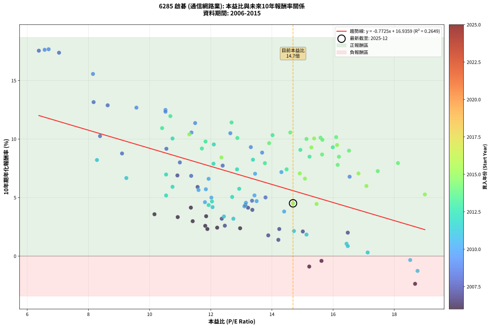
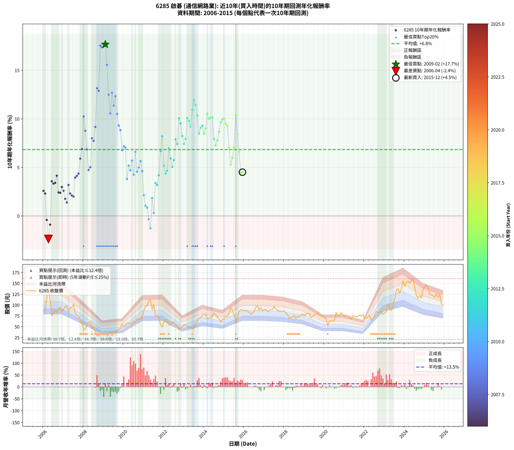

# 6285 啟碁 - 本益比與未來報酬率分析

!!! info "報告資訊"
    - **股票代號**: 6285
    - **公司名稱**: 啟碁
    - **產業別**: 通信網路業
    - **分析期間**: 2006-2015 (120 個數據點)
    - **資料來源**: Type 12 (ShowMonthlyK_ChartFlow) 月收盤價與本益比
    - **報酬率口徑**: 含現金股利 (簡化: 年度合計，假設每年7/1入帳)
    - **報告生成時間**: 2026-01-11 19:06:01 CST

## 📈 視覺化圖表

### 圖表1: 本益比 vs 未來報酬率關係

*圖表1：6285 啟碁 本益比與10年期未來報酬率關係 (2006-2015)*

### 圖表2: 歷年買入時點的10年期實際報酬率

*圖表2：6285 啟碁 歷年買入時點的10年期實際報酬率 (2006-2015)*

## 📍 買點訊號說明

本報告提供兩種買點提示訊號（顯示於圖表2的股價子圖中）：

### ▲ 小綠色三角形（回測驗證）
- **計算方式**: 使用全部歷史資料計算本益比第25百分位數
- **用途**: 事後驗證，顯示歷史上哪些時點確實為低估區
- **限制**: 當下無法判斷，僅供回測參考
- **特性**: 後見之明（Look-Ahead Bias）

### ▲ 小橘色三角形（即時訊號）
- **計算方式**: 使用截至當月的過去5年資料計算本益比第25百分位數
- **用途**: 實際投資決策，當時即可判斷
- **優勢**: 可操作性強，符合實務需求
- **特性**: 無後見之明，滾動窗口計算

!!! tip "如何使用兩種訊號"
    - **綠色▲** 幫助理解歷史估值機會，驗證策略有效性
    - **橘色▲** 可作為實際買進參考，但仍需搭配基本面分析
    - 兩種訊號重疊時，表示即時判斷與事後驗證一致，信心度較高
    - 僅有綠色▲時，表示當時無法判斷（需要未來資料才能確認）
    - 僅有橘色▲時，表示即時判斷為買點，但事後可能不是最佳時機

## 📊 估值分析摘要

| 指標 | 數值 |
|:---:|:---:|
| **目前本益比** (2015-12) | **14.69 倍** |
| **歷史平均本益比** | 13.07 倍 |
| **估值水準** | 🟡 合理範圍 |
| **預期10年年化報酬率** | **+5.59%** |
| **歷史平均報酬率** | +6.84% |
| **相關係數 (R²)** | 0.2649 |
| **趨勢線斜率** | -0.7725 |

!!! abstract "核心洞察"
    目前本益比接近歷史平均，預期報酬率符合長期趨勢

    根據歷史數據回測，6285 啟碁 在目前本益比 **14.7倍** 的估值水準下，
    預期未來10年年化報酬率約為 **+5.6%**。

    **重要提醒**: 本分析基於歷史數據統計，實際報酬率會受到公司基本面變化、產業趨勢、
    總體經濟環境等多重因素影響。R² = 0.26 表示本益比可解釋約 26.5% 的報酬率變異。

## 📈 歷史估值統計

### 最佳買點 (最高報酬率)

| 項目 | 數值 |
|:---:|:---:|
| 起始時間 | 2009-02 |
| 當時本益比 | 6.70 倍 |
| 起始價格 | 21.1 元 |
| 10年後價格 | 78.6 元 |
| **10年年化報酬率** | **+17.67%** |

### 最差買點 (最低報酬率)

| 項目 | 數值 |
|:---:|:---:|
| 起始時間 | 2006-04 |
| 當時本益比 | 18.68 倍 |
| 起始價格 | 137.5 元 |
| 10年後價格 | 84.0 元 |
| **10年年化報酬率** | **-2.37%** |

## 🎯 投資啟示

### 本益比與報酬率關係

趨勢線方程式: **y = -0.7725x + 16.9359**

!!! warning "強負相關"
    本益比與未來報酬率呈現強負相關。在高本益比時期買入，未來報酬率顯著較低；
    在低本益比時期買入，未來報酬率顯著較高。**估值紀律至關重要**。

### 估值區間建議

基於歷史數據分析:

- **🟢 低估區** (P/E < 10.5): 預期報酬率較高，可考慮增加持股
- **🟡 合理區** (P/E 10.5-15.7): 預期報酬率符合長期趨勢，正常持有
- **🔴 高估區** (P/E > 15.7): 預期報酬率較低，可考慮減碼或觀望

!!! danger "風險提示"
    - 過去表現不代表未來結果
    - 本分析假設公司基本面無重大結構性變化
    - 產業環境劇變可能使歷史規律失效
    - 應結合公司財報、產業趨勢、總體經濟等多重因素綜合判斷

!!! success "長期投資觀點"
    歷史數據顯示，在合理或低估的估值水準買入並長期持有，
    往往能獲得較佳的投資報酬。**耐心等待好價格**是價值投資的核心原則。

## 📊 數據品質

- **資料來源**: GoodInfo.tw Type 12 (ShowMonthlyK_ChartFlow)
- **資料頻率**: 月度收盤價與本益比
- **回測期間**: 2006-2015
- **數據點數量**: 120 個 (每個點代表一次10年期回測)

### 計算方法說明

1. **10年期年化報酬率**:
   - 對每個歷史時點，計算其後10年的實際投資報酬率
   - 期末價值(不含股利): 期末價格
   - 期末價值(含現金股利): 期末價格 + 持有期間內的現金股利合計 (簡化: 年度合計，假設每年7/1入帳)
   - 公式: 年化報酬率 = [(期末價值/期初價格)^(1/年數) - 1] × 100%

2. **本益比 (P/E Ratio)**:
   - 使用當時的月收盤價與EPS計算
   - 資料來源: Type 12 月度河流圖本益比數據

3. **趨勢線 (Linear Regression)**:
   - 使用最小平方法擬合線性趨勢線
   - R²值衡量本益比對報酬率的解釋能力

---

*本報告由 Stock Analysis System v1.9.0 自動生成*
*數據更新時間: 2026-01-11 19:06:01 CST*

## 📋 月度回測明細表

（每一列對應時間線圖中的一個買入點；可用來對照 SVG 圖上的每個點。）

| 買入月份 | 賣出月份 | 回測期限_年 | 實際持有年數 | 買入本益比_倍 | 買入收盤價_元 | 賣出收盤價_元 | 現金股利合計_元 | 總報酬率_pct | 年化報酬率_pct |
| --- | --- | --- | --- | --- | --- | --- | --- | --- | --- |
| 2006-01 | 2016-01 | 10 | 9.999 | 11.82 | 87.00 | 88.10 | 24.18 | +29.06 | +2.58 |
| 2006-02 | 2016-02 | 10 | 9.999 | 11.89 | 87.50 | 85.80 | 24.18 | +25.69 | +2.31 |
| 2006-03 | 2016-03 | 10 | 10.001 | 15.62 | 115.00 | 86.20 | 24.18 | -4.02 | -0.41 |
| 2006-04 | 2016-04 | 10 | 10.001 | 18.68 | 137.50 | 84.00 | 24.18 | -21.33 | -2.37 |
| 2006-05 | 2016-05 | 10 | 10.001 | 15.22 | 112.00 | 78.20 | 24.18 | -8.59 | -0.89 |
| 2006-06 | 2016-06 | 10 | 10.001 | 10.16 | 74.80 | 82.10 | 24.18 | +42.08 | +3.57 |
| 2006-07 | 2016-07 | 10 | 10.001 | 10.92 | 80.40 | 85.20 | 26.38 | +38.78 | +3.33 |
| 2006-08 | 2016-08 | 10 | 10.001 | 11.85 | 87.20 | 95.50 | 26.38 | +39.77 | +3.40 |
| 2006-09 | 2016-09 | 10 | 10.001 | 11.35 | 83.50 | 98.90 | 26.38 | +50.04 | +4.14 |
| 2006-10 | 2016-10 | 10 | 10.001 | 12.21 | 89.90 | 87.90 | 26.38 | +27.12 | +2.43 |
| 2006-11 | 2016-11 | 10 | 10.001 | 12.96 | 95.40 | 94.30 | 26.38 | +26.50 | +2.38 |
| 2006-12 | 2016-12 | 10 | 10.001 | 11.41 | 84.00 | 86.30 | 26.38 | +34.14 | +2.98 |
| 2007-01 | 2017-01 | 10 | 10.001 | 12.46 | 89.60 | 89.40 | 26.38 | +29.22 | +2.60 |
| 2007-02 | 2017-02 | 10 | 10.001 | 13.88 | 97.40 | 89.70 | 26.38 | +19.18 | +1.77 |
| 2007-03 | 2017-03 | 10 | 10.001 | 14.21 | 97.30 | 85.30 | 26.38 | +14.78 | +1.39 |
| 2007-04 | 2017-04 | 10 | 10.001 | 12.36 | 82.50 | 86.60 | 26.38 | +36.95 | +3.19 |
| 2007-05 | 2017-05 | 10 | 10.001 | 14.24 | 92.60 | 90.00 | 26.38 | +25.68 | +2.31 |
| 2007-06 | 2017-06 | 10 | 10.001 | 15.01 | 95.00 | 90.60 | 26.38 | +23.14 | +2.10 |
| 2007-07 | 2017-07 | 10 | 10.001 | 16.48 | 101.50 | 96.70 | 27.05 | +21.93 | +2.00 |
| 2007-08 | 2017-08 | 10 | 10.001 | 13.36 | 80.00 | 90.80 | 27.05 | +47.32 | +3.95 |
| 2007-09 | 2017-09 | 10 | 10.001 | 13.22 | 76.90 | 88.20 | 27.05 | +49.88 | +4.13 |
| 2007-10 | 2017-10 | 10 | 10.001 | 13.13 | 74.10 | 86.50 | 27.05 | +53.25 | +4.36 |
| 2007-11 | 2017-11 | 10 | 10.001 | 11.57 | 63.30 | 85.30 | 27.05 | +77.50 | +5.90 |
| 2007-12 | 2017-12 | 10 | 10.001 | 10.91 | 57.80 | 85.50 | 27.05 | +94.73 | +6.89 |
| 2008-01 | 2018-01 | 10 | 10.001 | 8.38 | 42.90 | 86.80 | 27.05 | +165.40 | +10.25 |
| 2008-02 | 2018-03 | 10 | 10.081 | 9.10 | 44.90 | 77.70 | 27.05 | +133.31 | +8.77 |
| 2008-03 | 2018-03 | 10 | 9.999 | 11.36 | 54.00 | 77.70 | 27.05 | +93.99 | +6.85 |
| 2008-04 | 2018-04 | 10 | 9.999 | 13.35 | 61.00 | 69.80 | 27.05 | +58.78 | +4.73 |
| 2008-05 | 2018-05 | 10 | 9.999 | 13.79 | 60.50 | 71.60 | 27.05 | +63.07 | +5.01 |
| 2008-06 | 2018-06 | 10 | 9.999 | 10.99 | 46.20 | 72.70 | 27.05 | +115.92 | +8.00 |
| 2008-07 | 2018-07 | 10 | 9.999 | 12.39 | 49.85 | 76.20 | 28.75 | +110.54 | +7.73 |
| 2008-08 | 2018-08 | 10 | 9.999 | 10.55 | 40.50 | 68.60 | 28.75 | +140.38 | +9.17 |
| 2008-09 | 2018-09 | 10 | 9.999 | 8.17 | 29.90 | 74.10 | 28.75 | +244.00 | +13.15 |
| 2008-10 | 2018-10 | 10 | 9.999 | 8.63 | 30.00 | 72.00 | 28.75 | +235.85 | +12.88 |
| 2008-11 | 2018-11 | 10 | 9.999 | 6.38 | 21.00 | 77.00 | 28.75 | +403.60 | +17.55 |
| 2008-12 | 2018-12 | 10 | 9.999 | 7.04 | 21.90 | 79.90 | 28.75 | +396.14 | +17.37 |
| 2009-01 | 2019-01 | 10 | 9.999 | 6.57 | 20.55 | 75.40 | 28.75 | +406.84 | +17.62 |
| 2009-02 | 2019-02 | 10 | 9.999 | 6.70 | 21.10 | 78.60 | 28.75 | +408.79 | +17.67 |
| 2009-03 | 2019-03 | 10 | 9.999 | 8.15 | 25.85 | 81.00 | 28.75 | +324.58 | +15.56 |
| 2009-04 | 2019-04 | 10 | 9.999 | 10.52 | 33.55 | 80.00 | 28.75 | +224.16 | +12.48 |
| 2009-05 | 2019-05 | 10 | 9.999 | 11.37 | 36.50 | 70.80 | 28.75 | +172.75 | +10.56 |
| 2009-06 | 2019-06 | 10 | 9.999 | 9.57 | 30.90 | 73.20 | 28.75 | +229.95 | +12.68 |
| 2009-07 | 2019-07 | 10 | 9.999 | 11.49 | 37.35 | 78.30 | 31.26 | +193.32 | +11.36 |
| 2009-08 | 2019-08 | 10 | 9.999 | 10.52 | 34.40 | 78.80 | 31.26 | +219.93 | +12.33 |
| 2009-09 | 2019-09 | 10 | 9.999 | 12.64 | 41.60 | 81.60 | 31.26 | +171.29 | +10.50 |
| 2009-10 | 2019-10 | 10 | 9.999 | 13.31 | 44.05 | 76.00 | 31.26 | +143.49 | +9.31 |
| 2009-11 | 2019-11 | 10 | 9.999 | 13.68 | 45.55 | 75.00 | 31.26 | +133.27 | +8.84 |
| 2009-12 | 2019-12 | 10 | 9.999 | 16.54 | 55.40 | 75.50 | 31.26 | +92.70 | +6.78 |
| 2010-01 | 2020-01 | 10 | 9.999 | 14.31 | 51.00 | 70.70 | 31.26 | +99.91 | +7.17 |
| 2010-02 | 2020-02 | 10 | 9.999 | 13.45 | 50.80 | 69.00 | 31.26 | +97.35 | +7.04 |
| 2010-03 | 2020-03 | 10 | 10.001 | 14.40 | 57.50 | 52.30 | 31.26 | +45.31 | +3.81 |
| 2010-04 | 2020-04 | 10 | 10.001 | 13.43 | 56.50 | 62.40 | 31.26 | +65.76 | +5.18 |
| 2010-05 | 2020-05 | 10 | 10.001 | 13.50 | 59.70 | 63.20 | 31.26 | +58.22 | +4.69 |
| 2010-06 | 2020-06 | 10 | 10.001 | 11.84 | 54.90 | 64.40 | 31.26 | +74.24 | +5.71 |
| 2010-07 | 2020-07 | 10 | 10.001 | 13.10 | 63.50 | 64.30 | 31.96 | +51.59 | +4.25 |
| 2010-08 | 2020-08 | 10 | 10.001 | 11.93 | 60.40 | 82.50 | 31.96 | +89.51 | +6.60 |
| 2010-09 | 2020-09 | 10 | 10.001 | 13.15 | 69.40 | 76.40 | 31.96 | +56.14 | +4.56 |
| 2010-10 | 2020-10 | 10 | 10.001 | 12.02 | 66.00 | 75.50 | 31.96 | +62.82 | +4.99 |
| 2010-11 | 2020-11 | 10 | 10.001 | 11.60 | 66.20 | 82.70 | 31.96 | +73.21 | +5.65 |
| 2010-12 | 2020-12 | 10 | 10.001 | 11.81 | 69.90 | 77.70 | 31.96 | +56.88 | +4.61 |
| 2011-01 | 2021-01 | 10 | 10.001 | 14.72 | 87.20 | 75.80 | 31.96 | +23.58 | +2.14 |
| 2011-02 | 2021-02 | 10 | 10.001 | 16.44 | 97.50 | 76.30 | 31.96 | +11.04 | +1.05 |
| 2011-03 | 2021-03 | 10 | 10.001 | 16.48 | 97.80 | 74.50 | 31.96 | +8.86 | +0.85 |
| 2011-04 | 2021-04 | 10 | 10.001 | 18.52 | 110.00 | 74.40 | 31.96 | -3.31 | -0.34 |
| 2011-05 | 2021-05 | 10 | 10.001 | 18.76 | 111.50 | 66.20 | 31.96 | -11.96 | -1.27 |
| 2011-06 | 2021-06 | 10 | 10.001 | 15.13 | 90.00 | 76.00 | 31.96 | +19.96 | +1.84 |
| 2011-07 | 2021-07 | 10 | 10.001 | 17.13 | 102.00 | 74.20 | 30.97 | +3.10 | +0.31 |
| 2011-08 | 2021-08 | 10 | 10.001 | 12.43 | 74.10 | 72.40 | 30.97 | +39.49 | +3.38 |
| 2011-09 | 2021-09 | 10 | 10.001 | 12.74 | 76.00 | 73.10 | 30.97 | +36.93 | +3.19 |
| 2011-10 | 2021-10 | 10 | 10.001 | 12.06 | 72.00 | 77.50 | 30.97 | +50.65 | +4.18 |
| 2011-11 | 2021-11 | 10 | 10.001 | 9.24 | 55.20 | 74.30 | 30.97 | +90.70 | +6.67 |
| 2011-12 | 2021-12 | 10 | 10.001 | 8.28 | 49.50 | 78.00 | 30.97 | +120.13 | +8.21 |
| 2012-01 | 2022-01 | 10 | 10.001 | 10.54 | 61.00 | 70.10 | 30.97 | +65.68 | +5.18 |
| 2012-02 | 2022-03 | 10 | 10.081 | 11.93 | 66.70 | 71.60 | 30.97 | +53.77 | +4.36 |
| 2012-03 | 2022-03 | 10 | 9.999 | 12.04 | 65.00 | 71.60 | 30.97 | +57.79 | +4.67 |
| 2012-04 | 2022-04 | 10 | 9.999 | 10.54 | 54.90 | 76.70 | 30.97 | +96.11 | +6.97 |
| 2012-05 | 2022-05 | 10 | 9.999 | 10.75 | 53.90 | 64.80 | 30.97 | +77.67 | +5.92 |
| 2012-06 | 2022-06 | 10 | 9.999 | 12.70 | 61.20 | 69.20 | 30.97 | +63.67 | +5.05 |
| 2012-07 | 2022-07 | 10 | 9.999 | 12.93 | 59.80 | 75.00 | 29.57 | +74.86 | +5.75 |
| 2012-08 | 2022-08 | 10 | 9.999 | 12.09 | 53.60 | 85.00 | 29.57 | +113.74 | +7.89 |
| 2012-09 | 2022-09 | 10 | 9.999 | 12.86 | 54.50 | 81.80 | 29.57 | +104.34 | +7.41 |
| 2012-10 | 2022-10 | 10 | 9.999 | 10.75 | 43.50 | 83.70 | 29.57 | +160.38 | +10.04 |
| 2012-11 | 2022-11 | 10 | 9.999 | 12.10 | 46.60 | 86.30 | 29.57 | +148.64 | +9.54 |
| 2012-12 | 2022-12 | 10 | 9.999 | 13.38 | 48.95 | 78.40 | 29.57 | +120.56 | +8.23 |
| 2013-01 | 2023-01 | 10 | 9.999 | 14.48 | 54.40 | 81.60 | 29.57 | +104.35 | +7.41 |
| 2013-02 | 2023-02 | 10 | 9.999 | 13.77 | 53.10 | 84.40 | 29.57 | +114.63 | +7.94 |
| 2013-03 | 2023-03 | 10 | 9.999 | 12.87 | 50.90 | 103.50 | 29.57 | +161.43 | +10.09 |
| 2013-04 | 2023-04 | 10 | 9.999 | 11.83 | 47.95 | 92.40 | 29.57 | +154.36 | +9.79 |
| 2013-05 | 2023-05 | 10 | 9.999 | 11.71 | 48.60 | 87.50 | 29.57 | +140.88 | +9.19 |
| 2013-06 | 2023-06 | 10 | 9.999 | 10.41 | 44.25 | 95.30 | 29.57 | +182.18 | +10.93 |
| 2013-07 | 2023-07 | 10 | 9.999 | 10.68 | 46.45 | 111.50 | 32.21 | +209.39 | +11.96 |
| 2013-08 | 2023-08 | 10 | 9.999 | 12.68 | 56.40 | 134.00 | 32.21 | +194.70 | +11.42 |
| 2013-09 | 2023-09 | 10 | 9.999 | 14.02 | 63.70 | 138.00 | 32.21 | +167.21 | +10.33 |
| 2013-10 | 2023-10 | 10 | 9.999 | 15.23 | 70.70 | 127.50 | 32.21 | +125.90 | +8.49 |
| 2013-11 | 2023-11 | 10 | 9.999 | 14.93 | 70.80 | 136.50 | 32.21 | +138.29 | +9.07 |
| 2013-12 | 2023-12 | 10 | 9.999 | 15.99 | 77.40 | 156.00 | 32.21 | +143.17 | +9.29 |
| 2014-01 | 2024-01 | 10 | 9.999 | 16.19 | 77.60 | 143.00 | 32.21 | +125.79 | +8.49 |
| 2014-02 | 2024-02 | 10 | 9.999 | 16.52 | 78.40 | 153.50 | 32.21 | +136.88 | +9.01 |
| 2014-03 | 2024-03 | 10 | 10.001 | 14.60 | 68.60 | 155.00 | 32.21 | +172.90 | +10.56 |
| 2014-04 | 2024-04 | 10 | 10.001 | 15.13 | 70.40 | 150.50 | 32.21 | +159.53 | +10.01 |
| 2014-05 | 2024-05 | 10 | 10.001 | 15.59 | 71.80 | 156.00 | 32.21 | +162.13 | +10.11 |
| 2014-06 | 2024-06 | 10 | 10.001 | 16.10 | 73.40 | 161.00 | 32.21 | +163.23 | +10.16 |
| 2014-07 | 2024-07 | 10 | 10.001 | 18.12 | 81.80 | 140.50 | 35.21 | +114.80 | +7.94 |
| 2014-08 | 2024-08 | 10 | 10.001 | 17.46 | 78.00 | 122.00 | 35.21 | +101.55 | +7.26 |
| 2014-09 | 2024-09 | 10 | 10.001 | 16.15 | 71.40 | 116.00 | 35.21 | +111.77 | +7.79 |
| 2014-10 | 2024-10 | 10 | 10.001 | 15.64 | 68.40 | 122.00 | 35.21 | +129.83 | +8.68 |
| 2014-11 | 2024-11 | 10 | 10.001 | 13.91 | 60.20 | 116.00 | 35.21 | +151.17 | +9.65 |
| 2014-12 | 2024-12 | 10 | 10.001 | 15.65 | 67.00 | 137.50 | 35.21 | +157.77 | +9.93 |
| 2015-01 | 2025-01 | 10 | 10.001 | 15.38 | 68.00 | 142.00 | 35.21 | +160.60 | +10.05 |
| 2015-02 | 2025-02 | 10 | 10.001 | 16.13 | 73.60 | 147.00 | 35.21 | +147.56 | +9.49 |
| 2015-03 | 2025-03 | 10 | 10.001 | 15.29 | 71.90 | 139.50 | 35.21 | +142.98 | +9.28 |
| 2015-04 | 2025-04 | 10 | 10.001 | 16.83 | 81.50 | 126.00 | 35.21 | +97.80 | +7.06 |
| 2015-05 | 2025-05 | 10 | 10.001 | 19.00 | 94.70 | 123.00 | 35.21 | +67.06 | +5.27 |
| 2015-06 | 2025-06 | 10 | 10.001 | 17.09 | 87.60 | 121.50 | 35.21 | +78.89 | +5.99 |
| 2015-07 | 2025-07 | 10 | 10.001 | 14.91 | 78.50 | 118.00 | 37.31 | +97.84 | +7.06 |
| 2015-08 | 2025-08 | 10 | 10.001 | 11.30 | 61.10 | 127.00 | 37.31 | +168.91 | +10.40 |
| 2015-09 | 2025-09 | 10 | 10.001 | 12.35 | 68.50 | 116.50 | 37.31 | +124.54 | +8.42 |
| 2015-10 | 2025-10 | 10 | 10.001 | 15.08 | 85.80 | 125.50 | 37.31 | +89.75 | +6.61 |
| 2015-11 | 2025-11 | 10 | 10.001 | 15.46 | 90.10 | 102.00 | 37.31 | +54.61 | +4.45 |
| 2015-12 | 2025-12 | 10 | 10.001 | 14.69 | 87.70 | 99.00 | 37.31 | +55.42 | +4.51 |
