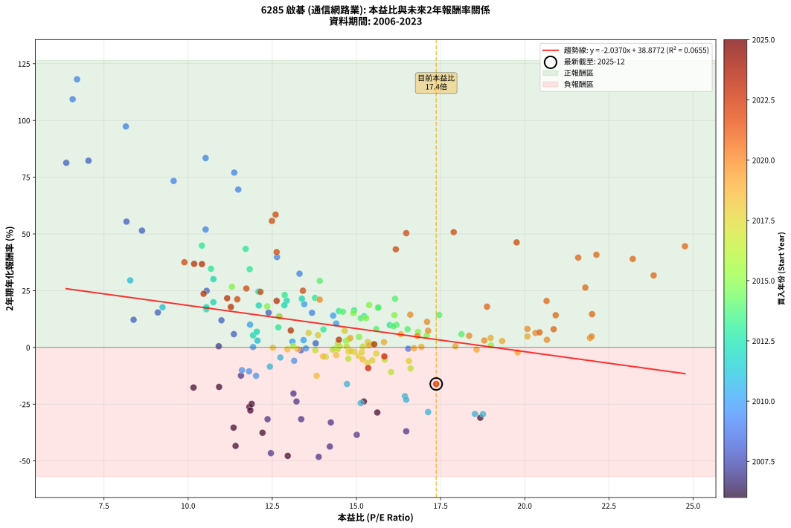
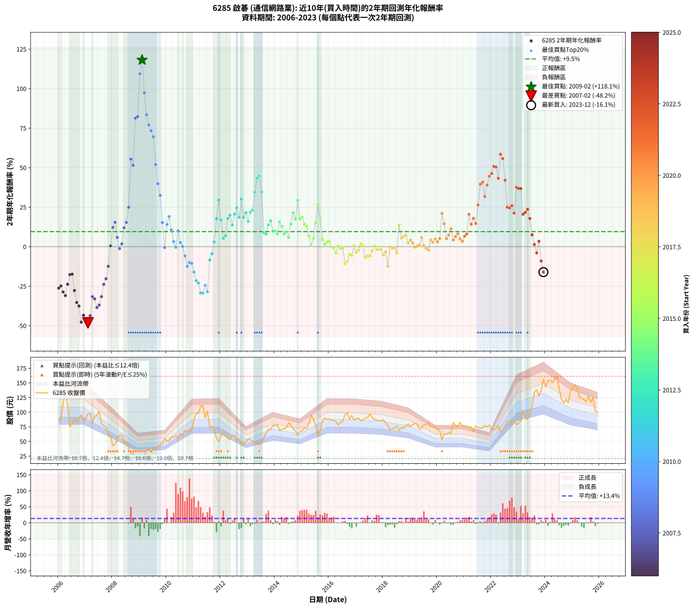

# 6285 啟碁 - 本益比與未來報酬率分析

!!! info "報告資訊"
    - **股票代號**: 6285
    - **公司名稱**: 啟碁
    - **產業別**: 通信網路業
    - **分析期間**: 2006-2023 (216 個數據點)
    - **資料來源**: Type 12 (ShowMonthlyK_ChartFlow) 月收盤價與本益比
    - **報酬率口徑**: 含現金股利 (簡化: 年度合計，假設每年7/1入帳)
    - **報告生成時間**: 2026-01-07 21:17:21 CST

## 📈 視覺化圖表

### 圖表1: 本益比 vs 未來報酬率關係

*圖表1：6285 啟碁 本益比與2年期未來報酬率關係 (2006-2023)*

### 圖表2: 歷年買入時點的2年期實際報酬率

*圖表2：6285 啟碁 歷年買入時點的2年期實際報酬率 (2006-2023)*

## 📍 買點訊號說明

本報告提供兩種買點提示訊號（顯示於圖表2的股價子圖中）：

### ▲ 小綠色三角形（回測驗證）
- **計算方式**: 使用全部歷史資料計算本益比第25百分位數
- **用途**: 事後驗證，顯示歷史上哪些時點確實為低估區
- **限制**: 當下無法判斷，僅供回測參考
- **特性**: 後見之明（Look-Ahead Bias）

### ▲ 小橘色三角形（即時訊號）
- **計算方式**: 使用截至當月的過去5年資料計算本益比第25百分位數
- **用途**: 實際投資決策，當時即可判斷
- **優勢**: 可操作性強，符合實務需求
- **特性**: 無後見之明，滾動窗口計算

!!! tip "如何使用兩種訊號"
    - **綠色▲** 幫助理解歷史估值機會，驗證策略有效性
    - **橘色▲** 可作為實際買進參考，但仍需搭配基本面分析
    - 兩種訊號重疊時，表示即時判斷與事後驗證一致，信心度較高
    - 僅有綠色▲時，表示當時無法判斷（需要未來資料才能確認）
    - 僅有橘色▲時，表示即時判斷為買點，但事後可能不是最佳時機

## 📊 估值分析摘要

| 指標 | 數值 |
|:---:|:---:|
| **目前本益比** (2023-12) | **17.37 倍** |
| **歷史平均本益比** | 14.41 倍 |
| **估值水準** | 🔴 相對高估 |
| **預期2年年化報酬率** | **+3.49%** |
| **歷史平均報酬率** | +9.52% |
| **相關係數 (R²)** | 0.0655 |
| **趨勢線斜率** | -2.0370 |

!!! abstract "核心洞察"
    目前本益比顯著高於歷史平均，預期未來報酬率可能較低

    根據歷史數據回測，6285 啟碁 在目前本益比 **17.4倍** 的估值水準下，
    預期未來2年年化報酬率約為 **+3.5%**。

    **重要提醒**: 本分析基於歷史數據統計，實際報酬率會受到公司基本面變化、產業趨勢、
    總體經濟環境等多重因素影響。R² = 0.07 表示本益比可解釋約 6.5% 的報酬率變異。

## 📈 歷史估值統計

### 最佳買點 (最高報酬率)

| 項目 | 數值 |
|:---:|:---:|
| 起始時間 | 2009-02 |
| 當時本益比 | 6.70 倍 |
| 起始價格 | 21.1 元 |
| 2年後價格 | 97.5 元 |
| **2年年化報酬率** | **+118.14%** |

### 最差買點 (最低報酬率)

| 項目 | 數值 |
|:---:|:---:|
| 起始時間 | 2007-02 |
| 當時本益比 | 13.88 倍 |
| 起始價格 | 97.4 元 |
| 2年後價格 | 21.1 元 |
| **2年年化報酬率** | **-48.22%** |

## 🎯 投資啟示

### 本益比與報酬率關係

趨勢線方程式: **y = -2.0370x + 38.8772**

!!! warning "強負相關"
    本益比與未來報酬率呈現強負相關。在高本益比時期買入，未來報酬率顯著較低；
    在低本益比時期買入，未來報酬率顯著較高。**估值紀律至關重要**。

### 估值區間建議

基於歷史數據分析:

- **🟢 低估區** (P/E < 11.5): 預期報酬率較高，可考慮增加持股
- **🟡 合理區** (P/E 11.5-17.3): 預期報酬率符合長期趨勢，正常持有
- **🔴 高估區** (P/E > 17.3): 預期報酬率較低，可考慮減碼或觀望

!!! danger "風險提示"
    - 過去表現不代表未來結果
    - 本分析假設公司基本面無重大結構性變化
    - 產業環境劇變可能使歷史規律失效
    - 應結合公司財報、產業趨勢、總體經濟等多重因素綜合判斷

!!! success "長期投資觀點"
    歷史數據顯示，在合理或低估的估值水準買入並長期持有，
    往往能獲得較佳的投資報酬。**耐心等待好價格**是價值投資的核心原則。

## 📊 數據品質

- **資料來源**: GoodInfo.tw Type 12 (ShowMonthlyK_ChartFlow)
- **資料頻率**: 月度收盤價與本益比
- **回測期間**: 2006-2023
- **數據點數量**: 216 個 (每個點代表一次2年期回測)

### 計算方法說明

1. **2年期年化報酬率**:
   - 對每個歷史時點，計算其後2年的實際投資報酬率
   - 期末價值(不含股利): 期末價格
   - 期末價值(含現金股利): 期末價格 + 持有期間內的現金股利合計 (簡化: 年度合計，假設每年7/1入帳)
   - 公式: 年化報酬率 = [(期末價值/期初價格)^(1/年數) - 1] × 100%

2. **本益比 (P/E Ratio)**:
   - 使用當時的月收盤價與EPS計算
   - 資料來源: Type 12 月度河流圖本益比數據

3. **趨勢線 (Linear Regression)**:
   - 使用最小平方法擬合線性趨勢線
   - R²值衡量本益比對報酬率的解釋能力

---

*本報告由 Stock Analysis System v1.9.0 自動生成*
*數據更新時間: 2026-01-07 21:17:21 CST*

## 📋 月度回測明細表

（每一列對應時間線圖中的一個買入點；可用來對照 SVG 圖上的每個點。）

| 買入月份 | 賣出月份 | 回測期限_年 | 實際持有年數 | 買入本益比_倍 | 買入收盤價_元 | 賣出收盤價_元 | 現金股利合計_元 | 總報酬率_pct | 年化報酬率_pct |
| --- | --- | --- | --- | --- | --- | --- | --- | --- | --- |
| 2006-01 | 2008-01 | 2 | 1.999 | 11.82 | 87.00 | 42.90 | 4.49 | -45.53 | -26.21 |
| 2006-02 | 2008-02 | 2 | 1.999 | 11.89 | 87.50 | 44.90 | 4.49 | -43.55 | -24.88 |
| 2006-03 | 2008-03 | 2 | 2.001 | 15.62 | 115.00 | 54.00 | 4.49 | -49.14 | -28.67 |
| 2006-04 | 2008-04 | 2 | 2.001 | 18.68 | 137.50 | 61.00 | 4.49 | -52.37 | -30.97 |
| 2006-05 | 2008-05 | 2 | 2.001 | 15.22 | 112.00 | 60.50 | 4.49 | -41.97 | -23.81 |
| 2006-06 | 2008-06 | 2 | 2.001 | 10.16 | 74.80 | 46.20 | 4.49 | -32.23 | -17.67 |
| 2006-07 | 2008-07 | 2 | 2.001 | 10.92 | 80.40 | 49.85 | 4.99 | -31.79 | -17.40 |
| 2006-08 | 2008-08 | 2 | 2.001 | 11.85 | 87.20 | 40.50 | 4.99 | -47.83 | -27.75 |
| 2006-09 | 2008-09 | 2 | 2.001 | 11.35 | 83.50 | 29.90 | 4.99 | -58.21 | -35.34 |
| 2006-10 | 2008-10 | 2 | 2.001 | 12.21 | 89.90 | 30.00 | 4.99 | -61.08 | -37.59 |
| 2006-11 | 2008-11 | 2 | 2.001 | 12.96 | 95.40 | 21.00 | 4.99 | -72.75 | -47.78 |
| 2006-12 | 2008-12 | 2 | 2.001 | 11.41 | 84.00 | 21.90 | 4.99 | -67.98 | -43.40 |
| 2007-01 | 2009-01 | 2 | 2.001 | 12.46 | 89.60 | 20.55 | 4.99 | -71.49 | -46.58 |
| 2007-02 | 2009-02 | 2 | 2.001 | 13.88 | 97.40 | 21.10 | 4.99 | -73.21 | -48.22 |
| 2007-03 | 2009-03 | 2 | 2.001 | 14.21 | 97.30 | 25.85 | 4.99 | -68.30 | -43.68 |
| 2007-04 | 2009-04 | 2 | 2.001 | 12.36 | 82.50 | 33.55 | 4.99 | -53.28 | -31.63 |
| 2007-05 | 2009-05 | 2 | 2.001 | 14.24 | 92.60 | 36.50 | 4.99 | -55.19 | -33.04 |
| 2007-06 | 2009-06 | 2 | 2.001 | 15.01 | 95.00 | 30.90 | 4.99 | -62.22 | -38.51 |
| 2007-07 | 2009-07 | 2 | 2.001 | 16.48 | 101.50 | 37.35 | 3.00 | -60.25 | -36.93 |
| 2007-08 | 2009-08 | 2 | 2.001 | 13.36 | 80.00 | 34.40 | 3.00 | -53.25 | -31.61 |
| 2007-09 | 2009-09 | 2 | 2.001 | 13.22 | 76.90 | 41.60 | 3.00 | -42.00 | -23.83 |
| 2007-10 | 2009-10 | 2 | 2.001 | 13.13 | 74.10 | 44.05 | 3.00 | -36.50 | -20.30 |
| 2007-11 | 2009-11 | 2 | 2.001 | 11.57 | 63.30 | 45.55 | 3.00 | -23.30 | -12.41 |
| 2007-12 | 2009-12 | 2 | 2.001 | 10.91 | 57.80 | 55.40 | 3.00 | +1.04 | +0.52 |
| 2008-01 | 2010-01 | 2 | 2.001 | 8.38 | 42.90 | 51.00 | 3.00 | +25.87 | +12.18 |
| 2008-02 | 2010-03 | 2 | 2.081 | 9.10 | 44.90 | 57.50 | 3.00 | +34.74 | +15.41 |
| 2008-03 | 2010-03 | 2 | 1.999 | 11.36 | 54.00 | 57.50 | 3.00 | +12.04 | +5.85 |
| 2008-04 | 2010-04 | 2 | 1.999 | 13.35 | 61.00 | 56.50 | 3.00 | -2.46 | -1.24 |
| 2008-05 | 2010-05 | 2 | 1.999 | 13.79 | 60.50 | 59.70 | 3.00 | +3.64 | +1.80 |
| 2008-06 | 2010-06 | 2 | 1.999 | 10.99 | 46.20 | 54.90 | 3.00 | +25.32 | +11.96 |
| 2008-07 | 2010-07 | 2 | 1.999 | 12.39 | 49.85 | 63.50 | 2.79 | +32.99 | +15.33 |
| 2008-08 | 2010-08 | 2 | 1.999 | 10.55 | 40.50 | 60.40 | 2.79 | +56.03 | +24.93 |
| 2008-09 | 2010-09 | 2 | 1.999 | 8.17 | 29.90 | 69.40 | 2.79 | +141.45 | +55.43 |
| 2008-10 | 2010-10 | 2 | 1.999 | 8.63 | 30.00 | 66.00 | 2.79 | +129.31 | +51.47 |
| 2008-11 | 2010-11 | 2 | 1.999 | 6.38 | 21.00 | 66.20 | 2.79 | +228.54 | +81.33 |
| 2008-12 | 2010-12 | 2 | 1.999 | 7.04 | 21.90 | 69.90 | 2.79 | +231.94 | +82.27 |
| 2009-01 | 2011-01 | 2 | 1.999 | 6.57 | 20.55 | 87.20 | 2.79 | +337.93 | +109.37 |
| 2009-02 | 2011-02 | 2 | 1.999 | 6.70 | 21.10 | 97.50 | 2.79 | +375.33 | +118.14 |
| 2009-03 | 2011-03 | 2 | 1.999 | 8.15 | 25.85 | 97.80 | 2.79 | +289.15 | +97.36 |
| 2009-04 | 2011-04 | 2 | 1.999 | 10.52 | 33.55 | 110.00 | 2.79 | +236.20 | +83.43 |
| 2009-05 | 2011-05 | 2 | 1.999 | 11.37 | 36.50 | 111.50 | 2.79 | +213.13 | +77.03 |
| 2009-06 | 2011-06 | 2 | 1.999 | 9.57 | 30.90 | 90.00 | 2.79 | +200.30 | +73.36 |
| 2009-07 | 2011-07 | 2 | 1.999 | 11.49 | 37.35 | 102.00 | 5.29 | +187.26 | +69.55 |
| 2009-08 | 2011-08 | 2 | 1.999 | 10.52 | 34.40 | 74.10 | 5.29 | +130.79 | +51.96 |
| 2009-09 | 2011-09 | 2 | 1.999 | 12.64 | 41.60 | 76.00 | 5.29 | +95.41 | +39.82 |
| 2009-10 | 2011-10 | 2 | 1.999 | 13.31 | 44.05 | 72.00 | 5.29 | +75.46 | +32.49 |
| 2009-11 | 2011-11 | 2 | 1.999 | 13.68 | 45.55 | 55.20 | 5.29 | +32.80 | +15.25 |
| 2009-12 | 2011-12 | 2 | 1.999 | 16.54 | 55.40 | 49.50 | 5.29 | -1.10 | -0.55 |
| 2010-01 | 2012-01 | 2 | 1.999 | 14.31 | 51.00 | 61.00 | 5.29 | +29.98 | +14.02 |
| 2010-02 | 2012-02 | 2 | 1.999 | 13.45 | 50.80 | 66.70 | 5.29 | +41.72 | +19.06 |
| 2010-03 | 2012-03 | 2 | 2.001 | 14.40 | 57.50 | 65.00 | 5.29 | +22.25 | +10.56 |
| 2010-04 | 2012-04 | 2 | 2.001 | 13.43 | 56.50 | 54.90 | 5.29 | +6.53 | +3.21 |
| 2010-05 | 2012-05 | 2 | 2.001 | 13.50 | 59.70 | 53.90 | 5.29 | -0.85 | -0.43 |
| 2010-06 | 2012-06 | 2 | 2.001 | 11.84 | 54.90 | 61.20 | 5.29 | +21.11 | +10.04 |
| 2010-07 | 2012-07 | 2 | 2.001 | 13.10 | 63.50 | 59.80 | 7.00 | +5.19 | +2.56 |
| 2010-08 | 2012-08 | 2 | 2.001 | 11.93 | 60.40 | 53.60 | 7.00 | +0.33 | +0.16 |
| 2010-09 | 2012-09 | 2 | 2.001 | 13.15 | 69.40 | 54.50 | 7.00 | -11.39 | -5.86 |
| 2010-10 | 2012-10 | 2 | 2.001 | 12.02 | 66.00 | 43.50 | 7.00 | -23.49 | -12.52 |
| 2010-11 | 2012-11 | 2 | 2.001 | 11.60 | 66.20 | 46.60 | 7.00 | -19.04 | -10.01 |
| 2010-12 | 2012-12 | 2 | 2.001 | 11.81 | 69.90 | 48.95 | 7.00 | -19.96 | -10.53 |
| 2011-01 | 2013-01 | 2 | 2.001 | 14.72 | 87.20 | 54.40 | 7.00 | -29.59 | -16.08 |
| 2011-02 | 2013-02 | 2 | 2.001 | 16.44 | 97.50 | 53.10 | 7.00 | -38.36 | -21.48 |
| 2011-03 | 2013-03 | 2 | 2.001 | 16.48 | 97.80 | 50.90 | 7.00 | -40.80 | -23.05 |
| 2011-04 | 2013-04 | 2 | 2.001 | 18.52 | 110.00 | 47.95 | 7.00 | -50.05 | -29.31 |
| 2011-05 | 2013-05 | 2 | 2.001 | 18.76 | 111.50 | 48.60 | 7.00 | -50.14 | -29.37 |
| 2011-06 | 2013-06 | 2 | 2.001 | 15.13 | 90.00 | 44.25 | 7.00 | -43.06 | -24.53 |
| 2011-07 | 2013-07 | 2 | 2.001 | 17.13 | 102.00 | 46.45 | 5.70 | -48.88 | -28.48 |
| 2011-08 | 2013-08 | 2 | 2.001 | 12.43 | 74.10 | 56.40 | 5.70 | -16.20 | -8.45 |
| 2011-09 | 2013-09 | 2 | 2.001 | 12.74 | 76.00 | 63.70 | 5.70 | -8.69 | -4.44 |
| 2011-10 | 2013-10 | 2 | 2.001 | 12.06 | 72.00 | 70.70 | 5.70 | +6.11 | +3.01 |
| 2011-11 | 2013-11 | 2 | 2.001 | 9.24 | 55.20 | 70.80 | 5.70 | +38.58 | +17.71 |
| 2011-12 | 2013-12 | 2 | 2.001 | 8.28 | 49.50 | 77.40 | 5.70 | +67.87 | +29.54 |
| 2012-01 | 2014-01 | 2 | 2.001 | 10.54 | 61.00 | 77.60 | 5.70 | +36.55 | +16.84 |
| 2012-02 | 2014-03 | 2 | 2.081 | 11.93 | 66.70 | 68.60 | 5.70 | +11.39 | +5.32 |
| 2012-03 | 2014-03 | 2 | 1.999 | 12.04 | 65.00 | 68.60 | 5.70 | +14.30 | +6.92 |
| 2012-04 | 2014-04 | 2 | 1.999 | 10.54 | 54.90 | 70.40 | 5.70 | +38.61 | +17.75 |
| 2012-05 | 2014-05 | 2 | 1.999 | 10.75 | 53.90 | 71.80 | 5.70 | +43.78 | +19.92 |
| 2012-06 | 2014-06 | 2 | 1.999 | 12.70 | 61.20 | 73.40 | 5.70 | +29.24 | +13.69 |
| 2012-07 | 2014-07 | 2 | 1.999 | 12.93 | 59.80 | 81.80 | 5.20 | +45.48 | +20.63 |
| 2012-08 | 2014-08 | 2 | 1.999 | 12.09 | 53.60 | 78.00 | 5.20 | +55.22 | +24.61 |
| 2012-09 | 2014-09 | 2 | 1.999 | 12.86 | 54.50 | 71.40 | 5.20 | +40.54 | +18.57 |
| 2012-10 | 2014-10 | 2 | 1.999 | 10.75 | 43.50 | 68.40 | 5.20 | +69.19 | +30.10 |
| 2012-11 | 2014-11 | 2 | 1.999 | 12.10 | 46.60 | 60.20 | 5.20 | +40.34 | +18.48 |
| 2012-12 | 2014-12 | 2 | 1.999 | 13.38 | 48.95 | 67.00 | 5.20 | +47.49 | +21.46 |
| 2013-01 | 2015-01 | 2 | 1.999 | 14.48 | 54.40 | 68.00 | 5.20 | +34.55 | +16.01 |
| 2013-02 | 2015-02 | 2 | 1.999 | 13.77 | 53.10 | 73.60 | 5.20 | +48.39 | +21.83 |
| 2013-03 | 2015-03 | 2 | 1.999 | 12.87 | 50.90 | 71.90 | 5.20 | +51.47 | +23.09 |
| 2013-04 | 2015-04 | 2 | 1.999 | 11.83 | 47.95 | 81.50 | 5.20 | +80.81 | +34.49 |
| 2013-05 | 2015-05 | 2 | 1.999 | 11.71 | 48.60 | 94.70 | 5.20 | +105.55 | +43.41 |
| 2013-06 | 2015-06 | 2 | 1.999 | 10.41 | 44.25 | 87.60 | 5.20 | +109.71 | +44.85 |
| 2013-07 | 2015-07 | 2 | 1.999 | 10.68 | 46.45 | 78.50 | 5.70 | +81.27 | +34.66 |
| 2013-08 | 2015-08 | 2 | 1.999 | 12.68 | 56.40 | 61.10 | 5.70 | +18.44 | +8.84 |
| 2013-09 | 2015-09 | 2 | 1.999 | 14.02 | 63.70 | 68.50 | 5.70 | +16.48 | +7.93 |
| 2013-10 | 2015-10 | 2 | 1.999 | 15.23 | 70.70 | 85.80 | 5.70 | +29.42 | +13.77 |
| 2013-11 | 2015-11 | 2 | 1.999 | 14.93 | 70.80 | 90.10 | 5.70 | +35.31 | +16.34 |
| 2013-12 | 2015-12 | 2 | 1.999 | 15.99 | 77.40 | 87.70 | 5.70 | +20.67 | +9.86 |
| 2014-01 | 2016-01 | 2 | 1.999 | 16.19 | 77.60 | 88.10 | 5.70 | +20.88 | +9.95 |
| 2014-02 | 2016-02 | 2 | 1.999 | 16.52 | 78.40 | 85.80 | 5.70 | +16.71 | +8.04 |
| 2014-03 | 2016-03 | 2 | 2.001 | 14.60 | 68.60 | 86.20 | 5.70 | +33.97 | +15.73 |
| 2014-04 | 2016-04 | 2 | 2.001 | 15.13 | 70.40 | 84.00 | 5.70 | +27.41 | +12.87 |
| 2014-05 | 2016-05 | 2 | 2.001 | 15.59 | 71.80 | 78.20 | 5.70 | +16.85 | +8.09 |
| 2014-06 | 2016-06 | 2 | 2.001 | 16.10 | 73.40 | 82.10 | 5.70 | +19.62 | +9.36 |
| 2014-07 | 2016-07 | 2 | 2.001 | 18.12 | 81.80 | 85.20 | 6.40 | +11.98 | +5.82 |
| 2014-08 | 2016-08 | 2 | 2.001 | 17.46 | 78.00 | 95.50 | 6.40 | +30.64 | +14.29 |
| 2014-09 | 2016-09 | 2 | 2.001 | 16.15 | 71.40 | 98.90 | 6.40 | +47.48 | +21.42 |
| 2014-10 | 2016-10 | 2 | 2.001 | 15.64 | 68.40 | 87.90 | 6.40 | +37.87 | +17.40 |
| 2014-11 | 2016-11 | 2 | 2.001 | 13.91 | 60.20 | 94.30 | 6.40 | +67.28 | +29.31 |
| 2014-12 | 2016-12 | 2 | 2.001 | 15.65 | 67.00 | 86.30 | 6.40 | +38.36 | +17.61 |
| 2015-01 | 2017-01 | 2 | 2.001 | 15.38 | 68.00 | 89.40 | 6.40 | +40.88 | +18.68 |
| 2015-02 | 2017-02 | 2 | 2.001 | 16.13 | 73.60 | 89.70 | 6.40 | +30.57 | +14.26 |
| 2015-03 | 2017-03 | 2 | 2.001 | 15.29 | 71.90 | 85.30 | 6.40 | +27.54 | +12.92 |
| 2015-04 | 2017-04 | 2 | 2.001 | 16.83 | 81.50 | 86.60 | 6.40 | +14.11 | +6.82 |
| 2015-05 | 2017-05 | 2 | 2.001 | 19.00 | 94.70 | 90.00 | 6.40 | +1.80 | +0.89 |
| 2015-06 | 2017-06 | 2 | 2.001 | 17.09 | 87.60 | 90.60 | 6.40 | +10.73 | +5.22 |
| 2015-07 | 2017-07 | 2 | 2.001 | 14.91 | 78.50 | 96.70 | 7.37 | +32.57 | +15.13 |
| 2015-08 | 2017-08 | 2 | 2.001 | 11.30 | 61.10 | 90.80 | 7.37 | +60.67 | +26.73 |
| 2015-09 | 2017-09 | 2 | 2.001 | 12.35 | 68.50 | 88.20 | 7.37 | +39.51 | +18.10 |
| 2015-10 | 2017-10 | 2 | 2.001 | 15.08 | 85.80 | 86.50 | 7.37 | +9.40 | +4.59 |
| 2015-11 | 2017-11 | 2 | 2.001 | 15.46 | 90.10 | 85.30 | 7.37 | +2.85 | +1.41 |
| 2015-12 | 2017-12 | 2 | 2.001 | 14.69 | 87.70 | 85.50 | 7.37 | +5.89 | +2.90 |
| 2016-01 | 2018-01 | 2 | 2.001 | 14.76 | 88.10 | 86.80 | 7.37 | +6.89 | +3.38 |
| 2016-02 | 2018-03 | 2 | 2.081 | 14.38 | 85.80 | 77.70 | 7.37 | -0.85 | -0.41 |
| 2016-03 | 2018-03 | 2 | 1.999 | 14.45 | 86.20 | 77.70 | 7.37 | -1.31 | -0.66 |
| 2016-04 | 2018-04 | 2 | 1.999 | 14.09 | 84.00 | 69.80 | 7.37 | -8.13 | -4.16 |
| 2016-05 | 2018-05 | 2 | 1.999 | 13.12 | 78.20 | 71.60 | 7.37 | +0.98 | +0.49 |
| 2016-06 | 2018-06 | 2 | 1.999 | 13.78 | 82.10 | 72.70 | 7.37 | -2.48 | -1.25 |
| 2016-07 | 2018-07 | 2 | 1.999 | 14.30 | 85.20 | 76.20 | 7.37 | -1.92 | -0.96 |
| 2016-08 | 2018-08 | 2 | 1.999 | 16.03 | 95.50 | 68.60 | 7.37 | -20.45 | -10.82 |
| 2016-09 | 2018-09 | 2 | 1.999 | 16.61 | 98.90 | 74.10 | 7.37 | -17.63 | -9.25 |
| 2016-10 | 2018-10 | 2 | 1.999 | 14.76 | 87.90 | 72.00 | 7.37 | -9.71 | -4.98 |
| 2016-11 | 2018-11 | 2 | 1.999 | 15.84 | 94.30 | 77.00 | 7.37 | -10.53 | -5.42 |
| 2016-12 | 2018-12 | 2 | 1.999 | 14.50 | 86.30 | 79.90 | 7.37 | +1.12 | +0.56 |
| 2017-01 | 2019-01 | 2 | 1.999 | 15.07 | 89.40 | 75.40 | 7.37 | -7.42 | -3.78 |
| 2017-02 | 2019-02 | 2 | 1.999 | 15.16 | 89.70 | 78.60 | 7.37 | -4.16 | -2.10 |
| 2017-03 | 2019-03 | 2 | 1.999 | 14.45 | 85.30 | 81.00 | 7.37 | +3.60 | +1.78 |
| 2017-04 | 2019-04 | 2 | 1.999 | 14.71 | 86.60 | 80.00 | 7.37 | +0.89 | +0.44 |
| 2017-05 | 2019-05 | 2 | 1.999 | 15.33 | 90.00 | 70.80 | 7.37 | -13.15 | -6.81 |
| 2017-06 | 2019-06 | 2 | 1.999 | 15.47 | 90.60 | 73.20 | 7.37 | -11.07 | -5.70 |
| 2017-07 | 2019-07 | 2 | 1.999 | 16.56 | 96.70 | 78.30 | 7.20 | -11.58 | -5.97 |
| 2017-08 | 2019-08 | 2 | 1.999 | 15.59 | 90.80 | 78.80 | 7.20 | -5.29 | -2.68 |
| 2017-09 | 2019-09 | 2 | 1.999 | 15.19 | 88.20 | 81.60 | 7.20 | +0.68 | +0.34 |
| 2017-10 | 2019-10 | 2 | 1.999 | 14.94 | 86.50 | 76.00 | 7.20 | -3.81 | -1.93 |
| 2017-11 | 2019-11 | 2 | 1.999 | 14.77 | 85.30 | 75.00 | 7.20 | -3.63 | -1.83 |
| 2017-12 | 2019-12 | 2 | 1.999 | 14.84 | 85.50 | 75.50 | 7.20 | -3.27 | -1.65 |
| 2018-01 | 2020-01 | 2 | 1.999 | 15.19 | 86.80 | 70.70 | 7.20 | -10.25 | -5.27 |
| 2018-02 | 2020-02 | 2 | 1.999 | 14.40 | 81.60 | 69.00 | 7.20 | -6.62 | -3.37 |
| 2018-03 | 2020-03 | 2 | 2.001 | 13.82 | 77.70 | 52.30 | 7.20 | -23.42 | -12.48 |
| 2018-04 | 2020-04 | 2 | 2.001 | 12.52 | 69.80 | 62.40 | 7.20 | -0.29 | -0.14 |
| 2018-05 | 2020-05 | 2 | 2.001 | 12.95 | 71.60 | 63.20 | 7.20 | -1.67 | -0.84 |
| 2018-06 | 2020-06 | 2 | 2.001 | 13.25 | 72.70 | 64.40 | 7.20 | -1.51 | -0.76 |
| 2018-07 | 2020-07 | 2 | 2.001 | 14.01 | 76.20 | 64.30 | 6.00 | -7.74 | -3.95 |
| 2018-08 | 2020-08 | 2 | 2.001 | 12.72 | 68.60 | 82.50 | 6.00 | +29.01 | +13.57 |
| 2018-09 | 2020-09 | 2 | 2.001 | 13.86 | 74.10 | 76.40 | 6.00 | +11.20 | +5.45 |
| 2018-10 | 2020-10 | 2 | 2.001 | 13.58 | 72.00 | 75.50 | 6.00 | +13.20 | +6.39 |
| 2018-11 | 2020-11 | 2 | 2.001 | 14.65 | 77.00 | 82.70 | 6.00 | +15.20 | +7.32 |
| 2018-12 | 2020-12 | 2 | 2.001 | 15.34 | 79.90 | 77.70 | 6.00 | +4.76 | +2.35 |
| 2019-01 | 2021-01 | 2 | 2.001 | 14.82 | 75.40 | 75.80 | 6.00 | +8.49 | +4.16 |
| 2019-02 | 2021-02 | 2 | 2.001 | 15.82 | 78.60 | 76.30 | 6.00 | +4.71 | +2.33 |
| 2019-03 | 2021-03 | 2 | 2.001 | 16.71 | 81.00 | 74.50 | 6.00 | -0.62 | -0.31 |
| 2019-04 | 2021-04 | 2 | 2.001 | 16.93 | 80.00 | 74.40 | 6.00 | +0.50 | +0.25 |
| 2019-05 | 2021-05 | 2 | 2.001 | 15.37 | 70.80 | 66.20 | 6.00 | +1.98 | +0.98 |
| 2019-06 | 2021-06 | 2 | 2.001 | 16.32 | 73.20 | 76.00 | 6.00 | +12.02 | +5.84 |
| 2019-07 | 2021-07 | 2 | 2.001 | 17.94 | 78.30 | 74.20 | 5.00 | +1.15 | +0.57 |
| 2019-08 | 2021-08 | 2 | 2.001 | 18.57 | 78.80 | 72.40 | 5.00 | -1.78 | -0.89 |
| 2019-09 | 2021-09 | 2 | 2.001 | 19.79 | 81.60 | 73.10 | 5.00 | -4.29 | -2.17 |
| 2019-10 | 2021-10 | 2 | 2.001 | 18.99 | 76.00 | 77.50 | 5.00 | +8.55 | +4.19 |
| 2019-11 | 2021-11 | 2 | 2.001 | 19.33 | 75.00 | 74.30 | 5.00 | +5.73 | +2.83 |
| 2019-12 | 2021-12 | 2 | 2.001 | 20.08 | 75.50 | 78.00 | 5.00 | +9.94 | +4.85 |
| 2020-01 | 2022-01 | 2 | 2.001 | 18.80 | 70.70 | 70.10 | 5.00 | +6.22 | +3.06 |
| 2020-02 | 2022-03 | 2 | 2.081 | 18.35 | 69.00 | 71.60 | 5.00 | +11.02 | +5.15 |
| 2020-03 | 2022-03 | 2 | 1.999 | 13.91 | 52.30 | 71.60 | 5.00 | +46.46 | +21.04 |
| 2020-04 | 2022-04 | 2 | 1.999 | 16.60 | 62.40 | 76.70 | 5.00 | +30.93 | +14.44 |
| 2020-05 | 2022-05 | 2 | 1.999 | 16.81 | 63.20 | 64.80 | 5.00 | +10.44 | +5.10 |
| 2020-06 | 2022-06 | 2 | 1.999 | 17.13 | 64.40 | 69.20 | 5.00 | +15.22 | +7.35 |
| 2020-07 | 2022-07 | 2 | 1.999 | 17.10 | 64.30 | 75.00 | 4.60 | +23.80 | +11.27 |
| 2020-08 | 2022-08 | 2 | 1.999 | 21.94 | 82.50 | 85.00 | 4.60 | +8.61 | +4.22 |
| 2020-09 | 2022-09 | 2 | 1.999 | 20.32 | 76.40 | 81.80 | 4.60 | +13.09 | +6.35 |
| 2020-10 | 2022-10 | 2 | 1.999 | 20.08 | 75.50 | 83.70 | 4.60 | +16.95 | +8.15 |
| 2020-11 | 2022-11 | 2 | 1.999 | 21.99 | 82.70 | 86.30 | 4.60 | +9.92 | +4.84 |
| 2020-12 | 2022-12 | 2 | 1.999 | 20.66 | 77.70 | 78.40 | 4.60 | +6.82 | +3.36 |
| 2021-01 | 2023-01 | 2 | 1.999 | 20.44 | 75.80 | 81.60 | 4.60 | +13.72 | +6.65 |
| 2021-02 | 2023-02 | 2 | 1.999 | 20.86 | 76.30 | 84.40 | 4.60 | +16.65 | +8.01 |
| 2021-03 | 2023-03 | 2 | 1.999 | 20.65 | 74.50 | 103.50 | 4.60 | +45.10 | +20.47 |
| 2021-04 | 2023-04 | 2 | 1.999 | 20.92 | 74.40 | 92.40 | 4.60 | +30.38 | +14.19 |
| 2021-05 | 2023-05 | 2 | 1.999 | 18.88 | 66.20 | 87.50 | 4.60 | +39.13 | +17.96 |
| 2021-06 | 2023-06 | 2 | 1.999 | 22.00 | 76.00 | 95.30 | 4.60 | +31.45 | +14.66 |
| 2021-07 | 2023-07 | 2 | 1.999 | 21.80 | 74.20 | 111.50 | 6.94 | +59.62 | +26.36 |
| 2021-08 | 2023-08 | 2 | 1.999 | 21.59 | 72.40 | 134.00 | 6.94 | +94.67 | +39.56 |
| 2021-09 | 2023-09 | 2 | 1.999 | 22.13 | 73.10 | 138.00 | 6.94 | +98.28 | +40.84 |
| 2021-10 | 2023-10 | 2 | 1.999 | 23.83 | 77.50 | 127.50 | 6.94 | +73.47 | +31.73 |
| 2021-11 | 2023-11 | 2 | 1.999 | 23.21 | 74.30 | 136.50 | 6.94 | +93.06 | +38.98 |
| 2021-12 | 2023-12 | 2 | 1.999 | 24.76 | 78.00 | 156.00 | 6.94 | +108.90 | +44.57 |
| 2022-01 | 2024-01 | 2 | 1.999 | 19.76 | 70.10 | 143.00 | 6.94 | +113.90 | +46.29 |
| 2022-02 | 2024-02 | 2 | 1.999 | 17.89 | 70.60 | 153.50 | 6.94 | +127.25 | +50.79 |
| 2022-03 | 2024-03 | 2 | 2.001 | 16.48 | 71.60 | 155.00 | 6.94 | +126.17 | +50.35 |
| 2022-04 | 2024-04 | 2 | 2.001 | 16.17 | 76.70 | 150.50 | 6.94 | +105.27 | +43.24 |
| 2022-05 | 2024-05 | 2 | 2.001 | 12.60 | 64.80 | 156.00 | 6.94 | +151.45 | +58.52 |
| 2022-06 | 2024-06 | 2 | 2.001 | 12.49 | 69.20 | 161.00 | 6.94 | +142.69 | +55.74 |
| 2022-07 | 2024-07 | 2 | 2.001 | 12.63 | 75.00 | 140.50 | 10.84 | +101.78 | +42.02 |
| 2022-08 | 2024-08 | 2 | 2.001 | 13.41 | 85.00 | 122.00 | 10.84 | +56.28 | +24.99 |
| 2022-09 | 2024-09 | 2 | 2.001 | 12.15 | 81.80 | 116.00 | 10.84 | +55.06 | +24.50 |
| 2022-10 | 2024-10 | 2 | 2.001 | 11.73 | 83.70 | 122.00 | 10.84 | +58.71 | +25.96 |
| 2022-11 | 2024-11 | 2 | 2.001 | 11.46 | 86.30 | 116.00 | 10.84 | +46.97 | +21.22 |
| 2022-12 | 2024-12 | 2 | 2.001 | 9.89 | 78.40 | 137.50 | 10.84 | +89.21 | +37.52 |
| 2023-01 | 2025-01 | 2 | 2.001 | 10.18 | 81.60 | 142.00 | 10.84 | +87.30 | +36.83 |
| 2023-02 | 2025-02 | 2 | 2.001 | 10.41 | 84.40 | 147.00 | 10.84 | +87.01 | +36.72 |
| 2023-03 | 2025-03 | 2 | 2.001 | 12.63 | 103.50 | 139.50 | 10.84 | +45.25 | +20.51 |
| 2023-04 | 2025-04 | 2 | 2.001 | 11.16 | 92.40 | 126.00 | 10.84 | +48.09 | +21.68 |
| 2023-05 | 2025-05 | 2 | 2.001 | 10.46 | 87.50 | 123.00 | 10.84 | +52.96 | +23.66 |
| 2023-06 | 2025-06 | 2 | 2.001 | 11.27 | 95.30 | 121.50 | 10.84 | +38.86 | +17.83 |
| 2023-07 | 2025-07 | 2 | 2.001 | 13.05 | 111.50 | 118.00 | 10.80 | +15.51 | +7.47 |
| 2023-08 | 2025-08 | 2 | 2.001 | 15.53 | 134.00 | 127.00 | 10.80 | +2.83 | +1.41 |
| 2023-09 | 2025-09 | 2 | 2.001 | 15.83 | 138.00 | 116.50 | 10.80 | -7.76 | -3.95 |
| 2023-10 | 2025-10 | 2 | 2.001 | 14.48 | 127.50 | 125.50 | 10.80 | +6.90 | +3.39 |
| 2023-11 | 2025-11 | 2 | 2.001 | 15.35 | 136.50 | 102.00 | 10.80 | -17.36 | -9.09 |
| 2023-12 | 2025-12 | 2 | 2.001 | 17.37 | 156.00 | 99.00 | 10.80 | -29.62 | -16.10 |
