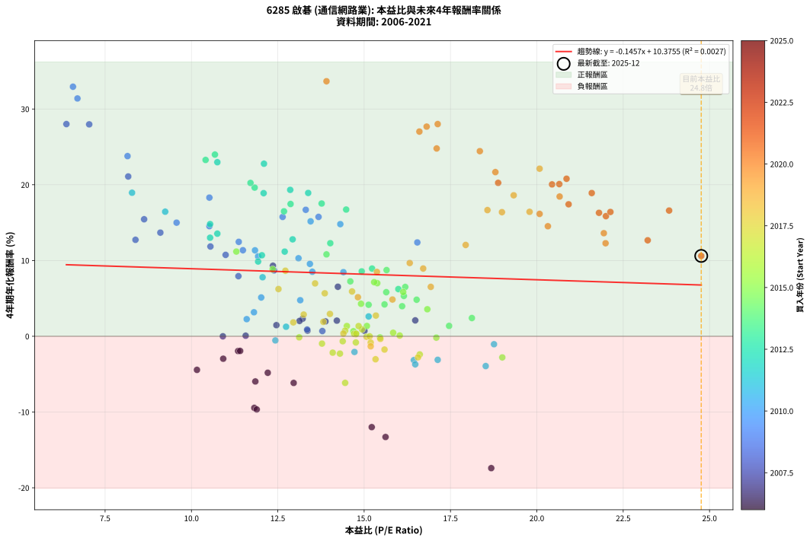
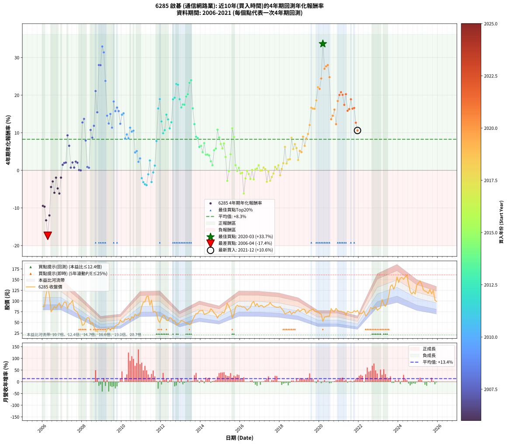

# 6285 啟碁 - 本益比與未來報酬率分析

!!! info "報告資訊"
    - **股票代號**: 6285
    - **公司名稱**: 啟碁
    - **產業別**: 通信網路業
    - **分析期間**: 2006-2021 (192 個數據點)
    - **資料來源**: Type 12 (ShowMonthlyK_ChartFlow) 月收盤價與本益比
    - **報酬率口徑**: 含現金股利 (簡化: 年度合計，假設每年7/1入帳)
    - **報告生成時間**: 2026-01-22 23:54:37 CST

## 📈 視覺化圖表

### 圖表1: 本益比 vs 未來報酬率關係

*圖表1：6285 啟碁 本益比與4年期未來報酬率關係 (2006-2021)*

### 圖表2: 歷年買入時點的4年期實際報酬率

*圖表2：6285 啟碁 歷年買入時點的4年期實際報酬率 (2006-2021)*

## 📍 買點訊號說明

本報告提供兩種買點提示訊號（顯示於圖表2的股價子圖中）：

### ▲ 小綠色三角形（回測驗證）
- **計算方式**: 使用全部歷史資料計算本益比第25百分位數
- **用途**: 事後驗證，顯示歷史上哪些時點確實為低估區
- **限制**: 當下無法判斷，僅供回測參考
- **特性**: 後見之明（Look-Ahead Bias）

### ▲ 小橘色三角形（即時訊號）
- **計算方式**: 使用截至當月的過去5年資料計算本益比第25百分位數
- **用途**: 實際投資決策，當時即可判斷
- **優勢**: 可操作性強，符合實務需求
- **特性**: 無後見之明，滾動窗口計算

!!! tip "如何使用兩種訊號"
    - **綠色▲** 幫助理解歷史估值機會，驗證策略有效性
    - **橘色▲** 可作為實際買進參考，但仍需搭配基本面分析
    - 兩種訊號重疊時，表示即時判斷與事後驗證一致，信心度較高
    - 僅有綠色▲時，表示當時無法判斷（需要未來資料才能確認）
    - 僅有橘色▲時，表示即時判斷為買點，但事後可能不是最佳時機

## 📊 估值分析摘要

| 指標 | 數值 |
|:---:|:---:|
| **目前本益比** (2021-12) | **24.76 倍** |
| **歷史平均本益比** | 14.52 倍 |
| **估值水準** | 🔴 相對高估 |
| **預期4年年化報酬率** | **+6.77%** |
| **歷史平均報酬率** | +8.26% |
| **相關係數 (R²)** | 0.0027 |
| **趨勢線斜率** | -0.1457 |

!!! abstract "核心洞察"
    目前本益比顯著高於歷史平均，預期未來報酬率可能較低

    根據歷史數據回測，6285 啟碁 在目前本益比 **24.8倍** 的估值水準下，
    預期未來4年年化報酬率約為 **+6.8%**。

    **重要提醒**: 本分析基於歷史數據統計，實際報酬率會受到公司基本面變化、產業趨勢、
    總體經濟環境等多重因素影響。R² = 0.00 表示本益比可解釋約 0.3% 的報酬率變異。

## 📈 歷史估值統計

### 最佳買點 (最高報酬率)

| 項目 | 數值 |
|:---:|:---:|
| 起始時間 | 2020-03 |
| 當時本益比 | 13.91 倍 |
| 起始價格 | 52.3 元 |
| 4年後價格 | 155.0 元 |
| **4年年化報酬率** | **+33.66%** |

### 最差買點 (最低報酬率)

| 項目 | 數值 |
|:---:|:---:|
| 起始時間 | 2006-04 |
| 當時本益比 | 18.68 倍 |
| 起始價格 | 137.5 元 |
| 4年後價格 | 56.5 元 |
| **4年年化報酬率** | **-17.41%** |

## 🎯 投資啟示

### 本益比與報酬率關係

趨勢線方程式: **y = -0.1457x + 10.3755**

!!! note "負相關"
    本益比與未來報酬率呈現負相關。較低的本益比通常帶來較高的未來報酬率，
    但相關性不算非常強。**估值仍是重要參考指標之一**。

### 估值區間建議

基於歷史數據分析:

- **🟢 低估區** (P/E < 11.6): 預期報酬率較高，可考慮增加持股
- **🟡 合理區** (P/E 11.6-17.4): 預期報酬率符合長期趨勢，正常持有
- **🔴 高估區** (P/E > 17.4): 預期報酬率較低，可考慮減碼或觀望

!!! danger "風險提示"
    - 過去表現不代表未來結果
    - 本分析假設公司基本面無重大結構性變化
    - 產業環境劇變可能使歷史規律失效
    - 應結合公司財報、產業趨勢、總體經濟等多重因素綜合判斷

!!! success "長期投資觀點"
    歷史數據顯示，在合理或低估的估值水準買入並長期持有，
    往往能獲得較佳的投資報酬。**耐心等待好價格**是價值投資的核心原則。

## 📊 數據品質

- **資料來源**: GoodInfo.tw Type 12 (ShowMonthlyK_ChartFlow)
- **資料頻率**: 月度收盤價與本益比
- **回測期間**: 2006-2021
- **數據點數量**: 192 個 (每個點代表一次4年期回測)

### 計算方法說明

1. **4年期年化報酬率**:
   - 對每個歷史時點，計算其後4年的實際投資報酬率
   - 期末價值(不含股利): 期末價格
   - 期末價值(含現金股利): 期末價格 + 持有期間內的現金股利合計 (簡化: 年度合計，假設每年7/1入帳)
   - 公式: 年化報酬率 = [(期末價值/期初價格)^(1/年數) - 1] × 100%

2. **本益比 (P/E Ratio)**:
   - 使用當時的月收盤價與EPS計算
   - 資料來源: Type 12 月度河流圖本益比數據

3. **趨勢線 (Linear Regression)**:
   - 使用最小平方法擬合線性趨勢線
   - R²值衡量本益比對報酬率的解釋能力

---

*本報告由 Stock Analysis System v1.9.0 自動生成*
*數據更新時間: 2026-01-22 23:54:37 CST*

## 📋 月度回測明細表

（每一列對應時間線圖中的一個買入點；可用來對照 SVG 圖上的每個點。）

| 買入月份 | 賣出月份 | 回測期限_年 | 實際持有年數 | 買入本益比_倍 | 買入收盤價_元 | 賣出收盤價_元 | 現金股利合計_元 | 總報酬率_pct | 年化報酬率_pct |
| --- | --- | --- | --- | --- | --- | --- | --- | --- | --- |
| 2006-01 | 2010-01 | 4 | 4.000 | 11.82 | 87.00 | 51.00 | 7.49 | -32.77 | -9.45 |
| 2006-02 | 2010-02 | 4 | 4.000 | 11.89 | 87.50 | 50.80 | 7.49 | -33.38 | -9.66 |
| 2006-03 | 2010-03 | 4 | 4.000 | 15.62 | 115.00 | 57.50 | 7.49 | -43.49 | -13.30 |
| 2006-04 | 2010-04 | 4 | 4.000 | 18.68 | 137.50 | 56.50 | 7.49 | -53.46 | -17.41 |
| 2006-05 | 2010-05 | 4 | 4.000 | 15.22 | 112.00 | 59.70 | 7.49 | -40.01 | -11.99 |
| 2006-06 | 2010-06 | 4 | 4.000 | 10.16 | 74.80 | 54.90 | 7.49 | -16.59 | -4.43 |
| 2006-07 | 2010-07 | 4 | 4.000 | 10.92 | 80.40 | 63.50 | 7.79 | -11.33 | -2.96 |
| 2006-08 | 2010-08 | 4 | 4.000 | 11.85 | 87.20 | 60.40 | 7.79 | -21.80 | -5.96 |
| 2006-09 | 2010-09 | 4 | 4.000 | 11.35 | 83.50 | 69.40 | 7.79 | -7.56 | -1.95 |
| 2006-10 | 2010-10 | 4 | 4.000 | 12.21 | 89.90 | 66.00 | 7.79 | -17.92 | -4.82 |
| 2006-11 | 2010-11 | 4 | 4.000 | 12.96 | 95.40 | 66.20 | 7.79 | -22.45 | -6.16 |
| 2006-12 | 2010-12 | 4 | 4.000 | 11.41 | 84.00 | 69.90 | 7.79 | -7.52 | -1.93 |
| 2007-01 | 2011-01 | 4 | 4.000 | 12.46 | 89.60 | 87.20 | 7.79 | +6.01 | +1.47 |
| 2007-02 | 2011-02 | 4 | 4.000 | 13.88 | 97.40 | 97.50 | 7.79 | +8.10 | +1.97 |
| 2007-03 | 2011-03 | 4 | 4.000 | 14.21 | 97.30 | 97.80 | 7.79 | +8.52 | +2.06 |
| 2007-04 | 2011-04 | 4 | 4.000 | 12.36 | 82.50 | 110.00 | 7.79 | +42.77 | +9.31 |
| 2007-05 | 2011-05 | 4 | 4.000 | 14.24 | 92.60 | 111.50 | 7.79 | +28.82 | +6.54 |
| 2007-06 | 2011-06 | 4 | 4.000 | 15.01 | 95.00 | 90.00 | 7.79 | +2.93 | +0.73 |
| 2007-07 | 2011-07 | 4 | 4.000 | 16.48 | 101.50 | 102.00 | 8.29 | +8.66 | +2.10 |
| 2007-08 | 2011-08 | 4 | 4.000 | 13.36 | 80.00 | 74.10 | 8.29 | +2.99 | +0.74 |
| 2007-09 | 2011-09 | 4 | 4.000 | 13.22 | 76.90 | 76.00 | 8.29 | +9.61 | +2.32 |
| 2007-10 | 2011-10 | 4 | 4.000 | 13.13 | 74.10 | 72.00 | 8.29 | +8.36 | +2.03 |
| 2007-11 | 2011-11 | 4 | 4.000 | 11.57 | 63.30 | 55.20 | 8.29 | +0.30 | +0.08 |
| 2007-12 | 2011-12 | 4 | 4.000 | 10.91 | 57.80 | 49.50 | 8.29 | -0.01 | -0.00 |
| 2008-01 | 2012-01 | 4 | 4.000 | 8.38 | 42.90 | 61.00 | 8.29 | +61.52 | +12.73 |
| 2008-02 | 2012-02 | 4 | 4.000 | 9.10 | 44.90 | 66.70 | 8.29 | +67.02 | +13.68 |
| 2008-03 | 2012-03 | 4 | 4.000 | 11.36 | 54.00 | 65.00 | 8.29 | +35.73 | +7.94 |
| 2008-04 | 2012-04 | 4 | 4.000 | 13.35 | 61.00 | 54.90 | 8.29 | +3.59 | +0.89 |
| 2008-05 | 2012-05 | 4 | 4.000 | 13.79 | 60.50 | 53.90 | 8.29 | +2.80 | +0.69 |
| 2008-06 | 2012-06 | 4 | 4.000 | 10.99 | 46.20 | 61.20 | 8.29 | +50.42 | +10.74 |
| 2008-07 | 2012-07 | 4 | 4.000 | 12.39 | 49.85 | 59.80 | 9.79 | +39.60 | +8.70 |
| 2008-08 | 2012-08 | 4 | 4.000 | 10.55 | 40.50 | 53.60 | 9.79 | +56.52 | +11.85 |
| 2008-09 | 2012-09 | 4 | 4.000 | 8.17 | 29.90 | 54.50 | 9.79 | +115.02 | +21.09 |
| 2008-10 | 2012-10 | 4 | 4.000 | 8.63 | 30.00 | 43.50 | 9.79 | +77.64 | +15.45 |
| 2008-11 | 2012-11 | 4 | 4.000 | 6.38 | 21.00 | 46.60 | 9.79 | +168.53 | +28.01 |
| 2008-12 | 2012-12 | 4 | 4.000 | 7.04 | 21.90 | 48.95 | 9.79 | +168.22 | +27.97 |
| 2009-01 | 2013-01 | 4 | 4.000 | 6.57 | 20.55 | 54.40 | 9.79 | +212.36 | +32.94 |
| 2009-02 | 2013-02 | 4 | 4.000 | 6.70 | 21.10 | 53.10 | 9.79 | +198.06 | +31.39 |
| 2009-03 | 2013-03 | 4 | 4.000 | 8.15 | 25.85 | 50.90 | 9.79 | +134.78 | +23.78 |
| 2009-04 | 2013-04 | 4 | 4.000 | 10.52 | 33.55 | 47.95 | 9.79 | +72.10 | +14.54 |
| 2009-05 | 2013-05 | 4 | 4.000 | 11.37 | 36.50 | 48.60 | 9.79 | +59.98 | +12.46 |
| 2009-06 | 2013-06 | 4 | 4.000 | 9.57 | 30.90 | 44.25 | 9.79 | +74.89 | +15.00 |
| 2009-07 | 2013-07 | 4 | 4.000 | 11.49 | 37.35 | 46.45 | 10.99 | +53.78 | +11.36 |
| 2009-08 | 2013-08 | 4 | 4.000 | 10.52 | 34.40 | 56.40 | 10.99 | +95.90 | +18.31 |
| 2009-09 | 2013-09 | 4 | 4.000 | 12.64 | 41.60 | 63.70 | 10.99 | +79.54 | +15.75 |
| 2009-10 | 2013-10 | 4 | 4.000 | 13.31 | 44.05 | 70.70 | 10.99 | +85.44 | +16.70 |
| 2009-11 | 2013-11 | 4 | 4.000 | 13.68 | 45.55 | 70.80 | 10.99 | +79.56 | +15.76 |
| 2009-12 | 2013-12 | 4 | 4.000 | 16.54 | 55.40 | 77.40 | 10.99 | +59.55 | +12.39 |
| 2010-01 | 2014-01 | 4 | 4.000 | 14.31 | 51.00 | 77.60 | 10.99 | +73.70 | +14.80 |
| 2010-02 | 2014-02 | 4 | 4.000 | 13.45 | 50.80 | 78.40 | 10.99 | +75.96 | +15.17 |
| 2010-03 | 2014-03 | 4 | 4.000 | 14.40 | 57.50 | 68.60 | 10.99 | +38.41 | +8.47 |
| 2010-04 | 2014-04 | 4 | 4.000 | 13.43 | 56.50 | 70.40 | 10.99 | +44.05 | +9.55 |
| 2010-05 | 2014-05 | 4 | 4.000 | 13.50 | 59.70 | 71.80 | 10.99 | +38.67 | +8.52 |
| 2010-06 | 2014-06 | 4 | 4.000 | 11.84 | 54.90 | 73.40 | 10.99 | +53.71 | +11.35 |
| 2010-07 | 2014-07 | 4 | 4.000 | 13.10 | 63.50 | 81.80 | 12.19 | +48.02 | +10.30 |
| 2010-08 | 2014-08 | 4 | 4.000 | 11.93 | 60.40 | 78.00 | 12.19 | +49.33 | +10.54 |
| 2010-09 | 2014-09 | 4 | 4.000 | 13.15 | 69.40 | 71.40 | 12.19 | +20.45 | +4.76 |
| 2010-10 | 2014-10 | 4 | 4.000 | 12.02 | 66.00 | 68.40 | 12.19 | +22.11 | +5.12 |
| 2010-11 | 2014-11 | 4 | 4.000 | 11.60 | 66.20 | 60.20 | 12.19 | +9.36 | +2.26 |
| 2010-12 | 2014-12 | 4 | 4.000 | 11.81 | 69.90 | 67.00 | 12.19 | +13.30 | +3.17 |
| 2011-01 | 2015-01 | 4 | 4.000 | 14.72 | 87.20 | 68.00 | 12.19 | -8.03 | -2.07 |
| 2011-02 | 2015-02 | 4 | 4.000 | 16.44 | 97.50 | 73.60 | 12.19 | -12.01 | -3.15 |
| 2011-03 | 2015-03 | 4 | 4.000 | 16.48 | 97.80 | 71.90 | 12.19 | -14.01 | -3.70 |
| 2011-04 | 2015-04 | 4 | 4.000 | 18.52 | 110.00 | 81.50 | 12.19 | -14.82 | -3.93 |
| 2011-05 | 2015-05 | 4 | 4.000 | 18.76 | 111.50 | 94.70 | 12.19 | -4.13 | -1.05 |
| 2011-06 | 2015-06 | 4 | 4.000 | 15.13 | 90.00 | 87.60 | 12.19 | +10.88 | +2.62 |
| 2011-07 | 2015-07 | 4 | 4.000 | 17.13 | 102.00 | 78.50 | 11.40 | -11.87 | -3.11 |
| 2011-08 | 2015-08 | 4 | 4.000 | 12.43 | 74.10 | 61.10 | 11.40 | -2.16 | -0.55 |
| 2011-09 | 2015-09 | 4 | 4.000 | 12.74 | 76.00 | 68.50 | 11.40 | +5.13 | +1.26 |
| 2011-10 | 2015-10 | 4 | 4.000 | 12.06 | 72.00 | 85.80 | 11.40 | +34.99 | +7.79 |
| 2011-11 | 2015-11 | 4 | 4.000 | 9.24 | 55.20 | 90.10 | 11.40 | +83.87 | +16.45 |
| 2011-12 | 2015-12 | 4 | 4.000 | 8.28 | 49.50 | 87.70 | 11.40 | +100.19 | +18.95 |
| 2012-01 | 2016-01 | 4 | 4.000 | 10.54 | 61.00 | 88.10 | 11.40 | +63.11 | +13.01 |
| 2012-02 | 2016-02 | 4 | 4.000 | 11.93 | 66.70 | 85.80 | 11.40 | +45.72 | +9.87 |
| 2012-03 | 2016-03 | 4 | 4.000 | 12.04 | 65.00 | 86.20 | 11.40 | +50.15 | +10.70 |
| 2012-04 | 2016-04 | 4 | 4.000 | 10.54 | 54.90 | 84.00 | 11.40 | +73.76 | +14.81 |
| 2012-05 | 2016-05 | 4 | 4.000 | 10.75 | 53.90 | 78.20 | 11.40 | +66.23 | +13.55 |
| 2012-06 | 2016-06 | 4 | 4.000 | 12.70 | 61.20 | 82.10 | 11.40 | +52.77 | +11.18 |
| 2012-07 | 2016-07 | 4 | 4.000 | 12.93 | 59.80 | 85.20 | 11.60 | +61.87 | +12.80 |
| 2012-08 | 2016-08 | 4 | 4.000 | 12.09 | 53.60 | 95.50 | 11.60 | +99.81 | +18.89 |
| 2012-09 | 2016-09 | 4 | 4.000 | 12.86 | 54.50 | 98.90 | 11.60 | +102.75 | +19.33 |
| 2012-10 | 2016-10 | 4 | 4.000 | 10.75 | 43.50 | 87.90 | 11.60 | +128.73 | +22.98 |
| 2012-11 | 2016-11 | 4 | 4.000 | 12.10 | 46.60 | 94.30 | 11.60 | +127.25 | +22.78 |
| 2012-12 | 2016-12 | 4 | 4.000 | 13.38 | 48.95 | 86.30 | 11.60 | +99.99 | +18.92 |
| 2013-01 | 2017-01 | 4 | 4.000 | 14.48 | 54.40 | 89.40 | 11.60 | +85.66 | +16.73 |
| 2013-02 | 2017-02 | 4 | 4.000 | 13.77 | 53.10 | 89.70 | 11.60 | +90.77 | +17.52 |
| 2013-03 | 2017-03 | 4 | 4.000 | 12.87 | 50.90 | 85.30 | 11.60 | +90.37 | +17.46 |
| 2013-04 | 2017-04 | 4 | 4.000 | 11.83 | 47.95 | 86.60 | 11.60 | +104.79 | +19.63 |
| 2013-05 | 2017-05 | 4 | 4.000 | 11.71 | 48.60 | 90.00 | 11.60 | +109.05 | +20.24 |
| 2013-06 | 2017-06 | 4 | 4.000 | 10.41 | 44.25 | 90.60 | 11.60 | +130.95 | +23.28 |
| 2013-07 | 2017-07 | 4 | 4.000 | 10.68 | 46.45 | 96.70 | 13.07 | +136.31 | +23.99 |
| 2013-08 | 2017-08 | 4 | 4.000 | 12.68 | 56.40 | 90.80 | 13.07 | +84.16 | +16.49 |
| 2013-09 | 2017-09 | 4 | 4.000 | 14.02 | 63.70 | 88.20 | 13.07 | +58.97 | +12.29 |
| 2013-10 | 2017-10 | 4 | 4.000 | 15.23 | 70.70 | 86.50 | 13.07 | +40.83 | +8.94 |
| 2013-11 | 2017-11 | 4 | 4.000 | 14.93 | 70.80 | 85.30 | 13.07 | +38.94 | +8.57 |
| 2013-12 | 2017-12 | 4 | 4.000 | 15.99 | 77.40 | 85.50 | 13.07 | +27.35 | +6.23 |
| 2014-01 | 2018-01 | 4 | 4.000 | 16.19 | 77.60 | 86.80 | 13.07 | +28.69 | +6.51 |
| 2014-02 | 2018-02 | 4 | 4.000 | 16.52 | 78.40 | 81.60 | 13.07 | +20.75 | +4.83 |
| 2014-03 | 2018-03 | 4 | 4.000 | 14.60 | 68.60 | 77.70 | 13.07 | +32.31 | +7.25 |
| 2014-04 | 2018-04 | 4 | 4.000 | 15.13 | 70.40 | 69.80 | 13.07 | +17.71 | +4.16 |
| 2014-05 | 2018-05 | 4 | 4.000 | 15.59 | 71.80 | 71.60 | 13.07 | +17.92 | +4.21 |
| 2014-06 | 2018-06 | 4 | 4.000 | 16.10 | 73.40 | 72.70 | 13.07 | +16.85 | +3.97 |
| 2014-07 | 2018-07 | 4 | 4.000 | 18.12 | 81.80 | 76.20 | 13.77 | +9.98 | +2.41 |
| 2014-08 | 2018-08 | 4 | 4.000 | 17.46 | 78.00 | 68.60 | 13.77 | +5.60 | +1.37 |
| 2014-09 | 2018-09 | 4 | 4.000 | 16.15 | 71.40 | 74.10 | 13.77 | +23.06 | +5.33 |
| 2014-10 | 2018-10 | 4 | 4.000 | 15.64 | 68.40 | 72.00 | 13.77 | +25.39 | +5.82 |
| 2014-11 | 2018-11 | 4 | 4.000 | 13.91 | 60.20 | 77.00 | 13.77 | +50.78 | +10.81 |
| 2014-12 | 2018-12 | 4 | 4.000 | 15.65 | 67.00 | 79.90 | 13.77 | +39.80 | +8.74 |
| 2015-01 | 2019-01 | 4 | 4.000 | 15.38 | 68.00 | 75.40 | 13.77 | +31.13 | +7.01 |
| 2015-02 | 2019-02 | 4 | 4.000 | 16.13 | 73.60 | 78.60 | 13.77 | +25.50 | +5.84 |
| 2015-03 | 2019-03 | 4 | 4.000 | 15.29 | 71.90 | 81.00 | 13.77 | +31.80 | +7.15 |
| 2015-04 | 2019-04 | 4 | 4.000 | 16.83 | 81.50 | 80.00 | 13.77 | +15.05 | +3.57 |
| 2015-05 | 2019-05 | 4 | 4.000 | 19.00 | 94.70 | 70.80 | 13.77 | -10.70 | -2.79 |
| 2015-06 | 2019-06 | 4 | 4.000 | 17.09 | 87.60 | 73.20 | 13.77 | -0.72 | -0.18 |
| 2015-07 | 2019-07 | 4 | 4.000 | 14.91 | 78.50 | 78.30 | 14.57 | +18.30 | +4.29 |
| 2015-08 | 2019-08 | 4 | 4.000 | 11.30 | 61.10 | 78.80 | 14.57 | +52.81 | +11.18 |
| 2015-09 | 2019-09 | 4 | 4.000 | 12.35 | 68.50 | 81.60 | 14.57 | +40.39 | +8.85 |
| 2015-10 | 2019-10 | 4 | 4.000 | 15.08 | 85.80 | 76.00 | 14.57 | +5.56 | +1.36 |
| 2015-11 | 2019-11 | 4 | 4.000 | 15.46 | 90.10 | 75.00 | 14.57 | -0.59 | -0.15 |
| 2015-12 | 2019-12 | 4 | 4.000 | 14.69 | 87.70 | 75.50 | 14.57 | +2.70 | +0.67 |
| 2016-01 | 2020-01 | 4 | 4.000 | 14.76 | 88.10 | 70.70 | 14.57 | -3.21 | -0.81 |
| 2016-02 | 2020-02 | 4 | 4.000 | 14.38 | 85.80 | 69.00 | 14.57 | -2.60 | -0.66 |
| 2016-03 | 2020-03 | 4 | 4.000 | 14.45 | 86.20 | 52.30 | 14.57 | -22.43 | -6.15 |
| 2016-04 | 2020-04 | 4 | 4.000 | 14.09 | 84.00 | 62.40 | 14.57 | -8.37 | -2.16 |
| 2016-05 | 2020-05 | 4 | 4.000 | 13.12 | 78.20 | 63.20 | 14.57 | -0.55 | -0.14 |
| 2016-06 | 2020-06 | 4 | 4.000 | 13.78 | 82.10 | 64.40 | 14.57 | -3.81 | -0.97 |
| 2016-07 | 2020-07 | 4 | 4.000 | 14.30 | 85.20 | 64.30 | 13.37 | -8.84 | -2.29 |
| 2016-08 | 2020-08 | 4 | 4.000 | 16.03 | 95.50 | 82.50 | 13.37 | +0.39 | +0.10 |
| 2016-09 | 2020-09 | 4 | 4.000 | 16.61 | 98.90 | 76.40 | 13.37 | -9.23 | -2.39 |
| 2016-10 | 2020-10 | 4 | 4.000 | 14.76 | 87.90 | 75.50 | 13.37 | +1.10 | +0.27 |
| 2016-11 | 2020-11 | 4 | 4.000 | 15.84 | 94.30 | 82.70 | 13.37 | +1.87 | +0.47 |
| 2016-12 | 2020-12 | 4 | 4.000 | 14.50 | 86.30 | 77.70 | 13.37 | +5.52 | +1.35 |
| 2017-01 | 2021-01 | 4 | 4.000 | 15.07 | 89.40 | 75.80 | 13.37 | -0.26 | -0.06 |
| 2017-02 | 2021-02 | 4 | 4.000 | 15.16 | 89.70 | 76.30 | 13.37 | -0.04 | -0.01 |
| 2017-03 | 2021-03 | 4 | 4.000 | 14.45 | 85.30 | 74.50 | 13.37 | +3.01 | +0.74 |
| 2017-04 | 2021-04 | 4 | 4.000 | 14.71 | 86.60 | 74.40 | 13.37 | +1.35 | +0.34 |
| 2017-05 | 2021-05 | 4 | 4.000 | 15.33 | 90.00 | 66.20 | 13.37 | -11.59 | -3.03 |
| 2017-06 | 2021-06 | 4 | 4.000 | 15.47 | 90.60 | 76.00 | 13.37 | -1.36 | -0.34 |
| 2017-07 | 2021-07 | 4 | 4.000 | 16.56 | 96.70 | 74.20 | 12.20 | -10.65 | -2.78 |
| 2017-08 | 2021-08 | 4 | 4.000 | 15.59 | 90.80 | 72.40 | 12.20 | -6.83 | -1.75 |
| 2017-09 | 2021-09 | 4 | 4.000 | 15.19 | 88.20 | 73.10 | 12.20 | -3.29 | -0.83 |
| 2017-10 | 2021-10 | 4 | 4.000 | 14.94 | 86.50 | 77.50 | 12.20 | +3.70 | +0.91 |
| 2017-11 | 2021-11 | 4 | 4.000 | 14.77 | 85.30 | 74.30 | 12.20 | +1.41 | +0.35 |
| 2017-12 | 2021-12 | 4 | 4.000 | 14.84 | 85.50 | 78.00 | 12.20 | +5.50 | +1.35 |
| 2018-01 | 2022-01 | 4 | 4.000 | 15.19 | 86.80 | 70.10 | 12.20 | -5.18 | -1.32 |
| 2018-02 | 2022-02 | 4 | 4.000 | 14.40 | 81.60 | 70.60 | 12.20 | +1.47 | +0.37 |
| 2018-03 | 2022-03 | 4 | 4.000 | 13.82 | 77.70 | 71.60 | 12.20 | +7.85 | +1.91 |
| 2018-04 | 2022-04 | 4 | 4.000 | 12.52 | 69.80 | 76.70 | 12.20 | +27.37 | +6.23 |
| 2018-05 | 2022-05 | 4 | 4.000 | 12.95 | 71.60 | 64.80 | 12.20 | +7.54 | +1.84 |
| 2018-06 | 2022-06 | 4 | 4.000 | 13.25 | 72.70 | 69.20 | 12.20 | +11.97 | +2.87 |
| 2018-07 | 2022-07 | 4 | 4.000 | 14.01 | 76.20 | 75.00 | 10.60 | +12.34 | +2.95 |
| 2018-08 | 2022-08 | 4 | 4.000 | 12.72 | 68.60 | 85.00 | 10.60 | +39.36 | +8.65 |
| 2018-09 | 2022-09 | 4 | 4.000 | 13.86 | 74.10 | 81.80 | 10.60 | +24.70 | +5.67 |
| 2018-10 | 2022-10 | 4 | 4.000 | 13.58 | 72.00 | 83.70 | 10.60 | +30.98 | +6.98 |
| 2018-11 | 2022-11 | 4 | 4.000 | 14.65 | 77.00 | 86.30 | 10.60 | +25.85 | +5.92 |
| 2018-12 | 2022-12 | 4 | 4.000 | 15.34 | 79.90 | 78.40 | 10.60 | +11.39 | +2.73 |
| 2019-01 | 2023-01 | 4 | 4.000 | 14.82 | 75.40 | 81.60 | 10.60 | +22.28 | +5.16 |
| 2019-02 | 2023-02 | 4 | 4.000 | 15.82 | 78.60 | 84.40 | 10.60 | +20.87 | +4.85 |
| 2019-03 | 2023-03 | 4 | 4.000 | 16.71 | 81.00 | 103.50 | 10.60 | +40.87 | +8.94 |
| 2019-04 | 2023-04 | 4 | 4.000 | 16.93 | 80.00 | 92.40 | 10.60 | +28.75 | +6.52 |
| 2019-05 | 2023-05 | 4 | 4.000 | 15.37 | 70.80 | 87.50 | 10.60 | +38.56 | +8.50 |
| 2019-06 | 2023-06 | 4 | 4.000 | 16.32 | 73.20 | 95.30 | 10.60 | +44.67 | +9.67 |
| 2019-07 | 2023-07 | 4 | 4.000 | 17.94 | 78.30 | 111.50 | 11.94 | +57.65 | +12.05 |
| 2019-08 | 2023-08 | 4 | 4.000 | 18.57 | 78.80 | 134.00 | 11.94 | +85.21 | +16.66 |
| 2019-09 | 2023-09 | 4 | 4.000 | 19.79 | 81.60 | 138.00 | 11.94 | +83.75 | +16.43 |
| 2019-10 | 2023-10 | 4 | 4.000 | 18.99 | 76.00 | 127.50 | 11.94 | +83.48 | +16.38 |
| 2019-11 | 2023-11 | 4 | 4.000 | 19.33 | 75.00 | 136.50 | 11.94 | +97.92 | +18.61 |
| 2019-12 | 2023-12 | 4 | 4.000 | 20.08 | 75.50 | 156.00 | 11.94 | +122.44 | +22.12 |
| 2020-01 | 2024-01 | 4 | 4.000 | 18.80 | 70.70 | 143.00 | 11.94 | +119.15 | +21.67 |
| 2020-02 | 2024-02 | 4 | 4.000 | 18.35 | 69.00 | 153.50 | 11.94 | +139.77 | +24.44 |
| 2020-03 | 2024-03 | 4 | 4.000 | 13.91 | 52.30 | 155.00 | 11.94 | +219.20 | +33.66 |
| 2020-04 | 2024-04 | 4 | 4.000 | 16.60 | 62.40 | 150.50 | 11.94 | +160.32 | +27.02 |
| 2020-05 | 2024-05 | 4 | 4.000 | 16.81 | 63.20 | 156.00 | 11.94 | +165.73 | +27.68 |
| 2020-06 | 2024-06 | 4 | 4.000 | 17.13 | 64.40 | 161.00 | 11.94 | +168.54 | +28.01 |
| 2020-07 | 2024-07 | 4 | 4.000 | 17.10 | 64.30 | 140.50 | 15.44 | +142.52 | +24.79 |
| 2020-08 | 2024-08 | 4 | 4.000 | 21.94 | 82.50 | 122.00 | 15.44 | +66.59 | +13.61 |
| 2020-09 | 2024-09 | 4 | 4.000 | 20.32 | 76.40 | 116.00 | 15.44 | +72.04 | +14.53 |
| 2020-10 | 2024-10 | 4 | 4.000 | 20.08 | 75.50 | 122.00 | 15.44 | +82.04 | +16.16 |
| 2020-11 | 2024-11 | 4 | 4.000 | 21.99 | 82.70 | 116.00 | 15.44 | +58.93 | +12.28 |
| 2020-12 | 2024-12 | 4 | 4.000 | 20.66 | 77.70 | 137.50 | 15.44 | +96.83 | +18.45 |
| 2021-01 | 2025-01 | 4 | 4.000 | 20.44 | 75.80 | 142.00 | 15.44 | +107.70 | +20.05 |
| 2021-02 | 2025-02 | 4 | 4.000 | 20.86 | 76.30 | 147.00 | 15.44 | +112.89 | +20.79 |
| 2021-03 | 2025-03 | 4 | 4.000 | 20.65 | 74.50 | 139.50 | 15.44 | +107.97 | +20.09 |
| 2021-04 | 2025-04 | 4 | 4.000 | 20.92 | 74.40 | 126.00 | 15.44 | +90.10 | +17.42 |
| 2021-05 | 2025-05 | 4 | 4.000 | 18.88 | 66.20 | 123.00 | 15.44 | +109.12 | +20.25 |
| 2021-06 | 2025-06 | 4 | 4.000 | 22.00 | 76.00 | 121.50 | 15.44 | +80.18 | +15.86 |
| 2021-07 | 2025-07 | 4 | 4.000 | 21.80 | 74.20 | 118.00 | 17.74 | +82.94 | +16.30 |
| 2021-08 | 2025-08 | 4 | 4.000 | 21.59 | 72.40 | 127.00 | 17.74 | +99.91 | +18.91 |
| 2021-09 | 2025-09 | 4 | 4.000 | 22.13 | 73.10 | 116.50 | 17.74 | +83.64 | +16.41 |
| 2021-10 | 2025-10 | 4 | 4.000 | 23.83 | 77.50 | 125.50 | 17.74 | +84.82 | +16.60 |
| 2021-11 | 2025-11 | 4 | 4.000 | 23.21 | 74.30 | 102.00 | 17.74 | +61.15 | +12.67 |
| 2021-12 | 2025-12 | 4 | 4.000 | 24.76 | 78.00 | 99.00 | 17.74 | +49.66 | +10.61 |
