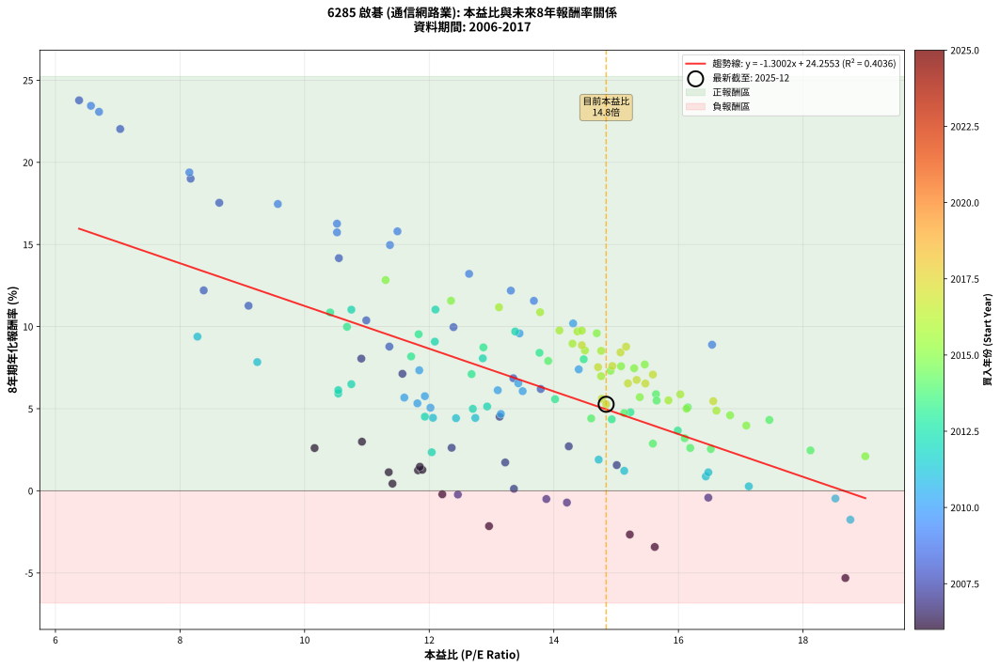
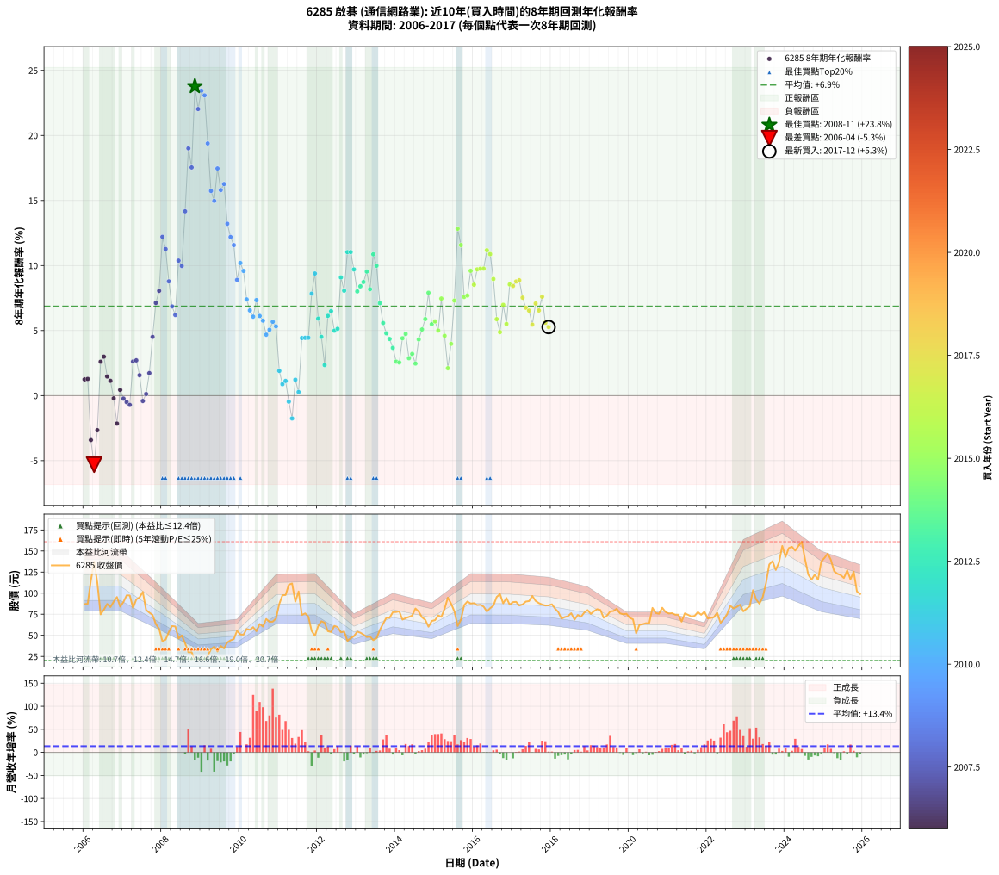

# 6285 啟碁 - 本益比與未來報酬率分析

!!! info "報告資訊"
    - **股票代號**: 6285
    - **公司名稱**: 啟碁
    - **產業別**: 通信網路業
    - **分析期間**: 2006-2017 (144 個數據點)
    - **資料來源**: Type 12 (ShowMonthlyK_ChartFlow) 月收盤價與本益比
    - **報酬率口徑**: 含現金股利 (簡化: 年度合計，假設每年7/1入帳)
    - **報告生成時間**: 2026-01-04 08:51:19 CST

## 📈 視覺化圖表

### 圖表1: 本益比 vs 未來報酬率關係

*圖表1：6285 啟碁 本益比與8年期未來報酬率關係 (2006-2017)*

### 圖表2: 歷年買入時點的8年期實際報酬率

*圖表2：6285 啟碁 歷年買入時點的8年期實際報酬率 (2006-2017)*

## 📍 買點訊號說明

本報告提供兩種買點提示訊號（顯示於圖表2的股價子圖中）：

### ▲ 小綠色三角形（回測驗證）
- **計算方式**: 使用全部歷史資料計算本益比第25百分位數
- **用途**: 事後驗證，顯示歷史上哪些時點確實為低估區
- **限制**: 當下無法判斷，僅供回測參考
- **特性**: 後見之明（Look-Ahead Bias）

### ▲ 小橘色三角形（即時訊號）
- **計算方式**: 使用截至當月的過去5年資料計算本益比第25百分位數
- **用途**: 實際投資決策，當時即可判斷
- **優勢**: 可操作性強，符合實務需求
- **特性**: 無後見之明，滾動窗口計算

!!! tip "如何使用兩種訊號"
    - **綠色▲** 幫助理解歷史估值機會，驗證策略有效性
    - **橘色▲** 可作為實際買進參考，但仍需搭配基本面分析
    - 兩種訊號重疊時，表示即時判斷與事後驗證一致，信心度較高
    - 僅有綠色▲時，表示當時無法判斷（需要未來資料才能確認）
    - 僅有橘色▲時，表示即時判斷為買點，但事後可能不是最佳時機

## 📊 估值分析摘要

| 指標 | 數值 |
|:---:|:---:|
| **目前本益比** (2017-12) | **14.84 倍** |
| **歷史平均本益比** | 13.38 倍 |
| **估值水準** | 🟡 合理範圍 |
| **預期8年年化報酬率** | **+4.96%** |
| **歷史平均報酬率** | +6.86% |
| **相關係數 (R²)** | 0.4036 |
| **趨勢線斜率** | -1.3002 |

!!! abstract "核心洞察"
    目前本益比接近歷史平均，預期報酬率符合長期趨勢

    根據歷史數據回測，6285 啟碁 在目前本益比 **14.8倍** 的估值水準下，
    預期未來8年年化報酬率約為 **+5.0%**。

    **重要提醒**: 本分析基於歷史數據統計，實際報酬率會受到公司基本面變化、產業趨勢、
    總體經濟環境等多重因素影響。R² = 0.40 表示本益比可解釋約 40.4% 的報酬率變異。

## 📈 歷史估值統計

### 最佳買點 (最高報酬率)

| 項目 | 數值 |
|:---:|:---:|
| 起始時間 | 2008-11 |
| 當時本益比 | 6.38 倍 |
| 起始價格 | 21.0 元 |
| 8年後價格 | 94.3 元 |
| **8年年化報酬率** | **+23.78%** |

### 最差買點 (最低報酬率)

| 項目 | 數值 |
|:---:|:---:|
| 起始時間 | 2006-04 |
| 當時本益比 | 18.68 倍 |
| 起始價格 | 137.5 元 |
| 8年後價格 | 70.4 元 |
| **8年年化報酬率** | **-5.31%** |

## 🎯 投資啟示

### 本益比與報酬率關係

趨勢線方程式: **y = -1.3002x + 24.2553**

!!! warning "強負相關"
    本益比與未來報酬率呈現強負相關。在高本益比時期買入，未來報酬率顯著較低；
    在低本益比時期買入，未來報酬率顯著較高。**估值紀律至關重要**。

### 估值區間建議

基於歷史數據分析:

- **🟢 低估區** (P/E < 10.7): 預期報酬率較高，可考慮增加持股
- **🟡 合理區** (P/E 10.7-16.1): 預期報酬率符合長期趨勢，正常持有
- **🔴 高估區** (P/E > 16.1): 預期報酬率較低，可考慮減碼或觀望

!!! danger "風險提示"
    - 過去表現不代表未來結果
    - 本分析假設公司基本面無重大結構性變化
    - 產業環境劇變可能使歷史規律失效
    - 應結合公司財報、產業趨勢、總體經濟等多重因素綜合判斷

!!! success "長期投資觀點"
    歷史數據顯示，在合理或低估的估值水準買入並長期持有，
    往往能獲得較佳的投資報酬。**耐心等待好價格**是價值投資的核心原則。

## 📊 數據品質

- **資料來源**: GoodInfo.tw Type 12 (ShowMonthlyK_ChartFlow)
- **資料頻率**: 月度收盤價與本益比
- **回測期間**: 2006-2017
- **數據點數量**: 144 個 (每個點代表一次8年期回測)

### 計算方法說明

1. **8年期年化報酬率**:
   - 對每個歷史時點，計算其後8年的實際投資報酬率
   - 期末價值(不含股利): 期末價格
   - 期末價值(含現金股利): 期末價格 + 持有期間內的現金股利合計 (簡化: 年度合計，假設每年7/1入帳)
   - 公式: 年化報酬率 = [(期末價值/期初價格)^(1/年數) - 1] × 100%

2. **本益比 (P/E Ratio)**:
   - 使用當時的月收盤價與EPS計算
   - 資料來源: Type 12 月度河流圖本益比數據

3. **趨勢線 (Linear Regression)**:
   - 使用最小平方法擬合線性趨勢線
   - R²值衡量本益比對報酬率的解釋能力

---

*本報告由 Stock Analysis System v1.9.0 自動生成*
*數據更新時間: 2026-01-04 08:51:19 CST*

## 📋 月度回測明細表

（每一列對應時間線圖中的一個買入點；可用來對照 SVG 圖上的每個點。）

| 買入月份 | 賣出月份 | 回測期限_年 | 實際持有年數 | 買入本益比_倍 | 買入收盤價_元 | 賣出收盤價_元 | 現金股利合計_元 | 總報酬率_pct | 年化報酬率_pct |
| --- | --- | --- | --- | --- | --- | --- | --- | --- | --- |
| 2006-01 | 2014-01 | 8 | 8.000 | 11.82 | 87.00 | 77.60 | 18.48 | +10.43 | +1.25 |
| 2006-02 | 2014-02 | 8 | 8.000 | 11.89 | 87.50 | 78.40 | 18.48 | +10.72 | +1.28 |
| 2006-03 | 2014-03 | 8 | 8.000 | 15.62 | 115.00 | 68.60 | 18.48 | -24.28 | -3.42 |
| 2006-04 | 2014-04 | 8 | 8.000 | 18.68 | 137.50 | 70.40 | 18.48 | -35.36 | -5.31 |
| 2006-05 | 2014-05 | 8 | 8.000 | 15.22 | 112.00 | 71.80 | 18.48 | -19.39 | -2.66 |
| 2006-06 | 2014-06 | 8 | 8.000 | 10.16 | 74.80 | 73.40 | 18.48 | +22.83 | +2.60 |
| 2006-07 | 2014-07 | 8 | 8.000 | 10.92 | 80.40 | 81.80 | 19.98 | +26.59 | +2.99 |
| 2006-08 | 2014-08 | 8 | 8.000 | 11.85 | 87.20 | 78.00 | 19.98 | +12.36 | +1.47 |
| 2006-09 | 2014-09 | 8 | 8.000 | 11.35 | 83.50 | 71.40 | 19.98 | +9.44 | +1.13 |
| 2006-10 | 2014-10 | 8 | 8.000 | 12.21 | 89.90 | 68.40 | 19.98 | -1.69 | -0.21 |
| 2006-11 | 2014-11 | 8 | 8.000 | 12.96 | 95.40 | 60.20 | 19.98 | -15.95 | -2.15 |
| 2006-12 | 2014-12 | 8 | 8.000 | 11.41 | 84.00 | 67.00 | 19.98 | +3.55 | +0.44 |
| 2007-01 | 2015-01 | 8 | 8.000 | 12.46 | 89.60 | 68.00 | 19.98 | -1.81 | -0.23 |
| 2007-02 | 2015-02 | 8 | 8.000 | 13.88 | 97.40 | 73.60 | 19.98 | -3.92 | -0.50 |
| 2007-03 | 2015-03 | 8 | 8.000 | 14.21 | 97.30 | 71.90 | 19.98 | -5.57 | -0.71 |
| 2007-04 | 2015-04 | 8 | 8.000 | 12.36 | 82.50 | 81.50 | 19.98 | +23.01 | +2.62 |
| 2007-05 | 2015-05 | 8 | 8.000 | 14.24 | 92.60 | 94.70 | 19.98 | +23.85 | +2.71 |
| 2007-06 | 2015-06 | 8 | 8.000 | 15.01 | 95.00 | 87.60 | 19.98 | +13.24 | +1.57 |
| 2007-07 | 2015-07 | 8 | 8.000 | 16.48 | 101.50 | 78.50 | 19.69 | -3.26 | -0.41 |
| 2007-08 | 2015-08 | 8 | 8.000 | 13.36 | 80.00 | 61.10 | 19.69 | +0.99 | +0.12 |
| 2007-09 | 2015-09 | 8 | 8.000 | 13.22 | 76.90 | 68.50 | 19.69 | +14.68 | +1.73 |
| 2007-10 | 2015-10 | 8 | 8.000 | 13.13 | 74.10 | 85.80 | 19.69 | +42.36 | +4.51 |
| 2007-11 | 2015-11 | 8 | 8.000 | 11.57 | 63.30 | 90.10 | 19.69 | +73.44 | +7.13 |
| 2007-12 | 2015-12 | 8 | 8.000 | 10.91 | 57.80 | 87.70 | 19.69 | +85.79 | +8.05 |
| 2008-01 | 2016-01 | 8 | 8.000 | 8.38 | 42.90 | 88.10 | 19.69 | +151.25 | +12.21 |
| 2008-02 | 2016-02 | 8 | 8.000 | 9.10 | 44.90 | 85.80 | 19.69 | +134.94 | +11.27 |
| 2008-03 | 2016-03 | 8 | 8.000 | 11.36 | 54.00 | 86.20 | 19.69 | +96.09 | +8.78 |
| 2008-04 | 2016-04 | 8 | 8.000 | 13.35 | 61.00 | 84.00 | 19.69 | +69.98 | +6.86 |
| 2008-05 | 2016-05 | 8 | 8.000 | 13.79 | 60.50 | 78.20 | 19.69 | +61.80 | +6.20 |
| 2008-06 | 2016-06 | 8 | 8.000 | 10.99 | 46.20 | 82.10 | 19.69 | +120.32 | +10.38 |
| 2008-07 | 2016-07 | 8 | 8.000 | 12.39 | 49.85 | 85.20 | 21.39 | +113.82 | +9.97 |
| 2008-08 | 2016-08 | 8 | 8.000 | 10.55 | 40.50 | 95.50 | 21.39 | +188.61 | +14.17 |
| 2008-09 | 2016-09 | 8 | 8.000 | 8.17 | 29.90 | 98.90 | 21.39 | +302.30 | +19.01 |
| 2008-10 | 2016-10 | 8 | 8.000 | 8.63 | 30.00 | 87.90 | 21.39 | +264.29 | +17.54 |
| 2008-11 | 2016-11 | 8 | 8.000 | 6.38 | 21.00 | 94.30 | 21.39 | +450.90 | +23.78 |
| 2008-12 | 2016-12 | 8 | 8.000 | 7.04 | 21.90 | 86.30 | 21.39 | +391.73 | +22.03 |
| 2009-01 | 2017-01 | 8 | 8.000 | 6.57 | 20.55 | 89.40 | 21.39 | +439.11 | +23.44 |
| 2009-02 | 2017-02 | 8 | 8.000 | 6.70 | 21.10 | 89.70 | 21.39 | +426.48 | +23.08 |
| 2009-03 | 2017-03 | 8 | 8.000 | 8.15 | 25.85 | 85.30 | 21.39 | +312.72 | +19.39 |
| 2009-04 | 2017-04 | 8 | 8.000 | 10.52 | 33.55 | 86.60 | 21.39 | +221.87 | +15.73 |
| 2009-05 | 2017-05 | 8 | 8.000 | 11.37 | 36.50 | 90.00 | 21.39 | +205.17 | +14.97 |
| 2009-06 | 2017-06 | 8 | 8.000 | 9.57 | 30.90 | 90.60 | 21.39 | +262.42 | +17.46 |
| 2009-07 | 2017-07 | 8 | 8.000 | 11.49 | 37.35 | 96.70 | 24.05 | +223.31 | +15.80 |
| 2009-08 | 2017-08 | 8 | 8.000 | 10.52 | 34.40 | 90.80 | 24.05 | +233.88 | +16.26 |
| 2009-09 | 2017-09 | 8 | 8.000 | 12.64 | 41.60 | 88.20 | 24.05 | +169.84 | +13.21 |
| 2009-10 | 2017-10 | 8 | 8.000 | 13.31 | 44.05 | 86.50 | 24.05 | +150.98 | +12.19 |
| 2009-11 | 2017-11 | 8 | 8.000 | 13.68 | 45.55 | 85.30 | 24.05 | +140.08 | +11.57 |
| 2009-12 | 2017-12 | 8 | 8.000 | 16.54 | 55.40 | 85.50 | 24.05 | +97.75 | +8.90 |
| 2010-01 | 2018-01 | 8 | 8.000 | 14.31 | 51.00 | 86.80 | 24.05 | +117.36 | +10.19 |
| 2010-02 | 2018-02 | 8 | 8.000 | 13.45 | 50.80 | 81.60 | 24.05 | +107.98 | +9.59 |
| 2010-03 | 2018-03 | 8 | 8.000 | 14.40 | 57.50 | 77.70 | 24.05 | +76.97 | +7.40 |
| 2010-04 | 2018-04 | 8 | 8.000 | 13.43 | 56.50 | 69.80 | 24.05 | +66.12 | +6.55 |
| 2010-05 | 2018-05 | 8 | 8.000 | 13.50 | 59.70 | 71.60 | 24.05 | +60.23 | +6.07 |
| 2010-06 | 2018-06 | 8 | 8.000 | 11.84 | 54.90 | 72.70 | 24.05 | +76.24 | +7.34 |
| 2010-07 | 2018-07 | 8 | 8.000 | 13.10 | 63.50 | 76.20 | 25.96 | +60.88 | +6.12 |
| 2010-08 | 2018-08 | 8 | 8.000 | 11.93 | 60.40 | 68.60 | 25.96 | +56.56 | +5.76 |
| 2010-09 | 2018-09 | 8 | 8.000 | 13.15 | 69.40 | 74.10 | 25.96 | +44.18 | +4.68 |
| 2010-10 | 2018-10 | 8 | 8.000 | 12.02 | 66.00 | 72.00 | 25.96 | +48.43 | +5.06 |
| 2010-11 | 2018-11 | 8 | 8.000 | 11.60 | 66.20 | 77.00 | 25.96 | +55.53 | +5.68 |
| 2010-12 | 2018-12 | 8 | 8.000 | 11.81 | 69.90 | 79.90 | 25.96 | +51.45 | +5.33 |
| 2011-01 | 2019-01 | 8 | 8.000 | 14.72 | 87.20 | 75.40 | 25.96 | +16.24 | +1.90 |
| 2011-02 | 2019-02 | 8 | 8.000 | 16.44 | 97.50 | 78.60 | 25.96 | +7.24 | +0.88 |
| 2011-03 | 2019-03 | 8 | 8.000 | 16.48 | 97.80 | 81.00 | 25.96 | +9.37 | +1.13 |
| 2011-04 | 2019-04 | 8 | 8.000 | 18.52 | 110.00 | 80.00 | 25.96 | -3.67 | -0.47 |
| 2011-05 | 2019-05 | 8 | 8.000 | 18.76 | 111.50 | 70.80 | 25.96 | -13.22 | -1.76 |
| 2011-06 | 2019-06 | 8 | 8.000 | 15.13 | 90.00 | 73.20 | 25.96 | +10.18 | +1.22 |
| 2011-07 | 2019-07 | 8 | 8.000 | 17.13 | 102.00 | 78.30 | 25.96 | +2.22 | +0.27 |
| 2011-08 | 2019-08 | 8 | 8.000 | 12.43 | 74.10 | 78.80 | 25.96 | +41.38 | +4.42 |
| 2011-09 | 2019-09 | 8 | 8.000 | 12.74 | 76.00 | 81.60 | 25.96 | +41.53 | +4.44 |
| 2011-10 | 2019-10 | 8 | 8.000 | 12.06 | 72.00 | 76.00 | 25.96 | +41.62 | +4.45 |
| 2011-11 | 2019-11 | 8 | 8.000 | 9.24 | 55.20 | 75.00 | 25.96 | +82.91 | +7.84 |
| 2011-12 | 2019-12 | 8 | 8.000 | 8.28 | 49.50 | 75.50 | 25.96 | +104.98 | +9.39 |
| 2012-01 | 2020-01 | 8 | 8.000 | 10.54 | 61.00 | 70.70 | 25.96 | +58.47 | +5.92 |
| 2012-02 | 2020-02 | 8 | 8.000 | 11.93 | 66.70 | 69.00 | 25.96 | +42.37 | +4.52 |
| 2012-03 | 2020-03 | 8 | 8.000 | 12.04 | 65.00 | 52.30 | 25.96 | +20.41 | +2.35 |
| 2012-04 | 2020-04 | 8 | 8.000 | 10.54 | 54.90 | 62.40 | 25.96 | +60.95 | +6.13 |
| 2012-05 | 2020-05 | 8 | 8.000 | 10.75 | 53.90 | 63.20 | 25.96 | +65.42 | +6.49 |
| 2012-06 | 2020-06 | 8 | 8.000 | 12.70 | 61.20 | 64.40 | 25.96 | +47.65 | +4.99 |
| 2012-07 | 2020-07 | 8 | 8.000 | 12.93 | 59.80 | 64.30 | 24.96 | +49.27 | +5.14 |
| 2012-08 | 2020-08 | 8 | 8.000 | 12.09 | 53.60 | 82.50 | 24.96 | +100.49 | +9.08 |
| 2012-09 | 2020-09 | 8 | 8.000 | 12.86 | 54.50 | 76.40 | 24.96 | +85.99 | +8.07 |
| 2012-10 | 2020-10 | 8 | 8.000 | 10.75 | 43.50 | 75.50 | 24.96 | +130.95 | +11.03 |
| 2012-11 | 2020-11 | 8 | 8.000 | 12.10 | 46.60 | 82.70 | 24.96 | +131.04 | +11.04 |
| 2012-12 | 2020-12 | 8 | 8.000 | 13.38 | 48.95 | 77.70 | 24.96 | +109.73 | +9.70 |
| 2013-01 | 2021-01 | 8 | 8.000 | 14.48 | 54.40 | 75.80 | 24.96 | +85.23 | +8.01 |
| 2013-02 | 2021-02 | 8 | 8.000 | 13.77 | 53.10 | 76.30 | 24.96 | +90.71 | +8.40 |
| 2013-03 | 2021-03 | 8 | 8.000 | 12.87 | 50.90 | 74.50 | 24.96 | +95.41 | +8.73 |
| 2013-04 | 2021-04 | 8 | 8.000 | 11.83 | 47.95 | 74.40 | 24.96 | +107.23 | +9.54 |
| 2013-05 | 2021-05 | 8 | 8.000 | 11.71 | 48.60 | 66.20 | 24.96 | +87.58 | +8.18 |
| 2013-06 | 2021-06 | 8 | 8.000 | 10.41 | 44.25 | 76.00 | 24.96 | +128.17 | +10.86 |
| 2013-07 | 2021-07 | 8 | 8.000 | 10.68 | 46.45 | 74.20 | 25.27 | +114.14 | +9.99 |
| 2013-08 | 2021-08 | 8 | 8.000 | 12.68 | 56.40 | 72.40 | 25.27 | +73.17 | +7.10 |
| 2013-09 | 2021-09 | 8 | 8.000 | 14.02 | 63.70 | 73.10 | 25.27 | +54.43 | +5.58 |
| 2013-10 | 2021-10 | 8 | 8.000 | 15.23 | 70.70 | 77.50 | 25.27 | +45.36 | +4.79 |
| 2013-11 | 2021-11 | 8 | 8.000 | 14.93 | 70.80 | 74.30 | 25.27 | +40.63 | +4.35 |
| 2013-12 | 2021-12 | 8 | 8.000 | 15.99 | 77.40 | 78.00 | 25.27 | +33.42 | +3.67 |
| 2014-01 | 2022-01 | 8 | 8.000 | 16.19 | 77.60 | 70.10 | 25.27 | +22.90 | +2.61 |
| 2014-02 | 2022-02 | 8 | 8.000 | 16.52 | 78.40 | 70.60 | 25.27 | +22.28 | +2.55 |
| 2014-03 | 2022-03 | 8 | 8.000 | 14.60 | 68.60 | 71.60 | 25.27 | +41.21 | +4.41 |
| 2014-04 | 2022-04 | 8 | 8.000 | 15.13 | 70.40 | 76.70 | 25.27 | +44.84 | +4.74 |
| 2014-05 | 2022-05 | 8 | 8.000 | 15.59 | 71.80 | 64.80 | 25.27 | +25.44 | +2.87 |
| 2014-06 | 2022-06 | 8 | 8.000 | 16.10 | 73.40 | 69.20 | 25.27 | +28.70 | +3.20 |
| 2014-07 | 2022-07 | 8 | 8.000 | 18.12 | 81.80 | 75.00 | 24.37 | +21.48 | +2.46 |
| 2014-08 | 2022-08 | 8 | 8.000 | 17.46 | 78.00 | 85.00 | 24.37 | +40.22 | +4.32 |
| 2014-09 | 2022-09 | 8 | 8.000 | 16.15 | 71.40 | 81.80 | 24.37 | +48.70 | +5.08 |
| 2014-10 | 2022-10 | 8 | 8.000 | 15.64 | 68.40 | 83.70 | 24.37 | +58.00 | +5.88 |
| 2014-11 | 2022-11 | 8 | 8.000 | 13.91 | 60.20 | 86.30 | 24.37 | +83.84 | +7.91 |
| 2014-12 | 2022-12 | 8 | 8.000 | 15.65 | 67.00 | 78.40 | 24.37 | +53.39 | +5.49 |
| 2015-01 | 2023-01 | 8 | 8.000 | 15.38 | 68.00 | 81.60 | 24.37 | +55.84 | +5.70 |
| 2015-02 | 2023-02 | 8 | 8.000 | 16.13 | 73.60 | 84.40 | 24.37 | +47.78 | +5.00 |
| 2015-03 | 2023-03 | 8 | 8.000 | 15.29 | 71.90 | 103.50 | 24.37 | +77.84 | +7.46 |
| 2015-04 | 2023-04 | 8 | 8.000 | 16.83 | 81.50 | 92.40 | 24.37 | +43.27 | +4.60 |
| 2015-05 | 2023-05 | 8 | 8.000 | 19.00 | 94.70 | 87.50 | 24.37 | +18.13 | +2.10 |
| 2015-06 | 2023-06 | 8 | 8.000 | 17.09 | 87.60 | 95.30 | 24.37 | +36.61 | +3.98 |
| 2015-07 | 2023-07 | 8 | 8.000 | 14.91 | 78.50 | 111.50 | 26.51 | +75.81 | +7.31 |
| 2015-08 | 2023-08 | 8 | 8.000 | 11.30 | 61.10 | 134.00 | 26.51 | +162.70 | +12.83 |
| 2015-09 | 2023-09 | 8 | 8.000 | 12.35 | 68.50 | 138.00 | 26.51 | +140.16 | +11.57 |
| 2015-10 | 2023-10 | 8 | 8.000 | 15.08 | 85.80 | 127.50 | 26.51 | +79.50 | +7.59 |
| 2015-11 | 2023-11 | 8 | 8.000 | 15.46 | 90.10 | 136.50 | 26.51 | +80.92 | +7.69 |
| 2015-12 | 2023-12 | 8 | 8.000 | 14.69 | 87.70 | 156.00 | 26.51 | +108.11 | +9.59 |
| 2016-01 | 2024-01 | 8 | 8.000 | 14.76 | 88.10 | 143.00 | 26.51 | +92.41 | +8.52 |
| 2016-02 | 2024-02 | 8 | 8.000 | 14.38 | 85.80 | 153.50 | 26.51 | +109.80 | +9.70 |
| 2016-03 | 2024-03 | 8 | 8.000 | 14.45 | 86.20 | 155.00 | 26.51 | +110.57 | +9.75 |
| 2016-04 | 2024-04 | 8 | 8.000 | 14.09 | 84.00 | 150.50 | 26.51 | +110.73 | +9.77 |
| 2016-05 | 2024-05 | 8 | 8.000 | 13.12 | 78.20 | 156.00 | 26.51 | +133.39 | +11.18 |
| 2016-06 | 2024-06 | 8 | 8.000 | 13.78 | 82.10 | 161.00 | 26.51 | +128.39 | +10.88 |
| 2016-07 | 2024-07 | 8 | 8.000 | 14.30 | 85.20 | 140.50 | 28.81 | +98.72 | +8.96 |
| 2016-08 | 2024-08 | 8 | 8.000 | 16.03 | 95.50 | 122.00 | 28.81 | +57.91 | +5.88 |
| 2016-09 | 2024-09 | 8 | 8.000 | 16.61 | 98.90 | 116.00 | 28.81 | +46.42 | +4.88 |
| 2016-10 | 2024-10 | 8 | 8.000 | 14.76 | 87.90 | 122.00 | 28.81 | +71.57 | +6.98 |
| 2016-11 | 2024-11 | 8 | 8.000 | 15.84 | 94.30 | 116.00 | 28.81 | +53.56 | +5.51 |
| 2016-12 | 2024-12 | 8 | 8.000 | 14.50 | 86.30 | 137.50 | 28.81 | +92.71 | +8.55 |
| 2017-01 | 2025-01 | 8 | 8.000 | 15.07 | 89.40 | 142.00 | 28.81 | +91.06 | +8.43 |
| 2017-02 | 2025-02 | 8 | 8.000 | 15.16 | 89.70 | 147.00 | 28.81 | +95.99 | +8.78 |
| 2017-03 | 2025-03 | 8 | 8.000 | 14.45 | 85.30 | 139.50 | 28.81 | +97.31 | +8.87 |
| 2017-04 | 2025-04 | 8 | 8.000 | 14.71 | 86.60 | 126.00 | 28.81 | +78.76 | +7.53 |
| 2017-05 | 2025-05 | 8 | 8.000 | 15.33 | 90.00 | 123.00 | 28.81 | +68.67 | +6.75 |
| 2017-06 | 2025-06 | 8 | 8.000 | 15.47 | 90.60 | 121.50 | 28.81 | +65.90 | +6.53 |
| 2017-07 | 2025-07 | 8 | 8.000 | 16.56 | 96.70 | 118.00 | 29.94 | +52.99 | +5.46 |
| 2017-08 | 2025-08 | 8 | 8.000 | 15.59 | 90.80 | 127.00 | 29.94 | +72.84 | +7.08 |
| 2017-09 | 2025-09 | 8 | 8.000 | 15.19 | 88.20 | 116.50 | 29.94 | +66.03 | +6.54 |
| 2017-10 | 2025-10 | 8 | 8.000 | 14.94 | 86.50 | 125.50 | 29.94 | +79.70 | +7.60 |
| 2017-11 | 2025-11 | 8 | 8.000 | 14.77 | 85.30 | 102.00 | 29.94 | +54.68 | +5.60 |
| 2017-12 | 2025-12 | 8 | 8.000 | 14.84 | 85.50 | 99.00 | 29.94 | +50.81 | +5.27 |
