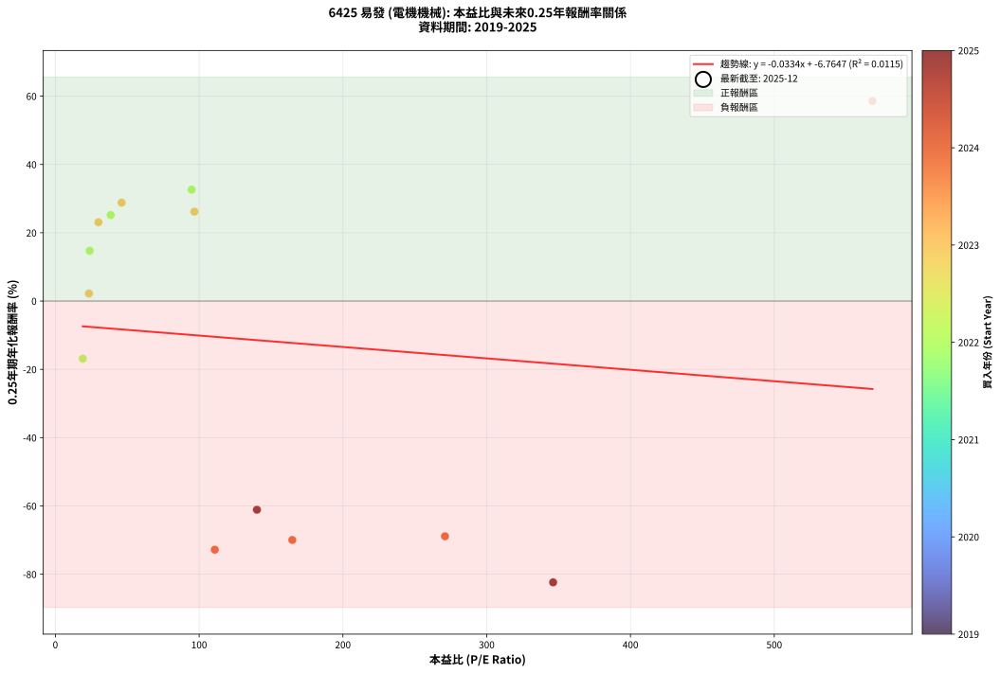
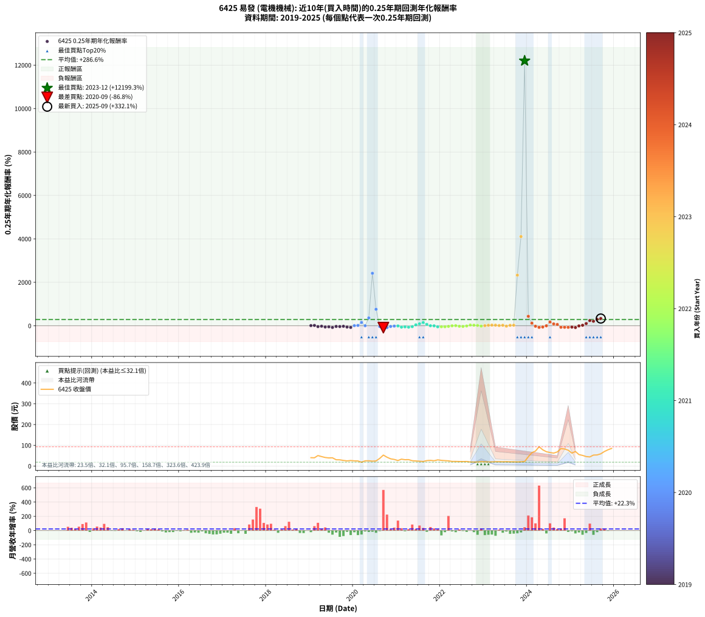

# 6425 易發 - 本益比與未來報酬率分析

!!! info "報告資訊"
    - **股票代號**: 6425
    - **公司名稱**: 易發
    - **產業別**: 電機機械
    - **分析期間**: 2019-2025 (81 個數據點)
    - **資料來源**: Type 12 (ShowMonthlyK_ChartFlow) 月收盤價與本益比
    - **報酬率口徑**: 含現金股利 (簡化: 年度合計，假設每年7/1入帳)
    - **報告生成時間**: 2026-01-10 21:16:21 CST

## 📈 視覺化圖表

### 圖表1: 本益比 vs 未來報酬率關係

*圖表1：6425 易發 本益比與0.25年期未來報酬率關係 (2019-2025)*

### 圖表2: 歷年買入時點的0.25年期實際報酬率

*圖表2：6425 易發 歷年買入時點的0.25年期實際報酬率 (2019-2025)*

## 📍 買點訊號說明

本報告提供兩種買點提示訊號（顯示於圖表2的股價子圖中）：

### ▲ 小綠色三角形（回測驗證）
- **計算方式**: 使用全部歷史資料計算本益比第25百分位數
- **用途**: 事後驗證，顯示歷史上哪些時點確實為低估區
- **限制**: 當下無法判斷，僅供回測參考
- **特性**: 後見之明（Look-Ahead Bias）

### ▲ 小橘色三角形（即時訊號）
- **計算方式**: 使用截至當月的過去5年資料計算本益比第25百分位數
- **用途**: 實際投資決策，當時即可判斷
- **優勢**: 可操作性強，符合實務需求
- **特性**: 無後見之明，滾動窗口計算

!!! tip "如何使用兩種訊號"
    - **綠色▲** 幫助理解歷史估值機會，驗證策略有效性
    - **橘色▲** 可作為實際買進參考，但仍需搭配基本面分析
    - 兩種訊號重疊時，表示即時判斷與事後驗證一致，信心度較高
    - 僅有綠色▲時，表示當時無法判斷（需要未來資料才能確認）
    - 僅有橘色▲時，表示即時判斷為買點，但事後可能不是最佳時機

## 📊 估值分析摘要

| 指標 | 數值 |
|:---:|:---:|
| **目前本益比** (2025-09) | **nan 倍** |
| **歷史平均本益比** | 140.98 倍 |
| **估值水準** | 🟡 合理範圍 |
| **預期0.25年年化報酬率** | **+nan%** |
| **歷史平均報酬率** | +286.62% |
| **相關係數 (R²)** | 0.0115 |
| **趨勢線斜率** | -0.0334 |

!!! abstract "核心洞察"
    目前本益比接近歷史平均，預期報酬率符合長期趨勢

    根據歷史數據回測，6425 易發 在目前本益比 **nan倍** 的估值水準下，
    預期未來0.25年年化報酬率約為 **+nan%**。

    **重要提醒**: 本分析基於歷史數據統計，實際報酬率會受到公司基本面變化、產業趨勢、
    總體經濟環境等多重因素影響。R² = 0.01 表示本益比可解釋約 1.1% 的報酬率變異。

## 📈 歷史估值統計

### 最佳買點 (最高報酬率)

| 項目 | 數值 |
|:---:|:---:|
| 起始時間 | 2023-12 |
| 當時本益比 | nan 倍 |
| 起始價格 | 21.8 元 |
| 0.25年後價格 | 72.3 元 |
| **0.25年年化報酬率** | **+12199.27%** |

### 最差買點 (最低報酬率)

| 項目 | 數值 |
|:---:|:---:|
| 起始時間 | 2020-09 |
| 當時本益比 | nan 倍 |
| 起始價格 | 53.0 元 |
| 0.25年後價格 | 32.0 元 |
| **0.25年年化報酬率** | **-86.80%** |

## 🎯 投資啟示

### 本益比與報酬率關係

趨勢線方程式: **y = -0.0334x + -6.7647**

!!! note "負相關"
    本益比與未來報酬率呈現負相關。較低的本益比通常帶來較高的未來報酬率，
    但相關性不算非常強。**估值仍是重要參考指標之一**。

### 估值區間建議

基於歷史數據分析:

- **🟢 低估區** (P/E < 112.8): 預期報酬率較高，可考慮增加持股
- **🟡 合理區** (P/E 112.8-169.2): 預期報酬率符合長期趨勢，正常持有
- **🔴 高估區** (P/E > 169.2): 預期報酬率較低，可考慮減碼或觀望

!!! danger "風險提示"
    - 過去表現不代表未來結果
    - 本分析假設公司基本面無重大結構性變化
    - 產業環境劇變可能使歷史規律失效
    - 應結合公司財報、產業趨勢、總體經濟等多重因素綜合判斷

!!! success "長期投資觀點"
    歷史數據顯示，在合理或低估的估值水準買入並長期持有，
    往往能獲得較佳的投資報酬。**耐心等待好價格**是價值投資的核心原則。

## 📊 數據品質

- **資料來源**: GoodInfo.tw Type 12 (ShowMonthlyK_ChartFlow)
- **資料頻率**: 月度收盤價與本益比
- **回測期間**: 2019-2025
- **數據點數量**: 81 個 (每個點代表一次0.25年期回測)

### 計算方法說明

1. **0.25年期年化報酬率**:
   - 對每個歷史時點，計算其後0.25年的實際投資報酬率
   - 期末價值(不含股利): 期末價格
   - 期末價值(含現金股利): 期末價格 + 持有期間內的現金股利合計 (簡化: 年度合計，假設每年7/1入帳)
   - 公式: 年化報酬率 = [(期末價值/期初價格)^(1/年數) - 1] × 100%

2. **本益比 (P/E Ratio)**:
   - 使用當時的月收盤價與EPS計算
   - 資料來源: Type 12 月度河流圖本益比數據

3. **趨勢線 (Linear Regression)**:
   - 使用最小平方法擬合線性趨勢線
   - R²值衡量本益比對報酬率的解釋能力

---

*本報告由 Stock Analysis System v1.9.0 自動生成*
*數據更新時間: 2026-01-10 21:16:21 CST*

## 📋 月度回測明細表

（每一列對應時間線圖中的一個買入點；可用來對照 SVG 圖上的每個點。）

| 買入月份 | 賣出月份 | 回測期限_年 | 實際持有年數 | 買入本益比_倍 | 買入收盤價_元 | 賣出收盤價_元 | 現金股利合計_元 | 總報酬率_pct | 年化報酬率_pct |
| --- | --- | --- | --- | --- | --- | --- | --- | --- | --- |
| 2019-01 | 2019-05 | 0.25 | 0.329 |  | 40.50 | 41.35 | 0.00 | +2.10 | +6.53 |
| 2019-02 | 2019-05 | 0.25 | 0.246 |  | 39.95 | 41.35 | 0.00 | +3.50 | +15.00 |
| 2019-03 | 2019-07 | 0.25 | 0.334 |  | 50.70 | 39.95 | 3.00 | -15.29 | -39.14 |
| 2019-04 | 2019-07 | 0.25 | 0.249 |  | 45.75 | 39.95 | 3.00 | -6.12 | -22.39 |
| 2019-05 | 2019-08 | 0.25 | 0.252 |  | 41.35 | 30.50 | 3.00 | -18.98 | -56.65 |
| 2019-06 | 2019-09 | 0.25 | 0.252 |  | 39.30 | 30.10 | 3.00 | -15.78 | -49.42 |
| 2019-07 | 2019-10 | 0.25 | 0.252 |  | 39.95 | 27.20 | 0.00 | -31.91 | -78.26 |
| 2019-08 | 2019-12 | 0.25 | 0.334 |  | 30.50 | 26.80 | 0.00 | -12.13 | -32.10 |
| 2019-09 | 2019-12 | 0.25 | 0.249 |  | 30.10 | 26.80 | 0.00 | -10.96 | -37.25 |
| 2019-10 | 2020-01 | 0.25 | 0.252 |  | 27.20 | 25.20 | 0.00 | -7.35 | -26.16 |
| 2019-11 | 2020-03 | 0.25 | 0.331 |  | 25.00 | 18.65 | 0.00 | -25.40 | -58.71 |
| 2019-12 | 2020-03 | 0.25 | 0.249 |  | 26.80 | 18.65 | 0.00 | -30.41 | -76.66 |
| 2020-01 | 2020-05 | 0.25 | 0.331 |  | 25.20 | 25.55 | 0.00 | +1.39 | +4.25 |
| 2020-02 | 2020-05 | 0.25 | 0.249 |  | 24.70 | 25.55 | 0.00 | +3.44 | +14.55 |
| 2020-03 | 2020-07 | 0.25 | 0.334 |  | 18.65 | 24.85 | 0.51 | +35.99 | +151.04 |
| 2020-04 | 2020-07 | 0.25 | 0.249 |  | 25.40 | 24.85 | 0.51 | -0.15 | -0.58 |
| 2020-05 | 2020-08 | 0.25 | 0.252 |  | 25.55 | 37.00 | 0.51 | +46.82 | +359.39 |
| 2020-06 | 2020-09 | 0.25 | 0.252 |  | 23.75 | 53.00 | 0.51 | +125.32 | +2415.57 |
| 2020-07 | 2020-10 | 0.25 | 0.252 |  | 24.85 | 42.70 | 0.00 | +71.83 | +757.78 |
| 2020-08 | 2020-12 | 0.25 | 0.334 |  | 37.00 | 32.00 | 0.00 | -13.51 | -35.25 |
| 2020-09 | 2020-12 | 0.25 | 0.249 |  | 53.00 | 32.00 | 0.00 | -39.62 | -86.80 |
| 2020-10 | 2021-01 | 0.25 | 0.252 |  | 42.70 | 26.80 | 0.00 | -37.24 | -84.26 |
| 2020-11 | 2021-03 | 0.25 | 0.329 |  | 35.00 | 30.60 | 0.00 | -12.57 | -33.56 |
| 2020-12 | 2021-03 | 0.25 | 0.246 |  | 32.00 | 30.60 | 0.00 | -4.37 | -16.60 |
| 2021-01 | 2021-05 | 0.25 | 0.329 |  | 26.80 | 25.95 | 0.00 | -3.17 | -9.34 |
| 2021-02 | 2021-05 | 0.25 | 0.246 |  | 33.35 | 25.95 | 0.00 | -22.19 | -63.87 |
| 2021-03 | 2021-07 | 0.25 | 0.334 |  | 30.60 | 23.50 | 0.50 | -21.57 | -51.68 |
| 2021-04 | 2021-07 | 0.25 | 0.249 |  | 31.15 | 23.50 | 0.50 | -22.95 | -64.89 |
| 2021-05 | 2021-08 | 0.25 | 0.252 |  | 25.95 | 22.15 | 0.50 | -12.72 | -41.72 |
| 2021-06 | 2021-09 | 0.25 | 0.252 |  | 24.70 | 26.50 | 0.50 | +9.31 | +42.40 |
| 2021-07 | 2021-10 | 0.25 | 0.252 |  | 23.50 | 27.60 | 0.00 | +17.45 | +89.36 |
| 2021-08 | 2021-12 | 0.25 | 0.334 |  | 22.15 | 29.95 | 0.00 | +35.21 | +146.75 |
| 2021-09 | 2021-12 | 0.25 | 0.249 |  | 26.50 | 29.95 | 0.00 | +13.02 | +63.43 |
| 2021-10 | 2022-01 | 0.25 | 0.252 |  | 27.60 | 27.60 | 0.00 | +0.00 | +0.00 |
| 2021-11 | 2022-03 | 0.25 | 0.329 |  | 25.65 | 25.25 | 0.00 | -1.56 | -4.67 |
| 2021-12 | 2022-03 | 0.25 | 0.246 |  | 29.95 | 25.25 | 0.00 | -15.69 | -49.98 |
| 2022-01 | 2022-05 | 0.25 | 0.329 |  | 27.60 | 22.50 | 0.00 | -18.48 | -46.30 |
| 2022-02 | 2022-05 | 0.25 | 0.246 |  | 26.30 | 22.50 | 0.00 | -14.45 | -46.92 |
| 2022-03 | 2022-07 | 0.25 | 0.334 |  | 25.25 | 21.80 | 0.50 | -11.68 | -31.06 |
| 2022-04 | 2022-07 | 0.25 | 0.249 |  | 22.50 | 21.80 | 0.50 | -0.89 | -3.52 |
| 2022-05 | 2022-08 | 0.25 | 0.252 |  | 22.50 | 22.20 | 0.50 | +0.89 | +3.58 |
| 2022-06 | 2022-09 | 0.25 | 0.252 |  | 22.00 | 19.90 | 0.50 | -7.27 | -25.90 |
| 2022-07 | 2022-10 | 0.25 | 0.252 |  | 21.80 | 19.75 | 0.00 | -9.40 | -32.43 |
| 2022-08 | 2022-12 | 0.25 | 0.334 |  | 22.20 | 21.35 | 0.00 | -3.83 | -11.03 |
| 2022-09 | 2022-12 | 0.25 | 0.249 | 94.76 | 19.90 | 21.35 | 0.00 | +7.29 | +32.62 |
| 2022-10 | 2023-01 | 0.25 | 0.252 | 38.47 | 19.75 | 20.90 | 0.00 | +5.82 | +25.19 |
| 2022-11 | 2023-03 | 0.25 | 0.329 | 23.88 | 19.50 | 20.40 | 0.00 | +4.62 | +14.72 |
| 2022-12 | 2023-03 | 0.25 | 0.246 | 19.06 | 21.35 | 20.40 | 0.00 | -4.45 | -16.87 |
| 2023-01 | 2023-05 | 0.25 | 0.329 | 23.37 | 20.90 | 21.05 | 0.00 | +0.72 | +2.20 |
| 2023-02 | 2023-05 | 0.25 | 0.246 | 29.93 | 20.00 | 21.05 | 0.00 | +5.25 | +23.08 |
| 2023-03 | 2023-07 | 0.25 | 0.334 | 46.10 | 20.40 | 21.20 | 1.00 | +8.82 | +28.81 |
| 2023-04 | 2023-07 | 0.25 | 0.249 | 96.69 | 20.95 | 21.20 | 1.00 | +5.97 | +26.19 |
| 2023-05 | 2023-08 | 0.25 | 0.252 |  | 21.05 | 20.55 | 1.00 | +2.38 | +9.77 |
| 2023-06 | 2023-09 | 0.25 | 0.252 |  | 20.60 | 20.65 | 1.00 | +5.10 | +21.82 |
| 2023-07 | 2023-10 | 0.25 | 0.252 |  | 21.20 | 20.15 | 0.00 | -4.95 | -18.26 |
| 2023-08 | 2023-12 | 0.25 | 0.334 |  | 20.55 | 21.80 | 0.00 | +6.08 | +19.34 |
| 2023-09 | 2023-12 | 0.25 | 0.249 |  | 20.65 | 21.80 | 0.00 | +5.57 | +24.30 |
| 2023-10 | 2024-01 | 0.25 | 0.252 |  | 20.15 | 45.00 | 0.00 | +123.33 | +2328.40 |
| 2023-11 | 2024-03 | 0.25 | 0.331 |  | 20.95 | 72.30 | 0.00 | +245.11 | +4105.97 |
| 2023-12 | 2024-03 | 0.25 | 0.249 |  | 21.80 | 72.30 | 0.00 | +231.65 | +12199.27 |
| 2024-01 | 2024-05 | 0.25 | 0.331 |  | 45.00 | 78.40 | 0.00 | +74.22 | +434.31 |
| 2024-02 | 2024-05 | 0.25 | 0.249 |  | 64.60 | 78.40 | 0.00 | +21.36 | +117.51 |
| 2024-03 | 2024-07 | 0.25 | 0.334 |  | 72.30 | 65.30 | 0.50 | -8.99 | -24.58 |
| 2024-04 | 2024-07 | 0.25 | 0.249 |  | 93.00 | 65.30 | 0.50 | -29.25 | -75.06 |
| 2024-05 | 2024-08 | 0.25 | 0.252 |  | 78.40 | 62.50 | 0.50 | -19.64 | -58.03 |
| 2024-06 | 2024-09 | 0.25 | 0.252 |  | 69.20 | 68.20 | 0.50 | -0.72 | -2.84 |
| 2024-07 | 2024-10 | 0.25 | 0.252 |  | 65.30 | 84.00 | 0.00 | +28.64 | +171.77 |
| 2024-08 | 2024-12 | 0.25 | 0.334 |  | 62.50 | 76.50 | 0.00 | +22.40 | +83.15 |
| 2024-09 | 2024-12 | 0.25 | 0.249 | 568.30 | 68.20 | 76.50 | 0.00 | +12.17 | +58.56 |
| 2024-10 | 2025-01 | 0.25 | 0.252 | 271.00 | 84.00 | 62.60 | 0.00 | -25.48 | -68.88 |
| 2024-11 | 2025-03 | 0.25 | 0.329 | 164.80 | 82.40 | 55.50 | 0.00 | -32.65 | -69.97 |
| 2024-12 | 2025-03 | 0.25 | 0.246 | 110.90 | 76.50 | 55.50 | 0.00 | -27.45 | -72.81 |
| 2025-01 | 2025-05 | 0.25 | 0.329 | 140.20 | 62.60 | 45.90 | 0.00 | -26.68 | -61.11 |
| 2025-02 | 2025-05 | 0.25 | 0.246 | 346.20 | 70.40 | 45.90 | 0.00 | -34.80 | -82.38 |
| 2025-03 | 2025-07 | 0.25 | 0.334 |  | 55.50 | 53.00 | 1.00 | -2.70 | -7.87 |
| 2025-04 | 2025-07 | 0.25 | 0.249 |  | 51.40 | 53.00 | 1.00 | +5.06 | +21.92 |
| 2025-05 | 2025-08 | 0.25 | 0.252 |  | 45.90 | 53.70 | 1.00 | +19.18 | +100.67 |
| 2025-06 | 2025-09 | 0.25 | 0.252 |  | 44.20 | 59.10 | 1.00 | +35.98 | +238.75 |
| 2025-07 | 2025-10 | 0.25 | 0.252 |  | 53.00 | 70.20 | 0.00 | +32.45 | +205.21 |
| 2025-08 | 2025-12 | 0.25 | 0.334 |  | 53.70 | 85.10 | 0.00 | +58.47 | +296.86 |
| 2025-09 | 2025-12 | 0.25 | 0.249 |  | 59.10 | 85.10 | 0.00 | +43.99 | +332.06 |
