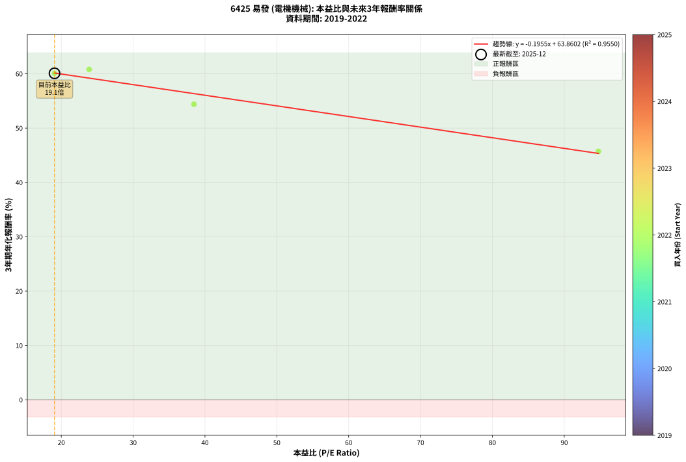
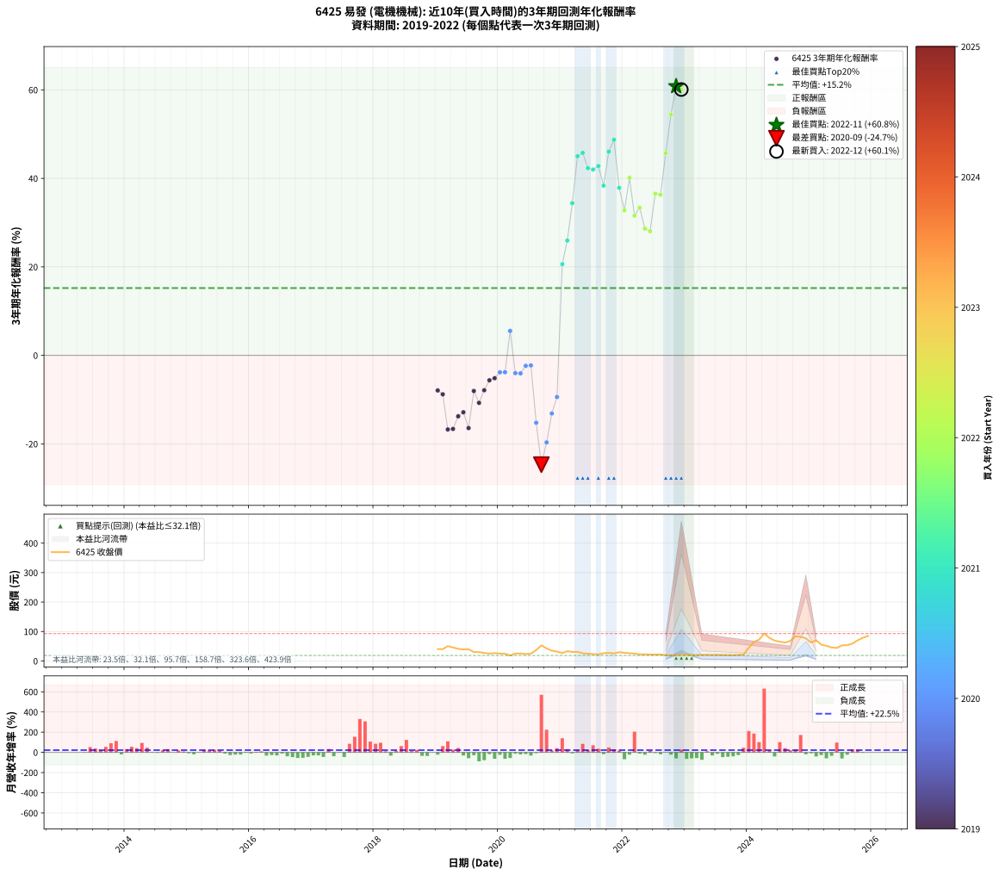

# 6425 易發 - 本益比與未來報酬率分析

!!! info "報告資訊"
    - **股票代號**: 6425
    - **公司名稱**: 易發
    - **產業別**: 電機機械
    - **分析期間**: 2019-2022 (48 個數據點)
    - **資料來源**: Type 12 (ShowMonthlyK_ChartFlow) 月收盤價與本益比
    - **報酬率口徑**: 含現金股利 (簡化: 年度合計，假設每年7/1入帳)
    - **報告生成時間**: 2026-01-10 21:16:31 CST

## 📈 視覺化圖表

### 圖表1: 本益比 vs 未來報酬率關係

*圖表1：6425 易發 本益比與3年期未來報酬率關係 (2019-2022)*

### 圖表2: 歷年買入時點的3年期實際報酬率

*圖表2：6425 易發 歷年買入時點的3年期實際報酬率 (2019-2022)*

## 📍 買點訊號說明

本報告提供兩種買點提示訊號（顯示於圖表2的股價子圖中）：

### ▲ 小綠色三角形（回測驗證）
- **計算方式**: 使用全部歷史資料計算本益比第25百分位數
- **用途**: 事後驗證，顯示歷史上哪些時點確實為低估區
- **限制**: 當下無法判斷，僅供回測參考
- **特性**: 後見之明（Look-Ahead Bias）

### ▲ 小橘色三角形（即時訊號）
- **計算方式**: 使用截至當月的過去5年資料計算本益比第25百分位數
- **用途**: 實際投資決策，當時即可判斷
- **優勢**: 可操作性強，符合實務需求
- **特性**: 無後見之明，滾動窗口計算

!!! tip "如何使用兩種訊號"
    - **綠色▲** 幫助理解歷史估值機會，驗證策略有效性
    - **橘色▲** 可作為實際買進參考，但仍需搭配基本面分析
    - 兩種訊號重疊時，表示即時判斷與事後驗證一致，信心度較高
    - 僅有綠色▲時，表示當時無法判斷（需要未來資料才能確認）
    - 僅有橘色▲時，表示即時判斷為買點，但事後可能不是最佳時機

## 📊 估值分析摘要

| 指標 | 數值 |
|:---:|:---:|
| **目前本益比** (2022-12) | **19.06 倍** |
| **歷史平均本益比** | 44.04 倍 |
| **估值水準** | 🟢 相對低估 |
| **預期3年年化報酬率** | **+60.13%** |
| **歷史平均報酬率** | +15.22% |
| **相關係數 (R²)** | 0.9550 |
| **趨勢線斜率** | -0.1955 |

!!! abstract "核心洞察"
    目前本益比顯著低於歷史平均，預期未來報酬率可能較高

    根據歷史數據回測，6425 易發 在目前本益比 **19.1倍** 的估值水準下，
    預期未來3年年化報酬率約為 **+60.1%**。

    **重要提醒**: 本分析基於歷史數據統計，實際報酬率會受到公司基本面變化、產業趨勢、
    總體經濟環境等多重因素影響。R² = 0.96 表示本益比可解釋約 95.5% 的報酬率變異。

## 📈 歷史估值統計

### 最佳買點 (最高報酬率)

| 項目 | 數值 |
|:---:|:---:|
| 起始時間 | 2022-11 |
| 當時本益比 | 23.88 倍 |
| 起始價格 | 19.5 元 |
| 3年後價格 | 78.6 元 |
| **3年年化報酬率** | **+60.80%** |

### 最差買點 (最低報酬率)

| 項目 | 數值 |
|:---:|:---:|
| 起始時間 | 2020-09 |
| 當時本益比 | nan 倍 |
| 起始價格 | 53.0 元 |
| 3年後價格 | 20.6 元 |
| **3年年化報酬率** | **-24.69%** |

## 🎯 投資啟示

### 本益比與報酬率關係

趨勢線方程式: **y = -0.1955x + 63.8602**

!!! note "負相關"
    本益比與未來報酬率呈現負相關。較低的本益比通常帶來較高的未來報酬率，
    但相關性不算非常強。**估值仍是重要參考指標之一**。

### 估值區間建議

基於歷史數據分析:

- **🟢 低估區** (P/E < 35.2): 預期報酬率較高，可考慮增加持股
- **🟡 合理區** (P/E 35.2-52.9): 預期報酬率符合長期趨勢，正常持有
- **🔴 高估區** (P/E > 52.9): 預期報酬率較低，可考慮減碼或觀望

!!! danger "風險提示"
    - 過去表現不代表未來結果
    - 本分析假設公司基本面無重大結構性變化
    - 產業環境劇變可能使歷史規律失效
    - 應結合公司財報、產業趨勢、總體經濟等多重因素綜合判斷

!!! success "長期投資觀點"
    歷史數據顯示，在合理或低估的估值水準買入並長期持有，
    往往能獲得較佳的投資報酬。**耐心等待好價格**是價值投資的核心原則。

## 📊 數據品質

- **資料來源**: GoodInfo.tw Type 12 (ShowMonthlyK_ChartFlow)
- **資料頻率**: 月度收盤價與本益比
- **回測期間**: 2019-2022
- **數據點數量**: 48 個 (每個點代表一次3年期回測)

### 計算方法說明

1. **3年期年化報酬率**:
   - 對每個歷史時點，計算其後3年的實際投資報酬率
   - 期末價值(不含股利): 期末價格
   - 期末價值(含現金股利): 期末價格 + 持有期間內的現金股利合計 (簡化: 年度合計，假設每年7/1入帳)
   - 公式: 年化報酬率 = [(期末價值/期初價格)^(1/年數) - 1] × 100%

2. **本益比 (P/E Ratio)**:
   - 使用當時的月收盤價與EPS計算
   - 資料來源: Type 12 月度河流圖本益比數據

3. **趨勢線 (Linear Regression)**:
   - 使用最小平方法擬合線性趨勢線
   - R²值衡量本益比對報酬率的解釋能力

---

*本報告由 Stock Analysis System v1.9.0 自動生成*
*數據更新時間: 2026-01-10 21:16:31 CST*

## 📋 月度回測明細表

（每一列對應時間線圖中的一個買入點；可用來對照 SVG 圖上的每個點。）

| 買入月份 | 賣出月份 | 回測期限_年 | 實際持有年數 | 買入本益比_倍 | 買入收盤價_元 | 賣出收盤價_元 | 現金股利合計_元 | 總報酬率_pct | 年化報酬率_pct |
| --- | --- | --- | --- | --- | --- | --- | --- | --- | --- |
| 2019-01 | 2022-01 | 3 | 3.001 |  | 40.50 | 27.60 | 4.01 | -21.94 | -7.92 |
| 2019-02 | 2022-02 | 3 | 3.001 |  | 39.95 | 26.30 | 4.01 | -24.12 | -8.79 |
| 2019-03 | 2022-03 | 3 | 3.001 |  | 50.70 | 25.25 | 4.01 | -42.28 | -16.74 |
| 2019-04 | 2022-04 | 3 | 3.001 |  | 45.75 | 22.50 | 4.01 | -42.05 | -16.62 |
| 2019-05 | 2022-05 | 3 | 3.001 |  | 41.35 | 22.50 | 4.01 | -35.88 | -13.77 |
| 2019-06 | 2022-06 | 3 | 3.001 |  | 39.30 | 22.00 | 4.01 | -33.81 | -12.85 |
| 2019-07 | 2022-07 | 3 | 3.001 |  | 39.95 | 21.80 | 1.51 | -41.64 | -16.43 |
| 2019-08 | 2022-08 | 3 | 3.001 |  | 30.50 | 22.20 | 1.51 | -22.25 | -8.05 |
| 2019-09 | 2022-09 | 3 | 3.001 |  | 30.10 | 19.90 | 1.51 | -28.86 | -10.73 |
| 2019-10 | 2022-10 | 3 | 3.001 |  | 27.20 | 19.75 | 1.51 | -21.83 | -7.88 |
| 2019-11 | 2022-11 | 3 | 3.001 |  | 25.00 | 19.50 | 1.51 | -15.95 | -5.63 |
| 2019-12 | 2022-12 | 3 | 3.001 |  | 26.80 | 21.35 | 1.51 | -14.69 | -5.16 |
| 2020-01 | 2023-01 | 3 | 3.001 |  | 25.20 | 20.90 | 1.51 | -11.06 | -3.83 |
| 2020-02 | 2023-03 | 3 | 3.080 |  | 24.70 | 20.40 | 1.51 | -11.28 | -3.81 |
| 2020-03 | 2023-03 | 3 | 2.998 |  | 18.65 | 20.40 | 1.51 | +17.50 | +5.53 |
| 2020-04 | 2023-04 | 3 | 2.998 |  | 25.40 | 20.95 | 1.51 | -11.56 | -4.02 |
| 2020-05 | 2023-05 | 3 | 2.998 |  | 25.55 | 21.05 | 1.51 | -11.69 | -4.06 |
| 2020-06 | 2023-06 | 3 | 2.998 |  | 23.75 | 20.60 | 1.51 | -6.89 | -2.35 |
| 2020-07 | 2023-07 | 3 | 2.998 |  | 24.85 | 21.20 | 2.00 | -6.64 | -2.27 |
| 2020-08 | 2023-08 | 3 | 2.998 |  | 37.00 | 20.55 | 2.00 | -39.05 | -15.23 |
| 2020-09 | 2023-09 | 3 | 2.998 |  | 53.00 | 20.65 | 2.00 | -57.26 | -24.69 |
| 2020-10 | 2023-10 | 3 | 2.998 |  | 42.70 | 20.15 | 2.00 | -48.13 | -19.66 |
| 2020-11 | 2023-11 | 3 | 2.998 |  | 35.00 | 20.95 | 2.00 | -34.43 | -13.13 |
| 2020-12 | 2023-12 | 3 | 2.998 |  | 32.00 | 21.80 | 2.00 | -25.62 | -9.40 |
| 2021-01 | 2024-01 | 3 | 2.998 |  | 26.80 | 45.00 | 2.00 | +75.37 | +20.61 |
| 2021-02 | 2024-02 | 3 | 2.998 |  | 33.35 | 64.60 | 2.00 | +99.70 | +25.95 |
| 2021-03 | 2024-03 | 3 | 3.001 |  | 30.60 | 72.30 | 2.00 | +142.81 | +34.40 |
| 2021-04 | 2024-04 | 3 | 3.001 |  | 31.15 | 93.00 | 2.00 | +204.98 | +45.01 |
| 2021-05 | 2024-05 | 3 | 3.001 |  | 25.95 | 78.40 | 2.00 | +209.83 | +45.77 |
| 2021-06 | 2024-06 | 3 | 3.001 |  | 24.70 | 69.20 | 2.00 | +188.26 | +42.31 |
| 2021-07 | 2024-07 | 3 | 3.001 |  | 23.50 | 65.30 | 2.00 | +186.38 | +42.00 |
| 2021-08 | 2024-08 | 3 | 3.001 |  | 22.15 | 62.50 | 2.00 | +191.20 | +42.79 |
| 2021-09 | 2024-09 | 3 | 3.001 |  | 26.50 | 68.20 | 2.00 | +164.91 | +38.36 |
| 2021-10 | 2024-10 | 3 | 3.001 |  | 27.60 | 84.00 | 2.00 | +211.59 | +46.05 |
| 2021-11 | 2024-11 | 3 | 3.001 |  | 25.65 | 82.40 | 2.00 | +229.04 | +48.72 |
| 2021-12 | 2024-12 | 3 | 3.001 |  | 29.95 | 76.50 | 2.00 | +162.10 | +37.87 |
| 2022-01 | 2025-01 | 3 | 3.001 |  | 27.60 | 62.60 | 2.00 | +134.06 | +32.76 |
| 2022-02 | 2025-02 | 3 | 3.001 |  | 26.30 | 70.40 | 2.00 | +175.29 | +40.14 |
| 2022-03 | 2025-03 | 3 | 3.001 |  | 25.25 | 55.50 | 2.00 | +127.72 | +31.56 |
| 2022-04 | 2025-04 | 3 | 3.001 |  | 22.50 | 51.40 | 2.00 | +137.33 | +33.38 |
| 2022-05 | 2025-05 | 3 | 3.001 |  | 22.50 | 45.90 | 2.00 | +112.89 | +28.64 |
| 2022-06 | 2025-06 | 3 | 3.001 |  | 22.00 | 44.20 | 2.00 | +110.00 | +28.05 |
| 2022-07 | 2025-07 | 3 | 3.001 |  | 21.80 | 53.00 | 2.50 | +154.60 | +36.54 |
| 2022-08 | 2025-08 | 3 | 3.001 |  | 22.20 | 53.70 | 2.50 | +153.16 | +36.28 |
| 2022-09 | 2025-09 | 3 | 3.001 | 94.76 | 19.90 | 59.10 | 2.50 | +209.56 | +45.73 |
| 2022-10 | 2025-10 | 3 | 3.001 | 38.47 | 19.75 | 70.20 | 2.50 | +268.11 | +54.39 |
| 2022-11 | 2025-11 | 3 | 3.001 | 23.88 | 19.50 | 78.60 | 2.50 | +315.91 | +60.80 |
| 2022-12 | 2025-12 | 3 | 3.001 | 19.06 | 21.35 | 85.10 | 2.50 | +310.31 | +60.08 |
